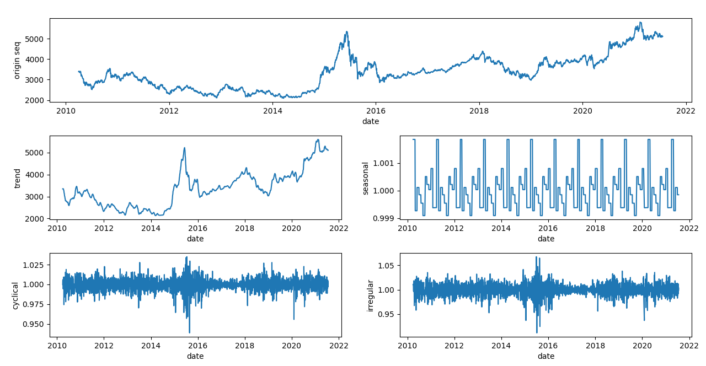

# 第1章初始时间序列
　　正如人们常说的，人生的出场顺序很重要，我们所经历的一切都与时间有着千丝万缕的联系。时间序列就是一门研究时序关系的艺术，通过数据分析揭示隐藏在序列中过去与时间序列分析方法已经发展了很多年，特别是在金融领域有着广泛的应用，也沉淀下未来的关系。
　　来了很多经典的分析方法。比如研究序列线性自相关性的ARIMA模型，研究聚类波动现象的GARCH模型等。近年来，随着大数据、人工智能技术的兴起，为时间序列提供了更加广阔的应用场景。在智能检测、风险控制、趋势预测等领域，时间序列都得到了广泛应用；
　　同时，新技术的产生也为时间序列分析注入了新动力。例如，将深度学习模型应用到时间序列分析，推动了时间序列分析智能化的发展。
　　本章主要介绍时间序列的基本概念，从统计学的角度，引入时间序列分析的基本方法。
## 1.1时间序列的概念
　　在二维空间中，以时间为横轴，另一组数据为纵轴，就可以绘制时间序列。比如每日的气温、人口的变化、股票的价格等。通过时间序列分析，可以研究事物发展的过程，掌握事物发展的规律。
　　时间序列的顺序是由时间唯一决定的（时序性），沿时间轴采集的数据就像一颗颗珠子，通过时间线串联在一起。世界上发生的任何事件都可以描述为时间序列的形式。
　　由于对事物的描述不同，时间序列又可以分为单维时间序列和多维时间序列。比如当研究某只股票时，我们可以只分析股票价格的波动；然而我们可能希望掌握更多的信息，比如买入和卖出的交易金额等，这时候我们就需要采集多个指标做联合分析。
　　对于一段时间序列，前后数据点之间存在一定的关系，这种关系可能是线性的，也可能是非线性的。比如时间序列为{z2}:1,1,··,则任意时刻序列都满足线性时序关系1=22-1;时间序列{z2}:2,4,16,256,65536,··,则任意时刻序列都满足非线性时序关系21=2-1。
## 1.2时间序列的特点
　　时间序列分析是对客观事物发展规律具有连续性的反映，它假定事物过去的发展规律会延伸到未来，通过时序分析，就可以推测未来的发展趋势。一般情况下，客观事物的发展具有以下三个特征。
　　(1)事物的发展是连续变化的，通常情况下，在单位时间内总是以一个较小的变化向前发展。
　　(2)过去发生的规律在未来也会延续，过去与现在的关系，也会延伸到现在与未来。
　　(3)在某些特殊条件下，会出现跳跃式变化，但不会一直持续这种变化趋势。
　　这就决定了时间序列分析对于短期、平稳变化的预测比较准确，对于长期、跳变的预测会显著偏离实际值。
　　时间序列的波动特性是隐藏在序列中规律性与不规律性相互作用的结果。
一个时间序列的典型特征包括以下四种：
　　(1)趋势：趋势是时间序列在某一方向上的持续运动，现象是在较长时期内受某种根本性因素作用而形成的总的变动趋势。
　　(2)季节变化：季节变化是时间序列发生的有规律的周期性变化，许多时间序列中包含季节变化，比如煤炭的价格。
　　(3)相关性：时间序列的一个重要特征是序列的自相关性，它描述了时间序列前后各点之间存在一定的关系，这也是时间序列能够进行拟合及预测的重要依据。
　　(4)随机噪声：它是序列中除去趋势、季节变化的剩余部分，由于时间序列存在不确定性，随机噪声总是夹杂在时间序列中，致使时间序列表现出某种震荡式的无规律运动。
## 1.3统计学基础
### 1.3.1常见统计量
1. 均值
2. 方差
3. 标准差
4. 协方差
5. 相关系数
### 1.3.2常见的统计分布
1. 二项分布
2. 正态分布
3. 卡方分布
4. t 分布
### 1.3.3常见的统计假设检验
1. 卡方检验
2. t 检验
## 1.4时间序列的分解
　　一个时间序列往往是多种类型序列的组合，它包括以下4种。
　　(1)长期趋势(Trend,T):时间序列在较长的时间内持续发展变化的总趋势，长期趋势是受某种根本性因素影响，而呈现出的不断递增或递减的变化。
　　(2)季节变动(Seasonal,S):由于季节的交替而引起时间序列呈现周期性的变化，这里的季节可能是自然季节，也可能是每月或每几个月。在实际应用中，由于受到社会、经济、自然等因素影响而形成的周期性变化都称为季节变动。
　　(3)循环变动(Cyclical,C):时间序列出现以若干年为周期的涨落起伏的重复性波动变化。
　　(4)不规则波动(Irregular,I):由于临时性、偶然性的因素引起的时间序列的随机波动。
　　比如突发政治事件对金融时间序列有较强的影响。
　　时间序列分解的方法有两种，加法模型：Y=T+S+C+I和乘法模型：Y=T×S×C×I。
　　在加法模型中，每个因素的影响是相互独立的，每个因素都有自己对应的时间序列取值；在乘法模型中，每个因素之间相互影响，以长期趋势为基数，其他因素都是按照比例对长期趋势产生影响。特别是当季节因素的取值取决于原始数据的时候，应该选择乘法模型。在大多数情况下，乘法模型更适用。
　　注意，这里的季节变动是呈现完美的周期性，而循环变动没有完美的周期（比如两次金融危机发生的时长、影响都有差别，循环中只能体现发生了两次，但是两次不可能完全一致)，且规律性较差。

拟合长期趋势的一个重要方法是中心化移动平均(centralized moving average, CMA)

　　CMA是时间序列中趋势的估计方法，它通过将时间序列中前n个数据点平均值作为当前时刻的趋势值，来估计长期趋势。CMA的优点是简单，缺点是只能估计趋势，不能估计周期性变化。


### 代码实战

```python
#    pip install statsmodels

import pandas as pd
import matplotlib.pyplot as plt
from statsmodels.tsa.arima.model import ARIMA
from datetime import datetime

# 定义时间序列分解模型类
class TSCI_Model:
    def __init__(self, seq, col, trend_step, season_step, cycle_step):
        # 初始化模型参数
        self.trend_step = trend_step  # 趋势步长
        self.season_step = season_step  # 季节步长
        self.cycle_step = cycle_step  # 循环步长
        self.index = seq.index  # 时间序列索引
        self.tsci_seq = seq[col].tolist()  # 将指定列的数据转换为列表形式

    # 构建趋势序列
    def build_trend_seq(self, seq):
        trend_seq = []  # 初始化趋势序列
        # 如果趋势步长为偶数
        if self.trend_step % 2 == 0:
            ma_seq = []  # 移动平均序列
            for i in range(len(seq) - self.trend_step):
                values = seq[i:i + self.trend_step + 1]  # 获取当前窗口的值
                values[0] = values[0] / 2  # 首尾值减半
                values[-1] = values[-1] / 2
                cma_value = sum(values) / self.trend_step  # 计算中心移动平均
                ma_seq.append(cma_value)

            head_value = ma_seq[0]  # 获取头部值
            tail_value = ma_seq[-1]  # 获取尾部值
            trend_seq.extend([head_value for i in range(int(self.trend_step / 2))])  # 填充头部
            trend_seq.extend(ma_seq)  # 添加移动平均序列
            trend_seq.extend([tail_value for i in range(int(self.trend_step / 2))])  # 填充尾部

        # 如果趋势步长为奇数
        if self.trend_step % 2 == 1:
            ma_seq = []  # 移动平均序列
            for i in range(len(seq) - self.trend_step + 1):
                values = seq[i:i + self.trend_step]  # 获取当前窗口的值
                cma_value = sum(values) / self.trend_step  # 计算中心移动平均
                ma_seq.append(cma_value)

            head_value = ma_seq[0]  # 获取头部值
            tail_value = ma_seq[-1]  # 获取尾部值
            trend_seq.extend([head_value for i in range(int((self.trend_step - 1) / 2))])  # 填充头部
            trend_seq.extend(ma_seq)  # 添加移动平均序列
            trend_seq.extend([tail_value for i in range(int((self.trend_step - 1) / 2))])  # 填充尾部

        return trend_seq  # 返回趋势序列

    # 构建季节序列
    def build_season_seq(self, seq):
        start_index = int(self.season_step / 2)  # 计算起始索引
        end_index = int(len(seq) - self.season_step / 2)  # 计算结束索引
        cma_index = self.index[start_index:end_index]  # 中心移动平均索引
        cma_ratio_seq = []  # 中心移动平均比率序列
        for i in range(len(seq) - self.season_step):
            values = seq[i:i + self.season_step + 1]  # 获取当前窗口的值
            values[0] = values[0] / 2  # 首尾值减半
            values[-1] = values[-1] / 2
            cma_value = sum(values) / self.season_step  # 计算中心移动平均
            seq_value = seq[start_index + i]  # 获取当前序列值
            cma_ratio = seq_value / cma_value  # 计算比率
            cma_ratio_seq.append(cma_ratio)

        season_bucket = [[] for i in range(self.season_step)]  # 初始化季节桶
        for i in range(len(cma_index)):
            month = str(cma_index[i]).split('-')[1]  # 提取月份
            value = cma_ratio_seq[i]  # 获取比率值
            index = int(month) - 1  # 计算索引
            season_bucket[index].append(value)  # 将值添加到对应的季节桶中

        season_avg = []  # 季节平均值
        for season in season_bucket:
            season_avg.append(sum(season) / len(season))  # 计算每月平均值

        season_kpi = []  # 季节关键绩效指标
        avg_season_value = sum(season_avg) / self.season_step  # 计算平均季节值
        for i in season_avg:
            season_kpi.append(i / avg_season_value)  # 归一化

        season_seq = []  # 季节序列
        for date in self.index:
            month = str(date).split('-')[1]  # 提取月份
            index = int(month) - 1  # 计算索引
            value = season_kpi[index]  # 获取季节KPI值
            season_seq.append(value)  # 添加到季节序列中

        return season_seq  # 返回季节序列

    # 构建循环序列
    def build_cycle_seq(self, seq):
        ma_model = ARIMA(seq, order=(0, 0, self.cycle_step))  # 使用新的ARIMA模型
        ma_model_fit = ma_model.fit()  # 拟合模型
        cycle_seq = ma_model_fit.fittedvalues  # 获取拟合值

        return cycle_seq  # 返回循环序列

    # 拟合模型
    def fit(self):
        season_seq = self.build_season_seq(self.tsci_seq)  # 构建季节序列
        tci_seq = []  # 去除季节成分后的序列
        for i in range(len(self.tsci_seq)):
            tci_seq.append(self.tsci_seq[i] / season_seq[i])  # 去除季节成分
        trend_seq = self.build_trend_seq(tci_seq)  # 构建趋势序列

        ci_seq = []  # 去除趋势成分后的序列
        for i in range(len(self.tsci_seq)):
            ci_seq.append(tci_seq[i] / trend_seq[i])  # 去除趋势成分
        cycle_seq = self.build_cycle_seq(ci_seq)  # 构建循环序列

        irregular_seq = []  # 去除循环成分后的序列
        for i in range(len(self.tsci_seq)):
            irregular_seq.append(ci_seq[i] / cycle_seq[i])  # 去除循环成分

        # 绘制图形
        plt.figure(figsize=(12, 8))
        plt.subplots_adjust(left=0.07, right=0.98, top=0.95, bottom=0.08, hspace=0.4, wspace=0.2)
        plt.subplot(311)
        plt.plot(self.index, self.tsci_seq)  # 绘制原始序列
        plt.xlabel('date')
        plt.ylabel('origin seq')

        plt.subplot(323)
        plt.plot(self.index, trend_seq)  # 绘制趋势序列
        plt.xlabel('date')
        plt.ylabel('trend')

        plt.subplot(324)
        plt.plot(self.index, season_seq)  # 绘制季节序列
        plt.xlabel('date')
        plt.ylabel('seasonal')

        plt.subplot(325)
        plt.plot(self.index, cycle_seq)  # 绘制循环序列
        plt.xlabel('date')
        plt.ylabel('cyclical')

        plt.subplot(326)
        plt.plot(self.index, irregular_seq)  # 绘制不规则序列
        plt.xlabel('date')
        plt.ylabel('irregular')

        plt.show()  # 显示图形

# 日期解析函数
dateparse = lambda dates: datetime.strptime(dates, '%Y-%m-%d')

# 读取数据
df = pd.read_csv('../../data/informations.csv', parse_dates=['date'], index_col='date')

# 如果需要自定义日期解析，可以在读取后使用
df.index = pd.to_datetime(df.index, format='%Y-%m-%d')

# 提取时间序列
seq = df[['hs300_closing_price']]
# 创建并拟合模型
model = TSCI_Model(df, 'hs300_closing_price', 12, 12, 5)
model.fit()

# 导入必要的库
import pandas as pd
from functools import reduce
import matplotlib.pyplot as plt
from statsmodels.tsa.seasonal import seasonal_decompose

# 定义分解函数
def decomposing(seq):
    # 加性分解
    add_decomposition = seasonal_decompose(seq, model='additive', period=90)
    add_trend = add_decomposition.trend  # 获取加性分解的趋势成分
    add_seasonal = add_decomposition.seasonal  # 获取加性分解的季节成分
    add_residual = add_decomposition.resid  # 获取加性分解的残差成分

    # 乘性分解
    multi_decomposition = seasonal_decompose(seq, model='multiplicative', period=90)
    multi_trend = multi_decomposition.trend  # 获取乘性分解的趋势成分
    multi_seasonal = multi_decomposition.seasonal  # 获取乘性分解的季节成分
    multi_residual = multi_decomposition.resid  # 获取乘性分解的残差成分

    # 绘制分解结果
    plt.figure(figsize=(12, 8))
    plt.subplots_adjust(left=0.07, right=0.98, top=0.95, bottom=0.08, hspace=0.4, wspace=0.2)

    plt.subplot(411)
    plt.plot(seq)  # 绘制原始序列
    plt.xlabel('date')
    plt.ylabel('origin seq')

    plt.subplot(423)
    plt.plot(add_trend)  # 绘制加性分解的趋势成分
    plt.xlabel('date')
    plt.ylabel('add trend')

    plt.subplot(425)
    plt.plot(add_seasonal)  # 绘制加性分解的季节成分
    plt.xlabel('date')
    plt.ylabel('add seasonal')

    plt.subplot(427)
    plt.plot(add_residual)  # 绘制加性分解的残差成分
    plt.xlabel('date')
    plt.ylabel('add residual')

    plt.subplot(424)
    plt.plot(multi_trend)  # 绘制乘性分解的趋势成分
    plt.xlabel('date')
    plt.ylabel('multi trend')

    plt.subplot(426)
    plt.plot(multi_seasonal)  # 绘制乘性分解的季节成分
    plt.xlabel('date')
    plt.ylabel('multi seasonal')

    plt.subplot(428)
    plt.plot(multi_residual)  # 绘制乘性分解的残差成分
    plt.xlabel('date')
    plt.ylabel('multi residual')

    plt.show()  # 显示图形

# 日期解析函数
dateparse = lambda dates: pd.datetime.strptime(dates, '%Y-%m-%d')

# 读取数据
df = pd.read_csv('../data/informations.csv', parse_dates=['date'],
                 index_col='date', date_parser=dateparse)

# 提取时间序列
seq = df[['hs300_closing_price']]
# 调用分解函数
decomposing(seq)

```

#### 结果展示




