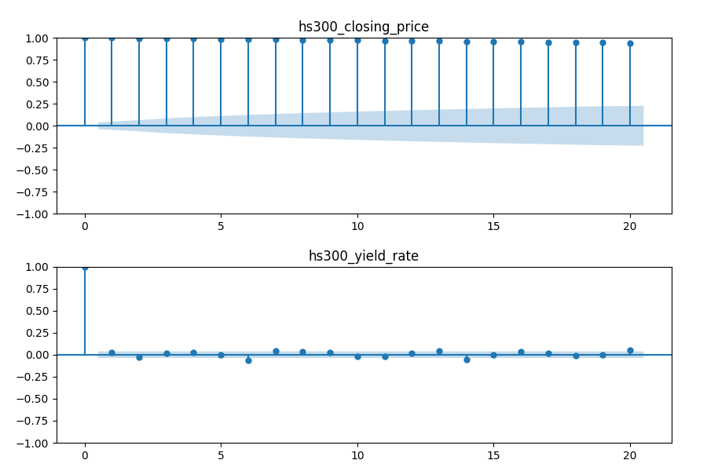

# 第2章线性时间序列分析
 　　本章讨论线性时间序列分析的基本理论，首先介绍时间序列的平稳性、自相关性概念；
　　然后介绍两种重要的时间序列，即白噪声与随机游走；最后介绍一种重要的线性时间序列模型(ARIMA)。
　　针对时间序列的自相关性，我们将介绍自相关系数，并通过Ljung-Box检验序列是否存在自相关性；针对时间序列的平稳性，通过引入随机游走，并在其基础上引入ADF检验序列是否满足平稳性。最后结合时间序列的自相关性，引入了ARIMA模型对时间序列进行建模，通过与随机游走进行对比，证明了股票指数满足随机游走，对于股票指数建立自回归模型没有意义；对股票的日收益率进行分析，结果表明，日收益率存在微弱的自相关性，尝试通过自回归模型对收益率进行建模，结果显示模型成功地捕捉到了序列的自相关性。
## 2.1平稳性
　　平稳性是时间序列分析的基础，根据限制条件的严格程度，其分为严平稳时间序列和弱平稳时间序列。下面分别给出两种平稳性的定义。
1. 严平稳时间序列
2. 弱平稳时间序列
## 2.2自相关性
　　通常讨论序列的自相关性都是基于弱平稳序列，它是研究相关性的前提条件。
　　自相关(auto-correlation)也叫序列相关，是一个信号与其自身在不同时间点的相关度。非正式地来说，它就是两次观察之间的相似度对它们之间的时间差的函数。它是找出重复模式（如被噪声掩盖的周期信号），或识别隐含在信号谐波频率中消失的基频的数学工具。


在时间序列分析中，自相关性（Autocorrelation）是指一个时间序列与其自身在不同时间滞后下的相关性。简单来说，自相关性衡量的是一个序列在不同时间点上的值之间的相似程度。


### 自相关性的意义

1. **模式识别**：自相关性可以帮助识别时间序列中的模式，例如周期性或季节性。高自相关性可能表明序列中存在某种重复的模式。

2. **预测能力**：如果一个时间序列具有显著的自相关性，那么它的过去值可以用来预测未来值。这是许多时间序列预测模型（如 ARIMA 模型）的基础。

3. **随机性检验**：通过自相关性分析，可以判断一个时间序列是否是随机的。如果序列的自相关性不显著，则可能是随机的。

### 计算自相关性

自相关性通常通过自相关函数（ACF）来计算。ACF 是一个图形工具，用于显示时间序列在不同滞后下的自相关系数。自相关系数的值介于 -1 和 1 之间：

- **1** 表示完全正相关。

- **0** 表示没有相关性。

- **-1** 表示完全负相关。

### 应用

在时间序列分析中，自相关性用于：

- **模型选择**：帮助选择合适的时间序列模型。

- **模型诊断**：评估模型的拟合效果。
- **信号处理**：在信号处理中用于检测周期性信号。

通过分析自相关性，研究人员和分析师可以更好地理解时间序列的结构和特性，从而做出更准确的预测和决策。
## 自相关图的解读


### 代码实战

```python
from datetime import datetime
import pandas as pd
import statsmodels.api as sm
import matplotlib.pyplot as plt


# 定义自相关函数
def autocorrelation(df, col1, col2, lags):
    # 创建一个图形对象，大小为9x6
    fig = plt.figure(figsize=(9, 6))
    # 调整子图之间的间距
    fig.subplots_adjust(left=0.08, bottom=0.06, right=0.95, top=0.92, wspace=None, hspace=0.3)

    # 在图形中添加第一个子图
    ax1 = fig.add_subplot(211)
    # 绘制第一个列的自相关图
    sm.graphics.tsa.plot_acf(df[col1], lags=lags, ax=ax1, title=col1)
    
    # 在图形中添加第二个子图
    ax2 = fig.add_subplot(212)
    # 绘制第二个列的自相关图
    sm.graphics.tsa.plot_acf(df[col2], lags=lags, ax=ax2, title=col2)
    
    # 显示图形
    plt.show()


# 读取CSV文件，将'date'列解析为日期，并将其设为索引
df = pd.read_csv('../../data/informations.csv', parse_dates=['date'], index_col='date')

# 调用自相关函数，分析两个列的自相关性
autocorrelation(df, 'hs300_closing_price', 'hs300_yield_rate', 20)
```

### 结果



### 时间序列分析中自相关图的解读方法

自相关图（ACF, Autocorrelation Function）是时间序列分析中的一种重要工具，用于分析时间序列数据中不同时间点之间的相关性。以下是自相关图的解读方法：

#### 1. 自相关图的定义
自相关图显示了时间序列与其滞后值之间的相关性。自相关系数（ACF）表示时间序列与其滞后值之间的线性相关程度，取值范围在-1到1之间。

#### 2. 自相关图的结构
- **横轴（Lag）**：表示滞后阶数，即时间序列与其滞后值之间的时间间隔。
- **纵轴（ACF）**：表示自相关系数，反映了不同滞后阶数下的自相关程度。
- **蓝色条形**：表示不同滞后阶数下的自相关系数。
- **阴影区域**：通常表示置信区间（如95%置信区间），超出该区域的自相关系数被认为是显著的。

#### 3. 自相关图的解读
- **显著性**：如果自相关系数超出置信区间（阴影区域），则认为该滞后阶数下的自相关性是显著的。
- **衰减模式**：
  - **指数衰减**：自相关系数随着滞后阶数的增加而逐渐减小，通常表明时间序列具有自回归（AR）特性。
  - **截尾**：自相关系数在某个滞后阶数之后突然变为不显著，通常表明时间序列具有移动平均（MA）特性。
- **周期性**：如果自相关系数在某些固定滞后阶数上重复出现显著值，可能表明时间序列具有周期性。

#### 4. 应用场景
- **模型识别**：自相关图可以帮助识别时间序列模型的阶数，如ARIMA模型中的p（自回归阶数）和q（移动平均阶数）。
- **数据特征分析**：通过自相关图可以了解时间序列的自相关特性，为进一步的分析和建模提供依据。

#### 5. 示例解读
在你提供的图中：
- **上图（hs300_closing_price）**：自相关系数在多个滞后阶数上显著，且呈现出一定的衰减模式，可能表明该时间序列具有自回归特性。
- **下图（hs300_yield_rate）**：自相关系数在第一个滞后阶数显著，之后迅速变为不显著，可能表明该时间序列具有移动平均特性。

通过自相关图的解读，可以更好地理解时间序列的特性，并为后续的分析和建模提供指导。


