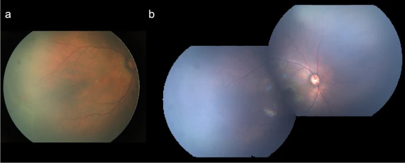

# 玻璃体内注射雷珠单抗治疗玻璃体内雷珠单抗单药治疗后再激活的早产儿视网膜病变：血管发育分析
Repeated intravitreal ranibizumab for reactivated retinopathy of prematurity after intravitreal ranibizumab monotherapy: vascular development analysis

## 文章思路与方法总结
### 研究背景
#### 研究主题：探讨重复玻璃体腔注射雷珠单抗（IVR）对雷珠单抗单药治疗后复发性早产儿视网膜病变（ROP）的视网膜血管化效果。
#### 研究背景：
- 早产儿视网膜病变（ROP）是一种早产儿视网膜血管发育迟缓或异常增殖的疾病。
- 抗血管内皮生长因子（VEGF）药物的玻璃体腔注射已成为ROP治疗的常用方法，但复发性ROP较为常见。
- 既往研究多关注对初始IVR治疗无反应或复发的ROP特征，而重复IVR注射对复发性ROP的效果研究较少。
### 研究目的
- 评估重复IVR注射对复发性ROP的视网膜血管化效果。
- 探讨与完全视网膜血管化相关的潜在预测因素。
### 研究设计
#### 研究类型：
单中心回顾性研究。
#### 研究对象：
2017年1月至2018年12月在上海交通大学医学院附属新华医院接受IVR注射作为首次治疗的78名ROP婴儿。
#### 纳入标准：
- 符合ETROP研究中1型ROP或国际ROP分类中的激进性后极ROP（APROP）标准。
- 接受IVR注射作为首次治疗。
#### 排除标准：
- 随访时间少于6个月。
- 基线视网膜周边血管化区域不清晰。
- 初始IVR后复发性ROP接受激光光凝（LPC）治疗。
### 研究方法
#### 分组方法：
根据IVR注射次数和视网膜血管化程度，将婴儿分为三组：
- Group 1：初始IVR单药治疗后实现完全视网膜血管化的ROP婴儿。
- Group 2：复发性ROP在第二次IVR注射后实现完全视网膜血管化。
- Group 3：复发性ROP在第二次IVR治疗后仍存在不完全视网膜血管化，后续接受LPC或第三次IVR治疗。
#### 数据收集：
- 收集以下参数：胎龄（GA）、出生体重（BW）、性别、ROP分期和区域、治疗方式、每次治疗时的胎龄（PMA）、完全视网膜血管化时的PMA、视网膜前出血和新生儿合并症。
- 使用RetCam成像系统拍摄眼底照片，并通过Photoshop软件分析视网膜血管化范围。
- 采用视盘中心到血管化区域边界的距离（DB）与视盘中心到黄斑中心的距离（DF）的比值（DB/DF）作为血管化分析指标。
#### 统计分析：
- 使用SPSS 23.0软件进行统计分析。
- 连续数据采用Mann–Whitney U检验或t检验，分类数据采用卡方检验或Fisher精确检验。
- 使用Cox比例风险回归模型分析与IVR治疗效果相关的因素，并采用Kaplan–Meier生存分析评估复发率。
### 研究结果
#### 主要发现：
- 54.3%的复发性ROP婴儿在重复IVR治疗后实现完全视网膜血管化。
- 胎龄 > 29周和初始IVR时颞侧DB/DF比值≥3是单药IVR治疗后完全视网膜血管化的潜在预测因素。
- 第二次IVR时颞侧DB/DF比值≥3.6是复发性ROP在重复IVR治疗后完全视网膜血管化的潜在预测因素。
#### 具体结果：
- Group 1 vs. Group 2：GA和BW在Group 2中显著低于Group 1，完全视网膜血管化时的PMA在Group 1中显著更早。
- Group 2 vs. Group 3：第二次IVR时的PMA在Group 2中显著更高，且两次IVR之间的时间间隔更长。
#### 预测因素分析：
- GA ≤ 29周和初始IVR时颞侧DB/DF比值<3的ROP婴儿在初始IVR后复发率更高。
- 第二次IVR时颞侧DB/DF比值≥3.6的ROP婴儿在重复IVR后更有可能实现完全视网膜血管化。
### 研究结论
- 初始IVR治疗后复发的ROP可以通过重复IVR注射成功治疗。
- GA ≤ 29周或初始IVR时颞侧DB/DF比值<3的ROP婴儿在初始IVR后复发风险更高，需要重复IVR治疗。
- 第二次IVR时颞侧DB/DF比值≥3.6的ROP婴儿在重复IVR后更有可能实现完全视网膜血管化。
- 对于仅接受IVR治疗的ROP婴儿，临床医生应增加监测频率并延长随访时间，以确保在复发后及时治疗。
### 研究局限性
- 单中心回顾性研究，样本种族限于亚洲。
- 视网膜血管化范围通过眼底照片测量，可能存在准确性不足的问题。
- 对于持续性无血管视网膜（PAR）的处理存在争议，未来需要进一步研究。

## Abstract  
### Purpose  目的
To evaluate the retinal vascularization of repeated intravitreal ranibizumab (IVR) for reactivated retinopathy of prematurity (ROP) treated with IVR monotherapy.

评估重复玻璃体内注射雷珠单抗 （IVR） 治疗 IVR 单药治疗再激活的早产儿视网膜病变 （ROP） 的视网膜血管形成。

### Methods  方法
The retrospective study reviewed ROP infants who accepted IVR injection as the first treatment in our department from January 2017 to December 2018. The ratio of the distance from the center of the optic disc to the border of the vascularized zone (DB) to the distance from the center of the disc to the fovea (DF) was used for the vascular outgrowth analysis.

回顾性研究回顾了 2017年1月至 2018年12月在我科接受 IVR 注射作为首治治疗的 ROP 婴儿。采用视盘中心到血管化区 （DB） 边界的距离与椎间盘中心到中央凹 （DF） 的距离之比进行血管生长分析。

### Results  结果
Seventy-eight infants were included in the study. A total of 54.3% of the reactivated ROP patients could achieve complete vascularization after repeated IVR injections. Gestational age (GA) > 29 weeks and a temporal DB/DF ratio ≥ 3 in the first IVR were potential predictors for complete retinal vascularization after IVR monotherapy. The temporal DB/DF ratio ≥ 3.6 in the second IVR injection was a potential predictor for complete retinal vascularization after repeated IVR for ROP reactivation.

该研究包括 78 名婴儿。共有 54.3% 的重新激活的 ROP 患者在重复 IVR 注射后可以实现完全血管形成。胎龄 （GA） > 29 周和第一次 IVR 的时间 DB/DF 比值 ≥ 3 是 IVR 单药治疗后视网膜血管完全形成的潜在预测因子。第二次 IVR 注射中的颞部 DB/DF 比值≥ 3.6 是重复 IVR 后 ROP 再激活后视网膜血管完全形成的潜在预测因子。

### Conclusions  结论
Reactivated ROP after IVR monotherapy can be treated successfully with repeated IVR injections. GA and temporal DB/DF ratio are potential predictors of complete retinal vascularization in ROP infants treated with IVR.

IVR 单药治疗后重新激活的 ROP 可以通过重复 IVR 注射成功治疗。GA 和时间 DB/DF 比值是接受 IVR 治疗的 ROP 婴儿视网膜血管完全形成的潜在预测因子。

### Key messages
ROP reactivation is common in ROPp treated with intravitreal anti-VEGF drugs.
ROP reactivation after the first IVR can be treated suceessfully with repeated IVR treatments.
ROP with gestational age (GA)< 29 weeks or a temporal DB/DF ratio < 3 in the first IVR has a higher risk of ROpreactivation after the first IVR and requires repeated IVR treatments.
ROP reactivation with a temporal DB/DF ratio 2> 3.6 in the second lVR is more likely to achieve complete retinalvascularization after the second lVR.

关键信息
在接受抗VEGF药物静脉注射治疗的ROP患者中，ROP再激活很常见。
通过反复进行IVR治疗，可以成功地治疗第一次IVR后的ROP再激活。
胎龄(GA)< 29 周或第一次 IR中时间 DB/DF 比值<3的 ROP 在第一次 IR后 ROP 再激活的风险更高，需要重复IVR治疗。
在第二次IVR中，当时间DB/DF比>3.6时，ROP再激活更有可能在第二次IVR后实现视网膜的完全血管化。

## Introduction  介绍
ROP is a vascular proliferative disorder of the developing retina in premature infants, and it presents with delayed retinal vascular development or abnormal vascular proliferation [1, 2]. Intravitreal injection of anti-vascular endothelial growth factor (VEGF) drugs has become increasingly popular in ROP treatment [3]. Ranibizumab is one of the off-label anti-VEGF drugs used for ROP. However, ROP reactivation is common in ROP treated with intravitreal ranibizumab (IVR) [4,5,6].

ROP 是早产儿发育中视网膜的血管增生性疾病，表现为视网膜血管发育延迟或血管异常增殖 [1， 2]。玻璃体内注射抗血管内皮生长因子 （VEGF） 药物在 ROP 治疗中越来越受欢迎 [3]。雷珠单抗是用于治疗 ROP 的超说明书抗 VEGF 药物之一。然而，ROP 再激活在玻璃体内雷珠单抗 （IVR） 治疗的 ROP 中很常见 [4,5,6]。

Previous studies have focused on the characteristics and risk factors of ROP infants who showed no response to IVR monotherapy or ROP reactivation after initial IVR treatment [7,8,9]. The effect of repeated IVR injections on ROP reactivation is rarely studied. In addition, the ideal effect of IVR treatment on ROP is complete retinal vascularization. The characteristics and potential predictors of ROP with complete retinal vascularization after IVR remain undetermined.

以前的研究集中在初始 IVR 治疗后对 IVR 单药治疗或 ROP 再激活无反应的 ROP 婴儿的特征和危险因素 [7,8,9]。很少研究重复 IVR 注射对 ROP 再激活的影响。此外，IVR 治疗对 ROP 的理想效果是完全视网膜血管形成。IVR 后视网膜血管完全形成的 ROP 的特征和潜在预测因素仍未确定。

In this study, we reviewed ROP infants who exhibited ROP reactivation after initial IVR treatment and who received repeated IVR injections. Infants who exhibited complete vascularization after the initial IVR were included as the control. A better understanding of these data can serve to predict outcomes in ROP infants treated with IVR and aid clinicians in the rational and timely treatment of ROP reactivation after IVR monotherapy.

在本研究中，我们回顾了在初始 IVR 治疗后表现出 ROP 再激活并接受重复 IVR 注射的 ROP 婴儿。初始 IVR 后表现出完全血管形成的婴儿被纳入对照组。更好地了解这些数据有助于预测接受 IVR 治疗的 ROP 婴儿的结局，并帮助临床医生合理和及时地治疗 IVR 单药治疗后 ROP 再激活。

## Patients and methods  患者和方法
### Study design  研究设计
This work was a single-center retrospective study. The study reviewed 78 ROP infants who accepted IVR injection as the first treatment in our department from January 2017 to December 2018. The medical data routinely recorded in the follow-up charts were reviewed. Each case in the study met type 1 ROP defined in the Early Treatment of Retinopathy of Prematurity (ETROP) study or aggressive posterior ROP (APROP) defined by the International Classification of Retinopathy of Prematurity [10, 11]. At the screening and follow-up, RetCam Imaging System (Clarity Medical System, Pleasanton, CA) was used for fundus photography. This retrospective study was conducted in accordance with the tenets of the Declaration of Helsinki and approved by the Ethics Committee of Xinhua Hospital affiliated with Shanghai Jiao Tong University School of Medicine, Shanghai, China (Approval No. XHEC-D-2018–020). Informed consent was obtained from the parents for all examinations, treatments, and data analysis.

这项工作是一项单中心回顾性研究。该研究回顾了 2017 年 1 月至 2018 年 12 月在我们科接受 IVR 注射作为首选治疗的 78 例 ROP 婴儿。回顾了随访图表中常规记录的医疗数据。研究中的每个病例都符合早产儿视网膜病变早期治疗 （ETROP） 研究中定义的 1 型 ROP 或国际早产儿视网膜病变分类定义的侵袭性后 ROP （APROP） [10， 11]。在筛查和随访中，使用 RetCam 成像系统（Clarity Medical System，Pleasanton，CA）进行眼底照相。本回顾性研究是根据《赫尔辛基宣言》的原则进行的，并经中国上海交通大学医学院附属新华医院伦理委员会批准（批准号。XHEC-D-2018–020 的 020 年）。所有检查、治疗和数据分析均获得父母的知情同意。

### Patient selection  患者选择
The indications for IVR injection were patients who met the criteria for type 1 ROP or APROP [10, 11]. A 0.25 mg/0.025 ml dose of ranibizumab was injected into each eye. The process of IVR injection has been described in a previous study [12]. The patients were reexamined the next day and then every 1–2 weeks until full vascularization was observed or additional treatment was given [12,13,14]. During the follow-up, ROP reactivation and full retinal vascularization were confirmed by indirect ophthalmoscopy with scleral depression after topical anesthesia [15]. Another doctor and a nurse fixed the infant to ensure the head and body stationary during the examination. If ROP reactivation happened after the first IVR treatment, a second IVR injection would be administered. However, some infants with ROP reactivation were given laser photocoagulation (LPC), if their parents refused IVR treatment considering the high medical expenses. The process and follow-up schedule of the second IVR treatment were the same as that of the first IVR. If the incomplete retinal vascularization persisted or ROP reactivation occurred after the second IVR treatment, LPC or a third IVR treatment was then performed (Fig. 1). The IVR injection and LPC were performed by the same experienced surgeon.

IVR 注射的适应症是符合 1 型 ROP 或 APROP 标准的患者 [10， 11]。每只眼睛注射 0.25 mg/0.025 ml 剂量的雷珠单抗。IVR 注射的过程已在以前的研究中描述过 [12]。患者第二天复查一次，然后每 1-2 周复查一次，直到观察到完全血管形成或给予额外治疗 [12,13,14]。在随访期间，通过局部麻醉后巩膜凹陷的间接检眼镜证实 ROP 再激活和完全视网膜血管形成 [15]。另一名医生和一名护士固定婴儿，以确保检查期间头部和身体静止。如果在第一次 IVR 治疗后发生 ROP 再激活，将进行第二次 IVR 注射。然而，如果考虑到高昂的医疗费用，他们的父母拒绝 IVR 治疗，一些 ROP 再激活的婴儿被给予激光光凝术 （LPC）。第二次 IVR 治疗的过程和随访时间表与第一次 IVR 相同。如果在第二次 IVR 治疗后视网膜血管形成不完全或发生 ROP 再激活，则进行 LPC 或第三次 IVR 治疗（图 1）。IVR 注射和 LPC 由同一位经验丰富的外科医生进行。

Flowchart of the ROP infants throughout the study. ROP, retinopathy of prematurity; APROP, aggressive posterior ROP; IVR, intravitreal ranibizumab; LPC, laser photocoagulation; group 1, ROP infants with complete retinal vascularization after IVR monotherapy; group 2, ROP reactivation that presented complete retinal vascularization after a second IVR injection; and group 3, ROP reactivation that presented incomplete retinal vascularization after a second IVR treatment and subsequently treated by LPC or a third IVR injection

整个研究过程中 ROP 婴儿的流程图。ROP，早产儿视网膜病变;APROP，侵袭性后 ROP;IVR，玻璃体内雷珠单抗;LPC，激光光凝术;第 1 组，IVR 单药治疗后视网膜血管完全形成的 ROP 婴儿;第 2 组，第二次 IVR 注射后出现完全视网膜血管形成的 ROP 再激活;第 3 组，第二次 IVR 治疗后出现不完全视网膜血管形成的 ROP 再激活，随后通过 LPC 或第三次 IVR 注射治疗

During follow-up, the outcome of the IVR was classified as ROP reactivation, ROP arrest, and complete retinal vascularization. In this study, complete retinal vascularization was defined as follows: the distance from the ora serrata to the vascularized retinal border was less than 2 disc diameters (DDs) [16, 17]. ROP reactivation was defined as follows: retinal neovascularization or plus disease reappeared or worsened after the initial regression [6, 18, 19]. In this study, reactivation of ROP in one or both eyes was considered ROP reactivation, and IVR treatments were given in both eyes on the same day.

在随访期间，IVR 的结果被归类为 ROP 再激活、ROP 停滞和完全视网膜血管形成。在这项研究中，完全视网膜血管形成定义如下：从锯齿口到血管化视网膜边界的距离小于 2 个椎间盘直径 （DDs） [16， 17]。ROP 再激活定义如下：视网膜新生血管或 PLUS 疾病在初始消退后再次出现或恶化 [6， 18， 19]。在这项研究中，一只或两只眼睛的 ROP 再激活被认为是 ROP 再激活，并且在同一天对双眼进行 IVR 治疗。

The following ROP patients were excluded: ROP patients with a follow-up period of fewer than 6 months after the last treatment, ROP infants whose fundus photographs of the peripheral retina were unclear, and ROP reactivation treated with LPC after the initial IVR treatment.

排除以下 ROP 患者： 最后一次治疗后随访时间少于 6 个月的 ROP 患者，周边视网膜眼底照片不清晰的 ROP 婴儿，以及初始 IVR 治疗后用 LPC 治疗的 ROP 再激活。

The infants were divided into three groups based on the number of IVR injections and retinal vascularization extent: group 1 (ROP infants with complete retinal vascularization after IVR monotherapy), group 2 (ROP reactivation that presented complete retinal vascularization after a second IVR injection), and group 3 (ROP reactivation that presented incomplete retinal vascularization after a second IVR treatment and subsequently treated by LPC or a third IVR injection) (Fig. 1).

根据 IVR 注射次数和视网膜血管形成程度将婴儿分为三组：第 1 组（IVR 单药治疗后视网膜血管完全形成的 ROP 婴儿）、第 2 组（第二次 IVR 注射后 ROP 再激活表现为完全视网膜血管形成）和第 3 组（ROP 再激活在第二次 IVR 治疗后表现为不完全视网膜血管形成，随后接受 LPC 或第三次 IVR 注射治疗）（图 1）。1）。

### Data collection  数据采集
The effects of repeated IVR injections on ROP reactivation after the initial IVR were evaluated. The following parameters were collected from the patients’ records: gestational age (GA), birth weight (BW), gender, ROP zone and stage at the time of treatment, treatment modality, postmenstrual age (PMA) in each treatment (in weeks), PMA at complete retinal vascularization (in weeks), preretinal hemorrhage, and neonatal comorbidities at pretreatment. Only unilateral eye information was included for data analysis. For infants with symmetrical ROP, the information of the right eye was collected for analysis. For infants with asymmetric ROP, the information of the worse eye was collected for analysis.

评估重复 IVR 注射对初始 IVR 后 ROP 再激活的影响。从患者记录中收集以下参数：胎龄 （GA） 、出生体重 （BW）、性别、治疗时的 ROP 区和分期、治疗方式、每次治疗的胎龄 （PMA） （以周为单位）、视网膜血管完全形成时的 PMA （以周为单位）、视网膜前出血和治疗前的新生儿合并症。仅包括单侧眼信息用于数据分析。对于对称性 ROP 的婴儿，收集右眼的信息进行分析。对于不对称的 ROP 婴儿，收集较差的眼睛信息进行分析。

The fundus photographs in each treatment and complete retinal vascularization were selected and assembled using Photoshop CC software (Adobe). The ratio of the distance from the center of the optic disc to the border of the vascularized zone (DB) to the distance from the center of the disc to the fovea (DF) was used for the vascular outgrowth analysis [20, 21]. The extent of retinal vascularization and the rate of vascular progression was measured by the same investigator (Supplementary Material 1).

选择每次治疗和完全视网膜血管形成中的眼底照片，并使用 Photoshop CC 软件 （Adobe） 进行组装。从视盘中心到血管化区 （DB） 边界的距离与从视盘中心到中央凹 （DF） 的距离之比用于血管生长分析 [20， 21]。视网膜血管形成的范围和血管进展的速度由同一研究者测量（补充材料 1）。

### Statistical analysis  统计分析
Statistical analyses were performed using SPSS 23.0 for Windows (SPSS Inc., Chicago, IL, USA). The Mann–Whitney U test or t-test was used to compare continuous data between the groups. The chi-square and Fisher’s exact tests were used for the two-group comparisons of categorical data. To analyze the factors associated with the efficacy of IVR treatment for ROP reactivation and to explore the potential predictors of the number of IVR treatments for complete retinal vascularization, two distinct multivariable Cox proportional-hazards regression models were used. A stepwise forward approach was used to select covariates for the multivariable models. The Kaplan–Meier curves and the log-rank test were used for survival analysis. The cutoff value was calculated by X-title 3.6.1 software (Yale University, New Haven, CT, USA) or the median [22, 23]. Statistical significance was determined as P < 0.05.

使用 SPSS 23.0 for Windows （SPSS Inc.， Chicago， IL， USA） 进行统计分析。使用 Mann-Whitney U 检验或 t 检验比较组间连续数据。卡方检验和 Fisher 精确检验用于分类数据的两组比较。为了分析与 IVR 治疗对 ROP 再激活的疗效相关的因素，并探讨完全视网膜血管形成 IVR 治疗次数的潜在预测因子，使用了两个不同的多变量 Cox 比例风险回归模型。采用逐步前进方法为多变量模型选择协变量。Kaplan-Meier 曲线和对数秩检验用于生存分析。通过 X-title 3.6.1 软件（耶鲁大学，纽黑文，康涅狄格州，美国）或中位数 [22， 23] 计算临界值。统计显着性确定为 P < 0.05。

## Results  结果

The general information and clinical characteristics of the first IVR are listed in Table 1. The GA and BW in group 2 were significantly lower than those in group 1. The PMA at complete retinal vascularization in group 1 was significantly earlier than that in group 2 (P < 0.001). The severity of ROP in the initial IVR was more serious in group 3 than in group 2 (P = 0.038). In group 3, there were a considerable number of cases with APROP (9.5%) and zone I stage 1 + ROP (23.8%). In addition, the temporal DB/DF ratio in the initial IVR injection in group 3 was the smallest, followed by group 2 and group 1.

第一次 IVR 的一般信息和临床特征见表 1。第 2 组的 GA 和 BW 显著低于第 1 组。第 1 组视网膜血管完全形成时的 PMA 显著早于第 2 组 （P < 0.001）。第 3 组初始 IVR 中 ROP 的严重程度比第 2 组更严重 （P = 0.038）。在第 3 组中，有相当数量的 APROP （9.5%） 和 I 区 1 期 + ROP （23.8%） 病例。此外，第 3 组初始 IVR 注射的时间 DB/DF 比值最小，其次是第 2 组和第 1 组。

The clinical characteristics of ROP reactivation treated by repeated IVR injections are shown in Table 2. In total, 54.3% (25/46) infants with ROP reactivation achieved complete retinal vascularization after repeated IVR injections. Unlike in group 3, the PMA in the second IVR treatment was significantly greater (P < 0.001), and the time interval (weeks) between two IVR injections was longer (P = 0.002) in group 2. In the second IVR treatment, the severity of ROP remained more serious in group 3 than in group 2 (P = 0.037). All cases in group 2 were in zone II stage 2 + ROP (100%), while group 3 still had a portion of zone I stage 1 + ROP (9.5%). The temporal DB/DF ratio in the second IVR was significantly greater in group 2 than in group 3 (P = 0.001). That is, in the second IVR injection, the range of retinal vascularization was larger in group 2 than in group 3.

重复 IVR 注射治疗的 ROP 再激活的临床特征见表 2。总共有 54.3% （25/46） 的 ROP 再激活婴儿在重复 IVR 注射后实现了完全视网膜血管形成。与第 3 组不同，第 2 组第二次 IVR 治疗的 PMA 显着更高 （P < 0.001），并且两次 IVR 注射之间的时间间隔（周）更长 （P = 0.002）。在第二次 IVR 治疗中，第 3 组 ROP 的严重程度仍然比第 2 组更严重 （P = 0.037）。第 2 组所有病例均在 II 区 2 期 + ROP （100%），而第 3 组仍有一部分 I 区 1 期 + ROP （9.5%）。第 2 组第二次 IVR 中的时间 DB/DF 比值显著大于第 3 组 （P = 0.001）。也就是说，在第二次 IVR 注射中，第 2 组的视网膜血管形成范围大于第 3 组。

To explore the factors associated with the number of IVR treatments required for complete retinal vascularization, 11 variables were compared between group 2 and group 1. Finally, four variables with P < 0.05 in the univariate analysis were entered into the Cox proportional-hazards regression analysis (Table 3). The results showed that GA (HR, 0.736; P, 0.001) and temporal DB/DF ratio in the initial IVR (HR, 0.251; P, 0.007) were factors associated with the number of IVR treatments required for complete retinal vascularization in ROP. Furthermore, survival analysis showed that ROP infants with GA ≤ 29 weeks had a higher reactivation rate than those with GA > 29 weeks after the first IVR treatment (55.6% vs. 8.6%, P = 0.023) (Fig. 2a). ROP infants with a temporal DB/DF ratio < 3 in the initial IVR had a higher reactivation rate than those with a temporal DB/DF ratio ≥ 3 after the first IVR treatment (68.8% vs. 34.1%, P = 0.027) (Fig. 2b). In other words, ROP infants with GA > 29 weeks or temporal DB/DF ratio ≥ 3 were more likely to reach complete retinal vascularization after initial IVR, while ROP infants with GA ≤ 29 weeks or temporal DB/DF ratio < 3 had a higher risk of ROP reactivation after initial IVR.

为了探讨与完全视网膜血管形成所需的 IVR 治疗次数相关的因素，在第 2 组和第 1 组之间比较了** 11 个变量**。最后，将单变量分析中 P < 0.05 的**四个变量**输入到 Cox 比例风险回归分析中（表 3）。结果显示，GA （HR， 0.736;P， 0.001） 和初始 IVR 中的时间 DB/DF 比 （HR， 0.251;P， 0.007） 是与 ROP 中完全视网膜血管形成所需的 IVR 治疗次数相关的因素。此外，生存分析显示，在第一次 IVR 治疗后 29 周≤ GA 婴儿的再激活率高于 GA >婴儿（55.6% 对 8.6%，P = 0.023）（图 A）。2a）. 初始 IVR 中时间 DB/DF 比值< 3 的 ROP 婴儿在第一次 IVR 治疗后比时间 DB/DF 比值≥ 3 的婴儿再激活率更高（68.8% 对 34.1%，P = 0.027）（图换句话说，GA > 29 周或时间 DB/DF 比值≥ 3 的 ROP 婴儿更有可能在初始 IVR 后达到完全视网膜血管形成，而 GA ≤ 29 周或时间 DB/DF 比值< 3 的 ROP 婴儿在初始 IVR 后 ROP 再激活的风险更高。

> The Kaplan–Meier survival curve with ROP reactivation after the initial IVR as the terminal event. a Compared with ROP infants with GA > 29 weeks, ROP infants with GA ≤ 29 weeks had a higher risk of ROP reactivation after the first IVR (8.6% vs. 55.6%, P = 0.023, log-rank test). b Compared with ROP infants with a temporal DB/DF ratio ≥ 3 in the first IVR, ROP infants with a temporal DB/DF ratio < 3 had a significantly increased likelihood of ROP reactivation (34.1% vs. 68.8%, P = 0.027, log-rank test)

> 初始 IVR 后 ROP 再激活为终末事件的 Kaplan-Meier 生存曲线。a 与 29 周 GA > ROP 婴儿相比，GA ≤ 29 周的 ROP 婴儿在第一次 IVR 后 ROP 再激活的风险更高（8.6% 对 55.6%，P = 0.023，对数秩检验）。b 与第一次 IVR 中时间 DB/DF 比值 ≥ 3 的 ROP 婴儿相比，时间 DB/DF 比值< 3 的 ROP 婴儿 ROP 再激活的可能性显著增加（34.1% 对 68.8%，P = 0.027，对数秩检验）

To analyze the factors associated with the efficacy of the second IVR treatment for ROP reactivation, 16 variables were analyzed between group 2 and group 3 by univariate analysis. Seven variables with a P < 0.05 were entered into the Cox proportional-hazards regression analysis (Table 4). The results showed that the temporal DB/DF ratio in the second IVR (HR, 0.343; P, 0.002) was the potential predictor for complete retinal vascularization after repeated IVR for ROP reactivation. The Kaplan–Meier survival analysis showed that ROP infants with a temporal DB/DF ratio ≥ 3.6 in the second IVR were more likely to achieve complete retinal vascularization after repeated IVR injections than those with a DB/DF ratio < 3.6 (78.3% vs. 30.4%, P = 0.008) (Fig. 3).

为了分析与第二次 IVR 治疗对 ROP 再激活的疗效相关的因素，通过**单变量分析**分析了第 2 组和第 3 组之间的 **16 个变量**。将 P <为 0.05 的 **7 个变量**输入到** Cox 比例风险回归分析**中（表 4）。结果显示，第二次 IVR 中的时间 DB/DF 比值 （HR， 0.343;P， 0.002） 是重复 IVR 后 ROP 再激活后视网膜血管完全形成的潜在预测因子。Kaplan-Meier 生存分析显示，第二次 IVR 中时间 DB/DF 比值≥ 3.6 的 ROP 婴儿比 DB/DF 比< 3.6 的婴儿更有可能在重复 IVR 注射后实现完全视网膜血管形成（78.3% 对 30.4%，P = 0.008）（图 3）。

> The Kaplan–Meier survival curve with incomplete vascularization after the second IVR as the terminal event. Compared with ROP infants with a temporal DB/DF ratio < 3.6 in the second IVR, ROP infants with a temporal DB/DF ratio ≥ 3.6 in the second IVR were more likely to achieve complete retinal vascularization after the second IVR treatment (30.4% vs. 78.3%, P = 0.008, log-rank test)
> 第二次 IVR 后血管形成不完全为终末事件的 Kaplan-Meier 生存曲线。与第二次 IVR 中颞部 DB/DF 比值 < 3.6 的 ROP 婴儿相比，第二次 IVR 中颞部 DB/DF 比值≥ 3.6 的 ROP 婴儿在第二次 IVR 治疗后更有可能实现完全视网膜血管形成（30.4% vs. 78.3%，P = 0.008，log-rank 检验）

The representative fundus images of ROP infants in group 1, group 2, and group 3 are shown in Figs. 4, 5, and 6, respectively. The general information and clinical characteristics of these cases are consistent with the risk factors for retinal vascularization after IVR treatment obtained in this study.
第 1 组、第 2 组和第 3 组 ROP 婴儿的代表性眼底图像如图 所示。分别为 4、5 和 6。这些病例的一般信息和临床特征与本研究获得的 IVR 治疗后视网膜血管形成的危险因素一致。

> Montage fundus images of the right eye in one ROP infant with complete retinal vascularization after the initial IVR injection (male, GA 32 weeks, BW 1300 g). a Fundus photograph of the right eye just before the first IVR treatment for zone II stage 3 + ROP (PMA, 38 weeks). The temporal DB/DF ratio was 3.3. b Photograph of the right eye fundus when the retinal blood vessels were fully developed after IVR monotherapy (PMA, 50 weeks)
> 一名 ROP 婴儿在初始 IVR 注射后视网膜血管完全形成的右眼眼底图像（男性，GA 32 周，BW 1300 g）。a II 区 3 期 + ROP（PMA，38 周）第一次 IVR 治疗前右眼的眼底照片。颞部 DB/DF 比值为 3.3。b IVR 单药治疗后视网膜血管完全发育时的右眼眼底照片（PMA，50 周）

> Montage fundus images of the right eye fundus in one ROP infant with complete retinal vascularization after repeated IVR injections (female, GA 29 weeks, BW 1750 g). a Fundus photograph of the right eye just before the first IVR treatment for zone II stage 2 + ROP with a temporal DB/DF ratio of 2.9 (PMA, 36 weeks). b Fundus image of the right eye just before the second IVR treatment for zone II stage 2 + ROP with a temporal DB/DF ratio of 3.6 (PMA, 45 weeks). c Fundus photograph of the right eye when the retinal blood vessels were fully developed after the second IVR treatment (PMA, 84 weeks)
> 一名反复 IVR 注射后视网膜血管完全形成的 ROP 婴儿右眼底的蒙太奇眼底图像（女性，GA 29 周，体重 1750 克）。a II 区 2 期 + ROP 第一次 IVR 治疗前右眼的眼底照片，颞部 DB/DF 比值为 2.9（PMA，36 周）。b II 区 2 期 + ROP 第二次 IVR 治疗前右眼的眼底图像，颞部 DB/DF 比值为 3.6（PMA，45 周）。c 第二次 IVR 治疗后视网膜血管完全发育时的右眼眼底照片（PMA，84 周）

> Montage fundus images of the left eye fundus in one ROP infant with incomplete retinal vascularization after two IVR injections (female, BW 2000 g, GA 28 weeks). a Fundus photograph of the left eye before the first IVR treatment for zone I stage 1 + ROP with a temporal DB/DF ratio of 1.9 (PMA, 33 weeks). b Fundus photograph of the left eye before the second IVR treatment for zone II stage 2 + ROP (PMA, 38 weeks). The temporal DB/DF ratio was 3.4. c Photograph of the left eye fundus with incomplete retinal vascularization after the second IVR treatment. The temporal DB/DF ratio was 3.8 (PMA, 46 weeks)
> 两次 IVR 注射后视网膜血管形成不完全的一名 ROP 婴儿左眼底的蒙太奇眼底图像（女性，BW 2000 g，GA 28 周）。a I 区 1 期 + ROP 第一次 IVR 治疗前左眼的眼底照片，颞部 DB/DF 比值为 1.9（PMA，33 周）。b II 区 2 期 + ROP 第二次 IVR 治疗前左眼的眼底照片（PMA，38 周）。颞部 DB/DF 比值为 3.4。c 第二次 IVR 治疗后视网膜血管形成不完全的左眼眼底照片。颞部 DB/DF 比值为 3.8（PMA，46 周）

## Discussion  讨论
The present study investigated the retinal vascularization of reactivated ROP after repeated IVR. In addition, the characteristics and potential predictors of ROP with complete retinal vascularization after IVR were evaluated. The results showed that 54.3% of infants with ROP reactivation after the first IVR could achieve complete retinal vascularization after repeated IVR treatments. ROP with GA ≤ 29 weeks and/or a temporal DB/DF ratio < 3 in the first IVR had a significantly increased likelihood of ROP reactivation and need another IVR to reach complete retinal vascularization. Reactivated ROP with temporal DB/DF ratio ≥ 3.6 in the second IVR were more likely to reach complete retinal vascularization after a second IVR.
本研究调查了重复 IVR 后重新激活的 ROP 的视网膜血管形成。此外，还评估了 IVR 后视网膜血管完全形成的 ROP 的特征和潜在预测因子。结果显示，54.3% 的第一次 IVR 后 ROP 再激活的婴儿在重复 IVR 治疗后可以实现完全视网膜血管形成。第一次 IVR 中 GA ≤ 29 周和/或时间 DB/DF 比值 < 3 的 ROP 显着增加 ROP 再激活的可能性，需要另一次 IVR 才能达到完全视网膜血管形成。第二次 IVR 中时间 DB/DF 比值≥ 3.6 的重新激活的 ROP 更有可能在第二次 IVR 后达到完全视网膜血管形成。

In this study, 54.3% of infants with ROP reactivation after the first IVR could achieve complete retinal vascularization after repeated IVR treatments. Similar to our findings, a previous study showed that in zone I type 1 ROP treated with intravitreal bevacizumab (IVB), 58.3% of infants with ROP reactivation after the first IVB achieved complete vascularization after another IVB injection [24].
在这项研究中，54.3% 的第一次 IVR 后 ROP 再激活的婴儿在重复 IVR 治疗后可以实现完全视网膜血管形成。与我们的研究结果类似，之前的一项研究表明，在接受玻璃体内贝伐珠单抗 （IVB） 治疗的 I 区 1 型 ROP 中，58.3% 的第一次 IVB 后 ROP 再激活的婴儿在再次注射 IVB 后达到完全血管形成 [24]。

In group 3, ROP reactivation after the first IVR occurred earlier than in group 2 (6.8 ± 3.8 weeks vs. 10.0 ± 2.9 weeks after the first IVR). This may be due to ROP lesions being more advanced in group 3 than in group 2. In group 2, 72% of infants were in zone II stage 2 + ROP in the first IVR, while there were 9.5% of APROP, 23.8% in zone I stage 1 + ROP, and only 42.9% in zone II stage 2 + ROP in group 3. ROP reactivation in zone I ROP and APROP may occur sooner after the initial IVR treatment. A previous study has shown that ROP reactivation was more likely to occur in zone I ROP than in zone II ROP [25]. Zone I ROP was one of the risk factors associated with ROP reactivation after the initial treatment [26]. For APROP, ROP reactivation occurred at a mean of 7.5 ± 6.9 weeks after the first IVR treatment [27]. In zone II type 1 ROP, ROP reactivation occurred at 12.62 ± 7.93 weeks on average after the first IVR [5].
在第 3 组中，第一次 IVR 后 ROP 再激活比第 2 组早发生（6.8 ± 3.8 周，而第一次 IVR 后 10.0 ± 2.9 周）。这可能是由于第 3 组的 ROP 病变比第 2 组更严重。在第 2 组中，72% 的婴儿在第一次 IVR 中处于 II 区 2 期 + ROP，而第 3 组有 9.5% 的 APROP，23.8% 在 I 区 1 期 + ROP，只有 42.9% 在 II 区 2 期 + ROP。I 区 ROP 和 APROP 的 ROP 再激活可能在初始 IVR 治疗后更早发生。先前的一项研究表明，I 区 ROP 再激活比 II 区 ROP 更可能发生 [25]。I 区 ROP 是与初始治疗后 ROP 再激活相关的危险因素之一 [26]。对于 APROP，第一次 IVR 治疗后平均 7.5 ± 6.9 周发生 ROP 再激活 [27]。在 II 区 1 型 ROP 中，ROP 再激活平均发生在第一次 IVR 后 12.62 ± 7.93 周 [5]。

Moreover, the temporal DB/DF ratios in the first and second IVR were larger in group 3 than in group 2. There was a larger retinal avascular area in group 3. The avascular areas in the retina produce a large amount of VEGF due to ischemia and hypoxia. The larger the avascular area of the retina, the more VEGF are released. The intraocular VEGF level could have always been higher in group 3 than in group 2, so ROP reactivation happened earlier in group 3 than in group 2 after the first IVR treatment.
此外，第 3 组第一次和第二次 IVR 中的时间 DB/DF 比值大于第 2 组。第 3 组视网膜无血管面积较大。由于缺血和缺氧，视网膜中的无血管区域会产生大量的 VEGF。视网膜的血管面积越大，释放的 VEGF 就越多。第 3 组的眼内 VEGF 水平可能总是高于第 2 组，因此在第一次 IVR 治疗后，第 3 组的 ROP 再激活发生得早于第 2 组。

In addition, the temporal DB/DF ratio in the first IVR treatment was larger in group 1 than in group 2. This suggests that the retinal avascular areas in the first IVR were smaller in group 1 and that their intraocular VEGF levels could be relatively low; thus, ROP in group 1 was able to achieve complete retinal vascularization after only one IVR treatment. As in the current study, Mintz-Hittner et al. found that the retinal peripheral avascular area was larger in infants with ROP reactivation than those without ROP reactivation [18]. Furthermore, complete retinal vascularization occurred earlier in group 1 than in group 2 (PMA 57.6 ± 8.4 weeks vs. 77.3 ± 16.2 weeks). However, there was no statistically significant difference in the retinal vessel development rate after the first IVR treatment between group 1 and group 2. This indicates that the range of retinal avascular area is most likely a risk factor related to the time of retinal complete vascularization in ROP after IVR treatment but not the rate of retinal vascular development.
此外，第 1 组第一次 IVR 治疗中的时间 DB/DF 比值大于第 2 组。这表明第 1 组第一次 IVR 中的视网膜无血管区域较小，并且其眼内 VEGF 水平可能相对较低;因此，第 1 组的 ROP 能够在仅一次 IVR 治疗后实现完全视网膜血管形成。与目前的研究一样，Mintz-Hittner 等人发现，ROP 再激活婴儿的视网膜外周血管面积大于无 ROP 再激活的婴儿 [18]。此外，第 1 组视网膜血管完全形成发生得早于第 2 组（PMA 57.6 ± 8.4 周对 77.3 ± 16.2 周）。然而，第 1 组和第 2 组在第一次 IVR 治疗后视网膜血管发育率没有统计学意义差异。这表明视网膜缺血区域的范围很可能是与 IVR 治疗后 ROP 视网膜完全血管化时间相关的危险因素，而不是与视网膜血管发育的速度有关。

Interestingly, we proved that GA ≤ 29 weeks and a temporal DB/DF ratio < 3 in the first IVR were potential predictors affecting the number of IVR treatments required for complete retinal vascularization in ROP. The temporal DB/DF ratio ≥ 3.6 in the second IVR was an independent risk factor for complete retinal vascularization in ROP reactivation treated by a second IVR injection. Compared with ROP with GA > 29 weeks, ROP with GA ≤ 29 weeks had a higher risk of ROP reactivation after the first IVR and might require another IVR injection to achieve complete retinal vascularization. Similar to our study, Huang Q et al. found that ROP with GA ≤ 29.5 weeks was more likely to reactivate after the initial IVR injection [12]. Compared with ROP with a temporal DB/DF ratio ≥ 3 in the first IVR, ROP with a temporal DB/DF ratio < 3 had a significantly increased likelihood of ROP reactivation after the first IVR and need another IVR injection. If the temporal DB/DF ratio was less than 3.6 in the second IVR, the ROP infant would be less likely to achieve complete retinal vascularization after the second IVR and might need to receive LPC or a third IVR. This suggests that the range of ROP retinal vascularization plays a critical role in predicting complete retinal vascularization after IVR treatment.
有趣的是，我们证明 GA ≤ 29 周和第一次 IVR 中的时间 DB/DF 比值 < 3 是影响 ROP 中完全视网膜血管形成所需 IVR 治疗次数的潜在预测因子。第二次 IVR 中的时间 DB/DF 比值≥ 3.6 是通过第二次 IVR 注射治疗的 ROP 再激活中完全视网膜血管形成的独立危险因素。与第 29 周 GA > 的 ROP 相比，第 29 周的 ROP ≤ GA 后 ROP 再激活的风险更高，可能需要再次注射 IVR 才能实现完全视网膜血管形成。与我们的研究类似，Huang Q 等人发现，第 29.5 周 GA ≤ ROP 在初始 IVR 注射后更有可能重新激活 [12]。与第一次 IVR 中颞部 DB/DF 比值为 ≥3 的 ROP 相比，< 时颞部 DB/DF 比值为 3 的 ROP 在第一次 IVR 后 ROP 再激活的可能性显着增加，需要再次注射 IVR。如果第二次 IVR 中的颞部 DB/DF 比值小于 3.6，则 ROP 婴儿在第二次 IVR 后不太可能实现完全视网膜血管形成，可能需要接受 LPC 或第三次 IVR。这表明 ROP 视网膜血管形成的范围在预测 IVR 治疗后完全视网膜血管形成方面起关键作用。

In what follows, the risk factors identified in the study are further explained to aid in the application of our results in clinical practice. Studies have shown that if the temporal DB/DF ratio was between 2 and 3, the ROP would be located in posterior zone II; if it was between 3 and 4, the ROP would be located in peripheral zone II [20, 21]. This suggests that, in the present study, posterior zone II ROP or zone I ROP had a higher risk of ROP reactivation after the initial IVR treatment, while peripheral zone II ROP was more likely to achieve complete retinal vascularization after the first IVR treatment. In ROP reactivation after the first IVR, if the retinopathy was close to zone III, ROP would be very likely to achieve complete retinal vascularization after the second IVR treatment. Otherwise, LPC or a third IVR treatment would be required.
在下文中，进一步解释了研究中确定的风险因素，以帮助我们的结果在临床实践中的应用。研究表明，如果颞部 DB/DF 比值在 2 到 3 之间，ROP 将位于后区 II;如果介于 3 和 4 之间，ROP 将位于外周区 II [20， 21]。这表明，在本研究中，后区 II ROP 或 I 区 ROP 在初始 IVR 治疗后 ROP 再激活的风险更高，而外周区 II ROP 更有可能在第一次 IVR 治疗后实现完全视网膜血管形成。在第一次 IVR 后的 ROP 再激活中，如果视网膜病变接近 III 区，ROP 很有可能在第二次 IVR 治疗后实现完全视网膜血管形成。否则，将需要 LPC 或第三次 IVR 治疗。

This study has the following shortcomings. First, this work was a single-center retrospective study, and the race was limited to Asians. Second, the range of retinal vascularization was measured by fundus photographs, but the peripheral retina in the fundus photographs was often not sharp. Fundus fluorescein angiography (FFA) is the gold standard for showing retinal vessels [28]. However, FFA in ROP infants usually requires general anesthesia, and many parents refuse FFA examination given the possible risks related to general anesthesia. In this study, only ROP patients who underwent LPC accepted FFA examinations. ROP reactivation and full retinal vascularization were confirmed by indirect ophthalmoscopy with scleral depression, which may minimize the shortcoming. Third, in the study, all infants with persistent avascular retina (PAR) received additional treatment. The avascular retina is more susceptible to retinal thinning, holes, and lattice-like changes, which may lead to retinal detachment in the future [29]. The previous study has shown that prophylactic laser to PAR in ROP did not have unfavorable effects [30]. However, whether PAR should always be treated remains controversial, which deserves future research.
这项研究有以下缺点。首先，这项工作是一项单中心回顾性研究，种族仅限于亚洲人。其次，视网膜血管形成的范围是通过眼底照片测量的，但眼底照片中的周边视网膜往往不清晰。眼底荧光素血管造影 （FFA） 是显示视网膜血管的金标准 [28]。然而，ROP 婴儿的 FFA 通常需要全身麻醉，鉴于与全身麻醉相关的可能风险，许多父母拒绝 FFA 检查。在这项研究中，只有接受 LPC 的 ROP 患者接受了 FFA 检查。ROP 再激活和完全视网膜血管形成通过巩膜凹陷的间接检眼镜检查得到证实，这可能会最大限度地减少缺点。第三，在该研究中，所有患有持续性无血管视网膜 （PAR） 的婴儿都接受了额外的治疗。无血管视网膜更容易出现视网膜变薄、孔洞和晶格样变化，这可能导致将来视网膜脱离 [29]。先前的研究表明，在 ROP 中预防性激光治疗 PAR 没有不利影响 [30]。然而，是否应该始终治疗 PAR 仍然存在争议，值得进一步研究。

