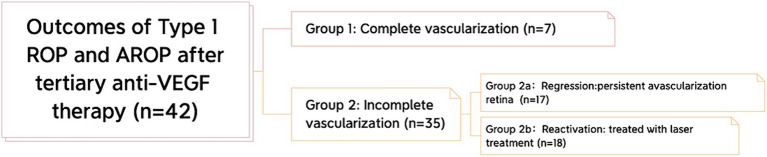
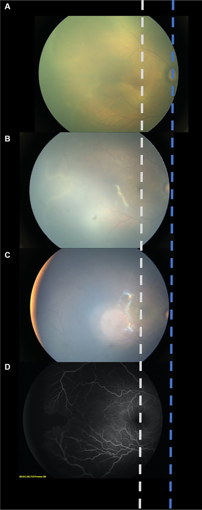
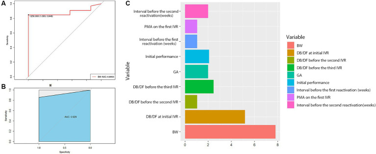
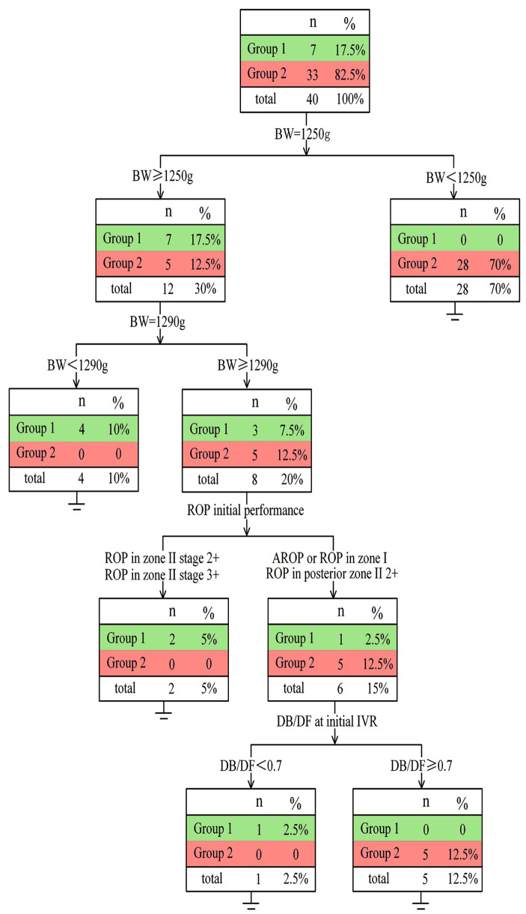

# 血管发育分析：早产儿视网膜病变第二次再激活后三级抗血管内皮生长因子治疗的研究

Vascular development analysis: a study for tertiary anti-vascular endothelial growth factor therapy after second reactivation of retinopathy of prematurity

## Abstract  
### Purpose  目的
To observe the vascular development results of tertiary anti-vascular endothelial growth factor (anti-VEGF) therapy following spontaneous second reactivation of retinopathy of prematurity (ROP).
观察早产儿视网膜病变 （ROP） 自发性第二次再激活后三级抗血管内皮生长因子 （anti-VEGF） 治疗的血管发育结果。

### Methods  方法
This retrospective study included 22 infants (42 eyes) with Type 1 or aggressive ROP (A-ROP) who received three anti-VEGF drug treatments for ROP from January 2018 to December 2022. The vascular growth, possible associated risk factors, and the retinal vascularization (DB/DF ratio) were assessed.
这项回顾性研究包括 22 名患有 1 型或侵袭性 ROP （A-ROP） 的婴儿 （42 只眼），他们在 2018 年 1 月至 2022 年 12 月期间接受了 3 次抗 VEGF 药物治疗治疗 ROP。评估血管生长、可能的相关危险因素和视网膜血管形成 （DB/DF 比率）。

### Results  结果
The mean follow-up was 17.6 months. After the 3rd intravitreal injection, seven eyes showed complete vascularization (Group 1), while the remaining 35 eyes demonstrated persistent avascular retina (PAR) (Group 2). In Group 2, 17 eyes maintained a stable state and were classified in the regression subgroup. The other 18 eyes developed a 3rd reactivation (reactivation subgroup) and were treated with laser photocoagulation (LPC).
平均随访时间为 17.6 个月。第 3 次玻璃体内注射后，7 只眼显示完全血管形成 （第 1 组），而其余 35 只眼显示持续性无血管视网膜 （PAR） （第 2 组）。在第 2 组中，17 只眼保持稳定状态，并被归类为回归亚组。其他 18 只眼出现第 3 次再激活 （再激活亚组） 并接受激光光凝术 （LPC） 治疗。

Birth weight (BW) was significantly lower in Group 2 than in Group 1 (p < 0.001). The decision tree analysis shows that only infants weighing more than 1,250 g (17.50%) had a chance to achieve complete retinal vascularization. The possibility of PAR was higher in patients with BW <1,250 g than ≥1,250 g (70.00% vs. 12.50%). In addition, most infants with BW ≥ 1,290 g and initial ROP disease in Zone I or posterior Zone II developed PAR.
第 2 组的出生体重 （BW） 显着低于第 1 组 （p < 0.001）。决策树分析显示，只有体重超过 1,250 克 （17.50%） 的婴儿才有机会实现完全视网膜血管形成。BW <1,250 克患者发生 PAR 的可能性高于 ≥1,250 克 （70.00% 对 12.50%）。此外，大多数 BW ≥ 1,290 克且 I 区或后区 II 的初始 ROP 疾病的婴儿发展为 PAR。

### Conclusion  结论
Tertiary IVR can successfully treat a second ROP reactivation and improve peripheral retinal vascularization. BW is the most significant factor related to complete retinal vascularization. Our decision tree model may be helpful in predicting the prognosis of anti-VEGF drugs in the event of a second ROP reactivation.
三级 IVR 可以成功治疗第二次 ROP 再激活并改善周边视网膜血管形成。BW 是与完全视网膜血管形成相关的最重要因素。我们的决策树模型可能有助于预测第二次 ROP 再激活情况下抗 VEGF 药物的预后。

### Keywords: 
anti-vascular endothelial growth factor (anti-VEGF), tertiary anti-VEGF therapy, reactivation, vascular development analysis, second reactivation, retinopathy of prematurity (ROP)

关键词：抗血管内皮生长因子 （anti-VEGF）， 三级抗 VEGF 治疗， 再激活， 血管发育分析， 二次再激活， 早产儿视网膜病变 （ROP）

## 1. Introduction  1. 引言
Retinopathy of prematurity (ROP) represents a significant cause of visual impairment and potential blindness among premature infants worldwide, posing substantial challenges for pediatric healthcare (1). In recent years, the main treatment method for ROP has shifted from cryotherapy to laser photocoagulation (LPC), and now primary injection of an anti-vascular endothelial growth factor (anti-VEGF) with or without delayed laser therapy (2–5). The benefits of anti-VEGF therapy, such as ease of administration, rapid response, and preservation of peripheral vision, have been widely documented. Additionally, anti-VEGF treatment is associated with a lower incidence of high myopia compared to laser therapy (6–8). However, anti-VEGF agents have been associated with more angiographic abnormalities, such as persistent avascular retina (PAR) and a higher reactivation rate, compared to laser therapy (9, 10).
早产儿视网膜病变 （ROP） 是全世界早产儿视力障碍和潜在失明的重要原因，对儿科医疗保健构成了重大挑战 （ 1 ）。近年来，ROP 的主要治疗方法已从冷冻疗法转向激光光凝术 （LPC），现在主要注射抗血管内皮生长因子 （抗 VEGF），有或没有延迟激光治疗 （ 2–5 ）。抗 VEGF 治疗的好处，例如易于给药、快速反应和保留周边视力，已被广泛记录。此外，与激光治疗相比，抗 VEGF 治疗与较低的高度近视发生率相关 （ 6–8 ）。然而，与激光治疗相比，抗 VEGF 药物与更多的血管造影异常有关，例如持续性无血管视网膜 （PAR） 和更高的再激活率 （ 9 ， 10 ）。

Several studies have investigated the rates and timing of ROP reactivation and the risk factors associated with ROP reactivation following anti-VEGF monotherapy (11, 12). There is currently no consensus on the treatment of reactivated ROP after initial anti-VEGF therapy. Some suggest LPC or another anti-VEGF drug may be used to treat ROP reactivation (13, 14), while others advocate repeated anti-VEGF therapy combined with LPC (12, 15). Recently, a proposal was conducted for the choice of retreated modality that was based on the reactivation characteristics (16). Here, anti-VEGF therapy was applied for flat vessels, and anti-VEGF therapy combined with LPC was applied for neovascularization. Both these therapies have been applied in our previous clinial practice. Our team has demonstrated that ROP reactivations can be treated successfully with repeated anti-VEGF therapy (17). LPC was selected in cases with financial constraints or those with difficulty following-up (4). However, to our knowledge, no studies have explored the efficacy of anti-VEGF therapy for the second reactivation of ROP, and there is currently no treatment consensus.
几项研究调查了 ROP 再激活的速率和时间以及与抗 VEGF 单一治疗后 ROP 再激活相关的危险因素 （ 11 ， 12 ）。目前对初始抗 VEGF 治疗后再激活的 ROP 的治疗尚未达成共识。一些人建议 LPC 或其他抗 VEGF 药物可用于治疗 ROP 再激活 （ 13 ， 14 ），而另一些人则主张重复抗 VEGF 治疗联合 LPC （ 12 ， 15 ）。最近，提出了一项基于再激活特征 （ ） 的退缩方式的选择 16 建议。在这里，抗 VEGF 疗法应用于扁平血管，抗 VEGF 疗法联合 LPC 应用于新生血管形成。这两种疗法都已应用于我们以前的临床实践中。我们的团队已经证明，ROP 再激活可以通过重复抗 VEGF 治疗成功治疗 （ 17 ）。在经济拮据或难以随访的情况下选择 LPC （ 4 ）。然而，据我们所知，没有研究探讨抗 VEGF 疗法对 ROP 第二次再激活的疗效，目前还没有治疗共识。

Several prior studies have suggested that complete vascular outgrowth can be achieved after one anti-VEGF therapy (18, 19). Moreover, our team has identified that complete retinal vascularization can be achieved after a 2nd anti-VEGF treatment (17). In general clinical opinion, complete retinal vascularization is considered the ideal result of anti-VEGF therapy for ROP. To the best of our knowledge, no study has investigated the factors associated with complete retinal vascularization after anti-VEGF therapy and the ideal treatment for the 2nd ROP reactivation. This study aimed to evaluate the efficacy of tertiary intravitreal administration of an anti-VEGF agent to treat a second ROP reactivation, to describe its effect on retinal vascularization promotion, and to assess possible risk factors indicating a poor prognosis following the third anti-VEGF therapy.
先前的几项研究表明，一次抗 VEGF 治疗后可以实现完全的血管生长 （ 18 ， 19 ）。此外，我们的团队已经确定，在第二次抗 VEGF 治疗后可以实现完全的视网膜血管形成 （ 17 ）。在一般临床观点中，完全视网膜血管形成被认为是 ROP 抗 VEGF 治疗的理想结果。据我们所知，没有研究调查过抗 VEGF 治疗后与完全视网膜血管形成相关的因素以及第 2 次 ROP 再激活的理想治疗。本研究旨在评估抗 VEGF 药物第三次玻璃体内给药治疗第二次 ROP 再激活的疗效，描述其对视网膜血管形成促进的影响，并评估表明第三次抗 VEGF 治疗后预后不良的可能危险因素。

## 2. Method  2. 方法
### 2.1. Study design  2.1. 研究设计
This retrospective study was approved by the Ethics Committee of Xinhua Hospital, affiliated with the Shanghai Jiao Tong University of Medicine (XHEC-D-2022-222) and adhered to the Declaration of Helsinki. The study reviewed 1, 140 ROP infants who received anti-VEGF therapy from January 2018 to December 2022, enrolling 22 ROP infants (42 eyes) who received three treatments of anti-VEGF drugs. All patients were routinely followed up for a minimum of 6 months after the 3rd treatment. Written informed consent was obtained from the guardian of each participant.
本回顾性研究经上海交通大学附属新华医院伦理委员会批准 （XHEC-D-2022-222） 并遵守赫尔辛基宣言。该研究回顾了 2018 年 1 月至 2022 年 12 月接受抗 VEGF 治疗的 1， 140 名 ROP 婴儿，招募了 22 名接受 3 次抗 VEGF 药物治疗的 ROP 婴儿（42 只眼）。所有患者在第 3 次治疗后都接受了至少 6 个月的常规随访。从每个参与者的监护人那里获得书面知情同意书。

### 2.2. Diagnosis and treatment    2.2. 诊断和治疗
Diagnosis and classification of ROP were based on the International Classification of Retinopathy of Prematurity, Third Edition (ICROP3) (20). All patients underwent a fundus examination with Retcam III Imaging System (Clarity Medical System, Pleasanton, CA) at every visit. The indications for intravitreal administration of an anti-VEGF agent were Type 1 ROP or aggressive ROP (A-ROP) (20, 21). An intravitreal injection of 0.25 mg/0.025 mL Ranibizumab (Lucentis; Novartis, Basel, Switzerland) (IVR) was given with a 30-gauge needle 1.0 mm to the posterior of the limbus under topical anesthesia.
ROP 的诊断和分类基于国际早产儿视网膜病变分类，第三版 （ICROP3） （ 20 ）。所有患者在每次就诊时都使用 Retcam III 成像系统（Clarity Medical System，Pleasanton，CA）进行眼底检查。玻璃体内注射抗 VEGF 药物的适应症是 1 型 ROP 或侵袭性 ROP （A-ROP） （ 20 ， 21 ）。玻璃体内注射 0.25 mg/0.025 mL 雷珠单抗（Lucentis;Novartis，巴塞尔，瑞士）（IVR），在局部麻醉下用 30 号针头 1.0 mm 给予角膜缘后部。

Follow-up appointments were conducted on the following day, as well as 1 week, 4 weeks, and 8 weeks after the intravitreal injection, and every 8 weeks if there was no ROP reactivation. In the case of ROP reactivation, a second intravitreal injection was given; ROP reactivation was defined as the reappearance of retinal abnormalities such as ridge and plus disease (20). The follow-up schedule was the same as that of the first intravitreal injection. Then, the third intravitreal injection was applied when the second reactivation occurred, following the same follow-up schedule as the first injection. If a third reactivation occurred, fluorescein angiography (FFA) and LPC were performed. All intravitreal injections and laser treatments were performed by the same experienced surgeon (P.Q.Z.).
随访预约在第二天以及玻璃体内注射后 1 周、4 周和 8 周进行，如果没有 ROP 再激活，则每 8 周进行一次。在 ROP 再激活的情况下，进行第二次玻璃体内注射;ROP 再激活定义为视网膜异常的再次出现，例如脊和附加疾病 （ 20 ）。随访时间表与第一次玻璃体内注射相同。然后，在第二次再激活发生时进行第三次玻璃体内注射，遵循与第一次注射相同的随访计划。如果发生第三次再激活，则进行荧光素血管造影 （FFA） 和 LPC。所有玻璃体内注射和激光治疗均由同一位经验丰富的外科医生 （PZZ） 进行。

### 2.3. Classification of patients and data collection    2.3. 患者分类和数据收集
All ROP eyes were classified into two groups according to the extent of their retinal vascularization: ROP infants with complete retinal vascularization (Group 1) and ROP infants with incomplete vascularization (Group 2) (Figure 1). Complete retinal vascularization was characterized by a measured distance of less than 2 optic disc diameters (DDs) between the boundary of retinal vascularization and the ora serrata of the temporal side (9). Group 2 was further divided into two subgroups: the regression group (Group 2a), characterized by the presence of PAR but no vascular activity, such as retinal exudation or vascular dilation, and the reactivation group, which requiresd further laser treatment (Group 2b). After mydriasis, retinal vascularization was evaluated by indirect binocular ophthalmoscopy with scleral indentation when needed.
所有 ROP 眼根据其视网膜血管形成的程度分为两组：视网膜血管完全形成的 ROP 婴儿 （第 1 组） 和血管形成不完全的 ROP 婴儿 （第 2 组） （ Figure 1 ）。完全视网膜血管形成的特征是视网膜血管形成边界与颞侧锯片口之间的测量距离小于 2 个视盘直径 （DDs） 9 （ ）。第 2 组进一步分为两个亚组：回归组 （第 2a 组），其特征是存在 PAR 但没有血管活动，如视网膜渗出或血管扩张，以及再激活组，需要进一步的激光治疗 （第 2b 组）。瞳孔散大后，通过间接双眼检眼镜检查评估视网膜血管形成，需要时进行巩膜压痕。

> Classification of the outcomes after tertiary anti-VEGF therapy. All eyes were classified into 2 groups: complete vascularization and incomplete vascularization. Furthermore, in the incomplete vascularization group, we classified infants of ROP into 2 subgroups: the regression subgroup and the reactivation subgroup.
> 三级抗 VEGF 治疗后结局分类。所有眼睛分为 2 组： 完全血管形成和不完全血管形成。此外，在不完全血管形成组中，我们将 ROP 婴儿分为 2 个亚组： 回归亚组和再激活亚组。

The following parameters were recorded: sex, birth weight (BW), gestational age (GA), initial ROP characteristics (zone and stage before the first treatment), postmenstrual age (PMA) at every treatment (weeks) and follow-up appointment, the interval between each treatment, retinal hemorrhage, other ocular complications, and systemic conditions. The ratio of the distance from the center of the optic disc to the boundary of the vascularized region (DB) to the distance from the center of the disc to the fovea (DF) (DB/DF) was used to quantify the degree of vascular growth at every treatment and the final visit (18). Fundus photographs were taken from the same position at every treatment and at the final visit to avoid manual measurement errors. Fundus photographs before the first IVR (A), before the second IVR (B), before the third IVR (C), and/or FFA after a third reactivation (D) were compiled into one diagram, and the center of the optic disc and the macula of every photo were aligned (Figure 2). To sufficiently show the far periphery, the foveal reflection and optic disc were at times not shown in the same image; a corresponding dash line was used to represent the estimated location of the macula and optic disc, increasing the precision of the measurement. The DB/DF value was measured individually by three blinded researchers and averaged.
记录以下参数：性别、出生体重 （BW）、胎龄 （GA）、初始 ROP 特征（第一次治疗前的区域和阶段）、每次治疗（周）和随访预约的胎龄 （PMA）、每次治疗之间的间隔、视网膜出血、其他眼部并发症和全身状况。从视盘中心到血管化区边界的距离 （DB） 与从视盘中心到中央凹的距离 （DF） （DB/DF） 的比率用于量化每次治疗和最后一次就诊时的血管生长程度 （ 18 ）。在每次治疗和最后一次就诊时从同一位置拍摄眼底照片，以避免人工测量误差。将第一次 IVR 之前的眼底照片 （A）、第二次 IVR 之前 （B）、第三次 IVR 之前的 （C） 和/或第三次再激活后的 FFA （D） 编译成一张图，并且每张照片的视盘中心和黄斑对齐 （ Figure 2 ）。为了充分显示远外围，中央凹反射和视盘有时不在同一图像中显示;使用相应的虚线表示黄斑和视盘的估计位置，从而提高测量精度。DB/DF 值由三名盲法研究人员单独测量并取平均值。

### 2.4. Statistical analysis    2.4. 统计分析
Statistical analysis was performed using SPSS version 26.0 (SPSS, Chicago, IL, United States) and R version 4.1.0. Descriptive statistics were used to present the demographic and clinical characteristics of the study population. Means and standard deviations (mean ± SD) were calculated for numerical variables. Furthermore, an unpaired student t-test was used to compare the differences in numerical variables, and categorical variables were presented as frequency (%) and compared using chi-squared tests. Clustlasso, pCOR and random Forest R package were used to predict the possibility of complete retinal vascularization. The possible associated risk factors of ROP reactivation were also analyzed. In addition, a decision tree was analyzed by the rpart R package. A p-value < 0.05 was considered statistically significant.
使用 SPSS 26.0 版（SPSS，伊利诺伊州芝加哥，美国）和 R 4.1.0 版进行统计分析。描述性统计用于呈现研究人群的人口统计学和临床特征。计算数值变量的平均值和标准差 （平均值 ± SD）。此外，使用未配对的学生 t 检验来比较数值变量的差异，分类变量表示为频率 （%） 并使用卡方检验进行比较。Clustlasso、pCOR 和随机 Forest R 包用于预测完全视网膜血管形成的可能性。还分析了 ROP 再激活的可能相关危险因素。此外，通过 rpart R 包分析了决策树。< 0.05 的 p 值被认为具有统计学意义。

## 3. Results  3. 结果
A total of 42 eyes of 22 infants (two unilateral cases) were included in this study. Among them, 23 eyes (54.76%) demonstrated acute ROP or in zone I. All baseline characteristics are listed in Table 1. The mean BW and GA were 1130.00 ± 232.25 grams and 27.62 ± 1.39 weeks, respectively. The mean follow-up was 17.60 ± 0.60 months. The PMA for the three IVR injections was 34.15 ± 1.61, 42.68 ± 3.18, and 51.92 ± 4.29 weeks. Furthermore, the DB/DF ratios at the three intravitreal injections were 2.51 ± 0.60, 3.44 ± 0.41, and 3.85 ± 0.33, and the mean intervals between the 1st and 2nd injections, and the 2nd and 3rd injections were 7.50 ± 3.02 and 10.55 ± 3.71 weeks, respectively.
本研究共纳入 22 名婴儿的 42 只眼 （2 例单侧病例）。其中，23 只眼 （54.76%） 表现出急性 ROP 或处于 I 区。所有基线特征均列在 Table 1 中。平均 BW 和 GA 分别为 1130.00 ± 232.25 克和 27.62 ± 1.39 周。平均随访时间为 17.60 ± 0.60 个月。3 次 IVR 注射的 PMA 分别为 34.15 ± 1.61、42.68 ± 3.18 和 51.92 ± 4.29 周。此外，3 次玻璃体内注射的 DB/DF 比值分别为 2.51 ± 0.60、3.44 ± 0.41 和 3.85 ± 0.33，第 1 次和第 2 次注射以及第 2 次和第 3 次注射之间的平均间隔分别为 7.50 ± 3.02 和 10.55 ± 3.71 周。

> BW, birth weight; SD, standard deviation; GA, gestational age; PMA, postmenstrual age; DB/DF, the ratio of the distance from the center of the optic disc to the boundary of the vascularized region (DB) to the distance from the center of the disc to the fovea (DF); IVR, an intravitreal injection with ranibizumab; ROP, retinopathy of prematurity; A-ROP, aggressive ROP. *p<0.05.
> BW，出生体重;SD，标准差;GA，胎龄;PMA，胎龄;DB/DF，从视盘中心到血管化区 （DB） 边界的距离与从视盘中心到中央凹的距离 （DF） 的比率;IVR，玻璃体内注射雷珠单抗;ROP，早产儿视网膜病变;A-ROP，侵袭性 ROP。*p<0.05。

After the 3rd injection, seven eyes showed complete vascularization (Group 1), while the remaining 35 eyes had PAR (Group 2). In Group 2, 17 (48.60%) eyes remained in a stable state PAR without vascular activity, such as retinal exudation or vascular dilation, and were classified in the regression subgroup (Group 2a).
第 3 次注射后，7 只眼显示完全血管形成 （第 1 组），而其余 35 只眼出现 PAR （第 2 组）。在第 2 组中，17 只眼 （48.60%） 保持稳定状态 PAR 无视网膜渗出或血管扩张等血管活动，并被归类为回归亚组 （第 2a 组）。

The DB/DF at the final visit in Group 2a was 4.24 ± 0.33. The other 18 eyes (51.40%) constituted Group 2b and were treated by LPC after the 3rd reactivation or when vascular leakage was observed (Figure 1).
第 2a 组最后一次就诊时的 DB/DF 为 4.24 ± 0.33。其他 18 只眼 （51.40%） 构成第 2b 组，并在第 3 次再激活后或观察到血管渗漏时接受 LPC 治疗 （ Figure 1 ）。

BW in Group 2 was significantly lower than in Group 1 (p < 0.001). Moreover, a significantly higher PMA at the 2nd IVR (p = 0.013) and a shorter interval before the 2nd reactivation (p = 0.014) were observed in Group 2 compared to Group 1. In addition, the DB/DF ratio was significantly lower in Group 2 than in Group 1 (p = 0.006). All reactivations or active diseases were resolved at the last visit without severe adverse anatomic outcomes such as macular ectopia, dragged disc, or retinal detachment.
第 2 组的 BW 显着低于第 1 组 （p < 0.001）。此外，与第 1 组相比，第 2 组在第 2 次 IVR 时的 PMA 显着升高 （p = 0.013） 和第 2次再激活前的间隔更短 （p = 0.014）。此外，第 2 组的 DB/DF 比率显着低于第 1 组 （p = 0.006）。所有再激活或活动性疾病在最后一次就诊时均已解决，没有严重的不良解剖学结局，例如黄斑异位、拖曳椎间盘或视网膜脱离。

To explore possible predictors for complete retinal vascularization after the 3rd IVR, the baseline characteristics in Table 1 were analyzed, revealing that BW was the most related predictor, with a cut-off of 1,250 g. The results indicated that ROP patients with BW > 1,250 g were more likely to develop complete retinal vascularization. The AUC value was 0.89 (Figure 3A), and the random forest model (AUC = 0.93) further supported the predictive effect of BW (Figure 3B). Additionally, importance analysis by the rpart R package also suggested that BW was the most important factor (Figure 3C).
为了探索第 3 次 IVR 后视网膜血管完全形成的可能预测因子，分析了 中的 Table 1 基线特征，显示 BW 是最相关的预测因子，临界值为 1,250 g。结果表明，BW > 1,250 g 的 ROP 患者更有可能发展为完全视网膜血管形成。AUC 值为 0.89 （ Figure 3A ），随机森林模型 （AUC = 0.93） 进一步支持 BW 的预测作用 （ Figure 3B ）。此外，rpart R 包的重要性分析也表明 BW 是最重要的因素 （ Figure 3C ）。

> Statistical results of the baseline characteristics. The results suggested that BW = 1,250 g was a cut-off value for complete retinal vascularization (A), and the random forest model further demonstrated the predictive role of BW (B). In addition, the importance analysis by the rpart R package also showed that BW was the most important factor (C).
> 基线特征的统计结果。结果表明，BW = 1,250 g 是完全视网膜血管形成的临界值 （A），随机森林模型进一步证明了 BW （B） 的预测作用。此外，rpart R 包的重要性分析也表明 BW 是最重要的因素 （C）。

Based on the above findings, a decision tree model was generated by the rpart R package to predict the anatomic outcomes of tertiary IVR (Figure 4). A total of 40 eyes were eligible to build the decision tree model (the other two eyes were excluded due to insufficient information). The decision tree revealed that only when infants with BW higher than 1,250 g had a chance for complete retinal vascularization (17.50%). ROP infants with BW > 1,290 g tended to exhibit complete retinal vascularization (5.00% vs. 0%) if the initial ROP disease was in Zone II (excluding posterior Zone II). However, ROP infants with BW > 1,290 g and initial ROP disease in Zone I or posterior Zone II more often developed PAR instead of complete retinal vascularization (12.50% vs. 2.50%).
基于上述发现，rpart R 包生成决策树模型来预测三级 IVR 的解剖结果（ Figure 4 ）。共有 40 只眼睛有资格构建决策树模型（由于信息不足，其他两只眼睛被排除在外）。决策树显示，只有当 BW 高于 1,250 g 的婴儿才有机会完全视网膜血管形成 （17.50%）。如果初始 ROP 疾病位于 II 区（不包括后 II 区），BW > 1,290 g 的 ROP 婴儿往往表现出完全视网膜血管形成 （5.00% vs. 0%）。然而，BW > 1,290 g 且初始 ROP 疾病在 I 区或后 II 区的 ROP 婴儿更常发生 PAR 而不是完全视网膜血管形成 （12.50% vs. 2.50%）。

> Details of the decision tree It has been showed that for infants of ROP with BW ≥ 1,250 g, their possibility of complete vascularization after tertiary IVR is higher than that of those with BW < 1,250 g (17.5% vs. 0). Moreover, infants with BW > 1,290 g and ROP in zone I or posterior II or A-ROP exhibited a lower rate of complete retinal vascularization (2.5% vs. 5%).
> 决策树的详细信息研究表明，对于 BW ≥ 1,250 g 的 ROP 婴儿，他们在三级 IVR 后完全血管形成的可能性高于 BW < 1,250 g 的婴儿（17.5% 对 0）。此外，BW > 1,290 g 且 ROP 在 I 区或后 II 区或 A-ROP 的婴儿表现出较低的完全视网膜血管形成率 （2.5% vs. 5%）。

Of particular interest, among the six eyes with BW > 1,290 g who had ROP in zone I or posterior Zone II, only one infant with initial DB/DF less than 0.70 developed complete vascularization (2.50% vs. 12.50%).
特别有趣的是，在 I 区或后区 II 的 ROP 的 6 只 BW > 为 1,290 g 的眼中，只有 1 例初始 DB/DF 小于 0.70 的婴儿发展为完全血管形成 （2.50% vs. 12.50%）。

4. Discussion  4. 讨论
This is the first known study to describe the effect of tertiary intravitreal anti-VEGF injections following a second reactivation. This study is also the first to construct a decision tree model to predict the extent of retinal vascularization. The decision tree model revealed that the BW, ROP initial characteristics, and DB/DF before the first IVR were related to the extent of retinal vascularization. To our knowledge, this is the first study to investigate the factors associated with tertiary IVR required for complete retinal vascularization.
这是第一项已知的研究，描述了第二次再激活后三级玻璃体内抗 VEGF 注射的效果。这项研究也是第一个构建决策树模型来预测视网膜血管形成程度的研究。决策树模型显示，第一次 IVR 之前的 BW、ROP 初始特征和 DB/DF 与视网膜血管形成的程度有关。据我们所知，这是第一项调查与完全视网膜血管形成所需的三级 IVR 相关因素的研究。

The publication of BEAT-ROP study has contributed major insights into anti-VEGF therapy for severe ROP. Anti-VEGF therapy has several distinct advantages over LPC. However, several studies have reported a higher incidence of reactivation (especially with IVR therapy) and more vascular changes with anti-VEGF therapy than with laser therapy (12, 22). Prior to establishing the ICROP3 guidelines, there was no clear consensus on the definition of reactivation after anti-VEGF therapy. Therefore, the assessment of reactivation and the timing of reactivation treatment depended on individual experience across different regions. Currently, the ICROP3 guidelines have clarified the definition of reactivation, pre-plus and plus, which made our assessments more precise (20). Despite the risk of PAR after anti-VEGF therapy (23, 24), our group has previously demonstrated that repeated IVR can still be effective in treating the reactivation of ROP and can promotes further vascularization and reduces the area of PAR (17).
BEAT-ROP 研究的发表为严重 ROP 的抗 VEGF 治疗提供了重要见解。与 LPC 相比，抗 VEGF 治疗有几个明显的优势。然而，几项研究报告了与激光治疗相比，抗 VEGF 治疗的再激活发生率更高（尤其是 IVR 治疗）和更多的血管变化 （ 12 ， 22 ）。在建立 ICROP3 指南之前，对于抗 VEGF 治疗后再激活的定义没有明确的共识。因此，再激活的评估和再激活治疗的时机取决于不同地区的个人经验。目前，ICROP3 指南已经阐明了再激活、pre-plus 和 plus 的定义，这使得我们的评估更加精确 （ 20 ）。尽管抗 VEGF 治疗后存在 PAR 的风险 （ 23 ， 24 ），但我们小组之前已经证明，重复 IVR 仍然可以有效治疗 ROP 的再激活，并且可以促进进一步的血管形成并减少 PAR 的面积 （ 17 ）。

In this study, the interval between the initial anti-VEGF therapy and the first reactivation was 7.50 ± 3.02 weeks, which was shorter than in previous studies. For example, Huang et al. reported an interval of 8.30 ± 2.70 weeks, Lyu et al. reported a peak at 8.00 weeks, and Liang et al. reported an interval of 7.87 ± 0.65 weeks in Zone I ROP and A-ROP and 8.40 ± 0.88 weeks in Zone II ROP (4, 11, 14). This finding may be attributed to the fact that more than half of the eyes (23 eyes, 54.76%) were classified as A-ROP or ROP in zone I.
在这项研究中，初始抗 VEGF 治疗与第一次再激活之间的间隔为 7.50 ± 3.02 周，比以前的研究短。例如，Huang 等人报告的间隔为 8.30 ± 2.70 周，Lyu 等人报告的峰值为 8.00 周，Liang 等人报告的 I 区 ROP 和 A-ROP 间隔为 7.87 ± 0.65 周，II 区 ROP 为 8.40 ± 0.88 周 （ 4 ， 11 14 ， ）。这一发现可能归因于这样一个事实，即超过一半的眼睛 （23 只眼，54.76%） 在 I 区被归类为 A-ROP 或 ROP。

The PMA at the first IVR was similar in Groups 1 and 2 (33.29 ± 1.25 vs. 34.33 ± 1.63), indicating comparable baseline demographics across these groups. In comparison, Wu et al. reported a higher PMA of 36.2 ± 2.7 weeks, and Ling et al. reported a PMA of 36.0 ± 2.34 weeks. This indicates that our study’s baseline PMA is earlier than those reported in the previous studies (4, 12). This may because that 54.76% of eyes in this study had ROP in zone I or A-ROP, which may contribute to disease severity and require earlier and multiple treatments with a poorer prognosis than in other studies. Nevertheless, no significant difference in the PMA at the initial injection, the interval before the first reactivation, and the PMA at the third injection was found between the two groups. However, PMA at the second IVR was significantly smaller in Group 1 than in Group 2 (40.29 ± 0.76 vs. 42.00 ± 3.29, p = 0.013), which may indicate that the earlier 2nd anti-VEGF treatment may elicit better vascular development and predict better retinal vascularization.
第 1 组和第 2 组第一次 IVR 时的 PMA 相似 （33.29 ± 1.25 vs. 34.33 ± 1.63），表明这些组之间的基线人口统计数据相当。相比之下，Wu 等人报告的 PMA 较高，± 2.7 周为 36.2，而 Ling 等人报告的 PMA 为 36.0 ± 2.34 周。这表明我们研究的基线 PMA 早于之前研究中报告的 （ 4 ， 12 ）。这可能是因为本研究中 54.76% 的眼睛的 ROP 在 I 区或 A-ROP，这可能导致疾病的严重程度，需要更早和多次治疗，预后比其他研究差。尽管如此，两组之间在初始注射时的 PMA、第一次再激活前的间隔和第三次注射时的 PMA 没有显着差异。然而，第 1 组第 2 次 IVR 的 PMA 显著小于第 2 组 （40.29 ± 0.76 vs. 42.00 ± 3.29，p = 0.013）， 这可能表明较早的第 2 次抗 VEGF 治疗可能引发更好的血管发育并预测更好的视网膜血管形成。

In addition, a statistically significant difference was found in DB/DF at the third IVR between Group 1 and Group 2 (4.05 ± 0.15 vs. 3.80 ± 0.34, p = 0.008). At the third injection, the retina with a smaller avascular zone is more likely to develop complete retinal vascularization and have a better prognosis. Moreover, the interval before the second reactivation was significantly longer in Group 1 than in Group 2 (13.57 ± 3.95 vs. 9.80 ± 3.39 weeks, p = 0.01). VEGF concentration in the vitreous cavity is associated with the size of the avascular (ischemic) retina (25). Group 1 exhibited a smaller avascular retinal area than Group 2, which may result in lower and slower VEGF release, leading to delayed reactivation in Group 1.
此外，第 1 组和第 2 组之间在第三次 IVR 时的 DB/DF 存在统计学显着差异 （4.05 ± 0.15 vs. 3.80 ± 0.34，p = 0.008）。在第三 次注射时，无血管区较小的视网膜更有可能发展为完全视网膜血管形成，预后更好。此外，第 1 组第二次再激活前的间隔明显长于第 2 组 （13.57 ± 3.95 vs. 9.80 ± 3.39 周，p = 0.01）。玻璃体腔中的 VEGF 浓度与无血管（缺血）视网膜的大小有关 （ 25 ）。第 1 组表现出比第 2 组更小的无血管视网膜区域，这可能导致 VEGF 释放较低和缓慢，导致第 1 组延迟再激活。

Despite the success of anti-VEGF therapy for treating ROP, concerns have arisen over the limited number of infants reaching complete retinal vascularization even with treatment. Our study included 42 eyes, and only seven eyes (16.70%) achieved complete retinal vascularization (Group 1). These results indicate that tertiary IVR treatment is effective for a second ROP reactivation, providing a chance for complete retinal vascularization and better anatomical outcomes. However, this conclusion remains controversial, as there is much debate about whether PAR should be treated. According to the guidelines of ICROP3, PAR is prone to cause thinning, holes or lattice-like changes in the retina. Moreover, it may be associated with a higher risk of retinal detachment (20). In our previous practice, LPC was applied only in case of vascular leakage. In the present study, 17 eyes (40.50%) with PAR did not receive any additional treatment, and all were stable at the last visit. Meanwhile, 18 eyes (42.80%) were treated with LPC due to vascular leakage or a 3rd reactivation. Further studies with extended follow-up time is necessary as adolescents and adults are also at risk for reactivation of ROP (26).
尽管抗 VEGF 疗法治疗 ROP 取得了成功，但人们担心即使接受治疗，达到完全视网膜血管形成的婴儿数量也有限。我们的研究包括 42 只眼，只有 7 只眼 （16.70%） 实现了完全视网膜血管形成 （第 1 组）。这些结果表明，三级 IVR 治疗对第二次 ROP 再激活有效，为完全视网膜血管形成和更好的解剖结果提供了机会。然而，这一结论仍然存在争议，因为关于是否应该治疗 PAR 存在很多争论。根据 ICROP3 的指南，PAR 容易导致视网膜变薄、孔洞或晶格状变化。此外，它可能与视网膜脱离的较高风险有关 （ 20 ）。在我们之前的实践中，LPC 仅在血管渗漏的情况下应用。在本研究中，17 只患有 PAR 的眼睛 （40.50%） 没有接受任何额外的治疗，并且在最后一次就诊时都很稳定。同时，18 只眼 （42.80%） 因血管渗漏或第 3 次再激活而接受 LPC 治疗。有必要进行进一步研究并延长随访时间，因为青少年和成人也有 ROP 再激活的风险 （ 26 ）。

This study investigated the effect of tertiary IVR and highlighted concerns regarding the extent of retinal vascularization. Based on this, a decision tree was made to identify the factors associated with tertiary IVR for complete retinal vascularization. GA and BW played a predictive role in the development of ROP and constituted the primary basis for developing the ROP screening criteria (27). Similar to previous studies on this subject, our study demonstrated that BW was the best predictor. Complete retinal vascularization was more likely achieved in ROP infants with BW over 1,250 g. For ROP infants with BW < 1,250 g, higher rates of incomplete retinal vascularization with PAR or further treatment after tertiary IVR were observed compared to those with BW ≥ 1,250 g. Moreover, infants with BW > 1,290 g and ROP in zone I or posterior II or A-ROP also exhibited a lower rate of complete retinal vascularization (2.50% vs. 5.00%). A total of 6 infants with BW > 1,290 g were diagnosed with ROP in zone I or ROP in posterior II or A-ROP, but only one achieved complete retinal vascularization. Therefore, if the second reactivation of ROP occurs, LPC should be recommended instead of anti-VEGF for the patients whose BW is less than 1,250 g due to the low chance of complete retinal vascularization. Furthermore, the application of the third anti-VEGF therapy should be carefully considered for infants with BW exceeding 1,290 g with an initial ROP in zone I or posterior zone II.
本研究调查了三级 IVR 的效果，并强调了对视网膜血管形成程度的担忧。基于此，制作了一个决策树来确定与完全视网膜血管形成的三级 IVR 相关的因素。GA 和 BW 在 ROP 的发展中起预测作用，并构成制定 ROP 筛查标准的主要基础 （ 27 ）。与之前关于该主题的研究类似，我们的研究表明 BW 是最好的预测因子。BW 超过 1,250 g 的 ROP 婴儿更有可能实现完全视网膜血管形成。对于 BW < 1,250 g 的 ROP 婴儿，与 BW ≥ 1,250 g 的婴儿相比，在三级 IVR 后观察到 PAR 或进一步治疗的不完全视网膜血管形成率更高。此外，BW > 1,290 g 且 ROP 在 I 区或后 II 区或 A-ROP 的婴儿也表现出较低的视网膜血管完全形成率 （2.50% vs. 5.00%）。共有 6 例 BW > 1,290 g 的婴儿被诊断为 I 区 ROP 或后 II 区 ROP 或 A-ROP，但只有 1 例达到完全视网膜血管形成。**因此，如果发生 ROP 的第二次再激活，由于 BW 小于 1,250 g 的患者应推荐 LPC 而不是抗 VEGF，因为视网膜血管完全形成的机会较低。**此外，对于 BW 超过 1,290 g 且初始 ROP 在 I 区或后 II 区的婴儿，应仔细考虑第三种抗 VEGF 疗法的应用。

Nevertheless, the inherent limitations of the current retrospective study should be acknowledged. Additionally, the size of the cohort was small, and the follow-up duration was relatively short, so the long-term neurodevelopmental outcomes after repeated anti-VEGF therapy could not be determined. A randomized prospective study should be designed to support the results of this study and the effectiveness of the decision tree. Moreover, retinal vascularization (DB/DF value) was assessed using fundus photographs rather than FFA images, which is a subjective method and less precise. Some factors might interfere with the assessment, including the spherical shape of the eyeball, retinal hemorrhage, and immature macular development. To mitigate measurement errors and improve the reliability of the results, the photos were compiled, the macula and the disc were aligned. Third, some factors may not have been included in generating the decision tree, and further studies with more factors are needed.
然而，应承认当前回顾性研究的固有局限性。此外，队列规模小，随访时间相对较短，因此无法确定重复抗 VEGF 治疗后的长期神经发育结局。应设计一项随机前瞻性研究来支持本研究的结果和决策树的有效性。此外，使用眼底照片而不是 FFA 图像评估视网膜血管形成 （DB/DF 值），这是一种主观方法且精度较低。一些因素可能会干扰评估，包括眼球的球形、视网膜出血和未成熟的黄斑发育。为了减少测量误差并提高结果的可靠性，对照片进行了编译，对黄斑和椎间盘进行了对齐。第三，生成决策树时可能没有包括一些因素，需要进一步研究更多因素。

In conclusion, tertiary IVR is effective in treating a second ROP reactivation and promotes further peripheral retinal vascularization. BW is the factor most related to complete retinal vascularization. Our decision tree model may be helpful for clinicians to evaluate the application of anti-VEGF drugs in a second ROP reactivation.
总之，三级 IVR 可有效治疗第二次 ROP 再激活并促进进一步的周边视网膜血管形成。BW 是与完全视网膜血管形成最相关的因素。我们的决策树模型可能有助于临床医生评估抗 VEGF 药物在第二次 ROP 再激活中的应用。

## Data availability statement    数据可用性声明
The raw data supporting the conclusions of this article will be made available by the authors, without undue reservation.
支持本文结论的原始数据将由作者提供，不得无故保留。

