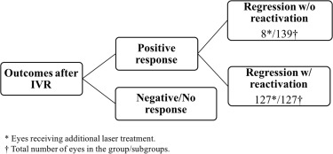
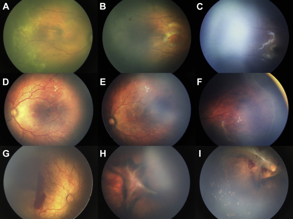

# 雷珠单抗注射液作为早产儿视网膜病变患者解剖学结局及影响因素的主要治疗

Ranibizumab Injection as Primary Treatment in Patients with Retinopathy of Prematurity Anatomic Outcomes and Influencing Factors

> 上海交通大学医学院附属欣华医院眼科，中国 上海
>
> 2017年8月
> [Ophthalmology]
> Q1: 13.2

## Abstract  
### Purpose  目的
To investigate the anatomic outcomes and influencing factors of ranibizumab in the treatment of retinopathy of prematurity (ROP).
探讨雷珠单抗治疗早产儿视网膜病变 （ROP） 的解剖学结局和影响因素。
### Design  设计
Retrospective case series.
回顾性病例系列。
### Participants  参与者
A total of 283 eyes of 145 patients with type 1 ROP treated with intravitreal injection of ranibizumab (IVR) as primary treatment.
145 名 1 型 ROP 患者的 283 只眼接受玻璃体内注射雷珠单抗 （IVR） 作为主要治疗。
### Methods  方法
Retrospective review of infants who were diagnosed with type 1 ROP and accepted IVR (0.25 mg/0.025 ml) as primary treatment from January 2012 to August 2015. The anatomic outcomes and the influencing factors were analyzed.
对 2012年1月至 2015年8月诊断为 1 型 ROP 并接受 IVR （0.25 mg/0.025 ml） 作为主要治疗的婴儿进行回顾性评价。分析解剖学结局及影响因素。
### Main Outcome Measures  主要结局指标
Anatomic outcomes of ROP eyes after IVR and the influencing factors.
IVR 后 ROP 眼的解剖结果及影响因素。
### Results  结果
A total of 283 eyes of 145 patients were included in this study. There were a total of 266 eyes (94.0%) in the positive response group and 17 eyes (6.0%) in the negative/no response group after IVR. Within the positive response group, 139 eyes (48.6%) were in the regression without reactivation subgroup, and 127 eyes (44.9%) were in the regression with reactivation subgroup. A total of 152 eyes received additional laser or surgical treatment. At the last visit, 278 eyes (98.2%) had attached retinas, and 5 eyes (1.8%) had retinal detachment. A classification tree model showed that for patients with gestational age (GA) ≤29.5 weeks, the possibility of experiencing reactivation after IVR is higher than that of those with GA >29.5 weeks (61.6% vs. 29.6%). Moreover, for patients with GA ≤29.5 weeks, those diagnosed with zone II stage 2+ ROP have a lower possibility of experiencing reactivation than other patients (37.9% vs. 80%).

本研究共纳入 145 名患者的 283 只眼睛。IVR 后阳性反应组共有 266 只眼 （94.0%），阴性/无反应组共有 17 只眼 （6.0%）。在阳性反应组中，139 只眼 （48.6%） 属于无再激活的回归亚组，127 只眼 （44.9%） 位于有再激活的回归亚组中。共有 152 只眼睛接受了额外的激光或手术治疗。最后一次就诊时，278 只眼 （98.2%） 有视网膜附着，5 只眼 （1.8%） 有视网膜脱离。分类树模型显示，胎龄 （GA） ≤29.5 周的患者，IVR 后再激活的可能性高于 GA >29.5 周的患者（61.6% 对 29.6%）。此外，对于 GA ≤29.5 周的患者，诊断为 II 区 2+ ROP 的患者发生再激活的可能性低于其他患者（37.9% 对 80%）。
### Conclusions  结论
Intravitreal injection of ranibizumab seemed to be effective in treating patients with ROP. After treatment, there were primarily 3 different outcomes. Our predictive tree model is helpful for ophthalmologists to evaluate the risk of reactivation.

玻璃体内注射雷珠单抗似乎对治疗 ROP 患者有效。治疗后，主要有 3 种不同的结局。我们的预测树模型有助于眼科医生评估再激活的风险。

## Abbreviations and Acronyms    缩写和首字母缩略词
APROP (aggressive posterior retinopathy of prematurity)
APROP（侵袭性早产儿后部视网膜病变）
BW (birth weight)
BW（出生体重）
GA (gestational age)
GA（胎龄）
IVB (intravitreal injection of bevacizumab)
IVB（玻璃体内注射贝伐珠单抗）
IVR (intravitreal injection of ranibizumab)
IVR（玻璃体内注射雷珠单抗）
NICU (neonatal intensive care unit)
NICU（新生儿重症监护病房）
PMA (postmenstrual age)
PMA（绝经后年龄）
PNA (postnatal age)
PNA（出生后年龄）
ROP (retinopathy of prematurity)
ROP（早产儿视网膜病变）
VEGF (vascular endothelial growth factor)
VEGF（血管内皮生长因子）
## 背景
Retinopathy of prematurity (ROP) is a proliferative disorder of the developing retina in premature infants, and it continues to be a major cause of childhood blindness worldwide.1 The randomized trials Cryotherapy for ROP study and Early Treatment for ROP established cryotherapy for threshold ROP and laser photocoagulation for type 1 ROP, respectively.2,3 Although cryotherapy and laser photocoagulation can cure most cases of ROP, they are relatively destructive to the peripheral retina. The role of vascular endothelial growth factor (VEGF) in pathophysiology of ROP has been intensively studied, and various anti-VEGF drugs are used to treat ROP. The prospective, controlled, randomized, multicenter trial about anti-VEGF treatment for ROP—Bevacizumab Eliminates the Angiogenic Threat of Retinopathy of Prematurity—showed that bevacizumab was effective in treating ROP and was more effective than laser treatment in zone I ROP cases.4 Since then, other scholars have published the results of anti-VEGF drugs for treating ROP.5–7 Among them, bevacizumab has been the most reported thus far, and there have been only a few case reports or small case series of ranibizumab treatment. Bevacizumab is a humanized function-blocking monoclonal full-length murine antibody that binds to all VEGF isoforms.8 Ranibizumab is a humanized recombinant G1 kappa isotype antibody fragment. It is structurally derived from the light chains of bevacizumab but has approximately 10 times greater affinity for VEGF. Bevacizumab is approximately 3 times larger than ranibizumab (149 vs. 48 kDa), and its higher molecular weight results in an intravitreal half-life that is 36% higher than that of ranibizumab.9 Ranibizumab appeared transiently in systemic circulation and was rapidly cleared. Serum VEGF levels decrease after bilateral injection of 0.2 mg of ranibizumab, reaching a nadir at approximately 2 weeks and returning to normal levels 4 weeks after injection.10,11 Bevacizumab, by contrast, was cleared relatively slowly from systemic circulation. It was found to enter the systemic circulation 1 day after intravitreal injection of bevacizumab (IVB) and to remain detectable for 8 weeks in the patients with ROP who received 0.625 mg IVB.12 We report our experience of the intravitreal injection of ranibizumab (IVR) in the treatment of ROP by collecting a large number of cases. We also discuss potential prognostic factors with regard to the outcomes after IVR.

早产儿视网膜病变 （ROP） 是早产儿视网膜发育中的一种增生性疾病，它仍然是全球儿童失明的主要原因。 1 随机试验 ROP 冷冻疗法研究和 ROP 早期治疗分别建立了阈值 ROP 的冷冻疗法和 1 型 ROP 的激光光凝术。 2,3 尽管冷冻疗法和激光光凝术可以治愈大多数 ROP 病例，但它们对周边视网膜的破坏性相对较大。血管内皮生长因子 （VEGF） 在 ROP 病理生理学中的作用已得到深入研究，各种抗 VEGF 药物用于治疗 ROP。关于抗 VEGF 治疗 ROP 的前瞻性、对照、随机、多中心试验——贝伐珠单抗消除了早产儿视网膜病变的血管生成威胁——表明贝伐珠单抗治疗 ROP 有效，并且在 I 区 ROP 病例中比激光治疗更有效。 4 从那时起，其他学者发表了治疗 ROP 的抗 VEGF 药物的结果。 5–7 其中，贝伐珠单抗是迄今为止报道最多的，只有少数病例报告或雷珠单抗治疗的小病例系列。贝伐珠单抗是一种人源化功能阻断单克隆全长小鼠抗体，可与所有 VEGF 亚型结合。 8 Ranibizumab 是一种人源化重组 G1 kappa 同种型抗体片段。它在结构上来源于贝伐珠单抗的轻链，但对 VEGF 的亲和力大约高 10 倍。贝伐珠单抗大约是雷珠单抗的 3 倍（149 kDa 对 48 kDa），其较高的分子量导致玻璃体内半衰期比雷珠单抗高 36%。 9 雷珠单抗短暂出现在体循环中，并迅速被清除。双侧注射 0.2 mg 雷珠单抗后血清 VEGF 水平降低，在大约 2 周达到最低点，并在注射后 4 周恢复到正常水平。 10,11 相比之下，贝伐珠单抗从体循环中清除的速度相对较慢。发现它在玻璃体内注射贝伐珠单抗 （IVB） 后 1 天进入体循环，并且在接受 0.625 mg IVB 的 ROP 患者中保持可检测 8 周。 12 我们通过收集大量病例报告了玻璃体内注射雷珠单抗 （IVR） 治疗 ROP 的经验。我们还讨论了 IVR 后结局的潜在预后因素。

## Methods  方法
### Study Design  研究设计
This was a retrospective study that was conducted in tertiary-level neonatal intensive care units (NICUs) and the referral ROP screening center in Xinhua Hospital, affiliated to Shanghai Jiao Tong University School of Medicine. Consecutive patients who were diagnosed with ROP and accepted IVR as primary treatment from January 2012 to August 2015 at Xin Hua Hospital Affiliated to Shanghai Jiao Tong University School of Medicine were included. Their complete medical records were reviewed, and patients who were followed up for less than 6 months were excluded. All of the infants with ROP who required treatment were hospitalized in the NICU. This study was conducted with Institutional Review Board approval and adhered to the tenets of the Declaration of Helsinki. The legal guardian of each patient signed a consent form before any examination or treatment.

这是一项在上海交通大学医学院附属新华医院的三级新生儿重症监护病房 （NICU） 和转诊 ROP 筛查中心进行的回顾性研究。纳入 2012年1月至 2015年8月在上海交通大学医学院附属欣华医院确诊为 ROP 并接受 IVR 作为主要治疗的患者。审查了他们的完整病历，并排除了随访时间少于 6 个月的患者。所有需要治疗的 ROP 婴儿都在 NICU 住院。这项研究是在机构审查委员会的批准下进行的，并遵守了赫尔辛基宣言的原则。每位患者的法定监护人在进行任何检查或治疗前签署同意书。
### Screening and Treatment  筛查和治疗
Infants were screened for ROP if they were born at gestational age (GA) <32 weeks and their birth weight (BW) was <2000 g or if they had an unstable clinical course, as determined by the infant's neonatologist according to Chinese guidelines. The first screening was at 4 to 6 weeks after birth or at 31 to 32 weeks postmenstrual age (PMA), whichever came first. The International Classification of Retinopathy of Prematurity 2005 was used. At the screening and follow-up, all cases had fundus photography by RetCam Imaging System (Clarity Medical System, Pleasanton, CA). In some patients, additional examinations were performed under anesthesia after IVR for intraocular pressure via an iCare tonometer (Icare Finland Oy, Vantaa, Finland) and the axial length via a B-scan (Quantel Medical, Clermont-Ferrand, France). The cycloplegic agent used was tropicamide phenylephrine eye drops (Santen Pharmaceutical Co., Ltd., Osaka, Japan). Treated infants were kept hospitalized for at least 2 weeks after IVR in the NICU, where the systemic conditions of the infants were evaluated before and after injection, including the oxygen saturation, complete blood count, renal and liver function tests, chest x-rays, and abdomen and head ultrasound examinations.

如果婴儿出生时胎龄 （GA） <32 周且出生体重 （BW） 为 <2000 g，或者他们的临床病程不稳定，由婴儿的新生儿科医生根据中国指南确定，则进行 ROP 筛查。第一次筛查在出生后 4 至 6 周或胎龄后 31 至 32 周 （PMA） 时进行，以先到者为准。使用 2005 年早产儿视网膜病变国际分类。在筛查和随访中，所有病例均通过 RetCam 成像系统 （Clarity Medical System， Pleasanton， CA） 进行眼底摄影。在一些患者中，在 IVR 后在麻醉下通过 iCare 眼压计（Icare Finland Oy，Vantaa，Finland）进行眼轴长度的额外检查，并通过 B 扫描（Quantel Medical，Clermont-Ferrand，法国）进行眼轴长度检查。使用的睫状肌麻痹剂是托吡卡胺去氧肾上腺素滴眼液（Santen Pharmaceutical Co.， Ltd.，Osaka，Japan）。接受治疗的婴儿在 NICU 进行 IVR 后住院至少 2 周，在注射前后评估婴儿的全身状况，包括血氧饱和度、全血细胞计数、肾和肝功能检查、胸部 X 线检查以及腹部和头部超声检查。

The indications for IVR as a primary treatment were patients who met the criteria for type 1 ROP used in the Early Treatment for Retinopathy of Prematurity study.3 A 0.25 mg/0.025 ml dose of ranibizumab (half of the dose administered intravitreally in adults for ocular neovascular diseases)4,13,14 was injected into each eye, using the following technique: topical anesthesia, sterile gloves, insertion of a lid speculum, instillation of topical povidone-iodine, injection of ranibizumab with a sterile 30-gauge 0.5-inch needle at 0.5 to 1 mm posterior to the limbus, removal of the needle with simultaneous compression using a sterile cotton tip, instillation of topical tobramycin, and removal of the speculum. If the other eye was to be treated, new equipment was used. After injection, the patients underwent binocular indirect ophthalmoscopy to assess the lens clarity, retinal breaks, and retinal artery or optic nerve perfusion.6,15 The patients were reexamined the next day and then every week to monitor the progression of the disease until full vascularization was noted or additional treatment was given. The IVR injection, laser treatment, lensectomy, and vitrectomy were all performed by the same experienced surgeon (P.Z.).

将 IVR 作为主要治疗的适应症是符合早产儿视网膜病变早期治疗研究中使用的 1 型 ROP 标准的患者。 3 使用以下技术将 0.25 mg/0.025 ml 剂量的雷珠单抗（成人玻璃体内注射用于眼部新生血管疾病的剂量的一半） 4,13,14 注射到每只眼睛中：局部麻醉、无菌手套、插入眼睑窥器、局部聚维酮碘滴注、用无菌 30 号 0.5 英寸针头在角膜缘后 0.5 至 1 mm 处注射雷珠单抗， 使用无菌棉签同时加压去除针头，滴注局部妥布霉素，并去除窥器。如果要治疗另一只眼睛，则使用新设备。注射后，患者接受双眼间接检眼镜检查，以评估晶状体清晰度、视网膜裂孔和视网膜动脉或视神经灌注。 6,15 第二天对患者进行复查，然后每周复查以监测疾病的进展，直到发现完全血管形成或给予额外治疗。IVR 注射、激光治疗、晶状体切除术和玻璃体切除术均由同一位经验丰富的外科医生 （PZ） 进行。
### Classification of Patients    患者分类
We classified all eyes into 2 groups according to their response to a single IVR: the positive response group and the negative/no response group (Fig 1). Furthermore, the positive response group was classified into 2 subgroups: the regression without reactivation subgroup and the regression with reactivation subgroup. The positive response group was defined as follows: Ridge and venous dilation and arteriolar tortuosity of the posterior retinal vessels (plus disease)16 regressed after IVR, and retinal vessels continued to develop into the peripheral area. The negative/no response group was defined as follows: ROP worsened after IVR and developed into Stage 4A, 4B, or 5, or plus disease and ridge did not show any change 1 week after IVR. The regression without reactivation subgroup was defined as plus disease, ridge regressed after IVR without reoccurrence, and flat retina was achieved at the last visit.6 The regression with reactivation subgroup was defined as eyes with reoccurrence of plus disease or ridge during follow-up. Considering the economic burden and difficulty of obeying a prolonged follow-up schedule more than 6 months in most cases, we chose laser as a re-treatment for patients in the regression with reactivation subgroup.

我们根据眼睛对单个 IVR 的反应将所有眼睛分为 2 组：阳性反应组和阴性/无反应组（图 1）。此外，阳性反应组分为 2 个亚组： 无再激活的回归亚组和有再激活的回归亚组。阳性反应组定义如下： IVR 后视网膜后血管 （合并疾病） 16 的嵴和静脉扩张以及小动脉迂曲消退，视网膜血管继续向外周区域发展。阴性/无反应组定义如下： IVR 后 ROP 恶化并发展为 4A 、 4B 或 5 期，或加上疾病，IVR 后 1 周岭未显示任何变化。无再激活的消退亚组定义为加疾病，IVR 后脊消退无复发，最后一次就诊时达到平坦视网膜。 6 再激活亚组回归定义为随访期间复发 plus 疾病或脊的眼睛。考虑到在大多数情况下，遵守超过 6 个月的长期随访计划的经济负担和难度，我们选择激光作为再激活回归亚组中患者的再治疗。

### Data Analysis  数据分析
We performed statistical analysis with the program IBM SPSS 22 (SPSS Inc., Chicago, IL). Kolmogorov–Smirnov tests were used to analyze the distribution of the samples, and chi-square and Fisher exact tests were performed to compare categoric data. The independent t test and Kruskal–Wallis test were used to compare the means. Logistic regression analyses were performed to assess the impact of various patient and treatment factors on the outcomes after IVR. The categoric dependent variable was the ROP regression. The predictor variables were GA, BW, PMA at injection, postnatal age (PNA) at injection, and initial ROP classification. A decision tree was constructed to predict the outcomes of IVR. A P value < 0.05 was considered significant.

我们使用 IBM SPSS 22 程序 （SPSS Inc.， Chicago， IL） 进行了统计分析。采用 Kolmogorov-Smirnov 检验分析样本分布，采用卡方检验和 Fisher 精确检验比较分类数据。采用独立 t 检验和 Kruskal-Wallis 检验比较均值。进行 Logistic 回归分析以评估各种患者和治疗因素对 IVR 后结局的影响。分类因变量是 ROP 回归。预测变量为 GA 、 BW 、 注射时 PMA 、 注射时出生年龄 （PNA） 和初始 ROP 分类。构建决策树来预测 IVR 的结果。P 值< 0.05 被认为是显著的。

## Results  结果
A total of 283 eyes of 146 patients were included. There were 97 male and 49 female patients. The ROP types and the mean GA of the patients are presented in Table 1.
共纳入 146 例患者的 283 只眼。有 97 例男性和 49 例女性患者。ROP 类型和患者的平均 GA 见表 1。

> Table 1  表 1
> Retinopathy of Prematurity Types and Mean Gestational Age of Patients
> 早产儿类型的视网膜病变和患者的平均胎龄
> APROP = aggressive posterior retinopathy of prematurity; GA = gestational age; NA = not applicable; ROP = retinopathy of prematurity; SD = standard deviation.
> APROP = 侵袭性早产儿后部视网膜病变;GA = 胎龄;NA = 不适用;ROP = 早产儿视网膜病变;SD = 标准差。

According to our classification scheme, there were a total of 266 eyes (94.0%) in the positive response group and 17 eyes (6.0%) in the negative/no response group (Fig 2).
根据我们的分类方案，阳性反应组共有 266 只眼睛 （94.0%），阴性/无反应组共有 17 只眼睛 （6.0%） （图 2）。

> Figure 2 Fundus photographs of the patients in different subgroups. Patient number 240 in the regression without reactivation subgroup had zone II stage 2+ retinopathy of prematurity (ROP) at 36 weeks postmenstrual age (PMA) (A). The ROP regressed after 1 week of intravitreal injection of ranibizumab (IVR) (B). After 40 weeks of IVR (76 weeks PMA), ROP regressed with vascularization of zone 3 (C). Patient number 151 in the regression with reactivation subgroup had IVR at 36 weeks PMA for aggressive posterior retinopathy of prematurity (APROP) (D). Then, ROP regressed (E) after 1 week of injection but had reactivation at 46 weeks PMA (F). Patient number 18 in the negative/no response group had IVR at 35 weeks PMA for APROP (G). After IVR, the posterior fibrosis got worse and ROP progressed to stage 4b (H). He then received laser treatment and vitrectomy. At the latest follow-up, the fibrous membrane traction was significantly released (I).
> 图 2不同亚组患者的眼底照片。无再激活回归亚组中的 240 号患者在胎龄 36 周时出现 II 区 2+ 早产儿视网膜病变 （ROP） （PMA） （A）。玻璃体内注射雷珠单抗 （IVR） 1 周后 ROP 消退 （B）。IVR 40 周后 （76 周 PMA），ROP 消退，第 3 区 （C） 血管形成。再激活回归亚组中的第 151 例患者在 36 周 PMA 时患有侵袭性早产儿后部视网膜病变 （APROP） 的 IVR （D）。然后，注射 1 周后 ROP 消退 （E），但在 PMA 46 周时重新激活 （F）。阴性/无反应组中的第 18 号患者在 35 周 PMA 时 APROP （G） 的 IVR。IVR 后，后纤维化恶化，ROP 进展至 4b 期 （H）。然后他接受了激光治疗和玻璃体切除术。在最近的随访中，纤维膜牵引显着释放 （I）。

> Table 2  表 2
> Patient Characteristics Compared within Different Groups
不同组内患者特征比较
BW = birth weight; IVR = intravitreal injection of ranibizumab; PMA = postmenstrual age; PNA = postnatal age; SD = standard deviation.
BW = 出生体重;IVR = 雷珠单抗玻璃体内注射;PMA = 绝经后年龄;PNA = 出生后年龄;SD = 标准差。
∗
P value compares regression subgroup with reactivation subgroup.
P 值比较回归亚组和再激活亚组。
†
P value compares positive response group with negative response group.
> P 值比较了阳性反应组和阴性反应组。

