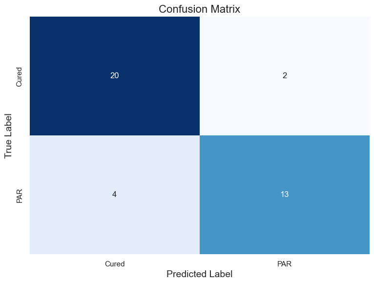

# 早产儿视网膜病变逻辑回归、随机森林、Cox回归

## 一、技术路线


## 二、探索数据

### 2.1 连续变量

```python
[
    'Birth_weight',                # 出生体重（g）
    'PMA',                         # 注射时的矫正胎龄（weeks）
    'Gestational_age',             # 出生胎龄（weeks）
    'RVOS',                        # 血管生长速度（DD/month)
    'Days_since_birth_at_surgery'  # 注射时的胎龄（days）
]
```


### 2.2 分类变量

```python
[
    'Eye',                   # Eye (L 1, R 2)
    'Outcome',               # Outcome(1=完全血管化；2=PAR）
    'Gender',                # Gender (Male 1, Female 2)# 性别（1=男，2=女）
    'Comorbid_Conditions',   # Comorbid_Conditions 合并症（0=否，1=是）
    'Lesion_severity',       # Lesion_severity ROP分期(1=2期;2=3期;3=AROP）
    'CCH',                   # CCH  疾病钟点数  
    'ROP_region',            # ROP_region    ROP_分区
    'Ridge_hemorrhage',      # Ridge_hemorrhage  脊上出血（0=否，1=是）
    'Fetal_number'           # Fetal_number  胎数（1=单胎；2=双胎）
]
```


### 2.3 相关性热图


该热图呈现了15个变量间的相关性系数矩阵，包括14个预测变量和一个二分类的结局变量（Outcome）。颜色梯度从蓝色（代表负相关）到红色（代表正相关），颜色的深浅反映了相关性的强度，其中1表示完全正相关，-1表示完全负相关，0表示无线性相关。

从图中可以观察到：
- “Days_since_birth_at_surgery”与“PMA”呈现中等程度的正相关（0.66）。
- “Gestational_age”与“Birth_weight”呈现显著的正相关（0.87），这与预期一致，因为较长的出生胎龄通常与较高的出生体重相关。

总体而言，该热图提供了变量间线性关系的直观展示，有助于识别潜在的预测因子和理解变量间的相互关系。需要注意的是，相关性不等于因果关系，因此在解释这些结果时应谨慎。

## 三、单因素分析

### 3.1 连续变量
对于连续变量：
- 符合正态分布的，使用t检验；
- 不符合正态分布的，使用U检验。

可能是数据量太少，也可能是变量本身是偏态分布的，下面五个连续变量均不满足正态性检验，故采取非参数检验中的U检验。

```python
[
    'Birth_weight',                # 出生体重（g）
    'PMA',                         # 注射时的矫正胎龄（weeks）
    'Gestational_age',             # 出生胎龄（weeks）
    'RVOS',                        # 血管生长速度（DD/month)
    'Days_since_birth_at_surgery'  # 注射时的胎龄（days）
]
```
检验结果如下：


出生体重、出生胎龄、血管生长速度(DD/month)、注射时的胎龄（days）的p值小于0.05，可以拒绝原假设，认为这些变量与结局变量之间存在显著差异。


### 3.2 分类变量

对于分类变量，使用卡方检验。

```python
[
    'Eye',                   # Eye (L 1, R 2)
    'Outcome',               # Outcome(1=完全血管化；2=PAR）
    'Gender',                # Gender (Male 1, Female 2)# 性别（1=男，2=女）
    'Comorbid_Conditions',   # Comorbid_Conditions 合并症（0=否，1=是）
    'Lesion_severity',       # Lesion_severity ROP分期(1=2期;2=3期;3=AROP）
    'CCH',                   # CCH  疾病钟点数  
    'ROP_region',            # ROP_region    ROP_分区
    'Ridge_hemorrhage',      # Ridge_hemorrhage  脊上出血（0=否，1=是）
    'Fetal_number'           # Fetal_number  胎数（1=单胎；2=双胎）
]
```
检验结果如下：


ROP分期(1=2期;2=3期;3=AROP)、疾病钟点数、ROP_分区、脊上出血（0=否，1=是）的p值小于0.05，可以拒绝原假设，认为这些变量与结局变量之间存在显著差异。

综上所述，在单因素分析的结果中，存在显著差异的变量有：

```python
- 'Birth_weight', 
- 'Gestational_age', 
- 'RVOS', 
- 'Days_since_birth_at_surgery',
- 'Lesion_severity', 
- 'CCH', 
- 'ROP_region', 
- 'Ridge_hemorrhage'
```
上述八个变量中，前四个为连续变量，后四个为分类变量。

## 四、检查多重共线性

> 方差膨胀因子（Variance Inflation Factor, VIF）分析结果

方差膨胀因子（VIF）是一种用于评估回归模型中多重共线性的统计量度。VIF 值大于 10 通常被认为指示显著的多重共线性问题，而值在 5 到 10 之间则表明存在中等程度的多重共线性。本研究对方差膨胀因子进行了计算，以评估模型中各特征变量之间的共线性程度。

### 4.1 分析结果

下表展示了模型中各特征变量的方差膨胀因子：

| 特征变量                      | VIF 值     |
|-----------------------------|------------|
| const（常数项）               | 801.77     |
| Birth_weight（出生体重）       | 4.44       |
| Gestational_age（出生胎龄（weeks））   | 4.74       |
| RVOS（血管生长速度(DD/month)）       | 1.20       |
| Days_since_birth_at_surgery（注射时的胎龄（days）） | 1.72       |
| Lesion_severity（ROP分期(1=2期;2=3期;3=AROP）） | 2.15       |
| CCH（疾病钟点数）          | 3.02       |
| ROP_region（ROP_分区）  | 1.93       |
| Ridge_hemorrhage（脊上出血（0=否，1=是）） | 1.38       |

### 4.2 结果解释

- **常数项**（const）的 VIF 值异常高，这是预期的，因为常数项不涉及多重共线性问题。
- **出生体重**（Birth_weight）和**妊娠年龄**（Gestational_age）的 VIF 值分别为 4.44 和 4.74，表明这两个特征变量之间存在一定程度的多重共线性，但未达到严重程度。
- 其余特征变量的 VIF 值均小于 2，表明它们之间的多重共线性问题不显著。

### 4.3 结论

根据方差膨胀因子的计算结果，模型中大多数特征变量之间的多重共线性问题不严重。然而，对于 VIF 值较高的特征变量，如出生体重和妊娠年龄，建议在模型优化过程中予以关注，可能需要进一步的变量选择或转换以降低共线性影响。

## 五、逻辑回归模型


```python
- 'Birth_weight', 
- 'Gestational_age', 
- 'RVOS', 
- 'Days_since_birth_at_surgery',
- 'Lesion_severity', 
- 'CCH', 
- 'ROP_region', 
- 'Ridge_hemorrhage'
```

逻辑回归模型用于预测二元变量（0/1）。本研究使用逻辑回归模型，基于上述提到的8个变量来预测结局变量（Outcome）。

### 5.1 结果：


1. 混淆矩阵


2. ROC曲线


3. 特征重要性


#### 5.1.1 逻辑回归模型特征重要性分析

在本研究中，我们对逻辑回归模型的特征重要性进行了详细分析，以评估各特征变量对模型预测结果的贡献程度。特征重要性通过模型的系数（`coef_`）计算得出，系数的绝对值越大，表明该特征对模型的影响越显著。

##### 5.1.1.1 特征重要性分析结果

通过对模型系数的分析，我们得出了各特征的重要性排序，如下表所示：

| 特征名称                     | 重要性系数  |
|-----------------------------|------------|
| Lesion_severity              | 1.031690   |
| CCH                         | 0.757051   |
| Days_since_birth_at_surgery  | 0.454653   |
| Ridge_hemorrhage             | 0.180353   |
| Birth_weight                | -0.039306  |
| Gestational_age             | -0.175888  |
| ROP_region                  | -0.288078  |
| RVOS                        | -2.010271  |

##### 5.1.1.2结果解读

1. **Lesion_severity**：该特征在模型中显示出最高的正向重要性系数（1.031690），表明其对预测结果具有显著的正向影响，是模型中重要的预测变量。

2. **CCH**：该特征的重要性系数为0.757051，次于病变严重程度，同样对模型预测结果具有显著的正向影响。

3. **Days_since_birth_at_surgery**：该特征的重要性系数为0.454653，表明其对模型预测结果具有中等程度的正向影响。

4. **Ridge_hemorrhage**：该特征的重要性系数为0.180353，对模型预测结果具有较小的正向影响。

5. **Birth_weight、Gestational_age、ROP_region**：这些特征的重要性系数分别为-0.039306、-0.175888和-0.288078，表明它们对模型预测结果具有较小的负向影响。

6. **RVOS**：该特征在模型中显示出最高的负向重要性系数（-2.010271），表明其对预测结果具有显著的负向影响，是需要特别关注的特征。

##### 5.1.1.3 结论

本研究通过对逻辑回归模型的特征重要性分析，揭示了各特征变量对模型预测结果的贡献程度。（Lesion_severity）和（CCH）是影响模型预测结果的两个重要的特征，而（RVOS）则显示出显著的负向影响。这些发现为我们理解模型的预测机制提供了重要的见解，并为进一步优化模型提供了有价值的参考。在后续研究中，我们可以根据这些特征的重要性，对模型进行特征选择或特征工程，以提高模型的预测性能和解释能力。


4. 模型预测与真实结果的比较


5. 分类报告


## 六、随机森林模型


```python
- 'Birth_weight', 
- 'Gestational_age', 
- 'RVOS', 
- 'Days_since_birth_at_surgery',
- 'Lesion_severity', 
- 'CCH', 
- 'ROP_region', 
- 'Ridge_hemorrhage'
```

本研究使用随机森林模型，基于上述提到的8个变量来预测结局变量（Outcome）。

### 6.1 混淆矩阵



该混淆矩阵展示了一个随机森林模型在二分类任务中的性能表现，其中结局变量包括两个类别：“Cured”（完全血管化）和“PAR”。矩阵的行表示真实标签，列表示模型预测的标签。
- 真正类（True Positives, TP）：模型正确预测为“Cured”的样本数为20。
- 假正类（False Positives, FP）：模型错误预测为“Cured”但实际为“PAR”的样本数为2。
- 假负类（False Negatives, FN）：模型错误预测为“PAR”但实际为“Cured”的样本数为4。
- 真负类（True Negatives, TN）：模型正确预测为“PAR”的样本数为13。
该混淆矩阵提供了模型性能的直观展示，有助于评估模型的分类准确性和错误类型。总体而言，该模型在识别“Cured”类别上表现较好，但在识别“PAR”类别时存在一定的误差。进一步的模型优化可能需要关注减少假负类错误，以提高对“PAR”类别的识别能力。

### 6.2 分类报告


该分类报告提供了随机森林模型在二分类任务中的性能评估。结局变量为二分类，包括“0”和“1”两类。报告中包含每个类别的精确度（precision）、召回率（recall）、F1分数（f1-score）以及支持度（support），同时提供了模型的整体准确性（accuracy）、宏平均（macro avg）和加权平均（weighted avg）指标。
#### 分类性能
- 类别“0”的精确度为0.83，召回率为0.91，F1分数为0.87，表明模型在识别该类别时具有较高的准确性和召回能力。
- 类别“1”的精确度为0.87，召回率为0.76，F1分数为0.81，显示模型在识别该类别时精确度较高，但召回率相对较低，可能存在较多的假阴性错误。
#### 整体性能
- 模型的整体准确性为0.85，表示模型正确分类的比例为85%。
- 宏平均（macro avg）精确度、召回率和F1分数均为0.85，表明模型在各类别上的性能较为均衡，但对类别“1”的召回率有待提高。
- 加权平均（weighted avg）精确度、召回率和F1分数分别为0.85、0.85和0.84，考虑了各类别样本数的差异，进一步验证了模型在类别“0”上的性能优于类别“1”。
#### 结论
综上所述，随机森林模型在本次二分类任务中表现良好，尤其在识别类别“0”时表现突出。然而，对于类别“1”，模型的召回率较低，提示在实际应用中可能需要进一步优化以减少假阴性错误。未来的工作可能包括特征工程、模型参数调整或采用其他算法以提高模型对类别“1”的识别能力。


### 6.3 ROC曲线


### 6.4 特征重要性


特征重要性图展示了各个特征对模型预测结果的影响程度。特征重要性越高，表示该特征对模型预测的贡献越大。
从图中可以看出：
- RVOS 是最重要的特征，其重要性值最高，约为 0.40。
- Gestational_age 和 CCH 也具有较高的重要性，分别约为 0.14 和 0.13。
- Birth_weight 和 Days_since_birth_at_surgery 也有一定的重要性，分别约为 0.12 和 0.11。
- Lesion_severity、ROP_region 和 Ridge_hemorrhage 的重要性较低，分别约为 0.002、0.02 和 0.03。


### 6.5 随机森林的第一棵树


该图示为随机森林算法中单一决策树的可视化结构。该决策树用于预测二分类结局变量“Outcome”，其可能的取值为“Cured”（完全血管化）和“PAR”。图中的每个节点表示一个决策规则，基于特征变量的阈值进行数据的划分。
在树的根部，模型首先根据“CCH”的特征值进行初步划分，阈值为0.261。若“CCH”小于或等于0.261，则数据被导向左子树进一步分类；若大于0.261，则导向右子树。每个内部节点的“gini”值代表基尼不纯度（Gini impurity），值越低表示节点的纯度越高。每个叶节点显示了最终的分类结果，即“Cured”或“PAR”，以及该节点中样本的分布情况。
例如，当“CCH”小于或等于0.261时，模型进一步根据“RVOS”的特征值进行划分。若“RVOS”小于或等于-0.301，则大多数样本（37个中的44个）被分类为“Not Cured”（未完全血管化）。若“RVOS”大于-0.301，则根据“Gestational_age”继续划分，以此类推。

该决策树的结构揭示了模型如何利用特征变量及其阈值进行分类决策。通过递归地划分特征空间，模型能够识别出对结局变量有显著影响的特征组合。此可视化有助于理解模型的决策过程，并为进一步的特征选择和模型优化提供依据。需要注意的是，单一决策树可能存在过拟合的风险，而随机森林通过集成多棵决策树来提高模型的泛化能力和稳健性。

### 6.6 随机森林的第二棵树


### 6.7 随机森林的第三棵树


一共100棵树，这里就不一一列举了。

## 七、Cox回归

Cox回归是一种用于分析生存时间数据的回归分析方法，它适用于 censored survival data（生存时间数据）。Cox回归通过拟合生存函数来解释变量对生存时间的影响，并考虑 censoring（缺失 ）情况。

在本研究中，完全血管化的患者记录血管化的时间，作为Cox回归模型的生存时间，对于PAR的患者，将随访时间作为血管化的时间，这里的随访时间为100 week


### Cox比例风险模型结果

#### 模型信息
- **模型类型**: `lifelines.CoxPHFitter`
- **生存时间列**: `'Time_to_vascularization'`
- **事件列**: `'Outcome'`
- **基线估计方法**: `breslow`
- **观测数量**: 128
- **观察到的事件数量**: 128
- **部分对数似然值**: -470.82
- **拟合时间**: 2025年2月1日 11:46:39 UTC

#### 变量系数估计
| 变量 | 系数 | 风险比 (HR) | 标准误差 | 95% CI 下限 | 95% CI 上限 | HR 下限 | HR 上限 | z 值 | p 值 | -log2(p) |
|------|------|------------|----------|-------------|-------------|---------|---------|------|------|----------|
| Birth_weight | -0.00 | 1.00 | 0.00 | -0.00 | 0.00 | 1.00 | 1.00 | 0.00 | -0.61 | 0.54 | 0.88 |
| Gestational_age | -0.01 | 0.99 | 0.10 | -0.20 | 0.17 | 0.82 | 1.19 | 0.00 | -0.14 | 0.89 | 0.17 |
| RVOS | 0.70 | 2.01 | 0.16 | 0.38 | 1.01 | 1.46 | 2.75 | 0.00 | 4.32 | <0.005 | 15.96 |
| Days_since_birth_at_surgery | -0.02 | 0.98 | 0.01 | -0.03 | -0.00 | 0.97 | 1.00 | 0.00 | -2.42 | 0.02 | 6.02 |
| Lesion_severity_3 | -0.71 | 0.49 | 0.27 | -1.24 | -0.17 | 0.29 | 0.84 | 0.00 | -2.59 | 0.01 | 6.72 |
| Lesion_severity_AROP | 0.08 | 1.09 | 0.65 | -1.19 | 1.36 | 0.30 | 3.89 | 0.00 | 0.13 | 0.90 | 0.16 |
| CCH | -0.26 | 0.77 | 0.08 | -0.43 | -0.10 | 0.65 | 0.91 | 0.00 | -3.12 | <0.005 | 9.11 |
| ROP_region | -0.27 | 0.77 | 0.46 | -1.16 | 0.63 | 0.31 | 1.88 | 0.00 | -0.58 | 0.56 | 0.84 |
| Ridge_hemorrhage | 0.42 | 1.52 | 0.27 | -0.12 | 0.95 | 0.89 | 2.59 | 0.00 | 1.52 | 0.13 | 2.97 |

#### 模型性能指标
- **一致性指数 (Concordance)**: 0.79
- **部分AIC**: 959.64
- **对数似然比检验**: 51.17 (自由度: 9)
- **对数似然比检验的-log2(p)**: 23.88


#### 说明

- **一致性指数 (Concordance)**: 衡量模型预测准确性的指标，值越接近1表示模型预测能力越强。

- **部分AIC**: Akaike信息准则的部分值，用于模型选择，值越小表示模型拟合越好。

- **对数似然比检验**: 用于检验模型的整体显著性，较大的值和较小的p值表示模型显著。

- **变量系数估计**: 包括每个变量的系数、风险比、标准误差及其95%置信区间等统计信息。风险比大于1表示变量与事件发生的风险正相关，小于1表示负相关。


