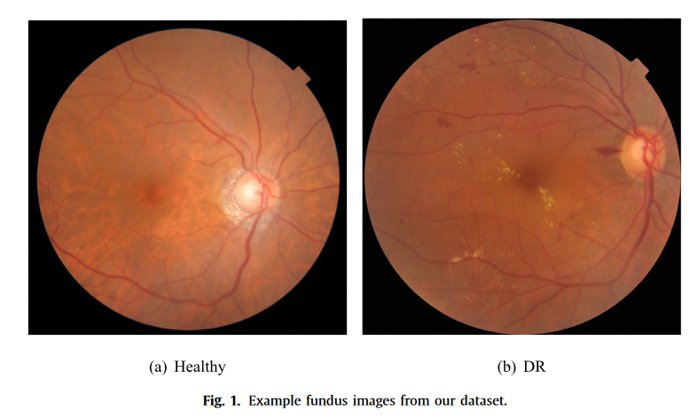
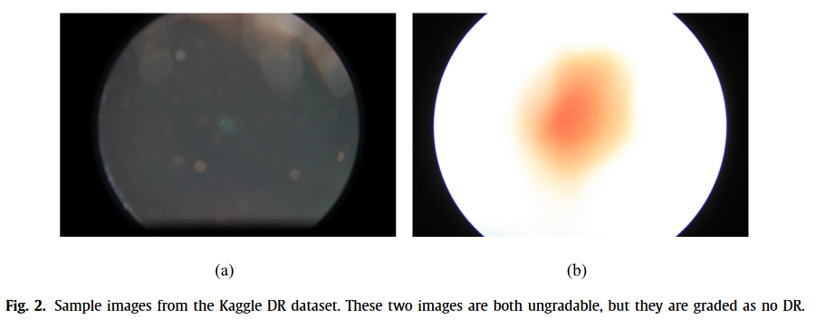

# 深度学习算法用于糖尿病视网膜病变筛查的诊断评估

## 文章信息
> 作者：陶力 a，b，英奇高 a，开王 a，c，宋国 a，韩若刘，洪康 a，e，× 
> 单位：
> > a 南开大学，中国天津 
> > b 网络与数据科学技术重点实验室，南开大学，中国天津 
> > c 医学数据分析与统计研究重点实验室，
> > d 中国首都医科大学首都医科大学附属北京同仁医院，
> > e 中国北京上公医疗技术有限公司

> 文章历史: 
> 2018年12月2日收到
> 2019年6月2日修订版
> 2019年6月5日接受
> 2019年6月5日在线提供

> 关键词: 糖尿病视网膜病变, 眼底图像, 深度学习, 图像分类, 语义分割
> Keywords: Diabetic retinopathy , Fundus image , Deep learning , Image classification , Semantic segmentation

## 摘要
### DR的病因与筛查
糖尿病视网膜病变(DR)是导致工作年龄成年人失明的主要原因，通常通过早期筛查进行干预，以减少视力损失。
### 筛查算法的提出
一系列基于自动深度学习的 DR 筛查算法已经被提出，并取得了很高的灵敏度和特异度(> 90%)。
### 目前算法表现不佳
然而，由于现有公开的眼底图像数据集的局限性，这些深度学习模型在临床应用中表现不佳。
### 收集subjective数据
#### 收集
为了评估这些方法在临床情况下，我们收集了9598名患者的13,673眼底图像。
#### 分类
根据图像质量和 DR 水平，将这些图像分为6个等级，每个等级由7个年级的学生负责。
此外，选择了757张 DR 图像来注释四种类型的 DR 相关病变。
#### 评估模型
最后，我们评估了最先进的深度学习算法，包括图像分类、语义分割和目标检测。
虽然我们在 DR 分类中获得了0.8284的准确率，但是这些算法在病灶分割和检测上表现不佳，表明病灶分割和检测是相当具有挑战性的。
总之，我们正在提供一个新的数据集称为 DDR 评估深度学习模型和进一步探索临床应用，特别是病变识别。

## 1. 引言
### 介绍糖尿病视网膜病变
> 糖尿病视网膜病变会导致视力下降，且患病人群多。
> 及时治疗可以预防视力丧失，但早期筛查是一个挑战。
> 因为，眼底检查常被忽略、DR 筛查耗时、眼科医生数量有限。

糖尿病视网膜病变是一种由糖尿病引起的眼部疾病，是导致工作年龄成年人视力下降的主要原因。
据报道，在美国、欧洲和亚洲，大约1/3(34.6%)的糖尿病患者有一定程度的 DR [16]。
还有一点值得注意，十分之一(10.2%)患有视力受到威胁的 DR [35]。
已有研究表明，DR 导致的视力丧失可以通过及时治疗来预防[32]。
然而，早期筛查 DR 仍然是一个挑战，有几个原因：
- 首先，糖尿病患者一般在医院的内分泌科接受治疗，眼底检查一直被忽视，导致许多患者延迟治疗。
- 其次，DR 筛查过程耗时，因此每天只能处理一定数量的患者。
- 第三，眼科医生的数量无法满足世界各地日益增长的需求，特别是在发展中地区[3]。

#### 深度学习算法的优点

> 深度学习算法不像传统机器学习那样，深度学习算法不需要人工特征工程，而是自动学习特征组合。
> 这使得它具备高效、低成本和对临床医生依赖性小的特点，可以解决上文提到的问题。

自动 DR 筛查是解决上述问题的一种替代方案，具有高效、低成本和对临床医生依赖性最小的优点。与严重依赖于特征工程的传统机器学习方法不同，深度学习算法以层层特征组合的方式自动学习最具预测性的表示[20]。这些方法在计算机视觉领域取得了一系列突破，并已应用于眼底图像分析，如 DR 筛查，病变检测等[2,10,11,31]。

#### 研究与实际之间的鸿沟：数据集

> 研究与实际之间有以下鸿沟：
> 1. 自动 DR 筛查算法只能提供 DR 分级结果，不能令患者信服。
> 2. 公开的 DR 数据集有几个缺点。(分级图片数量有限、包含许多无法分级的图片、图片质量良莠不齐)

> 有两个数据集可以关注一下：
> Messidor 数据集
> Kaggle DR

然而，由于几个原因，研究和实际应用之间仍然存在巨大的差距。
- 1)自动 DR 筛查算法只能提供 DR 分级结果，不能令患者信服。我们认为这是阻止深度学习方法应用于临床的主要因素，因为眼科医生通常根据病变的存在来评估 DR 的严重程度。
- 2)公开的 DR 数据集有几个缺点。例如，Messidor 数据集只包含1200个眼底图像[7] ，这对于深度神经网络来说远远不够。Kaggle DR [18]是最大的眼底图像数据集，但它包含许多无法分级的图像。此外，这些数据集上的性能不能反映临床应用中的真实精度。
- 3)需要大量的数据来训练深度学习模型，以进行图像分类、语义分割和目标检测。深度学习模型的表现与眼底图像的质量密切相关。

#### 我们的数据集DDR
> 我们提供了一个通用的 DR 数据集，称为 DDR，用于 DR 筛查，病变分割和病变检测。
> 13,673张眼底图像:根据 DR 的严重程度将分级图像分为5类: 无 DR、轻度 DR、中度 DR、重度 DR 和增生 DR，第六类是图像质量较差的 DR。
> 注释了757个与 DR 有关的四种类型的眼底图像: 微动脉瘤(MA) ，软渗出物(SE) ，硬渗出物(EX)和出血(HE)。用于语义分割模型和检测模型来识别病变。

解决上述问题是我们工作的动力。
- 首先，自动 DR 筛查系统应该有能力识别与 DR 相关的异常，正如人类眼科医生所做的那样。因此，我们评估流行的基于深度学习的语义分割模型和检测模型来识别病变。为了实现这一目标，我们注释了757个与 DR 有关的四种类型的眼底图像: 微动脉瘤(MA) ，软渗出物(SE) ，硬渗出物(EX)和出血(HE)。实验结果表明，语义分割模型和检测模型均表现不佳。具体来说，病变分割模型 mAP 得分最多为0.3010，这不足以满足临床应用的要求。
- 其次，为了从更近的临床角度评价 DR 筛查网络，我们收集了来自中国23个省份147家医院的13,673张眼底图像。我们的眼科医生根据 DR 的严重程度将分级图像分为5类: 无 DR、轻度 DR、中度 DR、重度 DR 和增生 DR，第六类是图像质量较差的 DR。图1显示了来自我们的数据集的两个眼底图像。对这13,673幅眼底图像进行训练和测试，结果表明，该方法的平均分类精度最高可达0.61。
- 第三，我们提供了一个通用的 DR 数据集，称为 DDR，用于 DR 筛查，病变分割和病变检测。DDR 包括13,673个带有图像级注释的眼底图像，其中757个图像提供了像素级和包围盒级注释。DDR 提供给研究人员实施和评估他们的模型。此外，DDR 还提供了图像级和像素级的注释，这使得设计多任务深度学习模型成为可能。对于这样的模型，可以给出 DR 水平和病变的位置。

#### DDR的贡献

> DDR 是最大的数据集
> DDR 已经被用来评估十种最先进的深度学习模型，包括五种分类模型、两种分割模型和三种检测模型。
> DDR 为单个图像提供多级注释，即图像级、像素级和边框级。

本文件的主要贡献包括:

- 一个新的眼底图像数据集命名为 DDR 已经建立，并将发布的 DR 筛查。据我们所知，DDR 是最大的数据集，提供像素级和边界框注释微动脉瘤，软渗出物，硬渗出物和出血。
- DDR 已经被用来评估十种最先进的深度学习模型，包括五种分类模型、两种分割模型和三种检测模型。实验结果表明，为了将深度学习模型应用于临床实践，必须进一步提高小病灶识别模型的性能。
- DDR 为单个图像提供多级注释，即图像级、像素级和边框级。它可以用来设计更健壮和多任务模型，如联合 DR 分级和病灶分割，使病灶分割可以提供一个诊断基础 DR 分级。

## 2. 相关工作

在这一部分，我们回顾深度学习为基础的 DR 筛选算法和公开可用的眼底图像数据集。

### 2.1深度学习在 DR 筛查中的应用

近年来，深度学习已被应用于与视网膜眼底图像分析相关的各种任务中。
- Fu 等人提出了一种用于自动青光眼筛查的新型光盘感知集合网络(DENet) ，并报道了 SCES 数据集的 AUC 为0.9183，SINDI 数据集的 AUC 为0.8173[9]。Fu 等人还提出了一个称为 M-Net 的一阶段多标签框架来识别光杯和光盘。该框架在 ORIGA 和 SCES 数据集上通过计算杯盘比(CDR)值获得了令人满意的青光眼筛查性能[8]。2016年，Gulshan 等人训练了一个盗梦空间 v3网络来检测可参考糖尿病视网膜病变(rDR)。他们报告在 EyePACS-1数据集的高灵敏度操作点的敏感性为97.5% ，特异性为93.4% [11]。Dsw 等人培训了一个深度学习系统来检测 RDR、视觉威胁 DR 和相关的眼部疾病。他们进一步验证了来自不同国家的另外10个多民族数据集的系统[31]。Abrmoff 等人提出了一种深度学习增强算法用于 DR 的自动检测，他们的算法比之前报道的没有使用深度学习的算法获得了更好的性能[2]。Gargeya 和 Ling 创建了一个使用深度学习进行 DR 检测的全自动算法，他们的算法展示了深度学习在 DR 筛查中的潜在应用[10]。Dai 等人提出了一个临床报告指导的多重筛选卷积神经网络(MS-CNN) ，整合了专家领域知识和图像信息，以识别潜在的微动脉瘤区域[5]。他们的方法是半自动的，而不是完全自动的，并且在某种意义上依赖于专家知识。Tan 等人提出了一种10层卷积神经网络，可以同时分割和区分渗出物、出血和微动脉瘤。这些模型在真实临床情况下的表现仍有待探索，因为由于不同的眼底照相机、照片设置和患者等因素，眼底图像差异很大。建议在这个评估中使用 DDR。

