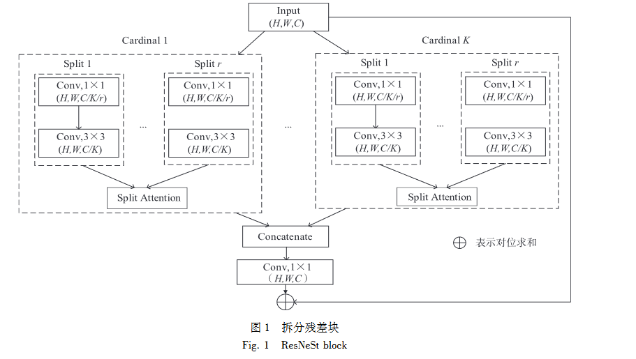

# 基于拆分残差网络的糖尿病视网膜病变分类

## 摘 要： 
糖尿病视网膜病变是一种常见的糖尿病并发症。 
为提高糖尿病视网膜病变图像分级准确率， 本文提出基于拆分残差网络的分级算法。 

通过融合归一化注意力，增强识别关键特征信息能力， 使模型对病灶特征信息提取更具有针对性； 
利用全局上下文模块综合考虑不同尺度及网络层学习到的特征信息，进一步联系不同时期糖尿病视网膜病灶特点，
增强模型表达能力； 
输出分类器设计多分支结构进行图像分级，提升多类别图像分级精度。 

实验结果得出模型准确率为９４．８６％， 其他评价指标相比原主干网络模型均有提高。 
本文模型性能良好，实现了较高精度诊断分级糖尿病视网膜病变图像。

关键词： 医学图像处理； 深度学习； 糖尿病视网膜病变； 注意力机制； 拆分残差网络

## 简介

糖尿病视网膜病变（ｄｉａｂｅｔｉｃ ｒｅｔｉｎｏｐａｔｈｙ，ＤＲ）属于糖尿病中一种常见的慢性并发症，除有“三多一少”等典型症状外，还具有糖尿病导致的视网膜微血管损害所引起的一系列典型病变［１］。 

在临床诊断 ＤＲ时，ＤＲ 图像分类级别较多，且各级别 ＤＲ 图像的病灶特征差别不大，同时大量阅片易导致医生疲惫，因此人工诊断时容易出现误诊、漏诊等现象［２］。

### 现有研究
针对上述情况，基于深度学习的 ＤＲ 图像自动分级技术逐渐被学者所关注。

* Ｄｕｔｔａ 等［３］采用深度学习方法对 ＤＲ 图像进行等级分级，利用深度学习神经元提取不同病变等级视网膜特征；
* Ｇｕｌｓｈａｎ 等［４］在公开数据集上利用深度学习方法进行 ＤＲ 二分类，并比较了与人工诊断 ＤＲ 的优势；
* Ｌｉｕ 等［５］对比了残差网络和自注意网络，得出残差网络进行 ＤＲ 分级效果较好的结论。 
* 由此，许多学者利用残差网络对 ＤＲ 分级进行探讨： 
* * Ｘｉｅ 等［６］在残差网络的基础上提出变体 ＲｅｓＮｅｘｔ 残差结构，优化了原模型的宽度和深度，提升了分级准确率；
* * Ｂｅｌｌｏ 等［７］则修改残差结构的网络宽度并引入注意力机制，与 ＮＡＳ［８］自动搜索网络对比，残差网络的 ＤＲ 分级准确率高于 ＮＡＳ 自动搜索网络；
* *Ｈｕ 等［９］在残差网络中引入激励和挤压模块，使模型重点关注 ＤＲ 图像的通道信息，提高了模型空间和通道的表征能力；
* *郑雯等［１０］则对 ＲｅｓＮｅｘｔ 残差网络变体进行改进，利用预训练和数据增强策略提高分级准确率；
* *顾婷菲等［１１］引入多通道注意力选择机制的细粒度分级方法进行分级。 
* *此后，随着 Ｔｒａｎｓｆｏｒｍｅｒ［１２］网络的兴起，Ｍａ 等［１３］利用 Ｔｒａｎｓｆｏｒｍｅｒ 进行 ＤＲ 分级，取得较好结果的同时发现不同病灶时期 ＤＲ 图像的特征信息具有相关性。

### 现有问题
以上研究针对 ＤＲ 分级问题提出不同的解决办法，然而，
* ＤＲ 不同病灶时期差异较小，
* 对模型分级精度要求较高，
* 并且涉及病人隐私，公开数据集较少、数据样本分布不均等问题使得利用深度学习模型进行ＤＲ 分级遇到一定挑战。 

许多学者就如何定位不同时期 ＤＲ 病灶特点，联系其病灶特征信息，缓解数据集中正负样本分布悬殊问题以及在模型复杂度低、训练速度快的同时达到较高准确率方面展开讨论。

### 本文创新点
基于上述问题，为提高网络模型特征提取能力，进一步提升模型五分级准确率，本文对残差网络中的ＲｅｓＮｅＳｔ５０［１４］网络变体进行改进。 

本文算法模型中包含的注意力机制缓解了残差网络系列中模型特征提取能力较弱问题，基于 ｒａｎｓｆｏｒｍｅｒ 思想设计的**全局上下文信息模块**加强了网络层中的信息交流，**融合归一化注意力的多分支输出分类器**则缓解数据样本分布悬殊问题。

对残差网络中的ＲｅｓＮｅＳｔ５０［１４］网络变体进行改进：
1. **全局上下文信息模块**
2. **融合归一化注意力的多分支输出分类器**

## １ 背景知识
### １．１ 拆分残差网络算法
在深度学习中的图像分类领域，大多数下游应用（ 如目标检测和语义分割） 使用 ＲｅｓＮｅｔ５０ 及其变体作 为主干网络。 相较于传统残差网络，ＲｅｓＮｅＳｔ５０ 提出拆分残差块（ ＲｅｓＮｅＳｔ ｂｌｏｃｋ） ，可以跨特征图组执行注 意力，模型特征提取能力得到增强，性能得以提升。 按照 ＲｅｓＮｅｔ５０ 方式堆叠拆分残差块获得新的主干网 络，同时网络模型保留整个 ＲｅｓＮｅｔ５０ 网络结构，可以直接用于下游任务而不会引入额外计算成本。

拆分残差块设计如图 １ 所示。 借鉴 ＲｅｓＮｅＸｔ 和 ＳＫ⁃Ｎｅｔ 分组思想，拆分残差块中每个块沿通道维度将 特征图划分为 Ｋ 组及细粒度级别的 ｒ 个小组。 其中每个组的特征表示通过加权组合 ｒ 个小组来确定，即 使用基于全局上下文信息选择的权重（ ｓｐｌｉｔ⁃ａｔｔｅｎｔｉｏｎ） 进行加权确定。 将 Ｋ 个组的特征表示进行堆叠后得 到拆分残差块，该架构相比现有残差网络变体，没有带来额外计算开销，性能较优，其中 Ｋ 和 ｒ 参照文献 ［１４］ 均设定为 ２，其他设定与 ＲｅｓＮｅｔ５０ 网络模型保持一致。

### １．２　 注意力机制

神经网络中的注意力机制（ ａｔｔｅｎｔｉｏｎ ｍｅｃｈａｎｉｓｍ） 是在计算能力有限的情况下将计算资源分配给更重 要的任务，同时解决信息超载问题的一种资源分配方案。 在神经网络学习中，模型的参数越多则模型的表 达能力相对越强，模型所存储的信息量也越大，但会带来信息过载问题。 而通过引入注意力机制，使模型 在众多输入信息中聚焦于对当前任务更为关键的信息，降低对其他信息的关注度，甚至过滤掉无关信息， 以此解决信息过载问题，并提高任务处理的效率和准确性［１５］ 。 

为提 升 模 型 特 征 提 取 能 力， 本 文 采 用 基 于 标 准 化 的 注 意 力 模 块［１６］ （ ｎｏｒｍａｌｉｚａｔｉｏｎ⁃ｂａｓｅｄ ａｔｔｅｎｔｉｏｎ ｍｏｄｕｌｅ，ＮＡＭ） 。 该结构设计参照混合注意力［１７］ ，与先前注意力机制通过抑制无关紧要的权值来改善神经 网络性能不同，ＮＡＭ 归一化注意力将空间和通道信息整合到对应的特征响应中，并使用多层感知器层计 算相应的注意权重，利用训练模型权重的方差来度量和突出显著特征。 结构中并行构建的空间子模块和 通道子模块可以分离并嵌入任何网络结构中，提供一种顺序嵌入通道和空间注意力子模块的解决方案。

## ２　 改进的拆分残差网络
### ２．１　 拆分残差块的改进
ＤＲ 分级主要依据不同的病灶特点：在 ＤＲ 初期出现红色病变，即微小出血点或是极小的微动脉瘤； ＤＲ 中期出现黄白色的点状硬性渗出物；ＤＲ 后期出现白色软性渗出物；增值性 ＤＲ 则会出现新生血管并导 致玻璃体、视网膜出血等症状［１８］ 。 由于 ＤＲ 前中期病灶症状不显著，模型能否准确识别和充分提取 ＤＲ 图 像中微动脉瘤、软性渗出物、硬性渗出物等关键微小病灶信息，显得极为重要。

神经网络模型中，经过 ＤＲ 图像特征提取后会得到大量特征信息。 模型一般会同等对待所有特征信 息，即对特征信息赋予相同权重。 而由于 ＤＲ 分级主要依据不同病灶特点，模型提取到的冗余信息会产生 干扰，影响学习效果。 为提高对特征信息选择的区分度，本文模型将拆分残差块与 ＮＡＭ 归一化注意力进 行融合。

ＮＡＭ 归一化注意力设计的通道注意力子模块和空间注意力子模块，使模型分别从不同维度计算特征 信息权重，以此突出更为关键的特征信息。 图 ２ 中，对通道注意力子模块采用 Ｂａｔｃｈ Ｎｏｒｍａｌｉｚａｔｉｏｎ［１９］ 中的 缩放因子反映各个通道的变化和重要性，利用权重稀疏惩罚使该模块在保持相似性能的同时提高计算效 率，抑制较少的显著权重，缩放过程如式（１） 。 由式（１） 可知，缩放因子越大表示该通道变化越强烈，那么 该通道中包含的信息会越丰富，重要性也越大；变化不大的通道信息单一、重要性小。 这使得模型提取 ＤＲ 图像中的病灶特征信息时偏向于信息量丰富的通道，如 ＲＧＢ 通道的 ＤＲ 图像，其 Ｇ 通道含有最佳病灶 特征信息，Ｒ、Ｂ 通道的信息则可以忽略［２０］ 。 图 ３ 中，对于空间注意力子模块，类似地对每个特征像素进行 归一化，归一化过程如式（２）。 由式（２） 可知，不同大小的缩放因子表示空间维度各像素权重大小不同。 利用对应像素权重大小突出重点区域，同时结合通道注意力子模块加强模型对糖尿病视网膜病变区域的 定位能力，使本文模型的定位更加准确。

## ４ 结束语

本文提出一种改进 ＲｅｓＮｅＳｔ５０ 的糖尿病视网膜病变分级网络模型。 

* ＮＡＭ 归一化注意力的引入在特征信息不同通道及空间维度被赋予不同大小的权重，而不是抑制无关权重，利用权重大小的不同突出特征信息重要程度，相比其他注意力模块，对病灶特征信息提取更有针对性；
* 全局上下文信息模块改进上下文信息的挖掘并与 ｓｅｌｆ⁃ａｔｔｅｎｔｉｏｎ 的学习聚合到一起，
* 同时模块中使用 ３×３ 分组卷积代替传统卷积，减少计算量，缓解计算复杂问题，
* 此外，该模块的引入使模型考虑特征信息间的关联性，从而上下网络层信息交流更连贯；
* 结合多分支的输出结构综合考虑各类别 ＤＲ 图像特征信息，以此进一步提升分级准确率。 

实验结果表明：
1. 本文网络模型表现优异，对计算机辅助诊断 ＤＲ 有一定参考意义，
2. 但对于在复杂场景下进行 ＤＲ 类别分级的效果尚未达到预期。 

后续将加强网络模型的抗干扰及过滤噪声能力，加快该模型落地使用进程。

