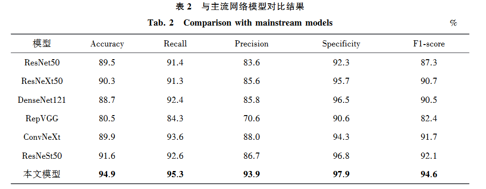

# 基于拆分残差网络的糖尿病视网膜病变分类

## 摘 要： 
糖尿病视网膜病变是一种常见的糖尿病并发症。 
为提高糖尿病视网膜病变图像分级准确率， 本文提出基于拆分残差网络的分级算法。 

通过融合归一化注意力，增强识别关键特征信息能力， 使模型对病灶特征信息提取更具有针对性； 
利用全局上下文模块综合考虑不同尺度及网络层学习到的特征信息，进一步联系不同时期糖尿病视网膜病灶特点，
增强模型表达能力； 
输出分类器设计多分支结构进行图像分级，提升多类别图像分级精度。 

实验结果得出模型准确率为９４．８６％， 其他评价指标相比原主干网络模型均有提高。 
本文模型性能良好，实现了较高精度诊断分级糖尿病视网膜病变图像。

关键词： 医学图像处理； 深度学习； 糖尿病视网膜病变； 注意力机制； 拆分残差网络

## 简介

糖尿病视网膜病变（ｄｉａｂｅｔｉｃ ｒｅｔｉｎｏｐａｔｈｙ，ＤＲ）属于糖尿病中一种常见的慢性并发症，除有“三多一少”等典型症状外，还具有糖尿病导致的视网膜微血管损害所引起的一系列典型病变［１］。 

在临床诊断 ＤＲ时，ＤＲ 图像分类级别较多，且各级别 ＤＲ 图像的病灶特征差别不大，同时大量阅片易导致医生疲惫，因此人工诊断时容易出现误诊、漏诊等现象［２］。

### 现有研究
针对上述情况，基于深度学习的 ＤＲ 图像自动分级技术逐渐被学者所关注。

* Ｄｕｔｔａ 等［３］采用深度学习方法对 ＤＲ 图像进行等级分级，利用深度学习神经元提取不同病变等级视网膜特征；
* Ｇｕｌｓｈａｎ 等［４］在公开数据集上利用深度学习方法进行 ＤＲ 二分类，并比较了与人工诊断 ＤＲ 的优势；
* Ｌｉｕ 等［５］对比了残差网络和自注意网络，得出残差网络进行 ＤＲ 分级效果较好的结论。 
* 由此，许多学者利用残差网络对 ＤＲ 分级进行探讨： 
* * Ｘｉｅ 等［６］在残差网络的基础上提出变体 ＲｅｓＮｅｘｔ 残差结构，优化了原模型的宽度和深度，提升了分级准确率；
* * Ｂｅｌｌｏ 等［７］则修改残差结构的网络宽度并引入注意力机制，与 ＮＡＳ［８］自动搜索网络对比，残差网络的 ＤＲ 分级准确率高于 ＮＡＳ 自动搜索网络；
* *Ｈｕ 等［９］在残差网络中引入激励和挤压模块，使模型重点关注 ＤＲ 图像的通道信息，提高了模型空间和通道的表征能力；
* *郑雯等［１０］则对 ＲｅｓＮｅｘｔ 残差网络变体进行改进，利用预训练和数据增强策略提高分级准确率；
* *顾婷菲等［１１］引入多通道注意力选择机制的细粒度分级方法进行分级。 
* *此后，随着 Ｔｒａｎｓｆｏｒｍｅｒ［１２］网络的兴起，Ｍａ 等［１３］利用 Ｔｒａｎｓｆｏｒｍｅｒ 进行 ＤＲ 分级，取得较好结果的同时发现不同病灶时期 ＤＲ 图像的特征信息具有相关性。

### 现有问题
以上研究针对 ＤＲ 分级问题提出不同的解决办法，然而，
* ＤＲ 不同病灶时期差异较小，
* 对模型分级精度要求较高，
* 并且涉及病人隐私，公开数据集较少、数据样本分布不均等问题使得利用深度学习模型进行ＤＲ 分级遇到一定挑战。 

许多学者就如何定位不同时期 ＤＲ 病灶特点，联系其病灶特征信息，缓解数据集中正负样本分布悬殊问题以及在模型复杂度低、训练速度快的同时达到较高准确率方面展开讨论。

### 本文创新点
基于上述问题，为提高网络模型特征提取能力，进一步提升模型五分级准确率，本文对残差网络中的ＲｅｓＮｅＳｔ５０［１４］网络变体进行改进。 

本文算法模型中包含的注意力机制缓解了残差网络系列中模型特征提取能力较弱问题，基于 ｒａｎｓｆｏｒｍｅｒ 思想设计的**全局上下文信息模块**加强了网络层中的信息交流，**融合归一化注意力的多分支输出分类器**则缓解数据样本分布悬殊问题。

对残差网络中的ＲｅｓＮｅＳｔ５０［１４］网络变体进行改进：
1. **全局上下文信息模块**
2. **融合归一化注意力的多分支输出分类器**

## １ 背景知识
### １．１ 拆分残差网络算法
在深度学习中的图像分类领域，大多数下游应用（ 如目标检测和语义分割） 使用 ＲｅｓＮｅｔ５０ 及其变体作 为主干网络。 相较于传统残差网络，ＲｅｓＮｅＳｔ５０ 提出拆分残差块（ ＲｅｓＮｅＳｔ ｂｌｏｃｋ） ，可以跨特征图组执行注 意力，模型特征提取能力得到增强，性能得以提升。 按照 ＲｅｓＮｅｔ５０ 方式堆叠拆分残差块获得新的主干网 络，同时网络模型保留整个 ＲｅｓＮｅｔ５０ 网络结构，可以直接用于下游任务而不会引入额外计算成本。

拆分残差块设计如图 １ 所示。 借鉴 ＲｅｓＮｅＸｔ 和 ＳＫ⁃Ｎｅｔ 分组思想，拆分残差块中每个块沿通道维度将 特征图划分为 Ｋ 组及细粒度级别的 ｒ 个小组。 其中每个组的特征表示通过加权组合 ｒ 个小组来确定，即 使用基于全局上下文信息选择的权重（ ｓｐｌｉｔ⁃ａｔｔｅｎｔｉｏｎ） 进行加权确定。 将 Ｋ 个组的特征表示进行堆叠后得 到拆分残差块，该架构相比现有残差网络变体，没有带来额外计算开销，性能较优，其中 Ｋ 和 ｒ 参照文献 ［１４］ 均设定为 ２，其他设定与 ＲｅｓＮｅｔ５０ 网络模型保持一致。

### １．２　 注意力机制

神经网络中的注意力机制（ ａｔｔｅｎｔｉｏｎ ｍｅｃｈａｎｉｓｍ） 是在计算能力有限的情况下将计算资源分配给更重 要的任务，同时解决信息超载问题的一种资源分配方案。 在神经网络学习中，模型的参数越多则模型的表 达能力相对越强，模型所存储的信息量也越大，但会带来信息过载问题。 而通过引入注意力机制，使模型 在众多输入信息中聚焦于对当前任务更为关键的信息，降低对其他信息的关注度，甚至过滤掉无关信息， 以此解决信息过载问题，并提高任务处理的效率和准确性［１５］ 。 

为提 升 模 型 特 征 提 取 能 力， 本 文 采 用 基 于 标 准 化 的 注 意 力 模 块［１６］ （ ｎｏｒｍａｌｉｚａｔｉｏｎ⁃ｂａｓｅｄ ａｔｔｅｎｔｉｏｎ ｍｏｄｕｌｅ，ＮＡＭ） 。 该结构设计参照混合注意力［１７］ ，与先前注意力机制通过抑制无关紧要的权值来改善神经 网络性能不同，ＮＡＭ 归一化注意力将空间和通道信息整合到对应的特征响应中，并使用多层感知器层计 算相应的注意权重，利用训练模型权重的方差来度量和突出显著特征。 结构中并行构建的空间子模块和 通道子模块可以分离并嵌入任何网络结构中，提供一种顺序嵌入通道和空间注意力子模块的解决方案。

## ２　 改进的拆分残差网络
### ２．１　 拆分残差块的改进
ＤＲ 分级主要依据不同的病灶特点：
* 在 **ＤＲ 初期**出现红色病变，即微小出血点或是极小的微动脉瘤； 
* **ＤＲ 中期**出现黄白色的点状硬性渗出物；
* **ＤＲ 后期**出现白色软性渗出物；
* **增值性 ＤＲ** 则会出现新生血管并导致玻璃体、视网膜出血等症状［１８］ 。 

由于 ＤＲ 前中期病灶症状不显著，模型能否准确识别和充分提取 ＤＲ 图 像中微动脉瘤、软性渗出物、硬性渗出物等关键微小病灶信息，显得极为重要。

>下面这段话运用了“起承转合”，值得学习，可以作为写作的模板，用于说明使用某个模块的原因。

1. 神经网络模型中，经过 ＤＲ 图像特征提取后会得到大量特征信息。 --> 起
2. 模型一般会同等对待所有特征信息，即对特征信息赋予相同权重。 --> 承
3. 而由于 ＤＲ 分级主要依据不同病灶特点，模型提取到的冗余信息会产生干扰，影响学习效果。 --> 转
4. 为提高对特征信息选择的区分度，本文模型将拆分残差块与 ＮＡＭ 归一化注意力进行融合。 --> 合

ＮＡＭ 归一化注意力设计的**通道注意力子模块**和空**间注意力子模块**，使模型分别从不同维度计算特征信息权重，以此突出更为关键的特征信息。 
图 ２ 中，对通道注意力子模块采用 Ｂａｔｃｈ Ｎｏｒｍａｌｉｚａｔｉｏｎ［１９］ 中的缩放因子反映各个通道的变化和重要性，利用权重稀疏惩罚使该模块在保持相似性能的同时提高计算效率，抑制较少的显著权重，缩放过程如式（１） 。 

由式（１） 可知，缩放因子越大表示该通道变化越强烈，那么 该通道中包含的信息会越丰富，重要性也越大；变化不大的通道信息单一、重要性小。 这使得模型提取 ＤＲ 图像中的病灶特征信息时偏向于信息量丰富的通道，如 ＲＧＢ 通道的 ＤＲ 图像，其 Ｇ 通道含有最佳病灶特征信息，Ｒ、Ｂ 通道的信息则可以忽略［２０］ 。 

图 ３ 中，对于空间注意力子模块，类似地对每个特征像素进行归一化，归一化过程如式（２）。 由式（２） 可知，不同大小的缩放因子表示空间维度各像素权重大小不同。 利用对应像素权重大小突出重点区域，同时结合通道注意力子模块加强模型对糖尿病视网膜病变区域的定位能力，使本文模型的定位更加准确。

### ２．２　 上下文信息联系的网络层设计
ＤＲ 各时期症状不同，这些症状往往互相关联：
* ＤＲ 初期症状主要为微动脉瘤或出血，
* 中期则伴随着渗出物，
* 后期会在前中期基础上出现新生血管等症状［２１］ 。 

因此，网络模型提取 ＤＲ 图像特征信息时，可以加强网络层之间的信息交流，联系不同时期 ＤＲ 病灶的病理特征信息，并将不同网络层之间的特征信息进行有效结合，以此提高网络模型的分级准确率。

针对该问题，本文借鉴 Ｔｒａｎｓｆｏｒｍｅｒ 中的 Ｓｅｌｆ⁃Ａｔｔｅｎｔｉｏｎ 思想，设计全局上下文信息模块（ ｇｌｏｂａｌ ｃｏｎｔｅｘｔ ｉｎｆｏｒｍａｔｉｏｎ ｍｏｄｕｌｅ，ＧＣＩＭ） 。 在传统 Ｓｅｌｆ⁃Ａｔｔｅｎｔｉｏｎ 机制中，所有 ｑｕｅｒｙ⁃ｋｅｙ 关系通过独立的 ｑｕｅｙ⁃ｋｅｙ ｐａｉｒ 学 习，没有考虑两者之间丰富的上下文信息交流，这限制了视觉表示学习。 本文对其进行改进，将上下文信 息的挖掘和 Ｓｅｌｆ⁃Ａｔｔｅｎｔｉｏｎ 的学习聚合到一起，并以此对输入图像进行特征信息处理，指导动态注意力矩阵 学习，增强视觉表示能力［２２］ ，结构如图 ４ 所示。

图 ４ 中，按照式（３） ～ （５） 引入 ３ 个分支 Ｑｕｅｒｙ、Ｋｅｙ ｍａｐ、Ｖａｌｕｅ ｍａｐ。

式中：
* Ｉｉｎｐｕｔ 表示输入；
* Ｖ１ 表示输入的特征映射；
* Ｗｉ 为特征映射因子，具体为 Ｂａｔｃｈ Ｎｏｒｍａｌｉｚａｔｉｏｎ。 

1. 通过一个 ３ ×３ 的分组卷积对输入进行上下文编码，从而得到输入的**静态上下文表示**，即 Ｋ１。 
2. 之后将 Ｑｕｅｒｙ、Ｋｅｙ ｍａｐ 分支拼接起来得到 Ｋ２，通过 ２ 个连续的 １×１ 卷积得到注意力矩阵，该矩阵乘以 Ｖａｌｕｅ ｍａｐ 分支的输出结 果，得到输入的**动态上下文表示**。 
3. **静态和动态上下文的表征融合**为**最终输出**。

式中：
* ＢＮ 表示 Ｂａｔｃｈ Ｎｏｒｍａｌｉｚａｔｉｏｎ；
* ＲｅＬＵ 为激活函数；
* Ｃ 为原始输入通道数；
* Ｇ 为 Ｋｅｙ ｍａｐ 分支中分组卷积的分组数；
* Ｃｏｎｖ 表示分组卷积，用于提取特征信息；
* $Ｃｏｎｖ_{１}$ 、$Ｃｏｎｖ_{２}$ 表示普通 ２Ｄ 卷积，用于改变输入的通道 数；
* Ｒｅ 表示将输入的维度重组；
* Ａｖｇ 表示在某维度取均值。

### ２．３　 输出结构设计

层数较多的网络中，经过各网络层的特征提取，最终输入图像转换成高维度特征信息。 对高维特征信 息进行输出分类时，分类器的性能通常会下降。 对于 ＤＲ 分级来说，较为明显的表现为 ＤＲ 图像中某一类别图像分级准确率较低，受人脸识别网络［２３］ 启发，本文通过改进输出分类器缓解这一问题。

归一化 分 类 决 策 网 络 （ ＮＡＭ⁃ｍｕｌｔｉ⁃ｂｒａｎｃｈ ｃｌａｓｓｉｆｉｃａｔｉｏｎ ｄｅｃｉｓｉｏｎ ｎｅｔｗｏｒｋ， ＮＭＢ⁃ＣＤＮ ） 由 Ｍｏｄｕｌｅ １、 Ｍｏｄｕｌｅ ２ 和 ＮＡＭ 归一化注意力构成，如图 ５ 所示。

 对于 Ｍｏｄｕｌｅ １ 网络层，先利用 ＮＡＭ 归一化注意力突 出输入的显著特征信息，然后压缩特征信息维度，利用 Ｓｏｆｔｍａｘ 计算类别通道权重，并使用神经元失活技 术进行神经元随机失活；对于 Ｍｏｄｕｌｅ ２ 网络层，通过感知器层得到类别特征信息表示。

式中：
* $ＦＣ_{１}$ 、$ＦＣ_{２}$为全连接层；
* Ｘ 为输入经过 ＮＡＭ 归一化注意力后的显著特征信息；
* $ＤＲＸ_{i}$为经过 Ｍｏｄｕｌｅ １ 的 类别通道权重；
* $ｄ_{ri}$为经过 Ｍｏｄｕｌｅ ２ 的类别特征信息表示；
* Y 为输出。

## ３　 实验及结果分析

### ３．１　 数据集及预处理
本文使用 ＤＤＲ［２４］ 数 据 集 和 Ａｐｔｏｓ ２０１９ Ｄａｔａｓｅｔ［２５］ 数 据 集 进 行 实 验。 
* ＤＤＲ 数 据 集 各 类 别 图 像 共 计 １３ ６７３张，由南开大学联合首都医科大学附属北京同仁医院等多个组织机构进行专业处理及标签标注。 
* Ａｐｔｏｓ ２０１９ Ｄａｔａｓｅｔ 数据集来自 Ｋａｇｇｌｅ 公开竞赛，各类别图像共计 ３ ６６２ 张，由亚太远程眼科学会组织提供 并由专业人员进行处理及标签标注。 

上述数据集图像均按照国际 ＤＲ 五级诊断标准进行标签标注，如图 ６ 所示。

公开数据中存在部分 ＤＲ 图像曝光过度、尺寸大小不一、数据集样本分布不均衡等问题，影响网络模型提取 ＤＲ 图像特征信息的效果［２６⁃２７］ 。 
因此对数据集图像进行归一化处理：
* 裁剪多余黑色边界；
* 将图像大小调整为 ５１２×５１２；
* 使用 Ｇｒａｈａｍ 等［２８］ 提出的图像增强策略进行 ＤＲ 图像增强。 

处理后效果如图 ７ 所示。 

对于样本分布不均问题，进行图像扩充，策略如图 ８ 所示。

### ３．２　 评价指标

本文评价指标分别为准确率（ Ａｃｃｕｒａｃｙ） 、召回率（ Ｒｅｃａｌｌ） 、精确度（ Ｐｒｅｃｉｓｉｏｎ） 、特异性（ Ｓｐｅｃｉｆｉｃｉｔｙ） 及 Ｆ１ 分数（ Ｆ１⁃ｓｃｏｒｅ） 。

准确率（记为 Ａｃｃ） 表示对给定的测试样本，模型正确预测的样本数量与总测试样本数量的比值，公式 为$Ａｃｃ ＝ \frac{（ Ｎ_{ＴＰ} ＋Ｎ_{ＴＮ} ）} {（ Ｎ_{ＴＰ} ＋Ｎ_{ＴＮ} ＋Ｎ_{ＦＰ} ＋Ｎ_{ＦＮ} ）}$ 。 

召回率（记为 Ｒ）表示对某一类别标签样本，该类样本预测正确的数量与该类样本总数量的比值，公 式为$Ｒ ＝ \frac{Ｎ_{ＴＰ} }{（ Ｎ_{ＴＰ} ＋Ｎ_{ＦＮ} ）}$ 。 

精确度（记为 Ｐ）表示对所有给定标签样本，模型正确预测的数量和给定样本总数量的比值，公式为$Ｐ ＝\frac{ Ｎ_{ＴＰ} }{（ Ｎ_{ＴＰ} ＋Ｎ_{ＦＰ} ）}$ 。 

特异性（ 记为 Ｓｓｐｅｃｉ） 表示对给定某类标签样本，正确预测不属于该标签的数量与该样本总数量的比 值，公式为$Ｓｓｐｅｃｉ ＝\frac {Ｎ_{ＴＮ} } {（ Ｎ_{ＴＮ} ＋Ｎ_{ＦＰ} ）}$ 。 

Ｆ１ 分数兼顾模型的精确率和召回率，用来衡量模型的性能，公式为$Ｆ１ ＝ \frac{２×Ｐ×Ｒ}{（Ｐ＋Ｒ）}$。 

上述公式中：
* $Ｎ_{ＴＮ}$为正确预测负样本个数；
* $Ｎ_{ＴＰ}$为正确预测正样本个数；
* $Ｎ_{ＦＮ}$为将负样本预测为正样本的个数；
* $Ｎ_{ＦＰ}$为正样本预测为负样本个数。

### ３．３　 实验平台设置
实验在 :
* Ｕｂｕｎｔｕ１６．０ ＬＴＳ 操作系统上完成，
* Ｐｙｔｈｏｎ ３．８ 编程环境，
* Ｐｙｔｏｒｃｈ １．１０ 框架。 

计算机配置为： 
* Ｉｎｔｅｌ Ｘｅｏｎ Ｅ５⁃２６９８ｖ４ ＣＰＵ，
* ＮＶＩＤＩＡ Ｖ１００ ３２ ＧｉＢ ＧＰＵ。 

将数据划分为训练集、验证集和测试集，所占比例 大致为 ７０％、２０％和 １０％。 

采用随机梯度下降［２９］ 算法作为网络模型优化器，
学习率设置为 ０．００３，
同时利用余弦退火策略进行优化，Ｔｍａｘ为 ８０，动量因子为 ０．９，权重衰减为 ０．０００ １，Ｂａｔｃｈ ｓｉｚｅ 为 １６。

### ３．４　 实验结果与分析

#### ３．４．１　 算法对比及分析
本文提出的网络模型实验结果如表 １ 所示，其中召回率最高为 ９８．７％，精确度最高为 ９６．２％，特异性 最高为 ９８．６％，Ｆ１⁃ｓｃｏｒｅ 最高为 ９７．４％。 在所有设置均一致的情况下进行主干网络模型对比及文献模型对比，表 １ 中各类评价指标均选取 ＤＲ 五类标签图像的平均评价指标进行比较。

１） 对比 ＤＲ 五分级主流网络模型： ＲｅｓＮｅｔ５０、 ＲｅｓＮｅＸｔ５０、 ＤｅｎｓｅＮｅｔ１２１［３０］ 、 ＲｅｐＶＧＧ［３１］ 、 ＣｏｎｖＮｅＸｔ 和 ＲｅｓＮｅＳｔ５０，结果如表 ２ 所示。

２） 对比近几年其他 ＤＲ 分级算法模型：王明智等［３２］ 采用基于代价敏感正则化和 ＥｆｆｉｃｉｅｎｔＮｅｔ 网络进行 ＤＲ 分级；宋若仙等［３３］ 提出一种端到端式结合域适应学习的自动多分类方法，协同注意力机制和弱监督学 习加强优化模型；程小辉等［３４］ 提出集成 ＭｏｂｉｌｅＮｅｔＶ２ 和 ＥｆｆｉｃｉｅｎｔＮｅｔ Ｂ０ 深度模型的注意力网络；李家昱 等 ［３５］ 提出 ＣＡ⁃ＲｅｐＶＧＧ 模型；梁礼明等［３６］ 提出基于跨层双线性池化的 ＤＲ 分级算法。 对比结果如表 ３ 所示。

由表 ３ 可知，本文改进模型在准确率、特异性、Ｆ１⁃ｓｃｏｒｅ 评价指标上取得最好效果，其他指标优于大部 分对比算法：①在网络结构设计方面，文献［３３，３６］ 网络模型简单，但是对 ＤＲ 图像病灶特征信息提取不够 充分；文献［３２］ 网络模型过于复杂，导致模型需要较长时间训练才能收敛，致使模型性能下降；文献［３５］ 网络模型则以计算成本和模型性能换取高速度短时间的训练学习。 本文选取主干网络 ＲｅｓＮｅＳｔ５０ 进行改 进，作为残差网络系列变体，该模型结构复杂度低，同时所提改进方式没有引入过多额外计算成本，因此模 型性能得以提升。 ②从注意力机制引入方面，文献［ ３３］ 提出使用注意力机制协同弱监督学习；文献［ ３４］ 提出集成深度网络模型的注意力网络。 上述 ２ 个文献所提方法在关注 ＤＲ 图像深层特征信息方面能力略 显不足。 本文引入 ＮＡＭ 归一化注意力，相比其他注意力利用不同维度特征的互信息，加强有关特征、抑 制无关特征的方式突出重要特征信息的原理不同［３７］ ，ＮＡＭ 归一化注意力考虑到权重对特征信息关注的 贡献因素，利用权重抑制不重要的通道或像素来改善注意力机制。 因此 ＮＡＭ 归一化注意力采用缩放因 子反映区域的重要程度，并从空间、通道等维度综合定位病变特征区域，性能较优的同时避免引入卷积算 子等操作，计算成本小。 ③在联系 ＤＲ 不同时期病灶特征信息方面，文献［３２］ 使用代价敏感正则化扩展标 准分类损失函数，根据预测等级和真实等级相差程度的不同，对其施加不同惩罚。 本文通过设计 ＧＣＩＭ 和 ＮＭＢ⁃ＣＤＮ 模块进行解决。 ＧＣＩＭ 原理相比传统 Ｓｅｌｆ⁃Ａｔｔｅｎｔｉｏｎ，网络结构中额外利用了输入之间的上下文 信息来促进自我注意学习，使用类残差连接形式对输入进行反馈并最终改善深度网络的表征属性。 该模 块使得主干网络层的上下文信息挖掘和自我注意学习集成到一个统一的架构中，弥补原模型各网络层间 孤立学习导致上下层信息交流不充分问题。 ＮＭＢ⁃ＣＤＮ 则从数据集出发，缓解数据样本分布不均问题并 采用多分支分类结果得到最终输出，避免单个类别 ＤＲ 图像影响模型分级效果的问题［３８］ 。

#### ３．４．２　 消融实验及分析
以 ＲｅｓＮｅＳｔ５０ 主干网络实验结果为基线，对各部分网络结构进行消融实验，结果如表 ４。 

在加入 ＮＡＭ 归一化注意力后，模型对 ＤＲ 图像病灶特征能较好识别定位，提升模型综合性能。 ＮＡＭ 归一化注意力通 过突出重要关键区域使模型选择性关注特征信息，效果如图 ９ 所示。

 图 ９（ ｂ） 为模型加入 ＮＡＭ 归一化注 意力后对病灶特征中渗出物的识别定位热力图，不同数值的颜色代表对该区域的关注度不同。 结合消融 实验可知，ＮＡＭ 归一化注意力的引入提升了模型性能。 本文考虑不同时期病灶特征之间的联系，设计的 ＧＣＩＭ 模块借鉴 Ｓｅｌｆ⁃Ａｔｔｅｎｔｉｏｎ 学习思想，将模型上下层特征信息聚合到一起，并通过类残差方式连接对输 入进行反馈，以此使模型更加贴合 ＤＲ 病灶不同时期相互关联的特点，提升模型性能。 由消融实验得出， 加入 ＧＣＩＭ 后模型取得了最高精确度，体现出该模块能缓解 ＤＲ 前中期病灶特征相似、不易辨别的问题。 ＮＭＢ⁃ＣＤＮ 则考虑到数据样本分布不均问题，综合多个分级结果，避免单类别 ＤＲ 图像对分级结果的影响， 加强模型对病灶特征的选择和编码能力。 加入 ＮＭＢ⁃ＣＤＮ 后，准确率、特异性等指标有所提升，证明该方 法有效。

## ４ 结束语

本文提出一种改进 ＲｅｓＮｅＳｔ５０ 的糖尿病视网膜病变分级网络模型。 

* ＮＡＭ 归一化注意力的引入在特征信息不同通道及空间维度被赋予不同大小的权重，而不是抑制无关权重，利用权重大小的不同突出特征信息重要程度，相比其他注意力模块，对病灶特征信息提取更有针对性；
* 全局上下文信息模块改进上下文信息的挖掘并与 ｓｅｌｆ⁃ａｔｔｅｎｔｉｏｎ 的学习聚合到一起，
* 同时模块中使用 ３×３ 分组卷积代替传统卷积，减少计算量，缓解计算复杂问题，
* 此外，该模块的引入使模型考虑特征信息间的关联性，从而上下网络层信息交流更连贯；
* 结合多分支的输出结构综合考虑各类别 ＤＲ 图像特征信息，以此进一步提升分级准确率。 

实验结果表明：
1. 本文网络模型表现优异，对计算机辅助诊断 ＤＲ 有一定参考意义，
2. 但对于在复杂场景下进行 ＤＲ 类别分级的效果尚未达到预期。 

后续将加强网络模型的抗干扰及过滤噪声能力，加快该模型落地使用进程。

