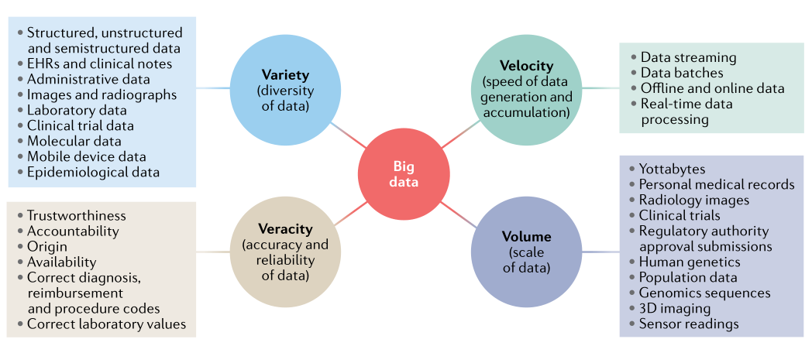

# 01Big_Data_in_Nephrology

## 梗概
这篇文章《Big Data in Nephrology》由Navchetan Kaur、Sanchita Bhattacharya和Atul J. Butte撰写，发表在《Nature Reviews Nephrology》上。文章讨论了大数据在肾脏病学领域的应用和潜力，以及面临的挑战。以下是文章的核心内容概述：

1. **大数据定义和重要性**：大数据被定义为数据体量的庞大、多样性、快速生成和累积以及数据的准确性。在医学领域，大数据提供了创新和改善医疗保健的机会，特别是在肾脏病学中，可以通过数据驱动的应用程序来指导透析护理的改进、监测医疗产品和药物、检测糖尿病视网膜病变以及识别临床恶化高风险的患者。

2. **肾脏病学中的大数据**：肾脏病学领域尚未完全探索大数据的潜力，但已有系统地收集有关肾衰竭、慢性肾脏病（CKD）、肾脏替代疗法（KRTs）和移植的国家级注册数据的经验。

3. **数据类型、管理和标准化**：肾脏病学中有五大类大数据源，包括患者注册和流行病学数据、电子健康记录（EHRs）和行政数据、临床试验数据、移动健康设备数据和分子数据。数据管理确保了数据的准确性、一致性、可信度和及时性，以便于分析和研究。

4. **数据治理和隐私**：尽管对医学数据驱动的突破持乐观态度，但对计算校准和预测的准确性存在怀疑。数据治理和保护、数据的孤立性、数据异质性、样本量小和研究资金不足等问题是肾脏病学中利用大数据的挑战。

5. **大数据的应用**：大数据和机器学习算法的应用为研究人员和临床医生提供了使用庞大数据集并识别无法通过人脑检测到的可行临床洞察的机会。这些数据集可以在肾脏病学研究和临床实践中得到利用。

6. **患者注册和流行病学数据**：患者注册表、国家和国际健康调查以及大型队列研究构成了医疗保健中的大数据。这些数据有助于描述疾病的自然史、流行病学和负担，并捕捉治疗地点以及治疗和结果的区域或国家差异。

7. **电子健康记录和行政数据**：EHR系统包含患者健康信息，包括行政和计费数据、人口统计学、临床笔记、生命体征、医疗史、诊断、药物、免疫接种日期、过敏反应、放射图像、病理图像、实验室值和测试结果。

8. **临床试验**：临床试验用于通知有关治疗干预的决策，但存在与数据相关的挑战，包括出版偏见、有限的抽样、选择性结果报告和缺乏主要数据发布。

9. **移动设备和可穿戴传感器**：移动设备和可穿戴活动追踪器的普及提供了将传统医疗模型与直接从患者那里获得的有关健康的社会和行为决定因素的数据整合的机会。

10. **分子数据存储库**：高通量测序和其他多重技术捕获了疾病的分子复杂性，并通过个体化的诊断和治疗促进了精准医疗。

11. **大数据的前景和挑战**：整合肾脏病学中可用的大数据模式为个性化医疗提供了机会。大数据有潜力促进基于数据的肾脏病患者的临床决策。

12. **结论**：大量可用的数据有可能被用来改善肾脏病的护理和研究。大数据集可以使肾脏病学从基于经验的医学转变为基于证据的医学，但需要适当的分析流程。

文章强调了大数据在肾脏病学中的潜力，同时也指出了实现这一潜力所需的多学科合作、数据治理、隐私保护和资金支持等方面的挑战。

## Abstract

A huge array of data in nephrology is collected through patient registries, large epidemiological studies, electronic health records, administrative claims, clinical trial repositories, mobile health devices and molecular databases. Application of these big data, particularly using machine-learning algorithms, provides a unique opportunity to obtain novel insights into kidney diseases, facilitate personalized medicine and improve patient care. Efforts to make large volumes of data freely accessible to the scientific community, increased awareness of the importance of data sharing and the availability of advanced computing algorithms will facilitate the use of big data in nephrology. However, challenges exist in accessing, harmonizing and integrating datasets in different formats from disparate sources, improving data quality and ensuring that data are secure and the rights and privacy of patients and research participants are protected. In addition, the optimism for data-driven breakthroughs in medicine is tempered by scepticism about the accuracy of calibration and prediction from in silico techniques. Machine-learning algorithms designed to study kidney health and diseases must be able to handle the nuances of this specialty, must adapt as medical practice continually evolves, and must have global and prospective applicability for external and future datasets.

## Key points

* Big data in nephrology can provide essential information about kidney disease burden, molecular mechanisms, novel risk factors and therapeutic targets.
* Artificial intelligence and machine- learning approaches that utilize big data could  be used for a variety of applications in nephrology, including early diagnosis and prognosis, as well as clinical decision- support systems for personalized selection  of therapy.
* Data curation and standardization enable interoperability, facilitate consolidation and exchange of high- quality data from different sources, create independence  from manufacturers and ease competition as comparable products are offered by  all market players.
* Sources of big data in nephrology include patient registries, population surveys, electronic health records, open- access clinical trials, mobile health devices and molecular data repositories.
* Large- scale acquisition of annotated molecular and clinical data, together with advances in machine learning approaches, open- source computational packages, affordable computation power and cloud storage, will all facilitate more novel data- driven approaches in nephrology.
* Challenges for the utilization of big data in nephrology include issues relating to data governance and protection, siloed datasets, data heterogeneity, small sample sizes and a lack of consistent research funding.

## 0. 

### 0.1.  Characteristics of big data

Fig. 1 | Characteristics of big data.

Big data are characterized by variety, velocity, veracity and volume5. 

* The variety results from the collection of structured, semi- structured and unstructured data from diverse sources. 
* The velocity represents the high speed of data generation and accumulation. 
* The veracity depends on the level of inconsistency and uncertainty in the data and the volume represents the enormous size of the datasets. 

Thus, distinct methods and specialized algorithms are required to exploit the potential of big data. EHRs, electronic health records.

