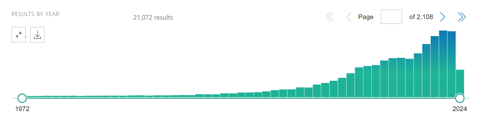

# 简介
收集PubMed上的“肾病&机器学习”相关文献
# 搜索公式

`(kidney disease OR nephropathy OR renal disease) AND (machine learning OR data mining OR predictive modeling)`

# 搜索结果

## 文献数量

截至至2024年4月26日为止，共计2，108篇文献。

## 目录(按分区和影响因子排名)

### [综述](04文献阅读\05肾病\01PubMed\00综述/)

### 实验性文章

#### [Q1](04文献阅读\05肾病\01PubMed\01Q1/)

##### [01A predictive model for progression of chronic kidney disease to kidney failure](04文献阅读\05肾病\01PubMed\01Q1\01A_predictive_model_for_progression_of_chronic_kidney_disease_to_kidney_failure/)

#### Q2

# 目录