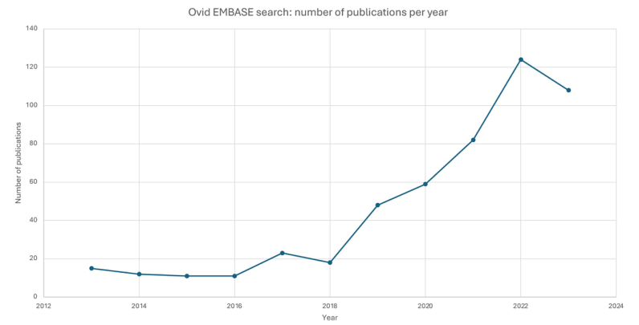
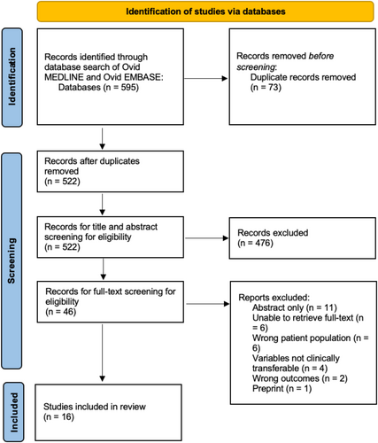
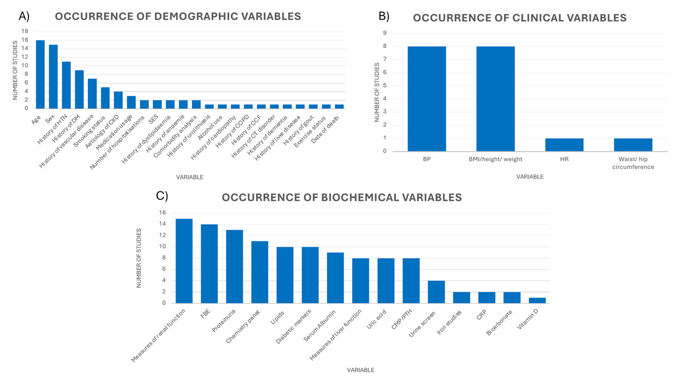
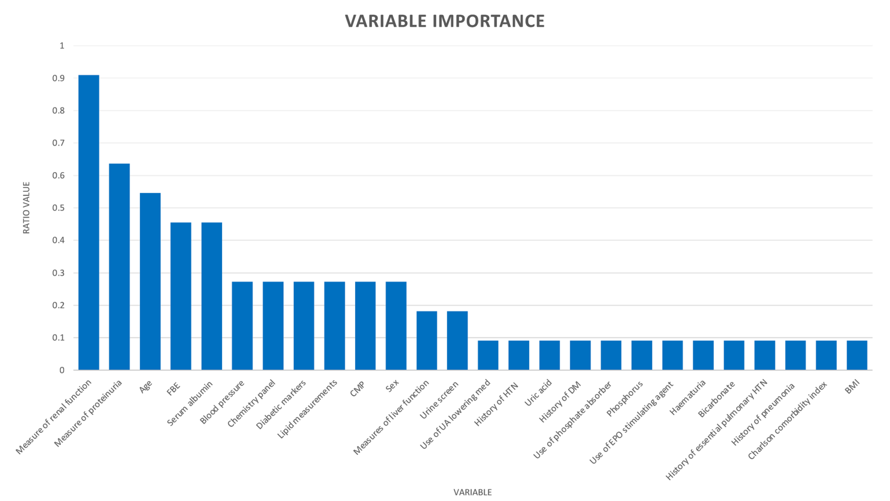

# 人工智能预测慢性肾病进展为肾衰竭：叙述性回顾

Artificial Intelligence to Predict Chronic Kidney Disease Progression to Kidney Failure: A Narrative Review
人工智能预测慢性肾病进展为肾衰竭：叙述性回顾

> Review
> 2.4 Q2 
> Nephrology (Carlton)
> 2025 Jan;30(1):e14424. 
> doi: 10.1111/nep.14424.

## ABSTRACT  
Chronic kidney disease is characterised by the progressive loss of kidney function. However, predicting who will progress to kidney failure is difficult. Artificial Intelligence, including Machine Learning, shows promise in this area. This narrative review highlights the most common and important variables used in machine learning models to predict progressive chronic kidney disease. Ovid Medline and EMBASE were searched in August 2023 with keywords relating to ‘chronic kidney disease’, ‘machine learning’, and ‘end-stage renal disease’. Studies were assessed against inclusion and exclusion criteria and excluded if variables inputted into machine learning models were not discussed. Data extraction focused on specific variables inputted into the machine learning models. After screening of 595 articles, 16 were included in the review. The most utilised machine learning models were random forest, support vector machines and XGBoost. The most commonly occurring variables were age, gender, measures of renal function, measures of proteinuria, and full blood examination. Only half of all studies included clinical variables in their models. The most important variables overall were measures of renal function, measures of proteinuria, age, full blood examination and serum albumin. Machine learning was consistently superior or non-inferior when compared to the Kidney Failure Risk Equation. This review identified key variables used in machine learning models to predict chronic kidney disease progression to kidney failure. These findings lay the foundations for the development of future machine learning models capable of rivalling the Kidney Failure Risk Equation in the provision of accurate kidney failure prediction.

慢性肾病的特点是肾功能进行性丧失。然而，预测谁会发展为肾功能衰竭是困难的。人工智能，包括机器学习，在这一领域显示出前景。本叙述性综述重点介绍了机器学习模型中用于预测进行性慢性肾病的最常见和最重要的变量。2023 年 8 月，我们使用与 “慢性肾病”、“机器学习 ”和 “终末期肾病 ”相关的关键词对 Ovid Medline 和 EMBASE 进行了检索。根据纳入和排除标准对研究进行评估，如果未讨论输入机器学习模型的变量，则将其排除在外。数据提取侧重于输入机器学习模型的特定变量。在筛选了 595 篇文章后，16 篇被纳入综述。最常用的机器学习模型是随机森林、支持向量机和 XGBoost。最常见的变量是年龄、性别、肾功能测量、蛋白尿测量和全血检查。只有一半的研究在其模型中包括临床变量。总体上最重要的变量是肾功能的测量、蛋白尿的测量、年龄、全血检查和血清白蛋白的测量。与肾衰竭风险方程相比，机器学习始终优于或不劣于。本综述确定了机器学习模型中用于预测慢性肾病进展为肾衰竭的关键变量。这些发现为未来机器学习模型的开发奠定了基础，这些模型能够在提供准确的肾衰竭预测方面与肾衰竭风险方程相媲美。

## Abbreviations  缩写
| 缩写 | 英文全称                                | 中文翻译                     |
|------|-----------------------------------------|------------------------------|
| AI   | Artificial Intelligence                | 人工智能                     |
| CKD  | Chronic Kidney Disease                 | 慢性肾病                     |
| eGFR | Estimated Glomerular Filtration Rate   | 估算肾小球滤过率             |
| KF   | Kidney Failure                         | 肾功能衰竭                   |
| KFRE | Kidney Failure Risk Equation          | 肾衰竭风险方程               |
| KRT  | Kidney Replacement Therapy             | 肾脏替代疗法                 |
| ML   | Machine Learning                       | 机器学习                     |
| uACR | Urinary Albumin-to-Creatinine Ratio    | 尿白蛋白/肌酐比值            |

## 1 Introduction  1 引言
Chronic Kidney Disease (CKD) is characterised by progressive injury and loss of kidney function over ≥ 3 months [1]. CKD affects more than 800 million people, confers a significant healthcare burden and is one of the leading causes of death worldwide [2, 3]. The final stage of CKD progression is known as Kidney Failure (KF), for which the mainstay of treatment is kidney replacement therapy (KRT) in the form of dialysis and transplantation [1].
慢性肾脏病 （CKD） 的特点是在 3 个月内进行性损伤和肾功能丧失≥ [1]。CKD 影响超过 8 亿人，带来沉重的医疗保健负担，是全球死亡的主要原因之一 [2， 3]。CKD 进展的最后阶段被称为肾衰竭 （KF），其主要治疗方法是透析和移植形式的肾脏替代疗法 （KRT） [1]。

Current trends in Australia indicate that the need for KRT is expected to increase significantly by 2030 [4]. This is on a background of a more than doubling in prevalence between 2000 and 2020 to over 27 000 people [5]. If such growth in demand for dialysis is realised, it would require an additional 800 dialysis chairs, potentially breaking an already strained system [4]. Such discordance between demand and capacity creates an environment where identifying those at greatest risk of progression to KF is of critical importance at both the individual and health service planning level.
澳大利亚目前的趋势表明，预计到 2030 年，对 KRT 的需求将显着增加 [4]。这是在 2000 年至 2020 年期间患病率翻了一番多，达到 27 000 多人的背景下 [5]。如果透析需求实现这种增长，将需要额外的 800 张透析椅，这可能会打破本已紧张的系统 [4]。需求和能力之间的这种不一致创造了一种环境，即识别那些最有可能进展为 KF 的人在个人和卫生服务规划层面都至关重要。

In those aged > 65 years old and with CKD, the risk of death is greater than the risk of progression to KF [6]. This raises the question of how to best stratify those who are likely to progress to KF and need KRT and those who are unlikely to progress to KF and would instead benefit from supportive care [6]. Given this imbalance, it is important to optimise the referral of CKD patients to nephrology services based on the likelihood of progression from CKD to KF. Early referral and consultation with a nephrologist is beneficial for those patients, delaying progression to KF [7]. However, the timing of referral is a difficult clinical decision given the heterogeneity of CKD progression.
在 > 65 岁和 CKD 患者中，死亡风险大于进展为 KF 的风险 [6]。这就提出了一个问题，即如何最好地对那些可能进展为 KF 并需要 KRT 的人和那些不太可能进展为 KF 而是从支持性治疗中受益的人进行分层 [6]。鉴于这种不平衡，根据慢性肾病（CKD）进展为肾功能衰竭（KF）的可能性，优化将慢性肾病患者转诊至肾病专科服务是非常重要的。早期转诊并咨询肾病专家对这些患者有益，可以延缓进展为 KF [7]。然而，鉴于 CKD 进展的异质性，转诊时间是一个艰难的临床决定。

Various methods have attempted to predict CKD progression to KF and aid the timing of referral. One such method is the Australian guidelines for referral of CKD patients to nephrology services [8]. These guidelines centre around an estimated glomerular filtration rate (eGFR) of < 30 mL/min/1.73 m2 with consideration for urinary albumin: creatinine ratio (uACR), significant eGFR changes over time and the presence of resistant hypertension [8]. These guidelines are limited in their design and fail to integrate key prognostic parameters (demographic, clinical, biochemical) which may influence the trajectory of CKD progression. With this current pathway in place, 18% of patients who need KRT are referred late to nephrology services in Australia [9]. Methods such as the Kidney Failure Risk Equation (KFRE) by Tangri et al. [10] seek to integrate further data to enhance predictions of CKD progression, including age, sex, serum calcium, phosphate, albumin, and bicarbonate and has recently been validated in the Australian context [11]. However, the KFRE does not integrate change in eGFR over time and lacks integration of key predictive factors such as diabetes mellitus.
各种方法都试图预测 CKD 进展为 KF 并帮助确定转诊时间。其中一种方法是将 CKD 患者转诊至肾脏病学服务的澳大利亚指南 [8]。这些指南以估计肾小球滤过率 （eGFR） 为 < 30 mL/min/1.73 m2 为中心，同时考虑了尿白蛋白：肌酐比值 （uACR）、随时间推移的显著 eGFR 变化以及是否存在顽固性高血压 [8]。这些指南在设计上受到限制，并且未能整合可能影响 CKD 进展轨迹的关键预后参数（人口学、临床、生化）。在澳大利亚，18% 的需要 KRT 的患者被延迟转诊至肾脏病学服务 [9]。Tangri 等人 [10] 的肾衰竭风险方程 （KFRE） 等方法试图整合更多数据以增强对 CKD 进展的预测，包括年龄、性别、血清钙、磷酸盐、白蛋白和碳酸氢盐，最近已在澳大利亚得到验证 [11]。然而，KFRE 没有整合 eGFR 随时间的变化，并且缺乏关键预测因素（如糖尿病）的整合。

Artificial intelligence (AI), in particular machine learning (ML) models, have shown promise as a tool to optimise clinical decision making. CKD is a condition that generates large amounts of routinely collected clinical and biochemical data [12]. This makes it ideal for the integration of ML models designed to learn non-linear patterns in large, complex datasets and predict the outcome of future variables [13]. When building a ML model, the specific variables that are input into the model must be carefully considered as accuracy and data collection are heavily impacted by variable importance [14]. As a result, an understanding of the most important variables is vital to the development of any predictive ML model.
人工智能 （AI），尤其是机器学习 （ML） 模型，已显示出作为优化临床决策的工具的前景。CKD 是一种会产生大量常规收集的临床和生化数据的疾病 [12]。这使得它非常适合集成 ML 模型，这些模型旨在学习大型复杂数据集中的非线性模式并预测未来变量的结果 [13]。在构建 ML 模型时，必须仔细考虑输入到模型中的特定变量，因为准确性和数据收集会受到变量重要性的严重影响 [14]。因此，了解最重要的变量对于任何预测性 ML 模型的开发都至关重要。

This narrative review employs a systematic search of the current literature to answer the question,what routinely collected data (demographic, clinical, and biochemical) can be integrated into ML models to optimise the referral of CKD patients so that those who are at greatest risk of KF are prioritised? The aim was to identify the most common and important variables used in ML models to predict progression of CKD to KF.
本叙述性综述对当前文献进行了系统检索来回答以下问题：哪些常规收集的数据（人口统计学、临床和生化数据）可以整合到 ML 模型中，以优化 CKD 患者的转诊，从而优先考虑那些患 KF 风险最大的患者？目的是确定 ML 模型中用于预测 CKD 进展为 KF 的最最常见和最重要的变量。

## 2 Methods  2 方法
### 2.1 Electronic Searches  2.1 电子检索
This study searched the following databases:
本研究检索了以下数据库：
Medline (via Ovid from January 2017 to August 2023)
Medline（2017 年 1 月至 2023 年 8 月通过 Ovid）
EMBASE (via Ovid from January 2017 to August 2023)
EMBASE（2017 年 1 月至 2023 年 8 月通过 Ovid）
The search strategies are shown in Appendix A. A decision to limit the search from 2017 to 2023 was based on the novelty of the field. As shown in Figure 1, a review of the literature captured by our search strategy per year demonstrates a steady increase in the publications produced in this area across the last 5 years. The Boolean operator OR was used to combine search terms into population, ML model and outcome, the operator AND was used to combine these topics.
检索策略如附录 A 所示。将检索时间从 2017 年限制到 2023 年的决定是基于该领域的新颖性。如图 1 所示，对我们每年搜索策略捕获的文献的回顾表明，在过去 5 年中，该领域产生的出版物稳步增长。布尔运算符 OR 用于将搜索词组合成群体、ML 模型和结果，运算符 AND 用于组合这些主题。

> FIGURE 1  图 1
> Number of publications per year via Ovid Embase that meet the search terms. Number of publications is lowest in 2015 and 2016 with 11 publications meeting search terms and highest in 2022 with 124 publications meeting search terms. As of August, 104 publications meet search criteria in 2023.
> 每年通过 Ovid Embase 满足搜索词的出版物数量。2015 年和 2016 年的出版物数量最低，有 11 篇出版物符合搜索词，2022 年最高，有 124 篇出版物符合搜索词。截至 8 月，2023 年有 104 篇出版物符合搜索条件。

### 2.2 Inclusion Criteria  2.2 纳入标准
- Adults aged ≥ 18 years.
- ≥ 18 岁的成年人。
- Population has CKD at baseline, defined as ≥ 3 months of kidney damage, eGFR ≤ 60 mL/min/1.73 m2 or signs of kidney damage such as proteinuria, haematuria, blood or imaging abnormalities.
- 人群在基线时患有 CKD，定义为肾损伤≥ 3 个月，eGFR ≤ 60 mL/min/1.73 m2 或肾损伤迹象，如蛋白尿、血尿、血液或影像学异常。
- ML is the focus of the predictive model.
- ML 是预测模型的重点。
- Measures KF as the outcome. Defined by eGFR, either ≤ 15 or ≤ 10 mL/min/1.73 m2, commencement of KRT: dialysis or transplant.
- 测量 KF 作为结果。由 eGFR 定义，≤ 15 或 ≤ 10 mL/min/1.73 m 2，KRT 开始：透析或移植。
- Describes variables incorporated into the model.
- 描述合并到模型中的变量。
### 2.3 Exclusion Criteria  2.3 排除标准
- Non-English language paper.
- 非英语论文。
- Study design is a review.
- 研究设计是一项综述。
- Variables are not routinely collected or clinically translatable into a model. Includes imaging, insurance data, biopsy data, proteomics and metabolomics.
- 变量不是常规收集的，也不能在临床上转化为模型。包括影像学、保险数据、活检数据、蛋白质组学和代谢组学。
### 2.4 Data Extraction  2.4 数据提取
Data extraction was performed on studies that met the above criteria using a predetermined list, including title of paper and first author, year of publication, duration of data collection, region of study, demographics of included participants, sample sizes, type of ML model, most accurate model, comparison to non-ML predictors, variables used in the model, discussion of variable importance. Variables were then grouped into clinically relevant categories. For example, serum creatinine, eGFR, cystatin C, urea and blood urea nitrogen were grouped into ‘measures of renal function’. Variables prior to grouping are shown in Table 3.
使用预先确定的列表对满足上述标准的研究进行数据提取，包括论文标题和第一作者、出版年份、数据收集持续时间、研究区域、纳入参与者的人口统计数据、样本量、ML 模型类型、最准确的模型、与非 ML 预测因子的比较、模型中使用的变量、变量重要性的讨论。然后将变量分组为临床相关类别。例如，将血清肌酐、eGFR、胱抑素 C、尿素和血尿素氮归入“肾功能测量”。分组前的变量如表 3 所示。

## 3 Results  3 结果
The systematic search is summarised in Figure 2. The search, which was conducted in August 2023, yielded 595 articles (432 EMBASE, 163 Medline). After removal of duplicates 522 articles underwent title and abstract screening for eligibility. Following this, 46 articles were submitted to full text screening. The full text articles were reviewed, after which 16 met the inclusion criteria and were included in this review. The included studies are summarised in Tables 1–3.
系统检索总结于图 2。检索于 2023 年 8 月进行，共收到 595 篇文章（432 篇 EMBASE，163 篇 Medline）。删除重复项后，522 篇文章进行了标题和摘要筛选以获得资格。在此之后，46 篇文章被提交进行全文筛选。对全文文章进行了审查，之后 16 篇符合纳入标准并被纳入本综述。纳入的研究总结于表 1-3。

> FIGURE 2  图 2
> PRISMA flow diagram.

> TABLE 1. Baseline demographics of included studies.
> 表 1.纳入研究的基线人口统计数据。

| Author/year（作者/年） | Region（地区） | Sample size（样本量） | Data collection period（数据收集期限） | Demographics（人口） |
| ---- | ---- | ---- | ---- | ---- |
| Bai, Q. et al. 2022 [20]| China（中国） | 748 | Apr 2006–Dec 2015（2006年4月至2015年12月） | Age: 57.8 years（年龄：57.8岁） Sex: 56% male（性别：56%男性） eGFR: 46.1 mL/min/1.732 Comorbidity: HTN 74.6%; DM 55.5%, vascular disease 23.7%（合并症：高血压74.6%;糖尿病55.5%，血管疾病23.7%） |
| Bellocchio, F. 2021 [29] 贝洛奇奥，F. 2021 [29] | Multinational（跨国） | FMC NephroCare: 24535 (70% Development, 30% Validation)（70%开发，30%验证） GCKD: 4058 | FMC NephroCare: 2017–2018 GCKD: Jul 2011–2012（2011年7月 – 2012年7月） | **FMC NephroCare cohort（FMC NephroCare队列）** Age: 72.15 years（年龄：72.15岁） Sex: 50.36% male（性别：50.36%男性） eGFR: 31.93 mL/min/1.732 Comorbidity: HTN 79.3%; DM 40.03%, coronary artery disease 19.24%（合并症：高血压79.3%;糖尿病40.03%，冠状动脉疾病19.24%） **GCKD cohort（GCKD队列）** Age: 62.12 years（年龄：62.12岁） Sex: 61.85% male eGFR: 41.92 mL/min/1.732 Comorbidity: HTN 97.38%; DM 38.07%, coronary artery disease 22.38%（合并症：高血压97.38%;糖尿病38.07%，冠状动脉疾病22.38%） |
| Cheng, L. 2017 [16] Cheng， L. 2017 [16] | Taiwan（台湾） | 436 | Jan 2004–Dec 2013（2004年1月至2013年12月） | Age: 71.91% ≥ 65 years（年龄：71.91% ≥ 65岁） Sex: ≥ 65 years group 48.65% male（性别：≥ 65岁组48.65%男性） Comorbidity: NR（合并症：未记录） |
| Chuah, A. 2022 [27] Chuah， S. 2022 [27] | Australia（澳大利亚） | 2388 (80% train, 20% test)（2388（80%训练，20%测试）） | Sept 1996–Mar 2018（1996年9月至2018年3月） | **Train cohort（训练队列）** Age: 62 years（年龄：62岁） Sex: 58% male（性别：58%男性） eGFR: NR. (30% stage 2 chronic kidney disease)（eGFR：未记录。（30% 2期慢性肾病）） Comorbidity: NR（合并症：未记录） **Test cohort（测试群组）** Age: 64 years（年龄：64岁） Sex: 57% male（性别：57%男性） eGFR: NR. (32% stage 2 chronic kidney disease)（eGFR：未记录。（32% 2期慢性肾病）） Comorbidity: NR（合并症：未记录） |
| Ferguson, T. 2022 [15] 弗格森，T. 2022 [15] | Canada（加拿大） | Development cohort: 77196. (70% training, 30% testing)（开发队列：77196。（70%训练，30%测试）） Validation cohort: 107097（验证队列：107097） | Development: Apr 2006–Dec 2016（发展：2006年4月至2016年12月） Validation: Apr 2009–Dec 2016（验证：2009年4月至2016年12月） | **Development（发展）** Age: 59.3 years（年龄：59.3岁） Sex: 48% male（性别：48%男性） eGFR: 82.2 mL/min/1.732 Comorbidity: HTN 70%; DM 45%, myocardial infarction 3%（合并症：高血压70%;糖尿病45%，心肌梗塞3%） **Validation（验证）** Age: 55.5y（年龄：55.5岁） Sex: 53% male（性别：53%男性） eGFR: 86 mL/min/1.732 Comorbidity: HTN 51%; DM 41%, myocardial infarction 6%（合并症：高血压51%;糖尿病41%，心肌梗塞6%） |
| Hui, M. 2023 [26] 许M. 2023 [26] | China（中国） | Development: 3216 (Training 70%, testing 30%)（开发：3216（训练70%，测试30%）） Validation: 342（验证：342） | Development: Nov 2011–Dec 2017（开发时间：2011年11月至2017年12月） Validation: Jan 2003–Dec 2020.（验证时间：2003年1月至2020年12月。） | **Development（发展）** Age: 48 years（年龄：48岁） Sex: 59.4% male（性别：59.4%男性） eGFR: 52.97 mL/min/1.732 Comorbidity: HTN 73.5%; DM 19.9%, cardiovascular disease 8.4%（合并症：高血压73.5%;糖尿病19.9%，心血管疾病8.4%） **Validation（验证）** Age: 55 years（年龄：55岁） Sex: 38.9% male（性别：38.9%男性） eGFR: 50.83 mL/min/1.732 Comorbidity: HTN 24.3%; DM 28.9%, cardiovascular disease 2%（合并症：高血压24.3%;糖尿病28.9%，心血管疾病2%） |
| Kanda, E. 2021 [22] 神田， E. 2021 [22] | Japan（日本） | Development: 3714 Baseline 80%—2967（基线80% - 2967） Selection data set—747（选择数据集 - 747） Validation: 26906 | Development: Jan 2014–Dec 2017（开发时间：2014年1月至2017年12月） Validation: Jan 2018–Dec 2020（验证时间：2018年1月至2020年12月） | **Development（发展）** Age: 60.1 years（年龄：60.1岁） Sex: 53.1% male（性别：53.1%男性） eGFR: 54.2 mL/min/1.732 Comorbidity: HTN 50.6%; DM 23.1%, cardiovascular disease 9.8%（合并症：高血压50.6%;糖尿病23.1%，心血管疾病9.8%） **Validation（验证）** Age: 61.2 years（年龄：61.2岁） Sex: 51.2% male（性别：51.2%男性） eGFR: 73.1 mL/min/1.732 Comorbidity: HTN 20.7%; DM 21%, cardiovascular disease 0.7%（合并症：高血压20.7%;糖尿病21%，心血管疾病0.7%） |
| Liang, P. 2023 [18] 梁， P. 2023 [18] | China（中国） | 1765 | Jan 2009–Dec 2020（2009年1月至2020年12月） | Age: 44.89 years（年龄：44.89岁） Sex: 59% male（性别：59%男性） eGFR: 66.3 mL/min/1.732 Comorbidity: HTN 36%; DM 34%（合并症：高血压36%;糖尿病34%） |
| Liao, C. M. 2023 [19] 廖C. M. 2023 [19] | Taiwan（台湾） | 497 | Nov 2006–Dec 2019（2006年11月至2019年12月） | Age: 81.35 years（年龄：81.35岁） Sex: 65% male（性别：65%男性） eGFR: 36.72 mL/min/1.732 Comorbidity: HTN 70%; DM 53%, cardiovascular disease 14%（合并症：高血压70%;糖尿病53%，心血管疾病14%） |
| Nagarj, B. 2020 [21] Nagarj， B. 2020 [21] | Multinational（跨国） | RENAA: 1513（雷纳尔：1513） IDNT: 1715（厄贝沙坦糖尿病肾病试验：1715） ALTITUDE: 8561（使用心肾终点在2型糖尿病中的阿利吉仑试验：8561） | RENAA: 1996–1998（RENAAL：1996–1998年） IDNT: 1996–1998（IDNT：1996–1998年） ALTITUDE: Oct 2007–Feb 2013（ALTITUDE：2007年10月至2013年2月） | **RENAAL（血管紧张素II拮抗剂氯沙坦降低NIDDM（非胰岛素依赖型糖尿病）终点）** Age: 60 years（年龄：60岁） Sex: approx. 63.2% male（性别：约63.2%男性） eGFR: NR ml/min/1.732 Comorbidity: HTN 96.5%; DM NR%, myocardial infarction approx. 11.1%（合并症：高血压96.5%;DM未记录，心肌梗塞约11.1%） **IDNT（厄贝沙坦糖尿病肾病试验）** Age: 58.9 years（年龄：58.9岁） Sex: 66.8% male（性别：66.8%男性） eGFR: 66.1 mL/min/1.732 Comorbidity: HTN 100%; DM 100%, coronary artery disease 16.5%（合并症：高血压100%;糖尿病100%，冠状动脉疾病16.5%） **ALTITUDE（使用心肾终点在2型糖尿病中的阿利吉仑试验）** Age: approx. 64.5 years（年龄：约64.5岁） Sex: approx. 68% male（性别：约68%男性） eGFR: 57 mL/min/1.732 Comorbidity: HTN 94.5%; DM 100%, cardiovascular disease approx. 21.2%（合并症：高血压94.5%;糖尿病100%，心血管疾病约21.2%） |
| Su, C. T. 2022 [17] 苏C. T. 2022 [17] | Taiwan（台湾） | 858 | Nov 2006–Dec 2019（2006年11月至2019年12月） | **Early-stage CKD（早期慢性肾病）** Age: 80.8 years（年龄：80.8岁） Sex: 70% male（性别：70%男性） eGFR: 55.3 mL/min/1.732 Comorbidity: HTN 23%; DM 53%, cardiovascular disease 59%（合并症：高血压23%;糖尿病53%，心血管疾病59%） **Late-stage CKD（晚期慢性肾病）** Age: 79.4 years（年龄：79.4岁） Sex: 66.4% male（性别：66.4%男性） eGFR: 24.3 mL/min/1.732 Comorbidity: HTN 76%; DM 53.5%, cardiovascular disease 7%（合并症：高血压76%;糖尿病53.5%，心血管疾病7%） |
| Vertrella, P. 2021 [23] Vertrella， P. 2021 [23] | Italy（意大利） | 906 | Since early 2000's（自2000年代初以来） | Age: 68 years（年龄：68岁） Sex: 68% male（性别：68%男性） eGFR: NR ml/min/1.732 Comorbidity: HTN 74%; DM 41%（合并症：高血压74%;糖尿病41%） |
| Wang, S. 2022 [24] 王S. 2022 [24] | Korea（韩国） | 19 159 | EMR data since 2003（自2003年以来的电子病历数据） | Age: 62.3 years（年龄：62.3岁） Sex: 55.7% male（性别：55.7%男性） eGFR: 76.7 mL/min/1.732 Comorbidity: HTN 87.2%; DM 100%（合并症：高血压87.2%;糖尿病100%） |
| Yuan, Q. J. 2020 [25] 袁倩杰2020 [25] | China（中国） | 1090 | Aug 2010–Apr 2018（2010年8月至2018年4月） | Age: 50.01 years（年龄：50.01岁） Sex: 56.3% male（性别：56.3%男性） eGFR: 45.6 mL/min/1.732 Comorbidity: HTN 30.6%; DM NR%, cardiovascular disease 2.7%（合并症：高血压30.6%;DM未记录，心血管疾病2.7%） |
| Zacharias, H. U. 2022 [28] 撒迦利亚，H. U. 2022 [28] | Europe（欧洲） | Development: GCKD：4915 (Training: 3276, testing: 1639) Validation: CDK - REIN, 1912; SKS 949; MMKD 202 | **GCKD**：Mar 2010–Mar 2012（2010年3月至2012年3月） **CKD - REIN （慢性肾脏病流行病学和信息网络）**：Jul 2013–Jul 2021（2013年7月至2021年7月） **SKS （索尔福德肾脏研究）**：2002–Mar 2018（2002年至2018年3月） **MMKD**：NR（未记录） | **GCKD**： Age: 60 years（年龄：60岁） Sex: 60.2% male（性别：60.2%男性） eGFR: 49.9 mL/min/1.732 Comorbidity: HTN 96.1%; DM 26.4%, vascular disease 22.4%（合并症：高血压96.1%;糖尿病26.4%，血管疾病22.4%） **CDK - REIN （慢性肾脏病流行病学和信息网络）**： Age: 66.21 years（年龄：66.21岁） Sex: 66.7% male（性别：66.7%男性） eGFR: 34.13 mL/min/1.732 Comorbidity: HTN 90.8%; DM 42.3%, vascular disease 39.3%（合并症：高血压90.8%;糖尿病42.3%，血管疾病39.3%） **SKS （索尔福德肾脏研究）**： Age: 65.20 years（年龄：65.20岁） Sex: 62.8% male（性别：62.8%男性） eGFR: 30.81 mL/min/1.732 Comorbidity: HTN 93.9%; DM 29.3%, vascular disease 32.3%（合并症：高血压93.9%;糖尿病29.3%，血管疾病32.3%） **MMKD**： Age: 46.33 years（年龄：46.33岁） Sex: 65.8% male（性别：65.8%男性） eGFR: 47.4 mL/min/1.732 Comorbidity: HTN 89.1%; DM 0%, vascular disease 11.9%（合并症：高血压89.1%;糖尿病0%，血管疾病11.9%） |
| Zhou, F. 2020 [30] 周， F. 2020 [30] | United States（美国） | 2507 | Jan 2003–Dec 2011（2003年1月至2011年12月） | **High risk group（高危人群）**： Age: 67 years（年龄：67岁） Sex: 52% male（性别：52%男性） eGFR: NR (CKD stage 3 chronic kidney disease) ml/min/1.732 Comorbidity: HTN NR%; DM 47.1%, coronary artery disease 25%（合并症：高血压未记录;糖尿病47.1%，冠状动脉疾病25%） **Low risk group（低风险组）**： Age: 75 years（年龄：75岁） Sex: 44.3% male（性别：44.3%男性） eGFR: NR (CKD stage 3 chronic kidney disease) ml/min/1.732 Comorbidity: HTN NR%; DM 26.4% (with renal manifestation), coronary artery disease 33%（合并症：高血压未记录;糖尿病26.4%（有肾脏表现），冠状动脉疾病33%） |

> Abbreviations: ALTITIUDE, Aliskiren Trial in Type 2 Diabetes Using Cardiorenal Endpoints; CAD, coronary artery disease; CKD, chronic kidney disease; CKD-REIN, Chronic Kidney Disease Epidemiology and Information Network; CVD, cardiovascular disease; DM, diabetes mellitus; eGFR, estimated glomerular filtration rate; EMR, electronic medical record; GCKD, German Chronic Kidney Disease; HTN, hypertension; IDNT, Irbesartan Diabetic Nephropathy Trial; MI, myocardial infarction; MMKD, Mild to Moderate Kidney Disease; NR, not recorded; RENAAL, Reduction of Endpoints in NIDDM (Non-insulin dependent diabetes mellitus) with the Angiotensin II Antagonist Losartan; SKS, Salford Kidney Study.
> 缩写：ALTITIUDE，使用心肾终点在 2 型糖尿病中的阿利吉仑试验;CAD，冠状动脉疾病;CKD，慢性肾病;CKD-REIN，慢性肾脏病流行病学和信息网络;CVD，心血管疾病;DM，糖尿病;eGFR，估计肾小球滤过率;EMR，电子病历;GCKD，德国慢性肾病;HTN，高血压;IDNT，厄贝沙坦糖尿病肾病试验;MI，心肌梗塞;MMKD，轻度至中度肾病;NR，未记录;RENAAL，血管紧张素 II 拮抗剂氯沙坦降低 NIDDM（非胰岛素依赖型糖尿病）终点;SKS，索尔福德肾脏研究。

> TABLE 2. Machine learning models used in included studies.
> 表 2.纳入研究中使用的机器学习模型。

| Author/ year（作者/ 年） | Type of ML model(s) used （使用的ML模型类型） | Most accurate model (accuracy) （最准确的模型 （准确率）） | Non-ML comparison （非ML比较） |
| ---- | ---- | ---- | ---- |
| Bai, Q. et al. 2022 [20] Bai， Q. 等人 2022 [20] | Logistic Regression（逻辑回归） Random Forest（随机森林） Naïve Bayes（朴素贝叶斯） Decision Tree（决策树） K - nearest neighbours（K近邻） | Random Forest (AUC 0.81)（随机森林 （曲线下面积 0.81）） | KFRE（肾衰竭风险方程） = ML model (AUC 0.80)（ML模型 （曲线下面积 0.80）） |
| Bellocchio, F. 2021 [29] 贝洛奇奥，F. 2021 [29] | Naïve Bayes classifier（高斯朴素贝叶斯分类器） | FMC NephroCare validation: 6-month (AUC 0.90), 24-month (AUC 0.85)（FMC NephroCare验证：6个月 （曲线下面积 0.90）、24个月 （曲线下面积 0.85）） GCKD（德国慢性肾病）: 6-month (AUC 0.91), 24-month (AUC 0.85)（6个月 （曲线下面积 0.91）、24个月 （曲线下面积 0.85）） | KFRE < ML for 6-month prediction（KFRE在6个月预测中不如ML模型） KFRE = ML for 24-month prediction（KFRE在24个月预测中与ML模型相当） Clinical prediction < ML for 24-month prediction（24个月预测中临床预测不如ML模型） |
| Cheng, L. 2017 [16] Cheng， L. 2017 [16] | C4.5 Classification and Regression Tree（分类和回归树） Support Vector Machine（支持向量机） | Classification and Regression Tree (AUC ranged 0.6–0.7)（分类和回归树 （曲线下面积范围为 0.6 - 0.7）） | Creatinine model < ML（肌酐模型不如ML模型） |
| Chuah, A. 2022 [27] Chuah， S. 2022 [27] | XGBoost | 86.2% prediction accuracy（86.2%的预测准确率） | KFRE < ML（KFRE不如ML模型） Clinician prediction < ML（临床医生预测不如ML模型） |
| Ferguson, T. 2022 [15] 弗格森，T. 2022 [15] | Random Forest（随机森林） | 1-year AUC 0.90, 5-year AUC 0.84（1年期曲线下面积 0.90，5年期曲线下面积 0.84）  | 未记录（NR） |
| Hui, M. 2023 [26] 许 M. 2023 [26] | XGBoost Smooth Support Vector Machine（平滑支持向量机） | XGBoost 2 year (AUC 0.83), 5 year (AUC 0.91)（XGBoost 2年 （曲线下面积 0.83）、5年 （曲线下面积 0.91）） | Cox < ML（Cox模型不如ML模型） KFRE < ML（KFRE不如ML模型） |
| Kanda, E. 2021 [22] 神田， E. 2021 [22] | Random Forest（随机森林） Gradient boosting decision tree（梯度提升决策树） XGBoost | Random Forest (AUC approx. 0.9)（随机森林 （曲线下面积约0.9））  | 未记录（NR） |
| Liang, P. 2023 [18] 梁， P. 2023 [18] | Deep Neural Network（深度神经网络） Logistic Regression（逻辑回归） Regularized Ridge Classification（正则化岭分类） Least Absolute Shrinkage and Selection Operator（最小绝对收缩和选择运算符） Support Vector Machine - Radial Basis Function（支持向量机 - 径向基函数） Support Vector Machine - linear（支持向量机 - 线性） Random Forest（随机森林） XGBoost | Deep Neural Network (AUC 0.90)（深度神经网络 （曲线下面积 0.90）） | 未记录（NR） |
| Liao, C. M. 2023 [19] 廖 C. M. 2023 [19] | Cox Proportional Hazards Model（Cox比例风险模型） Random Survival Forest（随机生存森林） Artificial Neural Network（人工神经网络） | Random Survival Forest (average C-index 0.89)（随机生存森林 （平均C指数 0.89）） | 未记录（NR） |
| Nagarj, B. 2020 [21] Nagarj， B. 2020 [21] | Logistic Regression（逻辑回归） Support Vector Machine with Gaussian kernel（具有高斯内核的支持向量机） Random Forest（随机森林） Feedforward Neural Network（前馈神经网络） | Feedforward Neural Network: AUC 0.82 (RENAAL), 0.81 (IDNT), 0.84 (ALTITUDE)（前馈神经网络：曲线下面积0.82 （RENAAL）、0.81 （IDNT）、0.84 （ALTITUDE）） | Cox proportional hazards regression < ML（Cox比例风险回归不如ML模型） KFRE < ML（KFRE不如ML模型） |
| Su, C. T. 2022 [17] 苏 C. T. 2022 [17] | Logistic regression（逻辑回归） Random forest（随机森林） XGBoost Support Vector Machine（支持向量机） Gaussian Naïve Bayes classifier（高斯朴素贝叶斯分类器） | Random Forest, early-stage (AUC 0.96), late-stage (AUC 0.97)（随机森林，早期 （曲线下面积 0.96），晚期 （曲线下面积 0.97）） | 未记录（NR） |
| Vertrella, P. 2021 [23] Vertrella， P. 2021 [23] | Logistic Regression（逻辑回归） Decision Tree（决策树） Random Forest、Extremely randomised trees、gradient tree boosting（随机森林、极度随机树、梯度树提升） Neural Network（神经网络） | Extremely randomised trees (Accuracy 94%)（极度随机树 （准确率 94%）） | 未记录（NR） |
| Wang, S. 2022 [24] 王 S. 2022 [24] | XGBoost Support Vector Machine（支持向量机） Decision Tree（决策树） Random Forest（随机森林） | XGBoost, (AUROC curve 0.95)（XGBoost，（曲线下面积 0.95）） | 未记录（NR） |
| Yuan, Q. J. 2020 [25] 袁倩杰 2020 [25] | Random Forest（随机森林） Support Vector Machine（支持向量机） Logistic Regression（逻辑回归） Neural Network（神经网络） | Random Forest, 3a progression (AUC 0.88), 3b progression (AUC 0.83)（随机森林、3a进展 （曲线下面积 0.88）、3b进展 （曲线下面积 0.83）） | 未记录（NR） |
| Zacharias, H. U. 2022 [28] 撒迦利亚，H. U. 2022 [28] | Least Absolute Shrinkage and Selection Operator cox proportional hazards models（最小绝对收缩和选择运算符Cox比例风险模型） | 2-year C-statistic 0.91 in development cohort. C-statistic ranged from 0.89–0.92 in validation cohorts（开发队列中的2年C统计量0.91。验证队列中的C统计量范围为0.89 - 0.92） | KFRE < ML（KFRE不如ML模型） |
| Zhou, F. 2020 [30] 周， F. 2020 [30] | Natural Language Processing（自然语言处理） | Natural Language Processing, (71% accuracy) （自然语言处理，（准确率71%）） | 未记录（NR） |

> Abbreviations: AUC, area under the curve; CART, classification and regression tree; DT, decision tree; GCKD, German Chronic Kidney Disease; GNB, Gaussian naïve Bayes; KFRE, Kidney Failure Risk Equation; LASSO, least absolute shrinkage and selection operator; LR, logistic regression; ML, machine learning; NLP, natural language processing; NN, neural network; NR, not recorded; RF, random forest; SSVM, smooth support vector machine; SVM, support vector machine.
> 缩写： AUC，曲线下面积;CART，分类和回归树;DT，决策树;GCKD，德国慢性肾病;GNB，高斯朴素贝叶斯;KFRE，肾衰竭风险方程;LASSO，最小绝对收缩和选择运算符;LR，逻辑回归;ML，机器学习;NLP，自然语言处理;NN，神经网络;NR，未记录;RF，随机森林;SSVM，平滑支持向量机;SVM，支持向量机。

> TABLE 3. Machine learning variables used in included studies.
> 表 3.纳入研究中使用的机器学习变量。

| Author/year（作者/年） | Demographic （人口学信息） | Biochemical （生化指标） | Clinical （临床指标） | Discusses variable importance（是否讨论变量重要性） |
| ---- | ---- | ---- | ---- | ---- |
| Bai, Q. et al. 2022 [20] Bai， Q. 等人 2022 [20] | 年龄、性别、教育程度、婚姻状况、保险状况、慢性肾病病因、糖尿病、高血压、心血管疾病病史。吸烟和饮酒状况 | 血清肌酐、尿酸、血尿素氮、白细胞计数、血红蛋白、血小板计数、丙氨酸转氨酶、天冬氨酸转氨酶、总蛋白、白蛋白、碱性磷酸酶、高密度脂蛋白、低密度脂蛋白、甘油三酯、总胆固醇、钙、磷、钾、钠、氯化物、碳酸氢盐、估计肾小球滤过率 | 体重指数、收缩压、舒张压 | 不 |
| Bellocchio, F. 2021 [29] 贝洛奇奥，F. 2021 [29] | 年龄、性别、吸烟状况、慢性肾病病因、脑血管疾病史、慢性阻塞性肺病、充血性心力衰竭、结缔组织病、冠状动脉疾病、痴呆、糖尿病、偏瘫、高血压、肝病、外周血管疾病、住院次数 | 血清白蛋白、尿白蛋白：肌酐比值、钙、估计肾小球滤过率、回归估计肾小球滤过率、血红蛋白、磷酸盐、尿蛋白、甲状旁腺激素、钠、铁蛋白 | 体重指数、收缩压 | 不 |
| Cheng, L. 2017 [16] Cheng， L. 2017 [16] | 年龄、性别、中草药使用情况、镇痛药使用情况、健康教育情况、行为评估、认知评估、吸烟、饮酒、运动、嚼槟榔等习惯。糖尿病、高血压、心血管疾病、高胆固醇、痛风、贫血病史 | 肌酐、血尿素氮、血红蛋白、血细胞比容、白细胞计数、红细胞计数、钙、磷酸盐、钠、钾、氯化物、镁、尿酸、胆固醇、甘油三酯、血清白蛋白、甲状旁腺激素、总蛋白、糖化血红蛋白、尿蛋白、高密度脂蛋白胆固醇、低密度脂蛋白胆固醇、铁、铁蛋白、尿白蛋白：肌酐比值、钙×磷 | 身高、体重、腰围、臀围、收缩压、舒张压 | 是的 |
| Chuah, A. 2022 [27] Chuah， S. 2022 [27] | 年龄、性别、死亡日期 | 肌酸、估计肾小球滤过率、葡萄糖、糖化血红蛋白、尿蛋白：肌酐比值、24小时蛋白尿 | 坐位和站位血压、心率、体重、身高、体重指数、坐位和站位脉压 | 是的 |
| Ferguson, T. 2022 [15] 弗格森，T. 2022 [15] | 年龄、性别 | 估计肾小球滤过率、尿白蛋白：肌酐比值、生化指标、肝酶、全血细胞指标 | 未记录 | 是的 |
| Hui, M. 2023 [26] 许 M. 2023 [26] | 年龄、性别、糖尿病病史、高血压病史 | 估计肾小球滤过率、尿白蛋白：肌酐比值、血清白蛋白、血红蛋白 | 未记录 | 不 |
| Kanda, E. 2021 [22] 神田， E. 2021 [22] | 年龄、性别、糖尿病病史、高血压、心血管疾病病史、肾素 - 血管紧张素 - 醛固酮系统抑制剂、磷吸收剂、维生素D、他汀类药物、降尿酸药物和促红细胞生成素刺激剂的使用情况 | 估计肾小球滤过率；血清白蛋白、钠、钾、钙、磷、低密度脂蛋白和尿酸水平；白细胞计数；血红蛋白；尿蛋白：肌酐比值 | 未记录 | 是的 |
| Liang, P. 2023 [18] 梁， P. 2023 [18] | 年龄、性别、糖尿病病史、高血压、尿石症、高脂血症病史 | 估计肾小球滤过率、血清肌酐、血尿素氮、尿酸、白细胞计数、红细胞计数、血红蛋白、血清白蛋白、天冬氨酸转氨酶、丙氨酸转氨酶、钠、钾、钙、磷、氯化物、胆固醇、甘油三酯、葡萄糖、尿白蛋白：肌酐比值 | 未记录 | 是的 |
| Liao, C. M. 2023 [19] 廖 C. M. 2023 [19] | 年龄、性别、高血压病史、糖尿病、心血管疾病病史 | 血清肌酐、估计肾小球滤过率、尿蛋白：肌酐比值、糖化血红蛋白 | 体重指数、收缩压、舒张压 | 是的 |
| Nagarj, B. 2020 [21] Nagarj， B. 2020 [21] | 年龄、性别、吸烟状况、心血管疾病病史 | 血清肌酐、钾、血红蛋白、糖化血红蛋白、血清白蛋白、氯化物、磷、尿酸、高密度脂蛋白、低密度脂蛋白、尿白蛋白：肌酐比值 | 体重指数、收缩压、舒张压 | 是的 |
| Su, C. T. 2022 [17] 苏 C. T. 2022 [17] | 年龄、性别、糖尿病、高血压、心血管疾病病史 | 估计肾小球滤过率、血红蛋白、血细胞比容、血清肌酐、血尿素氮、钠、钾、钙、磷、尿蛋白：肌酐比值、血脂谱、糖化血红蛋白 | 血压、身高、体重 | 是的 |
| Vertrella, P. 2021 [23] Vertrella， P. 2021 [23] | 年龄、性别、贫血史、心脏病、高血压病史 | 天冬氨酸转氨酶、氯化物、血清肌酐、肌酐变化值、红细胞计数、红细胞变化值、过去4个月的估计肾小球滤过率变化值、去年的估计肾小球滤过率变化值、过去4个月的估计肾小球滤过率标准差、去年的估计肾小球滤过率标准差、血细胞比容、血红蛋白、最后一次的估计肾小球滤过率、平均红细胞容积、平均红细胞血红蛋白含量、钾、钠、比重标准差、尿酸、尿素、尿素变化值 | 未记录 | 是的 |
| Wang, S. 2022 [24] 王 S. 2022 [24] | 年龄、性别、高血压、糖尿病、吸烟、就诊史、胰岛素、二甲双胍、抗高血压、降脂、抗血小板、抗凝血、查尔森合并症指数 | 总胆固醇、高密度脂蛋白胆固醇、低密度脂蛋白胆固醇、甘油三酯、血清肌酐、血清白蛋白、尿白蛋白：肌酐比值、天冬氨酸转氨酶、丙氨酸转氨酶、胰岛素、糖化血红蛋白、空腹血糖、餐后2小时血糖、载脂蛋白A1、载脂蛋白B、脂蛋白、C反应蛋白、C肽和血小板、肝功能指标 | 身高、体重、收缩压、舒张压 | 是的 |
| Yuan, Q. J. 2020 [25] 袁倩杰 2020 [25] | 年龄、性别、高血压病史、心血管疾病、慢性肾病病因 | 尿液筛查：胆红素、白细胞、维生素C、比重、亚硝酸盐、葡萄糖、酮体、pH值、尿胆原 纤维蛋白原、低密度脂蛋白、高密度脂蛋白/总胆固醇、甘油三酯、血清尿素、尿酸、胆汁酸、肝功能指标、尿电解质、胆汁酸、氯化物、葡萄糖、估计肾小球滤过率 | 未记录 | 是的 |
| Zacharias, H. U. 2022 [28] 撒迦利亚，H. U. 2022 [28] | 年龄 | 血清肌酐、血清胱抑素C、尿白蛋白：肌酐比值、血清尿素、血红蛋白、血清白蛋白、C反应蛋白、钠、糖化血红蛋白、高密度脂蛋白、低密度脂蛋白、尿肌酐、估计肾小球滤过率 | 未记录 | 不 |
| Zhou, F. 2020 [30] 周， F. 2020 [30] | 年龄、性别、合并症聚集情况、慢性肾病病因 | 维生素D、碳酸氢盐、钙、血细胞比容、钾、钠、总蛋白、甲状旁腺激素、甘油三酯、尿蛋白：肌酐比值、尿酸 | 未记录 | 不 |

> Abbreviations: ALP, alkaline phosphatase; ALT, alanine transaminase; AST, aspartate transaminase; BMI, body mass index; BUN, blood urea nitrogen; Ca2+, calcium; CAD, coronary artery disease; CCF, congestive cardiac failure; CKD, chronic kidney disease; Cl−, chloride; CMP, calcium magnesium phosphate; COPD, chronic obstructive pulmonary disease; CVD, cardiovascular disease; DBP, diastolic blood pressure; DM, diabetes mellitus; eGFR, estimated glomerular filtration rate; Hb, haemoglobin; HbA1c, glycated haemoglobin; HCO3−, bicarbonate; Hct, haematocrit; HDL, high-density lipoprotein; HTN, hypertension; K+, potassium; LDL, low-density lipoprotein; Mg2+, magnesium; Na+, sodium; NR, not recorded; PTH, parathyroid hormone; PVD, peripheral vascular disease; RBC, red blood cell; RCC, red cell count; SBP, systolic blood pressure; TC, total cholesterol; TG, triglyceride; TP, total protein; UA, uric acid; uACR, urinary albumin: creatinine ratio; uPCR, urinary protein: creatinine ratio; WBC, white blood cell; WCC, white cell count.
> 缩写：ALP，碱性磷酸酶;ALT，丙氨酸转氨酶;AST，天冬氨酸转氨酶;BMI，体重指数;BUN，血尿素氮;Ca2+，钙;CAD，冠状动脉疾病;CCF，充血性心力衰竭;CKD，慢性肾病;Cl−，氯化物;CMP，磷酸钙镁;COPD，慢性阻塞性肺病;CVD，心血管疾病;DBP，舒张压;DM，糖尿病;eGFR，估计肾小球滤过率;Hb，血红蛋白;Hb，糖化血红蛋白;HCO3−，碳酸氢盐;Hct，血细胞比容;HDL，高密度脂蛋白;HTN，高血压;K+，钾;LDL，低密度脂蛋白;Mg2+，镁;Na+，钠;NR，未记录;PTH，甲状旁腺激素;PVD，外周血管疾病;RBC，红细胞;RCC，红细胞计数;SBP，收缩压;TC，总胆固醇;TG，甘油三酯;TP，总蛋白;UA，尿酸;uACR，尿白蛋白：肌酐比值;uPCR，尿蛋白：肌酐比值;WBC，白细胞;WCC，白细胞计数。

### 3.1 Study Characteristics    3.1 研究特征
The included studies represent modelling on 297 185 patients with CKD. The largest sample size was 184 293 [15] and the smallest was 436 [16] with an average of 18 574 patients. The average age and baseline eGFR were highly variable across studies. The eGFR ranged from 24.3 mL/min/1.73 m2 in the Su et al. [17] late-stage cohort to 86 mL/min/1.73 m2 in the Ferguson et al. [15] validation cohort. Average age ranged from 44.89 [18] to 81.35 [19] years.
纳入的研究代表了对 297 185 名 CKD 患者的建模。最大的样本量为 184 293 [15]，最小的样本量为 436 [16]，平均为 18 574 名患者。平均年龄和基线 eGFR 在不同研究中差异很大。eGFR 范围从 Su 等人 [17] 晚期队列的 24.3 mL/min/1.73 m2 到 Ferguson 等人 [15] 验证队列的 86 mL/min/1.73 m2。平均年龄从 44.89 [18] 到 81.35 [19] 岁不等。

### 3.2 Machine Learning Models    机器学习模型
The most commonly used types of ML models were random forest (RF), support vector machines (SVM) and XGBoost used in 9 [15, 17, 18, 20-25], 7 [16-18, 21, 24-26] and, 6 [17, 18, 22, 24, 26, 27] studies, respectively. RF was also the ML model that ranked consistently as the most accurate. When studies reported utilising multiple ML models, RF was the most accurate on 4 occasions with an area under the curve (AUC) ranging from 0.81 to 0.97 [17, 20, 22, 25], where the closer the AUC to 1.0 the more accurate the model.
最常用的 ML 模型类型是随机森林 （RF）、支持向量机 （SVM） 和 XGBoost，用于 9 [15， 17， 18， 20-25]、7 [16-18、21、24-26] 和 6 [17、18、22、24、26、27] 研究。最常用的 ML 模型类型是随机森林 （RF）、support 向量机 （SVM） 和 XGBoost，用于 9 [15， 17， 18， 20-25]、7 [16-18， 21， 24-26] 和 6 [17， 18， 22， 24， 26

Four of 6 studies demonstrated superior predictive capacity when compared to KFRE [21, 26-28]. KFRE demonstrated equivalent predictive capacity in 1 study [20], and equivalent 24-month KF prediction in another [29]. However, ML was superior in this study when predicting 6-month progression.
6 项研究中有 4 项显示与 KFRE 相比具有更好的预测能力 [21， 26-28]。1 项研究 [20] 显示 KFRE 具有相当的预测能力，另一项研究显示 KF 预测值为 24 个月 [29]。然而，在这项研究中，ML 在预测 6 个月进展时优于 ML。

### 3.3 Variable Occurrence      3.3 变量出现
#### 3.3.1 Demographic Variables    3.3.1 人口统计变量
The most common demographic variables, illustrated in Figure 3A, were age [15-30] and sex [15-27, 29, 30] occurring in 16 and 15 studies, respectively. Comorbidities and smoking status were commonly reported. Hypertension (HTN) occurred in 11 studies [16-20, 22-26, 29]; diabetes mellitus (DM) was a variable in 9 studies [16-20, 22, 24, 26, 29]. Vascular disease, including cardiovascular disease, peripheral vascular disease, coronary artery disease and cerebrovascular disease occurred in 7 papers [16, 17, 19, 20, 22, 25, 29]. Smoking status was reported in 5 studies [16, 20, 21, 24, 29] and CKD aetiology were considered in 4 studies [20, 25, 29, 30].
如图 3A 所示，最常见的人口统计变量是年龄 [15-30] 和性别 [15-27， 29， 30]，分别出现在 16 和 15 项研究中。合并症和吸烟状况是常见的报告。高血压 （HTN） 发生在 11 项研究中 [16-20， 22-26， 29];糖尿病 （DM） 在 9 项研究中是一个变量 [16-20， 22， 24， 26， 29]。血管疾病，包括心血管疾病、外周血管疾病、冠状动脉疾病和脑血管疾病在 7 篇论文中发生 [16， 17， 19， 20， 22， 25， 29]。5 项研究报告了吸烟状况 [16， 20， 21， 24， 29]，4 项研究考虑了 CKD 病因 [20， 25， 29， 30]。

> FIGURE 3  图 3
> Variable occurrence. (A) Vascular disease included cardiovascular disease, peripheral vascular disease, coronary artery disease, cerebrovascular disease. Aetiology of CKD included hypertension, diabetes, glomerulonephritis, polycystic kidney disease. Medication usage included use of statin, Chinese herbs, analgesic, renin-angiotensin-aldosterone system inhibitor, phosphorous binder, vitamin D supplementation, uric acid lowering medication, erythropoietin stimulator, insulin, metformin, anti-hypertensive, anti-platelet, anti-coagulant. SES includes marriage and insurance status, health, behavioural and cognitive appraisal. HTN; hypertension, DM; diabetes mellitus, CKD; chronic kidney disease, SES; socioeconomic status, COPD; chronic obstructive pulmonary disease, CCF; congestive cardiac failure, CT; connective tissue. (B) Blood pressure includes systolic and diastolic blood pressures. BP; blood pressure, BMI; body mass index, HR; heart rate. (C) Measures of renal function included eGFR, serum creatinine, serum urea/ blood urea nitrogen and cystatin C. Full blood examination including red blood cell count, white blood cell count, haemoglobin, haematocrit, red blood cell distribution width, platelet count, monocyte % mean corpuscular volume and mean corpuscular haemoglobin. Proteinuria included urine albumin creatinine ratio, urine protein creatinine ratio, urinary total protein and 24-h urine protein. Chemistry panels including sodium and potassium. Lipids included total cholesterol, triglycerides, high-density lipoprotein, low-density lipoprotein and apo, diabetic markers included haemoglobin A1C, glucose, c-peptide and insulin level. Measures of liver function included liver function tests, alanine aminotransferase, aspartate aminotransferase, total protein. Urine screen included Vitamin C, bilirubin, white blood cell, specific gravity, ketone bodies, glucose, pH, nitrite, urobilinogen and Cr. Iron studies included Ferritin and iron. FBE; full blood examination, CMP/PTH; Calcium, magnesium and phosphate/ parathyroid hormone, CRP; C-reactive protein.
> 发生率可变。（A） 血管疾病包括心血管疾病、外周血管疾病、冠状动脉疾病、脑血管疾病。CKD 的病因包括高血压、糖尿病、肾小球肾炎、多囊肾病。药物使用包括使用他汀类药物、中草药、镇痛药、肾素-血管紧张素-醛固酮系统抑制剂、磷结合剂、维生素 D 补充剂、降尿酸药物、促红细胞生成素刺激剂、胰岛素、二甲双胍、抗高血压、抗血小板、抗凝血剂。SES 包括婚姻和保险状况、健康、行为和认知评估。高血压;高血压，DM;糖尿病，CKD;慢性肾病，SES;社会经济地位，慢性阻塞性肺病;慢性阻塞性肺疾病，CCF;充血性心力衰竭，CT; 结缔组织。 （B） 血压包括收缩压和舒张压。血压;血压，BMI;体重指数，HR; 心率。 （C） 肾功能的测量包括 eGFR、血清肌酐、血清尿素/血尿素氮和胱抑素C. 全血检查包括红细胞计数、白细胞计数、血红蛋白、血细胞比容、红细胞分布宽度、血小板计数、单核细胞平均红细胞体积百分比和平均红细胞血红蛋白。蛋白尿包括尿白蛋白肌酐比值、尿蛋白肌酐比值、尿总蛋白和 24 小时尿蛋白。化学面板包括钠和钾。脂质包括总胆固醇、甘油三酯、高密度脂蛋白、低密度脂蛋白和载脂蛋白，糖尿病标志物包括血红蛋白 A1C、葡萄糖、C 肽和胰岛素水平。 肝功能测量包括肝功能检查、丙氨酸氨基转移酶、天冬氨酸氨基转移酶、总蛋白。尿液筛查包括维生素 C、胆红素、白细胞、比重、酮体、葡萄糖、pH、亚硝酸盐、尿胆原和 Cr。铁检查包括铁蛋白和铁。全血检查;钙、镁和磷酸盐/甲状旁腺激素、CRP;C 反应蛋白。

The use of specific medications was used as a variable in 3 studies [16, 22, 24]. Dyslipidaemia [16, 18], comorbidity analysis [24, 30], history of anaemia [16, 23], number of hospitalisations [24, 29], and socioeconomic status (SES) were variables in 2 studies [16, 20].
在 3 项研究中，特定药物的使用被用作变量 [16， 22， 24]。血脂异常 [16， 18]、合并症分析 [24， 30]、贫血史 [16， 23]、住院人数 [24， 29] 和社会经济地位 （SES） 是 2 项研究的变量 [16， 20]。

There were numerous infrequently occurring demographic variables, only reported in single studies. This included date of death [27], use of alcohol [20], cardiopathy [23], chronic obstructive pulmonary disease, congestive cardiac failure, connective tissue disorder, dementia, liver disease, gout [29], exercise habit [16], and history of urolithiasis [18].
有许多不常见的人口统计学变量，仅在单一研究中报道。这包括死亡日期 [27]、饮酒 [20]、心脏病 [23]、慢性阻塞性肺疾病、充血性心力衰竭、结缔组织病、痴呆、肝病、痛风 [29]、运动习惯 [16] 和尿石症病史 [18]。

#### 3.3.2 Clinical Variables  3.3.2 临床变量
The occurrence of clinical variables is depicted in Figure 3B. In total, 8 out of 16 studies integrated clinical variables into their models [16, 17, 19-21, 24, 27, 29]. The most commonly occurring clinical variable was blood pressure, and body mass index/height/weight, both occurring in the 8 previously listed studies. Heart rate [27], and waist/hip circumference were mentioned in 1 study [16].
临床变量的出现如图 3B 所示。总共 16 项研究中有 8 项将临床变量整合到他们的模型中 [16， 17， 19-21， 24， 27， 29]。最常见的临床变量是血压和体重指数/身高/体重，这两者都出现在前面列出的 8 项研究中。心率 [27] 和腰围/臀围在 1 项研究中被提及 [16]。

#### 3.3.3 Biochemical Variables    3.3.3 生化变量
The most frequently occurring biochemical variables are shown in Figure 3C. Measures of renal function occurred most frequently, appearing in 15 of the 16 studies [15-29]. The second most commonly occurring set of variables was full blood examination (FBE) reported in 14 studies [15-18, 20-26, 28-30] followed by measures of proteinuria which occurred in 13 studies [15-19, 21, 22, 24-29]. Chemistry panels, comprising sodium and potassium, were integrated in 11 studies [15, 16, 18, 20-23, 25, 26, 29, 30]. Diabetic markers [16-21, 24, 25, 27, 28] and lipids [16-18, 20-22, 24, 25, 28, 30] were seen in 10 studies, whilst serum albumin was reported in 9 studies [16, 18, 20-22, 24, 26, 28, 29].
最常见的生化变量如图 3C 所示。肾功能测量发生频率最高，出现在 16 项研究中的 15 项中 [15-29]。第二组最常见的变量是 14 项研究中报告的全血检查 （FBE） [15-18， 20-26， 28-30]，其次是 13 项研究中发生的蛋白尿测量值 [15-19， 21， 22， 24-29]。包括钠和钾在内的化学组被整合到 11 项研究中 [15， 16， 18， 20-23， 25， 26， 29， 30]。糖尿病标志物 [16-21， 24， 25， 27， 28] 和脂质 [16-18， 20-22， 24， 25， 28， 30] 在 10 项研究中观察到，而血清白蛋白在 9 项研究中报告[16， 18， 20-22， 24， 26， 28， 29]。

Half of the 16 studies integrated measures of liver function [15, 16, 18, 20, 23-25, 30], CMP/PTH (Calcium, magnesium and phosphate/ parathyroid hormone) [16-18, 20-22, 29, 30] and uric acid as variables in their ML models [16, 18, 20-23, 25, 30].
16 项研究中有一半整合了肝功能测量 [15， 16， 18， 20， 23-25， 30]，CMP/PTH（钙、镁和磷酸盐/甲状旁腺激素）[16-18、20-22、29、30] 和尿酸作为其 ML 模型中的变量 [16， 18， 20-23， 25， 30]。

Less common variables included a urine screen including vitamins and specific gravity in 4 studies [17, 23, 25, 28]. Iron studies [16, 29], C-reactive protein (CRP) [24, 28] and bicarbonate [20, 30] occurred twice as a variable, whilst vitamin D was reported in 1 study [30].
不太常见的变量包括 4 项研究中包括维生素和比重的尿液筛查 [17， 23， 25， 28]。铁研究 [16， 29]、C 反应蛋白 （CRP） [24， 28] 和碳酸氢盐 [20， 30] 作为变量出现 2 次，而维生素 D 在 1 项研究中报告了 [30]。

### 3.4 Variable Importance  3.4 变量重要性
In total, 11 of the 16 studies assessed variable importance (Figure 4) [15-19, 21-25, 27]. A ratio of the number of times a variable was reported within the top five variables of a study, and the number of studies that assessed variable importance was used to analyse the overall significance of a variable.
总共16项研究中有11项评估了变量重要性（图4）[15-19， 21-25， 27]。在研究的前五个变量中，变量被报告的次数之比，评估变量重要性的研究数量被用来分析变量的整体显著性。

> FIGURE 4  图 4
> Variable importance. Ratio of occurrence within top five most important variables to number of studies reporting variable importance. FBE; full blood examination, CMP; calcium magnesium phosphate, UA; uric acid, HTN; hypertension, DM; diabetes mellitus, EPO; erythropoietin, BMI; body mass index.
> 可变重要性。前五个最重要变量的发生率与报告可变重要性的研究数量的比率。FBE;全血检查，CMP;磷酸钙镁，UA;尿酸，HTN;高血压，DM;糖尿病，EPO;促红细胞生成素，BMI;体重指数。

The most important variable seen across this search was measures of renal function with a ratio of 0.91, occurring within the top five most important variables in 10 out of 11 studies. The next most important variables identified were measures of proteinuria, age, FBE values and albumin with ratio values of 0.64, 0.55, 0.45 and 0.45, respectively. Other variables, ranked within the top five most important variables in 3 of 11 studies were BP, chemistry panel, diabetic markers, lipids, CMP and sex.
在本次搜索中发现的最重要的变量是肾功能指标，比率为 0.91，出现在 11 项研究中的 10 项研究的前五个最重要变量中。确定的下一个最重要的变量是蛋白尿、年龄、FBE 值和白蛋白的测量值，比率值分别为 0.64、0.55、0.45 和 0.45。在 11 项研究中的 3 项研究中，排名前五位的其他变量是血压、化学面板、糖尿病标志物、血脂、CMP 和性别。

## 4 Discussion  4 讨论
ML is a promising tool to predict the progression of CKD to KF. This analysis of the literature has identified the common and important variables used in ML models to predict progressive CKD.
ML 是预测 CKD 进展为 KF 的一种很有前途的工具。对文献的分析确定了 ML 模型中用于预测进行性 CKD 的常见和重要变量。

### 4.1 Variables Used in Predictive ML Models    4.1 预测 ML 模型中使用的变量
The identified variables primarily relate to three broad categories. First, variables related to overall kidney function such as measures of renal function and proteinuria. Second, variables related to complications of CKD, such as the FBE, chemistry panel and CMP/PTH. Finally, factors associated with potential CKD aetiologies such as diabetic markers, lipid levels, and history of HTN, DM and vascular disease.
确定的变量主要涉及三大类。首先，与整体肾功能相关的变量，例如肾功能和蛋白尿的测量。其次，与 CKD 并发症相关的变量，例如 FBE、化学组和 CMP/PTH。最后，与潜在 CKD 病因相关的因素，例如糖尿病标志物、血脂水平以及 HTN、DM 和血管疾病的病史。

It is not surprising that the most commonly occurring variables in these models directly relate to renal function. Measures of renal function (including eGFR and serum creatinine), as well as measures of proteinuria, were the most commonly occurring variables as well as the most important in these ML models. Indeed, proteinuria has long since been identified as an independent risk factor for the progression of CKD [31].
这些模型中最常见的变量与肾功能直接相关也就不足为奇了。肾功能指标（包括 eGFR 和血清肌酐）以及蛋白尿指标是这些 ML 模型中最常见也是最重要的变量。事实上，蛋白尿早已被确定为 CKD 进展的独立危险因素 [31]。

Variables related to the consequences of CKD featured heavily across the identified studies. Again, this was not a surprise, the information contained within an FBE provides vital information directly related to anaemia of CKD seen in the latter stages of CKD [32]. Metabolic bone disease and electrolyte derangement are additional common complications of CKD and support the inclusion of these variables into observed models [33].
与CKD后果相关的变量在已确定的研究中占有重要地位。同样，这并不奇怪，FBE 中包含的信息提供了与 CKD 晚期出现的 CKD 贫血直接相关的重要信息 [32]。代谢性骨病和电解质紊乱是 CKD 的其他常见并发症，支持将这些变量纳入观察模型 [33]。

Serum albumin was identified by this study as one of the top five most important variables across the included literature. This is a variable which does not fit in the previously described broad categories. There have been various hypotheses as to why serum albumin is influential in these models. Haller's paper published in 2006, [34] described a state of systemic inflammation in the latter stages of CKD which caused a reduction in the production of albumin and an increase in degradation of this protein. Further studies have supported this association between hypoalbuminemia and progressive CKD whilst suggesting that albumin may further the inflammatory state by driving cytokine production [35, 36]. There is also consideration for the albumin as a marker of an individual's nutritional state, as CKD progresses and individuals become more malnourished albumin may decline [37]. Measures of liver function were an additional variable with greater occurrence than expected. These variables were included in the models of half of the included studies and were reported within the top five most important features in 2 studies. Low serum bilirubin has previously been reported as a risk factor for the development of CKD in a Japanese population [38]. The authors theorised that this may be related to the antioxidant nature of bilirubin and the downstream role this has on atherosclerotic disease.
这项研究将血清白蛋白确定为纳入文献中最重要的五个变量之一。这是一个不属于前面描述的广泛类别的变量。关于为什么血清白蛋白在这些模型中有影响，存在各种假设。Haller 在 2006 年发表的论文 [34] 描述了 CKD 晚期的一种全身炎症状态，该状态导致白蛋白的产生减少和这种蛋白质降解的增加。进一步的研究支持低白蛋白血症与进行性 CKD 之间的这种关联，同时表明白蛋白可能通过驱动细胞因子的产生来进一步炎症状态 [35， 36]。随着 CKD 的进展和个体变得更加营养不良，白蛋白可能会下降，白蛋白也被认为是个体营养状态的标志物 [37]。肝功能测量是一个额外的变量，发生率高于预期。这些变量包含在一半纳入研究的模型中，并在 2 项研究中被报告为前五个最重要的特征。低血清胆红素以前曾被报道为日本人群发生 CKD 的危险因素 [38]。作者推测，这可能与胆红素的抗氧化性质及其对动脉粥样硬化疾病的下游作用有关。

Variables related to CKD aetiology featured heavily within the included models. This was in the form of binary variables such as a history of diabetes or continuous variables such as HbA1c values. As diabetes and hypertension are the leading causes of CKD their inclusion in these models is logical [39]. However, is it surprising that despite correlating with the progression of CKD [40], blood pressure measurements were only utilised in half of the included studies. It may be that the researchers felt blood pressure recorded in the clinic to not be an accurate representation of an individual's true blood pressure. This may explain why a variable perceived as a more accurate test such as HbA1c was integrated into ML models at a greater frequency than blood pressure despite similar variable importance found within this review and the literature [41].
与 CKD 病因相关的变量在纳入的模型中占有重要地位。这是以二元变量（如糖尿病史）或连续变量（如 HbA1c 值）的形式出现的。由于糖尿病和高血压是 CKD 的主要原因，因此将它们纳入这些模型是合乎逻辑的 [39]。然而，令人惊讶的是，尽管与 CKD 的进展相关 [40]，但只有一半的纳入研究使用了血压测量。研究人员可能认为临床记录的血压并不能准确代表个体的真实血压。这可以解释为什么一个被认为更准确的变量（如 HbA1c）以比血压更高的频率整合到 ML 模型中，尽管在本综述和文献中发现了类似的变量重要性 [41]。

Age and sex were additional variables that featured highly in terms of frequency and importance. As discussed earlier, age demonstrates a strong negative association with the chance of progression to KF due to competing risk of death [6]. When developing predictive algorithms, the impact of competing risks strongly influences accuracy. This review explored CKD progression to KF, for which death is a major competing risk. Whilst age is considered in many of the included studies, there is little consideration for other variables that influence competing risk of death such as commencement of renal protective medication or assessment of geographic access to healthcare similar to the recent Aus CVD Risk calculator [42]. Consideration for competing risks gains greater significance when factoring in the impact of censoring or including said risk. The consequence being the accuracy of predicting an endpoint being determined on incomplete data [43]. Sex is important to consider as progression to KF appears to be slower in women when compared to men [44]. The exact mechanism for these differences is uncertain, although several hypotheses have been proposed in relation to sex hormones and nitric oxide metabolism [44].
年龄和性别是额外的变量，在频率和重要性方面具有很高的特征。如前所述，由于竞争性死亡风险，年龄与进展为卡尔费休的几率呈很强的负相关[6]。在开发预测算法时，竞争性风险的影响会强烈影响准确性。本综述探讨了CKD进展为卡尔费休，死亡是一个主要的竞争风险。虽然许多纳入的研究都考虑了年龄，但很少考虑影响竞争性死亡风险的其他变量，例如开始接受肾脏保护性药物或评估医疗保健的地理可及性，类似于最近的澳大利亚CVD风险计算器[42]。当考虑到删失或包括所述风险的影响时，对竞争风险的考虑变得更加重要。其结果是预测终点的准确性是根据不完整的数据确定的[43]。性别是重要的考虑因素，因为与男性相比，女性向 KF 的进展似乎更慢 [44]。这些差异的确切机制尚不确定，尽管已经提出了几种与性激素和一氧化氮代谢有关的假说 [44]。

It should be noted that there were highly variable reporting techniques across the included studies. Common comorbidities such as hypertension and diabetes mellitus were routinely reported in baseline cohort data. However, beyond this, there was little consistency. Common associated comorbidities, such as dyslipidaemia, were not routinely reported in baseline data. Moreover, the description of features included in the ML models was highly variable. For example, a general ‘chemistry panel’ was listed in some studies, whereas others specified ‘sodium and potassium’ only. Similarly, ‘HbA1c’ and ‘sugar [AC]’ were used interchangeably between studies.
应该注意的是，在纳入的研究中，报告技术存在高度差异。高血压和糖尿病等常见合并症在基线队列数据中常规报告。然而，除此之外，几乎没有一致性。常见的相关合并症，如血脂异常，在基线数据中未常规报告。此外，ML 模型中包含的特征描述变化很大。例如，一些研究中列出了一般的 “化学组”，而另一些研究仅指定了 “钠和钾”。同样，“HbA1c”和“糖 [AC]”在研究之间可以互换使用。

### 4.2 Comparison to KFRE  4.2 与 KFRE 的比较
The KFRE is a clinical tool that predicts 2- and 5-year risk of KF [10]. This tool has been widely validated and is the most widely used model clinical model to predict CKD progression to KF. This makes it a key comparison for any ML model looking to predict progression to KF. The data supports ML models as having a greater predictive value than the KFRE in predicting progressive CKD. ML models allow the integration of key predictive factors that are not represented in the KFRE, such as a history of hypertension, diabetes, and vascular disease, as well as biochemical data relating to these comorbidities such as HbA1c. This study found that ML was consistently, albeit in only 6 studies to date, non-inferior [20, 29] or superior [21, 26-28] when compared to KFRE. Of note, the KFRE model integrates bicarbonate into its algorithm, which was only evident in 2 ML studies and ranked as important in one. This is interesting given acidosis arising as serum bicarbonate falls is correlated with a declining eGFR [45] and may be a consequence of the study cohorts captured by this review. Moreover, bicarbonate declines with age in individuals aged over 60 years. As this is a similar age group to those who are at greater risk of mortality than progression to KF [6], the predictive value may be limited.
KFRE 是一种预测 2 年和 5 年患 KF 风险的临床工具 [10]。该工具已得到广泛验证，是预测 CKD 进展为 KF 的最广泛使用的模型临床模型。这使其成为任何希望预测进展为 KF 的 ML 模型的关键比较。数据支持 ML 模型在预测进行性 CKD 方面比 KFRE 具有更大的预测价值。ML 模型允许整合 KFRE 中未表示的关键预测因素，例如高血压、糖尿病和血管疾病的病史，以及与这些合并症相关的生化数据，例如 HbA1c。这项研究发现，尽管迄今为止只有 6 项研究，但与 KFRE 相比，ML 始终不劣于 [20， 29] 或更高 [21， 26-28]。值得注意的是，KFRE 模型将碳酸氢盐整合到其算法中，这在 2 项 ML 研究中很明显，并且在一项研究中被评为重要。这很有趣，因为血清碳酸氢盐下降引起的酸中毒与 eGFR 下降相关 [45]，这可能是本综述捕获的研究队列的结果。此外，60 岁以上个体的碳酸氢盐随着年龄的增长而下降。由于该年龄组与死亡风险高于进展为 KF 的人群相似 [6]，因此预测价值可能有限。

One of the limitations of the KFRE is that it only integrates variables that represent a single point in time. This review has demonstrated that ML offers the potential for the integration of variables with a time component. This was done in several different ways including temporal abstraction techniques [16], eGFR slope [23, 29] and eGFR standard deviation over 4 and 12 months [23]. When integrated into these models, time-dependent variables exerted major effects on model performance [16, 19]. An additional limitation of the KFRE is the failure to consider competing risks. This had led to the development of models such as KD Predict with superior predictive capacity when compared to the KFRE [46]. In a similar manner, the consideration of age within ML predative models may further explain the comparatively superior KF predictive accuracy. Resultingly, the integration of time into ML models should be explored when developing future models.
KFRE 的局限性之一是它只整合代表单个时间点的变量。本综述表明，ML 提供了将变量与时间分量整合的潜力。这是以几种不同的方式完成的，包括时间抽象技术 [16]、eGFR 斜率 [23， 29] 以及 4 个月和 12 个月的 eGFR 标准差 [23]。当集成到这些模型中时，时间相关变量对模型性能产生了重大影响 [16， 19]。KFRE 的另一个局限性是没有考虑竞争风险。这导致了 KD Predict 等模型的发展，与 KFRE 相比，它具有更强的预测能力 [46]。以类似的方式，ML 捕食模型中对年龄的考虑可能进一步解释了相对优越的 KF 预测准确性。因此，在开发未来模型时，应探索将时间整合到 ML 模型中。

### 4.3 Strengths and Limitations    4.3 优势和局限性
To the author's knowledge, this review is the first to elucidate the most important variables (demographic, clinical, biochemical) used in ML models to predict the progression of CKD to KF. These data form the foundation for future predictive models to be built upon.
据作者所知，这篇综述首次阐明了 ML 模型中使用的用于预测 CKD 向 KF 进展的最重要变量（人口统计学、临床、生化）。这些数据构成了未来预测模型的基础。

This paper includes several limitations. Firstly, this paper is a narrative review. As such only one author was involved in the selection of studies and no assessment of bias was performed. Furthermore, while ML technicalities were not required for this study, the author is not trained in ML and AI. Thus, some of the language of this subject may not be accurately represented in this review. Non-English language papers were excluded from this study. As the majority of the included papers come from non-English speaking countries (13 of the 16 studies), key literature may have been missed. Finally, variables were grouped into overall categories such as ‘measures of renal function’ containing eGFR and serum creatinine. These groupings contain inherent assumptions based upon clinical experience within the Australian healthcare system and may not reflect international practices.
本文包括几个局限性。首先，本文是一篇叙述性综述。因此，只有一位作者参与了研究的选择，没有进行偏倚评估。此外，虽然本研究不需要 ML 技术细节，但作者没有接受过 ML 和 AI 方面的培训。因此，本综述可能无法准确表达该主题的某些语言。非英语论文被排除在本研究之外。由于大多数纳入的论文来自非英语国家（16 项研究中的 13 项），因此可能遗漏了关键文献。最后，变量被分为总体类别，例如包含 eGFR 和血清肌酐的“肾功能测量”。这些分组包含基于澳大利亚医疗保健系统内临床经验的固有假设，可能不反映国际惯例。

### 4.4 Future Directions  4.4 未来方向
The findings of this study support ML as a viable method to predict CKD progression to KF. This review forms the foundation for the development of a ML model utilising the variables of importance identified within the literature. Such a model could serve to optimise the referral pathway of CKD patients to nephrology services for those individual at greatest risk of progressive disease. Future research should seek to determine how ML predative capabilities compare to models such as KD Predict with the integration of competing risks.
本研究的结果支持 ML 是预测 CKD 进展为 KF 的可行方法。本综述为利用文献中确定的重要变量开发 ML 模型奠定了基础。这样的模型可用于优化 CKD 患者对疾病进展风险最大的个体的肾脏病学服务的转诊途径。未来的研究应寻求确定 ML 捕食能力与 KD Predict 等模型在整合竞争风险的情况下如何进行比较。

## 5 Conclusion  5 总结
The aim of this review was to identify the most common and important variables (demographic, clinical and biochemical) used in ML models to predict the progression of CKD to KF. Despite great variation, key variables emerged in both the frequency of usage as well as the importance to model prediction. The majority of the identified variables support the current clinical understanding of CKD, however, several variables such as measures of liver function and serum albumin outperformed clinical expectations and may warrant inclusion in any future ML models. These findings lay the foundations for the development and validation of a ML model capable of rivalling the KFRE in the provision of accurate KF prediction for clinicians to prioritise those who are most at risk.
本综述的目的是确定 ML 模型中用于预测 CKD 向 KF 进展的最常见和最重要的变量 （人口统计学、临床和生化）。尽管存在很大差异，但在使用频率以及模型预测的重要性方面都出现了关键变量。大多数已确定的变量支持当前对 CKD 的临床理解，然而，肝功能和血清白蛋白测量等几个变量的表现超出了临床预期，可能需要包含在任何未来的 ML 模型中。这些发现为开发和验证能够与 KFRE 相媲美的 ML 模型奠定了基础，为临床医生提供准确的 KF 预测，以优先考虑风险最大的人群。

