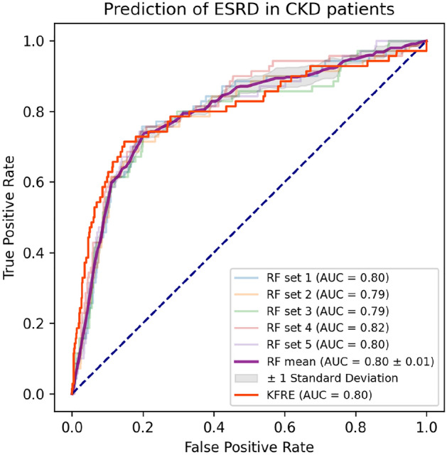

# Machine learning to predict end stage kidney disease in chronic kidney disease
机器学习预测慢性肾脏病中的终末期肾脏疾病

## Abstract  摘要
The purpose of this study was to assess the feasibility of machine learning (ML) in predicting the risk of end-stage kidney disease (ESKD) from patients with chronic kidney disease (CKD). Data were obtained from a longitudinal CKD cohort. Predictor variables included patients’ baseline characteristics and routine blood test results. The outcome of interest was the presence or absence of ESKD by the end of 5 years. Missing data were imputed using multiple imputation. Five ML algorithms, including logistic regression, naïve Bayes, random forest, decision tree, and K-nearest neighbors were trained and tested using fivefold cross-validation. The performance of each model was compared to that of the Kidney Failure Risk Equation (KFRE). The dataset contained 748 CKD patients recruited between April 2006 and March 2008, with the follow-up time of 6.3 ± 2.3 years. ESKD was observed in 70 patients (9.4%). Three ML models, including the logistic regression, naïve Bayes and random forest, showed equivalent predictability and greater sensitivity compared to the KFRE. The KFRE had the highest accuracy, specificity, and precision. This study showed the feasibility of ML in evaluating the prognosis of CKD based on easily accessible features. Three ML models with adequate performance and sensitivity scores suggest a potential use for patient screenings. Future studies include external validation and improving the models with additional predictor variables.

本研究旨在评估机器学习（ML）在预测慢性肾脏病（CKD）患者终末期肾脏病（ESKD）风险方面的可行性。数据来自纵向 CKD 队列。预测变量包括患者的基线特征和常规血液检查结果。关注的结果是 5 年结束时是否存在 ESKD。使用多重插补对缺失数据进行插补。五种 ML 算法，包括逻辑回归，朴素贝叶斯，随机森林，决策树和 K-最近邻，使用五重交叉验证进行训练和测试。将每个模型的性能与肾衰竭风险方程（KFRE）的性能进行比较。该数据集包含 2006 年 4 月至 2008 年 3 月期间招募的 748 名 CKD 患者，随访时间为 6.3 ± 2.3 年。 70 例患者（9.4%）观察到 ESKD。三种 ML 模型，包括逻辑回归，朴素贝叶斯和随机森林，与 KFRE 相比，表现出相当的可预测性和更高的灵敏度。KFRE 具有最高的准确度、特异性和精密度。这项研究表明，ML 在评估 CKD 预后的基础上，易于访问的功能的可行性。三个 ML 模型具有足够的性能和灵敏度评分，表明可能用于患者筛查。未来的研究包括外部验证和改进模型与额外的预测变量。

## Subject terms: Nephrology, Kidney diseases, Chronic kidney disease, End-stage renal disease
主题术语： 肾脏病学、肾脏疾病、慢性肾脏疾病、终末期肾脏疾病

## Introduction  介绍
Chronic kidney disease (CKD) is a significant healthcare burden that affects billions of individuals worldwide[1,2] and makes a profound impact on global morbidity and mortality[3–5]. In the United States, approximately 11% of the population or 37 million people suffer from CKD that results in an annual Medicare cost of $84 billion[6]. The prevalence of this disease is estimated at 10.8% in China, affecting about 119.5 million people[7].

慢性肾脏疾病（CKD）是一种严重的医疗保健负担，影响全球数十亿人 [1，2]，并对全球发病率和死亡率产生深远影响 [3-5]。在美国，约有 11%的人口或 3700 万人患有 CKD，导致每年的医疗保险费用为 840 亿美元。 据估计，这种疾病在中国的患病率为 10.8%，影响约 1.195 亿人。

Gradual loss of the kidney function can lead to end stage kidney disease (ESKD) in CKD patients, precipitating the need for kidney replacement therapy (KRT). Timely intervention in those CKD patients who have a high risk of ESKD may not only improve these patients’ quality of life by delaying the disease progression, but also reduce the morbidity, mortality and healthcare costs resulting from KRT[8,9]. Because the disease progression is typically silent[10], a reliable prediction model for risk of ESKD at the early stage of CKD can be clinically essential. Such a model is expected to facilitate physicians in making personalized treatment decisions for high-risk patients, thereby improving the overall prognosis and reducing the economic burden of this disease.

肾功能的逐渐丧失可导致 CKD 患者的终末期肾病（ESKD），从而促使需要肾脏替代治疗（KRT）。对 ESKD 高风险 CKD 患者进行及时干预不仅可以通过延迟疾病进展改善这些患者的生活质量，还可以降低 KRT 导致的发病率、死亡率和医疗费用 [8，9]。由于疾病进展通常是无症状的 [10]，因此在 CKD 早期阶段 ESKD 风险的可靠预测模型在临床上是必不可少的。这种模型有望帮助医生为高危患者做出个性化的治疗决策，从而改善整体预后并减轻这种疾病的经济负担。

A few statistical models were developed to predict the likelihood of ESKD based on certain variables, including age, gender, lab results, and most commonly, the estimated glomerular filtration rate (eGFR) and albuminuria[11,12]. Although some of these models demonstrated adequate predictability in patients of a specific race, typically Caucasians[13–15], literature on their generalizability in other ethnic groups, such as Chinese, remains scarce[13,16]. In addition, models based on non-urine variables, such as patients’ baseline characteristics and routine blood tests, have reportedly yield sufficient performance[17,18]. Therefore, it may be feasible to predict ESKD without urine tests, leading to a simplified model with equivalent reliability.

开发了一些统计模型来预测 ESKD 的可能性，基于某些变量，包括年龄，性别，实验室结果，最常见的是估计的肾小球滤过率（eGFR）和白蛋白尿 [11，12]。尽管这些模型中的一些在特定种族的患者中表现出足够的可预测性，通常是高加索人 [13-15]，但关于其在其他种族群体（如中国人）中的普遍性的文献仍然很少 [13，16]。此外，据报道，基于非尿液变量（如患者的基线特征和常规血液检查）的模型具有足够的性能 [17，18]。因此，它可能是可行的预测 ESKD 没有尿液测试，导致一个简化的模型具有同等的可靠性。

With the advent of the big data era, new methods became available in developing a predictive model that used to rely on traditional statistics. Machine learning (ML) is a subset of artificial intelligence (AI) that allows the computer to perform a specific task without explicit instructions. When used in predictive modeling, ML algorithm can be trained to capture the underlying patterns of the sample data and make predictions about the new data based on the acquired information[19]. Compared to traditional statistics, ML represents more sophisticated math functions and usually results in better performance in predicting an outcome that is determined by a large set of variables with non-linear, complex interactions[20]. ML has recently been applied in numerous studies and demonstrated high level of performance that surpassed traditional statistics and even humans[20–23].

随着大数据时代的到来，开发预测模型的新方法变得可用，而这些预测模型过去依赖于传统的统计数据。机器学习（ML）是人工智能（AI）的一个子集，允许计算机在没有明确指令的情况下执行特定任务。当在预测建模中使用时，ML 算法可以被训练以捕获样本数据的底层模式，并基于所获取的信息 19 对新数据进行预测。与传统统计相比，ML 代表了更复杂的数学函数，并且通常在预测由具有非线性复杂交互的大量变量确定的结果时具有更好的性能。ML 最近被应用于许多研究，并表现出超越传统统计甚至人类的高水平性能。

This article presents a proof-of-concept study with the major goal to establish ML models for predicting the risk of ESKD on a Chinese CKD dataset. The ML models were trained and tested based on easily obtainable variables, including the baseline characteristics and routine blood tests. Results obtained from this study suggest not only the feasibility of ML models in performing this clinically critical task, but also the potential in facilitating personalized medicine.

本文提出了一项概念验证研究，主要目标是建立 ML 模型，用于预测中国 CKD 数据集上 ESKD 的风险。ML 模型基于容易获得的变量进行训练和测试，包括基线特征和常规血液检查。从这项研究中获得的结果不仅表明了 ML 模型在执行这一临床关键任务方面的可行性，而且还表明了促进个性化医疗的潜力。

## Materials and methods  材料和方法
### Study population  研究人群
The data used for this retrospective work were obtained from a longitudinal cohort previously enrolled in an observational study[24,25]. The major inclusion criteria for the cohort were adult CKD patients (≥ 18 years old) with stable kidney functions for at least three months prior to recruitment. 

Patients were excluded if they had one or more of the following situations: 
- (1) history of KRT in any form, including hemodialysis, peritoneal dialysis or kidney transplantation; 
- (2) any other existing condition deemed physically unstable, including life expectancy < 6 months, acute heart failure, and advanced liver disease; 
- (3) any pre-existing malignancy. 

All patients were recruited from the CKD management clinic of Peking University Third Hospital between April 2006 and March 2008. Written informed consent was obtained from all patients. They were treated according to routine clinical practice determined by the experienced nephrologists and observed until December 31st, 2015. Detailed information regarding patient recruitment and management protocol has been described in a previous publication[24].

本回顾性研究使用的数据来自于先前在一项观察性研究中招募的纵向队列 [24，2]5。该队列的主要入选标准是招募前至少 3 个月肾功能稳定的成人 CKD 患者（≥ 18 岁）。

如果患者有以下一种或多种情况，则将其排除：
- （1）任何形式的 KRT 病史，包括血液透析、腹膜透析或肾移植;
- （2）任何其他被认为身体不稳定的现有状况，包括预期寿命< 6 个月、急性心力衰竭和晚期肝病;
- （3）任何预先存在的恶性肿瘤。

所有患者均于 2006 年 4 月至 2008 年 3 月期间从北京大学第三医院 CKD 管理门诊招募。获得所有患者的书面知情同意书。 根据经验丰富的肾脏科医生确定的常规临床实践进行治疗，并观察至 2015 年 12 月 31 日。 关于患者招募和管理方案的详细信息已在先前的出版物 [24] 中描述。

### Data acquisition  数据采集
- Patient characteristics included age, gender, education level, marriage status, and insurance status. 
- Medical history comprised history of smoking, history of alcohol consumption, presence of each comorbid condition—diabetes, cardiovascular disease and hypertension. 
- Clinical parameters contained body mass index (BMI), systolic pressure and diastolic pressure. Blood tests consisted of serum creatinine, uric acid, blood urea nitrogen, white blood cell count, hemoglobin, platelets count, alanine aminotransferase (ALT), aspartate aminotransferase (AST), total protein, albumin, alkaline phosphatase (ALP), high-density lipoprotein, low-density lipoprotein, triglycerides, total cholesterol, calcium, phosphorus, potassium, sodium, chloride, and bicarbonate. 
- The estimated glomerular filtration rate and type of primary kidney disease were also used as predictors.

- 患者特征包括年龄、性别、教育水平、婚姻状况和保险状况。
- 病史包括吸烟史、饮酒史、存在每种共病-糖尿病、心血管疾病和高血压。
- 临床参数包括体重指数（BMI）、收缩压和舒张压。血液检查包括血清肌酐、尿酸、血尿素氮、白色血细胞计数、血红蛋白、血小板计数、丙氨酸氨基转移酶（ALT）、天冬氨酸氨基转移酶（AST）、总蛋白、白蛋白、碱性磷酸酶（ALP）、高密度脂蛋白、低密度脂蛋白、甘油三酯、总胆固醇、钙、磷、钾、钠、氯和碳酸氢盐。
- 估计肾小球滤过率和原发性肾脏疾病的类型也被用作预测因子。

All baseline variables were obtained at the time of subject enrollment. The primary study end point was kidney failure which necessitated the use of any KRT. Subjects with the outcome of kidney failure were labeled as ESKD+, and the rest ESKD−. Patients who died before reaching the study end point or lost to follow up were discarded. Patients who developed ESKD after five years were labeled as ESKD−.

在受试者入组时获得所有基线变量。主要研究终点是肾衰竭，需要使用任何 KRT。结局为肾衰竭的受试者标记为 ESKD+，其余为 ESKD−。在达到研究终点前死亡或失访的患者被丢弃。5 年后发生 ESKD 的患者被标记为 ESKD−。

### Data preprocessing  数据预处理
All categorical variables, such as insurance status, education, and primary disease, were encoded using the one-hot approach. Any variable was removed from model development if the missing values were greater than 50%. Missing data were handled using multiple imputation with five times of repetition, leading to five slightly different imputed datasets where each of the missing values was randomly sampled from their predictive distribution based on the observed data. On each imputed set, all models were trained and tested using a fivefold cross validation method. To minimize selection bias, subject assignment to train/test folds was kept consistent across all imputed sets. Data were split in a stratified fashion to ensure the same distribution of the outcome classes (ESKD+ vs. ESKD−) in each subset as the entire set.

所有的分类变量，如保险状况，教育和原发疾病，都是使用独热方法编码的。如果缺失值大于 50%，则从模型开发中删除任何变量。使用重复 5 次的多重插补处理缺失数据，得到 5 个略有不同的插补数据集，其中每个缺失值均基于观察数据从其预测分布中随机采样。在每个插补集上，使用五重交叉验证方法训练和测试所有模型。为了最大限度地减少选择偏差，受试者对训练/测试倍数的分配在所有插补集中保持一致。以分层方式分割数据，以确保每个子集中结局类别（ESKD+ vs. ESKD-）的分布与整个数据集相同。

### Model development  模型开发
The model was trained to perform a binary classification task with the goal of generating the probability of ESKD+ based on the given features. Five ML algorithms were employed in this study, including logistic regression, naïve Bayes, random forest, decision tree, and K-nearest neighbors. Grid search was performed to obtain the best hyperparameter combination for each algorithm.

该模型经过训练以执行二进制分类任务，目标是根据给定的特征生成 ESKD+的概率。在这项研究中使用了五种 ML 算法，包括逻辑回归，朴素贝叶斯，随机森林，决策树和 K-最近邻。进行网格搜索，以获得每个算法的最佳超参数组合。

### Assessment of model performance    模型性能评估
The performance of a classifiers was measured using accuracy, precision, recall, specificity, F1 score and area under the curve (AUC), as recommended by guidelines for results reporting of clinical prediction models[26]. All classifiers developed in this study were further compared with the Kidney Failure Risk Equation (KFRE), which estimates the 5-year risk of ESKD based on patient’s age, gender, and eGFR[12]. The KFRE is currently the most widely used model in predicting CKD progression to ESKD. The reported outcome of a model represented the average performance of 5 test folds over all imputed sets.

使用准确度、精确度、召回率、特异性、F1 评分和曲线下面积（AUC）测量分类器的性能，如临床预测模型结果报告指南 [26] 所推荐的。将本研究中开发的所有分类器与肾衰竭风险方程（KFRE）进行进一步比较，KFRE 根据患者的年龄、性别和 eGFR12 估计 ESKD 的 5 年风险。KFRE 是目前预测 CKD 进展为 ESKD 的最广泛使用的模型。报告的模型结果代表了所有插补集上 5 个检验倍数的平均性能。

### Statistical analysis  统计分析
Basic descriptive statistics were applied as deemed appropriate. Results are expressed as frequencies and percentages for categorical variables; the mean ± standard deviation for continuous, normally distributed variables; and the median (interquartile range) for continuous variables that were not normally distributed. Patient characteristics were compared between the original dataset and the imputed sets using one-way analysis of variance (ANOVA). The AUC of each model was measured using the predicted probability. The optimal threshold of a classifier was determined based on the receiver operating characteristic (ROC) curve at the point with minimal distance to the upper left corner. For each ML model, this threshold was obtained during the training process and applied unchangeably to the test set. For the KFRE, the threshold was set at a default value of 0.5. Model development, performance evaluation and data analyses were all performed using Python[27]. The alpha level was set at 0.05.

适当时采用基本描述性统计量。结果表示为分类变量的频率和百分比;连续、正态分布变量的平均值±标准差;非正态分布的连续变量的中位数（四分位距）。使用单因素方差分析（ANOVA）比较原始数据集和插补集之间的患者特征。使用预测概率测量每个模型的 AUC。根据受试者工作特征（ROC）曲线，在距离左上角最小的点确定分类器的最佳阈值。对于每个 ML 模型，这个阈值是在训练过程中获得的，并不可更改地应用于测试集。对于 KFRE，阈值设置为默认值 0.5。模型开发、性能评估和数据分析都使用 Python[27] 进行。 α水平设定为0.05。

### Ethical approval  伦理批准
This research was conducted ethically in accordance with the World Medical Association Declaration of Helsinki. The study protocol has been approved by the Peking University Third Hospital Medical Science Research Ethics Committee on human research (No. M2020132).

本研究按照世界医学协会赫尔辛基宣言进行。本研究方案已获得北京大学第三医院医学科学研究伦理委员会关于人体研究的批准（编号：M2020132）。

## Results  结果
### Cohort characteristics  队列特征
The dataset contained a total of 748 subjects with the follow-up duration of 6.3 ± 2.3 years. The baseline characteristics are summarized in Table 1. Most patients were in stage 2 (24.5%) or 3 (47.1%) CKD at baseline. ESKD was observed in 70 patients (9.4%), all of whom subsequently received KRT, including hemodialysis in 49 patients, peritoneal dialysis in 17 and kidney transplantation in 4.
数据集共包含 748 例受试者，随访时间为 6.3 ± 2.3 年。基线特征总结见表 1 。大多数患者在基线时处于 CKD 2 期（24.5%）或 3 期（47.1%）。70 例患者（9.4%）观察到 ESKD，所有患者随后接受 KRT，包括 49 例血液透析，17 例腹膜透析和 4 例肾移植。

> Table 1.  表1.
> Baseline patient characteristics.
> 基线患者特征。

| Variables | 中文变量 | 数值 |
|-----------|----------|------|
| Age (years) | 年龄（岁） | 57.8 ± 17.6 |
| Gender (male/female) | 性别（男/女） | 419/329 |
| SBP (mmHg) | 收缩压（mmHg） | 129.5 ± 17.8 |
| DBP (mmHg) | 舒张压（mmHg） | 77.7 ± 11.1 |
| BMI (kg/m²) | 体重指数（kg/m²） | 24.8 ± 3.7 |
| Primary disease | 原发病 | - |
| Primary GN | 初级 GN | 292 (39.0%) |
| Diabetes | 糖尿病 | 224 (29.9%) |
| Hypertension | 高血压 | 97 (13.0%) |
| CIN | CIN | 64 (8.6%) |
| Others | 其他 | 18 (2.4%) |
| Unknown | 未知 | 53 (7.1%) |
| Creatinine (µmol/L) | 肌酐（µmol/L） | 130.0 (100.0, 163.0) |
| Urea (mmol/L) | 尿素（mmol/L） | 7.9 (5.6, 10.4) |
| ALT (U/L) | ALT（U/L） | 17.0 (12.0, 24.0) |
| AST (U/L) | AST（U/L） | 18.0 (15.0, 22.0) |
| ALP (U/L) | 碱性磷酸酶（U/L） | 60.0 (50.0, 75.0) |
| Total protein (g/L) | 总蛋白（g/L） | 71.6 ± 8.4 |
| Albumin (g/L) | 白蛋白（g/L） | 42.2 ± 5.6 |
| Urine acid (µmol/L) | 尿酸（µmol/L） | 374.0 (301.0, 459.0) |
| Calcium (mmol/L) | 钙（mmol/L） | 2.2 ± 0.1 |
| Phosphorous (mmol/L) | 磷（mmol/L） | 1.2 ± 0.2 |
| Ca × P (mg²/dL²) | Ca × P（mg²/dL²） | 33.5 ± 5.6 |
| Blood leukocyte (10⁹/L) | 血白细胞（10⁹/L） | 7.1 ± 2.4 |
| Hemoglobin (g/L) | 血红蛋白（g/L） | 131.0 ± 20.3 |
| Platelet (10⁹/L) | 血小板（10⁹/L） | 209.8 ± 57.1 |
| eGFR (ml/min/1.73m²) | eGFR（ml/min/1.73m²） | 46.1 (32.6, 67.7) |
| CKD stage | CKD 分期 | - |
| Stage 1 | 阶段1 | 58 (7.8%) |
| Stage 2 | 阶段2 | 183 (24.5%) |
| Stage 3 | 阶段3 | 352 (47.1%) |
| Stage 4 | 阶段4 | 119 (15.9%) |
| Stage 5 | 阶段5 | 36 (4.8%) |
| Total cholesterol | 总胆固醇 | 5.1 (4.3, 5.9) |
| Triglyceride | 甘油三酯 | 1.8 (1.3, 2.6) |
| HDL-c | HDL-c | 1.3 (1.1, 1.6) |
| LDL-c | LDL-c | 3.0 (2.4, 3.7) |
| Fasting glucose (mmol/L) | 空腹血糖（mmol/L） | 5.4 (4.9, 6.2) |
| Potassium (mmol/L) | 钾（mmol/L） | 4.3 ± 0.5 |
| Sodium (mmol/L) | 钠（mmol/L） | 140.2 ± 2.8 |
| Chlorine (mmol/L) | 氯（mmol/L） | 106.9 ± 3.7 |
| Bicarbonate (mmol/L) | 碳酸氢钠（mmol/L） | 25.9 ± 3.6 |
| Medical history | 病史 | - |
| Hypertension | 高血压 | 558 (74.6%) |
| Diabetes mellitus | 糖尿病 | 415 (55.5%) |
| Cardiovascular or cerebrovascular disease | 心血管或脑血管疾病 | 177 (23.7%) |
| Smoking | 吸烟 | 91 (12.6%) |

> SBP systolic blood pressure, DBP diastolic blood pressure, GN glomerulonephritis, CIN chronic interstitial nephritis, BMI body mass index, eGFR estimated glomerular filtration rate, ALT alanine aminotransferase, AST aspartate transaminase, ALP alkaline phosphatase, CKD chronic kidney disease, HDL-c high density lipoprotein cholesterol, LDL-c low density lipoprotein cholesterol, Ca × P calcium-phosphorus product.
> SBP 收缩压、DBP 舒张压、GN 肾小球肾炎、CIN 慢性间质性肾炎、BMI 体重指数、eGFR 估计的肾小球滤过率、ALT 丙氨酸转氨酶、AST 天冬氨酸转氨酶、ALP 碱性磷酸酶、CKD 慢性肾病、HDL-c 高密度脂蛋白胆固醇、LDL-c 低密度脂蛋白胆固醇、Ca×P 钙磷乘积。

### Model performance  模型性能
Details of the five imputed sets are provided in the supplemental materials. There was no significant difference between the imputed sets and the original dataset in each variable where missing data were replaced by imputed values. The hyperparameter settings for each classifier are displayed in Table 2. The best overall performance, as measured by the AUC score, was achieved by the random forest algorithm (0.81, see Table 3). Nonetheless, this score and its 95% confidence interval had overlap with those of the other three models, including the logistic regression, naïve Bayes, and the KFRE (Fig. 1). Interestingly, the KFRE model that was based on 3 simple variables, demonstrated not only a comparable AUC score but also the highest accuracy, specificity, and precision. At the default threshold, however, the KFRE was one of the least sensitive models (47%).

5 个插补集的详细信息见 supplemental materials 。插补数据集和原始数据集之间的每个变量均无显著差异，其中缺失数据被插补值替代。每个分类器的超参数设置如表 2 所示。通过随机森林算法（0.81，见表 2#）获得了最佳总体性能（通过 AUC 评分测量）。尽管如此，该评分及其 95%置信区间与其他三种模型（包括逻辑回归、朴素贝叶斯和 KFRE）的评分及其 95%置信区间重叠（图 3#）。有趣的是，基于 3 个简单变量的 KFRE 模型不仅表现出相当的 AUC 评分，而且表现出最高的准确度、特异性和精密度。然而，在默认阈值下，KFRE 是最不敏感的模型之一（47%）。

> Table 2.  表2.
> Hyperparameters of the algorithms.
> 算法的超参数

| Algorithms | 算法 | 超参数 |
|------------|----------|--------|
| Logistic regression | Logistic 回归 | penalty = 'l2', class_weight = 'balanced', max_iter = 100000, C = 10, solver = 'liblinear' |
| Naive Bayes | 朴素贝叶斯 | type = 'multinomial', alpha = 150 |
| Decision tree | 决策树 | criterion = 'gini', splitter = 'best', max_depth = 16, max_features = 15, min_samples_leaf = 5, min_samples_split = 0.0001 |
| Random forest | 随机森林 | class_weight = 'balanced', criterion = 'gini', max_depth = 9, max_features = 17, min_samples_leaf = 6, min_samples_split = 30, n_estimators = 32 |
| K-nearest neighbors | k 近邻 | weights = 'distance', metric = 'minkowski', n_neighbors = 16, leaf_size = 10 |

> Table 3.  表3.
> The performance of all algorithms.
> 所有算法的性能。

| 算法 | Accuracy (精度) | Sensitivity (灵敏度) | Specificity (特异性) | Precision (精确度) | F1 Score (F1 分数) | AUC |
|------|------------------|----------------------|----------------------|--------------------|--------------------|-----|
| Logistic regression (Logistic 回归) | 0.75 (0.72, 0.79) | 0.79 (0.73, 0.85) | 0.75 (0.71, 0.79) | 0.26 (0.24, 0.29) | 0.38 (0.36, 0.41) | 0.79 (0.77, 0.82) |
| Naïve Bayes (朴素贝叶斯) | 0.86 (0.85, 0.87) | 0.72 (0.68, 0.75) | 0.87 (0.86, 0.89) | 0.37 (0.35, 0.40) | 0.49 (0.46, 0.51) | 0.80 (0.77, 0.82) |
| Random forest (随机森林) | 0.82 (0.80, 0.85) | 0.76 (0.71, 0.81) | 0.83 (0.80, 0.86) | 0.34 (0.30, 0.39) | 0.46 (0.43, 0.49) | 0.81 (0.78, 0.83) |
| K nearest neighbor (K 近邻) | 0.84 (0.81, 0.86) | 0.60 (0.57, 0.64) | 0.86 (0.83, 0.89) | 0.35 (0.30, 0.40) | 0.43 (0.40, 0.46) | 0.73 (0.71, 0.75) |
| Decision tree (决策树) | 0.84 (0.82, 0.86) | 0.44 (0.39, 0.49) | 0.89 (0.86, 0.91) | 0.33 (0.26, 0.40) | 0.35 (0.32, 0.39) | 0.66 (0.63, 0.68) |
| KFRE | 0.90 (0.90, 0.91) | 0.47 (0.42, 0.52) | 0.95 (0.94, 0.96) | 0.50 (0.45, 0.55) | 0.48 (0.43, 0.52) | 0.80 (0.78, 0.83) |

> All outcomes are expressed as mean and (95% confidence interval).
> 所有结果均表示为平均值和（95%置信区间）。

> KFRE kidney failure risk equation, AUC area under the curve.
> KFRE 肾衰竭风险方程，AUC 曲线下面积。

> Figure 1.  图1.

> ROC curves of the random forest algorithm and the KFRE model.
> 随机森林算法和 KFRE 模型的 ROC 曲线。

## Discussion  讨论
With extensive utilization of electronic health record and recent progress in ML research, AI is expanding its impact on healthcare and has gradually changed the way clinicians pursue for problem-solving[28]. Instead of adopting a theory-driven strategy that requires a preformed hypothesis from prior knowledge, training an ML model typically follows a data-driven approach that allows the model to learn from experience alone. Specifically, the model improves its performance iteratively on a training set by comparing the predictions to the ground truths and adjusting model parameters so as to minimize the distance between the predictions and the truths. In nephrology, ML has demonstrated promising performances in predicting acute kidney injury or time to allograft loss from clinical features[29,30], recognizing specific patterns in pathology slides[31,32], choosing an optimal dialysis prescription[33], or mining text in the electronic health record to find specific cases[34,35]. Additionally, a few recent studies were performed to predict the progression of CKD using ML methods. These models were developed to estimate the risk of short-term mortality following dialysis[36], calculate the future eGFR values[37], or assess the 24-h urinary protein levels[18]. To our best knowledge, there hasn’t been any attempt to apply ML methods to predict the occurrence of ESKD in CKD patients.

随着电子健康记录的广泛使用和机器学习研究的最新进展，人工智能正在扩大其对医疗保健的影响，并逐渐改变了临床医生寻求解决问题的方式。 训练 ML 模型通常遵循数据驱动的方法，允许模型仅从经验中学习，而不是采用理论驱动的策略，需要从先验知识中预先形成假设。具体而言，该模型通过将预测与地面事实进行比较并调整模型参数以最小化预测与事实之间的距离来迭代地提高其在训练集上的性能。 在肾脏病学中，ML 在从临床特征预测急性肾损伤或同种异体移植物丢失时间 29、30、识别病理切片中的特定模式 31、32、选择最佳透析处方 33 或挖掘电子健康记录中的文本以找到特定病例 34、35 方面表现出有前途的性能。此外，最近进行了一些研究，使用 ML 方法预测 CKD 的进展。开发这些模型是为了估计透析后短期死亡率的风险 36，计算未来的 eGFR 值 37，或评估 24 小时尿蛋白水平 18。据我们所知，还没有任何尝试应用 ML 方法来预测 CKD 患者 ESKD 的发生。

In the present study, a prediction model for ESKD in CKD patients was explored using ML techniques. Most classifiers demonstrated adequate performance based on easily accessible patient information that is convenient for clinical translation. In general, three ML models, including the logistic regression, naïve Bayes and random forest, showed non-inferior performance to the KFRE in this study. These findings imply ML as a feasible approach for predicting disease progression in CKD, which could potentially guide physicians in establishing personalized treatment plans for this condition at an early stage. These ML models with higher sensitivity scores may also be practically favored in patient screening over the KFRE.

在本研究中，使用 ML 技术探索了 CKD 患者 ESKD 的预测模型。大多数分类器基于便于临床翻译的易于访问的患者信息表现出足够的性能。总体而言，三种 ML 模型，包括逻辑回归，朴素贝叶斯和随机森林，在本研究中表现出不劣于 KFRE 的性能。这些发现意味着 ML 是预测 CKD 疾病进展的可行方法，这可能会指导医生在早期阶段为这种疾病制定个性化治疗计划。这些具有更高灵敏度评分的 ML 模型在患者筛选中也可能实际上优于 KFRE。

To our best understanding, this study was also the first to validate the KFRE in CKD patients of Mainland China. The KFRE was initially developed and validated using North American patients with CKD stage 3–5[12]. There were seven KFRE models that consisted of different combinations of predictor variables. The most commonly used KFRE included a 4-variable model (age, gender, eGFR and urine ACR) or an 8-variable model (age, gender, eGFR, urine ACR, serum calcium, phosphorous, bicarbonate, and albumin). Besides, there was a 3-variable model (age, gender, and eGFR) that required no urine ACR and still showed comparable performance to the other models in the original article. Despite its favorable performance in prediction for ESKD in patients of Western countries[14,15,38,39], the generalizability of KFRE in Asian population remained arguable following the suboptimal results revealed by some recent papers[13,40,41]. In the current study, the KFRE was validated in a Chinese cohort with CKD stage 1–5 and showed an AUC of 0.80. This result indicated the KFRE was adequately applicable to the Chinese CKD patients and even earlier disease stages. In particular, the high specificity score (0.95) may favor the use of this equation in ruling in patients who require close monitoring of disease progression. On the other hand, a low sensitivity (0.47) at the default threshold may suggest it may be less desirable than the other models for ruling out patients.

据我们所知，这项研究也是首次在中国大陆 CKD 患者中验证 KFRE。KFRE 最初是使用患有 CKD 3-5 期的北美患者开发和验证的。 有七个 KFRE 模型，包括不同的预测变量的组合。最常用的 KFRE 包括 4 变量模型（年龄、性别、eGFR 和尿 ACR）或 8 变量模型（年龄、性别、eGFR、尿 ACR、血清钙、磷、碳酸氢盐和白蛋白）。此外，有一个 3 变量模型（年龄、性别和 eGFR），不需要尿 ACR，仍然显示出与原始文章中其他模型相当的性能。 尽管 KFRE 在预测西方国家患者 ESKD 方面表现良好 [14，15，38，39]，但在亚洲人群中的普适性仍然是不可接受的，因为最近的一些论文揭示了次优结果 13，40，41。在当前研究中，KFRE 在 1-5 期 CKD 中国队列中得到验证，AUC 为 0.80。这一结果表明，KFRE 适用于中国 CKD 患者，甚至更早的疾病阶段。特别是，高特异性评分（0.95）可能有利于在需要密切监测疾病进展的患者中使用该方程。另一方面，在默认阈值处的低灵敏度（0.47）可能表明其可能不如用于排除患者的其他模型理想。

Urine test is a critical diagnostic approach for CKD. The level of albuminuria (i.e. ACR) has also been regarded as a major predictor for disease progression and therefore used by most prognostic models. However, quantitative testing for albuminuria is not always available in China especially in rural areas, which precludes clinicians from using most urine-based models for screening patients. In this regard, several simplified models were developed to predict CKD progression without the need of albuminuria. These models were based on patient characteristics (e.g. age, gender, BMI, comorbidity) and/or blood work (e.g. creatinine/eGFR, BUN), and still able to achieve an AUC of 0.87–0.8912,[18] or a sensitivity of 0.8837. Such performance was largely consistent with the findings of this study and comparable or even superior to some models incorporating urine tests[16,42]. Altogether, it suggested a reliable prediction for CKD progression may be obtained from routine clinical variables without urine measures. These models are expected to provide a more convenient screening tool for CKD patients in developing regions.

尿液检查是诊断 CKD 的重要方法。白蛋白尿水平（即 ACR）也被认为是疾病进展的主要预测因子，因此被大多数预后模型使用。然而，在中国，尤其是在农村地区，蛋白尿的定量检测并不总是可用的，这使得临床医生无法使用大多数基于尿液的模型来筛查患者。在这方面，开发了几种简化模型来预测 CKD 进展，而不需要蛋白尿。这些模型基于患者特征（例如，年龄、性别、BMI、合并症）和/或血液检查（例如，肌酐/eGFR、BUN），并且仍然能够实现 0.87-0.8912，18 的 AUC 或 0.8837 的灵敏度。这种性能与本研究的结果基本一致，并且与结合尿液测试的一些模型相当或甚至优于上级 16，42。 总而言之，这表明可以从常规临床变量中获得 CKD 进展的可靠预测，而无需尿液测量。这些模型有望为发展中地区的 CKD 患者提供更方便的筛查工具。

Missing data are such a common problem in ML research that they can potentially lead to a biased model and undermine the validity of study outcomes. Traditional methods to handle missing data include complete case analysis, missing indicator, single value imputation, sensitivity analyses, and model-based methods (e.g. mixed models or generalized estimating equations)[43–45]. In most scenarios, complete case analysis and single value imputation are favored by researchers primarily due to the ease of implementation[45–47]. However, these methods may be associated with significant drawbacks. For example, by excluding samples with missing data from analyses, complete case analysis can result in reduction of model power, overestimation of benefit and underestimation of harm[43,46]; Single value imputation replaces the missing data by a single value—typically the mean or mode of the complete cases, thereby increasing the homogeneity of data and overestimating the precision[43,48]. In this regard, multiple imputation solves these problems by generating several different plausible imputed datasets, which account for the uncertainty about the missing data and provide unbiased estimates of the true effect[49,50]. It is deemed effective regardless of the pattern of missingness[43,51]. Multiple imputation is now widely recognized as the standard method to deal with missing data in many areas of research[43,45]. In the current study, a 5-set multiple imputation method was employed to obtain reasonable variability of the imputed data. The performance of each model was analyzed on each imputed set and pooled for the final result. These procedures ensured that the model bias resulting from missing data was minimized. In the future, multiple imputation is expected to become a routine method for missing data handling in ML research, as the extra amount of computation associated with multiple imputation over those traditional methods can simply be fulfilled by the high level of computational power required by ML.

缺失数据是 ML 研究中的一个常见问题，它们可能会导致有偏见的模型并破坏研究结果的有效性。处理缺失数据的传统方法包括完整病例分析、缺失指标、单值插补、敏感性分析和基于模型的方法（例如混合模型或广义估计方程）43-45。在大多数情况下，完整的案例分析和单值插补受到研究人员的青睐，主要是因为易于实现 45-47。然而，这些方法可能与显著的缺点相关联。 例如，通过从分析中排除缺失数据的样本，完整的病例分析可能导致模型功效降低，高估获益和低估危害 43，46;单值插补用单个值（通常为完整病例的平均值或众数）替换缺失数据，从而增加数据的同质性并高估精度 43，48。在这方面，多重插补通过生成几个不同的合理插补数据集来解决这些问题，这些数据集解释了缺失数据的不确定性，并提供了真实效应的无偏估计 49，50。无论缺失的模式如何，它都被认为是有效的 43，51。 多重插补现在被广泛认为是标准的方法来处理缺失的数据在许多领域的研究 43，45。在本研究中，采用 5 集多重插补方法获得插补数据的合理变异性。在每个插补集上分析每个模型的性能，并合并最终结果。这些程序确保了缺失数据导致的模型偏倚最小化。在未来，多重插补有望成为 ML 研究中缺失数据处理的常规方法，因为与传统方法相比，与多重插补相关的额外计算量可以简单地通过 ML 所需的高水平计算能力来实现。

Although ML has been shown to outperform traditional statistics in a variety of tasks by virtue of the model complexity, some studies demonstrated no gain or even declination of performance compared to traditional regression methods[52,53]. In this study, the simple logistic regression model also yielded a comparable or even superior predictability for ESKD to other ML algorithms. The most likely explanation is that the current dataset only had a small sample size and limited numbers of predictor variables, and the ESKD+ cases were relatively rare. The lack of big data and imbalanced class distribution may have negative impact on the performance of complex ML algorithms, as they are typically data hungry[54]. On the other hand, this finding could imply simple interactions among the predictor variables. In other words, the risk of ESKD may be largely influenced by only a limited number of factors in an uncomplicated fashion, which is consistent with some previous findings[12,18,55]. The fact that the 3-variable KFRE, which is also a regression model, yielded equivalent outcomes to the best ML models in this study may further support this implication. It is therefore indicated that traditional regression models may continue to play a key role in disease risk prediction, especially when a small sample size, limited predictor variables, or an imbalanced dataset is encountered. The fact that some of the complex ML models are subject to the risk of overfitting and the lack of interpretability further favors the use of simple regression models, which can be translated to explainable equations.

尽管 ML 已经被证明在各种任务中由于模型复杂性而优于传统统计，但一些研究表明，与传统回归方法相比，ML 的性能没有提高甚至下降。 在这项研究中，简单逻辑回归模型也产生了与其他 ML 算法相当甚至上级的 ESKD 可预测性。最可能的解释是，当前数据集的样本量较小，预测变量数量有限，ESKD+病例相对较少。缺乏大数据和不平衡的类分布可能会对复杂 ML 算法的性能产生负面影响，因为它们通常是数据饥饿的。 另一方面，这一发现可能意味着预测变量之间存在简单的相互作用。 换句话说，ESKD 的风险可能在很大程度上仅受有限数量的因素以简单的方式影响，这与之前的一些发现一致 12，18，55。3 变量 KFRE 也是一种回归模型，在本研究中产生了与最佳 ML 模型相同的结果，这一事实可能进一步支持这一含义。因此，传统的回归模型可能继续在疾病风险预测中发挥关键作用，特别是当遇到小样本量，有限的预测变量或不平衡的数据集时。一些复杂的 ML 模型存在过度拟合的风险和缺乏可解释性，这一事实进一步有利于使用简单的回归模型，这些模型可以转换为可解释的方程。

Several limitations should be noted. First, this cohort consisted of less than 1000 subjects and ESKD only occurred in a small portion of them, both of which might have affected model performance as discussed earlier. Second, although this study aimed to assess the feasibility of a prediction model for ESKD without any urine variables, this was partially due to the lack of quantitative urine tests at our institute when this cohort was established. As spot urine tests become increasingly popular, urine features such as ACR will be as accessible and convenient as other lab tests. They are expected to play a critical role in more predictive models. Third, the KFRE was previously established on stages 3–5 CKD patients while the current cohort contained stages 1–5. This discrepancy may have affected the KFRE performance. Forth, the generalizability of this model has not been tested on any external data due to the lack of such resource in this early feasibility study. Therefore, additional efforts are required to improve and validate this model before any clinical translation. Finally, although a simple model without urine variables is feasible and convenient, model predictability may benefit from a greater variety of clinical features, such as urine tests, imaging, or biopsy. Future works should include training ML models with additional features using a large dataset, and validating them on external patients.

应注意几个限制。首先，该队列由不到 1000 例受试者组成，ESKD 仅发生在其中一小部分受试者中，两者都可能影响模型性能，如前所述。其次，虽然本研究旨在评估 ESKD 预测模型的可行性，但没有任何尿液变量，这部分是由于我们研究所在建立该队列时缺乏定量尿液检测。随着现场尿液测试变得越来越受欢迎，尿液功能，如 ACR 将作为其他实验室测试访问和方便。预计它们将在更具预测性的模型中发挥关键作用。第三，KFRE 先前是在 3-5 期 CKD 患者中建立的，而当前队列包含 1-5 期。这一差异可能影响了 KFRE 的业绩。第四，由于在早期可行性研究中缺乏此类资源，因此尚未在任何外部数据上测试该模型的通用性。 因此，在任何临床转化之前，需要额外的努力来改进和验证该模型。最后，虽然没有尿液变量的简单模型是可行和方便的，但模型的可预测性可能受益于更多种类的临床特征，如尿液检查，成像或活检。未来的工作应该包括使用大型数据集训练具有额外功能的 ML 模型，并在外部患者身上验证它们。

In conclusion, this study showed the feasibility of ML in evaluating the prognosis of CKD based on easily accessible features. Logistic regression, naïve Bayes and random forest demonstrated comparable predictability to the KFRE in this study. These ML models also had greater sensitivity scores that were potentially advantageous for patient screenings. Future studies include performing external validation and improving the model with additional predictor variables.

总之，本研究显示了 ML 在基于易于获得的特征评估 CKD 预后方面的可行性。在这项研究中，逻辑回归、朴素贝叶斯和随机森林表现出与 KFRE 相当的预测性。这些 ML 模型也具有更高的灵敏度评分，这对患者筛查可能是有利的。未来的研究包括进行外部验证和改进模型与额外的预测变量。

