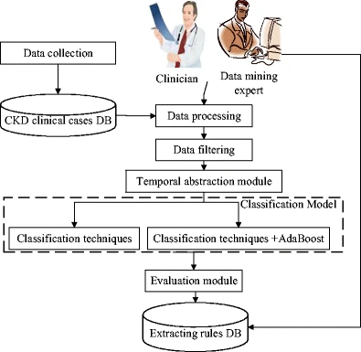
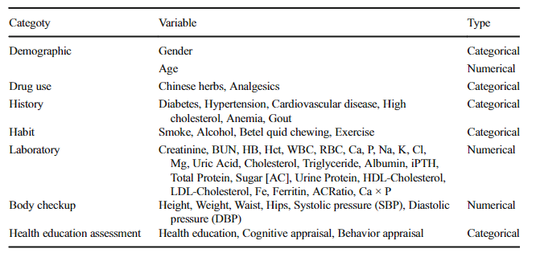

# 应用时间抽象技术预测慢性肾病进展

## 一、文献信息

|项目|内容|
| ---- | ---- |
|标题|Artificial Intelligence to Predict Chronic Kidney Disease Progression to Kidney Failure: A Narrative Review|
|作者|Zane A. Miller, Karen Dwyer|
|发表时间|2017-05-01|
|国家|中国台湾|
|分区|Q1|
|影响因子|3.5|
|摘要|本文综述了人工智能和机器学习在预测慢性肾脏病进展至肾衰竭中的应用，重点探讨了常用的预测变量和模型性能。|
|关键词|人工智能, 慢性肾脏病, 肾衰竭, 机器学习|
|期刊名称|Nephrology|
|卷号/期号|30:e14424|
|DOI|10.1111/nep.14424|
|研究方法|叙述性综述|
|数据来源|Medline和EMBASE数据库检索|
|研究结果|机器学习模型优于或不劣于传统预测工具KFRE|
|研究结论|机器学习模型在预测慢性肾脏病进展至肾衰竭方面具有潜力|
|研究意义|为临床决策提供新的预测工具，优化患者管理|
|阅读开始时间|20250214 23|
|阅读结束时间|20250214 23|
|时刻|下午|
|星期|星期六|
|天气|小雨|

## 二、核心内容
这篇文献的核心内容是探讨如何利用时间抽象（Temporal Abstraction, TA）技术结合数据挖掘方法，开发用于预测慢性肾病（Chronic Kidney Disease, CKD）进展至终末期肾病（End-Stage Renal Disease, ESRD）的模型。研究的重点是通过分析高维时间序列数据中的时间相关特征，提高预测模型的准确性和临床实用性。

### 主要内容总结
#### 研究背景
- 慢性肾病（CKD）是全球公共卫生领域的重要问题，约10%的人口受其影响。CKD患者通常在病情较严重时才被诊断，导致治疗成本高昂且预后不佳。
- CKD进展至ESRD后，患者需要长期透析或肾移植，给医疗资源带来巨大负担。因此，早期预测CKD的恶化对于延缓疾病进展至关重要。
- 以往的研究多基于横断面数据构建预测模型，忽略了时间序列数据中变量变化的信息。本研究旨在通过时间抽象技术提取时间相关特征，提高预测模型的性能。

#### 研究方法
- **数据收集与预处理**：研究纳入了2004年至2013年在台湾南部某大型透析中心就诊的463名4期CKD患者。这些患者在研究期间未接受透析治疗，且有完整的1年实验室检查数据。
- **时间抽象（TA）技术**：TA技术用于从高维时间序列数据中提取时间相关特征。研究中定义了两种TA变量：
    - 基本TA变量：包括趋势TA（如增加、减少、稳定）和状态TA（如高、低、正常）。
    - 复杂TA变量：分析两个相邻基本TA变量之间的时间关系。
- **分类模型**：研究使用了多种数据挖掘技术，包括C4.5、分类与回归树（CART）、支持向量机（SVM）和AdaBoost，以开发CKD进展预测模型。

#### 实验设计与评估
- 为避免数据不平衡问题，研究采用了随机抽样技术，生成了30个平衡数据集进行模型训练和验证。
- 使用10折交叉验证评估模型性能，主要指标包括准确率（Accuracy）、敏感性（Sensitivity）、特异性（Specificity）和曲线下面积（AUC）。

#### 研究结果
- **模型性能**：AdaBoost + CART模型表现最佳，准确率为0.662，敏感性为0.620，特异性为0.704，AUC为0.715。
- **时间相关特征的重要性**：研究发现，TA相关特征（如实验室检查值的变化趋势）与肾功能恶化密切相关，这些特征的加入显著提高了模型的预测能力。
- **关键影响因素**：通过特征选择模块分析，发现性别、年龄、糖尿病、高血压、高胆固醇、心血管疾病、肾功能指标（如血清肌酐和尿素氮）以及健康教育评估等因素对CKD进展具有重要影响。

#### 研究结论
- 时间抽象技术结合数据挖掘方法能够有效提取时间序列数据中的关键特征，提高CKD进展至ESRD的预测准确性。
- 开发的模型可以为临床医生提供决策支持，帮助早期识别CKD恶化的风险，优化患者管理。

#### 研究意义
- 本研究为利用人工智能技术解决医学问题提供了新的思路，特别是在处理高维时间序列数据方面展示了时间抽象技术的强大潜力。
- 通过长期跟踪实验室检查值的变化，可以实现CKD的早期诊断和干预，延缓疾病进展至ESRD。

#### 核心要点
- **创新性**：结合时间抽象技术与数据挖掘方法，提取时间序列数据中的关键特征。
- **实用性**：开发的预测模型能够为临床医生提供决策支持，优化CKD患者的管理。
- **局限性**：研究数据来自单一地区，样本量有限，模型的普适性有待进一步验证。

## 三、文章小结
### Abstract（摘要）
- **研究背景**：慢性肾病（CKD）是全球公共卫生领域的重要问题，其进展至终末期肾病（ESRD）会导致严重的健康后果和高昂的医疗费用。
- **研究目的**：开发预测模型，通过时间抽象（TA）技术提取高维时间序列数据中的时间相关特征，预测4期CKD患者是否会在6个月内进展至ESRD。
- **研究方法**：结合TA技术与数据挖掘方法（如C4.5、CART、SVM和AdaBoost）开发预测模型，并通过10折交叉验证评估模型性能。
- **研究结果**：AdaBoost + CART模型表现最佳（准确率：0.662，敏感性：0.620，特异性：0.704，AUC：0.715）。TA相关特征与CKD进展密切相关。
- **研究结论**：时间抽象技术能够有效提取时间相关特征，提高CKD进展预测模型的性能。

### Introduction（引言）
- CKD是一种逐渐丧失肾功能的疾病，全球约10%的人口受影响。CKD早期症状不明显，常在病情严重时才被诊断。
- CKD进展至ESRD后，患者需要透析或肾移植，给医疗资源带来巨大负担。
- 研究表明，CKD进展的风险因素复杂，包括年龄、家族史、生活方式、其他慢性疾病（如糖尿病、高血压）等。
- 临床实践中，CKD患者的数据以高维时间序列的形式记录，但以往研究多基于横断面数据，忽略了时间变化信息。
- 本研究旨在通过时间抽象技术提取时间相关特征，开发更可靠的CKD进展预测模型。

### Background overview and literature review（背景概述与文献综述）
#### 1. Definition of CKD and its stages（CKD的定义及其分期）
- CKD是指肾功能逐渐丧失的疾病，通常以肾小球滤过率（GFR）评估其严重程度。
- 根据K/DOQI标准，GFR低于60 mL/min/1.73m²且持续3个月以上可诊断为CKD。
- CKD的分期基于eGFR水平，ESRD定义为GFR低于15 mL/min/1.73m²。

#### 2. Factors and research affecting the progression of CKD（影响CKD进展的因素及研究）
- CKD进展的风险因素复杂，包括糖尿病、高血压、高胆固醇、心血管疾病等。
- 实验室检查指标（如蛋白尿、血清肌酐、尿素氮）和生活方式（如吸烟、饮酒）也与CKD进展密切相关。
- 以往研究多通过生存预测模型（如Kaplan-Meier模型和Cox模型）分析CKD进展风险，但这些模型基于不完整信息。

#### 3. Data mining in kidney research（肾脏研究中的数据挖掘）
- 数据挖掘技术已广泛应用于CKD和ESRD的研究中，用于分析实验室检查和临床数据。
- 例如，Chou等人通过粗糙集理论（RST）分析血液透析数据；Yeh等人结合TA技术与数据挖掘模型分析透析患者数据。
- 这些研究表明，数据挖掘技术能够提供有价值的临床信息，帮助预测CKD进展。

#### 4. Temporal abstraction（时间抽象）
- 时间抽象（TA）技术用于从时间序列数据中提取定性特征，包括趋势、状态和其他复杂时间相关属性。
- TA分为基本TA（检测数值或符号时间序列）和复杂TA（分析时间序列之间的关系）。
- 近年来，TA技术已与数据挖掘技术结合，用于开发预测模型，如预测透析患者的住院风险。

### Method（方法）
#### 1. Data collection and preprocessing（数据收集与预处理）
- 研究纳入了2004年至2013年在台湾南部某大型透析中心就诊的463名4期CKD患者。
- 数据包括患者的基本信息、病史、实验室检查结果、身体检查和健康教育评估。
- 为避免数据不平衡问题，研究通过随机抽样技术生成了30个平衡数据集。

#### 2. TA module（时间抽象模块）
- TA技术用于从患者的时间序列数据中提取时间相关特征。
- 定义了基本TA变量（状态TA和趋势TA）和复杂TA变量。
- 通过与临床专家合作，定义了TA规则，并将实验室检查结果转换为TA格式。

#### 3. Classification techniques（分类技术）
- 研究使用了C4.5、CART、SVM和AdaBoost等数据挖掘技术开发预测模型。
- AdaBoost用于提升模型的预测性能，通过调整样本权重降低分类错误率。

#### 4. Experimental evaluation（实验评估）
- 使用10折交叉验证评估模型性能，主要指标包括准确率、敏感性、特异性和AUC。
- 通过比较有无TA模块的模型性能，验证TA相关特征对预测模型的贡献。

### Results（结果）
- **模型性能**：AdaBoost + CART模型表现最佳，准确率为0.662，敏感性为0.620，特异性为0.704，AUC为0.715。
- **TA相关特征的重要性**：TA相关特征（如实验室检查值的变化趋势）与CKD进展密切相关。
- **关键影响因素**：性别、年龄、糖尿病、高血压、高胆固醇、心血管疾病、肾功能指标（如血清肌酐和尿素氮）以及健康教育评估等因素对CKD进展具有重要影响。

### Discussion（讨论）
- **临床意义**：研究结果表明，时间抽象技术能够有效提取时间相关特征，提高CKD进展预测模型的性能。
- **患者教育的重要性**：研究发现，患者对CKD的认知水平与疾病进展密切相关，强调了健康教育在CKD管理中的重要性。
- **局限性**：研究数据来自单一地区，样本量有限，模型的普适性有待进一步验证。
- **未来研究方向**：建议未来研究扩大样本量，纳入更多潜在影响因素（如环境因素、教育水平、饮食等），以提高模型的预测准确性。

### Conclusion（结论）
- 本研究通过时间抽象技术结合数据挖掘方法，开发了能够有效预测CKD进展至ESRD的模型。
- 时间相关特征对CKD进展具有重要影响，其加入显著提高了模型的预测能力。
- 研究结果为临床医生提供了新的决策支持工具，有助于早期识别CKD恶化的风险，优化患者管理。

## 四、主要方法和实施计划（强烈推荐阅读）
这篇文献的核心方法是通过时间抽象（Temporal Abstraction, TA）技术结合数据挖掘方法，开发用于预测慢性肾病（Chronic Kidney Disease, CKD）进展至终末期肾病（End-Stage Renal Disease, ESRD）的模型。以下是详细的方法和实施计划：

### 1. 数据收集与预处理（Data Collection and Preprocessing）
#### 数据来源
- 数据收集自2004年1月至2013年12月期间在台湾南部某大型透析中心就诊的463名4期CKD患者。
- 数据包括患者的基本信息、病史、实验室检查结果、身体检查和健康教育评估。

#### 数据筛选
- 研究仅纳入4期CKD患者（未接受透析治疗），且有完整的1年实验室检查数据。
- 患者需在研究期间内至少有4次季度检查记录，以确保时间序列数据的完整性。
- 最终纳入463名患者，其中132名在6个月内进展至ESRD，331名保持在4期CKD。

#### 数据处理
- **分类变量**：如性别、病史（糖尿病、高血压等）、生活习惯（吸烟、饮酒等）直接编码。
- **连续变量**：如实验室检查结果（血清肌酐、尿素氮等）和身体检查数据（血压、BMI等）。
- **异常值处理**：通过临床专家设定的阈值，将实验室检查结果分为异常和正常。

### 2. 时间抽象（Temporal Abstraction, TA）模块
#### TA变量定义
- **基本TA变量**：
    - **状态TA（State TA）**：检测数值或符号时间序列中的定性模式，如高（H）、正常（N）、低（L）。
    - **趋势TA（Trend TA）**：捕捉数值时间序列中的变化趋势，如增加（I）、减少（D）、稳定（S）。
- **复杂TA变量**：分析两个相邻基本TA变量之间的时间关系，如“N - I > N/L - D”表示从正常增加到正常/低减少。

#### TA规则设定
- 与临床专家合作，根据实验室检查项目的临床意义设定TA规则。
- 例如，血清肌酐（Creatinine）的TA规则：
    - 极高（XH）：≥14.98 mg/dL
    - 高（H）：12.94 - 14.98 mg/dL
    - 正常（N）：8.87 - 12.94 mg/dL
    - 低（L）：<6.84 mg/dL
- 实验室检查项目的平均值通过两个相邻时间点计算，并映射到TA规则中。

### 3. 分类技术（Classification Techniques）
#### 数据挖掘方法
使用以下数据挖掘技术开发预测模型：
- C4.5：基于决策树的分类算法。
- 分类与回归树（CART）：另一种决策树算法，适用于分类和回归问题。
- 支持向量机（SVM）：用于分类的机器学习算法。
- AdaBoost：一种集成学习方法，通过调整样本权重提高分类性能。

#### 模型优化
- **AdaBoost集成**：将AdaBoost与C4.5、CART和SVM结合，提升模型的预测性能。
- **特征选择**：通过Weka软件的Gini、ChiSquared、InfoGain和GainRatio模块评估特征的重要性，筛选关键特征。

### 4. 实验评估（Experimental Evaluation）
#### 数据集平衡
由于数据集中ESRD患者（132例）和4期CKD患者（331例）比例不平衡，研究采用随机抽样技术生成30个平衡数据集（1:1比例）。

#### 模型验证
- 使用10折交叉验证评估模型性能。
- **主要评估指标**：
    - **准确率（Accuracy）**：模型预测正确的比例。
    - **敏感性（Sensitivity）**：正确识别ESRD患者的比例。
    - **特异性（Specificity）**：正确识别非ESRD患者的比例。
    - **曲线下面积（AUC）**：评估模型的整体预测能力。

#### 结果比较
- 比较有无TA模块的模型性能，验证TA相关特征对预测模型的贡献。
- 最终选择表现最佳的模型（AdaBoost + CART）作为预测工具。

### 5. 实施计划
#### 步骤1：数据收集与预处理
- 收集患者数据，包括基本信息、病史、实验室检查结果等。
- 清洗数据，删除缺失值过多的记录，确保数据完整性。

#### 步骤2：时间抽象模块开发
- 与临床专家合作，定义TA规则。
- 将患者的实验室检查结果转换为TA格式，提取基本TA和复杂TA变量。

#### 步骤3：模型开发与优化
- 使用C4.5、CART、SVM等数据挖掘技术开发预测模型。
- 结合AdaBoost提升模型性能。
- 使用Weka软件进行特征选择，优化模型输入。

#### 步骤4：模型验证与评估
- 通过随机抽样生成平衡数据集。
- 使用10折交叉验证评估模型性能。
- 比较不同模型的准确率、敏感性、特异性和AUC，选择最优模型。

#### 步骤5：结果分析与临床应用
- 分析模型结果，提取关键影响因素。
- 将模型应用于临床实践，为医生提供决策支持。
- 根据模型结果优化患者管理策略，延缓CKD进展。

### 总结
这篇文献通过时间抽象技术结合数据挖掘方法，开发了能够有效预测CKD进展至ESRD的模型。研究详细描述了数据收集、TA变量提取、模型开发与验证的全过程，并通过实验验证了模型的有效性。这种方法为临床医生提供了新的工具，有助于早期识别CKD恶化的风险，优化患者管理。

## 五、重要变量和数据
以下是根据文献内容抓取的主要变量信息，包括连续变量的统计信息（均值、方差、中位数等）和分类变量的构成比及频率。这些信息将用Markdown表格的形式汇总，以便后续使用Python代码模拟数据。

### 连续变量（Continuous Variables）
| Variable | Mean | Standard Deviation | Median | Min | Max |
| ---- | ---- | ---- | ---- | ---- | ---- |
| Age (years) | 65.2 | 10.46 | 71 | 19 | 89 |
| Creatinine (mg/dL) | 10.91 | 2.14 | 10.8 | 4.81 | 14.98 |
| BUN (mg/dL) | 42.51 | 10.23 | 40.5 | 29.22 | 48.20 |
| Hct (%) | 34.61 | 5.02 | 34.5 | 25.94 | 38.32 |
| ALB (g/dL) | 4.57 | 1.08 | 4.6 | 2.17 | 6.97 |
| BMI (kg/m²) | 24.5 | 3.5 | 24.2 | 18.5 | 35 |
| SBP (mmHg) | 135.44 | 15.2 | 135 | 90 | 180 |
| DBP (mmHg) | 85.33 | 10.1 | 85 | 60 | 110 |

### 分类变量（Categorical Variables）
| Variable | Category | Frequency | Proportion (%) |
| ---- | ---- | ---- | ---- |
| Gender | Male | 256 | 55.3 |
| Gender | Female | 207 | 44.7 |
| Diabetes | Yes | 184 | 39.7 |
| Diabetes | No | 279 | 60.3 |
| Hypertension | Yes | 212 | 45.8 |
| Hypertension | No | 251 | 54.2 |
| Smoking | Yes | 84 | 18.1 |
| Smoking | No | 379 | 81.9 |
| Alcohol | Yes | 34 | 7.3 |
| Alcohol | No | 429 | 92.7 |
| Betel Nut | Yes | 5 | 1.1 |
| Betel Nut | No | 458 | 98.9 |
| Regular Exercise | Yes | 150 | 32.4 |
| Regular Exercise | No | 313 | 67.6 |
| Chinese Herbs | Yes | 88 | 19.0 |
| Chinese Herbs | No | 375 | 81.0 |

### 其他变量（Other Variables）
以下变量的具体统计信息未在文献中明确提及，但可根据需要在模拟数据时进行假设或随机生成：

| Variable | Description |
| ---- | ---- |
| History of Cardiovascular Disease | 是否有心血管疾病病史 |
| Hyperlipidemia | 是否有高胆固醇病史 |
| Anemia | 是否有贫血病史 |
| Gout | 是否有痛风病史 |
| Health Education Assessment | 患者对CKD的认知水平（如总认知、部分认知等） |

## Abstract  摘要
Chronic kidney disease (CKD) has attracted considerable attention in the public health domain in recent years. Researchers have exerted considerable effort in attempting to identify critical factors that may affect the deterioration of CKD. In clinical practice, the physical conditions of CKD patients are regularly recorded. The data of CKD patients are recorded as a high-dimensional time-series. Therefore, how to analyze these time-series data for identifying the factors affecting CKD deterioration becomes an interesting topic. This study aims at developing prediction models for stage 4 CKD patients to determine whether their eGFR level decreased to less than 15 ml/min/1.73m2 (end-stage renal disease, ESRD) 6 months after collecting their final laboratory test information by evaluating time-related features. A total of 463 CKD patients collected from January 2004 to December 2013 at one of the biggest dialysis centers in southern Taiwan were included in the experimental evaluation. We integrated the temporal abstraction (TA) technique with data mining methods to develop CKD progression prediction models. Specifically, the TA technique was used to extract vital features (TA-related features) from high-dimensional time-series data, after which several data mining techniques, including C4.5, classification and regression tree (CART), support vector machine, and adaptive boosting (AdaBoost), were applied to develop CKD progression prediction models. The results revealed that incorporating temporal information into the prediction models increased the efficiency of the models. The AdaBoost+CART model exhibited the most accurate prediction among the constructed models (Accuracy: 0.662, Sensitivity: 0.620, Specificity: 0.704, and AUC: 0.715). A number of TA-related features were found to be associated with the deterioration of renal function. These features can provide further clinical information to explain the progression of CKD. TA-related features extracted by long-term tracking of changes in laboratory test values can enable early diagnosis of ESRD. The developed models using these features can facilitate medical personnel in making clinical decisions to provide appropriate diagnoses and improved care quality to patients with CKD.

慢性肾脏病（CKD）近年来在公共卫生领域引起了相当大的关注。研究人员已经付出了相当大的努力，试图确定可能影响CKD恶化的关键因素。在临床实践中，定期记录CKD患者的身体状况。CKD患者的数据被记录为高维时间序列。因此，如何分析这些时间序列数据以识别影响CKD恶化的因素成为一个有趣的话题。本研究旨在通过评估时间相关特征，建立4期CKD患者的预测模型，以确定其eGFR水平是否在收集最终实验室检查信息后6个月降至15 ml/min/1.73m2（终末期肾病，ESRD）以下。 从2004年1月至2013年12月在台湾南部最大的透析中心之一收集的共463名CKD患者被纳入实验评估。我们整合时间抽象（TA）技术与数据挖掘方法，开发CKD进展预测模型。具体而言，TA技术用于从高维时间序列数据中提取生命特征（TA相关特征），然后应用C4.5、分类和回归树（CART）、支持向量机和自适应增强（AdaBoost）等数据挖掘技术开发CKD进展预测模型。结果表明，将时间信息纳入预测模型提高了模型的效率。 AdaBoost+CART模型在构建的模型中表现出最准确的预测（准确度：0.662，灵敏度：0.620，特异性：0.704，AUC：0.715）。发现许多TA相关特征与肾功能恶化相关。这些特征可以提供进一步的临床信息来解释CKD的进展。通过长期跟踪实验室检查值的变化提取的TA相关特征可以实现ESRD的早期诊断。使用这些功能开发的模型可以帮助医务人员做出临床决策，为CKD患者提供适当的诊断和改善的护理质量。

## Introduction  介绍
Chronic kidney disease (CKD) is a disease in which patients progressively lose kidney function. CKD has drawn considerable attention in the public health domain in recent years. Approximately 10% of people worldwide suffer from this disease [1]. CKD causes considerable morbidity and markedly influences patients’ quality of life; therefore, health professionals worldwide are attempting to derive means of preventing its occurrence [2, 3].
慢性肾脏病（CKD）是一种患者逐渐丧失肾功能的疾病。近年来，CKD在公共卫生领域引起了相当大的关注。全世界约有10%的人患有这种疾病[1]。CKD会导致相当高的发病率，并显著影响患者的生活质量;因此，世界各地的卫生专业人员都在试图找到预防其发生的方法[2，3]。

The early symptoms of CKD are typically nonspecific; they are similar to those of many other diseases. CKD is often not diagnosed until more serious symptoms such as edema and hematuria occur [4]. When the kidney function drops to 5% below normal, the body cannot maintain normal metabolism and the patient enters end-stage renal disease (ESRD). To maintain life and health, patients with ESRD need a regular lifelong dialysis support or a kidney transplant [5, 6].
CKD的早期症状通常是非特异性的;它们与许多其他疾病的症状相似。CKD通常在出现水肿和血尿等更严重的症状时才被诊断出来[4]。当肾功能下降到低于正常值5%时，身体无法维持正常代谢，患者进入终末期肾病（ESRD）。为了维持生命和健康，ESRD患者需要定期终身透析支持或肾移植[5，6]。

A report by the United States Renal Data System (2012) revealed that the prevalence (2584 per million population) and incidence (361 per million population) of ESRD in Taiwan are among the highest in the world. According to the Taiwan Society of Nephrology (2009), the number of people currently undergoing regular treatment for ESRD in Taiwan is approximately 60 000, with an increase of 8000 people each year [7]. In the United States, the treatment and management costs for ESRD patients is nearly $26.8 billion, constituting 5.9% of all medical expenses. ESRD consumes a considerable portion of medical resources [8, 9].
美国肾脏数据系统（2012年）的一份报告显示，台湾ESRD的患病率（每百万人口2584例）和发病率（每百万人口361例）是世界上最高的。根据台湾肾脏病学会（2009年）的数据，目前台湾接受ESRD常规治疗的人数约为6万人，每年增加8000人[7]。在美国，终末期肾病患者的治疗和管理费用接近268亿元，占全部医疗开支的5.9%。ESRD消耗了相当大一部分的医疗资源[8，9]。

Clinicians and researchers have exerted considerable effort in attempting to identify critical factors that may prevent the progression of CKD to ESRD [10]. However, the risk factors leading to CKD deterioration are generally highly complex and difficult to treat [4]. Previous studies have revealed that aging, a family history of kidney diseases, the use of analgesics, low socioeconomic status, and an unhealthy lifestyle are risk factors possibly resulting in the deterioration of kidney function [11, 12]. In addition, the progression of CKD may be expedited when patients have other chronic diseases (eg, hypertension, diabetes, high cholesterol, or cardiovascular disease) [5, 13, 14]. Because numerous potential risk factors can cause a decline in kidney function, addressing the question of how to accurately predict CKD deterioration based on all possible risk factors is challenging. A highly reliable prediction model can facilitate the prediction of the deterioration of patients with CKD, thus enabling medical staff to provide early treatment to inhibit or prevent the disease from progressing to a more severe stage (ie, ESRD).
临床医生和研究人员已经付出了相当大的努力，试图确定可能阻止CKD进展为ESRD的关键因素[10]。然而，导致CKD恶化的风险因素通常非常复杂且难以治疗[4]。以前的研究表明，衰老，肾脏疾病家族史，镇痛药的使用，低社会经济地位和不健康的生活方式是可能导致肾功能恶化的风险因素[11，12]。此外，当患者患有其他慢性疾病（例如，高血压、糖尿病、高胆固醇或心血管疾病）时，CKD的进展可能加快[5，13，14]。由于许多潜在的风险因素可能导致肾功能下降，因此如何根据所有可能的风险因素准确预测CKD恶化是一个挑战。 高度可靠的预测模型可以帮助预测CKD患者的病情恶化，从而使医务人员能够提供早期治疗，以抑制或防止疾病进展到更严重的阶段（即ESRD）。

In clinical practice, the physical conditions of patients with CKD are regularly recorded and managed. At each regular examination, medical personnel record detailed information relevant to the physical status of a patient with CKD such as biochemical blood test records, lifestyle and drug use habits, and patient education records. This information is recorded and stored in an electronic medical record (EMR) system and can be used to assist medical staff when evaluating a patient’s condition [15–18]. Until a hospital closes a case or declares a patient with CKD deceased, the nephrology department continues to track the patient’s status. Therefore, the medical records accumulate in the EMR system over time, resulting in high-dimensional time-series data.
在临床实践中，定期记录和管理CKD患者的身体状况。每次定期检查时，医务人员都会记录与CKD患者身体状况相关的详细信息，例如生化血液检查记录、生活方式和药物使用习惯以及患者教育记录。该信息被记录并存储在电子病历（EMR）系统中，可用于协助医务人员评估患者状况[15-18]。在医院关闭病例或宣布CKD患者死亡之前，肾脏科将继续跟踪患者的状态。因此，病历随着时间的推移在电子病历系统中积累，形成高维时间序列数据。

Most studies have applied only cross-sectional data and statistical methods to construct prediction models of CKD progression. Although cross-sectional data are accurate predictors in prediction models of CKD progression, information regarding the variation of the variables over time is ignored. For example, blood pressure (BP) can be measured several times during a specific period (ie, a patient’s BP can be recorded as time-series data). One of the easiest methods of presenting BP variations is through mean and standard deviation. However, BP variations also carry essential information regarding a patient’s condition, and this information cannot be presented through mean and standard deviation. These pieces of information can reflect changes in the physical status of patients with CKD, which may also be major factors for predicting CKD progression. According to our review of the literature, no study has considered detailed information regarding the variation of the time-series data on the problem of predicting CKD deterioration. Therefore, the question of how to extract time-related features from high-dimensional time-series data has become a major obstacle to the prediction of CKD progression.
大多数研究仅采用横断面数据和统计方法来构建CKD进展的预测模型。虽然横断面数据是CKD进展预测模型的准确预测因子，但忽略了变量随时间变化的信息。例如，血压（BP）可以在特定时间段内测量多次（即，患者的BP可以记录为时间序列数据）。呈现BP变化的最简单方法之一是通过平均值和标准差。然而，BP变化也携带关于患者状况的基本信息，并且该信息不能通过平均值和标准差来呈现。这些信息可以反映CKD患者的身体状态变化，也可能是预测CKD进展的主要因素。 根据我们对文献的回顾，没有研究考虑过有关预测CKD恶化问题的时间序列数据变化的详细信息。因此，如何从高维时间序列数据中提取时间相关特征的问题已成为预测CKD进展的主要障碍。

In the current study, effective CKD progression prediction models were developed by evaluating time-related features. Specifically, two main tasks had to be accomplished. The first task entailed extracting time-related features accurately reflecting the variation of variables for the time-series data of patients with CKD. The second task involved developing models for predicting CKD progression based on multiple machine learning techniques.
在本研究中，通过评估时间相关特征，开发了有效的CKD进展预测模型。具体而言，必须完成两项主要任务。第一个任务是提取与时间相关的特征，准确地反映CKD患者时间序列数据的变量变化。第二项任务涉及基于多种机器学习技术开发用于预测CKD进展的模型。

To extract features regarding the variations in the status of patients with CKD, the temporal abstraction (TA) technique was used to extract time-related variables from the EMRs of patients with CKD. The TA framework is a knowledge-based framework proposed by Shahar in 1997 [19]. TA can be used to define different change types in time-series data, such as trends, statuses, or other complex time-related attributes. By incorporating the clinical knowledge of experts, users can define their own TA variables. The values of these variables can be obtained by applying a series of data preprocessing tasks to patients’ time-series data derived from the EMR system.
为了提取关于CKD患者状态变化的特征，使用时间抽象（TA）技术从CKD患者的EMR中提取时间相关变量。TA框架是Shahar在1997年提出的基于知识的框架[19]。TA可用于定义时间序列数据中的不同更改类型，例如趋势、状态或其他复杂的时间相关属性。通过结合专家的临床知识，用户可以定义自己的TA变量。这些变量的值可以通过对来自EMR系统的患者时间序列数据应用一系列数据预处理任务来获得。

In this study, complete records of patients with CKD were collected from the EMR system in dialysis centers in southern Taiwan from January 2004 to December 2013. The data included the patient’s basic information, medical history records, laboratory test records, and care and nutrition tracking records. The variable selection and extraction were performed by consulting the relevant literature and domain experts (ie, nephrologists). Multiple supervised learning techniques were used to develop the prediction models including C4.5, classification and regression tree (CART) [20], and support vector machine (SVM) [21]. Adaptive boosting (AdaBoost) was also used to improve the predictive performance of the models [22]. The results show that the inclusion of TA-related variables enhances the performance of the prediction models.
在这项研究中，从2004年1月至2013年12月台湾南部透析中心的EMR系统中收集了CKD患者的完整记录。这些数据包括患者的基本信息、病史记录、实验室检查记录以及护理和营养跟踪记录。通过咨询相关文献和领域专家（即肾病学家）进行变量选择和提取。使用多种监督学习技术开发预测模型，包括C4.5、分类和回归树（CART）[20]和支持向量机（SVM）[21]。自适应增强（AdaBoost）也用于提高模型的预测性能[22]。结果表明，包括TA相关的变量，提高了预测模型的性能。

The rest of this paper is organized as follows. In “Background overview and literature review” section, we review related works. Subsequently, we define the problem of mining the records of patients with CKD and explain the development of the models. Next, experimental results are presented. Finally, we present our conclusions.
本文的其余部分组织如下。在“背景综述和文献综述“部分，我们回顾了相关的工作。随后，我们定义了挖掘CKD患者记录的问题，并解释了模型的发展。接下来，给出实验结果。最后，给出了我们的结论。

## Background overview and literature review    背景综述和文献综述
### Definition of CKD and its stages    CKD的定义及其分期
The kidney, an essential organ for the body’s metabolism, can be affected by various diseases or injuries including chronic diseases, recurrent infections, and urinary tract obstruction. CKD is characterized by a gradual loss of kidney function; specifically, this disease occurs when the kidney is damaged and unable to appropriately maintain its original function [2] for more than 3 months.
肾脏是人体新陈代谢的重要器官，可受到各种疾病或损伤的影响，包括慢性疾病、复发性感染和尿路梗阻。CKD的特征是肾功能逐渐丧失;具体来说，这种疾病发生在肾脏受损且无法适当维持其原始功能超过3个月时[2]。

Early symptoms of CKD are generally difficult to detect; these symptoms do not appear until kidney function drops 30% below normal. Currently, the most commonly applied standards are those announced by the Kidney Disease Outcome Quality Initiative (K/DOQI), which uses the glomerular filtration rate (GFR) to determine the severity of the progression of CKD [23]. Patients who have a GFR of less than 60 mL/min/1.73 m2 for more than 3 months can be diagnosed with CKD. Such patients might also exhibit other signs of kidney damage including abnormal kidney ultrasound or biopsy results. Clinicians can provide specific treatment, such as offering psychological support and mental adjustment, according to a patient’s detected stage.
CKD的早期症状通常难以检测;这些症状直到肾功能下降到正常水平以下30%才出现。目前，最常用的标准是肾脏疾病结局质量倡议（K/DOQI）宣布的标准，该标准使用肾小球滤过率（GFR）来确定CKD进展的严重程度[23]。GFR低于60 mL/min/1.73 m2持续3个月以上的患者可诊断为CKD。这些患者也可能表现出其他肾脏损伤的迹象，包括异常的肾脏超声或活检结果。临床医生可以根据患者的检测阶段提供特定的治疗，例如提供心理支持和心理调整。

Clinically, GFR cannot be determined through direct measurement; it is typically diagnosed through laboratory test indicators to determine an estimated GFR (eGFR). Experts worldwide have developed various equations for determining GFR, tailored to various countries and races. Most experts use the Serum Creatinine (Scr) measure along with other clinical options such as age, gender, and race. Modification of Diet in Renal Disease (MDRD), or the revised MDRD-S, is the most commonly used method, followed by the Cockcroft–Gault (CG) calculator. However, several scholars have found that for people with a high GFR, MDRD can cause systematic underestimation errors, resulting in reduced accuracy. To increase the accuracy of GFR, Levery et al. [24] developed a new GFR equation in 2009, called the Chronic Kidney Disease Epidemiology Collaboration (CKD-EPI). This equation can be effectively used to estimate normal kidney function. Currently, the National Kidney Foundation (NKF) in the United States has adopted the CKD-EPI equation.
在临床上，GFR不能通过直接测量来确定;通常通过实验室检查指标来诊断，以确定估计的GFR（eGFR）。世界各地的专家开发了各种公式来确定GFR，适合不同的国家和种族。大多数专家使用血清肌酐（Scr）测量沿着与其他临床选项，如年龄，性别和种族。肾脏疾病饮食改良（MDRD）或修订版MDRD-S是最常用的方法，其次是Cockcroft-Gault（CG）计算器。然而，一些学者发现，对于GFR高的人，MDRD会导致系统性低估错误，从而降低准确性。为了提高GFR的准确性，Levery等人[24]在2009年开发了一种新的GFR方程，称为慢性肾脏病流行病学协作组（CKD-EPI）。该方程可有效地用于估计正常肾功能。 目前，美国国家肾脏基金会（NKF）已采用CKD-EPI方程。

Although medical staff can evaluate the decline in kidney function in patients by evaluating the eGFR, they cannot further understand related information regarding the progression of CKD if only the eGFR is clinically evaluated. Therefore, how to construct a reliable prediction model and identify CKD patients who are at potential risk of deterioration has become an essential question in medical research [8].
虽然医务人员可以通过评估eGFR来评估患者的肾功能下降，但如果仅进行eGFR的临床评估，则无法进一步了解CKD进展的相关信息。因此，如何构建一个可靠的预测模型，并识别出有潜在恶化风险的CKD患者，已成为医学研究中的一个重要问题[8]。

### Factors and research affecting the progression of CKD
影响CKD进展的因素和研究
Studies have revealed that the factors leading to CKD progression are extremely complicated. According to the information from Taiwan Society of Nephrology (2007), three causes of dialysis exist: diabetes (43.2%), glomerulonephritis (25.1%), and hypertension (8.3%). Controlling these top three factors is critical.
研究表明，导致CKD进展的因素非常复杂。根据台湾肾脏病学会（2007年）的信息，透析的原因有三种：糖尿病（43.2%）、肾小球肾炎（25.1%）和高血压（8.3%）。控制这三大因素至关重要。

Laboratory tests evaluate several items, such as eGFR, proteinuria, calcium, phosphorus, sodium, and albumin (ALB), which are used to create prediction models [25, 26]. Lorenzo et al. [25] determined that proteinuria is a risk factor leading to decreased renal function. Hallan et al. [26] revealed that gender, low amounts of exercise, diabetes, a higher body mass index (BMI) and waist circumference, high BP, the use of antihypertensive medications in therapies, low high-density lipoprotein cholesterol, triglycerides, and high blood sugar are all risk factors considerably increasing disease progression. Othman et al. [27] reported that in multiple regression analysis, changes in BMI and younger age were independently associated with the rate of decline in GFR. Go et al. [28] showed that a decrease in GFR led to a deterioration of kidney function in patients, which could increase the chance of cardiovascular-related diseases, thus necessitating hospitalization for treatment. In a previous study, indoxyl sulfate and p-cresylsulfate were added according to the suggestion of Wu and colleagues (2011) to provide further clinical information for predicting the risk of kidney function deterioration in patients with CKD [29]. Perotte et al. [30] used a time-series model (i.e., a variant of Kalman filter) to generate time-related features from both laboratory test results and patient notes. With the considerations to these features, the proposed risk stratification model for CKD progression prediction outperforms other baseline models.
实验室检查评估几个项目，如eGFR，蛋白尿，钙，磷，钠和白蛋白（ALB），用于创建预测模型[25，26]。Lorenzo等人[25]确定蛋白尿是导致肾功能下降的风险因素。Hallan等人[26]发现，性别、低运动量、糖尿病、较高的体重指数（BMI）和腰围、高血压、治疗中使用降压药物、低高密度脂蛋白胆固醇、甘油三酯和高血糖都是显著增加疾病进展的风险因素。Othman等人[27]报告称，在多元回归分析中，BMI变化和年龄较小与GFR下降率独立相关。Go等人 [28]显示，GFR降低导致患者肾功能恶化，这可能增加心血管相关疾病的机会，因此需要住院治疗。在之前的一项研究中，根据Wu及其同事（2011）的建议添加了硫酸吲哚酚和对甲苯基硫酸酯，以提供预测CKD患者肾功能恶化风险的进一步临床信息[29]。Perotte等人。[30]使用时间序列模型（即，卡尔曼滤波器的变体），以从实验室测试结果和患者记录两者生成时间相关特征。考虑到这些特征，所提出的CKD进展预测的风险分层模型优于其他基线模型。

Survival prediction models have been frequently used for analysis when predicting the risk of CKD progression, with two of the most common being the Kaplan–Meier model and the Cox model. However, these two prediction models are based on incomplete information, implying that one can obtain only limited information from the analysis results.
在预测CKD进展风险时，生存预测模型经常用于分析，其中两种最常见的模型是Kaplan-Meier模型和考克斯模型。然而，这两种预测模型都是基于不完全信息的，这意味着人们只能从分析结果中获得有限的信息。

In this study, we mainly collected patients’ demographic data, physical examination results, and information about complications and personal habits as well as other relevant information as study variables. Unlike considering only the feature set generated by the data mining algorithm in Perotte et al. [30], our approach was driven by the clinical experts; that is, the clinical experts can define their own TA variables from the time-series of each laboratory examination item.
本研究主要收集患者的人口学资料、体格检查结果、并发症信息和个人习惯等相关信息作为研究变量。与仅考虑Perotte等人[30]中数据挖掘算法生成的特征集不同，我们的方法由临床专家驱动;也就是说，临床专家可以根据每个实验室检查项目的时间序列定义自己的TA变量。

### Data mining in kidney research    肾脏研究中的数据挖掘
In recent years, data mining (DM) has been used for analyzing CKD, ESRD, and hemodialysis (HD) information as well as other related laboratory tests and clinical data [16, 31–33]. Chou et al. [34] proposed a method that entails incorporating rough set theory (RST) into the analysis process for evaluating and verifying a patient’s blood dialysis data. In this method, RST is used for rule extraction from granulated data, and C4.5 and artificial neural networks (ANN) are subsequently used to compare the accuracy of prediction models before and after screening. The results revealed that the decision attribute of the Kt/V ratio can help doctors reduce diagnosis time.
近年来，数据挖掘（DM）已用于分析CKD、ESRD和血液透析（HD）信息以及其他相关实验室检查和临床数据[16，31-33]。Chou等人[34]提出了一种方法，该方法需要将粗糙集理论（Rough Set Theory，缩写为EEE）纳入分析过程，以评估和验证患者的血液透析数据。在该方法中，使用SVM从颗粒化数据中提取规则，然后使用C4.5和人工神经网络（ANN）来比较筛选前后预测模型的准确性。结果表明，Kt/V比的决策属性可以帮助医生减少诊断时间。

Altintas et al. [35] used the DM technique to find the risk factors causing death in patients undergoing hemodialysis and also examined the interaction styles of these factors. Yeh et al. [6] combined the TA technique with a data mining model to analyze laboratory test data from hemodialysis patients. In addition to identifying the patterns of hospital stays as found in past studies, they observed clinically significant timing trends that had previously gone unnoticed. Belazzi et al. [36] developed a hemostatic system through Matlab by using information, such as BP and duration of dialysis, of patients subjected to dialysis treatments thrice a week. The results indicated that the developed systems can significantly improve the hemodialysis clearance rate, facilitated achieving the right amount of dialysis for patients, and improved the quality of dialysis care. The application of DM technology in kidney-related research demonstrates the importance of medically related data analysis and discussion with medical experts in related fields and has facilitated the process of ensuring the accuracy of the analysis results.
Altintas等人[35]使用DM技术发现导致血液透析患者死亡的风险因素，并检查了这些因素的相互作用方式。Yeh等人[6]将TA技术与数据挖掘模型相结合，以分析血液透析患者的实验室检查数据。除了确定在过去的研究中发现的住院模式外，他们还观察到了以前未被注意到的具有临床意义的时间趋势。Belazzi等人[36]通过使用每周接受三次透析治疗的患者的血压和透析持续时间等信息，通过Matlab开发了一种止血系统。结果表明，该系统能显著提高血液透析清除率，促进患者实现适量透析，提高透析护理质量。 DM技术在肾脏相关研究中的应用表明了医学相关数据分析和与相关领域医学专家讨论的重要性，并促进了确保分析结果准确性的过程。

### Temporal abstraction  时态抽取
TA focus on the extraction of qualitative aspects of time series based on rules that are defined by clinical experts [19, 33]. TA can be used to define different change types in time series data, such as trends, statuses, or other complex time-related attributes. Generally speaking, temporal abstraction can be classified as basic TA and complex TA [36]. Basic TA is often used to detect numerical or symbolic time series, and the episode found is presented through a qualitative approach [6, 36]. In particular, two types of TA were extracted: trend TAs, which capture the increasing, decreasing, or stationary patterns in a numerical time series, and state TAs, which detect qualitative patterns corresponding to low, high, and normal values in a numerical or symbolic time series. Complex TA is used to analyze the temporal relationship between interval series. The temporal relationships investigated correspond to the 13 temporal operators [19], which include BEFORE, FINISHES, OVERLAPS, MEETS, STARTS, DURING, their corresponding inverse relations, and EQUALS. Recently, several researches integrated TA with data mining techniques to develop a decision support system to predict hospitalization of hemodialysis (HD) patients in order to reducing hospitalization rate [6, 19, 36].
TA专注于根据临床专家定义的规则提取时间序列的定性方面[19，33]。TA可用于定义时间序列数据中的不同更改类型，例如趋势、状态或其他复杂的时间相关属性。一般来说，时间抽象可以分为基本TA和复杂TA [36]。基本TA通常用于检测数字或符号时间序列，并且通过定性方法呈现所发现的事件[6，36]。特别是，两种类型的TA被提取：趋势TA，它捕捉的增加，减少，或固定的模式，在一个数字的时间序列，和状态TA，检测定性模式对应的低，高，正常值的数字或符号的时间序列。复TA用于分析区间序列之间的时间关系。 所研究的时间关系对应于13个时间运算符[19]，包括BEFORE、FINISHES、OVERLAPS、MEETS、STARTS、DURING及其相应的逆关系和EQUALS。最近，一些研究将TA与数据挖掘技术相结合，开发了一个决策支持系统来预测血液透析（HD）患者的住院率，以降低住院率[6，19，36]。

## Method  方法
The proposed CKD progression prediction models comprise the following modules (Fig. 1): data processing and filtering, TA, and classification modules.
所提出的CKD进展预测模型包括以下模块（图1）：数据处理和过滤、TA和分类模块。

### Data collection and preprocessing    数据采集和预处理
Data from 2066 patients with CKD were collected from January 2004 to December 2013 at one of the biggest kidney health center in a metropolitan hospital in southern Taiwan. The center provides services such as CKD health education, CKD case management and dialysis. The St. Martin De Porres Hospital Institutional Review Board approved the study protocol.
本研究从2004年1月至2013年12月，在台湾南部一家大都会医院的一家最大的肾脏健康中心收集了2066例CKD患者的数据。该中心提供CKD健康教育、CKD病例管理和透析等服务。St. Martin De Porres医院机构审查委员会批准了研究方案。

This study focused on finding TA-related variables to predict the progression of CKD. In practice, collecting the data from patients with CKD at the early stages is difficult because the symptoms regarding CKD normally do not appear until patients have reached at least stage 3 or 4 CKD. Therefore, most of patients with CKD at the early stages do not have routine body examinations and to extract the values of TA-related variables from these patients is infeasible.
本研究的重点是寻找TA相关变量来预测CKD的进展。在实践中，收集早期CKD患者的数据是困难的，因为关于CKD的症状通常直到患者已经达到至少3期或4期CKD才出现。因此，大多数早期CKD患者没有常规的身体检查，从这些患者中提取TA相关变量的值是不可行的。

Based on aforementioned reasons, the experimental data in this study included only patients with stage 4 CKD and having no dialysis treatment during 1-year study period (i.e., 538 patients). For each selected patients, one-year-long laboratory data were collected after stage 4 CKD onset to determine the values of TA-related variables. Because stage 4 CKD patients usually have a routine body examination every 3 months, a 1-year study period allows us to collect 4 body examination results for each patient. Patients with the number of body examinations less than 4 were deleted from the experimental data set. If the patients have more than 4 body examinations, we only consider the first 4 results in generating the values of TA-related variables. As a result, a total of 463 patients were included in the experimental evaluation. Among them, 132 cases deteriorated to ESRD 6 months after the last date of their one-year-long laboratory data and 331 cases remained at stage 4.
基于上述原因，本研究中的实验数据仅包括患有4期CKD且在1年研究期间未接受透析治疗的患者（即，538例患者）。对于每个选定的患者，在4期CKD发作后收集长达一年的实验室数据，以确定TA相关变量的值。由于4期CKD患者通常每3个月进行一次常规身体检查，因此1年的研究期允许我们为每位患者收集4次身体检查结果。从实验数据集中删除身体检查次数少于4次的患者。如果患者进行了4次以上的身体检查，则在生成TA相关变量值时仅考虑前4次结果。结果，共有463名患者被纳入实验评估。其中，132例病例在其长达一年的实验室数据的最后日期后6个月恶化为ESRD，331例病例仍处于4期。

The dependent variable represented whether patients with stage 4 CKD exhibited signs of ESRD (ie, stage 5 CKD) 6 months after collecting their final laboratory test information. According to the National Kidney Foundation, ESRD is defined as the GFR decreases to less than 15 ml/min/1.73m2. Because GFR cannot be determined by direct measurement and clinicians usually adopt biochemical test indicators to determine an estimated GFR (eGFR), this study determine CKD stage based on eGFR.
因变量代表4期CKD患者在收集最终实验室检查信息后6个月是否表现出ESRD（即5期CKD）体征。根据国家肾脏基金会，ESRD被定义为GFR降低至低于15 ml/min/1.73m2。由于GFR不能通过直接测量确定，临床医生通常采用生化检测指标来确定估计的GFR（eGFR），因此本研究基于eGFR确定CKD分期。

Table 1 lists all the selected patient information. In the EMR system, detailed information regarding each case, including demographic data, drug use, history, habits, laboratory tests, body checkup, and health education assessment, was recorded. Categorical variables included items such as gender, whether the patient smoked or used herbal medicine in medical history, and health education. These variables were constant over time and could be encoded directly. Continuous variables were primarily the results, such as body checkup and laboratory tests; the values of these variables were recorded each quarter year.
表1列出了所有选定的患者信息。在EMR系统中，记录了每个病例的详细信息，包括人口学数据、药物使用、病史、习惯、实验室检查、身体检查和健康教育评估。分类变量包括性别、病史中是否吸烟或使用草药以及健康教育等项目。这些变量随时间变化是恒定的，可以直接编码。连续变量主要是结果，如身体检查和实验室测试;这些变量的值每季度记录一次。

| 类别               | 变量                                                         | 类型       |
|--------------------|--------------------------------------------------------------|------------|
| 人口统计信息       | 性别                                                         | 类别型     |
|                    | 年龄                                                         | 数值型     |
| 药物使用           | 中草药，镇痛药                                               | 类别型     |
| 病史               | 糖尿病，高血压，心血管疾病，高胆固醇，贫血，痛风             | 类别型     |
| 习惯               | 吸烟，饮酒，嚼槟榔，运动                                     | 类别型     |
| 实验室检查         | 肌酐，尿素氮，血红蛋白，血细胞比容，白细胞，红细胞，钙，磷，钠，钾，氯，镁，尿酸，胆固醇，甘油三酯，白蛋白，iPTH，总蛋白，血糖，尿蛋白，高密度脂蛋白胆固醇，低密度脂蛋白胆固醇，铁，铁蛋白，AC比率，钙磷乘积 | 数值型     |
| 身体检查           | 身高，体重，腰围，臀围，收缩压（SBP），舒张压（DBP）           | 数值型     |
| 健康教育评估       | 健康教育，认知评估，行为评估                                 | 类别型     |

| Category                | Variable                                                                 | Type         |
|-------------------------|--------------------------------------------------------------------------|--------------|
| Demographic             | Gender                                                                   | Categorical  |
|                         | Age                                                                      | Numerical    |
| Drug use                | Chinese herbs, Analgesics                                                 | Categorical  |
| History                 | Diabetes, Hypertension, Cardiovascular disease, High cholesterol, Anemia, Gout | Categorical  |
| Habit                   | Smoke, Alcohol, Betel quid chewing, Exercise                               | Categorical  |
| Laboratory              | Creatinine, BUN, HB, Hct, WBC, RBC, Ca, P, Na, K, Cl, Mg, Uric Acid, Cholesterol, Triglyceride, Albumin, iPTH, Total Protein, Sugar [AC], Urine Protein, HDL-Cholesterol, LDL-Cholesterol, Fe, Ferritin, ACRatio, Ca × P | Numerical    |
| Body checkup            | Height, Weight, Waist, Hips, Systolic pressure (SBP), Diastolic pressure (DBP) | Numerical    |
| Health education assessment | Health education, Cognitive appraisal, Behavior appraisal                   | Categorical  |

### TA module  TA模块
Figure 2 illustrates the TA variables conversion process flow. First, the kidney and DM experts cooperatively defined the TA rules. After the data processing step, the variables were converted into TA format according to TA rules. Specifically, the patients’ laboratory data were inputted into both the basic and complex TA algorithms to retrieve the values of TA variables. Finally, the records containing TA variables were stored in a database.
图2说明了TA变量转换流程。首先，肾脏和DM专家合作定义TA规则。数据处理步骤结束后，根据TA规则将变量转换为TA格式。具体而言，将患者的实验室数据输入到基本和复杂TA算法中以检索TA变量的值。最后，将包含TA变量的记录存储在数据库中。

> The process of temporal abstraction
> 时间抽象的过程

TA mechanisms can extract various types of changes, including state and trend, from time-series data. During this step, we consulted with kidney experts to verify the patient’s laboratory test record and define the TA rules. We used two categories of TA variables: basic TA and complex TA variables [19, 36].
TA机制可以从时间序列数据中提取各种类型的变化，包括状态和趋势。在此步骤中，我们咨询了肾脏专家，以验证患者的实验室检查记录并定义TA规则。我们使用了两类TA变量：基本TA和复杂TA变量[19，36]。

Basic TA variables can be identified from numerical or symbolic time-series. In particular, two types of TA variables were extracted: state TA variables, which detect qualitative patterns corresponding to low, high, and normal values in a numerical or symbolic time-series, and trend TA variables, which capture the increasing, decreasing, or stationary patterns in a numerical time-series.
基本TA变量可以从数字或符号时间序列中识别。特别是，两种类型的TA变量被提取：状态TA变量，它检测对应于低，高，正常值的数值或符号时间序列的定性模式，和趋势TA变量，它捕获的增加，减少，或固定模式的数值时间序列。

Each laboratory test item generated state TA variables according to the TA rules. However, the numbers for each type of test item differed. The laboratory test items in the TA rules are defined in Table 2. A total of seven possible types of status exist: extremely high (XH), high (H), higher than normal (N/H), normal (N), lower than normal (N/L), low (L), and extremely low (XL). For example, based on the threshold value in Table 2, the seven state TAs of Creatinine are XH (Creatinine ≥14.98), H (14.98 > Creatinine ≥12.94), N (12.94 > Creatinine ≥10.91), N/H (10.91 > Creatinine ≥8.87), N/L (8.87 > Creatinine ≥6.84), L (6.84 > Creatinine ≥4.81), and XL (Creatinine <4.81); the five state TAs of ALB are H (ALB ≥6.97), N/H (6.97 > ALB ≥5.77), N (5.77 > ALB ≥4.57), N/L (4.57 > ALB ≥2.17), and L (ALB <2.17).
每个实验室测试项目根据TA规则生成状态TA变量。然而，每种类型的测试项目的数量不同。TA规则中的实验室检查项目定义见表2。总共存在七种可能的状态类型：极高（XH），高（H），高于正常（N/H），正常（N），低于正常（N/L），低（L）和极低（XL）。例如，基于表2中的阈值，Credom的七个状态TA为XH（肌酐≥14.98），H（14.98 >肌酐≥12.94），N（12.94 >肌酐≥10.91），N/H（10.91 >肌酐≥8.87），N/L（8.87 >肌酐≥6.84），L（6.84 > Cres ≥4.81），XL ALB的五种状态TA为H（ALB ≥6.97）、N/H（6.97 > ALB ≥5.77）、N（5.77 > ALB ≥4.57）、N/L（4.57 > ALB ≥2.17）和L（ALB <2.17）。

| 项目                | 单位    | 阈值数量 | 阈值1       | 阈值2       | 阈值3       | 阈值4       | 阈值5       | 阈值6       |
|---------------------|---------|----------|-------------|-------------|-------------|-------------|-------------|-------------|
| 肌酐 (Creatinine)    | mg/dl   | 6        | 14.98(极高) | 12.94(高)   | 10.91(偏高) | 8.87(偏低)  | 6.84(低)    | 4.81(极低)  |
| 尿素氮 (BUN)         | mg/dl   | 6        | 48.20(极高) | 44.41(高)   | 42.51(偏高) | 34.91(偏低) | 33.02(低)   | 29.22(极低) |
| 血红蛋白 (HB)        | g/dl    | 6        | 16.99(极高) | 14.47(高)   | 13.22(偏高) | 8.19(偏低)  | 6.93(低)    | 4.42(极低)  |
| 红细胞压积 (Hct)     | %       | 6        | 38.32(极高) | 35.85(高)   | 34.61(偏高) | 29.65(偏低) | 28.42(低)   | 25.94(极低) |
| 白细胞计数 (WBC)     | ×1000/μL| 6        | 13.17(极高) | 11.67(高)   | 10.17(偏高) | 4.16(偏低)  | 2.66(低)    | 1.16(极低)  |
| 红细胞计数 (RBC)     | ×1000/μL| 6        | 11.48(极高) | 10.18(高)   | 8.87(偏高)  | 6.26(偏低)  | 4.95(低)    | 2.34(极低)  |
| 钙 (Ca)              | mg/dl   | 6        | 14.29(极高) | 12.11(高)   | 11.02(偏高) | 6.65(偏低)  | 5.56(低)    | 3.38(极低)  |
| 磷 (P)               | mg/dl   | 4        | 8.06(高)    | 6.77(偏高)  | 1.64(偏低)  | 0.35(低)    |             |             |
| 钠 (Na)              | meq/l   | 6        | 143.89(极高)| 141.78(高)  | 139.67(偏高)| 135.44(偏低)| 133.33(低)  | 131.21(极低)|
| 钾 (K)               | mg/dl   | 6        | 9.11(极高)  | 7.90(高)    | 6.69(偏高)  | 5.48(偏低)  | 3.06(低)    | 1.86(极低)  |
| 尿酸 (Uric Acid)     | mg/dl   | 6        | 12.66(极高) | 11.34(高)   | 10.01(偏高) | 4.72(偏低)  | 3.39(低)    | 2.07(极低)  |
| 总蛋白 (Total Protein)| mg/dl  | 2        | 9.00(偏高)  | 4.22(偏低)  |             |             |             |             |
| 糖 (Sugar)           | mg/dl   | 6        | 134.86(极高)| 131.98(高)  | 130.54(偏高)| 124.79(偏低)| 123.35(低)  | 120.48(极低)|
| 铁 (Fe)              | μg/dl   | 6        | 76.60(极高) | 73.41(高)   | 71.81(偏高) | 65.41(偏低) | 63.82(低)   | 60.62(极低) |
| 血脂 (Cholesterol)   | mg/dl   | 6        | 180.40(极高)| 177.81(高)  | 176.51(偏高)| 171.33(偏低)| 170.04(低)  | 167.45(极低)|
| 甘油三酯 (Triglyceride)| mg/dl  | 6        | 136.90(极高)| 133.31(高)  |             | 122.54(低)  | 118.96(极低)|             |
| 白蛋白 (ALB)         | gm/dl   | 5        | 6.97(高)    | 5.77(偏高)  | 4.57(偏低)  | 2.17(低)    |             |             |
| 尿蛋白 (Urine Protein)| mg/dl   | 2        | 79.52(偏高) | 64.09(偏低) |             |             |             |             |
| 甲状旁腺激素 (iPTH)  | pg/ml   | 2        | 87.21(偏高) | 76.33(偏低) |             |             |             |             |
| AC比值 (ACRatio)      | μg/mg   | 2        | 109.46(偏高)| 56.20(偏低) |             |             |             |             |
| 钙磷乘积 (Ca x P)    | mg^2/dl^2| 6       | 43.67(极高) | 41.13(高)   | 39.85(偏高) | 34.76(偏低) | 33.49(低)   | 30.94(极低) |
| 体重指数 (BMI)        | kg/m^2  | 5        | 35(超标)    | 30(轻度肥胖)| 27(超重)    | 24(正常)    | 18.5(体重过轻)|             |
| 收缩压 (SBP)         | mmHg    | 5        | 180(极高)   | 160(很高)   | 140(高)     | 120(正常高) | 90(正常低)  |             |
| 舒张压 (DBP)         | mmHg    | 5        | 110(极高)   | 100(很高)   | 90(高)      | 80(正常高)  | 60(正常低)  |             |

| Item              | Unit   | Number of threshold | Threshold values          |
|-------------------|--------|---------------------|---------------------------|
| Creatinine        | mg/dl  | 6                   | 14.98(XH), 12.94(H), 10.91(N/H), 8.87(N/L), 6.84(L), 4.81(XL) |
| BUN               | mg/dl  | 6                   | 48.20(XH), 44.41(H), 42.51(N/H), 34.91(N/L), 33.02(L), 29.22(XL) |
| HB                | g/dl   | 6                   | 16.99(XH), 14.47(H), 13.22(N/H), 8.19(N/L), 6.93(L), 4.42(XL) |
| Hct               | %      | 6                   | 38.32(XH), 35.85(H), 34.61(N/H), 29.65(N/L), 28.42(L), 25.94(XL) |
| WBC               | ×1000/μL| 6                   | 13.17(XH), 11.67(H), 10.17(N/H), 4.16(N/L), 2.66(L), 1.16(XL) |
| RBC               | ×1000/μL| 6                   | 11.48(XH), 10.18(H), 8.87(N/H), 6.26(N/L), 4.95(L), 2.34(XL) |
| Ca                | mg/dl  | 6                   | 14.29(XH), 12.11(H), 11.02(N/H), 6.65(N/L), 5.56(L), 3.38(XL) |
| P                 | mg/dl  | 4                   | 8.06(H), 6.77(N/H), 1.64(N/L), 0.35(L) |
| Na                | meq/l  | 6                   | 143.89(XH), 141.78(H), 139.67(N/H), 135.44(N/L), 133.33(L), 131.21(XL) |
| K                 | mg/dl  | 6                   | 9.11(XH), 7.90(H), 6.69(N/H), 5.48(N/L), 3.06(L), 1.86(XL) |
| Uric Acid (M)      | mg/dl  | 6                   | 12.66(XH), 11.34(H), 10.01(N/H), 4.72(N/L), 3.39(L), 2.07(XL) |
| Uric Acid (F)      | mg/dl  | 6                   | 12.30(XH), 10.98(H), 9.66(N/H), 4.40(N/L), 3.08(L), 1.76(XL) |
| Cholesterol        | mg/dl  | 6                   | 180.40(XH), 177.81(H), 176.51(N/H), 171.33(N/L), 170.04(L), 167.45(XL) |
| Triglyceride       | mg/dl  | 6                   | 136.90(XH), 133.31(H), 131.52(N/H), 124.34(N/L), 122.54(L), 118.96(XL) |
| ALB               | gm/dl  | 5                   | 6.97(H), 5.77(N/H), 4.57(N/L), 2.17(L) |
| Urine Protein      | mg/dl  | 2                   | 79.52(N/H), 64.09(N/L) |
| iPTH              | pg/ml  | 2                   | 87.21(N/H), 76.33(N/L) |
| Total Protein      | mg/dl  | 2                   | 9.00(N/H), 4.22(N/L) |
| Sugar             | mg/dl  | 6                   | 134.86(XH), 131.98(H), 130.54(N/H), 124.79(N/L), 123.35(L), 120.48(XL) |
| Fe                | μg/dl  | 6                   | 76.60(XH), 73.41(H), 71.81(N/H), 65.41(N/L), 63.82(L), 60.62(XL) |
| Ferritin          | ng/dl  | 2                   | 229.40(N/H), 219.30(N/L) |
| HDL Cholesterol   | mg/dl  | 6                   | 48.88(XH), 45.94(H), 44.46(N/H), 38.57(N/L), 37.10(L), 34.15(XL) |
| LDL Cholesterol   | mg/dl  | 6                   | 99.68(XH), 96.76(H), 95.30(N/H), 89.46(N/L), 88.00(L), 85.09(XL) |
| AC Ratio          | μg/mg  | 2                   | 109.46(N/H), 56.20(N/L) |
| Ca × P            | mg^2/dl^2 | 6              | 43.67(XH), 41.13(H), 39.85(N/H), 34.76(N/L), 33.49(L), 30.94(XL) |
| BMI               | kg/m^2 | 5                   | 35(SO), 30(MDO), 27(MIO), 24(OW), 18.5(UW) |
| SBP               | mmHg   | 5                   | 180(XH), 160(VH), 140(H), 120(N/H), 90(L) |
| DBP               | mmHg   | 5                   | 110(XH), 100(VH), 90(H), 80(N/H), 60(L) |

To retrieve the value of a state TA variable, the average value of a laboratory test item at two adjacent time points need to be calculated and then mapped into the TA rules in Table 2. Trend TA variables were defined by checking the trend of the values between two adjacent time points (quarter year). The types of trend TA were divided into S (steady), I (increasing), and D (decreasing). Combing both the state and trend TA finally yields the value of the basic TA variable.
为了检索状态TA变量的值，需要计算两个相邻时间点的实验室检查项目的平均值，然后映射到表2中的TA规则。通过检查两个相邻时间点（季度年）之间的数值趋势来定义趋势TA变量。TA的趋势类型分为S（稳定）、I（增加）和D（减少）。结合状态和趋势TA最终产生基本TA变量的值。

For example, Table 3 shows the examination data for ALB for each quarter-year. The average of ALB for seasons 1 and 2 is 5.54; therefore, the state TA of ALB for season 1–2 is N. Similarly, the average of ALB for season 2–3 is 4.24, indicating that the state TA of ALB for seasons 2–3 is N/L. In addition, because the ALB values of season 1–2 is 4.83 (N) and 6.25 (N/H), respectively, the value of the ALB from season 1 to season 2 is increasing (N → N/H), that is, the trend TA of ALB for season 1–2 is I. Therefore, the basic TA of ALB for season 1–2 is N-I.
例如，表3显示了每个季度的ALB检查数据。第1季和第2季的ALB的平均值为5.54;因此，第1-2季的ALB的状态TA为N。类似地，第2-3季ALB的平均值为4.24，表明第2-3季ALB的状态TA为N/L。另外，由于第1-2季的ALB值分别为4.83（N）和6.25（N/H），因此从第1季到第2季的ALB值呈上升趋势（N → N/H），即第1-2季的ALB的趋势TA为I。因此，ALB在第1-2赛季的基本TA是N-I。

