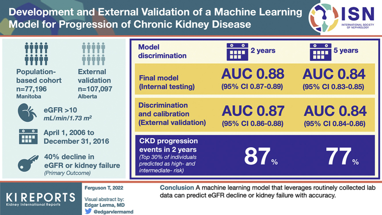

# Development and External Validation of a Machine Learning Model for Progression of CKD
CKD进展的机器学习模型的开发和外部验证

> 没看太懂

## Abstract  摘要
### Introduction  介绍
Prediction of disease progression at all stages of chronic kidney disease (CKD) may help improve patient outcomes. As such, we aimed to develop and externally validate a random forest model to predict progression of CKD using demographics and laboratory data.

在慢性肾脏病（CKD）的所有阶段预测疾病进展可能有助于改善患者的预后。因此，我们旨在开发和外部验证随机森林模型，以使用人口统计学和实验室数据预测CKD的进展。

### Methods  方法
The model was developed in a population-based cohort from Manitoba, Canada, between April 1, 2006, and December 31, 2016, with external validation in Alberta, Canada. A total of 77,196 individuals with an estimated glomerular filtration rate (eGFR) > 10 ml/min per 1.73 m2 and a urine albumin-to-creatinine ratio (ACR) available were included from Manitoba and 107,097 from Alberta. We considered >80 laboratory features, including analytes from complete blood cell counts, chemistry panels, liver enzymes, urine analysis, and quantification of urine albumin and protein. The primary outcome in our study was a 40% decline in eGFR or kidney failure. We assessed model discrimination using the area under the receiver operating characteristic curve (AUC) and calibration using plots of observed and predicted risks.

该模型是在 2006 年 4 月 1 日至 2016 年 12 月 31 日期间在加拿大马尼托巴的一个基于人群的队列中开发的，并在加拿大阿尔伯塔进行了外部验证。来自马尼托巴和来自阿尔伯塔的估计肾小球滤过率（eGFR）> 10 ml/min/1.73 m2 和尿白蛋白/肌酐比值（ACR）的受试者分别为 77，196 人。我们考虑了>80 个实验室特征，包括全血细胞计数分析物、生化检查、肝酶、尿液分析以及尿白蛋白和蛋白定量。我们研究的主要结果是 eGFR 下降 40%或肾衰竭。我们使用受试者工作特征曲线下面积（AUC）和使用观察到的和预测的风险图进行校准来评估模型区分。

### Results  结果
The final model achieved an AUC of 0.88 (95% CI 0.87–0.89) at 2 years and 0.84 (0.83–0.85) at 5 years in internal testing. Discrimination and calibration were preserved in the external validation data set with AUC scores of 0.87 (0.86–0.88) at 2 years and 0.84 (0.84–0.86) at 5 years. The top 30% of individuals predicted as high risk and intermediate risk represent 87% of CKD progression events in 2 years and 77% of progression events in 5 years.

在内部检验中，最终模型在2年时的AUC为0.88（95% CI 0.87-0.89），在5年时为0.84（0.83-0.85）。在外部验证数据集中保留了区分度和校准，2年时AUC评分为0.87（0.86-0.88），5年时为0.84（0.84-0.86）。预测为高风险和中等风险的前30%的个体代表了2年内87%的CKD进展事件和5年内77%的进展事件。

### Conclusion  结论
A machine learning model that leverages routinely collected laboratory data can predict eGFR decline or kidney failure with accuracy.

利用常规收集的实验室数据的机器学习模型可以准确预测eGFR下降或肾衰竭。

### Keywords: CKD progression, machine learning, predictive modeling
关键词：CKD进展，机器学习，预测建模

### Graphical abstract  图形摘要

## Introduction

CKD currently affects >850 million adults worldwide and is associated with increased morbidity and mortality and high health care costs.1 Although only a few patients with CKD will develop kidney failure, much of the excess morbidity and costs associated with CKD are driven by individuals who progress to more advanced stages of CKD before reaching organ failure requiring dialysis.2 Accurate prediction of individual risk of CKD progression could improve patient experiences and outcomes through knowledge sharing and shared decision-making with patients,3 enhance care by better matching the risks and harms of therapy to the risk of disease progression,4 and through improved health system efficiency resulting from better alignment between resource allocation and individual risk.

CKD目前影响着全世界的3E8.5亿成年人，并与发病率和死亡率增加以及高医疗保健成本相关。 1 虽然只有少数CKD患者会发展为肾衰竭，但与CKD相关的大部分额外发病率和成本是由在达到需要透析的器官衰竭之前进展到更晚期CKD阶段的个体驱动的。 2 准确预测CKD进展的个体风险可以通过与患者共享知识和共同决策来改善患者体验和结局， 3 通过更好地将治疗的风险和危害与疾病进展的风险相匹配来增强护理， 4 以及通过更好地调整资源分配和个体风险来提高卫生系统效率。

The Kidney Failure Risk Equation is an internationally validated risk predictieon equation that accurately predicts the risk of progression to kidney failure for an individual patient with CKD. However, this equation has important limitations in that it applies only to later stages of CKD (G3–G5) and considers only the outcome of kidney failure requiring dialysis. In earlier stages of CKD, kidney failure is a rare event, even if progression to a more advanced stage is not. In these early stages, a decline in GFR of 40% is both clinically meaningful to patients and physicians and allows sponsors to design feasible randomized controlled trials at all stages of CKD.5 In addition, new disease-modifying therapies for CKD that slow progression are available, but they have been largely studied in patients with preserved kidney function.6 The optimal use of these therapies is in high-risk individuals with early stages of CKD where the benefit for dialysis prevention is large and cost-effectiveness may be optimal.7

肾衰竭风险方程是一种国际验证的风险预测方程，可准确预测CKD患者进展为肾衰竭的风险。然而，该方程具有重要的局限性，因为它仅适用于CKD的晚期（G3-G5），并且仅考虑需要透析的肾衰竭的结果。在CKD的早期阶段，肾衰竭是一种罕见的事件，即使进展到更晚期也不是。在这些早期阶段，GFR下降40%对患者和医生都具有临床意义，并允许申办者在CKD的所有阶段设计可行的随机对照试验。 5 此外，还有减缓进展的新的慢性肾病疾病缓解疗法，但这些疗法已在肾功能保留的患者中进行了大量研究。 6 这些疗法的最佳使用是在CKD早期的高风险个体中，其中透析预防的益处很大，并且成本效益可能是最佳的。 7

Accurate models to predict a 40% decline in eGFR or the composite outcome of kidney failure or 40% decline in eGFR that can be applied to patients at all stages of CKD (G1–G5) are needed. When these models are based on laboratory data, they can be used through electronic health records or laboratory information systems, and are not subject to variability in coding, often found with CKD and its complications. We present here the derivation and external validation of new laboratory-based machine learning prediction models that accurately predict 40% decline in eGFR or kidney failure in patients with CKD G1 to G5.

需要准确的模型来预测 eGFR 下降 40%或肾衰竭的复合结局或 eGFR 下降 40%，这些模型可以应用于 CKD 的所有阶段（G1-G5）的患者。当这些模型基于实验室数据时，它们可以通过电子健康记录或实验室信息系统使用，并且不受编码变化的影响，通常在 CKD 及其并发症中发现。我们在这里介绍了新的基于实验室的机器学习预测模型的推导和外部验证，这些模型可以准确预测 CKD G1 至 G5 患者的 eGFR 或肾衰竭下降 40%。

## Methods  方法
### Study Population  研究人群
#### Development Cohort  开发队列
The development cohort was derived from administrative data in Manitoba, Canada (population 1.4 million), using data from the Manitoba Centre for Health Policy. The Manitoba Centre for Health Policy is a research unit within the Department of Community Health Sciences at the University of Manitoba that maintains a population-based repository of data on health services and other social determinants of health covering all individuals in the province. We identified all adult (age 18+ years) individuals in the province with an available outpatient eGFR test between April 1, 2006, and December 31, 2016, with valid Manitoba Health registration for at least 1-year preindex. eGFR was calculated from available serum creatinine tests using the CKD-Epidemiology Collaboration equation.8 Included patients were further required to have complete demographic information on age and sex, including the result of at least 1 urine ACR or protein-to-creatinine ratio (PCR) test. Patients with a history of kidney failure (dialysis or transplant) were excluded.

发展队列来自加拿大马尼托巴省（人口140万）的行政数据，使用马尼托巴卫生政策中心的数据。马尼托巴卫生政策中心是马尼托巴大学社区卫生科学系内的一个研究单位，它保存着一个以人口为基础的关于卫生服务和其他社会健康决定因素的数据库，涵盖该省所有个人。我们确定了2006年4月1日至2016年12月31日期间该省所有可用门诊eGFR检测的成年人（年龄18岁以上），以及至少1年preindex的有效马尼托巴健康登记。使用CKD-流行病学协作方程，根据可用的血清肌酐检测结果计算eGFR。 8 进一步要求入选患者具有关于年龄和性别的完整人口统计学信息，包括至少1次尿ACR或蛋白-肌酐比（PCR）检测的结果。 排除有肾衰竭（透析或移植）病史的患者。

#### Validation Cohort  验证群组
The validation cohort was derived from the Alberta Health database. This database contains information on demographic data, laboratory data, hospitalizations, and physician claims for all patients in the province of Alberta, Canada (population 4.4 million). Regular laboratory coverage for creatinine measurements and ACR/PCR values is complete from 2005; however, additional laboratory values are fully covered only from 2009 onward. As such, we identified a cohort of individuals with at least 1 calculable eGFR, valid health registration, and an ACR (or imputed PCRs) value starting from April 1, 2009, to December 31, 2016. We randomly sampled one-third of the external cohort to perform the final analysis to reduce computation time. Patients with a history of kidney failure (dialysis or transplant) were excluded.

验证队列来自阿尔伯塔卫生数据库。该数据库包含加拿大阿尔伯塔省（人口 440 万）所有患者的人口统计数据、实验室数据、住院情况和医生索赔信息。从 2005 年起，肌酐测量和 ACR/PCR 值的常规实验室覆盖范围已经完成;然而，其他实验室值仅从 2009 年起才完全覆盖。因此，我们确定了一组从 2009 年 4 月 1 日至 2016 年 12 月 31 日至少有 1 个可计算 eGFR、有效健康登记和 ACR（或插补 PCR）值的个体。我们随机抽取了三分之一的外部队列进行最终分析，以减少计算时间。排除有肾衰竭（透析或移植）病史的患者。

This study was reviewed and approved by the institutional ethics review board at the Universities of Manitoba (Health Research Ethics Board—Ethics #HS21776:H2018:179) Alberta (Pro00053469), and Calgary (REB16-1575). Informed consent was not required as all data were provided deidentified using a scrambled personal health information number.

本研究由马尼托巴大学（健康研究伦理委员会-伦理#HS21776：H2018：179）、阿尔伯塔大学（Pro 00053469）和卡尔加里大学（REB 16 -1575）的机构伦理审查委员会审查和批准。不需要知情同意，因为所有数据都是使用加密的个人健康信息编号去识别的。

### Variables  变量
#### Independent Variables  自变量
All models included age, sex, eGFR, and urine ACR as described previously. Baseline eGFR was calculated as the average of all available outpatient eGFR results beginning with the first recorded eGFR during the study period and moving forward to the last available test in a 6-month window and calculating the mean of tests during this period. The index date of the patient was considered the date of the final eGFR in this 6-month period.9 Age was determined as the date of the index eGFR, and sex was determined using a linkage to the Manitoba Health Insurance Registry which contained dates of birth and other demographic data. If a urine ACR test was unavailable, we converted available urine PCR tests to corresponding urine ACRs using published and validated equations.10 The closest result within 1 year before or after the index date was selected. Urine ACR was log transformed to handle the skewed distribution as in previous studies.

如前所述，所有模型均包括年龄、性别、eGFR和尿ACR。基线eGFR计算为所有可用门诊eGFR结果的平均值，从研究期间首次记录的eGFR开始，向前移动至6个月时间窗内的末次可用检测，并计算该期间的检测平均值。患者的索引日期被视为该6个月期间的最终eGFR日期。 9 年龄确定为指数eGFR的日期，性别通过与包含出生日期和其他人口统计学数据的马尼托巴健康保险登记处联系确定。如果尿ACR测试是不可用的，我们转换可用的尿PCR测试相应的尿ACR使用已发表和验证的方程。 10 选择索引日期之前或之后1年内最接近的结果。对尿液ACR进行对数转换，以处理与先前研究相同的偏态分布。

In addition to the previously described variables, we also evaluated the utility of additional laboratory results from chemistry panels, liver enzymes, and complete blood cell count panels for inclusion in the random forest model based on associations found in previous studies of models predicting CKD progression.11, 12, 13 The closest value within 1 year of the index date was selected (before or after) for inclusion. Distributional transformations were applied when needed. The final random forest model included eGFR, urine ACR, and an additional 18 laboratory results. An overview of the degree of missingness for the laboratory panels is provided in Supplementary Table S1. The random forest models applied imputations for missing data using the method of Ishwaran et al.14

除了先前描述的变量，我们还评估了来自化学面板、肝酶和全血细胞计数面板的额外实验室结果的效用，以基于先前预测CKD进展的模型研究中发现的关联纳入随机森林模型。 11 、 12 、 13 选择索引日期1年内的最接近值（之前或之后）进行纳入。在需要时应用分布变换。最终的随机森林模型包括eGFR、尿ACR和另外18个实验室结果。实验室样本组缺失程度的概述见 Supplementary Table S1 。随机森林模型使用Ishwaran等人的方法对缺失数据进行插补 。 14

All laboratory data included were extracted from the Shared Health Diagnostic Services of Manitoba Laboratory Information System, and any values recorded during a hospitalization event as determined by a linkage to the Discharge Abstract Database were not included (inpatient tests). For the validation cohort, Alberta Health laboratory data were extracted from the Alberta Kidney Disease Network. Of the 18 laboratory tests used in the Manitoba model, 16 were also regularly collected by the Alberta Kidney Disease Network. The unavailable tests (aspartate aminotransferase and gamma glutamyl transferase) were treated as missing data.

纳入的所有实验室数据均摘自马尼托巴共享健康诊断服务实验室信息系统，不包括通过与出院摘要数据库的链接确定的住院事件期间记录的任何数值（住院检查）。对于验证队列，从阿尔伯塔肾病网络提取了阿尔伯塔卫生实验室数据。在马尼托巴模式中使用的18项实验室检测中，有16项也由阿尔伯塔肾脏疾病网络定期收集。不可用的检测（天冬氨酸转氨酶和γ-谷氨酰转移酶）被视为缺失数据。

#### Dependent Variable—Development Cohort    因变量-发育队列
The primary outcome in our study was a 40% decline in eGFR or kidney failure. The 40% decline in eGFR was determined as the first eGFR test in the laboratory data that was 40% or greater in decline from the baseline eGFR, requiring a second confirmatory test result between 90 days and 2 years after the first test unless the patient dies or experiences kidney failure within 90 days after the first test result revealing a 40% or greater decline. Therefore, a patient experiencing a single eGFR representing a 40% decline and dying within 90 days is treated as an event, or if they experience kidney failure in that period.15 Kidney failure was defined as initiation of chronic dialysis, receipt of a transplant, or an eGFR <10 ml/min per 1.73 m2. Dialysis was defined as any 2 claims in the Manitoba Medical Services database for chronic dialysis, and transplant was defined as any 1 claim in the Manitoba Medical Services database for kidney transplant or a hospitalization in the Discharge Abstract Database with a corresponding procedure code for kidney transplantation (1PC85 or 1OK85 using the Canadian Classification of Health Interventions codes or International Classification of Diseases, Ninth Revision, procedure code 55.6). An overview of tariff codes identifying dialysis and transplant is provided in Supplementary Table S2. The outcome date for the 40% decline in eGFR or kidney failure was determined based on the first of these events.6 Patients were followed until reaching the above-mentioned composite end point, death (as determined by a linkage to the Manitoba Health Insurance Registry), a maximum of 5 years, or loss to follow-up.

我们研究的主要结果是 eGFR 下降 40%或肾衰竭。eGFR 下降 40%被确定为实验室数据中的第一次 eGFR 检测较基线 eGFR 下降 40%或更高，需要在第一次检测后 90 天至 2 年内获得第二次确证性检测结果，除非患者在第一次检测结果显示下降 40%或更高后 90 天内死亡或发生肾衰竭。因此，如果患者发生单个 eGFR 下降 40%，并在 90 天内死亡，则将其视为事件，或者如果他们在此期间发生肾衰竭。 15 肾衰竭定义为开始慢性透析、接受移植或 eGFR < 10 ml/min/1.73m2。 透析定义为马尼托巴医疗服务数据库中的任何 2 项长期透析索赔，移植定义为马尼托巴医疗服务数据库中的任何 1 项肾移植索赔或出院摘要数据库中的住院治疗（具有相应的肾移植手术代码）（1 PC 85 或 1 OK 85，使用加拿大卫生干预分类代码或国际疾病分类，第九次修订，程序代码 55.6）。识别透析和移植的关税代码概述见 Supplementary Table S2 。eGFR 下降 40%或肾衰竭的结局日期根据这些事件中的第一起确定。 6 患者随访至达到上述复合终点、死亡（通过与马尼托巴健康保险登记处的联系确定）、最长 5 年或失访。

#### Dependent Variable—Validation Cohort    因变量-验证队列
Using laboratory creatinine measurements as described for the Manitoba cohort described previously, 40% decline in eGFR was identified. Kidney failure was defined similarly, but with minor adaptations necessitated by a structurally different administrative data set (Supplementary Table S2). Chronic dialysis and kidney transplants were identified using the Northern and Southern Alberta Renal Program databases, a provincial registry of renal replacement—any single code for hemodialysis, peritoneal dialysis, or transplant was used. (Note: Because the registry begins in 2001, physician claims data were also used when excluding individuals with prior transplants or dialysis). We linked these data sources to the provincial laboratory repository by unique, encoded, patient identifiers.

使用先前描述的马尼托巴队列的实验室肌酐测量值，发现eGFR下降40%。肾衰竭的定义相似，但由于结构不同的管理数据集（ Supplementary Table S2 ），需要进行微小调整。使用北方和南方阿尔伯塔肾脏项目数据库，一个省级肾脏疾病登记处，确定慢性透析和肾脏移植-使用血液透析、腹膜透析或移植的任何单一代码。(Note：由于登记始于2001年，因此在排除既往接受过移植或透析的个体时，也使用了医生索赔数据）。我们通过唯一的编码患者标识符将这些数据源与省级实验室数据库相关联。

### Statistical Analysis  统计分析
Baseline characteristics for the development (internal training and testing) and external validation cohorts were summarized with descriptive statistics. We developed a random forest model using the R package Fast Unified Random Forest for Survival, Regression, and Classification using a survival forest with right-censored data.16 Data were split into training (70%) and testing (30%) data sets with a single split and then validated in an external cohort. Models were evaluated for accuracy using the area under the receiver operating characteristic curve, the Brier score, and calibration plots of observed versus predicted risk. Area under the receiver operating characteristic curve and Brier scores were assessed for prediction of the outcome at 1 to 5 years, in 1-year intervals, and calibration plots were evaluated at 2 and 5 years. Model hyperparameters were optimized using the tune.rfsrc function using comparisons of the maximal size of the terminal node and the number of variables to possibly split at each node to the out-of-bag error rate from the Random Forest for Survival, Regression, and Classification package.16

使用描述性统计量总结开发（内部培训和测试）和外部验证队列的基线特征。我们使用R包Fast Unified Random Forest for Survival，Regression，and Classification开发了一个随机森林模型，该模型使用了带有右删失数据的生存森林。 16 将数据分为训练（70%）和测试（30%）数据集，进行单次分割，然后在外部队列中进行验证。使用受试者工作特征曲线下面积、Brier评分和观察风险与预测风险的校准图评价模型的准确性。受试者工作特征曲线下面积和Brier评分在1 - 5年时进行评估，以预测1年的结局，并在2年和5年时评估校准图。 使用tune.rfsrc函数优化模型超参数，使用终端节点的最大大小和每个节点可能分裂的变量数量与来自随机森林生存，回归和分类包的包外错误率的比较。 16

In addition, we assessed sensitivity, specificity, negative predictive value (NPV), and positive predictive value (PPV) for the top 10%, 15%, and 20% of patients at highest estimated risk (high risk), including for the bottom 50%, 45%, and 30% at lowest risk (low risk). These metrics were assessed at 2 and 5 years. A visualization of the risk of progression versus predicted probability was plotted for 2 and 5 years. Using the final grown 22-variable forest, variable importance of included parameters was evaluated, with results for the 5 most influential variables presented.17

此外，我们评估了最高估计风险（高风险）的前10%，15%和20%患者的敏感性，特异性，阴性预测值（NPV）和阳性预测值（PPV），包括最低风险（低风险）的后50%，45%和30%。在2年和5年时评估这些指标。绘制了2年和5年的进展风险与预测概率的可视化图。使用最终生长的22个变量的森林，包括参数的变量重要性进行了评估，结果为5个最有影响力的变量。 17

To evaluate robustness, we evaluated the model in subpopulations of the testing and validation cohorts for the 5-year prediction of the primary outcome defined by CKD stage and the presence or absence of diabetes.

为了评估稳健性，我们在测试和验证队列的亚群中评估了该模型对CKD分期和是否存在糖尿病定义的主要结局的5年预测。

### Sensitivity Analyses  敏感性分析
For sensitivity analyses, we considered 2 comparator models. (i) We evaluated a Cox proportional hazards model using a guideline-based definition of risk using the 3-level definition of albuminuria and 5 stages of eGFR as categorical predictors as a comparator (heatmap model).18 (ii) We evaluated a Cox proportional hazards model including the variables eGFR, urine ACR, diabetes, hypertension, stroke, myocardial infarction, age, and sex (clinical model). In addition, we evaluated the model in the external validation cohort where laboratory values were only included 1 year before the index date.

对于敏感性分析，我们考虑了2种比较模型。(i)我们使用基于指南的风险定义评估了考克斯比例风险模型，该模型使用蛋白尿的3级定义和eGFR的5个阶段作为分类预测因子作为比较（热图模型）。 18 （ii）我们评估了包括变量eGFR、尿ACR、糖尿病、高血压、中风、心肌梗死、年龄和性别的考克斯比例风险模型（临床模型）。此外，我们在外部验证队列中评估了模型，其中仅包括索引日期前1年的实验室值。

Analysis was performed using R Version 4.1.0. Statistical significance was a priori identified using an α = 0.05.

使用 R 版本 4.1.0 进行分析。使用α = 0.05 先验确定统计学显著性。

## Results  结果
### Cohort Selection  队列选择
For the development cohort (training and testing), we had a total sample size of 77,196, allocating 54,037 to the training data set (70%) and 23,159 to the testing data set. A total of 321,396 individuals were identified in the validation cohort, with a random subset of 107,097 selected for evaluation. Detailed overview of the cohort selection process for both the development and validation cohorts is provided in Supplementary Figure S1.

对于开发队列（训练和测试），我们的总样本量为77，196，其中54，037分配给训练数据集（70%），23，159分配给测试数据集。在验证队列中共确定了321，396人，随机选择了107，097人进行评估。开发和验证队列的队列选择过程的详细概述见 Supplementary Figure S1 。

