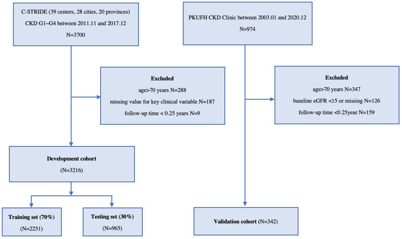
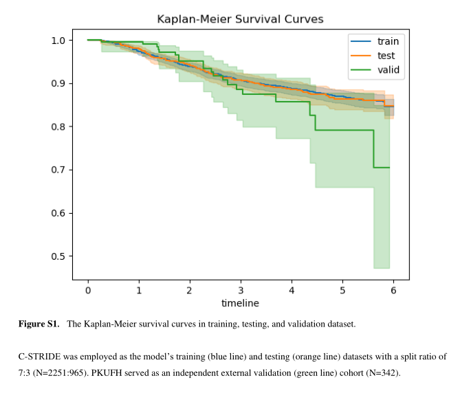

# ESKD Risk Prediction Model in a Multicenter Chronic Kidney Disease Cohort in China: A Derivation, Validation, and Comparison Study
中国多中心慢性肾脏病队列ESKD风险预测模型的推导、验证和比较研究

## Abstract  摘要
Background and objectives: In light of the growing burden of chronic kidney disease (CKD), it is of particular importance to create disease prediction models that can assist healthcare providers in identifying cases of CKD individual risk and integrate risk-based care for disease progress management. The objective of this study was to develop and validate a new pragmatic end-stage kidney disease (ESKD) risk prediction utilizing the Cox proportional hazards model (Cox) and machine learning (ML). Design, setting, participants, and measurements: The Chinese Cohort Study of Chronic Kidney Disease (C-STRIDE), a multicenter CKD cohort in China, was employed as the model’s training and testing datasets, with a split ratio of 7:3. A cohort from Peking University First Hospital (PKUFH cohort) served as the external validation dataset. The participants’ laboratory tests in those cohorts were conducted at PKUFH. We included individuals with CKD stages 1~4 at baseline. The incidence of kidney replacement therapy (KRT) was defined as the outcome. We constructed the Peking University-CKD (PKU-CKD) risk prediction model employing the Cox and ML methods, which include extreme gradient boosting (XGBoost) and survival support vector machine (SSVM). These models discriminate metrics by applying Harrell’s concordance index (Harrell’s C-index) and Uno’s concordance (Uno’s C). The calibration performance was measured by the Brier score and plots. Results: Of the 3216 C-STRIDE and 342 PKUFH participants, 411 (12.8%) and 25 (7.3%) experienced KRT with mean follow-up periods of 4.45 and 3.37 years, respectively. The features included in the PKU-CKD model were age, gender, estimated glomerular filtration rate (eGFR), urinary albumin–creatinine ratio (UACR), albumin, hemoglobin, medical history of type 2 diabetes mellitus (T2DM), and hypertension. In the test dataset, the values of the Cox model for Harrell’s C-index, Uno’s C-index, and Brier score were 0.834, 0.833, and 0.065, respectively. The XGBoost algorithm values for these metrics were 0.826, 0.825, and 0.066, respectively. The SSVM model yielded values of 0.748, 0.747, and 0.070, respectively, for the above parameters. The comparative analysis revealed no significant difference between XGBoost and Cox, in terms of Harrell’s C, Uno’s C, and the Brier score (p = 0.186, 0.213, and 0.41, respectively) in the test dataset. The SSVM model was significantly inferior to the previous two models (p < 0.001), in terms of discrimination and calibration. The validation dataset showed that XGBoost was superior to Cox, regarding Harrell’s C, Uno’s C, and the Brier score (p = 0.003, 0.027, and 0.032, respectively), while Cox and SSVM were almost identical concerning these three parameters (p = 0.102, 0.092, and 0.048, respectively). Conclusions: We developed and validated a new ESKD risk prediction model for patients with CKD, employing commonly measured indicators in clinical practice, and its overall performance was satisfactory. The conventional Cox regression and certain ML models exhibited equal accuracy in predicting the course of CKD.

背景和目标：鉴于慢性肾脏病（CKD）的负担日益加重，创建疾病预测模型尤为重要，该模型可以帮助医疗保健提供者识别 CKD 个体风险病例，并整合基于风险的护理以进行疾病进展管理。

本研究的目的是利用考克斯比例风险模型（考克斯）和机器学习（ML）开发和验证一种新的实用终末期肾病（ESKD）风险预测。
设计、设置、受试者和测量：中国慢性肾脏病队列研究（C-STRIDE）是中国的一个多中心 CKD 队列，被用作模型的训练和测试数据集，分割比为 7：3。北京大学第一医院的队列（PKUFH 队列）作为外部验证数据集。这些队列中参与者的实验室检查在 PKUFH 进行。我们纳入了基线时 CKD 1~4 期的个体。 

肾脏替代治疗（KRT）的发生率被定义为结局。

我们使用考克斯和 ML 方法构建了北京大学-CKD（Peking University-CKD，PKU-CKD）风险预测模型，其中包括极端梯度提升（extreme gradient boosting，XGBoost）和生存支持向量机（survival support vector machine，SSVM）。

这些模型通过应用 Harrell 的一致性指数（Harrell 的 C-指数）和 Uno 的一致性（Uno 的 C）来区分度量。通过 Brier 评分和绘图测量校准性能。

结果如下：在 3216 例 C-STRIDE 和 342 例 PKUFH 受试者中，411 例（12.8%）和 25 例（7.3%）发生了 KRT，平均随访期分别为 4.45 年和 3.37 年。PKU-CKD 模型中包括的特征包括年龄、性别、估计肾小球滤过率（eGFR）、尿白蛋白-肌酐比值（UACR）、白蛋白、血红蛋白、2 型糖尿病（T2 DM）和高血压病史。 

- 在测试数据集中，Harrell 的 C 指数、Uno 的 C 指数和 Brier 评分的考克斯模型的值分别为 0.834、0.833 和 0.065。
- 这些度量的 XGBoost 算法值分别为 0.826、0.825 和 0.066。对于上述参数，SSVM 模型分别产生 0.748、0.747 和 0.070 的值。
- 比较分析显示，XGBoost 和考克斯之间在测试数据集中的 Harrell'sC、Uno'sC 和 Brier 评分方面没有显著差异（分别为 p= 0.186、0.213 和 0.41）。
- 在区分度和校准方面，SSVM 模型显著劣于前两个模型（p% 3 C 0.001）。 

- 验证数据集显示，XGBoost 在 Harrell'sC、Uno'sC 和 Brier 评分方面上级优于考克斯（分别为 p= 0.003、0.027 和 0.032），而考克斯和 SSVM 在这三个参数方面几乎相同（分别为 p= 0.102、0.092 和 0.048）。

结论：我们开发并验证了一种新的 CKD 患者 ESKD 风险预测模型，采用临床实践中常用的测量指标，其整体性能令人满意。传统的考克斯回归和某些 ML 模型在预测 CKD 的过程中表现出相同的准确性。

## Keywords: chronic kidney disease, progression, prediction model, machine learning
关键词：慢性肾脏病，进展，预测模型，机器学习

## 1. Introduction  1.介绍
Chronic kidney disease (CKD) is a leading public health problem worldwide. The estimated prevalence of CKD is 9.1% [1] globally and 10.8% in China [2]. The disease burden has been increasing significantly because of the rise in diabetes, hypertension, and aging [2,3,4,5], and it also contributes to the increased burden of end-stage kidney disease (ESKD) requiring kidney replacement therapy, which incurs huge health costs. As a result of early asymptomatic stages of CKD and heterogeneous progression to ESKD, both healthcare providers and patients seek to predict disease prognosis for optimal risk-based individualized management.

慢性肾脏病（CKD）是全球主要的公共卫生问题。全球CKD的估计患病率为9.1% [ 1 ]，中国为10.8%[ 2 ]。由于糖尿病、高血压和老龄化的增加，疾病负担显著增加[ 2 、 3 、 4 、 5 ]，并且它还导致需要肾脏替代疗法的终末期肾病（ESKD）的负担增加，这导致巨大的健康成本。由于CKD的早期无症状阶段和向ESKD的异质性进展，医疗保健提供者和患者都寻求预测疾病预后，以实现基于风险的最佳个体化管理。

Tangri et al. [6,7] initially developed and validated the kidney failure risk equations (KFREs) using data from two nephrology referral centers in Canada and then data from the chronic kidney disease prognosis consortium (CKD-PC), which includes millions of patients with CKD stages 3–5. For populations of Asian ancestry, the model has been externally validated in populations from Korea [8] and Singapore [9], demonstrating satisfactory performance. However, participants with early-stage CKD were sub-optimally represented in prior studies. Most participants in previous studies did not have glomerular disease, which is still the common cause of CKD in developing countries. In addition, several models (traditional statistical or ML algorithms) for ESKD prediction exist, but they are limited, partly due to sample size [10], external validation, ML model interpretation, and clinical application [11,12,13]. None of them were developed for a population with CKD stages 1–4. ML appears to make fewer assumptions and may be more accurate in predictive performance [14,15]. However, the traditional Cox regression model may lose the opportunity to identify and involve the key clinical features of CKD in the prediction model, which may be complemented by ML algorithms.

Tangri等人[ 6 ， 7 ]最初使用来自加拿大两个肾脏病转诊中心的数据以及来自慢性肾脏病预后联盟（CKD-PC）的数据开发并验证了肾衰竭风险方程（KFR），该联盟包括数百万3-5期CKD患者。对于亚洲血统人群，该模型已在韩国[ 8 ]和新加坡[ 9 ]人群中进行了外部验证，证明性能令人满意。然而，早期CKD参与者在之前的研究中表现不佳。在以前的研究中，大多数参与者没有肾小球疾病，这仍然是发展中国家CKD的常见原因。此外，存在用于ESKD预测的几种模型（传统统计或ML算法），但它们是有限的，部分原因是样本量[ 10 ]，外部验证，ML模型解释和临床应用[ 11 ， 12 ， 13 ]。它们都不是针对CKD 1-4期人群开发的。 ML似乎做出更少的假设，并且在预测性能方面可能更准确[ 14 ， 15 ]。然而，传统的考克斯回归模型可能会失去在预测模型中识别和涉及CKD的关键临床特征的机会，这可以通过ML算法来补充。

Using a multicenter CKD research cohort of patients with CKD stages 1–4 under the care of nephrologists, we used Cox and ML to develop and validate a pragmatic risk prediction model for ESKD at two and five years, based on supervised routinely available features, and we additionally compared their prediction accuracies.

我们使用多中心 CKD 研究队列，在肾病科医生的护理下，使用考克斯和 ML 开发并验证 ESKD 在 2 年和 5 年时的实用风险预测模型，基于监督的常规可用特征，我们还比较了它们的预测准确性。

## 2. Materials and Methods    2.材料和方法
### 2.1. Ethics Approval and Declaration    2.1.伦理批准和声明
This study adhered to the transparent reporting of a multivariable prediction model for individual prognosis or diagnosis (TRIPOD) reporting guidelines.

本研究遵循个体预后或诊断多变量预测模型（TRIPOD）报告指南的透明报告。

### 2.2. Data Source and Study Population    2.2.数据来源和研究人群
#### 2.2.1. Development Cohort    2.2.1.开发队列
This development cohort was derived from C-STRIDE [16,17], the first nationwide CKD cohort in China, along with 39 clinical centers located in 28 cities from 22 provinces. All of these clinical centers are renal departments from different hospitals. Participants who met the following criteria were eligible for enrollment: (1) aged 18–74 years and (2) specified eGFR range, according to different CKD etiologies. For glomerulonephritis (GN) patients, the eGFR should be ≥15 mL/min/1.73 m2. For diabetic nephropathy (DN) patients, the defining eligibility was 15 mL/min/1.73 m2 ≤ eGFR < 60 mL/min/1.73 m2 or eGFR ≥ 60 mL/min/1.73 m2 with “nephrotic range” proteinuria. For non-GN and non-DN patients, 15 mL/min/1.73 m2 ≤ eGFR < 60 mL/min/1.73 m2 was set for enrollment. Patients aged >70 years or without baseline eGFR and demographic values or with a follow-up time of <3 months were excluded (Figure 1). Their laboratory test data were collected in central laboratories at baseline and, along with demographics and anthropometrics, were annually collected and evaluated throughout the study. The outcomes were defined as kidney replacement therapy (KRT; maintenance dialysis or renal replacement) at three-month intervals, as ascertained by each clinical center. We censored patients without KRT events throughout the limited follow-up period due to death, dropout, or 31 December 2017, whichever came first.

该开发队列来源于 C-STRIDE [ 16 ， 17 ]，C-STRIDE 是中国首个全国性 CKD 队列，沿着的是位于 22 个省 28 个城市的 39 个临床中心。所有这些临床中心都是来自不同医院的肾脏科。符合以下标准的参与者有资格入选：
- （1）年龄 18-74 岁，
- （2）根据不同的 CKD 病因，指定 eGFR 范围。
- - 对于肾小球肾炎（GN）患者，eGFR 应≥15 mL/min/1.73m2。
- - 对于糖尿病肾病（DN）患者，定义合格性为 15 mL/min/1.73m2 ≤ eGFR % 3C 60 mL/min/1.73m2 或 eGFR ≥ 60 mL/min/1.73m2 伴“肾病范围”蛋白尿。
- - 对于非 GN 和非 DN 患者，入组设定为 15 mL/min/1.73m2 ≤ eGFR < 60 mL/min/1.73m2。 
- 排除了年龄为>70 岁或无基线 eGFR 和人口统计学值或随访时间为<3 个月的患者（ Figure 1 ）。

在基线时在中心实验室收集他们的实验室检查数据，并在整个研究期间每年收集和评价人口统计学和人体测量学数据。

结局定义为每 3 个月进行一次肾脏替代治疗（KRT;维持性透析或肾脏替代），由各临床中心确定。由于死亡、脱落或 2017 年 12 月 31 日（以先发生者为准），我们对在整个有限随访期内未发生 KRT 事件的患者进行了删失。

> Flow chart of the screening and splitting of the study data. Abbreviations: C-STRIDE, Chinese cohort study of chronic kidney disease; PKUFH, Peking University First Hospital; CKD G1~G4, chronic kidney disease stages 1–4; N, sample number; eGFR, estimated glomerular filtration rate (mL/min/1.73 m2).
> 研究数据筛选和拆分流程图。缩略语：C-STRIDE，中国慢性肾脏病队列研究; PKUFH，北京大学第一医院; CKD G1~G4，慢性肾脏病1-4期; N，样本数; eGFR，估计肾小球滤过率（mL/min/1.73 m2）。

#### 2.2.2. Validation Cohort    2.2.2.验证群组
The prospective CKD cohort at PKUFH, which included CKD G1–G4 with various etiologies enrolled, was used as the external validation cohort. This cohort met the exclusion criteria of the development dataset and was, therefore, designated the validation dataset. The KRT outcome was also documented during the period of follow-up. Since the maximum follow-up length in the development set was six years, data from the patients in the validation set with a follow-up longer than six years were censored.

PKUFH的前瞻性CKD队列（包括入组的各种病因的CKD G1-G4）用作外部验证队列。该队列符合开发数据集的排除标准，因此被指定为验证数据集。在随访期间还记录了KRT结局。由于开发集中的最长随访时间为6年，因此对验证集中随访时间超过6年的患者的数据进行了删失。

#### 2.2.3. Candidate Variables    2.2.3.候选变量
The baseline visit included age, gender, resting blood pressure, and comorbidities history, including type 2 diabetes mellitus (T2DM), hypertension, and cardiovascular disease, obtained at each center. Laboratory tests were collected for each patient (hemoglobin, creatine, albumin, bicarbonate, fasting blood glucose, uric acid, blood lipids panel, and serum electrolytes). Among these items, laboratory tests, 24-h urine electrolytes, and urine ACR were measured in the central laboratory (PKUFH) to avoid variation of the testing values between laboratories. eGFR was evaluated by the CKD-EPI [18] creatinine equation. Candidate variables with missing values greater than 30% in the development dataset were excluded.

基线访视包括年龄、性别、静息血压和合并症病史，包括2型糖尿病（T2 DM）、高血压和心血管疾病，均在每家临床试验机构获得。采集每例患者的实验室检查结果（血红蛋白、肌酸、白蛋白、碳酸氢盐、空腹血糖、尿酸、血脂和血清电解质）。在这些项目中，在中心实验室（PKUFH）测量实验室检查、24小时尿电解质和尿ACR，以避免实验室间检测值的差异。通过CKD-EPI [ 18 ]肌酐方程评价eGFR。排除开发数据集中缺失值大于30%的候选变量。

### 2.3. Data Preprocessing and Statistical Analysis    2.3.数据预处理和统计分析
In this study, the C-STRIDE cohort was randomly divided into training and test datasets at a ratio of 7:3. The PKUFH CKD cohort was considered an independent external validation set. The training dataset was used for training survival models, while the internal test dataset and the external validation dataset were used for model evaluation.

在这项研究中，C-STRIDE 队列以 7：3 的比例随机分为训练和测试数据集。PKUFH CKD 队列被认为是一个独立的外部验证集。训练数据集用于训练生存模型，而内部测试数据集和外部验证数据集用于模型评估。

Any feature with a missing rate greater than 30% in the development dataset was excluded. We imputed the remaining missing data using the multivariate data by chained equations (MICE) method, which can handle complex incomplete data. Moreover, to avoid the problem of information leakage, we conducted MICE imputation for the training dataset first, and then, for the test and external validation datasets, sequentially by means of the imputed training dataset. In addition, the urine ACR feature values were logarithmically transformed with a base of 10, due to a skewed distribution.

排除开发数据集中缺失率大于 30%的任何特征。我们使用链式方程（MICE）方法，可以处理复杂的不完全数据的多元数据填补剩余的缺失数据。此外，为了避免信息泄漏的问题，我们首先对训练数据集进行 MICE 插补，然后，通过插补的训练数据集依次对测试和外部验证数据集进行 MICE 插补。此外，由于偏态分布，尿 ACR 特征值以 10 为基数进行数学变换。

As applicable, all baseline characteristics are presented as means with standard deviations, medians with interquartile ranges (IQRs), and frequencies with percentages. An event per variable (EPV) value > 10 was used to calculate the sample size. On the basis of the candidate variables and the number of ESKD occurrences, the sample size of the development cohort was adequate. The survival station of two datasets was described using Kaplan–Meier curves. In any hypothesis test, a type I error was set at the 0.05 level.

如适用，所有基线特征均以平均值和标准差、中位数和四分位距（IQRs）以及频率和百分比表示。使用事件/变量（EPV）值> 10 来计算样本量。根据候选变量和 ESKD 发生次数，开发队列的样本量足够。采用 Kaplan-Meier 曲线描述两个数据集的生存状态。在任何假设检验中，将 I 类错误设定为 0.05 水平。

### 2.4. Model Development and Evaluation    2.4.模型开发和评估
Model-Driven Feature Selection    模型驱动特征选择

During the building of a predictive model, feature selection is integral. We searched for the predictive feature of ESKD reported in previous studies [19,20,21]. In addition, we utilized the training set to identify potential features in conjunction with the Cox model stepwise selection (both directions, Akaike information criterion), as well as the least absolute shrinkage and selection operator (Cox–LASSO) approaches, to find the optimal model via cross-validation. Partial likelihood deviance within the acceptable ranges was determined the lambda. Expert knowledge and clinical cost-effectiveness were integrated to determine the final features.

在预测模型的建立过程中，特征选择是不可或缺的。我们检索了先前研究中报告的ESKD的预测特征[ 19 ， 20 ， 21 ]。此外，我们利用训练集来识别潜在特征，并结合考克斯模型逐步选择（双向，赤池信息标准）以及最小绝对收缩和选择算子（Cox-LASSO）方法，通过交叉验证找到最佳模型。可接受范围内的偏似然偏差由λ确定。专家知识和临床成本效益相结合，以确定最终的功能。

### 2.5. Model Training  2.5.模型训练
During model development, we investigated the Cox regression model and two ML models, namely XGBoost [22] and SSVM [23]. XGBoost is a gradient-boosting ensemble model consisting of a group of decision trees. It can deal with survival prediction tasks by means of learning each tree using the survival loss function setting. As another survival machine learning model, SSVM is an extension of the conventional SVM algorithm and has also been applied in biomedical studies [24].

在模型开发期间，我们研究了考克斯回归模型和两个ML模型，即XGBoost [ 22 ]和SSVM [ 23 ]。XGBoost是一个由一组决策树组成的梯度提升集成模型。它可以通过使用生存损失函数设置学习每棵树来处理生存预测任务。作为另一种生存机器学习模型，SSVM是传统SVM算法的扩展，也已应用于生物医学研究[ 24 ]。

For each ML model, we first tuned the hyperparameters by means of the Bayesian optimization algorithm, aiming at maximizing the average of the C-index values of five-fold cross-validation. Then, we fit the models with the optimal hyper-parameters to the entire training dataset again to acquire the final model and then applied it to the inner test and external validation datasets for prediction. Given the feature values of a patient, the corresponding prediction results included a prognostic index (PI) and an individual survival curve, which were further used for model evaluation.

对于每个ML模型，我们首先通过贝叶斯优化算法调整超参数，旨在最大化五重交叉验证的C指数值的平均值。然后，我们将具有最佳超参数的模型再次拟合到整个训练数据集以获得最终模型，然后将其应用于内部测试和外部验证数据集进行预测。给定患者的特征值，相应的预测结果包括预后指数（PI）和个体生存曲线，其进一步用于模型评估。

Model Evaluation and Comparison    模型评估和比较

We considered a series of metrics to measure model discrimination. The first and most widely used measurement was Harrell’s concordance index (Harrell’s C-index). Uno’s concordance (Uno’s C) was also included, as it is preferable for high censoring cases [25]. In addition to the global concordances, we also considered time-dependent AUC (TD-AUC) for discriminability at specific time points. In this study, we mainly focused on ESKD at two and five years.

我们考虑了一系列衡量模型歧视的指标。第一个也是最广泛使用的测量是Harrell的一致性指数（Harrell的C-指数）。还纳入了Uno一致性（UnoC），因为它更适用于高删失病例[ 25 ]。除了整体一致性外，我们还考虑了时间依赖性AUC（TD-AUC）在特定时间点的可辨别性。在这项研究中，我们主要集中在ESKD在2年和5年。

In addition, the overall performance (or calibration) was carried out using the Brier score, which calculated the squared differences between the actual outcomes and the predictions. The Brier score ranges from 0 (prediction and results are identical) to 1 (discordant prediction). Accordingly, the calibration curves visualized the difference between the predicted and observed survival probability.

此外，使用 Brier 评分进行整体性能（或校准），该评分计算实际结果与预测之间的平方差。Brier 评分范围为 0（预测和结果相同）至 1（预测不一致）。因此，校准曲线显示了预测和观察到的生存概率之间的差异。

The statistical inference and hypothesis tests for Harrell’s and Uno’s C-index, TD-AUC, and the Brier score were based on non-parametric bootstrap resampling techniques, such as variance, 95% confidence intervals (CIs), and difference tests between models. Briefly speaking, the samples in each dataset were randomly resampled 1000 times to generate a group of bootstrap values for the statistical estimation of the metrics. Then, the CIs, z-statistics, and the corresponding p-values in the hypothesis testing were derived based on these bootstrap metric values [26].

Harrell和UnoC指数、TD-AUC和Brier评分的统计推断和假设检验基于非参数自举回归技术，如方差、95%置信区间（CI）和模型间差异检验。简而言之，每个数据集中的样本被随机重新采样1000次，以生成一组自举值，用于指标的统计估计。然后，根据这些bootstrap度量值推导假设检验中的CI、z统计量和相应的p值[ 26 ]。

### 2.6. Implementation Setup    2.6.实施设置
This study was conducted using Python (version 3.8) and R (version 4.1) on a server with an Ubuntu 20.04 operating system. Data imputation, Cox regression, Cox–LASSO, XGBoost, SSVM, and hyper-parameter tuning were implemented based on the R mice (version 3.14), R survival (version 3.4), R glmnet (version 4.1), Python XGBoost (version 1.5), Python scikit-survival (version 0.17.2), and Python hyperopt (version 0.2.7) packages, respectively.

本研究使用Python（版本3.8）和R（版本4.1）在Ubuntu 20.04操作系统的服务器上进行。分别基于R mice（版本3.14）、R survival（版本3.4）、R glmnet（版本4.1）、Python XGBoost（版本1.5）、Python scikit-survival（版本0.17.2）和Python hyperopt（版本0.2.7）包实现数据插补、考克斯回归、Cox-LASSO、XGBoost、SSVM和超参数调整。

## 3. Results  3.结果
### 3.1. Cohort Description  3.1.队列描述
The development and external validation cohorts eventually comprised 3216 (2251 patients in the training set and 965 patients in the test set) and 342 patients, respectively (Table 1 and Figure 1). The observed incidence of the outcome ranged from 411 (12.8%) events in the C-STRIDE cohort to 25 (7.3%) events in the validation cohort. The mean time to event was 4.5 and 3.4 years in the respective cohorts. The Kaplan–Meier survival curve is shown in Figure S1. The mean age of the study population was 48 and 55 years. The mean eGFR was 52.97 and 50.83 mL/min/1.73 m2, and more than 70% of the patients were in CKD stages 1–3. Glomerulonephritis was the primary etiology of CKD in C-STRIDE. The baseline urinary ACR median (25th-75th percentile) was 376.40 (90.80, 911.45) mg/g and 214.37 (43.55, 1058.50) mg/g. The baseline survival rate of the training sets was 0.9969 and 0.9827 at two and five years. The other baseline characteristics of the CKD patients are presented in Table 1.

开发和外部验证队列最终分别包括3216例患者（训练集中2251例患者，测试集中965例患者）和342例患者（ Table 1 和 Figure 1 ）。观察到的结局发生率范围为C-STRIDE队列中的411起（12.8%）事件至验证队列中的25起（7.3%）事件。各队列中至事件发生的平均时间分别为4.5年和3.4年。Kaplan-Meier生存曲线见 Figure S1 。研究人群的平均年龄为48岁和55岁。平均eGFR为52.97和50.83 mL/min/1.73m2，超过70%的患者处于CKD 1-3期。肾小球肾炎是C-STRIDE中CKD的主要病因。基线尿ACR中位数（第25 - 75百分位数）为376.40（90.80，911.45）mg/g和214.37（43.55，1058.50）mg/g。训练集的基线生存率在2年和5年时分别为0.9969和0.9827。CKD患者的其他基线特征见 Table 1 。

> Figure S1. The Kaplan-Meier survival curves in training, testing, and validation dataset. 
 
> C-STRIDE was employed as the model’s training (blue line) and testing (orange line) datasets with a split ratio of 7:3 (N=2251:965). PKUFH served as an independent external validation (green line) cohort (N=342).

> Table 1.  表1.
> Baseline characteristics of those participants with CKD in the development and validation cohorts.
> 开发和验证队列中CKD受试者的基线特征。

> Note. Values of continuous variables are presented as the mean ± SD (standard deviation) or median (interquartile ranges) according to their distribution and frequency (percentage) for categorical variables. Abbreviations: HBP, hypertension; T2DM, type 2 diabetes mellitus; CVD, cardiovascular disease; CKD, chronic kidney disease; DKD, diabetes kidney disease; GN, glomerulonephritis; ALB, albumin; HGB, hemoglobin; eGFR, estimated glomerular filtration rate; UACR, urinary albumin–creatinine ratio; FBG, fasting blood glucose; TC, total cholesterol; HDL-C, high-density lipoprotein cholesterol; LDL-C, low-density lipoprotein cholesterol; KRT, kidney replacement therapy.
> 注.根据分类变量的分布和频率（百分比），连续变量的值表示为平均值± SD（标准差）或中位数（四分位距）。缩略语：HBP，高血压; T2 DM，2型糖尿病; CVD，心血管疾病; CKD，慢性肾病; DKD，糖尿病肾病; GN，肾小球肾炎; ALB，白蛋白; HGB，血红蛋白; eGFR，估计肾小球滤过率; UACR，尿白蛋白-肌酐比值; FBG，空腹血糖; TC，总胆固醇; HDL-C，高密度脂蛋白胆固醇; LDL-C，低密度脂蛋白胆固醇; KRT，肾脏替代疗法。

### 3.2. Feature Selection  3.2.特征选择
By employing multivariable stepwise Cox analysis and Cox–LASSO regression, the characteristics that predicted ESKD were reduced further (Tables S1 and S2 and Figure S2). Age, gender, eGFR, urine ACR, albumin, hemoglobin, medical history of T2DM, and hypertension were included in the final model.

通过采用多变量逐步考克斯分析和Cox-LASSO回归，预测ESKD的特征进一步减少（ Tables S1 and S2 and Figure S2 ）。最终模型中包括年龄、性别、eGFR、尿ACR、白蛋白、血红蛋白、T2 DM和高血压病史。

### 3.3. Model Performance  3.3.模型性能
The findings of the discrimination and calibration (Brier score) are displayed in Table 2. In the Cox model, Harrell’s C-indices were 0.841, 0.834, and 0.761, while the Uno’s C-indices were 0.807, 0.833, and 0.796 in the training, testing, and validation datasets, respectively. The XGBoost model provided similar findings for Harrell’s C-index, but when applied to all datasets, Uno’s C-index values of 0.836, 0.825, and 0.822 were more consistent in three datasets. The XGBoost method performed better than Cox, in terms of the two- and five-year TD-AUC in the validation. Compared to the preceding two models, the discrimination of the SSVM model was less satisfactory, given the Harrell’s C-index values of 0.748 and 0.745 in testing and validation. The Cox model and XGBoost algorithm performed similarly, in terms of the Brier scores (0.065 and 0.066), while that of the SSVM was 0.070.

区分和校准结果（Brier评分）显示在 Table 2 中。在考克斯模型中，Harrell的C指数分别为0.841、0.834和0.761，而Uno的C指数在训练、测试和验证数据集中分别为0.807、0.833和0.796。XGBoost模型为Harrell的C指数提供了类似的发现，但当应用于所有数据集时，Uno的C指数值0.836，0.825和0.822在三个数据集中更加一致。在验证中，XGBoost方法在2年和5年TD-AUC方面的表现优于考克斯方法。与前两个模型相比，SSVM模型的区分度不太令人满意，在测试和验证中给出了0.748和0.745的HarrellC指数值。考克斯模型和XGBoost算法在Brier评分方面表现相似（0.065和0.066），而SSVM的评分为0.070。

> Table 2.  表2.
> Discrimination and calibration of the Cox, SSVM, and XGBoost models in the training, testing, and validation sets.
> 在训练集、测试集和验证集中识别和校准考克斯、SSVM和XGBoost模型。

> Abbreviations: 2-yr TD-AUC, two-year time-dependent area under the curve; 5-yr TD-AUC, five-year time-dependent area under the curve.
> 缩略语：2 年 TD-AUC，2 年时间依赖性曲线下面积; 5 年 TD-AUC，5 年时间依赖性曲线下面积。

The calibration curves exhibited suboptimal performance at certain risk thresholds. (Figure S3). The curves of the Cox model and SSVM revealed underestimation and overestimation, respectively, in the testing set for the high-risk population at 2 and 5 years. The calibration of XGBoost was generally centered on the 45-degree line, whereas high-risk groups were overestimated.

校准曲线在某些风险阈值下表现出次优性能。（ Figure S3 ）。考克斯模型和 SSVM 的曲线分别揭示了在 2 年和 5 年时高风险人群的测试集中的低估和高估。XGBoost 的校准通常以 45 度线为中心，而高风险人群则被高估。

### 3.4. Model Comparison  3.4.模型比较
A comparative analysis of the performance of the Cox, XGBoost, and SSVM models demonstrated that XGBoost performed significantly better than Cox and SSVM in the training set for both discrimination (Harrell’s C and Uno’s C) and calibration (p < 0.001). When used in the testing set, XGBoost performed similarly to Cox, in terms of Harrell’s C, Uno’s C, and the Brier score (p = 0.186, 0.213, and 0.141, respectively), but was statistically better than SSVM (p < 0.001). The validation set showed that XGBoost was superior to Cox, regarding Harrell’s C, Uno’s C, and the Brier scores (p = 0.003, 0.027, and 0.032, respectively), while Cox and SSVM were almost identical concerning these three parameters.
对考克斯、XGBoost 和 SSVM 模型性能的比较分析表明，在训练集中，XGBoost 在区分度（Harrell'sC 和 Uno'sC）和校准（p% 3 C 0.001）方面的性能显著优于考克斯和 SSVM。当用于测试集中时，XGBoost 在 Harrell'sC、Uno'sC 和 Brier 评分方面的表现与考克斯相似（分别为 p= 0.186、0.213 和 0.141），但在统计学上优于 SSVM（p<0.001）。验证集显示，在 Harrell'sC、Uno'sC 和 Brier 评分方面，XGBoost 上级优于考克斯（分别为 p= 0.003、0.027 和 0.032），而考克斯和 SSVM 在这三个参数方面几乎相同。

### 3.5. Web Application  3.5. Web 应用程序
The final PKU-CKD prognostic model was displayed via a clinical decision support system (CDSS) embedded in the hospital EHR system for further regional and prospective evaluation (Figure S4). The model’s absolute risk of KRT, shown in the interface, was calculated based on Cox algorithms. The XGBoost model results were calculated at the back-end to further evaluate the prediction accuracy. We established age, gender, eGFR, and UACR as the initial conditions in the actual operation of the model. This makes it particularly applicable for use by clinicians who make decisions in the absence of additional data. For better visualization and user experience, the output score for each patient was normalized between 0 and 100, and we presented the two- and five-year ESKD risk values, rather than the survival probability. We also introduced the impact of feature values, according to the local interpretable model-agnostic explanations (LIME) algorithm [27], which could enhance the model explanation in an application. The original equation displayed the regression coefficient of the features and baseline hazard at two and five years in the Cox model (Table S3).
最终 PKU-CKD 预后模型通过医院 EHR 系统中嵌入的临床决策支持系统（CDSS）显示，以进行进一步的区域和前瞻性评价（ Figure S4 ）。模型的 KRT 绝对风险（如界面所示）是基于考克斯算法计算的。在后端计算 XGBoost 模型结果，以进一步评估预测准确性。在模型的实际操作中，我们将年龄、性别、eGFR 和 UACR 作为初始条件。这使得它特别适用于在没有额外数据的情况下做出决策的临床医生。为了更好的可视化和用户体验，每个患者的输出评分在 0 到 100 之间进行了标准化，我们提供了 2 年和 5 年 ESKD 风险值，而不是生存概率。 我们还根据局部可解释模型不可知解释（LIME）算法[ 27 ]介绍了特征值的影响，这可以增强应用程序中的模型解释。原始方程显示了考克斯模型（ Table S3 ）中第 2 年和第 5 年时特征和基线风险的回归系数。

## 4. Discussion  4.讨论
In this study, using a multicenter cohort with a CKD stage of 1–4, mainly consisting of glomerulonephritis (57.6%), we successfully developed and externally validated a CKD model to predict the absolute risk of KRT in two- and five-year periods. In the training, testing, and validation datasets, the Cox model yielded C-index values of 0.807, 0.833, and 0.796, while XGBoost produced almost identical results with C-index values of 0.836, 0.825, and 0.822. Therefore, this risk model may aid in individualized patient management in the Chinese population. Although the Cox and XGBoost algorithms were basically equivalent in the test populations, the latter was superior in its external validation.
在这项研究中，使用 CKD 分期为 1-4 的多中心队列，主要包括肾小球肾炎（57.6%），我们成功开发并外部验证了 CKD 模型，以预测 2 年和 5 年内 KRT 的绝对风险。在训练、测试和验证数据集中，考克斯模型产生的 C 指数值为 0. 807、0. 833 和 0. 796，而 XGBoost 产生的 C 指数值几乎相同，为 0. 836、0. 825 和 0. 822。因此，该风险模型可能有助于中国人群的个体化患者管理。虽然考克斯和 XGBoost 算法在测试人群中基本相当，但后者在其外部验证中具有上级优势。

KFREs are the most frequently used ESKD risk prediction models in the world. They were initially developed in a Canadian population and showed high discrimination and adequate calibration, validated in 31 multinational cohorts (overall C statistic, 0.90; 95% CI, 0.89–0.92 at two years; C statistic at five years, 0.88; 95% CI, 0.86–0.90) [6]. However, most of these populations were patients with non-glomerular diseases. Cardiovascular disease or death was more common than kidney failure events in most of these cohorts. In the Chinese and Asian pacific areas, glomerular renal disease is still the leading cause of ESKD, rather than diabetes-based kidney disease as in Western countries. In the C-STRIDE cohort, where nearly 60% of the participants had glomerular disease, we validated the KFREs and found that the performances, expressed as the C statistic of the eight-variable equation, at two and five years were 0.79 (95% CI, 0.80–0.77) and 0.75 (95% CI, 0.76–0.74), respectively (Table S4). Similarly, in a prior glomerulonephritis cohort study, the C statistic in the validation cohort was 0.72 (95% CI, 0.67–0.78) [28]. This suggests that the addition of a calibration factor or remodeling may be necessary.
KFR 是世界上最常用的 ESKD 风险预测模型。它们最初是在加拿大人群中开发的，显示出高度的区分度和充分的校准，在 31 个多国队列中得到验证（第 2 年的总体 C 统计量，0.90; 95% CI，0.89-0.92;第 5 年的 C 统计量，0.88; 95% CI，0.86-0.90）[ 6 ]。然而，这些人群中的大多数是非肾小球疾病患者。在大多数队列中，心血管疾病或死亡比肾衰竭事件更常见。在中国和亚太地区，肾小球疾病仍然是 ESKD 的主要原因，而不是西方国家的糖尿病肾病。 在 C-STRIDE 队列中，近 60%的受试者患有肾小球疾病，我们验证了 KFRE，并发现在 2 年和 5 年时，表现（表示为八变量方程的 C 统计量）分别为 0.79（95%CI，0.80-0.77）和 0.75（95%CI，0.76-0.74）（ Table S4 ）。同样，在既往肾小球肾炎队列研究中，验证队列的 C 统计量为 0.72（95% CI，0.67-0.78）[ 28 ]。这表明可能需要添加校准因子或重构。

The C-STRIDE study recruited participants mainly from 39 kidney disease research centers across China. Within this cohort, we developed a new equation of kidney risk prediction with better performance than the KFREs [29]. Our study was developed and validated using both the Cox and ML (SSVM and XGBoost) algorithms. We realized that the ability of the Cox and XGBoost algorithms to differentiate between patients with and without ESKD was robust, whereas the XGBoost model was slightly higher than the Cox model, in terms of validation metrics. Conversely, the Cox model’s overall ability is superior to that of SSVM; this implies that the Cox model might be comparable to or even better than some ML models for time-to-event data. However, some studies have unleashed the predictive power of machine learning far beyond traditional statistics and clinical experts, such as a study assessing dry weight in pediatric patients on chronic hemodialysis [30] and predicting the risk of incident cardiovascular [31]. The ability and feasibility of ML in predictive models are still questioned, due to the inherent overfitting [11] and “black box” characteristics in most studies [32,33,34,35]. In other words, it is not possible to understand precisely how a computation approximates a particular function. Further, higher placement in machine learning does not imply superiority. Instead, ML is deeply related to traditional statistical models, which are recognizable to most clinicians and require a combination of clinician-supervised and data-driven processes. Existing CKD prognostic models mostly include well-known risk factors for disease progression to ESKD, which is inseparable from the efforts of physicians and statistics.
C-STRIDE 研究招募的参与者主要来自中国 39 个肾脏疾病研究中心。在该队列中，我们开发了一种新的肾脏风险预测方程，其性能优于 KFR [ 29 ]。我们的研究开发和验证使用考克斯和 ML（SSVM 和 XGBoost）算法。我们意识到，考克斯和 XGBoost 算法区分 ESKD 患者和非 ESKD 患者的能力是稳健的，而 XGBoost 模型在验证指标方面略高于考克斯模型。相反，考克斯模型的整体能力上级 SSVM;这意味着考克斯模型可能与事件发生时间数据的某些 ML 模型相当，甚至更好。 然而，一些研究已经释放了机器学习的预测能力，远远超出了传统的统计学和临床专家，例如一项评估长期血液透析儿科患者干体重的研究[ 30 ]和预测心血管事件的风险[ 31 ]。由于大多数研究中固有的过拟合[ 11 ]和“黑箱”特征[ 32 ， 33 ， 34 ， 35 ]，ML 在预测模型中的能力和可行性仍然受到质疑。换句话说，不可能精确地理解计算如何近似特定函数。此外，在机器学习中更高的位置并不意味着优越性。相反，机器学习与传统的统计模型密切相关，这些模型对大多数临床医生来说都是可以识别的，并且需要临床医生监督和数据驱动的过程相结合。 现有的 CKD 预后模型大多包括已知的疾病进展为 ESKD 的危险因素，这与医生和统计学的努力密不可分。

The strength of this study is that a CKD prognostic model was developed using a large national multicenter cohort, employing both the Cox and XGBoost methods. The predictors of our model were regularly examined in the majority of centers, making the model practical and well-suited to routine clinical practice. However, this study has several limitations. First, our model was based on a Chinese cohort, and it still needs to be confirmed in other populations. Second, this cohort recruited patients from a kidney center, and more than half of them had glomerular disease. The mean age of this cohort was younger than that of the KFRE cohort, of which the participants with kidney disease developed this condition mainly due to diabetes or hypertension. Thus, this model may be more appropriate for tertiary specialty hospitals in developing countries than for general care. Third, this model could not account for treatment-related variables, due to a lack of data on medicines that might affect CKD prognosis.
本研究的优势在于，采用考克斯和 XGBoost 方法，使用大型国家多中心队列开发了 CKD 预后模型。在大多数中心定期检查我们模型的预测因子，使模型实用且非常适合常规临床实践。然而，这项研究有几个局限性。首先，我们的模型是基于中国人群的，它仍然需要在其他人群中得到证实。其次，该队列从肾脏中心招募患者，其中一半以上患有肾小球疾病。该队列的平均年龄小于 KFRE 队列，KFRE 队列中患有肾脏疾病的参与者主要由于糖尿病或高血压而发生这种情况。因此，这种模式可能更适合发展中国家的三级专科医院，而不是一般护理。 第三，由于缺乏可能影响 CKD 预后的药物数据，该模型无法解释治疗相关变量。

## 5. Conclusions  5.结论
In conclusion, we developed and validated the PKU-CKD prognostic risk model commonly measured in clinical practice, and the overall performance was well-discriminated and calibrated. Conventional regression and ML models may show comparable robustness in predicting the progression of CKD.
总之，我们开发并验证了临床实践中常用的 PKU-CKD 预后风险模型，并且整体性能得到了很好的区分和校准。传统回归和 ML 模型在预测 CKD 进展方面可能显示出相当的稳健性。