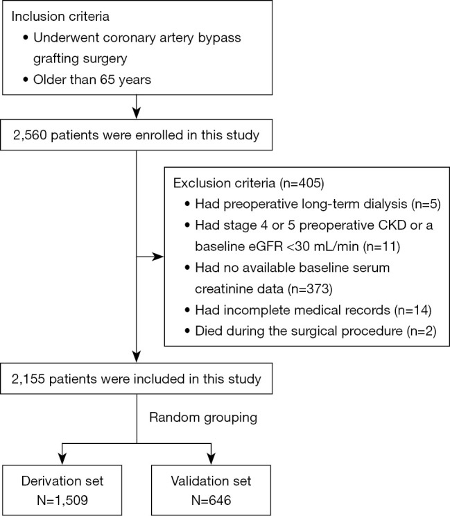
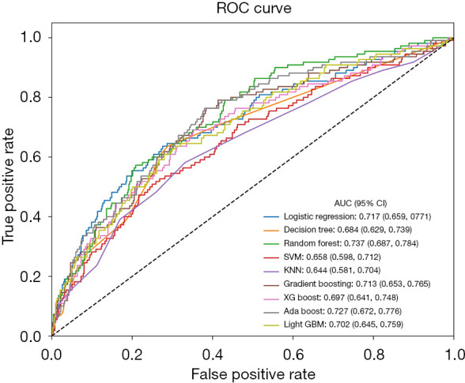
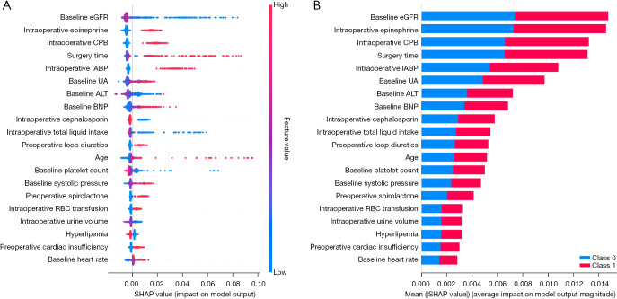
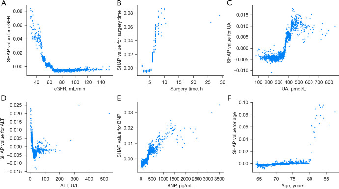

# Machine learning-based model for the prediction of acute kidney injury following coronary artery bypass graft surgery in elderly Chinese patients
基于机器学习的冠状动脉旁路移植术后急性肾损伤预测模型

## Abstract  摘要
### Background  背景
Acute kidney injury (AKI) is a significant and prevalent complication of coronary artery bypass graft (CABG) surgery. Advanced age is an independent predictor of AKI; however, the existing research on AKI in elderly patients after CABG is limited. This study sought to employ machine-learning techniques to predict patients at high risk of developing AKI following CABG, using preoperative and intraoperative variables.

急性肾损伤（阿基）是冠状动脉旁路移植术（CABG）手术的一种重要且常见的并发症。高龄是阿基的独立预测因素;然而，现有关于高龄患者 CABG 后阿基的研究有限。这项研究试图利用机器学习技术，使用术前和术中变量来预测冠状动脉旁路移植术后发生阿基的高风险患者。

### Methods  方法
Patients were retrospectively enrolled in this study between January 2019 and December 2020. The following nine machine-learning algorithms were used to predict postoperative AKI events: 
- logistic regression (LR), 
- simple decision tree (DT), 
- random forest (RF), 
- support vector machine (SVM), 
- extreme gradient boosting (XGBoost), 
- adaptive boosting (AdaBoost), 
- gradient bosting, 
- light gradient boosting machine (lightGBM), and 
- K-nearest neighbor (KNN). 

SHapley Additive exPlanations (SHAP) values were employed to determine the contribution of each feature to the models and to assess feature importance. Receiver operating characteristic (ROC) curves were plotted, and the areas under the curves (AUCs) of the ROC curves were calculated to evaluate the predictive performance of the various machine-learning models for AKI.

患者于 2019 年 1 月至 2020 年 12 月期间回顾性入组本研究。以下 9 种机器学习算法用于预测术后阿基事件：
- 逻辑回归（LR）、
- 简单决策树（DT）、
- 随机森林（RF）、
- 支持向量机（SVM）、
- 极端梯度增强（XGBoost）、
- 自适应增强（AdaBoost）、
- 梯度增强、
- 轻梯度增强机（lightGBM）和 
- K-最近邻（KNN）。

采用 SHapley 加法解释（SHAP）值来确定每个特征对模型的贡献并评估特征重要性。绘制受试者工作特征（ROC）曲线，并计算 ROC 曲线的曲线下面积（AUC），以评估各种机器学习模型对阿基的预测性能。

### Results  结果
A total of 2,155 participants were included in the study. The RF model had the highest AUC [0.737, 95% confidence interval (CI): 0.687–0.784], while the KNN model had the lowest AUC (0.644, 95% CI: 0.581–0.704). Certain variables, including age, the estimated glomerular filtration rate (eGFR), uric acid (UA), alanine aminotransferase (ALT), and B-type natriuretic peptide (BNP) at the baseline, as well as surgery duration and the intraoperative use of an intra-aortic balloon pump (IABP), were identified as significant risk factors for postoperative AKI.

共有 2，155 名参与者参与了这项研究。RF 模型的 AUC 最高[0.737，95%置信区间（CI）：0.687 - 0.784]，而 KNN 模型的 AUC 最低（0.644，95% CI：0.581 - 0.704）。某些变量，包括年龄、基线时估计的肾小球滤过率（eGFR）、尿酸（UA）、丙氨酸氨基转移酶（ALT）和 B 型利钠肽（BNP），以及手术持续时间和术中主动脉内球囊反搏（IABP）的使用，被确定为术后 AKI 的重要风险因素。

### Conclusions  结论
Machine-learning models can effectively predict the risk of AKI in elderly patients after CABG surgery. Among all the machine-learning models examined, the RF model showed the best performance.

机器学习模型可以有效预测老年患者 CABG 手术后 AKI 的风险。在所有机器学习模型中，RF 模型表现最好。

### Keywords: Coronary artery bypass graft (CABG), acute kidney injury (AKI), machine-learning, model, prediction

关键词：冠状动脉旁路移植术（CABG），急性肾损伤（AKI），机器学习，模型，预测

> Highlight box.  突出显示框。
> Key findings  主要结论
> • Prediction models for assessing the risk of acute kidney injury (AKI) after coronary artery bypass graft (CABG) were developed using nine machine-learning algorithms. Among these algorithms, the random forest model showed the best predictive ability in elderly patients. It had an area under the curve of the receiver operating characteristic curve of 0.737, and a 95% confidence interval of 0.687–0.784.
> ·使用 9 种机器学习算法开发了用于评估冠状动脉旁路移植术（CABG）后急性肾损伤（阿基）风险的预测模型。在这些算法中，随机森林模型在老年患者中表现出最好的预测能力。其受试者工作特征曲线下面积为 0.737，95%置信区间为 0.687-0.784。

> What is known, and what is new?
> 什么是已知的，什么是新的？
> • AKI after CABG is a common and critical complication with high mortality rates. Previous studies have identified risk factors for AKI after CABG, including body mass index, hypertension, cardiopulmonary bypass (CPB) duration, and postoperative low cardiac output syndrome.
> ·冠状动脉旁路移植术后的阿基是一种常见且严重的并发症，死亡率很高。先前的研究已经确定了 CABG 后阿基的风险因素，包括体重指数、高血压、心肺转流（CPB）持续时间和术后低心输出量综合征。

> • The risk factors identified in this study differed to those identified in previous research, showing the complexity of factors affecting AKI after CABG. Unlike previous studies in which various models showed superiority in different scenarios, in this study, the RF model had the optimal predictive efficacy.
> ·本研究中确定的风险因素与先前研究中确定的风险因素不同，显示了影响 CABG 后阿基的因素的复杂性。与以往的研究不同，在不同的情况下，各种模型显示出优越性，在这项研究中，RF 模型具有最佳的预测功效。

> What is the implication, and what should change now?
> 这意味着什么？现在应该改变什么？
> • This RF model showed good predictive performance and could be helpful in the early detection of elderly Chinese patients at high risk of AKI post-CABG surgery. Clinicians could use this model to enhance intraoperative and postoperative monitoring, reduce the use of nephrotoxic drugs, and implement early intervention strategies to decrease the incidence of AKI and postoperative mortality. Future prospective research needs to be conducted to further validate the effectiveness of the model in clinical settings.
> ·该 RF 模型显示出良好的预测性能，有助于早期检测 CABG 术后阿基高风险的中国老年患者。临床医生可以利用该模型加强术中和术后监测，减少肾毒性药物的使用，并实施早期干预策略，以降低阿基的发生率和术后死亡率。未来的前瞻性研究需要进行，以进一步验证该模型在临床环境中的有效性。

## Introduction  介绍
With the aging global population, the incidence of coronary artery disease (CAD) continues to increase (1). Coronary artery bypass graft (CABG) significantly reduces mortality in CAD patients (2). However, acute kidney injury (AKI), which is characterized by rapid renal function decline post-surgery, is a critical complication of CABG (3,4), and occurs in up to 38% of CABG patients, 3% of whom require dialysis (5). Moreover, one-fifth of AKI patients progress to chronic kidney disease (CKD) within 90 days; the 90-day mortality rate can be as high as 43.5% and long-term mortality rate ranges from 11.8% to 29.8% (6,7).

随着全球人口老龄化，冠状动脉疾病（CAD）的发病率持续增加（ 1 ）。冠状动脉旁路移植术（CABG）显著降低了 CAD 患者的死亡率（ 2 ）。然而，急性肾损伤（阿基），其特征在于术后肾功能快速下降，是 CABG 的严重并发症（ 3 ， 4 ），并且发生在高达 38%的 CABG 患者中，其中 3%需要透析（ 5 ）。此外，五分之一的阿基患者在 90 天内进展为慢性肾病（CKD）; 90 天死亡率可高达 43.5%，长期死亡率范围为 11.8%至 29.8%（ 6 ， 7 ）。

Age is a significant risk factor for AKI following CABG, such that elderly patients face a higher risk due to decreased renal function. However, current research on AKI in elderly CABG patients remains limited. These patients often experience extended hospital stays, greater treatment challenges, and financial burdens, as well as an increased incidence of dialysis and reduced postoperative survival rates (7). Thus, it is of great clinical significance to establish a risk prediction model for postoperative AKI and identify elderly high-risk patients.

年龄是 CABG 后阿基的重要风险因素，老年患者因肾功能下降而面临更高风险。然而，目前关于老年 CABG 患者阿基的研究仍然有限。这些患者通常会经历延长的住院时间、更大的治疗挑战和经济负担，以及透析发生率增加和术后生存率降低（ 7 ）。因此，建立术后阿基的风险预测模型，识别老年高危患者具有重要的临床意义。

This study sought to retrospectively analyze the data of elderly patients undergoing CABG at Beijing Anzhen Hospital, and use nine machine-learning models to identify high-risk patients for AKI based on preoperative and intraoperative variables. The study will facilitate enhanced intraoperative and postoperative monitoring, and provide robust support for optimizing the treatment strategies of elderly patients at high risk of AKI. We present this article in accordance with the TRIPOD reporting checklist (available at https://jtd.amegroups.com/article/view/10.21037/jtd-2025-264/rc).

本研究旨在回顾性分析在北京安贞医院接受 CABG 的老年患者的数据，并使用 9 种机器学习模型，根据术前和术中变量识别阿基的高风险患者。该研究将有助于加强术中和术后监测，并为优化阿基高风险老年患者的治疗策略提供强有力的支持。我们根据 TRIPOD 报告清单（可在 https://jtd.amegroups.com/article/view/10.21037/jtd-2025-264/rc 获得）提交本文。

## Methods  方法
### Study population  研究人群
Patients admitted to the Beijing Anzhen Hospital from January 2019 and December 2020 were enrolled in this retrospective study. 

To be eligible for inclusion in the study, the patients had to meet the following inclusion criteria: 
- be aged 65 years or older; and 
- have undergone isolated CABG surgery without additional procedures. 

Patients were excluded from the study if they met any of the following exclusion criteria: 
- had preoperative long-term dialysis; 
- had a history of kidney transplantation; 
- had stage 4 or 5 preoperative CKD; 
- had a baseline estimated glomerular filtration rate (eGFR) <30 mL/min; 
- had a preoperative diagnosis of AKI; 
- died during the surgical procedure; 
- had no available baseline serum creatinine (SCr) data; 
- had incomplete medical records; and/or 
- had postoperative hospitalization lasting more than 90 days. 

The study was conducted in accordance with the Declaration of Helsinki and its subsequent amendments. This study protocol was approved by the Ethics Committee of Beijing Anzhen Hospital, Capital Medical University (No. 2021-069), and patient privacy was maintained throughout the study. All the patients signed an informed consent form prior to recruitment.

本回顾性研究入组了 2019 年 1 月和 2020 年 12 月在北京安贞医院住院的患者。

为了有资格入选本研究，患者必须符合以下入选标准：
- 年龄 65 岁或以上;并且
- 接受了单独的 CABG 手术，没有额外的手术。

如果患者符合以下任何排除标准，则将其从研究中排除：
- 术前长期透析;有肾移植史;
- 术前 CKD 为 4 期或 5 期;
- 基线估计肾小球滤过率（eGFR）<30 mL/min;
- 术前诊断为阿基;
- 手术过程中死亡;
- 没有可用的基线血清肌酐（SCr）数据;
- 病历不完整;和/或
- 术后住院时间超过90天。

本研究按照赫尔辛基宣言及其后续修订案进行。 本研究方案已获得首都医科大学北京安贞医院伦理委员会批准（编号：2021-069），整个研究过程中保护患者隐私。所有患者在招募前均签署了知情同意书。

### Definition of postoperative AKI after CABG    CABG 术后阿基的定义
Postoperative AKI after CABG was defined according to the Kidney Disease Improvement Global Outcomes criteria (8). 

In general, postoperative AKI was characterized by 
- either a SCr increase of at least 50% from the baseline within 7 days of the surgery, 
- or a SCr increase of 26.5 µmol/L within 48 hours of the surgery. 

Under the AKI severity classification, 
- stage 1 was defined as a SCr level 1.5–1.9 times that of the baseline value, or an increase ≥26.5 µmol/L; 
- stage 2 was defined as a SCr level 2.0–2.9 times that of the baseline; and 
- stage 3 was defined as a SCr level ≥3.0 times that of the baseline, or ≥353.6 µmol/L, or the initiation of renal replacement therapy. 

Due to the unavailability of detailed perioperative urine output data, urine output was not considered in the assessment of renal function. 
Baseline SCr was measured within 7 days before the surgical procedure.

根据肾脏疾病改善全球结局标准（ 8 ）定义 CABG 后的术后阿基。

一般而言，术后阿基的特征为
- 手术后 7 天内 SCr 较基线增加至少 50%，
- 或手术后 48 小时内 SCr 增加 26.5 µmol/L。

根据阿基严重程度分类，
- 1 期定义为 SCr 水平为基线值的 1.5-1.9 倍，或升高≥26.5 µmol/L; 
- 2 期定义为 SCr 水平为基线值的 2.0-2.9 倍; 
- 3 期定义为 SCr 水平≥基线的 3.0 倍，或≥353.6 µmol/L，或开始肾脏替代治疗。

由于无法获得详细的围手术期尿量数据，因此在肾功能评估中未考虑尿量。
在手术前 7 天内测量基线 SCr。

### Statistical analysis  统计分析
All the statistical analyses were conducted using Python (version 3.5, http://www.python.org). 
To enhance the performance of the prediction models, the following nine distinct supervised machine-learning algorithms for model development and evaluation were employed: 
- logistic regression (LR), which estimates probabilities by maximizing the log-likelihood; 
- simple decision tree (DT), which performs categorical prediction based on tree-structured features; 
- random forest (RF), which improves generalization through ensemble learning; 
- support vector machine (SVM), which maximizes class separation margins; 
- extreme gradient boosting (XGBoost) and gradient boosting, which progressively refine predictions through boosting techniques; 
- light gradient boosting machine (lightGBM), which is an efficient and scalable gradient boosting implementation; 
- K-nearest neighbor (KNN), which makes predictions by neighborhood voting; and 
- adaptive boosting (AdaBoost), which iteratively focuses on misclassified instances and combines weak classifiers into a strong one. 

These machine-learning algorithms allowed us to develop and evaluate various predictive models to determine the model with the most efficient predictive performance.

所有统计分析均使用 Python（版本 3.5， http://www.python.org ）进行。 
为了提高预测模型的性能，采用了以下九种不同的监督机器学习算法进行模型开发和评估：
- 逻辑回归（LR），通过最大化对数似然来估计概率;
- 简单决策树（DT），根据树结构特征进行分类预测;
- 随机森林（RF），通过集成学习提高泛化能力;
- 支持向量机（SVM），最大化分类间隔;
- 极端梯度提升（XGBoost）和梯度提升，通过提升技术逐步完善预测;
- 轻型梯度提升机（lightGBM），这是一种高效且可扩展的梯度增强实现; 
- K-最近邻（KNN），通过邻域投票进行预测;和
- 自适应提升（AdaBoost），它迭代地关注错误分类的实例，并将弱分类器组合成强分类器。 

这些机器学习算法使我们能够开发和评估各种预测模型，以确定具有最有效预测性能的模型。

The entire dataset was randomly divided, such that 70% of the dataset was allocated to the derivation set, and 30% of the dataset was allocated to the validation set. For variables, missing values were replaced using the mean value. Variables with over 20% missing data were excluded from the subsequent analysis, as a large amount of missing data can introduce bias and affect the reliability of an analysis. The continuous variables were normalized when included in the models to enable variables with different units of measurement to be compared and analyzed equally.

对整个数据集进行随机划分，将70%的数据集分配给推导集，将30%的数据集分配给验证集。对于变量，使用平均值替换缺失值。缺失数据超过20%的变量将从后续分析中排除，因为大量缺失数据可能会引入偏倚并影响分析的可靠性。当连续变量被纳入模型时，将其归一化，以使具有不同测量单位的变量能够进行同等的比较和分析。

During the model training and optimization, the five-fold cross-validation technique was used to determine the optimal parameters for each model, effectively minimizing the risk of overfitting. SHapley Additive exPlanations (SHAP) values were applied for feature importance ranking. SHAP, which is grounded in game theory, offers insights into how individual features influence the predictions of machine-learning models. The SHAP values facilitated our understanding of how each feature contributed to individual predictions made by the model and was also used to evaluate the importance of features.

在模型训练和优化过程中，使用五重交叉验证技术来确定每个模型的最佳参数，有效地降低了过拟合的风险。SHapley 加法解释（SHAP）值被应用于特征重要性排序。SHAP 以博弈论为基础，提供了对个体特征如何影响机器学习模型预测的见解。SHAP 值有助于我们理解每个特征如何对模型做出的单个预测做出贡献，并且还用于评估特征的重要性。

To assess the predictive performance and accuracy of different machine-learning models, we plotted receiver operating characteristic (ROC) curves and calculated and compared the areas under the curves (AUCs) of the ROCs to analyze the ability of the various machine-learning models to predict AKI risk. Ultimately, we evaluated the performance of each machine-learning model by computing and comparing the following metrics: accuracy, precision, recall, F1-score, and AUC.

为了评估不同机器学习模型的预测性能和准确性，我们绘制了受试者工作特征（ROC）曲线，并计算和比较 ROC 的曲线下面积（AUC），以分析各种机器学习模型预测阿基风险的能力。最后，我们通过计算和比较以下指标来评估每个机器学习模型的性能：准确度，精确度，召回率，F1 分数和 AUC。

## Results  结果
### Patient characteristics  患者特征
The study included 2,155 participants, who had a median age of 69.2 years. 

The patients were further categorized based on the postoperative AKI definition. 
Of the patients, 
- 294 (13.6%) had stage 1 AKI, 
- 52 (2.4%) had stage 2 AKI, and 
- 19 (0.9%) had stage 3 AKI. 

A comprehensive summary of the baseline demographic and clinical characteristics of the patients is provided in Table 1. Males accounted for 68.4% of the cohort. Among the comorbidities, hypertension was the most prevalent comorbidity, affecting 65.7% of the patients, followed closely by hyperlipidemia (54.8%) and type 2 diabetes mellitus, which was present in 37.7% of the patients. The patients were randomly stratified into two separate datasets: the derivation dataset, which comprised 1,509 patients, and the validation dataset, which comprised 646 patients. The process of cohort selection is depicted in Figure 1.
该研究包括2，155名参与者，他们的中位年龄为69.2岁。

根据术后阿基定义对患者进行进一步分类。
在这些患者中，
- 294例（13.6%）患有1期阿基，
- 52例（2.4%）患有2期阿基，
- 19例（0.9%）患有3期阿基。

患者基线人口统计学和临床特征的综合总结见 Table 1 。男性占同期人群的68.4%。在合并症中，高血压是最常见的合并症，影响65.7%的患者，其次是高脂血症（54.8%）和2型糖尿病（37.7%的患者）。患者被随机分层到两个独立的数据集：推导数据集（包括1，509名患者）和验证数据集（包括646名患者）。队列选择过程如 Figure 1 所示。

> Table 1. Baseline demographic and clinical characteristics of the included patients.
> 表1.入选患者的基线人口统计学和临床特征。

| **Variables**                                 | **Values (N=2,155)** | **说明**            |
| --------------------------------------------- | -------------------- | ----------------- |
| **Demographics**                              |                      | 人口统计    |
| Age (years)†                                  | 69.2 (6.0)           | 年龄（岁）†             |
| Male sex                                      | 1,473 (68.4)         | 男性                |
| Smoker                                        | 436 (20.2)           | 吸烟者               |
| Drinker                                       | 343 (15.9)           | 饮酒者               |
| Body mass index (kg/m²)                       | 25.2 (4.1)           | 体重指数（kg/m²）       |
| **Complication**                              |                      | 并发症      |
| Hypertension                                  | 1,416 (65.7)         | 高血压               |
| Diabetes mellitus                             | 812 (37.7)           | 糖尿病               |
| Hyperlipemia                                  | 1,181 (54.8)         | 高血脂               |
| Prior MI                                      | 307 (14.2)           | 既往 MI             |
| Prior cerebral infarction                     | 250 (11.6)           | 既往脑梗死             |
| Prior PCI                                     | 230 (10.7)           | 既往 PCI            |
| Prior CABG                                    | 37 (1.7)             | 既往 CABG           |
| **NYHA functional class**                     |                      | NYHA 心功能分级  |
| Class III/IV                                  | 431 (20.0)           | III/IV 级          |
| **Vital signs at admission†**                 |                      | 入院时的生命体征 †    |
| Heart rate (bpm)                              | 76 (12.0)            | 心率（bpm）           |
| Systolic blood pressure (mmHg)                | 130.0 (18.0)         | 收缩压（mmHg）         |
| Diastolic blood pressure (mmHg)               | 76.0 (12.0)          | 舒张压（mmHg）         |
| Mean arterial pressure (mmHg)                 | 94.7 (11.7)          | 平均动脉压（mmHg）       |
| **Laboratory examinations at admission†**     |                      | 入院时的实验室检查 †   |
| eGFR (mL/min)                                 | 77.4 (27.6)          | eGFR（mL/min）      |
| Serum creatinine (μmol/L)                     | 72.1 (22.0)          | 血清肌酐（μmol/L）      |
| UA (μmol/L)                                   | 317.9 (123.3)        | 尿酸（μmol/L）        |
| BNP (pg/mL)                                   | 164.0 (250.0)        | BNP（pg/mL）        |
| PLT count (×10⁹/L)                            | 206 (81.0)           | 血小板计数（×10⁹/L）     |
| Low-density lipoprotein cholesterol (mmol/L)  | 2.22 (1.00)          | 低密度脂蛋白胆固醇（mmol/L） |
| Triglycerides (mmol/L)                        | 1.31 (0.80)          | 甘油三酯（mmol/L）      |
| Total cholesterol (mmol/L)                    | 3.79 (1.20)          | 总胆固醇（mmol/L）      |
| High-density lipoprotein cholesterol (mmol/L) | 1.00 (0.30)          | 高密度脂蛋白胆固醇（mmol/L） |
| ALT (U/L)                                     | 20.0 (15.0)          | ALT（单位/升）         |
| AST (U/L)                                     | 21.0 (11.0)          | AST（U/L）          |
| **Preoperative concomitant medication**       |                      | 术前合并用药  |
| Aspirin                                       | 566 (26.3)           | 阿司匹林              |
| ACE inhibitor/ARB                             | 347 (16.1)           | ACE 抑制剂/ARB       |
| Beta blocker                                  | 1,651 (76.6)         | β受体阻滞剂            |
| Statin therapy                                | 402 (18.7)           | 他汀类药物治疗           |
| PPI                                           | 533 (24.7)           | PPI               |
| Loop diuretic                                 | 432 (20.0)           | 袢利尿剂              |
| Thiazide                                      | 83 (3.9)             | 噻嗪类               |
| Spirolactone                                  | 232 (10.8)           | 螺内酯               |
| Contrast agent                                | 549 (25.5)           | 造影剂               |
| Metformin                                     | 219 (10.2)           | 二甲双胍              |
| **Intraoperative**                            |                      | 术中          |
| RBC transfusion                               | 502 (23.3)           | RBC 输血            |
| PLT transfusion                               | 36 (1.7)             | 血小板输注             |
| Plasma transfusion                            | 194 (9.0)            | 血浆输注              |
| Use of IABP                                   | 161 (7.5)            | 使用 IABP           |
| Use of ECMO                                   | 7 (0.3)              | 使用 ECMO           |
| Use of CPB                                    | 359 (16.7)           | 使用 CPB            |
| Use of epinephrine                            | 501 (23.2)           | 使用肾上腺素            |
| Use of norepinephrine                         | 1,216 (56.4)         | 使用去甲肾上腺素          |
| Use of isoprenaline                           | 126 (5.8)            | 使用异丙肾上腺素          |
| Use of dopamine                               | 1,836 (85.2)         | 使用多巴胺             |
| Use of cephalosporin                          | 1,781 (82.6)         | 使用头孢菌素            |
| **Operation†**                                |                      |  操作 †         |
| Operation time (h)                            | 4 (1.0)              | 运行时间（h）           |
| Urine output (×100 mL)                        | 12 (12.0)            | 尿量（×100 mL）       |
| Bleeding volume (×100 mL)                     | 8 (4.0)              | 出血量（×100 mL）      |
| Total liquid intake (×100 mL)                 | 25.0 (9.5)           | 总液体摄入量（×100 mL）   |
| Washed RBC transfusion volume (×100 mL)       | 2.4 (4.0)            | 洗涤红细胞输注量（×100 mL） |

> †, the continuous data are expressed as the median (interquartile range) and were calculated using the Mann-Whitney U-test. 
> The categorical data are expressed as the count (percentage), and were calculated using the Chi-squared test. 
> 
> - ACE, angiotensin-converting enzyme; 
> - AKI, acute kidney injury; 
> - ALT, alanine aminotransferase; 
> - ARB, angiotensin receptor blocker; 
> - AST, aspartate aminotransferase; 
> - BNP, B-type natriuretic peptide; 
> - CABG, coronary artery bypass graft; 
> - CPB, cardiopulmonary bypass; 
> - ECMO, extracorporeal membrane oxygenation; 
> - eGFR, estimated glomerular filtration rate; 
> - IABP, intra-aortic balloon pump; 
> - LVED, left ventricular end-diastolic diameter; 
> - MI, myocardial infarction; 
> - NYHA, New York Heart Association; 
> - PCI, percutaneous coronary intervention; 
> - PLT, platelet; 
> - PPI, proton pump inhibitor; 
> - RBC, red blood cell; 
> - UA, uric acid.

> 连续数据表示为中位数（四分位距），并使用 Mann-WhitneyU 检验进行计算。
> 分类数据表示为计数（百分比），并使用卡方检验进行计算。
> 
> - ACE，血管紧张素转换酶;
> - AKI，急性肾损伤; 
> - ALT，丙氨酸氨基转移酶; 
> - ARB，血管紧张素受体阻滞剂; 
> - AST，天冬氨酸氨基转移酶; 
> - BNP，B 型利钠肽; 
> - CABG，冠状动脉旁路移植术; 
> - CPB，心肺转流术; 
> - ECMO，体外膜肺氧合; 
> - eGFR，估计肾小球滤过率; 
> - IABP，主动脉内球囊反搏; 
> - LVED，左心室舒张末期内径; 
> - MI，心肌梗死; 
> - NYHA，纽约心脏协会; 
> - PCI，经皮冠状动脉介入治疗; 
> - PLT，血小板; 
> - PPI，质子泵抑制剂; 
> - RBC，红细胞; 
> - UA，尿酸。

> Figure 1.  图1.

> Flowchart of cohort selection. CKD, chronic kidney disease; eGFR, estimated glomerular filtration rate.
> 队列选择流程图。
> - CKD，慢性肾脏疾病; 
> - eGFR，肾小球滤过率估计值。

### Establishment and validation of machine-learning models    机器学习模型的建立和验证
To predict the postoperative AKI events, the following machine-learning methods were used with qualified variables as the input variables: LR, DT, RF, SVM, XGboost, AdaBoost, gradient boosting, lightGBM, and KNN. Table 2 and Figure 2 present the performance of the nine machine-learning models employed in this study, providing a clear comparison of their predictive capabilities. The RF model had the highest AUC [0.737, 95% confidence interval (CI): 0.687–0.784], while the KNN model had the lowest AUC (0.644, 95% CI: 0.581–0.704).

为了预测术后阿基事件，使用以下机器学习方法，合格变量作为输入变量：LR、DT、RF、SVM、XGboost、AdaBoost、梯度增强、lightGBM 和 KNN。

Table 2 和 Figure 2 展示了本研究中使用的九种机器学习模型的性能，并对它们的预测能力进行了清晰的比较。

- RF 模型的 AUC 最高[0.737，95%置信区间（CI）：0.687-0.784]，而 
- KNN 模型的 AUC 最低（0.644，95% CI：0.581-0.704）。

> Table 2. Comparison of the results from nine acute kidney injury models for coronary artery bypass graft surgery.
表2.九种急性肾损伤模型用于冠状动脉旁路移植术结果的比较。

| **Model**           | **Accuracy** | **Precision** | **Recall** | **F1-score** | **AUC** |
| ------------------- | ------------ | ------------- | ---------- | ------------ | ------- |
| **Random forest**   | 0.830        | 0.000         | 0.000      | 0.000        |**0.737**|
| AdaBoost            | 0.833        | **1.000**     | **0.018**  | 0.036        | 0.727   |
| Logistic regression | 0.836        | 0.591         | **0.118**  | **0.197**    | 0.717   |
| Gradient boosting   | **0.838**    | 0.727         | 0.073      | 0.132        | 0.713   |
| LightGBM            | 0.832        | 0.600         | 0.027      | 0.052        | 0.702   |
| XGBoost             | 0.832        | 0.556         | 0.046      | 0.084        | 0.697   |
| Decision tree       | 0.821        | 0.406         | **0.118**  | 0.183        | 0.684   |
| SVM                 | 0.830        | 0.000         | 0.000      | 0.000        | 0.658   |
| KNN                 | 0.830        | 0.000         | 0.000      | 0.000        | 0.644   |

> AdaBoost, adaptive boosting; 
> AUC, area under the curve; 
> KNN, K-nearest neighbors; 
> LightGBM, light gradient boosting machine; 
> SVM, support vector machine; 
> XGBoost, extreme gradient boosting.

> AdaBoost，自适应升压; 
> AUC，曲线下面积; 
> KNN，K-最近邻; 
> LightGBM，光梯度增强机; 
> SVM，支持向量机; 
> XGBoost，极端梯度增强。

---

上述表格展示了九种不同机器学习模型在某个分类任务中的性能评估指标。以下是各列指标的含义以及对表格内容的解读：

### **表格列说明**
1. **Model（模型名称）**  
   列出了九种不同的机器学习模型，包括随机森林（Random forest）、AdaBoost、逻辑回归（Logistic regression）、梯度提升（Gradient boosting）、LightGBM、XGBoost、决策树（Decision tree）、支持向量机（SVM）和最近邻（KNN）。

2. **Accuracy（精度）**  
   表示模型正确分类的样本比例，是评估模型整体性能的常用指标。取值范围为 0 到 1，值越高表示模型整体分类效果越好。

3. **Precision（精准率）**  
   表示被预测为正类的样本中，实际为正类的比例。计算公式为：  
   
   ${Precision} = \frac{\text{TP}}{\text{TP} + \text{FP}}$
     
   其中，TP 是真正例（True Positive），FP 是假正例（False Positive）。精准率越高，表示模型预测正类的可靠性越高。

4. **Recall（召回率）**  
   表示所有实际正类中，被正确预测为正类的比例。计算公式为：  
   
   ${Recall} = \frac{\text{TP}}{\text{TP} + \text{FN}}$
     
   其中，FN 是假负例（False Negative）。召回率越高，表示模型对正类的覆盖能力越强。

5. **F1-score（F1 分数）**  
   是精准率和召回率的调和平均值，用于综合评估模型的性能。计算公式为：  
   
   ${F1-score} = 2 \times \frac{\text{Precision} \times \text{Recall}}{\text{Precision} + \text{Recall}}$
     
   F1 分数取值范围为 0 到 1，值越高表示模型在精准率和召回率之间平衡得越好。

6. **AUC（曲线下面积）**  
   表示接收者操作特征曲线（ROC Curve）下的面积，用于衡量模型对正负类的区分能力。AUC 的取值范围为 0 到 1，值越高表示模型的分类性能越好。

### **表格解读**
1. **整体性能（Accuracy）**  
   - 梯度提升（Gradient boosting）的精度最高，为 0.838，表示其整体分类效果最好。
   - 决策树（Decision tree）的精度最低，为 0.821，整体分类效果相对较弱。

2. **精准率（Precision）**  
   - AdaBoost 的精准率最高，为 1.000，但其召回率极低（0.018），说明 AdaBoost 在预测正类时非常谨慎，但漏掉了大部分实际正类。
   - SVM 和 KNN 的精准率均为 0.000，说明这两个模型在预测正类时表现不佳。

3. **召回率（Recall）**  
   - 梯度提升（Gradient boosting）的召回率最高，为 0.073，但仍较低。这表明所有模型在召回率方面表现普遍较差，可能需要进一步优化以提高对正类的覆盖能力。

4. **F1 分数（F1-score）**  
   - 梯度提升（Gradient boosting）的 F1 分数最高，为 0.132，但整体仍较低。这表明虽然梯度提升在精准率和召回率的平衡上表现相对较好，但整体性能仍有提升空间。
   - SVM 和 KNN 的 F1 分数为 0.000，说明这两个模型在精准率和召回率方面均表现不佳。

5. **AUC（曲线下面积）**  
   - 随机森林（Random forest）的 AUC 最高，为 0.737，表明其在区分正负类方面表现最好。
   - KNN 的 AUC 最低，为 0.644，表明其分类能力相对较弱。

### **总结**
- **梯度提升（Gradient boosting）**在精度（Accuracy）和 F1 分数（F1-score）方面表现最好，但召回率（Recall）较低，说明其对正类的覆盖能力有待提高。
- **随机森林（Random forest）**在 AUC 方面表现最好，但其精准率（Precision）和召回率（Recall）较低。
- **AdaBoost**的精准率最高，但召回率极低，说明其对正类的预测过于保守。
- **SVM 和 KNN**在精准率、召回率和 F1 分数方面表现较差，可能不适合当前任务。
- **逻辑回归（Logistic regression）**和**XGBoost**在各项指标上表现较为均衡，但整体性能仍有提升空间。

总体来看，这些模型在召回率方面表现普遍较差，建议进一步优化模型或调整数据集以提高对正类的覆盖能力。

---

>Figure 2.  图2.

>ROC curves for acute kidney injury using the machine-learning prediction models. 
> - AdaBoost, adaptive boosting; 
> - AUC, area under the curve; 
> - KNN, K-nearest neighbors; 
> - LightGBM, light gradient boosting machine; 
> - ROC, receiver operating characteristic; 
> - SVM, support vector machine; 
> - XGBoost, extreme gradient boosting.

>使用机器学习预测模型的急性肾损伤的 ROC 曲线。
> - AdaBoost，自适应升压; 
> - AUC，曲线下面积; 
> - KNN，K-最近邻; 
> - LightGBM，光梯度增强机; 
> - ROC，受试者工作特性; 
> - SVM，支持向量机; 
> - XGBoost，极端梯度增强。

To identify the features that had the greatest effect on the prediction model, a SHAP summary diagram of the RF model was plotted (Figure 3A), and the top 20 features relevant to the prediction model were identified. This plot illustrates the relationship between the feature values and their SHAP values in the training dataset, where a higher SHAP value for a feature indicates a greater likelihood of AKI occurrence according to the predictive model.

为了识别对预测模型影响最大的特征，绘制了 RF 模型的 SHAP 汇总图（ Figure 3A ），并识别了与预测模型相关的前 20 个特征。该图说明了训练数据集中特征值与其 SHAP 值之间的关系，其中根据预测模型，特征的较高 SHAP 值指示阿基发生的较大可能性。

> Figure 3.  图3.

> SHapley Additive exPlanations model for estimating the top 20 important variables (A) and variable ranking (B) with the forest algorithm. 
> Low values (blue) have a negative effect on the prediction, and high values (red) have a positive effect on the prediction (A). 
> Ranked features from top down by their mean absolute SHapley Additive exPlanations values (B). 
> 
> - AKI, acute kidney injury; 
> - ALT, alanine aminotransferase; 
> - BNP, B-type natriuretic peptide; 
> - Class 0, non-AKI; 
> - Class 1, AKI; 
> - CPB, cardiopulmonary bypass; 
> - eGFR, estimated glomerular filtration rate; 
> - IABP, intra-aortic balloon pump; 
> - RBC, red blood cell; 
> - SHAP, SHapley Additive exPlanations; 
> - UA, uric acid.

> SHapley 加法解释模型，用于估计前 20 个重要变量（A）和森林算法的变量排名（B）。低值（蓝色）对预测有负面影响，高值（红色）对预测有正面影响（A）。按特征的平均绝对 SHapley 加法解释值（B）从上到下排列特征。阿基，急性肾损伤; ALT，丙氨酸氨基转移酶; BNP，B 型利钠肽; 0 级，非 AKI; 1 级，阿基; CPB，心肺转流术; eGFR，估计肾小球滤过率; IABP，主动脉内球囊反搏; RBC，红细胞; SHAP，SHapley 加法解释; UA，尿酸。

Additionally, a SHAP dependence plot (Figure 3B) was used to gain insights into how individual features affect the output of the RF predictive model. In the SHAP dependence visualization, the vertical dimension (y-axis) represents the SHAP values of features, while the horizontal dimension (x-axis) represents the feature values. This shows how the significance of a particular feature fluctuates in accordance with its varying values across different scenarios. A SHAP value that exceeds zero for a specific feature indicates an elevated risk of AKI development. Figure 4 shows the effects of age, the eGFR, surgery time, uric acid (UA), alanine aminotransferase (ALT), and B-type natriuretic peptide (BNP) on SHAP values, and SHAP values represent their effect on AKI outcomes.

此外，使用 SHAP 依赖图（ Figure 3B ）深入了解单个特征如何影响 RF 预测模型的输出。在 SHAP 依赖可视化中，垂直维度（y 轴）表示特征的 SHAP 值，而水平维度（x 轴）表示特征值。这显示了特定特征的重要性如何根据其在不同场景中的不同值而波动。特定特征的 SHAP 值超过零表明发生阿基的风险升高。 Figure 4 显示了年龄、eGFR、手术时间、尿酸（UA）、丙氨酸氨基转移酶（ALT）和 B 型利钠肽（BNP）对 SHAP 值的影响，SHAP 值代表其对阿基结局的影响。

> Figure 4.  图4.

> SHapley Additive exPlanations dependency plot for the effect of variables on model output results, including 
> eGFR (A), 
> surgery time (B), 
> uric acid (C), 
> alanine aminotransferase (D), B
> -type natriuretic peptide (E) and 
> age (F). 
> 
> - ALT, alanine aminotransferase; 
> - BNP, B-type natriuretic peptide; 
> - eGFR, estimated glomerular filtration rate; 
> - SHAP, SHapley Additive exPlanations; 
> - UA, uric acid.

> 变量对模型输出结果影响的 SHapley 加性解释依赖性图，包括 
> eGFR（A）、
> 手术时间（B）、
> 尿酸（C）、
> 丙氨酸氨基转移酶（D）、
> B 型利钠肽（E）和
> 年龄（F）。
> 
> - ALT，丙氨酸氨基转移酶; 
> - BNP，B 型利钠肽; 
> - eGFR，估计的肾小球滤过率; 
> - SHAP，SHapley 加法解释; 
> - UA，尿酸。

## Discussion  讨论
This study sought to predict the risk of AKI in elderly patients after CABG surgery. Our risk prediction model can be used to estimate the likelihood of AKI after CABG, which could help clinicians to identify patients at high risk of AKI, and implement appropriate clinical prevention measures. Unlike many previous studies, we specifically focused on elderly patients (9,10). We tested nine machine-learning models to predict AKI risk in this population, and found that the RF model outperformed all the other models. To better understand the factors driving the predictions of the model, SHAP was used to interpret the importance of different variables in the model.

本研究旨在预测老年患者 CABG 手术后阿基的风险。我们的风险预测模型可用于估计 CABG 术后阿基的可能性，这可以帮助临床医生识别阿基的高风险患者，并实施适当的临床预防措施。与许多以前的研究不同，我们特别关注老年患者（ 9 ， 10 ）。我们测试了 9 种机器学习模型来预测这一人群的阿基风险，发现 RF 模型优于所有其他模型。为了更好地理解驱动模型预测的因素，SHAP 被用来解释模型中不同变量的重要性。

Due to remarkable advantages related to accuracy, intelligence, and sensitivity, there has been an increased adoption of machine-learning models for disease prediction in the medical field (9,11). A study conducted by Song et al. indicated that gradient boosting DT models showed superior performance in predicting the risk of AKI following off-pump CABG (12). Additionally, Wang et al. showed that the lightGBM model surpassed other models in terms of predictive performance (13). Conversely, Tseng et al. showed that, among the single models, the RF model showed the best performance, while among the ensemble models, the RF + XGboost combination model had the highest AUC value, which surpassed that of the single RF model (10).

由于与准确性、智能性和灵敏度相关的显著优势，在医学领域越来越多地采用机器学习模型进行疾病预测（ 9 、 11 ）。Song 等人进行的一项研究表明，梯度增强 DT 模型在预测非体外循环 CABG 后阿基风险方面表现出上级性能（ 12 ）。此外，Wang 等人表明，lightGBM 模型在预测性能方面优于其他模型（ 13 ）。相反，Tseng 等人表明，在单一模型中，RF 模型表现出最好的性能，而在集成模型中，RF + XGboost 组合模型的 AUC 值最高，超过了单一 RF 模型（ 10 ）。

However, the results of the present study were not entirely consistent with these findings. Our results revealed that the RF model exhibited optimal predictive efficacy. The RF model possesses significant advantages in processing extensive electronic medical record data, efficiently managing a large number of input variables, and adapting to different magnitudes of data. As an extension of traditional DT classifiers, the RF model reduces the limitations of DT, thereby enhancing its predictive accuracy and reliability (14).

然而，本研究的结果与这些发现并不完全一致。我们的研究结果表明，RF 模型表现出最佳的预测效果。RF 模型在处理大量电子病历数据、有效管理大量输入变量以及适应不同量级的数据方面具有显著优势。作为传统 DT 分类器的扩展，RF 模型减少了 DT 的限制，从而提高了其预测准确性和可靠性（ 14 ）。

The occurrence of AKI following cardiac surgery is multifactorial, encompassing a variety of mechanisms. These include acute glomerular necrosis, prolonged hospital stay, microembolism, neurohormonal activation, the presence of exogenous and endogenous toxins, metabolic disturbances, hemodynamic alterations, inflammatory responses, ischemia-reperfusion injury, oxidative stress, and the administration of red blood cell transfusions. These factors play a role in the development and progression of AKI after cardiac surgery (3,15-17).

心脏手术后阿基的发生是多因素的，包括各种机制。这些包括急性肾小球坏死、住院时间延长、微栓塞、神经激素激活、外源性和内源性毒素的存在、代谢紊乱、血流动力学改变、炎症反应、缺血再灌注损伤、氧化应激和红细胞输注。这些因素在心脏手术后阿基的发生和进展中发挥作用（ 3 、 15 - 17 ）。

Yue et al. reported that factors such as age, body mass index (BMI), hypertension, eGFR, cardiopulmonary bypass (CPB) duration, and postoperative low cardiac output syndrome are significant independent risk factors for AKI following CABG (18). In a study by Li et al., several factors such as advanced age, an elevated BMI, a decreased baseline eGFR, low ejection fraction, statin administration, red blood cell transfusions, adrenaline usage, the implementation of an intra-aortic balloon pump (IABP), the postoperative syndrome of low cardiac output, and the need for reoperation due to bleeding were independent predictors of AKI (19). Our findings showed some inconsistencies with the risk factors reported in previous studies (18,19). Notably, our study found that various factors contribute to the risk of AKI following surgery, including a low baseline eGFR, low PLT, advanced age, elevated levels of UA and BNP, prolonged surgical duration, and the use of an IABP. Further, the effect of preoperative and intraoperative medications on the incidence of postoperative AKI is significant and cannot be ignored. The preoperative administration of contrast agents or nephrotoxic drugs, such as diuretic and antibiotics, has been shown to potentially cause renal tubular obstruction, leading to subtle renal damage that may not be detectable through changes in eGFR (20).

Yue 等人报告称，年龄、体重指数（BMI）、高血压、eGFR、心肺转流（CPB）持续时间和术后低心输出量综合征等因素是 CABG 后阿基的重要独立风险因素（ 18 ）。在 Li et al. 一些因素，如高龄、BMI 升高、基线 eGFR 降低、射血分数低、他汀类药物给药、红细胞输注、肾上腺素使用、主动脉内球囊反搏（IABP）的实施、术后低心输出量综合征和因出血需要再次手术是阿基的独立预测因素（ 19 ）。我们的研究结果显示了与先前研究中报告的风险因素（ 18 ， 19 ）的一些不一致。 值得注意的是，我们的研究发现，各种因素导致手术后 AKI 的风险，包括基线 eGFR 低、PLT 低、高龄、UA 和 BNP 水平升高、手术持续时间延长和 IABP 的使用。此外，术前和术中用药对术后 AKI 发生率的影响显著，不容忽视。术前给予造影剂或肾毒性药物（如利尿剂和抗生素）已被证明可能导致肾小管梗阻，导致可能无法通过 eGFR 变化检测到的轻微肾损伤（ 20 ）。

The clinical significance of this study is that our model can predict the risk of postoperative AKI in elderly patients. Although preoperative risk factors cannot be completely avoided and a single treatment strategy may not suffice due to complex pathogenesis, effective preoperative prediction can be used to assess the risk of each elderly patient. Patients classified as low-risk would continue standard perioperative care regimen with routine monitoring. Moderate-risk patients should strengthen renal function monitoring, particularly to avoid the use of nephrotoxic drugs. High-risk cases would trigger multidisciplinary team consultations to develop individualized care plans. These plans would integrate preoperative surgical optimization, intraoperative renal protective strategies, and contingency plans for early postoperative renal replacement therapy, allowing for the earlier implementation of effective intervention strategies to reduce the incidence of AKI and postoperative mortality after CABG surgery.

本研究的临床意义在于，我们的模型可以预测老年患者术后阿基的风险。虽然术前风险因素不能完全避免，单一的治疗策略可能不够，由于复杂的发病机制，有效的术前预测可以用来评估每个老年患者的风险。归类为低风险的患者将继续接受标准的围手术期护理方案，并进行常规监测。中危患者应加强肾功能监测，特别是避免使用肾毒性药物。高风险病例将引发多学科团队协商，以制定个性化的护理计划。 这些计划将整合术前手术优化、术中肾脏保护策略和术后早期肾脏替代治疗的应急计划，以便尽早实施有效的干预策略，降低 CABG 术后阿基的发生率和术后死亡率。

This study had some limitations. First, this study was conducted as a single-center investigation, inherently limited by the demographic characteristics of patients, medical resources, and clinical practice patterns specific to our center. Consequently, the research findings may not be directly generalizable to other centers. Variability exists among patient populations across different centers in terms of genetic backgrounds, comorbidity profiles, and surgical protocols, which may lead to fluctuations in the model’s predictive performance when applied to diverse cohorts. To enhance the universality of our findings, subsequent studies will actively establish multi-center collaborations to incorporate broader patient datasets, re-evaluate the model’s validity and stability, and strengthen the general applicability of the model. Second, retrospective study designs inevitably carry risks of selection bias and information bias. In this study, despite implementing stringent inclusion and exclusion criteria for patient selection and meticulously verifying data to minimize information bias, these measures could not entirely eliminate the impact of residual biases. Therefore, we plan to conduct a prospective study to validate the models and findings from this research, enabling more precise evaluation of the associations between preoperative/intraoperative risk factors and postoperative AKI incidence. Third, this study only utilized an internal validation set for model evaluation without conducting external validation. We plan to actively seek appropriate external datasets for external validation. By comparing the model’s performance metrics across diverse datasets, we aim to further refine the model evaluation framework. Forth, our study included only available risk factors, omitting variables with more than 20% missing data or overlooked variables, which could have affected the predictive accuracy of the model. Finally, the predictive capability of the model was assessed using ROC values in both the derivation and validation sets. Future prospective research is required to determine whether the implementation of this predictive model can reduce the risk of AKI in clinical settings.

本研究存在一些局限性。
- 首先，本研究是作为单中心调查进行的，固有地受到患者的人口统计学特征、医疗资源和我们中心特有的临床实践模式的限制。因此，研究结果可能无法直接推广到其他中心。不同中心的患者人群在遗传背景、合并症特征和手术方案方面存在变异性，这可能导致模型在应用于不同队列时的预测性能波动。为了增强我们研究结果的普适性，后续研究将积极建立多中心合作，以纳入更广泛的患者数据集，重新评估模型的有效性和稳定性，并加强模型的普遍适用性。
- 其次，回顾性研究设计不可避免地存在选择偏倚和信息偏倚的风险。 在本研究中，尽管实施了严格的入选和排除标准来选择患者，并仔细验证数据以最大限度地减少信息偏倚，但这些措施无法完全消除残留偏倚的影响。因此，我们计划进行一项前瞻性研究，以验证本研究的模型和结果，从而更精确地评估术前/术中风险因素与术后阿基发生率之间的相关性。
- 第三，本研究仅使用内部验证集进行模型评估，而不进行外部验证。我们计划积极寻求适当的外部数据集进行外部验证。通过比较模型在不同数据集上的性能指标，我们的目标是进一步完善模型评估框架。 
- 第四，我们的研究只包括可用的风险因素，忽略了超过 20%的缺失数据或被忽略的变量，这可能会影响模型的预测准确性。
- 最后，使用推导集和验证集的 ROC 值评估模型的预测能力。未来的前瞻性研究需要确定这种预测模型的实施是否可以降低临床环境中阿基的风险。

## Conclusions  结论
This study sought to establish an optimal machine-learning model to predict AKI in elderly patients after CABG. This model has important implications for clinical practice and provides a new approach for improving the prognosis of these patients. Based on preoperative and intraoperative variables, nine machine-learning models were used to identify patients at high risk of AKI. Among all the models examined, the RF model had the best predictive performance. The RF model could assist clinicians to predict and reduce the occurrence of AKI following CABG.

本研究旨在建立一个最佳的机器学习模型来预测老年患者 CABG 后的阿基。该模型对临床实践具有重要意义，并为改善这些患者的预后提供了新的方法。基于术前和术中变量，使用 9 种机器学习模型来识别阿基高风险患者。在所有的模型中，RF 模型具有最好的预测性能。RF 模型可以帮助临床医生预测和减少 CABG 后阿基的发生。

