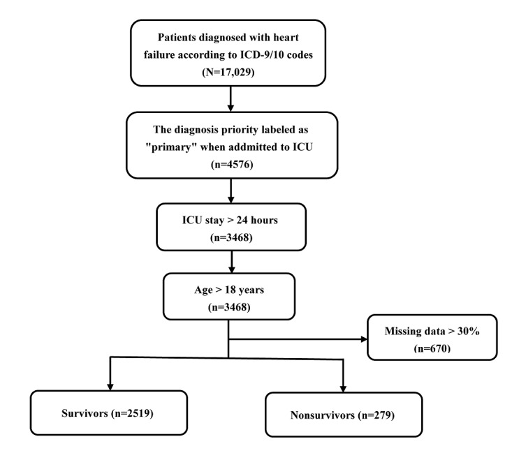
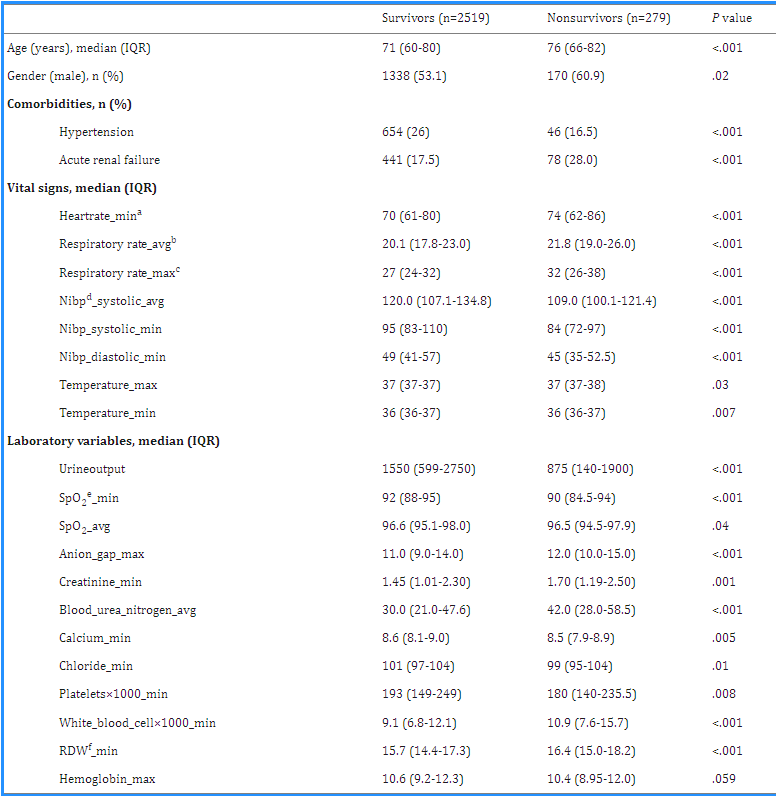
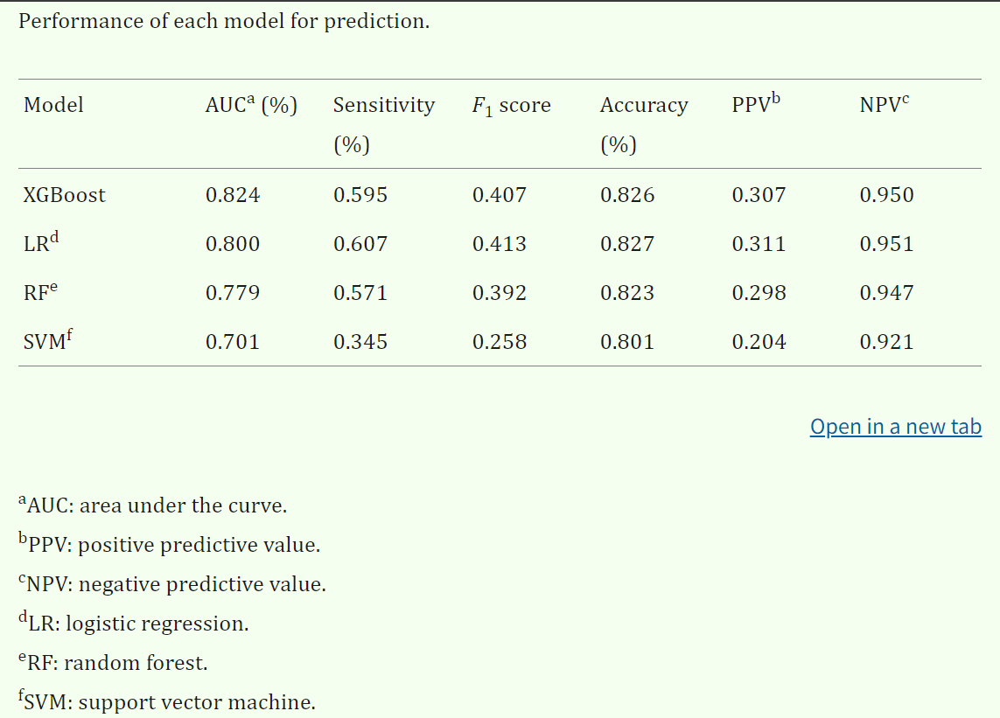
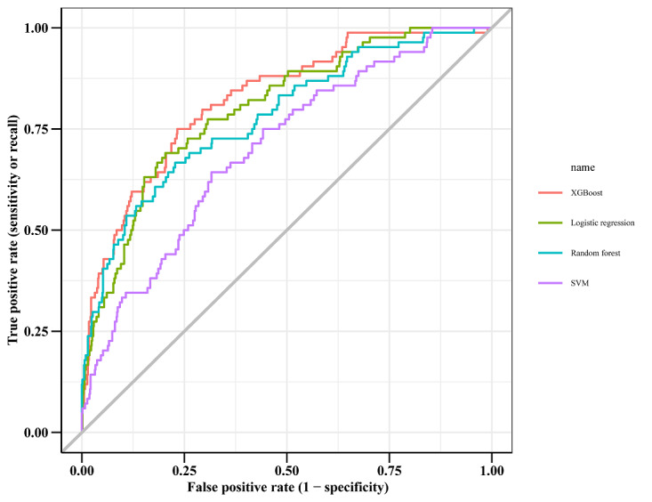
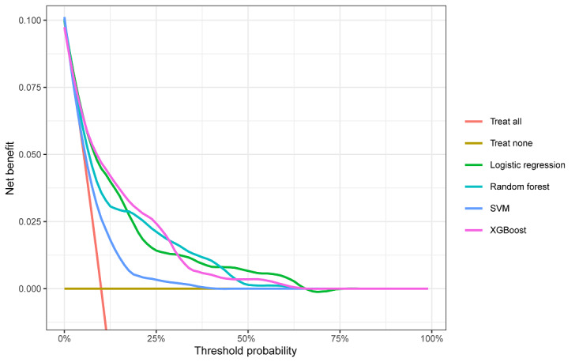
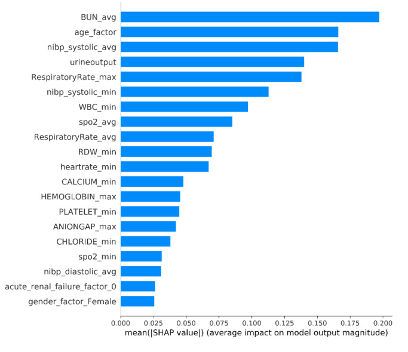
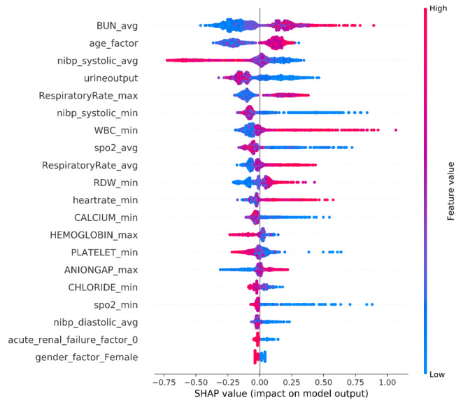
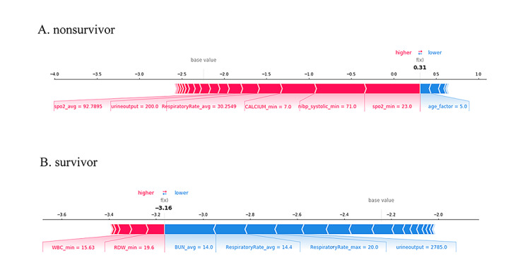

# 使用可解释机器学习模型预测重症监护病房心力衰竭患者的死亡率：回顾性队列研究
Predicting Mortality in Intensive Care Unit Patients With Heart Failure Using an Interpretable Machine Learning Model: Retrospective Cohort Study

## Abstract

### Background
Heart failure (HF) is a common disease and a major public health problem. HF mortality prediction is critical for developing individualized prevention and treatment plans. However, due to their lack of interpretability, most HF mortality prediction models have not yet reached clinical practice.

心力衰竭 （HF） 是一种常见疾病，也是一个重大的公共卫生问题。HF 死亡率预测对于制定个体化预防和治疗计划至关重要。然而，由于缺乏可解释性，大多数 HF 死亡率预测模型尚未进入临床实践。
### Objective
We aimed to develop an interpretable model to predict the mortality risk for patients with HF in intensive care units (ICUs) and used the SHapley Additive exPlanation (SHAP) method to explain the extreme gradient boosting (XGBoost) model and explore prognostic factors for HF.

我们旨在开发一个可解释的模型来预测重症监护病房 （ICU） 中 HF 患者的死亡风险，并使用 SHapley 加法解释 （SHAP） 方法解释极端梯度提升 （XGBoost） 模型并探索 HF 的预后因素。

### Methods
In this retrospective cohort study, we achieved model development and performance comparison on the eICU Collaborative Research Database (eICU-CRD). We extracted data during the first 24 hours of each ICU admission, and the data set was randomly divided, with 70% used for model training and 30% used for model validation. The prediction performance of the XGBoost model was compared with three other machine learning models by the area under the curve. We used the SHAP method to explain the XGBoost model.

在这项回顾性队列研究中，我们在 eICU 协作研究数据库 （eICU-CRD） 上实现了模型开发和性能比较。我们在每个 ICU 入院的前 24 小时内提取数据，并将数据集随机划分，其中 70% 用于模型训练，30% 用于模型验证。通过曲线下面积将 XGBoost 模型的预测性能与其他三个机器学习模型进行比较。我们使用 SHAP 方法来解释 XGBoost 模型。

### Results
A total of 2798 eligible patients with HF were included in the final cohort for this study. The observed in-hospital mortality of patients with HF was 9.97%. Comparatively, the XGBoost model had the highest predictive performance among four models with an area under the curve (AUC) of 0.824 (95% CI 0.7766-0.8708), whereas support vector machine had the poorest generalization ability (AUC=0.701, 95% CI 0.6433-0.7582). The decision curve showed that the net benefit of the XGBoost model surpassed those of other machine learning models at 10%~28% threshold probabilities. The SHAP method reveals the top 20 predictors of HF according to the importance ranking, and the average of the blood urea nitrogen was recognized as the most important predictor variable.

本研究的最终队列共纳入 2798 名符合条件的 HF 患者。观察到的 HF 患者院内死亡率为 9.97%。相比之下，XGBoost 模型在四个模型中具有最高的预测性能，曲线下面积 （AUC） 为 0.824 （95% CI 0.7766-0.8708），而支持向量机的泛化能力最差 （AUC=0.701,95% CI 0.6433-0.7582）。决策曲线显示，XGBoost 模型的净收益在 10%~28% 的阈值概率下超过其他机器学习模型。SHAP 方法根据重要性排序揭示了 HF 的前 20 个预测因子，血尿素氮的平均值被认为是最重要的预测变量。

### Conclusions
The interpretable predictive model helps physicians more accurately predict the mortality risk in ICU patients with HF, and therefore, provides better treatment plans and optimal resource allocation for their patients. In addition, the interpretable framework can increase the transparency of the model and facilitate understanding the reliability of the predictive model for the physicians.

可解释的预测模型可帮助医生更准确地预测 ICU HF 患者的死亡风险，从而为患者提供更好的治疗计划和最佳资源分配。此外，可解释框架可以提高模型的透明度，并有助于医生理解预测模型的可靠性。

### Keywords: 

heart failure, mortality, intensive care unit, prediction, XGBoost, SHAP, SHapley Additive exPlanation

关键词：心力衰竭，死亡率，重症监护病房，预测，XGBoost，SHAP，SHapley加法解释

## Introduction  介绍
Heart failure (HF), the terminal phase of many cardiovascular disorders, is a major health care issue with an approximate prevalence of 26 million worldwide and more than 1 million hospital admissions annually in both the United States and Europe [1]. Projections show that by 2030 over 8 million Americans will have HF, leading to an increase of 46% from 2012 [2]. Each year, HF costs an estimated US $108 billion, constituting 2% of the health care budget globally, and it is predicted to continue to rise, yet half of it is possibly avoidable [3]. As COVID-19 continues to spread across the world, HF, a severe complication, is associated with poor outcome and death from COVID-19 [4,5].

心力衰竭 （HF） 是许多心血管疾病的终末期，是一个主要的医疗保健问题，全球患病率约为 2600 万，美国和欧洲每年有超过 100 万人入院 [ 1 ]。预测显示，到 2030 年，将有超过 800 万美国人患有 HF，比 2012 年增加 46% [ 2 ]。每年，HF 的成本估计为 1080 亿美元，占全球医疗保健预算的 2%，预计还会继续上升，但其中一半是可以避免的 [ 3 ]。随着 COVID-19 继续在世界范围内传播，HF 是一种严重的并发症，与 COVID-19 的不良结果和死亡有关 [ 4 ， 5 ]。

The critically ill patients in intensive care units (ICUs) demand intensive care services and highly qualified multidisciplinary assistance [6]. Although ICU plays an integral role in maintaining patients’ life, this also implies the workforce shortage, limited medical resources, and heavy economic burden [7]. Therefore, early hospital mortality detection for patients is necessary and may assist in delivering proper care and providing clinical decision support [8].

重症监护病房 （ICU） 的危重患者需要重症监护服务和高质量的多学科援助 [ 6 ]。尽管 ICU 在维持患者生命方面发挥着不可或缺的作用，但这也意味着劳动力短缺、医疗资源有限和经济负担沉重 [ 7 ]。因此，对患者进行早期医院死亡率检测是必要的，并可能有助于提供适当的护理和提供临床决策支持 [ 8 ]。

In recent years, artificial intelligence has been widely used to explore the early warning predictors of many diseases. Given the inherent powerful feature of capturing the nonlinear relationships with machine learning algorithms, more researchers advocate the use of new prediction models based on machine learning to support appropriate treatment for patients rather than traditional illness severity classification systems such as SOFA, APACHE II, or SAPS II [9-11]. Although a large number of predictive models have shown promising performance in research, the evidence for their application in clinical setting and interpretable risk prediction models to aid disease prognosis are still limited [12-15].

近年来，人工智能已被广泛用于探索许多疾病的早期预警预测因子。鉴于使用机器学习算法捕获非线性关系的固有强大功能，越来越多的研究人员主张使用基于机器学习的新预测模型来支持对患者的适当治疗，而不是传统的疾病严重程度分类系统，如 SOFA、APACHE II 或 SAPS II [ 9 - 11 ]。尽管大量预测模型在研究中显示出有希望的性能，但它们在临床环境中应用的证据和可解释的风险预测模型以帮助疾病预后的证据仍然有限 [ 12 - 15 ]。

The purpose of our study is to develop an interpretable model to predict the risk mortality for patients with HF in the ICU, using the free and open critical care database—the eICU Collaborative Research Database (eICU-CRD). In addition, the SHapley Additive exPlanations (SHAP) method is used to explain the extreme gradient boosting (ie, XGBoost) model and explore prognostic factors for HF.

我们研究的目的是使用免费和开放的重症监护数据库——eICU 合作研究数据库 （eICU-CRD） 开发一个可解释的模型来预测 ICU 中 HF 患者的风险死亡率。此外，SHapley 加法解释 （SHAP） 方法用于解释极端梯度增强（即 XGBoost）模型并探索 HF 的预后因素。

## Methods  方法
### Data Source  数据源
The eICU-CRD (version 2.0) is a publicly available multicenter database [16], containing deidentified data associated with over 200,000 admissions to ICUs at 208 hospitals of the United States between 2014-2015. It records all patients, demographics, vital sign measurements, diagnosis information, and treatment information in detail [17].

eICU-CRD（2.0 版）是一个公开可用的多中心数据库 [ 16 ]，其中包含与 2014-2015 年间美国 208 家医院超过 200,000 例 ICU 入院相关的去识别化数据。它详细记录了所有患者、人口统计学、生命体征测量、诊断信息和治疗信息 [ 17 ]。

### Ethical Considerations  道德考虑
Ethical approval and individual patient consent was not necessary because all the protected health information was anonymized.

伦理批准和患者个体同意不是必需的，因为所有受保护的健康信息都是匿名的。

### Study Population  研究人群
All patients in the eICU-CRD database were considered. The inclusion criteria were as follows: 
- (1) patients were diagnosed with HF according to the International Classification of Diseases, ninth and tenth Revision codes (Multimedia Appendix 1); 
- (2) the diagnosis priority label was “primary” when admitted to the ICU in 24 hours; 
- (3) the ICU stay was more than 1 day; and 
- (4) patients were aged 18 years or older. 
- Patients who had more than 30% missing values were excluded [18].
考虑了 eICU-CRD 数据库中的所有患者。纳入标准如下： 
- （1） 根据国际疾病分类第九和第十修订代码 （ Multimedia Appendix 1 ） 诊断患者患有 HF;
- （2） 在 24 小时内入住 ICU 时，诊断优先级标签为“原发性”;
- （3） ICU 住院时间超过 1 天;
- （4） 患者年龄在 18 岁或以上。
- 缺失值超过 30% 的患者被排除在外 [ 18 ]。

### Predictor Variables  预测变量
The prediction outcome of the study is the probability of in-hospital mortality, defined as patient’s condition upon leaving the hospital. Based on previous studies [19-22] and experts’ opinion (a total of 6 independent medical professionals and cardiologists in West China Hospital of Sichuan University), demographics, comorbidities, vital signs, and laboratory findings (Multimedia Appendix 2) were extracted from the eICU-CRD, using Structured Query Language (MySQL) queries (version 5.7.33; Oracle Corporation). The following tables from eICU-CRD were used: “diagnosis,” “intakeoutput,” “lab,” “patient,” and “nursecharting.” Except for the demographic characteristics, other variables were collected during the first 24 hours of each ICU admission. Furthermore, to avoid overfitting, Least Absolute Shrinkage and Selection Operator (LASSO) is used to select and filter the variables [23,24].

该研究的预测结果是院内死亡率的概率，定义为患者出院时的状况。根据以前的研究 [ 19 - 22 ] 和专家意见（四川大学华西医院共有 6 名独立的医疗专业人员和心脏病专家），使用结构化查询语言 （MySQL） 查询（版本 5.7.33;甲骨文公司）从 eICU-CRD 中提取人口统计学、合并症、生命体征和实验室结果 （ Multimedia Appendix 2 ）。使用了来自 eICU-CRD 的以下表格：“诊断”、“摄入量输出”、“实验室”、“患者”和“护士图表”。除了人口统计学特征外，还在每个 ICU 入院的前 24 小时内收集了其他变量。此外，为避免过度拟合，使用最小绝对收缩和选择运算符 （LASSO） 来选择和过滤变量 [ 23 ， 24 ]。

### Missing Data Handling  缺失数据处理
Variables with missing data are a common occurrence in eICU-CRD. However, analyses that ignore missing data have the potential to produce biased results. Therefore, we used multiple imputation for missing data [25]. All selected variables contained <30% missing values. Data were assumed missing at random and were imputed using fully conditional specification with the “mice” package (version 3.13.0) for R (version 4.1.0; R Core Team).

具有缺失数据的变量在 eICU-CRD 中很常见。然而，忽略缺失数据的分析有可能产生有偏差的结果。因此，我们对缺失数据使用了多重插补 [ 25 ]。所有选定的变量都包含 <30% 的缺失值。数据被随机假设为缺失，并使用 R 的“小鼠”包（版本 3.13.0）进行插补（版本 4.1.0;R 核心团队）。

### Machine Learning Explainable Tool  机器学习可解释工具
The interpretation of the prediction model is performed by SHAP, which is a unified approach to calculate the contribution and influence of each feature toward the final predictions precisely [26]. The SHAP values can show how much each predictor contributes, either positively or negatively, to the target variable. Besides, each observation in the data set could be interpreted by the particular set of SHAP values.

预测模型的解释由 SHAP 执行，SHAP 是一种统一的方法，可以精确计算每个特征对最终预测的贡献和影响 [ 26 ]。SHAP 值可以显示每个预测因子对目标变量的积极或消极贡献。此外，数据集中的每个观察结果都可以由特定的 SHAP 值集来解释。

### Statistical Analysis  统计分析
All statistical analysis and calculations were performed using R software and Python (version 3.8.0; Python Software Foundation).
The categorical variables are expressed as total numbers and percentages, and the χ2 test or Fisher exact test (expected frequency <10) is used to compare the differences between groups. 
The continuous variables are expressed as median and IQR, and the Wilcoxon rank sum test is used when comparing the two groups.

所有统计分析和计算均使用 R 软件和 Python（版本 3.8.0;Python 软件基金会）进行。分类变量表示为总数和百分比，使用 χ2 检验或 Fisher 精确检验（预期频率 <10）来比较组间的差异。连续变量表示为中位数和 IQR，比较两组时使用 Wilcoxon 秩和检验。

Four machine learning models—XGBoost, logistic regression (LR), random forest (RF), and support vector machine (SVM)— were used to develop the predictive models. The prediction performance of each model was evaluated by the area under the receiver operating characteristic curve. Moreover, we calculated the accuracy, sensitivity, positive predictive values, negative predictive values, and F1 score when the prediction specificity was fixed at 85%. Additionally, to assess the utility of models for decision-making by quantifying the net benefit at different threshold probabilities, decision curve analysis (DCA) was conducted [27].

四个机器学习模型——XGBoost、逻辑回归 （LR）、随机森林 （RF） 和支持向量机 （SVM）——用于开发预测模型。每个模型的预测性能通过受试者工作特征曲线下的面积来评估。此外，当预测特异性固定为 85% 时，我们计算了准确性、敏感性、阳性预测值、阴性预测值和 F1 评分。此外，为了通过量化不同阈值概率下的净收益来评估模型在决策中的效用，进行了决策曲线分析 （DCA） [ 27 ]。

## Results  结果
### Patient Characteristics  患者特征
Among 17,029 patients with HF in eICU-CRD, a total of 2798 adult patients diagnosed with primary HF were included in the final cohort for this study. The patient screening process is shown in Figure 1. The data set was randomly divided into 2 parts: 70% (n=1958) of the data were used for model training, and 30% (n=840) of the data were used for model validation. The LASSO regularization process resulted in 24 potential predictors on the basis of 1958 patients in the training data set, which were used for model developing. Patients in the nonsurvivor group were older than the ones in the survivor group (P<.001). The hospital mortality rate was 9.96% (195/1958) in the training data set and 10% (84/840) in the testing data set (Multimedia Appendix 3). Table 1 shows the comparisons of predictor variables between survivors and nonsurvivors during hospitalization.

在 eICU-CRD 的 17,029 名 HF 患者中，共有 2798 名被诊断为原发性 HF 的成年患者被纳入本研究的最终队列。患者筛选过程如 Figure 1 所示。数据集随机分为两部分：70% （n=1958） 的数据用于模型训练，30% （n=840） 的数据用于模型验证。LASSO 正则化过程根据训练数据集中的 24 名患者产生了 1958 个潜在预测因子，用于模型开发。非幸存者组的患者比幸存者组的患者年龄大 （P<.001）。训练数据集的住院死亡率为 9.96% （195/1958），测试数据集的住院死亡率为 10% （84/840） （ Multimedia Appendix 3 ）。 Table 1 显示住院期间幸存者和非幸存者之间的预测变量的比较。

### Model Building and Evaluation  模型构建和评估
Within the training data set, the XGBoost, LR, RF, and SVM models were established, and the testing data set obtained AUCs of 0.824, 0.800, 0.779, and 0.701, respectively (Table 2 and Figure 2). 

Comparatively, XGBoost had the highest predictive performance among the four models (AUC=0.824, 95% CI 0.7766-0.8708), whereas SVM had the poorest generalization ability (AUC=0.701, 95% CI 0.6433-0.7582). 

DCA was performed for four machine learning models in the testing data set to compare the net benefit of the best model and alternative approaches for clinical decision-making. Clinical net benefit is defined as the minimum probability of disease, when further intervention would be warranted [28]. The plot measures the net benefit at different threshold probabilities. 

The orange line in Figure 3 represents the assumption that all patients received intervention, whereas the yellow line represents that none of the patients received intervention. Due to the heterogeneous profile of the study population, treatment strategies informed by any of the four machine learning–based models are superior to the default strategies of treating all or no patient. The net benefit of the XGBoost model surpassed those of the other machine learning models at 10%~28% threshold probabilities (Figure 3).

在训练数据集中，建立了 XGBoost 、 LR 、 RF 和 SVM 模型，测试数据集获得的 AUC 分别为 0.824、 0.800、 0.779 和 0.701 （ Table 2 和 Figure 2 ）。相比之下，XGBoost 在四个模型中具有最高的预测性能 （AUC=0.824,95% CI 0.7766-0.8708），而 SVM 的泛化能力最差 （AUC=0.701,95% CI 0.6433-0.7582）。对测试数据集中的四个机器学习模型进行了 DCA，以比较最佳模型和替代方法对临床决策的净收益。临床净收益定义为需要进一步干预时疾病的最小概率 [ 28 ]。该图测量不同阈值概率下的净收益。中的 Figure 3 橙色线表示假设所有患者都接受了干预，而黄线表示没有患者接受干预。由于研究人群的异质性，由四种基于机器学习的模型中的任何一种提供的治疗策略都优于治疗所有患者或没有治疗患者的默认策略。XGBoost 模型的净收益以 10%~28% 的阈值概率 （ Figure 3 ） 超过了其他机器学习模型。

### Explanation of XGBoost Model With the SHAP Method    用 SHAP 方法的 XGBoost 模型说明
The SHAP algorithm was used to obtain the importance of each predictor variable to the outcome predicted by the XGBoost model. The variable importance plot lists the most significant variables in a descending order (Figure 4). The average of blood urea nitrogen (BUN) had the strongest predictive value for all prediction horizons, followed quite closely by the age factor, the average of noninvasive systolic blood pressure, urine output, and the maximum of respiratory rate. Furthermore, to detect the positive and negative relationships of the predictors with the target result, SHAP values were applied to uncover the mortality risk factors. As presented in Figure 5, the horizontal location shows whether the effect of that value is associated with a higher or lower prediction and the color shows whether that variable is high (in red) or low (in blue) for that observation; we can see that increases in the average BUN has a positive impact and push the prediction toward mortality, whereas increases in urine output has a negative impact and push the prediction toward survival.

SHAP 算法用于获取每个预测变量对 XGBoost 模型预测结果的重要性。变量重要性图按降序 （ ） 列出最重要的变量 Figure 4 。血尿素氮 （BUN） 的平均值在所有预测范围内具有最强的预测值，紧随其后的是年龄因素、无创收缩压的平均值、尿量和最大呼吸频率。此外，为了检测预测因子与目标结果的正负关系，应用 SHAP 值来揭示死亡风险因素。如 所示 Figure 5 ，水平位置显示该值的影响是否与较高或较低的预测相关，颜色显示该变量对于该观察是高（红色）还是低（蓝色）;我们可以看到，平均 BUN 的增加具有积极影响，并将预测推向死亡率，而尿量的增加则具有负面影响，并将预测推向生存。

### SHAP Individual Force Plots   SHAP 单个力图
Figure 6 shows the individual force plots for patients who (A) did not survive and (B) survived. The SHAP values indicate the prediction-related feature of individual patients and the contribution of each feature to the mortality prediction. The bold-faced numbers are the probabilistic predicted values (f(x)), whereas the base values are the values predicted without giving input to the model. The f(x) is the log odds ratio of each observation. The red features (on the left) indicate features that increase the mortality risk, and the blue features indicate features that decrease the mortality risk. The length of the arrows helps visualize the magnitude of the effect on the prediction. The longer the arrow, the larger the effect.

Figure 6 显示 （A） 未存活和 （B） 存活的患者的单个力图。SHAP 值表示单个患者的预测相关特征以及每个特征对死亡率预测的贡献。粗体数字是概率预测值 （f（x）），而基值是未向模型提供输入的预测值。f（x） 是每个观测值的对数优势比。红色特征（左侧）表示增加死亡风险的特征，蓝色特征表示降低死亡风险的特征。箭头的长度有助于可视化对预测的影响大小。箭头越长，效应越大。

## Discussion  讨论
### Principal Findings  主要发现
In this retrospective cohort study of a large-scale public ICU database, we developed and validated four machine learning algorithms to predict the mortality of patients with HF. The XGBoost model outperforms the performance of LR, RF, and SVM. The SHAP method is used to explain the XGBoost model, which ensures the model performance and clinical interpretability. This will help physicians better understand the decision-making process of the model and facilitates the use of prediction results. Besides, to avoid ineffective clinical interventions, the relevant threshold probability range of DCA that we focused on was between 15% and 25%, during which XGBoost performed better. In critical care research, XGBoost has been widely used to predict the in-hospital mortality of patients and may assist clinicians in decision-making [29-31]. However, the mortality of patients with HF included in the final cohort is just 9.97%. Although DCA shows that the XGBoost model is better than the two default strategies, the positive predictive value is just 0.307 when the prediction specificity is fixed at 85%. Therefore, the XGBoost model may not be fully acceptable to provide decision-making support for clinicians. Evaluation of the benefits of earlier prediction of mortality and its additional cost is necessary in clinical practice.
在这项大规模公共 ICU 数据库的回顾性队列研究中，我们开发并验证了四种机器学习算法来预测 HF 患者的死亡率。XGBoost 模型的性能优于 LR、RF 和 SVM。SHAP 方法用于解释 XGBoost 模型，保证了模型的性能和临床可解释性。这将帮助医生更好地了解模型的决策过程，并促进预测结果的使用。此外，为避免无效的临床干预，我们关注的 DCA 相关阈值概率范围在 15% 到 25% 之间，在此期间 XGBoost 表现更好。在重症监护研究中，XGBoost 已被广泛用于预测患者的院内死亡率，并可能帮助临床医生做出决策 [ 29 - 31 ]。然而，最终队列中包含的 HF 患者的死亡率仅为 9.97%。尽管 DCA 显示 XGBoost 模型优于两种默认策略，但当预测特异性固定为 85% 时，阳性预测值仅为 0.307。因此，XGBoost 模型可能无法完全接受为临床医生提供决策支持。在临床实践中，评估早期预测死亡率的好处及其额外成本是必要的。

Using SHAP to explain the XGBoost model, we identified some important variables associated with in-hospital mortality of patients with HF. In this study, the average BUN was recognized as the most important predictor variable. As a renal function marker to measure the amount of nitrogen in blood that comes from protein metabolism, previous studies also showed that BUN was the key predictor of HF mortality prediction with machine learning algorithms [32,33]. Kazory [34] concludes that BUN may be a biomarker of neurohormonal activation in patients with HF. From the perspective of pathophysiology, the activity of sympathetic nervous systems and the renin-angiotensin-aldosterone system increases with the aggravation of HF, which causes the vasoconstriction of the afferent arterioles. A reduction in renal perfusion further leads to water and sodium retention and promotes urea reabsorption, ultimately resulting in an increased BUN. However, further research is needed to explore the applicability of this SHAP method, due to the lack of an external validation cohort.
使用 SHAP 来解释 XGBoost 模型，我们确定了一些与 HF 患者院内死亡率相关的重要变量。在这项研究中，平均 BUN 被认为是最重要的预测变量。作为测量血液中来自蛋白质代谢的氮含量的肾功能标志物，以前的研究还表明，BUN 是使用机器学习算法预测 HF 死亡率的关键预测因子 [ 32 ， 33 ]。Kazory [ 34 ] 得出结论，BUN 可能是 HF 患者神经激素激活的生物标志物。从病理生理学的角度来看，交感神经系统和肾素-血管紧张素-醛固酮系统的活动随着 HF 的加重而增加，从而导致传入小动脉的血管收缩。肾灌注的减少进一步导致水和钠的潴留，并促进尿素重吸收，最终导致 BUN 增加。然而，由于缺乏外部验证队列，需要进一步的研究来探索这种 SHAP 方法的适用性。

### Limitations  局限性
This study had some limitations. First, our data were extracted from a publicly available database, and some variables were missing. For example, we intended to include more predictor variables that may affect in-hospital mortality such as prothrombin time as well as brain natriuretic peptide and lactate; however, the missing values were over 70%. Second, all data were derived from the ICU patients from the United States, so the applicability of our model remained unclear in other populations. Third, our mortality prediction models were based on data available within 24 hours of each ICU admission, which may neglect the subsequent events that change the prognosis and cause confounders to some extent. Fourth, due to lack of an external validation cohort, the applicability of the developed XGBoost model may not be very efficient in clinical practice. Currently, we are trying to collect data of patients with HF in ICUs from West China Hospital of Sichuan University. Although we have obtained some preliminary data, it is not feasible for the external prospective validation because of the limited sample size.
这项研究有一些局限性。首先，我们的数据是从公开可用的数据库中提取的，并且缺少一些变量。例如，我们打算包括更多可能影响院内死亡率的预测变量，例如凝血酶原时间以及脑利钠肽和乳酸;然而，缺失值超过 70%。其次，所有数据均来自美国的 ICU 患者，因此我们的模型在其他人群中的适用性仍不清楚。第三，我们的死亡率预测模型基于每次入住 ICU 后 24 小时内可用的数据，这可能会忽略改变预后并在一定程度上引起混杂因素的后续事件。第四，由于缺乏外部验证队列，开发的 XGBoost 模型的适用性在临床实践中可能不是很有效。目前，我们正在尝试从四川大学华西医院收集 ICU 中的 HF 患者数据。虽然我们已经获得了一些初步数据，但由于样本量有限，因此无法进行外部前瞻性验证。

### Conclusions  结论
We developed the interpretable XGBoost prediction model that has the best performance in estimating the mortality risk in patients with HF. In addition, the interpretable machine learning approach can be applied to accurately explore the risk factors of patients with HF and enhance physicians’ trust in prediction models. This will help physicians identify patients with HF who have a high mortality risk so as to timely apply appropriate treatments for them.
我们开发了可解释的 XGBoost 预测模型，该模型在估计 HF 患者的死亡风险方面具有最佳性能。此外，可解释的机器学习方法可以用于准确探索 HF 患者的危险因素，并增强医生对预测模型的信任。这将有助于医生识别具有高死亡风险的 HF 患者，以便及时为他们应用适当的治疗。

这篇文献的总体思路是开发一个可解释的机器学习模型，用于预测心力衰竭（HF）患者在重症监护病房（ICU）中的院内死亡风险，并通过SHapley Additive exPlanation（SHAP）方法解释模型，探索影响心力衰竭预后的因素。以下是研究的主要思路和方法：
## 总体思路
### 背景与目标：
心力衰竭（HF）是全球主要的公共卫生问题，其高死亡率对医疗资源和经济造成巨大负担。准确预测HF患者的死亡风险对于制定个性化治疗方案至关重要。
研究目标是开发一个可解释的预测模型，帮助临床医生更准确地评估HF患者的死亡风险，并优化医疗资源分配。
数据来源与处理：
使用eICU Collaborative Research Database（eICU-CRD）数据库中的数据，提取患者在ICU入院后24小时内的信息。
数据集随机分为训练集（70%）和验证集（30%），并采用LASSO回归筛选变量，减少过拟合风险。
### 模型开发与比较：
开发四种机器学习模型：XGBoost、逻辑回归（LR）、随机森林（RF）和支持向量机（SVM）。
使用接收者操作特征曲线下面积（AUC）评估模型性能，并通过决策曲线分析（DCA）评估模型在临床决策中的净效益。
模型解释与验证：
使用SHAP方法解释XGBoost模型，揭示对预测结果影响最大的变量及其贡献方向。
分析模型在不同阈值概率下的临床净效益，验证模型的可解释性和临床适用性。
## 具体方法
### 数据来源与预处理：
数据来自eICU-CRD数据库，包含2014-2015年美国208家医院的ICU患者数据。
纳入标准：年龄≥18岁，主要诊断为HF，ICU停留时间超过1天。
排除标准：缺失值超过30%的患者。
使用LASSO回归筛选变量，最终保留24个潜在预测因子。
对缺失数据采用多重插补方法处理。
### 模型开发：
XGBoost模型：一种基于梯度提升的机器学习算法，能够处理复杂的非线性关系。
其他模型：逻辑回归（LR）、随机森林（RF）和支持向量机（SVM）。
使用训练集（70%）开发模型，并在验证集（30%）上评估性能。
### 模型评估：
使用AUC评估模型的预测性能。
在固定特异性为85%的情况下，计算模型的准确性、敏感性、阳性预测值（PPV）、阴性预测值（NPV）和F1分数。
通过决策曲线分析（DCA）评估模型在不同阈值概率下的净效益。
模型解释：
使用SHAP方法解释XGBoost模型，计算每个特征对预测结果的贡献值（SHAP值）。
通过SHAP值分析特征的重要性及其对预测结果的正向或负向影响。
生成SHAP力图，展示个体患者的特征贡献。
## 研究结论
XGBoost模型在预测HF患者死亡风险方面表现最佳，AUC为0.824。
SHAP方法揭示了平均血尿素氮（BUN）是最重要的预测因子，其增加与死亡风险正相关。
模型在10%~28%的阈值概率范围内具有较高的净效益，但其阳性预测值较低，可能限制其在临床中的广泛应用。
研究结果为HF患者的临床决策提供了参考，但需要进一步的外部验证以评估模型的适用性。
## 总结
这篇研究通过开发和解释机器学习模型，为HF患者的死亡风险预测提供了一种新的方法。其创新之处在于结合了SHAP方法，使模型具有可解释性，从而增强了临床医生对预测结果的信任。

