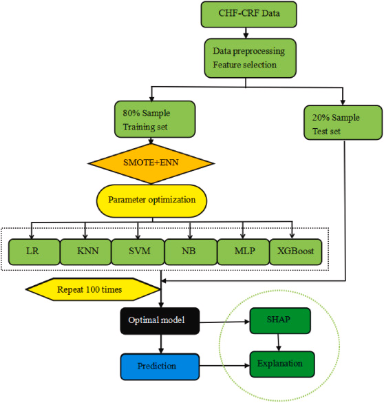
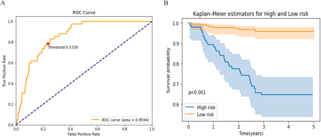
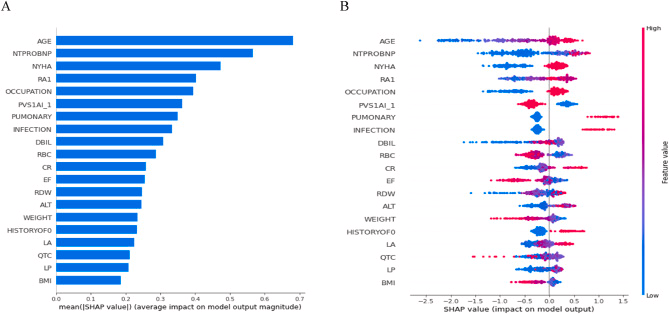
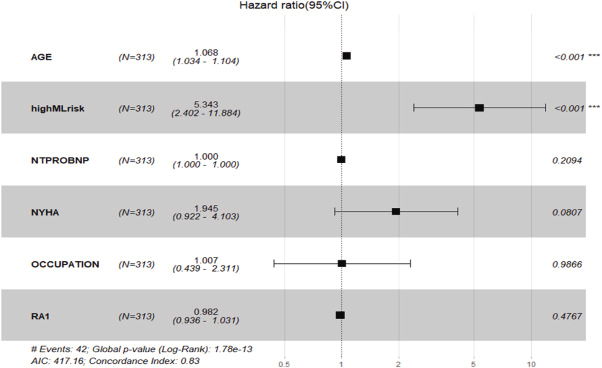
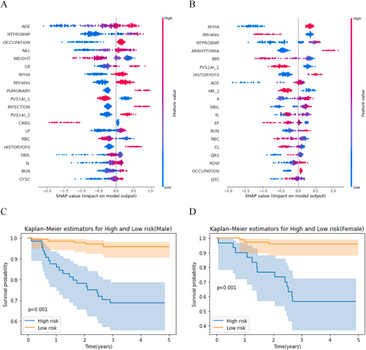

# 基于机器学习和 SHAP 的冠心病所致心力衰竭患者 3 年全因死亡率的可解释预测

Interpretable prediction of 3-year all-cause mortality in patients with heart failure caused by coronary heart disease based on machine learning and SHAP

山西医科大学公共卫生学院卫生统计系
山西医科大学第一附属医院心内科

2021 年 6 月 17 日接收，2021 年 8 月 25 日修订，2021 年 8 月 25 日接受，2021 年 8 月 28 日在线提供，记录版本于 2021 年 9 月 1 日。

## Highlights  亮点
An interpretable machine learning (ML)-based risk stratification tool was developed to predict all-cause mortality in patients with heart failure (HF) caused by coronary heart disease (CHD) during a 3-year follow-up period.

开发了一种基于可解释机器学习 （ML） 的风险分层工具，用于预测冠心病 （CHD） 引起的心力衰竭 （HF） 患者在 3 年随访期间的全因死亡率。

SHapley Additive exPlanations (SHAP) was leveraged to provide an interpretation of the prediction model with contributing risk factors leading to death in patients with HF caused by CHD.

利用 SHapley 加法解释 （SHAP） 对预测模型进行解释，该模型是导致 CHD 引起的 HF 患者死亡的危险因素。

It fills the deficiency of ML study in predicting the prognosis of HF caused by CHD, especially the risk of death in the medium and long term.

它填补了 ML 研究在预测 CHD 引起的 HF 预后方面的不足，尤其是中长期死亡风险。

Provides intuitive explanations that lead patients to predict risks, thereby helping clinicians understand the decision-making process for assessing disease severity.

提供直观的解释，引导患者预测风险，从而帮助临床医生了解评估疾病严重程度的决策过程。

## Abstract  摘要
### Background  背景
This study sought to evaluate the performance of machine learning (ML) models and establish an explainable ML model with good prediction of 3-year all-cause mortality in patients with heart failure (HF) caused by coronary heart disease (CHD).

本研究旨在评估机器学习 （ML） 模型的性能，并建立一个可解释的 ML 模型，可以很好地预测冠心病 （CHD） 引起的心力衰竭 （HF） 患者的 3 年全因死亡率。

### Methods  方法
We established six ML models using follow-up data to predict 3-year all-cause mortality. Through comprehensive evaluation, the best performing model was used to predict and stratify patients. The log-rank test was used to assess the difference between Kaplan–Meier curves. The association between ML risk and 3-year all-cause mortality was also assessed using multivariable Cox regression. Finally, an explainable approach based on ML and the SHapley Additive exPlanations (SHAP) method was deployed to calculate 3-year all-cause mortality risk and to generate individual explanations of the model's decisions.

我们使用随访数据建立了六个 ML 模型来预测 3 年全因死亡率。通过综合评估，使用表现最好的模型对患者进行预测和分层。对数秩检验用于评估 Kaplan-Meier 曲线之间的差异。还使用多变量 Cox 回归评估了 ML 风险与 3 年全因死亡率之间的关联。最后，部署了一种基于 ML 和 SHapley 加法解释 （SHAP） 方法的可解释方法来计算 3 年全因死亡风险并生成模型决策的单独解释。
### Results  结果
The best performing extreme gradient boosting (XGBoost) model was selected to predict and stratify patients. Subjects with a higher ML score had a high hazard of suffering events (hazard ratio [HR]: 10.351; P < 0.001), and this relationship persisted with a multivariable analysis (adjusted HR: 5.343; P < 0.001). Age, N-terminal pro-B-type natriuretic peptide, occupation, New York Heart Association classification, and nitrate drug use were important factors for both genders.

选择表现最好的极端梯度提升 （XGBoost） 模型来预测和分层患者。ML 评分较高的受试者发生痛苦事件的风险很高 （风险比 [HR]： 10.351;P < 0.001），并且这种关系在多变量分析中持续存在 （调整后的 HR： 5.343;P < 0.001）。年龄、N 末端 B 型利钠肽前体、职业、纽约心脏协会分类和硝酸盐药物使用是两性的重要因素。

### Conclusions  结论
The ML-based risk stratification tool was able to accurately assess and stratify the risk of 3-year all-cause mortality in patients with HF caused by CHD. ML combined with SHAP could provide an explicit explanation of individualized risk prediction and give physicians an intuitive understanding of the influence of key features in the model.

基于 ML 的风险分层工具能够准确评估和分层 CHD 引起的 HF 患者 3 年全因死亡的风险。ML 与 SHAP 相结合可以提供个体化风险预测的明确解释，并让医生直观地了解模型中关键特征的影响。

### Keywords  关键字
Interpretable model ；Heart failure ；Machine learning ；SHAP value
可解释模型 ；心力衰竭 ；机器学习 ；SHAP 值

## 1. Introduction  1. 引言
Heart failure (HF), which is characterized by cardiac systolic or diastolic dysfunction, is a major public health problem worldwide [1] and has become one of the deadliest cardiovascular diseases of the 21st century [2]. There are many causes of HF, but coronary heart disease (CHD), as the world's leading cause of heart failure, is still associated with high morbidity and mortality [3]. Patients with HF caused by CHD often have poor prognosis and high mortality due to poor physical function and a prolonged disease duration [4]. Owing to the long-term occupation of medical resources and high mortality, HF poses a heavy economic and social burden. Seeking effective measures to improve patient prognosis and reduce mortality has become an important goal of HF management. Therefore, obtaining accurate mortality risk predictions for patients with HF caused by CHD and understanding what drives these predictions is vitally important to determine targeted interventions in clinical settings.

心力衰竭 （HF） 以心脏收缩或舒张功能障碍为特征，是全球主要的公共卫生问题 [1]，并已成为 21 世纪最致命的心血管疾病之一 [2]。HF 的原因有很多，但冠心病 （CHD） 作为世界心力衰竭的主要原因，仍然与高发病率和死亡率相关 [3]。CHD 引起的 HF 患者由于身体机能差和病程延长，往往预后不良，死亡率高 [4]。由于长期占用医疗资源和高死亡率，HF 构成了沉重的经济和社会负担。寻求改善患者预后和降低死亡率的有效措施已成为 HF 管理的重要目标。因此，获得 CHD 引起的 HF 患者的准确死亡风险预测并了解驱动这些预测的因素对于确定临床环境中的针对性干预措施至关重要。

Machine learning (ML) algorithms provide researchers with powerful tools. It uses statistical methods in large datasets to infer relationships between patient attributes and outcomes and allows for objective integration of data to predict outcomes. ML has been used in many medical-related fields, such as diagnosis, outcome prediction, treatment, and medical image interpretation [5,6], and it has also been used to predict adverse outcomes in patients with HF by integrating clinical and other data in recent studies [[7], [8], [9]]. However, there is still a lack of research on ML for the prognosis of HF caused by CHD, especially medium and long-term mortality risk prediction. Moreover, despite the promising performance of ML in previous studies, evidence on its application in a real-world clinical setting and explainable risk prediction models to assist disease prognosis are limited [10,11]. Because of the “black-box” nature of ML algorithms, it is difficult to explain why certain predictions should be made about patients; that is, what specific characteristics of the patient lead to a given prediction. The lack of interpretability has so far limited the use of more powerful ML approaches in medical decision support [12], and the lack of intuitional understanding of ML models is also one of the major obstacles to implementation of ML in the medical field [13].

机器学习 （ML） 算法为研究人员提供了强大的工具。它在大型数据集中使用统计方法来推断患者属性和结果之间的关系，并允许客观地整合数据以预测结果。ML 已用于许多医学相关领域，例如诊断、结果预测、治疗和医学图像解释 [5,6]，并且在最近的研究中还通过整合临床和其他数据来预测 HF 患者的不良结局 [[7]， [8]， [9]]。然而，目前仍缺乏对 ML 对 CHD 所致 HF 预后的研究，尤其是中长期死亡风险预测。此外，尽管 ML 在以前的研究中表现良好，但其在真实临床环境中应用的证据和可解释的风险预测模型有助于疾病预后的证据有限 [10,11]。由于 ML 算法的“黑盒”性质，很难解释为什么应该对患者进行某些预测;也就是说，患者的哪些特定特征会导致给定的预测。到目前为止，缺乏可解释性限制了更强大的 ML 方法在医疗决策支持中的使用 [12]，而缺乏对 ML 模型的直觉理解也是 ML 在医疗领域实施的主要障碍之一 [13]。

To solve these disadvantages, this study combined the advanced ML algorithm with a framework based on SHapley Additive exPlanations (SHAP) [14]. In addition to improving the accuracy of predicting 3-year mortality risk in patients with HF caused by CHD, it provides intuitive explanations that lead patients to predict risk, thereby helping clinicians better understand the decision-making process for assessing disease severity and maximizing opportunities for early intervention. This is an important step forward for ML in medicine [12] and will help develop interpretable and personalized risk prediction models.

为了解决这些缺点，本研究将先进的 ML 算法与基于 SHapley 加法解释 （SHAP） 的框架相结合 [14]。除了提高预测 CHD 引起的 HF 患者 3 年死亡风险的准确性外，它还提供了直观的解释，引导患者预测风险，从而帮助临床医生更好地了解评估疾病严重程度的决策过程，并最大限度地增加早期干预的机会。这是医学 ML 向前迈出的重要一步 [12]，将有助于开发可解释和个性化的风险预测模型。

### 1.1. Related work  1.1. 相关工作
ML technology does not require assumptions about input variables and their relationship with output. The advantage of this completely data-driven learning without relying on rule-based programming makes ML a reasonable and feasible approach [15]. Among various data-driven methods, the performance of computational models that predict health outcomes has been improved by applying more sophisticated approaches, investigating techniques in the areas of statistics and ML [16]. An increasing number of studies are applying ML to predict cardiovascular disease [17], and various risk models can be used to assess the risk of patients across the HF spectrum [18,19]. Nowadays, people's interest in using the interpretation and tree ensemble models has grown to the development of mortality prediction models, such as random forest (RF) and Gradient Boosting Decision Tree [20,21]. Although tree ensemble models are more accurate and can also provide a ranking of feature importance, they cannot tell users whether these important factors are protective or dangerous, while logistic regression (LR) can. The “black-box” characteristics of ML algorithms make it difficult to understand and correct errors when they occur [22]. Meanwhile, improving collaboration between humans and artificial intelligence is critical for applications where explaining ML model predictions can enhance human performance [23]. A balance between model accuracy and interpretation is often difficult to achieve, and the probabilities of risk that the model outputs are not easily understood by most physicians.

ML 技术不需要对输入变量及其与输出的关系进行假设。这种完全数据驱动的学习而不依赖于基于规则的编程的优势使 ML 成为一种合理且可行的方法 [15]。在各种数据驱动方法中，通过应用更复杂的方法、研究统计和 ML 领域的技术，预测健康结果的计算模型的性能得到了提高 [16]。越来越多的研究正在应用 ML 来预测心血管疾病 [17]，各种风险模型可用于评估 HF 谱系患者的风险 [18,19]。如今，人们对使用解释和树集成模型的兴趣已经发展到死亡率预测模型的发展，例如随机森林 （RF） 和梯度提升决策树 [20,21]。尽管树集成模型更准确，还可以提供特征重要性的排名，但它们无法告诉用户这些重要因素是保护性的还是危险的，而逻辑回归 （LR） 可以。ML 算法的“黑盒”特性使得在错误发生时难以理解和纠正错误 [22]。同时，改善人类与人工智能之间的协作对于解释 ML 模型预测可以提高人类性能的应用至关重要 [23]。 模型准确性和解释之间的平衡通常很难实现，而且大多数医生不容易理解模型输出的风险概率。

## 2. Methods  2. 方法
### 2.1. Study population  2.1. 研究人群
This was a prospective, multi-center, cohort study to predict the 3-year risk of all-cause mortality in patients with HF caused by CHD. Patients were enrolled in a regional cardiovascular hospital and the cardiology department of a medical university hospital in Shanxi Province, China from January 2014 to June 2019 according to the inclusion and exclusion criteria.
这是一项前瞻性、多中心、队列研究，旨在预测 CHD 引起的 HF 患者 3 年全因死亡风险。根据纳入和排除标准，患者于 2014 年 1 月至 2019年6月在中国山西省某区域心血管医院和一医科大学医院心内科入组。

The inclusion criteria were as follows: 
- (1) aged ≥18 years; 
- (2) diagnosed with HF according to the guideline for the diagnosis and treatment of HF in China (2018) [24]; 
- (3) New York Heart Association (NYHA) classification II–IV disease; 
- (4) diagnosis of CHD [4]; and 
- (5) underwent HF treatment while hospitalized. 
- Patients who had an acute cardiovascular event within 2 months prior to admission or were unable or refused to participate in the program for any reason were excluded.

纳入标准如下：
- （1） 年龄 ≥18 岁;
- （2） 根据中国 HF 诊疗指南（2018 年）诊断为 HF [24];
- （3） 纽约心脏协会 （NYHA） II-IV 级疾病;
- （4） 冠心病诊断 [4];
- （5） 住院期间接受了 HF 治疗。
- 入院前 2 个月内发生急性心血管事件或因任何原因不能或拒绝参加该计划的患者被排除在外。
### 2.2. Data collection  2.2. 数据收集
Patient information was collected according to the case report form of chronic HF (CHF-CRF) developed by this research group based on the content of the case records and HF guidelines [25]. The CHF-CRF included patients’ demographics, medical history, physicals status and vitals, currently used medical therapy, echocardiography results, electrocardiography results, and laboratory parameters. All patients were followed up by a trained specialist over the telephone every 6 months after discharge to record survival information for patients with HF. Based on inclusion and exclusion criteria, we collected a total of 5188 patients with HF caused by CHD, and finally identified 1562 patients with a follow-up duration of >3 years or who died.

根据本研究小组根据病例记录内容和 HF 指南制定的慢性 HF 病例报告表 （CHF-CRF） 收集患者信息 [25]。CHF-CRF 包括患者的人口统计学、病史、身体状况和生命体征、目前使用的药物治疗、超声心动图结果、心电图结果和实验室参数。所有患者在出院后每 6 个月由训练有素的专家通过电话进行随访，以记录 HF 患者的生存信息。根据纳入和排除标准，我们共收集了 5188 例由 CHD 引起的 HF 患者，最终确定了 1562 例随访持续时间为 >3 年或死亡的患者。

The cohort used in this study was from a prospective cohort study of CHF registered by our research group in the Chinese Clinical Trial Registry (ChiCTR2100043337).

本研究中使用的队列来自我们研究小组在中国临床试验注册中心注册的 CHF 前瞻性队列研究 （ChiCTR2100043337）。

### 2.3. Study outcomes  2.3. 研究结果
The primary endpoint of the study was all-cause mortality throughout 3 years of follow up. All-cause mortality was defined as death due to any cause.

该研究的主要终点是整个 3 年随访的全因死亡率。全因死亡率定义为任何原因导致的死亡。
### 2.4. Feature selection and data preprocessing    2.4. 特征选择和数据预处理

Our structured database initially contained hundreds of clinical variables (so-called “features” in ML). Features with a missing percentage of not more than 30% were retained and filled in with the method of missForest [26]. Because the range of different features widely varied and some of the used algorithms required quantitative data normalization, Min-Max normalization was used, and multi-category variables were processed by One-Hot [27]. After the single-factor preliminary screening, the recursive feature elimination (RFE) based on RF with five-fold cross-validation (CV) was used to screen the overall features. The main idea of RFE is to build a model, select the best feature, pick out the selected feature, and then repeat this process for the remaining features until all the features are traversed.

我们的结构化数据库最初包含数百个临床变量（ML中所谓的 “特征”）。缺失百分比不超过30%的特征被保留下来，并用missForest的方法填充[26]。由于不同特征的范围差异很大，而且一些使用的算法需要定量数据归一化，所以使用了最小-最大归一化，多类别变量由One-Hot [27]处理。在单因素初步筛选后，使用基于RF的递归特征消除（RFE）和五重交叉验证（CV）来筛选整体特征。RFE的主要思想是建立一个模型，选择最好的特征，挑选出选定的特征，然后对剩余的特征重复这个过程，直到遍历所有特征。
### 2.5. Model development  2.5. 模型开发
We developed six ML models using follow-up data to predict 3-year all-cause mortality. In addition to five commonly used models [28], including LR, k-nearest neighbors (KNN), support vector machines (SVM), naive Bayesian (NB), and multi-layer perceptron (MLP), we introduced extreme gradient boosting (XGBoost). XGBoost is an optimized implementation of gradient boosting. It is based on the ensemble of weak learners and has the characteristics of high bias and low variance. XGBoost uses a second-order Taylor series to approximate the value of the loss function, and further reduces the possibility of over-fitting through regularization [29]. According to whether the endpoint occurred, stratified random sampling was used to divide 1562 patients into a training set and a test set in a 4:1 ratio. The training set was pretreated using the synthesizing minority oversampling technology combined with edited nearest neighbors (SMOTE + ENN) technique [30] to balance them between positive and negative categories.The synthetic minority oversampling technique combined with the editing nearest neighbor (SMOTE + ENN) technique [30] was used to preprocess the training set to achieve a balance between positive and negative categories. A Grid Search method with five-fold CV was used to optimize the hyper-parameters of ML models (details in Supplementary Table 1). Finally, the performance of each model was evaluated and compared in the test set. To obtain a more robust performance estimate, avoid reporting biased results and limit over-fitting, we repeated the persistence method 100 times with different random seeds and calculated the average performance in these 100 repetitions [31] (Fig. 1). Through comprehensive evaluation of multiple evaluation indicators, the best performing model among the six models was selected for further risk prediction and stratification. Furthermore, the optimal model was developed for men and women separately to assess gender-based differences in the prognostic importance of covariates.

我们使用随访数据开发了 6 个 ML 模型来预测 3 年全因死亡率。除了 LR、k 最近邻 （KNN）、支持向量机 （SVM）、朴素贝叶斯 （NB） 和多层感知器 （MLP） 等 5 种常用模型 [28] 外，我们还引入了极端梯度提升 （XGBoost）。XGBoost 是梯度提升的优化实现。它基于弱学习器的集合，具有高偏差和低方差的特点。XGBoost 使用二阶泰勒级数来近似损失函数的值，并通过正则化进一步降低了过拟合的可能性 [29]。根据终点是否出现，采用分层随机抽样，以 4：1 的比例将 1562 名患者分为训练集和测试集。使用合成少数过采样技术结合编辑的最近邻 （SMOTE + ENN） 技术 [30] 对训练集进行预处理，以平衡它们之间的正负类别。合成少数过采样技术结合编辑最近邻 （SMOTE + ENN） 技术 [30] 对训练集进行预处理，以实现正负类别之间的平衡。具有五倍 CV 的网格搜索方法用于优化 ML 模型的超参数（详见补充表 1）。最后，在测试集中评估和比较每个模型的性能。 为了获得更稳健的性能估计，避免报告有偏差的结果并限制过度拟合，我们用不同的随机种子重复了持久性方法100次，并计算了这100次重复的平均性能[31]（图1）。通过对多个评价指标的综合评价，在六个模型中选择表现最好的模型进行进一步的风险预测和分层。此外，分别为男性和女性开发了最佳模型，以评估协变量预后重要性的基于性别的差异。

### 2.6. Model interpretation and feature importance    2.6. 模型解释和功能重要性
ML models are often considered as black boxes because it is difficult to interpret why an algorithm provides accurate predictions for a particular patient cohort; therefore, we introduced the SHAP value in this study. SHAP is a unified framework proposed by Lundberg and Lee [14] to interpret ML predictions, and it is a new approach to explain various black-box ML models. It has previously been validated in terms of its interpretability performance [11,32]. SHAP can perform local and global interpretability simultaneously, and it has a solid theoretical foundation compared with other methods [12]. We leveraged SHAP to provide an explanation for our predictive model, which includes related risk factors that lead to death in patients with HF caused by CHD. To determine the main predictors of all-cause mortality in the patient population, we calculated the importance of ranking features from the final model.

ML 模型通常被认为是黑盒，因为很难解释为什么算法为特定患者群体提供准确的预测;因此，我们在本研究中引入了 SHAP 值。SHAP 是 Lundberg 和 Lee [14] 提出的用于解释 ML 预测的统一框架，是一种解释各种黑盒 ML 模型的新方法。它之前已经在其可解释性性能方面得到了验证 [11,32]。SHAP 可以同时执行局部和全局可解释性，与其他方法相比，它具有坚实的理论基础 [12]。我们利用 SHAP 为我们的预测模型提供解释，其中包括导致 CHD 引起的 HF 患者死亡的相关危险因素。为了确定患者群体中全因死亡率的主要预测因子，我们计算了对最终模型中特征进行排名的重要性。
### 2.7. Statistical analysis    2.7. 统计分析
All analyses and calculations were performed using Python Version 3.6.5 (imblearn, sklearn, xgboost, lifelines, and shap packages) and R version 4.0.2 (survival and survminer packages).

所有分析和计算均使用 Python 版本 3.6.5（imblearn、sklearn、xgboost、lifelines 和 shap 包）和 R 版本 4.0.2（survival 和 survminer 包）进行。

Multiple evaluation indices, including sensitivity, specificity, F1-score, and area under the receiver operating characteristic curve (AUC) were used to comprehensively evaluate the discrimination of ML models. The Brier score [9] was used to evaluate model calibration. The evaluation indices of the six models were compared to one-way analysis of variance and multiple comparisons of least-significant difference. The highest Youden's index was used to define an optimal cut-off value and to separate patients with a low and high ML risk. The log-rank test was then used to assess the difference between Kaplan–Meier curves. The association between ML risk and 3-year all-cause mortality was also assessed using multivariable Cox regression. The statistical significance was based on a two-tailed P value of ≤0.05.

采用敏感性、特异性、F1评分、受试者工作特征曲线下面积（AUC）等多个评价指标，综合评价ML模型的鉴别度。Brier评分[9]用于评价模型校准。将六种模型的评价指标与单因素方差分析和最小显著性差异的多重比较进行比较。最高的 Youden 指数用于定义最佳临界值，并区分 ML 风险低和高的患者。然后使用对数秩检验评估 Kaplan-Meier 曲线之间的差异。还使用多变量 Cox 回归评估 ML 风险与 3 年全因死亡率之间的关联。统计显着性基于 ≤0.05 的双尾 P 值。

## 3. Results  3. 结果
### 3.1. Patient characteristics    3.1. 患者特征
A total of 1562 patients with HF caused by CHD were followed for at least 3 years or died within 3 years, including 1023 male patients (65.49%) with an average age of 65.27 ± 11.14 years and 539 female patients (34.51%) with an average age of 70.80 ± 9.64 years. The average age of all patients was 67.18 ± 10.96 years. During the 3-year follow-up, 210 patients (13.44%) died. The mortality rate was 9.09% at 1 year and 11.72% at 2 years. Furthermore, during the 1-, 2-, and 3-year follow-up periods, the cumulative mortality rates were 6.55%, 10.56%, and 13.20%, respectively, for men, and 4.49%, 10.39%, and 13.91%, respectively, for women.

共有 1562 例 CHD 所致 HF 患者随访至少 3 年或在 3 年内死亡，其中男性患者 1023 例 （65.49%），平均年龄 65.27 ± 11.14 岁，女性患者 539 例 （34.51%），平均年龄 70.80 ± 9.64 岁。所有患者的平均年龄为 67.18 ± 10.96 岁。在 3 年随访期间，210 例患者 （13.44%） 死亡。1 年死亡率为 9.09%，2 年死亡率为 11.72%。此外，在 1 年、 2 年和 3 年随访期间，男性的累积死亡率分别为 6.55% 、 10.56% 和 13.20%，女性的累积死亡率分别为 4.49% 、 10.39% 和 13.91%。
### 3.2. Population and risk factors    3.2. 人群和风险因素
Through single factor and the five-fold CV RFE-RF feature selection, the optimal number of features was 45 (Fig. 2, Table 1) (details in Supplementary Table 2).

通过单因素和五重 CV RFE-RF 特征选择，最佳特征数为 45 个（图 2，表 1）（详见补充表 2）。

### 3.3. ML to predict outcomes    3.3. ML 预测结果
Over the 3-year follow-up period, the XGBoost model achieved a mean AUC of 0.8207 (95% confidence interval [CI]: 0.8143–0.8272) and an F1-score of 0.4476 (95% CI: 0.4407–0.4546) for mortality. These values were significantly higher compared to the respective values in the other five models (P < 0.001). The mean sensitivity of 0.7520 (95% CI: 0.7471–0.7569) and specificity of 0.7493 (95% CI: 0.7356–0.7630) with XGBoost were also relatively high. Furthermore, the mean Brier score of XGBoost (0.1960; 95% CI: 0.1926–0.1995) was second only to SVM (0.1448; 95% CI: 0.1422–0.1473) among the six models (Table 2). Therefore, XGBoost was selected for further prediction in this study.

在 3 年随访期间，XGBoost 模型的平均 AUC 为 0.8207 （95% 置信区间 [CI]： 0.8143–0.8272） 和 F1 评分为 0.4476 （95% CI： 0.4407–0.4546） 死亡率。与其他五个模型中的相应值相比，这些值显着更高 （P < 0.001）。XGBoost 的平均敏感性为 0.7520 （95% CI： 0.7471–0.7569） 和 0.7493 （95% CI： 0.7356–0.7630） 的特异性也相对较高。此外，XGBoost 的平均 Brier 评分 （0.1960;95% CI： 0.1926–0.1995） 在六个模型中仅次于 SVM （0.1448;95% CI： 0.1422–0.1473）（表 2）。因此，本研究选择了 XGBoost 进行进一步预测。

### 3.4. Categorization of prediction score and risk stratification    3.4. 预测分数和风险分层的分类
The XGBoost model was used to predict and stratify the 3-year risk of all-cause mortality in individuals with HF caused by CHD in the test set. Patients were divided into high-risk and low-risk groups with the maximal Youden's index as the optimal cut-off value (0.5339) (Fig. 3A). At this cut-off value, the prediction scores were associated with a sensitivity and specificity of 0.7857 and 0.7638, respectively. As depicted by Kaplan–Meier curves, a gradual decline in survival was observed for high-risk patients over 3 years, indicating that subjects with higher prediction scores are more likely to experience death (log-rank test: P < 0.001; Fig. 3B).

XGBoost 模型用于预测和分层测试集中由 CHD 引起的 HF 个体的 3 年全因死亡风险。将患者分为高危组和低危组，以最大约登指数为最佳临界值 （0.5339）（图 3A）。在这个临界值下，预测分数分别与 0.7857 和 0.7638 的敏感性和特异性相关。如 Kaplan-Meier 曲线所示，观察到高危患者的生存率在 3 年内逐渐下降，表明预测分数较高的受试者更有可能死亡（对数秩检验：P < 0.001;图 3B）。

> 这段话主要是在描述XGBoost模型在预测和分层心力衰竭（HF）患者3年全因死亡风险方面的应用和结果。下面我将逐句为您解释：
模型应用：“The XGBoost model was used to predict and stratify the 3-year risk of all-cause mortality in individuals with HF caused by CHD in the test set.” 这句话说明了研究者使用XGBoost模型来预测由冠状动脉心脏病（CHD）引起的心力衰竭患者在测试集中的3年全因死亡风险，并对患者进行风险分层。
风险分组：“Patients were divided into high-risk and low-risk groups with the maximal Youden's index as the optimal cut-off value (0.5339) (Fig. 3A).” 这里提到，研究者根据最大的约登指数（Youden's index）确定的最佳截断值（0.5339）将患者分为高风险组和低风险组。约登指数是一种统计方法，用于确定分类测试中最佳的截断点，以平衡敏感性和特异性。
敏感性和特异性：“At this cut-off value, the prediction scores were associated with a sensitivity and specificity of 0.7857 and 0.7638, respectively.” 在这个截断值下，模型的预测得分与敏感性（0.7857）和特异性（0.7638）相关。敏感性是指模型正确预测阳性结果（即实际死亡的患者被预测为高风险）的比例，而特异性是指模型正确预测阴性结果（即实际存活的患者被预测为低风险）的比例。
生存曲线分析：“As depicted by Kaplan–Meier curves, a gradual decline in survival was observed for high-risk patients over 3 years, indicating that subjects with higher prediction scores are more likely to experience death (log-rank test: P < 0.001; Fig. 3B).” 通过Kaplan-Meier生存曲线图（图3B）可以看出，高风险组患者的生存率在3年内逐渐下降，这表明预测得分较高的患者更有可能死亡。log-rank检验的结果（P < 0.001）表明这种差异在统计学上是显著的，即高风险组和低风险组之间的生存差异不是由随机因素造成的。
总结来说，这段话描述了XGBoost模型如何用于预测心力衰竭患者的3年死亡风险，并通过统计方法确定了风险分层的最佳截断值，同时展示了模型的敏感性和特异性，以及通过生存曲线分析验证了模型预测结果的有效性。
> 

> 好的，这段内容描述了作者如何使用XGBoost模型对心力衰竭（HF）患者进行3年全因死亡风险的预测和分层。以下是对作者思路和方法的详细解释，帮助您更好地理解：
1. 风险预测与分层的目标
作者的目标是利用XGBoost模型预测由冠状动脉心脏病（CHD）引起的心力衰竭患者的3年全因死亡风险，并将患者分为高风险组和低风险组。这种分层可以帮助临床医生更好地识别高风险患者，从而采取针对性的干预措施。
2. 如何确定高风险和低风险组？
为了将患者分为高风险和低风险组，作者需要一个**“截断值”（cut-off value）**，即一个阈值，用于区分高风险和低风险患者。这个截断值的选择至关重要，因为它直接影响模型的敏感性和特异性。
2.1 使用约登指数（Youden's Index）
作者选择了**最大约登指数（maximal Youden's index）**作为确定截断值的依据。约登指数是一个常用的统计指标，用于评估分类模型的性能，其计算公式为：
Youden's Index = 敏感性（Sensitivity） + 特异性（Specificity） - 1
敏感性（Sensitivity）：模型正确预测为高风险且实际发生死亡的患者比例。
特异性（Specificity）：模型正确预测为低风险且实际未发生死亡的患者比例。
约登指数的取值范围在0到1之间，值越高表示模型的分类能力越强。最大约登指数对应的截断值被认为是最佳的，因为它在敏感性和特异性之间取得了平衡。
2.2 最佳截断值（Optimal Cut-off Value）
在这项研究中，作者通过分析得出的最大约登指数对应的截断值为0.5339。这意味着：
如果患者的预测得分高于0.5339，则被划分为高风险组。
如果患者的预测得分低于或等于0.5339，则被划分为低风险组。
3. 模型的敏感性和特异性
在确定的最佳截断值（0.5339）下，作者评估了模型的敏感性和特异性：
敏感性（Sensitivity）：0.7857，表示模型能够正确识别78.57%的实际死亡患者为高风险。
特异性（Specificity）：0.7638，表示模型能够正确识别76.38%的实际存活患者为低风险。
这两个指标表明，模型在预测高风险和低风险患者方面表现较好，但仍有改进空间。
4. 验证风险分层的有效性
为了验证高风险组和低风险组之间的实际差异，作者使用了Kaplan-Meier生存曲线来展示两组患者的生存情况。
4.1 Kaplan-Meier生存曲线
生存曲线显示了高风险组和低风险组患者的生存率随时间的变化：
高风险组：生存率在3年内逐渐下降，表明这些患者的死亡风险较高。
低风险组：生存率相对较高，表明这些患者的死亡风险较低。
4.2 Log-rank检验
为了评估两组生存曲线之间的差异是否具有统计学意义，作者使用了Log-rank检验。结果显示：
P值 < 0.001，表明高风险组和低风险组之间的生存差异是显著的，即模型的风险分层是有效的。
5. 总结：作者的思路和方法
目标：利用XGBoost模型预测患者的3年全因死亡风险，并进行风险分层。
确定截断值：通过最大约登指数确定最佳截断值（0.5339），将患者分为高风险组和低风险组。
评估模型性能：在最佳截断值下，模型的敏感性为0.7857，特异性为0.7638，表明模型具有较好的分类能力。
验证分层效果：通过Kaplan-Meier生存曲线和Log-rank检验验证高风险组和低风险组之间的生存差异，结果表明模型的风险分层是有效的。
6. 为什么这样做的意义
临床意义：通过风险分层，临床医生可以更好地识别高风险患者，从而采取更积极的干预措施，改善患者的预后。
模型优化：通过评估敏感性和特异性，作者可以进一步优化模型，提高其预测能力。
希望这些解释能帮助您更好地理解作者的研究方法和思路！
> 

> 1. 风险预测与分层的目标
作者的目标是利用XGBoost模型预测由冠状动脉心脏病（CHD）引起的心力衰竭患者的3年全因死亡风险，并将患者分为高风险组和低风险组。这种分层可以帮助临床医生更好地识别高风险患者，从而采取针对性的干预措施。
2. 如何确定高风险和低风险组？
为了将患者分为高风险和低风险组，作者需要一个**“截断值”（cut-off value）**，即一个阈值，用于区分高风险和低风险患者。这个截断值的选择至关重要，因为它直接影响模型的敏感性和特异性。
2.1 使用约登指数（Youden's Index）
作者选择了**最大约登指数（maximal Youden's index）**作为确定截断值的依据。约登指数是一个常用的统计指标，用于评估分类模型的性能，其计算公式为：

上述内容中，第一步是说利用XGBoost模型预测由冠状动脉心脏病（CHD）引起的心力衰竭患者的3年全因死亡风险，并将患者分为高风险组和低风险组。
第二步是说选择了**最大约登指数（maximal Youden's index）**作为确定截断值的依据。
请问上述两个步骤矛盾吗？请问到底是用什么方法进行风险分层的，XGBoost模型起什么作用？
> 
> 回答如下：
> 您的问题非常关键，也反映了对这两个步骤之间关系的深入思考。实际上，这两个步骤并不矛盾，而是紧密相连的。以下是对这两个步骤之间关系的详细解释，帮助您理解XGBoost模型和约登指数在风险分层中的作用：
1. XGBoost模型的作用
XGBoost模型的核心作用是预测每个患者的3年全因死亡风险。具体来说，XGBoost模型通过学习患者的临床特征（如年龄、生物标志物、心功能分级等）与死亡结果之间的关系，为每个患者生成一个风险预测得分（prediction score）。这个得分是一个连续的数值，通常在0到1之间，表示患者在未来3年内发生死亡的概率。
例如：如果一个患者的风险预测得分是0.8，这意味着模型预测该患者在未来3年内死亡的概率为80%；而得分是0.2的患者，其死亡概率为20%。
2. 如何进行风险分层？
虽然XGBoost模型能够为每个患者生成一个风险预测得分，但为了在临床实践中应用这些预测结果，我们需要将患者分为高风险组和低风险组。这就需要一个**截断值（cut-off value）**来区分这两个组别。
3. 约登指数的作用
约登指数（Youden's Index）在这里的作用是帮助选择最佳的截断值。具体步骤如下：
计算不同截断值下的敏感性和特异性：
首先，作者会尝试多个不同的截断值（例如0.1、0.2、0.3……0.9）。
对于每个截断值，计算模型的敏感性（Sensitivity）和特异性（Specificity）。
敏感性：模型正确预测为高风险且实际发生死亡的患者比例。
特异性：模型正确预测为低风险且实际未发生死亡的患者比例。
计算约登指数：
对于每个截断值，计算约登指数：
Youden's Index = 敏感性 + 特异性 - 1
约登指数越高，表示该截断值在敏感性和特异性之间取得了更好的平衡。
选择最大约登指数对应的截断值：
在所有可能的截断值中，选择约登指数最大的那个值作为最佳截断值。
在本文中，最大约登指数对应的截断值是0.5339。
4. 风险分层的具体方法
基于上述步骤，风险分层的具体方法如下：
XGBoost模型生成预测得分：为每个患者生成一个风险预测得分。
使用最大约登指数确定截断值：选择0.5339作为最佳截断值。
根据截断值进行分层：
如果患者的预测得分 > 0.5339，则划分为高风险组。
如果患者的预测得分 ≤ 0.5339，则划分为低风险组。
总结：XGBoost模型和约登指数的关系
XGBoost模型的作用是生成风险预测得分，这是风险分层的基础。
约登指数的作用是帮助选择最佳的截断值，从而将患者分为高风险组和低风险组。
这两个步骤是紧密相连的：
XGBoost模型提供了每个患者的风险预测得分。
约登指数帮助确定最佳截断值，从而实现风险分层。
因此，这两个步骤并不矛盾，而是相辅相成的。XGBoost模型负责预测，而约登指数负责优化分层的准确性。
> 

### 3.5. Visualization of feature importance    3.5. 特征重要性的可视化
In order to visually explain the selected variables, we used SHAP to illustrate how these variables affect the 3-year mortality rate in the model. Fig. 4A shows the top 20 risk factors evaluated by the average absolute SHAP value. Fig. 4B displays the top 20 most important features in our model. The feature ranking (y-axis) indicates the importance of the predictive model. The SHAP value (x-axis) is a unified index that responds to the influence of a certain feature in the model. In each feature important row, the attributions of all patients to the outcome were drawn with dots of different colors, where the red dots represent the high risk value and the blue dots represent the low risk value. Older age, a higher N-terminal pro-B-type natriuretic peptide (NT-proBNP) concentration, NYHA classification, left and right diameter of the right atrium (RA1), serum creatinine (CR) concentration, and a lower left ventricular ejection fraction (EF), red blood cell (RBC) count, weight, and body mass index (BMI) were associated with a higher predicted probability of 3-year all-cause mortality. Furthermore, mental work, pulmonary aortic valve regurgitation-1 (PVSIAI-1), pulmonary disease (PULMONARY), lung infection (INFECTION), and a history of treatment for central nervous system disease (HISTORYOF0) also increased the risk of all-cause mortality.

为了直观地解释所选变量，我们使用 SHAP 来说明这些变量如何影响模型中的 3 年死亡率。图 4A 显示了由平均绝对 SHAP 值评估的前 20 个风险因素。图 4B 显示了我们模型中前 20 个最重要的特征。特征排名（y 轴）表示预测模型的重要性。SHAP 值（x 轴）是一个统一的指数，它响应模型中某个特征的影响。在每个特征重要行中，所有患者对结果的归因都用不同颜色的点绘制，其中红点代表高风险值，蓝点代表低风险值。年龄较大、N 末端 B 型利钠肽前体 （NT-proBNP） 浓度较高、NYHA 分类、右心房左右直径 （RA1）、血清肌酐 （CR） 浓度和较低的左心室射血分数 （EF）、红细胞 （RBC） 计数、体重和体重指数 （BMI） 与 3 年全因死亡率的预测概率较高相关。此外，脑力劳动、肺主动脉瓣反流 1 （PVSIAI-1）、肺部疾病 （PULMONARY）、肺部感染 （INFECTION） 和中枢神经系统疾病 （HISTORYOF0） 的治疗史也增加了全因死亡的风险。

### 3.6. Cox regression analysis    3.6. Cox 回归分析
In the unadjusted analysis, a high ML risk was significantly associated with 3-year all-cause mortality (unadjusted hazard ratio [HR]: 10.351; 95% CI: 4.949–21.650; P < 0.001), with a corresponding concordance index of 0.761 (95% CI: 0.698–0.824). After adjusting for the five most influential factors (age, NT-proBNP concentration, NYHA classification, RA1, and occupation), the association between a high ML risk and death persisted (adjusted HR: 5.343; 95% CI: 2.402–11.881; P < 0.001), with a concordance index of 0.834 (95% CI: 0.773–0.895). The results of the multivariable Cox analysis are shown in Fig. 5.

在未经调整的分析中，高 ML 风险与 3 年全因死亡率显著相关 （未调整的风险比 [HR]： 10.351;95% CI： 4.949–21.650;P < 0.001），相应的一致性指数为 0.761 （95% CI： 0.698–0.824）。在调整了五个最有影响力的因素 （年龄、NT-proBNP 浓度、NYHA 分类、RA1 和职业） 后，高 ML 风险与死亡之间的关联仍然存在 （调整后的 HR： 5.343;95% CI： 2.402–11.881;P < 0.001），一致性指数为 0.834 （95% CI： 0.773–0.895）。多变量 Cox 分析的结果如图 5 所示。

> 这段话描述了作者使用Cox比例风险回归模型（Cox regression）来分析机器学习（ML）风险评分与3年全因死亡率之间的关系。作者分别进行了未调整（unadjusted）和调整（adjusted）的分析，以评估ML风险评分对死亡率的预测能力。下面我将详细解释这段话的内容和作者的思路。
1. 未调整分析（Unadjusted Analysis）
在这部分，作者直接评估了机器学习（ML）风险评分与3年全因死亡率之间的关系，没有考虑其他潜在的混杂因素。
高ML风险与死亡率的关系：
危险比（Hazard Ratio, HR）：10.351。这意味着在未调整其他因素的情况下，高ML风险组的死亡风险是低风险组的10.351倍。
95%置信区间（Confidence Interval, CI）：4.949–21.650。这表示HR的范围在4.949到21.650之间，且这个区间不包括1（HR=1表示没有风险差异），说明高ML风险与死亡率之间存在显著的关联。
P值：P < 0.001。这表明这种关联在统计学上是极其显著的，即高ML风险与死亡率之间的关系不是偶然的。
一致性指数（Concordance Index, C-index）：
未调整分析的一致性指数为0.761（95% CI: 0.698–0.824）。
一致性指数的意义：它是一个衡量模型预测能力的指标，范围在0.5到1之间。C-index = 0.5表示模型没有预测能力（随机猜测），而C-index = 1表示模型完美预测。0.761表示模型具有较好的预测能力，但仍有改进空间。
2. 调整分析（Adjusted Analysis）
在这部分，作者进一步考虑了其他重要的混杂因素，以更准确地评估ML风险评分与死亡率之间的独立关系。这些混杂因素包括：
年龄（Age）
N端B型利钠肽前体（NT-proBNP）浓度
纽约心脏协会（NYHA）心功能分级
右心房直径（RA1）
职业（Occupation）
这些因素被认为对死亡率有显著影响，因此需要在分析中进行调整。
调整后的结果：
调整后的危险比（Adjusted HR）：5.343。这意味着在考虑了上述五个因素后，高ML风险组的死亡风险仍然是低风险组的5.343倍。
95%置信区间：2.402–11.881。这个区间仍然不包括1，说明即使在调整了混杂因素后，高ML风险与死亡率之间的关系仍然是显著的。
P值：P < 0.001。这进一步确认了这种关系的统计学显著性。
调整后的一致性指数：
调整后的一致性指数为0.834（95% CI: 0.773–0.895），比未调整分析更高。这表明在调整了混杂因素后，模型的预测能力有所提高，更能准确地反映ML风险评分与死亡率之间的关系。
3. 作者的思路和方法
为什么进行未调整和调整分析？
未调整分析：初步评估ML风险评分与死亡率之间的关系，不考虑其他潜在的混杂因素。这可以提供一个直观的、未经修正的风险评估。
调整分析：考虑其他重要的混杂因素后，评估ML风险评分与死亡率之间的独立关系。这有助于更准确地反映ML风险评分对死亡率的预测能力，避免因混杂因素导致的偏差。
为什么选择这五个混杂因素？
这些因素（年龄、NT-proBNP浓度、NYHA分级、右心房直径、职业）在临床研究中已被证明与心力衰竭患者的预后密切相关。通过调整这些因素，可以更准确地评估ML风险评分的独立预测价值。
一致性指数的意义
一致性指数用于衡量模型预测能力的好坏。调整后的C-index更高，说明在考虑混杂因素后，模型的预测能力有所提升，更能准确地预测死亡风险。
4. 总结
作者通过未调整和调整的Cox回归分析，展示了ML风险评分与3年全因死亡率之间的关系。未调整分析显示高ML风险与死亡率之间存在显著关联（HR = 10.351），而调整分析进一步确认了这种关系的独立性（调整后HR = 5.343）。调整后的模型预测能力更强（C-index = 0.834），说明ML风险评分是一个有价值的预测工具，即使在考虑了其他重要混杂因素后，仍然能有效预测死亡风险。
> 

### 3.7. Gender-based analysis    3.7. 基于性别的分析
In the sex-specific sub-analysis, age, NT-proBNP concentration, occupation, NYHA classification, nitrate drug use, PVSIAI-1, RBC count, HISTORYOF0, direct bilirubin (DBIL), neutrophil ratio, and blood urea nitrogen appeared as important predictors in both men and women. However, some factors, such as RA1, weight, and CR concentration, were only important predictors in men; they were not in the top 20 predictors in women. Similarly, some factors, such as arrhythmia, BMI, and potassium concentration, were only important predictors in women; they were not in the top 20 predictors in men (Fig. 6A and B). In both sexes, a high ML risk score was associated with a significantly higher 3-year all-cause mortality (Fig. 6C and D).

在性别特异性子分析中，年龄、NT-proBNP 浓度、职业、NYHA 分类、硝酸盐药物使用、PVSIAI-1、RBC 计数、HISTORYOF0、直接胆红素 （DBIL）、中性粒细胞比值和血尿素氮作为男性和女性的重要预测因子。然而，一些因素，如 RA1、体重和 CR 浓度，只是男性的重要预测因子;它们不在女性的前 20 个预测因子中。同样，一些因素，如心律失常、BMI 和钾浓度，只是女性的重要预测因子;它们不在男性的前 20 个预测因子中（图 6A 和 B）。在两性中，高 ML 风险评分与显着较高的 3 年全因死亡率相关（图 6C 和 D）。

### 3.8. Interpretation of personalized predictions    3.8. 个性化预测的解释
SHAP values show the contribution of each feature to the final prediction and can effectively clarify and explain model predictions for individual patients. Moreover, a new visualization method [11] was used to make the results more intuitive. We provide two typical examples to illustrate the interpretability of the model: an 81-year-old man who died during the follow-up period and a 45-year-old woman who survived to the end of the follow-up period (Fig. 7). The arrows show the influence of each factor on prediction. The blue and red arrows indicate whether the factor reduced (blue) or increased (red) the risk of death. The combined effects of all factors provided the final SHAP value, which corresponded to the prediction score. For the representative man, there was a high SHAP value (5.41) and prediction score (0.9955); for the representative woman, there was a low SHAP value (−3.14) and prediction score (0.0414).

SHAP 值显示了每个特征对最终预测的贡献，可以有效地阐明和解释个体患者的模型预测。此外，使用了一种新的可视化方法 [11] 使结果更加直观。我们提供了两个典型例子来说明模型的可解释性：一名 81 岁的男性在随访期间死亡，一名 45 岁的女性存活到随访期结束（图 7）。箭头显示了每个因素对预测的影响。蓝色和红色箭头表示该因素是降低（蓝色）还是增加（红色）死亡风险。所有因素的综合效应提供了最终的 SHAP 值，该值与预测分数相对应。对于代表性男性，SHAP 值 （5.41） 和预测分数 （0.9955） 很高;对于代表性女性，SHAP 值 （-3.14） 和预测评分 （0.0414） 较低。

## 4. Discussion  4. 讨论
In this study, we developed and tested an interpretable ML-based risk stratification tool to predict all-cause mortality in patients with HF caused by CHD during a 3-year follow-up period. Among the six ML classifiers, XGBoost demonstrated the best performance; therefore, this model was used to create the ML risk score. With an average AUC of >0.800, the ML risk score significantly outperformed other currently available risk scores. These promising results suggest that ML has the potential for clinical implementation to improve risk assessment. Meanwhile, using SHAP values and SHAP plots, we proved that the ML method can illustrate the key features and establish a high-accuracy mortality prediction model in patients with HF caused by CHD. The illustration of cumulative domain-specific feature importance and visualized interpretation of feature importance can allow doctors to intuitively understand the key features in XGBoost.

在这项研究中，我们开发并测试了一种可解释的基于 ML 的风险分层工具，用于预测 3 年随访期间由 CHD 引起的 HF 患者的全因死亡率。在六个 ML 分类器中，XGBoost 表现出最佳性能;因此，该模型被用于创建 ML 风险评分。ML 风险评分的平均 AUC 为 >0.800，明显优于目前可用的其他风险评分。这些有希望的结果表明，ML 具有临床实施以改善风险评估的潜力。同时，使用 SHAP 值和 SHAP 图，我们证明 ML 方法可以说明 CHD 引起的 HF 患者的关键特征并建立高精度的死亡率预测模型。累积域特定特征重要性的插图和特征重要性的可视化解释可以让医生直观地了解 XGBoost 中的关键特征。

Generally, several contributions were made in this study. First, in this study, we introduced the XGBoost algorithm, which has attracted widespread attention in recent years for its fast calculation speed, strong generalization ability, and high predictive performance [[33], [34], [35]]. In combination with other advanced ML knowledge, such as missForest-based missing value filling, RFECV-based feature selection, GridSearchCV-based hyperparameter optimization, and SMOTE + ENN re-sampling techniques were also used. The results demonstrate that using these methods can effectively improve the prediction of 3-year all-cause mortality in patients with HF caused by CHD.

总的来说，本研究做出了几个贡献。首先，在这项研究中，我们引入了 XGBoost 算法，该算法近年来因其计算速度快、泛化能力强、预测性能高而受到广泛关注 [[33]， [34]， [35]]。结合其他高级 ML 知识，如基于 missForest 的缺失值填充、基于 RFECV 的特征选择、基于 GridSearchCV 的超参数优化和 SMOTE + ENN 重采样技术也被使用。结果表明，使用这些方法可以有效提高 CHD 引起的 HF 患者 3 年全因死亡率的预测。

Second, in our analysis, we focused exclusively on patients with HF caused by CHD and generated models to identify clinical characteristic patterns in this particular HF group. Moreover, many pre-existing scores provide risk assessments within 30 days or 1 year of discharge [36,37]. Our goal was to establish a model that could assess the risk of death at 3 years, and a subgroup analysis was performed for different sexes. Furthermore, the study found that models constructed from data collected using the CHF-CRF can accurately predict all-cause mortality in patients with HF caused by CHD during a 3-year follow-up period. If combined with rigorous clinical trial information and bioomics information, it may achieve better prediction results.

其次，在我们的分析中，我们只关注 CHD 引起的 HF 患者，并生成模型来识别该特定 HF 组的临床特征模式。此外，许多预先存在的评分提供了出院后 30 天或 1 年内的风险评估 [36,37]。我们的目标是建立一个可以评估 3 年死亡风险的模型，并针对不同性别进行了亚组分析。此外，研究发现，根据使用 CHF-CRF 收集的数据构建的模型可以准确预测 CHD 引起的 HF 患者在 3 年随访期间的全因死亡率。如果结合严格的临床试验信息和生物组学信息，可能会获得更好的预测结果。

Third, it is always a challenge to correctly interpret the prediction model of ML and visually present the predicted results to clinicians. Therefore, we applied SHAP values to XGBoost to achieve the best predictive effect and interpretability. The SHAP value evaluates the importance of the output containing all combinations of features and provides consistent and locally accurate attribute values for each feature in the prediction model. This interpretation is applied to XGBoost's black-box tree integration model to help uses better understand the decision-making process of the model. Detailed information described in the results and explanations of risk factors provide doctors with more insight, helping them to make more informed decisions, rather than blindly trusting the results of the algorithm. Furthermore, individual explanations can help doctors understand why the model makes specific recommendations for high-risk decisions. In summary, considering key risk factors, the model can intuitively explain to clinicians which specific characteristics of patients with HF caused by CHD predispose them to a higher (or lower) risk of death. Such a prediction breakdown on a subject-by-subject basis has potential in clinical practice by personalizing prevention and potentially driving and reinforcing therapeutic strategies [38].

第三，正确解释 ML 的预测模型并将预测结果直观地呈现给临床医生始终是一个挑战。因此，我们将 SHAP 值应用于 XGBoost，以实现最佳的预测效果和可解释性。SHAP 值评估包含所有特征组合的输出的重要性，并为预测模型中的每个特征提供一致且局部准确的属性值。这种解释应用于 XGBoost 的黑盒树集成模型，以帮助用户更好地了解模型的决策过程。结果中描述的详细信息和风险因素的解释为医生提供了更多的洞察力，帮助他们做出更明智的决策，而不是盲目相信算法的结果。此外，个体解释可以帮助医生理解为什么模型会为高风险决策提出具体建议。综上所述，考虑到关键风险因素，该模型可以直观地向临床医生解释 CHD 引起的 HF 患者的哪些具体特征使他们更容易患上更高（或更低）的死亡风险。这种基于受试者的预测分解在临床实践中具有潜力，因为它可以个性化预防，并可能推动和加强治疗策略[38]。

Fourth, although numerous studies have demonstrated the prognostic capability of clinical factors for adverse consequences of HF, this study further identified the important predictors of all-cause mortality in patients with HF caused by CHD. The importance of variables showed that clinical characteristics, demographic characteristics, and treatment status were important to provide an optimal risk assessment. Consistent with previous literature and clinical experience, age, NT-proBNP concentration, NYHA classification, EF, lung disease, weight, BMI, and other factors [[39], [40], [41], [42], [43]] remain important in the prediction of death in patients with HF caused by CHD. Notably, our rank of variable importance broadly corresponded to differences in clinical variables observed in subjects with and without death in our study. For example, patients who died during the follow-up period tended to be older; have a higher NT-proBNP concentration, NYHA classification, RA1, and serum CR concentration; and have a lower EF, weight, and BMI. These were all factors that had high variable importance according to ML. Additionally, risk factors, including occupation, PVSIAI-1, infection, DBIL, RBC count, and RBC volume distribution width, were included in the top 20 important variables in our study, which have been rarely reported in previous literature on HF. These results suggest that these factors may only be effective independent death predictors of HF caused by CHD, indicating that the death predictors of HF are different between subgroups. The value of these factors in predicting the mortality of patients with HF caused by CHD is worthy of clinicians’ attention. In particular, occupation in this study was ranked fifth among all patient predictors (3rd among men, and 19th among women), indicating the importance of occupation in predicting death in patients with HF caused by CHD.

第四，尽管大量研究证明了临床因素对 HF 不良后果的预后能力，但本研究进一步确定了 CHD 引起的 HF 患者全因死亡的重要预测因子。变量的重要性表明，临床特征、人口学特征和治疗状态对于提供最佳风险评估很重要。与以前的文献和临床经验一致，年龄、NT-proBNP 浓度、NYHA 分类、EF、肺病、体重、BMI 和其他因素 [[39]、[40]、[41]、[42]、[43]] 在预测 CHD 引起的 HF 患者死亡方面仍然很重要。值得注意的是，我们的变量重要性排名与我们的研究中在有和没有死亡的受试者中观察到的临床变量的差异大致相关。例如，在随访期间死亡的患者往往年龄较大;具有较高的 NT-proBNP 浓度、NYHA 分类、RA1 和血清 CR 浓度;并且具有较低的 EF、体重和 BMI。根据 ML，这些都是具有高可变重要性的因素。此外，风险因素，包括职业、PVSIAI-1、感染、DBIL、红细胞计数和红细胞体积分布宽度，包含在我们研究的前 20 个重要变量中，这在以前的 HF 文献中很少报道。这些结果表明，这些因素可能只是 CHD 引起的 HF 的有效独立死亡预测因子，表明 HF 的死亡预测因子在亚组之间是不同的。 这些因素在预测 CHD 引起的 HF 患者死亡率中的价值值得临床医生关注。特别是，本研究中的职业在所有患者预测因子中排名第 5 位（男性第 3 位，女性第 19 位），表明职业在预测 CHD 引起的 HF 患者死亡中的重要性。
### 4.1. Limitations and development    4.1. 限制和发展
First, although this was a multi-center study, only patients from two hospitals in the Shanxi Province of China were included in this study, which may have caused a certain bias. Meanwhile, our study lacked external validation by an independent cohort, which could further verify the superiority of our model. We will further expand the research to include patients in different regions and hospitals, and we will use data from different regions for external validation. Second, we focused only on the modeling of commonly used ML methods; we did not compare our results with those obtained using a well-validated risk calculator. Moreover, with the development of artificial intelligence, deep learning has been reported to be used to construct medical models. In the future, we will try to establish a deep learning model to predict the prognosis of HF, and combine more extensive data and information for different levels of research. Third, the information collected in this study was structured data; further research is needed to mine unstructured data and integrate all relevant clinical risk indicators, imaging biomarkers, environmental factors, living habits and other factors to improve predictions.

首先，虽然这是一项多中心研究，但本研究仅纳入了来自中国山西省两家医院的患者，这可能造成了一定的偏倚。同时，我们的研究缺乏独立队列的外部验证，可以进一步验证我们模型的优越性。我们将进一步扩大研究范围，包括不同地区和医院的患者，我们将使用来自不同地区的数据进行外部验证。其次，我们只关注常用 ML 方法的建模;我们没有将我们的结果与使用经过充分验证的风险计算器获得的结果进行比较。此外，随着人工智能的发展，据报道深度学习被用于构建医学模型。未来，我们将尝试建立一个深度学习模型来预测 HF 的预后，并结合更广泛的数据和信息进行不同层次的研究。第三，本研究收集的信息是结构化数据;需要进一步的研究来挖掘非结构化数据并整合所有相关的临床风险指标、成像生物标志物、环境因素、生活习惯和其他因素，以改进预测。

## 5. Conclusion  5. 总结
In this study, the ML-based risk stratification tool was able to accurately assess and stratify the risk of 3-year all-cause mortality in patients with HF caused by CHD. A combination of ML and SHAP could provide an explicit explanation of individualized risk prediction, allowing physicians to intuitively understand the influence of key features in the model, thus helping clinicians better understand the decision-making process for disease severity assessment. With further validation, this paradigm of personalized interpretability could be used to improve risk assessment in the context of other diseases.

在这项研究中，基于 ML 的风险分层工具能够准确评估和分层 CHD 引起的 HF 患者 3 年全因死亡的风险。ML 和 SHAP 的组合可以提供个体化风险预测的明确解释，使医生能够直观地了解模型中关键特征的影响，从而帮助临床医生更好地了解疾病严重程度评估的决策过程。通过进一步验证，这种个性化可解释性的范式可用于改进其他疾病背景下的风险评估。

## 全文思路
研究思路和方法
### 1. 研究背景和目标
背景：心力衰竭（HF）是由冠状动脉心脏病（CHD）引起的主要公共卫生问题之一，具有高发病率和死亡率。准确预测HF患者的中长期死亡风险对于改善预后和制定针对性干预措施至关重要。
目标：开发并验证一个基于机器学习（ML）的可解释模型，用于预测由CHD引起的心力衰竭患者的3年全因死亡风险，并通过SHapley Additive exPlanations（SHAP）方法解释模型的预测结果。
### 2. 研究设计
研究类型：前瞻性、多中心、队列研究。
数据来源：从中国山西省的两家医院（一家区域心血管医院和一家医科大学的心内科）收集数据。
研究人群：纳入2014年1月至2019年6月期间符合标准的HF患者，随访时间≥3年或在3年内死亡。
纳入/排除标准：
纳入：年龄≥18岁，根据中国心力衰竭指南（2018）诊断为HF，NYHA心功能分级II–IV，确诊为CHD，并在住院期间接受HF治疗。
排除：入院前2个月内发生急性心血管事件，或因任何原因无法或拒绝参与研究的患者。
### 3. 数据收集
数据内容：使用研究团队开发的慢性心力衰竭病例报告表（CHF-CRF），收集患者的以下信息：
人口统计学信息（如年龄、性别、职业等）。
医疗史（如既往疾病、治疗史等）。
体格检查和生命体征。
当前用药情况。
心脏超声、心电图结果。
实验室检查结果（如NT-proBNP、肌酐等）。
随访：每6个月通过电话随访一次，记录患者的生存信息。
最终样本量：共纳入5188名患者，最终分析了1562名随访时间≥3年或在3年内死亡的患者。
### 4. 研究终点
主要终点：3年内的全因死亡率（因任何原因导致的死亡）。
### 5. 特征选择和数据预处理
特征选择：
初始数据库包含数百个临床变量（特征）。
保留缺失值不超过30%的特征，并使用missForest方法填补缺失值。
采用Min-Max归一化处理数值型数据，多分类变量采用One-Hot编码。
使用基于随机森林（RF）的递归特征消除（RFE）方法，结合五折交叉验证（CV），筛选出最重要的特征。
最终特征数量：通过单因素分析和RFE-RF方法，最终筛选出45个特征用于模型构建。
#### 特征选择过程中的两个阶段：单因素分析和基于随机森林的递归特征消除（RFE-RF）
以下是详细的步骤和逻辑：
特征选择的具体步骤
##### 1. 单因素分析（初步筛选）
目的：在海量特征中初步筛选出与目标变量（3年全因死亡率）有显著关联的特征。
方法：对每个特征单独进行统计分析（如卡方检验、t检验等），计算其与目标变量的关联性。
结果：保留与目标变量显著相关的特征，去除那些无显著关联的特征。
作用：减少特征数量，去除明显无关的特征，为后续的机器学习模型减少计算负担。
##### 2. 基于随机森林（RF）的递归特征消除（RFE）
目的：在单因素分析的基础上，进一步筛选出对模型预测能力最重要的特征。
方法：
###### 随机森林模型：
使用随机森林（RF）作为基础模型，因为RF能够评估特征的重要性。
###### 递归特征消除（RFE）：
建立初始模型，计算所有特征的重要性。
每次迭代中，移除重要性最低的特征。
重新训练模型，直到找到最佳的特征子集。
###### 五折交叉验证（CV）：
在RFE的每一步中，使用五折交叉验证来评估模型的性能，确保特征选择的稳定性和泛化能力。
###### 结果：
最终筛选出45个最重要的特征，这些特征在模型中表现最佳，且对预测3年全因死亡率具有显著贡献。
##### 总结：
单因素分析 vs. RFE-RF
单因素分析：初步筛选出与目标变量显著相关的特征，减少特征数量。
RFE-RF结合五折交叉验证：在单因素分析的基础上，进一步优化特征选择，确保最终保留的特征对模型的预测能力有最大贡献。
最终特征选择方法
最终使用的特征选择方法：基于随机森林的递归特征消除（RFE-RF），结合五折交叉验证。
单因素分析：作为初步筛选步骤，为RFE-RF提供输入。
###### 逻辑关系
单因素分析：初步筛选出与目标变量显著相关的特征。
RFE-RF结合五折交叉验证：在单因素分析的基础上，进一步优化特征选择，确保最终保留的特征对模型性能有最大贡献。
最终结果：通过上述两步，最终筛选出45个最重要的特征用于模型构建。
希望这样的解释能帮助您更清楚地理解特征选择的过程！

### 6. 模型开发
机器学习模型：开发了六种机器学习模型，包括逻辑回归（LR）、k-最近邻（KNN）、支持向量机（SVM）、朴素贝叶斯（NB）、多层感知器（MLP）和极端梯度提升（XGBoost）。
模型训练与测试：
使用分层随机抽样将1562名患者按4:1的比例分为训练集和测试集。
训练集采用SMOTE + ENN技术进行预处理，以平衡正负样本。
使用网格搜索（Grid Search）和五折交叉验证优化模型的超参数。
模型性能评估：
使用敏感性、特异性、F1分数和接收者操作特征曲线下面积（AUC）等指标评估模型的判别能力。
使用Brier分数评估模型的校准能力。
通过重复100次不同随机种子的训练和测试，计算模型的平均性能。

#### 因变量和自变量的详细说明：
##### 1. 因变量（目标变量）
在本文中，因变量是患者在3年内的全因死亡率，具体定义为：
因变量：是否在3年内死亡（二分类问题）。
1：表示患者在3年内死亡。
0：表示患者在3年内存活。
##### 2. 自变量（特征变量）
自变量是用于预测因变量的输入特征。在本文中，自变量包括患者的临床特征、人口统计学信息、实验室检查结果等。具体步骤如下：
###### 2.1 特征选择过程
初始特征集合：研究中最初收集了数百个临床特征，这些特征包括：
人口统计学信息：如年龄、性别、职业等。
临床特征：如心功能分级（NYHA分级）、既往病史（如高血压、糖尿病等）、用药情况（如硝酸盐类药物使用）。
实验室检查结果：如N端B型利钠肽前体（NT-proBNP）、肌酐、红细胞计数等。
影像学检查结果：如心脏超声检查结果（如右心房直径RA1、左室射血分数EF等）。
初步筛选：通过单因素分析，筛选出与3年全因死亡率显著相关的特征，去除无关特征。
递归特征消除（RFE-RF）：使用基于随机森林（RF）的递归特征消除方法，结合五折交叉验证，进一步筛选出最重要的特征。最终保留了45个特征用于模型构建。
###### 2.2 最终特征集合
最终用于模型构建的45个特征是通过上述筛选过程确定的，这些特征被认为对预测3年全因死亡率具有重要贡献。虽然文章中没有列出所有45个特征，但它们主要包括：
人口统计学特征：如年龄、职业。
临床特征：如NYHA心功能分级、既往病史。
实验室检查结果：如NT-proBNP浓度、肌酐水平。
影像学检查结果：如右心房直径（RA1）、左室射血分数（EF）。
##### 3. 模型构建过程
###### 3.1 数据划分
训练集和测试集：使用分层随机抽样将1562名患者按4:1的比例分为训练集（1249名患者）和测试集（313名患者）。分层抽样确保训练集和测试集中死亡和存活患者的分布比例与原始数据一致。
###### 3.2 数据预处理
训练集平衡：使用SMOTE（合成少数类过采样技术）和ENN（编辑最近邻）技术对训练集进行预处理，以平衡正样本（死亡患者）和负样本（存活患者）的数量。
###### 3.3 模型训练
六种机器学习模型：开发了六种机器学习模型，包括逻辑回归（LR）、k-最近邻（KNN）、支持向量机（SVM）、朴素贝叶斯（NB）、多层感知器（MLP）和极端梯度提升（XGBoost）。
超参数优化：使用网格搜索（Grid Search）和五折交叉验证优化每个模型的超参数。
###### 3.4 模型性能评估
评估指标：
敏感性（Sensitivity）：模型正确预测死亡患者的比例。
特异性（Specificity）：模型正确预测存活患者的比例。
F1分数（F1 Score）：敏感性和特异性的调和平均值，综合评估模型性能。
AUC（接收者操作特征曲线下面积）：评估模型的判别能力。
Brier分数：评估模型的校准能力，即预测概率与实际结果的吻合度。
重复训练和测试：为了确保结果的稳定性，重复100次不同随机种子的训练和测试，计算模型的平均性能。
##### 总结
因变量：3年内的全因死亡率（二分类问题）。
自变量：通过单因素分析和递归特征消除筛选出的45个临床特征。
模型构建：使用六种机器学习模型，结合SMOTE + ENN预处理、网格搜索优化超参数，并通过敏感性、特异性、F1分数、AUC和Brier分数评估模型性能。
这种结构化的特征选择和模型构建流程确保了模型的预测能力和解释性，为临床决策提供了有力支持。

### 7. 模型选择与风险分层
模型选择：基于综合评估指标，选择表现最佳的XGBoost模型用于进一步的风险预测和分层。
风险分层：
使用最大约登指数（Youden's Index）确定最佳截断值（0.5339）。
将患者分为高风险组（预测得分>0.5339）和低风险组（预测得分≤0.5339）。
使用Kaplan-Meier生存曲线和Log-rank检验验证两组患者的生存差异。
#### 预测得分的来源
在机器学习模型中，尤其是用于分类任务的模型（如XGBoost），模型的输出通常是每个样本属于某个类别的概率或得分。在本文中，XGBoost模型的目标是预测患者在未来3年内发生全因死亡的概率。
##### XGBoost模型的输出：
对于每个患者，XGBoost模型会输出一个预测得分，这个得分是一个介于0到1之间的数值，表示患者在未来3年内死亡的概率。
得分接近1：表示模型预测患者有很高的死亡风险。
得分接近0：表示模型预测患者死亡风险较低。
例如，如果一个患者的预测得分为0.8，这意味着模型预测该患者在未来3年内死亡的概率为80%；如果得分为0.2，则表示死亡概率为20%。
风险分层的具体步骤
##### 模型预测：
使用训练好的XGBoost模型对测试集中的每个患者进行预测。
模型输出每个患者的预测得分，表示其3年全因死亡的概率。
##### 确定截断值：
使用**最大约登指数（Youden's Index）**来确定最佳截断值。约登指数通过敏感性和特异性计算得出，选择使约登指数最大的截断值作为最佳阈值。
在本文中，最佳截断值为0.5339。
##### 分层：
根据预测得分和截断值将患者分为两组：
高风险组：预测得分 > 0.5339。
低风险组：预测得分 ≤ 0.5339。
##### 验证分层效果：
使用Kaplan-Meier生存曲线展示两组患者的生存率随时间的变化。
使用Log-rank检验评估两组之间的生存差异是否具有统计学意义。
##### 总结
预测得分的来源：通过XGBoost模型对每个患者进行预测，输出其3年全因死亡的概率。
风险分层：基于最大约登指数确定的截断值（0.5339），将患者分为高风险组和低风险组。
验证：通过生存曲线和Log-rank检验验证分层的有效性。
这个过程的核心是利用XGBoost模型的预测能力，结合统计方法（约登指数）来实现对患者的风险分层，从而为临床决策提供依据。
### 8. 模型解释与特征重要性
SHAP值：引入SHAP值来解释XGBoost模型的预测结果，通过计算每个特征对模型预测的贡献度，生成全局和局部解释。
特征重要性可视化：通过SHAP图展示对3年全因死亡率影响最大的前20个特征，并分析其对风险预测的影响方向（增加或降低风险）。
### 9. 性别差异分析
性别特异性模型：分别对男性和女性患者构建XGBoost模型，评估性别差异对预测结果的影响。
性别特异性特征：分析男性和女性患者中最重要的预测因子，并比较两性之间的差异。
### 10. 统计分析
工具：使用Python（版本3.6.5）和R（版本4.0.2）进行数据分析，涉及的包包括imblearn、sklearn、xgboost、lifelines、shap、survival和survminer。
多变量Cox回归分析：评估ML风险评分与3年全因死亡率之间的关联，并调整重要混杂因素（如年龄、NT-proBNP浓度等）。
#### 多变量Cox回归分析
在3.6节中，作者使用了Cox回归分析来评估机器学习（ML）风险评分与3年全因死亡率之间的关系。Cox回归是一种常用于生存分析的统计方法，用于评估一个或多个自变量对生存时间的影响。以下是对这部分内容的详细解释：
##### 1. Cox回归分析的目的
作者的目的是评估ML风险评分（由XGBoost模型生成的预测得分）是否能够显著预测患者的3年全因死亡率。为了更准确地评估这种关系，作者进行了两种分析：
未调整分析（Unadjusted Analysis）：直接评估ML风险评分与死亡率之间的关系，不考虑其他潜在的混杂因素。
调整分析（Adjusted Analysis）：在考虑其他重要混杂因素后，评估ML风险评分与死亡率之间的独立关系。
##### 2. 未调整分析（Unadjusted Analysis）
在这一步中，作者直接将ML风险评分作为自变量，3年全因死亡率作为因变量，进行Cox回归分析。
结果：
危险比（Hazard Ratio, HR）：10.351。这意味着高ML风险组的死亡风险是低风险组的10.351倍。
95%置信区间（CI）：4.949–21.650。这个区间不包括1，表明高ML风险与死亡率之间存在显著关联。
P值：P < 0.001。这表明这种关联在统计学上极其显著。
一致性指数（Concordance Index, C-index）：0.761。这表示模型的预测能力较好，但仍有改进空间。
##### 3. 调整分析（Adjusted Analysis）
在这一步中，作者考虑了五个最重要的混杂因素（年龄、NT-proBNP浓度、NYHA分类、RA1和职业），并将这些因素纳入Cox回归模型中，以评估ML风险评分在调整这些因素后的独立预测能力。
调整后的结果：
调整后的危险比（Adjusted HR）：5.343。即使在考虑了混杂因素后，高ML风险组的死亡风险仍然是低风险组的5.343倍。
95%置信区间：2.402–11.881。这个区间同样不包括1，表明高ML风险与死亡率之间的独立关联仍然显著。
P值：P < 0.001。这进一步确认了这种关系的统计学显著性。
一致性指数：0.834。调整混杂因素后，模型的预测能力有所提高，表明调整后的模型更能准确反映ML风险评分与死亡率之间的关系。
##### 4. Cox回归分析的解释
未调整分析：直接评估ML风险评分与死亡率之间的关系，结果表明高ML风险与死亡率之间存在显著关联。
调整分析：通过考虑其他重要混杂因素，评估ML风险评分的独立预测能力。调整后的结果表明，即使在考虑了混杂因素后，高ML风险仍然是死亡率的显著预测因子。
##### 5. 一致性指数（C-index）
一致性指数是一个衡量模型预测能力的指标，范围在0.5到1之间：
C-index = 0.5：表示模型没有预测能力（随机猜测）。
C-index = 1：表示模型完美预测。
未调整分析的C-index = 0.761：表示模型具有较好的预测能力。
调整分析的C-index = 0.834：表示调整后的模型预测能力更强。
##### 6. 总结
通过Cox回归分析，作者证明了ML风险评分与3年全因死亡率之间存在显著关联：
未调整分析：HR = 10.351，P < 0.001，C-index = 0.761。
调整分析：调整后的HR = 5.343，P < 0.001，C-index = 0.834。
这表明ML风险评分是一个强大的预测工具，即使在考虑了其他重要混杂因素后，仍然能够独立预测患者的死亡风险。

### 11. 结果验证
模型性能验证：通过测试集评估XGBoost模型的性能，并与现有风险评分模型进行比较。
外部验证计划：计划在未来的研究中，使用来自不同地区的独立队列进行外部验证，以进一步验证模型的泛化能力。
### 总结
本文的研究思路清晰，从数据收集、特征选择、模型开发到模型解释和验证，形成了一套完整的流程。作者通过XGBoost模型实现了对心力衰竭患者3年全因死亡风险的高精度预测，并利用SHAP值提供了模型预测的可解释性。这种结合机器学习和解释性方法的研究框架，为临床医生提供了一个实用且可解释的风险评估工具，有助于改善心力衰竭患者的预后管理。

我最近读了这篇文献，我想要联系这篇文章的通讯作者，希望能获得他们的数据，如果可以的话，我希望能获得模型构建的代码，以便于我可以进一步优化。现在请您帮助我给这篇文章的通讯作者写一封邮件。

收件人：sxmuzyb@126.com
主题：Request for Data and Model Code for Further Research on Predicting 3-Year All-Cause Mortality in HF Patients
尊敬的张岩波教授，
您好！
我叫蒋傲，是宁波大学医学部公共卫生学院的一名预防医学专业的学生，专注于机器学习领域的研究。我最近阅读了您在《Computers in Biology and Medicine》上发表的题为“Interpretable prediction of 3-year all-cause mortality in patients with heart failure caused by coronary heart disease based on machine learning and SHAP”的文章，对您的研究成果深感钦佩，并认为这项工作对我们领域具有重要的意义。
我目前正在开展一项相关研究，旨在进一步优化预测心力衰竭患者3年全因死亡率的模型。我相信，获取您文章中使用的数据集以及模型构建的代码，将极大地助力我的研究工作，使我能够在此基础上进行更深入的分析和模型优化。
因此，我想斗胆向您请求，如果可能的话，能否分享文章中用于模型训练和验证的数据集，以及构建机器学习模型的代码。我承诺，这些数据和代码将仅用于学术研究目的，并且我会在任何由此产生的研究成果中，明确引用您的工作并致以感谢。
如果您能够满足我的这一请求，我将不胜感激。此外，我也非常期待有机会与您进一步交流学术观点，探讨合作的可能性。
感谢您抽出宝贵时间阅读我的邮件。期待您的回复。
祝好！
蒋傲
宁波大学
联系电话(微信同号)：15384109112

来信收悉。
代码程序可以与第一作者联系，数据集共享建议签署协议约定知识产权与署名。

关于知识产权归属协议的回复与进一步合作意向

尊敬的张岩波教授，
您好！
       非常感谢您的回复，以及对我的研究兴趣的支持。得知可以与第一作者联系获取代码程序，我感到非常高兴，同时也理解数据集共享需要明确的协议约定。
       为了更好地推进我的研究工作，并确保数据使用的合法性和透明性，我根据您的建议准备了一份《知识产权归属协议》。该协议旨在明确数据和代码的使用范围、保密义务以及知识产权归属等问题，确保双方的权益得到充分保护。协议的详细内容已附在本邮件中，并已签署我的个人电子签名，烦请您审阅。
      如果协议内容符合您的要求，或者您有任何修改意见或补充建议，请随时告知我。我非常期待能够尽快签署协议，并开始使用相关数据和代码进行研究。
      此外，我也非常期待与您进一步交流学术观点，并探讨可能的合作机会。我相信，通过我们的合作，可以为心力衰竭患者的死亡率预测领域带来新的突破。
      再次感谢您的时间和支持！期待您的回复。
祝好！
蒋傲   
宁波大学医学部公共卫生学院
联系电话（微信同号）：15384109112