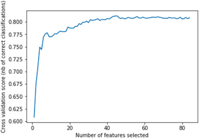

# 基于机器学习和 SHAP 的冠心病所致心力衰竭患者 3 年全因死亡率的可解释预测

Interpretable prediction of 3-year all-cause mortality in patients with heart failure caused by coronary heart disease based on machine learning and SHAP

山西医科大学公共卫生学院卫生统计系
山西医科大学第一附属医院心内科

2021 年 6 月 17 日接收，2021 年 8 月 25 日修订，2021 年 8 月 25 日接受，2021 年 8 月 28 日在线提供，记录版本于 2021 年 9 月 1 日。

## Highlights  亮点
An interpretable machine learning (ML)-based risk stratification tool was developed to predict all-cause mortality in patients with heart failure (HF) caused by coronary heart disease (CHD) during a 3-year follow-up period.

开发了一种基于可解释机器学习 （ML） 的风险分层工具，用于预测冠心病 （CHD） 引起的心力衰竭 （HF） 患者在 3 年随访期间的全因死亡率。

SHapley Additive exPlanations (SHAP) was leveraged to provide an interpretation of the prediction model with contributing risk factors leading to death in patients with HF caused by CHD.

利用 SHapley 加法解释 （SHAP） 对预测模型进行解释，该模型是导致 CHD 引起的 HF 患者死亡的危险因素。

It fills the deficiency of ML study in predicting the prognosis of HF caused by CHD, especially the risk of death in the medium and long term.

它填补了 ML 研究在预测 CHD 引起的 HF 预后方面的不足，尤其是中长期死亡风险。

Provides intuitive explanations that lead patients to predict risks, thereby helping clinicians understand the decision-making process for assessing disease severity.

提供直观的解释，引导患者预测风险，从而帮助临床医生了解评估疾病严重程度的决策过程。

## Abstract  摘要
### Background  背景
This study sought to evaluate the performance of machine learning (ML) models and establish an explainable ML model with good prediction of 3-year all-cause mortality in patients with heart failure (HF) caused by coronary heart disease (CHD).

本研究旨在评估机器学习 （ML） 模型的性能，并建立一个可解释的 ML 模型，可以很好地预测冠心病 （CHD） 引起的心力衰竭 （HF） 患者的 3 年全因死亡率。

### Methods  方法
We established six ML models using follow-up data to predict 3-year all-cause mortality. Through comprehensive evaluation, the best performing model was used to predict and stratify patients. The log-rank test was used to assess the difference between Kaplan–Meier curves. The association between ML risk and 3-year all-cause mortality was also assessed using multivariable Cox regression. Finally, an explainable approach based on ML and the SHapley Additive exPlanations (SHAP) method was deployed to calculate 3-year all-cause mortality risk and to generate individual explanations of the model's decisions.

我们使用随访数据建立了六个 ML 模型来预测 3 年全因死亡率。通过综合评估，使用表现最好的模型对患者进行预测和分层。对数秩检验用于评估 Kaplan-Meier 曲线之间的差异。还使用多变量 Cox 回归评估了 ML 风险与 3 年全因死亡率之间的关联。最后，部署了一种基于 ML 和 SHapley 加法解释 （SHAP） 方法的可解释方法来计算 3 年全因死亡风险并生成模型决策的单独解释。
### Results  结果
The best performing extreme gradient boosting (XGBoost) model was selected to predict and stratify patients. Subjects with a higher ML score had a high hazard of suffering events (hazard ratio [HR]: 10.351; P < 0.001), and this relationship persisted with a multivariable analysis (adjusted HR: 5.343; P < 0.001). Age, N-terminal pro-B-type natriuretic peptide, occupation, New York Heart Association classification, and nitrate drug use were important factors for both genders.

选择表现最好的极端梯度提升 （XGBoost） 模型来预测和分层患者。ML 评分较高的受试者发生痛苦事件的风险很高 （风险比 [HR]： 10.351;P < 0.001），并且这种关系在多变量分析中持续存在 （调整后的 HR： 5.343;P < 0.001）。年龄、N 末端 B 型利钠肽前体、职业、纽约心脏协会分类和硝酸盐药物使用是两性的重要因素。

### Conclusions  结论
The ML-based risk stratification tool was able to accurately assess and stratify the risk of 3-year all-cause mortality in patients with HF caused by CHD. ML combined with SHAP could provide an explicit explanation of individualized risk prediction and give physicians an intuitive understanding of the influence of key features in the model.

基于 ML 的风险分层工具能够准确评估和分层 CHD 引起的 HF 患者 3 年全因死亡的风险。ML 与 SHAP 相结合可以提供个体化风险预测的明确解释，并让医生直观地了解模型中关键特征的影响。

### Keywords  关键字
Interpretable model ；Heart failure ；Machine learning ；SHAP value
可解释模型 ；心力衰竭 ；机器学习 ；SHAP 值

## 1. Introduction  1. 引言
Heart failure (HF), which is characterized by cardiac systolic or diastolic dysfunction, is a major public health problem worldwide [1] and has become one of the deadliest cardiovascular diseases of the 21st century [2]. There are many causes of HF, but coronary heart disease (CHD), as the world's leading cause of heart failure, is still associated with high morbidity and mortality [3]. Patients with HF caused by CHD often have poor prognosis and high mortality due to poor physical function and a prolonged disease duration [4]. Owing to the long-term occupation of medical resources and high mortality, HF poses a heavy economic and social burden. Seeking effective measures to improve patient prognosis and reduce mortality has become an important goal of HF management. Therefore, obtaining accurate mortality risk predictions for patients with HF caused by CHD and understanding what drives these predictions is vitally important to determine targeted interventions in clinical settings.

心力衰竭 （HF） 以心脏收缩或舒张功能障碍为特征，是全球主要的公共卫生问题 [1]，并已成为 21 世纪最致命的心血管疾病之一 [2]。HF 的原因有很多，但冠心病 （CHD） 作为世界心力衰竭的主要原因，仍然与高发病率和死亡率相关 [3]。CHD 引起的 HF 患者由于身体机能差和病程延长，往往预后不良，死亡率高 [4]。由于长期占用医疗资源和高死亡率，HF 构成了沉重的经济和社会负担。寻求改善患者预后和降低死亡率的有效措施已成为 HF 管理的重要目标。因此，获得 CHD 引起的 HF 患者的准确死亡风险预测并了解驱动这些预测的因素对于确定临床环境中的针对性干预措施至关重要。

Machine learning (ML) algorithms provide researchers with powerful tools. It uses statistical methods in large datasets to infer relationships between patient attributes and outcomes and allows for objective integration of data to predict outcomes. ML has been used in many medical-related fields, such as diagnosis, outcome prediction, treatment, and medical image interpretation [5,6], and it has also been used to predict adverse outcomes in patients with HF by integrating clinical and other data in recent studies [[7], [8], [9]]. However, there is still a lack of research on ML for the prognosis of HF caused by CHD, especially medium and long-term mortality risk prediction. Moreover, despite the promising performance of ML in previous studies, evidence on its application in a real-world clinical setting and explainable risk prediction models to assist disease prognosis are limited [10,11]. Because of the “black-box” nature of ML algorithms, it is difficult to explain why certain predictions should be made about patients; that is, what specific characteristics of the patient lead to a given prediction. The lack of interpretability has so far limited the use of more powerful ML approaches in medical decision support [12], and the lack of intuitional understanding of ML models is also one of the major obstacles to implementation of ML in the medical field [13].

机器学习 （ML） 算法为研究人员提供了强大的工具。它在大型数据集中使用统计方法来推断患者属性和结果之间的关系，并允许客观地整合数据以预测结果。ML 已用于许多医学相关领域，例如诊断、结果预测、治疗和医学图像解释 [5,6]，并且在最近的研究中还通过整合临床和其他数据来预测 HF 患者的不良结局 [[7]， [8]， [9]]。然而，目前仍缺乏对 ML 对 CHD 所致 HF 预后的研究，尤其是中长期死亡风险预测。此外，尽管 ML 在以前的研究中表现良好，但其在真实临床环境中应用的证据和可解释的风险预测模型有助于疾病预后的证据有限 [10,11]。由于 ML 算法的“黑盒”性质，很难解释为什么应该对患者进行某些预测;也就是说，患者的哪些特定特征会导致给定的预测。到目前为止，缺乏可解释性限制了更强大的 ML 方法在医疗决策支持中的使用 [12]，而缺乏对 ML 模型的直觉理解也是 ML 在医疗领域实施的主要障碍之一 [13]。

To solve these disadvantages, this study combined the advanced ML algorithm with a framework based on SHapley Additive exPlanations (SHAP) [14]. In addition to improving the accuracy of predicting 3-year mortality risk in patients with HF caused by CHD, it provides intuitive explanations that lead patients to predict risk, thereby helping clinicians better understand the decision-making process for assessing disease severity and maximizing opportunities for early intervention. This is an important step forward for ML in medicine [12] and will help develop interpretable and personalized risk prediction models.

为了解决这些缺点，本研究将先进的 ML 算法与基于 SHapley 加法解释 （SHAP） 的框架相结合 [14]。除了提高预测 CHD 引起的 HF 患者 3 年死亡风险的准确性外，它还提供了直观的解释，引导患者预测风险，从而帮助临床医生更好地了解评估疾病严重程度的决策过程，并最大限度地增加早期干预的机会。这是医学 ML 向前迈出的重要一步 [12]，将有助于开发可解释和个性化的风险预测模型。

### 1.1. Related work  1.1. 相关工作
ML technology does not require assumptions about input variables and their relationship with output. The advantage of this completely data-driven learning without relying on rule-based programming makes ML a reasonable and feasible approach [15]. Among various data-driven methods, the performance of computational models that predict health outcomes has been improved by applying more sophisticated approaches, investigating techniques in the areas of statistics and ML [16]. An increasing number of studies are applying ML to predict cardiovascular disease [17], and various risk models can be used to assess the risk of patients across the HF spectrum [18,19]. Nowadays, people's interest in using the interpretation and tree ensemble models has grown to the development of mortality prediction models, such as random forest (RF) and Gradient Boosting Decision Tree [20,21]. Although tree ensemble models are more accurate and can also provide a ranking of feature importance, they cannot tell users whether these important factors are protective or dangerous, while logistic regression (LR) can. The “black-box” characteristics of ML algorithms make it difficult to understand and correct errors when they occur [22]. Meanwhile, improving collaboration between humans and artificial intelligence is critical for applications where explaining ML model predictions can enhance human performance [23]. A balance between model accuracy and interpretation is often difficult to achieve, and the probabilities of risk that the model outputs are not easily understood by most physicians.

ML 技术不需要对输入变量及其与输出的关系进行假设。这种完全数据驱动的学习而不依赖于基于规则的编程的优势使 ML 成为一种合理且可行的方法 [15]。在各种数据驱动方法中，通过应用更复杂的方法、研究统计和 ML 领域的技术，预测健康结果的计算模型的性能得到了提高 [16]。越来越多的研究正在应用 ML 来预测心血管疾病 [17]，各种风险模型可用于评估 HF 谱系患者的风险 [18,19]。如今，人们对使用解释和树集成模型的兴趣已经发展到死亡率预测模型的发展，例如随机森林 （RF） 和梯度提升决策树 [20,21]。尽管树集成模型更准确，还可以提供特征重要性的排名，但它们无法告诉用户这些重要因素是保护性的还是危险的，而逻辑回归 （LR） 可以。ML 算法的“黑盒”特性使得在错误发生时难以理解和纠正错误 [22]。同时，改善人类与人工智能之间的协作对于解释 ML 模型预测可以提高人类性能的应用至关重要 [23]。 模型准确性和解释之间的平衡通常很难实现，而且大多数医生不容易理解模型输出的风险概率。

## 2. Methods  2. 方法
### 2.1. Study population  2.1. 研究人群
This was a prospective, multi-center, cohort study to predict the 3-year risk of all-cause mortality in patients with HF caused by CHD. Patients were enrolled in a regional cardiovascular hospital and the cardiology department of a medical university hospital in Shanxi Province, China from January 2014 to June 2019 according to the inclusion and exclusion criteria.
这是一项前瞻性、多中心、队列研究，旨在预测 CHD 引起的 HF 患者 3 年全因死亡风险。根据纳入和排除标准，患者于 2014 年 1 月至 2019年6月在中国山西省某区域心血管医院和一医科大学医院心内科入组。

The inclusion criteria were as follows: 
- (1) aged ≥18 years; 
- (2) diagnosed with HF according to the guideline for the diagnosis and treatment of HF in China (2018) [24]; 
- (3) New York Heart Association (NYHA) classification II–IV disease; 
- (4) diagnosis of CHD [4]; and 
- (5) underwent HF treatment while hospitalized. 
- Patients who had an acute cardiovascular event within 2 months prior to admission or were unable or refused to participate in the program for any reason were excluded.

纳入标准如下：
- （1） 年龄 ≥18 岁;
- （2） 根据中国 HF 诊疗指南（2018 年）诊断为 HF [24];
- （3） 纽约心脏协会 （NYHA） II-IV 级疾病;
- （4） 冠心病诊断 [4];
- （5） 住院期间接受了 HF 治疗。
- 入院前 2 个月内发生急性心血管事件或因任何原因不能或拒绝参加该计划的患者被排除在外。
### 2.2. Data collection  2.2. 数据收集
Patient information was collected according to the case report form of chronic HF (CHF-CRF) developed by this research group based on the content of the case records and HF guidelines [25]. The CHF-CRF included patients’ demographics, medical history, physicals status and vitals, currently used medical therapy, echocardiography results, electrocardiography results, and laboratory parameters. All patients were followed up by a trained specialist over the telephone every 6 months after discharge to record survival information for patients with HF. Based on inclusion and exclusion criteria, we collected a total of 5188 patients with HF caused by CHD, and finally identified 1562 patients with a follow-up duration of >3 years or who died.

根据本研究小组根据病例记录内容和 HF 指南制定的慢性 HF 病例报告表 （CHF-CRF） 收集患者信息 [25]。CHF-CRF 包括患者的人口统计学、病史、身体状况和生命体征、目前使用的药物治疗、超声心动图结果、心电图结果和实验室参数。所有患者在出院后每 6 个月由训练有素的专家通过电话进行随访，以记录 HF 患者的生存信息。根据纳入和排除标准，我们共收集了 5188 例由 CHD 引起的 HF 患者，最终确定了 1562 例随访持续时间为 >3 年或死亡的患者。

The cohort used in this study was from a prospective cohort study of CHF registered by our research group in the Chinese Clinical Trial Registry (ChiCTR2100043337).

本研究中使用的队列来自我们研究小组在中国临床试验注册中心注册的 CHF 前瞻性队列研究 （ChiCTR2100043337）。

### 2.3. Study outcomes  2.3. 研究结果
The primary endpoint of the study was all-cause mortality throughout 3 years of follow up. All-cause mortality was defined as death due to any cause.

该研究的主要终点是整个 3 年随访的全因死亡率。全因死亡率定义为任何原因导致的死亡。
### 2.4. Feature selection and data preprocessing    2.4. 特征选择和数据预处理

Our structured database initially contained hundreds of clinical variables (so-called “features” in ML). Features with a missing percentage of not more than 30% were retained and filled in with the method of missForest [26]. Because the range of different features widely varied and some of the used algorithms required quantitative data normalization, Min-Max normalization was used, and multi-category variables were processed by One-Hot [27]. After the single-factor preliminary screening, the recursive feature elimination (RFE) based on RF with five-fold cross-validation (CV) was used to screen the overall features. The main idea of RFE is to build a model, select the best feature, pick out the selected feature, and then repeat this process for the remaining features until all the features are traversed.

我们的结构化数据库最初包含数百个临床变量（ML中所谓的 “特征”）。缺失百分比不超过30%的特征被保留下来，并用missForest的方法填充[26]。由于不同特征的范围差异很大，而且一些使用的算法需要定量数据归一化，所以使用了最小-最大归一化，多类别变量由One-Hot [27]处理。在单因素初步筛选后，使用基于RF的递归特征消除（RFE）和五重交叉验证（CV）来筛选整体特征。RFE的主要思想是建立一个模型，选择最好的特征，挑选出选定的特征，然后对剩余的特征重复这个过程，直到遍历所有特征。
### 2.5. Model development  2.5. 模型开发
We developed six ML models using follow-up data to predict 3-year all-cause mortality. In addition to five commonly used models [28], including LR, k-nearest neighbors (KNN), support vector machines (SVM), naive Bayesian (NB), and multi-layer perceptron (MLP), we introduced extreme gradient boosting (XGBoost). XGBoost is an optimized implementation of gradient boosting. It is based on the ensemble of weak learners and has the characteristics of high bias and low variance. XGBoost uses a second-order Taylor series to approximate the value of the loss function, and further reduces the possibility of over-fitting through regularization [29]. According to whether the endpoint occurred, stratified random sampling was used to divide 1562 patients into a training set and a test set in a 4:1 ratio. The training set was pretreated using the synthesizing minority oversampling technology combined with edited nearest neighbors (SMOTE + ENN) technique [30] to balance them between positive and negative categories.The synthetic minority oversampling technique combined with the editing nearest neighbor (SMOTE + ENN) technique [30] was used to preprocess the training set to achieve a balance between positive and negative categories. A Grid Search method with five-fold CV was used to optimize the hyper-parameters of ML models (details in Supplementary Table 1). Finally, the performance of each model was evaluated and compared in the test set. To obtain a more robust performance estimate, avoid reporting biased results and limit over-fitting, we repeated the persistence method 100 times with different random seeds and calculated the average performance in these 100 repetitions [31] (Fig. 1). Through comprehensive evaluation of multiple evaluation indicators, the best performing model among the six models was selected for further risk prediction and stratification. Furthermore, the optimal model was developed for men and women separately to assess gender-based differences in the prognostic importance of covariates.

我们使用随访数据开发了 6 个 ML 模型来预测 3 年全因死亡率。除了 LR、k 最近邻 （KNN）、支持向量机 （SVM）、朴素贝叶斯 （NB） 和多层感知器 （MLP） 等 5 种常用模型 [28] 外，我们还引入了极端梯度提升 （XGBoost）。XGBoost 是梯度提升的优化实现。它基于弱学习器的集合，具有高偏差和低方差的特点。XGBoost 使用二阶泰勒级数来近似损失函数的值，并通过正则化进一步降低了过拟合的可能性 [29]。根据终点是否出现，采用分层随机抽样，以 4：1 的比例将 1562 名患者分为训练集和测试集。使用合成少数过采样技术结合编辑的最近邻 （SMOTE + ENN） 技术 [30] 对训练集进行预处理，以平衡它们之间的正负类别。合成少数过采样技术结合编辑最近邻 （SMOTE + ENN） 技术 [30] 对训练集进行预处理，以实现正负类别之间的平衡。具有五倍 CV 的网格搜索方法用于优化 ML 模型的超参数（详见补充表 1）。最后，在测试集中评估和比较每个模型的性能。 为了获得更稳健的性能估计，避免报告有偏差的结果并限制过度拟合，我们用不同的随机种子重复了持久性方法100次，并计算了这100次重复的平均性能[31]（图1）。通过对多个评价指标的综合评价，在六个模型中选择表现最好的模型进行进一步的风险预测和分层。此外，分别为男性和女性开发了最佳模型，以评估协变量预后重要性的基于性别的差异。

### 2.6. Model interpretation and feature importance    2.6. 模型解释和功能重要性
ML models are often considered as black boxes because it is difficult to interpret why an algorithm provides accurate predictions for a particular patient cohort; therefore, we introduced the SHAP value in this study. SHAP is a unified framework proposed by Lundberg and Lee [14] to interpret ML predictions, and it is a new approach to explain various black-box ML models. It has previously been validated in terms of its interpretability performance [11,32]. SHAP can perform local and global interpretability simultaneously, and it has a solid theoretical foundation compared with other methods [12]. We leveraged SHAP to provide an explanation for our predictive model, which includes related risk factors that lead to death in patients with HF caused by CHD. To determine the main predictors of all-cause mortality in the patient population, we calculated the importance of ranking features from the final model.

ML 模型通常被认为是黑盒，因为很难解释为什么算法为特定患者群体提供准确的预测;因此，我们在本研究中引入了 SHAP 值。SHAP 是 Lundberg 和 Lee [14] 提出的用于解释 ML 预测的统一框架，是一种解释各种黑盒 ML 模型的新方法。它之前已经在其可解释性性能方面得到了验证 [11,32]。SHAP 可以同时执行局部和全局可解释性，与其他方法相比，它具有坚实的理论基础 [12]。我们利用 SHAP 为我们的预测模型提供解释，其中包括导致 CHD 引起的 HF 患者死亡的相关危险因素。为了确定患者群体中全因死亡率的主要预测因子，我们计算了对最终模型中特征进行排名的重要性。
### 2.7. Statistical analysis    2.7. 统计分析
All analyses and calculations were performed using Python Version 3.6.5 (imblearn, sklearn, xgboost, lifelines, and shap packages) and R version 4.0.2 (survival and survminer packages).

所有分析和计算均使用 Python 版本 3.6.5（imblearn、sklearn、xgboost、lifelines 和 shap 包）和 R 版本 4.0.2（survival 和 survminer 包）进行。

Multiple evaluation indices, including sensitivity, specificity, F1-score, and area under the receiver operating characteristic curve (AUC) were used to comprehensively evaluate the discrimination of ML models. The Brier score [9] was used to evaluate model calibration. The evaluation indices of the six models were compared to one-way analysis of variance and multiple comparisons of least-significant difference. The highest Youden's index was used to define an optimal cut-off value and to separate patients with a low and high ML risk. The log-rank test was then used to assess the difference between Kaplan–Meier curves. The association between ML risk and 3-year all-cause mortality was also assessed using multivariable Cox regression. The statistical significance was based on a two-tailed P value of ≤0.05.

采用敏感性、特异性、F1评分、受试者工作特征曲线下面积（AUC）等多个评价指标，综合评价ML模型的鉴别度。Brier评分[9]用于评价模型校准。将六种模型的评价指标与单因素方差分析和最小显著性差异的多重比较进行比较。最高的 Youden 指数用于定义最佳临界值，并区分 ML 风险低和高的患者。然后使用对数秩检验评估 Kaplan-Meier 曲线之间的差异。还使用多变量 Cox 回归评估 ML 风险与 3 年全因死亡率之间的关联。统计显着性基于 ≤0.05 的双尾 P 值。

## 3. Results  3. 结果
### 3.1. Patient characteristics    3.1. 患者特征
A total of 1562 patients with HF caused by CHD were followed for at least 3 years or died within 3 years, including 1023 male patients (65.49%) with an average age of 65.27 ± 11.14 years and 539 female patients (34.51%) with an average age of 70.80 ± 9.64 years. The average age of all patients was 67.18 ± 10.96 years. During the 3-year follow-up, 210 patients (13.44%) died. The mortality rate was 9.09% at 1 year and 11.72% at 2 years. Furthermore, during the 1-, 2-, and 3-year follow-up periods, the cumulative mortality rates were 6.55%, 10.56%, and 13.20%, respectively, for men, and 4.49%, 10.39%, and 13.91%, respectively, for women.

共有 1562 例 CHD 所致 HF 患者随访至少 3 年或在 3 年内死亡，其中男性患者 1023 例 （65.49%），平均年龄 65.27 ± 11.14 岁，女性患者 539 例 （34.51%），平均年龄 70.80 ± 9.64 岁。所有患者的平均年龄为 67.18 ± 10.96 岁。在 3 年随访期间，210 例患者 （13.44%） 死亡。1 年死亡率为 9.09%，2 年死亡率为 11.72%。此外，在 1 年、 2 年和 3 年随访期间，男性的累积死亡率分别为 6.55% 、 10.56% 和 13.20%，女性的累积死亡率分别为 4.49% 、 10.39% 和 13.91%。
### 3.2. Population and risk factors    3.2. 人群和风险因素
Through single factor and the five-fold CV RFE-RF feature selection, the optimal number of features was 45 (Fig. 2, Table 1) (details in Supplementary Table 2).

通过单因素和五重 CV RFE-RF 特征选择，最佳特征数为 45 个（图 2，表 1）（详见补充表 2）。

### 3.3. ML to predict outcomes    3.3. ML 预测结果
Over the 3-year follow-up period, the XGBoost model achieved a mean AUC of 0.8207 (95% confidence interval [CI]: 0.8143–0.8272) and an F1-score of 0.4476 (95% CI: 0.4407–0.4546) for mortality. These values were significantly higher compared to the respective values in the other five models (P < 0.001). The mean sensitivity of 0.7520 (95% CI: 0.7471–0.7569) and specificity of 0.7493 (95% CI: 0.7356–0.7630) with XGBoost were also relatively high. Furthermore, the mean Brier score of XGBoost (0.1960; 95% CI: 0.1926–0.1995) was second only to SVM (0.1448; 95% CI: 0.1422–0.1473) among the six models (Table 2). Therefore, XGBoost was selected for further prediction in this study.

在 3 年随访期间，XGBoost 模型的平均 AUC 为 0.8207 （95% 置信区间 [CI]： 0.8143–0.8272） 和 F1 评分为 0.4476 （95% CI： 0.4407–0.4546） 死亡率。与其他五个模型中的相应值相比，这些值显着更高 （P < 0.001）。XGBoost 的平均敏感性为 0.7520 （95% CI： 0.7471–0.7569） 和 0.7493 （95% CI： 0.7356–0.7630） 的特异性也相对较高。此外，XGBoost 的平均 Brier 评分 （0.1960;95% CI： 0.1926–0.1995） 在六个模型中仅次于 SVM （0.1448;95% CI： 0.1422–0.1473）（表 2）。因此，本研究选择了 XGBoost 进行进一步预测。

### 3.4. Categorization of prediction score and risk stratification    3.4. 预测分数和风险分层的分类
The XGBoost model was used to predict and stratify the 3-year risk of all-cause mortality in individuals with HF caused by CHD in the test set. Patients were divided into high-risk and low-risk groups with the maximal Youden's index as the optimal cut-off value (0.5339) (Fig. 3A). At this cut-off value, the prediction scores were associated with a sensitivity and specificity of 0.7857 and 0.7638, respectively. As depicted by Kaplan–Meier curves, a gradual decline in survival was observed for high-risk patients over 3 years, indicating that subjects with higher prediction scores are more likely to experience death (log-rank test: P < 0.001; Fig. 3B).

XGBoost 模型用于预测和分层测试集中由 CHD 引起的 HF 个体的 3 年全因死亡风险。将患者分为高危组和低危组，以最大约登指数为最佳临界值 （0.5339）（图 3A）。在这个临界值下，预测分数分别与 0.7857 和 0.7638 的敏感性和特异性相关。如 Kaplan-Meier 曲线所示，观察到高危患者的生存率在 3 年内逐渐下降，表明预测分数较高的受试者更有可能死亡（对数秩检验：P < 0.001;图 3B）。

我最近读了这篇文献，我想要联系这篇文章的通讯作者，希望能获得他们的数据，如果可以的话，我希望能获得模型构建的代码，以便于我可以进一步优化。现在请您帮助我给这篇文章的通讯作者写一封邮件。

收件人：sxmuzyb@126.com
主题：Request for Data and Model Code for Further Research on Predicting 3-Year All-Cause Mortality in HF Patients
尊敬的张延波教授，
您好！
我叫[您的姓名]，是[您的单位或学校]的一名[您的职位或专业]，专注于心血管疾病领域的研究。我最近阅读了您在《Computers in Biology and Medicine》上发表的题为“Interpretable prediction of 3-year all-cause mortality in patients with heart failure caused by coronary heart disease based on machine learning and SHAP”的文章，对您的研究成果深感钦佩，并认为这项工作对我们领域具有重要的意义。
我目前正在开展一项相关研究，旨在进一步优化预测心力衰竭患者3年全因死亡率的模型。我相信，获取您文章中使用的数据集以及模型构建的代码，将极大地助力我的研究工作，使我能够在此基础上进行更深入的分析和模型优化。
因此，我想斗胆向您请求，如果可能的话，能否分享文章中用于模型训练和验证的数据集，以及构建机器学习模型的代码。我承诺，这些数据和代码将仅用于学术研究目的，并且我会在任何由此产生的研究成果中，明确引用您的工作并致以感谢。
如果您能够满足我的这一请求，我将不胜感激。此外，我也非常期待有机会与您进一步交流学术观点，探讨合作的可能性。
感谢您抽出宝贵时间阅读我的邮件。期待您的回复。
祝好！
[您的姓名]
[您的单位或学校]
[您的联系方式]