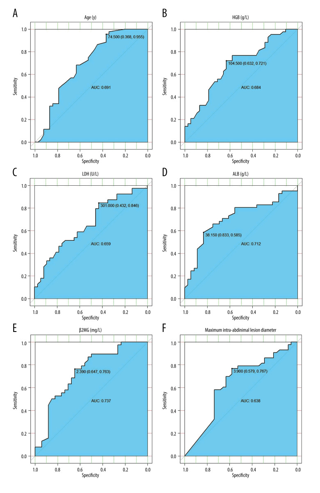
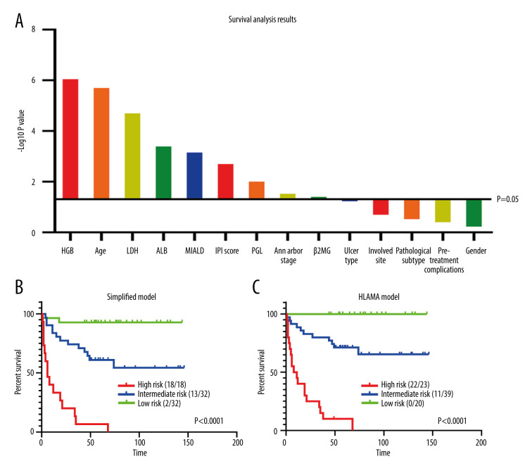
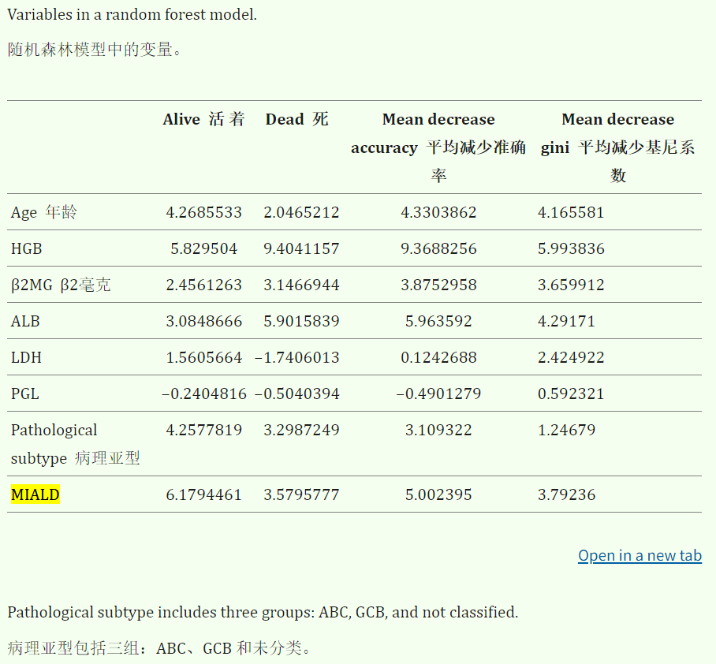
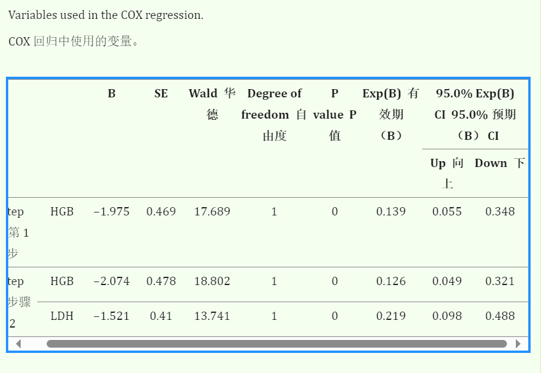
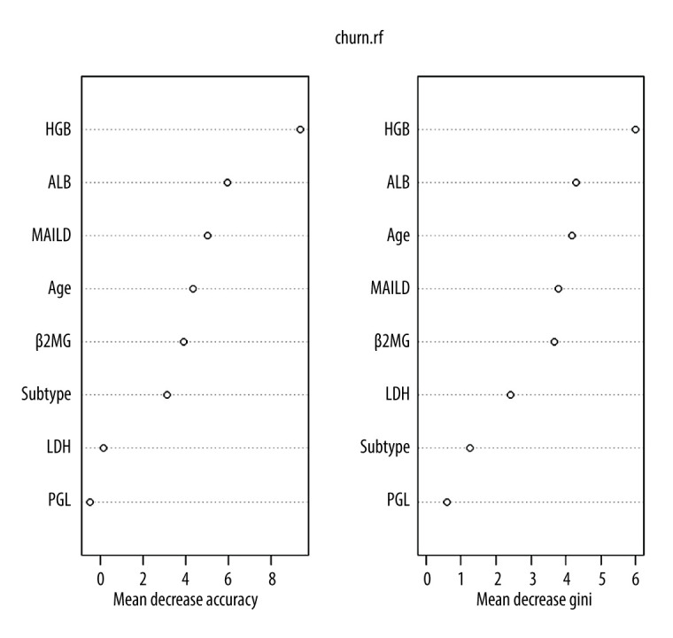
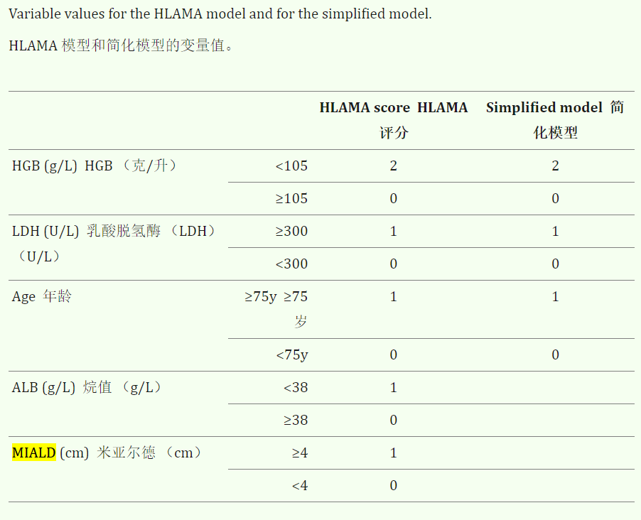
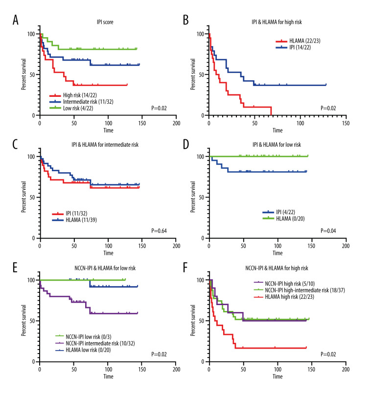

# 胃肠道弥漫性大 B 细胞淋巴瘤的预后模型
A Prognostic Model of Gastrointestinal Diffuse Large B Cell Lymphoma

## 文献总体思路和方法总结
### 研究背景
研究目的：开发一个针对胃肠道弥漫大B细胞淋巴瘤（GI-DLBCL）的预后模型，以更准确地识别局部病变患者的预后情况。
背景信息：胃肠道是DLBCL最常见的结外受累部位，其预后评估与普通DLBCL不同。目前常用的Ann Arbor分期系统、Lugano分期系统和TNM分期系统在胃肠道淋巴瘤中存在局限性，且缺乏有效的预后模型。
### 研究方法
#### 数据收集：
研究纳入了2007年3月至2017年3月在北京大学第三医院治疗的82例GI-DLBCL患者。
所有患者均通过胃肠道内镜或诊断性活检确诊，中位随访时间为75个月。
#### 变量选择：
基于3年总生存率（OS），使用R软件的pROC包绘制ROC曲线，选择合适的截断值。
重要变量包括：血红蛋白（HGB）、年龄、乳酸脱氢酶（LDH）、血清白蛋白（ALB）和最大腹腔病变直径（MIALD）。
#### 模型构建：
COX回归模型：筛选重要变量并构建预后模型。
随机森林模型：基于患者结局和数值/分类变量，预测3年生存率。
HLAMA模型：结合5个变量（HGB、年龄、LDH、ALB、MIALD），并根据变量权重分配分数。
简化模型：仅包含3个变量（HGB、LDH、年龄）。
#### 评分系统：
HLAMA模型：HGB < 105 g/L得2分；LDH ≥ 300 U/L、年龄 ≥ 75岁、ALB < 38 g/L、MIALD ≥ 4 cm各得1分。
简化模型：HGB < 105 g/L得2分；LDH ≥ 300 U/L、年龄 ≥ 75岁各得1分。
风险分层：高风险（≥4分）、中风险（1-3分）、低风险（0分）。
#### 统计分析：
使用SPSS 25.0和R软件进行统计分析。
通过单变量生存分析和多变量COX回归分析评估变量的预后价值。
使用随机森林模型评估变量的重要性。
### 研究结果
预后模型表现：HLAMA模型和简化模型均能有效预测GI-DLBCL患者的预后（P < 0.001），且优于国际预后指数（IPI）评分。
风险分层：HLAMA模型能够区分高风险患者（中位生存期仅6个月）和低风险患者（全部存活）。
模型比较：与IPI评分相比，HLAMA模型在高风险组和低风险组的预后区分能力更强。
### 结论
研究开发的HLAMA模型及其简化版本能够为GI-DLBCL患者提供更简单、更准确的预后评估。
该模型特别适用于局部病变患者，能够识别高风险患者，并在老年患者中区分低风险人群，为临床治疗提供参考。
研究局限性
样本量较小，且未纳入分子标志物或肿瘤免疫微环境相关数据，可能限制模型的应用潜力。

## 研究中模型搭建过程的详细步骤
### 1. 研究设计与数据收集
#### 目的：收集具有代表性的胃肠道弥漫大B细胞淋巴瘤（GI-DLBCL）患者数据，为后续模型构建提供基础。
#### 方法：
研究纳入了2007年3月至2017年3月在北京大学第三医院治疗的82例GI-DLBCL患者。
所有患者均通过胃肠道内镜或诊断性活检确诊，排除了复发病例。
收集患者的临床表现、实验室指标、病理亚型、免疫组化标记等数据。
中位随访时间为75个月，确保有足够的随访数据用于生存分析。
### 2. 变量选择与预处理
#### 目的：筛选与预后相关的变量，并确定其最佳截断值，为模型构建提供关键输入。
#### 方法：
基于3年总生存率（OS），使用R软件的pROC包绘制ROC曲线，选择合适的截断值。
评估的变量包括：年龄、血红蛋白（HGB）、乳酸脱氢酶（LDH）、血清白蛋白（ALB）、最大腹腔病变直径（MIALD）、β2微球蛋白（β2-MG）等。
通过ROC曲线下面积（AUC）确定每个变量的最佳截断值，例如：
年龄的截断值为75岁。
HGB的截断值为105 g/L。
LDH的截断值为300 U/L。
ALB的截断值为38 g/L。
MIALD的截断值为4 cm。
### 3. 单变量生存分析
#### 目的：初步评估每个变量对患者生存的影响，筛选出显著相关的变量。
#### 方法：
使用Kaplan-Meier生存分析和Log-rank检验，对每个变量进行单变量生存分析。
筛选出P值小于0.05的变量，包括HGB水平、年龄、LDH水平、ALB水平、MIALD、IPI评分、原发性胃肠道淋巴瘤（PGL）等。
### 4. 多变量模型构建
#### 目的：通过多变量分析，进一步筛选出独立预后因素，并构建预后模型。
#### 方法：
##### COX回归模型：
使用COX回归分析筛选出独立预后因素。
最终纳入模型的变量包括HGB、LDH、年龄、ALB和MIALD。
通过回归系数为每个变量分配权重，HGB权重最高（2分），其他变量权重为1分。
##### 随机森林模型：
使用随机森林算法评估变量的重要性。
随机森林模型的准确性为76.5%，召回率为81.3%。
最重要的变量为HGB、MIALD、年龄和ALB。
### 5. 模型构建与评分系统设计
#### 目的：开发一个简单且有效的预后评分系统，用于临床应用。
#### 方法：
##### HLAMA模型：
结合5个变量（HGB、年龄、LDH、ALB、MIALD）构建模型。
每个变量根据其权重分配分数，总分用于风险分层：
高风险：≥4分。
中风险：1-3分。
低风险：0分。
##### 简化模型：
仅包含3个变量（HGB、LDH、年龄）。
每个变量分配分数，总分用于风险分层：
高风险：≥3分。
中风险：1-2分。
低风险：0分。
### 6. 模型验证与比较
#### 目的：验证模型的有效性，并与现有预后工具（如IPI评分）进行比较。
#### 方法：
使用Kaplan-Meier生存分析和Log-rank检验，评估模型在不同风险分层中的预后区分能力。
比较HLAMA模型、简化模型与IPI评分的预后区分能力：
HLAMA模型和简化模型的P值均小于0.001，表明其预后区分能力优于IPI评分。
在高风险组和低风险组中，HLAMA模型的预后区分能力显著优于IPI评分。
### 7. 模型性能评估
#### 目的：评估模型在不同年龄组和临床场景中的适用性。
#### 方法：
分析模型在不同年龄组（>60岁和≤60岁）的预后区分能力。
比较HLAMA模型与NCCN-IPI评分的预后区分能力。
评估模型在原发性胃肠道淋巴瘤（PGL）患者中的表现。
### 8. 结论与展望
#### 目的：总结研究结果，并提出模型的临床应用前景和未来研究方向。
#### 方法：
研究开发的HLAMA模型及其简化版本能够为GI-DLBCL患者提供更简单、更准确的预后评估。
模型特别适用于局部病变患者，能够识别高风险患者，并在老年患者中区分低风险人群。
提出未来研究方向，包括多中心合作、纳入更多分子标志物和免疫微环境数据，以进一步优化模型。
### 总结
通过上述步骤，研究者系统地开发了一个基于临床指标的预后模型（HLAMA模型），并验证了其在胃肠道弥漫大B细胞淋巴瘤患者中的有效性。每一步的设计均围绕如何更准确地识别高风险患者和优化临床治疗决策展开。

## Abstract  
### Background  背景
The digestive tract is the most common site of extranodal involvement in diffuse large B cell lymphoma (DLBCL) and its prognostic evaluation is different from that of ordinary DLBCL. Currently, for gastrointestinal lymphoma, in addition to the Ann Arbor staging system, the Lugano and the TNM staging systems are commonly used. However, there is no effective prognostic model to identify poor prognosis in patients with localized gastrointestinal diffuse large B cell lymphoma (GI-DLBCL).

消化道是弥漫性大 B 细胞淋巴瘤 （DLBCL） 结外受累最常见的部位，其预后评估与普通 DLBCL 不同。目前，胃肠道淋巴瘤除了 Ann Arbor 分期系统外，还常用卢加诺和 TNM 分期系统。然而，没有有效的预后模型来识别局限性胃肠道弥漫性大 B 细胞淋巴瘤 （GI-DLBCL） 患者的不良预后。

### Material/Methods  材料/方法
This study included 82 patients with GI-DLBCL that had a median follow-up of 75 months, and developed a model (HLAMA) with 5 variables: hemoglobin, age, lactate dehydrogenase (LDH), serum albumin, and the maximum intra-abdominal lesion diameter (MIALD). The specific indicators are: HGB <105 g/L (2 points); LDH ≥300 U/L; age ≥75 years, ALB <38 g/L, MIALD ≥4 cm (each scoring 1 point). We also developed a simplified model, which includes only 3 variables (HGB, LDH, and age).
本研究纳入 82 例中位随访 75 个月的 GI-DLBCL 患者，并建立了一个具有 5 个变量的模型 （HLAMA）：血红蛋白、年龄、乳酸脱氢酶 （LDH）、血清白蛋白和最大腹腔内病变直径 （MIALD）。具体指标为：HGB <105 g/L （2 分）;乳酸脱氢酶 ≥300 U/L;年龄 ≥75 岁，ALB <38 g/L，MIALD ≥ 4 cm（各得 1 分）。我们还开发了一个简化模型，其中仅包括 3 个变量 （HGB、LDH 和年龄）。

### Results  结果
HLAMA model and the simplified model both demonstrated good ability to predict prognosis of patients with GI-DLBCL (P<0.001), performing better than the IPI score as it could distinguish low-risk groups in relatively elderly patients (60–75 years old).
HLAMA 模型和简化模型均表现出良好的预测 GI-DLBCL 患者预后的能力 （P<0.001），表现优于 IPI 评分，因为它可以区分相对老年患者 （60-75 岁） 的低风险组。

### Conclusions  结论
This study established a prognostic model for diffuse large B cell lymphoma of the gastrointestinal tract. Both the HLAMA model and its simplified version are similar to the IPI score, but could be considered better as they can provide a simpler and more accurate prognostic assessment in patients with GI-DLBCL. For patients with localized GI-DLBCL, our model could distinguish high-risk patients.
本研究建立了胃肠道弥漫性大 B 细胞淋巴瘤的预后模型。HLAMA 模型及其简化版本与 IPI 评分相似，但可以被认为更好，因为它们可以为 GI-DLBCL 患者提供更简单、更准确的预后评估。对于局限性 GI-DLBCL 患者，我们的模型可以区分高危患者。

### Keywords: 
Gastric Mucosa; Lymphoma, Large B-Cell, Diffuse; Primary Graft Dysfunction; Prognosis; Tumor Stem Cell Assay
关键字： 胃粘膜;淋巴瘤，大 B 细胞，弥漫性;原发性移植物功能障碍; 预后; 肿瘤干细胞检测

## Background  背景
The gastrointestinal tract is the most common site of extranodal involvement in diffuse large B cell lymphoma (DLBCL), accounting for approximately one-third of cases of primary extranodal DLBCL [1]. The Ann Arbor staging system [2,3] is not easily applied to gastrointestinal tract lymphomas and, although alternative staging systems have been proposed, staging gastrointestinal non-Hodgkin lymphoma (PG-NHL) is still controversial [4]. Alternative staging systems include the Lugano and the TNM staging systems. In the Lugano staging system, prognosis is based on gastrointestinal involvement, especially distant lymph node involvement. The high-risk group, Lugano stage IV, specifically refers to patients with diffuse extranodal involvement or concomitant supracondylar lymph node involvement [5]. This system has a good prognostic utility, but like the Ann Arbor staging system, it is difficult to effectively predict the prognosis in patients with DLBCL that have limited gastrointestinal tract involvement.
胃肠道是弥漫性大 B 细胞淋巴瘤 （DLBCL） 结外受累最常见的部位，约占原发性结外 DLBCL 病例的三分之一 [ 1 ]。安娜堡分期系统 [ 2 ， 3 ] 不易应用于胃肠道淋巴瘤，尽管已经提出了替代分期系统，但胃肠道非霍奇金淋巴瘤 （PG-NHL） 分期仍存在争议 [ 4 ]。替代分期系统包括卢加诺和 TNM 分期系统。在卢加诺分期系统中，预后基于胃肠道受累，尤其是远处淋巴结受累。高危组，卢加诺 IV 期，特指弥漫性结外受累或伴髁上淋巴结受累的患者 [ 5 ]。该系统具有良好的预后效用，但与 Ann Arbor 分期系统一样，很难有效预测胃肠道受累有限的 DLBCL 患者的预后。

The TNM staging system derives from the staging system of solid tumors and is evaluated by primary tumor characteristics (T), the presence or absence of regional lymph node involvement (N), and the presence or absence of distant metastases (M). Based on a retrospective analysis of 101 patients with primary gastrointestinal lymphoma, Chang et al [6] concluded that the TNM staging system was better than the Ann Arbor and the Lugano staging systems in the prognostic evaluation of primary gastrointestinal lymphoma. However, because patients with gastrointestinal diffuse large B cell lymphoma do not always undergo surgery and deep biopsy, the assessment of the depth of invasion is clinically limited. Although endoscopic ultrasound (EUS) can determine the depth of the invasion, additional tests increase the cost of treatment and are not carried out by many health centers.
TNM 分期系统源自实体瘤的分期系统，通过原发肿瘤特征 （T） 、是否存在区域淋巴结受累 （N） 以及是否存在远处转移 （M） 进行评估。基于对 101 名原发性胃肠道淋巴瘤患者的回顾性分析，Chang 等人 [ 6 ] 得出结论，在原发性胃肠道淋巴瘤的预后评估方面，TNM 分期系统优于 Ann Arbor 和 Lugano 分期系统。然而，由于胃肠道弥漫性大 B 细胞淋巴瘤患者并不总是接受手术和深部活检，因此临床上对浸润深度的评估是有限的。尽管内窥镜超声 （EUS） 可以确定浸润深度，但额外的测试会增加治疗成本，并且许多健康中心没有进行。

The International Prognostic Index (IPI) is one of the most important prognostic systems in non-Hodgkin lymphoma, with accurate prognosis in several subtypes. In 2015, researchers found that the IPI score not only clearly separated patients with primary gastric diffuse large B cell lymphoma (PG-DLBCL) into different risk groups, but also separated early-stage patients, classified according to the Lugano system, into groups with distinct prognosis [7]. However, survival of patients with the same IPI score varied significantly, indicating that there is significant residual heterogeneity in each IPI category [8]. Moreover, the original IPI score is often only available in 3 dimensions (age, lactate dehydrogenase, and performance statue) in patients with limited-stage GI-DLBCL [9]. This will inevitably have an impact on the effectiveness of the model for this group of patients.
国际预后指数 （IPI） 是非霍奇金淋巴瘤中最重要的预后系统之一，在几种亚型中具有准确的预后。2015 年，研究人员发现，IPI 评分不仅将原发性胃弥漫性大 B 细胞淋巴瘤 （PG-DLBCL） 患者明确分为不同的风险组，而且还将早期患者根据卢加诺系统分为具有不同预后的组 [ 7 ]。然而，具有相同 IPI 评分的患者的生存率差异很大，表明每个 IPI 类别都存在显着的残余异质性 [ 8 ]。此外，在局限期 GI-DLBCL 患者中，原始 IPI 评分通常仅提供 3 个维度（年龄、乳酸脱氢酶和性能雕像）[ 9 ]。这将不可避免地对模型对这组患者的有效性产生影响。

We aimed to evaluate the prognostic significance of the IPI score in gastrointestinal DLBCL based on clinical manifestations and laboratory tests. Specifically, we aimed to identify patients with limited-stage PG-DLBCL that have a poor prognosis. We expect that a new prognostic model can be established to more easily and accurately evaluate the prognosis of DLBCL of the gastrointestinal tract.
我们旨在根据临床表现和实验室检查评估 IPI 评分在胃肠道 DLBCL 中的预后意义。具体来说，我们旨在识别预后不良的局限期 PG-DLBCL 患者。我们期望可以建立一个新的预后模型，以更轻松、更准确地评估胃肠道 DLBCL 的预后。

## Material and Methods  材料和方法
### Data Set Summary  数据集摘要
This study included 82 DLBCL patients with gastrointestinal involvement who were treated at the Peking University Third Hospital from March 2007 to March 2017. All patients were diagnosed by gastrointestinal endoscopy or diagnostic biopsy, and biopsy samples from recurrence cases were ruled out. The Hans algorithm was used to perform immunohistochemical classification of diffuse large B cell lymphoma. The median follow-up time was 75 months. Among the 82 patients, the male-female ratio was 1: 2. The median age was 63.5 years and 15 patients (18.3%) were over age 75. The diagnosis of primary gastrointestinal lymphoma is based on Dawson et al [10]. There were 38 cases (46.3%) of primary gastrointestinal lymphoma, 42 cases (51.2%) with stomach involvement, 12 cases (14.6%) with small intestine involvement (including the duodenum), 14 cases (17.1%) with ileocecal involvement, and 4 cases (4.9%) with colon involvement. Rectal involvement was rare, with only 1 patient and a total of 9 patients (11%) showing multiple site involvement (2 or more sites).
本研究包括 2007 年 3 月至 2017年3月在北京大学第三医院接受治疗的 82 例胃肠道受累的 DLBCL 患者。所有患者均通过胃肠道内窥镜检查或诊断性活检诊断，并排除复发病例的活检样本。采用 Hans 算法对弥漫性大 B 细胞淋巴瘤进行免疫组化分型。中位随访时间为 75 个月。82 例患者中，男女比例为 1：2。中位年龄为 63.5 岁，15 例患者 （18.3%） 年龄在 75 岁以上。原发性胃肠道淋巴瘤的诊断基于 Dawson 等人 [ 10 ]。原发性胃肠道淋巴瘤 38 例 （46.3%），胃受累 42 例 （51.2%），小肠受累 12 例 （包括十二指肠），回盲部受累 14 例 （17.1%），结肠受累 4 例 （4.9%）。直肠受累很少见，只有 1 例患者和总共 9 例患者 （11%） 表现为多个部位受累 （2 个或更多部位）。

We grouped patients based on their initial symptoms and endoscopic findings. Regarding symptoms, patients could be: (1) asymptomatic; (2) show specific symptoms of the digestive system, which included hematemesis, hematochezia, melena, and obstipation (ie, inability to pass flatus or stool); and (3) show non-specific digestive symptoms, which included abdominal pain, bloating, anorexia, nausea, and vomiting. Regarding endoscopic findings, patients were classified according to: (1) types of ulcers: no ulcer, isolated simple ulcers, giant ulcers, and multiple ulcers; and (2) types of lesions: edema or benign ulcers (no obvious bulging lesions or lumps, only edema or ulcer lesions), thickening and diffuse bulges (with microscopically visible bulges or thickenings), lumps, or polyp-type lesions.
我们根据患者的初始症状和内窥镜检查结果对患者进行分组。关于症状，患者可以是：（1） 无症状;（2） 表现出消化系统的特定症状，包括呕血、便血、黑便和顽固性便秘（即无法排便或排便）;（3） 表现出非特异性消化系统症状，包括腹痛、腹胀、厌食、恶心和呕吐。关于内窥镜检查结果，患者根据以下几分进行分类：（1） 溃疡类型：无溃疡、孤立性简单溃疡、巨大溃疡和多发性溃疡;（2） 病变类型：水肿或良性溃疡（无明显的凸起病变或肿块，只有水肿或溃疡病变）、增厚和弥漫性凸起（具有显微镜下可见的凸起或增厚）、肿块或息肉型病变。

We used abdominal computed tomography (CT) or positron emission tomography (PET)-CT to develop a new index in which the maximum intra-abdominal measurable lesion diameter (MIALD) in the abdominal cavity, including gastrointestinal lesions and affected lymph nodes, was measured. We also analyzed the patient’s pathological subtypes and immunohistochemical markers (Bcl-2 and Bcl-6). GCB and ABC were distinguished according to the Hans algorithm and the Tally method [11,12]. Laboratory indicators used in this study included: HGB (hemoglobin, 130–175 g/L), LDH (lactic dehydrogenase, 120–250 U/L), ALB (albumin, 40–55g/L), and β2 microglobulin (β2-MG, 1.0–3.0 mg/L). These indicators were measured at the patient’s initial diagnosis. HGB refers to the value when no blood transfusion treatment was received at the initial diagnosis. The number and proportion of patients in each group can be seen in Table 1.
我们使用腹部计算机断层扫描 （CT） 或正电子发射断层扫描 （PET）-CT 开发了一个新的指标，其中测量了腹腔中的最大腹腔内可测量病灶直径 （MIALD），包括胃肠道病变和受影响的淋巴结。我们还分析了患者的病理亚型和免疫组织化学标志物 （Bcl-2 和 Bcl-6）。根据 Hans 算法和 Tally 法区分 GCB 和 ABC [ 11 ， 12 ]。本研究中使用的实验室指标包括：HGB（血红蛋白，130-175 g/L）、LDH（乳酸脱氢酶，120-250 U/L）、ALB（白蛋白，40-55g/L）和 β2 微球蛋白（β2-MG，1.0-3.0 mg/L）。这些指标是在患者初步诊断时测量的。HGB 是指在初步诊断时未接受输血治疗时的值。每组患者的数量和比例可以在 中看到 Table 1 。

### Variable Selection and Statistical Methods    变量选择和统计方法
For all quantitative data, based on the 3-year overall survival (OS) rate, we used the pROC package [13] (version 1.15.3) in R software to draw the ROC curve and select the appropriate cut-off values. For all categorical variables, comparisons between groups were made based on the 3-year survival rate and P values were obtained by chi-square tests and Fisher’s exact tests. Survival analysis was performed on each group and included age, sex, Ann Arbor stage, IPI score, onset site, and complications. All P values were obtained by the log-rank test. We used a random forest model [14] (randomForest package in R software, version 4.6–14) and a COX regression model to screen important variables and construct our prognostic models. Statistical analyses were carried out with SPSS 25.0 and R software (version 3.5.3).
对于所有定量数据，基于 3 年总生存率 （OS），我们使用 R 软件中的 pROC 包 [ 13 ] （版本 1.15.3） 绘制 ROC 曲线并选择合适的临界值。对于所有分类变量，根据 3 年生存率进行组间比较，通过卡方检验和 Fisher 精确检验获得 P 值。对每组进行生存分析，包括年龄、性别、安娜堡分期、IPI 评分、发病部位和并发症。所有 P 值均通过对数秩检验获得。我们使用随机森林模型 [ 14 ] （R 软件中的 randomForest 包，版本 4.6-14）和 COX 回归模型来筛选重要变量并构建我们的预后模型。使用 SPSS 25.0 和 R 软件（3.5.3 版）进行统计分析。

## Results  结果
### Three-year Survival Rate  三年生存率
We calculated the 3-year survival rate of all groups and performed a chi-square test to assess the differences between variables (Table 1). The 3-year survival rates for males and females were similar, and there was no significant difference in survival between groups with different sites involved. The clinical symptoms, pre-treatment complications, pathological subtypes, and BCL-2 and BCL-6 expression did not differ between groups. Additionally, the endoscopic findings did not affect the 3-year survival rate of patients. The significant variables that affected patient survival rate were: age (P=0.01, HR=2.1), primary gastrointestinal lymphoma (P<0.05, HR=2.84), post-treatment complications (P<0.05, HR=3.84), Ann Arbor stage (P<0.05, HR=1.69), IPI score (P<0.05, HR=1.61), and type of ulcers (P<0.05, HR=1.34). It seems that the IPI score (P=0.018) had a stronger effect on distinguishing patients with different prognoses than the Ann Arbor stage (P=0.045, marginally significant). Post-treatment complications seem to be more predictive of prognosis than complications before treatment: of the 14 patients with post-treatment complications, only 4 (28.6%) survived the 3-year threshold.
我们计算了所有组的 3 年生存率，并进行了卡方检验以评估变量之间的差异 （ Table 1 ）。男性和女性的 3 年生存率相似，不同部位的组间生存率无显著差异。临床症状、治疗前并发症、病理亚型以及 BCL-2 和 BCL-6 表达在组间无差异。此外，内窥镜检查结果不影响患者的 3 年生存率。影响患者生存率的显著变量为：年龄 （P=0.01，HR=2.1）、原发性胃肠道淋巴瘤 （P<0.05，HR=2.84）、治疗后并发症 （P<0.05，HR=3.84）、Ann Arbor 分期 （P<0.05，HR=1.69）、IPI 评分 （P<0.05，HR=1.61） 和溃疡类型 （P<0.05，HR=1.34）。IPI 评分 （P=0.018） 对区分不同预后的患者似乎比 Ann Arbor 分期 （P=0.045，略有显著性） 有更强的影响。治疗后并发症似乎比治疗前并发症更能预测预后： 在 14 名有治疗后并发症的患者中，只有 4 名 （28.6%） 存活了 3 年阈值。

### Quantitative Data Processing    定量数据处理
We used the pROC package of R 3.5.3 to draw ROC curves for some major quantitative data and obtained cut-off values. The mean age of patients was 61 years: 33 patients (40.2%) were younger than 60 and showed a 3-year survival rate of 72.7%, while 15 patients (18.3%) were over 75 and showed a 3-year survival rate of only 26.6%. The ROC curve of age for the 3-year survival rate suggests that the inflection point occurs at age 74.5, with an AUC of 0.691 (Figure 1A). The AUC of the ROC curve for Ki67 was only 0.548, suggesting that Ki67 had little effect on determining the prognosis. The median HGB level was 111 g/L, with a minimum value of 57 g/L and a maximum value of 167 g/L. The HGB-based ROC curve had an AUC of 0.684 and an inflection point at 104.5 g/L (Figure 1B).
我们使用 R 3.5.3 的 pROC 包绘制了一些主要定量数据的 ROC 曲线并获得临界值。患者平均年龄为 61 岁：33 例患者 （40.2%） 年龄小于 60 岁，3 年生存率为 72.7%，而 15 例患者 （18.3%） 年龄超过 75 岁，3 年生存率仅为 26.6%。年龄 3 年生存率的 ROC 曲线表明拐点发生在 74.5 岁，AUC 为 0.691 （ Figure 1A ）。Ki67 的 ROC 曲线的 AUC 仅为 0.548，表明 Ki67 对确定预后影响不大。中位 HGB 水平为 111 g/L，最小值为 57 g/L，最大值为 167 g/L。基于 HGB 的 ROC 曲线的 AUC 为 0.684，拐点为 104.5 g/L （ Figure 1B ）。

The LDH values ranged from 125 to 1833 U/L with a median of 230.5 U/L and a mean of 346.8 U/L. The AUC of its ROC curve was 0.659 and the inflection point was at 301 U/L (Figure 1C). The median value of ALB was 36.9 g/L with a minimum value of 23.1 g/L and a maximum value of 46.5 g/L. The AUC of its ROC curve was 0.712 and the inflection point was at 38.15 g/L (Figure 1D). The median value of β2MG was 2.22 mg/L with a minimum value of 0.94 mg/L, and a maximum value of 12.2 mg/L. The AUC of its ROC curve was 0.737 and the inflection point was 2.39 mg/L (Figure 1E). The median level of MIALD was 2.8 cm, with a maximum value of 17.5 cm. The AUC of the ROC curve was 0.638 and the inflection point was at 3.9 cm (Figure 1F). Based on these results, we selected the following cut-off values for the survival analysis: age 75 years, HGB level of 105 g/L, ALB level of 38 g/L, β2MG level of 2.4 mg/L, and MIALD of 4 cm.

LDH 值范围为 125 至 1833 U/L，中位数为 230.5 U/L，平均值为 346.8 U/L。其 ROC 曲线的 AUC 为 0.659，拐点为 301 U/L （ Figure 1C ）。ALB 的中位数为 36.9 g/L，最小值为 23.1 g/L，最大值为 46.5 g/L。其 ROC 曲线的 AUC 为 0.712，拐点为 38.15 g/L （ Figure 1D ）。β2MG 的中位数为 2.22 mg/L，最小值为 0.94 mg/L，最大值为 12.2 mg/L。其 ROC 曲线的 AUC 为 0.737，拐点为 2.39 mg/L （ Figure 1E ）。MIALD 的中位水平为 2.8 cm，最大值为 17.5 cm。ROC 曲线的 AUC 为 0.638，拐点在 3.9 cm （ Figure 1F ）。基于这些结果，我们选择了以下临界值进行生存分析：年龄 75 岁，HGB 水平为 105 g/L，ALB 水平为 38 g/L，β2MG 水平为 2.4 mg/L，MIALD 为 4 cm。

- 年龄 3 年生存率的 ROC 曲线表明拐点发生在 74.5 岁，AUC 为 0.691 （ Figure 1A ）。
- Ki67 的 ROC 曲线的 AUC 仅为 0.548，表明 Ki67 对确定预后影响不大。
- 基于 HGB 的 ROC 曲线的 AUC 为 0.684，拐点为 104.5 g/L （ Figure 1B ）。
- LDH 其 ROC 曲线的 AUC 为 0.659，拐点为 301 U/L （ Figure 1C ）。
- ALB 其 ROC 曲线的 AUC 为 0.712，拐点为 38.15 g/L （ Figure 1D ）。
- β2MG 其 ROC 曲线的 AUC 为 0.737，拐点为 2.39 mg/L （ Figure 1E ）。
- MIALD 的ROC 曲线的 AUC 为 0.638，拐点在 3.9 cm （ Figure 1F ）。

基于这些结果，我们选择了以下临界值进行生存分析：
- 年龄 75 岁，
- HGB 水平为 105 g/L，
- ALB 水平为 38 g/L，
- β2MG 水平为 2.4 mg/L，
- MIALD 为 4 cm。

### Survival Analysis  生存分析
Using the cut-off values selected, we were able to perform a univariate survival analysis on all variables and compare their P values. The significant variables (with P values less than 0.05) were: HGB level, age, LDH level, ALB level, MIALD, IPI score, primary gastrointestinal lymphoma (PGL; yes or no), Ann Arbor stage, and β2MG level (Figure 2A). The effect of HGB was the most significant, followed by age and LDH level. Both the Ann Arbor stage and the IPI score were significant in assessing prognosis but were relatively weak, while the diagnosis of PGL (yes or no) was somewhere in between. However, the predictive value of ALB and MIALD for prognosis was better than the IPI score.
使用所选的临界值，我们能够对所有变量进行单变量生存分析并比较它们的 P 值。显著变量 （P 值小于 0.05） 是：HGB 水平、年龄、LDH 水平、ALB 水平、MIALD、IPI 评分、原发性胃肠道淋巴瘤 （PGL;是或否）、Ann Arbor 分期和 β2MG 水平 （ Figure 2A ）。HGB 的影响最显着，其次是年龄和 LDH 水平。Ann Arbor 分期和 IPI 评分在评估预后方面均显著，但相对较弱，而 PGL 的诊断 （是或否） 介于两者之间。然而，ALB 和 MIALD 对预后的预测价值优于 IPI 评分。

### The HLAMA and the Simplified Models    HLAMA 和简化模型
To identify the most significant variables for the prognostic evaluation, we established 2 models: the COX regression model and the random forest model. Based on the COX regression model, HGB and LDH were selected as variables that could be included in the regression equation (Table 2, P<0.01). On the other hand, the random forest model, which was based on patient outcome and had numerical and categorical variables, had an accuracy rate in predicting the three3-year survival rate of 76.5% and a recall rate of 81.3%. The most significant variables were HGB, MIALD, age, and ALB (Table 3, Figure 3).
为了确定预后评估的最重要变量，我们建立了 2 个模型：COX 回归模型和随机森林模型。基于 COX 回归模型，选择 HGB 和 LDH 作为可以包含在回归方程中的变量 （ Table 2 ， P<0.01）。另一方面，基于患者结局并具有数值和分类变量的随机森林模型，预测 3 年 3 年生存率为 76.5%，召回率为 81.3%。最重要的变量是 HGB 、 MIALD、 年龄和 ALB （ Table 3 ， Figure 3 ）。

Based on these results, we built 2 models that incorporated the most significant variables (HGB level, age, LDH level, ALB level, and MIALD): an integral model with 5 variables and a simplified model with only 3 variables. Given that the HGB regression coefficient was higher in the COX regression model (Table 2) and that it was the most significant variable in both models, we gave HGB the highest weight (weight=2), while the other variables were given lower weights (weight=1).
基于这些结果，我们构建了 2 个包含最重要变量 （HGB 水平、年龄、LDH 水平、ALB 水平和 MIALD） 的模型：一个具有 5 个变量的积分模型和一个仅具有 3 个变量的简化模型。鉴于 COX 回归模型中的 HGB 回归系数较高 （ Table 2 ） 并且它是两个模型中最显著的变量，我们给 HGB 最高的权重 （weight=2），而其他变量的权重较低 （weight=1）。

The model including all 5 variables was named HLAMA and in this model, HGB values <105 g/L scored 2 points; LDH levels ≥300 U/L, age ≥75 y, ALB <38 g/L, and a maximum intra-abdominal lesion diameter (MIALD) ≥4 cm scored 1 point each. The simplified model included only HGB level, LDH level, and age (Table 4). For the HLAMA model, a high-risk group scored 4 points or higher, while a score of 0 is considered a low-risk group and a score between 0 and 4 is considered as intermediate-risk. For the simplified model, the high-risk group scored 3 or higher, the low-risk group scored 0, and the intermediate-risk group scored between 0 and 3. Using these 2 models, we were able to distinguish patients with poor prognosis from patients with good prognosis. According to the HLAMA model, there were 23 high-risk patients, of whom 22 died and the median survival period was only 6 months. The median survival period for patients in the intermediate-risk group was 55 months. There were 20 low-risk patients and all who continued their follow-up survived (Figure 2B, 2C).
包括所有 5 个变量的模型被命名为 HLAMA，在该模型中，HGB 值 <105 g/L 得分 2 分;LDH 水平 ≥300 U/L，年龄 ≥75 岁，ALB <38 g/L 和最大腹腔内病变直径 （MIALD） ≥4 cm 各得 1 分。简化模型仅包括 HGB 水平、LDH 水平和年龄 （ Table 4 ）。对于 HLAMA 模型，高危组得分为 4 分或更高，而 0 分被认为是低风险组，0 到 4 分之间的分数被认为是中等风险组。对于简化模型，高危组得分为 3 分或更高，低风险组得分为 0 分，中危组得分在 0 到 3 分之间。使用这 2 个模型，我们能够区分预后不良的患者和预后良好的患者。根据 HLAMA 模型，有 23 名高危患者，其中 22 名死亡，中位生存期仅为 6 个月。中危组患者的中位生存期为 55 个月。有 20 名低风险患者，所有继续随访的患者都存活了 （ Figure 2B, 2C ）。

### Prognosis by Age Group and IPI Score    按年龄组和 IPI 评分划分的预后
Since a larger age cut-off value is provided in the final model, we evaluated the effectiveness of the model in different age groups. Among the population with an age over 60 years, patients with good prognosis could still be selected by the HLAMA model (Figure 4). A similar distinction was found in the simplified model. On the other hand, both models included younger patients in the low- or intermediate-risk group.
由于最终模型中提供了更大的年龄临界值，因此我们评估了该模型在不同年龄组中的有效性。在年龄超过 60 岁的人群中，预后良好的患者仍然可以通过 HLAMA 模型 （ Figure 4 ） 选择。在简化模型中也发现了类似的区别。另一方面，两种模型都包括低风险或中风险组中的年轻患者。

> Prognostic analysis for different age groups. (A) HLAMA model in patients older than 60 years. (B) HLAMA model in patients younger than 60 years. (C) Simplified model in patients older than 60 years. (D) Simplified model in patients younger than 60 years.
> 不同年龄组的预后分析。（A） 60 岁以上患者的 HLAMA 模型。（B） 60 岁以下患者的 HLAMA 模型。（C） 60 岁以上患者的简化模型。（D） 60 岁以下患者的简化模型。

We compared the high-, intermediate-, and low-risk groups of the model with the corresponding groups determined by IPI scores (Figure 5A–5D). The prognosis of the high-risk group based on the HLAMA model was significantly lower than the prognosis based on IPI scores (P=0.016). The prognosis of the low-risk group based on the HLAMA model was significantly better than the prognosis based on the IPI score (P=0.04). There was no significant difference in the prognosis of the intermediate-risk group between the 2 models. We also compared the groups obtained by NCCN-IPI scores with those obtained by HLAMA scores. Because the NCCN-IPI score divides patients into 5 risk stratifications, and extranodal involvement is used as an integral item, we compared the low-risk group of HLAMA with the medium-risk and low-risk groups of the NCCN-IPI score. The results showed that the survival of the HLAMA low-risk group was similar to that of the NCCN-IPI low-risk group, but more patients were enrolled. The HLAMA high-risk group had worse survival than the NCCN-IPI high-risk group (P=0.016) (Figure 5E, 5F).
我们将模型的高、中、低风险组与 IPI 评分确定的相应组进行比较 （ Figure 5A–5D ）。基于 HLAMA 模型的高危组预后显著低于基于 IPI 评分的预后 （P=0.016）。基于 HLAMA 模型的低风险组预后显著优于基于 IPI 评分的预后 （P=0.04）。2 种模型之间中危组的预后无显著差异。我们还比较了 NCCN-IPI 评分获得的组与 HLAMA 评分获得的组。由于 NCCN-IPI 评分将患者分为 5 个风险分层，并且结外受累作为整体项目，我们将 HLAMA 低风险组与 NCCN-IPI 评分的中风险和低风险组进行了比较。结果显示，HLAMA 低风险组的生存率与 NCCN-IPI 低风险组相似，但入组患者更多。HLAMA 高危组的生存率低于 NCCN-IPI 高危组 （P=0.016） （ Figure 5E, 5F ）。

