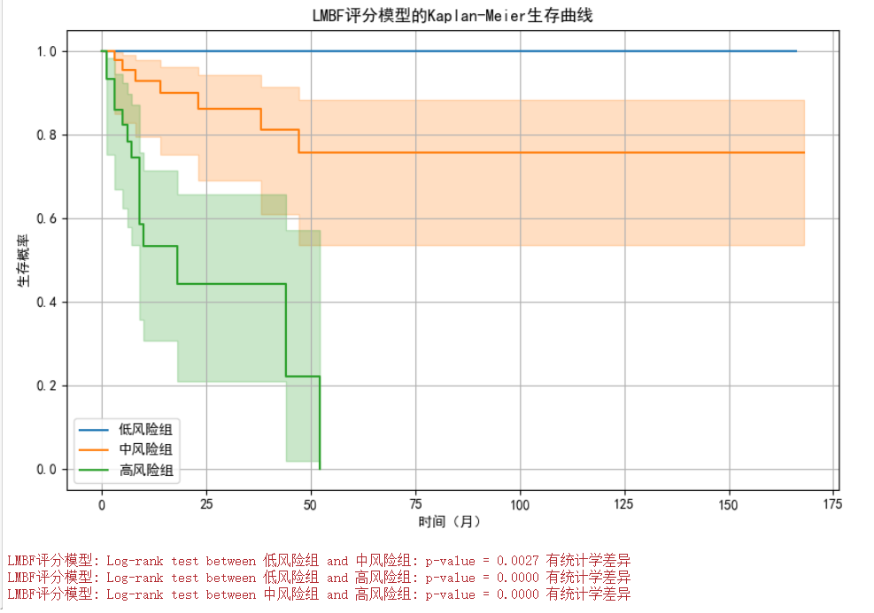

## 二、结果


## 2.3 单变量生存分析
可以对每个变量进行单变量生存分析，使用 Kaplan-Meier 曲线和 Log-rank 检验来评估每个变量对生存时间的影响。

单变量生存分析是一种统计方法，用于评估单个变量对患者生存时间的影响。它通常使用Kaplan-Meier生存曲线或log-rank检验来比较不同组别之间的生存差异。具体步骤如下：
- 分组：根据选定的临界值，将患者分为不同的组别。例如：
- - 根据年龄，将患者分为“发病年龄 < 61”和“发病年龄 ≥ 61”两组。
- - 根据WBC，将患者分为“ WBC< 9.4”和“ WBC≥ 9.4”两组。
- - 根据Lym，将患者分为“ Lym< 3.2”和“ Lym≥ 3.2”两组。
- - 根据Mono，将患者分为“ Mono< 0.54”和“ Mono≥ 0.54”两组。
- - 根据LDH，将患者分为“LDH < 212”和“LDH ≥ 212”两组。
- - 根据B2-MG，将患者分为“B2-MG < 2.7”和“B2-MG ≥ 2.7”两组。
- - 根据铁蛋白，将患者分为“铁蛋白 < 281”和“铁蛋白 ≥ 281”两组。
- - 根据ALT，将患者分为“ALT < 11”和“ALT ≥ 11”两组。
- - 根据ALB，将患者分为“ALB < 42”和“ALB ≥ 42”两组。
- - 根据Ki-67，将患者分为“Ki-67 < 100”和“Ki-67 ≥ 100”两组。

- 计算生存率：使用Kaplan-Meier方法计算每个组别的生存率随时间的变化。
- 比较生存差异：使用log-rank检验比较不同组别之间的生存率差异，得到P值。如果P值小于0.05，则认为该变量对生存有显著影响。


| 变量名称 | 分组 | p-value | 是否有统计学差异 |
|----------|------|---------|-----------------|
| 发病年龄 | < 61 和 ≥ 61 | 0.1073 | 没有统计学差异 |
| WBC      | < 9.4 和 ≥ 9.4 | 0.3215 | 没有统计学差异 |
| Lym      | < 3.2 和 ≥ 3.2 | 0.4814 | 没有统计学差异 |
| Mono     | ≥ 0.54 和 < 0.54 | 0.0015 | 有统计学差异 |
| LDH      | < 212 和 ≥ 212 | 0.0028 | 有统计学差异 |
| B2-MG    | < 2.7 和 ≥ 2.7 | 0.0027 | 有统计学差异 |
| 铁蛋白   | < 281 和 ≥ 281 | 0.0027 | 有统计学差异 |
| ALT      | ≥ 11 和 < 11 | 0.5591 | 没有统计学差异 |
| ALB      | < 42 和 ≥ 42 | 0.6399 | 没有统计学差异 |
| Ki-67    | < 100 和 ≥ 100 | 0.3545 | 没有统计学差异 |
| 性别     | 男 和 女 | 0.1059 | 没有统计学差异 |
| 是否复发进展 | 否 和 是 | 0.0000 | 有统计学差异 |
| 移植     | 无 和 有 | 0.1546 | 没有统计学差异 |
| ECOG     | 0.0 和 1.0 | 0.9505 | 没有统计学差异 |
| ECOG     | 0.0 和 2.0 | 0.7140 | 没有统计学差异 |
| ECOG     | 0.0 和 4.0 | 1.0000 | 没有统计学差异 |
| ECOG     | 0.0 和 3.0 | 0.0252 | 有统计学差异 |
| ECOG     | 1.0 和 2.0 | 0.7192 | 没有统计学差异 |
| ECOG     | 1.0 和 4.0 | 0.8131 | 没有统计学差异 |
| ECOG     | 1.0 和 3.0 | 0.0118 | 有统计学差异 |
| ECOG     | 2.0 和 4.0 | 0.8312 | 没有统计学差异 |
| ECOG     | 2.0 和 3.0 | 0.1659 | 没有统计学差异 |
| ECOG     | 4.0 和 3.0 | 0.6831 | 没有统计学差异 |
| B症状    | + 和 - | 0.2266 | 没有统计学差异 |
| 骨髓累及 | 否 和 是 | 0.7382 | 没有统计学差异 |
| Ann Arbor | 4 和 1 | 0.2378 | 没有统计学差异 |
| Ann Arbor | 4 和 2 | 0.9254 | 没有统计学差异 |
| Ann Arbor | 4 和 3 | 0.1533 | 没有统计学差异 |
| Ann Arbor | 1 和 2 | 0.2949 | 没有统计学差异 |
| Ann Arbor | 1 和 3 | 0.0145 | 有统计学差异 |
| Ann Arbor | 2 和 3 | 0.1666 | 没有统计学差异 |
| 结外数目 | 1 和 2 | 0.1804 | 没有统计学差异 |
| 结外数目 | 1 和 4 | 0.1017 | 没有统计学差异 |
| 结外数目 | 1 和 3 | 0.7863 | 没有统计学差异 |
| 结外数目 | 1 和 6 | 0.5402 | 没有统计学差异 |
| 结外数目 | 1 和 8 | 0.7304 | 没有统计学差异 |
| 结外数目 | 1 和 10 | 0.6465 | 没有统计学差异 |
| 结外数目 | 2 和 4 | 0.6886 | 没有统计学差异 |
| 结外数目 | 2 和 3 | 0.3305 | 没有统计学差异 |
| 结外数目 | 2 和 6 | 0.3668 | 没有统计学差异 |
| 结外数目 | 2 和 8 | 0.6352 | 没有统计学差异 |
| 结外数目 | 2 和 10 | 0.4419 | 没有统计学差异 |
| 结外数目 | 4 和 3 | 0.1924 | 没有统计学差异 |
| 结外数目 | 4 和 6 | 0.3040 | 没有统计学差异 |
| 结外数目 | 4 和 8 | 0.5934 | 没有统计学差异 |
| 结外数目 | 4 和 10 | 0.3812 | 没有统计学差异 |
| 结外数目 | 3 和 6 | 0.6374 | 没有统计学差异 |
| 结外数目 | 3 和 8 | 0.7389 | 没有统计学差异 |
| 结外数目 | 3 和 10 | 0.7389 | 没有统计学差异 |
| 结外数目 | 6 和 8 | 1.0000 | 没有统计学差异 |
| 结外数目 | 6 和 10 | 1.0000 | 没有统计学差异 |
| 结外数目 | 8 和 10 | 1.0000 | 没有统计学差异 |
| IPI      | 1.0 和 2.0 | 0.0371 | 有统计学差异 |
| IPI      | 1.0 和 3.0 | 0.2127 | 没有统计学差异 |
| IPI      | 1.0 和 0.0 | 0.1791 | 没有统计学差异 |
| IPI      | 1.0 和 4.0 | 0.1124 | 没有统计学差异 |
| IPI      | 1.0 和 5.0 | 0.7157 | 没有统计学差异 |
| IPI      | 2.0 和 3.0 | 0.4570 | 没有统计学差异 |
| IPI      | 2.0 和 0.0 | 0.0004 | 有统计学差异 |
| IPI      | 2.0 和 4.0 | 0.9130 | 没有统计学差异 |
| IPI      | 2.0 和 5.0 | 0.4579 | 没有统计学差异 |
| IPI      | 3.0 和 0.0 | 0.0101 | 有统计学差异 |
| IPI      | 3.0 和 4.0 | 0.5495 | 没有统计学差异 |
| IPI      | 3.0 和 5.0 | 0.5528 | 没有统计学差异 |
| IPI      | 0.0 和 4.0 | 0.0065 | 有统计学差异 |
| IPI      | 0.0 和 5.0 | 0.7893 | 没有统计学差异 |
| IPI      | 4.0 和 5.0 | 0.5364 | 没有统计学差异 |
| COO      | NGCB 和 GCB | 0.1604 | 没有统计学差异 |
| HBsAg    | - 和 + | 0.6422 | 没有统计学差异 |
| CD10     | - 和 + | 0.7333 | 没有统计学差异 |
| CD10     | - 和 _ | 0.9126 | 没有统计学差异 |
| CD10     | + 和 _ | 0.8744 | 没有统计学差异 |
| Bcl-6    | + 和 - | 0.4325 | 没有统计学差异 |
| Mum1     | + 和 - | 0.6011 | 没有统计学差异 |
| Mum1     | + 和 — | 1.0000 | 没有统计学差异 |
| Mum1     | - 和 — | 0.7963 | 没有统计学差异 |
| Bcl2     | + 和 - | 0.5877 | 没有统计学差异 |
| Bcl2     | + 和 ± | 0.7081 | 没有统计学差异 |
| Bcl2     | - 和 ± | 0.7263 | 没有统计学差异 |
| 是否减瘤 | 否 和 是 | 0.0752 | 没有统计学差异 | 

## 2.4多因素分析
### 2.4.1使用Cox回归和随机森林

本研究基于Log-rank检验结果，选取了对生存时间具有显著统计学差异的变量，分别构建了Cox比例风险回归模型和随机森林分类模型，以评估这些变量对患者生存时间的预测效能。

选取的变量为：
```python
['Mono', 'LDH', 'B2_MG', '铁蛋白', 'ECOG', 'Ann_Arbor']
```

#### Cox比例风险回归模型


#### 随机森林分类模型


##### Cox回归模型识别的重要特征
Cox回归模型筛选出以下变量作为影响患者生存时间的显著预测因子：
```python
['LDH', '铁蛋白']
```
这些变量在模型中表现出显著的统计学意义，提示它们可能在患者生存时间的预测中扮演关键角色。
##### 随机森林模型识别的重要特征
随机森林模型则识别出以下变量为生存时间的预测因子：
```python
['LDH', 'Mono', '铁蛋白', 'B2_MG']
```
这些变量在随机森林模型中显示出较高的预测重要性，表明它们可能对患者的生存状态具有显著影响。
###### 两种模型的共识与差异
在本项研究中，我们通过综合比较Cox比例风险回归模型和随机森林模型的分析结果，识别出两模型认为对患者生存时间具有显著影响的临床及实验室指标。经过细致的比较分析，我们发现共有四个变量在至少一种模型分析中显示出其重要性：β2-微球蛋白（B2-MG）、铁蛋白、乳酸脱氢酶（LDH）、单核细胞计数（Mono）。


综合Cox回归模型和随机森林模型的比较分析结果，本研究成功揭示了一组对患者生存时间具有显著预测价值的临床和实验室指标。这些研究成果不仅为临床决策制定提供了坚实的科学依据，而且为未来研究指明了新的探索方向。

最终，基于上述分析，我们构建了一个包含四个变量的风险评分模型：β2-微球蛋白（B2-MG）、铁蛋白、乳酸脱氢酶（LDH）、单核细胞计数（Mono）。此模型旨在为临床医生提供更为精确的患者生存时间预测工具，以辅助进行更为精细化的患者管理和治疗策略制定。

## 2.5风险评分生存分析

赋分规则：

| 指标 | 临界值 | 评分 |
|------|-----------|----------|
| **乳酸脱氢酶 (LDH, U/L)** |<212 |0 |
| **乳酸脱氢酶 (LDH, U/L)** |≥212 |1 |
| **Mono** |<0.54 |0 |
| **Mono** |≥0.54 |1 |
| **B2_MG** |<2.7 |0 |
| **B2_MG** |≥2.7 |1 |
| **铁蛋白** |<281|0 |
| **铁蛋白** |≥281 |1 |


- 低风险组：0分
- 中风险组：1~2
- 高风险组：3~4


IPI评分
- 低风险组：0分
- 中风险组：1~3
- 高风险组：4~5

### LMBF评分模型的Log-rank检验结果


### 更改评分规则


- 低风险组：0~1
- 中风险组：2~3
- 高风险组：4分


