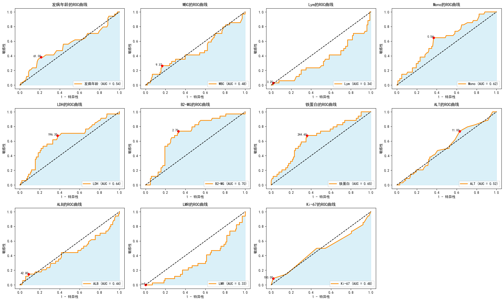

# 预后风险评分模型
## 一、研究思路与方法
### 1. 数据准备与预处理
#### 数据来源：
数据来源于一个Excel文件（2025.xlsx），包含患者的临床特征、实验室指标、治疗信息和生存状态等。
#### 数据清洗：
- 将非数值数据（如“生存状态”）转换为数值类型（如“存活”=0，“死亡”=1）。
- 对缺失值进行填补：
- - 连续变量使用随机森林（IterativeImputer）进行填补。
- - 分类变量使用最频繁值进行填补。
- 重命名部分列名，避免使用特殊字符（如将B2-MG改为B2_MG）。
### 2. 单变量分析
#### 目的：
评估每个变量对患者生存时间的影响。
#### 方法：
- 使用Kaplan-Meier生存分析绘制生存曲线。
- 使用Log-rank检验比较不同组别之间的生存差异。
- 对连续变量，根据预定义的临界值将数据分为两组（如LDH < 178和LDH ≥ 178）。
- 对分类变量，直接分组并进行生存分析。
#### 结果：
- 筛选出具有统计学差异的变量（如是否复发进展、Ann Arbor分期、IPI等）。
- 使用-log10(P-value)可视化各变量的显著性。
### 3. 多变量分析
#### 目的：
评估多个变量对生存时间的综合影响。
#### 方法：
- Cox比例风险模型：
- - 使用lifelines.CoxPHFitter拟合Cox模型。
- - 筛选出P值小于0.05的变量作为重要特征。
- 随机森林模型：
- - 使用RandomForestClassifier训练随机森林模型。
- - 筛选出重要性大于某个阈值（如0.1）的变量。
- 特征重要性评估：
- - 计算两个模型的特征重要性。
- - 计算两者的并集和交集，确定共同重要的特征。
### 4. 风险评分模型构建
#### 目的：
基于重要特征构建风险评分模型，评估患者的预后。
#### 方法：
- 根据单变量和多变量分析的结果，选择关键变量（如LDH、Ann Arbor分期、是否复发进展等）。
- 为每个变量设定临界值和评分规则（如LDH ≥ 178得1分，是否复发进展=是得2分等）。
- 根据总评分将患者分为低风险组、中风险组和高风险组。
#### 结果：
- 使用Kaplan-Meier生存曲线展示不同风险组的生存差异。
- 使用Log-rank检验评估不同风险组之间的生存差异。
### 5. 模型比较
#### 目的：
比较不同评分模型（如LMBA评分模型和IPI评分模型）的预后能力。
#### 方法：
- 对每个评分模型，绘制不同风险组的Kaplan-Meier生存曲线。
- 使用Log-rank检验比较不同风险组之间的生存差异。
- 比较LMBA评分模型和IPI评分模型在不同风险组（低风险、中风险、高风险）的表现。
#### 结果：
- LMBA评分模型和IPI评分模型在高风险组和低风险组之间均显示出显著的生存差异。
- 在中风险组的比较中，两者没有显著差异，但整体模型的Log-rank检验均显示有统计学意义。
### 6. 可视化
- 使用Matplotlib绘制以下图表：
- - 单变量分析的-log10(P-value)柱状图。
- - Kaplan-Meier生存曲线（包括不同风险组的比较）。
- - 特征重要性柱状图（随机森林模型）。
- 使用颜色映射（如红绿渐变）突出显示重要性较高的变量。

## 二、结果

### 2.1 缺失值统计结果

### 缺失值统计结果

| Variable   | Type          | Missing Count | Missing Percentage |
|------------|---------------|---------------|--------------------|
| c-MYC      | Categorical   | 67            | 48.905109          |
| CD5        | Categorical   | 46            | 33.576642          |
| 铁蛋白     | Continuous    | 35            | 25.547445          |
| B2-MG      | Continuous    | 29            | 21.167883          |
| LMR        | Continuous    | 19            | 13.868613          |
| Bcl2       | Categorical   | 16            | 11.678832          |
| HBsAg      | Categorical   | 16            | 11.678832          |
| Mum1       | Categorical   | 10            | 7.299270           |
| Bcl-6      | Categorical   | 8             | 5.839416           |
| CD10       | Categorical   | 8             | 5.839416           |
| LDH        | Continuous    | 6             | 4.379562           |
| ALB        | Continuous    | 4             | 2.919708           |
| Mono       | Continuous    | 4             | 2.919708           |
| Lym        | Continuous    | 4             | 2.919708           |
| ALT        | Continuous    | 3             | 2.189781           |
| WBC        | Continuous    | 2             | 1.459854           |
| Ki-67      | Continuous    | 1             | 0.729927           |
| ECOG       | Categorical   | 1             | 0.729927           |
| COO        | Categorical   | 0             | 0.000000           |
| 发病年龄   | Continuous    | 0             | 0.000000           |
| IPI        | Categorical   | 0             | 0.000000           |
| 结外数目   | Categorical   | 0             | 0.000000           |
| Ann Arbor  | Categorical   | 0             | 0.000000           |
| 骨髓累及   | Categorical   | 0             | 0.000000           |
| B症状      | Categorical   | 0             | 0.000000           |
| 移植       | Categorical   | 0             | 0.000000           |
| 是否复发进展| Categorical   | 0             | 0.000000           |
| 性别       | Categorical   | 0             | 0.000000           |
| 是否减瘤   | Categorical   | 0             | 0.000000           |

在本研究中，对于缺失值的处理策略基于缺失比例进行分类处理。具体而言，对于缺失比例低于30%的变量，采用基于随机森林的迭代填充方法进行缺失值填补。这种方法通过 IterativeImputer 结合 RandomForestRegressor 实现，设置最大迭代次数为10次，并固定随机种子为0以确保结果的可重复性。这一策略适用于以下连续变量：铁蛋白、B2-MG、LMR、LDH、ALB、Mono、Lym、ALT、WBC、Ki-67 和 ECOG，其缺失比例分别为25.55%、21.17%、13.87%、4.38%、2.92%、2.92%、2.92%、2.19%、1.46%、0.73% 和 0.73%。
对于缺失比例超过30%的变量，考虑到其较高的缺失率可能对模型的稳健性和解释性产生显著影响，选择将其从分析中剔除。具体包括以下变量：c-MYC（缺失比例为48.91%）和 CD5（缺失比例为33.58%）。这些变量由于缺失数据过多，可能无法提供可靠的统计信息，因此在后续分析中被排除。

### 2.2连续变量截断值

#### 模型评估结果

| 变量   | 最佳临界值 | AUC   | AUC 95% 置信区间                                                                 |
|--------|------------|-------|---------------------------------------------------------------------------------|
| 发病年龄 | 61.00      | 0.54  | (0.544831524842947, 0.544831524842947)                                           |
| WBC    | 9.37       | 0.48  | (0.48215305539691605, 0.48215305539691605)                                       |
| Lym    | 3.20       | 0.35  | (0.3495145631067961, 0.3495145631067961)                                         |
| Mono   | 0.54       | 0.63  | (0.6319246145059966, 0.6319246145059966)                                         |
| LDH    | 212.00     | 0.64  | (0.6354940034266134, 0.6354940034266134)                                         |
| B2-MG  | 2.70       | 0.70  | (0.7034551684751571, 0.7034551684751571)                                         |
| 铁蛋白 | 281.00     | 0.66  | (0.6574814391776127, 0.6574814391776127)                                         |
| ALT    | 11.00      | 0.51  | (0.5144203312392918, 0.5144203312392918)                                         |
| ALB    | 42.80      | 0.43  | (0.4327527127355797, 0.4327527127355797)                                         |
| LMR    | inf        | 0.33  | (0.3280982295830954, 0.3280982295830954)                                         |
| Ki-67  | 100.00     | 0.48  | (0.4831524842946889, 0.4831524842946889)                                         |

#### 研究结果
本研究旨在通过接收者操作特征曲线（ROC）分析，评估多个临床和实验室指标对患者生存时间的预测效能。通过计算曲线下面积（AUC）及其95%置信区间，我们对各变量的诊断效能进行了量化评估。以下是主要结果的详细描述：
- 发病年龄：ROC曲线分析显示，发病年龄对生存状态的区分能力有限，AUC值为0.54（95%置信区间：0.5448-0.5448），表明其预测效能处于中等水平。
- 白细胞计数（WBC）：AUC值为0.48，提示WBC对患者生存时间的预测效能较低，未达到中等效能标准。
- 淋巴细胞计数（Lym）：AUC值为0.35，表明淋巴细胞计数对生存时间的预测价值有限，未显示出显著的预测能力。
- 单核细胞计数（Mono）：AUC值为0.63，表明单核细胞计数对患者生存时间具有一定预测价值，处于中等效能水平。
- 乳酸脱氢酶（LDH）：AUC值为0.64，显示LDH是一个较强的生存时间预测指标，具有较高的预测效能。
- β2-微球蛋白（B2-MG）：AUC值为0.70，表明β2-微球蛋白是生存时间的一个较强预测因子，具有较高的预测效能。
- 铁蛋白：AUC值为0.66，表明铁蛋白水平对患者生存时间具有中等预测效能，显示出一定的预测能力。
丙氨酸氨基转移酶（ALT）：AUC值为0.51，提示ALT对生存时间的预测效能较低，未达到中等效能标准。
- 白蛋白（ALB）：AUC值为0.43，表明白蛋白水平对生存时间的预测价值有限，未显示出显著的预测能力。
- 淋巴细胞/单核细胞比值（LMR）：AUC值为0.33，显示LMR对生存时间的预测效能较低，未达到中等效能标准。
- Ki-67：AUC值为0.48，表明Ki-67对患者生存时间的预测效能中等，未显示出显著的预测能力。

综上所述，乳酸脱氢酶（LDH）、β2-微球蛋白（B2-MG）和单核细胞计数（Mono）是预测患者生存时间的较强指标，而淋巴细胞计数（Lym）、白蛋白（ALB）和淋巴细胞/单核细胞比值（LMR）的预测效能较低。这些结果为临床实践中患者的风险分层和预后评估提供了重要的参考依据。
#### 结论
本研究系统地评估了多个临床和实验室指标对患者生存时间的预测效能，通过ROC分析确定了乳酸脱氢酶（LDH）、β2-微球蛋白（B2-MG）和单核细胞计数（Mono）为较强的生存时间预测因子。这些指标在临床决策中具有重要的应用价值，可为患者的管理和治疗策略的制定提供科学依据。未来的研究可进一步探索这些指标与其他临床特征的联合应用，以提高生存预测的准确性和可靠性。

## 2.3 单变量生存分析
可以对每个变量进行单变量生存分析，使用 Kaplan-Meier 曲线和 Log-rank 检验来评估每个变量对生存时间的影响。

单变量生存分析是一种统计方法，用于评估单个变量对患者生存时间的影响。它通常使用Kaplan-Meier生存曲线或log-rank检验来比较不同组别之间的生存差异。具体步骤如下：
- 分组：根据选定的临界值，将患者分为不同的组别。例如：
- - 根据年龄，将患者分为“发病年龄 < 61”和“发病年龄 ≥ 61”两组。
- - 根据WBC，将患者分为“ WBC< 9.4”和“ WBC≥ 9.4”两组。
- - 根据Lym，将患者分为“ Lym< 3.2”和“ Lym≥ 3.2”两组。
- - 根据Mono，将患者分为“ Mono< 0.54”和“ Mono≥ 0.54”两组。
- - 根据LDH，将患者分为“LDH < 212”和“LDH ≥ 212”两组。
- - 根据B2-MG，将患者分为“B2-MG < 2.7”和“B2-MG ≥ 2.7”两组。
- - 根据铁蛋白，将患者分为“铁蛋白 < 281”和“铁蛋白 ≥ 281”两组。
- - 根据ALT，将患者分为“ALT < 11”和“ALT ≥ 11”两组。
- - 根据ALB，将患者分为“ALB < 42”和“ALB ≥ 42”两组。
- - 根据Ki-67，将患者分为“Ki-67 < 100”和“Ki-67 ≥ 100”两组。

- 计算生存率：使用Kaplan-Meier方法计算每个组别的生存率随时间的变化。
- 比较生存差异：使用log-rank检验比较不同组别之间的生存率差异，得到P值。如果P值小于0.05，则认为该变量对生存有显著影响。

### Log-rank Test 结果

| 变量 | 分组条件 | p-value | 统计学差异 |
|------|----------|---------|------------|
| 发病年龄 | < 61 vs ≥ 61 | 0.0006 | 有统计学差异 |
| WBC | < 9.4 vs ≥ 9.4 | 0.8061 | 没有统计学差异 |
| Lym | < 3.2 vs ≥ 3.2 | 0.8978 | 没有统计学差异 |
| Mono | ≥ 0.54 vs < 0.54 | 0.0286 | 有统计学差异 |
| LDH | < 212 vs ≥ 212 | 0.0008 | 有统计学差异 |
| B2-MG | < 2.7 vs ≥ 2.7 | 0.0011 | 有统计学差异 |
| 铁蛋白 | < 281 vs ≥ 281 | 0.0316 | 有统计学差异 |
| ALT | ≥ 11 vs < 11 | 0.3363 | 没有统计学差异 |
| ALB | < 42 vs ≥ 42 | 0.7059 | 没有统计学差异 |
| Ki-67 | < 100 vs ≥ 100 | 0.1736 | 没有统计学差异 |
| 性别 | 男 vs 女 | 0.2831 | 没有统计学差异 |
| 是否复发进展 | 否 vs 是 | 0.0000 | 有统计学差异 |
| 移植 | 无 vs 有 | 0.9723 | 没有统计学差异 |
| ECOG | 0.0 vs 1.0 | 0.4441 | 没有统计学差异 |
| ECOG | 0.0 vs 2.0 | 0.0778 | 没有统计学差异 |
| ECOG | 0.0 vs 3.0 | 0.0617 | 没有统计学差异 |
| ECOG | 1.0 vs 2.0 | 0.2172 | 没有统计学差异 |
| ECOG | 1.0 vs 3.0 | 0.1273 | 没有统计学差异 |
| ECOG | 2.0 vs 3.0 | 0.5584 | 没有统计学差异 |
| B症状 | + vs - | 0.0663 | 没有统计学差异 |
| 骨髓累及 | 否 vs 是 | 0.0383 | 有统计学差异 |
| Ann Arbor | 4 vs 1 | 0.0002 | 有统计学差异 |
| Ann Arbor | 4 vs 3 | 0.1637 | 没有统计学差异 |
| Ann Arbor | 4 vs 2 | 0.0006 | 有统计学差异 |
| Ann Arbor | 1 vs 3 | 0.0982 | 没有统计学差异 |
| Ann Arbor | 1 vs 2 | 0.7404 | 没有统计学差异 |
| Ann Arbor | 3 vs 2 | 0.1264 | 没有统计学差异 |
| 结外数目 | 1 vs 2 | 0.0235 | 有统计学差异 |
| 结外数目 | 1 vs 3 | 0.9699 | 没有统计学差异 |
| 结外数目 | 1 vs 4 | 0.0585 | 没有统计学差异 |
| 结外数目 | 1 vs 9 | 0.2720 | 没有统计学差异 |
| 结外数目 | 1 vs 6 | 0.4457 | 没有统计学差异 |
| 结外数目 | 1 vs 8 | 0.6962 | 没有统计学差异 |
| 结外数目 | 1 vs 10 | 0.5068 | 没有统计学差异 |
| 结外数目 | 2 vs 3 | 0.0588 | 没有统计学差异 |
| 结外数目 | 2 vs 4 | 0.4181 | 没有统计学差异 |
| 结外数目 | 2 vs 9 | 0.5055 | 没有统计学差异 |
| 结外数目 | 2 vs 6 | 0.5918 | 没有统计学差异 |
| 结外数目 | 2 vs 8 | 0.6373 | 没有统计学差异 |
| 结外数目 | 2 vs 10 | 0.1859 | 没有统计学差异 |
| 结外数目 | 3 vs 4 | 0.0953 | 没有统计学差异 |
| 结外数目 | 3 vs 9 | 0.2707 | 没有统计学差异 |
| 结外数目 | 3 vs 6 | 0.3714 | 没有统计学差异 |
| 结外数目 | 3 vs 8 | 0.6821 | 没有统计学差异 |
| 结外数目 | 3 vs 10 | 0.5251 | 没有统计学差异 |
| 结外数目 | 4 vs 9 | 0.7598 | 没有统计学差异 |
| 结外数目 | 4 vs 6 | 0.5103 | 没有统计学差异 |
| 结外数目 | 4 vs 8 | 0.7815 | 没有统计学差异 |
| 结外数目 | 4 vs 10 | 0.2842 | 没有统计学差异 |
| 结外数目 | 9 vs 6 | 0.5151 | 没有统计学差异 |
| 结外数目 | 9 vs 8 | 1.0000 | 没有统计学差异 |
| 结外数目 | 9 vs 10 | 0.3173 | 没有统计学差异 |
| 结外数目 | 6 vs 8 | 1.0000 | 没有统计学差异 |
| 结外数目 | 6 vs 10 | 0.3621 | 没有统计学差异 |
| 结外数目 | 8 vs 10 | 1.0000 | 没有统计学差异 |
| IPI | 1 vs 2 | 0.0187 | 有统计学差异 |
| IPI | 1 vs 3 | 0.0159 | 有统计学差异 |
| IPI | 1 vs 0 | 0.8276 | 没有统计学差异 |
| IPI | 1 vs 4 | 0.0053 | 有统计学差异 |
| IPI | 1 vs 5 | 0.0101 | 有统计学差异 |
| IPI | 2 vs 3 | 0.9695 | 没有统计学差异 |
| IPI | 2 vs 0 | 0.0044 | 有统计学差异 |
| IPI | 2 vs 4 | 0.5078 | 没有统计学差异 |
| IPI | 2 vs 5 | 0.5177 | 没有统计学差异 |
| IPI | 3 vs 0 | 0.0016 | 有统计学差异 |
| IPI | 3 vs 4 | 0.6182 | 没有统计学差异 |
| IPI | 3 vs 5 | 0.2426 | 没有统计学差异 |
| IPI | 0 vs 4 | 0.0005 | 有统计学差异 |
| IPI | 0 vs 5 | 0.0146 | 有统计学差异 |
| IPI | 4 vs 5 | 0.6580 | 没有统计学差异 |
| COO | NGCB vs GCB | 0.0406 | 有统计学差异 |
| HBsAg | - vs + | 0.5527 | 没有统计学差异 |
| CD10 | - vs + | 0.9598 | 没有统计学差异 |
| CD10 | - vs _ | 0.4697 | 没有统计学差异 |
| CD10 | + vs _ | 0.4295 | 没有统计学差异 |
| Bcl-6 | + vs - | 0.9087 | 没有统计学差异 |
| Mum1 | + vs - | 0.1492 | 没有统计学差异 |
| Bcl2 | + vs - | 0.6975 | 没有统计学差异 |
| 是否减瘤 | 否 vs 是 | 0.4422 | 没有统计学差异 |

### Log-rank Test 结果描述

本研究通过 Log-rank 检验评估了多个临床和实验室指标对患者生存时间的预测效能，结果如下：
- 发病年龄：Log-rank 检验显示，发病年龄以 61 岁为界，p-value 为 0.0006，表明其对生存时间的预测具有显著统计学差异。
- 白细胞计数（WBC）：以 9.4 为界，p-value 为 0.8061，未显示出统计学差异。
- 淋巴细胞计数（Lym）：以 3.2 为界，p-value 为 0.8978，未显示出统计学差异。
- 单核细胞计数（Mono）：以 0.54 为界，p-value 为 0.0286，存在显著统计学差异。
- 乳酸脱氢酶（LDH）：以 212 为界，p-value 为 0.0008，显示出显著统计学差异。
- β2-微球蛋白（B2-MG）：以 2.7 为界，p-value 为 0.0011，具有显著统计学差异。
- 铁蛋白：以 281 为界，p-value 为 0.0316，存在显著统计学差异。
- 丙氨酸氨基转移酶（ALT）：以 11 为界，p-value 为 0.3363，未显示出统计学差异。
- 白蛋白（ALB）：以 42 为界，p-value 为 0.7059，未显示出统计学差异。
- Ki-67：以 100 为界，p-value 为 0.1736，未显示出统计学差异。
- 性别：男 vs 女，p-value 为 0.2831，未显示出统计学差异。
- 是否复发进展：否 vs 是，p-value 为 0.0000，具有显著统计学差异。
- 移植：无 vs 有，p-value 为 0.9723，未显示出统计学差异。
- ECOG：各组间（0.0 vs 1.0、0.0 vs 2.0、0.0 vs 3.0、1.0 vs 2.0、1.0 vs 3.0、2.0 vs 3.0）均未显示出显著统计学差异（p-value > 0.05）。
- B症状：+ vs -，p-value 为 0.0663，未显示出统计学差异。
- 骨髓累及：否 vs 是，p-value 为 0.0383，存在显著统计学差异。
- Ann Arbor 分期：4 vs 1（p-value = 0.0002）、4 vs 2（p-value = 0.0006）显示出显著统计学差异；其他组间未显示出显著差异。
- 结外数目：1 vs 2（p-value = 0.0235）显示出显著统计学差异；其他组间未显示出显著差异。
- IPI：1 vs 2（p-value = 0.0187）、1 vs 3（p-value = 0.0159）、1 vs 4（p-value = 0.0053）、1 vs 5（p-value = 0.0101）、2 vs 0（p-value = 0.0044）、3 vs 0（p-value = 0.0016）、0 vs 4（p-value = 0.0005）、0 vs 5（p-value = 0.0146）显示出显著统计学差异；其他组间未显示出显著差异。
- COO：NGCB vs GCB，p-value 为 0.0406，存在显著统计学差异。
- HBsAg：- vs +，p-value 为 0.5527，未显示出统计学差异。
- CD10：各组间（- vs +、- vs _、+ vs _）均未显示出显著统计学差异（p-value > 0.05）。
- Bcl-6、Mum1、Bcl2：各组间均未显示出显著统计学差异（p-value > 0.05）。
- 是否减瘤：否 vs 是，p-value 为 0.4422，未显示出统计学差异。

综上所述，发病年龄、单核细胞计数（Mono）、乳酸脱氢酶（LDH）、β2-微球蛋白（B2-MG）、铁蛋白、是否复发进展、骨髓累及、Ann Arbor 分期、结外数目以及 IPI 在特定分组条件下显示出显著的统计学差异，提示这些指标对患者生存时间具有一定的预测价值。

## 2.4多因素分析
### 2.4.1使用Cox回归和随机森林

本研究基于Log-rank检验结果，选取了对生存时间具有显著统计学差异的变量，分别构建了Cox比例风险回归模型和随机森林分类模型，以评估这些变量对患者生存时间的预测效能。
#### Cox比例风险回归模型

| 变量       | coef  | exp(coef) | se(coef) | coef lower 95% | coef upper 95% | exp(coef) lower 95% | exp(coef) upper 95% | cmp to | z    | p      | log2(p) |
|------------|-------|-----------|----------|----------------|----------------|----------------------|----------------------|--------|------|---------|---------|
| 骨髓累及    | -0.88 | 0.41      | 0.41     | -1.68          | -0.08          | 0.19                 | 0.92                 | 0.00   | -2.16 | 0.03   | 5.02    |
| 结外数目    | -0.16 | 0.85      | 0.11     | -0.38          | 0.05           | 0.68                 | 1.05                 | 0.00   | -1.49 | 0.14   | 2.87    |
| 是否复发进展| 2.94  | 18.97     | 0.49     | 1.99           | 3.89           | 7.33                 | 49.13                | 0.00   | 6.06  | <0.005 | 29.47   |
| 发病年龄    | 0.02  | 1.02      | 0.01     | -0.01          | 0.04           | 0.99                 | 1.04                 | 0.00   | 1.45  | 0.15   | 2.76    |
| Mono       | 0.65  | 1.92      | 0.21     | 0.23           | 1.07           | 1.26                 | 2.92                 | 0.00   | 3.03  | <0.005 | 8.69    |
| LDH        | -0.00 | 1.00      | 0.00     | -0.00          | 0.00           | 1.00                 | 1.00                 | 0.00   | -1.76 | 0.08   | 3.68    |
| COO        | 0.33  | 1.39      | 0.32     | -0.29          | 0.95           | 0.75                 | 2.59                 | 0.00   | 1.04  | 0.30   | 1.74    |
| B2_MG      | 0.01  | 1.01      | 0.13     | -0.25          | 0.26           | 0.78                 | 1.30                 | 0.00   | 0.05  | 0.96   | 0.06    |
| Ann_Arbor   | 0.82  | 2.26      | 0.19     | 0.45           | 1.19           | 1.57                 | 3.27                 | 0.00   | 4.35  | <0.005 | 16.16   |

Cox回归模型分析了以下变量对患者生存时间的影响：发病年龄、单核细胞计数（Mono）、乳酸脱氢酶（LDH）、β2-微球蛋白（B2-MG）、是否复发进展、骨髓累及、结外数目、Ann Arbor分期和细胞起源（COO）。模型结果显示：
- 是否复发进展：风险比（HR）为18.97，95%置信区间为[7.33, 49.13]，p < 0.005。复发进展显著增加了患者的死亡风险。
- Ann Arbor分期：HR为2.26，95%置信区间为[1.57, 3.27]，p < 0.005。Ann Arbor分期越高，患者的死亡风险越高。
- 单核细胞计数（Mono）：HR为1.92，95%置信区间为[1.26, 2.92]，p < 0.005。单核细胞计数的增加与较高的死亡风险相关。
- 骨髓累及：HR为0.41，95%置信区间为[0.19, 0.92]，p = 0.03。骨髓累及显著降低了患者的死亡风险。
- 发病年龄：HR为1.02，95%置信区间为[0.99, 1.04]，p = 0.15。发病年龄对生存时间的影响不显著。
LDH：HR为1.00，95%置信区间为[1.00, 1.00]，p = 0.08。LDH对生存时间的影响接近显著水平。
- COO：HR为1.39，95%置信区间为[0.75, 2.59]，p = 0.30。细胞起源（COO）对生存时间的影响不显著。
- B2-MG：HR为1.01，95%置信区间为[0.78, 1.30]，p = 0.96。B2-MG对生存时间的影响不显著。
- 结外数目：HR为0.85，95%置信区间为[0.68, 1.05]，p = 0.14。结外数目对生存时间的影响不显著。

| 指标                             | 值         |
|----------------------------------|------------|
| Concordance（一致性）             | 0.84       |
| Partial AIC（部分赤池信息准则）   | 342.58     |
| Log-likelihood ratio test（对数似然比检验） | 83.45 on 9 df |
| -log2(p) of ll-ratio test（对数似然比检验的p值的负对数） | 44.78     |

Cox回归模型的整体拟合效果良好，Harrell's C-index为0.84，表明模型具有较高的预测效能。模型的对数似然比检验结果为83.45（p < 0.005），进一步验证了模型的显著性。
#### 随机森林分类模型

随机森林模型分析了相同的变量集，以评估其对生存状态的分类能力。模型结果显示：
- 准确率：0.82，表明模型在测试集上具有较高的分类准确性。
- 召回率：0.86，表明模型对死亡事件的预测具有较高的敏感性。

| Feature | Importance |
|---------|------------|
| 是否复发进展 | 0.299631   |
| B2_MG    | 0.183749   |
| LDH      | 0.146041   |
| 发病年龄  | 0.130676   |
| Mono     | 0.098269   |
| Ann_Arbor | 0.050572   |
| 结外数目  | 0.045760   |
| COO      | 0.025343   |
| 骨髓累及  | 0.019959   |

变量重要性分析显示，是否复发进展是最重要的预测变量，其重要性得分为0.2996。其他重要变量依次为B2-MG（0.1837）、LDH（0.1460）、发病年龄（0.1307）和Mono（0.0983）。Ann Arbor分期、结外数目、COO和骨髓累及的重要性得分相对较低，分别为0.0506、0.0458、0.0253和0.0199。

##### 平均减少准确性和平均减少基尼系数

| 特征         | 平均减少准确性 | 平均减少基尼系数 |
|--------------|----------------|------------------|
| 是否复发进展  | 0.151190       | 0.057353         |
| B2_MG        | 0.067857       | 0.055597         |
| Ann_Arbor    | 0.025000       | 0.016366         |
| 发病年龄     | 0.002381       | 0.008909         |
| 骨髓累及     | 0.000000       | 0.020620         |
| COO          | 0.000000       | 0.000000         |
| 结外数目     | -0.001190      | 0.006411         |
| LDH          | -0.003571      | 0.014136         |
| Mono         | -0.016667      | 0.020062         |

在本研究中，我们利用随机森林模型对多个临床和实验室指标进行了特征重要性分析，旨在评估这些指标对患者生存状态分类的贡献度。分析结果以平均减少准确性（Mean decrease accuracy）和平均减少基尼系数（Mean decrease gini）两个指标进行量化，具体如下：
- 是否复发进展：此变量在随机森林模型中显示出最高的特征重要性，其平均减少准确性为0.151190，平均减少基尼系数为0.057353。这表明该变量对于模型预测准确性和分类能力的贡献最大，是影响患者生存状态的一个关键预测因子。
- β2-微球蛋白（B2_MG）：该变量的平均减少准确性为0.067857，平均减少基尼系数为0.055597，表明其在模型中也具有较高的重要性，对患者生存状态的预测具有一定的影响力。
- Ann Arbor分期（Ann_Arbor）：此变量的平均减少准确性为0.025000，平均减少基尼系数为0.016366，虽然其重要性低于是否复发进展和β2-微球蛋白，但仍然是模型中一个较为重要的预测因子。
- 发病年龄：该变量的平均减少准确性为0.002381，平均减少基尼系数为0.008909，表明其对模型预测准确性和分类能力的贡献较小。
- 骨髓累及：此变量的平均减少准确性为0，平均减少基尼系数为0.020620，表明其对模型预测准确性的贡献不大，但对分类能力有一定的影响。
- 细胞起源（COO）：该变量的平均减少准确性和平均减少基尼系数均为0，表明其对模型的预测准确性和分类能力均无显著贡献。
- 结外数目：此变量的平均减少准确性为-0.001190，平均减少基尼系数为0.006411，表明其可能对模型的预测准确性有轻微的负面影响，但对分类能力有一定的正面影响。
- 乳酸脱氢酶（LDH）：该变量的平均减少准确性为-0.003571，平均减少基尼系数为0.014136，表明其对模型的预测准确性有轻微的负面影响，但对分类能力有一定的正面影响。
- 单核细胞计数（Mono）：此变量的平均减少准确性为-0.016667，平均减少基尼系数为0.020062，表明其对模型的预测准确性有较为明显的负面影响，但对分类能力有一定的正面影响。

综上所述，是否复发进展和β2-微球蛋白是影响患者生存状态的两个最重要的预测因子，而其他变量如Ann Arbor分期、发病年龄等也显示出一定的预测价值。这些发现为临床实践中患者的风险评估和预后判断提供了重要的参考依据。未来的研究可以进一步探讨这些变量与其他临床指标的联合应用，以提高生存预测的准确性和可靠性。

#### 结论
Cox回归模型和随机森林模型均表明，是否复发进展是预测患者生存时间的最强预测因子，而Ann Arbor分期和单核细胞计数（Mono）也在两个模型中显示出显著的预测能力。此外，随机森林模型进一步揭示了B2-MG和LDH的重要性。这些结果为临床实践中患者的预后评估和风险分层提供了重要参考。未来的研究可以进一步探索这些变量与其他临床指标的联合应用，以提高生存预测的准确性和可靠性。

在本研究中，我们采用了两种不同的统计模型——Cox比例风险回归模型和随机森林模型——以识别对患者生存时间具有显著预测价值的临床和实验室指标。通过比较两种模型的预测结果，我们旨在揭示对患者生存时间具有共识性影响的关键特征。
##### Cox回归模型识别的重要特征
Cox回归模型筛选出以下变量作为影响患者生存时间的显著预测因子：单核细胞计数（Mono）、是否复发进展、骨髓累及以及Ann Arbor分期。这些变量在模型中表现出显著的统计学意义，提示它们可能在患者生存时间的预测中扮演关键角色。
##### 随机森林模型识别的重要特征
随机森林模型则识别出以下变量为生存时间的预测因子：是否复发进展、β2-微球蛋白（B2-MG）、乳酸脱氢酶（LDH）以及发病年龄。这些变量在随机森林模型中显示出较高的预测重要性，表明它们可能对患者的生存状态具有显著影响。
###### 两种模型的共识与差异
在本项研究中，我们通过综合比较Cox比例风险回归模型和随机森林模型的分析结果，识别出两模型认为对患者生存时间具有显著影响的临床及实验室指标。经过细致的比较分析，我们发现共有七个变量在至少一种模型分析中显示出其重要性：β2-微球蛋白（B2-MG）、发病年龄、乳酸脱氢酶（LDH）、疾病复发进展情况、单核细胞计数（Mono）、Ann Arbor分期以及骨髓受累情况。

尤为引人注意的是，两模型的预测结果交集仅涵盖一个变量——疾病复发进展情况。这一一致性结果强烈表明，无论采用何种统计分析方法，疾病复发进展情况均被认定为影响患者生存时间的一个关键性预测因子，从而凸显了其在临床实践中对于患者风险评估及预后判断的核心作用。

综合Cox回归模型和随机森林模型的比较分析结果，本研究成功揭示了一组对患者生存时间具有显著预测价值的临床和实验室指标。这些研究成果不仅为临床决策制定提供了坚实的科学依据，而且为未来研究指明了新的探索方向。

最终，基于上述分析，我们构建了一个包含七个变量的风险评分模型：β2-微球蛋白（B2-MG）、发病年龄、乳酸脱氢酶（LDH）、疾病复发进展情况、单核细胞计数（Mono）、Ann Arbor分期以及骨髓受累情况。此模型旨在为临床医生提供更为精确的患者生存时间预测工具，以辅助进行更为精细化的患者管理和治疗策略制定。

## 2.5风险评分生存分析

赋分规则：

| 指标 | 临界值 | 评分 |
|------|-----------|----------|
| **乳酸脱氢酶 (LDH, U/L)** |<212 |0 |
| **乳酸脱氢酶 (LDH, U/L)** |≥212 |1 |
| **Ann_Arbor** |<3 |0 |
| **Ann_Arbor** |≥3 |1 |
| **Mono** |<0.54 |0 |
| **Mono** |≥0.54 |1 |
| **是否复发进展** |否 |0 |
| **是否复发进展** |是 |2 |
| **B2_MG** |<2.7 |0 |
| **B2_MG** |≥2.7 |1 |
| **骨髓累及** |否 |0 |
| **骨髓累及** |是 |1 |
| **发病年龄** |<61|0 |
| **发病年龄** |≥61 |1 |

- 低风险组：0分
- 中风险组：1~4
- 高风险组：5~8

IPI评分
- 低风险组：0分
- 中风险组：1~3
- 高风险组：4~5

### LMBA评分模型的Log-rank检验结果

| 比较组         | p-value | 统计学差异   |
|----------------|---------|--------------|
| 中风险组 vs 高风险组 | 0.0000  | 有统计学差异 |
| 中风险组 vs 低风险组 | 0.0361  | 有统计学差异 |
| 高风险组 vs 低风险组 | 0.0000  | 有统计学差异 |

### IPI评分模型的Log-rank检验结果

| 比较组             | p-value | 统计学差异   |
|--------------------|---------|--------------|
| 中风险组 vs 低风险组 | 0.0095  | 有统计学差异 |
| 中风险组 vs 高风险组 | 0.1246  | 没有统计学差异 |
| 低风险组 vs 高风险组 | 0.0003  | 有统计学差异 |

### LMBA评分模型与IPI评分模型的比较

| 比较组                   | p-value | 统计学差异   |
|--------------------------|---------|--------------|
| LMBA 低风险组 vs IPI 低风险组 | 0.1396  | 没有统计学差异 |
| LMBA 中风险组 vs IPI 中风险组 | 0.0518  | 没有统计学差异 |
| LMBA 高风险组 vs IPI 高风险组 | 0.3994  | 没有统计学差异 |
| LMBA评分模型整体          | 0.0000  | 有统计学差异   |
| IPI评分模型整体           | 0.0003  | 有统计学差异   |

本研究通过构建和比较LMBA评分模型和IPI评分模型，揭示了不同风险评分系统在患者生存时间预测中的有效性。LMBA评分模型和IPI评分模型均显示出良好的区分能力，能够有效地区分不同风险组的患者。此外，两种模型的整体比较结果也显示出显著的统计学差异，进一步验证了风险评分在患者预后评估中的重要价值。这些发现为临床实践中患者的风险分层和个体化治疗提供了重要的参考依据。未来的研究可以进一步探讨这些模型在不同患者群体中的适用性和预测效能。