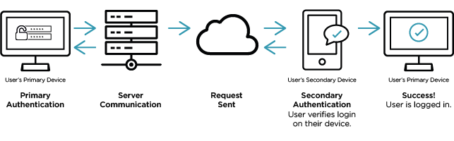
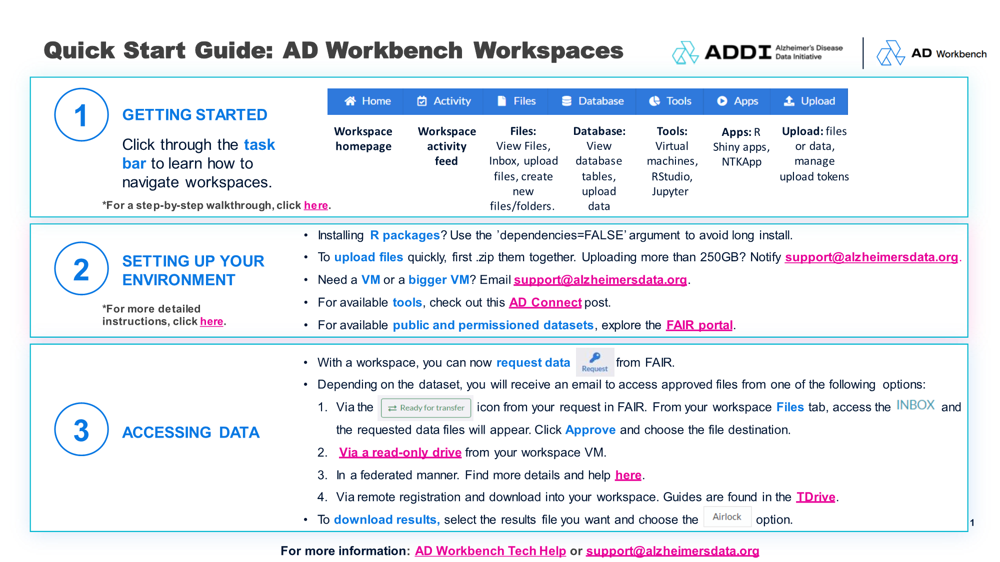
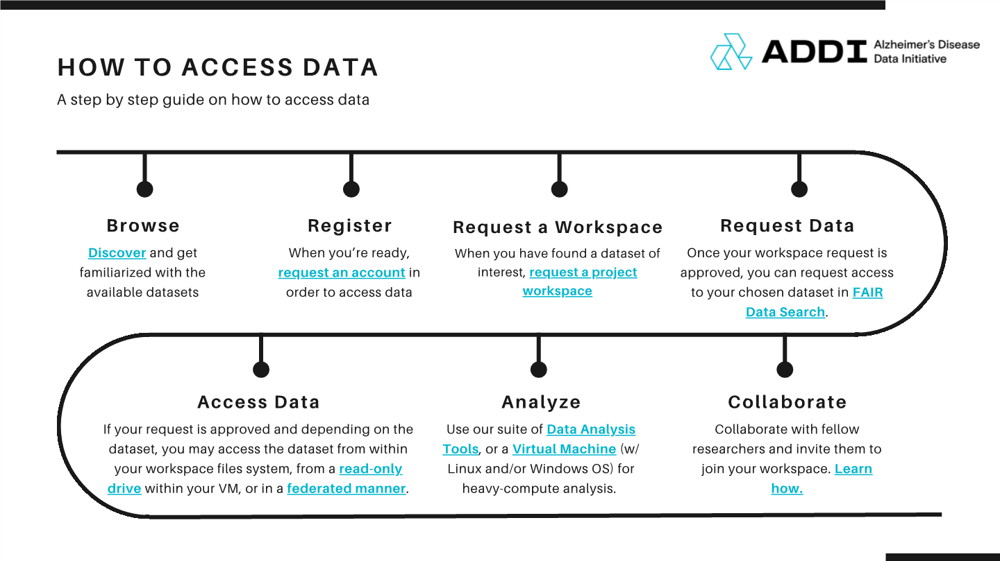
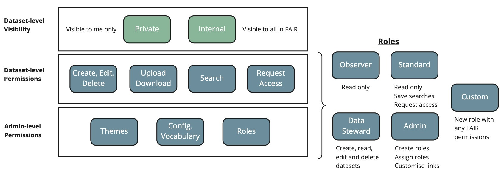

# 简介
这份文档介绍了Alzheimer相关的数据库

## 目录

## AD Data Initiative Repository

[AD Data Initiative Repository](https://www.alzheimersdata.org/ad-workbench/data-repository)

您可以访问这个平台提供的数据，也可以上传您的数据。
此外，你可以在[AD 链接](https://community.addi.ad-datainitiative.org/datasets/a/d)选择中文语言访问数据。

如果你是一个新手，你应该访问[技术帮助](https://community.addi.ad-datainitiative.org/w/faq/152/new-to-the-ad-data-initiative-start-here)，以便你熟悉这个平台。

### AD Data Initiative 的新用户？从这里开始！
欢迎来到我们的研究人员社区，我们的热情将我们联系在一起，通过数据共享和开放科学从根本上改变 ADRD 研究。

[技术帮助](https://community.addi.ad-datainitiative.org/w/faq/152/new-to-the-ad-data-initiative-start-here)

#### 什么是 AD Workbench？

AD Workbench 是一个基于云的平台，为研究人员提供对数据集的许可访问权限、安全和协作工作区、数据分析工具以及用于研究讨论和技术帮助的社区论坛， 所有这些都对用户免费。

作为一名研究人员，通常来说，第一步往往是探索数据，以便发现哪些是你感兴趣的。

#### AD 数据计划资源摘要

##### AD Workbench 

AD Workbench 是 AD Data Initiative 用于查找和访问研究数据的中心。在这里，您可以：
- 使用 FAIR Data Services 查找数据集
- 请求工作区以访问和分析数据
- 请求为您的研究访问数据
- 在 AD Connect 上与社区联系

##### AD Connect
在我们的社区中，我们邀请您与其他研究人员建立联系。寻求支持，分享想法，寻找灵感和资源。我们可以一起加快阿尔茨海默病和相关痴呆症的有意义的治疗和治愈的进展。

##### Dataset Summaries Search
发现数据，通知您的工作区和数据请求。

##### FAIR Dataset Search Portal
请求要在工作区中访问的数据集。

##### Submit Data
提交您自己的数据以在 AD Workbench 上共享和使用。

#### 如何使用 AD Workbench？

要开始在 AD Workbench 上分析数据，请遵循以下四步流程来告知您的研究计划并提交工作区和数据集的请求。

##### 1. 通过探索数据集和元数据来制定您的研究计划。
通过浏览 AD Connect 数据摘要和 FAIR 数据搜索上的数据，通知您的工作区和数据集请求。

浏览和查看 AD Connect 上的数据摘要：
- 寻找灵感并快速了解最新和最受欢迎的数据集。
- 查找手稿、发布结果和有关数据集的其他相关信息的链接。

使用 FAIR Data Search 在 AD Workbench 上分析元数据和请求数据： 
- 按标签和关键字搜索数据集并浏览摘要统计信息。
- 无需工作区或数据集请求即可深入了解现成的元数据。
##### 2. 提交工作区申请表。
请求一个分析工作区，其中包含一个 5 分钟的表格，描述您的角色、研究和分析需求。
##### 3. 在 FAIR Data Search 中请求访问数据集。
工作区请求获得批准后，您可以在 FAIR Data Search  中请求访问您选择的数据集：
- 导航到您选择的数据集，然后选择顶部的“请求访问”密钥图标。
- 提交一份 5 分钟 的简短表格，其中包含有关您的研究目标的详细信息。
##### 4. 访问批准的数据集并进行分析。
根据数据集，您将收到一封电子邮件  ，以便通过以下 选项之一访问已批准的文件：
- 通过您在 FAIR 中的请求中的“准备传输” 图标 。从您的工作区 文件 选项卡中，访问 “收件箱” ， 将显示请求的数据文件。单击 批准 并选择文件目标。 
- 通过 Workspace VM 中的只读驱动器 。
- 以联合方式。
- 通过远程注册并下载到您的工作区。

要 下载结果， 请选择所需的结果 文件，然后选择 “气闸” 选项。
#### AD Workbench 有哪些功能？

- 访问已批准的 FAIR 数据集请求以进行数据分析和下载。
- 导入您自己的数据集和 CSV 文件进行分析。
- 使用我们的数据分析工具套件*。
- 使用虚拟机（带 Linux 和/或 Windows 操作系统）进行繁重的计算分析。
- 与其他研究人员合作，并邀请他们加入您的工作区。

VM Data Science 模板上预装了 Docker、GitLab、Julia、LibreOffice 和 Visual Studio Code 等其他分析工具。
### 登录到 AD Workbench
#### 创建 ADWB 帐户

### 一、工作区
了解如何管理您的帐户、使用工作区、管理数据和使用分析工具。
#### 登录到 AD Workbench
#### 工作区基础知识和用户角色

##### 关于您的工作区
工作区是 平台内托管的私有协作分析环境，分布式团队可以通过其 Web 浏览器和虚拟机环境访问这些环境 。

工作区的核心原则 是：
- 工作区对其成员来说是 私有 的。
- 用户对 Workspace 功能和数据的访问 通过权限模型进行管理，并且可以由 Workspace 管理员维护。
- 工作区是根据 文件和数据库存储和计算要求、虚拟机要求以及任何其他附加服务（如 R Shiny 服务器）配置的 。
- 用户可以在其工作区中管理其数据 ，包括建模、清理、筛选和共享。
- 工作区允许您 管理核心数据资产 ，例如数据库文件和表、文档和脚本。
- 上传后，文件、数据库和数据文件可通过 Web 界面 和可选的 虚拟机 环境进行读写 。
- 工作区提供 审计报告。

##### Workspace 快速入门指南

#### 导航您的 Workspace

登录并进入工作区后，您将进入工作区 主页 。此页面中可以看到几个固定选项卡：

##### Home Page
此选项卡显示专用工作区主页（如果已配置）。这可以通过在 Files 文件夹中的 workspace.html 文件中提供 HTML 来完成
##### Activity 
此选项卡显示与工作区相关的最近活动的摘要 — 例如，上传或删除文件时。在此页面上，您可以添加有关工作区中任何事件的注释、评论和洞察。

##### Files
 Files 选项卡显示与工作区关联的所有文件。这些文件可以是图像、文本文档、PDF、SQL 或 R 脚本以及自定义文件。

##### Database
Database （数据库） 选项卡显示工作区数据库中可用的数据库表和自定义视图的列表。
##### Tools
Tools （工具） 选项卡提供指向以下内容的链接：

- R 控制台（预先配置了广泛的最流行的软件包，用户可以进一步自定义，以包括 R 用户社区构建的 5000+ 软件包中的任何一个）。
- 内置应用程序：（RStudio 和 Jupyter Notebook）
- 虚拟机：您可以在其中启动、停止和连接到工作区中可能有权访问的任何 Windows 或 Linux 虚拟机。

##### Apps
此选项卡不仅显示内置应用程序，还显示已发布的 Shiny 应用程序。您可以在此处运行您的 Shiny 应用程序，探索其文件结构并添加新文件。您还可以在此处从图库中删除 Shiny 应用程序。

##### Upload
此选项卡为您提供了一种上传文件和数据以及为工作区 API 生成和管理上传令牌的快速方法。
##### Administer 
此选项卡可供具有工作区管理员角色的工作区成员使用。它允许访问工作区 Audit，该审核显示工作区中发生的所有可审核事件。这些事件包括访问工作区的用户以及正在添加或删除的文件。此外，还显示了一些图表，这些图表提供了一段时间内工作区的不同类型使用情况的摘要。它还允许管理员编辑工作区详细信息和管理工作区用户。

##### Workspaces 的浏览器支持

##### Workspaces 中的共享计算资源

工作区中的某些工具和应用程序在整个中心之间共享的计算资源上运行。它们是应用程序（如内置应用程序 RStudio 和 Jupyter Notebook）、Shiny 应用程序、数据表分析模块和 R 控制台。在此处查看有关工作区工具的更多信息。

#### 用户角色
目前，企业空间支持以下 用户角色： 标准用户、 企业空间管理员、 管理者、 贡献者和 租户管理员。需要注意的是，角色是按企业空间分配的，这意味着用户可以在一个企业空间中拥有贡献者角色，而在另一个企业空间中拥有企业空间管理员。
##### 角色摘要
- 标准用户 可以使用工作区的大部分功能，但他们没有管理工作区访问权限的权限。
- Workspace 管理员 拥有与标准用户相同的权限，但此外，他们还负责 Workspace 用户管理。Workspace 管理员可以邀请新成员加入 WorkSpace，并分配适当的用户角色。
- 管理员 拥有与 Workspace 管理员相同的所有权限，但有一个权限：他们不能批准或拒绝 Airlock 请求。

##### 基于角色的权限

#### 工作区管理

了解 Workspace 所有者、管理员和管理员可用的功能。

##### 邀请用户加入您的工作区并分配角色
工作区管理员 和管理 者 负责邀请成员加入工作区，并确保通过多个基于角色的 级别授予其访问权限。

##### 在工作区中添加或删除用户
要添加新成员，用户必须提前注册一个 ADDI 帐户（在此处注册）。 管理员 或 经理 可以按照以下说明邀请新用户加入他们的工作区：
- 选择新用户应添加到的工作区 
- 在 Home 选项卡， 单击 右侧面板中的 Invite or edit members（邀请或编辑成员） 按钮
- 然后可以通过 输入个人用户的详细信息来添加 个人用户。
- 您可以使用他们姓名旁边的下拉列表选择他们的角色，即 Workspace 管理员、 标准用户、 经理或 贡献者
- 如果您是管理者，则无法 删除 Workspace 管理员，也无法 将任何其他人提升到该级别。
- 添加所有必需的成员后，单击 “更新工作区”

用户名旁边的彩色 状态指示器 指示用户是否已接受邀请（绿色）或是否仍处于待处理状态（黄色）。更改可能需要长达 10 分钟的时间来处理。

从工作区 中删除用户可以采用相同的方式完成，只需单击 用户旁边的“删除” 按钮即可删除其工作区访问权限。选择 “更新工作区” 将确认更改。

##### 更改现有工作区成员的角色

如果您需要更改工作区成员的访问级别，只需：
- 选择用户所属的工作区 
- 点击右侧面板中的 'Invite or edit Members' 
- 使用其姓名旁边的下拉菜单 选择角色
- 单击 “Update workspace”
##### 使用 Audit 选项卡监控 Workspace 活动

#### 数据和文件
上传、导出、创建和管理您的文件、文件夹和数据库表。

##### 工作区文件存储

##### 上传数据

##### 导出数据

##### 将文件传输到另一个工作区

##### 将文件从 VM 复制到工作区

##### 访问已批准的数据集
根据数据集，您将收到一封电子邮件，以便通过以下 选项之一访问已批准的文件：
- 通过您在 FAIR 中的请求中的“准备传输” 图标 。从您的工作区 文件 选项卡中，访问“收件箱” ， 将显示请求的数据文件。单击 批准 并选择文件目标。 
- 通过 Workspace VM 中的只读驱动器 。
- 以联合方式。
- 通过远程注册并下载到您的工作区。

要 下载结果， 请选择所需的结果 文件，然后选择“气闸”选项。

#### 分析数据

##### 数据表分析
使用点击式统计模块快速可视化和分析数据

##### 内置工作区工具
了解 5 个五大内置工作区应用程序： RStudio、Jupyter Notebook、NeuroToolKit （NTK） 分析应用程序、 NTK Curation 应用程序和 NTK Meta 分析应用程序

##### 安装其他软件工具
有关在 Workspace VM 中安装其他软件工具的说明

##### 闪亮的应用程序
快速构建交互式 Shiny 应用程序以分析和可视化数据

##### 虚拟机
在虚拟机上安装软件并利用可扩展计算

#### 默认工作区配置
##### 存储
工作区提供可配置的计算和存储级别，可以根据研究人员的要求进行定制。工作区可以根据请求进行扩展或缩减，从而允许多种配置并支持从使用内置工具的结构化数据分析到使用 Azure 机器学习服务的大规模模型训练等用例。

每个工作区都有一个已分配的默认 5TB 共享文件系统和 5PB 的 blob 存储。如果需要，共享文件系统可以增加到最大 100TB。存储成本基于已分配资源的使用情况。
##### 虚拟机
如果需要专用计算，可以提供虚拟机 （VM）。默认 VM 配置提供 4 个 CPU 和 14GB RAM 以及 30GB 存储空间。此外，在 Linux VM 中，每个用户都可以从 16GB 的主目录分配中受益，并在每个用户之间分配。

可以请求其他 VM 配置，并且用户可以访问部署 DRE 中心的区域内可用的任何 Azure 虚拟机配置。工作区可以有多个不同配置的 VM 可用。为了节省成本， VM 配置为根据您的时区在夜间自动关闭。

##### 工具
工作区提供内置工具，提供对 R-Studio 和 Jupyter Notebook 的访问。您的组织可能会提供更多专用的内置工具，以便在您的工作区中使用。这些工具在专用的 Kubernetes 集群上运行。默认节点配置为 8 个 CPU 和 16GB RAM。此集群 在所有工作区之间共享，默认情况下可以扩展到 10 个节点。节点配置和最大节点池大小可以根据要求更改。
##### 应用
集群上运行的每个应用程序都保证 1GB RAM 和 750m CPU，上限为 10GB RAM 和 1500m CPU。 这适用于 Shiny 应用程序、容器化应用程序和 R 控制台。

##### 备份
工作区按 14 天滚动备份。如果错误地删除了工作区，您可以在此期限内联系 support@alzheimersdata.org 以在永久删除数据之前恢复数据。

虽然备份了工作区的内容，但这 不适用于 工作区中任何虚拟机的本地驱动器。理想情况下，您的所有工作都应保存在工作区的 Files 或 Blobs 部分，或者保存在 Git 上。

### 二、FAIR 数据服务
#### FAIR 数据
##### FAIR 数据原则
###### 什么是 FAIR 数据？
 FAIR 数据原则 于 2016 年由组织和研究人员组成的财团发布，他们不仅希望提高数据集的可重用性，还希望提高工具、工作流程和算法等相关方面的可重用性。制定的原则解决了使数据 可查找、可访问、可 互操作和 可重用 （FAIR） 的四个关键方面。

- 可查找 – 通过使用标准识别机制，数据和元数据应该易于人类和机器发现。
- 可访问 – 一旦找到，数据应该易于下载并在本地或受信任的数字研究环境中使用。托管存储库还应制定计划，即使在数据本身不再可用的情况下，也应保持元数据的可访问性。
- 可互操作 – 利用标准词汇表和本体，以确保数据可以轻松映射并与其他数据集相结合。这与将数据转换为 FHIR 等标准化格式的能力一起，使各种科学学科和组织之间能够共享。
- 可重复使用 – 数据和元数据应使用限制最少的许可证进行丰富的描述，使其能够在未来的研究中轻松重复使用。与其他数据源的集成应该很容易，并通过适当的引用和描述来促进。项目的标准标识提高了数据来源，使研究人员不仅可以重复使用数据，还可以确定如何在自己的研究中复制数据的各个方面。

##### FAIR Data Services 概述
ADDI FAIR Data Services 使研究人员和创新者能够通过数据集搜索、分类和高效的元数据浏览功能来发现和理解数据，这些功能通过数据集目录、词典和相关附加资产进行描述。研究人员可以请求访问数据集，数据所有者可以在其中查看并批准或拒绝，其中批准可解锁操作，例如将数据传输到 ADDI Workspace。

##### 主要特点
- Data Discovery
- Request Access to Data
- Metadata Browsing
- Metadata Management
- Role-based Access Control
- Built on Standard  
- Integration with Aridhia Workspace
- Privacy by Design 
- Cloud-native Service 

##### FAIR 权限模型

##### 角色
##### 管理员级别权限
##### 数据集级权限
##### 数据集可见性
### 三、

### 四、

