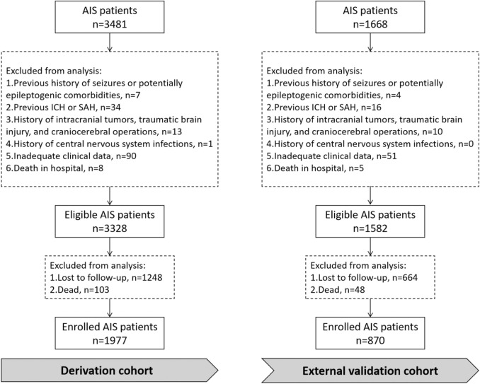
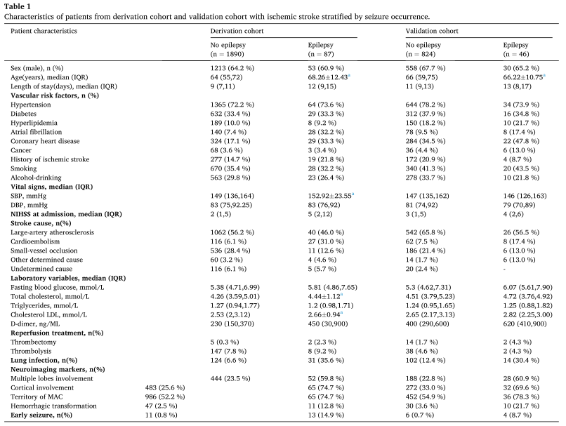
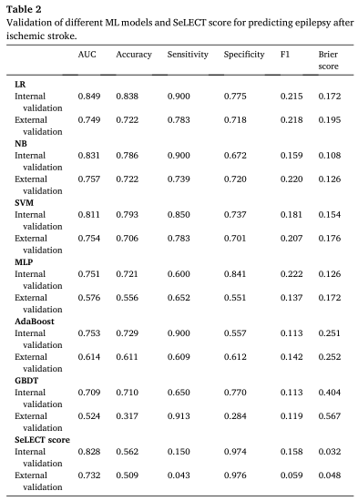
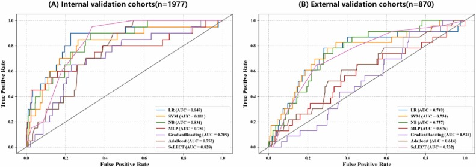
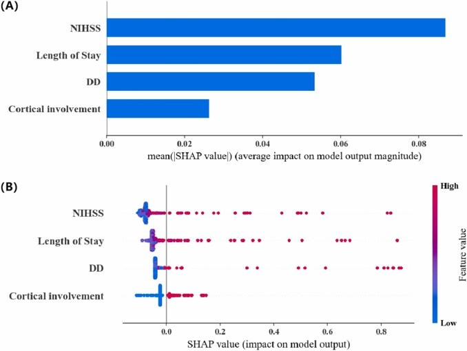

# Development and validation of an interpretable machine learning model for predicting post-stroke epilepsy
02开发和验证可解释的机器学习模型用于预测卒中后癫痫

## Highlights  亮点
- We used ML algorithms to build an interpretable model to predict the risk of PSE.
我们使用 ML 算法构建了一个可解释的模型来预测 PSE 的风险。
- Key features: NIHSS score, hospital stay, D-dimer level, and cortical involvement.
关键特征：NIHSS 评分、住院时间、D-二聚体水平和皮质受累。
- The NB model was optimal among the six classifiers in the validation cohort.
NB 模型在验证队列中的六个分类器中是最佳的。
- The NB model had higher sensitivity for PSE than the conventional approaches.
NB 模型对 PSE 的敏感性高于常规方法。

## Abstract  摘要
### Background  背景
Epilepsy is a serious complication after an ischemic stroke. Although two studies have developed prediction model for post-stroke epilepsy (PSE), their accuracy remains insufficient, and their applicability to different populations is uncertain. With the rapid advancement of computer technology, machine learning (ML) offers new opportunities for creating more accurate prediction models. However, the potential of ML in predicting PSE is still not well understood. The purpose of this study was to develop prediction models for PSE among ischemic stroke patients.

癫痫是缺血性中风后的严重并发症。虽然有两项研究已经建立了脑卒中后癫痫（PSE）的预测模型，但其准确性仍然不足，并且其对不同人群的适用性不确定。随着计算机技术的快速发展，机器学习（ML）为创建更准确的预测模型提供了新的机会。然而，ML 在预测 PSE 方面的潜力仍然没有得到很好的理解。本研究的目的是建立缺血性卒中患者 PSE 的预测模型。

### Methods  方法
Patients with ischemic stroke from two stroke centers were included in this retrospective cohort study. At the baseline level, 33 input variables were considered candidate features. The 2-year PSE prediction models in the derivation cohort were built using six ML algorithms. The predictive performance of these machine learning models required further appraisal and comparison with the reference model using the conventional triage classification information. The Shapley additive explanation (SHAP), based on fair profit allocation among many stakeholders according to their contributions, is used to interpret the predicted outcomes of the naive Bayes (NB) model.

来自两个卒中中心的缺血性卒中患者被纳入这项回顾性队列研究。在基线水平，33 个输入变量被认为是候选特征。使用 6 种 ML 算法构建推导队列中的 2 年 PSE 预测模型。这些机器学习模型的预测性能需要进一步评估，并与使用传统分流分类信息的参考模型进行比较。Shapley 加法解释（SHAP），基于公平的利润分配在许多利益相关者根据他们的贡献，被用来解释朴素贝叶斯 （NB）模型的预测结果。

### Results  结果
A total of 1977 patients were included to build the predictive model for PSE. The Boruta method identified NIHSS score, hospital length of stay, D-dimer level, and cortical involvement as the optimal features, with the receiver operating characteristic curves ranging from 0.709 to 0.849. An additional 870 patients were used to validate the ML and reference models. The NB model achieved the best performance among the PSE prediction models with an area under the receiver operating curve of 0.757. At the 20 % absolute risk threshold, the NB model also provided a sensitivity of 0.739 and a specificity of 0.720. The reference model had poor sensitivities of only 0.15 despite achieving a helpful AUC of 0.732. Furthermore, the SHAP method analysis demonstrated that a higher NIHSS score, longer hospital length of stay, higher D-dimer level, and cortical involvement were positive predictors of epilepsy after ischemic stroke.

共纳入 1977 例患者，以建立 PSE 的预测模型。Boruta 方法确定 NIHSS 评分、住院时间、D-二聚体水平和皮质受累为最佳特征，受试者工作特征曲线范围为 0.709 至 0.849。另外 870 例患者用于验证 ML 和参考模型。NB 模型在 PSE 预测模型中实现了最佳性能，其接收器操作曲线下面积为 0.757。在 20%的绝对风险阈值下，NB 模型还提供了 0.739 的灵敏度和 0.720 的特异性。参考模型的灵敏度很差，仅为 0.15，尽管达到了 0.732 的有用 AUC。此外，SHAP 方法分析表明，较高的 NIHSS 评分，较长的住院时间，较高的 D-二聚体水平和皮质受累是缺血性卒中后癫痫的阳性预测因子。

### Conclusions  结论
Our study confirmed the feasibility of applying the ML method to use easy-to-obtain variables for accurate prediction of PSE and provided improved strategies and effective resource allocation for high-risk patients. In addition, the SHAP method could improve model transparency and make it easier for clinicians to grasp the prediction model's reliability.

我们的研究证实了应用 ML 方法使用易于获得的变量准确预测 PSE 的可行性，并为高危患者提供了改进的策略和有效的资源分配。此外，SHAP 方法可以提高模型的透明度，使临床医生更容易掌握预测模型的可靠性。

### Keywords  关键词
Ischemic stroke; Post-stroke epilepsy; Machine learning; SHapley Additive explanation

缺血性中风; 中风后癫痫; 机器学习; SHapley 加法解释

## 1. Introduction  1.介绍
Stroke remains a major cause of mortality and disability worldwide (ANON, 2021), and it is the main cause of acquired epilepsy among adults over the age of 60 (Xu, 2019). Previous studies have reported that the incidence of post-ischemic stroke epilepsy (PISE) ranges from 3.1 % to 15.2 % (Bladin et al., 2000, Lamy et al., 2003, Lossius et al., 2005, Roivainen et al., 2013, Bentes et al., 2017). Research indicates that the majority of patients (85 %) with post-stroke epilepsy (PSE) experienced their first unprovoked seizures within two years following stroke onset (Guo et al., 2015). In addition, epilepsy has been identified as a serious complication after acute stroke, resulting in a poorer neurological prognosis, lower quality of life, and a greater risk of death than in stroke patients without epilepsy (Zelano et al., 2016, Bryndziar et al., 2016, Winter et al., 2018, De Reuck et al., 2006, Zelano, 2020).

卒中仍然是全球死亡和残疾的主要原因（ANON，2021），也是 60 岁以上成人获得性癫痫的主要原因（Xu，2019）。先前的研究已经报道缺血性中风后癫痫（PISE）的发病率范围为 3.1%至 15.2%（Bladin 等人，2000 年 ，Lamy 等人，2003 年 ，Lossius 等人，2005 年 ，Roivainen 等人，2013 年 ，Bentes 等人，2017 年）。 研究表明，大多数患有中风后癫痫（PSE）的患者（85%）在中风发作后两年内经历了他们的第一次无端癫痫发作 （Guo 等人，2015 年）。此外，癫痫已被确定为急性卒中后的严重并发症，导致神经学预后较差，生活质量较低 ，死亡风险高于无癫痫的卒中患者（Zelano 等人，2016 年 ，Bryndziar 等人，2016 年 ，Winter 等人，2018 年 ，De Reuck 等人，2006，Zelano，2020）。

Given the burden of disease from PSE, there is a pressing need to build an effective prediction model. Such a model, could assist in identifying potentially high-risk patients, facilitate randomized controlled trials, and guide clinical practices. Although previous studies have established the SeLECT score and PSEiCARe score as means to predict epilepsy after ischemic stroke, data on their clinical applicability are lacking, and interpretable models are needed to improve PSE prediction (Galovic et al., 2018, Chi et al., 2018).

鉴于 PSE 的疾病负担，迫切需要建立有效的预测模型。这种模型可以帮助识别潜在的高风险患者，促进随机对照试验 ，并指导临床实践。尽管先前的研究已经建立了 SeLECT 评分和 PSEiCARe 评分作为预测缺血性卒中后癫痫的手段 ，但缺乏关于其临床适用性的数据，并且需要可解释的模型来改善 PSE 预测（Galovic et al.，2018 年 ，Chi 等人，2018 年）。

Feature selection and supervised learning modeling methods in the field of machine learning (ML) have been applied to address disease prediction and diagnose challenges. However, only one study applied ML to the characteristic variables of the CAVE model to predict early seizures after acute intracerebral hemorrhage (Bunney et al., 2022, Haapaniemi et al., 2014). The prediction of post-stroke seizures using ML technology is still in the preliminary exploration stage. To the best of our knowledge, there is a scarcity of research comparing the predictive performance of models' based on ML and traditional statistical regression algorithms.

机器学习（ML）领域中的特征选择和监督学习建模方法已被应用于解决疾病预测和诊断挑战。然而，只有一项研究将 ML 应用于 CAVE 模型的特征变量以预测急性脑出血后的早期癫痫发作 （Bunney 等人，2022，Haapaniemi 等人，2014 年）。利用 ML 技术预测脑卒中后癫痫发作尚处于初步探索阶段。据我们所知，很少有研究比较基于 ML 和传统统计回归算法的模型的预测性能。

Our research aimed to construct an interpretable model to anticipate the 2-year risk of epilepsy in ischemic stroke patients. We employed various ML algorithms to develop PSE predictive models. The optimal model was selected based on the model performance evaluation, and then compared with the commonly regarded SeLECT score as the reference model. In addition, to promote the transparency and adoption of the ML model, SHapley additive exPlanations (SHAP) were used to ascertain the contributions of input variables in model prediction (Lundberg and Lee, 2017). This marks a significant effort to achieve accurate prediction of PSE using ML algorithms, providing a reference for future research, and helping clinicians make better decisions and develop effective prevention strategies.

我们的研究旨在构建一个可解释的模型来预测缺血性卒中患者 2 年癫痫的风险。我们采用了各种 ML 算法来开发 PSE 预测模型。根据模型性能评价选择最优模型，并与常用的 SeLECT 评分作为参考模型进行比较。此外，为了提高 ML 模型的透明度和采用率，SHapley 加法解释（SHAP）用于确定模型预测中输入变量的贡献（Lundberg 和 Lee，2017）。这标志着使用 ML 算法实现 PSE 准确预测的重大努力，为未来的研究提供参考，并帮助临床医生做出更好的决策并制定有效的预防策略。

## 2. Methods  2.方法
### 2.1. Study design and population    2.1.研究设计和人群
This retrospective cohort study included individuals diagnosed with acute ischemic stroke from two stroke centers. The derivation cohort, used for developing the predictive model consisted of patients admitted to the Affiliated Hospital of Qingdao University from January 2018 to December 2019. The validation cohort, on the other hand, comprised individuals hospitalized at Qingdao Municipal Hospital from January to December 2019. The Ethical Committees of Affiliated Hospital of Qingdao University and Qingdao Municipal Hospital approved the study. Telephonic interviews were conducted to obtain verbal informed consent from the participants or their legally authorized representatives. Since this study was retrospective in nature and did not involve any intervention, the requirement for written informed consent was waived.

这项回顾性队列研究纳入了来自两个卒中中心的急性缺血性卒中患者。用于开发预测模型的推导队列由 2018 年 1 月至 2019 年 12 月在青岛大学附属医院住院的患者组成。另一方面，验证队列包括 2019 年 1 月至 12 月在青岛市立医院住院的个体。青岛大学附属医院伦理委员会和青岛市立医院伦理委员会同意本研究。进行电话访谈，以获得参与者或其合法授权代表的口头知情同意。由于本研究为回顾性研究，不涉及任何干预，因此免除了书面知情同意书的要求。

The same inclusion and exclusion criteria were applied both cohorts. Inclusion criteria for patient participation were as follows: aged 18 years or older with acute ischemic stroke confirmed by a CT or MRI scan during the hospital admission. Exclusion criteria were: 1) previous history of seizures; 2) history of hemorrhagic stroke and subarachnoid hemorrhage; 3) history of intracranial tumors, traumatic brain injury, and craniocerebral operations; 4) history of central nervous system infections; 5) Death within 2 years after stroke and without any occurrence of late seizures during this period.

两个队列采用相同的入选和排除标准。
患者参与研究的入选标准如下：
- 年龄≥ 18 岁， 住院期间经 CT 或 MRI 扫描证实的急性缺血性卒中。
排除标准为：
- 1）既往癫痫发作史; 
- 2） 出血性卒中和蛛网膜下腔出血史 ; 
- 3） 颅内肿瘤 、 创伤性脑损伤和颅脑手术史; 
- 4） 中枢神经系统感染史; 
- 5）卒中后 2 年内死亡且在此期间未发生任何晚期癫痫发作。

### 2.2. Data collection  2.2.数据收集
The data collected including the basic demographic characteristics, clinical features, laboratory test results, reperfusion therapy, and neuroimaging information of acute ischemic stroke patients. Stroke severity was assessed by using the National Institute of Health Stroke Scale (NIHSS) (Brott et al., 1989, Kasner et al., 1999). Etiology classification was based on the Trial of ORG 10172 in Acute Stroke Treatment (TOAST) into the following categories: large-artery atherosclerosis, cardioembolism, small-vessel occlusion, stroke of other determined etiology, and stroke of undetermined etiology. We collected laboratory indicators, including fasting blood glucose, lipid profiles, and D-dimer levels. Patients who received reperfusion after stroke (thrombolytic therapy and mechanical thrombectomy) were identified based on thorough examinations of the patients' medication lists, prescriptions and medical records (Adams et al., 1993). All patients underwent neuroimaging examination of the brain with computed tomography (CT) or magnetic resonance imaging (MRI), then obtained imaging information such as cortical involvement, the infarcted lesion in the middle cerebral artery (MCA) area, and multiple lobes involvement. In addition, the SeLECT score was calculated by collecting data on the NIHSS score at admission, large-artery atherosclerosis, early seizure, cortical involvement, and territory of the middle cerebral artery (Galovic et al., 2018). Detailed definitions of all variables included in this study were presented in Supplementary Table S1.

收集资料包括急性缺血性脑卒中患者的基本人口学特征、 临床特征 、 实验室检查结果、 再灌注治疗和神经影像学信息 。通过使用国立卫生研究院卒中量表 （NIHSS）（Brott 等人，1989 年 ，Kasner 等人，1999 年）。病因分类基于 ORG 10172 治疗急性卒中试验（吐司），分为以下类别：大动脉粥样硬化、心源性栓塞、小血管闭塞、其他确定病因的卒中和病因不明的卒中。我们收集了实验室指标，包括空腹血糖，血脂和 D-二聚体水平。 根据对患者的药物清单、处方和医疗记录的全面检查，确定中风后接受再灌注的患者（溶栓治疗和机械血栓切除术）（ 亚当斯等人，1993 年）。所有患者均接受了计算机断层扫描（CT）或磁共振成像（MRI）的脑神经影像学检查，然后获得影像学信息，如皮质受累， 大脑中动脉 （MCA）区域的梗死病变，以及多个脑叶受累。此外，通过收集关于入院时的 NIHSS 评分、大动脉粥样硬化 、早期癫痫发作、皮质受累和大脑中动脉的区域的数据来计算 SeLECT 评分 （Galovic 等人，2018 年）。 本研究中纳入的所有变量的详细定义见补充表 S1。

### 2.3. Clinical follow-up  2.3.临床随访
To identify late seizures that occurred within 2 years after stroke among the enrolled patients, we conducted follow-ups and seizure assessments using a mix of methods, including telephone interview, the electronic medical record, and outpatient visits with epilepsy specialist. The follow-up and seizure assessment methods as follow: First, we retrospectively identified patients who experienced late seizures during their hospital stay by checking their electronic medical records. Then, for those patients who returned for regular check-ups within two years after being discharged, we assessed potential post-stroke epilepsy (PSE) by reviewing their outpatient medical records. As for patients who didn't come back for check-ups, we screened for PSE through telephone interviews and specific questionnaires (see details in Supplementary Questionnaires) (Tan et al., 2012) for epilepsy symptoms. Those who screened positive were invited for outpatient visits and underwent electroencephalogram examinations, assessed by two epilepsy specialists. These follow-up procedures were carried out between 3 June and 21 October 2022 for the derivation cohort and from 22 October to 28 December 2022 for the validation cohort.

为了确定入选患者中卒中后 2 年内发生的迟发性癫痫发作，我们采用多种方法进行随访和癫痫发作评估，包括电话访谈、电子病历和癫痫专科门诊访视。随访和癫痫发作评估方法如下：首先，我们回顾性地通过检查他们的电子病历来确定在住院期间发生迟发性癫痫发作的患者。然后，对于那些出院后两年内定期复查的患者，我们通过回顾他们的门诊病历来评估潜在的卒中后癫痫（PSE）。至于没有回来检查的患者，我们通过电话访谈和特定问卷调查筛选 PSE（详见补充资料）（Tan 等人，2012）癫痫症状。 那些筛查呈阳性的人被邀请到门诊就诊，并接受脑电图检查，由两名癫痫专家进行评估。这些随访程序在2022年6月3日至10月21日期间对推导队列进行，在2022年10月22日至12月28日期间对验证队列进行。

### 2.4. Definitions  2.4.定义
Acute ischemic stroke was defined as sudden neurologic dysfunction caused by focal brain ischemia with imaging evidence of acute infarction (Mendelson and Prabhakaran, 2021). We used previously published studies to classify patients as early seizure(≤7 days post-stroke) or late seizure (spontaneous unprovoked seizures >7 days post-stroke, congruent with post-stroke epilepsy) (Zelano et al., 2020). A seizure occurring 7 days after a stroke carries a recurrence risk of ＞60 % within the next ten years based on previous epidemiological studies (Hesdorffer et al., 2009). Therefore, one late seizure can be diagnosed as PSE according to the latest International League Against Epilepsy (ILAE) definitions (Fisher et al., 2014).

急性缺血性卒中定义为局灶性脑缺血引起的突发性神经功能障碍 ，伴有急性梗死的影像学证据（Mendelson 和 Prabhakaran，2021）。我们使用先前发表的研究将患者分类为早期癫痫发作（卒中后≤7 天）或晚期癫痫发作（卒中后>7 天的自发性无端癫痫发作，与卒中后癫痫一致）（Zelano 等人，2020 年）。基于先前的流行病学研究，中风后 7 天发生的癫痫发作在未来十年内具有> 60%的复发风险（Hesdorffer 等人，2009 年）。因此，根据最新的国际抗癫痫联盟（ILAE）定义，一次晚期癫痫发作可以被诊断为 PSE（Fisher 等人，2014 年）。

### 2.5. Machine learning development process    2.5.机器学习开发过程

#### 2.5.1. Data preprocessing    2.5.1.数据预处理

##### 2.5.1.1. Split database  2.5.1.1.拆分数据库
Data from the derivation cohort was randomly partitioned into 70 % training and 30 % test sets. The training set was utilized for constructing the prediction model, while the test set was employed for model validation.

来自推导队列的数据被随机分成70%的训练集和30%的测试集。训练集用于构建预测模型，而测试集用于模型验证。

##### 2.5.1.2. Missing value handling    2.5.1.2.缺少值处理
Variables with missing data are an inevitable problem in retrospectively collected data. The presence of missing values could affect the performance of a model developed. Within the training set data, missing values (details shown in Supplementary Table S2 and S3) were imputed using the "mice" package for R through a multiple imputation process performed five times (Version 4.1.0) (Austin et al., 2021).

在回顾性收集的数据中，缺失数据的变量是不可避免的问题。缺失值的存在可能会影响所开发模型的性能。在训练集数据内， 使用 R 的“mice”包通过进行五次多重插补过程（版本 4.1.0）插补缺失值（详情见补充表 S2 和 S3）（Austin et al.，2021 年）。

##### 2.5.1.3. Balancing dataset    2.5.1.3.平衡数据集
The number of patients with PSE is far less than those without PSE in the dataset. In this situation, the ML algorithm may have difficulties learning the concept related to the minority class. To address this class imbalance problem, the Combination of Synthetic Minority Oversampling Technique and Tomek Link (SMOTE Tomek) technique was applied to balance the training dataset, aimed to improve the performance of predictive models. This is a hybridization between under-sampling and oversampling techniques. First, the original data in the training set was over-sample with SMOTE, and after that, Tomek Link was identified and deleted, generating a class-balanced data set (Batista et al., 2004, Swana et al., 2022).

在数据集中，患有 PSE 的患者数量远远少于没有 PSE 的患者。在这种情况下，ML 算法可能难以学习与少数类相关的概念。为了解决这种类别不平衡问题，应用合成少数过采样技术和 Tomek Link 技术的组合（SMOTE Tomek）来平衡训练数据集，旨在提高预测模型的性能。这是欠采样和过采样技术之间的混合。首先，用 SMOTE 对训练集中的原始数据进行过采样，然后识别并删除 Tomek Link，生成类平衡数据集（Batista et al.，2004 年 ，Swana 等人，2022 年）。
##### 2.5.1.4. Feature selection    2.5.1.4.特征选择
Feature selection was taken to reduce the redundant features and find optimal features to improve ML efficiency, which is an important pre-processing step in ML. We adopted the Boruta feature filtering based on a random forest (RF) approach. In short, this algorithm first created "shadow" variables to extend the dataset by adding random disturbance terms in the original data set, and then built a model based on RF to calculate an importance score (Z score) for each variable in the original and the shadow ones. Variables that proved significantly more important than their shadow counterparts, were deemed critical and retained in the dataset, while the insignificant variables were removed. The significance ordering of the variables was determined after several iterations (Kursa and Rudnicki, 2010, Huang et al., 2022).

特征选择是机器学习中重要的预处理步骤，其目的是减少冗余特征，寻找最优特征，提高机器学习的效率。我们采用了基于随机森林（RF）方法的 Boruta 特征过滤。该算法首先通过在原始数据集中添加随机干扰项来创建“影子”变量来扩展数据集，然后基于 RF 建立模型，计算原始和影子变量中每个变量的重要性得分（Z 得分）。被证明比其影子对应物更重要的变量被认为是关键的并保留在数据集中，而不重要的变量被删除。在几次迭代之后确定变量的显著性排序（Kursa 和 Rudnicki，2010，Huang 等人，2022 年）。

#### 2.5.2. Algorithm training and validation    2.5.2.算法训练和验证
Six ML algorithms were used to construct prediction models for identifying high-risk PSE patients, including logistic regression (LR), naive Bayes (NB), support vector machine (SVM), multilayer perceptron (MLP), adaptive boost (AdaBoost), and gradient boosting decision tree (GBDT).

使用六种 ML 算法来构建用于识别高危 PSE 患者的预测模型，包括逻辑回归 （LR）、 朴素贝叶斯 （NB）、 支持向量机 （SVM）、 多层感知器 （MLP）、自适应增强（AdaBoost）和梯度增强决策树 （GBDT）。

The predictive performance of the ML model requires further appraisal. The test set was used to verify the repeatability and the overfitting of the model (Bedogni, 2009). Models were validated against an independent validation cohort to evaluate whether it has general applicability. The area under the receiver operating characteristic (ROC) curve (AUC) was used to evaluate the discriminability of the model. In ROC analysis, the AUC value in the range of 0.50–0.59, 0.60–0.75, and more than 0.75 reflects poor discriminability, moderate discriminability, and high discriminability, respectively (Alba et al., 2017). The calibration of the model was assessed using the Brier score, which ranges from 0 for an ideal model to 0.25 for a non-informative model with a 50 % occurrence of the outcome (Van Calster et al., 2016). We calculated the accuracy, sensitivity, specificity, and F1 score of the ML model and the SeLECT score when the absolute risk threshold was fixed at 20 %. Patients who reached this threshold should receive extensive attention and could be considered for inclusion in clinical trials (Galovic et al., 2018). The F1 score, serving as the harmonic mean of precision and recall, proves particularly useful in evaluating models trained and tested on imbalanced datasets. F1 score ranges between 0 and 1, with a higher score indicating superior model performance (Tan et al., 2023). The predictive performance of the ML model is compared with the reference SeLECT score model.

ML 模型的预测性能需要进一步评估。测试集用于验证模型的重复性和过拟合（Bedogni，2009）。 模型进行了验证，对一个独立的验证队列，以评估它是否具有普遍适用性。采用受试者工作特征曲线（ROC）下的面积（AUC）来评价模型的可区分性。在 ROC 分析中，AUC 值在 0.50 - 0.59、0.60 - 0.75 和大于 0.75 的范围内分别反映了较差的辨别力、中等的辨别力和较高的辨别力（Alba 等人，2017 年）。 使用 Brier 评分评估模型的校准，Brier 评分的范围从理想模型的 0 到结果发生率为 50%的无信息模型的 0.25（货车 Calster 等人，2016 年）。 当绝对风险阈值固定为 20%时，我们计算了 ML 模型的准确性、灵敏度、特异性和 F1 评分以及 SeLECT 评分。达到该阈值的患者应受到广泛关注，并可考虑纳入临床试验 （Galovic 等人，2018 年）。F1 分数作为精确度和召回率的调和平均值，在评估在不平衡数据集上训练和测试的模型时特别有用。F1 评分范围在 0 和 1 之间，评分越高表明模型性能越上级（Tan 等人，2023 年）。将 ML 模型的预测性能与参考 SeLECT 评分模型进行比较。

#### 2.5.3. Machine learning interpretation    2.5.3.机器学习解释
ML models are often seen as "black boxes", making it hard to interpret how they make accurate disease predictions. To address this, we adopted the SHAP method to interpret the optimum ML model, showing the degree of contribution and the direction of the effect on the model by calculating the Shapley value (Lundberg and Lee, 2017). The Shapley value is a fair way to distribute profit among many stakeholders based on their contributions, SHAP represents the outcome as the sum of each feature contribution calculated as the Shapley value. Additionally, we employed the SHAP summary plot to visualize how features impact the optimum ML model.

ML 模型通常被视为“黑匣子”，因此很难解释它们如何做出准确的疾病预测。为了解决这个问题，我们采用 SHAP 方法来解释最佳 ML 模型，通过计算 Shapley 值来显示对模型的贡献程度和影响方向（Lundberg 和 Lee，2017）。Shapley 值是根据利益相关者的贡献在他们之间分配利润的一种公平方式，SHAP 将结果表示为计算为 Shapley 值的每个特征贡献的总和。此外，我们使用 SHAP 摘要图来可视化特征如何影响最佳 ML 模型。

## 2.6. Statistical analysis    2.6.统计分析
Descriptive statistics of the dataset and evaluation indices of the ML models were calculated using R version 4.1.0 (R Core Team). The data preprocessing, algorithm training, and interpretability analysis were conducted using Python version 3.8.0 (Python Software Foundation). Categorical variables were presented as frequencies and percentages. Continuous variables were presented as mean and standard deviation (SD) if approximately normally distributed, and as median and interquartile range (IQR) if not. DeLong’s test was used to compare the AUCs for various models. Because the study which develop SeLECT model showed the risk of PSE within the 2 years after stroke under the different SeLECT value by graphs, the software GetData Graph Digitizer 2.24 was applied to digitize and extract the data (See Supplementary Table S4). P values ＜0.05 were considered to be statistically significant.

使用 R 版本 4.1.0（R Core Team）计算数据集的描述性统计量和 ML 模型的评价指数。使用 Python 3.8.0 版（Python Software Foundation）进行数据预处理、算法训练和可解释性分析。分类变量以频率和百分比表示。如果连续变量近似正态分布，则以平均值和标准差（SD）表示，如果不呈正态分布，则以中位数和四分位距（IQR）表示。使用 DeLong 检验比较各种模型的 AUC。由于建立 SeLECT 模型的研究通过图形显示了不同 SeLECT 值下卒中后 2 年内发生 PSE 的风险，因此使用软件 GetData Graph Digitizer 2.24 进行数据的整理和提取（见补充表 S4）。P <0.05 为有统计学意义。

## 3. Results  3.结果
### 3.1. Patient characteristics    3.1.患者特征
A total of 1977 and 870 patients were included in the derivation and validation cohorts, respectively (Fig. 1). The median age of the patients was 64.33±11.84 years, with 65.1 % being men, and a median follow-up duration of 3.6 years (IQR 3.2–4.1). During the follow-up period, 133 patients developed PSE, with 87 (4.4 %) from the derivation cohort and 46 (5.3 %) from the validation cohort. Table 1 presents baseline information of patients with and without PSE in the two cohorts. Supplementary Table S5 displays the baseline characteristics of patients who dropped out versus those who did not.
推导和验证队列分别纳入了 1977 例和 870 例患者（ 图 1）。患者的中位年龄为 64.33±11.84 岁，65.1%为男性，中位随访时间为 3.6 年（IQR 3.2-4.1）。在随访期间，133 例患者发生 PSE，其中 87 例（4.4%）来自推导队列，46 例（5.3%）来自验证队列。 表 1 列出了两个队列中患有和未患有 PSE 的患者的基线信息。 补充表 S5 显示了脱落患者与未脱落患者的基线特征。

> Fig. 1. Flow chart of this study. Abbreviations: AIS=acute ischemic stroke; ICH= intracerebral hemorrhage; SAH=spontaneous subarachnoid hemorrhage.
> 
> Fig. 1.本研究的流程图。缩略语：AIS=急性缺血性卒中; ICH=脑出血; SAH=自发性蛛网膜下腔出血。

> Table 1. Characteristics of patients from derivation cohort and validation cohort with ischemic stroke stratified by seizure occurrence.
表 1.根据癫痫发作发生率分层的缺血性卒中推导队列和验证队列的患者特征。

> Abbreviation: DBP, diastolic blood pressure; HDL, high-density lipoprotein; IQR, interquartile range; LDL, low-density lipoprotein; MAC, middle cerebral artery; NIHSS National Institutes of Health Stroke Scale; SBP, systolic blood pressure.
缩略语：DBP， 舒张压 ; HDL，高密度脂蛋白; IQR，四分位距; LDL，低密度脂蛋白; MAC，大脑中动脉; NIHSS 美国国立卫生研究院卒中量表; SBP， 收缩压 。
> a
> Continuous variables that approximated the normal distribution were expressed as means ± standard deviation (SD).
> 近似正态分布的连续变量表示为平均值±标准差（SD）。

### 3.2. Model building and evaluation
3.2.模型建立与评价
We used 1384 patients to train six ML models for predicting the occurrence of epilepsy within two years after an ischemic stroke. A total of 33 features were initially extracted and four features were finally selected by the Boruta algorithm, namely the NIHSS score, hospital length of stay, D-dimer level, and cortical involvement. VIFs of the NIHSS score, hospital length of stay, D-dimer level, and cortical involvement in the ML models were found to be within acceptable limits, as 1.14, 1.12, 1.05, and 1.06, respectively.

我们使用了 **1384 名**患者来训练 6 个 ML 模型，以预测缺血性卒中后两年内癫痫的发生。最初共提取了 33 个特征，Boruta 算法最终选择了 4 个特征，即 NIHSS 评分、住院时间、D-二聚体水平和皮质受累。在 ML 模型中，NIHSS 评分、住院时间、D-二聚体水平和皮质受累的 VIF 均在可接受范围内，分别为 1.14、1.12、1.05 和 1.06。

In the training set, LR, NB, SVM, MLP, AdaBoost, and GBDT models were constructed using the four selected variables. In the test set, they yielded AUC values of 0.849, 0.831, 0.811, 0.751, 0.753, and 0.709, respectively (shown in Table 2 and Fig. 2(A)). The LR, NB, SVM, and reference SeLECT models demonstrated clear discrimination capabilities. However, DeLong's test indicated that there were no statistically significant differences between the ROC curves of each other (See Supplementary Table S6). The Brier scores for all models, except the AdaBoost and GBDT models, were less than 0.25. In predicting PSE, the LR and NB models showed the highest sensitivity, reaching 0.900, where the SeLECT model demonstrated the lowest sensitivity at just 0.150. F1 score for our ML models ranged between 0.113 and 0.222. The F1 scores of the SeLECT model is 0.158, and lower than NB, LR, SVM, and MLP models.

在训练集中，使用四个选定的变量构建 LR、NB、SVM、MLP、AdaBoost 和 GBDT 模型。在测试集中，它们产生的 AUC 值分别为 0.849、0.831、0.811、0.751、0.753 和 0.709（见表 2 和图 2（A））。LR、NB、SVM 和参考 SeLECT 模型表现出明确的区分能力。但是，DeLong 检验表明，彼此的 ROC 曲线之间没有统计学显著性差异（见补充表 S6）。 除 AdaBoost 和 GBDT 模型外，所有模型的 Brier 评分均小于 0.25。在预测 PSE 时，LR 和 NB 模型的灵敏度最高，达到 0.900，而 SeLECT 模型的灵敏度最低，仅为 0.150。我们的 ML 模型的 F1 评分范围在 0.113 和 0.222 之间。SeLECT 模型的 F1 得分为 0.158，低于 NB，LR，SVM 和 MLP 模型。

> Table 2. Validation of different ML models and SeLECT score for predicting epilepsy after ischemic stroke.
表 2.不同 ML 模型和 SeLECT 评分预测缺血性卒中后癫痫的有效性

> Abbreviation: AdaBoost, adaptive boost; GBDT, gradient boosting decision tree; LR, logistic regression; MLP, multilayer perceptron; NB, naive Bayes; SVM, support vector machine.
> 简称：AdaBoost，自适应增强; GBDT，梯度提升决策树; LR，逻辑回归; MLP，多层感知器; NB，朴素贝叶斯; SVM，支持向量机。

> Fig. 2. This figure shows the classification performance of the machine learning model against SeLECT score for predicting PSE. (A) ROC analysis of risk score on internal validation. (B) ROC analysis of risk score on external validation.
图二 .该图显示了机器学习模型对用于预测 PSE 的 SeLECT 评分的分类性能。(A)内部验证风险评分的 ROC 分析。(B)外部验证风险评分的 ROC 分析。

In the validation set, the LR, NB, and SVM achieved high AUCs (0.749, 0.757 and 0.754) (shown in Table 2 and Fig. 2(B)). The differences in AUC values between these three models and the SeLECT model were not statistically significant, as indicated by pairwise comparisons (See Supplementary Table S6). With the exception of the AdaBoost and GBDT models, the Brier score for the other ML models ranged from 0.126 to 0.195. Moreover, the LR, NB, and SVM models showed higher sensitivities of 0.783, 0.739, and 0.783, respectively. However, the SeLECT model exhibited sensitivity and F1 score of 0.043 and 0.059, respectively, during for external verification, both markerly lower than ML models. Although the discrimination of the SeLECT model was slightly lower than ML models, its sensitivity and F1 score for predicting the PSE were the lowest compared with all ML models. This suggests that the SeLECT model may struggle to accurately identify patients with a higher risk of developing PSE. Therefore, the NB model obtained better evaluation scores than other PSE prediction models and was considered the optimal model.

在验证集中，LR、NB 和 SVM 达到了高 AUC（0.749、0.757 和 0.754）（如表 2 和图 2（B）所示）。如成对比较所示，这三种模型与 SeLECT 模型之间的 AUC 值差异无统计学显著性（见补充表 S6）。除了 AdaBoost 和 GBDT 模型外，其他 ML 模型的 Brier 评分范围为 0.126 至 0.195。此外，LR、NB 和 SVM 模型显示出更高的灵敏度，分别为 0.783、0.739 和 0.783。然而，在外部验证期间，SeLECT 模型的灵敏度和 F1 得分分别为 0.043 和 0.059，均显著低于 ML 模型。 虽然 SeLECT 模型的区分度略低于 ML 模型，但与所有 ML 模型相比，其预测 PSE 的灵敏度和 F1 评分最低。这表明，SeLECT 模型可能难以准确识别具有较高发生 PSE 风险的患者。因此，NB 模型获得了比其他 PSE 预测模型更好的评价分数，被认为是最佳模型。

### 3.3. Explanation of NB model with the SHAP method    3.3.用 SHAP 方法解释 NB 模型
The SHAP values were estimated to assess the importance of each predictor variable in relation to the outcome predicted by the NB model. In Fig. 3(A), the feature importance plot showed the predictors ranked in descending order of importance. The NIHSS score exhibited the highest predictive value for all prediction horizons, followed by the hospital length of stay, D-dimer, and cortical involvement.

估计 SHAP 值以评估每个预测变量与 NB 模型预测结果相关的重要性。在图 3（A）中，特征重要性图显示了按重要性降序排列的预测因子。NIHSS 评分对所有预测范围的预测值最高，其次是住院时间、D-二聚体和皮质受累。

> Fig. 3. Model explainability for post-ischemic stroke epilepsy. (A) The weights of variables importance. (B) The SHapley Additive exPlanation (SHAP) values summary plot of the Naive Bayes model. DD: D-dimer.
> 图三 .缺血性卒中后癫痫模型的可解释性。(A)变量权重的重要性。(B)朴素贝叶斯模型的 SHapley 加性解释（SHAP）值汇总图。DD：D-二聚体。

The SHAP summary plot was utilized to identify both positive and negative associations between predictors and the target outcome (shown in Fig. 3(B)). The interpretation of this plot is based on three factors. First, a dot represents each feature attribution value for each participant in the model, meaning one participant is assigned one dot on the line for each feature. Second, the x-axis represents the Shapley value, indicating the prediction effect. A positive Shapley value means the feature is more likely to predict PSE, with a higher positive Shapley value indicating a greater PSE risk for baseline stroke patients. Third, dots are colored according to the feature values for each patient and stack vertically to show density. Red dots represent higher feature values, while blue dots represent lower values. For example, NIHSS score had a long tail to the right with red dots, indicating that higher NIHSS scores at baseline increased the risk of PSE. In summary, the plot showed the following effect directions: higher NIHSS scores, longer hospital stays, higher D-dimer levels, and the presence of cortical involvement predicted a higher risk of PSE.

SHAP 汇总图用于识别预测因子和目标结果之间的正相关和负相关（如图 3（B）所示）。对这一情节的解释基于三个因素。首先，一个点代表模型中每个参与者的每个特征属性值，这意味着一个参与者在每个特征的线上被分配一个点。其次，x 轴表示 Shapley 值，指示预测效果。阳性 Shapley 值意味着该特征更有可能预测 PSE，较高的阳性 Shapley 值表明基线卒中患者的 PSE 风险较高。第三，根据每个患者的特征值对点进行着色，并垂直堆叠以显示密度。红点表示较高的特征值，而蓝点表示较低的值。 例如，NIHSS 评分右侧有一条带红点的长尾，表明基线时 NIHSS 评分较高会增加 PSE 的风险。总之，该图显示了以下效应方向：NIHSS 评分越高、住院时间越长、D-二聚体水平越高以及皮质受累的存在预测 PSE 的风险越高。

## 4. Discussion  4.讨论
This study developed and validated six ML methods utilizing a set of 33 variables to predict the 2-year risk of epilepsy after ischemic stroke. The NB model demonstrated the most robust performance in PSE prediction, with an AUC of 0.757, accuracy of 0.722, sensitivity of 0.739, and specificity of 0.720. Our ML models achieved high predictive performance using only routinely available data to predict PSE.

本研究开发并验证了六种 ML 方法，利用一组 33 个变量来预测缺血性卒中后癫痫的 2 年风险。NB 模型在 PSE 预测中表现出最稳健的性能，AUC 为 0.757，准确度为 0.722，灵敏度为 0.739，特异性为 0.720。我们的 ML 模型仅使用常规可用的数据来预测 PSE，从而实现了高预测性能。

Compared to the reference SeLECT model, we found similarly good discrimination capability with the NB model. However, the AUC is insensitive to changes in absolute risk estimates and cannot evaluate the model fit. Therefore, we further used the Brier score as a calibration measure to reflect the extent to which a model correctly estimates the absolute risk. We observed a good degree of correspondence between the predicted and observed risk of PSE for both the NB model and the SeLECT model. Moreover, it is necessary to use sensitivity, specificity, and F1 score to reflect the clinical application, especially when there was not much difference between the AUC of the two models. The NB model achieved the best sensitivity and F1 score, whereas the SeLECT model exhibited poorer sensitivity and F1 score. Due to the F1 score takes into accounts both precision and recall, we consider a more suitable metric for accessing the accuracy of the ML and SeLECT models in predicting patients at high risk of developing PSE. Our results showed that the SeLECT model misclassified a significant number of patients at high risk of PSE as low risk when the absolute risk threshold was fixed at 20 %. A possible explanation for this might be that the low proportion of high-risk patients leads to the low sensitivity and F1 score of the model. Sampling methods, including over-sampling combined with under-sampling, were taken to compensate for the imbalanced data in our study. The developers for the SeLECT model updated it to capture high-risk patients of PSE, however, they did not validate the model externally (Sinka et al., 2023).

与参考 SeLECT 模型相比，我们发现 NB 模型具有类似的良好辨别能力。然而，AUC 对绝对风险估计值的变化不敏感，无法评估模型拟合。因此，我们进一步使用 Brier 评分作为校准指标，以反映模型正确估计绝对风险的程度。我们观察到 NB 模型和 SeLECT 模型的 PSE 预测和观察风险之间具有良好的对应性。此外，有必要使用灵敏度、特异性和 F1 评分来反映临床应用，特别是当两种模型的 AUC 之间没有太大差异时。NB 模型的敏感性和 F1 评分最好，而 SeLECT 模型的敏感性和 F1 评分较差。 由于 F1 评分同时考虑了精确度和召回率，我们考虑了一个更合适的指标来评估 ML 和 SeLECT 模型在预测患有 PSE 的高风险患者中的准确性。我们的研究结果表明，当绝对风险阈值固定为 20%时，SeLECT 模型将大量 PSE 高风险患者错误分类为低风险。对此的一个可能解释可能是，高风险患者的低比例导致模型的低灵敏度和 F1 评分。本研究采用过抽样与欠抽样相结合的抽样方法来弥补数据的不平衡。SeLECT 模型的开发者更新了该模型以捕获 PSE 的高风险患者，然而，他们没有从外部验证该模型（Sinka 等人，2023 年）。

We applied the SHAP method to enhance the interpretability, transparency and acceptability of our NB model. The result indicated that the NIHSS score was the most influential characteristic variable, followed by hospital length of stay, D-dimer level, and cortical involvement. Our study suggests that D-dimer levels and length of hospital stay have a stronger predictive role for PSE compared to cortical involvement. One possible explanation is that D-dimer levels and length of hospital stay, serving as a composite indicator of disease severity, demonstrated higher predictive value than individual feature indicators. The field of explainable ML can help counter opaque feature representation learning, but the black-box nature still requires careful consideration and justification in the light of clinical experience and results of previous studies (Hunter and Holmes, 2023).

我们应用 SHAP 方法来增强 NB 模型的可解释性、透明度和可接受性。结果显示，NIHSS 评分是影响脑梗死预后的最重要的特征变量，其次是住院时间、D-二聚体水平和皮质受累。我们的研究表明，与皮质受累相比，D-二聚体水平和住院时间对 PSE 具有更强的预测作用。一种可能的解释是，D-二聚体水平和住院时间，作为疾病严重程度的复合指标，表现出比单个特征指标更高的预测价值。可解释的机器学习领域可以帮助对抗不透明的特征表示学习，但黑盒性质仍然需要根据临床经验和先前研究的结果进行仔细考虑和论证（Hunter 和 Holmes，2023）。

As a widely used scoring system to assess neurological deficits in patients with ischemic stroke, the NIHSS was the most important variable for PSE prediction. Our finding is consistent with a prospective study that predicted epilepsy after ischemic stroke based on a classical regression algorithm (Galovic et al., 2018). An explanation for this might be that anterior circulation infarct or MCA territory involvement is a major factor in the development of PSE (Pitkänen et al., 2016). These patients may have a higher NIHSS score than patients with posterior circulation lesions because the NIHSS is heavily weighted toward neurological impairment caused by anterior circulation lesions, such as cortical signs and motor function (Alemseged et al., 2022). Additionally, hospital length of stay was also important factor in our ML models. This finding was broadly in line with previous research (Chi et al., 2018, Do et al., 2022, Hardtstock et al., 2021). Hospital length of stay may reflect the clinical condition of these patients who had suffered a severe stroke or early-onset seizure events that could prolong the duration of hospitalization (Alet et al., 2022). These events may potentially increase the risk of PSE.

NIHSS 评分是评估缺血性脑卒中患者神经功能缺损的常用评分系统，是预测 PSE 的最重要变量。我们的发现与基于经典回归算法预测缺血性卒中后癫痫的前瞻性研究一致（Galovic et al.，2018 年）。对此的解释可能是前循环梗死或 MCA 区域受累是 PSE 发展的主要因素（Pitkänen 等人，2016 年）。这些患者的 NIHSS 评分可能高于后循环病变患者，因为 NIHSS 严重偏向前循环病变引起的神经功能损害，如皮质体征和运动功能（Alemseged et al.，2022 年）。 此外，住院时间也是我们 ML 模型中的重要因素。这一发现与先前的研究大致一致（Chi 等人，2018 年 ，Do 等人，2022，Hardtstock 等人，2021 年）。住院时间可以反映这些患者的临床状况，这些患者患有严重中风或早发性癫痫发作事件，可能会延长住院时间（Alet et al.，2022 年）。这些事件可能会增加 PSE 的风险。

One unanticipated finding was that D-dimer was the third important factor for predicting PSE. Stroke patients with elevated D-dimer levels showed a higher likelihood of developing PSE than patients with low D-dimer levels. There is compelling evidence showing a correlation between D-dimer levels and PSE. First, previous research has established D-dimer as a biomarker of poor prognosis of stroke (Sato et al., 2020, Wang et al., 2020, Nam et al., 2023). A recent national study indicated that higher D-dimer level at baseline and 90 days was associated with unfavorable functional outcomes after stroke, as indicated by a modified Rankin Scale of 3–6) (Hou et al., 2021). Additionally, studies have identified high disability levels at discharge (Winter et al., 2018), delayed neurological recovery (Freiman et al., 2023), and high modified Rankin Scale scores (Alet et al., 2022)as risk factors for PSE. Thus, we hypothesize that D-dimer, as a biomarker of stroke prognosis, may also predict the risk of PSE. Furthermore, the coagulation cascade induced permanent structural changes after the ischemic stroke that contribute to PSE development (Altman et al., 2019). Although a correlation between hypercoagulable states and ES has been reported (Turaga et al., 2021), its correlation with PSE remains unclear. Given that D-dimer serves as a marker of the hypercoagulable stage and the activity of blood coagulation pathways (Tomimaru et al., 2006, Mu et al., 2022), investigating the association between D-dimer and PSE warrants further exploration in the future. However, our finding contrasts with a previous study aimed at identifying biomarkers associated with epilepsy (Abraira et al., 2020). One possible explanation for the difference could be that the previous study did not perform separate analyses for ischemic and hemorrhagic strokes, resulting in a diminished effect of higher D-dimer levels in ischemic strokes. Currently, researchers have hardly focused on associations between biomarkers and post-ischemic stroke epilepsy. In this regard, our study contributed to gaining an understanding of a new mechanism for PSE and brought forth prospects for further research in this aspect. Future studies with larger sample sizes are needed to confirm these findings.

一个意想不到的发现是 D-二聚体是预测 PSE 的第三个重要因素。D-二聚体水平升高的卒中患者比 D-二聚体水平低的患者发生 PSE 的可能性更高。有令人信服的证据表明 D-二聚体水平和 PSE 之间的相关性。首先，先前的研究已经确立 D-二聚体作为中风预后不良的生物标志物（Sato et al.，2020，Wang 等人，2020，Nam 等人，2023 年）。最近的一项全国性研究表明，基线和 90 天时较高的 D-二聚体水平与卒中后不利的功能结局相关，如 3-6 分的改良兰金量表所示 （Hou et al.，2021 年）。 此外，研究已经确定了出院时的高残疾水平（Winter 等人，2018）、神经恢复延迟（Freiman 等人，2023）和高改良兰金量表评分（Alet 等，2022）作为 PSE 的风险因素。因此，我们假设 D-二聚体作为卒中预后的生物标志物，也可以预测 PSE 的风险。此外，凝血级联在缺血性中风后诱导永久性结构变化，这有助于 PSE 发展（Altman 等人，2019 年）。尽管已经报道了高凝状态和 ES 之间的相关性（Turaga 等人，2021 年），其与 PSE 的相关性仍不清楚。 鉴于 D-二聚体作为高凝阶段和凝血途径活性的标志物 （Tomimaru et al.，2006 年 ，Mu 等人，2022），研究 D-二聚体和 PSE 之间的关联值得在未来进一步探索。然而，我们的发现与先前旨在鉴定与癫痫相关的生物标志物的研究形成对比（Abraira 等人，2020 年）。这种差异的一种可能解释是，先前的研究没有对缺血性和出血性卒中进行单独分析，导致缺血性卒中中较高 D-二聚体水平的影响减弱。目前，研究人员几乎没有关注生物标志物与缺血性卒中后癫痫之间的关系。 因此，本研究有助于了解 PSE 的新机制，并对这方面的进一步研究提出了展望。未来需要更大样本量的研究来证实这些发现。

## 5. Limitations  5.限制
This study has several limitations warrants mentioning. 
- First, the use of telephone follow-up to identify patients with PSE may reduce the accuracy of epilepsy diagnosis. To address this problem, we employed a combination of valid epilepsy screening questionnaires, the electronic medical record, and epilepsy specialist outpatient visits to improve the accuracy of identification. 
- Second, data on the use of secondary prevention drugs for stroke were not collected during the follow-up period. Although some studies suggest that aspirin (Zhao et al., 2020), statin (Guo et al., 2015, Zhu et al., 2021, Vitturi and Gagliardi, 2020, Xu et al., 2020), and antihypertensive drugs (Sarfo et al., 2020) may reduce the risk of seizures, there is currently no direct evidence to support this conclusion. 
- Third, the high dropout rate observed in our study, despite our efforts to minimize it, may introduce bias and uncertainty into the study results. 
- Finally, our data were drawn from a relatively small sample for ML model building. 
- Fourthly, our study excluding patients who died within two years without developing PSE may lead to potential bias in our model, as these patients may have had different risk profiles compared to those who survived the two-year period. This means that our model is more applicable to predicting PSE among stroke survivors who live at least two years post-stroke, and it may not fully generalise to the broader stroke population. The future studies should aim to include all possible post-stroke patients and consider competing risks to provide a more comprehensive risk prediction. 
- To mitigate concerns about overfitting, we validated our ML model in an external validation cohort. However, the model’s performance in different regions and ethnic groups needs to be further examined.

这项研究有几个值得一提的局限性。
- 首先，使用电话随访来识别 PSE 患者可能会降低癫痫诊断的准确性。为了解决这个问题，我们采用了有效的癫痫筛查问卷，电子病历，癫痫专科门诊访问相结合，以提高识别的准确性。
- 其次，随访期间未收集卒中二级预防药物的使用数据。 尽管一些研究表明阿司匹林（Zhao 等人，2020）、 他汀类药物 （Guo 等人，2015 年 ，Zhu 等人，2021，Vitturi 和 Gagliardi，2020，Xu 等人，2020）和抗高血压药物 （Sarfo 等人，2020 年）可能会降低癫痫发作的风险，但目前没有直接证据支持这一结论。
- 第三，尽管我们努力将其降至最低，但我们研究中观察到的高脱落率可能会给研究结果带来偏倚和不确定性。最后，我们的数据是从一个相对较小的样本中提取的，用于 ML 模型构建。 
- 第四，我们的研究排除了在两年内死亡而没有发生 PSE 的患者，这可能会导致我们模型中的潜在偏倚，因为这些患者与存活两年的患者相比，可能具有不同的风险特征。这意味着我们的模型更适用于预测中风后至少生活两年的中风幸存者中的 PSE，并且它可能无法完全推广到更广泛的中风人群。未来的研究应旨在包括所有可能的卒中后患者，并考虑竞争风险，以提供更全面的风险预测。
- 为了减轻对过度拟合的担忧，我们在外部验证队列中验证了我们的 ML 模型。然而，该模式在不同地区和族裔群体中的表现需要进一步审查。

## 6. Conclusions  6.结论
Our study successfully explored the use of ML algorithms trained with clinical characteristics, laboratory examination results, and neuroimaging manifestations to achieve accurate predictions of PSE. This endeavor demonstrated ML has potential advantages and applications to support clinical decision-making. In the future, further validation and optimization of our ML model will be conducted in a large cohort.

我们的研究成功地探索了使用 ML 算法训练临床特征， 实验室检查结果和神经影像学表现，以实现 PSE 的准确预测。这一奋进表明 ML 具有支持临床决策的潜在优势和应用。在未来，我们的 ML 模型的进一步验证和优化将在一个大型队列中进行。

## Funding  资金
This research was supported by the National Natural Science Foundation of China (NSFC) [81901323].

本研究得到了国家自然科学基金项目[81901323]的资助。

## CRediT authorship contribution statement    CRediT 作者贡献声明
- Zhibin Chen: Writing – review & editing, Validation, Methodology. 
- Yong Yang: Writing – review & editing, Funding acquisition. 
- Yue Yu: Writing – original draft, Visualization, Software, Methodology, Investigation, Formal analysis, Data curation, Conceptualization. 
- Jiajun Zhang: Writing – review & editing. 
- Yan Wang: Writing – review & editing, Validation, Supervision, Resources, Project administration, Investigation, Funding acquisition.

- 陈志斌：写作-评论和编辑，验证，方法论。 
- 杨勇：写作-审查和编辑，资金收购。
- 于跃：写作-初稿，可视化，软件，方法论，调查，形式分析，数据策展，概念化。
- 张家骏：写作-审查和编辑。 
- 王燕：写作-审查和编辑，验证，监督，资源，项目管理，调查，资金获取.

## Data availability  数据可用性
The datasets used and/or analyzed during the current study are available from the corresponding author on reasonable request.

在本研究期间使用和/或分析的数据集可根据合理要求从通讯作者处获得。