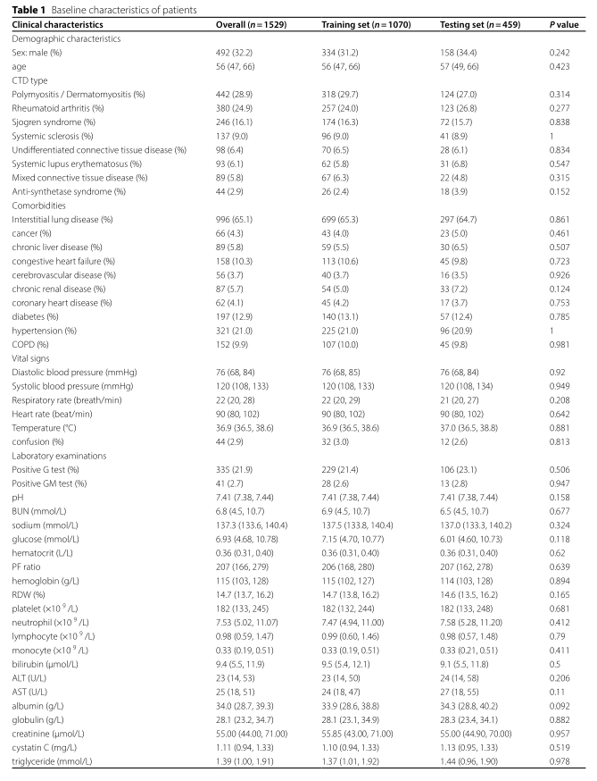

# An explainable machine learning-based model to predict intensive care unit admission among patients with community-acquired pneumonia and connective tissue disease

一种可解释的基于机器学习的模型，用于预测社区获得性肺炎和结缔组织病患者的重症监护室入院

## Abstract  摘要
### Background  背景
There is no individualized prediction model for intensive care unit (ICU) admission on patients with community-acquired pneumonia (CAP) and connective tissue disease (CTD) so far. In this study, we aimed to establish a machine learning-based model for predicting the need for ICU admission among those patients.
社区获得性肺炎（CAP）和结缔组织病（CTD）患者入住重症监护室（ICU）的预测模型尚未建立。在这项研究中，我们的目标是建立一个基于机器学习的模型来预测这些患者是否需要 ICU 入院。

### Methods  方法
This was a retrospective study on patients admitted into a University Hospital in China between November 2008 and November 2021. Patients were included if they were diagnosed with CAP and CTD during admission and hospitalization. Data related to demographics, CTD types, comorbidities, vital signs and laboratory results during the first 24 h of hospitalization were collected. The baseline variables were screened to identify potential predictors via three methods, including univariate analysis, least absolute shrinkage and selection operator (Lasso) regression and Boruta algorithm. Nine supervised machine learning algorithms were used to build prediction models. We evaluated the performances of differentiation, calibration, and clinical utility of all models to determine the optimal model. The Shapley Additive Explanations (SHAP) and Local Interpretable Model-Agnostic Explanations (LIME) techniques were performed to interpret the optimal model.
这是一项回顾性研究，对象是 2008 年 11 月至 2021 年 11 月期间入住中国大学医院的患者。如果患者在入院和住院期间被诊断为 CAP 和 CTD，则将其纳入。收集住院前 24 小时内的人口统计学、CTD 类型、合并症、生命体征和实验室检查结果相关数据。通过单因素分析、最小绝对收缩选择算子（Lasso）回归和 Boruta 算法对基线变量进行筛选，以确定潜在的预测因素。九种有监督的机器学习算法用于构建预测模型。我们评估了所有模型的分化、校准和临床实用性的性能，以确定最佳模型。采用 Shapley 加法解释（SHAP）和局部可解释模型不可知解释（LIME）技术对最优模型进行解释。

### Results  结果
The included patients were randomly divided into the training set (1070 patients) and the testing set (459 patients) at a ratio of 70:30. The intersection results of three feature selection approaches yielded 16 predictors. The eXtreme gradient boosting (XGBoost) model achieved the highest area under the receiver operating characteristic curve (AUC) (0.941) and accuracy (0.913) among various models. The calibration curve and decision curve analysis (DCA) both suggested that the XGBoost model outperformed other models. The SHAP summary plots illustrated the top 6 features with the greatest importance, including higher N-terminal pro-B-type natriuretic peptide (NT-proBNP) and C-reactive protein (CRP), lower level of CD4 + T cell, lymphocyte and serum sodium, and positive serum (1,3)-β-D-glucan test (G test).
将纳入的患者按 70：30 的比例随机分为训练集（1070 例患者）和测试集（459 例患者）。三种特征选择方法的交叉结果产生了 16 个预测因子。在各种模型中，极限梯度增强（XGBoost）模型的受试者工作特征曲线下面积（AUC）（0.941）和准确度（0.913）最高。校准曲线和决策曲线分析（DCA）都表明，XGBoost 模型优于其他模型。SHAP 汇总图显示了最重要的前 6 个特征，包括 N 末端 B 型利钠肽前体（NT-proBNP）和 C 反应蛋白（CRP）较高，CD 4 + T 细胞、淋巴细胞和血清钠水平较低，血清（1，3）-β-D-葡聚糖试验（G 试验）阳性。

### Conclusion  结论
We successfully developed, evaluated and explained a machine learning-based model for predicting ICU admission in patients with CAP and CTD. The XGBoost model could be clinical referenced after external validation and improvement.
我们成功地开发、评估和解释了一种基于机器学习的模型，用于预测 CAP 和 CTD 患者的 ICU 入院情况。XGBoost 模型经过外部验证和改进后可供临床参考。

### Keywords: 
Community-acquired pneumonia, Connective tissue disease, Intensive care unit, Risk factors, Machine learning, Prediction model

关键词： 社区获得性肺炎，结缔组织病，重症监护室，危险因素，机器学习，预测模型

## Background  背景
Community-acquired pneumonia (CAP) is an acute lung parenchyma infection caused by bacteria, viruses or fungi acquired outside the hospital. It is one of the most common infectious diseases in clinical practice. Meanwhile, it has been recognized as a major health problem and one of the leading causes of morbidity and mortality in all age groups worldwide [1–3]. Connective tissue disease (CTD) represents a heterogenous group of systemic autoimmune diseases that affect multiple organs, including idiopathic inflammatory myopathies (IIM), rheumatoid arthritis (RA), Sjogren’s syndrome (SS), etc. It is characterized by the presence of circulating autoantibodies and the self-directed chronic inflammation leading to collagen deposition, tissue damage and fibrosis, and ultimately target organs failure. The prevalence and disease burden of CTD continue to increase significantly during past years [4]. Patients with CTD have a higher risk of CAP than the general population according to prior reports [5, 6]. Besides, patients with CTD, especially those with high disease activity, are predisposed to suffer from unfavorable outcomes of CAP compared with those without CTD [7, 8]. Reversely, pneumonia is reported to be the leading cause of intensive care unit (ICU) admission in CTD patients, followed by acute exacerbation of CTD [9]. The underlying mechanisms include immunosuppressive medication use, immune system dysfunction, related comorbidities, etc. Thus, much attention needs to be paid to those patients with CAP and CTD.
社区获得性肺炎（CAP）是由医院外获得的细菌、病毒或真菌引起的急性肺实质感染。它是临床上最常见的传染病之一。同时，它已被认为是一个主要的健康问题，也是全世界所有年龄组发病率和死亡率的主要原因之一[ 1 - 3 ]。结缔组织病（CTD）是一组累及多个器官的异质性系统性自身免疫性疾病，包括特发性炎性肌病（IIM）、类风湿性关节炎（RA）、干燥综合征（SS）等，其特征是存在循环自身抗体和自身导向的慢性炎症，导致胶原沉积、组织损伤和纤维化，最终导致靶器官衰竭。CTD 的患病率和疾病负担在过去几年中继续显著增加[ 4 ]。 根据既往报告，CTD 患者的 CAP 风险高于一般人群[ 5 ， 6 ]。此外，与无 CTD 的患者相比，CTD 患者，尤其是疾病活动度高的患者，更容易遭受 CAP 的不良结局[ 7 ， 8 ]。据报道，肺炎是 CTD 患者入住重症监护室（ICU）的主要原因，其次是 CTD 急性加重[ 9 ]。其发病机制包括免疫抑制剂的使用、免疫系统功能障碍、相关的合并症等。因此，CAP 和 CTD 患者应引起高度重视。

It is estimated that 23% of patients who are hospitalized with CAP require ICU admission [10]. Clinical deterioration may occur after hospital admission in CAP patients. However, admission to a non-ICU setting with later transfer to ICU may be associated with poor outcomes and increased mortality [11, 12]. Therefore, apart from timely initiations of appropriate antibiotics and respiratory support, predicting the likelihood of ICU admission is another important issue in the management of CAP patients. Traditional risk score systems such as pneumonia severity index (PSI) and CURB-65 (confusion, uremia, increased respiratory rate, hypotension, and age 65 years or older) have been widely used to facilitate choosing appropriate site-of-care and predicting the prognosis for patients with CAP [13, 14]. Meanwhile, the 2007 Infectious Diseases Society of America / American Thoracic Society criteria for defining severe community-acquired pneumonia (IDSA/ATS 2007 criteria) remains the most pragmatic tool to predict ICU admission in CAP [15]. However, it is reported that the predictive values of PSI and CURB-65 in patients with CAP and CTD were limited [16]. Unfortunately, there are few studies on the individualized risk stratification of them. To our knowledge, there is no specific prediction model for ICU admission on patients with CAP and CTD so far.
据估计，23%的 CAP 住院患者需要 ICU 入院[ 10 ]。CAP 患者入院后可能发生临床恶化。然而，入住非 ICU 环境并随后转入 ICU 可能与不良结局和死亡率增加相关[ 11 ， 12 ]。因此，除了及时启动适当的抗生素和呼吸支持，预测 ICU 入院的可能性是 CAP 患者管理的另一个重要问题。传统的风险评分系统，如肺炎严重程度指数（PSI）和 CURB-65（意识模糊、尿毒症、呼吸频率增加、低血压和年龄 65 岁或以上）已被广泛用于帮助选择适当的护理地点和预测 CAP 患者的预后[ 13 ， 14 ]。 同时，2007 年美国传染病学会/美国胸科学会定义重度社区获得性肺炎的标准（IDSA/ATS 2007 标准）仍然是预测 CAP 患者入住 ICU 的最实用工具[ 15 ]。然而，据报道，PSI 和 CURB-65 在 CAP 和 CTD 患者中的预测值有限[ 16 ]。然而，目前对这类疾病的个体化危险分层研究较少。据我们所知，到目前为止，还没有一个特定的预测模型，对重症监护病房的 CAP 和 CTD 患者。

Machine learning, a branch of artificial intelligence, can handle plenty of high-dimensional data, analyze complex relationships and identify optimal predictors of clinical outcomes. Over the last few years, the prediction models for both medical diagnosis and prognosis assessment of various diseases have significantly benefited from diverse cutting-edge machine learning algorithms [17, 18]. They are more flexible and may have superior predictive powers than traditional linear models which use variables with statistical significance in some specific diseases according to previous reports [19, 20]. Furthermore, previous evidence demonstrated that machine learning algorithms had good performances in recognizing and predicting the need for intensive care in the initial assessment of patients [21]. In this study, we aimed to establish a machine learning-based model using noninvasive and readily available clinical parameters for predicting the need for ICU admission during hospitalization in patients with CAP and CTD.
机器学习是人工智能的一个分支，可以处理大量的高维数据，分析复杂的关系，并确定临床结果的最佳预测因子。在过去的几年里，各种疾病的医学诊断和预后评估的预测模型都大大受益于各种尖端的机器学习算法[ 17 ， 18 ]。它们更灵活，可能比传统线性模型具有上级预测能力，根据以前的报告[ 19 ， 20 ]，传统线性模型在某些特定疾病中使用具有统计学意义的变量。此外，之前的证据表明，机器学习算法在识别和预测患者初始评估中对重症监护的需求方面表现良好[ 21 ]。 在这项研究中，我们的目的是建立一个基于机器学习的模型，使用无创和现成的临床参数来预测 CAP 和 CTD 患者住院期间是否需要 ICU 入院。

## Methods  方法

### Study designs  研究设计
This was a single-center retrospective observational study on pneumonia patients admitted into West China Hospital of Sichuan University in China between November 2008 and November 2021. The study protocol was approved by the West China Hospital of Sichuan University Biomedical Research Ethics Committee (No.2022 − 733) and was conducted in accordance with the amended Declaration of Helsinki. The requirement for written informed consent from patients was waived due to retrospective design. All personal information of the patients had already been de-identified during the analysis.
这是一项针对2008年11月至2021年11月期间在中国四川大学华西医院住院的肺炎患者的单中心回顾性观察性研究。本研究方案经四川大学华西医院生物医学研究伦理委员会批准（编号：2022 − 733），并按照修订后的赫尔辛基宣言进行。由于回顾性设计，免除了对患者书面知情同意书的要求。在分析过程中，患者的所有个人信息都已被去识别化。

### Patients and data  患者和数据
Patients were eligible for inclusion if they were diagnosed with CAP and CTD during admission and hospitalization. The CAP was defined as a new pulmonary infiltrate on chest X-ray or computed tomography (CT) and at least one of the following acute lower respiratory infection symptoms: fever, productive cough, purulent expectoration, dyspnea, pleuritic chest pain, focal chest signs on auscultation, or abnormal peripheral white cell counts [22]. CTD included polymyositis/dermatomyositis (PM/DM), rheumatoid arthritis (RA), Sjogren’s syndrome (SS), systemic sclerosis (SSc), systemic lupus erythematosus (SLE), anti-synthetase syndrome (ASS), undifferentiated connective tissue disease (UCTD) and mixed connective tissue disease (MCTD) in present study. The diagnosis of each type of CTD was established based on corresponding criteria from related clinical guidelines or previous studies [23–28]. Individuals were excluded from the study if they were: (1) under 18 years old; (2) pregnant; (3) having incomplete clinical records. Besides, only the first admission was considered if the patient had multiple admissions during study period.
如果患者在入院和住院期间被诊断为 CAP 和 CTD，则有资格入选。CAP 定义为胸部 X 线或计算机断层扫描（CT）显示的新发肺部浸润和至少一种以下急性下呼吸道感染症状：发热、排痰性咳嗽、脓性咳痰、呼吸困难、胸膜炎性胸痛、听诊发现的局灶性胸部体征或外周白色细胞计数异常[ 22 ]。CTD 包括多发性肌炎/皮肌炎（PM/DM）、类风湿性关节炎（RA）、干燥综合征（SS）、系统性硬化症（SSc）、系统性红斑狼疮（SLE）、抗合成酶综合征（ASS）、未分化结缔组织病（UCTD）和混合性结缔组织病（MCTD）。每种类型的 CTD 的诊断是根据相关临床指南或既往研究的相应标准确定的[ 23 - 28 ]。 如果个体：（1）18岁以下;（2）妊娠;（3）临床记录不完整，则将其从研究中排除。此外，如果患者在研究期间多次入院，则仅考虑首次入院。

The clinical data of demographics, CTD types, comorbidities, vital signs and laboratory results during the first 24 h of hospitalization were collected. The first value was used for analysis if any data was repeated. The clinical data were reviewed and collected by two experienced physicians using a standardized data collection form independently. Any disagreement was solved by a third physician or team discussion until a consensus was reached. The primary outcome was the need for ICU admission during hospitalization.
收集住院前 24 h 内的人口统计学、CTD 类型、合并症、生命体征和实验室检查结果等临床数据。如果任何数据重复，则使用第一个值进行分析。由两名经验丰富的医生使用标准化的数据收集表独立审查和收集临床数据。任何分歧都由第三位医生或团队讨论解决，直到达成共识。主要结局是住院期间是否需要入住 ICU。

### Feature selection and model construction    特征选择和模型构造
The flowchart of this study was shown in Fig. 1. The included patients were randomly divided into two sets (70% in training set and 30% in testing set) by simple random sampling. The training set was used for developing the models and the testing set was utilized for evaluating the performances of models.
本研究的流程图见图 1 。采用简单随机抽样的方法将纳入的患者随机分为两组（70%为训练集，30%为测试集）。训练集用于开发模型，测试集用于评估模型的性能。

> Study flow chart. CAP: community-acquired pneumonia; CTD: connective tissue disease; Lasso: least absolute shrinkage and selection operator; LR: logistic regression; CART: classification and regression tree; RF: random forest; SVM: support vector machine; KNN: k-nearest neighbors; DT: decision tree; GBM: gradient boosting machine; XGBoost: eXtreme gradient boosting; NB: naive bayes; AUC: area under the receiver operating characteristic curve; DCA: decision curve analysis; SHAP: Shapley additive explanations; LIME: Local Interpretable Model-Agnostic Explanations
研究流程图。帽盖：社区获得性肺炎; CTD：结缔组织病;套索：最小绝对收缩和选择算子; LR：逻辑回归; CART：分类和回归树; RF：随机森林; SVM：支持向量机; KNN：k-最近邻; DT：决策树; GBM：梯度增强机; XGBoost：极限梯度增强; NB：朴素贝叶斯; AUC：受试者工作特征曲线下面积; DCA：决策曲线分析; SHAP：Shapley 加法解释; LIME：局部可解释的模型无关解释

The baseline variables were screened to identify potential predictors in training set via three independent methods, including univariate analysis, least absolute shrinkage and selection operator (Lasso) regression and Boruta algorithm [29]. The univariate analysis is a classic selection method based on P values. The variables with P value < 0.05 were regarded as statistically significant and were extracted. The Lasso regression model identifies the features having non-zero coefficients as potential predictors. It can eliminate multicollinearity and avoid over-fitting of variables. We used Lasso regression combined with 10-fold cross-validation to analyze the baseline high-dimensional data and screen variables. Boruta algorithm is a feature selection method that depends on the variable importance measure. To be specific, it identifies the most important features by comparing the Z-values of candidate features with that of “shadow features”. The Z-value of each real feature is obtained based on a random forest (RF) classifier in each iteration, and the Z-value of each shadow feature is created by random shuffling of the real features. It can iteratively remove features that have been proved to be less relevant than random shadow features. Thus, only those relevant features with Z-values higher than the maximal Z-value of shadow features by multiple internal bootstraps, are retained. Overlapping variables by intersecting univariate analysis, Lasso and Boruta were obtained to establish prediction models.
通过三种独立方法筛选基线变量，以确定训练集中的潜在预测因子，包括单变量分析、最小绝对收缩和选择算子（Lasso）回归和 Boruta 算法[ 29 ]。单变量分析是基于 P 值的经典选择方法。将 P 值< 0.05的变量视为具有统计学意义并提取。Lasso回归模型将具有非零系数的特征识别为潜在的预测因子。它可以消除多重共线性，避免变量的过拟合。我们使用Lasso回归结合10倍交叉验证来分析基线高维数据和筛选变量。Boruta算法是一种基于变量重要性度量的特征选择方法。具体地说，它通过比较候选特征的Z值与“阴影特征”的Z值来识别最重要的特征。 每个真实的特征的 Z 值是在每次迭代中基于随机森林（RF）分类器获得的，并且每个阴影特征的 Z 值是通过随机混洗真实的特征来创建的。它可以迭代地删除已被证明与随机阴影特征相关性较低的特征。因此，仅保留 Z 值高于由多个内部引导得到的阴影特征的最大 Z 值的相关特征。通过交叉单因素分析，获得重叠变量 Lasso 和 Boruta，建立预测模型。

Nine supervised machine learning algorithms, including logistic regression (LR), classification and regression tree (CART), RF, support vector machine (SVM), k-nearest neighbors (KNN), decision tree (DT), gradient boosting machine (GBM), eXtreme gradient boosting (XGBoost) and naive bayes (NB), were used to construct prediction models. The 5-fold cross-validation was applied to ensure the stability and accuracy of the models.
九个监督机器学习算法，包括逻辑回归（LR），分类和回归树（CART），RF，支持向量机（SVM），k-最近邻（KNN），决策树（DT），梯度提升机（GBM），极端梯度提升（XGBoost）和朴素贝叶斯（NB），用于构建预测模型。采用 5 重交叉验证，确保模型的稳定性和准确性。

### Model assessment  模型评估
We evaluated the performances of differentiation, calibration and clinical utility of nine models to identify the optimal model. The receiver operating characteristic (ROC) curves were plotted and the areas under the ROC curve (AUCs) were calculated to quantify their discriminative performances. The significant differences of AUCs among models were tested using Delong’s test. Moreover, accuracy, sensitivity, specificity and Kappa value were used as additional descriptions of the predictive abilities of the models [30]. Then, the precision-recall (PR) curves, which plot the positive prediction value (PPV) against the true positive rate (TPR) across all thresholds, were used to further evaluate the discrimination capabilities of the models. Besides, we also calculated the AUCs of three traditional predictive tools, including IDSA/ATS 2007 criteria, PSI and CURB-65, in predicting ICU admission of CAP patients with CTD. The calibration, which represents the agreement between predicted outcomes and actual outcomes, was performed via a bootstrap method with 1000 resamples and assessed by a calibration plot. The decision curve analysis (DCA) based on net benefits at different threshold probabilities was drawn to evaluate the model’s clinical validity and utility.
我们评估了 9 个模型的分化，校准和临床实用性的性能，以确定最佳模型。绘制受试者工作特征（ROC）曲线，并计算 ROC 曲线下面积（AUC）以量化其区分性能。采用 Delong’s 检验检验模型间 AUC 的显著性差异。此外，准确性、灵敏度、特异性和 Kappa 值被用作模型预测能力的额外描述[ 30 ]。然后，使用精确度-召回率（PR）曲线，绘制所有阈值上的阳性预测值（PPV）与真阳性率（TPR），以进一步评估模型的区分能力。此外，我们还计算了三种传统的预测工具，包括 IDSA/ATS 2007 标准，PSI 和 CURB-65，预测 CAP 合并 CTD 患者入住 ICU 的 AUC。 校准，代表预测结果和实际结果之间的协议，通过自举方法进行 1000 重采样，并通过校准图进行评估。以不同阈值概率下的净效益为基础，绘制决策曲线分析（DCA），评价模型的临床有效性和实用性。

The performances of the machine learning-based models may be affected by class imbalance due to the low incidence of positive events (ICU admission) in this study. Thus, we performed complementary analyses using up-sampling, down-sampling and synthetic minority oversampling technique (SMOTE) approaches. Sampling techniques are often used to generate balanced datasets (50/50 majority–minority splits) in the training set by up-sampling (over-sampling) or down-sampling (under-sampling). The up-sampling algorithm improves the sensitivity of the minority by synthesizing the minority samples. The down-sampling algorithm achieves the balance of two classes by deleting the majority samples. The SMOTE is an efficient algorithm for addressing class imbalance and reducing over-fitting of the model, employing k-neighbor synthesis to synthesize new minority samples.
基于机器学习的模型的性能可能会受到类不平衡的影响，因为本研究中的阳性事件（ICU 入院）发生率较低。因此，我们使用上采样，下采样和合成少数过采样技术（SMOTE）的方法进行互补分析。采样技术通常用于通过上采样（过采样）或下采样（欠采样）在训练集中生成平衡数据集（50/50 多数-少数分裂）。上采样算法通过对少数样本进行合成，提高了少数样本的灵敏度。下采样算法通过删除大多数样本来实现两类的平衡。SMOTE 是一种有效的算法，用于解决类别不平衡和减少模型的过拟合，采用 k-近邻合成来合成新的少数样本。

### Model interpretation  模型解释
The Shapley Additive Explanation (SHAP) values of features were evaluated to determine each characteristic’s contribution and significance based on its impact on the final classification outcome. The high SHAP value indicates great impact of a feature on model output. We reported the feature importance for interpreting the optimal model. At last, the Local Interpretable Model-Agnostic Explanations (LIME) technique was performed to further explain the model [31–33].
对特征的 Shapley 加法解释（SHAP）值进行评估，以根据其对最终分类结果的影响来确定每个特征的贡献和重要性。高 SHAP 值表示特征对模型输出的影响很大。我们报告了用于解释最优模型的特征重要性。最后，使用局部可解释模型不可知解释（LIME）技术进一步解释模型[ 31 - 33 ]。

### Statistical analysis  统计分析
The clinical characteristics of patients were expressed as the mean ± standard deviation (SD) for continuous variables with normal distribution, the median (interquartile range [IQR]) for continuous variables with non-normal distribution, and the frequency (percentage) for categorical variables. The labels for categorical variables were coded as “1″ for “Yes″ and “0″ for “No″ during statistical analysis. Independent sample t test or Kruskal–Wallis test was used to analyze the differences between the continuous variables as appropriate. The chi-square test or Fisher exact test was performed to analyze the categorical variables. A two-sided P < 0.05 was considered statistically significant. We removed variables missing over 30% of observations to ensure the accuracy of study. After that, we employed the multiple imputation method dealing with missing values.
患者的临床特征表示为正态分布的连续变量的平均值±标准差（SD）、非正态分布的连续变量的中位数（四分位距[IQR]）和分类变量的频率（百分比）。在统计分析期间，分类变量的标签编码为“1”（表示“是”）和“0”（表示“否”）。采用独立样本 t 检验或 Kruskal-Wallis 检验分析连续变量之间的差异（如适用）。采用卡方检验或 Fisher 精确检验分析分类变量。双侧 P< 0.05 被认为具有统计学意义。为了保证研究的准确性，我们删除了缺失超过 30%的观测值的变量。在此之后，我们采用多重插补方法处理缺失值。

In this study, R software version 4.2.1 (R Foundation for Statistical Computing) was used to implement the statistical analysis. The Lasso and Boruta analyses were performed using the R package “glmnet” and “Boruta”. The R package “caret” was used to train the models. By default, hyperparameter tuning for each model was performed automatically by caret using a standard grid search approach. The SHAP and LIME methods were completed using the “shapviz” and “lime” package.

## Results  结果
### Baseline characteristics  基线特征
A total of 1626 individuals with CAP and CTD were admitted into our hospital. Among them, 97 individuals were excluded from analysis according to exclusion criteria. The included patients were divided into the training set (1070 patients) and the testing set (459 patients). In the training and testing set, the median age was 56 (IQR: 47, 66) and 57 (IQR:49, 66) years, and 334 (31.2%) and 158 (34.4%) patients were men, respectively. PM/DM was the most common type of CTD (28.9%), and interstitial lung disease (ILD) was observed in 65.1% of all patients. The top 3 comorbidities were hypertension (21.0%), diabetes (12.9%) and congestive heart failure (10.3%). The ICU admission rate and hospital mortality were 292 (27.3%) and 161 (15.0%) in the training set, and 121 (26.4%) and 76 (16.6%) in the testing set. The detailed features were summarized in Table 1, which suggested that the baseline characteristics and clinical outcomes of patients did not differ significantly between two sets roughly.
我院共收治 CAP 和 CTD 患者 1626 例。其中，97 人根据排除标准从分析中排除。将纳入的患者分为训练集（1070 例患者）和测试集（459 例患者）。在训练和测试集中，中位年龄分别为 56 岁（IQR：47，66）和 57 岁（IQR：49，66），男性患者分别为 334 例（31.2%）和 158 例（34.4%）。PM/DM 是最常见的 CTD 类型（28.9%），在所有患者中观察到 65.1%的间质性肺病（ILD）。合并症前 3 位为高血压（21.0%）、糖尿病（12.9%）和充血性心力衰竭（10.3%）。训练集中的 ICU 入院率和住院死亡率分别为 292（27.3%）和 161（15.0%），测试集中为 121（26.4%）和 76（16.6%）。 详细特征总结见表 1 ，表明两组患者的基线特征和临床结局大致无显著差异。

> Data are shown as median with interquartile range (IQR) for continuous variables and number with percentage for categorical variables
数据显示为连续变量的中位数和四分位距（IQR），分类变量的数量和百分比

> CTD: connective tissue disease; COPD: chronic obstructive pulmonary disease; G test: serum (1,3)-β-D-glucan test; GM test: serum Aspergillus galactomannan test; BUN: blood urea nitrogen; PF ratio: the ratio of arterial oxygen partial pressure (mmHg) to fractional inspired oxygen; RDW: red blood cell distribution width; ALT: alanine aminotransferase; AST: aspartate aminotransferase; HDL-C: High density lipoprotein cholesterol; LDL-C: Low density lipoprotein cholesterol; LDH: lactate dehydrogenase; CK-MB: creatine kinase-myoglobin binding; NT-proBNP: N-terminal pro-B-type natriuretic peptide; CRP: C-reactive protein; PT: prothrombin time; APTT: activated partial thromboplastin time; AT III: antithrombin III; ICU: intensive care unit; IMV: invasive mechanical ventilation; LOS: length of stay
CTD：结缔组织病;慢性阻塞性肺病：慢性阻塞性肺疾病; G 试验：血清（1，3）-β-D-葡聚糖试验; GM 试验：血清曲霉半乳甘露聚糖试验; BUN：血尿素氮; PF 比率：动脉血氧分压（mmHg）与吸入氧分数的比率; RDW：红细胞分布宽度; ALT：丙氨酸氨基转移酶; AST：天冬氨酸氨基转移酶; HDL-C：高密度脂蛋白胆固醇; LDL-C：低密度脂蛋白胆固醇; LDH：乳酸脱氢酶; CK-MB：肌酸激酶-肌红蛋白结合; NT-proBNP：N 末端 B 型利钠肽原; CRP：C 反应蛋白; PT：凝血酶原时间; APTT：活化部分凝血活酶时间; AT III：抗凝血酶 III; ICU：重症监护室; IMV：有创机械通气; LOS：住院时间

### Development of model  拟订示范
As shown in Supplementary Table S1, in the univariate analysis 36 variables were significantly different (P values < 0.05) between patients admitted and not admitted into ICU in training set. Among all baseline characteristics, the Boruta algorithm effectively selected 32 potential predictors according to the Z-values (importances) (Fig. 2A and B). Meanwhile, the optimal lambda value was 0.003 by using the Lasso algorithm and 33 variables were selected as potential predictors (Fig. 2C and D). The variables identified by Boruta and Lasso were listed in detail in Supplementary Table S2.
如补充表 S1 所示，在单变量分析中，在训练集中，36 个变量在入住和未入住 ICU 的患者之间存在显著差异（P 值< 0.05）。在所有基线特征中，Boruta算法根据Z值（重要性）有效地选择了32个潜在的预测因子（图1#A和B）。同时，通过使用Lasso算法，最佳λ值为0.003，并选择33个变量作为潜在的预测因子（图2#C和D）。Boruta和Lasso确定的变量详见补充表S2。

> Features selected by Boruta, Lasso and univariate analysis. A and B. Variables selected by Boruta algorithm. The minimum, average and maximum shadow score are shown in blue. In terms of the score of feature importance, the 32 variables in green are regarded as important variables, while yellow are neutral and red are rejected. C. The Lasso regression coefficient profiles of all baseline characteristics. D. The optimal lambda selection in the Lasso regression with 10-fold cross-validation. Misclassification errors of different variables against log(lambda) are revealed. The two vertical dashed lines represent the optimal value under the minimum criterion and 1-SE criterion, respectively. The “lambda” is the tuning parameter. A total of 33 predictors with non-zero coefficients are identified. E. The Venn diagram of features selected by Boruta, Lasso and univariate analysis. The intersection results of three methods yield 16 clinical characteristics. SE, standard error; Lasso, least absolute shrinkage and selection operator
通过 Boruta、Lasso 和单变量分析选择特征。A 和 B。Boruta 算法选择的变量。最小、平均和最大阴影分数以蓝色显示。在特征重要性得分方面，绿色的 32 个变量被认为是重要变量，而黄色是中性的，红色被拒绝。C. 所有基线特征的 Lasso 回归系数曲线。D. Lasso 回归中的最佳 lambda 选择与 10 倍交叉验证。不同的变量对日志（lambda）的误分类错误被揭示。两条垂直虚线分别表示最小准则和 1-SE 准则下的最优值。“lambda”是调优参数。共确定了 33 个非零系数的预测因子。E. 通过 Boruta、Lasso 和单变量分析选择的特征的 Venn 图。 三种方法的交叉结果产生 16 个临床特征。SE，标准误; Lasso，最小绝对收缩和选择算子

The intersection results of three independent methods were considered to be the optimal features. Thus, a total of 16 clinical characteristics, including N-terminal pro-B-type natriuretic peptide (NT-proBNP), CD4+T cell, lymphocyte, C-reactive protein (CRP), positive serum (1,3)-β-D-glucan test (G test), serum sodium, ratio of arterial oxygen partial pressure (mmHg) to fractional inspired oxygen (PF ratio), neutrophil, heart rate (HR), chronic obstructive pulmonary disease (COPD), serum glucose, pH, high density lipoprotein cholesterol (HDL-C), albumin, platelet and confusion, were served as predictors to establish machine learning-based prediction models (Fig. 2E).
三个独立的方法的交集结果被认为是最佳特征。因此，总共有 16 项临床特征，包括 N 末端 B 型利钠肽前体（NT-proBNP）、CD 4 + T 细胞、淋巴细胞、C 反应蛋白（CRP）、血清（1，3）-β-D-葡聚糖试验（G 试验）阳性、血清钠、动脉氧分压（mmHg）与吸入氧分数的比值（PF 比率）、中性粒细胞、心率（HR）、慢性阻塞性肺疾病（COPD）、血糖、pH、高密度脂蛋白胆固醇（HDL-C）、白蛋白、血小板和意识模糊，作为预测器建立基于机器学习的预测模型（图 2 E）。

### Evaluation of model  模型评价
All models had accuracy values and AUCs of 0.80 and above in the testing set (Table 2). The ROC curves were shown in Fig. 3A. The XGBoost model achieved the highest AUC (0.941) and accuracy (0.913), suggesting favorable and robust discrimination. LR model was usually used as a traditional baseline model. Thus, the AUCs of other models were compared to that of the XGBoost model and LR model using Delong’s test. The Delong test P value (vs. XGBoost model) were all under 0.05 except for RF model. Meanwhile, the Brier score, Kappa value, sensitivity, specificity, positive predict value and negative predict value of XGBoost model were all superior or similar to that of other models. Furthermore, the XGBoost model also achieved the highest area under the PR curve (0.897) among nine models (Supplementary Figure S1).
在测试集中，所有模型的准确度值和 AUC 均为 0.80 及以上（表 0#）。ROC 曲线见图 3 A。XGBoost 模型实现了最高的 AUC（0.941）和准确度（0.913），表明有利且稳健的区分。LR 模型通常被用作传统的基线模型。因此，使用 Delong 检验将其他模型的 AUC 与 XGBoost 模型和 LR 模型的 AUC 进行比较。除 RF 模型外，Delong 检验 P 值（与 XGBoost 模型相比）均小于 0.05。XGBoost 模型的 Brier 评分、Kappa 值、敏感性、特异性、阳性预测值和阴性预测值均上级或接近其他模型。此外，XGBoost 型号还在 9 个型号中实现了最高的 PR 曲线下面积（0.897）（补充图 S1 ）。

> ICU: intensive care unit; AUC: area under the receiver operating characteristic curve; LR: logistic regression; CART: classification and regression tree; RF: random forest; SVM: support vector machine; KNN: k-nearest neighbors; DT: decision tree; GBM: gradient boosting machine; XGBoost: eXtreme gradient boosting; NB: naive bayes
重症监护室：加护病房;曲线下面积：受试者工作特征曲线下面积; LR：逻辑回归; CART：分类和回归树; RF：随机森林; SVM：支持向量机; KNN：k-最近邻; DT：决策树; GBM：梯度提升机; XGBoost：极限梯度提升; NB：朴素贝叶斯

> Machine learning-based models used to predict ICU admission in patients with CAP and CTD. (A) ROC curves for the machine learning-based models used to predict ICU admission. (B) ROC curves for the traditional risk scores used to predict ICU admission. (C) Calibration curves of the machine learning-based models. (D) DCA of the machine learning-based models. ROC: receiver operating characteristic; DCA: Decision curve analysis; IDSA/ATS 2007 criteria: 2007 Infectious Diseases Society of America / American Thoracic Society criteria for defining severe community-acquired pneumonia; PSI: pneumonia severity index; CURB-65: confusion, uremia, increased respiratory rate, hypotension, and age 65 years or older
基于机器学习的模型用于预测 CAP 和 CTD 患者的 ICU 入院。（A） 用于预测 ICU 入院的基于机器学习的模型的 ROC 曲线。（B） 用于预测 ICU 入院的传统风险评分的 ROC 曲线。（C） 基于机器学习的模型的校准曲线。（D） 基于机器学习模型的 DCA。中华民国：接收机工作特性; DCA：决策曲线分析; IDSA/ATS 2007 标准：2007 年美国传染病学会/美国胸科学会定义重度社区获得性肺炎的标准; PSI：肺炎严重程度指数; CURB-65：意识模糊、尿毒症、呼吸频率增加、低血压和年龄≥ 65 岁

Among the traditional predictive tools, the IDSA/ATS 2007 criteria had higher discriminatory power for ICU admission (AUC: 0.817) compared with PSI (AUC: 0.697) and CURB-65 (AUC: 0.607) (Fig. 3B). However, they did not perform as well as the XGBoost model. The calibration curve and DCA were shown in Fig. 3C and D, both suggesting that the XGBoost model performed best among nine models. Thus, the XGBoost model was considered to be the optimal model. The AUCs of models with up-sampling, down-sampling and SMOTE were found to be similar to the original AUCs in the testing set, as listed in detail in Supplementary Table S3.
在传统的预测工具中，与 PSI（AUC：0.697）和 CURB-65（AUC：0.607）相比，IDSA/ATS 2007 标准对 ICU 入院具有更高的区分能力（AUC：0.817）（图 0#B）。然而，它们的表现不如 XGBoost 模型。校准曲线和 DCA 如图 1#C 和 D 所示，两者都表明 XGBoost 模型在 9 个模型中表现最好。因此，XGBoost 模型被认为是最佳模型。发现具有上采样、下采样和 SMOTE 的模型的 AUC 与测试集中的原始 AUC 相似，详见补充表 S3 。

### Model interpretation  模型解释
The SHAP values could provide more insights into how the XGBoost model predicted outcomes. The feature importance was summarized by the SHAP summary plot in Fig. 4A. Figure 4B depicted the standard bar chart of the mean absolute SHAP value for each predictor in descending order. The force plots provided personalized feature attributions using two representative examples and illustrated how the SHAP could be used to explain individual model predictions, as shown in Fig. 4C (a patient actually not admitted into ICU) and D (a patient actually admitted into ICU). It started at the base value, that is, the average of all predictions. And then, each input predictor at different level could increase or decrease the predicted probability of outcome. The lengths of arrows reflected the SHAP values for these features. Finally, the predicted output value of model was obtained for a particular patient.
SHAP 值可以为 XGBoost 模型如何预测结果提供更多见解。特征重要性通过图 4 A 中的 SHAP 总结图进行了总结。图 4 B 以降序显示了每个预测因子的平均绝对 SHAP 值的标准条形图。力图使用两个代表性示例提供了个性化特征属性，并说明了 SHAP 如何用于解释个体模型预测，如图 2#C（实际未入住 ICU 的患者）和 D（实际入住 ICU 的患者）所示。它从基值开始，即所有预测的平均值。然后，每个输入预测器在不同的水平上可以增加或减少预测结果的概率。箭头的长度反映了这些特征的 SHAP 值。最后得到特定患者的模型预测输出值。

> SHAP plots. (A) SHAP summary plot shows feature importance for each predictor of the XGBoost model in descending order. The upper predictors are more important to the model’s predictive outcome. A dot is created for each feature attribution value for the XGBoost model of each patient. The further away a dot is from the baseline SHAP value of zero, the stronger it effects the model output. Dots are colored according to the values of features. Yellow represents higher feature values and red represents lower feature values. (B) Bar chart of the mean absolute SHAP value for each predictor of the XGBoost model in descending order. C and D. The force plots provide personalized feature attributions using two representative examples. C: a patient actually not admitted into ICU; D: a patient actually admitted into ICU. SHAP: Shapley additive explanations; ICU: intensive care unit;
SHAP 图。（A）SHAP 汇总图以降序显示 XGBoost 模型的每个预测因子的特征重要性。较高的预测因子对模型的预测结果更重要。为每个患者的 XGBoost 模型的每个特征属性值创建一个点。点离基线 SHAP 值零越远，它对模型输出的影响就越大。根据要素的值对点进行着色。黄色表示较高的特征值，红色表示较低的特征值。（B）XGBoost 模型的每个预测因子的平均绝对 SHAP 值的条形图，按降序排列。C 和 D. 力图使用两个代表性示例提供个性化特征属性。C：实际未入住 ICU 的患者; D：实际入住 ICU 的患者。SHAP：Shapley 加法解释; ICU：重症监护室;

We also quantitatively visualized the relationships between main risk factors and outcomes. The SHAP dependence plots illustrated the top 6 features with the greatest importance (Fig. 5A-F). It demonstrated that higher NT-proBNP and CRP values, lower levels of CD4 + T cells, lymphocyte and serum sodium, and positive G test contributed to an elevated risk of ICU admission. Meanwhile, the cutoff value for each variable could also be determined to discriminate between high-risk (SHAP value > 0) and low-risk (SHAP value < 0) of ICU admission.
我们还对主要风险因素和结果之间的关系进行了定量可视化。SHAP 依赖性图显示了最重要的前 6 个特征（图 0#A-F）。提示 NT-proBNP 和 CRP 水平升高、CD 4 + T 细胞、淋巴细胞和血钠水平降低、G 试验阳性与 ICU 住院风险升高有关。同时，还可以确定每个变量的临界值，以区分入住 ICU 的高风险（SHAP 值> 0）和低风险（SHAP 值< 0）。

> The SHAP dependence plots for the top 6 features with the greatest importance. A. N-terminal pro-B-type natriuretic peptide (NT-proBNP). B. CD4 + T cell. C. lymphocyte. D. C-reactive protein (CRP). E. positive serum (1,3)-β-D-glucan test (G test). The “1” represents “Yes″ and the “0″ represents “No″. F. serum sodium. The SHAP dependence plots show how a single feature affects the output of the XGBoost model. SHAP values for specific features exceed zero, representing an increased risk of ICU admission. SHAP: Shapley additive explanations; ICU: intensive care unit;
具有最大重要性的前 6 个特征的 SHAP 依赖性图。A. N 末端 B 型利钠肽原（NT-proBNP）。B。CD 4 + T 细胞。C. 淋巴细胞 D. C-反应蛋白（CRP）。E. 血清（1，3）-β-D-葡聚糖试验（G 试验）阳性。“1”表示“是”，“0”表示“否”。F. 血清钠 SHAP 依赖图显示了单个特征如何影响 XGBoost 模型的输出。特定特征的 SHAP 值超过零，表示 ICU 入院的风险增加。SHAP：Shapley 加法解释; ICU：重症监护室;

We selected two random samples from the testing set and used the LIME algorithm to further explain the individual ICU admission forecast. Supplementary Figure S2A depicts a case of patient admitted into ICU. The expected probability of ICU admission was 88% according to the XGBoost model. Supplementary Figure S2B described a case of patient not admitted into ICU. The expected probability of no ICU admission was 60%.
我们从测试集中选择了两个随机样本，并使用 LIME 算法进一步解释了个体 ICU 入院预测。补充图 S2 A 描述了一名患者入住 ICU 的情况。根据 XGBoost 模型，ICU 入院的预期概率为 88%。补充图 S2 B 描述了一例未入住 ICU 的患者。未入住 ICU 的预期概率为 60%。

## Discussion  讨论
A novel clinically available tool that provides an early assessment and rapid prediction of ICU admission is warranted considering that risk stratification of patients with CAP and CTD remains challenging caused by heterogeneous disease progression. A reliable and accurate prediction model would help clinicians identify specific patients who require special attentions and allocate resources appropriately, which is crucial to timely and effective intervention for prognosis improvement. Machine learning has gained popularity and is increasingly utilized in various domains of biomedicine. To our knowledge, this study is the first to develop a useful machine learning-based model for predicting the risk of ICU admission in patients with CAP and CTD. The promising performance of model was verified by the testing set. The use of advanced machine learning-based models is often limited in clinical practice because of the lack of clear interpretation of their decision-making process. Thus, we used SHAP and LIME to explain what features of the patient are responsible for the given prediction, avoiding the obstacle of “black-box” nature of machine learning algorithms. We found that the NT-proBNP, CD4 + T cell, lymphocyte, CRP, positive G test and serum sodium were the top 6 features of the XGBoost model in terms of their abilities to predict ICU admission.
考虑到 CAP 和 CTD 患者的风险分层仍然具有挑战性，这是由于异质性疾病进展造成的，因此需要一种新的临床可用工具，可以提供早期评估和快速预测 ICU 入院。一个可靠准确的预测模型将帮助临床医生识别需要特别关注的特定患者并适当分配资源，这对于及时有效地干预预后改善至关重要。机器学习已经越来越受欢迎，并且越来越多地用于生物医学的各个领域。据我们所知，这项研究是第一个开发一个有用的基于机器学习的模型来预测 CAP 和 CTD 患者的 ICU 入院风险。测试集验证了模型的良好性能。基于先进机器学习的模型在临床实践中的使用往往受到限制，因为缺乏对其决策过程的清晰解释。 因此，我们使用 SHAP 和 LIME 来解释患者的哪些特征对给定的预测负责，避免了机器学习算法的“黑盒”性质的障碍。结果发现，NT-proBNP、CD 4 + T 细胞、淋巴细胞、CRP、G 试验阳性和血钠是 XGBoost 模型预测入住 ICU 能力的前 6 个特征。

In our study cohort, the median PSI was only 80 (IQR: 63,103) points, which was slightly lower than that of previous similar studies of CAP patients with a median PSI of about 100 points [34–38]. This may be caused by the differences of included population. The median age, the proportion of male and the number of comorbidities of our cohort were all lower than that of previous cohorts. However, the rate of ICU admission in our study was equal to that in previous reports. Thus, the adverse impact of CTD on the clinical outcomes of CAP should not be ignored. We believed that the CAP patients with CTD might represent a specific subgroup deserving of additional investigations. However, there is still a lack of personalized accurate assessment to guide optimal clinical decisions for them. Li et al. have conducted a similar study including 368 pneumonia patients with CTD treated with glucocorticoids or immunosuppressants [39]. They constructed a prognostic nomogram based on five variables (fever, cyanosis, blood urea nitrogen, ganciclovir treatment and anti-pseudomonas treatment) for predicting the 90-day mortality. The C index of training cohort and validation cohort was 0.808 and 0.762, respectively. Compared to their research, our study had a larger sample size and more predictors. Furthermore, the current study period was more than 10 years with the primary outcome of ICU admission.
在我们的研究队列中，中位 PSI 仅为 80（IQR：63，103）分，略低于既往 CAP 患者的类似研究，中位 PSI 约为 100 分[ 34 - 38 ]。这可能是由于纳入人群的差异造成的。本队列的中位年龄、男性比例和合并症数量均低于既往队列。然而，在我们的研究中，ICU 的入住率与以前的报告相同。因此，CTD 对 CAP 临床结局的不良影响不容忽视。我们认为 CAP 合并 CTD 患者可能是一个值得进一步研究的特殊亚组。然而，仍然缺乏个性化的准确评估来指导他们的最佳临床决策。Li 等人进行了一项类似的研究，其中包括 368 名接受糖皮质激素或免疫抑制剂治疗的 CTD 肺炎患者[ 39 ]。 他们构建了一个基于五个变量（发热、发绀、血尿素氮、更昔洛韦治疗和抗假单胞菌治疗）的预后列线图，用于预测 90 天的死亡率。训练队列和验证队列的 C 指数分别为 0.808 和 0.762。与他们的研究相比，我们的研究样本量更大，预测因子更多。此外，目前的研究时间超过 10 年，主要结局为 ICU 入院。

The predicting values of these identified predictors are deemed worthy of clinicians’ attention. They can be used to clinically assist physicians to identify high-risk patients at an early stage. The main predictors can be supported by previous studies and theories. NT-proBNP is secreted by the heart in response to excessive stretching of cardiomyocytes. Thus, it is widely used as diagnostic biomarkers for ventricular insufficiency, heart failure and cardiac dysfunction. Previous evidence showed that NT-proBNP was positively correlated with the severity of CAP and remained an independent mortality predictor (hazard ratio [HR]: 1.004, 95% confidence interval [95%CI]: 1.00-1.01) in multivariable analysis [40, 41]. Meanwhile, in patients with CTD, elevated NT-proBNP is considered to be associated with pulmonary arterial hypertension or even heart involvement which may lead to a significant poor prognosis [42–44]. Although treatment with glucocorticoids or immunosuppressive drugs were not recorded, we collected and analyzed the count of lymphocyte subsets instead. It is an objective indicator of the immunosuppressive status of patients. In our study, the CD4 + T cell and lymphocyte were both identified as predictors. This result further confirmed that immunosuppression is indeed a critical indicator of disease severity. Meanwhile, it demonstrated that in various subsets of lymphocyte, low CD4 + T cell was mainly related to ICU admission in patients with CAP and CTD. Wang et al. also demonstrated CD4 + T cells (HR: 0.986, 95%CI: 0.978–0.994), rather than CD8 + T cell, was an independent risk factor for severe CAP in elderly and frailty patients [45]. CRP, a widely utilized inflammatory biomarker, is known to be associated with the severity and mortality of CAP. Meanwhile, it is also a marker for disease activity and risk of death in various types of CTD [46–48]. The G test is a serum pan-fungal marker used to detect the majority of pathogenic fungi, including Aspergillus spp., Candida spp., etc. It is highly accurate for diagnosing invasive fungal infections [49].
这些预测因子的预测价值值得临床医师重视。它们可用于临床协助医生在早期阶段识别高风险患者。主要的预测因子可以得到前人研究和理论的支持。NT-proBNP 由心脏响应于心肌细胞的过度拉伸而分泌。因此，它被广泛用作心室功能不全、心力衰竭和心功能不全的诊断生物标志物。既往证据显示 NT-proBNP 与 CAP 严重程度呈正相关，在多变量分析中仍是独立的死亡预测因子（风险比[HR]：1.004，95%置信区间[95%CI]：1.00-1.01）[ 40 ， 41 ]。同时，在 CTD 患者中，NT-proBNP 升高被认为与肺动脉高压甚至心脏受累相关，可能导致显著的不良预后[ 42 - 44 ]。 虽然没有记录糖皮质激素或免疫抑制剂的治疗，但我们收集并分析了淋巴细胞亚群的计数。它是患者免疫抑制状态的客观指标。在我们的研究中，CD 4 + T 细胞和淋巴细胞都被确定为预测因子。这一结果进一步证实，免疫抑制确实是疾病严重程度的一个关键指标。同时提示，CAP 和 CTD 患者在不同的淋巴细胞亚群中，CD 4 + T 细胞的低下主要与 ICU 的入院有关。Wang et al.还证明了 CD 4 + T 细胞（HR：0.986，95%CI：0.978-0.994）而非 CD 8 + T 细胞是老年和虚弱患者中重度 CAP 的独立风险因素[ 45 ]。CRP 是一种广泛使用的炎症生物标志物，已知与 CAP 的严重程度和死亡率相关。同时，它也是各种类型 CTD 中疾病活动性和死亡风险的标志物[ 46 - 48 ]。 G 试验是一种血清泛真菌标记物，用于检测大多数致病真菌，包括曲霉属，念珠菌属，它是高度准确的诊断侵袭性真菌感染[ 49 ]。

However, caution is needed in clinical use of some unexpected results of our study. In disagreement with prior studies, the age and sex, two traditional risk factors, were not identified as predictors in our study. We suspected that, as mentioned above, the median age and the proportion of male in present study were lower compared with that of prior researches, which might be partly responsible for this result. However, these two factors should also be considered by the clinicians, especially when treating those old male patients. Another unexpected result is that, the proportion of ILD was comparable between patients admitted into ICU and those not admitted into ICU. ILD was generally considered as a negative prognostic factor in CAP [50]. However, the studies from Li et al. and Liang et al. also showed that ILD was not independently associated with mortality in pneumonia patients with CTD [5, 39]. More prospective researches are needed to clarify the impact of ILD on CAP patients.
然而，在临床使用我们研究的一些意外结果时需要谨慎。与先前的研究不同，年龄和性别这两个传统的危险因素在我们的研究中没有被确定为预测因素。我们怀疑，如上所述，本研究的中位年龄和男性比例低于以往的研究，这可能是造成这一结果的部分原因。然而，这两个因素也应该被临床医生考虑，特别是在治疗老年男性患者时。另一个意想不到的结果是，入住 ICU 和未入住 ICU 的患者之间 ILD 的比例相当。ILD 通常被认为是 CAP 的一个负面预后因素[ 50 ]。然而，Li et al.和 Liang et al.的研究也表明，ILD 与 CTD 肺炎患者的死亡率无关[ 5 ， 39 ]。 需要更多的前瞻性研究来阐明 ILD 对 CAP 患者的影响。

Gearhart et al. have found that assigning differential weights to variables could generate a novel risk score with higher accuracy than original IDSA/ATS 2007 criteria for predicting ICU admission in CAP patients [51]. Consistently, in present study the XGBoost model yielded considerably improved predictions compared with traditional tools. As a highly efficient gradient tree boosting technique, XGBoost is utilized in a variety of medical researches. It can optimally handle diverse variable types and imbalanced datasets, including high-order interactions, non-linearities, discontinuities, etc. Besides, it is resistant to outliers in the predictors and the potential multicollinearity among them. XGBoost uses advanced regularization (L1& L2) to prevent overfitting, optimize prediction model, and increase model’s generalization ability [52–55]. Xu et al. recruited 2302 adults with CAP and found that XGBoost model based on common clinical features had the best performance with AUC of 0.801 in the prediction of ICU admission among various machine learning algorithms [56]. Besides, among patients with COVID-19, XGBoost model was also confirmed to be an excellent prediction model for predicting ICU admission [57, 58].
Gearhart 等人发现，为变量分配不同的权重可以产生一种新的风险评分，其准确性高于预测 CAP 患者入住 ICU 的原始 IDSA/ATS 2007 标准[ 51 ]。一致的是，在本研究中，XGBoost 模型产生了相当大的改进预测相比，传统的工具。作为一种高效的梯度树增强技术，XGBoost 被用于各种医学研究。它可以最佳地处理不同的变量类型和不平衡的数据集，包括高阶相互作用，非线性，不连续性等，此外，它是抵抗离群值的预测和潜在的多重共线性。XGBoost 使用高级正则化（L1 和 L2）来防止过拟合，优化预测模型，并提高模型的泛化能力[ 52 - 55 ]。Xu 等人 招募了 2302 名患有 CAP 的成年人，发现基于常见临床特征的 XGBoost 模型在各种机器学习算法中预测 ICU 入院的性能最好，AUC 为 0.801 [ 56 ]。此外，在 COVID-19 患者中，XGBoost 模型也被证实是预测 ICU 入院的优秀预测模型[ 57 ， 58 ]。

Our study had some limitations. First, it was a single-center retrospective study, and the selection bias were difficult to completely avoid. Second, this study was only validated using an internal testing set due to the lack of available external validation cohort. The generalizability and robustness of model may be compromised. Third, some data were incomplete because of the retrospective design, including the ILD patterns, such as nonspecific interstitial pneumonia (NSIP), organizing pneumonia (OP) or usual interstitial pneumonia (UIP), the pulmonary function test results, the CTD disease activities, the titers of auto-antibodies, etc. Therefore, they were not included into the analysis. Last, the model was established by baseline characteristics, and the therapies and changes of features after admission were not considered. However, our early investigation may provide a basis for future studies.
我们的研究有一些局限性。首先，这是一项单中心回顾性研究，选择偏倚难以完全避免。其次，由于缺乏可用的外部验证队列，本研究仅使用内部测试集进行验证。模型的推广性和鲁棒性可能会受到影响。第三，由于回顾性设计，部分数据不完整，包括 ILD 模式，如非特异性间质性肺炎（NSIP）、机化性肺炎（OP）或普通型间质性肺炎（UIP）、肺功能检查结果、CTD 疾病活动度、自身抗体滴度等，因此未纳入分析。最后，根据基线特征建立模型，不考虑治疗和入院后特征的变化。然而，我们的早期调查可能会为未来的研究提供基础。

## Conclusions  结论
In conclusion, we successfully developed, evaluated and explained a machine learning-based model for predicting ICU admission in patients with CAP and CTD. The XGBoost model showed the optimal performance among nine algorithms. The model could be clinical referenced after external validation and improvement.
总之，我们成功地开发、评估和解释了一种基于机器学习的模型，用于预测 CAP 和 CTD 患者的 ICU 入院情况。XGBoost 模型在 9 种算法中表现出最优性能。该模型经过外部验证和改进后可供临床参考。
