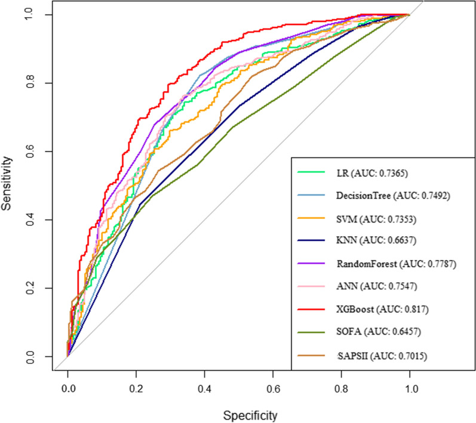
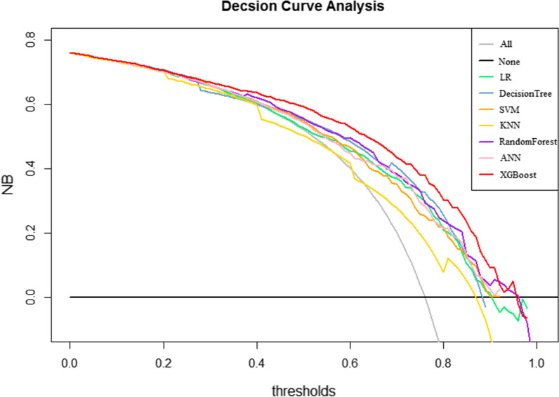
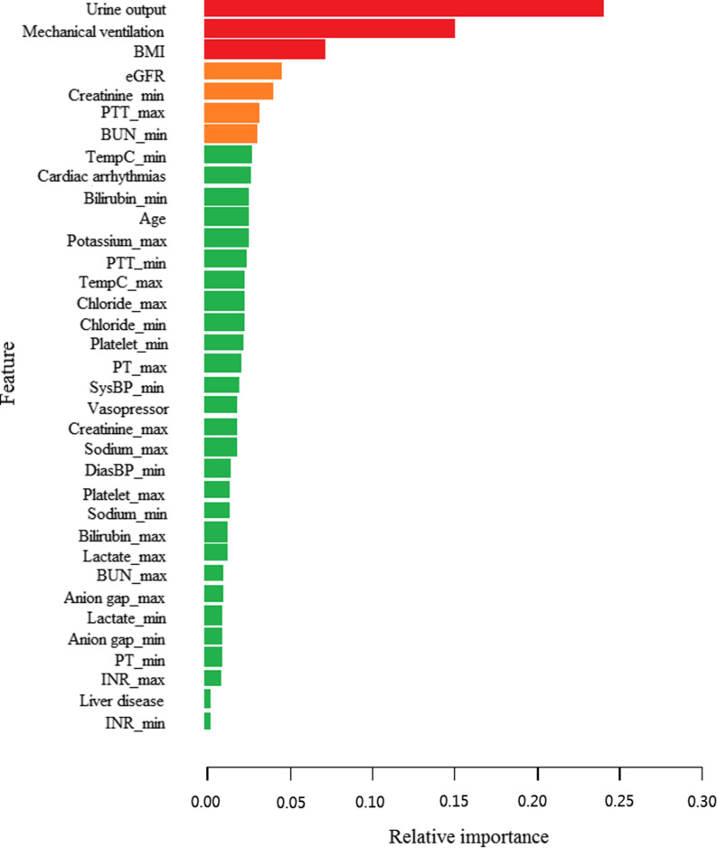
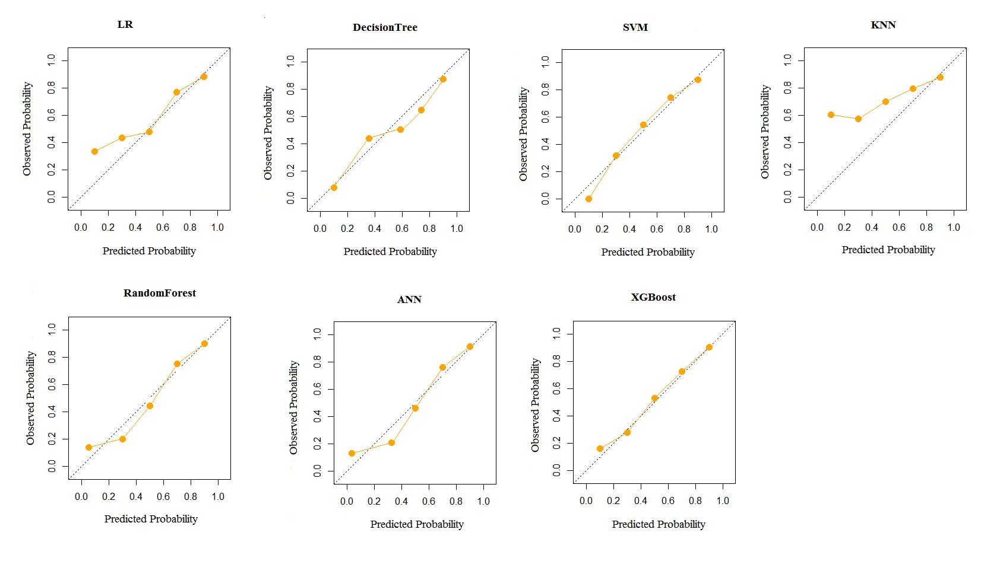

# Machine learning for the prediction of acute kidney injury in patients with sepsis
机器学习用于脓毒症患者急性肾损伤的预测

1Clinical Research Service Center, The Affiliated Hospital of Guangdong Medical University, Zhanjiang, 524001 Guangdong Province China
1 广东医科大学附属医院临床研究服务中心，广东湛江 524001
2Collaborative Innovation Engineering Technology Research Center of Clinical Medical Big Data Cloud Service in Medical Consortium of West Guangdong Province, The Affiliated Hospital of Guangdong Medical University, Zhanjiang, 524001 Guangdong Province China
2 广东医科大学附属医院粤西医学联合体临床医学大数据云服务协同创新工程技术研究中心，广东湛江 524001
3Department of Gastroenterology, The Affiliated Hospital of Guangdong Medical University, Zhanjiang, 524001 Guangdong Province China
3 广东医科大学附属医院消化内科，广东湛江 524001
✉Corresponding author.
*Correspondent author.
PMCID: PMC9101823  PMID: 35562803
PMCID：PMC9101823 PMID： 35562803

## Abstract  摘要
### Background  背景
Acute kidney injury (AKI) is the most common and serious complication of sepsis, accompanied by high mortality and disease burden. The early prediction of AKI is critical for timely intervention and ultimately improves prognosis. This study aims to establish and validate predictive models based on novel machine learning (ML) algorithms for AKI in critically ill patients with sepsis.

急性肾损伤（阿基）是脓毒症最常见和最严重的并发症，伴随着高死亡率和疾病负担。阿基的早期预测对于及时干预并最终改善预后至关重要。本研究旨在建立并验证基于新型机器学习（ML）算法的脓毒症危重患者阿基预测模型。

### Methods  方法
Data of patients with sepsis were extracted from the Medical Information Mart for Intensive Care III (MIMIC- III) database. Feature selection was performed using a Boruta algorithm. ML algorithms such as logistic regression (LR), k-nearest neighbors (KNN), support vector machine (SVM), decision tree, random forest, Extreme Gradient Boosting (XGBoost), and artificial neural network (ANN) were applied for model construction by utilizing tenfold cross-validation. The performances of these models were assessed in terms of discrimination, calibration, and clinical application. Moreover, the discrimination of ML-based models was compared with those of Sequential Organ Failure Assessment (SOFA) and the customized Simplified Acute Physiology Score (SAPS) II model.

脓毒症患者的数据从重症监护医学信息市场 III（MIMIC-III）数据库中提取。使用 Boruta 算法进行特征选择。ML 算法，如逻辑回归（LR），k-最近邻（KNN），支持向量机（SVM），决策树，随机森林，极端梯度提升（XGBoost），和人工神经网络（ANN）被应用于模型构建，利用十倍交叉验证。这些模型的性能进行了评估的歧视，校准和临床应用。此外，基于 ML 的模型的区分度与序贯器官衰竭评估（SOFA）和定制的简化急性生理评分（SAPS）II 模型进行了比较。

### Results  结果
A total of 3176 critically ill patients with sepsis were included for analysis, of which 2397 cases (75.5%) developed AKI during hospitalization. A total of 36 variables were selected for model construction. The models of LR, KNN, SVM, decision tree, random forest, ANN, XGBoost, SOFA and SAPS II score were established and obtained area under the receiver operating characteristic curves of 0.7365, 0.6637, 0.7353, 0.7492, 0.7787, 0.7547, 0.821, 0.6457 and 0.7015, respectively. The XGBoost model had the best predictive performance in terms of discrimination, calibration, and clinical application among all models.

共纳入 3176 例脓毒症危重症患者进行分析，其中 2397 例（75.5%）在住院期间发生阿基。共选取 36 个变量进行模型构建。建立了 LR、KNN、SVM、决策树、随机森林、ANN、XGBoost、SOFA 和 SAPS II 评分模型，得到受试者工作特征曲线下面积分别为 0.7365、0.6637、0.7353、0.7492、0.7787、0.7547、0.821、0.6457 和 0.7015。在所有模型中，XGBoost 模型在区分、校准和临床应用方面具有最佳的预测性能。

### Conclusion  结论
The ML models can be reliable tools for predicting AKI in septic patients. The XGBoost model has the best predictive performance, which can be used to assist clinicians in identifying high-risk patients and implementing early interventions to reduce mortality.

ML 模型可以成为预测脓毒症患者阿基的可靠工具。XGBoost 模型具有最佳的预测性能，可用于帮助临床医生识别高风险患者并实施早期干预以降低死亡率。

### Supplementary Information    补充资料
The online version contains supplementary material available at 10.1186/s12967-022-03364-0.

在线版本包含补充材料，可通过 10.1186/s12967-022-03364-0 获得。

### Keywords: 
Acute kidney injury, Sepsis, Machine learning, Prediction model, MIMIC- III database

关键词： 急性肾损伤，脓毒症，机器学习，预测模型，MIMIC- III 数据库

## Introduction  介绍
Acute kidney injury (AKI) is a common and complex clinical complication in intensive care unit (ICU) settings [1]. In the ICU, approximately 53% of AKI is caused by sepsis and subsequently contributes to longer hospital stay, higher morbidity, and heavier financial burden to patients [2, 3]. Despite improvements in clinical treatment, the mortality of AKI remains unchanged and reaches as high as 40–44% in patients with sepsis due to multiorgan failure, microvascular dysfunction, and systemic inflammatory response syndrome [4–6]. However, AKI can be reversed at the early stage through timely intervention and effective treatment, thereby reducing AKI-related mortality [7]. Therefore, identifying patients with high risk of AKI is of vital importance for the management of patients with sepsis in ICU settings.

急性肾损伤（阿基）是重症监护室（ICU）环境中常见且复杂的临床并发症[ 1 ]。在 ICU 中，约 53%的阿基由败血症引起，随后导致患者住院时间更长、发病率更高和经济负担更重[ 2 ， 3 ]。尽管临床治疗有所改善，但阿基的死亡率保持不变，在多器官衰竭、微血管功能障碍和全身炎症反应综合征导致的脓毒症患者中高达 40-44%[ 4 - 6 ]。但是，阿基可以通过及时干预和有效治疗在早期逆转，从而降低 AKI 相关死亡率[ 7 ]。因此，识别阿基高风险患者对于 ICU 环境中脓毒症患者的管理至关重要。

The prediction of AKI in patients with sepsis has always been a hot topic in critical care medicine. Some biomarkers, such as microRNA-22-3p [8], neutrophil gelatinase-associated lipocalin [9], procalcitonin [10], urinary miR-26b [11], and soluble thrombomodulin [12], have been reported to be associated with AKI in sepsis. However, they are difficult to popularize in clinical settings due to the high cost and requirement of testing technology. Some scoring systems, including acute physiology and chronic health evaluation-II, the simplified acute physiology score (SAPS) II, and sequential organ failure assessment (SOFA), have also been used in AKI prediction, but their performances are unsatisfactory due to poor specificity and sensitivity [13, 14]. In addition, some multivariate predictive models based on traditional statistical methods, such as logistic regression (LR) and Cox proportional risk model, have been developed for predicting the development of AKI among patients with sepsis. Fan et al. [15] applied LR to develop a prediction model for AKI in 15,726 patients with sepsis, and the model showed a preferable predictive accuracy. Importantly, the relationship between variables is complex, including linear or nonlinear relationship, which is prominent in ICU settings. However, LR is defaulted to handle the linear relationship between independent and dependent variables, and may oversimplify the complex nonlinear relationship. Moreover, LR is prone to be affected by multicollinearity between variables, which may reduce the performance of the model. Therefore, exploring more effective and accurate prediction tools is extremely important in the management of septic patients.

脓毒症患者阿基的预测一直是重症医学领域的研究热点。据报道，一些生物标志物，如 microRNA-22- 3 p [ 8 ]、中性粒细胞明胶酶相关脂质运载蛋白[ 9 ]、降钙素原[ 10 ]、尿 miR-26 b [ 11 ]和可溶性血栓调节蛋白[ 12 ]与脓毒症中的阿基相关。然而，由于检测成本高，检测技术要求高，难以在临床上推广。一些评分系统，包括急性生理学和慢性健康评估-II、简化急性生理学评分（SAPS）II 和序贯器官衰竭评估（SOFA），也已用于阿基预测，但由于特异性和灵敏度较差，其性能不令人满意[ 13 ， 14 ]。 此外，一些基于传统统计方法的多变量预测模型，如逻辑回归（LR）和考克斯比例风险模型，已被开发用于预测脓毒症患者中阿基的发展。Fan et al. [ 15 ]应用 LR 在 15，726 例脓毒症患者中开发了阿基的预测模型，该模型显示出较好的预测准确性。重要的是，变量之间的关系是复杂的，包括线性或非线性关系，这在 ICU 环境中是突出的。然而，LR 默认处理自变量和因变量之间的线性关系，并且可能过度简化复杂的非线性关系。此外，LR 易受变量间多重共线性的影响，可能会降低模型的性能。因此，探索更有效和准确的预测工具在脓毒症患者的管理中极为重要。

Recently, machine learning (ML) has attracted the attention of and gained recognition from clinicians due to the evolution of statistical theory and computer technology. Novel ML techniques have been widely used in predictive models of various diseases and show better performance compared with those of traditional LR or Cox regression analyses [16, 17]. We can find quite a few efforts on the application of ML algorithms for AKI prediction. For example, Chiofolo et al. [18] developed an AKI prediction model using automatic continuous random forest algorithm in critically ill patients, and achieved a preferable capability for early identification of high-risk patients. Le et al. [19] formulated a prediction system for AKI in the ICU settings using convolutional neural networks (CNNs), and found that the predictive performance of the CNN model outperformed that of SOFA scoring system. Lin et al. [20] found that random forest had greater potential in predicting mortality in patients with AKI rather than support vector machine (SVM), artificial neural network (ANN), and SAPS II. However, evidence showing the advantage of the ML algorithms in the prediction of AKI in septic patients is still lacking. In this study, we aimed to develop and validate multiple ML models to predict AKI in septic patients and to find the model with the best predictive performance.

近年来，由于统计理论和计算机技术的发展，机器学习（ML）已经引起了临床医生的关注并获得了他们的认可。新型 ML 技术已广泛用于各种疾病的预测模型，与传统 LR 或考克斯回归分析相比，表现出更好的性能[ 16 ， 17 ]。我们可以发现在 ML 算法用于阿基预测的应用上有相当多的努力。例如，Chiofolo 等人[ 18 ]开发了一种在危重患者中使用自动连续随机森林算法的阿基预测模型，并实现了早期识别高危患者的较好能力。Le 等人[ 19 ]使用卷积神经网络（CNN）制定了 ICU 环境中阿基的预测系统，并发现 CNN 模型的预测性能优于 SOFA 评分系统。Lin 等人 [ 20 ]发现随机森林在预测阿基患者死亡率方面比支持向量机（SVM），人工神经网络（ANN）和 SAPS II 具有更大的潜力。然而，仍然缺乏证据表明 ML 算法在预测脓毒症患者阿基方面的优势。在这项研究中，我们的目的是开发和验证多个 ML 模型来预测脓毒症患者的阿基，并找到具有最佳预测性能的模型。

## Methods  方法
### Data source  数据源
Using the Structured Query Language, data of patients with sepsis were extracted from a single-center publicly available database called the Medical Information Mart for Intensive Care III (MIMIC-III) database [21]. The MIMIC-III database is an integrated, de-identified, comprehensive clinical dataset containing all patients admitted to the ICUs of Beth Israel Deaconess Medical Center in Boston, MA, from June 1, 2001, to October 31, 2012. The MIMIC-III includes detailed information about admitted and discharged patients, such as demographic characteristics, monitoring vital signs, laboratory and microbiological examination, imaging examination, observation and recording of intake and output, drug treatment, length of stay, survival data, and discharge or death records. To apply for access to the database, we passed the protection of human research participants examination and obtained the certificate (No. 9983480).

使用结构化查询语言，从名为重症监护医学信息集市 III（MIMIC-III）数据库的单中心公开可用数据库中提取脓毒症患者数据[ 21 ]。MIMIC-III 数据库是一个综合的、去识别的、全面的临床数据集，包含 2001 年 6 月 1 日至 2012 年 10 月 31 日期间在马萨诸塞州波士顿 Beth Israel Deaconess 医疗中心 ICU 住院的所有患者。MIMIC-III 包括有关入院和出院患者的详细信息，如人口统计学特征、监测生命体征、实验室和微生物检查、影像学检查、观察和记录摄入量和排出量、药物治疗、住院时间、生存数据以及出院或死亡记录。为申请进入数据库，我们通过了人类研究参与者保护审查并获得证书（编号 9983480）。

### Participants  参与者
When patients were diagnosed with sepsis using the International Classification of Disease 9th revision (ICD-9) (99591, 99592, 78552) after first ICU admission, the patient eligibility was considered. Then, the Kidney Disease: Improving Global Outcomes (KDIGO) criteria [22] were used to determine whether AKI occurred in patients with sepsis during hospitalization. Patients who left the ICU within 48 h, aged < 18 years old and > 89 years old, or previously had AKI or renal failure were excluded. Moreover, patients with missing > 20% individual data or receiving renal replacement therapy (RRT) or continuous RRT at admission were excluded.

当患者在首次入住 ICU 后使用国际疾病分类第 9 版（ICD-9）（99591、99592、78552）诊断为脓毒症时，考虑患者合格性。其次，肾脏疾病：使用改善全球结局（KDIGO）标准[ 22 ]确定脓毒症患者在住院期间是否发生阿基。排除 48 小时内离开 ICU、年龄为 18 岁和 89 岁的患者，或既往患有阿基或肾衰竭的患者。此外，排除了个体数据缺失> 20%或在入院时接受肾脏替代治疗（RRT）或连续 RRT 的患者。

### Data extraction  数据提取
Patient data in the initial 24 h following admission were retrieved from the MIMIC- III database. The following information was used in this study: (1) demographic features, including sex, age, and ethnicity; (2) comorbidities, including congestive heart failure, hypertension, chronic pulmonary, diabetes, and liver disease; (3) vital signs, including heart rate, temperature, oxygen saturation (SpO2), systolic blood pressure (SysBP), and diastolic blood pressure (DiasBP); (4) laboratory parameters, including total bilirubin, anion gap, albumin, chloride, potassium, sodium, lactate, partial thromboplastin time (PTT), prothrombin time (PT), international normalized ratio (INR), creatinine, blood urea nitrogen (BUN), and glucose; (5) therapeutic and clinical managements, including mechanical ventilation and vasopressor use. For some variables with multiple measurements, we included the maximum and minimum values for analysis. For SOFA and SAPS-II scores, we only included the initial test values for analysis. Because this was an epidemiological study based on hypothesis, no attempt was made to estimate the sample size of the study. Instead, all eligible patients in the MIMIC- III database were enrolled to achieve a maximized statistical power.

从 MIMIC-III 数据库中检索入院后最初 24 小时内的患者数据。本研究使用以下信息：（1）人口统计学特征，包括性别、年龄和种族;（2）合并症，包括充血性心力衰竭、高血压、慢性肺疾病、糖尿病和肝病;（3）生命体征，包括心率、体温、血氧饱和度（SpO 2）、收缩压（SysBP）和舒张压（DiasBP）;（4）实验室参数，包括总胆红素、阴离子间隙、白蛋白、氯化物、钾、钠、乳酸盐、部分凝血活酶时间（PTT）、凝血酶原时间（PT）、国际标准化比率（INR）、肌酸酐、血尿素氮（BUN）和葡萄糖;（5）治疗和临床管理，包括机械通气和血管加压剂的使用。对于一些具有多个测量值的变量，我们包括最大值和最小值进行分析。 对于 SOFA 和 SAPS-II 评分，我们仅纳入初始测试值进行分析。由于这是一项基于假设的流行病学研究，因此未尝试估计研究的样本量。相反，MIMIC- III 数据库中的所有合格患者均入组，以实现最大的统计功效。

In order to minimize the bias resulting from missing data, variables with over 20% missing values were excluded in the final cohort, and other variables were duplicated using multiple imputation (MI) method. MI is an excellent and widely used method in dealing with missing values [23]. MI can impute each missing value with multiple plausible possible values. This procedure takes into account uncertainty behind the missing value and can produce several datasets from which parameters of interest can be estimated [24]. For example, if you are interested in coefficient for a covariate in a multivariable model, the coefficients will be estimated from each dataset, resulting in multiple coefficients. Considering the uncertainty in the estimation of missing values, these coefficients are combined to give a valid estimate of the coefficient. The coefficient variance estimated by MI is less likely to be underestimated than that estimated by single imputation [25].

为了最大限度地减少缺失数据导致的偏倚，在最终队列中排除缺失值超过 20%的变量，并使用多重插补（MI）方法重复其他变量。MI 是处理缺失值的优秀且广泛使用的方法[ 23 ]。MI 可以用多个合理的可能值插补每个缺失值。该过程考虑了缺失值背后的不确定性，并可以产生多个数据集，从中可以估计感兴趣的参数[ 24 ]。例如，如果您对多变量模型中协变量的系数感兴趣，则将从每个数据集估计系数，从而产生多个系数。考虑到缺失值估计的不确定性，将这些系数组合起来，给出系数的有效估计。通过 MI 估计的系数方差比通过单次插补估计的系数方差更不可能被低估[ 25 ]。

### Statistical analysis  统计分析
Continuous variables were summarized as the median with interquartile range and were compared using the Wilcoxon rank-sum test. Categorial variables were expressed as number and percentage and were compared using the Chi-square tests or Fisher’s exact probability method.

连续变量总结为中位数和四分位距，并使用 Wilcoxon 秩和检验进行比较。分类变量表示为数量和百分比，并使用卡方检验或 Fisher 精确概率法进行比较。

Feature selection is an important step in model construction. The Boruta algorithm was used to identify the most important features by comparing the Z-value of each feature against that of “shadow features”. By duplicating all real features and shuffling them sequentially, the Z-value of each attribute is obtained from a random forest model in each iteration, and the Z-value of shadow is created by random shuffling of the real features. A real feature is regarded as “important” if its Z-value is greater than the maximal Z-value of shadow features in multiple independent trials [26]. After feature selection, seven ML algorithms, including LR, k-nearest neighbors (KNN), SVM, decision tree, random forest, extreme gradient boosting (XGBoost), and ANN, were employed for model construction. A tenfold cross-validation was applied for the training and validation sets to prevent overfitting, and it was also used to formulate predictive models. Accordingly, the whole dataset was randomly divided into 10 folds. Nine of them were used as the training set for model development, and the remaining one was used as the validation set for model validation. Because each of the 10 folds was used as the validation set, the above process was repeated 10 times. Finally, the performance of each model was validated and compared in the validation set. In our cases, the model with the highest area under curve (AUC) of the receiver operating characteristic (ROC) curve was selected as the optimal model of each algorithm. Because SOFA and SAPS II scores were used as common tools for predicting the illness severity and prognosis in critically ill patients, we also compared the predictive abilities of ML-based predictive models with those of the conventional scoring systems.

特征选择是模型构造的重要步骤。Boruta 算法用于通过将每个特征的 Z 值与“阴影特征”的 Z 值进行比较来识别最重要的特征。通过复制所有的真实的特征并顺序地将它们混洗，在每次迭代中从随机森林模型中获得每个属性的 Z 值，并且通过随机混洗真实的特征来创建阴影的 Z 值。如果真实的特征的 Z 值大于多个独立试验中阴影特征的最大 Z 值，则该特征被视为“重要的”[ 26 ]。特征选择后，采用 LR、k-最近邻居（KNN）、SVM、决策树、随机森林、极端梯度增强（XGBoost）和 ANN 等七种 ML 算法进行模型构建。 对训练集和验证集应用十倍交叉验证以防止过度拟合，并将其用于制定预测模型。因此，将整个数据集随机分为 10 倍。其中 9 个被用作模型开发的训练集，剩余 1 个被用作模型验证的验证集。由于 10 个折叠中的每一个都用作验证集，因此将上述过程重复 10 次。最后，在验证集内对各模型的性能进行了验证和比较。在我们的案例中，选择具有最高受试者工作特征（ROC）曲线曲线下面积（AUC）的模型作为每种算法的最佳模型。由于 SOFA 和 SAPS II 评分被用作预测危重患者疾病严重程度和预后的常用工具，因此我们还比较了基于 ML 的预测模型与传统评分系统的预测能力。

The performance of the predictive models was performed with respect to discrimination, calibration, and clinical utility. The discrimination was quantitatively evaluated by the AUC of the ROC curve, sensitivity, specificity, recall, accuracy, and F1 score. The calibration was visually assessed through the graphical representations of the consistency of the predictive probabilities and the observed outcomes based on 1000 bootstrap resamples. The clinical application was investigated by decision curve analysis (DCA). The statistical analyses and modeling process were conducted by using R version 4.0.5, and a two-sided P-value < 0.05 was regarded as statistically significant.

预测模型的性能在区分、校准和临床实用性方面进行。通过 ROC 曲线的 AUC、敏感性、特异性、召回率、准确性和 F1 评分定量评价区分度。通过预测概率的一致性的图形表示和基于 1000 个自举重新采样的观察结果，目视评估校准。采用决策曲线分析法（DCA）评价其临床应用价值。使用 R 版本 4.0.5 进行统计分析和建模过程，双侧 P 值< 0.05 视为具有统计学显著性。

## Results  结果
### Baseline characteristics    基线特征
A total of 6138 patients were diagnosed with sepsis at admission according to ICD-9. Moreover, 2961 patients were excluded according to the exclusion criteria (Fig. 1). Finally, a total of 3176 patients were included in our analysis, of which 2397 patients (75.5%) had AKI after ICU admission.

根据 ICD-9，共有 6138 例患者在入院时被诊断为脓毒症。此外，根据排除标准排除了 2961 例患者（图 1）。最后，共有 3176 例患者纳入我们的分析，其中 2397 例患者（75.5%）在入住 ICU 后发生阿基。

> Fig. 1.

> The flowchart of patient selection. MIMIC: Medical Information Mort for Intensive Care; ICU: intensive care unit
> 患者选择流程图。MIMIC：重症监护医疗信息模块; ICU：重症监护病房

The differences in characteristics between AKI and non-AKI groups are described in Table 1. Male patients were more likely to develop AKI than female patients during hospitalization. Patients who suffered from AKI had higher age and BMI; higher incidence of congestive heart failure, cardiac arrhythmias, hypertension, liver disease, paralysis, chronic pulmonary disease, diabetes, and coagulopathy; and higher rate of mechanical ventilation and vasopressor use compared with those without AKI. The maximum values of anion gap, albumin, bilirubin, creatinine, chloride, glucose, lactate, potassium, PTT, INR, PT, BUN, heart rate, temperature, and SpO2 and the minimum values of anion gap, albumin, bilirubin, creatinine, chloride, lactate, potassium, PTT, INR, PT, BUN, heart rate, temperature, SpO2, sodium, SysBP, and DiasBP were much higher in septic patients with AKI compared with those without AKI (P < 0.05). However, the levels of urine output and eGFR in the AKI group were lower than those in the non-AKI group (P < 0.05).

阿基和非 AKI 组之间的特征差异见表 1 。男性患者在住院期间发生阿基的可能性高于女性患者。与未发生阿基的患者相比，AKI 患者的年龄和 BMI 较高;充血性心力衰竭、心律失常、高血压、肝病、瘫痪、慢性肺病、糖尿病和凝血功能障碍的发生率较高;机械通气和血管加压药使用率较高。 脓毒症合并阿基患者阴离子间隙、白蛋白、胆红素、肌酐、氯化物、葡萄糖、乳酸、钾、PTT、INR、PT、BUN、心率、体温和 SpO2 的最大值和阴离子间隙、白蛋白、胆红素、肌酐、氯化物、乳酸、钾、PTT、INR、PT、BUN、心率、体温、SpO2、钠、SysBP 和 DiasBP 的最小值均显著高于非阿基患者（P<0.05）。 但阿基组的尿量和 eGFR 水平低于非 AKI 组（P<0.05）。

> Table 1.  表1.
> Baseline characteristics of the patients with sepsis
> 脓毒症患者的基线特征

> AKI acute kidney injury, BMI body mass Index, PT prothrombin time, PTT partial thromboplastin time, INR International Normalized Ratio, BUN blood urea nitrogen, WBC white blood cell, SpO2 oxygen saturation, SysBP systolic blood pressure, DiasBP diastolic blood pressure, eGFR estimated glomerular filtration rate
> 阿基急性肾损伤、BMI 体重指数、PT 凝血酶原时间、PTT 部分凝血活酶时间、INR 国际标准化比值、BUN 血尿素氮、WBC 白色血细胞、SpO2 氧饱和度、SysBP 收缩压、DiasBP 舒张压、eGFR 估计肾小球滤过率

### Feature selection  特征选择
The result of feature screening based on the Boruta algorithm is shown in Fig. 2. In order of Z-values, the 35 variables most closely associated with AKI were age, BMI, cardiac arrhythmias, liver disease, urine output, eGFR, mechanical ventilation, vasopressor, the maximum values of anion gap, bilirubin, creatinine, chloride, lactate, platelet, potassium, PTT, INR, PT, sodium, BUN, temperature, and the minimum values of anion gap, bilirubin, creatinine, chloride, lactate, platelet, PTT, INR, PT, sodium, BUN, temperature, SysBP, and DiasBP.
基于 Boruta 算法的特征筛选结果如图 2 所示。按照 Z 值的顺序，与阿基最密切相关的 35 个变量为年龄、BMI、心律失常、肝病、尿量、eGFR、机械通气、血管加压药、阴离子间隙最大值、胆红素、肌酐、氯化物、乳酸盐、血小板、钾、PTT、INR、PT、钠、BUN、体温和阴离子间隙最小值、胆红素、肌酐、氯化物、乳酸盐、血小板、PTT、INR、PT、钠、BUN、体温、SysBP 和 DiasBP。

> Fig. 2.  图2.

> Feature selection based on the Boruta algorithm. The horizontal axis is the name of each variable, and the vertical axis is the Z-value of each variable. The box plot shows the Z-value of each variable during model calculation. The green boxes represent the first 35 important variables, the yellow represents tentative attributes, and the red represents unimportant variables. BMI: body mass Index; eGFR: estimated glomerular filtration rate; PT: prothrombin time; PTT: partial thromboplastin time; INR: International Normalized Ratio; BUN: blood urea nitrogen; SysBP: systolic blood pressure; DiasBP: diastolic blood pressure
> 基于 Boruta 算法的特征选择。水平轴是每个变量的名称，垂直轴是每个变量的 Z 值。箱形图显示模型计算期间每个变量的 Z 值。绿色框表示前 35 个重要变量，黄色框表示暂定属性，红色框表示不重要的变量。体重指数：体重指数;估算肾小球滤过率：肾小球滤过率估计值; PT：凝血酶原时间; PTT：部分凝血活酶时间; INR：国际标准化比值; BUN：血尿素氮; SysBP：收缩压; DiasBP：舒张压

### Model performance comparisons    模型性能比较
We generated seven ML models and two scoring systems to predict the development of AKI in patients with sepsis after ICU admission. Figure 3 shows the discriminative performance of nine models in terms of ROC curves. Among the nine models, XGBoost model (AUC = 0.817) had the best predictive effect for AKI in septic patients, followed by random forest (AUC = 0.779), ANN (AUC = 0.755), decision tree (AUC = 0.749), LR (AUC = 0.737), SVM (AUC = 0.735), SAPS II (AUC = 0.702), KNN (AUC = 0.664) and SOFA (AUC = 0.646) models. When using the LR model (AUC = 0.7265) as reference, the XGBoost model, random forest model, the ANN and decision tree outperformed it in the predictive ability of AKI in septic patients. However, the discrimination of SVM model (AUC = 0.735), KNN (AUC = 0.664), SOFA (AUC = 0.646), and SAPS II (AUC = 0.702) models were inferior to that of the LR model. Table 2 presents a set of detailed performance metrics for the nine models. The XGBoost model had the best discrimination with the highest sensitivity (0.945), accuracy (0.832), recall (0.852), F1 score (0.895), and the third highest specificity (0.913). In Additional file 1: Figure S1, the calibration curves showed that the XGBoost model performed best among the seven ML models. According to the DCA curves (Fig. 4), the XGBoost model exhibited greater net benefit along with the threshold probability compared with other models, indicating that the XGBoost model was the optimal model with favorable clinical utility.

我们生成了 7 个 ML 模型和 2 个评分系统，以预测 ICU 入院后脓毒症患者的阿基发展。图 0#显示了 9 个模型在 ROC 曲线方面的区分性能。在这 9 款车型中，XGBoost 车型（AUC = 0.817）对脓毒症患者阿基的预测效果最好，其次是随机森林（AUC = 0.779），人工神经网络（AUC = 0.755）、决策树（AUC = 0.749）、LR（AUC = 0.737）、SVM（AUC = 0.735）、SAPS II（AUC = 0.702）、KNN（AUC = 0.664）和 SOFA（AUC = 0.646）模型。当使用 LR 模型（AUC = 0.7265）作为参考时，XGBoost 模型、随机森林模型、ANN 和决策树在脓毒症患者阿基的预测能力方面优于 LR 模型。然而，SVM 模型（AUC = 0.735）、KNN 模型（AUC = 0.664）、SOFA 模型（AUC = 0.646）和 SAPS II 模型（AUC = 0.702）的区分度低于 LR 模型。表 1#列出了九种型号的一组详细性能指标。 XGBoost 模型具有最高的灵敏度（0.945），准确度（0.832），召回率（0.852），F1 评分（0.895）和第三高的特异性（0.913）。在附加文件 1 ：图 S1 中，校准曲线显示 XGBoost 模型在七个 ML 模型中表现最好。根据 DCA 曲线（图 3#），XGBoost 模型与其他模型相比，表现出更大的净效益沿着阈值概率，表明 XGBoost 模型是具有良好临床实用性的最佳模型。

> Fig. 3.  图三.

> Receiver operating characteristic curve of the seven models. LR: logistic regression; KNN, k-nearest neighbors; SVM: support vector machine; XGBoost: Extreme Gradient Boosting; ANN: artificial neural network; SOFA: sequential organ failure assessment; SAPS II: the customized simplified acute physiology score; AUC: area under the curve
> 七种模型的受试者工作特征曲线。左后：逻辑回归; KNN，k-最近邻;支持向量机：支持向量机; XG 增强：极端梯度助推;安：人工神经网络;沙发：序贯器官衰竭评估; SAPS II：定制简化急性生理评分; AUC：曲线下面积

> Table 2.  表2.
> Model performance metrics
> 模型性能指标

> AUC area under curve, LR logistic regression KNN: k-nearest neighbors, SVM support vector machine, XGBoost extreme gradient boosting, ANN artificial neural network, SOFA Sequential Organ Failure Assessment, SAPS II the Simplified Acute Physiology Score II
> AUC 曲线下面积，LR 逻辑回归 KNN：k-最近邻，SVM 支持向量机，XGBoost 极端梯度增强，ANN 人工神经网络，SOFA 序贯器官衰竭评估，SAPS II 简化急性生理评分 II

> Fig. 4.  见图4。

> Decision curve analyses of the seven models. The horizontal line indicates no patients develop AKI, and the gray oblique line indicates patients develop AKI. LR logistic regression, KNN k-nearest neighbors, SVM support vector machine, XGBoost Extreme Gradient Boosting, ANN artificial neural network, AKI acute kidney injury
> 七种模型的决策曲线分析。水平线表示无患者发生阿基，灰色斜线表示患者发生阿基。LRlogistic 回归，KNNk-近邻，SVM 支持向量机，XGBoostExtreme Gradient Boosting，ANN 人工神经网络， 阿基急性肾损伤

### Feature importance in XGBoost models    XGBoost 模型中的特征重要性
The ranks of feature importance in the XGBoost model are shown in Fig. 5. Urine output, mechanical ventilation, BMI, eGFR, minimum creatinine, maximum PPT, and minimum BUN were the most important features that contributed to AKI in critically ill patients with sepsis.
XGBoost 模型中的特征重要性等级如图 5 所示。尿量、机械通气、BMI、eGFR、最小肌酐、最大 PPT 和最小 BUN 是导致脓毒症重症患者阿基的最重要特征。

> Fig. 5.  图5.

> Feature importance derived from the XGBoost model. BMI body mass Index, PTT partial thromboplastin time, BUN blood urea nitrogen, eGFR estimated glomerular filtration rate, Max Maximum, Min Minimum, AKI acute kidney injury
> 从 XGBoost 模型导出的特征重要性。BMI 体重指数、PTT 部分凝血活酶时间、BUN 血尿素氮、eGFR 估计肾小球滤过率、 最大值、 最小值、 阿基急性肾损伤

## Discussion  讨论
Compared with some previous reports on AKI prediction in critically ill patients using the MIMIC- III dataset [18–20], our research has several novel contributions. For the first time, our study included seven commonly used ML algorithms for comprehensive analyses and compared their predictive performance with that of traditional scoring systems, including SOFA and SAPS II scoring systems. The ML models showed good predictive accuracy in term of discrimination and calibration, but it was not the same as usefulness in clinical practice. When the threshold probabilities of the net benefit are impractical, a model with good performance may also have limited applicability [27]. Therefore, we applied the DCA curves to validate the clinical applicability of the ML models. Finally, Boruta algorithm can help us fully understand the importance of independent variables, so as to carry out feature selection more effectively.

与之前使用 MIMIC- III 数据集[ 18 - 20 ]预测危重患者阿基的一些报告相比，我们的研究有几个新的贡献。我们的研究第一次包括了七种常用的 ML 算法进行综合分析，并将它们的预测性能与传统评分系统（包括 SOFA 和 SAPS II 评分系统）进行了比较。ML 模型在区分和校准方面显示出良好的预测准确性，但它并不等同于在临床实践中的有用性。当净收益的阈值概率不切实际时，具有良好性能的模型也可能具有有限的适用性[ 27 ]。因此，我们应用 DCA 曲线来验证 ML 模型的临床适用性。最后，Boruta 算法可以帮助我们充分理解自变量的重要性，从而更有效地进行特征选择。

The incidence rate of sepsis is increasing in critically ill patients worldwide, which is associated with high mortality and economic burden [28]. Sepsis is a well-known risk factor of AKI, as the kidney is very sensitive to hypoperfusion and some interventions, such as mechanical ventilation and excessive fluid resuscitation. At present, the treatment of AKI in sepsis remains reactive and nonspecific, and no preventive treatment is available. The presence of AKI has a significant impact on increased mortality in septic patients, which range from 38.2 to 70.2% [29, 30]. Hernando et al. [31] found that AKI occurs in 40–50% of septic patients with a 6–eightfold increase in mortality. Furthermore, a prospective cohort study including 401 critically ill patients revealed that the incidence of AKI was 50.1% in patients with severe sepsis, which is 7.79 times higher than that in patients without sepsis [32]. However, active treatment at the early stage of AKI can improve the survival rate [33]. Some studies have found that early renal recovery in sepsis-related AKI can not only improve the survival rate, but also contribute to the later recovery of patients after discharge [34–36]. Unfortunately, it is difficult for clinicians to identify patients at high risk of AKI in the ICU. Therefore, developing and promoting reliable prediction models is particularly urgent for identifying these patients and providing them with timely and effective interventions to improve their prognosis.

脓毒症的发生率在全球危重患者中不断增加，这与高死亡率和经济负担相关[ 28 ]。脓毒症是阿基的一个众所周知的风险因素，因为肾脏对灌注不足和一些干预措施（如机械通气和过度液体复苏）非常敏感。目前，脓毒症中阿基的治疗仍然是反应性和非特异性的，并且没有可用的预防性治疗。阿基的存在对脓毒症患者的死亡率增加有显著影响，范围为 38.2%至 70.2% [ 29 ， 30 ]。Hernando 等人[ 31 ]发现 40-50%的脓毒症患者发生阿基，死亡率增加 6- 8 倍。此外，一项包括 401 例重症患者的前瞻性队列研究显示，严重脓毒症患者的阿基发生率为 50.1%，是非脓毒症患者的 7.79 倍[ 32 ]。 然而，在阿基的早期阶段积极治疗可以提高存活率[ 33 ]。有研究发现，脓毒症相关阿基的早期肾脏恢复不仅可以提高生存率，还有助于患者出院后的后期恢复[ 34 - 36 ]。不幸的是，临床医生很难在 ICU 中识别阿基高风险患者。因此，开发和推广可靠的预测模型对于识别这些患者并为他们提供及时有效的干预措施以改善其预后尤为迫切。

In this study, the traditional severity scoring systems, such as SOFA and SAPS II scores, showed an unfavorable performance compared with the ML model, suggesting that they might not be effective tools for AKI prediction in critically ill patients with sepsis. Although SOFA and SAPS II scoring systems can be used to assess the risk of adverse outcomes in critically ill patients, these scores largely depended on the experience of the practitioners [37]. Moreover, these scoring systems preclude the analysis of a large number of valuable variables, resulting in a worse predictive performance than that of multivariate models [38]. Previous studies have revealed that SOFA and SAPS II scoring systems have some disadvantages, such as poor prediction performance, low sensitivity and specificity, wide fluctuation range, and cumbersome process, compared with ML models [16].

在这项研究中，传统的严重程度评分系统，如 SOFA 和 SAPS II 评分，与 ML 模型相比表现不佳，表明它们可能不是脓毒症重症患者阿基预测的有效工具。尽管 SOFA 和 SAPS II 评分系统可用于评估危重患者的不良结局风险，但这些评分在很大程度上取决于从业者的经验[ 37 ]。此外，这些评分系统排除了大量有价值变量的分析，导致预测性能比多变量模型更差[ 38 ]。以往的研究表明，与 ML 模型相比，SOFA 和 SAPS II 评分系统存在一些缺点，如预测性能差，灵敏度和特异性低，波动范围宽，过程繁琐[ 16 ]。

Our results showed that the XGBoost model had a better capability than the LR model for predicting AKI in septic patients. On the one hand, the LR algorithm requires researchers to manually select independent variables, cannot detect the complex nonlinear relationship and interaction between independent variable X and response value Y, and is sensitive to the multicollinearity of independent variables, which may result in an underfit and inaccurate model. On the other hand, the XGBoost model could efficiently and flexibly deal with missing data and combine weak prediction models to establish accurate prediction models. Due to its excellent precision and performance, the XGBoost algorithm is increasingly emphasized as a competitive alternative to LR analysis in predicting clinical adverse outcomes.

我们的研究结果表明，XGBoost 模型预测脓毒症患者阿基的能力优于 LR 模型。一方面，LR 算法需要研究者手动选取自变量，无法检测自变量 X 与响应值 Y 之间复杂的非线性关系和交互作用，对自变量的多重共线性敏感，可能导致模型欠拟合和不准确。另一方面，XGBoost 模型能够高效灵活地处理缺失数据，并将弱预测模型进行联合收割机组合，建立准确的预测模型。由于其出色的精度和性能，XGBoost 算法越来越被强调为预测临床不良结局的 LR 分析的竞争性替代方案。

Among all ML models, the XGBoost model performs best in AKI prediction, which were consistent with some previous studies. Liu et al. [39] demonstrated that the predictive performance of the XGBoost model superior to three other ML models, including LR, SVM, and random forest, for predicting mortality in patients with AKI. Zhu et al. [40] found that the XGBoost model outperformed the KNN, LR, decision tree, random forest, and ANN models in prediction of hospital mortality for mechanically ventilated patients. Moreover, a meta-analysis revealed that XGBoost was more effective than LR and other ML algorisms, including ANN, SVM, and Bayesian network, in the prediction of AKI [41].

在所有 ML 模型中，XGBoost 模型在阿基预测中表现最好，这与先前的一些研究一致。Liu 等人[ 39 ]证明，XGBoost 模型在预测阿基患者死亡率方面的预测性能上级优于其他三种 ML 模型，包括 LR、SVM 和随机森林。Zhu 等人[ 40 ]发现，XGBoost 模型在预测机械通气患者的住院死亡率方面优于 KNN、LR、决策树、随机森林和 ANN 模型。此外，荟萃分析显示，XGBoost 在预测阿基方面比 LR 和其他 ML 算法（包括 ANN，SVM 和贝叶斯网络）更有效[ 41 ]。

This study is the first to apply ML algorithms for predicting the development of AKI during hospitalization in patients with sepsis. Through the sophisticated XGBoost model, we identified that urine output, mechanical ventilation, BMI, eGFR, minimum creatinine, maximum PPT, and minimum BUN were mostly associated with the development of AKI in patients with sepsis. Among these features, urine output was considered to be the most important indicator of AKI, which is in accordance with the KDIGO recommendations. In addition to urine output, some measures of renal function, such as eGFR, BUN, and serum creatinine, also played an important role in the prediction of kidney disease. These results have been confirmed in many clinical studies. Mertoglu et al. [42] found that serum creatinine and BUN have greater diagnostic value compared with other novel markers including myo-inositol oxygenase and cystatin C. Laranja et al. [4] revealed that septic patients with AKI had lower urine output compared with patients with AKI from other cases or chronic kidney disease. Grams et al. [43] demonstrated that low eGFR was a reliable risk factors for AKI through a meta-analysis including more than 1 million participants from eight countries. Notably, mechanical ventilation was also significantly associated with AKI in septic patients. Positive-pressure mechanical ventilation (PPV) is commonly used in critically ill patients to provide oxygenation, ventilation, and airway protection support. However, PPV has long been considered to have potentially harmful effects on the kidney [30]. This may be due to the following three reasons. First, PPV may increase intrathoracic pressure and thus reduce venous reflux, cardiac output, and renal perfusion. Second, mechanical ventilation may induce the release of some neurohormones, affect the renin-angiotensin system, and decrease renal blood flow and eGFR. Third, mechanical ventilation at any volume or pressure might create a cascade of inflammation, including multiple interleukins, tumor necrosis factor-α, and Fas ligand, that may contribute to AKI. Moreover, PTT is common indicators to judge coagulation function. Recently, a retrospective study [44] showed that more than half of patients with septic AKI had at least one abnormal coagulation index, and coagulation dysfunction may predict poor outcome of patients. BMI is a simple and useful index for obesity according to the height and weight of patients. BMI has been widely studied in patients with sepsis and AKI. Our findings showed that the AKI group had higher BMI compared with the non-AKI group. Obesity can lead to glomerular hyperperfusion and hyperfiltration, increase the hemodynamic and metabolic burden of a single glomerulus, and activate inflammation of adipocytes and oxidative stress [45], increasing the risk and progression of AKI. As these indexes can be evaluated easily at hospital admission, they can be used as convenient predictors for the development of AKI in critically ill patients with sepsis.

本研究首次应用 ML 算法预测脓毒症患者住院期间阿基的发展。通过复杂的 XGBoost 模型，我们发现尿量、机械通气、BMI、eGFR、最小肌酐、最大 PPT 和最小 BUN 主要与脓毒症患者发生阿基相关。在这些特征中，尿量被认为是阿基的最重要指标，这与 KDIGO 的建议一致。除尿量外，一些肾功能指标，如 eGFR、BUN 和血清肌酐，也在预测肾脏疾病中发挥重要作用。这些结果已在许多临床研究中得到证实。Mertoglu 等人[ 42 ]发现，与包括肌醇加氧酶和胱抑素 C 在内的其他新标志物相比，血清肌酐和 BUN 具有更大的诊断价值。Laranja 等人 [ 4 ]显示，与其他病例或慢性肾脏疾病的阿基患者相比，脓毒症阿基患者的尿量较低。Grams 等人[ 43 ]通过一项荟萃分析（包括来自 8 个国家的 100 多万名参与者）证明，低 eGFR 是阿基的可靠风险因素。值得注意的是，机械通气也与脓毒症患者的阿基显著相关。正压机械通气（PPV）常用于重症患者，以提供氧合、通气和气道保护支持。然而，PPV 长期以来一直被认为对肾脏有潜在的有害影响[ 30 ]。这可能是由于以下三个原因。首先，PPV 可能增加胸内压，从而减少静脉回流、心输出量和肾灌注。第二，机械通气可能诱导某些神经激素的释放，影响肾素-血管紧张素系统，降低肾血流量和 eGFR。 第三，任何容量或压力下的机械通气都可能产生级联炎症反应，包括多种白细胞介素、肿瘤坏死因子-α和 Fas 配体，这可能导致阿基。PTT 是判断凝血功能的常用指标。最近，一项回顾性研究[ 44 ]显示，超过一半的脓毒性阿基患者至少有一项凝血指标异常，凝血功能障碍可能预示患者预后不良。BMI 是根据患者的身高和体重来判断肥胖的一个简单而有用的指标。BMI 已在脓毒症和阿基患者中进行了广泛研究。我们的研究结果表明，阿基组的 BMI 高于非 AKI 组。肥胖可导致肾小球过度灌注和过度滤过，增加单个肾小球的血流动力学和代谢负担，并激活脂肪细胞炎症和氧化应激[ 45 ]，增加阿基的风险和进展。 由于这些指标可以在入院时容易地进行评估，因此它们可以用作脓毒症危重患者发生阿基的方便预测因子。

In this study, the in-hospital incidence of AKI in septic patients was 75.5%, which was similar to some previous studies. According to the report by Fan et al. [15], the incidence rate of AKI was 61% in 15,508 patients with sepsis. Tejera et al. [32] conducted a retrospective study in 401 critically ill patients and found that the incidence of AKI was as high as 75.3%. The pathogenesis of AKI in sepsis is complex and has not been clarified yet. Hemodynamic instability, impaired endothelial function, infiltration of inflammatory cells in the renal parenchyma, renal thrombosis, and renal tubular necrosis have been hypothesized to contribute to the development of AKI in septic patients [46]. The hyperactivation of immune response caused by sepsis is particularly important in the pathogenesis process, including the proinflammatory and anti-inflammatory stages. In the proinflammatory stage, humoral and cellular immunity can cause a storm of inflammatory factors, leading to the excessive secretion of inflammatory factors (such as interleukin 1 and tumor necrosis factor-α), the activation of complement and coagulation system, the activation of hyaluronic acid and elastase, and eventually the reduction of renal blood flow and the occurrence of AKI and septic shock [6, 47]. Subsequently, patients will have a compensatory anti-inflammatory response, which is an immunosuppressive state, manifested by increased secretion of cytokines (such as interleukin 10), weakened endocytosis, reduced proliferation of lymphocytes, and increased apoptosis [29]. Thus, patients with sepsis are the high-risk group for AKI during hospitalization. Once AKI occurs, the prognosis is significantly worse, and even RRT cannot improve the prognosis.

在本研究中，脓毒症患者的院内阿基发生率为 75.5%，这与之前的一些研究相似。根据 Fan 等人[ 15 ]的报告，15,508 例脓毒症患者中阿基的发生率为 61%。Tejera 等[ 32 ]对 401 例重症患者进行了回顾性研究，发现阿基的发生率高达 75.3%。脓毒症阿基的发病机制复杂，至今尚未阐明。假设血液动力学不稳定、内皮功能受损、肾实质中炎性细胞浸润、肾血栓形成和肾小管坏死是脓毒症患者发生阿基的原因[ 46 ]。脓毒症引起的免疫反应过度激活在其发病过程中尤其重要，包括促炎和抗炎阶段。 在促炎阶段，体液和细胞免疫可引起炎症因子风暴，导致炎症因子（如白细胞介素 1 和肿瘤坏死因子-α）过度分泌，补体和凝血系统激活，透明质酸和弹性蛋白酶激活，最终导致肾血流量减少，发生阿基和脓毒性休克[ 6 ， 47 ]。随后，患者将出现代偿性抗炎反应，这是一种免疫抑制状态，表现为细胞因子（如白细胞介素 10）分泌增加、内吞作用减弱、淋巴细胞增殖减少和细胞凋亡增加[ 29 ]。因此，脓毒症患者是住院期间发生阿基的高危人群。一旦发生阿基，预后明显变差，即使 RRT 也不能改善预后。

We should acknowledge some limitations of this research. First, the retrospective and observational nature of our study may lead to inevitable selection bias. Second, the data of MIMIC- III came from a single center in the United States, which may affect the extension of the prediction model to other populations. Therefore, further research with large samples and multiple centers is necessary to externally verify the application of models. Third, we used the filling method to estimate some missing data, which may lead to deviation from the true value. However, we still believe that the constructed model is helpful for clinicians to timely treat ICU patients with sepsis at high risk for developing AKI.

我们应该承认这项研究的一些局限性。首先，我们研究的回顾性和观察性性质可能会导致不可避免的选择偏倚。第二，MIMIC- III 的数据来自美国的单一中心，这可能会影响预测模型向其他人群的推广。因此，需要进一步开展大样本、多中心的研究，从外部验证模型的应用。第三，我们使用填充方法来估计一些缺失数据，这可能会导致偏离真实值。然而，我们仍然相信所构建的模型有助于临床医生及时治疗 ICU 脓毒症患者，这些患者具有发生阿基的高风险。

## Conclusions  结论
In conclusion, the ML models can be reliable tools for predicting AKI in septic patients. Among all of the predictive models, the XGBoost model is the most effective model, which may assist clinicians in tailoring precise management and implementing early interventions for septic patients at risk of AKI to reduce mortality.

总之，ML 模型可以成为预测脓毒症患者阿基的可靠工具。在所有预测模型中，XGBoost 模型是最有效的模型，它可以帮助临床医生为有阿基风险的脓毒症患者定制精确的管理和实施早期干预，以降低死亡率。

## Supplementary Information    补充资料
12967_2022_3364_MOESM1_ESM.tif (218.4KB, tif)

> Additional file 1: Figure S1. Calibration curves of the seven models. The x-axis represents the predicted probability calculated by models, and the y-axis is the observed actual probability of AKI. LR logistic regression, KNN k-nearest neighbors, SVM support vector machine, XGBoost Extreme Gradient Boosting, ANN artificial neural network, AKI acute kidney injury.
> 附加文件 1：图 S1。7 种型号的校准曲线。x 轴表示模型计算的预测概率，y 轴表示观察到的阿基实际概率。LR 逻辑回归，KNNk-最近邻，SVM 支持向量机，XGBoost 极端梯度提升，ANN 人工神经网络， 阿基急性肾损伤。

## Acknowledgements  确认
The authors would like to thank MIMIC-III for open access to their database. The opinions expressed in this study are those of the authors and do not represent the opinions of the Beth Israel Deaconess Medical Center.

作者要感谢 MIMIC-III 开放访问他们的数据库。本研究中表达的观点是作者的观点，不代表贝斯以色列女执事医疗中心的观点。