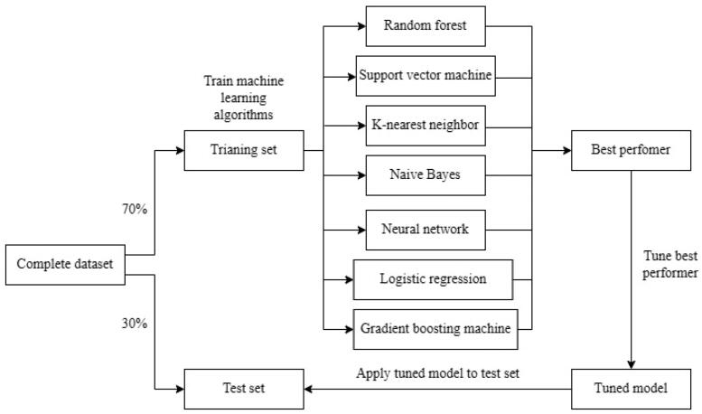
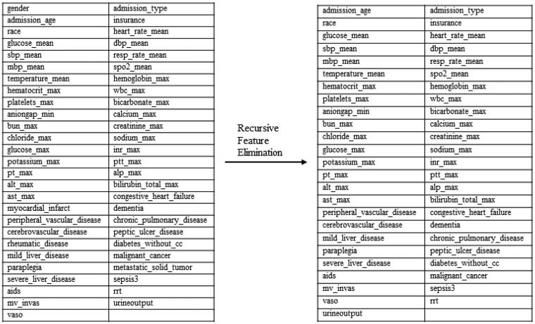
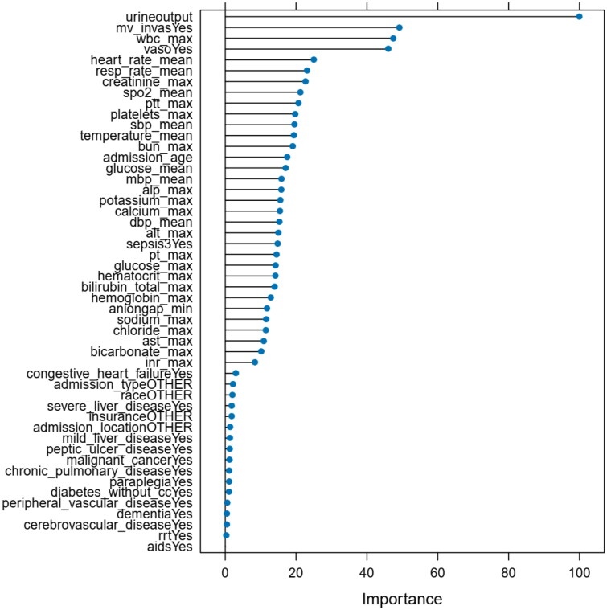
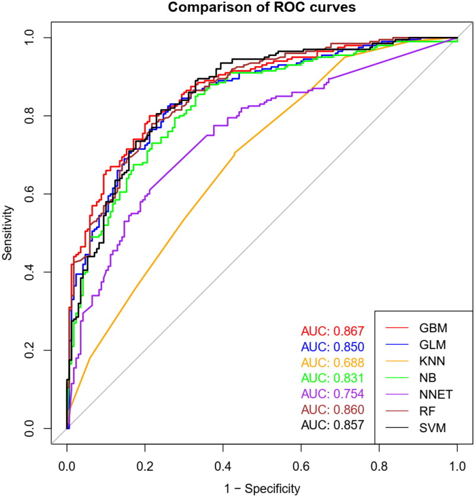
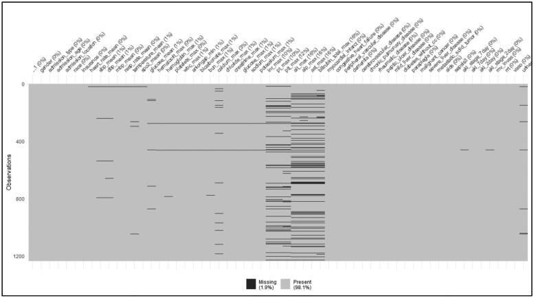
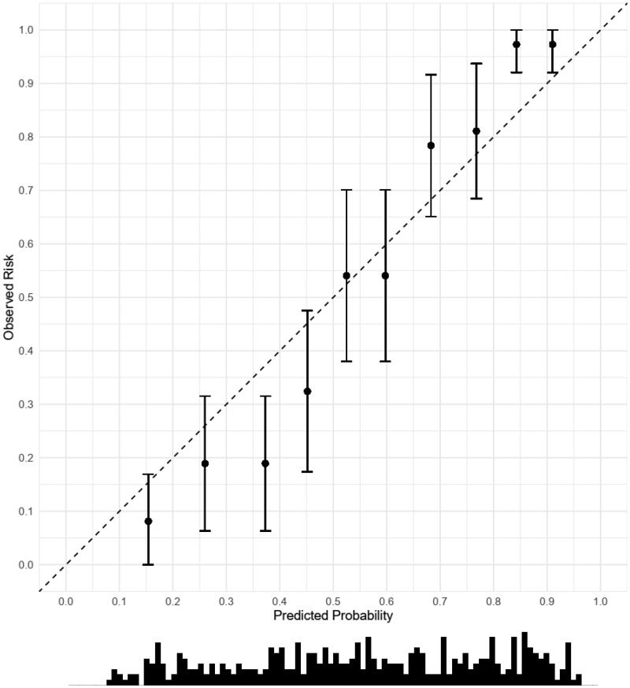

# Predictive model of acute kidney injury in critically ill patients with acute pancreatitis: a machine learning approach using the MIMIC-IV database
急性胰腺炎重症患者急性肾损伤的预测模型：使用 MIMIC-IV 数据库的机器学习方法

1Faculty of Anesthesiology, Changhai Hospital, Naval Medical University, Shanghai, China
1 中国上海海军医科大学长海医院麻醉科
✉CONTACT Peipei Jin kingpei89@163.comFaculty of Anesthesiology, Changhai Hospital, Naval Medical University, 168, Changhai Road, 200433, Shanghai, China
金培培 kingpei89@163.com 中国上海市长海路 168 号，海军医科大学长海医院麻醉科
✉Jinjun Bian jinjunbicu@163.com Faculty of Anesthesiology, Changhai Hospital, Naval Medical University, 168, Changhai Road, 200433, Shanghai, China.
中国 jinjunbicu@163.com 上海市长海路 168 号，海军医科大学长海医院麻醉科，邮编：200433。
PMCID: PMC10810629  PMID: 38264967

## Abstract  摘要
### Background  背景
Acute kidney injury (AKI) is a common and serious complication in severe acute pancreatitis (AP), associated with high mortality rate. Early detection of AKI is crucial for prompt intervention and better outcomes. This study aims to develop and validate predictive models using machine learning (ML) to identify the onset of AKI in patients with AP.
急性肾损伤（acute kidney injury，阿基）是重症急性胰腺炎（severe acute pancreatitis，AP）常见的严重并发症，病死率高。阿基的早期检测对于及时干预和更好的结果至关重要。本研究旨在使用机器学习（ML）开发和验证预测模型，以识别 AP 患者的阿基发作。

### Methods  方法
Patients with AP were extracted from the MIMIC-IV database. We performed feature selection using the random forest method. Model construction involved an ensemble of ML, including random forest (RF), support vector machine (SVM), k-nearest neighbors (KNN), naive Bayes (NB), neural network (NNET), generalized linear model (GLM), and gradient boosting machine (GBM). The best-performing model was fine-tuned and evaluated through split-set validation.
从 MIMIC-IV 数据库中提取 AP 患者。我们使用随机森林方法进行特征选择。模型构建涉及 ML 的集成，包括随机森林（RF），支持向量机（SVM），k-最近邻（KNN），朴素贝叶斯（NB），神经网络（NNET），广义线性模型（GLM）和梯度提升机（GBM）。通过分裂集验证对性能最佳的模型进行了微调和评估。

### Results  结果
We analyzed 1,235 critically ill patients with AP, of which 667 cases (54%) experienced AKI during hospitalization. We used 49 variables to construct models, including GBM, GLM, KNN, NB, NNET, RF, and SVM. The AUC for these models was 0.814 (95% CI, 0.763 to 0.865), 0.812 (95% CI, 0.769 to 0.854), 0.671 (95% CI, 0.622 to 0.719), 0.812 (95% CI, 0.780 to 0.864), 0.688 (95% CI, 0.624 to 0.752), 0.809 (95% CI, 0.766 to 0.851), and 0.810 (95% CI, 0.763 to 0.856) respectively. In the test set, the GBM’s performance was consistent, with an area of 0.867 (95% CI, 0.831 to 0.903).
我们分析了 1，235 例重症 AP 患者，其中 667 例（54%）在住院期间发生阿基。我们使用 49 个变量来构建模型，包括 GBM，GLM，KNN，NB，NNET，RF 和 SVM。这些模型的 AUC 为 0.814（95% CI，0.763 至 0.865），0.812（95% CI，0.769 至 0.854），0.671（95% CI，0.622 至 0.719），0.812（95% CI，0.780 至 0.864）、0.688（95% CI，0.624 至 0.752）、0.809（95% CI，0.766 至 0.851）和 0.810（95% CI，0.763 至 0.856）。在测试集中，GBM 的表现是一致的，面积为 0.867（95% CI，0.831 至 0.903）。

### Conclusions  结论
The GBM model’s precision is crucial, aiding clinicians in identifying high-risk patients and enabling timely interventions to reduce mortality rates in critical care.
GBM 模型的精确性至关重要，有助于临床医生识别高风险患者，并及时采取干预措施，以降低重症监护中的死亡率。

### Keywords: 
Acute kidney injury, acute pancreatitis, machine learning, prediction model, MIMIC- IV database
关键词：急性肾损伤，急性胰腺炎，机器学习，预测模型，MIMIC-IV 数据库

## Introduction  介绍
Worldwide hospital admission rates are significantly influenced by acute pancreatitis (AP), a gastrointestinal condition with a global prevalence affecting various age groups and genders [1, 2]. In the context of AP, acute kidney injury (AKI) frequently emerges as a complication, especially in severe cases, often occurring at an advanced stage and following the deterioration of other vital organs [3]. Despite comprehensive practice guidelines for AP management, morbidity and mortality rates persist stubbornly [4]. Importantly, increased mortality in severe AP cases is closely tied to organ failure and subsequent secondary infections—key factors shaping AP outcomes [5]. Therefore, it is crucial to clinically assess symptoms and indicators of organ failure (including respiratory, cardiovascular, and renal systems) in AP patients to accurately categorize the condition.
急性胰腺炎（AP）是一种胃肠道疾病，在全球范围内流行，影响不同年龄组和性别[ 1 ， 2 ]，对全球住院率有显著影响。在 AP 的背景下，急性肾损伤（阿基）经常作为并发症出现，特别是在严重病例中，通常发生在晚期和其他重要器官恶化之后[ 3 ]。尽管有 AP 管理的综合实践指南，但发病率和死亡率顽固存在[ 4 ]。重要的是，严重 AP 病例中死亡率的增加与器官衰竭和随后的继发性感染密切相关-这是影响 AP 结局的关键因素[ 5 ]。因此，临床评估 AP 患者的器官衰竭（包括呼吸、心血管和肾脏系统）症状和指标以准确分类病情至关重要。

Therefore, clinicians face a critical need to early anticipate the likelihood of acute renal injury in patients with acute pancreatitis, a foresight that can significantly guide and improve clinical interventions. Additionally, in the realm of AKI detection, the imperative is for the diagnostic method to possess attributes such as minimal invasiveness, widespread accessibility, cost-effectiveness, procedural simplicity, and replicability [6]. Several studies have explored determinants and established prognostic frameworks to predict AKI onset in individuals with acute pancreatitis. However, these investigations have been hindered by limited sample sizes and a lack of precision necessary for robust prognostic modeling [7]. The challenge of promptly and accurately diagnosing AKI in acute pancreatitis patients persists within clinical practice.
因此，临床医生面临着早期预测急性胰腺炎患者发生急性肾损伤的可能性的迫切需要，这种预见可以显着指导和改善临床干预。此外，在阿基检测领域，诊断方法必须具有诸如微创性、广泛可及性、成本效益、程序简单性和可复制性等属性[ 6 ]。几项研究探索了决定因素并建立了预测急性胰腺炎患者阿基发作的预后框架。然而，这些研究受到样本量有限和缺乏稳健预后建模所需的精确度的阻碍[ 7 ]。在临床实践中，迅速准确地诊断急性胰腺炎患者的阿基仍然是一个挑战。

In recent times, there has been a surge in the practical use of powerful computational methodologies, especially within the field of machine learning, for disease prediction efforts. Machine learning (ML), an emerging domain, has increasingly become integral to medical research. It’s important to note that the effectiveness of ML analysis relies on the iterative use of diverse algorithms of varying depth, enabling the assimilation of candidate variables. This approach contributes to achieving prediction efficiency characterized by elevated precision [8].
近年来，强大的计算方法在疾病预测工作中的实际应用激增，特别是在机器学习领域。机器学习（ML）是一个新兴的领域，越来越成为医学研究的组成部分。值得注意的是，ML 分析的有效性依赖于不同深度的各种算法的迭代使用，从而实现候选变量的同化。该方法有助于实现以提高的精度为特征的预测效率[ 8 ]。

In line with this cognitive perspective, our focus was on developing a prognostic framework outlining the risk of AKI in acute pancreatitis patients. We utilized the extensive information from the critical care database in this investigation. The envisioned outcome of this predictive model is an instrument capable of prompting quick interventions, thus creating a conducive environment for managing high-risk AKI cases. The prescient identification achieved through the model’s effectiveness plays a pivotal role in the domain of intensive care.
根据这一认知观点，我们的重点是制定一个预后框架，概述急性胰腺炎患者发生阿基的风险。我们在本次调查中利用了重症监护数据库中的大量信息。该预测模型的预期结果是能够促进快速干预的工具，从而为管理高风险阿基病例创造有利环境。通过模型的有效性实现的预见性识别在重症监护领域中起着举足轻重的作用。

## Methods  方法
### Data source  数据源
This study utilized the Medical Information Mart for Intensive Care IV database version 2.2 (MIMIC-IV v2.2) as its primary dataset. MIMIC-IV, a publicly accessible repository of critical care data from a single medical center, has received approval from the Institutional Review Boards of Beth Israel Deaconess Medical Center (BIDMC, Boston, MA, USA) and the Massachusetts Institute of Technology (MIT, Cambridge, MA, USA). The database includes comprehensive records for a cohort of 73,181 patients admitted to various Intensive Care Units at BIDMC in Boston, Massachusetts, covering the period from 2008 to 2019 [9]. The dataset comprises well-documented events, including demographic indicators, vital sign readings, laboratory results, fluid balance assessments, and patient survival status. Additionally, the database includes International Classification of Diseases and Revision (ICD-9 and ICD-10) codes, offering a standardized framework for systematic classification. Notably, the repository includes hourly physiologic data collected from bedside monitors and rigorously validated by skilled ICU nursing personnel.
本研究使用重症监护 IV 数据库版本 2.2（MIMIC-IV v2.2）的医学信息集市作为其主要数据集。MIMIC-IV 是一种来自单一医疗中心的可公开访问的重症监护数据存储库，已获得 Beth Israel Deaconess Medical Center（BIDMC，Boston，MA，USA）和马萨诸塞州理工学院（MIT，剑桥，MA，USA）机构审查委员会的批准。该数据库包括 2008 年至 2019 年期间在马萨诸塞州波士顿的 BIDMC 的各个重症监护室收治的 73，181 名患者队列的综合记录[ 9 ]。数据集包括记录良好的事件，包括人口统计学指标、生命体征读数、实验室结果、液体平衡评估和患者生存状态。此外，该数据库还包括国际疾病分类及其修订（ICD-9 和 ICD-10）编码，为系统分类提供了标准化框架。 值得注意的是，存储库包括从床边监护仪收集的每小时生理数据，并由熟练的 ICU 护理人员严格验证。

The content of this database, made available through contributions from clinicians, data scientists, and information technology experts, prioritizes an anonymity-centered approach to protect patients’ health-related information. This orientation has resulted in the exemption of the database from the realm of human subjects research, eliminating the need for individual patient consent due to the anonymized nature of the health data. It is crucial to highlight that potential users undergo a rigorous assessment procedure, including the successful completion of a qualifying examination and obtaining approval from the MIMIC-IV database administration. As an example, Wenbin Lu, an author of this study, completed a mandatory training course, leading to authorization for data extraction from the database for research purposes (certification number: 50992435)
该数据库的内容通过临床医生、数据科学家和信息技术专家的贡献提供，优先考虑以匿名为中心的方法来保护患者的健康相关信息。这一方向导致数据库从人类受试者研究领域中豁免，由于健康数据的匿名性质，消除了对个体患者同意的需要。必须强调指出，潜在用户要经过严格的评估程序，包括顺利完成资格考试和获得 MIMIC-IV 数据库管理部门的批准。例如，本研究的作者 Wenbin Lu 完成了强制性培训课程，获得了从数据库中提取数据用于研究目的的授权（认证号：50992435）

### Patients and data variables
患者和数据变量
Data extraction was carried out using Structured Query Language (SQL) programming within the PostgreSQL framework (version 14.0). The SQL script codes needed for extracting patient information were obtained from the GitHub repository located at (https://github.com/MIT-LCP/mimic-code/tree/main/mimic-iv) [10], ensuring methodological transparency and replicability.
使用 PostgreSQL 框架（版本 14.0）内的结构化查询语言（SQL）编程进行数据提取。从位于（ https://github.com/MIT-LCP/mimic-code/tree/main/mimic-iv ）[ 10 ]的 GitHub 存储库中获取提取患者信息所需的 SQL 脚本代码，以确保方法的透明度和可复制性。

Patients diagnosed with acute pancreatitis were identified from database using the International Classification of Diseases, ninth revision (ICD-9, code 577.0), and tenth revision (ICD10, code K85%). Prudent exclusion criteria included patients under 18 years of age, those with an ICU stay of fewer than 24 h, and individuals with a documented history of renal disease. For patients with multiple ICU admissions, data retrieval was exclusively performed for the initial admission, ensuring methodological consistency.
使用国际疾病分类第 9 版（ICD-9，代码 577.0）和第 10 版（ICD 10，代码 K85%）从数据库中确定诊断为急性胰腺炎的患者。谨慎的排除标准包括 18 岁以下的患者，ICU 停留时间少于 24 小时的患者，以及有肾脏疾病病史的患者。对于多次入住 ICU 的患者，仅在首次入院时进行数据检索，以确保方法学的一致性。

After meticulously identifying eligible patient cohorts, a comprehensive set of fundamental parameters characterizing patients with AP was systematically gathered. These parameters included a range of demographic characteristics, relevant medical histories, vital sign recordings, laboratory indices, and instances of interventions. The interventions under consideration included the use of invasive mechanical ventilation, the implementation of renal replacement therapy, and the administration of vasoactive agents. It is important to note that both vital sign measurements and laboratory indicators were based on the initial values recorded during the first 24 h following the patient’s admission to the ICU.
在仔细确定合格的患者队列后，系统地收集了一组表征 AP 患者的综合基本参数。这些参数包括一系列人口统计学特征、相关病史、生命体征记录、实验室指标和干预实例。正在考虑的干预措施包括使用有创机械通气，实施肾脏替代治疗和血管活性药物的管理。值得注意的是，生命体征测量和实验室指标均基于患者入住 ICU 后前 24 小时内记录的初始值。

The chosen outcome measure focused on the incidence of AKI within seven days following the patient’s admission to the ICU. To diagnose AKI, we adhered to the guidelines outlined in the 2012 version of the Kidney Disease: Improving Global Outcomes (KDIGO) guidelines. The diagnostic criteria were as follows: an increase in serum creatinine (SCr) levels by ≥26.5 μmol/L (0.3 mg/dl) within a 48-h period; an increase in SCr values by ≥50% compared to the baseline value (resulting in a 1.5-fold increase); or a urinary output less than 0.5 mL/kg/h for more than six hours. Importantly, the baseline SCr, a crucial parameter in this diagnostic framework, is defined as the lowest observed SCr value within the immediate preceding week [11].
选择的结局指标侧重于患者入住 ICU 后 7 天内阿基的发生率。为了诊断阿基，我们遵循 2012 年版肾脏疾病：改善全球结局（KDIGO）指南中概述的指南。诊断标准如下：48 小时内血清肌酐（SCr）水平升高≥26.5 μmol/L（0.3 mg/dl）; SCr 值较基线值升高≥50%（导致升高 1.5 倍）;或尿量低于 0.5 mL/kg/h 持续 6 小时以上。重要的是，基线 SCr（该诊断框架中的关键参数）定义为前一周内观察到的最低 SCr 值[ 11 ]。

### Statistical analysis  统计分析
#### Data cleaning and feature selection
数据清理和特征选择
The database exhibited a noteworthy prevalence of missing data. In this study, variables with missing values exceeding a 20% threshold were intentionally excluded. The variables and their corresponding proportions of missing values are thoroughly outlined in Appendix 1. To address these data gaps, multiple imputations were employed, as detailed in reference [12]. Skewed distribution patterns led to the use of median and quartile representations, facilitating a robust Mann–Whitney U test for inter-variable comparisons. Categorical variables were succinctly presented through count (%) depictions and underwent comparative analysis using the χ2 test. Feature selection was pragmatically carried out through recursive feature elimination, an inherent aspect of the random forest, supported by the ‘rfe’ function within the ‘caret’ package. This process resulted in the curation of a thoughtfully selected subset of features ready for integration into the subsequent machine-learning models.
该数据库显示出明显的数据缺失率。在本研究中，有意排除缺失值超过 20%阈值的变量。变量及其相应的缺失值比例在 Appendix 1 中全面概述。为了解决这些数据差距，采用了多重插补，详见参考文献[ 12 ]。偏态分布模式导致使用中位数和四分位数表示，便于进行稳健的 Mann-Whitney U 检验进行变量间比较。分类变量通过计数（%）描述简洁地呈现，并使用χ2 检验进行比较分析。特性选择是通过递归特性消除（random forest 的一个固有方面，由'caret'包中的'rfe'函数支持）务实地执行的。 这个过程导致精心选择的功能子集的策展，准备集成到后续的机器学习模型中。

#### Model selection  模型选择
To address the variability in internal validation robustness across different machine-learning methods, a prudent approach involved dividing the data into training and test sets, using a randomized allocation of 70/30 for validation purposes. Specifically, 70% of the dataset was used for the training phase, while the remaining 30% served as a separate test set (Figure 1). In a non-preordained sequence, machine-learning algorithms underwent training within the training set, incorporating a 10-fold cross-validation protocol repeated thrice to mitigate initial tendencies toward overfitting. Additionally, the evaluation of each model included the computation of sensitivity and specificity at the ‘best’ thresholds. It is important to clarify that the term ‘best’ threshold refers to the point at which both sensitivity and specificity simultaneously reach their peak, although not always aligning with the optimal threshold for clinical application.
为了解决不同机器学习方法之间内部验证鲁棒性的差异，一种谨慎的方法是将数据分为训练集和测试集，使用70/30的随机分配进行验证。具体而言，70%的数据集用于训练阶段，而剩余的30%用作单独的测试集（ Figure 1 ）。在一个非预定的序列中，机器学习算法在训练集中进行训练，并结合了重复三次的10倍交叉验证协议，以减轻过度拟合的初始趋势。此外，每个模型的评价包括在“最佳”阈值下计算灵敏度和特异性。重要的是要澄清，术语“最佳”阈值是指灵敏度和特异性同时达到峰值的点，尽管并不总是与临床应用的最佳阈值一致。

> Figure 1.  图1.

> Diagram of methods. The complete data set was split into training and test sets. The machine-learning methods were trained on the training set and the best performer selected for additional parameter tuning before being applied to the test set for validation.
> 方法图。完整的数据集被分成训练集和测试集。机器学习方法在训练集上进行训练，并在应用于测试集进行验证之前选择最佳表现者进行额外的参数调整。

The array of trained machine-learning algorithms included generalized linear model, support vector machines, naive Bayes, k-nearest neighbor, random forest, neural networks, and stochastic gradient boosting machine. All features surviving recursive feature elimination were uniformly employed across the training algorithms. Certain machine-learning algorithms, such as the random forest, have inherent built-in feature selection capabilities. The initial training and subsequent 10-fold cross-validation were orchestrated using the ‘caret’ package in R, with the receiver operating characteristic as the designated performance metric. Parameter calibration, specific to machine-learning approach, underwent a basic tuning process following defaults set by the package [13–16]. Additionally, receiver operating characteristic curves were generated using the ‘pROC’ package. A comprehensive representation of the model’s confidence intervals was achieved by computing bootstrap-based 95% confidence intervals, obtained through 2,000 stratified bootstrap replicates using the ‘ci’ function within the ‘pROC’ package.
一系列经过训练的机器学习算法包括广义线性模型、支持向量机、朴素贝叶斯、k-最近邻、随机森林、神经网络和随机梯度提升机。所有在递归特征消除中幸存的特征都在训练算法中统一使用。某些机器学习算法，如随机森林，具有固有的内置特征选择功能。最初的训练和随后的 10 重交叉验证是使用 R 中的“插入符号”包进行编排的，接收器操作特性作为指定的性能指标。特定于机器学习方法的参数校准经历了遵循由包[ 13–16 ]设置的默认值的基本调整过程。此外，使用“pROC”软件包生成受试者工作特征曲线。 通过使用“pROC”软件包中的“ci”函数计算基于 bootstrap 的 95%置信区间，通过 2，000 次分层 bootstrap 重复获得模型置信区间的综合表示。

#### Model tuning and testing
模型调整和测试
Following meticulous model selection, characterized by the initial course-level tuning of the models, the subsequent phase involved the careful refinement of the most proficient algorithm. This refinement was based on its achievement of the highest area under the receiver operating characteristic curve, a crucial criterion for identifying the optimal model. The fine-tuning process, indicating the intentional optimization of algorithmic performance through judicious modification of relevant parameters, occurred in alignment with the specific requirements of each machine-learning method. In this pursuit, tuning involved the calibration of method-specific parameters in a conscientious effort to achieve optimal performance benchmarks.
在细致的模型选择之后，其特征在于对模型进行初始课程级别的调整，随后的阶段涉及对最熟练的算法进行仔细的改进。这种改进是基于其实现的最高面积下的受试者工作特征曲线，一个关键的标准，确定最佳模型。微调过程表明，通过明智地修改相关参数来有意优化算法性能，这与每种机器学习方法的具体要求是一致的。在这种追求中，调优涉及到方法特定参数的校准，以认真努力实现最佳性能基准。

The optimization efforts for these method-specific parameters involved a thorough manual grid search. This rigorous procedure entailed introducing broad yet practical ranges of conceivable values for each parameter, followed by a meticulous comparative analysis of the performance exhibited by the resulting models. For models allowing the calculation of variable importance, this attribute was determined for the final model. It’s important to note that the feasibility of computing variable importance varies across machine-learning algorithms. This quantification, based on the classifier’s construction and its subsequent impact on the performance metric, establishes the significance of individual features in facilitating the classification process.
这些方法特定参数的优化工作涉及彻底的手动网格搜索。这一严格的程序需要为每个参数引入广泛而实用的可想象值范围，然后对所产生的模型所表现出的性能进行细致的比较分析。对于允许计算变量重要性的模型，确定最终模型的该属性。重要的是要注意，计算变量重要性的可行性在机器学习算法中各不相同。基于分类器的构造及其对性能度量的后续影响，这种量化建立了个体特征在促进分类过程中的重要性。

Variable importance serves as a crucial metric for evaluating the influence of individual variables on the algorithm’s performance. This assessment is notably discerned through the examination of the repercussions resulting from the permutation or omission of a variable with heightened importance from the model, leading to a corresponding decrement in performance. The magnitude of importance established conveys the indispensability of a given variable to the model’s efficacy, underscoring its contribution to the performance outcomes. However, it’s important to highlight that the direct derivation of effect size in relation to the primary outcome based on variable importance remains elusive [17]. The quantification of variable importance was operationalized via the ‘varImp’ function, intrinsic to the ‘caret’ package. Subsequently, the ultimate model underwent validation through simulation on the test set, elucidating both the algorithm’s capacity for generalization and the avoidance of overfitting [18]. A visual representation of this process is explained in Figure 1. To assess the model’s discriminative prowess, the area under the receiver operating characteristic curve (AUC) was employed as the yardstick for evaluation. Significance levels were established at p < 0.05. The entire analytical process was conducted within the R software framework (version 4.2.2).
变量的重要性作为一个重要的指标，用于评估个体变量对算法性能的影响。这种评估特别是通过检查由置换或省略模型中具有高度重要性的变量所产生的影响来识别的，从而导致相应的性能下降。确定的重要性的大小传达了一个给定的变量的不可或缺的模型的功效，强调其对业绩成果的贡献。然而，重要的是要强调，基于变量重要性直接推导与主要结局相关的效应量仍然是难以捉摸的[ 17 ]。变量重要性的量化通过“varImp”函数操作化，该函数是“插入符号”包固有的。 随后，最终模型通过测试集上的模拟进行了验证，阐明了算法的泛化能力和避免过拟合的能力[ 18 ]。此过程的可视化表示在 Figure 1 中解释。为了评估模型的区分能力，采用受试者工作特征曲线（AUC）下的面积作为评估的尺度。显著性水平确定为 p% 3C 0.05。整个分析过程在 R 软件框架（版本 4.2.2）内进行。

## Results  结果
Following the exclusion of patients below the age of 18, the resulting cohort comprised 1,235 individuals diagnosed with acute pancreatitis (AP), of whom 667 (54%) developed acute kidney injury (AKI) within the subsequent 7 days. The training set, consisting of 865 cases, was balanced by the test set, which included 370 cases. In the training set, 467 (53.9%) cases experienced AKI, while the test set recorded 200 (54.0%) instances of AKI. The comprehensive data characteristics of the entire dataset are meticulously outlined in Table 1. The final selection of features following recursive feature elimination is visually depicted in Figure 2.
在排除 18 岁以下的患者后，得到的队列包括 1，235 名被诊断患有急性胰腺炎（AP）的个体，其中 667 名（54%）在随后的 7 天内发生急性肾损伤（阿基）。由 865 例病例组成的训练集与包括 370 例病例的测试集相平衡。在训练集中，467 例（53.9%）病例发生了阿基，而测试集记录了 200 例（54.0%）阿基。整个数据集的综合数据特征在 Table 1 中进行了细致的概述。递归特征消除之后的特征的最终选择在 Figure 2 中直观地描述。

> Table 1.  表1.
> Baseline characteristics.
> 基线特征。

> mv_invas: invasive mechanical ventilation; rrt: renal replacement therapy; vaso: vasoactive drugs.
> mv_invas：有创机械通气; rrt：肾脏替代治疗; vaso：血管活性药物。

> Figure 2.  图2.

> Reduction of dimensionality by recursive feature elimination on the training data set. The number of features used for training was reduced from the list of features on the left to the list of features on the right.
> 通过递归特征消除对训练数据集进行降维。用于训练的特征数量从左侧的特征列表减少到右侧的特征列表。

After the completion of training, the area under the receiver operating characteristic curve was computed for each machine-learning method: generalized linear model yielded an AUC of 0.812 (95% CI, 0.769 to 0.854); support vector machines, 0.810 (95% CI, 0.763 to 0.856); naive Bayes, 0.812 (95% CI, 0.780 to 0.864); k-nearest neighbor, 0.671 (95% CI, 0.622 to 0.719); random forest, 0.809 (95% CI, 0.766 to 0.851); neural networks, 0.688 (95% CI, 0.624 to 0.752); and gradient boosting machines, 0.814 (95% CI, 0.763 to 0.865). The corresponding AUC, along with sensitivity and specificity levels at the "best" thresholds for each machine-learning method, are thoroughly detailed in Table 2. The model selection process identified GBM as the initial frontrunner, deserving subsequent refinement and extensive testing.
训练完成后，计算每种机器学习方法的受试者工作特征曲线下面积：广义线性模型产生的 AUC 为 0.812（95% CI，0.769 至 0.854）;支持向量机，0.810（95% CI，0.763 至 0.856）;朴素贝叶斯，0.812（95% CI，0.780 - 0.864）; k-最近邻，0.671（95% CI，0.622 至 0.719）;随机森林，0.809（95%CI，0.766 至 0.851）;神经网络，0.688（95%CI，0.624 至 0.752）;梯度增强机器，0.814（95%CI，0.763 至 0.865）。相应的 AUC 以及每种机器学习方法在“最佳”阈值下的灵敏度和特异性水平沿着，在 Table 2 中详细描述。模型选择过程将 GBM 确定为最初的领跑者，值得随后的改进和广泛的测试。

> Table 2.  表2.
> Area under the receiver operating characteristic curves for each machine-learning classifier run on the training set.
> 在训练集上运行的每个机器学习分类器的接收器操作特征曲线下的面积。

In the refinement of method-specific parameters, tuning was applied to the gradient boosting machine method, involving adjustments to the number of trees (ranging from 50 to 200), interaction depth (ranging from 1 to 8), shrinkage (ranging from 0.1 to 0.3), and the minimum number of variables at terminal nodes (ranging from 5 to 20). This process concluded with a finalized gradient boosting machine algorithm characterized by 50 trees, an interaction depth of 2, shrinkage of 0.1, and 10 minimum variables at terminal nodes. The final variable importance can be observed in Figure 3. The resulting model demonstrated an AUC of 0.816 (95% CI, 0.766 to 0.867).
在方法特定参数的细化中，调整被应用于梯度提升机方法，包括调整树的数量（范围从 50 到 200），相互作用深度（范围从 1 到 8），收缩（范围从 0.1 到 0.3），以及终端节点的最小变量数（范围从 5 到 20）。该过程以最终的梯度提升机算法结束，其特征在于 50 棵树，交互深度为 2，收缩率为 0.1，并且在终端节点处具有 10 个最小变量。最后一个变量重要性可以在 Figure 3 中观察到。所得模型显示 AUC 为 0.816（95% CI，0.766 - 0.867）。

> Figure 3.  图3.

> Variable importance of features included in gradient boosting machine algorithm for prediction of AKI. Variable importance is computed based on how important any given feature is to aid in the classification process when the classifier is built, determined by its effect on the performance measure. The greater the importance, the more essential the variable is to the performance of the model. Assumptions about effect size cannot be drawn directly about the relationship of variable importance to the primary outcome.
> 用于预测阿基的梯度增强机算法中包含的特征的重要性可变。变量重要性的计算是基于任何给定的特征在分类过程中的重要性，当分类器被构建时，由其对性能测量的影响来确定。重要性越大，变量对模型性能的重要性就越大。关于效应量的假设不能直接得出变量重要性与主要结局的关系。

The subsequent evaluation of the model on the test set yielded an AUC of 0.867 (95% CI, 0.831 to 0.903), a negative predictive value of 77% (95% CI, 76 to 78%), a positive predictive value of 82% (95% CI, 81 to 83%), and an overall classification accuracy of 79% (95% CI, 78 to 80%). The AUC values for all machine-learning classifiers executed on the test set are detailed in both Table 3 and Figure 4. The calibration plot of GBM model in test datasets illustrate in Appendix 2.
随后在测试集上对模型进行评估，得出 AUC 为 0.867（95% CI，0.831 至 0.903），阴性预测值为 77%（95% CI，76 - 78%），阳性预测值为 82%（95% CI，81 - 83%），总体分类准确率为 79%（95% CI，78 - 80%）。在测试集上执行的所有机器学习分类器的 AUC 值在 Table 3 和 Figure 4 中详细描述。测试数据集中 GBM 模型的校准图如 Appendix 2 所示。

> Table 3.  表3.

> Figure 4.  图4.

> Receiver operating characteristic curves of machine-learning methods for prediction of AKI in the test data set. A greater area under the receiver operating characteristic curve represents higher discriminative ability of the model. Area under the receiver operative characteristics curves, as well as specificity and sensitivity of each machine learning model for prediction of AKI at “best” threshold are presented with 95% CIs. “best” threshold refers to the threshold at which specificity and sensitivity are both maximized.
> 用于预测测试数据集中阿基的机器学习方法的受试者工作特征曲线。受试者工作特征曲线下的面积越大，表示模型的辨别能力越高。接受者操作特征曲线下面积以及每个机器学习模型在“最佳”阈值预测阿基的特异性和灵敏度以 95% CI 呈现。“最佳”阈值是指特异性和灵敏度都最大化的阈值。

## Discussion  讨论
The data from the MIMIC database was meticulously collected and utilized alongside a diverse array of machine-learning algorithms. This collaborative effort aimed to predict the likelihood of acute renal injury occurring within a seven-day window following admission to the ICU for patients diagnosed with acute pancreatitis. Our investigation resulted in the development of predictive models represented by area under the receiver operating characteristic curves, where the model employing the GBM technique emerged as the most prominent. Notably, the GBM model demonstrated the most robust performance, supported by AUC of 0.814 (95% CI, 0.763 to 0.865) for the training set and 0.867 (95% CI, 0.831 to 0.903) for the test set, respectively. This performance aligns well with our initial expectations.
MIMIC 数据库中的数据被精心收集，并与各种机器学习算法一起使用。这项合作旨在预测诊断为急性胰腺炎的患者在入住 ICU 后 7 天内发生急性肾损伤的可能性。我们的研究开发了由受试者操作特征曲线下面积表示的预测模型，其中采用 GBM 技术的模型最为突出。值得注意的是，GBM 模型表现出最稳健的性能，分别由训练集的 AUC 0.814（95% CI，0.763 至 0.865）和测试集的 AUC 0.867（95% CI，0.831 至 0.903）支持。这一业绩与我们最初的预期完全一致。

Among the classical regression methodologies, generalized linear model (e.g. logistic regression) stands out as a pivotal tool for examining associations between AKI and relevant risk factors. For instance, Dongliang Yang et al. leveraged logistic regression to construct a predictive model with discerning efficacy in forecasting AKI and severe AKI in patients with mild and severe acute pancreatitis (MSAP and SAP). This model highlighted the significant importance of clinical parameters such as C-reactive protein, intra-abdominal pressure, and serum cystatin C in the prediction of AKI [19]. Similarly, Simin Wu et al. using multivariate logistic regression and a subsequent nomogram, demonstrated proficient predictive capability for early AKI occurrence in acute pancreatitis patients. The resulting nomogram achieved AUC of 0.795 (95% CI, 0.758–0.832) in the training cohort and 0.772 (95% CI, 0.711–0.832) in the validation cohort [7]. However, existing literature, as seen in certain studies [20, 21], suggests that conventional logistic regression may exhibit relatively modest performance indicators, quantified by AUC for receiver operating characteristic curves. Some studies also emphasize an elevated prediction error and comparative performance diminution compared to innovative techniques.
在经典的回归方法中，广义线性模型（例如逻辑回归）是检查阿基与相关风险因素之间关联的关键工具。例如，Dongliang Yang 等人利用逻辑回归构建了一个预测模型，该模型在预测轻度和重度急性胰腺炎（MSAP 和 SAP）患者的阿基和重度阿基方面具有识别功效。该模型强调了临床参数如 C 反应蛋白、腹内压和血清胱抑素 C 在预测阿基中的重要性[ 19 ]。同样，Simin Wu 等人使用多变量逻辑回归和随后的列线图，证明了对急性胰腺炎患者早期阿基发生的准确预测能力。所得列线图在训练队列中达到 AUC 0.795（95% CI，0.758-0.832），在验证队列中达到 AUC 0.772（95% CI，0.711-0.832）[ 7 ]。 然而，如某些研究[ 20 ， 21 ]中所见，现有文献表明，常规逻辑回归可能表现出相对适度的性能指标，通过 AUC 对受试者工作特征曲线进行量化。一些研究还强调，与创新技术相比，预测误差和相对性能下降。

In recent times, the exploration of various machine learning algorithms, a subset of artificial intelligence involving the construction of predictive algorithms by ‘learning’ from data, has received increased attention. This methodology, inherently skilled at automated analysis of intricate datasets to yield substantive insights, has notably outperformed conventional statistical methods in terms of performance. This superiority arises from its ability to effectively decipher complex data patterns and generate meaningful outcomes. Notable contributions in this domain include the work of Yi Yang et al. who developed machine learning-based prediction models tailored for acute AKI, emphasizing the potential of random forest classifiers to enhance predictive efficacy in patients with acute pancreatitis [22]. Similarly, Yang Fei et al. demonstrated the utility of artificial neural networks (ANNs) in prognosticating the clinical risk for acute lung injury following severe acute pancreatitis (SAP) [23]. However, it is crucial to acknowledge the relatively modest sample sizes in these studies, limiting the achieved area under the curve values. A prominent contender in the landscape of machine learning algorithms is the gradient boosting machine, recognized for its precision and performance in predictive competitions. Its demonstrated attributes underscore its increasing prominence as a compelling alternative to conventional regression analyses, especially for predicting clinical adversities. In line with these trends, our findings affirm the superiority of the GBM model over alternative machine learning frameworks and traditional logistic regression models. The notable improvement in performance and heightened accuracy in predicting AKI among acute pancreatitis patients highlight the elevated potential of the GBM-based algorithm. This reinforces the prominence of gbm within the array of machine learning methodologies, affirming its status as a robust contender for enhancing predictive modeling outcomes in the context of clinical adverse events.
近年来，各种机器学习算法的探索，人工智能的一个子集，涉及通过从数据中“学习”来构建预测算法，已经受到越来越多的关注。这种方法天生擅长自动分析复杂的数据集，以产生实质性的见解，在性能方面明显优于传统的统计方法。这种优势源于它能够有效地破译复杂的数据模式并产生有意义的结果。该领域的显著贡献包括 Yi Yang 等人的工作，他们开发了针对急性阿基定制的基于机器学习的预测模型，强调了随机森林分类器增强急性胰腺炎患者预测疗效的潜力[ 22 ]。同样，杨飞等人。 证明了人工神经网络（ANN）在预测重症急性胰腺炎（SAP）后急性肺损伤临床风险中的实用性[ 23 ]。然而，重要的是要认识到这些研究中的样本量相对较小，限制了曲线下面积值。机器学习算法领域的一个突出竞争者是梯度提升机器，它在预测竞赛中以其精度和性能而闻名。其已证明的属性强调了其作为传统回归分析的一种引人注目的替代方法的日益突出，特别是在预测临床不良反应方面。根据这些趋势，我们的研究结果肯定了 GBM 模型优于其他机器学习框架和传统逻辑回归模型。 在急性胰腺炎患者中预测阿基的性能和准确性的显著改善突出了基于 GBM 的算法的潜力。这加强了 gbm 在一系列机器学习方法中的重要性，肯定了它作为增强临床不良事件背景下预测建模结果的有力竞争者的地位。

In line with these trends, our findings confirm the superiority of the GBM model over alternative machine learning frameworks and traditional logistic regression models. The notable improvement in performance and increased accuracy in predicting AKI among acute pancreatitis patients underscores the elevated potential of the GBM-based algorithm. This solidifies the prominence of GBM within the array of machine learning methodologies, reaffirming its status as a robust contender for enhancing predictive modeling outcomes in the context of clinical adverse events.
根据这些趋势，我们的研究结果证实了 GBM 模型优于其他机器学习框架和传统逻辑回归模型。在急性胰腺炎患者中预测阿基的性能和准确性的显著改善强调了基于 GBM 的算法的潜力。这巩固了 GBM 在一系列机器学习方法中的突出地位，重申了其作为增强临床不良事件背景下预测建模结果的强大竞争者的地位。

Through meticulous scrutiny of attribute significance within our model, we identified the pronounced influence of specific characteristics in predicting acute renal injury within the cohort of acute pancreatitis patients. Foremost among these determinants was urine volume, emerging as a pivotal factor, followed sequentially by invasive mechanical ventilation, white blood cell count, utilization of vasoactive drugs, mean heart rate, mean respiratory rate, and maximum creatinine levels. This aligns judiciously with the collective wisdom of diverse medical conditions, wherein variations in urine volume often foreshadow the emergence of acute renal injury [24]. It is essential to underscore that acute renal injury denotes a precipitous decrement in renal function, attributable to multifarious triggers, including ischemia, nephrotoxic agents, and infections [25]. Notably, a decline in urine volume signifies compromised renal perfusion and diminished glomerular filtration rate, portending the onset of acute renal injury.
通过对我们模型中属性显著性的仔细检查，我们确定了急性胰腺炎患者队列中特定特征对预测急性肾损伤的显著影响。在这些决定因素中，最重要的是尿量，这是一个关键因素，其次是有创机械通气、白色血细胞计数、血管活性药物的使用、平均心率、平均呼吸率和最大肌酐水平。这与不同医学状况的集体智慧明智地一致，其中尿量的变化通常预示着急性肾损伤的出现[ 24 ]。必须强调的是，急性肾损伤表示肾功能急剧下降，可归因于多种触发因素，包括缺血、肾毒性药物和感染[ 25 ]。 值得注意的是，尿量的下降意味着肾灌注受损和肾小球滤过率降低，预示着急性肾损伤的发生。

Remarkably, our analysis unveiled the predictive significance of invasive mechanical ventilation in the context of AKI within acute pancreatitis. This observation aligns with earlier investigations [26]. It is discerned that acute respiratory failure stemming from acute pancreatitis necessitates recourse to invasive mechanical ventilation in ICU-admitted patients. This intervention, albeit essential, is recognized to potentially precipitate acute lung injury, exacerbating hypoxia and culminating in vasoconstriction, diminished renal perfusion, and reduced glomerular filtration rate. Notably, invasive mechanical ventilation instigates an elevation in intrathoracic pressure, inducing a concomitant reduction in venous return and mean arterial pressure, thereby fostering a milieu conducive to prerenal hypoperfusion and the subsequent onset of acute renal injury [27].
值得注意的是，我们的分析揭示了有创机械通气在急性胰腺炎阿基背景下的预测意义。该观察结果与早期研究一致[ 26 ]。据了解，急性胰腺炎引起的急性呼吸衰竭需要 ICU 收治的患者求助于有创机械通气。这种干预虽然是必要的，但被认为可能会加速急性肺损伤，加剧缺氧并最终导致血管收缩、肾灌注减少和肾小球滤过率降低。值得注意的是，有创机械通气会导致胸内压升高，从而导致静脉回流和平均动脉压同时降低，从而形成有利于肾前灌注不足和随后发生急性肾损伤的环境[ 27 ]。

Cytokines, including IL-1β, IL-8, and IL-6, play a pivotal role in the potential pathogenesis of AKI. These mediators influence endothelial cells, leading to renal ischemia, thrombosis, and the release of oxygen free radicals [26]. Simultaneously, inflammatory mediators contribute to increased mucosal permeability and facilitate endotoxin translocation. Notably, endotoxin’s role in elevating endothelin levels orchestrates vasoconstriction, resulting in reduced renal blood flow and subsequent tubular necrosis, perpetuating the trajectory toward AKI development [27]. Importantly, this inflammatory milieu can intrinsically impede normative renal function, leading to a decrease in glomerular filtration rate and amplifying the risk of AKI [28]. A retrospective study [29] supports the utility of various biomarkers—hematocrit, platelets, leukocytes, lymphocytes, albumin, CRP, CRP/albumin ratio, neutrophil/lymphocyte ratio, procalcitonin, urea, and creatinine—evaluated at the point of hospital admission as effective prognostic indicators for AKI occurrence in acute pancreatitis patients. This observation aligns with the scholarly consensus, emphasizing the pivotal role of white blood cells in engendering inflammatory responses and supporting their significant contribution to AKI surveillance. It is noteworthy that the systemic inflammatory response, inherently interconnected with the AKI process, may result from localized inflammation within renal tissue [30].
包括 IL-1β、IL-8 和 IL-6 在内的细胞因子在阿基的潜在发病机制中发挥关键作用。这些介质影响内皮细胞，导致肾缺血、血栓形成和氧自由基的释放[ 26 ]。同时，炎症介质有助于增加粘膜通透性，促进内毒素移位。值得注意的是，内毒素在升高内皮素水平中的作用协调血管收缩，导致肾血流量减少和随后的肾小管坏死，使阿基发展的轨迹持续下去[ 27 ]。重要的是，这种炎症环境可内在地阻碍正常肾功能，导致肾小球滤过率降低并放大阿基的风险[ 28 ]。 一项回顾性研究[ 29 ]支持在入院时评价的各种生物标志物-红细胞压积、血小板、白细胞、淋巴细胞、白蛋白、CRP、CRP/白蛋白比值、中性粒细胞/淋巴细胞比值、降钙素原、尿素和肌酐作为急性胰腺炎患者发生阿基的有效预后指标的效用。这一观察结果与学术共识一致，强调了白色血细胞在产生炎症反应中的关键作用，并支持其对阿基监测的重要贡献。值得注意的是，与阿基过程内在相关的全身性炎症反应可能由肾组织内的局部炎症引起[ 30 ]。

The present study highlights the noticeable predictive capacity of vasoactive drugs in the context of acute pancreatitis-related acute kidney injury. In alignment with this observation, prior research has established that the need for mechanical ventilation, along with the use of vasopressor agents and renal replacement therapy, constitutes a cluster of risk factors associated with elevated mortality rates among AP patients [31]. It is crucial to emphasize that critically ill individuals require increased doses of vasopressor agents to manage blood pressure. Disturbances in heart rate and respiratory rate serve as indicators of changes in circulatory and respiratory domains, which, in turn, significantly impact renal functionality. It is important to recognize that deviations in circulatory and respiratory function lead to a cascade of events, consistently highlighting the impact on renal function [32].
本研究强调了血管活性药物在急性胰腺炎相关急性肾损伤中的显著预测能力。与此观察结果一致，先前的研究已经确定，机械通气的需要，沿着血管加压剂和肾脏替代治疗的使用，构成了与 AP 患者死亡率升高相关的一组风险因素[ 31 ]。需要强调的是，危重患者需要增加血管加压药的剂量来控制血压。心率和呼吸频率的紊乱可作为循环和呼吸领域变化的指标，进而显著影响肾功能。重要的是要认识到，循环和呼吸功能的偏离会导致一连串事件，始终突出对肾功能的影响[ 32 ]。

However, this study is not without certain limitations. Firstly, it is essential to acknowledge its retrospective and single-center study. To enhance clinical applicability and achieve external validation, prospective efforts conducted across diverse centers are imperative. Furthermore, the model’s construction did not consider other significant factors, including the etiologies of acute pancreatitis, the stratification of acute pancreatitis severity, and variables related to intra-abdominal hypertension and abdominal compartment syndrome—factors that may influence the trajectory of AKI development in acute pancreatitis. Another limitation pertains to the relatively modest sample size underlying this inquiry, coupled with reliance solely on internal validation to assess the model’s precision and efficacy. To strengthen the generalizability and robustness of our findings, future investigations should embrace larger sample sizes and a more comprehensive incorporation of variables to validate our observations.
然而，这项研究并非没有一定的局限性。首先，必须承认其回顾性和单中心研究。为了增强临床适用性并实现外部验证，必须在不同中心进行前瞻性努力。此外，该模型的构建没有考虑其他重要因素，包括急性胰腺炎的病因、急性胰腺炎严重程度的分层以及与腹腔内高压和腹腔间室综合征相关的变量，这些因素可能影响急性胰腺炎中阿基发展的轨迹。另一个局限性涉及到调查的样本量相对较小，再加上仅依赖内部验证来评估模型的精度和有效性。 为了加强我们的研究结果的普遍性和鲁棒性，未来的调查应该包括更大的样本量和更全面的变量，以验证我们的观察。

## Appendix 1. The proportion of missing values of variables
附录1.变量缺失值的比例

## Appendix 2. The calibration plot of GBM model in the test sets
附录 2. GBM 模型在测试集中的校准图

## Funding Statement  资金报表
This work was supported by the National Natural Science Foundation of China (grant numbers 82272205).
本工作得到了国家自然科学基金项目（82272205）的资助。

## Acknowledgements  确认
The authors gratefully acknowledge the study participants who have been involved and contributed to the procedure of data collection. The authors gratefully acknowledge the financial supports by the Natural Science Foundation of China.
作者感谢参与并为数据收集程序做出贡献的研究参与者。作者对国家自然科学基金的资助表示感谢。

## Ethics approval and consent to participate
伦理批准和参与同意
MIMIC IV database used in the present study was approved by the Institutional Review Boards (IRB) of the Massachusetts Institute of Technology and does not contain protected health information.
本研究中使用的 MIMIC IV 数据库由马萨诸塞州理工学院的机构审查委员会（IRB）批准，不包含受保护的健康信息。

## Authors’ contributions  作者的贡献
Study design: JJB, PPJ, SWL.
研究设计：JJB、PPJ、SWL。

Interpretation of data: SWL, WBL, PPJ.
数据解释：SWL、WBL、PPJ。

Drafting of the manuscript: SWL, WBL.
手稿起草：SWL，WBL。

Data collection: XQL, TW, YW, LDC.
数据收集：XQL、TW、YW、LDC。

Data analysis: SWL, WBL.
数据分析：SWL、WBL。

All authors gave approval for the final version of the manuscript.
所有的作者都同意手稿的最终版本。