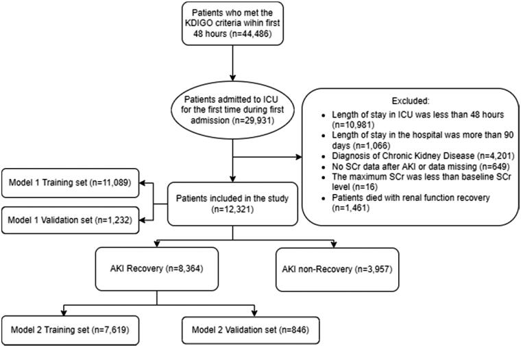
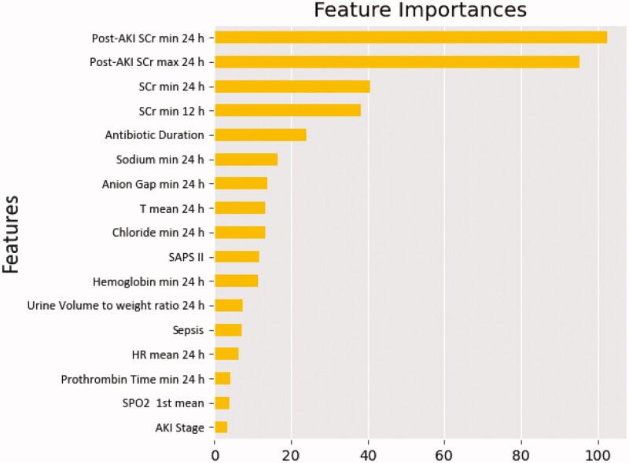
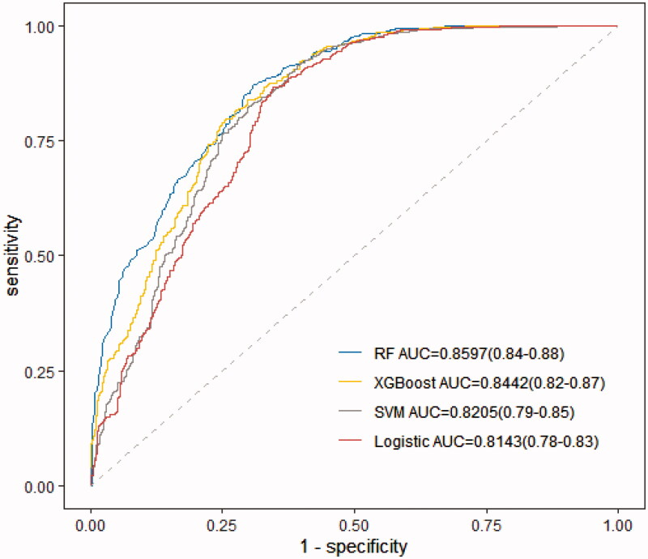
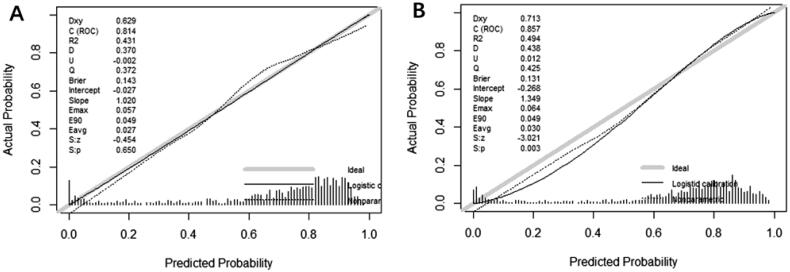
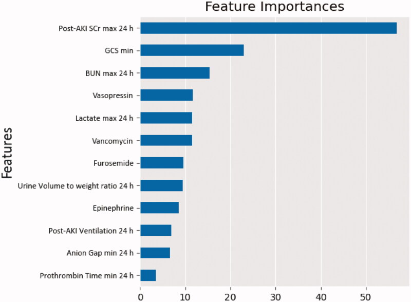

# Predicting renal function recovery and short-term reversibility among acute kidney injury patients in the ICU: comparison of machine learning methods and conventional regression
预测 ICU 急性肾损伤患者肾功能恢复和短期可逆性：机器学习方法与常规回归的比较

aDepartment of Intensive Care Medicine, Trauma Center, Peking University People’s Hospital, Beijing, PR China
一个北京大学人民医院创伤中心重症监护科，北京
bDepartment of Yunnan Baiyao Group Medicine Electronic Commerce Co., Ltd, Beijing, PR China
乙云南白药集团医药电子商务有限公司，北京，中国
*These authors contributed equally to this work.
* 这些作者对这项工作做出了同等的贡献。
✉CONTACT Fengxue Zhu Fengxue_Zhu@126.com Department of Intensive Care Medicine, Trauma Center, Peking University People’s Hospital, No.11 Xizhimen South Street, Beijing, 100044, PR China
✉ 联系方式 朱凤雪 Fengxue_Zhu@126.com 北京大学人民医院创伤中心重症监护医学科，北京市西直门南街 11 号，100044
PMCID: PMC9359199  PMID: 35930309

## Abstract  抽象
### Background  背景
Acute kidney injury (AKI) is one of the most frequent complications of critical illness. We aimed to explore the predictors of renal function recovery and the short-term reversibility after AKI by comparing logistic regression with four machine learning models.

急性肾损伤 （AKI） 是危重疾病最常见的并发症之一。我们旨在通过比较 logistic 回归与 4 种机器学习模型来探讨肾功能恢复的预测因素和 AKI 后短期可逆性。

### Methods  方法
We reviewed patients who were diagnosed with AKI in the MIMIC-IV database between 2008 and 2019. Recovery from AKI within 72 h of the initiating event was typically recognized as the short-term reversal of AKI. Conventional logistic regression and four different machine algorithms (XGBoost algorithm model, Bayesian networks [BNs], random forest [RF] model, and support vector machine [SVM] model) were used to develop and validate prediction models. The performance measures were compared through the area under the receiver operating characteristic curve (AU-ROC), calibration curves, and 10-fold cross-validation.

我们回顾了 2008 年至 2019 年间在 MIMIC-IV 数据库中被诊断为 AKI 的患者。在起始事件发生后 72 小时内从 AKI 中恢复通常被认为是 AKI 的短期逆转。采用常规逻辑回归和 4 种不同的机器算法（XGBoost 算法模型、贝叶斯网络[BNs]、随机森林[RF]模型和支持向量机[SVM]模型）开发和验证预测模型。通过受试者工作特征曲线下面积 （AU-ROC）、校准曲线和 10 倍交叉验证来比较性能测量。

### Results  结果
A total of 12,321 critically ill adult AKI patients were included in our analysis cohort. The renal function recovery rate after AKI was 67.9%. The maximum and minimum serum creatinine (SCr) within 24 h of AKI diagnosis, the minimum SCr within 24 and 12 h, and antibiotics usage duration were independently associated with renal function recovery after AKI. Among the 8364 recovered patients, the maximum SCr within 24 h of AKI diagnosis, the minimum Glasgow Coma Scale (GCS) score, the maximum blood urea nitrogen (BUN) within 24 h, vasopressin and vancomycin usage, and the maximum lactate within 24 h were the top six predictors for short-term reversibility of AKI. The RF model presented the best performance for predicting both renal functional recovery (AU-ROC [0.8295 ± 0.01]) and early recovery (AU-ROC [0.7683 ± 0.03]) compared with the conventional logistic regression model.

我们的分析队列中共有 12,321 名危重成年 AKI 患者。AKI 后肾功能恢复率为 67.9%。AKI 诊断后 24 h 内最大和最小血清肌酐（SCr）、24 h 和 12 h 内最低 SCr 以及抗生素使用时间与 AKI 后肾功能恢复独立相关。在 8364 例康复患者中，AKI 诊断后 24 h 内最大 SCr、最低格拉斯哥昏迷量表（GCS）评分、24 h 内最大血尿素氮（BUN）、加压素和万古霉素使用量、24 h 内最酸是 AKI 短期可逆性的前 6 大预测因素。与传统的 logistic 回归模型相比，RF 模型在预测肾功能恢复（AU-ROC[0.8295 ± 0.01]）和早期恢复（AU-ROC[0.7683 ± 0.03]）方面表现出最佳性能。

### Conclusions  结论
The maximum SCr within 24 h of AKI diagnosis was a common independent predictor of renal function recovery and the short-term reversibility of AKI. The RF machine learning algorithms showed a superior ability to predict the prognosis of AKI patients in the ICU compared with the traditional regression models. These models may prove to be clinically helpful and can assist clinicians in providing timely interventions, potentially leading to improved prognoses.

AKI 诊断后 24 h 内的最大 SCr 是肾功能恢复和 AKI 短期可逆性的常见独立预测因子。与传统的回归模型相比，射频机器学习算法在预测 ICU 中 AKI 患者的预后方面表现出更优越的能力。这些模型可能被证明具有临床帮助，可以帮助临床医生提供及时的干预措施，从而有可能改善预后。

#### Keywords: 
Acute kidney injury, renal function recovery, renal function recovery time, machine learning

关键字： 急性肾损伤、肾功能恢复、肾功能恢复时间、机器学习

## Introduction  介绍
Acute kidney injury (AKI) is one of the most common diseases with an incidence of 10–15% in inpatients [1]; in contrast, its morbidity can be as high as 50–60% in critically ill populations [2]. Despite advances in healthcare, the development of AKI is still independently associated with increased health care costs, the length of hospital stay, in-hospital morbidity, and mortality [3–5]. Unsurprisingly, the time for renal function recovery notably reflects the outcomes. A 2016 study of nearly 17,000 patients demonstrated that the persistence of AKI versus a prompt recovery is associated with higher morbidity and mortality [6]. Therefore, the severity of AKI and its timely treatment make AKI a consummate candidate for the use of predictive analytics.

急性肾损伤（acute kidney injury， AKI）是最常见的疾病之一，住院患者的发病率为 10-15%[ 1 ];相比之下，其在危重人群中的发病率可高达 50-60% [ 2 ]。尽管医疗保健取得了进步，但 AKI 的发展仍与医疗费用增加、住院时间、院内并发症发生率和死亡率增加独立相关[ 3–5 ]。不出所料，肾功能恢复的时间显着反映了结果。2016 年一项纳入近 17,000 例患者的研究表明，AKI 的持续存在与迅速康复的并发症发生率和死亡率较高[ 6 ]。因此，AKI 的严重程度及其及时治疗使 AKI 成为使用预测分析的完美候选者。

Some scholars have pointed out that age, comorbidities, baseline renal function, and proteinuria have been shown to predict the probability of AKI recovery [7,8]. In addition, Srisawat et al. constructed a prediction model, which found that the APACHE-II score and Charlson comorbidity index were vital predictors [9]. However, their study only included a small group of patients (n = 76), which may reduce the accuracy of real-time implementation. Overall, the current research showed the present limitations in predicting whether the individual patient with AKI will recover and the recovery time.

一些学者指出，年龄、合并症、基线肾功能和蛋白尿已被证明可以预测 AKI 恢复的概率 [ 7 ， 8 ]。此外，Srisawat 等 人构建了一个预测模型，发现 APACHE-II 评分和 Charlson 合并症指数是重要的预测因子[ 9 ]。然而，他们的研究仅包括一小部分患者（n = 76），这可能会降低实时实施的准确性。总体而言，目前的研究表明，目前在预测个体 AKI 患者是否会康复以及恢复时间方面存在局限性。

Currently, to the best of our knowledge, there are only a few clinical studies that have included a significant number of patients and compared machine learning models to conventional regression models to predict renal function recovery and short-term reversibility after an episode of AKI. Therefore, it is hypothesized that our prognostic model will be accurate enough to recognize renal function recovery earlier among these vulnerable populations, so as to improve the prognosis of these patients by allowing for the increased opportunity to assist patients in the recovery from AKI and allowing for the prevention of further renal insults in the setting of an evolving injury, which may eventually lead to chronic kidney disease (CKD).

目前，据我们所知，只有少数临床研究纳入了大量患者，并将机器学习模型与传统回归模型进行比较，以预测 AKI 发作后的肾功能恢复和短期可逆性。因此，假设我们的预后模型将足够准确，可以更早地识别这些弱势群体的肾功能恢复，从而通过增加帮助患者从 AKI 中恢复的机会来改善这些患者的预后，并允许在不断发展的损伤的情况下预防进一步的肾损伤， 最终可能导致慢性肾脏病 （CKD）。

## Materials and methods  材料和方法
### Sources of data  数据来源
This retrospective study was conducted by collecting data from an extensive critical care database named the Multiparameter Intelligent Monitoring in Intensive Care Database IV (MIMIC IV), which included all laboratory, medical test results, the pharmaceutical, and diagnostic codes for more than 40,000 ICU patients treated at Beth Israel Deaconess Medical Center (Boston, MA) from 2008 to 2019 [10]. To apply for access to the database, we completed the National Institutes of Health’s web-based course and successfully passed the Protecting Human Research Participants exam (No. 9936285). This study was approved by the institutional review board of Peking University People’s Hospital (Beijing Municipal Science, 7222199) and followed the Transparent Reporting of a Multivariable Prediction Model for Individual Prognosis and Diagnosis (TRIPOD) reporting guidelines.

这项回顾性研究是通过从名为重症监护数据库 IV （MIMIC IV） 的广泛重症监护数据库中收集数据进行的，该数据库包括 2008 年至 2019 年在贝斯以色列女执事医疗中心（马萨诸塞州波士顿）接受治疗的 40,000 多名 ICU 患者的所有实验室、医学测试结果、药物和诊断代码 [ 10 ].为了申请访问该数据库，我们完成了美国国立卫生研究院的网络课程，并成功通过了保护人类研究参与者考试（第 9936285 号）。本研究经北京大学人民医院（北京市科学，7222199）机构评审委员会批准，遵循个体预后和诊断多变量预测模型透明报告（TRIPOD）报告指南。

### Selecting an AKI cohort
选择 AKI 队列

According to the Kidney Disease Improving Global Outcomes (KDIGO) clinical practice guidelines, we initially screened all adult patients who met the criteria for AKI within 48 h after ICU admission [11]. For exclusion criteria, patients who were discharged or died within 48 h after ICU admission and those who stayed in the ICU for more than 90 d were excluded. In addition, we excluded the cohort of participants who died with renal function recovery. The additional exclusion criteria included a history of receiving long-term renal replacement treatment (RRT), a diagnosis of advanced CKD, no data regarding the creatinine values after the AKI diagnosis, and when the patient’s maximum serum creatinine (SCr) was smaller than the baseline SCr.

根据肾脏疾病改善全球结局（Kidney Disease Improving Global Outcomes， KDIGO）临床实践指南，我们最初筛选了入住 ICU 后 48 小时内所有符合 AKI 标准的成年患者[ 11 ]。对于排除标准，排除入住 ICU 后 48 h 内出院或死亡的患者以及在 ICU 停留超过 90 d 的患者。此外，我们排除了因肾功能恢复而死亡的受试者队列。其他排除标准包括接受长期肾脏替代治疗 （RRT） 的病史、晚期 CKD 的诊断、AKI 诊断后没有有关肌酐值的数据以及患者的最大血清肌酐 （SCr） 小于基线 SCr。

### Data collection and definition
数据收集和定义

Data were abstracted from MIMIC IV using the Structured Query Language (SQL) with Navicat Premium (version 12.0.28). We obtained the demographic and clinical data within the first 24 h after ICU admission and the diagnosis of AKI. The comorbidities and diagnoses were identified based on the ICD-9 codes. The scoring systems included the Glasgow Coma Scale (GCS) score, Simplified Acute Physiology Score II (SAPS II), and Sequential Organ Failure Assessment (SOFA) score. The patient’s vital signs, including systolic blood pressure (SBP), heart rate (HR), peripheral oxygen saturation (SPO2), and temperature (T), were extracted. Furthermore, the patient’s laboratory data, including hemoglobin, leucocytes, basophils, monocytes, platelet count, lactate, albumin, anion gap, blood urea nitrogen (BUN), chloride, base excess, prothrombin time, and bicarbonate, were also recorded. In addition, the variables associated with AKI diagnosis were also abstracted, such as the urine volume and urine volume to weight ratio. Data regarding any therapy, such as vasopressors, antibiotics, furosemide, nephrotoxic drugs, mechanical ventilation, and RRT were also collected. Because of the high sampling frequency, we used the minimum, maximum, and mean values when extracting the vital signs and laboratory data.

使用结构化查询语言 （SQL） 和 Navicat Premium（版本 12.0.28）从 MIMIC IV 中提取数据。我们在入住 ICU 和诊断 AKI 后的前 24 小时内获得了人口统计学和临床数据。根据 ICD-9 代码确定合并症和诊断。评分系统包括格拉斯哥昏迷量表 （GCS） 评分、简化急性生理学评分 II （SAPS II） 和序贯器官衰竭评估 （SOFA） 评分。提取患者的生命体征，包括收缩压（SBP）、心率（HR）、外周血氧饱和度（SPO2）和体温（T）。此外，还记录了患者的实验室数据，包括血红蛋白、白细胞、嗜碱性粒细胞、单核细胞、血小板计数、乳酸、白蛋白、阴离子间隙、血尿素氮 （BUN）、氯化物、碱过量、凝血酶原时间和碳酸氢盐。此外，还抽象了与 AKI 诊断相关的变量，例如尿量和尿量重量比。还收集了有关任何疗法的数据，例如血管加压药、抗生素、呋塞米、肾毒性药物、机械通气和 RRT。由于采样频率高，我们在提取生命体征和实验室数据时使用了最小值、最大值和平均值。

In this study, we recognized that patients with renal function recovery no longer fulfilled the criteria for stage 1 AKI, but that their SCr levels might not have yet returned to baseline (defined as the return to <30% above the baseline) before being discharged from the ICU [12,13]. An alternative definition of non-recovery was the presence of meeting the AKI criteria or dying during the ICU stay. In addition, the AKI start time was the first time that the patient met the KDIGO criteria. The AKI recovery time was measured as the AKI recovery time minus the start time. We defined renal function recovery from AKI within 72 h of the initiating event typically recognized as the short-term reversal of AKI.

在这项研究中，我们认识到肾功能恢复的患者不再满足 1 期 AKI 的标准，但他们的 SCr 水平可能尚未恢复到基线（定义为恢复到基线以上的 <30%）从 ICU 出院前[ 12 ， 13 ]。未康复的另一种定义是符合 AKI 标准或在 ICU 住院期间死亡。此外，AKI 开始时间是患者首次符合 KDIGO 标准。AKI 恢复时间测量为 AKI 恢复时间减去开始时间。我们定义了在起始事件后 72 小时内从 AKI 中恢复肾功能，通常被认为是 AKI 的短期逆转。

### Statistical analysis  统计分析
The patients were divided into two groups based on whether they achieved renal function recovery, and the variables were displayed and compared between the groups. The demographics and other characteristics were summarized using means and standard deviations, medians, interquartile ranges, or frequency counts and percentages. The chi-squared test was used to compare the categorical variables, and the Mann–Whitney U test was used to compare the discrete distributions. The continuous variables were tested by the independent t-test. All of the data were analyzed using Python version 3.8 and R 4.0.5 (The R Foundation for Statistical Computing, Vienna, Austria) statistical software, with the statistical significance set at a p value <.05.

根据患者是否实现肾功能恢复将患者分为两组，并展示组间变量并进行比较。使用均值和标准差、中位数、四分位距或频率计数和百分比对人口统计和其他特征进行总结。采用卡方检验比较分类变量，采用 Mann-Whitney U 检验比较离散分布。连续变量采用独立 t 检验。所有数据均采用 Python 3.8 版和 R 4.0.5（The R Foundation for Statistical Computing， Vienna， Austria）统计软件进行分析，统计显著性设置为 p 值<.05。

### Development and validation prediction model
开发和验证预测模型

We randomly separated the model development data into two parts: we used 90% of the data for the model derivation and 10% of the data for the internal validation. We developed a conventional logistic regression, XGBoost algorithm model, Bayesian networks (BNs), random forest model (RF), and support vector machine model (SVM) based on the training dataset, and verified these models in the validation dataset to identify the optimal predictors.

我们将模型开发数据随机分为两部分：我们使用 90% 的数据进行模型推导，使用 10% 的数据进行内部验证。基于训练数据集，我们开发了常规的逻辑回归、XGBoost 算法模型、贝叶斯网络（BNs）、随机森林模型（RF）和支持向量机模型（SVM），并在验证数据集中验证了这些模型，以确定最优预测变量。

In the conventional method, each risk factor was used in the univariate analysis, and then a multivariate analysis was conducted to build the best fit logistic regression model. XGBoost is based on the sparsity-aware algorithm and is a weighted quantile sketch, in which the weak learners can be converged sequentially into the ensemble to achieve a strong learner [14]. The BN is a graphical representation, where each node corresponds to the random variables, and each edge represents the corresponding random variables' conditional probability [15]. RF is a learning method that unifies the results of multiple decision trees that are constructed based on the bootstrap sampling of the training dataset and randomly selects properties in each tree as a subset of the entire set of predictors [16]. SVM is an optimal classification algorithm in high-dimensional space to distinguish between different categories of samples, with the ability to transform training data into a high-dimensional feature space and make a linear optimal solution by separating a hyperplane that engages the smallest distance between the hyperplane points and the largest margin between the classes [17].

在常规方法中，将每个风险因素用于单因素分析，然后进行多因素分析，以建立最佳拟合的 logistic 回归模型。XGBoost 基于稀疏感知算法，是一个加权分位数草图，其中弱学习器可以按顺序收敛到集成中，以实现强学习器 [ 14 ]。BN 是一种图形表示，其中每个节点对应随机变量，每条边代表相应随机变量的条件概率 [ 15 ]。RF 是一种学习方法，它统一了基于训练数据集的引导采样构建的多个决策树的结果，并随机选择每棵树中的属性作为整个预测变量集的子集[ 16 ]。SVM 是一种在高维空间中区分不同类别样本的最优分类算法，能够将训练数据转换为高维特征空间，并通过分离超平面点之间最小距离和类之间最大边距的超平面来做出线性最优解[ 17 ]。

### Evaluating the performance of the models
评估模型的性能

To assess the model quality, we chose the area under the receiver operating characteristic curve (AU-ROC) as the measurement to compare the performances of the logistic regression and the machine learning algorithm models. In addition, we employed 10-fold cross-validation, which provides a more stable and reliable way to measure the performances of models. To further assess the models’ performances, a plot of the percentage of observations above a probability threshold versus the percentage of observations was constructed; then, an evaluation of the secondary metrics of the clinical prediction models, including the accuracy, sensitivity, specificity, precision, and recall, was performed [18].

为了评估模型质量，我们选择受试者工作特征曲线下面积（AU-ROC）作为测量，比较了逻辑回归和机器学习算法模型的性能。此外，我们还采用了 10 倍交叉验证，这提供了一种更稳定、更可靠的方法来衡量模型的性能。为了进一步评估模型的性能，构建了高于概率阈值的观测值百分比与观测值百分比的图;然后，对临床预测模型的次要指标进行评估，包括准确性、敏感性、特异性、精确度和召回率 [ 18 ]。

## Results  结果
### The demographics, clinical characteristics, and AKI metric measurements
人口统计学、临床特征和 AKI 指标测量
In total, 44,486 patients met the KDIGO criteria within the first 48 h after ICU admission. After excluding the patients according to the exclusion criteria, the final analysis cohort consisted of 29,931 eligible patients (Figure 1). In the analytic cohort, the average age of the patients was 66.7 years old; male patients accounted for 56.0% (n = 6901) of the cohort; white patients accounted for 67.9% (n = 8366) of the cohort, and the minimum GCS score was 13. Of these, the cohort was divided into two groups: the AKI recovery group (n = 8364, 67.9%) and the AKI non-recovery group (n = 3957, 32.1%). Of the recruited patients, 9460 patients were in stage 1 (6534 AKI recovery versus 2926 AKI non-recovery), 2634 were in stage 2 (1716 AKI recovery versus 918 AKI non-recovery), and 227 were in stage 3 (114 AKI recovery versus 113 AKI non-recovery). The baseline demographics, clinical characteristics, interventions, and outcomes are outlined in Table 1.
总共有 44,486 名患者在入住 ICU 后的前 48 小时内符合 KDIGO 标准。根据排除标准排除患者后，最终分析队列由 29,931 名符合条件的患者组成 （ Figure 1 ）。在分析队列中，患者的平均年龄为 66.7 岁;男性患者占队列的 56.0% （n = 6901）;白人患者占队列的 67.9% （n = 8366），最低 GCS 评分为 13。其中，队列分为两组：AKI 恢复组（n = 8364,67.9%）和 AKI 非康复组（n = 3957,32.1%）。在招募的患者中，9460 名患者处于第 1 阶段（6534 名 AKI 康复对 2926 名 AKI 未康复），2634 名患者处于第 2 期（1716 名 AKI 康复对 918 名 AKI 未康复），227 名患者处于第 3 期（114 名 AKI 康复对 113 名 AKI 未康复）。基线人口统计学、临床特征、干预措施和结果概述在 Table 1 中。

> Figure 1.  图 1.

> Flowchart depicting the number of critically ill patients included in the analysis after applying the exclusion criteria.
> 流程图描述了应用排除标准后纳入分析的危重患者数量。

> Table 1.  表 1.
> Distribution of the baseline characteristics between the AKI recovery and non-recovery groups.
> AKI 恢复组和非恢复组之间基线特征的分布。

> AKI: acute kidney disease; BUN: blood urea nitrogen; HR: heart rate; MAP: mean arterial pressure; RRT: renal replacement therapy; SAPS II: Simplified Acute Physiology Score II; SBP: systolic pressure; SCr: serum creatinine; SOFA Score: Sepsis-Related Organ Failure Assessment Score; SPO2: peripheral oxygen saturation; T: temperature.
> AKI：急性肾病;BUN：血尿素氮;HR：心率;MAP：平均动脉压;RRT：肾脏替代疗法;SAPS II：简化急性生理学评分 II;收缩压：收缩压;SCr：血清肌酐;SOFA 评分：脓毒症相关器官衰竭评估评分;SPO2：外周血氧饱和度;T：温度。

### The features selected and model comparison in renal function recovery
肾功能恢复的选择特征和模型比较

The results of the logistic regression analysis were outlined in Table 2. As expected, patients who had higher SAPS II (OR = 1.00, 95% CI 0.99–1.00), lower mean HR within 24 h (OR = 0.99, 95% CI 0.99–1.00), higher mean temperature within 24 h (OR = 0.12, 95% CI 0.10–0.15), lower SCr within 24 h of AKI diagnosis (OR = 0.54, 95% CI 0.50–0.59), higher hemoglobin within 24 h (OR = 1.07, 95% CI 1.04–1.09), lower anion gap within 24 h (OR = 0.97, 95% CI 0.95–0.98), shorter prothrombin time within 24 h (OR = 0.99, 95% CI 0.99–1.00), higher sodium level within 24 h (OR = 1.02, 95% CI 1.01–1.03), prolonged antibiotic duration (OR = 1.07, 95% CI 1.05–1.09), and lower AKI stage (OR = 0.72, 95% CI 0.65–0.80) demonstrated increased odds of failing to recover from AKI.

逻辑回归分析的结果概述在 Table 2 中。正如预期的那样，患者在 AKI 诊断后 24 小时内 SAPS II 较高（OR = 1.00,95%CI 0.99-1.00），24 小时内平均 HR 较低（OR = 0.99,95% CI 0.99-1.00），24h 内平均体温较高（OR = 0.12,95% CI 0.10-0.15），AKI 诊断后 24 小时内 SCr 较低（OR = 0.54,95% CI 0.50-0.59），24 小时内血红蛋白较高（OR = 1.07， 95% CI 1.04–1.09）、24 小时内阴离子间隙降低（OR = 0.97,95% CI 0.95–0.98）、24 小时内凝血酶原时间缩短（OR = 0.99,95% CI 0.99–1.00）、24 小时内钠水平升高（OR = 1.02,95% CI 1.01–1.03）、抗生素持续时间延长（OR = 1.07,95% CI 1.05–1.09）和较低的 AKI 分期（OR = 0.72,95% CI 0.65–0.80）表明无法从 AKI 中恢复的几率增加。

> Table 2.  表 2.
> The univariate and multivariate logistic regression analyses for renal function recovery.
> 肾功能恢复的单因素和多因素 logistic 回归分析。

> AKI: acute kidney disease; BUN: blood urea nitrogen; HR: heart rate; MAP: mean arterial pressure; RRT: renal replacement therapy; SAPS II: Simplified Acute Physiology Score II; SBP: systolic pressure; SCr: serum creatinine; SOFA Score: Sepsis-Related Organ Failure Assessment Score; SPO2: peripheral oxygen saturation; T: temperature.
A> KI：急性肾病;BUN：血尿素氮;HR：心率;MAP：平均动脉压;RRT：肾脏替代疗法;SAPS II：简化急性生理学评分 II;收缩压：收缩压;SCr：血清肌酐;SOFA 评分：脓毒症相关器官衰竭评估评分;SPO2 外周血氧饱和度;T：温度。

By comparing the performance of four different machine learning models, RF presented the best prediction value. According to the analysis results of each feature’s contribution by the RF model, the maximum and minimum SCr within 24 h from the diagnosis of AKI, the minimum Scr within 24 h, the minimum Scr within 12 h, and antibiotic duration were the top five essential predictors for predicting renal function recovery (Figure 2).

通过比较四种不同机器学习模型的性能，RF 呈现出最佳的预测值。根据 RF 模型对各特征贡献的分析结果，诊断 AKI 后 24 h 内的最大和最小 SCr、24 h 内的最小 Scr、12 h 内的最小 Scr 和抗生素持续时间是预测肾功能恢复的前 5 个重要预测因素 Figure 2 （ ）。

> Figure 2.  图 2.

> Importance of the matrix plot of the AKI predictors in the random forest model among critically ill patients. AKI: acute kidney disease; HR: heart rate; SAPS II: Simplified Acute Physiology Score II; SCr: serum creatinine; SpO2: peripheral oxygen saturation; T: temperature.
> AKI 预测因子矩阵图在危重患者随机森林模型中的重要性。AKI：急性肾病;HR：心率;SAPS II：简化急性生理学评分 II;SCr：血清肌酐;SpO2：外周血氧饱和度;T：温度。

A total of 846 (10%) patients were included in the model validation phase. The discrimination was appraised using an AU-ROC (Figure 3) and calibration curves (Figure 4) during the model development and validation phases. The RF model showed significantly better discrimination than the traditional logistic regression model, with a higher and more narrowed 95% confidence interval (AU-ROC, 0.8597; 95% CI 0.84–0.88 versus 0.8143; 95% CI 0.78–0.83) (Figure 3). Table 3 describes the model performance measures for the five models in identifying AKI recovery and non-recovery status. When considering the sensitivity and precision to predict an independent testing set, the RF model performed with a more balanced result than logistic regression.

共有 846 名 （10%） 患者被纳入模型验证阶段。在模型开发和验证阶段，使用 AU-ROC （ Figure 3 ） 和校准曲线 （ Figure 4 ） 评估了区分力。RF 模型显示出明显优于传统 logistic 回归模型的辨别力，95%置信区间更高、更窄（AU-ROC，0.8597;95%CI 0.84–0.88 vs 0.8143;95%CI 0.78–0.83）（ Figure 3 ）。 Table 3 描述了五种模型在识别 AKI 恢复和非恢复状态方面的模型性能度量。在考虑预测独立测试集的灵敏度和精度时，RF 模型的结果比逻辑回归更平衡。

> Figure 3.  图 3.

> Receiver operating characteristic curve for estimating the discrimination of the logistic regression model, XGBoost model, random forest model (RF), and support vector machine model (SVM).
> 用于估计逻辑回归模型、XGBoost 模型、随机森林模型 （RF） 和支持向量机模型 （SVM） 判别的接收者工作特征曲线。

> Figure 4.  图 4.

> Calibration curve of the renal function recovery prediction models (A) logistic regression and (B) random forest in the training set.
> 训练集中肾功能恢复预测模型（A）logistic 回归和（B）随机森林的校准曲线。

> Table 3.  表 3.
> The 10-fold cross-validation model performance in the development cohort for renal function recovery.
> 肾功能恢复开发队列中的 10 倍交叉验证模型性能。

### The model establishment and comparison of the short-term reversibility of AKI
AKI 短期可逆性的模型建立与对比

The 8364 recovered patients were randomly split into a training and validation cohort consisting of 7619 (90%) and 846 (10%) recovered patients. Logistic regression revealed that the minimum GCS, urine volume to weight ratio within 24 h, the maximum SCr within 24 h of AKI diagnosis, the maximum BUN within 24 h, the maximum lactate within 24 h, the minimum anion gap, antibiotic duration, vancomycin, vasopressin, phenylephrine, furosemide, and ventilation within 24 h of AKI diagnosis were significantly associated with renal function recovery (Table 4).

8364 名康复患者被随机分为一个训练和验证队列，其中包括 7619 名 （90%） 和 846 名 （10%） 康复患者。Logistic 回归分析显示，AKI 诊断后 24 h 内最小 GCS、尿量重量比、24 h 内最大 SCr、24 h 内最大 BUN、24 h 内最大乳酸、最小阴离子间隙、抗生素持续时间、万古霉素、加压素、去氧肾上腺素、呋塞米、AKI 诊断后 24 h 内通气与肾功能恢复显著相关 Table 4 （ ）。

> Table 4.  表 4.
> Univariate and multivariate logistic regression analyses for short-term reversibility of renal function.
> 肾功能短期可逆性的单因素和多因素 logistic 回归分析。

> AKI: acute kidney disease; BUN: blood urea nitrogen; HR: heart rate; MAP: mean arterial pressure; RRT: renal replacement therapy; SAPS II: Simplified Acute Physiology score II; SBP: systolic pressure; SCr: serum creatinine; SOFA score: Sepsis-Related Organ Failure Assessment Score; SPO2: peripheral oxygen saturation; T: temperature.
> AKI：急性肾病;BUN：血尿素氮;HR：心率;MAP：平均动脉压;RRT：肾脏替代疗法;SAPS II：简化急性生理学评分 II;收缩压：收缩压;SCr：血清肌酐;SOFA 评分：脓毒症相关器官衰竭评估评分;SPO2：外周血氧饱和度;T：温度。

We also built four machine learning models, which showed that the RF model illustrated the highest predictive performance. The maximum SCr within 24 h of AKI diagnosis, the minimum GCS, the maximum BUN within 24 h, vasopressin, the maximum lactate within 24 h, and vancomycin demonstrated notable associations with short-term renal function recovery (Figure 5). Nevertheless, for the best predictive outcomes among machine algorithms, RF was slightly better than traditional logistic regression (AU-ROC, 0.7683 ± 0.03 versus 0.7669 ± 0.03). Table 5 compares the models’ performances using 10-fold cross-validation.

我们还构建了四个机器学习模型，这表明射频模型具有最高的预测性能。AKI 诊断后 24 小时内的最大 SCr、最小 GCS、24 小时内的最大 BUN、加压素、24 小时内的最酸和万古霉素与短期肾功能恢复有显着关联 （ Figure 5 ）。然而，对于机器算法中的最佳预测结果，RF 略优于传统的逻辑回归（AU-ROC，0.7683 ± 0.03 vs 0.7669 ± 0.03）。 Table 5 使用 10 倍交叉验证比较模型的性能。

> Figure 5.  图 5.

> Variable importance plot for the short-term reversibility in the random forest model. GCS: Glasgow Coma Scale; SCr: serum creatinine.
> 随机森林模型中短期可逆性的变量重要性图。GCS：格拉斯哥昏迷量表;SCr：血清肌酐。

> Table 5.  表 5.
> The 10-fold cross-validation model performance in the development cohort for the short-term reversibility of renal function recovery.
> 肾功能恢复短期可逆性开发队列中 10 倍交叉验证模型性能。

## Discussion  讨论
The early identification of high-risk AKI populations may assist in adapting treatment in a way to avoid further renal function deterioration. Additionally, the detection of those who lack short-term reversibility may allow the determination of the optimal timing of the RRT treatment strategy for this later. By comparing conventional logistic regression with four different machine learning algorithms, we developed and tested applicable models for ICU AKI patients to help in assessing the probability of renal function recovery and predicting the short-term reversibility of AKI.
早期识别高危 AKI 人群可能有助于调整治疗，避免肾功能进一步恶化。此外，检测那些缺乏短期可逆性的患者可能允许确定以后对此进行 RRT 治疗策略的最佳时机。通过将传统的逻辑回归与四种不同的机器学习算法进行比较，我们开发并测试了适用于 ICU AKI 患者的模型，以帮助评估肾功能恢复的概率并预测 AKI 的短期可逆性。

Only a few studies have predicted the prognosis of AKI with effective predictions to support the decision-making. Several clinical tools, including prediction models [19,20], urinary indices [21,22], novel biomarkers [23,24], and imaging techniques [25], have been evaluated in previous studies to predict renal recovery, namely, the progression to severe AKI.
只有少数研究预测了 AKI 的预后，并做出了有效的预测来支持决策。在之前的研究中，已经评估了几种临床工具，包括预测模型 [ 19 ， 20 ]、尿液指数 [ 21 ， 22 ]、新型生物标志物 [ 23 ， 24 ] 和成像技术 [ 25 ]，以预测肾脏恢复，即进展为严重 AKI。

In our model, the SCr within 24 h of AKI diagnosis might provide a significant indication for the possibility of both renal function recovery and short-term reversibility. Consistently with our findings, a recent study that enrolled 8320 critical patients with AKI pointed out the ability of the SCr for predicting persistent AKI, with the AUC of 0.74 (95% CI 0.71–0.77) [19].
在我们的模型中，AKI 诊断后 24 小时内的 SCr 可能为肾功能恢复和短期可逆性的可能性提供重要指示。与我们的研究结果一致的是，最近一项纳入 8320 例危重 AKI 患者的研究指出，SCr 能够预测持续性 AKI，AUC 为 0.74（95%CI 0.71-0.77）[ 19 ]。

The GCS score has been widely adopted as an instrument for assessing clinical severity and predicting outcomes after brain injury [26]. Moore and coworkers presented an incidence of AKI in 9% of traumatic brain injury patients with GCS scores less than 13 [27], while Zacharia et al. revealed an incidence of AKI in 23% of patients with aneurysmal subarachnoid hemorrhage [28]. In our research, those with higher GCS scores were more likely to present renal function recovery within 72 h. Therefore, it may need to highlight the indispensability of early recognition of renal risk and prompt clinicians to practice renal treatment for patients with low GCS scores. And a recent study reported that some medications can simultaneously protect the brain and kidney by inhibiting the inflammatory processes caused by brain trauma, to mitigate the incidence of AKI in neurotrauma [29].
GCS 评分已被广泛采用为评估脑损伤后临床严重程度和预测结局的工具[ 26 ]。Moore 及其同事显示，9%的创伤性脑损伤患者发生 AKI 且 GCS 评分低于 13[ 27 ]，而 Zacharia 等 人显示，23%的动脉瘤性蛛网膜下腔出血患者发生 AKI [ 28 ]。在我们的研究中，GCS 评分较高的患者更有可能在 72 小时内出现肾功能恢复。因此，可能需要强调早期识别肾脏风险的不可或缺性，并促使临床医生对低 GCS 评分患者进行肾脏治疗。最近的一项研究报告说，一些药物可以通过抑制脑外伤引起的炎症过程来同时保护大脑和肾脏，以减轻神经创伤中 AKI 的发生率 [ 29 ]。

Unsurprisingly, vancomycin showed an independent association with renal function injury [30]. It has been reported that the mechanism of vancomycin-associated AKI is the development of acute interstitial nephritis [31,32]. Our research also revealed that patients treated with vancomycin notably demonstrated poor short-term reversibility of AKI.
不出所料，万古霉素与肾功能损伤有独立关联[ 30 ]。据报道，万古霉素相关 AKI 的机制是急性间质性肾炎的发展[ 31 ， 32 ]。我们的研究还表明，接受万古霉素治疗的患者明显表现出 AKI 的短期可逆性较差。

Positive fluid balance increased the risk for adverse outcomes and increased mortality from the vasopressin versus norepinephrine treatment in patients with septic shock [33], and conservative versus liberal fluid management strategies in acute lung injury remedies [34]. However, patients with renal function impairment were more prone to positive fluid accumulation, resulting from deterioration of kidney adjustment of water balance [35]. Bouchard et al. reported that fluid overload was associated with non-recovery of renal function in critically ill patients with AKI [36]. Similarly, in our short-term recovery model, vasopressin demonstrated harm in renal function reversibility.
在脓毒性休克患者中，正体液平衡增加了加压素治疗与去甲肾上腺素治疗的不良结局和死亡率增加[ 33 ]，在急性肺损伤治疗中，保守与自由的液体管理策略增加了不良结局的风险[ 34 ]。然而，肾功能损害患者更容易出现阳性积液，这是由于肾脏水平衡调整恶化所致[ 35 ]。Bouchard 等 报道称，AKI 危重患者体液超负荷与肾功能不恢复有关[ 36 ]。同样，在我们的短期恢复模型中，加压素对肾功能可逆性有危害。

Rising lactate levels revealed the insufficient perfusion, oxygen supply, and metabolism of tissues [37]. A previous study by Yan et al. pointed out that patients with poor baseline renal function have higher levels of lactate. This was consistent with our result that lactate was an indicator of kidney function, especially in predicting early AKI recovery [38].
乳酸水平升高表明组织灌注、供氧和代谢不足[ 37 ]。Yan 等 人之前的一项研究指出，基线肾功能较差的患者乳酸水平较高。这与我们的结果一致，即乳酸是肾功能的指标，特别是在预测 AKI 早期恢复方面[ 38 ]。

In this study, the machine learning algorithm achieved better predictive outcomes than the conventional logistic regression, especially in predicting renal function recovery. Our study demonstrated that the SCr examination within 24 h of AKI diagnosis might provide a significant indication for the possibility of renal function recovery and recovery time. Interestingly, the GCS score not only assists clinicians in evaluating neurocognitive impairment in ICU patients but also in predicting renal function impairment duration. Furthermore, the usage of vancomycin and vasopressin were strong predictors of the short-term irreversibility of renal function.
在这项研究中，机器学习算法比传统的逻辑回归取得了更好的预测结果，特别是在预测肾功能恢复方面。我们的研究表明，AKI 诊断后 24 小时内的 SCr 检查可能为肾功能恢复的可能性和恢复时间提供重要指示。有趣的是，GCS 评分不仅可以帮助临床医生评估 ICU 患者的神经认知障碍，还可以预测肾功能损害的持续时间。此外，万古霉素和加压素的使用是肾功能短期不可逆性的有力预测因子。

Although this study explored the predicted model for renal function recovery with beneficial performance, it is acknowledged that there were several limitations in this study. For this large national cohort, we only validated the models with an internal dataset. In addition, novel biomarkers, which were potential predictors of renal function recovery but not routinely detected in clinical settings, were not included in our prediction models. Therefore, a multicenter prospective study should be established in the future to prove the predictive effect of the factors found in our study.
尽管本研究探索了具有有益表现的肾功能恢复的预测模型，但承认本研究存在一些局限性。对于这个大型全国队列，我们仅使用内部数据集验证了模型。此外，新的生物标志物是肾功能恢复的潜在预测因子，但在临床环境中未常规检测到，并未包含在我们的预测模型中。因此，未来应建立一项多中心前瞻性研究，以证明我们研究中发现的因素的预测作用。

Conclusion  结论
In this large-cohort retrospective study, by comparing a conventional regression model with four machine learning algorithms, we developed two RF models to predict renal function recovery and short-term reversibility with high practicability and interpretability. The maximum SCr within 24 h of AKI diagnosis, the minimum GCS, vasopressin, and vancomycin were revealed to be notably associated with short-term reversibility of renal function. Consequently, predicting the recovery time of AKI may assist in assessing the likelihood of a patient needing RRT and, ultimately, could assist in determining the suitable timing for the initiation of RRT.
在这项大队列回顾性研究中，通过将常规回归模型与四种机器学习算法进行比较，我们开发了两个射频模型来预测肾功能恢复和短期可逆性，具有很高的实用性和可解释性。AKI 诊断后 24 小时内的最大 SCr、最小 GCS、加压素和万古霉素被揭示为与肾功能的短期可逆性显着相关。因此，预测 AKI 的恢复时间可能有助于评估患者需要 RRT 的可能性，并最终有助于确定启动 RRT 的合适时间。

## Acknowledgments  确认
The authors thank all the participants for their contributions.
作者感谢所有参与者的贡献。

## Funding Statement  资助声明
This study was supported by the Beijing Natural Science Foundation [7222199] and Transverse Research Project [2022-Z-42].
本研究得到了北京市自然科学基金[7222199]和横向研究项目[2022-Z-42]的支持。

## Ethics approval and consent to participate
道德批准和参与同意
This research was approved by Peking University People’s Hospital's institutional review board.
本研究获得北京大学人民医院机构评审委员会批准。

## Consent for publication  同意发布
Written informed consents were signed by all the patients.
所有患者均签署了书面知情同意书。

## Author contributions  作者贡献
Yunwei Lu and Xiujuan Zhao drafted the initial manuscript with oversight by Fengxue Zhu and all other authors critically reviewed and revised the manuscript. Wenfei Xie and Chong Zhang collected all data and completed figure making. Shu Li, Fuzheng Guo, Haiyan Xue, Lilei Jiang, and Zhenzhou Wang assisted with the interpretation of the results. All authors reviewed and approved the final manuscript.
卢云伟和赵秀娟在朱凤雪的监督下起草了最初的手稿，所有其他作者都对手稿进行了批判性的审查和修改。谢文飞和张冲收集了所有数据，完成了人物制作。舒莉、郭富正、薛海燕、江丽磊、王振州协助对结果进行解读。所有作者都审阅并批准了最终稿件。

## Disclosure statement  披露声明
No potential conflict of interest was reported by the author(s).
提交人没有报告潜在的利益冲突。

## Data availability statement
数据可用性声明
The clinical data used to support the findings of this study were supplied by the MIMIC-III database. After completing the National Institutes of Health’s web-based course known as Protecting Human Research, participants can apply for permission to access the database.
用于支持本研究结果的临床数据由 MIMIC-III 数据库提供。完成美国国立卫生研究院的名为“保护人类研究”的网络课程后，参与者可以申请访问该数据库的许可。

