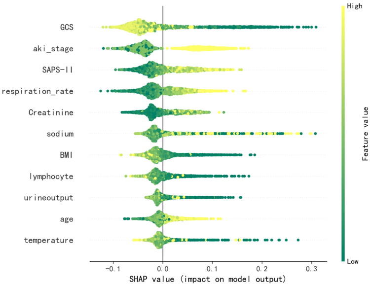

# Machine learning-based prediction of in-hospital mortality for critically ill patients with sepsis-associated acute kidney injury
基于机器学习的脓毒症相关急性肾损伤危重患者院内死亡率预测

aDepartment of Nephrology, The First Affiliated Hospital of Guangxi Medical University, Nanning City, PR China
一个广西医科大学附属第一医院肾内科，广西医科大学南宁市
bDepartment of Critical Care Medicine, The First Affiliated Hospital of Guangxi Medical University, Nanning City, PR China
乙广西医科大学附属第一医院重症监护医学科，南宁市
*These authors contributed equally to this work.
* 这些作者对这项工作做出了同等的贡献。
Supplemental data for this article can be accessed online at https://doi.org/10.1080/0886022X.2024.2316267.
本文的补充数据可以在以下网址在线 https://doi.org/10.1080/0886022X.2024.2316267 访问。

✉CONTACT Ling Pan panling@gxmu.edu.cn Department of Nephrology, The First Affiliated Hospital of Guangxi Medical University, No.6, Shuangyong Road, Qingxiu District, Nanning City, Guangxi Province, PR China.
✉ 联系方式 潘玲 panling@gxmu.edu.cn 广西医科大学第一附属医院肾内科，广西省南宁市清秀区双勇路 6 号。
PMCID: PMC10878338  PMID: 38369749

## Abstract  抽象
### Objectives  目标
This study aims to develop and validate a prediction model in-hospital mortality in critically ill patients with sepsis-associated acute kidney injury (SA-AKI) based on machine learning algorithms.
本研究旨在开发和验证基于机器学习算法的脓毒症相关急性肾损伤（SA-AKI）危重患者院内死亡率预测模型。

### Methods  方法
Patients who met the criteria for inclusion were identified in the Medical Information Mart for Intensive Care-IV (MIMIC-IV) database and divided according to the validation (n = 2440) and development (n = 9756, 80%) queues. Ensemble stepwise feature selection method was used to screen for effective features. The prediction models of short-term mortality were developed by seven machine learning algorithms. Ten-fold cross-validation was used to verify the performance of the algorithm in the development queue. The area under the receiver operating characteristic curve (ROC-AUC) was used to evaluate the differentiation accuracy and performance of the prediction model in the validation queue. The best-performing model was interpreted by Shapley additive explanations (SHAP).
符合纳入标准的患者在重症监护医疗信息市场 IV （MIMIC-IV） 数据库中确定，并根据验证 （n = 2440） 和发展 （n = 9756， 80%） 队列进行划分。采用集成逐步特征选择方法筛选有效特征。通过 7 种机器学习算法开发短期死亡率预测模型。采用十重交叉验证验证算法在开发队列中的性能。采用受试者工作特征曲线下面积（ROC-AUC）评估预测模型在验证队列中的差异化精度和性能。性能最佳的模型通过 Shapley 加法解释 （SHAP） 进行解释。

Results  结果
A total of 12,196 patients were enrolled in this study. Eleven variables were finally chosen to develop the prediction model. The AUC of the random forest (RF) model was the highest value both in the Ten-fold cross-validation and evaluation (AUC: 0.798, 95% CI: 0.774–0.821). According to the SHAP plots, old age, low Glasgow Coma Scale (GCS) score, high AKI stage, reduced urine output, high Simplified Acute Physiology Score (SAPS II), high respiratory rate, low temperature, low absolute lymphocyte count, high creatinine level, dysnatremia, and low body mass index (BMI) increased the risk of poor prognosis.
本研究共招募了 12,196 名患者。最终选择了 11 个变量来开发预测模型。随机森林（RF）模型的 AUC 在十倍交叉验证和评估中均最高（AUC：0.798,95%CI：0.774–0.821）。根据 SHAP 图，高龄、格拉斯哥昏迷量表（GCS）评分低、AKI 分期高、尿量减少、简化急性生理学评分（SAPS II）高、呼吸频率高、体温低、淋巴细胞绝对计数低、肌酐水平高、血异常和低体重指数（BMI）增加了预后不良的风险。

### Conclusions  结论
The RF model developed in this study is a good predictor of in-hospital mortality for patients with SA-AKI in the intensive care unit (ICU), which may have potential applications in mortality prediction.
本研究开发的射频模型是重症监护病房 （ICU） 中 SA-AKI 患者院内死亡率的良好预测指标，可能在死亡率预测中具有潜在的应用。

### Keywords: 
Sepsis, acute kidney injury, prediction model of prognosis, machine learning algorithms
关键字： 脓毒症、急性肾损伤、预后预测模型、机器学习算法

## Introduction  介绍
Sepsis-associated acute kidney injury (SA-AKI) is a common and serious complication in critically ill patients. A European multicenter study showed that 51% of patients with sepsis and the intensive care unit (ICU) were complicated with AKI, and the death rate of SA-AKI patients was 41% [1]. Septic AKI patients in the ICU were more likely to have a greater burden of illness, higher mortality, and requirements for dialysis than patients with nonseptic AKI [2,3]. Early identification of high-risk individuals and effective intervention are helpful for improving prognosis and survival in patients with SA-AKI [4,5]. The pathogenesis of SA-AKI is complicated and not completely clear, and it is difficult to find a single sensitive biomarker [6]. A prediction model that involves multiple related risk factors may be a better choice to solve this problem.
脓毒症相关急性肾损伤（SA-AKI）是危重患者常见且严重的并发症。欧洲一项多中心研究显示，51%的脓毒症患者和 ICU 患者合并 AKI，SA-AKI 患者的死亡率为 41%[ 1 ]。与非脓毒性 AKI 患者相比，ICU 中的脓毒症 AKI 患者更有可能有更大的疾病负担、更高的死亡率和透析需求[ 2 ， 3 ]。早期识别高危人群并有效干预有助于改善 SA-AKI 患者的预后和生存[ 4 ， 5 ]。SA-AKI 的发病机制复杂且尚不完全明确，很难找到单一的敏感生物标志物[ 6 ]。涉及多个相关风险因素的预测模型可能是解决此问题的更好选择。

Some previous studies have developed prediction models of mortality or poor prognosis for patients with SA-AKI based on the Medical Information Mart for Intensive Care (MIMIC)-III dataset or the ICU data of their hospital. These studies are generally based on general severity scores, combined with population data, comorbidities and infection indicators, renal function, and other relevant indicators, and have shown some effectiveness in predicting the prognosis of SA-AKI [6–8].. The MIMIC-IV database is the latest MIMIC database, compared to MIMIC-II and MIMIC-III, and contains information regarding a patient’s entire hospital stay. MIMIC-IV contains clinical data from more than 60,000 patients who were hospitalized in the ICU at Beth Israel Deaconess Medical Center between 2008 and 2019. Few studies have focused on SA-AKI data from MIMIC-IV until now.
之前的一些研究已经根据重症监护医疗信息集市 （MIMIC）-III 数据集或其医院的 ICU 数据开发了 SA-AKI 患者死亡率或预后不良的预测模型。这些研究一般基于一般严重程度评分，结合人群数据、合并症和感染指标、肾功能等相关指标，在预测 SA-AKI 的预后方面显示出一定的有效性[ 6–8 ]。与 MIMIC-II 和 MIMIC-III 相比，MIMIC-IV 数据库是最新的 MIMIC 数据库，包含有关患者整个住院时间的信息。MIMIC-IV 包含 2008 年至 2019 年间在贝斯以色列女执事医疗中心 ICU 住院的 60,000 多名患者的临床数据。到目前为止，很少有研究关注 MIMIC-IV 的 SA-AKI 数据。

But selecting appropriate and significant predictors of the prediction model is a major challenge for all kinds of indices. The majority of prior studies concentrated on full factorial models, lacked efficient feature screening methods, and models incorporated more factors. In big medical data, machine learning methods can handle multicollinearity of independent variables with more convenience, be used to increase the prediction discrimination, accuracy, and stability of prognosis prediction models compared with traditional regression analysis [9,10]. Model construction techniques of machine learning methods, which include random forest (RF), extreme gradient boosting (XGBoost) and other methods, have been widely used in the medical field [11,12]. Integrating feature ranking and screening predictors step by step and obtaining a subset of valid features were also helpful for improving the discrimination and accuracy of a prediction model [13]. The new variable screening methods in combination with multiple machine learning techniques may further increase modeling effectiveness. The large amount of detailed and continuously updated clinical data, combined with data-driven machine learning techniques, enables the efficient processing of complex fitting relationships in big data and the development of new mortality prediction tools.
但是，选择适当且重要的预测模型预测变量是各种指标面临的主要挑战。以往的大多数研究都集中在全因子模型上，缺乏有效的特征筛选方法，模型纳入了更多的因素。在大医疗数据中，机器学习方法可以更方便地处理自变量的多重共线性，与传统的回归分析相比，用于提高预后预测模型的预测辨别力、准确性和稳定性[ 9 ， 10 ]。机器学习方法的模型构建技术，包括随机森林（RF）、极端梯度提升（XGBoost）等方法，已在医学领域得到广泛应用[ 11 ， 12 ]。逐步整合特征排名和筛选预测变量并获得有效特征的子集也有助于提高预测模型的辨别力和准确性[ 13 ]。新的变量筛选方法与多种机器学习技术相结合，可能会进一步提高建模效果。大量详细且不断更新的临床数据，结合数据驱动的机器学习技术，能够高效处理大数据中复杂的拟合关系，并开发新的死亡率预测工具。

Using MIMIC-IV data, this study aims to identify risk factors and develop a prediction model of in-hospital mortality among patients with SA-AKI in the ICU using multiple machine learning algorithms. It is beneficial for predicting short-term mortality in high-risk patients with SA-AKI in the ICU.
本研究利用 MIMIC-IV 数据，旨在识别风险因素，并使用多种机器学习算法开发 ICU 中 SA-AKI 患者院内死亡率的预测模型。它有利于预测 ICU 中 SA-AKI 高危患者的短期死亡率。

## Materials and methods  材料和方法
### Data source  数据源
The information was obtained from the sizable, publicly available MIMIC-IV (version 1.0) critical care database, which includes vital signs, medications, laboratory test results, comorbid diagnoses, imaging reports, survival data, and other health-related data on patients admitted to the ICU at Beth Israel Deaconess Medical Center from 2008 to 2019 [14]. We were given access to the database through the protection of human research participants assessment (Certificate No. 42064390). This database may be used by any researcher who complies with the data user requirements, according to approval from the Institutional Review Boards of Massachusetts Institute of Technology. Data extraction was carried out using Structured Query Language (SQL). The primary outcome of the prediction model was in-hospital mortality. The development queues and the validation queues were split with an 8:2 ratio of the study population.
该信息来自大量公开的 MIMIC-IV（1.0 版）重症监护数据库，其中包括 2008 年至 2019 年入住贝斯以色列女执事医疗中心 ICU 的患者的生命体征、药物、实验室检查结果、合并症诊断、影像学报告、生存数据和其他健康相关数据 [ 14 ].我们通过保护人类研究参与者评估（证书编号 42064390）获得了数据库的访问权限。经麻省理工学院机构审查委员会批准，任何符合数据用户要求的研究人员都可以使用该数据库。使用结构化查询语言 （SQL） 进行数据提取。预测模型的主要结果是院内死亡率。开发队列和验证队列以 8：2 的研究人群比例划分。

### Study population  研究人群
If the following criteria were met, patient records were extracted from the MIMIC IV database for this study: (1) age ≥ 18 years, (2) met the Kidney Disease: Improving Global Outcomes (KDIGO) diagnostic criteria for AKI, and (3) met the 3rd edition of internationally accepted diagnostic criteria for the definition of sepsis (Sepsis-3). The following exclusion criteria were used: (1) patients with chronic kidney disease (CKD) stage 5 (eGFR < 15 or those who received long-term renal replacement therapy), (2) follow-up time less than 48 h (for patients with repeated hospitalizations, only information from the first hospitalization was included). The follow-up period solely covered the current hospitalization, ending with the current discharge (Supplemental Figure 1).
如果满足以下标准，则从本研究的 MIMIC IV 数据库中提取患者记录：（1） 年龄≥ 18 岁，（2） 符合肾脏疾病：改善全球结果 （KDIGO） 的 AKI 诊断标准，以及 （3） 符合国际公认的败血症定义诊断标准第 3 版 （Sepsis-3）。采用以下排除标准：（1）慢性肾脏病（CKD）5 期患者（eGFR < 15 或接受长期肾脏替代治疗的患者），（2）随访时间少于 48 h（对于反复住院的患者，仅包括首次住院的信息）。随访期仅涵盖当前住院，以当前出院结束 （ Supplemental Figure 1 ）。

### Definitions  定义
The diagnosis of sepsis was in accordance with Sepsis-3.0, with specific criteria of sequential organ failure assessment (SOFA) score ≥2 and infection or suspected infection [15]. The diagnosis and staging of AKI was in accordance with the 2012 KDIGO guidelines: an increase in serum creatinine (SCr) level of 0.3 mg/dL within 48 h or an increase to 1.5 times the baseline Scr level within the past 7 d [16].
脓毒症的诊断符合脓毒症-3.0，具体标准为序贯器官衰竭评估（sofa）评分≥2 分，感染或疑似感染[ 15 ]。AKI 的诊断和分期符合 2012 年 KDIGO 指南：48 h 内血清肌酐（SCr）水平升高 0.3 mg/dL，或在过去 7 d 内升高至基线 Scr 水平的 1.5 倍[ 16 ]。

### Data extraction  数据提取
Patient information was extracted in MIMIC-IV database using PostgreSQL 13 software. Within 24 h of the patient’s admission, basic data, vital signs, laboratory test indicators, condition score scales, and survival data were gathered. To obtain diagnostic data, comorbidities were identified using the International Classification of Diseases diagnosis codes. Variables with more than 25% missing data were excluded to lessen the bias brought on by missing data. Consequently, the number of prepared features is 51. When the percentage of missing values was less than 25%, the miceforest package of Python software was used to fill in the missing values of the variables using multiple imputation [17].
使用 PostgreSQL 13 软件在 MIMIC-IV 数据库中提取患者信息。患者入院后 24 h 内，收集基本数据、生命体征、实验室检查指标、病情评分量表和生存数据。为了获得诊断数据，使用国际疾病分类诊断代码确定合并症。缺失数据超过 25% 的变量被排除在外，以减少缺失数据带来的偏差。因此，准备好的特征数量为 51。当缺失值百分比小于 25%时，使用 Python 软件的 miceforest 包，采用多重插补[ 17 ]来填充变量的缺失值。

### Ensemble stepwise feature ranking and selection
集成逐步特征排名和选择
We extracted demographic information, routine vital signs, laboratory values, scores, comorbidities, and medications as features from patients’ admission information and charted data which is clinically readily available. As a result of having additional indirectly connected hyperparameters, individual predictors are prone to overfitting by producing an excessive number of features. To facilitate clinical applications and reduce the influence of noise and irrelevant variables, we used ensemble stepwise feature ranking and selection to perform a stepwise integration method for feature ranking and selection, selecting some valid features from the whole feature set to form a model feature set.
我们从患者的入院信息中提取人口统计学信息、常规生命体征、实验室值、评分、合并症和药物作为特征，并绘制了临床上容易获得的数据。由于具有额外的间接连接超参数，单个预测变量容易因产生过多的特征而过度拟合。为了便于临床应用，减少噪声和不相关变量的影响，采用集成逐步特征排序和选择，对特征进行逐步积分，从整个特征集中选择一些有效的特征，形成模型特征集。

RFs are frequently employed for feature screening prior to modeling. We first ranked the importance of features using RF, which calculates the importance of variables by calculating the average information gain (Gini index)[18]. Begin to suppose we have M predictors. We then compute the ensemble output using bagging. The complete dataset was divided into M subsets, with one fold serving as a validation set and the others as training sets. As a result, the training/validation set and the development set are split into M halves. On the basis of them, we can then construct M feature ranker. Using cross-validation, we will divide the full development set into segments and then create a subset from those segments. To rank features, we will resort to feature significance. Then the ensemble feature ranking can be obtained.
RF 经常用于建模前的特征筛选。我们首先使用 RF 对特征的重要性进行排名，RF 通过计算平均信息增益（基尼指数）来计算变量的重要性[ 18 ]。开始假设我们有 M 个预测变量。然后，我们使用装袋计算集成输出。完整的数据集被划分为 M 个子集，其中一个折叠作为验证集，其他折叠作为训练集。因此，训练/验证集和开发集被分成 M 部分。在此基础上，我们可以构建 M 特征排名器。使用交叉验证，我们将整个开发集划分为多个段，然后从这些段创建一个子集。为了对功能进行排名，我们将求助于功能重要性。然后可以得到集合特征排名。

To create final features set, we first choose the best features for each iteration based on the feature ranker. We make iterative addition of one new feature to the already selected feature set, and in the feature selection process that involved assembling M predictors based on split. We then analyze the mortality predictor on the validation set after training it. To speed up the computation, the logistic regression (LR) classifier was chosen as the predictor. In the end, we use 10-fold cross-validation to calculate the average performance of predictors with top features. We compute the average performance of predictors using receiver operating characteristic (ROC) curves, and the area under the ROC curves (ROC-AUC) as the measurements. Finally, output the number of features who has the best performance.
为了创建最终特征集，我们首先根据特征排名器为每个迭代选择最佳特征。我们在已经选择的特征集中迭代添加一个新特征，并在涉及基于拆分组装 M 个预测变量的特征选择过程中。然后，我们在训练验证集后分析死亡率预测因子。为了加快计算速度，选择逻辑回归（LR）分类器作为预测变量。最后，我们使用 10 倍交叉验证来计算具有顶级特征的预测变量的平均性能。我们使用受试者工作特征 （ROC） 曲线和 ROC 曲线下面积 （ROC-AUC） 作为测量值来计算预测变量的平均性能。最后，输出性能最好的特征数。

### Model development and evaluation
模型开发和评估
The development queues was used to confirm the algorithm performance by ten-fold cross-validation, the average of ROC-AUC in ten-fold cross-validation was calculated, and the ROC curve was plotted. The test set was used to confirm the discrimination and calibration of the model, whereas the development queues was used to build the model and select features. The features were filtered based on the stepwise integration of feature selection and feature ranking. The data were normalized and fed into seven machine learning algorithms: K-nearest neighbors (KNN) [19], extreme gradient boosting [20], naive Bayesian (NB) [21], decision tree [22], support vector machine (SVM, linear/rbf) [23], RF [24], and LR [25]. The ROC-AUC values, accuracy, precision, and F1 score (2* ((precision*recall)/(precision + recall))) were compared to evaluate the best prediction models and perform internal validation [26].. The Delong test was used for AUC comparison.
利用开发队列通过十倍交叉验证确认算法性能，计算十倍交叉验证中 ROC-AUC 的平均值，并绘制 ROC 曲线。测试集用于确认模型的判别和校准，而开发队列用于构建模型和选择特征。根据特征选择和特征排名的逐步集成对特征进行过滤。数据被归一化并输入到七种机器学习算法中：K 最近邻（KNN）[ 19 ]、极端梯度提升[ 20 ]、朴素贝叶斯（NB）[ 21 ]、决策树[ 22 ]、支持向量机（SVM、线性/rbf）[ 23 ]、RF [ 24 ]和 LR [ 25 ]。比较 ROC-AUC 值、准确度、精确度和 F1 评分（2*（（精确率*召回率）/（精确率+召回率））以评估最佳预测模型并进行内部验证[ 26 ]。采用 Delong 检验进行 AUC 比较。

### Hyperparameter:  超参数：

> KNN: KNeighborsClassifier(n_neighbors = 3);
> KNN：KNeighborsClassifier（n_neighbors = 3）;

> NB: GaussianNB(priors = None);
> 注意：高斯 NB（先验 = 无）;

> DecisionTree:DecisionTreeClassifier (*,criterion="gini", splitter="best", max_depth = None, min_samples_split = 2,min_samples_leaf = 1,min_weight_fraction_leaf = 0.0,max_features = None, random_state = None, max_leaf_nodes =None, min_impurity_decrease = 0.0, class_weight = None, ccp_alpha = 0.0);
> DecisionTree：DecisionTreeClassifier （*，criterion=“gini”， splitter=“best”， max_depth = None， min_samples_split = 2，min_samples_leaf = 1，min_weight_fraction_leaf = 0.0，max_features = None， random_state = None， max_leaf_nodes =None， min_impurity_decrease = 0.0， class_weight = None， ccp_alpha = 0.0）;

> SVM, linear/rbf: svm.SVC(kernel=’linear’, probability = True)/svm.SVC(kernel=’rbf’, probability = True);
> SVM，线性/rbf：svm。SVC（kernel='linear'， 概率 = True）/svm。SVC（kernel='rbf'，概率 = True）;

> Random Forest: RandomForestClassifier(n_estimators = 100,random_state = 0);
> 随机森林：RandomForestClassifier（n_estimators = 100，random_state = 0）;

> Logistic Regression: LogisticRegression(penalty="l2", *, dual = False, tol = 1e-4, C = 1.0, fit_intercept = True, intercept_scaling = 1, class_weight = None, random_state = None, solver="lbfgs", max_iter = 100, multi_class="auto", verbose = 0, warm_start = False, n_jobs = None, l1_ratio =None);
> 逻辑回归：LogisticRegression（penalty=“l2”， *， dual = False， tol = 1e-4， C = 1.0， fit_intercept = True， intercept_scaling = 1， class_weight = None， random_state = None， solver=“lbfgs”， max_iter = 100， multi_class=“auto”， verbose = 0， warm_start = False， n_jobs = None， l1_ratio =None）;

### Statistical analysis  统计分析
Statistical analysis, modeling, and validation were implemented using Python version 3.8 software and module packages [27]. For normally distributed variables, the continuous variables were expressed as the mean ± standard deviation, and nonnormally distributed variables were expressed as the median (interquartile range). Categorical variables were displayed as percentages. In univariate analyses, categorical variables were compared using Pearson’s chi-squared or Fisher’s exact tests, and continuous variables were compared using Student’s t tests or the Kruskal–Wallis test as appropriate. p Values <0.05 were considered statistically significant. The area under the ROC curve (AUC), accuracy, precision and F1 score were used in the internal validation to compare the performance of the models constructed by the seven machine learning algorithms, and the model with the best performance was used as the final prediction model. Shapley additive explanations (SHAP) were used to explain the results of the best prediction model [28]. When the SHAP value of the variable in the sample is > 0, the variable has a positive effect on the prediction of the outcome at this time. The SHAP summary plot and SHAP dependence plot of the final prediction model were plotted to determine how each variable affected the prognosis of SA-AKI patients during hospitalization and how the positive and negative effects of the variables on outcome prediction varied with their values. The SHAP force plot for patients was plotted to demonstrate how the model personalizes the prediction of each patient’s condition and guides clinical decision-making.
使用 Python 3.8 版软件和模块包 [ 27 ] 实现统计分析、建模和验证。对于正态分布变量，连续变量表示为均值±标准差，非正态分布变量表示为中位数（四分位距）。分类变量显示为百分比。在单变量分析中，使用皮尔逊卡方检验或费舍尔精确检验比较分类变量，并酌情使用学生 t 检验或 Kruskal-Wallis 检验比较连续变量。p 值 <0.05 被认为具有统计学意义。在内部验证中，采用 ROC 曲线下面积（AUC）、准确率、精度和 F1 分数，比较了 7 种机器学习算法构建的模型的性能，并以性能最佳的模型作为最终的预测模型。Shapley 加性解释（SHAP）用于解释最佳预测模型的结果[ 28 ]。当样本中变量的 SHAP 值为> 0 时，该变量此时对结果的预测具有正向影响。绘制最终预测模型的 SHAP 汇总图和 SHAP 依赖图，以确定每个变量如何影响 SA-AKI 患者住院期间的预后，以及变量对结局预测的正负影响如何随其值而变化。绘制了患者的 SHAP 力图，以展示该模型如何个性化地预测每个患者的病情并指导临床决策。

## Results  结果
### Patient characteristics  患者特征
A total of 12,196 patients were included in the study. The mean age of these patients was 67.0 ± 16.1 years, of whom 6995 (57.4%) were men, with a male to female ratio of 5.7:4.3 and a mean length of stay of 15 d. The in-hospital mortality rate was 19.3% (2352/12,196). The baseline demographic and clinical characteristics of SA-AKI patients who died or survived during hospitalization are shown in Table 1. In the admission score, the Simplified Acute Physiology Score (SAPS II) and SOFA score were higher and the Glasgow Coma Scale (GCS) score was lower in the nonsurviving group than in the surviving group. The length of ICU stay was longer in the nonsurvivor group, but the length of hospitalization was shorter.
共有 12,196 名患者参与了该研究。患者平均年龄为 67.0 岁±16.1 岁，其中男性 6995 例（57.4%），男女比例为 5.7：4.3，平均住院时间为 15 d。院内死亡率为 19.3%（2352/12,196）。住院期间死亡或存活的 SA-AKI 患者的基线人口统计学和临床特征显示在 Table 1. 入院评分中，非幸存组的简化急性生理学评分（SAPS II）和 SOFA 评分较高，格拉斯哥昏迷量表（GCS）评分低于幸存组。非幸存者组 ICU 住院时间较长，住院时间较短。

> Table 1.  表 1.
> Characteristics of the patients with sepsis associated AKI (SA-AKI).
> 脓毒症相关 AKI （SA-AKI） 患者的特征。

> *Baseline creatinine was defined as the lowest creatinine 48 h before admission.
> *基线肌酐定义为入院前 48 小时肌酐最低。

> BMI: body mass index; AKI: acute kidney injury; ARDS: Acute Respiratory Distress Syndrome; SAPS II: Simplified Acute Physiology Score; SOFA: Sequential Organ Failure Assessment; GCS: Glasgow Coma Scale; ACEI/ARB, angiotensin- converting enzyme inhibitor/angiotensin receptor antagonist; PaO2: partial pressure of oxygen; PaCO2: partial pressure of carbon dioxide; PT: prothrombin time; INR: international normalized ratio; APTT: activated partial thromboplastin time
> BMI：体重指数;AKI：急性肾损伤;ARDS：急性呼吸窘迫综合征;SAPS II：简化急性生理学评分;SOFA：序贯器官衰竭评估;GCS：格拉斯哥昏迷量表;ACEI/ARB，血管紧张素转换酶抑制剂/血管紧张素受体拮抗剂;PaO2：氧分压;PaCO2：二氧化碳分压;PT：凝血酶原时间;INR：国际标准化比率;APTT：活化部分凝血活酶时间

### Feature selection  功能选择
Ensemble stepwise feature ranking and selection showed that 11 variables could achieve the best prediction performance (Supplemental Figure 2), and the top 11 variables ranked by feature importance were used as predictors for the prediction model. Ultimately, 11 potential predictors were selected from the original 51 factors. According to the features rank (Supplemental Figure 3), these 11 variables included the GCS score, age, temperature, blood sodium level, absolute lymphocyte count, respiratory rate, SAPS II score, urine output, creatinine level, AKI stage, and body mass index (BMI).
集成逐步特征排序和选择表明，11 个变量能够达到最佳预测性能（ Supplemental Figure 2 ），并使用按特征重要性排名的前 11 个变量作为预测模型的预测变量。最终，从最初的 51 个因素中选择了 11 个潜在预测因素。根据特征等级 （ Supplemental Figure 3 ），这 11 个变量包括 GCS 评分、年龄、体温、血钠水平、绝对淋巴细胞计数、呼吸频率、SAPS II 评分、尿量、肌酐水平、AKI 分期和体重指数 （BMI）。

Model building and evaluation
模型构建和评估
The 11 selected features were used to establish machine learning prediction models. In the development queues, the RF algorithm has the highest average AUC value for ten-fold cross-validation (0.82, standard deviation: 0.02), with similar ROC-AUC values calculated for each fold (Supplemental Table 1, Supplemental Figure 4). In the test set, the highest AUC value (0.798) was obtained using the RF model, and the lowest AUC value (0.635) was obtained using the decision tree (Figure 1). Table 2 and Figure 2 show that the RF model has great calibration and better differentiation. Compared with Existing severity scores, APACHE II achieves a 0.625 (se = 0.006) C-index score, SOFA achieves a 0.551 (se = 0.007) C-index score.
利用选定的 11 个特征建立机器学习预测模型。在开发队列中，RF 算法在十倍交叉验证中具有最高的平均 AUC 值（0.82，标准差：0.02），每个倍数计算的 ROC-AUC 值相似（ Supplemental Table 1 ， Supplemental Figure 4 ）。在测试集中，使用 RF 模型获得最高 AUC 值（0.798），使用决策树（ ）获得最低 AUC 值（0.635 Figure 1 ）。 Table 2 并 Figure 2 表明射频模型具有很好的校准性和更好的差异化。与现有严重性评分相比，APACHE II 达到 0.625 （se = 0.006） C 指数评分，SOFA 达到 0.551 （se = 0.007） C 指数评分。

> Figure 1.  图 1.

> The comparison of ROC curves of the mortality prediction models of seven machine learning algorithms for patients with SA-AKI.
> SA-AKI 患者 7 种机器学习算法死亡率预测模型 ROC 曲线对比。

> Table 2.  表 2.
> The comparison of performance among the prediction models resulted from seven machine learning algorithms that predict the risk of mortality in patients with SA-AKI.
> 预测模型之间的性能比较来自七种机器学习算法，这些算法预测了 SA-AKI 患者的死亡风险。

> *F1 scores= 2* ((precision*recall)/(precision + recall)).
> *F1 分数 = 2* （（精度*召回率）/（精度 + 召回率））。

> Figure 2.  图 2.

> Calibration curve of the RF model for prediction of short-term mortality in patients with SA-AKI.
> 用于预测 SA-AKI 患者短期死亡率的 RF 模型的校准曲线。

### Explanation of risk factors
危险因素说明
The variables, in descending order of SHAP value, contributing to in-hospital mortality risk prediction from most to least important, were GCS score, AKI stage, SAPS II score, respiratory rate, creatinine level, blood sodium level, BMI, absolute lymphocyte count, urine output, age, and temperature (Supplemental Figure 5). Both the SHAP dependence plot (Supplemental Figure 6) and the SHAP summary plot (Figure 3) showed how each baseline variable affected the prognosis of SA-AKI. Each patient’s feature is represented by a single dot that is colored in accordance with an attribution value, with yellow denoting a greater value and Green denoting a lower value, as seen in the SHAP summary figure. Baseline variables with higher SHAP values Increased the probability of dying during hospitalization was higher. Each dot on the SHAP dependence plot represented a patient, showing how the attributed importance of a baseline variable varied as its value increased or decreased. A higher risk of dying during hospitalization was represented by SHAP values greater than zero. According to the SHAP summary plot and SHAP dependence plot, older patients with low GCS score, high AKI stage, reduced urine output, high SAPS II Score, high respiratory rate, low temperature, low absolute lymphocyte count, high creatinine level, dysnatremia, and low BMI were at increased risk of adverse prognostic events during hospitalization.
对院内死亡风险预测有贡献的变量（按 SHAP 值降序排列）从大到低依次是 GCS 评分、AKI 分期、SAPS II 评分、呼吸频率、肌酐水平、血钠水平、BMI、绝对淋巴细胞计数、尿量、年龄和体温 （ Supplemental Figure 5 ）。SHAP 依赖性图 （ Supplemental Figure 6 ） 和 SHAP 汇总图 （ Figure 3 ） 都显示了每个基线变量如何影响 SA-AKI 的预后。每个患者的特征都由一个点表示，该点根据归因值着色，黄色表示较大的值，绿色表示较低的值，如 SHAP 汇总图所示。SHAP 值越高的基线变量住院期间死亡的概率就越高。SHAP 依赖性图上的每个点代表一个患者，显示基线变量的归因重要性如何随着其值的增加或减少而变化。SHAP 值大于零表示住院期间死亡的风险较高。根据 SHAP 汇总图和 SHAP 依赖图，GCS 评分低、AKI 分期高、尿量减少、SAPS II 评分高、呼吸频率高、体温低、绝对淋巴细胞计数低、肌酐水平高、血异常、BMI 低的老年患者住院期间不良预后事件的风险增加。

> Figure 3.  图 3.

> SHAP summary plot of the 11 clinical features of the RF model for prediction of short-term mortality in patients with SA-AKI. GCS: Glasgow Coma Scale score; aki_stage: AKI stage; SAPS-II: Simplified Acute Physiology Score; lymphocyte, absolute lymphocyte count; BMI: body mass index.
> 用于预测 SA-AKI 患者短期死亡率的 RF 模型的 11 个临床特征的 SHAP 汇总图。GCS：格拉斯哥昏迷量表评分;aki_stage：AKI 阶段;SAPS-II：简化急性生理学评分;淋巴细胞，淋巴细胞绝对计数;BMI：体重指数。

The SHAP force plot (Supplemental Figure 7) shows profiles of patients who are at high or low risk of developing an outcome during hospitalization in the dataset and demonstrate how a predictive model might aid in the planning of personalized care.
SHAP 力图 （ Supplemental Figure 7 ） 显示了数据集中住院期间出现结果的高风险或低风险患者的概况，并展示了预测模型如何帮助规划个性化护理。

The SHAP force plot visualizes the profiles of patients for outcomes during hospitalization and exemplifies how predictive models can contribute to the planning of personalized care (Supplemental Figure 7). The red section indicates the variables that are at high risk, and giving more attention to these variables may improve the short-term prognosis for that patient.
SHAP 力图可视化了患者在住院期间的结果概况，并举例说明了预测模型如何有助于个性化护理的规划 （ Supplemental Figure 7 ）。红色部分表示高风险变量，更多地关注这些变量可能会改善该患者的短期预后。

## Discussion  讨论
In this study, we analyzed and effectively screened risk factors associated with mortality during hospitalization in patients with SA-AKI. We used 11 early available clinical parameters to develop and validate a prognostic prediction model for these patients using an RF algorithm, which had better discrimination and calibration and outperformed several machine learning algorithms, such as XGBoost, support vector machine, and traditional LR models. To facilitate the interpretation of the decision-making process of the RF algorithm, we used SHAP to explain the predictions, a SHAP dependence plot to show the relationship between features and their impact on the model measurements, and SHAP force plot to demonstrate how the model specifically personalizes the prediction of the patient’s risk of death.
在这项研究中，我们分析并有效筛选了与 SA-AKI 患者住院期间死亡率相关的危险因素。我们使用 11 个早期可用的临床参数，使用射频算法为这些患者开发和验证预后预测模型，该模型具有更好的判别和校准，并且优于几种机器学习算法，如 XGBoost、支持向量机和传统 LR 模型。为了便于解释 RF 算法的决策过程，我们使用 SHAP 来解释预测，使用 SHAP 依赖性图来显示特征之间的关系及其对模型测量的影响，并使用 SHAP 力图来展示模型如何具体个性化预测患者的死亡风险。

Most of the previous studies have used traditional regression analysis to screen the variables, which can lead to overfitting as it simultaneously ranks, selects, and does not control the number of variables [13]. Although machine learning methods can deal with a large number of features when constructing models, allowing models containing a large number of features to keep good performance, the models are too complex for clinical utilization. Compare to the Least Absolute Shrinkage and Selection Operator (LASSO) or a single machine learning method, ensemble feature selection can avoid overfitting better and improve the generalizability of trained models. Compared with similar previous studies [29–31], the predictive model developed in this study shows good predictive ability, with more concise predictors and further visualizations. Its visualization and interpretability make the individualized application of the model in the clinic possible.
之前的大多数研究都使用传统的回归分析来筛选变量，这可能导致过度拟合，因为它同时对变量进行排名、选择并且不控制变量的数量[ 13 ]。虽然机器学习方法在构建模型时可以处理大量的特征，使得包含大量特征的模型能够保持良好的性能，但模型过于复杂，无法用于临床应用。与最小绝对收缩和选择算子（LASSO）或单一机器学习方法相比，集成特征选择可以更好地避免过拟合，提高训练模型的泛化性。与先前类似的研究[ 29–31 ]相比，本研究开发的预测模型显示出良好的预测能力，具有更简洁的预测变量和进一步的可视化。它的可视化和可解释性使得模型在临床中的个性化应用成为可能。

This study identified GCS score, AKI stage, SAPS II score, respiratory rate, creatinine level, blood sodium level, BMI, absolute lymphocyte count, urine output, age, and temperature as predictors in the development of the RF model. All selected variables were found to be associated with the risk of death in patients with SA-AKI or sepsis in previous studies [31–35]. Immune system dysregulation and release of inflammatory factors are direct pathophysiological mechanisms of kidney injury in SK-AKI. Abnormal lymphocyte counts reflecting cellular immune dysregulation may exacerbate the risk of death. Our study illustrated that lymphocyte count is a risk factor for death, as consistent with previous studies. Previous studies found that persistent lymphocytopenia in sepsis patients is associated with mortality due to sepsis triggering a systemic cytokine-chemokine response, which often leads to lymphocytopenia and may be associated with the inflammatory response and disturbed immune status [36]. Absolute lymphocyte value is one of the characteristics that now receive less attention but will serve as a foundation for future studies. Most of the remaining variables correlate with the patient’s systemic status and the severity of the inflammatory response, especially indicators such as urine output, age, and GCS score, which may be related to the fact that most patients with septic AKI in the ICU die from infectious shock or an exacerbation of the systemic inflammatory response. Some of these variables, such as creatinine level, were correlated with the renal condition, suggesting that the risk of death in patients with sepsis complicated by AKI may be related to the cumulative degree of renal lesions.
本研究确定了 GCS 评分、AKI 分期、SAPS II 评分、呼吸频率、肌酐水平、血钠水平、BMI、绝对淋巴细胞计数、尿量、年龄和体温作为 RF 模型开发的预测因子。在先前的研究中，发现所有选定的变量都与 SA-AKI 或脓毒症患者的死亡风险相关 [ 31–35 ]。免疫系统失调和炎症因子释放是 SK-AKI 肾损伤的直接病理生理机制。反映细胞免疫失调的淋巴细胞计数异常可能会加剧死亡风险。我们的研究表明，淋巴细胞计数是死亡的危险因素，这与之前的研究一致。既往研究发现，脓毒症患者的持续性淋巴细胞减少症与死亡相关，因为脓毒症引发全身细胞因子趋化因子反应，这通常会导致淋巴细胞减少，并可能与炎症反应和免疫状态紊乱有关[ 36 ]。绝对淋巴细胞值是现在较少受到关注的特征之一，但将作为未来研究的基础。其余变量大多与患者的全身状态和炎症反应的严重程度相关，尤其是尿量、年龄、GCS 评分等指标，这可能与 ICU 中大多数脓毒性 AKI 患者死于感染性休克或全身炎症反应加重有关。其中一些变量，如肌酐水平，与肾脏状况相关，提示脓毒症并发 AKI 患者的死亡风险可能与肾脏病变的累积程度有关。

In addition, general severity scores are now widely used in critical care units to evaluate patients’ status, such as the SAPS II score and SOFA score. But it does not perform well in terms of mortality prediction in patients with SA-AKI [29]. This is likely because of the complex interactions between immune mechanisms, inflammatory cascade activation, and coagulation pathway disorders in patients with SA-AKI. Moreno-Torres V et al. comodeled red blood cell distribution width (RDW) with SOFA and SAPS II scores, and after adjustments, the model had enhanced predictive efficacy for in-hospital mortality in patients with sepsis [37]. We used the scores as variables in a clinical prediction model and increased the weight of other predictors by adding other variables, both to further improve the original scoring system and to develop new predictive models to assist in clinical decision-making and individualized patient care plan development.
此外，一般严重程度评分现在广泛用于重症监护病房来评估患者的状态，例如 SAPS II 评分和 SOFA 评分。但它在 SA-AKI 患者的死亡率预测方面表现不佳 [ 29 ]。这可能是因为 SA-AKI 患者的免疫机制、炎症级联激活和凝血途径紊乱之间存在复杂的相互作用。Moreno-Torres V 等 人将红细胞分布宽度（RDW）与 SOFA 和 SAPS II 评分共同建模，经过调整后，该模型增强了脓毒症患者院内死亡率的预测效能[ 37 ]。我们将分数用作临床预测模型中的变量，并通过添加其他变量来增加其他预测变量的权重，以进一步改进原始评分系统并开发新的预测模型以协助临床决策和个性化患者护理计划的制定。

MIMIC-IV is a sizable, publicly accessible critical care database, the data include demographics, vital signs, laboratory results, diagnoses, and hospital discharge information. Its well-established data and meticulous observation records have been extensively used in academic research [32, 38,39]. It is difficult to detect correlations between the data variables in the database when using ordinary regression methods due to their complicated linkages and nonlinear variable interactions, leading to missing important information. The application of machine learning techniques and the fusion of large data have enabled the development of models that are more complicated and perform better than conventional LR methods. In earlier research, machine learning techniques were mainly viewed as ‘black boxes’, offering little insight into how the technology predicts results and how the variables influence the occurrence of the outcomes [40]. The development of Shapley additive explanations adds more actionability by enabling the interpretation and visualization of machine learning technique results.
MIMIC-IV 是一个规模庞大、可公开访问的重症监护数据库，数据包括人口统计、生命体征、实验室结果、诊断和出院信息。其完善的数据和细致的观察记录被广泛应用于学术研究[ 32 ， 38 ， 39 ]。使用普通回归方法时，由于数据变量的复杂链接和非线性变量相互作用，难以检测数据库中数据变量之间的相关性，导致重要信息缺失。机器学习技术的应用和大数据的融合使得开发出比传统 LR 方法更复杂、性能更好的模型成为可能。在早期的研究中，机器学习技术主要被视为“黑匣子”，对该技术如何预测结果以及变量如何影响结果的发生几乎没有深入的了解 [ 40 ]。Shapley 加法解释的开发通过实现机器学习技术结果的解释和可视化，增加了更多的可作性。

This study offers a variety of advantages. A prediction model for in-hospital mortality in patients with SA-AKI was developed using machine learning methods with reliable and stable results, and how each variable influences in-hospital death in patients with SA-AKI was analyzed. It can assist in treatment strategies for SA-AKI patients. The risk factors associated with the risk of death during hospitalization in patients with SA-AKI were investigated with a large amount of information from patient data on common clinical parameters.
这项研究提供了多种优势。采用机器学习方法建立了 SA-AKI 患者院内死亡率预测模型，结果可靠稳定，分析各变量如何影响 SA-AKI 患者院内死亡率。它可以协助 SA-AKI 患者的治疗策略。利用大量患者常见临床参数数据，研究了与 SA-AKI 患者住院期间死亡风险相关的危险因素。

However, this study also has several limitations. First, MIMIC-IV is a single-center database with rather short-term follow-up. This study may suffer from selection bias and may omit valid information not recorded in the database. Second, the inference process of the machine learning approach still has many unexplained parts, which may limit the generalization and application of the model. Finally, we only examined the parameters of septic AKI patients within 24 h after ICU admission and did not assess dynamic changes. In future studies, the predictive performance of the model for S-AKI needs to be further evaluated through external validation on a larger scale.
然而，这项研究也有一些局限性。首先，MIMIC-IV 是一个单中心数据库，随访时间相当短。本研究可能存在选择偏差，可能会遗漏数据库中未记录的有效信息。其次，机器学习方法的推理过程仍然存在许多无法解释的部分，这可能会限制模型的泛化和应用。最后，我们仅检查了脓毒症 AKI 患者入住 ICU 后 24 h 内的参数，未评估动态变化。在未来的研究中，需要通过更大规模的外部验证进一步评估 S-AKI 模型的预测性能。

## Conclusion  结论
In conclusion, we developed a 11-variable prediction model of RF for predicting the risk of in-hospital mortality in patients with SA-AKI by using a machine learning prediction model based on the MIMIC-IV database. The RF prediction model, which included the GCS score, age, temperature, blood sodium level, absolute lymphocyte count, respiratory rate, SAPS II score, urine output, creatinine level, AKI stage, and BMI, was validated and determined have good discrimination, calibration and clinical practicality in predicting the short-term prognosis of ICU patients with SA-AKI.
总之，我们使用基于 MIMIC-IV 数据库的机器学习预测模型开发了一种 11 变量的 RF 预测模型，用于预测 SA-AKI 患者的院内死亡风险。RF 预测模型包括 GCS 评分、年龄、体温、血钠水平、淋巴细胞绝对计数、呼吸频率、SAPS II 评分、尿量、肌酐水平、AKI 分期和 BMI，经过验证，确定在预测 SA-AKI 患者 ICU 患者短期预后方面具有良好的辨别力、校准性和临床实用性。

## Acknowledgments  确认
Not application.  不是应用。

## Funding Statement  资助声明
This work was supported by the Guangxi Natural Science Foundation (2018GXNSFBA050040, 2022GXNSFAA035458), National Natural Science Foundation of China (81960135), the Scientific Research and Technological Development Program of Guangxi (No. GuiKeGong 1598011-6), the Guangxi Medical and Health Care Suitable Technology Project of Guangxi Zhuang Autonomous Region Health Committee (S2018045), and the Guangxi Zhuang Autonomous Region Health Committee Self-funded Scientific Research Project (Z20191097).
广西自然科学基金资助项目（2018GXNSFBA050040,2022GXNSFAA035458）、国家自然科学基金（81960135）、广西科学研究与技术发展计划（No.桂科公 1598011-6）、广西壮族自治区卫健委广西医疗卫生保健适宜技术项目（S2018045）、广西壮族自治区卫健委自费科研项目（Z20191097）。

## Authors’ contributions  作者的贡献
L.P.: study design, data analysis, and revised the manuscript; T.G. and Z.N: study design, data extraction, and writing the manuscript; Y.L. and M.M.: study design, revised the manuscript; Z.C. and Z.Y.: data extraction and revised the manuscript. All authors read and approved the final manuscript.
L.P.：研究设计、数据分析和修改稿件;TG 和 ZN：研究设计、数据提取和撰写手稿;Y.L. 和 M.M.：研究设计，修改手稿;Z.C. 和 Z.Y.：数据提取和修改手稿。所有作者都阅读并批准了最终稿件。

## Ethics approval and consent to participate
道德批准和参与同意
All procedures performed in studies involving human participants were in accordance with the ethical standards of the institutional and/or national research committee at which the studies were conducted and with the 1964 Helsinki Declaration and its later amendments or comparable ethical standards. The study was approved by the Clinical Research Ethics Committee of The First Affiliated Hospital of Guangxi Medical University [institutional review board approval number 2019 (KY-E-028)]. The establishment of MIMIC-IV (v1.0) was approved by the institutional review boards of the Beth Israel Deaconess Medical Center (Boston, MA) and the Institutional Review Boards of Massachusetts Institute of Technology (Cambridge, MA). Informed consent was waived because of the study design.
在涉及人类参与者的研究中进行的所有程序均符合进行研究的机构和/或国家研究委员会的伦理标准以及 1964 年《赫尔辛基宣言》及其后来的修正案或类似的伦理标准。该研究获得广西医科大学第一附属医院临床研究伦理委员会批准[机构审查委员会批准号 2019（KY-E-028）]。MIMIC-IV （v1.0） 的建立得到了贝斯以色列女执事医疗中心（马萨诸塞州波士顿）机构审查委员会和麻省理工学院（马萨诸塞州剑桥）机构审查委员会的批准。由于研究设计，知情同意被放弃。

## Consent for publication  同意发布
Not Applicable.  不適用。

## Patient and public involvement
患者和公众参与
Patients and/or the public were not involved in the design, or conduct, or reporting, or dissemination plans of this research.
患者和/或公众未参与本研究的设计、实施、报告或传播计划。

## Disclosure statement  披露声明
The authors have declared no conflicts of interest.
提交人声明没有利益冲突。

## Availability of data and materials
数据和材料的可用性
The datasets analyzed for this study can be found in the MIMIC-IV (https://mimic.mit.edu/) [11].
为本研究分析的数据集可以在 MIMIC-IV （ https://mimic.mit.edu/ ） [ 11 ] 中找到。

