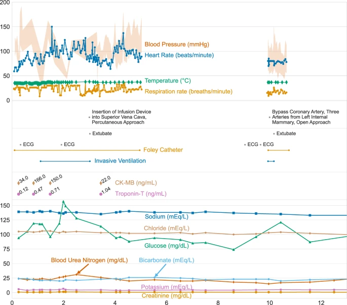

# MIMIC-IV, a freely accessible electronic health record dataset
MIMIC-IV，一个可免费访问的电子健康记录数据集

> An Author Correction to this article was published on 18 April 2023
> 本文的作者更正发布于 2023 年 4 月 18 日

## Abstract  摘要
Digital data collection during routine clinical practice is now ubiquitous within hospitals. The data contains valuable information on the care of patients and their response to treatments, offering exciting opportunities for research. Typically, data are stored within archival systems that are not intended to support research. These systems are often inaccessible to researchers and structured for optimal storage, rather than interpretability and analysis. Here we present MIMIC-IV, a publicly available database sourced from the electronic health record of the Beth Israel Deaconess Medical Center. Information available includes patient measurements, orders, diagnoses, procedures, treatments, and deidentified free-text clinical notes. MIMIC-IV is intended to support a wide array of research studies and educational material, helping to reduce barriers to conducting clinical research.

常规临床实践中的数字数据收集现在在医院中无处不在。这些数据包含有关患者护理及其对治疗反应的宝贵信息，为研究提供了令人兴奋的机会。通常情况下，数据存储在档案系统中，不用于支持研究。这些系统通常是无法访问的研究人员和结构的最佳存储，而不是可解释性和分析。在这里，我们提出 MIMIC-IV，一个公共可用的数据库来源于贝丝以色列女执事医疗中心的电子健康记录。可用信息包括患者测量、医嘱、诊断、程序、治疗和去识别自由文本临床记录。MIMIC-IV 旨在支持广泛的研究和教育材料，帮助减少进行临床研究的障碍。

## Background  背景
Thanks to the widespread adoption of electronic health record systems, data collected during routine clinical practice is now digitally stored in hospitals across the United States. Despite widespread storage of this data, archiving systems are often not designed to support research, making them difficult to navigate and access. In addition, routinely collected clinical data is often sporadic and noisy, reflecting the processes by which it was generated, where quality of data collection is understandably peripheral to the act of providing high quality care.

由于电子健康记录系统的广泛采用，在常规临床实践中收集的数据现在以数字方式存储在美国各地的医院中。尽管这些数据被广泛存储，但归档系统通常不是为支持研究而设计的，这使得它们难以导航和访问。此外，常规收集的临床数据往往是零星的和嘈杂的，反映了它的产生过程，其中数据收集的质量是可以理解的外围提供高质量的护理行为。

The intensive care unit (ICU) is an especially data-rich environment as patients require close monitoring. The typically acute nature of ICU patient illness and the importance of immediate intervention also make the environment of high-interest to researchers. Uniquely, there are a number of publicly available critical care datasets which have enabled research in this area. These projects largely build upon MIMIC, a waveform database with demographics digitally transcribed from paper records for over 90 patients1. MIMIC-II followed with a significantly increased sample size and breadth of information due to the clinical information being entirely sourced from various digital information systems2. More recently, MIMIC-III was published in 2015 and significantly expanded MIMIC-II, containing data for over 40,000 patients3. Outside of the MIMIC projects, a number of other critical care datasets have been made available to the worldwide research community. The eICU Collaborative Research Database (eICU-CRD) v2.0 comprises of 200,859 stays at ICUs and step-down units across 208 hospitals in the continental United States4. The AmsterdamUMCdb provides granular information for 23,106 admissions of 20,109 unique individuals admitted to a single academic medical center in the Netherlands5. The HiRID database contains high-resolution data for almost 34,000 admissions between 2008–2016 at Bern University Hospital in Switzerland6,7. HiRID contains 712 routinely collected physiological variables with one data entry every two minutes. The Pediatric Intensive Care (PIC) database is sourced from The Children’s Hospital at Zhejiang University School of Medicine with 12,881 patients and 13,941 ICU stays admitted from 2010–20188.

重症监护室（ICU）是一个数据特别丰富的环境，因为患者需要密切监测。ICU 患者疾病的典型急性性质和立即干预的重要性也使研究人员对环境高度感兴趣。独特的是，有一些公共可用的重症监护数据集，使在这一领域的研究。这些项目在很大程度上建立在 MIMIC 的基础上，MIMIC 是一个波形数据库，其人口统计数据是从 90 多名患者的纸质记录中数字转录的。MIMIC-II 随后显著增加了样本量和信息广度，因为临床信息完全来自各种数字信息系统 2。最近，MIMIC-III 于 2015 年发表，并显着扩展了 MIMIC-II，包含超过 40，000 名患者的数据。 在 MIMIC 项目之外，许多其他重症监护数据集已提供给全球研究界。eICU 协作研究数据库（eICU-CRD）v2.0 包括美国大陆 208 家医院的 200，859 例 ICU 和降压单位住院病例 4。阿姆斯特丹 UMCdb 提供了 20，109 名独特个人的 23，106 名入院者的详细信息，这些人被录取到荷兰的一个学术医疗中心 5。HiRID 数据库包含 2008-2016 年间瑞士伯尔尼大学医院近 34，000 例住院患者的高分辨率数据 6，7. HiRID 包含 712 个常规收集的生理变量，每两分钟输入一个数据。 儿科重症监护（PIC）数据库来源于浙江大学医学院附属儿童医院，2010-2018 年收治了 12，881 例患者和 13，941 例 ICU 住院患者。

Although the increasing number of datasets publicly available for research is encouraging, a number of areas for improvement remain. Data content varies considerably across datasets, with each having a particular strength. HiRID contains high resolution physiologic variables, eICU-CRD spans hundreds of distinct hospitals, while PIC contains pediatric patients. Clinical practice evolves quickly, requiring continual updating of the resources in order for derivative research to remain relevant. Finally, most datasets comprise of only one modality of information, clinical observations, and omit other important domains such as imaging, free-text, physiologic waveforms, and genomics.
虽然越来越多的数据集公开供研究是令人鼓舞的，但仍有一些领域需要改进。数据内容在数据集之间有很大的差异，每个数据集都有特定的优势。HiRID 包含高分辨率生理变量，eICU-CRD 涵盖数百家不同的医院，而 PIC 包含儿科患者。临床实践发展迅速，需要不断更新资源，以使衍生研究保持相关性。最后，大多数数据集只包含一种信息形式，即临床观察，而忽略了其他重要领域，如成像、自由文本、生理波形和基因组学。

In this paper we describe the public release of MIMIC-IV, a contemporary electronic health record dataset covering a decade of admissions between 2008 and 2019. MIMIC-IV complements the growing area of publicly accessible critical care datasets in a number of ways. First, MIMIC-IV is contemporary, containing information from 2008–2019. Second, MIMIC-IV incorporates new precise digital information sources such as the electronic medicine administration record. Third, MIMIC-IV establishes a modular organization of the constituent data allowing linking of the database to external departments and distinct modalities of data.
在本文中，我们描述了 MIMIC-IV 的公开发布，MIMIC-IV 是一个当代电子健康记录数据集，涵盖了 2008 年至 2019 年的十年入院情况。MIMIC-IV 以多种方式补充了日益增长的公共可访问的重症监护数据集领域。首先，MIMIC-IV 是当代的，包含 2008-2019 年的信息。其次，MIMIC-IV 采用了新的精确数字信息源，如电子药物管理记录。第三，MIMIC-IV 建立了组成数据的模块化组织，使数据库能够与外部部门和不同的数据模式联系起来。

## Methods  方法
MIMIC-IV is the result of a collaboration between Beth Israel Deaconess Medical Center (BIDMC) and Massachusetts Institute of Technology (MIT). Data collected at BIDMC as part of routine clinical care is deidentified, transformed, and made available to researchers who have completed training in human research and signed a data use agreement. The Institutional Review Board at the BIDMC granted a waiver of informed consent and approved the sharing of the research resource. Broadly, the creation of MIMIC involved three distinct steps: acquisition, transformation, and deidentification. Figure 1 gives an overview of the data acquisition, transformation, and deidentification process.

MIMIC-IV 是贝斯以色列女执事医疗中心（BIDMC）和马萨诸塞州理工学院（MIT）合作的结果。作为常规临床护理的一部分，在 BIDMC 收集的数据被去识别化、转换，并提供给完成人体研究培训并签署数据使用协议的研究人员。BIDMC 的机构审查委员会同意放弃知情同意，并批准共享研究资源。一般来说，MIMIC 的创建涉及三个不同的步骤：获取，转换和去识别。图 1 给出了数据获取、转换和去标识化过程的概述。

> An overview of the development process for MIMIC. Data are acquired from the BIDMC data warehouse, the ICU information system (MetaVision), and external sources (“acquisition”). Structured Query Language (SQL) scripts merge the various data sources into a single schema (“transformation”). Finally, deidentification algorithms are applied to selectively remove protected health information from the reformatted schema. Tables present in MIMIC-IV are provided on the far right of the figure under their respective module. Issues raised on the MIMIC Code Repository are assessed and used to improve the build process as appropriate.
> MIMIC 开发过程的概述。从 BIDMC 数据仓库、ICU 信息系统（MetaVision）和外部来源（“采集”）采集数据。结构化查询语言（SQL）脚本将各种数据源合并到单个模式（“转换”）中。最后，去识别算法被应用于从重新格式化的模式中选择性地移除受保护的健康信息。MIMIC-IV 中的表格在图的最右边的相应模块下提供。评估 MIMIC 代码库中提出的问题，并将其用于适当改进构建过程。

### Acquisition  采集
The majority of data in MIMIC-IV is generated and archived within BIDMC as part of routine clinical care and related activities such as monitoring, provider orders, and billing. This data is initially brought together in a Microsoft SQL Server Database within a secure data warehouse at the hospital. Subsequently, the data is transferred to a PostgreSQL database system (PostgreSQL 12.8, PostgreSQL Global Development Group) on MIT secure servers via a Virtual Private Network (VPN) connection. Complementary datasets such as code system definitions (e.g. International Classification of Diseases (ICD)) and state death records are acquired independently of BIDMC and loaded onto the PostgreSQL database located at MIT.

MIMIC-IV 中的大部分数据在 BIDMC 中生成和存档，作为常规临床护理和相关活动（如监测、提供者订单和计费）的一部分。这些数据最初集中在医院安全数据仓库内的 Microsoft SQL Server 数据库中。随后，数据通过虚拟专用网络（VPN）连接传输到 MIT 安全服务器上的 PostgreSQL 数据库系统（PostgreSQL 12.8，PostgreSQL 全球开发组）。补充数据集，如编码系统定义（如国际疾病分类（ICD））和国家死亡记录，是独立于 BIDMC 获得的，并加载到位于 MIT 的 PostgreSQL 数据库中。

> MIMIC-IV follows a modular structure. Modules can be linked by identifiers including subject_id, hadm_id, and deidentified date and time. Example content of each module is shown.
> MIMIC-IV 采用模块化结构。模块可以通过包括 subject_id、hadm_id 和去标识日期和时间的标识符进行链接。显示了每个模块的示例内容。

#### Clinical cohort  临床队列
We acquired information from BIDMC for all patients who were admitted to either the emergency department or an ICU between 2008–2019. Patients were excluded if they were younger than 18 on their first visit or if they were on a known list of individuals requiring enhanced protection. A small number of medical record numbers corresponding to the same individual were merged.

我们从 BIDMC 获得了 2008-2019 年间入住急诊科或 ICU 的所有患者的信息。如果患者在首次就诊时年龄小于 18 岁，或者如果他们在需要加强保护的已知个人名单上，则将其排除在外。合并了同一个人对应的少量病历号。

For extracting EHR data from BIDMC, we accessed the comprehensive data warehouse, mentioned previously, as well as a MetaVision (iMDsoft, Israel) bedside clinical information system used in the critical care units. Some data elements are duplicated between the two systems because the hospital-wide EHR pushes information into MetaVision (e.g. an HL7 integration engine automatically synchronizes laboratory results). Data was transferred to MIT using the PGLoader export tool9.

为了从 BIDMC 提取 EHR 数据，我们访问了前面提到的综合数据仓库，以及在重症监护病房使用的 MetaVision（iMDsoft，以色列）床边临床信息系统。由于医院范围内的 EHR 将信息推送至 MetaVision（例如，HL 7 集成引擎自动同步实验室结果），因此两个系统之间的一些数据元素是重复的。使用 PGLoader 导出工具 9 将数据传输到 MIT。

#### External data sources  外部数据源
Clinical data often require external data sources, such as coding systems, for intepretation. Examples systems include Diagnosis Related Groups (DRGs), the International Classification of Diseases (ICD), and the Healthcare Common Procedure Coding System (HCPCS). We acquired these reference systems from publicly available sources and included them in the database to facilitate analysis. For DRG, we loaded two versions of the coding system: All Payer (AP-DRG) and Medicare Severity (MS-DRG). Descriptions for AP-DRGs were acquired from the MassHealth publication of DRGs and related costs10. Descriptions for MS-DRGs were acquired from the Healthcare Cost and Utilization Project (HCUP) tools10.

临床数据通常需要外部数据源（如编码系统）进行解释。示例性系统包括诊断相关组（DRG）、国际疾病分类（ICD）和医疗保健通用程序编码系统（HCPCS）。我们从公开来源获得了这些参考系统，并将其纳入数据库以便于分析。对于 DRG，我们加载了两个版本的编码系统：所有付款人（AP-DRG）和医疗保险严重程度（MS-DRG）。AP-DRGs 的描述来自 MassHealth 出版的 DRGs 和相关费用 10。从医疗保健成本和利用项目（HCUP）工具 10 中获得 MS-DRG 的描述。

ICD codes were acquired for both version 9 and 10 of the coding system. Codes were acquired from the Centers for Medicare & Medicaid Services (CMS)11,12. The ICD coding systems are updated yearly, with codes being added, removed, or updated as necessary. As MIMIC-IV has been collected over the span of a decade, a number of codes used historically have since been removed from the latest version. To allow for interpretation of these historical codes, we initialized the ICD dimension table with the respective 2020 version. We then sequentially added codes no longer present by iterating over past versions. At the end of the creation of MIMIC-IV, we verified that all ICD codes in MIMIC-IV were described in the dataset. Note that we conducted this sequential process for all versions and systems of ICD in MIMIC-IV, namely: ICD-9-CM, ICD-9-PCS, ICD-10-CM, and ICD-10-PCS.

ICD 代码是为编码系统的第 9 版和第 10 版采集的。代码从医疗保险和医疗补助服务中心（CMS）获得 11，12。ICD 编码系统每年更新一次，并根据需要添加、删除或更新代码。由于 MIMIC-IV 已经收集了十年，历史上使用的一些代码已经从最新版本中删除。为了解释这些历史代码，我们使用相应的 2020 年版本初始化了 ICD 维度表。然后，我们通过迭代过去的版本，顺序地添加不再存在的代码。在 MIMIC-IV 创建结束时，我们验证了 MIMIC-IV 中的所有 ICD 代码都在数据集中描述。请注意，我们对 MIMIC-IV 中 ICD 的所有版本和系统（即：ICD-9-CM、ICD-9-PCS、ICD-10-CM 和 ICD-10-PCS）进行了此顺序过程。

#### Out-of-hospital mortality    院外死亡率
Due to data quality concerns regarding the Social Security Death Master File (SSDMF)13, we did not attempt to link patients to the SSDMF for determining out-of-hospital mortality. Instead, we linked patient records to the Massachusetts State Registry of Vital Records and Statistics14. We created a custom algorithm which matched records using name, social security number, and date of birth using the RecordLinkage library v0.1515.

由于对社会保障死亡主文件（SSDMF）13 的数据质量的担忧，我们没有尝试将患者与 SSDMF 联系起来确定院外死亡率。相反，我们将患者记录与马萨诸塞州生命记录和统计登记处联系起来 。我们使用 RecordLinkage 库 v0.15 创建了一个自定义算法，该算法使用姓名、社会安全号码和出生日期匹配记录。

Our matching algorithm first generated a list of candidate matches by requiring at least one exact match for the following three feature combinations: first and last name, social security number, or last name and date of birth. We then used fuzzy matching approaches to rank the quality of the match. Exact matches were ranked highest, followed by approximate matches using either the Jaro-Winkler edit distance for names, Levenshtein edit distance for social security numbers, or a date-specific edit distance for dates. After ranking, we iterated through a series of custom rules for matching until only unlikely matches remained. These custom rules set the minimum distance allowable for pairing two records as well as the order of identifiers used for linking. We aimed to maximize sensitivity in the linkage process.

我们的匹配算法首先通过要求以下三个特征组合至少有一个精确匹配来生成候选匹配列表：名字和姓氏，社会安全号码，或姓氏和出生日期。然后，我们使用模糊匹配的方法来排名匹配的质量。精确匹配的排名最高，其次是近似匹配，使用 Jaro-Winkler 编辑距离的名字，Levenshtein 编辑距离的社会安全号码，或日期特定的编辑距离的日期。在排名之后，我们迭代了一系列自定义的匹配规则，直到只剩下不太可能的匹配。这些自订规则会设定配对两笔记录所允许的最小距离，以及用于链接的识别码顺序。我们的目标是在联系过程中最大限度地提高敏感性。

Of the original 590,325 unique individuals in the BIDMC EHR, our initial list of candidates resulted in 717,092 links for 150,832 unique individuals, i.e. 25.6% of individuals had a potential match. We ultimately linked 65,805 of the 150,832 unique individuals (43.6%) to state death records. The majority of links were made using an exact match on last name, date of birth, and social security number (51,022/65,803, 77.5%). The second highest number of matches were made using an exact match on last name and date of birth and an approximate match on first name (11,634/65,803, 17.7%). The remaining matches were evenly distributed among the other rules which typically required an exact match on one high cardinality identifier (such as last name and date of birth) and an approximate match on another identifier.

在 BIDMC EHR 中最初的 590，325 个唯一个体中，我们的初始候选者列表产生了 150，832 个唯一个体的 717，092 个链接，即 25.6%的个体具有潜在匹配。我们最终将 150,832 个独特个体中的 65,805 个（43.6%）与州死亡记录联系起来。大多数链接使用姓氏，出生日期和社会安全号码的精确匹配（51，022/65，803，77.5%）。第二大匹配数是姓氏和出生日期完全匹配和名字近似匹配（11，634/65，803，17.7%）。其余的匹配平均分布在其他规则中，这些规则通常需要一个高基数标识符（如姓氏和出生日期）的精确匹配和另一个标识符的近似匹配。

### Transformation  转型
Custom Structured Query Language (SQL) scripts were used to transform the data to the final MIMIC structure. Two principles were adhered to during this process. First, we aimed to maintain backward compatibility with MIMIC-III. Second, we sought to minimize processing to align the published data as closely to the data recorded during clinical practice.

使用自定义结构化查询语言（SQL）脚本将数据转换为最终的 MIMIC 结构。在这一过程中坚持了两个原则。首先，我们的目标是保持与 MIMIC-III 的向后兼容性。其次，我们试图最大限度地减少处理，以使已发表的数据与临床实践期间记录的数据保持一致。

MIMIC-IV adopts a relational structure with predefined relationships stored across tables and columns. Data are grouped into three modules: hosp, icu, and note. These modules serve a similar purpose to schemas in database organization in that they support human interpretation of the underlying data structure. Conceptually, a module contains a subset of information which has similar provenance or content Fig. 2. Modules in MIMIC-IV include hosp, icu, and note. The modular structure is intended to enable future linkage of MIMIC-IV with data sourced from other departments and with varying modalities of information.

MIMIC-IV 采用了一种关系结构，其中预定义的关系存储在表和列中。数据被分为三个模块：hosp、icu 和 note。这些模块的作用与数据库组织中的模式类似，因为它们支持对底层数据结构的人工解释。从概念上讲，一个模块包含一个信息子集，这些信息具有相似的出处或内容（图 2）。MIMIC-IV 中的模块包括 hosp、icu 和 note。模块结构的目的是使 MIMIC-IV 今后能够与来自其他部门的数据和不同形式的信息相联系。

Admission/discharge/transfer (ADT) records are placed in the hosp module, alongside other hospital-wide data such as laboratory values, microbiology cultures, medication orders, and administrative data derived from hospital billing practices. Note that while the majority of information is collected at the BIDMC, some information was transferred to the BIDMC from outpatient clinics.

入院/出院/转院（ADT）记录与其他医院范围内的数据（如实验室值、微生物培养、药物医嘱和来自医院计费实践的管理数据）一起放置在 hosp 模块中。请注意，虽然大部分信息是在 BIDMC 收集的，但有些信息是从门诊转移到 BIDMC 的。

The icu module comprises data documented at the ICU bedside. Data includes intravenous infusions, patient outputs, charted observations, and documentation of ongoing procedures. The note module comprises discharge summaries and radiology reports. To support pairing of free-text notes with structured information, we created a single entity-attribute-value table for each note type. For example, the radiology_detail table contains quantitative information typically collected with radiology reports.

icu 模块包括在 ICU 床边记录的数据。数据包括静脉输注、患者输出、图表观察和正在进行的程序的文件。 笔记模块包括出院总结和放射学报告。为了支持自由文本笔记与结构化信息的配对，我们为每种笔记类型创建了一个实体-属性-值表。例如，radiology_detail 表包含通常与放射学报告一起收集的定量信息。

After creation, tables were exported to comma separated value (CSV) files following the RFC-4180 memo to facilitate sharing and reuse16.

在创建之后，表格按照 RFC-4180 备忘录导出为逗号分隔值（CSV）文件，以促进共享和重用 16。

### Deidentification  去认同
The Health Insurance Portability and Accountability Act (HIPAA) Safe Harbor provision stipulates a set of 18 identifiers (for example, names, locations, serial numbers, and ages) which must be removed in order for a dataset to be considered deidentified. Once deidentified, data may be shared beyond the covered entities involved in initial collection and processing. We developed custom algorithms to find and remove HIPAA identifiers.

健康保险流通与责任法案（Health Insurance Portability and Accountability Act，HIPAA）安全港条款规定了一组 18 个标识符（例如，姓名、位置、序列号和年龄），必须删除这些标识符，才能将数据集视为去识别。一旦取消识别，数据可能会在参与最初收集和处理的所涵盖实体之外共享。我们开发了自定义算法来查找和删除 HIPAA 标识符。

Look-up tables were used to randomly assign patients with a unique identifier (subject_id) and hospitalizations with a unique identifier (hadm_id). Dates were perturbed by shifting them using a patient-level offset. The shift ensures that the interval between two time points for a patient is preserved.

使用查找表随机分配具有唯一标识符（subject_id）的患者和具有唯一标识符（hadm_id）的住院。通过使用患者水平偏移量移动日期，使其受到干扰。该偏移确保患者的两个时间点之间的间隔得以保留。

Finally, we combined two published algorithms for removing PHI from free-text17,18. If either of these algorithms identified an entity as PHI, it was removed from the database and replaced with three consecutive underscores (“___”). We applied this approach to the free-text clinical notes in the note module as well as free-text elements present in the structured data (e.g. comment fields). We validated our deidentification approach with thorough human review and, where possible, created exhaustive allow lists which filtered data prior to release.

最后，我们结合了两种已发表的算法，用于从自由文本中删除 PHI17，18。如果这些算法中的任何一个将实体标识为 PHI，则将其从数据库中删除并替换为三个连续的下划线（“_”）。我们将这种方法应用于笔记模块中的自由文本临床笔记以及结构化数据中存在的自由文本元素（例如，注释字段）。我们通过全面的人工审查验证了我们的去识别方法，并在可能的情况下创建了详尽的允许列表，在发布前过滤数据。

## Data Records  数据记录
Access to MIMIC-IV is provided via PhysioNet19. The hosp and icu modules in MIMIC-IV are available in the MIMIC-IV project on PhysioNet20. The note module is available from the MIMIC-IV-Note: Deidentified free-text clinical notes project on PhysioNet21.

通过 PhysioNet19 可访问 MIMIC-IV。MIMIC-IV 中的 hosp 和 icu 模块可在 PhysioNet20 上的 MIMIC-IV 项目中获得。 注释模块可从 MIMIC-IV-Note 获得：PhysioNet21 上的未识别自由文本临床注释项目。

Table 1 summarizes the demographics for ICU patients in MIMIC-IV. Figure 3 visualizes a patient who is admitted to an ICU for a cardiac arrest, discharged to a general ward, admitted to the operating room, has a planned readmission to an ICU after their operation, and is ultimately discharged home.

表 1 总结了 MIMIC-IV 中 ICU 患者的人口统计学。图 3 显示了因心脏骤停而进入 ICU、出院到普通病房、进入手术室、在手术后计划再次进入 ICU 并最终出院回家的患者。

> Visualization of data within MIMIC-IV for a single patient’s hospitalization: hadm_id 28503629. Three vertically stacked panels highlight the variety of information available. Vital signs are shown in the top panel: note the frequency of data collection for temperature is much higher at the start of the ICU stay due to the use of targeted temperature management. Procedures from multiple sources are shown in the middle panel, including from billing information, the provider order entry system, as well as the ICU information system. The bottom panel displays patient laboratory measurements. Note that while frequent vital signs are only available when the patient is in the ICU, laboratory measures are available throughout their hospitalization.
> MIMIC-IV 中单个患者住院数据的可视化：hadm_id 28503629。三个垂直堆叠的面板突出显示了可用信息的多样性。生命体征显示在顶部面板中：注意，由于使用了目标温度管理，在 ICU 住院开始时，温度数据收集的频率要高得多。来自多个来源的程序显示在中间面板中，包括来自计费信息、提供者订单输入系统以及 ICU 信息系统的程序。底部面板显示患者实验室测量值。请注意，虽然频繁的生命体征仅在患者在 ICU 时可用，但在整个住院期间都可以进行实验室测量。

### Hospital module (hosp)  医院单元（hosp）
The hosp module stores information regarding patient transfers, billed events, medication prescription, medication administration, laboratory values, microbiology measurements, and provider orders. The subject_id column is present in all tables and allows linkage to patient demographics in the patients table. The hadm_id column is also present in all tables and represents a single hospitalization; rows without an hadm_id pertain to data collected outside of an inpatient encounter. Most tables may be interpreted without cross-linking to other tables. Tables which contain item_ids are an exception, and they must be linked to a dimension table prefixed with d_ in order to acquire a human interpretable description of the item_ids. Other tables, such as emar and poe, may be linked with “detail” tables (emar_detail and poe_detail) which provide additional information for each row.

hosp 模块存储关于患者转移、计费事件、药物处方、药物管理、实验室值、微生物学测量和提供者订单的信息。subject_id 列存在于所有表中，并允许链接到 patients 表中的患者人口统计数据。hadm_id 列也存在于所有表中，表示单次住院;没有 hadm_id 的行与在住院患者就诊之外收集的数据有关。大多数表格可以在不与其他表格交叉链接的情况下进行解释。包含 item_id 的表是一个例外，它们必须链接到一个前缀为 d_的维度表，以获得对 item_id 的人类可解释的描述。 其他表，如 emar 和 poe，可以与“detail”表（emar_detail 和 poe_detail）链接，这些表为每一行提供附加信息。

#### Patient tracking  患者跟踪
Patient demographics and in-hospital movement are described in three tables: patients, admissions, and transfers. Each distinct patient is assigned a subject_id, and the patients table has a unique subject_id for each row. The patients table provides the patient’s administrative gender, their age, and their date of death.

患者人口统计数据和院内移动在三个表格中描述： 患者 ， 入院和转移 。每个不同的患者都被分配了一个 subject_id，并且 patients 表的每一行都有一个唯一的 subject_id。 患者表提供患者的管理性别、年龄和死亡日期。

In order to appropriately deidentify the exact date of patient stays, the patients table contains an anchor_year column. This column “anchors” data stored in the patients table to a year occurring in their deidentified timeline (e.g. 2150). At this deidentified year, the patient’s age is provided in the anchor_age column and the approximate true year of admission is provided in the anchor_year_group column. For example, if a patient’s anchor_age is 50 and their anchor_year is 2150, then they were 50 years old in the year 2150. Continuing the example, if this patient’s anchor_year_group is 2011–2013, then we know that any hospitalizations occurring in the deidentified year 2150 (i.e. the anchor_year) actually occurred sometime between 2011 and 2013, and that they were 50 years old during this time period. The anchor_year_group column was added to MIMIC-IV to allow analyses which incorporate changes in medical practice over time.

为了适当地取消识别患者住院的确切日期， 患者表包含一个锚_年列。该列将存储在患者表中的数据“锚定”到其去识别时间轴中发生的年份（例如 2150）。在该去识别年份，患者的年龄在锚_age 列中提供，近似真实的入院年份在锚_year_group 列中提供。例如，如果患者的锚_年龄为 50 岁，其锚_年为 2150 年，则其在 2150 年时为 50 岁。继续该示例，如果该患者的锚_year_group 为 2011-2013，则我们知道在去识别年份 2150（即锚_year）发生的任何住院实际上发生在 2011 年至 2013 年之间的某个时间，并且他们在此时间段内 50 岁。 将锚_year_group 列添加到 MIMIC-IV 中，以允许分析随时间推移的医疗实践变化。

Finally, a patient’s date of death is available in the dod column. Dates of death are censored at one-year from the patient’s last hospital discharge. As a result, null dates of death indicate the patient was alive at least up to that time point. Inferences regarding patient death beyond one year cannot be made using MIMIC-IV. The majority of patient death information is acquired from hospital records when the individual dies within the BIDMC or an affiliated institute.

最后，病人的死亡日期可以在 dod 栏中找到。死亡日期删失为患者末次出院后一年。因此，死亡日期为空表示患者至少在该时间点之前还活着。使用 MIMIC-IV 无法推断超过 1 年的患者死亡。当个体在 BIDMC 或附属机构内死亡时，大部分患者死亡信息是从医院记录中获得的。

#### Administration  管理
Three tables in the hosp module provide administration related information: services, poe, and poe_detail. The services table provides information on the hospital-related service under which a patient is hospitalized. The poe and poe_detail tables contain orders made in the provider order entry (POE) system. The POE system is used within the hospital to make orders related to diagnoses, imaging, consultation, and treatment. Typically the poe tables provide the date and time of an order such as an x-ray study, medication order, or nutrition order, but provide limited detail about the order itself.

hosp 模块中的三个表提供了与管理相关的信息：services、poe 和 poe_detail。“ 服务” 表提供有关患者住院所使用的医院相关服务的信息。poe 和 poe_detail 表包含在提供商订单输入（POE）系统中做出的订单。POE 系统在医院内用于做出与诊断、成像、咨询和治疗相关的订单。通常，poe 表提供订单的日期和时间，例如 x 光检查、药物订单或营养订单，但提供有关订单本身的有限细节。

#### Billing  计费
Billing information is stored in the diagnoses_icd, procedures_icd, drgcodes, and hcpcsevents tables. The diagnoses_icd table contains coded diagnoses representing the hospitalization as determined by trained professionals after reviewing signed patient notes. The ontology of the diagnoses_icd table is the International Classification of Diseases, Ninth Revision, Clinical Modification (ICD-9-CM) diagnoses and the ICD Tenth Revision, Clinical Modification (ICD-10-CM) diagnoses. Definitions for ICD codes are provided in the d_icd_diagnoses table. A maximum of 39 diagnoses may be billed for a single hospital encounter, and seq_num provides an approximate ordering of diagnosis. There are few incentives for the billing department to ensure seq_num is a perfect rank ordering of diagnosis importance, however, and caution should be taken when using seq_num for research purposes. A similar table structure is adopted for billed procedures which are stored in the procedures_icd table with descriptions of codes provided in the d_icd_procedures table.

帐单信息存储在 diagnoses_icd、procedures_icd、drgcodes 和 hcpcsevents 表中。diagnoses_icd 表包含代表住院的编码诊断，由经过培训的专业人员在查看签名的患者记录后确定。diagnosis_icd 表的本体是国际疾病分类第九修订版临床修改（ICD-9-CM）诊断和 ICD 第十修订版临床修改（ICD-10-CM）诊断。ICD 代码的定义在 d_icd_diagnoses 表中提供。一次医院就诊最多可以对 39 个诊断进行计费，seq_num 提供了诊断的大致顺序。 对于计费部门来说，几乎没有激励措施来确保 seq_num 是诊断重要性的完美排名，但是，在将 seq_num 用于研究目的时应谨慎。对于存储在 procedures_icd 表中的已计费程序采用类似的表结构，并在 d_icd_procedures 表中提供代码说明。

Diagnoses are recorded with the ICD-9-CM or ICD-10-CM ontologies, while procedures are recorded with the ICD-9-PCS or ICD-10-PCS ontologies. As these ontologies were updated throughout the data collection period of MIMIC-IV, the d_icd_diagnoses and d_icd_procedures tables contain all codes which were valid at any point during the 2008–2019 time period.

诊断用 ICD-9-CM 或 ICD-10-CM 本体记录，而程序用 ICD-9-PCS 或 ICD-10-PCS 本体记录。由于这些本体在 MIMIC-IV 的整个数据收集期间进行了更新，d_icd_diagnosis 和 d_icd_procedures 表包含 2008-2019 年期间任何时间点有效的所有代码。

Diagnosis Related Groups (DRGs) are billable codes used to assign an overall cost to a hospitalization. Many ontologies for DRG codes exist, and the drg_type column stores the ontology for the given row. The final billing tables are hcpcsevents and its associated dimension table d_hcpcsevents. The hcpcsevents table records billing by the hospital for provided services such as mechanical ventilation or provision of ICU care.

诊断相关组（DRGs）是用于分配住院总成本的可计费代码。存在许多 DRG 代码的本体，并且 drg_type 列存储给定行的本体。最后的计费表是 hcpcsevents 及其关联的维度表 d_hcpcsevents。hcpcsevents 表记录医院对所提供服务（如机械通气或 ICU 护理）的计费。

#### Measurement  测量
Measurements sourced from patient derived specimens are available in microbiologyevents and labevents, with the d_labitems table providing definitions for concepts present in the labevents table. Laboratory measurements have a simpler structure compared to microbiology measurements though both relate to patient derived specimens such as blood. Multiple measurements are often taken for a single specimen, delineated by the specimen_id column in the labevents table and the micro_specimen_id column in microbiologyevents. For example, blood gas measurements made on the same sample will share the same specimen_id with one concept specifying the type of specimen (arterial, venous, etc).

来源于患者来源标本的测量值可在 microbiologyevents 和 labevents 中使用，d_labitems 表提供 labevents 表中存在的概念的定义。与微生物学测量相比，实验室测量具有更简单的结构，尽管两者都涉及患者来源的样本，例如血液。通常对单个标本进行多次测量，由 labevents 表中的 specimen_id 列和 microbiologyevents 中的 micro_specimen_id 列描述。例如，在同一样本上进行的血气测量将共享相同的 specimen_id，其中一个概念指定样本类型（动脉、静脉等）。

Microbiology measurements are stored in a single table with columns dedicated to domain specific concepts. Measurements follow a directed hierarchy of specimen, organism, isolate, antibiotic, and dilution. To simplify analysis of this data, elements higher in the hierarchy such as specimen and organism are repeated for elements lower in the hierarchy such as antibiotic and dilution. Microbiology cultures typically have interim results reported to the care providers. This information is not captured in this table, which only provides the final interpretation of a microbiology culture as it was documented at storetime.

微生物学测量值存储在单个表中，表中的列专用于特定领域的概念。测量遵循标本、微生物、分离株、抗生素和稀释液的直接层次结构。为了简化对该数据的分析，对层级较低的元素（如抗生素和稀释液）重复层级较高的元素（如标本和微生物）。微生物培养通常会向护理提供者报告中期结果。本表未记录该信息，仅提供了储存时记录的微生物培养物的最终判读。

Finally, the omr table provides information from the Online Medical Record (OMR) for the patient. OMR is a general system used for documenting patient information from visits at BIDMC affiliated institutes. As of MIMIC-IV v2.2, the OMR table contains data for five measurements: blood pressure, height, weight, body mass index, and the Estimated Glomerular Filtration Rate (eGFR). These values are available from both inpatient and outpatient visits, and in many cases a “baseline” value from before a patient’s hospitalization is available.

最后，omr 表提供来自患者的在线医疗记录（OMR）的信息。OMR 是一个通用系统，用于记录 BIDMC 附属机构访视的患者信息。自 MIMIC-IV v2.2 起，OMR 表包含五项测量数据：血压、身高、体重、体重指数和估计肾小球滤过率（eGFR）。这些值可以从住院和门诊就诊中获得，并且在许多情况下，可以获得患者住院前的“基线”值。

#### Medication  药物
There are four tables in the hosp module which track medication prescription and administration: prescriptions, pharmacy, emar, and emar_detail. The prescriptions and pharmacy tables are intended to be used together: prescriptions contains the order made by a provider and pharmacy stores detailed information regarding the compound prescribed. Not all prescribed compounds are associated with an entry in the pharmacy table.

hosp 模块中有四个表用于跟踪药物处方和管理：prescriptions、pharmacy、emar 和 emar_detail。处方表和药房表预期一起使用： 处方包含提供者的订单， 药房存储有关处方化合物的详细信息。并非所有处方化合物都与药房表中的条目相关联。

The other two medication related tables, emar and emar_detail, are sourced from the electronic Medicine Administration Record (eMAR). The eMAR system requires barcode scanning of a patient wristband and the medication at the time of administration and was deployed throughout the BIDMC between 2014–2016. By 2016, all units of the hospital had the eMAR system deployed, and thus all hospitalizations from 2016 onward would be anticipated to have records within eMAR. Unlike the prescriptions table which stores medication requests, the eMAR system records administration. The emar table has one row per administration, with emar_id uniquely identifying rows and emar_seq being a monotonically increasing integer ordering events chronologically. The poe_id and pharmacy_id columns allow linking to the poe and pharmacy tables, respectively. Importantly, every row in emar links to one or more rows in emar_detail. As each formulary dose must be scanned as a part of the workflow, an administration of 200 mg with formulary doses of 100 mg will result in three rows in emar_detail: one row for the overall administration (with a missing value for parent_field_ordinal), and two rows for each scanned formulary dose (with increasing values of parent_field_ordinal). Columns which describe the entire administration event such as complete_dose_not_given and dose_due are only present for the primary row. Most columns refer to individual formulary doses (dose_given, product_description, and so on), and are only present for the formulary dose rows.

其他两个药物相关表 emar 和 emar_detail 来自电子给药记录（eMAR）。eMAR 系统需要在给药时对患者腕带和药物进行条形码扫描，并在 2014-2016 年期间在整个 BIDMC 部署。到 2016 年，医院的所有单位都部署了 eMAR 系统，因此预计从 2016 年起的所有住院病例都将在 eMAR 中记录。与存储药物请求的处方表不同，eMAR 系统记录管理。emar 表中每个管理都有一行，emar_id 唯一标识行，emar_seq 是按时间顺序排列事件的单调递增整数。poe_id 和 pharmacy_id 列允许分别链接到 poe 和 pharmacy 表。 重要的是，emar 中的每一行都链接到 emar_detail 中的一行或多行。由于每个处方剂量必须作为工作流程的一部分进行扫描，因此 200 mg 给药和 100 mg 处方剂量将导致 emar_detail 中出现三行 ： 一行用于总体给药（parent_field_ordinal 的值缺失），两行用于每个扫描的处方剂量（parent_field_ordinal 的值增加）。描述整个给药事件的列（如 complete_dose_not_given 和 dose_due） 仅存在于主行。大多数列引用单个处方剂量（dose_given、product_description 等），并且仅在处方剂量行中显示。

Figure 4 visualizes the complementary information present in the emar, emar_detail, prescriptions, and inputevents tables for a single patient.

图 4 显示了单个患者的 emar、emar_detail、prescriptions 和 inputevents 表中的补充信息。

> Visualization of medication information documented within MIMIC-IV for a single patient’s hospitalization: hadm_id 28503629. The annotated grey line indicates care units for the patient throughout their stay. Bolus medications are indicated by markers, continuous infusions as lines, and range doses as filled boxes. For example, on day 5 of their hospital stay, the patient had two active prescriptions for heparin (one for 1600–3500 units of heparin, brown filled box, and one for 1000 units of heparin, pink line with triangles). Additionally on day 5, the patient continued to received heparin according to emar (orange circle), and was imminently transferred to the medicine/cardiology intermediate ward.
> MIMIC-IV 中记录的单个患者住院的药物信息的可视化：hadm_id 28503629。带注释的灰线表示患者在整个住院期间的护理单位。大剂量药物用标记表示，连续输注用线条表示，剂量范围用填充框表示。例如，在住院第 5 天，患者有两个肝素活性处方（一个为 1600-3500 单位肝素，棕色填充盒，另一个为 1000 单位肝素，粉红色三角形线）。此外，在第 5 天，根据 emar（橙子圆圈），患者继续接受肝素治疗，并立即转移至内科/心脏病学中间病房。

### ICU module (icu)  ICU 模块（ICU）
The MetaVision clinical information system (iMDsoft, Israel) is the source of data for patients admitted to the ICU. MetaVision was the only clinical information system used in the ICU for the time period of data collection for MIMIC-IV. Tables in the icu module include chartevents, d_items, datetimeevents, icustays, inputevents, outputevents, and procedureevents. The icu module adopts a star schema, with all event tables referencing d_items for defining itemid and icustays for defining stay_id.

MetaVision 临床信息系统（iMDsoft，Israel）是 ICU 患者的数据来源。MetaVision 是 MIMIC-IV 数据收集期间 ICU 中使用的唯一临床信息系统。icu 模块中的表包括 chartevents、d_items、datetimeevents、icustays、inputevents、outputevents 和 procedureevents。icu 模块采用星星模式，所有事件表引用 d_items 定义 itemid，icustays 定义 stay_id。

The stay_id column is a primary key for the icustays table, and as such is unique for each row. ICU stays are defined using the administrative record of patient movement within the hospital, i.e. the icustays table is derived from the transfers table in the hosp module. ICU stays are identified using a lookup table matching physical location to an ICU cost center. Each transfer that corresponds to an ICU stay is assigned a stay_id, and consecutive transfers are merged into a single stay_id. The time of admission (intime) and discharge (outtime) are available in the icustays table for each ICU stay. Importantly, if a transfer to a non-ICU ward occurs between two ICU stays, a unique stay_id will be assigned to each of the two stays.

stay_id 列是 icustays 表的主键，因此对于每行都是唯一的。使用医院内患者移动的管理记录定义 ICU 住院时间，即 icustays 表源自 hosp 模块中的转移表。ICU 住院是使用将物理位置与 ICU 成本中心相匹配的查找表来识别的。对应于 ICU 停留的每个转移都被分配一个 stay_id，并且连续的转移被合并到单个 stay_id 中。对于每个 ICU 停留，在 icustays 表中可以获得入院时间（intime）和出院时间（outtime）。重要的是，如果在两次 ICU 停留之间发生转移到非 ICU 病房，则将为两次停留中的每一次分配唯一的 stay_id。

Each documented item is colloquially referred to as an “event” in the icu module, and events are grouped into tables based on the underlying data type. Events which correspond to dates, such as the time of last dialysis, are stored in datetimeevents with the value column corresponding to the date. Continuous and bolus infusions are provided in the inputevents table with a starttime, endtime, rate, and amount. Patient outputs are documented in the outputevents table with a single numeric value occurring at a single charttime. The procedureevents table captures processes which have a starttime and endtime including organ support treatments such as mechanical ventilation. Finally, the chartevents table is the largest of all the events table, and acts as a catch-all for documentation at the bedside. Each row in chartevents has a charttime, indicating the time at which the measurement was relevant and a value column storing the value documented. All events tables contain patient subject_id, hadm_id, and stay_id, as well as a storetime indicating the time at which the measurement was validated by bedside staff.

每个记录的项目在 icu 模块中通俗地称为“事件”，并且事件根据底层数据类型分组到表中。与日期相对应的事件（如上次透析时间）存储在 datetimevents 中，其中值列与日期相对应。 输入事件表中提供了连续和推注输注，包括开始时间 、 结束时间 、 速率和量 。患者输出记录在输出事件表中，在单个图表时间出现单个数值 。procedureevents 表捕获具有开始时间和结束时间的过程，包括器官支持治疗，如机械通气。 最后，chartevents 表是所有事件表中最大的一个，它可以作为床边文件的全部。chartevents 中的每一行都有一个 charttime，指示测量相关的时间，还有一个存储记录值的值列。所有事件表都包含患者 subject_id、hadm_id 和 stay_id，以及指示床边工作人员验证测量的时间的存储时间 。

### Notes module (note)  Notes 模块（注释）
The note module contains free-text, deidentified clinical notes. The notes are organized into two tables: discharge, and radiology. Discharge summaries, stored in the discharge table, are in-depth notes which overview a patient’s history and course throughout a given hospitalization. Discharge summaries are organized into sections including chief complaint, history of present illness, past medical history, brief hospital course, physical exams, and discharge diagnoses. As a part of the deidentification process, the Social History and Discharge Instructions sections have been removed. These sections typically contained social and logistical information which was irrelevant for medical care but introduced a higher risk of reidentification as compared to other sections. Auxiliary information associated with each note has been stored in entity-attribute-value tables with the “_detail” suffix. For the discharge summaries these data are available in the discharge_detail table.

笔记模块包含自由文本、去识别化的临床笔记。这些记录被组织成两个表格： 出院和放射学 。出院小结存储在出院表中，是深入的笔记，概述了患者在给定住院期间的病史和病程。出院小结分为几个部分，包括主诉、现病史、既往病史、简短住院过程、体格检查和出院诊断。作为去身份化过程的一部分，社会历史和出院说明部分已被删除。这些部分通常包含与医疗护理无关的社会和后勤信息，但与其他部分相比，重新识别的风险更高。与每个注释相关联的辅助信息已存储在带有“_detail”后缀的实体-属性-值表中。 对于出院总结，这些数据可在 discharge_detail 表中获得。

The radiology table contains radiologist reports for imaging studies performed. Radiology reports cover a wide set of imaging modalities including x-ray, computed tomography, magnetic resonance imaging (MRI), and ultrasound. Radiology reports follow structured reporting best practices and have a dedicated section for the indication, comparison, findings, and impression of the imaging study. For more in-depth imaging scans such as full body MRIs, reports may describe findings organized according to the body system examined. The associated radiology_detail table provides a coded ontology for radiology examinations as well as current procedural terminology (CPT) codes for each study. If an addendum for a report exists, the radiology_detail provides the associated note_id.

放射学表包含所执行的成像研究的放射科医生报告。放射学报告涵盖了广泛的成像模式，包括 X 射线，计算机断层扫描，磁共振成像（MRI）和超声。放射学报告遵循结构化报告最佳实践，并有一个专门的部分用于适应症，比较，发现和成像研究的印象。对于更深入的成像扫描，如全身 MRI，报告可以描述根据检查的身体系统组织的发现。关联的 radiology_detail 表提供了放射学检查的编码本体以及每个研究的当前程序术语（CPT）代码。如果存在报告的附录，则 radiology_detail 提供关联的 note_id。

### Building on earlier versions of MIMIC    基于 MIMIC 的早期版本
MIMIC-IV is similar in many ways to previous versions of MIMIC. Tables with identical names in MIMIC-III and MIMIC-IV will be broadly compatible. The similarities help to ensure that code and analyses can be carried over from studies developed on earlier versions of the database. Table 2 summarizes notable changes for users transitioning from MIMIC-III to MIMIC-IV.

MIMIC-IV 在许多方面与以前的 MIMIC 版本相似。MIMIC-III 和 MIMIC-IV 中名称相同的表格将广泛兼容。这些相似之处有助于确保代码和分析可以从对数据库早期版本的研究中继承下来。表 2 总结了用户从 MIMIC-III 过渡到 MIMIC-IV 的显著变化。

Importantly, all patient identifiers have been regenerated for MIMIC-IV. As a result, it is not possible to link patients across the databases using an identifier such as subject_id, even though MIMIC-III and MIMIC-IV have an overlap in their data collection periods (specifically the years 2008–2012). To support research that spans the periods of MIMIC-III (2002–2008) and MIMIC-IV (2008–2019), we have published the MIMIC-III Clinical Database CareVue subset22. The CareVue subset contains only those patients from MIMIC-III who are not in MIMIC-IV.

重要的是，MIMIC-IV 的所有患者标识符都已重新生成。因此，即使 MIMIC-III 和 MIMIC-IV 在数据收集期（特别是 2008-2012 年）有重叠，也不可能使用 subject_id 等标识符将数据库中的患者联系起来。为了支持 MIMIC-III（2002-2008）和 MIMIC-IV（2008-2019）期间的研究，我们发布了 MIMIC-III 临床数据库 CareVue 子集 22。CareVue 子集仅包含来自 MIMIC-III 但不属于 MIMIC-IV 的患者。

## Technical Validation  技术验证
The creation of MIMIC-IV followed best practices in scientific computing23. An interdisciplinary team of scientists and clinicians evaluated MIMIC-IV during development, conducted code reviews, and tracked issues using a ticket system. Code was managed using version control software. Data transformation was executed with a single, reproducible build script. Validation of the build process assessed data integrity, data consistency, and deidentification. Unit tests were created to apply these checks during development.
MIMIC-IV 的创建遵循了科学计算方面的最佳做法 23。一个由科学家和临床医生组成的跨学科团队在开发过程中评估了 MIMIC-IV，进行了代码审查，并使用票证系统跟踪了问题。使用版本控制软件管理代码。数据转换是用一个可复制的构建脚本执行的。构建过程的确认评估了数据完整性、数据一致性和去识别化。创建单元测试是为了在开发过程中应用这些检查。

Integrity checks were used to ensure integrity of the database structure. For example, a simple unit test would verify that each diagnosis code in diagnoses_icd was present in the associated dimension table, d_icd_diagnoses. Another check would ensure that every table containing patient data had an associated entry in the patients table. A similar integrity check was performed for tables with an hadm_id column using the admissions table.
完整性检查用于确保数据库结构的完整性。例如，一个简单的单元测试将验证 diagnosis_icd 中的每个诊断代码是否存在于关联的维度表 d_icd_diagnosis 中。另一项检查将确保包含患者数据的每个表在患者表中都有关联的条目。使用 admissions 表对具有 hadm_id 列的表执行类似的完整性检查。

Consistency checks were used to confirm that information within the data was consistent with the known truth. For example, almost all ICU stays should have a billed diagnosis. Our testing framework therefore required a minimum of 99% of hadm_id in the icustays table to be present in the diagnoses_icd table. Similarly, we verified that 99% of ICU stays in the icustays table had at least one heart rate measurement in the chartevents table. We also ran comparisons of MIMIC-IV against earlier versions of MIMIC (e.g. we verified a subset of itemid in the labevents table matched the values in MIMIC-III v1.4).
一致性检查用于确认数据中的信息与已知事实一致。例如，几乎所有的 ICU 住院都应该有一个收费的诊断。因此，我们的测试框架要求 icustays 表中至少 99%的 hadm_id 出现在 diagnoses_icd 表中。同样，我们验证了 icustays 表中 99%的 ICU 住院患者在 chartevents 表中至少有一次心率测量。我们还将 MIMIC-IV 与 MIMIC 的早期版本进行了比较（例如，我们验证了 labevents 表中的 itemid 子集与 MIMIC-III v1.4 中的值匹配）。

Deidentification checks were used to confirm that the deidentification pipeline had been successfully applied to the dataset. For example, tests would extract all unique values for a column in a table and verify that every value was present in a manually curated allow list. Other checks sought to verify that dates were perturbed and that sensitive attributes such as race had been sufficiently aggregated.
去识别检查用于确认去识别流水线已成功应用于数据集。例如，测试将提取表中列的所有唯一值，并验证每个值是否存在于手动策划的允许列表中。其他检查试图核实日期是否被打乱，以及种族等敏感属性是否被充分汇总。

## Usage Notes  用法注释
MIMIC-IV contains a vast amount of information about clinical care. As with previous versions of the database, we anticipate a broad range of downstream uses including research, education, and technology development.
MIMIC-IV 包含大量关于临床护理的信息。与以前版本的数据库一样，我们预计该数据库将有广泛的下游用途，包括研究、教育和技术开发。

### Access  接入
Individuals interested in accessing MIMIC-IV must complete a training course in research with human participants and sign a data use agreement (DUA). The DUA requires users to adequately safeguard the dataset, to not attempt to reidentify individuals, to not share the data, and to report issues relating to deidentification.
有兴趣访问 MIMIC-IV 的个人必须完成与人类参与者的研究培训课程，并签署数据使用协议（DUA）。DUA 要求用户充分保护数据集，不试图重新识别个人，不共享数据，并报告与去识别有关的问题。

### Derived tables  派生表
The MIMIC Code Repository was originally created for MIMIC-III to enable researchers to share and reuse code24. For example, the repository includes SQL scripts to extract clinically meaningful subsets of information such as blood gases, ventilation settings, and vasopressor treatment. We will continue to use of the MIMIC Code Repository for MIMIC-IV25. Scripts to load MIMIC-IV data into a number of relational database management systems (e.g. PostgreSQL, MySQL, and Google BigQuery) have already been made available. In addition, much of the existing MIMIC-III code has been migrated to MIMIC-IV.
MIMIC 代码库最初是为 MIMIC-III 创建的，以使研究人员能够共享和重用代码。 例如，存储库包括 SQL 脚本以提取临床上有意义的信息子集，诸如血气、通气设置和血管加压剂治疗。我们将继续使用 MIMIC-IV25 的 MIMIC 代码库。将 MIMIC-IV 数据加载到一些关系数据库管理系统（例如 PostgreSQL，MySQL 和 Google BigQuery）的工具已经可用。此外，许多现有的 MIMIC-III 代码已迁移到 MIMIC-IV。

Where possible, we have made MIMIC-IV and the reorganized data generated by code in the MIMIC Code Repository directly available for interrogation on the cloud. We have also shared example analyses and tutorials as executable documents (e.g. Jupyter Notebooks, RMarkdown). Separate to the MIMIC Code Repository, we have released source code that fully reproduces a published study using MIMIC-IV and we hope this serves as a template for future research26.
在可能的情况下，我们已经使 MIMIC-IV 和 MIMIC 代码库中的代码生成的重组数据直接用于云上的查询。我们还以可执行文档的形式分享了示例分析和教程（例如，RMarkdown）。与 MIMIC 代码库分开，我们发布了源代码，完全再现了使用 MIMIC-IV 发表的研究，我们希望这可以作为未来研究的模板。

### Code availability  代码可用性
The entire build process cannot be made publicly available due to the inclusion of sensitive patient information. Our deidentification approach combined rule based approaches with a neural network. The rule based approach is published and publicly available27. The neural network is also publicly available and has been described elsewhere18. Online documentation describing the database in detail is available online at https://mimic.mit.edu. The source code to generate this documentation is open for contributions28.
由于包含敏感的患者信息，整个构建过程无法公开。我们的去识别方法结合了基于规则的方法与神经网络。基于规则的方法得到公布和公开提供 27。神经网络也是公开可用的，并已在其他地方描述 18。详细描述该数据库的在线文档可在 https://mimic.mit.edu 上查阅。生成本文档的源代码对贡献开放 28。

