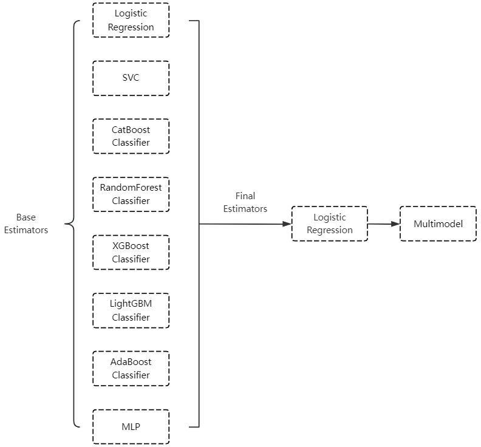

# Predicting the risk of acute kidney injury in patients with acute pancreatitis complicated by sepsis using a stacked ensemble machine learning model: a retrospective study based on the MIMIC database
使用堆叠集成机器学习模型预测急性胰腺炎并发脓毒症患者的急性肾损伤风险：基于 MIMIC 数据库的回顾性研究

## Abstract  摘要
### Objective  目的
This study developed and validated a stacked ensemble machine learning model to predict the risk of acute kidney injury in patients with acute pancreatitis complicated by sepsis.

本研究开发并验证了一种堆叠集成机器学习模型，用于预测急性胰腺炎并发脓毒症患者的急性肾损伤风险。

### Design  设计
A retrospective study based on patient data from public databases.

一项基于公共数据库患者数据的回顾性研究。

### Participants  参与者
This study analysed 1295 patients with acute pancreatitis complicated by septicaemia from the US Intensive Care Database.

本研究分析了美国重症监护数据库中1295例急性胰腺炎并发败血症患者。

### Methods  方法
From the MIMIC database, data of patients with acute pancreatitis and sepsis were obtained to construct machine learning models, which were internally and externally validated. The Boruta algorithm was used to select variables. Then, eight machine learning algorithms were used to construct prediction models for acute kidney injury (AKI) occurrence in intensive care unit (ICU) patients. A new stacked ensemble model was developed using the Stacking ensemble method. Model evaluation was performed using area under the receiver operating characteristic curve (AUC), precision-recall (PR) curve, accuracy, recall and F1 score. The Shapley additive explanation (SHAP) method was used to explain the models.

从 MIMIC 数据库中获取急性胰腺炎和脓毒症患者的数据，构建机器学习模型，并进行内部和外部验证。使用 Boruta 算法选择变量。然后，使用八种机器学习算法来构建重症监护病房（ICU）患者急性肾损伤（阿基）发生的预测模型。利用叠加系综方法建立了一个新的叠加系综模型。使用受试者工作特征曲线下面积（AUC）、精确度-召回率（PR）曲线、准确度、召回率和 F1 评分进行模型评估。采用 Shapley 加性解释（SHAP）方法对模型进行解释。

### Main outcome measures  主要观察指标
AKI in patients with acute pancreatitis complicated by sepsis.

急性胰腺炎并发脓毒症患者的阿基。

### Results  结果
The final study included 1295 patients with acute pancreatitis complicated by sepsis, among whom 893 cases (68.9%) developed acute kidney injury. We established eight base models, including Logit, SVM, CatBoost, RF, XGBoost, LightGBM, AdaBoost and MLP, as well as a stacked ensemble model called Multimodel. Among all models, Multimodel had an AUC value of 0.853 (95% CI: 0.792 to 0.896) in the internal validation dataset and 0.802 (95% CI: 0.732 to 0.861) in the external validation dataset. This model demonstrated the best predictive performance in terms of discrimination and clinical application.

最终研究纳入了 1295 例急性胰腺炎并发脓毒症患者，其中 893 例（68.9%）发生急性肾损伤。我们建立了 Logit、SVM、CatBoost、RF、XGBoost、LightGBM、AdaBoost 和 MLP 等 8 个基本模型，以及一个称为 Multimodel 的堆叠集成模型。在所有模型中，内部验证数据集中多模型的 AUC 值为 0.853（95% CI：0.792 至 0.896），外部验证数据集中为 0.802（95% CI：0.732 至 0.861）。该模型在区分和临床应用方面表现出最佳的预测性能。

### Conclusion  结论
The stack ensemble model developed by us achieved AUC values of 0.853 and 0.802 in internal and external validation cohorts respectively and also demonstrated excellent performance in other metrics. It serves as a reliable tool for predicting AKI in patients with acute pancreatitis complicated by sepsis.

我们开发的堆栈集成模型在内部和外部验证队列中分别实现了 0.853 和 0.802 的 AUC 值，并且在其他指标中也表现出出色的性能。它是预测急性胰腺炎并发脓毒症患者阿基的可靠工具。

### Keywords: 

Machine Learning, Artificial Intelligence, Pancreatic disease, Adult intensive & critical care, Acute renal failure, Retrospective Studies

关键词： 机器学习、人工智能、胰腺疾病、成人重症监护、急性肾衰竭、回顾性研究

## Strengths and limitations of this study.    本研究的优势和局限性。
- Stacking ensemble combines the predictions of multiple base models to significantly enhance overall predictive performance and generalisation ability while reducing the risk of overfitting.
- Stacking ensemble 结合了多个基础模型的预测，以显着提高整体预测性能和泛化能力，同时降低过拟合的风险。

- The Boruta algorithm exhibits greater robustness and flexibility compared with traditional variable selection methods, effectively handling high-dimensional data and non-linear relationships.
- 与传统的变量选择方法相比，Boruta 算法具有更强的鲁棒性和灵活性，能够有效地处理高维数据和非线性关系。

- The regularisation techniques and hyperparameter optimisation employed in this study can enhance model performance, reduce overfitting and improve generalisation and stability.
- 本研究中采用的正则化技术和超参数优化可以提高模型性能，减少过拟合，提高泛化能力和稳定性。

- This study employs the Shapley additive explanation (SHAP) method to interpret the predictions of the machine learning model and uses the SHAP force plot tool for visualisation, which facilitates understanding and provides information for clinical recommendations.
- 本研究采用 Shapley 加法解释（SHAP）方法来解释机器学习模型的预测，并使用 SHAP 力图工具进行可视化，这有助于理解并为临床建议提供信息。

- The limitations of this study include missing values in the original data, a small external validation cohort and the findings based on the intensive care unit limiting their applicability to general wards.
- 本研究的局限性包括原始数据中的缺失值，一个小的外部验证队列和基于重症监护室的研究结果限制了其对普通病房的适用性。

## Introduction  介绍
Acute pancreatitis (AP) is a common acute abdomen condition characterised by acute inflammation of the pancreas and surrounding tissues, accompanied by abnormal activation and release of pancreatic enzymes, leading to tissue inflammation and necrosis. AP is a complex condition with varying degrees of severity and is a common cause of hospital admission in countries like the USA.1 About 25% of AP patients may progress to severe acute pancreatitis,2 which may involve systemic inflammatory response syndrome (SIRS) and multiple organ dysfunction syndrome. Sepsis is a life-threatening SIRS caused by dysregulated host response to infection, ultimately leading to septic shock and multiple organ failure.3 AP can lead to sepsis,4 with many patients developing AP-related infections in the later stages and severe cases progressing to sepsis.5 6 Studies have shown that the development of sepsis from AP can worsen the condition and increase the risk of mortality.7

急性胰腺炎（AP）是一种常见的急腹症，其特征在于胰腺和周围组织的急性炎症，伴随着胰腺酶的异常激活和释放，导致组织炎症和坏死。AP 是一种严重程度不同的复杂疾病，是美国等国家住院的常见原因。 1 约 25%的 AP 患者可能进展为重症急性胰腺炎， 2 可能涉及全身炎症反应综合征（SIRS）和多器官功能障碍综合征。脓毒症是由宿主对感染的反应失调引起的危及生命的 SIRS，最终导致脓毒性休克和多器官衰竭。 3 AP 可导致脓毒症， 4 许多患者在后期发生 AP 相关感染，严重病例进展为脓毒症。 5 6 研究表明，AP 引起的脓毒症会使病情恶化，并增加死亡风险。 7

In some patients, acute pancreatitis can lead to acute kidney injury (AKI), possibly due to systemic inflammatory response with increased vascular permeability.8 AKI is a common syndrome in intensive care units, characterised by elevated serum creatinine and decreased urine output.9 Several studies have shown a significant increase in mortality rates among AP patients with AKI.10 11 Sepsis-related AKI is also a common condition among critically ill patients, with high incidence and mortality rates.12,14 Therefore, early identification and risk assessment of AKI in patients with acute pancreatitis complicated by sepsis are clinically significant for preventing patient losses and deaths.

在某些患者中，急性胰腺炎可导致急性肾损伤（阿基），这可能是由于全身炎症反应伴血管通透性增加所致。 8 阿基是重症监护病房的常见综合征，其特征为血清肌酐升高和尿量减少。 9 几项研究表明，阿基 AP 患者的死亡率显著增加。 10 11 脓毒症相关阿基也是危重患者中的常见疾病，具有高发病率和死亡率。 12 、 14 因此，急性胰腺炎并发脓毒症患者阿基的早期识别和风险评估对于预防患者损失和死亡具有临床意义。

Research has explored the influencing factors of AKI in patients with AP and constructed a predictive model. However, there are issues such as small sample size and insufficient model accuracy.15,17 Predicting AKI in septic patients has also been a hot topic in medical research. Some predictive models based on traditional methods, such as logistic regression and Cox proportional hazards model, have been used to predict the development of AKI in septic patients. Fan et al18 applied logistic regression to construct a predictive model of AKI in 15 726 septic patients, which showed good predictive accuracy. However, the relationship between variables, including linear or non-linear relationships, involves linear regression’s (LR) default handling of linear relationships between independent and dependent variables, which may overly simplify complex non-linear relationships. In addition, LR is susceptible to multicollinearity among variables, which may reduce the model’s performance.19

研究探索了 AP 患者阿基的影响因素，并构建了预测模型。但也存在样本量小、模型精度不够等问题。 15 ， 17 预测脓毒症患者的阿基也一直是医学研究的热门话题。传统的预测模型如 Logistic 回归和考克斯比例风险模型等已被用于脓毒症患者阿基的预测。Fan 等人 18 应用逻辑回归构建了 15726 例脓毒症患者的阿基预测模型，该模型显示出良好的预测准确性。然而，变量之间的关系，包括线性或非线性关系，涉及线性回归（LR）对自变量和因变量之间的线性关系的默认处理，这可能过度简化复杂的非线性关系。 此外，LR 易受变量之间多重共线性的影响，这可能会降低模型的性能。 19

In recent years, machine learning (ML) has attracted widespread attention from clinical physicians. Machine learning is a branch of artificial intelligence that involves computer simulations or implementations of human learning behaviours. It enables computers to learn from data and improve performance based on their experiences. Machine learning algorithms continuously train to discover patterns and correlations from large databases, then make optimal decisions and predictions based on the data analysis results. Its applications are extensive and commonly used in various fields of medical research,20 such as disease diagnosis, personalised treatment and patient risk prediction. Machine learning algorithms often outperform traditional LR or Cox regression analyses,21 22 as shown in studies like that of Chiofolo et al,23 who used the random forest algorithm to establish a predictive model for AKI in critically ill patients, achieving good early identification of high-risk patients. Yue et al19 employed machine learning algorithms to construct seven models for predicting the development of AKI in septic patients, aiming to identify the model with the best predictive performance. Currently, risk prediction models for AKI in acute pancreatitis and sepsis are based on fundamental machine learning algorithms such as logistic regression and random forest.24 However, more powerful algorithms like stacked ensemble machine learning (SIML) have not been extensively explored yet.

近年来，机器学习（ML）引起了临床医生的广泛关注。机器学习是人工智能的一个分支，涉及计算机模拟或人类学习行为的实现。它使计算机能够从数据中学习，并根据其经验提高性能。机器学习算法不断训练，从大型数据库中发现模式和相关性，然后根据数据分析结果做出最佳决策和预测。它的应用广泛，通常用于医学研究的各个领域，例如疾病诊断，个性化治疗和患者风险预测。 机器学习算法通常优于传统的 LR 或考克斯回归分析，如 Chiofolo 等人的研究 21 22 所示， 23 他们使用随机森林算法建立了危重患者阿基的预测模型，实现了对高风险患者的良好早期识别。Yue 等 19 采用机器学习算法构建了 7 个模型，用于预测脓毒症患者的阿基发展，旨在确定具有最佳预测性能的模型。目前，急性胰腺炎和脓毒症中阿基的风险预测模型基于基本的机器学习算法，如逻辑回归和随机森林。#4 然而，更强大的算法，如堆叠集成机器学习（SIML）尚未被广泛探索。

We noticed a research gap in predicting AKI in patients with AP combined with sepsis. AP patients often develop sepsis in the intensive care unit (ICU), resulting in higher mortality rates. However, early and accurate diagnosis of AKI in AP patients with sepsis remains challenging. Therefore, this study used a large database to develop and validate a superior performing stacked ensemble machine learning predictive model. The aim was to predict the occurrence of AKI during ICU hospitalisation in patients with AP complicated by sepsis, using key risk factors determined through feature selection. This model can assist clinicians in assessing the risk of acute kidney injury in patients and implementing appropriate interventions and treatment measures, thus, achieving early intervention and treatment goals.

我们注意到在预测 AP 合并脓毒症患者的阿基方面存在研究空白。AP 患者经常在重症监护室（ICU）发生败血症，导致更高的死亡率。然而，早期和准确诊断 AP 脓毒症患者的阿基仍然具有挑战性。因此，本研究使用大型数据库来开发和验证性能上级的堆叠集成机器学习预测模型。目的是使用通过特征选择确定的关键风险因素，预测 AP 并发脓毒症患者在 ICU 住院期间阿基的发生。该模型可以帮助临床医生评估患者急性肾损伤的风险，并实施适当的干预和治疗措施，从而实现早期干预和治疗目标。

## Method  方法
### Data source  数据源
The research data originates from the MIMIC database, and this study is a retrospective cohort study. The MIMIC database is an open database system based on a large biomedical dataset, primarily used to simulate patient conditions in the ICU. (dataset)MIMIC-III25 collected data from 53 423 adult patients admitted to the ICU at Beth Israel Deaconess Medical Centre (BIDMC) from June 2001 to October 2012, as well as data from 7870 neonatal intensive care patients admitted from 2001 to 2008. The (dataset)MIMIC-IV database,26 an improvement over MIMIC-III, gathered clinical data from over 190 000 patients and 450 000 hospitalisations at BIDMC from 2008 to 2019. The database records detailed information such as patients’ demographic data, laboratory tests, medication records, vital signs, surgical procedures, disease diagnoses, medication management, follow-up survival status and more. We used patient data from the MIMIC-IV database for model development and internal validation, followed by external validation using patient data from the MIMIC-III database. All patient information in the database has undergone de-identification processing, eliminating the need for individual patient consent or ethical review board approval.

研究数据来源于 MIMIC 数据库，本研究为回顾性队列研究。MIMIC 数据库是一个基于大型生物医学数据集的开放式数据库系统，主要用于模拟 ICU 中的患者状况。MIMIC-III 25 收集了 2001 年 6 月至 2012 年 10 月在 Beth Israel Deaconess Medical Centre（BIDMC）入住 ICU 的 53423 名成人患者的数据，以及 2001 年至 2008 年入住的 7870 名新生儿重症监护患者的数据。（数据集）MIMIC-IV 数据库， 26 是对 MIMIC-III 的改进，收集了 2008 年至 2019 年 BIDMC 超过 19 万例患者和 45 万例住院患者的临床数据。该数据库记录了患者的人口统计数据、实验室检查、用药记录、生命体征、手术程序、疾病诊断、药物管理、随访生存状态等详细信息。 我们使用来自 MIMIC-IV 数据库的患者数据进行模型开发和内部验证，然后使用来自 MIMIC-III 数据库的患者数据进行外部验证。数据库中的所有患者信息都经过了去身份化处理，无需获得个体患者同意或伦理审查委员会批准。

### Study population  研究人群
We first extracted data from the MIMIC database for all patients diagnosed with acute pancreatitis. Subsequently, we further screened this data to select patients who met the diagnostic criteria for sepsis, which served as the target population for the subsequent study.

我们首先从 MIMIC 数据库中提取了所有诊断为急性胰腺炎的患者的数据。随后，我们进一步筛选这些数据，以选择符合脓毒症诊断标准的患者，作为后续研究的目标人群。

Our study aimed to assess the occurrence of AKI within 7 days of ICU admission in patients with AP combined with sepsis. According to the Third International Consensus Definitions for Sepsis and Septic Shock (Sepsis-3), sepsis patients were screened based on the presence of documented or suspected infection and a Sequential Organ Failure Assessment (SOFA) score greater than 2. The SOFA score (Sequential Organ Failure Assessment score) is a clinical scoring system designed to assess the degree of multiple organ dysfunction in critically ill patients. The SOFA score is based on the functional status of six major organ systems: respiratory, circulatory, hepatic, neurological, renal and haematological systems, with each system assigned a score corresponding to its functional state. Specifically, the scoring ranges from 0 to 4, where 0 indicates no dysfunction and 4 signifies the most severe organ dysfunction. The total SOFA score can be used to evaluate the overall condition of the patient. A total score greater than 2 is generally considered to indicate an increased risk of organ dysfunction, with higher scores correlating with a greater likelihood of poor prognosis.

我们的研究旨在评估 AP 合并脓毒症患者入住 ICU 后 7 天内阿基的发生率。根据脓毒症和脓毒性休克的第三次国际共识定义（脓毒症-3），根据记录或疑似感染的存在和序贯器官衰竭评估（SOFA）评分大于 2 筛选脓毒症患者。SOFA 评分（序贯器官衰竭评估评分）是一种临床评分系统，旨在评估危重患者的多器官功能障碍程度。SOFA 评分基于六个主要器官系统的功能状态：呼吸系统、循环系统、肝脏、神经系统、肾脏和血液系统，每个系统都有一个对应于其功能状态的评分。具体而言，评分范围为 0 至 4，其中 0 表示无功能障碍，4 表示最严重的器官功能障碍。 总 SOFA 评分可用于评估患者的总体状况。总评分大于 2 通常被认为表明器官功能障碍的风险增加，评分越高，预后不良的可能性越大。

According to the Kidney Disease: Improving Global Outcomes (KDIGO) classification system for kidney diseases, AKI was diagnosed if there was an increase in serum creatinine (Scr) of more than 0.3 mg/dL within 48 hours, an increase of ≥1.5 times baseline within 7 days or urine output less than 0.5 mL/kg/h for more than 6 hours. The first Scr value on admission was used as the baseline Scr, and AKI was evaluated based on the worst serum creatinine and urine output within 72 hours of suspected sepsis diagnosis and ICU admission. We excluded patients who were under 18 years old, had a SOFA score less than 2, were admitted to the ICU for less than 24 hours, already had AKI on ICU admission or had a history of renal failure. The flowchart is depicted in figure 1.

根据肾脏疾病：改善全球结局（KDIGO）肾脏疾病分类系统，如果 48 小时内血清肌酐（Scr）升高超过 0.3 mg/dL，7 天内升高≥1.5 倍基线或尿量低于 0.5 mL/kg/h 持续 6 小时以上，则诊断为阿基。以入院时的第一个 Scr 值作为基线 Scr，根据疑似脓毒症诊断和 ICU 入院后 72 小时内的最差血肌酐和尿量评估阿基。我们排除了 18 岁以下、SOFA 评分小于 2、入住 ICU 时间小于 24 小时、入住 ICU 时已患有阿基或有肾衰竭病史的患者。流程图如 figure 1 所示。

> Figure 1. Research workflow diagram.
> 图1.研究工作流程图。

### Data extraction  数据提取
This study extracted rich variables from multiple aspects, including (1) demographic information: age, gender, race, weight, height and comorbidities such as cerebrovascular disease, diabetes and chronic lung disease; (2) vital signs: including heart rate, respiratory rate, systolic blood pressure, diastolic blood pressure, partial pressure of carbon dioxide, partial pressure of oxygen and oxygen saturation; and (3) laboratory test indicators (including maximum and minimum values): albumin, anion gap, lymphocytes, neutrophils, monocytes, bicarbonate, bilirubin, serum calcium, serum chloride, serum potassium, serum sodium, serum creatinine, haematocrit, haemoglobin, lactate dehydrogenase, serum magnesium, mean corpuscular haemoglobin concentration, pH value, platelets, prothrombin time, activated partial thromboplastin time, blood urea nitrogen, white blood cells, red blood cells, glucose, lactate, Glasgow Coma Scale score and urine output. Additionally, factors such as whether vasopressors were used, whether continuous renal replacement therapy was received, whether invasive mechanical ventilation was used and whether antibiotics were used were also considered. The comprehensive consideration of these variables provides robust data support for the study, aiding in a more accurate assessment of the risk factors for AKI in patients with AP complicated by sepsis.

本研究从多个方面提取了丰富的变量，包括（1）人口统计学信息：年龄、性别、人种、体重、身高和合并症，如脑血管疾病、糖尿病和慢性肺部疾病;（2）生命体征：包括心率、呼吸频率、收缩压、舒张压、二氧化碳分压、氧分压和血氧饱和度;实验室检测指标（包括最大值和最小值）：白蛋白、阴离子间隙、淋巴细胞、嗜中性粒细胞、单核细胞、碳酸氢盐、胆红素、血清钙、血清氯、血清钾、血清钠、血清肌酐、血细胞比容、血红蛋白、乳酸脱氢酶、血清镁、平均红细胞血红蛋白浓度、pH 值、血小板、凝血酶原时间、活化部分凝血活酶时间、血尿素氮、白色血细胞、红细胞、葡萄糖、乳酸、格拉斯哥昏迷评分和尿量。 此外，还考虑了是否使用血管加压药、是否接受连续性肾脏替代治疗、是否使用有创机械通气和是否使用抗生素等因素。对这些变量的综合考虑为研究提供了强大的数据支持，有助于更准确地评估 AP 并发脓毒症患者的阿基风险因素。

To reduce the bias caused by missing data, we used the missingno module in Python 3.10 software to filter out missing data. In figure 2, each column represents a clinical variable, with white lines indicating missing data. The more white lines in a column, the more missing values for that variable. We excluded variables with a missing rate exceeding 30%, such as height and serum albumin levels, to ensure the accuracy of the study and models. The remaining variables’ missing values were imputed using the mice package in Python software for multiple imputation (MI). Multiple imputation is an effective statistical method that allows for reasonable estimation of missing data while preserving the structure and characteristics of the dataset. We performed subsequent analyses based on the multiple imputed datasets generated, thereby, reducing bias associated with missing values and enhancing the robustness and credibility of the results. Vital signs and relevant laboratory parameters were characterised using maximum and minimum values, treated as independent features and included in the study.

为了减少缺失数据造成的偏差，我们使用 Python 3.10 软件中的 missingno 模块来过滤掉缺失的数据。在 figure 2 中，每列代表一个临床变量，白色线表示缺失数据。列中的白色行越多，该变量的缺失值就越多。我们排除了缺失率超过 30%的变量，如身高和血清白蛋白水平，以确保研究和模型的准确性。使用 Python 软件中的 mice 包对其余变量的缺失值进行多重插补（MI）。多重插补是一种有效的统计方法，它允许合理估计缺失数据，同时保留数据集的结构和特征。我们基于生成的多个插补数据集进行了后续分析，从而减少了与缺失值相关的偏倚，并增强了结果的稳健性和可信度。 使用最大值和最小值表征生命体征和相关实验室参数，将其作为独立特征处理并纳入研究。

> Figure 2. Missing data distribution plot. (Each column represents a clinical variable, with white lines indicating missing data. The more white lines in a column, the more missing values for that variable.).
> 图 2.缺失数据分布图。(Each 列表示临床变量，白色线表示缺失数据。列中的白色行越多，该变量的缺失值就越多）。

### Statistical analysis  统计分析
This study used R (version 4.3.2) statistical software for data analysis. For continuous variables following a normal distribution, the mean and SD were used for representation, while for non-normally distributed variables, the median and quartiles were used. Categorical variables were represented using percentages. In inter-group comparisons, paired t-tests or Mann-Whitney U tests were employed for continuous variables, while χ² tests or Fisher’s exact tests were used for categorical variables.

本研究采用 R（版本 4.3.2）统计软件进行数据分析。对于遵循正态分布的连续变量，使用平均值和 SD 表示，而对于非正态分布变量，使用中位数和四分位数表示。分类变量用百分比表示。在组间比较中，连续变量采用配对 t 检验或 Mann-Whitney U 检验，分类变量采用χ 2 检验或 Fisher 精确检验。

The variable selection stage employed the Boruta algorithm. This algorithm operates by randomly sampling the original features and generating random features to construct a random forest model. Using the random forest algorithm, it computes the importance score (z-value) for each original feature and generates a set of ‘shadow’ features combined with the original ones. Subsequently, it calculates the importance score for the combined features and identifies important features by comparing the z-values of the original and ‘shadow’ features. Through recursively removing non-important features and recalculating the importance scores of the new feature sets until all features are classified as important or non-important. Finally, variables with a p value <0.05 are selected as inputs for subsequent analysis.

变量选择阶段采用 Boruta 算法。该算法通过对原始特征进行随机抽样并生成随机特征来构建随机森林模型。使用随机森林算法，它计算每个原始特征的重要性得分（z 值），并生成一组与原始特征相结合的“阴影”特征。随后，它计算组合特征的重要性分数，并通过比较原始特征和“阴影”特征的 z 值来识别重要特征。通过递归地去除不重要的特征并重新计算新特征集的重要性分数，直到所有特征被分类为重要或不重要。最后，选择 p 值为<0.05 的变量作为后续分析的输入。

> Table 1. Comparison of patient baseline data.
> 表1.患者基线数据比较。

### Feature selection  特征选择
We excluded several variables from the original data, such as alkaline phosphatase, alanine aminotransferase and aspartate aminotransferase, due to the presence of high collinearity issues in the assessment of liver function. The results of feature selection based on the Boruta algorithm are shown in figure 3. We employed the following parameter settings: first, we specified the model formula in the form of ‘status ~ .’ where ‘status’ refers to the outcome event to extract all variables from the data and treat them as independent variables. To ensure significance, we set the p value threshold at 0.05 and enabled multiple comparison adjustments (mcAdj=TRUE) to reduce the type I error rate using the Bonferroni method. Furthermore, we established the maximum number of iterations at 500 (maxRuns=500) to enhance the stability and accuracy of feature selection, while setting the detailed output during runtime to 0 (doTrace=0) to keep the results concise. To preserve the importance history for each iteration, we set the holdHistory parameter to TRUE, allowing us to analyse the variability of variable importance across different iterations. Lastly, to compute feature importance, we used the getImpRfZ function, which provides an effective assessment of feature importance by running a random forest model and collecting the Z scores of average accuracy decreases. The entire process was conducted using RStudio software.

由于肝功能评估中存在高度共线性问题，我们从原始数据中排除了几个变量，如碱性磷酸酶、丙氨酸转氨酶和天冬氨酸转氨酶。基于 Boruta 算法的特征选择结果如 figure 3 所示。我们采用了以下参数设置：首先，我们以“status ~”的形式指定模型公式。其中“状态”是指从数据中提取所有变量并将其视为自变量的结果事件。为了确保显著性，我们将 p 值阈值设置为 0.05，并启用多次比较调整（mcAdj=TRUE），以使用 Bonferroni 方法降低 I 类错误率。此外，我们将最大迭代次数设置为 500（maxTrace =500），以增强特征选择的稳定性和准确性，同时将运行时的详细输出设置为 0（doTrace=0），以保持结果简洁。 为了保留每次迭代的重要性历史，我们将 holdHistory 参数设置为 TRUE，允许我们分析变量重要性在不同迭代中的变化。最后，为了计算特征重要性，我们使用了 getImpRfZ 函数，该函数通过运行随机森林模型并收集平均准确度下降的 Z 得分来提供特征重要性的有效评估。整个过程使用 RStudio 软件进行。

> Figure 3. Feature election ased on Boruta lgorithm. (The x-axis represents the names of each variable, while the y-axis represents the z-values of each variable. Green boxes denote important variables selected by the algorithm, yellow boxes represent tentative variables and red boxes indicate unimportant variables. BUN, blood urea nitrogen; DBP, diastolic blood pressure; GCS, Glasgow Coma Scale; HR, heart rate; INR, International Normalised Ratio of Coagulation Function; PT, prothrombin time; PTT, partial thromboplastin time; RRespiratory ate; SBP).sba, rr, systolic blood pressure.
> 图 3.基于 Boruta ltxm 的特征选择。(The x 轴表示每个变量的名称，而 y 轴表示每个变量的 z 值。绿色框表示算法选择的重要变量，黄色框表示试验性变量，红色框表示不重要的变量。BUN，血尿素氮; DBP，舒张压; GCS、格拉斯哥昏迷评分; HR，心率; INR，凝血功能国际标准化比值; PT，凝血酶原时间; PTT，部分凝血活酶时间; R 呼吸速率; SBP）。sba，rr，收缩压。

The 19 variables most closely associated with AKI are weight, GCS (Glasgow Coma Scale), urine output, vasopressin, mechanical ventilation, antibiotics, minimum systolic blood pressure (SBP), minimum and maximum white blood cell count (WBC), minimum and maximum blood urea nitrogen (BUN), minimum and maximum serum creatinine, minimum and maximum neutrophils count, minimum and maximum prothrombin time (PT) and minimum and maximum partial thromboplastin time (PTT).

与阿基最密切相关的 19 个变量是体重、GCS（格拉斯哥昏迷量表）、尿量、加压素、机械通气、抗生素、最低收缩压（SBP）、最低和最高白色血细胞计数（WBC）、最低和最高血尿素氮（BUN）、最低和最高血清肌酐、最低和最高中性粒细胞计数，最小和最大凝血酶原时间（PT）和最小和最大部分凝血活酶时间（PTT）。

### Model development  模型开发
After completing feature selection, the machine learning predictive model was developed using Python (3.10).

完成特征选择后，使用 Python（3.10）开发机器学习预测模型。

The AKI screening data from the MIMIC-IV database was randomly allocated to training and testing datasets in a 7:3 ratio. The training dataset was used for algorithm development, while the testing dataset was employed to evaluate algorithm performance. Initially, eight machine learning models were constructed, including logistic regression, support vector machine, CatBoost, random forest, XGBoost, LightGBM, AdaBoost and MLP (multilayer perceptron). To optimise the overall model performance, we implemented feature selection during the modelling process to reduce model complexity and enhance generalisation capability. Additionally, we introduced some regularisation methods such as L1 and L2 to address overfitting issues. In online supplemental file 1, we describe in detail how to use regularisation techniques when building machine learning models. In online supplemental file 2, we present the parameters used in the construction of each model, along with detailed explanations.

来自 MIMIC-IV 数据库的阿基筛查数据以 7：3 的比例随机分配到训练和测试数据集。训练数据集用于算法开发，而测试数据集用于评估算法性能。最初，构建了八个机器学习模型，包括逻辑回归，支持向量机，CatBoost，随机森林，XGBoost，LightGBM，AdaBoost 和 MLP（多层感知器）。为了优化整体模型性能，我们在建模过程中实施了特征选择，以降低模型复杂性并增强泛化能力。此外，我们引入了一些正则化方法，如 L1 和 L2，以解决过拟合问题。在 online supplemental file 1 中，我们详细描述了如何在构建机器学习模型时使用正则化技术。在 online supplemental file 2 中，我们介绍了每个模型构建中使用的参数，沿着详细说明。

Based on these models, a Stacking ensemble model named ‘Multimodel’ was built. Hyperparameter tuning was conducted using GridSearchCV, wherein a parameter space was defined for each model, allowing for training with various parameter combinations to select the optimal hyperparameter set. Stratified K-Fold cross-validation was employed to ensure that the class distribution remained consistent across each training and testing split; all models in this study used 10-fold cross-validation. The models were ultimately trained by inputting the training data along with the parameter space to identify the model with the best performance.

在此基础上，建立了一个堆叠集成模型 Multimodel。使用 GridSearchCV 进行超参数调整，其中为每个模型定义参数空间，允许使用各种参数组合进行训练以选择最佳超参数集。采用分层 K-Fold 交叉验证以确保类分布在每个训练和测试分割中保持一致;本研究中的所有模型都使用 10 倍交叉验证。最终通过输入训练数据和参数空间来训练模型，以识别具有最佳性能的模型。沿着参数空间。

We implemented the model fusion process (Ensemble Learning) using a Stacking Classifier. First, we created a list of model names, ‘model_names’, and used joblib to load the eight previously trained models via the load function. We then defined a collection of base models, ‘estimators’, composed of the loaded models, each associated with its respective name. The base models included logistic regression (Logit), support vector machine (SVM), classification tree (Cat), random forest (RF), XGBoost, LightGBM, AdaBoost and multilayer perceptron (MLP). During the construction of the ensemble model, iterative computations revealed that using logistic regression as the meta-learner yielded the best results, Therefore, logistic regression (LogisticRegression) was used as the final model (final_estimator). By calling the fit method, the training data (x_train) and the corresponding labels (y_train) were input into the stacking classifier (clf). The stacking classifier automatically trains the base models internally and uses their predicted results as new features for the final model to make the ultimate predictions. This process enhances classification performance through the method of model fusion. By leveraging the strengths of multiple base classifiers, the stacking classifier integrates the outputs of these models, thereby, improving the overall accuracy and robustness of the predictions. In this process, labels such as ‘model_names’, ‘estimators’, ‘x_train’ and ‘y_train’ are defined by us and can be modified as needed. Figure 4 illustrates the algorithmic composition of the stacked ensemble model (‘Multimodel’). In online supplemental file 3, we demonstrates the performance of the ensemble model when using different base models as meta-learners.

我们使用堆叠分类器实现了模型融合过程（Entrance Learning）。首先，我们创建了一个模型名称列表“model_names”，并使用 joblib 通过 load 函数加载之前训练的八个模型。然后，我们定义了一个基本模型的集合，“估计器”，由加载的模型组成，每个模型都与其各自的名称相关联。基本模型包括逻辑回归（Logit）、支持向量机（SVM）、分类树（Cat）、随机森林（RF）、XGBoost、LightGBM、AdaBoost 和多层感知器（MLP）。在集成模型的构建过程中，迭代计算表明，使用逻辑回归作为元学习者会产生最好的结果，因此，逻辑回归（LogisticRegression）被用作最终模型（final_estimator）。通过调用 fit 方法，将训练数据（x_train）和相应的标签（y_train）输入到堆叠分类器（clf）中。 堆叠分类器在内部自动训练基本模型，并将其预测结果用作最终模型的新特征，以进行最终预测。该过程通过模型融合的方法提高了分类性能。通过利用多个基本分类器的优势，堆叠分类器集成了这些模型的输出，从而提高了预测的整体准确性和鲁棒性。在这个过程中，诸如“model_names”、"estimators“、”x_train“和”y_train“等标签由我们定义，并且可以根据需要进行修改。 Figure 4 说明了堆叠集成模型（“多模型”）的算法组成。在 online supplemental file 3 中，我们演示了使用不同的基本模型作为元学习器时集成模型的性能。

> Figure 4. Composition of stacked ensemble model algorithm.
> 图4.层叠集成模型算法的组成。

### Model validation  模型验证
To validate the generalisation and predictive ability of the stacked ensemble model we constructed on other datasets, we first conducted internal validation using 30% of the testing dataset from the MIMIC-IV database. Subsequently, we treated MIMIC-III as an independent database and used its data for external validation of the model. During the external validation process, we applied the model to patient data from the MIMIC-III database and assessed its performance and generalisation ability. By combining internal and external validation, we were able to comprehensively evaluate the performance of the constructed stacked ensemble model on different datasets, providing reliable support and guidance for further clinical applications.

为了验证我们在其他数据集上构建的堆叠集成模型的泛化和预测能力，我们首先使用 MIMIC-IV 数据库中 30%的测试数据集进行内部验证。随后，我们将 MIMIC-III 视为独立的数据库，并使用其数据对模型进行外部验证。在外部验证过程中，我们将该模型应用于 MIMIC-III 数据库中的患者数据，并评估其性能和泛化能力。通过结合内部和外部验证，我们能够全面评估构建的堆叠集成模型在不同数据集上的性能，为进一步的临床应用提供可靠的支持和指导。

### Performance comparison of the model on the internal validation set    模型在内部验证集上的性能比较
We developed nine machine learning models to predict the development of AKI in patients. Figure 5 displays the discriminative performance of these nine models on the ROC curve. The ROC curve, also known as the receiver operating characteristic curve, is a comprehensive indicator reflecting the sensitivity (true positive rate) and specificity (true negative rate) of continuous variables. It describes the classifier’s performance changes at different thresholds. The closer the curve is to the upper-left corner, the better the classifier’s performance. In practical scenarios, due to sample imbalance, the curve may lean towards a certain class. In such cases, the area under the curve (AUC) is used to evaluate the classifier’s performance. AUC closer to 1 indicates better classifier performance. In addition, we evaluated and compared the model’s performance using metrics such as precision, accuracy, recall and F1 score.

我们开发了九种机器学习模型来预测患者阿基的发展。 Figure 5 显示了这九个模型在 ROC 曲线上的判别性能。ROC 曲线又称受试者工作特征曲线，是反映连续变量敏感性（真阳性率）和特异性（真阴性率）的综合指标。它描述了分类器在不同阈值下的性能变化。曲线越接近左上角，分类器的性能就越好。在实际场景中，由于样本不平衡，曲线可能会向某个类别倾斜。在这种情况下，曲线下面积（AUC）用于评估分类器的性能。AUC 接近 1 表示更好的分类器性能。此外，我们使用精确度，准确度，召回率和 F1 得分等指标评估和比较了模型的性能。

> Figure 5. Receiver operating characteristic curves of the nine models.
> 图5.九种模型的受试者工作特征曲线。

Among the eight base models, the Logit model (AUC=0.824, precision=0.865, recall=0.749, F1 score=0.803) demonstrated better predictive performance for AKI in AP patients with sepsis, followed by the RF model (AUC=0.822, precision=0.794, recall=0.877, F1 score=0.833), SVM model (AUC=0.821, precision=0.875, recall=0.696, F1 score=0.775), CatBoost model (AUC=0.815, precision=0.851, recall=0.766, F1 score=0.806), XGBoost model (AUC=0.813, precision=0.761, recall=0.930, F1 score=0.837), MLP model (AUC=0.812, precision=0.810, recall=0.871, F1 score=0.839), AdaBoost model (AUC=0.805, precision=0.802, recall=0.830, F1 score=0.816) and LightGBM model (AUC=0.803, precision=0.803, recall=0.813, F1 score=0.808). Using the SVM model (AUC=0.821) as a reference, both the Logit and RF models exhibited superior predictive abilities for AKI in AP patients with sepsis, while the abilities of the CatBoost, XGBoost, MLP, AdaBoost and LightGBM models were inferior to the SVM model. The performance of the ensemble model (Multimodel) surpassed that of any single base learner, with an AUC value as high as 0.853 (0.792–0.896), indicating stronger predictive capability. Table 2 provides detailed performance metrics for the nine models.

在八个基本模型中，Logit 模型（AUC=0.824，精确度=0.865，召回率=0.749，F1 评分=0.803）证明了对脓毒症 AP 患者阿基的更好预测性能，其次是 RF 模型（AUC=0.822，精确度=0.794，召回率=0.877，F1 得分=0.833），SVM 模型（AUC=0.821，精确度=0.875，召回率=0.696，F1 评分=0.775），CatBoost 模型（AUC=0.815，精确度=0.851，召回率=0.766，F1 得分=0.806），XGBoost 模型（AUC=0.813，精确度=0.761，召回率=0.930，F1 得分=0.837），MLP 模型（AUC=0.812，精确度=0.810，召回率=0.871，F1 得分=0.839），AdaBoost 模型（AUC=0.805，precision=0.802，recall=0.830，F1 score=0.816）和 LightGBM 模型（AUC=0.803，precision= 0.803，recall=0.813，F1 score=0.808）。使用 SVM 模型（AUC=0.821）作为参考，Logit 和 RF 模型均表现出对脓毒症 AP 患者阿基的上级预测能力，而 CatBoost、XGBoost、MLP、AdaBoost 和 LightGBM 模型的能力劣于 SVM 模型。 集成模型（Multimodel）的性能超过了任何单基学习器，AUC 值高达 0.853（0.792-0.896），表明具有更强的预测能力。 Table 2 提供了九种型号的详细性能指标。

> Table 2. Performance metrics of the model on the internal validation set.
> 表2.内部验证集上模型的性能度量。

> AUCarea under the curveMLPmultilayer perceptron
> AUC 曲线下面积 ML 多层感知器

The discriminative performance of the ensemble model (Multimodel) was the best, with the highest accuracy (0.798) and F1 score (0.853). From the precision-recall curve (figure 6), it can be observed that the Multimodel outperformed other models, demonstrating better classification performance and suggesting it as the optimal model with significant clinical utility.

集成模型（多模型）的判别性能最好，具有最高的准确率（0.798）和 F1 得分（0.853）。从精确度-召回率曲线（ figure 6 ）可以观察到，多模型优于其他模型，证明了更好的分类性能，并表明其是具有显著临床实用性的最佳模型。

> Figure 6. Precision-recall curve. (The relationship between precision and recall is described, where higher values indicate better classification performance of the model.).
> 图 6.精确-召回曲线。(The 描述了精确度和召回率之间的关系，其中较高的值指示模型的更好的分类性能。

### Performance comparison of the model on the external validation set    模型在外部验证集上的性能比较
Online supplemental table 1 presents detailed performance metrics for the nine models on the external validation set.

Online supplemental table 1 提供了外部验证集上九个模型的详细性能指标。

During the external validation stage, the stacked ensemble model exhibited an AUC value of 0.802 (0.732–0.861), an accuracy of 0.715 and an F1 score of 0.834.

在外部验证阶段，堆叠集成模型的 AUC 值为 0.802（0.732-0.861），准确度为 0.715，F1 评分为 0.834。

### Model Interpretability  模型可解释性
We developed a stacked ensemble model named ‘Multimodel’ comprising eight machine learning algorithms. Given the opaque black-box nature of machine learning, we employed the Kernel-SHAP method for model interpretation. The Kernel-SHAP method estimates the influence of features on prediction outcomes by computing the expected marginal contributions of feature values. It uses a kernel function to approximate Shapley values, thereby, avoiding the computational complexity of considering all possible feature subsets.

我们开发了一个名为“Multimodel”的堆叠集成模型，包括八种机器学习算法。鉴于机器学习的不透明黑盒性质，我们采用 Kernel-SHAP 方法进行模型解释。Kernel-SHAP 方法通过计算特征值的预期边际贡献来估计特征对预测结果的影响。它使用核函数来近似 Shapley 值，从而避免了考虑所有可能的特征子集的计算复杂性。

Through an analysis of feature importance based on Shapley additive explanation (SHAP) values, we demonstrated the 19 predictive factors crucial for AKI occurrence (online supplemental figure 1a) and ranked the feature importance for each variable. Additionally, via a summary plot of SHAP values (online supplemental figure 1b), we described the contributions of each predictive factor to the outcome. In this plot, SHAP values exceeding 0 indicate an increased risk of AKI occurrence, while values below 0 indicate a decreased risk.

通过基于 Shapley 加法解释（SHAP）值的特征重要性分析，我们证明了对 AKI 发生至关重要的 19 个预测因素（ online supplemental figure 1a ），并对每个变量的特征重要性进行了排名。此外，通过 SHAP 值的汇总图（ online supplemental figure 1b ），我们描述了每个预测因素对结果的贡献。在该图中，SHAP 值超过 0 表示 AKI 发生的风险增加，而值低于 0 表示风险降低。

The SHAP force plot visualises the model predictions as the results of feature contributions. By demonstrating how the stacked ensemble model generates predictions for four representative individuals, the model provides clinicians and patients with intuitive guidance, enhancing their understanding of how the model makes specific predictions.

SHAP 力图将模型预测可视化为特征贡献的结果。通过演示堆叠集成模型如何为四个代表性个体生成预测，该模型为临床医生和患者提供了直观的指导，增强了他们对模型如何进行特定预测的理解。

In the internal validation set, we randomly selected four samples for individualised prediction of AKI. Online supplemental figure 2a,b display the SHAP force plots for two patients who experienced AKI. According to our model predictions, the first patient developed AKI during ICU stay, with a weight of 124 kg, vasopressor use during hospitalisation, a urine output of only 1546 mL, a minimum creatinine value of 55 µmol/L and a maximum white blood cell count of 22.1×109 /L, all higher than normal levels. On the other hand, the second patient who experienced AKI had a urine output of 1259 mL, a minimum PTT value of 23.6 s, a maximum creatinine value of 15 µmol/L, a minimum neutrophil count of 10.058×109 /L and a minimum white blood cell count of 9.9×109 /L, all of which increased the risk of AKI occurrence. Online supplemental figure 2c,d depict two patients who did not develop AKI. The first patient had a maximum white blood cell count of 3.8×109 /L, a minimum creatinine value of 7.0 µmol/L and a minimum neutrophil count of 4.3092×109 /L, significantly lower than the levels seen in patients who developed AKI. This patient had a urine output of 2645 mL, higher than that of patients who developed AKI, and a GCS score of 14. According to the model prediction, this patient did not develop AKI. Meanwhile, the second patient who did not develop AKI had a weight of 73 kg, a maximum white blood cell count of 6.8×109 /L, a minimum creatinine value of 6.0 µmol/L, a minimum systolic blood pressure of 111 mm Hg, a urine output of 2200 mL and a GCS score of 14. The actual outcomes were consistent with the model predictions.

在内部验证集中，我们随机选择了四个样本进行阿基的个性化预测。 Online supplemental figure 2a,b 显示了两名发生阿基的患者的 SHAP 力图。根据我们的模型预测，第一例患者在 ICU 住院期间发生阿基，体重为 124 kg，住院期间使用血管加压药，尿量仅为 1546 mL，最小肌酐值为 55 µmol/L，最大白色血细胞计数为 22.1×109/L，均高于正常水平。另一方面，发生阿基的第二例患者的尿量为 1259 mL，最小 PTT 值为 23.6 s，最大肌酐值为 15 µmol/L，最小中性粒细胞计数为 10.058×109/L，最小白色细胞计数为 9.9×109/L，所有这些均增加了阿基发生的风险。 Online supplemental figure 2c,d 描述了两名未发生阿基的患者。 第 1 例患者的最大白色血细胞计数为 3.8×109/L，最小肌酐值为 7.0 µmol/L，最小中性粒细胞计数为 4.3092×109/L，显著低于发生阿基的患者中观察到的水平。该患者的尿量为 2645 mL，高于发生阿基的患者，GCS 评分为 14。根据模型预测，该患者未发生阿基。同时，未发生阿基的第二例患者体重为 73 kg，最大白色血细胞计数为 6.8×109/L，最小肌酐值为 6.0 µmol/L，最小收缩压为 111 mm Hg，尿量为 2200 mL，GCS 评分为 14。实际结果与模型预测一致。

## Discussion  讨论
In identifying high-risk patients for AKI, the application of artificial intelligence and machine learning algorithms is somewhat limited, often built on the foundation of previous-generation models. Compared with more advanced algorithms, their accuracy tends to be relatively limited. To enhance predictive efficiency, this study proposes the use of the SIML method, which involves integrating multiple algorithms.

在识别阿基高危患者时，人工智能和机器学习算法的应用受到一定限制，通常建立在上一代模型的基础上。与更先进的算法相比，它们的精度往往相对有限。为了提高预测效率，本研究提出了使用的 SIML 方法，其中包括集成多种算法。

Integrated technology refers to the utilisation of various machine learning algorithms or models to generate an optimal predictive model. Compared with using individual base learners alone, the generated model typically exhibits better performance. Integrated technology mainly includes methods such as Bagging, Boosting and Stacking. In this study, Stacking method was chosen. Stacking technology can combine the prediction results of various models to form a more powerful meta-learning model. In this approach, the meta-learner uses predictions from different weak learners as feature inputs, learning how to best combine these input predictions to produce superior output predictions. By parallelly integrating predictions from different models, Stacking technology helps improve prediction accuracy, reduce variance, mitigate overfitting and enhance the robustness of the model.27 The process of stacking technology involves two key levels: first, training multiple independent machine learning models in the first level to obtain their respective performance scores; second, composing a meta-learner in the second level that uses the predictions of the first-level models for training to enhance overall performance. Stacking method has the characteristic of integrating multiple classifiers while ensuring excellent performance.

集成技术是指利用各种机器学习算法或模型来生成最佳预测模型。与单独使用单个基本学习器相比，生成的模型通常表现出更好的性能。集成技术主要包括装袋、增压和堆料等方法。在本研究中，选择了 Stacking 方法。堆栈技术可以将各种模型的预测结果联合收割机，形成更强大的元学习模型。在这种方法中，元学习者使用来自不同弱学习者的预测作为特征输入，学习如何最好地联合收割机组合这些输入预测以产生上级输出预测。通过对不同模型的预测进行集成，Stacking 技术有助于提高预测精度，减少方差，减轻过拟合并增强模型的鲁棒性。 27 堆叠技术的过程涉及两个关键层面：第一，在第一层面训练多个独立的机器学习模型，以获得各自的性能分数;第二，在第二层面组成一个元学习器，使用第一层面模型的预测进行训练，以增强整体性能。堆叠方法具有在保证优良性能的同时集成多个分类器的特点。

This study is based on the MIMIC database and uses the Boruta algorithm for variable selection. Subsequently, multiple machine learning algorithms are employed to construct a prediction model, and a stacked ensemble model is successfully developed. Through repeated computations and validations, our model demonstrates excellent performance in both the training and validation sets. We constructed a prediction model based on 19 key variables selected by the Boruta algorithm. In internal validation, the AUC value of this model reached 0.853, and it also performed well on other evaluation metrics. In external validation, our model achieved an AUC value of 0.802, indicating good generalisation ability and effective prediction of the risk of AKI occurrence in AP combined with Sepsis patients. These results fully demonstrate the reliability and effectiveness of our model, providing important reference value for further research and clinical practice.

本研究是基于 MIMIC 数据库，并使用 Boruta 算法进行变量选择。随后，采用多种机器学习算法来构建预测模型，并成功开发了堆叠集成模型。通过反复的计算和验证，我们的模型在训练集和验证集上都表现出了出色的性能。我们根据 Boruta 算法选择的 19 个关键变量构建了预测模型。在内部验证中，该模型的 AUC 值达到 0.853，在其他评价指标上也表现良好。在外部验证中，我们的模型达到了 0.802 的 AUC 值，表明具有良好的泛化能力，并有效预测了 AP 合并脓毒症患者发生阿基的风险。这些结果充分证明了该模型的可靠性和有效性，为进一步的研究和临床实践提供了重要的参考价值。

We use SHAP values to reveal the black box of machine learning. SHAP values28 are a technique for explaining the prediction results of machine learning models. By calculating the contribution of each feature to the model’s prediction results, SHAP values reveal the prediction process of the model. The SHAP summary plot is a visualisation used to show the contribution of each feature to the model’s prediction results. In the SHAP summary plot, the SHAP value of each feature is typically displayed, along with the direction of the feature’s impact on the prediction results (positive or negative). By observing the SHAP summary plot, one can intuitively understand the importance of each feature to the final prediction results, as well as how changes in feature values affect the prediction results. This study revealed several key variables related to the risk of AKI occurrence in patients through the SHAP summary plot. Among these, an increase in urine output is associated with a decreased risk of AKI, while an increase in body weight is associated with an increased risk of AKI. Increases in white blood cells, neutrophils, serum creatinine, blood urea nitrogen, PT and PTT values are associated with an increased risk of AKI. Additionally, a decrease in minimum systolic blood pressure is associated with an increased risk of AKI occurrence in patients. The use of vasopressors and mechanical ventilation is associated with an increased risk of AKI. Avoiding the use of antibiotics is associated with a reduced risk of AKI in patients. Higher GCS scores are associated with a decreased risk of AKI occurrence in patients.

我们使用 SHAP 值来揭示机器学习的黑匣子。SHAP 值 28 是用于解释机器学习模型的预测结果的技术。通过计算各特征对模型预测结果的贡献，SHAP 值揭示了模型的预测过程。SHAP 摘要图是一种可视化，用于显示每个特征对模型预测结果的贡献。在 SHAP 汇总图中，通常会显示每个特征的 SHAP 值，沿着显示特征对预测结果的影响方向（正或负）。通过观察 SHAP 汇总图，可以直观地了解每个特征对最终预测结果的重要性，以及特征值的变化如何影响预测结果。本研究通过 SHAP 汇总图揭示了与患者发生阿基风险相关的几个关键变量。 其中，尿量增加与阿基风险降低相关，而体重增加与阿基风险增加相关。白色血细胞、中性粒细胞、血清肌酐、血尿素氮、PT 和 PTT 值升高与阿基风险升高相关。此外，最低收缩压降低与患者发生阿基的风险增加相关。血管加压药和机械通气的使用与阿基风险增加相关。避免使用抗生素与患者阿基风险降低相关。GCS 评分越高，患者发生阿基的风险越低。

Low blood pressure is considered essential for organ perfusion; therefore, hypotension is associated with poor prognosis. Currently, most studies focus on the relationship between mean arterial pressure (MAP) and AKI. A prospective observational study29 demonstrated that patients who developed AKI had significantly lower time-adjusted MAP compared with those who did not progress to AKI (74.4 mm Hg vs 78.6 mm Hg, p<0.001). An MAP below 73 mm Hg was identified as an independent predictor of AKI progression. Low MAP may be insufficient to protect renal function, while elevated MAP is associated with improved tubular function and lower serum creatinine levels.30 An experimental study31 revealed that animals in the low MAP group had higher median plasma creatinine levels than those in the high MAP group, with AKI incidence rates of 50% and 38% respectively at 12 hours post-untreated sepsis. Almost all studies suggest that the kidneys’ autoregulatory capability is impaired under low MAP conditions, leading to inadequate renal perfusion. Furthermore, in cases of severe infection or shock, changes in microcirculation and reduced vascular reactivity may raise the autoregulatory threshold of the kidneys in response to MAP. Baek et al32 explored the optimal SBP range for patients with acute kidney injury in a retrospective study, finding a U-shaped relationship between SBP and the severity of AKI or 90-day mortality within 48 hours after AKI onset, indicating that both low and high blood pressures may have adverse effects. We propose that the kidneys are highly sensitive organs regarding blood flow perfusion, and early sepsis patients often exhibit hypotension, affecting the glomerular filtration rate. Systemic vasodilation and capillary leakage can reduce effective circulating blood volume, further exacerbating hypotension and organ perfusion deficits, thereby triggering or worsening AKI. Although these haemodynamic changes activate the renin-angiotensin system, leading to renal vasoconstriction, this constriction may be insufficient to entirely compensate for reduced blood flow in the early stages. Moreover, early decreases in systolic blood pressure may worsen the microcirculatory dysfunction caused by the systemic inflammatory response in sepsis, adversely affecting the supply of oxygen and nutrients to the kidneys, further aggravating renal injury.

低血压被认为是器官灌注所必需的;因此，低血压与不良预后相关。目前，大多数研究集中在平均动脉压（MAP）和阿基之间的关系。一项前瞻性观察性研究 29 表明，与未进展为阿基的患者相比，发生阿基的患者的时间校正 MAP 显著较低（74.4 mm Hg vs 78.6 mm Hg，p<0.001）。MAP低于73 mm Hg被确定为阿基进展的独立预测因子。低MAP可能不足以保护肾功能，而MAP升高与肾小管功能改善和血清肌酐水平降低相关。 30 一项实验研究 31 显示，低MAP组中的动物具有比高MAP组中的动物更高的中位血浆肌酐水平，在未经治疗的脓毒症后12小时，阿基发生率分别为50%和38%。 几乎所有的研究都表明，在低 MAP 条件下，肾脏的自动调节能力受损，导致肾脏灌注不足。此外，在严重感染或休克的情况下，微循环的变化和血管反应性的降低可能会提高肾脏响应 MAP 的自动调节阈值。Baek 等 32 在一项回顾性研究中探索了急性肾损伤患者的最佳 SBP 范围，发现 SBP 与阿基严重程度或阿基发作后 48 小时内 90 天死亡率之间呈 U 型关系，表明低血压和高血压都可能产生不良影响。我们认为肾脏是对血流灌注高度敏感的器官，早期脓毒症患者常表现出低血压，影响肾小球滤过率。 全身性血管舒张和毛细血管渗漏可减少有效循环血容量，进一步加重低血压和器官灌注不足，从而触发或加重阿基。虽然这些血液动力学变化激活了肾素-血管紧张素系统，导致肾血管收缩，但这种收缩可能不足以完全补偿早期阶段的血流量减少。此外，收缩压的早期降低可能会恶化脓毒症中全身炎症反应引起的微循环功能障碍，对肾脏的氧气和营养供应产生不利影响，进一步加重肾损伤。

Patients with pancreatitis complicated by sepsis often require vasopressor support, as fluid therapy alone is insufficient to correct the systemic vasodilation and endothelial dysfunction induced by sepsis.33 Additionally, septic patients typically have low urine output, and aggressive fluid resuscitation or diuretic therapy can lead to an increased risk of fluid retention. Fluid overload is associated with poorer patient outcomes; in a retrospective study, Legrand et al34 identified a correlation between new-onset or persistent AKI and elevated central venous pressure (CVP), with venous congestion induced by fluid resuscitation increasingly recognised as a contributing factor to renal injury. Norepinephrine is the first-line agent for patients with sepsis, and its increasing dosage has been linked to a higher incidence of AKI progression, potentially due to excessive vasoconstriction in regional vascular beds. Furthermore, some studies indicate that the use of diuretics may be associated with an increased risk of AKI. Loop diuretics can inhibit sodium reabsorption in the macula densa, thereby stimulating the renin-angiotensin-aldosterone system (RAAS) and leading to AKI, while some cases of AKI may stem from the combined effects of diuretics and other medications, including antibiotics, contrast agents and ACE inhibitors/ARBs.35 Thus, appropriate fluid resuscitation can correct fluid losses and improve microcirculation and tissue oxygenation.

合并脓毒症的胰腺炎患者通常需要血管加压药支持，因为单独的液体治疗不足以纠正脓毒症引起的全身血管舒张和内皮功能障碍。 33 此外，脓毒症患者通常有低尿量，积极的液体复苏或利尿治疗可导致液体潴留的风险增加。液体超负荷与较差的患者结局相关;在一项回顾性研究中，Legrand 等人 34 确定了新发或持续性阿基与中心静脉压（CVP）升高之间的相关性，液体复苏引起的静脉充血越来越被认为是肾损伤的一个促成因素。去甲肾上腺素是脓毒症患者的一线药物，其剂量增加与阿基进展的发生率较高有关，可能是由于局部血管床过度血管收缩所致。 此外，一些研究表明，使用利尿剂可能与阿基风险增加相关。袢利尿剂可抑制致密斑中的钠重吸收，从而刺激肾素-血管紧张素-醛固酮系统（RAAS）并导致阿基，而某些阿基病例可能源于利尿剂和其他药物（包括抗生素、造影剂和 ACE 抑制剂/ARB）的联合作用。 35 因此，适当的液体复苏可以纠正液体损失，改善微循环和组织氧合。

Previous studies have reported that the incidence of AKI within the first 48 hours of mechanical ventilation ranges from 15.5% to 17.1%.36 In the context of the pathophysiology of sepsis, factors associated with AKI include impaired gas exchange and severe hypoxemia. Mechanical ventilation may lead to haemodynamic changes,37 such as hypotension and fluid-responsive shock, which affect tubular perfusion and decrease glomerular filtration rate (GFR) by reducing cardiac output and stimulating hormonal and sympathetic nervous responses, ultimately resulting in AKI. Increasing evidence suggests that the pro-inflammatory effects of positive pressure ventilation (PPV) may be a contributing factor to AKI. Douillet et al38 demonstrated that mechanical ventilation can alter the expression of nucleotide and purinergic receptors in the kidneys, and inappropriate mechanical ventilation strategies can induce the production of various inflammatory cytokines (such as IL-8 and monocyte chemotactic protein), leading to apoptosis of renal epithelial cells.

既往研究报告，机械通气前 48 小时内阿基的发生率范围为 15.5%至 17.1%。 36 在脓毒症的病理生理学背景下，与阿基相关的因素包括气体交换受损和严重低氧血症。机械通气可能导致血液动力学变化， 37 如低血压和液体反应性休克，通过减少心输出量和刺激激素和交感神经反应影响肾小管灌注并降低肾小球滤过率（GFR），最终导致阿基。越来越多的证据表明，正压通气（PPV）的促炎作用可能是阿基的一个促成因素。 Douilletet et al 38 证明，机械通气可改变肾脏中核苷酸和嘌呤能受体的表达，不适当的机械通气策略可诱导各种炎性细胞因子（如 IL-8 和单核细胞趋化蛋白）的产生，导致肾上皮细胞凋亡。

Dysregulation of the immune system and the release of inflammatory factors are direct pathophysiological mechanisms underlying sepsis-related kidney injury.39 Abnormal white blood cell counts, reflecting cellular immune dysregulation, may exacerbate the risk of AKI. Our study indicated that white blood cell count is a risk factor for the occurrence of AKI in sepsis patients, consistent with previous research. Elevated white blood cell counts indicate the body’s response to infection but also signify the persistence of the inflammatory process.40 The release of inflammatory mediators may have direct toxic effects on the kidneys. When white blood cells become activated or accumulate in the microvasculature, this can further obstruct microcirculation, exacerbating renal hypoxia and damage, thereby promoting the onset of AKI.
免疫系统的失调和炎症因子的释放是脓毒症相关肾损伤的直接病理生理机制。 39 反映细胞免疫失调的异常白色血细胞计数可能加剧阿基的风险。我们的研究表明，白色血细胞计数是脓毒症患者发生阿基的风险因素，与先前的研究一致。升高的白色血细胞计数表明身体对感染的反应，但也意味着炎症过程的持续性。 40 炎症介质的释放可能对肾脏有直接的毒性作用。当白色血细胞被激活或积聚在微血管中时，这可进一步阻塞微循环，加剧肾缺氧和损伤，从而促进阿基的发作。

The use of antibiotics in sepsis patients may lead to renal toxicity, particularly with certain classes such as aminoglycosides and β-lactams. Therefore, avoiding their use can alleviate renal burden, especially in cases where renal function is already compromised due to infection. Patients who do not receive antibiotics may, to some extent, maintain their immune balance, relying on their immune response to address mild or early infections, which can help reduce systemic inflammation and decrease the risk of AKI. Furthermore, antibiotics may disrupt the gut microbiome balance, and a healthy microbiome is crucial for regulating immune responses and combating infections. Patients not receiving antibiotics typically exhibit milder infection symptoms, which may correlate with other favourable baseline characteristics and a lower risk of AKI. It is important to note that the observed association based on SHAP values from model visualisation does not necessarily imply that antibiotic use directly leads to an increase in AKI. Our conclusions primarily suggest a potential relationship between the two, rather than a direct causal link. Future research should focus on the use of specific antibiotics and their specific impact on the risk of AKI, as well as a deeper exploration of the underlying mechanisms.
败血症患者使用抗生素可能导致肾毒性，特别是某些类别的抗生素，如氨基糖苷类和β-内酰胺类。因此，避免使用它们可以减轻肾脏负担，特别是在肾功能已经因感染而受损的情况下。未接受抗生素治疗的患者可能在一定程度上保持免疫平衡，依靠免疫反应来应对轻度或早期感染，这有助于减少全身炎症并降低阿基的风险。此外，抗生素可能会破坏肠道微生物组平衡，健康的微生物组对于调节免疫反应和对抗感染至关重要。未接受抗生素治疗的患者通常表现出较轻的感染症状，这可能与其他有利的基线特征和较低的阿基风险相关。 值得注意的是，基于模型可视化的 SHAP 值观察到的相关性并不一定意味着抗生素的使用直接导致阿基的增加。我们的结论主要表明两者之间存在潜在的关系，而不是直接的因果关系。未来的研究应关注特定抗生素的使用及其对阿基风险的具体影响，以及对潜在机制的更深入探索。

In summary, weight gain is associated with an increased risk of AKI, therefore, clinicians should develop personalised fluid management plans based on individual patient characteristics. In particular, for obese patients, careful assessment of fluid intake and medication dosages is necessary to avoid excessive fluid overload and the subsequent risk of AKI. Physicians should regularly monitor blood pressure in septic patients and, if necessary, take timely measures for fluid resuscitation and the use of vasoactive medications to ensure adequate renal perfusion. When using diuretics, it is essential to carefully evaluate their necessity, especially in patients with insufficient fluid load, and prioritise alternative management strategies to avoid impacting renal function. Given that fluid overload is associated with poor outcomes in AKI, fluid therapy should involve individualised management, with regular assessments of the patient’s fluid status. In particular, after large-volume fluid resuscitation, ongoing monitoring of central venous pressure (CVP) and urine output is crucial for the timely detection and correction of fluid overload. If mechanical ventilation is required, attention should be paid to the choice of ventilation strategy to optimise ventilation modes and minimise potential adverse effects on the kidneys while enhancing haemodynamic management. Additionally, monitoring of the inflammatory status in septic patients should be strengthened to promptly identify bacterial infections and inflammatory responses and to develop effective anti-inflammatory strategies. Given the association between AKI and coagulopathy, enhanced monitoring of coagulation function is needed, along with heightened vigilance regarding the risk of bleeding.
总之，体重增加与阿基风险增加相关，因此，临床医生应根据个体患者的特征制定个性化的液体管理计划。特别是对于肥胖患者，需要仔细评估液体摄入量和药物剂量，以避免过度液体过载和随后的阿基风险。医生应定期监测脓毒症患者的血压，必要时及时采取液体复苏措施和使用血管活性药物，以确保足够的肾脏灌注。使用利尿剂时，必须仔细评估其必要性，特别是在液体负荷不足的患者中，并优先考虑替代管理策略，以避免影响肾功能。鉴于液体超负荷与阿基的不良结局相关，液体治疗应涉及个体化管理，定期评估患者的液体状态。 特别是在大量液体复苏后，持续监测中心静脉压（CVP）和尿量对于及时发现和纠正液体超负荷至关重要。如果需要机械通气，应注意通气策略的选择，以优化通气模式，最大限度地减少对肾脏的潜在不良影响，同时加强血液动力学管理。此外，应加强对脓毒症患者炎症状态的监测，以及时发现细菌感染和炎症反应，并制定有效的抗炎策略。考虑到阿基和凝血功能障碍之间的相关性，需要加强凝血功能监测，沿着提高对出血风险的警惕。

Our model successfully predicted whether patients would experience AKI during their ICU stay. This study provides strong support for identifying the likelihood of AKI occurrence in AP patients with concomitant Sepsis, aiding in better prevention and management of such complications in clinical practice.
我们的模型成功预测了患者在 ICU 期间是否会发生阿基。本研究为确定伴脓毒症的 AP 患者发生阿基的可能性提供了有力支持，有助于在临床实践中更好地预防和管理此类并发症。

In this study, there are several noteworthy limitations. (1) Given the use of a large public database with many missing values in patient medical records, the performance of our model largely depends on the accuracy of data recording, which may introduce some degree of bias. (2) While feature selection was performed during model construction to reduce complexity and improve generalisation, and L1 and L2 regularisation methods were introduced to prevent overfitting, in the external validation cohort, although the AUC value of the ensemble model was relatively high, it did not reach the optimal level. This could be attributed to the smaller sample size and poorer data quality during both model construction and external validation. (3) Theoretically, all sepsis patients should receive antibiotic treatment, however, in the MIMIC-IV database, not all patients received antibiotics, leading to potential discrepancies from theoretical expectations, while the lower antibiotic usage rate in the MIMIC-III database can be partially attributed to its smaller sample size. (4) The model still has certain shortcomings in explaining the pathophysiology of disease occurrence. (5) Due to the inability to obtain patients’ BMI data, there may be some differences in the study conclusions compared with existing research.
在这项研究中，有几个值得注意的局限性。(1)考虑到使用的是一个大型公共数据库，在患者医疗记录中有许多缺失值，我们模型的性能在很大程度上取决于数据记录的准确性，这可能会引入一定程度的偏差。(2)虽然在模型构建过程中进行了特征选择以降低复杂性并提高泛化能力，并引入了 L1 和 L2 正则化方法以防止过拟合，但在外部验证队列中，尽管集成模型的 AUC 值相对较高，但并未达到最佳水平。这可能是由于模型构建和外部验证期间的样本量较小和数据质量较差。 (3)理论上，所有脓毒症患者均应接受抗生素治疗，然而，在 MIMIC-IV 数据库中，并非所有患者均接受抗生素治疗，导致与理论预期存在潜在差异，而 MIMIC-III 数据库中抗生素使用率较低可部分归因于其样本量较小。(4)该模型在解释疾病发生的病理生理方面仍存在一定的不足。(5)由于无法获得患者的 BMI 数据，研究结论与现有研究相比可能存在一定差异。

## Conclusion  结论
The stacked ensemble model, named ‘Multimodel,’ developed in this study, achieved AUC values of 0.853 and 0.802 in internal and external validation cohorts, respectively. It performed excellently on other metrics as well, making it a reliable tool for predicting AKI in patients with acute pancreatitis complicated by sepsis. Additionally, the SHAP model explanation method aids physicians in understanding and evaluating prediction results, thus, facilitating the development of personalised treatment plans.

在本研究中开发的堆叠集成模型（称为“Multimodel”）在内部和外部验证队列中分别达到了 0.853 和 0.802 的 AUC 值。它在其他指标上也表现出色，使其成为预测急性胰腺炎并发脓毒症患者阿基的可靠工具。此外，SHAP 模型解释方法有助于医生理解和评估预测结果，从而促进个性化治疗计划的制定。

## Footnotes  脚注
Funding: This work was supported by the (National Natural Science Foundation of China) Grant number (82160131) and (The Department of Science and Technology in Qinghai Province, China) Grant number (2021-ZJ-963Q).

资金来源： 国家自然科学基金（82160131）和青海省科学技术厅（2021-ZJ-963 Q）资助。

