# Pima Indians Diabetes - EDA & Prediction (0.906)

> 网址：[Pima Indians Diabetes - EDA & Prediction (0.906)](https://www.kaggle.com/code/vincentlugat/pima-indians-diabetes-eda-prediction-0-906)


> 此代码用于 **jupyter notebook**


* Accuracy - 5 Folds - LightGBM : 89.8%
* Accuracy - 5 Folds - LightGBM & KNN : 90.6%

> Vincent Lugat
> 
> February 2019

## 目录

1. Load libraries and read the data

1.1. Load libraries

1.2. Read the data

2. Overview

2.1. Head

2.2. Target

2.3. Missing values

3. Replace missing values and EDA

3.1. Insulin

3.2. Glucose

3.3. SkinThickness

3.4. BloodPressure

3.5. BMI

4. New features (16) and EDA

5. Prepare dataset

5.1. StandardScaler and LabelEncoder

5.2. Correlation Matrix

5.3. X and y

5.4. Model Performance

5.5. Scores Table

6.Machine Learning


6.1. RandomSearch + LightGBM - Accuracy = 89.8%


6.3. GridSearch + LightGBM & KNN- Accuracy = 90.6%

6.4. LightGBM & KNN - Discrimination Threshold

7. Credits


## 0. 前言
Hello All !!

This notebook is a guide to end to end a complete study in machine learning with different concepts like :

* Completing missing values (most important part)
* Exploratory data analysis
* Creating new features (to increase accuracy)
* Encoding features
* Using LightGBM and optimize hyperparameters
* Adding a KNN to LGBM to beat 90% accuracy (voting classifier)

### Who is Pima Indians ?

"The Pima (or Akimel O'odham, also spelled Akimel O'otham, "River People", formerly known as Pima) are a group of Native Americans living in an area consisting of what is now central and southern Arizona. The majority population of the surviving two bands of the Akimel O'odham are based in two reservations: the Keli Akimel O'otham on the Gila River Indian Community (GRIC) and the On'k Akimel O'odham on the Salt River Pima-Maricopa Indian Community (SRPMIC)." Wikipedia


## 1. Load libraries and read the data


### 1.1. Load libraries
Loading the libraries

#### 原代码
```python
# Python libraries
# Classic,data manipulation and linear algebra
import pandas as pd
import numpy as np

# Plots
import seaborn as sns
import matplotlib.pyplot as plt
%matplotlib inline
import plotly.offline as py
import plotly.graph_objs as go
from plotly.offline import download_plotlyjs, init_notebook_mode, plot, iplot
import plotly.tools as tls
import plotly.figure_factory as ff
py.init_notebook_mode(connected=True)
import squarify

# Data processing, metrics and modeling
from sklearn.preprocessing import StandardScaler, LabelEncoder
from sklearn.model_selection import GridSearchCV, cross_val_score, train_test_split, GridSearchCV, RandomizedSearchCV
from sklearn.metrics import precision_score, recall_score, confusion_matrix,  roc_curve, precision_recall_curve, accuracy_score, roc_auc_score
import lightgbm as lgbm
from sklearn.ensemble import VotingClassifier
from sklearn.neighbors import KNeighborsClassifier
from sklearn.metrics import roc_curve,auc
from sklearn.model_selection import KFold
from sklearn.model_selection import cross_val_predict
from yellowbrick.classifier import DiscriminationThreshold

# Stats
import scipy.stats as ss
from scipy import interp
from scipy.stats import randint as sp_randint
from scipy.stats import uniform as sp_uniform

# Time
from contextlib import contextmanager
@contextmanager
def timer(title):
    t0 = time.time()
    yield
    print("{} - done in {:.0f}s".format(title, time.time() - t0))

#ignore warning messages 
import warnings
warnings.filterwarnings('ignore') 
```
#### 添加中文注释

```python

# Python 库导入
# 经典库、数据操作和线性代数
import pandas as pd  # 数据分析和操作库
import numpy as np  # 数值计算库，用于处理大型多维数组和矩阵

# 图表绘制
import seaborn as sns  # 基于matplotlib的高级绘图库，用于数据可视化
import matplotlib.pyplot as plt  # matplotlib绘图库，用于创建图表和可视化数据
%matplotlib inline  # Jupyter Notebook中内联显示matplotlib图表
import plotly.offline as py  # Plotly离线绘图库，用于交互式图表
import plotly.graph_objs as go  # Plotly图形对象库，用于创建图表的元素
from plotly.offline import download_plotlyjs, init_notebook_mode, plot, iplot  # Plotly离线绘图相关函数
import plotly.tools as tls  # Plotly工具库，包含一些辅助函数
import plotly.figure_factory as ff  # Plotly图表生成器库，用于快速创建图表
py.init_notebook_mode(connected=True)  # 初始化Plotly的Notebook模式
import squarify  # 用于绘制矩形树图的库

# 数据处理、评估指标和建模
from sklearn.preprocessing import StandardScaler, LabelEncoder  # 数据预处理库，用于标准化和编码
from sklearn.model_selection import GridSearchCV, cross_val_score, train_test_split, GridSearchCV, RandomizedSearchCV  # 模型选择库，用于交叉验证和参数搜索
from sklearn.metrics import precision_score, recall_score, confusion_matrix, roc_curve, precision_recall_curve, accuracy_score, roc_auc_score  # 评估库，用于计算各种评估指标
import lightgbm as lgbm  # LightGBM库，用于梯度提升决策树算法
from sklearn.ensemble import VotingClassifier  # 集成学习库，用于投票分类器
from sklearn.neighbors import KNeighborsClassifier  # 邻居分类库，用于K近邻算法
from sklearn.metrics import roc_curve, auc  # 评估库，用于计算接收者操作特征曲线和曲线下面积
from sklearn.model_selection import KFold  # 模型选择库，用于K折交叉验证
from sklearn.model_selection import cross_val_predict  # 模型选择库，用于交叉验证预测
from yellowbrick.classifier import DiscriminationThreshold  # Yellowbrick库，用于绘制分类器的判别阈值图

# 统计
import scipy.stats as ss  # SciPy统计库，提供各种统计函数
from scipy import interp  # SciPy插值库，用于数据插值
from scipy.stats import randint as sp_randint  # SciPy随机整数生成器
from scipy.stats import uniform as sp_uniform  # SciPy均匀分布随机数生成器

# 时间
from contextlib import contextmanager  # 上下文管理库，用于定义上下文相关的操作
@contextmanager
def timer(title):  # 定义一个计时器上下文管理器
    t0 = time.time()  # 开始计时
    yield  # 执行操作
    print("{} - done in {:.0f}s".format(title, time.time() - t0))  # 打印操作耗时

# 忽略警告信息
import warnings
warnings.filterwarnings('ignore')  # 忽略警告信息，保持输出的清洁
```

### 1.2. Read the data
Loading dataset with pandas (pd)

```python
data = pd.read_csv('../input/diabetes.csv')
```


## 2. Overview


### 2.1. Head
Checking data head and info

```python
display(data.info(),data.head())
```
#### 结果
```python
<class 'pandas.core.frame.DataFrame'>
RangeIndex: 768 entries, 0 to 767
Data columns (total 9 columns):
Pregnancies                 768 non-null int64
Glucose                     768 non-null int64
BloodPressure               768 non-null int64
SkinThickness               768 non-null int64
Insulin                     768 non-null int64
BMI                         768 non-null float64
DiabetesPedigreeFunction    768 non-null float64
Age                         768 non-null int64
Outcome                     768 non-null int64
dtypes: float64(2), int64(7)
memory usage: 54.1 KB
None
```

#### 结果解读
上述内容是一个Python环境中使用pandas库对数据集进行查看和展示的示例。具体解释如下：

首先，使用`data.info()`函数展示了数据集的概要信息，包括每列的名称、非空值的数量、数据类型等。接着，使用`data.head()`函数显示了数据集的前几行，通常是前五行。

- `Pregnancies`列包含768个非空的整数值，表示孕妇的怀孕次数。
- `Glucose`列包含768个非空的整数值，表示葡萄糖耐量测试的结果。
- `BloodPressure`列包含768个非空的整数值，表示孕妇的血压。
- `SkinThickness`列包含768个非空的整数值，表示皮肤的厚度。
- `Insulin`列包含768个非空的整数值，表示胰岛素水平。
- `BMI`列包含768个非空的浮点数值，表示孕妇的身体质量指数。
- `DiabetesPedigreeFunction`列包含768个非空的浮点数值，表示糖尿病家族史的一个计算指标。
- `Age`列包含768个非空的整数值，表示孕妇的年龄。
- `Outcome`列包含768个非空的整数值，表示糖尿病的发病结果，通常用于作为分类的目标变量。

数据类型方面，有两列是浮点型（`float64`），其余七列是整型（`int64`）。整型数据占用的空间较小，而浮点型数据可以表示小数。

内存使用方面，整个数据集占用了54.1 KB，这是一个相对较小的数据集。

`RangeIndex: 768 entries, 0 to 767`表明数据集共有768行数据，索引范围从0到767。这通常意味着数据集没有缺失行。


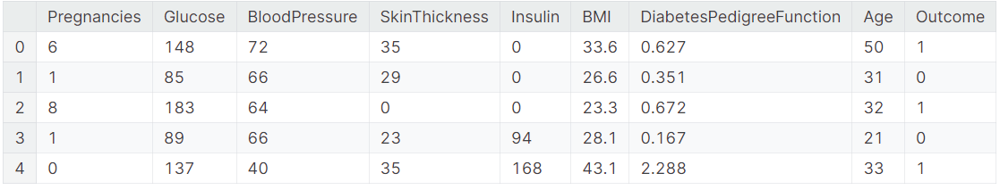


The datasets consist of several medical predictor (independent) variables and one target (dependent) variable, Outcome. Independent variables include the number of pregnancies the patient has had, their BMI, insulin level, age, and so on.

#### What is diabetes ?
Acccording to NIH, "Diabetes is a disease that occurs when your blood glucose, also called blood sugar, is too high. Blood glucose is your main source of energy and comes from the food you eat. Insulin, a hormone made by the pancreas, helps glucose from food get into your cells to be used for energy. Sometimes your body doesn’t make enough—or any—insulin or doesn’t use insulin well. Glucose then stays in your blood and doesn’t reach your cells.

Over time, having too much glucose in your blood can cause health problems. Although diabetes has no cure, you can take steps to manage your diabetes and stay healthy.

Sometimes people call diabetes “a touch of sugar” or “borderline diabetes.” These terms suggest that someone doesn’t really have diabetes or has a less serious case, but every case of diabetes is serious.

##### **What are the different types of diabetes?** 

The most common types of diabetes are type 1, type 2, and gestational diabetes.

###### **Type 1 diabetes **

If you have type 1 diabetes, your body does not make insulin. Your immune system attacks and destroys the cells in your pancreas that make insulin. Type 1 diabetes is usually diagnosed in children and young adults, although it can appear at any age. People with type 1 diabetes need to take insulin every day to stay alive.

###### **Type 2 diabetes**

 If you have type 2 diabetes, your body does not make or use insulin well. You can develop type 2 diabetes at any age, even during childhood. However, this type of diabetes occurs most often in middle-aged and older people. Type 2 is the most common type of diabetes.

###### **Gestational diabetes**

 Gestational diabetes develops in some women when they are pregnant. Most of the time, this type of diabetes goes away after the baby is born. However, if you’ve had gestational diabetes, you have a greater chance of developing type 2 diabetes later in life. Sometimes diabetes diagnosed during pregnancy is actually type 2 diabetes.


###### **Other types of diabetes**

 Less common types include monogenic diabetes, which is an inherited form of diabetes, and cystic fibrosis-related diabetes ."


### 2.2. Target
What's target's distribution ?

The above graph shows that the data is unbalanced. The number of non-diabetic is 268 the number of diabetic patients is 500
#### 源代码
```python
# 2 datasets
D = data[(data['Outcome'] != 0)]
H = data[(data['Outcome'] == 0)]

#------------COUNT-----------------------
def target_count():
    trace = go.Bar( x = data['Outcome'].value_counts().values.tolist(), 
                    y = ['healthy','diabetic' ], 
                    orientation = 'h', 
                    text=data['Outcome'].value_counts().values.tolist(), 
                    textfont=dict(size=15),
                    textposition = 'auto',
                    opacity = 0.8,marker=dict(
                    color=['lightskyblue', 'gold'],
                    line=dict(color='#000000',width=1.5)))

    layout = dict(title =  'Count of Outcome variable')

    fig = dict(data = [trace], layout=layout)
    py.iplot(fig)

#------------PERCENTAGE-------------------
def target_percent():
    trace = go.Pie(labels = ['healthy','diabetic'], values = data['Outcome'].value_counts(), 
                   textfont=dict(size=15), opacity = 0.8,
                   marker=dict(colors=['lightskyblue', 'gold'], 
                               line=dict(color='#000000', width=1.5)))


    layout = dict(title =  'Distribution of Outcome variable')

    fig = dict(data = [trace], layout=layout)
    py.iplot(fig)
```


```python
target_count()
target_percent()
```


#### 添加中文注释
```python
# 定义两个数据集
# D 为Outcome列不为0的数据集，即糖尿病患者的数据
D = data[(data['Outcome'] != 0)]
# H 为Outcome列为0的数据集，即健康人的数据
H = data[(data['Outcome'] == 0)]

#------------计数---------------------
# 定义一个函数，该函数用于绘制目标变量的计数直方图
def target_count():
    # 创建一个条形图对象，其中x轴代表Outcome的计数，y轴代表标签，orientation为'h'表示条形图是垂直显示的
    trace = go.Bar(
        x=data['Outcome'].value_counts().values.tolist(),  # x轴数据是Outcome列的计数，将其转换为列表形式
        y=['healthy', 'diabetic'],  # y轴标签，分别代表健康和糖尿病两类
        orientation='h',  # 设置条形图为垂直方向
        text=data['Outcome'].value_counts().values.tolist(),  # 条形图上显示的文本是Outcome的计数数值
        textfont=dict(size=15),  # 设置文本的字体大小为15
        textposition='auto',  # 文本位置自动调整以适应图表
        opacity=0.8,  # 设置图形的不透明度为0.8
        marker=dict(  # 定义标记的样式
            color=['lightskyblue', 'gold'],  # 标记颜色分别为天蓝色和金色，代表不同的类别
            line=dict(color='#000000', width=1.5)  # 标记边框颜色为黑色，宽度为1.5
        )
    )

    # 设置图表的布局，包括标题
    layout = dict(title='目标变量的计数')  # 图表标题设置为“目标变量的计数”

    # 创建图表对象，包含数据和布局
    fig = dict(data=[trace], layout=layout)  # fig是一个字典，包含数据和布局信息

    # 使用Plotly的iplot函数在Jupyter Notebook中绘制图表
    py.iplot(fig)  # 调用iplot函数展示图表


#上面这段代码定义了一个名为`target_count`的函数，用于生成并展示一个条形图，该图表显示了数据集中目标变量（Outcome）的计数。图表中，'healthy'和'diabetic'分别代表没有糖尿病和有糖尿病的两类数据。每个条形上的文本显示了每个类别的计数数值，颜色分别设置为天蓝色和金色，以区分不同的类别。图表的不透明度设置为0.8，增加了视觉效果。最后，使用Plotly的`iplot`函数在Jupyter Notebook中展示图表。

#------------百分比---------------------
# 定义一个函数，该函数用于绘制目标变量的分布饼图
def target_percent():
    # 创建一个饼图对象，labels为标签，values为对应的值
    trace = go.Pie(
        labels=['healthy', 'diabetic'],  # 设置饼图的标签，分别为'healthy'和'diabetic'
        values=data['Outcome'].value_counts(),  # values为Outcome列的计数，代表每个类别的数量
        textfont=dict(size=15),  # 设置饼图上文本的字体大小为15
        opacity=0.8,  # 设置饼图的透明度为0.8
        # 设置标记的样式
        marker=dict(
            colors=['lightskyblue', 'gold'],  # 标记颜色分别为天蓝色和金色，代表不同的类别
            line=dict(color='#000000', width=1.5)  # 标记边框颜色为黑色，宽度为1.5
        )
    )

    # 设置图表布局，包括标题
    layout = dict(title='目标变量的分布')  # 设置图表的标题为“目标变量的分布”

    # 创建图表对象并包含数据和布局
    fig = dict(data=[trace], layout=layout)  # 创建一个包含数据和布局信息的图表对象

    # 使用Plotly的iplot函数在Jupyter Notebook中绘制图表
    py.iplot(fig)  # 调用iplot函数展示饼图

# 调用函数绘制图表
target_count()  # 调用target_count函数绘制目标变量的计数直方图
target_percent()  # 调用target_percent函数绘制目标变量的分布饼图


#这段代码定义了一个名为`target_percent`的函数，用于生成并展示一个饼图，该图表显示了数据集中目标变量（Outcome）的分布情况。图表中，'healthy'和'diabetic'分别代表没有糖尿病和有糖尿病的两类数据。每个扇区的文本显示了Outcome的计数，颜色分别设置为天蓝色和金色，以区分不同的类别。图表的透明度设置为0.8，增加了视觉效果。最后，使用Plotly的`iplot`函数在Jupyter Notebook中展示图表。函数定义完成后，通过调用`target_count()`和`target_percent()`函数来绘制并展示相应的图表。
```

上述代码中，首先定义了两个数据集`D`和`H`，分别代表糖尿病患者和健康人的数据。然后定义了两个函数`target_count()`和`target_percent()`，用于绘制目标变量（糖尿病Outcome）的计数直方图和分布饼图。最后调用这两个函数来展示糖尿病患者和健康人的分布情况。

#### 结果展示


### 2.3. Missing values
We saw on data.head() that some features contain 0, it doesn't make sense here and this indicates missing value Below we replace 0 value by NaN :

```python
# 将数据集中'Glucose', 'BloodPressure', 'SkinThickness', 'Insulin', 'BMI'列中的0值替换为NaN
data[['Glucose','BloodPressure','SkinThickness','Insulin','BMI']] = data[['Glucose','BloodPressure','SkinThickness','Insulin','BMI']].replace(0,np.NaN)
```

这行代码的作用是在整个`data` DataFrame中，针对'Glucose'（葡萄糖）、'BloodPressure'（血压）、'SkinThickness'（皮肤厚度）、'Insulin'（胰岛素）和'BMI'（身体质量指数）这几列，将所有的0值替换为`np.NaN`，即“不是一个数字”的浮点数值，这通常用于表示缺失数据。这样的替换可能是为了后续的数据处理步骤，比如在数据分析中通常会忽略或填充缺失值。

Now, we can look at where are missing values :


```python
# 定义一个函数用于绘制数据集中所有缺失值的图表
def missing_plot(dataset, key) :
    # 从传入的数据集dataset中选取指定的列key，并计算非空值的数量
    # 然后通过计算总长度减去非空值的数量得到缺失值的数量，创建一个DataFrame来存储这些计数
    null_feat = pd.DataFrame(len(dataset[key]) - dataset[key].notnull().sum(), columns = ['Count'])
    # 计算每一列缺失值的比例，创建一个DataFrame来存储这些比例
    # 计算方法是：(总长度 - 非缺失值的数量) / 总长度 * 100，得到缺失值的百分比
    percentage_null = pd.DataFrame((len(dataset[key]) - (len(dataset[key]) - dataset[key].notnull().sum())) / len(dataset[key]) * 100, columns = ['Percentage'])
    # 将计算出的百分比四舍五入到小数点后两位
    percentage_null = percentage_null.round(2)

    # 创建一个条形图对象，x轴为列名，y轴为缺失值的计数，文本显示为缺失值的百分比
    # opacity设置为0.8表示图形的不透明度，color设置为浅蓝色，边框颜色设置为黑色，宽度为1.5
    trace = go.Bar(x = null_feat.index, y = null_feat['Count'], opacity = 0.8, 
                   text = percentage_null['Percentage'], 
                   textposition = 'auto', 
                   marker=dict(color = '#7EC0EE', line=dict(color='#000000', width=1.5)))

    # 设置图表布局，包括标题
    layout = dict(title = "缺失值（计数 & 百分比）")  # 设置图表标题为“缺失值（计数 & 百分比）”

    # 创建图表对象并包含数据和布局
    fig = dict(data = [trace], layout=layout)  # fig是一个字典，包含数据和布局信息

    # 使用Plotly的iplot函数在Jupyter Notebook中绘制图表
    py.iplot(fig)  # 调用iplot函数展示图表
```

这段代码定义了一个名为`missing_plot`的函数，用于生成并展示数据集中每一列的缺失值数量及其占比。函数接收两个参数：`dataset`表示数据集，`key`表示要检查的列名。首先，计算每一列的非空值数量和缺失值比例，并将这些信息存储在两个DataFrame中。然后，创建一个条形图对象，其中x轴为列名，y轴为缺失值的计数，文本显示为缺失值的比例。最后，使用Plotly的`iplot`函数在Jupyter Notebook中展示图表。通过调用`missing_plot`函数并传入数据集和目标列名，可以生成并展示目标列的缺失值情况。

```python
# Plotting 
# 绘制数据集中'Outcome'列的缺失值图表
missing_plot(data, 'Outcome')
```

这行代码调用了`missing_plot`函数，用于绘制数据集`data`中`'Outcome'`列的缺失值情况。这个函数将展示该列中缺失值的数量和所占的百分比，以条形图的形式表现。这样的可视化有助于了解目标变量`'Outcome'`的完整性，从而评估数据集的质量和进行后续的数据处理决策。

**结果展示**

.png>)

Missing values :

* Insulin = 48.7% - 374
* SkinThickness = 29.56% - 227
* BloodPressure = 4.56% - 35
* BMI = 1.43% - 11
* Glucose = 0.65% - 5

```python
# 使用ggplot风格的视觉样式
plt.style.use('ggplot')  

# 创建一个子图，设置图形大小为宽11英寸、高15英寸
f, ax = plt.subplots(figsize=(11, 15))

# 设置坐标轴背景颜色为浅灰色
ax.set_facecolor('#fafafa')
# 设置x轴的范围，从-0.05到200
ax.set(xlim=(-.05, 200))
# 设置y轴的标签为'Variables'
plt.ylabel('Variables')
# 设置图表标题为'Overview Data Set'
plt.title("Overview Data Set")
# 使用Seaborn的箱形图功能，绘制水平方向的箱形图，颜色方案使用'Set2'
ax = sns.boxplot(data = data, 
  orient = 'h', 
  palette = 'Set2')
```

这段代码使用Matplotlib和Seaborn库来创建一个箱形图，该图展示了数据集`data`中各个变量的分布情况。首先，设置了绘图风格为`ggplot`，这是一种流行的绘图风格，以其美观和易于阅读而闻名。然后，创建了一个子图，并设置了图形的大小。接着，设置了坐标轴的背景颜色、x轴的范围，并添加了y轴标签和图表标题。最后，使用Seaborn的`boxplot`函数绘制了水平方向的箱形图，其中`palette = 'Set2'`指定了颜色方案，使得图表更加直观和美观。

**结果展示**


OK, all missing values are encoded with NaN value


**To fill these Nan values the data distribution needs to be understood against the target.**

```python
def correlation_plot():
    # 计算数据集中各个变量之间的相关系数
    correlation = data.corr()
    # 获取相关系数矩阵的列名
    matrix_cols = correlation.columns.tolist()
    # 将相关系数矩阵转换为数组
    corr_array = np.array(correlation)
    # 创建一个热力图对象，展示相关系数矩阵
    trace = go.Heatmap(z=corr_array,  # 热力图的数据源
                       x=matrix_cols,  # x轴的标签
                       y=matrix_cols,  # y轴的标签
                       colorscale='Viridis',  # 热力图的颜色方案
                       colorbar=dict(),  # 热力图的色标
                      )
    # 设置图表布局
    layout = go.Layout(dict(title='变量的相关系数矩阵',  # 图表的标题#Correlation Matrix for variables
                           margin=dict(r=0, l=100,  # 图表边缘的空白设置
                                       t=0, b=100,
                                      ),  # 这里的r,l,t,b分别代表右、左、上、下的空白距离
                           yaxis=dict(tickfont=dict(size=9)),  # y轴刻度标签的字体大小
                           xaxis=dict(tickfont=dict(size=9))  # x轴刻度标签的字体大小
                          )
                      )
    # 创建图表对象，包含数据和布局
    fig = go.Figure(data=[trace], layout=layout)
    # 使用Plotly的iplot函数在Jupyter Notebook中绘制图表
    py.iplot(fig)
```

这段代码定义了一个名为`correlation_plot`的函数，用于生成并展示数据集`data`中各个变量之间的相关系数热力图。首先，计算相关系数矩阵并获取其列名。然后，创建一个热力图对象，使用`colorscale='Viridis'`设置热力图的颜色方案。接下来，设置图表布局，包括标题、边缘空白、y轴和x轴刻度标签的字体大小。最后，创建一个包含热力图数据和布局的图表对象，并使用Plotly的`iplot`函数在Jupyter Notebook中展示图表。

A **correlation matrix** is a table showing correlation coefficients between sets of variables. Each random variable (Xi) in the table is correlated with each of the other values in the table (Xj). This allows you to see which pairs have the highest correlation.

```python
correlation_plot()
```


Below, you can see the accuracy of LGBM with replacement of the NaN values by the variable's mean (same results with the median)


To replace missing values, we'll use median by target (Outcome)


## 3. Replace missing values and EDA
```python
def median_target(var):   
    # 从原始数据集中筛选出指定变量var中非空值的记录
    temp = data[data[var].notnull()]
    # 进一步筛选出包含'Outcome'列的记录，并按'Outcome'列的值进行分组
    temp = temp[[var, 'Outcome']].groupby(['Outcome'])[[var]].median().reset_index()
    # 计算每个'Outcome'分组中指定变量var的中位数，并重置索引
    # 最后返回计算得到的中位数数据框
    return temp
```

这段代码定义了一个名为`median_target`的函数，用于计算数据集`data`中指定变量`var`针对不同`Outcome`值的中位数。函数首先筛选出变量`var`中非空的记录，然后在这个子集上按照`Outcome`列的值进行分组，并计算每个分组的中位数。最后，函数返回包含`Outcome`值和对应中位数的数据框。这个函数可以用来分析不同结果（例如疾病有无）下某个变量的中心趋势。
### 3.1. Insulin
* **Insulin** : 2-Hour serum insulin (mu U/ml)


```python
def plot_distribution(data_select, size_bin):  
    # 从糖尿病和健康数据集中分别选择指定的列
    tmp1 = D[data_select]
    tmp2 = H[data_select]
    # 将两个选择后的列组成一个列表
    hist_data = [tmp1, tmp2]
    
    # 定义两组数据的标签
    group_labels = ['diabetic', 'healthy']
    # 定义两组数据的颜色
    colors = ['#FFD700', '#7EC0EE']

    ## 利用Plotly的figure_factory模块创建一个分布图
    # hist_data: 包含要绘制的数据的列表
    # group_labels: 各个数据组的标签
    # colors: 各个数据组的颜色
    # show_hist: 是否显示直方图
    # bin_size: 直方图的bin大小
    # curve_type: 曲线类型，这里使用核密度估计(KDE)
    fig = ff.create_distplot(hist_data, group_labels, colors=colors, show_hist=True, bin_size=size_bin, curve_type='kde')
    #上面这段代码使用Plotly库中的`figure_factory`模块来创建一个分布图，该图结合了直方图和核密度估计（KDE）曲线，以展示不同数据组在指定变量上的分布情况。`hist_data`是要绘制的数据列表，`group_labels`是各个数据组的标签，`colors`定义了各个数据组的颜色。`show_hist`参数设置为True表示同时显示直方图，`bin_size`参数设置了直方图的bin大小，`curve_type`设置为'kde'表示使用核密度估计曲线。


    # 更新图表的布局，设置标题为指定的列名
    fig['layout'].update(title=str(data_select))#创建完分布图后，通过`update`方法设置图表的标题为`data_select`，即指定的变量名。
    #上面这行代码的作用是将创建的图表的标题设置为`data_select`变量所表示的列名。`fig['layout']`访问了图表对象的布局部分，`update`方法用于更新布局的属性。`title`属性设置了图表的标题，这里将`data_select`转换为字符串，以确保即使它是一个非字符串类型的变量也能正确地被转换为标题文本。


    # 使用Plotly的iplot函数在Jupyter Notebook中绘制图表，并保存为'Density plot'
    py.iplot(fig, filename='Density plot')

# 调用函数，绘制'Insulin'列的分布图，bins的尺寸为0
plot_distribution('Insulin', 0)
#上面这行代码调用了之前定义的`plot_distribution`函数，用于绘制名为`'Insulin'`的列的分布图。`0`作为参数传递给`size_bin`，表示在创建直方图时不使用固定的bin大小，而是让Plotly自动选择最佳的bin数量来展示数据分布。这通常适用于连续数据，可以更准确地反映数据的分布情况。
```

这段代码定义了一个名为`plot_distribution`的函数，用于生成并展示糖尿病组（`D`）和健康组（`H`）在指定变量（`data_select`）上的分布图。函数首先从两个数据集中选取指定的列，并创建一个包含这两组数据的列表。然后，定义了两组数据的标签和颜色。接下来，使用Plotly的`figure_factory`模块中的`create_distplot`函数创建一个分布图，其中包含了直方图和核密度估计（KDE）曲线。最后，更新图表的布局以设置标题，并使用`iplot`函数在Jupyter Notebook中展示图表。通过调用`plot_distribution`函数并传入列名和bins尺寸，可以生成对应的分布图。

**结果展示**

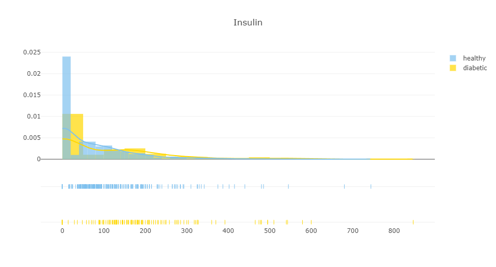

```python
# 调用median_target函数，计算并返回'Insulin'列的中位数值
median_target('Insulin')
```

上面这行代码调用了`median_target`函数，传入了字符串`'Insulin'`作为参数。这个函数将计算并返回数据集`data`中`'Insulin'`列的中位数值。中位数是将数据集分为两个相等部分的值，其中一半的数据值位于中位数之上，另一半位于中位数之下。这是一个常用的统计度量，可以帮助了解数据的中心位置，特别是对于偏斜分布的数据。

**结果展示**

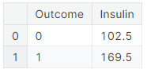


Insulin's medians by the target are really different ! 102.5 for a healthy person and 169.5 for a diabetic person


```python
# 将'Outcome'为0且'Insulin'为空值的记录的'Insulin'列填充为102.5
data.loc[(data['Outcome'] == 0) & (data['Insulin'].isnull()), 'Insulin'] = 102.5
# 将'Outcome'为1且'Insulin'为空值的记录的'Insulin'列填充为169.5
data.loc[(data['Outcome'] == 1) & (data['Insulin'].isnull()), 'Insulin'] = 169.5
```

这两行代码使用Pandas的`loc`方法来更新数据集`data`中的`'Insulin'`列。具体来说，第一行代码查找所有`'Outcome'`值为0且`'Insulin'`列中数据为空（即`NaN`）的记录，并将这些记录的`'Insulin'`列的值填充为102.5。第二行代码执行类似的操作，但是针对的是`'Outcome'`值为1的记录，并将`'Insulin'`列的值填充为169.5。这种填充方法可以作为一种处理缺失数据的策略，特别是在没有足够的信息来确定确切值时，可以使用这种方法为缺失值提供一个参考值。

### 3.2. Glucose
* **Glucose** : Plasma glucose concentration a 2 hours in an oral glucose tolerance test

> "Glucose"：在口服葡萄糖耐量测试中，血浆葡萄糖浓度是在测试开始后2小时进行测量的指标。

> 口服葡萄糖耐量测试（OGTT）是一种医学检测方法，用来评估人体对葡萄糖的处理能力。在这项测试中，受试者在空腹状态下首先被给予一定量的葡萄糖溶液（通常是75克葡萄糖）饮用。在饮用葡萄糖溶液后的1小时和2小时，医务人员会通过抽血来测量受试者血液中的葡萄糖浓度。2小时后的血浆葡萄糖浓度是一个重要的指标，它可以帮助医生判断受试者是否存在糖尿病或糖尿病前期（也称为糖耐量受损）。根据世界卫生组织的标准，如果2小时后的血糖水平超过11.1 mmol/L（200 mg/dL），则可能表明受试者患有糖尿病。

```python
# 调用plot_distribution函数，绘制'Glucose'列的分布图，bins的尺寸不固定
plot_distribution('Glucose', 0)
```

这行代码调用了`plot_distribution`函数，并传入了`'Glucose'`作为参数，表示要绘制的数据集中的`'Glucose'`列（即葡萄糖耐量测试结果）的分布图。第二个参数传入了`0`，这意味着在创建直方图时不指定固定的bin大小，而是让Plotly根据数据的分布自动选择合适的bin数量。这样可以更准确地展示数据的分布情况。

**结果展示**

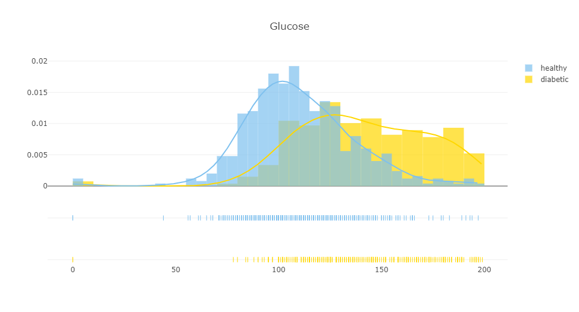

```python
# 调用median_target函数，计算并返回'Glucose'列的中位数值
median_target('Glucose')
```

这行代码调用了`median_target`函数，并传入了`'Glucose'`作为参数。这个函数的目的是计算并返回数据集`data`中`'Glucose'`列（代表口服葡萄糖耐量测试2小时后的血浆葡萄糖浓度）的中位数值。中位数是将数据集分为两个相等部分的数值，其中一半的数据值位于中位数之上，另一半位于中位数之下。这个统计度量有助于了解数据的中心趋势，尤其是在数据分布不均时。

**结果展示**

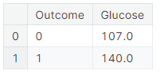


```python
# 将'Outcome'为0且'Glucose'为空值的记录的'Glucose'列填充为107
data.loc[(data['Outcome'] == 0) & (data['Glucose'].isnull()), 'Glucose'] = 107
# 将'Outcome'为1且'Glucose'为空值的记录的'Glucose'列填充为140
data.loc[(data['Outcome'] == 1) & (data['Glucose']..isnull()), 'Glucose'] = 140
```

这两行代码使用Pandas的`loc`方法来更新数据集`data`中的`'Glucose'`列。具体来说，第一行代码查找所有`'Outcome'`值为0且`'Glucose'`列中数据为空（即`NaN`）的记录，并将这些记录的`'Glucose'`列的值填充为107。第二行代码执行类似的操作，但是针对的是`'Outcome'`值为1的记录，并将`'Glucose'`列的值填充为140。这种填充方法可以作为一种处理缺失数据的策略，特别是在没有足够的信息来确定确切值时，可以使用这种方法为缺失值提供一个参考值。


107 for a healthy person and 140 for a diabetic person

### 3.3. SkinThickness
* SkinThickness : Triceps skin fold thickness (mm)

> "SkinThickness"：三头肌皮褶厚度（单位：毫米）

> 三头肌皮褶厚度是通过测量皮肤和皮下脂肪的厚度来得到的一个指标，通常使用专门的卡尺进行测量。这个指标反映了个体的体脂分布情况，有时候也用来评估一个人的肥胖程度或者身体组成。

> 在妊娠期糖尿病（Gestational Diabetes Mellitus, GDM）的诊断中，三头肌皮褶厚度可能会被考虑作为一个风险因素。研究表明，较高的体脂比例可能与胰岛素抵抗有关，而胰岛素抵抗是妊娠期糖尿病的一个重要因素。因此，皮褶厚度的测量可以帮助医生评估孕妇发展为妊娠期糖尿病的风险，以及制定相应的预防和治疗措施。然而，需要注意的是，皮褶厚度只是多种评估工具中的一种，通常需要结合其他临床指标和测试结果来综合判断。

```python
# 调用plot_distribution函数，绘制'SkinThickness'列的分布图，bins的尺寸设置为10
plot_distribution('SkinThickness', 10)
```

这行代码调用了`plot_distribution`函数，并传入了`'SkinThickness'`作为参数，表示要绘制的数据集中的`'SkinThickness'`列（即三头肌皮褶厚度）的分布图。第二个参数传入了`10`，这意味着在创建直方图时，数据将被分成10个等宽的bin（区间）。这样可以更直观地展示数据的分布情况，尤其是在分析三头肌皮褶厚度与妊娠期糖尿病或其他健康状况之间关系时。


**结果展示**

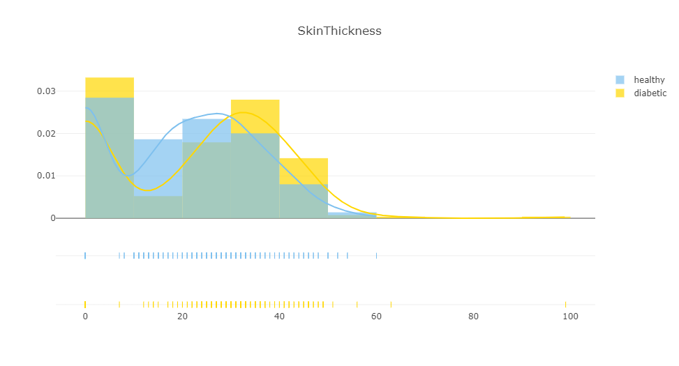

```python
# 调用median_target函数，计算并返回'SkinThickness'列的中位数值
median_target('SkinThickness')
```

这行代码调用了`median_target`函数，并传入了`'SkinThickness'`作为参数。这个函数的目的是计算并返回数据集`data`中`'SkinThickness'`列（代表三头肌皮褶厚度）的中位数值。中位数是将数据集分为两个相等部分的数值，其中一半的数据值位于中位数之上，另一半位于中位数之下。在分析三头肌皮褶厚度与妊娠期糖尿病风险的关系时，中位数可以作为一个重要的统计参考点。

**结果展示**
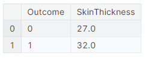

```python
# 将'Outcome'为0且'SkinThickness'为空值的记录的'SkinThickness'列填充为27
data.loc[(data['Outcome'] == 0) & (data['SkinThickness'].isnull()), 'SkinThickness'] = 27
# 将'Outcome'为1且'SkinThickness'为空值的记录的'SkinThickness'列填充为32
data.loc[(data['Outcome'] == 1) & (data['SkinThickness'].isnull()), 'SkinThickness'] = 32
```

这两行代码使用Pandas库中的`loc`方法来为数据集`data`中的缺失值（`NaN`）赋予特定的数值。具体来说，第一行代码查找`Outcome`列值为0（可能表示非糖尿病患者）且`SkinThickness`列值为空的记录，并将这些记录的`SkinThickness`列的值填充为27毫米。第二行代码执行类似的操作，但是针对的是`Outcome`列值为1的记录（可能表示糖尿病患者），并将`SkinThickness`列的值填充为32毫米。这种填充方法可以帮助在数据分析中处理缺失值，尤其是在原始数据中某些观测值缺失的情况下。填充值的选择可能基于领域知识或者预先进行的统计分析。

27 for a healthy person and 32 for a diabetic person

### 3.4. BloodPressure
* BloodPressure : Diastolic blood pressure (mm Hg)

```python
plot_distribution('BloodPressure', 5)
# 调用plot_distribution函数，传入'BloodPressure'作为变量名和数字5作为bins的数量，
# 目的是绘制血压数据的分布情况，其中数据被分为5个区间进行可视化分析。
```
**结果展示**
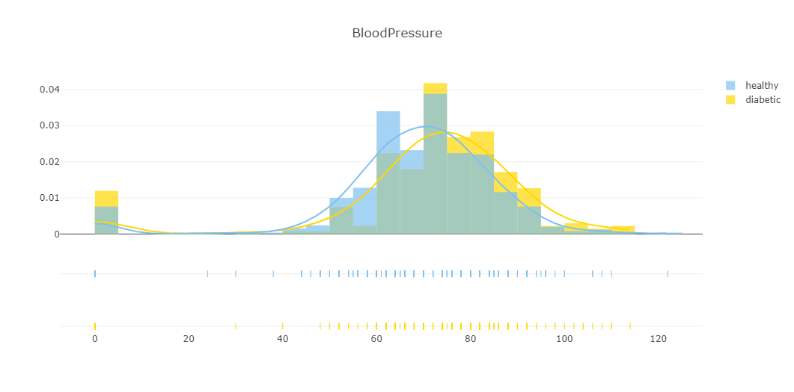

```python
median_target('BloodPressure')
```

**结果展示**

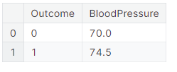

```python
data.loc[(data['Outcome'] == 0 ) & (data['BloodPressure'].isnull()), 'BloodPressure'] = 70
data.loc[(data['Outcome'] == 1 ) & (data['BloodPressure'].isnull()), 'BloodPressure'] = 74.5
```


### 3.5. BMI
* BMI : Body mass index (weight in kg/(height in m)^2)

```python
plot_distribution('BMI', 0)
```
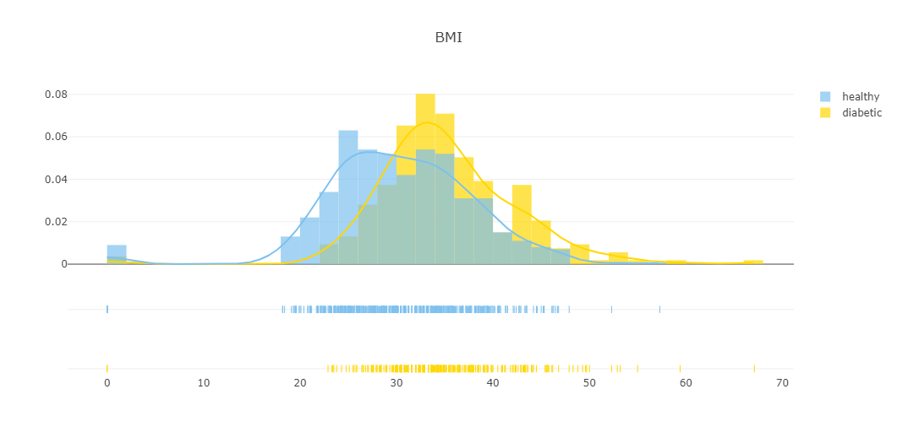

```python
median_target('BMI')
```
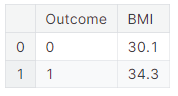

```python
data.loc[(data['Outcome'] == 0 ) & (data['BMI'].isnull()), 'BMI'] = 30.1
data.loc[(data['Outcome'] == 1 ) & (data['BMI'].isnull()), 'BMI'] = 34.3
```
### 3.6. Age、DiabetesPedigreeFunction、Pregnancies
* **Age** : Age (years)
* **DiabetesPedigreeFunction** : Diabetes pedigree function
* **Pregnancies** : Number of times pregnant

- **Age**: 年龄（岁）  
  年龄是衡量个体健康的一个基本指标，对于妊娠期糖尿病的诊断来说，年龄是一个重要的风险因素。通常，随着年龄的增长，患有糖尿病的风险也会增加。年长的女性可能会有更高的胰岛素抵抗性，这使得她们在怀孕期间更容易发展成妊娠期糖尿病。

- **DiabetesPedigreeFunction**: 糖尿病家族史函数  
  糖尿病家族史函数是一个计算得到的指标，它考虑了一个人的家族中患有糖尿病的亲属数量和关系亲密程度。这个函数的值越高，表示个体的糖尿病家族史越丰富，从而患糖尿病的风险也越高。在妊娠期糖尿病的诊断中，家族史是一个重要的考虑因素，因为它可以帮助医生评估孕妇发展为妊娠期糖尿病的潜在风险。

- **Pregnancies**: 怀孕次数  
  怀孕次数指的是一个女性在她的生育史中怀孕的次数。在妊娠期糖尿病的诊断中，怀孕次数也是一个重要的风险因素。多次怀孕可能会增加女性患妊娠期糖尿病的风险，因为每一次怀孕都可能会对身体的代谢系统造成额外的压力，导致胰岛素抵抗性增加。医生会考虑这一因素来评估孕妇的健康状况，并提供适当的监测和管理建议。


```python
#plot distribution 
plot_distribution('Age', 0)
plot_distribution('Pregnancies', 0)
plot_distribution('DiabetesPedigreeFunction', 0)
```

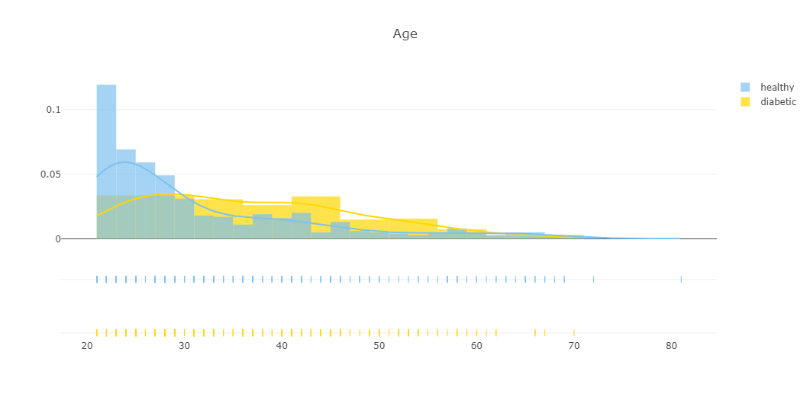

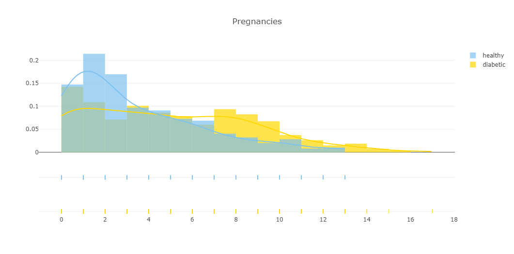

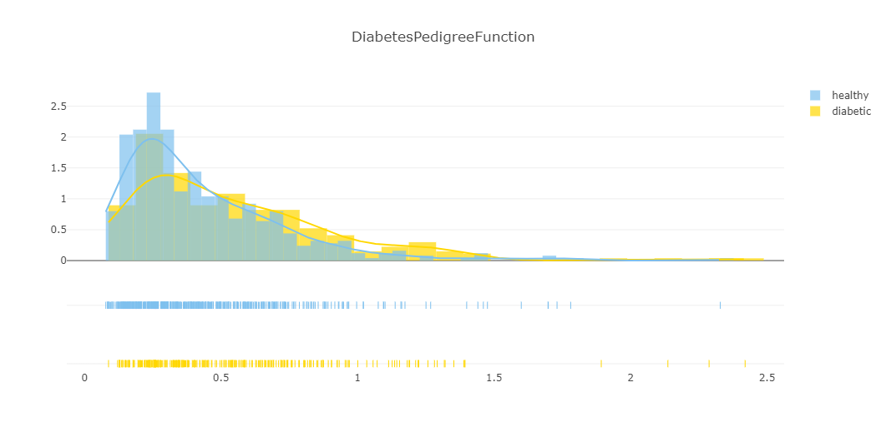

```python
missing_plot(data, 'Outcome')
# 调用missing_plot函数，传入名为data的数据集和字符串'Outcome'作为参数，
# 目的是绘制并分析'Outcome'这一列中的缺失值情况。
```


All features are complete ! Now, we can create new features

## 4. New features (16) and EDA
Here, we define 3 plots functions

### first plot function
```python
# plot_feat1_feat2(feat1, feat2)
# 定义一个函数用于绘制两个特征之间的关系图，其中feat1和feat2分别代表两个不同的特征列名。
def plot_feat1_feat2(feat1, feat2) :  
    # 从数据集中筛选出糖尿病患者的数据（Outcome列不为0）
    D = data[(data['Outcome'] != 0)]
    # 从数据集中筛选出健康人的数据（Outcome列为0）
    H = data[(data['Outcome'] == 0)]

    # 创建一个用于绘制糖尿病患者特征的散点图对象
    trace0 = go.Scatter(
        x = D[feat1],  # 特征1的数据
        y = D[feat2],  # 特征2的数据
        name = 'diabetic',  # 图例名称为'diabetic'
        mode = 'markers',  # 模式设置为'markers'，表示用标记点表示数据
        marker = dict(color = '#FFD700',  # 标记点颜色设置为金黄色
            line = dict(
                width = 1)  # 标记点边框宽度设置为1
        ))

    # 创建一个用于绘制健康人特征的散点图对象
    trace1 = go.Scatter(
        x = H[feat1],  # 特征1的数据
        y = H[feat2],  # 特征2的数据
        name = 'healthy',  # 图例名称为'healthy'
        mode = 'markers',  # 模式设置为'markers'，表示用标记点表示数据
        marker = dict(color = '#7EC0EE',  # 标记点颜色设置为浅蓝色
            line = dict(
                width = 1)  # 标记点边框宽度设置为1
        ))

    # 设置图表布局，包括标题、y轴和x轴的标签以及是否显示零线
    layout = dict(title = feat1 +" "+"vs"+" "+ feat2,  # 图表标题设置为特征1和特征2的组合
                  yaxis = dict(title = feat2, zeroline = False),  # y轴标签设置为特征2，不显示零线
                  xaxis = dict(title = feat1, zeroline = False)  # x轴标签设置为特征1，不显示零线
                 )

    # 将两个散点图对象组合成一个图表列表
    plots = [trace0, trace1]

    # 创建图表对象，包含数据和布局
    fig = dict(data = plots, layout=layout)
    # 使用Plotly的iplot函数在Jupyter Notebook中绘制图表
    py.iplot(fig)
```

上述代码定义了一个名为`plot_feat1_feat2`的函数，用于生成并展示两个指定特征（`feat1`和`feat2`）之间的关系图。函数首先从数据集中筛选出糖尿病患者（`D`）和健康人（`H`）的数据。然后，为每组数据创建一个散点图对象，分别用不同的颜色表示。接着，设置图表的布局，包括标题和坐标轴标签。最后，将两个散点图对象组合成一个图表列表，并使用Plotly的`iplot`函数在Jupyter Notebook中展示图表。通过调用`plot_feat1_feat2`函数并传入两个特征列名，可以生成并展示这两个特征之间的关系图。

### second plot function

```python
# barplot(var_select, sub)
# 定义一个函数用于绘制指定变量（var_select）的条形图，并在子标题（sub）中展示糖尿病和非糖尿病的比例。
# 这个函数的目的是创建一个条形图，用于可视化特定变量在糖尿病患者和非糖尿病患者中的分布情况及比例。
def barplot(var_select, sub) :
    # 从数据集中筛选出糖尿病患者的数据（Outcome列不为0）
    # 这里创建了一个临时DataFrame tmp1，包含所有Outcome列值不为0的记录，即糖尿病患者的数据。
    tmp1 = data[(data['Outcome'] != 0)]
    # 从数据集中筛选出健康人的数据（Outcome列为0）
    # 这里创建了一个临时DataFrame tmp2，包含所有Outcome列值等于0的记录，即健康人的数据。
    tmp2 = data[(data['Outcome'] == 0)]
    # 计算变量var_select在糖尿病和非糖尿病组中的交叉表，并计算每一类的百分比
    # 使用pandas的crosstab函数计算var_select变量和Outcome列的交叉表，并将其转换为DataFrame tmp3。
    # 然后计算每一类的百分比，存储在新的列'% diabetic'中。
    tmp3 = pd.DataFrame(pd.crosstab(data[var_select], data['Outcome']), )
    tmp3['% diabetic'] = tmp3[1] / (tmp3[1] + tmp3[0]) * 100
    #这段代码定义了一个名为`barplot`的函数，它接受一个变量名`var_select`和一个子标题`sub`作为参数。函数的目的是生成一个条形图，展示在糖尿病患者和非糖尿病患者中，`var_select`变量的分布情况及其占比。首先，代码通过筛选`data` DataFrame中的`Outcome`列来创建两个临时DataFrame：`tmp1`包含所有糖尿病患者的数据，`tmp2`包含所有健康人的数据。然后，使用`pd.crosstab`函数计算`var_select`变量和`Outcome`列的交叉表，得到一个DataFrame `tmp3`。接下来，计算每个类别的百分比，并将这些百分比存储在`tmp3`的新列`% diabetic`中。这个交叉表和百分比将用于后续的条形图绘制。

    # 定义两种颜色，用于区分糖尿病和非糖尿病的数据
    # 这里设置了一个颜色列表，包含天蓝色和金色，分别用于表示非糖尿病患者和糖尿病患者的数据，以便于在条形图中进行区分。
    color = ['lightskyblue', 'gold']

    # 创建一个条形图对象，用于展示糖尿病患者的数据
    # 这一行代码创建了一个条形图对象trace1，它将用于在条形图中展示糖尿病患者在选定变量var_select上的分布情况。
    trace1 = go.Bar(
        x=tmp1[var_select].value_counts().keys().tolist(),  # 设置x轴的数据，即变量var_select的所有不同类别
        y=tmp1[var_select].value_counts().values.tolist(),  # 设置y轴的数据，即每个类别在糖尿病患者中的计数
        text=tmp1[var_select].value_counts().values.tolist(),  # 设置条形图上显示的文本，即每个类别的计数
        textposition='auto',  # 设置文本的显示位置，'auto'表示自动调整以适应图表
        name='diabetic',  # 设置图例名称为'diabetic'，表示此条形图代表糖尿病患者的数据
        opacity=0.8,  # 设置图形的不透明度为0.8，使得图形看起来更为透明
        marker=dict(  # 设置标记的样式
            color='gold',  # 设置标记的填充颜色为金色
            line=dict(color='#000000', width=1)  # 设置标记边框的颜色为黑色，宽度为1
        ))
    #在这段代码中，首先定义了一个颜色列表`color`，包含两种颜色，分别用于表示非糖尿病患者（天蓝色）和糖尿病患者（金色）的数据。然后，使用Plotly库中的`go.Bar`函数创建了一个条形图对象`trace1`。这个对象的`x`属性被设置为`tmp1` DataFrame中`var_select`列的类别，`y`属性被设置为这些类别在糖尿病患者中的计数。`text`属性也被设置为这些计数，以便在条形图上显示具体的数值。`textposition`属性设置为'auto'，意味着文本位置将自动调整以适应图表。`name`属性设置为'diabetic'，这样在图例中可以通过这个名字识别这个条形图代表的是糖尿病患者的数据。`opacity`属性设置为0.8，给予图形一定的透明度，使其看起来更为透明。最后，`marker`属性中的`color`和`line`分别设置了条形的填充颜色和边框样式。

    # 创建一个条形图对象，用于展示健康人的数据
    # 此代码行创建了一个条形图对象trace2，它将用于在条形图中展示健康人在选定变量var_select上的分布情况。
    trace2 = go.Bar(
        x=tmp2[var_select].value_counts().keys().tolist(),  # 设置x轴的数据，即变量var_select的所有不同类别
        y=tmp2[var_select].value_counts().values.tolist(),  # 设置y轴的数据，即每个类别在健康人群中的计数
        text=tmp2[var_select].value_counts().values.tolist(),  # 设置条形图上显示的文本，即每个类别的计数
        textposition='auto',  # 设置文本的显示位置，'auto'表示文本位置将根据图表的布局自动调整
        name='healthy',  # 设置图例名称为'healthy'，表示此条形图代表健康人群的数据
        opacity=0.8,  # 设置图形的不透明度为0.8，使得图形看起来更为透明，有助于与其他图形区分
        marker=dict(  # 设置标记的样式
            color='lightskyblue',  # 设置标记的填充颜色为天蓝色，以区分于糖尿病患者的数据颜色
            line=dict(color='#000000', width=1)  # 设置标记边框的颜色为黑色，宽度为1
        ))
    #这段代码创建了一个新的条形图对象`trace2`，用于在条形图中表示健康人群在选定变量`var_select`上的分布。`x`属性设置了条形图的x轴类别，来源于`tmp2` DataFrame中`var_select`列的类别。`y`属性设置了每个类别在健康人群中的计数。`text`属性同样显示每个类别的计数，直接展示在条形图的上方或旁边。`textposition`设置为'auto'，使得文本位置根据图表布局自动优化。`name`属性设置为'healthy'，这样在图例中可以通过这个名字识别这个条形图代表的是健康人群的数据。`opacity`设置为0.8，给予图形一定的透明度，增加视觉效果。`marker`属性中的`color`设置了条形的填充颜色为天蓝色，与代表糖尿病患者的金色条形形成对比。`line`属性设置了条形边框的颜色和宽度。

    # 创建一个散点图对象，用于展示糖尿病的百分比
    # 此代码行创建了一个散点图对象trace3，它将用于在图表中展示每个类别在糖尿病患者中的百分比。
    trace3 = go.Scatter(
        x=tmp3.index,  # 设置x轴数据，即变量var_select的所有不同类别的索引
        y=tmp3['% diabetic'],  # 设置y轴数据，即每个类别对应的糖尿病百分比
        yaxis='y2',  # 指定使用图表中的第二个y轴（右侧y轴），用于展示百分比数据
        name='% diabetic',  # 设置图例名称为'% diabetic'，表示此散点图代表糖尿病的百分比
        opacity=0.6,  # 设置图形的不透明度为0.6，使得图形看起来更为透明，便于与其他图形区分
        marker=dict(  # 设置标记的样式
            color='black',  # 设置标记的颜色为黑色
            line=dict(color='#000000', width=0.5)  # 设置标记边框的颜色为黑色，宽度为0.5
        ))
    #这段代码创建了一个散点图对象`trace3`，用于在图表中展示每个类别在糖尿病患者中的百分比。`x`属性设置了散点图的x轴类别，来源于`tmp3` DataFrame的索引。`y`属性设置了每个类别对应的糖尿病百分比。`yaxis`属性设置为'y2'，表示将使用图表中的第二个y轴（通常位于图表的右侧），这样可以将百分比数据与计数数据分开展示，使得图表更加清晰易读。`name`属性设置为'% diabetic'，这样在图例中可以通过这个名字识别这个散点图代表的是糖尿病的百分比。`opacity`设置为0.6，给予图形一定的透明度，增加视觉效果。`marker`属性中的`color`设置了散点的颜色为黑色，`line`属性设置了散点边框的颜色和宽度。

    # 设置图表布局，包括标题、x轴和y轴的配置
    # 此代码段用于定义图表的整体布局，包括标题、x轴和两个y轴的配置。
    layout = dict(title=str(var_select)+' '+(sub),  # 设置图表的标题，由变量名var_select和子标题sub组成
                  xaxis=dict(),  # 定义x轴的配置，这里没有具体设置，使用默认配置
                  yaxis=dict(title='Count'),  # 定义第一个y轴的配置，设置标题为'Count'
                  yaxis2=dict(range=[-0, 75],  # 定义第二个y轴的配置
                              overlaying='y',  # 设置第二个y轴与第一个y轴重叠显示
                              anchor='x',  # 设置第二个y轴的锚点为x轴，共享x轴刻度
                              side='right',  # 设置第二个y轴显示在图表的右侧
                              zeroline=False,  # 设置第二个y轴不显示零线
                              showgrid=False,  # 设置第二个y轴不显示网格线
                              title='% diabetic'  # 设置第二个y轴的标题为'% diabetic'
                         ))

    # 创建图表对象，包含数据和布局
    # 此代码行创建了一个图表对象，包含之前定义的三个追踪对象（trace1, trace2, trace3）和当前的布局配置。
    fig = go.Figure(data=[trace1, trace2, trace3], layout=layout)

    # 使用Plotly的iplot函数在Jupyter Notebook中绘制图表
    # 此代码行使用Plotly库的iplot函数在Jupyter Notebook中渲染并展示前面创建的图表对象fig。
    py.iplot(fig)
    #在这段代码中，我们首先定义了一个字典`layout`来设置图表的布局。这个字典包含了图表的标题、x轴和两个y轴的配置。标题由变量`var_select`和`sub`的值组合而成。第一个y轴（`yaxis`）的标题被设置为'Count'，表示计数。第二个y轴（`yaxis2`）的配置更为详细，它与第一个y轴重叠显示，并且设置在图表的右侧。它的范围被限定在[-0, 75]之间，不显示零线和网格线，标题被设置为'% diabetic'。
    #接下来，我们使用`go.Figure`函数创建了一个图表对象`fig`，它包含了之前定义的三个追踪对象（`trace1`, `trace2`, `trace3`）以及当前的布局配置。最后，我们使用`py.iplot`函数在Jupyter Notebook中渲染并展示这个图表对象。这样，我们就能够直观地看到不同类别在糖尿病患者和健康人群中的分布情况，以及糖尿病患者中各类别占比的百分比。

```

这段代码定义了一个名为`barplot`的函数，用于生成并展示指定变量（`var_select`）的条形图，同时在子标题（`sub`）中展示糖尿病和非糖尿病的比例。函数首先筛选出糖尿病患者和健康人的数据，然后计算变量在两组中的交叉表，并计算百分比。接着，创建两个条形图对象和一个散点图对象，分别用于展示糖尿病患者、健康人的数据和糖尿病的百分比。最后，设置图表布局并使用Plotly的`iplot`函数在Jupyter Notebook中展示图表。通过调用`barplot`函数并传入变量名和子标题，可以生成并展示相关的条形图。

### third plot function
```python
# Define pie plot to visualize each variable repartition vs target modalities : Survived or Died (train)
# 定义一个用于可视化每个变量相对于目标类别（训练集中的Survived或Died）的重新分布的饼图函数
def plot_pie(var_select, sub) :
    # 从数据集中筛选出Outcome列不为0的记录，即糖尿病患者的数据
    D = data[(data['Outcome'] != 0)]
    # 从数据集中筛选出Outcome列为0的记录，即健康人的记录
    H = data[(data['Outcome'] == 0)]

    # 定义一个颜色列表，用于不同类别的标记
    # 这里创建了一个包含多种颜色值的列表，用于在后续的图表中为不同的数据类别着色。
    col = ['Silver', 'mediumturquoise', '#CF5C36', 'lightblue', 'magenta', '#FF5D73', '#F2D7EE', 'mediumturquoise']
    #在这段代码中，定义了一个名为`col`的列表，其中包含了一系列的颜色名称和颜色代码。这些颜色将用于区分饼图中不同的数据类别，使得每个类别在视觉上都有所区分，便于观察和分析数据。列表中的颜色包括银色（Silver）、中等蓝绿色（mediumturquoise）、一种浅红色（#CF5C36）、浅蓝色（lightblue）、洋红色（magenta）、另一种浅红色（#FF5D73）、粉色（#F2D7EE）以及中等蓝绿色（mediumturquoise）的重复。这些颜色的选择旨在提供足够的对比度，同时保持整体图表的视觉美观。
    
    # 创建一个饼图对象，用于展示糖尿病患者的数据
    # 该代码行创建了一个用于展示糖尿病患者在某个特定变量（var_select）下各类别分布情况的饼图对象。
    trace1 = go.Pie(values=D[var_select].value_counts().values.tolist(),  # 饼图的值，即各类别的数量
                    labels=D[var_select].value_counts().keys().tolist(),  # 饼图的标签，即各类别的名称
                    textfont=dict(size=15),  # 设置饼图中文本的字体大小为15
                    opacity=0.8,  # 设置饼图的不透明度为0.8，使得图形看起来更为柔和
                    hole=0.5,  # 设置饼图中每个扇区的空心比例为0.5，即扇区中间是半透明的
                    hoverinfo="label+percent+name",  # 设置鼠标悬停时显示的信息，包括标签、百分比和名称
                    domain=dict(x=[.0,.48]),  # 设置饼图在图表中的显示区域，从x轴的0到0.48的位置
                    name="Diabetic",  # 为饼图设置名称，此处为"Diabetic"，表示糖尿病患者的分布
                    marker=dict(colors=col, line=dict(width=1.5)))  # 设置饼图中每个扇区的颜色和边框宽度，颜色使用之前定义的col列表，边框宽度为1.5
    #这段代码使用Plotly库中的`go.Pie`函数创建了一个饼图对象`trace1`，它代表了糖尿病患者在某个特定变量（由`var_select`指定）下的分布情况。通过`value_counts()`方法计算各类别的数量，并将其转换为列表以作为饼图的值。同时，各类别的名称作为饼图的标签。`textfont`属性设置了文本的字体大小，`opacity`属性控制了饼图的不透明度，而`hole`属性则设置了每个扇区的空心比例。`hoverinfo`属性定义了鼠标悬停时显示的信息类型，包括标签、百分比和名称。`domain`属性指定了饼图在图表中的显示位置。`name`属性为饼图命名，这里命名为"Diabetic"。最后，`marker`属性中的`colors`和`line`分别设置了扇区的颜色和边框宽度。

    # 创建另一个饼图对象，用于展示健康人的数据
    # 此代码行创建了一个用于展示健康人在某个特定变量（var_select）下各类别分布情况的饼图对象。
    trace2 = go.Pie(values=H[var_select].value_counts().values.tolist(),  # 饼图的值，即各类别的数量，通过计算健康人群（H）中var_select变量的值计数得到
                    labels=H[var_select].value_counts().keys().tolist(),  # 饼图的标签，即各类别的名称，对应于健康人群中var_select变量的不同类别
                    textfont=dict(size=15),  # 设置饼图中文本的字体大小为15
                    opacity=0.8,  # 设置饼图的不透明度为0.8，使得图形看起来更为柔和
                    hole=0.5,  # 设置饼图中每个扇区的空心比例为0.5，即扇区中间是半透明的
                    hoverinfo="label+percent+name",  # 设置鼠标悬停时显示的信息类型，包括标签、百分比和名称
                    marker=dict(line=dict(width=1.5)),  # 设置饼图中每个扇区的标记边框宽度为1.5
                    domain=dict(x=[.52,1]),  # 设置饼图在图表中的显示区域，从x轴的0.52到1的位置，使得饼图显示在图表的右侧部分
                    name="Healthy")  # 为饼图设置名称，此处为"Healthy"，表示健康人群的分布
    #这段代码使用Plotly库中的`go.Pie`函数创建了另一个饼图对象`trace2`，它代表了健康人在某个特定变量（由`var_select`指定）下的分布情况。`values`属性通过`value_counts()`方法计算健康人群中`var_select`变量的各类别数量，并将其转换为列表作为饼图的值。`labels`属性则包含了这些类别的名称。`textfont`属性设置了文本的字体大小，`opacity`属性控制了饼图的不透明度，`hole`属性则设置了每个扇区的空心比例。`hoverinfo`属性定义了鼠标悬停时显示的信息类型，包括标签、百分比和名称。`marker`属性中的`line`设置了扇区的边框宽度。`domain`属性指定了饼图在图表中的显示位置，这里设置为从x轴的0.52到1的位置，使得饼图显示在图表的右侧部分。`name`属性为饼图命名，这里命名为"Healthy"，表示健康人群的分布。


    # 设置图表布局，包括标题和注释
    # 此代码行配置了图表的整体布局，包括设置标题和添加注释信息。
    layout = go.Layout(dict(title=var_select + " 分布情况，按目标分类 <br>"+(sub),  # 设置图表的标题，标题中包含变量名var_select和附加的子标题sub
                        annotations=[dict(text="糖尿病患者：268",  # 添加注释信息，文本内容为“糖尿病患者：268”
                                        font=dict(size=13),  # 设置注释文本的字体大小为13
                                        showarrow=False,  # 设置注释不显示箭头
                                        x=.22, y=-0.1),  # 设置注释在图表中的位置（水平位置为0.22，垂直位置为-0.1）
                                    dict(text="健康人：500",  # 添加注释信息，文本内容为“健康人：500”
                                        font=dict(size=13),  # 设置注释文本的字体大小为13
                                        showarrow=False,  # 设置注释不显示箭头
                                        x=.8, y=-0.1)]  # 设置注释在图表中的位置（水平位置为0.8，垂直位置为-0.1）]))

    # 创建图表对象，包含数据和布局
    # 此代码行创建了一个图表对象，包含了之前定义的两个饼图数据对象trace1和trace2，以及配置好的布局layout。
    fig  = go.Figure(data=[trace1, trace2], layout=layout)

    # 使用Plotly的iplot函数在Jupyter Notebook中绘制图表
    # 此代码行使用Plotly库的iplot函数在Jupyter Notebook中渲染并展示图表对象fig。
    py.iplot(fig)
    #这段代码完成了饼图的布局设置和图表对象的创建，并使用Plotly库的`iplot`函数在Jupyter Notebook中展示图表。布局中设置了图表的标题，并添加了两个注释，分别显示糖尿病患者和健康人的数量。这些注释有助于图表的阅读者快速理解图表所表示的信息。通过`go.Figure`函数，我们将数据和布局组合成一个完整的图表对象。最后，`py.iplot`函数用于在Jupyter Notebook中显示这个图表对象。

```

这段代码定义了一个名为`plot_pie`的函数，用于生成并展示指定变量（`var_select`）在糖尿病患者（`Diabetic`）和健康人（`Healthy`）中的分布情况的饼图。函数首先筛选出糖尿病患者和健康人的数据，然后为每组数据创建一个饼图对象，并设置颜色、不透明度等属性。接着，设置图表布局，包括标题和注释信息。最后，创建图表对象并使用Plotly的`iplot`函数在Jupyter Notebook中展示图表。通过调用`plot_pie`函数并传入变量名和子标题，可以生成并展示相关的饼图。

### **Glucose and Age**

```python
# plot_feat1_feat2('Glucose','Age')
# 调用plot_feat1_feat2函数，传入'Glucose'和'Age'作为参数，
# 目的是在散点图中展示'Glucose'（葡萄糖水平）和'Age'（年龄）两个特征之间的关系。
```

通过调用`plot_feat1_feat2`函数并传入两个特征列名`'Glucose'`和`'Age'`，这段代码将生成一个散点图，用于可视化这两个特征在数据集中的关系。这个可视化有助于理解年龄和葡萄糖水平之间是否存在某种相关性，这对于分析糖尿病风险因素是非常有用的。在散点图中，每个点代表一个观察值，横坐标表示年龄，纵坐标表示葡萄糖水平，颜色和模式将根据糖尿病状态（健康或糖尿病）进行区分。


Healthy persons are concentrate with an age <= 30 and glucose <= 120


```python
# 定义颜色字典，用于根据Outcome列的值（0或1）给点着色
palette = {0: 'lightblue', 1: 'gold'}
# 设置边缘颜色为黑色
edgecolor = 'black'

# 创建一个大小为12x8英寸的图形
fig = plt.figure(figsize=(12, 8))

# 使用Seaborn的scatterplot函数绘制散点图
# x轴为'Glucose'列，y轴为'Age'列，根据'Outcome'列的值着色
# 数据来源为data DataFrame，使用定义的颜色palette
ax1 = sns.scatterplot(x=data['Glucose'], y=data['Age'], hue="Outcome",
                        data=data, palette=palette, edgecolor=edgecolor)

# 添加注释'N1'，位置在(80, 30)，文本大小为25
plt.annotate('N1', size=25, color='black', xy=(80, 30), xytext=(60, 35),
            # 定义注释的箭头样式
            arrowprops=dict(facecolor='black', shrink=0.05),
            )

# 绘制红色的直线和箭头，形成对角线
plt.plot([50, 120], [30, 30], linewidth=2, color='red')
plt.plot([120, 120], [20, 30], linewidth=2, color='red')
plt.plot([50, 120], [20, 20], linewidth=2, color='red')
plt.plot([50, 50], [20, 30], linewidth=2, color='red')

# 设置图表标题为'Glucose vs Age'
plt.title('Glucose vs Age')

# 显示图表
plt.show()
```

这段代码首先定义了一个颜色字典`palette`，用于区分图表中的两种不同类别（例如，健康和糖尿病患者），其中0和1分别对应不同的颜色。然后，设置了图形的大小，并使用Seaborn的`scatterplot`函数绘制了一个散点图，其中点的颜色根据`Outcome`列的值变化。接着，使用`annotate`函数在图表中添加了一个注释，并绘制了红色的对角线。最后，设置了图表的标题并显示了图表。这个散点图有助于观察年龄与葡萄糖水平之间的关系，并区分糖尿病患者和健康人的数据点。


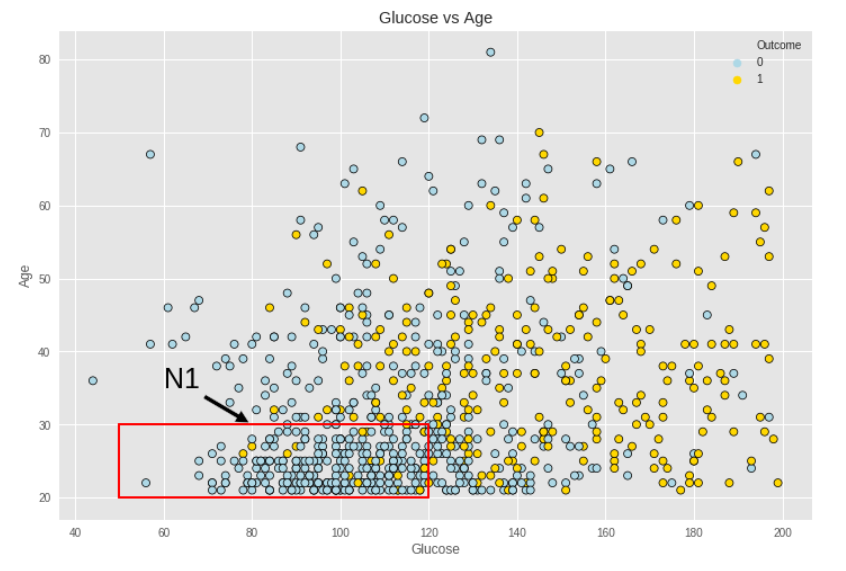

```python
# 将data中所有的'N1'列赋值为0
data.loc[:, 'N1'] = 0
# 筛选出年龄小于等于30岁且葡萄糖水平小于等于120的记录，并将这些记录的'N1'列赋值为1
data.loc[(data['Age'] <= 30) & (data['Glucose'] <= 120), 'N1'] = 1
```

这段代码首先将`data` DataFrame中的'N1'列的所有值设置为0。接下来，使用布尔索引和逻辑运算符`&`来组合两个条件：年龄（'Age'列）小于等于30岁，以及葡萄糖水平（'Glucose'列）小于等于120。然后，对于满足这两个条件的所有记录，将'N1'列的值设置为1。这样的操作可以在数据集中创建一个新的特征列'N1'，用于标识特定的记录子集。


```python
barplot('N1', ':Glucose <= 120 and Age <= 30')
# 调用barplot函数，传入'N1'作为变量选择，以及字符串'Glucose <= 120 and Age <= 30'作为子标题，
# 目的是根据'N1'列的值绘制条形图，并展示满足特定条件（葡萄糖水平小于等于120且年龄小于等于30）的数据分布。
```

这段代码调用了一个名为`barplot`的函数，传入了两个参数。第一个参数`'N1'`是数据集中的一个列名，它代表了我们想要可视化的数据特征。第二个参数`':Glucose <= 120 and Age <= 30'`是一个字符串，它将作为条形图的子标题，提供了关于数据集特定子集的额外信息。这个子标题表明我们关注的是那些葡萄糖水平不超过120且年龄不超过30岁的记录。函数内部将根据`'N1'`列的值分布创建一个条形图，并通过子标题提供数据集的上下文信息。

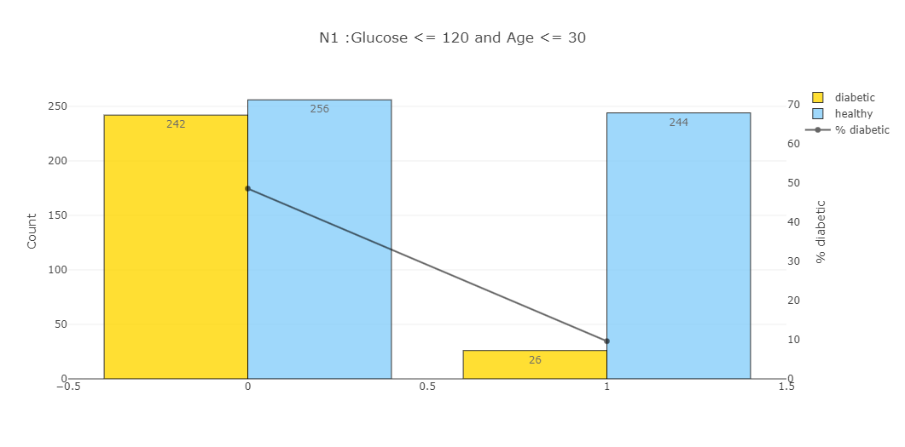


```python
plot_pie('N1', '(Glucose <= 120 and Age <= 30)')
# 调用plot_pie函数，传入'N1'作为要分析的变量名，传入'(Glucose <= 120 and Age <= 30)'作为子标题，
# 目的是根据'N1'列的值绘制饼图，并展示满足条件（葡萄糖水平小于等于120且年龄小于等于30）的分布情况。
```

这段代码调用了一个名为`plot_pie`的函数，用于生成饼图以展示数据集中'N1'列的分布情况。'N1'列是一个二元特征，可能代表某种分类结果或条件的满足情况。函数的第二个参数是一个字符串，它作为饼图的子标题，提供了关于数据集特定子集的额外信息。这个子标题表明我们关注的是那些满足特定条件（葡萄糖水平小于等于120且年龄小于等于30）的记录。函数内部将根据'N1'列的值计算各类别的百分比，并创建一个饼图来直观展示这些信息。

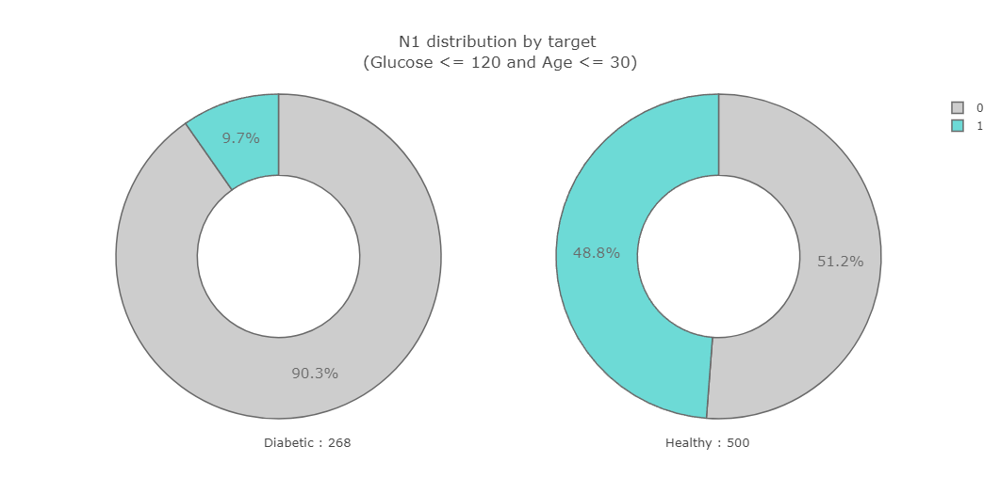


### **BMI**

According to wikipedia "The body mass index (BMI) or Quetelet index is a value derived from the mass (weight) and height of an individual. The BMI is defined as the body mass divided by the square of the body height, and is universally expressed in units of $kg/m^{2}$, resulting from mass in kilograms and height in metres."

30 $kg/m^{2}$ is the limit to obesity


```python
# 将data中所有的'N2'列赋值为0
# 此行代码将DataFrame 'data' 中 'N2' 列的所有行设置为0，初始化该列为默认值0。
data.loc[:, 'N2'] = 0

# 筛选出BMI小于等于30的记录，并将这些记录的'N2'列赋值为1
# 这里使用布尔索引来找出 'BMI' 列中值小于等于30的行，并将这些行对应的 'N2' 列的值设置为1，表示这些记录满足特定条件。
data.loc[(data['BMI'] <= 30), 'N2'] = 1

# 调用barplot函数，传入'N2'作为变量选择，以及字符串': BMI <= 30'作为子标题
# 此行代码调用barplot函数来生成条形图，展示 'N2' 列的分布情况，其中 'N2' 列代表的是满足条件 'BMI小于等于30' 的记录。
barplot('N2', ': BMI <= 30')
```

这段代码首先设置了一个新的列'N2'，并为其赋予了初始值0。然后，它更新了那些BMI值小于等于30的记录，将这些记录的'N2'列的值设置为1。最后，通过调用`barplot`函数，根据'N2'列的值绘制条形图，以可视化满足特定BMI条件的数据分布情况。子标题': BMI <= 30'提供了对图表内容的额外说明，指出了'N2'列所表示的具体条件。


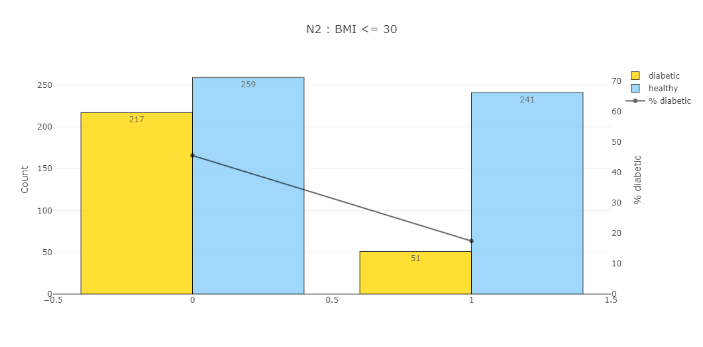


```python
plot_pie('N2', 'BMI <= 30')
```


### **Pregnancies and Age**


```python
plot_feat1_feat2('Pregnancies','Age')
```

```python
# 定义颜色字典，用于根据Outcome列的值（0或1）给点着色
palette = {0: 'lightblue', 1: 'gold'}
# 设置边缘颜色为黑色
edgecolor = 'black'

# 创建一个大小为12x8英寸的图形
fig = plt.figure(figsize=(12, 8))

# 使用Seaborn的scatterplot函数绘制散点图
# x轴为'Pregnancies'列，y轴为'Age'列，根据'Outcome'列的值着色
# 数据来源为data DataFrame，使用定义的颜色palette，边缘颜色设置为edgecolor
ax1 = sns.scatterplot(x=data['Pregnancies'], y=data['Age'], hue="Outcome",
                        data=data, palette=palette, edgecolor=edgecolor)

# 添加注释'N3'，位置在(6, 25)，文本大小为25，箭头指向点
plt.annotate('N3', size=25, color='black', xy=(6, 25), xytext=(10, 25),
            # 定义注释的箭头样式
            arrowprops=dict(facecolor='black', shrink=0.05),
            )

# 绘制红色的直线和箭头，形成对角线
plt.plot([0, 6], [30, 30], linewidth=2, color='red')  # 从(0, 30)到(6, 30)
plt.plot([6, 6], [20, 30], linewidth=2, color='red')  # 从(6, 20)到(6, 30)
plt.plot([0, 6], [20, 20], linewidth=2, color='red')  # 从(0, 20)到(6, 20)
plt.plot([0, 0], [20, 30], linewidth=2, color='red')  # 从(0, 20)到(0, 30)

# 设置图表标题为'Pregnancies vs Age'
plt.title('Pregnancies vs Age')

# 显示图表
plt.show()
```

这段代码首先定义了一个颜色字典`palette`，用于区分图表中的两种不同类别（例如，健康和糖尿病患者），其中0和1分别对应不同的颜色。然后，设置了图形的大小，并使用Seaborn的`scatterplot`函数绘制了一个散点图，其中点的颜色根据`Outcome`列的值变化。接着，使用`annotate`函数在图表中添加了一个注释，并绘制了红色的对角线。最后，设置了图表的标题并显示了图表。这个散点图有助于观察怀孕次数与年龄之间的关系，并区分糖尿病患者和健康人的数据点。


```python
# 将data中所有的'N3'列赋值为0
# 这行代码将DataFrame 'data' 中 'N3' 列的所有行设置为0，初始化该列为默认值0。
data.loc[:, 'N3'] = 0

# 筛选出年龄小于等于30且怀孕次数小于等于6的记录，并将这些记录的'N3'列赋值为1
# 这里使用布尔索引来找出 'Age' 列中值小于等于30且 'Pregnancies' 列中值小于等于6的行，并将这些行对应的 'N3' 列的值设置为1，表示这些记录满足特定条件。
data.loc[(data['Age'] <= 30) & (data['Pregnancies'] <= 6), 'N3'] = 1

# 调用barplot函数，传入'N3'作为变量选择，以及字符串': Age <= 30 and Pregnancies <= 6'作为子标题
# 此行代码调用barplot函数来生成条形图，展示 'N3' 列的分布情况，其中 'N3' 列代表的是满足条件 '年龄小于等于30且怀孕次数小于等于6' 的记录。
barplot('N3', ': Age <= 30 and Pregnancies <= 6')
```

这段代码首先设置了一个新的列'N3'，并为其赋予了初始值0。然后，它更新了那些年龄小于等于30且怀孕次数小于等于6的记录，将这些记录的'N3'列的值设置为1。最后，通过调用`barplot`函数，根据'N3'列的值绘制条形图，以可视化满足特定条件的数据分布情况。子标题': Age <= 30 and Pregnancies <= 6'提供了对图表内容的额外说明，指出了'N3'列所表示的具体条件。


```python
plot_pie('N3', 'Age <= 30 and Pregnancies <= 6')
```


### **Glucose and BloodPressure**

```python
plot_feat1_feat2('Glucose','BloodPressure')
```
Healthy persons are concentrate with an blood pressure <= 80 and glucose <= 105

```python
# 定义颜色字典，用于根据Outcome列的值（0或1）给点着色
# 这里创建了一个名为palette的字典，用于为散点图中的点设置颜色，其中0对应浅蓝色，1对应金色。
palette = {0: 'lightblue', 1: 'gold'}
# 设置边缘颜色为黑色
# 这行代码设置了散点图中点的边缘颜色为黑色。
edgecolor = 'black'

# 创建一个大小为12x8英寸的图形
# 这行代码创建了一个图形对象fig，其大小设置为宽12英寸、高8英寸。
fig = plt.figure(figsize=(12, 8))

# 使用Seaborn的scatterplot函数绘制散点图
# 这行代码使用Seaborn库的scatterplot函数，根据'Glucose'列作为x轴，'BloodPressure'列作为y轴，'Outcome'列的值作为颜色的依据，绘制散点图。
ax1 = sns.scatterplot(x=data['Glucose'], y=data['BloodPressure'], hue="Outcome",
                        data=data, palette=palette, edgecolor=edgecolor)

# 添加注释'N4'，位置在(70, 80)，文本大小为25，箭头指向点
# 这行代码在图形中添加了一个注释，标签为'N4'，位置在点(70, 80)，文本大小为25。箭头的起点是注释点，终点是文本点。
plt.annotate('N4', size=25, color='black', xy=(70, 80), xytext=(50, 110),
            arrowprops=dict(facecolor='black', shrink=0.05),
            )

# 绘制红色的直线和箭头，形成对角线
# 这四行代码绘制了四条红色的直线，它们共同形成一个矩形的对角线，用于突出显示某个特定的数据区域。
plt.plot([40, 105], [80, 80], linewidth=2, color='red')
plt.plot([40, 40], [20, 80], linewidth=2, color='red')
plt.plot([40, 105], [20, 20], linewidth=2, color='red')
plt.plot([105, 105], [20, 80], linewidth=2, color='red')

# 设置图表标题为'Glucose vs BloodPressure'
# 这行代码设置了图表的标题，标题内容为'Glucose vs BloodPressure'。
plt.title('Glucose vs BloodPressure')

# 显示图表
# 这行代码显示了包含上述所有设置和图形的图表。
plt.show()
```

这段代码首先定义了一个颜色字典`palette`，用于区分散点图中不同类别的点。然后，设置了图形的大小，并使用Seaborn的`scatterplot`函数绘制了一个散点图，其中点的颜色根据`Outcome`列的值变化。接着，使用`annotate`函数在图表中添加了一个注释，并绘制了红色的对角线。最后，设置了图表的标题并显示了图表。这个散点图有助于观察葡萄糖水平与血压之间的关系，并区分糖尿病患者和健康人的数据点。


```python
# 将data中所有的'N4'列赋值为0
# 这行代码将DataFrame 'data' 中 'N4' 列的所有行设置为0，初始化该列为默认值0。
data.loc[:, 'N4'] = 0

# 筛选出葡萄糖水平小于等于105且血压小于等于80的记录，并将这些记录的'N4'列赋值为1
# 这里使用布尔索引来找出 'Glucose' 列中值小于等于105且 'BloodPressure' 列中值小于等于80的行，并将这些行对应的 'N4' 列的值设置为1，表示这些记录满足特定条件。
data.loc[(data['Glucose'] <= 105) & (data['BloodPressure'] <= 80), 'N4'] = 1

# 调用barplot函数，传入'N4'作为变量选择，以及字符串': Glucose <= 105 and BloodPressure <= 80'作为子标题
# 此行代码调用barplot函数来生成条形图，展示 'N4' 列的分布情况，其中 'N4' 列代表的是满足条件 '葡萄糖水平小于等于105且血压小于等于80' 的记录。
barplot('N4', ': Glucose <= 105 and BloodPressure <= 80')
```

这段代码首先设置了一个新的列'N4'，并为其赋予了初始值0。然后，它更新了那些葡萄糖水平小于等于105且血压小于等于80的记录，将这些记录的'N4'列的值设置为1。最后，通过调用`barplot`函数，根据'N4'列的值绘制条形图，以可视化满足特定条件的数据分布情况。子标题': Glucose <= 105 and BloodPressure <= 80'提供了对图表内容的额外说明，指出了'N4'列所表示的具体条件。


```python
plot_pie('N4', 'Glucose <= 105 and BloodPressure <= 80')
# 调用plot_pie函数，传入'N4'作为要分析的变量名，传入'Glucose <= 105 and BloodPressure <= 80'作为子标题，
# 目的是根据'N4'列的值绘制饼图，并展示满足条件（葡萄糖水平小于等于105且血压小于等于80）的分布情况。
```

这段代码调用了一个名为`plot_pie`的函数，用于生成饼图以展示数据集中'N4'列的分布情况。'N4'列是一个二元特征，可能代表某种分类结果或条件的满足情况。函数的第二个参数是一个字符串，它作为饼图的子标题，提供了关于数据集特定子集的额外信息。这个子标题表明我们关注的是那些葡萄糖水平小于等于105且血压小于等于80的记录。函数内部将根据'N4'列的值计算各类别的百分比，并创建一个饼图来直观展示这些信息。

### **SkinThickness**

```python
# 将data中所有的'N5'列赋值为0
# 这行代码将DataFrame 'data' 中 'N5' 列的所有行设置为0，初始化该列为默认值0。
data.loc[:, 'N5'] = 0

# 筛选出皮肤厚度小于等于20的记录，并将这些记录的'N5'列赋值为1
# 这里使用布尔索引来找出 'SkinThickness' 列中值小于等于20的行，并将这些行对应的 'N5' 列的值设置为1，表示这些记录满足特定条件。
data.loc[(data['SkinThickness'] <= 20), 'N5'] = 1

# 调用barplot函数，传入'N5'作为变量选择，以及字符串':SkinThickness <= 20'作为子标题
# 此行代码调用barplot函数来生成条形图，展示 'N5' 列的分布情况，其中 'N5' 列代表的是满足条件 '皮肤厚度小于等于20' 的记录。
barplot('N5', ':SkinThickness <= 20')
```

这段代码首先设置了一个新的列'N5'，并为其赋予了初始值0。然后，它更新了那些皮肤厚度小于等于20的记录，将这些记录的'N5'列的值设置为1。最后，通过调用`barplot`函数，根据'N5'列的值绘制条形图，以可视化满足特定条件的数据分布情况。子标题':SkinThickness <= 20'提供了对图表内容的额外说明，指出了'N5'列所表示的具体条件。

```python
plot_pie('N5', 'SkinThickness <= 20')
# 调用plot_pie函数，传入'N5'作为要分析的变量名，传入'SkinThickness <= 20'作为子标题，
# 目的是根据'N5'列的值绘制饼图，并展示满足条件（皮肤厚度小于等于20）的分布情况。
```

这段代码调用了一个名为`plot_pie`的函数，用于生成饼图以展示数据集中'N5'列的分布情况。'N5'列是一个二元特征，可能代表某种分类结果或条件的满足情况。函数的第二个参数是一个字符串，它作为饼图的子标题，提供了关于数据集特定子集的额外信息。这个子标题表明我们关注的是那些皮肤厚度小于等于20的记录。函数内部将根据'N5'列的值计算各类别的百分比，并创建一个饼图来直观展示这些信息。

### **SkinThickness and BMI**
```python
plot_feat1_feat2('SkinThickness','BMI')
# 调用plot_feat1_feat2函数，传入'SkinThickness'和'BMI'作为参数，
# 目的是在散点图中展示'SkinThickness'（皮肤厚度）和'BMI'（身体质量指数）两个特征之间的关系。
```

这段代码调用了一个名为`plot_feat1_feat2`的函数，该函数用于创建一个散点图，以可视化数据集中两个选定特征之间的关系。在这个特定的例子中，我们关注的特征是'SkinThickness'和'BMI'，分别代表皮肤厚度和身体质量指数。通过这个散点图，我们可以探索和分析这两个健康指标之间是否存在某种相关性或模式。

Healthy persons are concentrate with a BMI < 30 and skin thickness <= 20


```python
# 将data中所有的'N6'列赋值为0
# 这行代码将DataFrame 'data' 中 'N6' 列的所有行设置为0，初始化该列为默认值0。
data.loc[:, 'N6'] = 0

# 筛选出BMI小于30且皮肤厚度小于等于20的记录，并将这些记录的'N6'列赋值为1
# 这里使用布尔索引来找出 'BMI' 列中值小于30且 'SkinThickness' 列中值小于等于20的行，并将这些行对应的 'N6' 列的值设置为1，表示这些记录满足特定条件。
data.loc[(data['BMI'] < 30) & (data['SkinThickness'] <= 20), 'N6'] = 1
```

这段代码首先设置了一个新的列'N6'，并为其赋予了初始值0。然后，它更新了那些BMI小于30且皮肤厚度小于等于20的记录，将这些记录的'N6'列的值设置为1。这样的操作创建了一个新的特征列'N6'，用于标识满足特定健康指标的个体。这可能是为了后续的数据分析或可视化，其中'N6'列可以代表一个特定的健康或风险指标。


```python
# 定义颜色字典，用于根据Outcome列的值（0或1）给点着色
# 这里创建了一个名为palette的字典，用于为散点图中的点设置颜色，其中0对应浅蓝色，1对应金色。
palette = {0: 'lightblue', 1: 'gold'}
# 设置边缘颜色为黑色
# 这行代码设置了散点图中点的边缘颜色为黑色。
edgecolor = 'black'

# 创建一个大小为12x8英寸的图形
# 这行代码创建了一个图形对象fig，其大小设置为宽12英寸、高8英寸。
fig = plt.figure(figsize=(12, 8))

# 使用Seaborn的scatterplot函数绘制散点图
# 这行代码使用Seaborn库的scatterplot函数，根据'SkinThickness'列作为x轴，'BMI'列作为y轴，'Outcome'列的值作为颜色的依据，绘制散点图。
ax1 = sns.scatterplot(x=data['SkinThickness'], y=data['BMI'], hue="Outcome",
                        data=data, palette=palette, edgecolor=edgecolor)

# 添加注释'N6'，位置在(20, 20)，文本大小为25，箭头指向点
# 这行代码在图形中添加了一个注释，标签为'N6'，位置在点(20, 20)，文本大小为25。箭头的起点是注释点，终点是文本点。
plt.annotate('N6', size=25, color='black', xy=(20, 20), xytext=(50, 25),
            arrowprops=dict(facecolor='black', shrink=0.05),
            )

# 绘制红色的直线和箭头，形成对角线
# 这四行代码绘制了四条红色的直线，它们共同形成一个矩形的对角线，用于突出显示某个特定的数据区域。
plt.plot([0, 20], [30, 30], linewidth=2, color='red')  # 从(0, 30)到(20, 30)
plt.plot([0, 0], [16, 30], linewidth=2, color='red')  # 从(0, 16)到(0, 30)
plt.plot([0, 20], [16, 16], linewidth=2, color='red')  # 从(0, 16)到(20, 16)
plt.plot([20, 20], [16, 30], linewidth=2, color='red')  # 从(20, 16)到(20, 30)

# 设置图表标题为'SkinThickness vs BMI'
# 这行代码设置了图表的标题，标题内容为'SkinThickness vs BMI'。
plt.title('SkinThickness vs BMI')

# 显示图表
# 这行代码显示了包含上述所有设置和图形的图表。
plt.show()
```

这段代码首先定义了一个颜色字典`palette`，用于区分散点图中不同类别的点。然后，设置了图形的大小，并使用Seaborn的`scatterplot`函数绘制了一个散点图，其中点的颜色根据`Outcome`列的值变化。接着，使用`annotate`函数在图表中添加了一个注释，并绘制了红色的对角线。最后，设置了图表的标题并显示了图表。这个散点图有助于观察皮肤厚度与身体质量指数之间的关系，并区分糖尿病患者和健康人的数据点。


```python
barplot('N6', ': BMI < 30 and SkinThickness <= 20')
# 调用barplot函数，传入'N6'作为变量选择，以及字符串': BMI < 30 and SkinThickness <= 20'作为子标题，
# 目的是根据'N6'列的值绘制条形图，并展示满足条件（BMI小于30且皮肤厚度小于等于20）的数据分布。
```

这段代码调用了一个名为`barplot`的函数，用于生成条形图以展示数据集中'N6'列的分布情况。'N6'列是一个二元特征，可能代表某种分类结果或条件的满足情况。函数的第二个参数是一个字符串，它作为条形图的子标题，提供了关于数据集特定子集的额外信息。这个子标题表明我们关注的是那些BMI小于30且皮肤厚度小于等于20的记录。函数内部将根据'N6'列的值计算各类别的计数，并创建一个条形图来直观展示这些信息。


```python
plot_pie('N6', 'BMI < 30 and SkinThickness <= 20')
# 调用plot_pie函数，传入'N6'作为要分析的变量名，传入'BMI < 30 and SkinThickness <= 20'作为子标题，
# 目的是根据'N6'列的值绘制饼图，并展示满足条件（BMI小于30且皮肤厚度小于等于20）的分布情况。
```

这段代码调用了一个名为`plot_pie`的函数，用于生成饼图以展示数据集中'N6'列的分布情况。'N6'列是一个二元特征，可能代表某种分类结果或条件的满足情况。函数的第二个参数是一个字符串，它作为饼图的子标题，提供了关于数据集特定子集的额外信息。这个子标题表明我们关注的是那些BMI小于30且皮肤厚度小于等于20的记录。函数内部将根据'N6'列的值计算各类别的百分比，并创建一个饼图来直观展示这些信息。

### **Glucose and BMI**


```python
plot_feat1_feat2('Glucose','BMI')
# 调用plot_feat1_feat2函数，传入'Glucose'和'BMI'作为参数，
# 目的是在散点图中展示葡萄糖水平（'Glucose'）与身体质量指数（'BMI'）之间的关系。
```

这段代码调用了一个名为`plot_feat1_feat2`的函数，该函数用于创建一个散点图，以可视化数据集中两个选定特征之间的关系。在这个特定的例子中，我们关注的特征是'Glucose'（葡萄糖水平）和'BMI'（身体质量指数）。通过这个散点图，我们可以探索和分析这两个健康指标之间是否存在某种相关性或模式。


### **Insulin**


### **BloodPressure**

### **Pregnancies**


### **Others**


## 5. Prepare dataset


### 5.1. StandardScaler and LabelEncoder


### 5.2. Correlation Matrix


### 5.3. X and y


### 5.4. Model Performance


### 5.5. Scores Table


### 6.Machine Learning

### 6.1. RandomSearch + LightGBM - Accuracy = 89.8%


### 6.2. LightGBM - Discrimination Threshold


### 6.3. GridSearch + LightGBM & KNN- Accuracy = 90.6%


### 6.4. LightGBM & KNN - Discrimination Threshold


## 7. Credits

