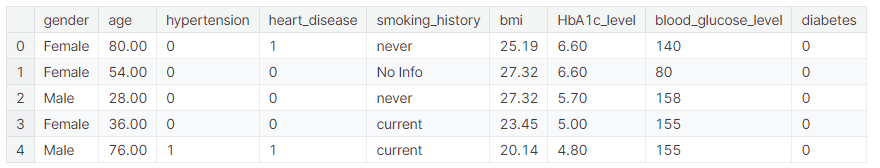
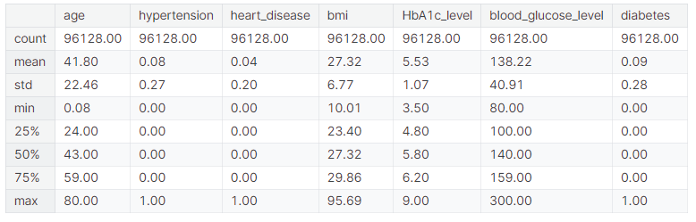
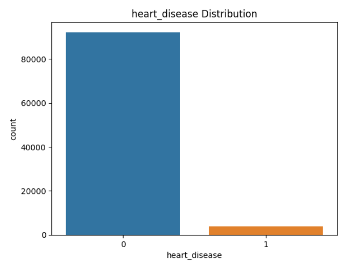
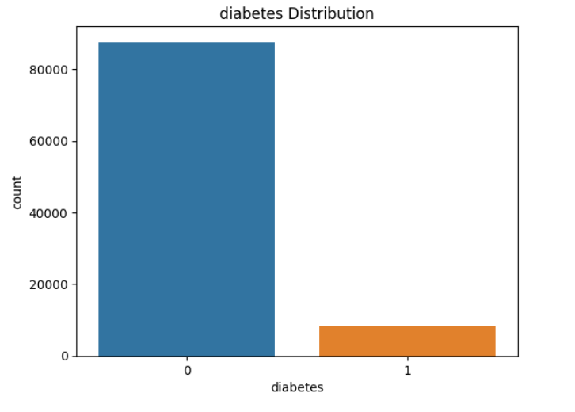

# 🍬Diabetes : EDA |🌲Random Forest🌲 + HP⚙️

> [网址](https://www.kaggle.com/code/tumpanjawat/diabetes-eda-random-forest-hp)

139个支持

448个人cope

22,461次浏览


## Getting Started

The aim of this analysis is to investigate a range of health-related factors and their interconnections **to classify diabetes accurately**. These factors include aspects such as **age**, **gender**, **body mass index (BMI)**, **hypertension**, **heart disease**, **smoking history**, **HbA1c level**, and **blood glucose level**. This comprehensive examination will not only provide insights into the patterns and trends in diabetes risk but will also create a solid base for further research. Specifically, research can be built on how these variables interact and influence diabetes occurrence and progression, crucial knowledge for improving patient care and outcomes in this increasingly critical area of healthcare.


###  Domain Knowledge
#### 1. Age: 
Age is an important factor in predicting diabetes risk. As individuals get older, their risk of developing diabetes increases. This is partly due to factors such as reduced physical activity, changes in hormone levels, and a higher likelihood of developing other health conditions that can contribute to diabetes.

#### 2. Gender: 
Gender can play a role in diabetes risk, although the effect may vary. For example, women with a history of gestational diabetes (diabetes during pregnancy) have a higher risk of developing type 2 diabetes later in life. Additionally, some studies have suggested that men may have a slightly higher risk of diabetes compared to women.

#### 3. Body Mass Index (BMI): 
BMI is a measure of body fat based on a person's height and weight. It is commonly used as an indicator of overall weight status and can be helpful in predicting diabetes risk. Higher BMI is associated with a greater likelihood of developing type 2 diabetes. Excess body fat, particularly around the waist, can lead to insulin resistance and impair the body's ability to regulate blood sugar levels.

#### 4. Hypertension: 
Hypertension, or high blood pressure, is a condition that often coexists with diabetes. The two conditions share common risk factors and can contribute to each other's development. Having hypertension increases the risk of developing type 2 diabetes and vice versa. Both conditions can have detrimental effects on cardiovascular health.

#### 5. Heart Disease: 
Heart disease, including conditions such as coronary artery disease and heart failure, is associated with an increased risk of diabetes. The relationship between heart disease and diabetes is bidirectional, meaning that having one condition increases the risk of developing the other. This is because they share many common risk factors, such as obesity, high blood pressure, and high cholesterol.

#### 6. Smoking History: 
Smoking is a modifiable risk factor for diabetes. Cigarette smoking has been found to increase the risk of developing type 2 diabetes. Smoking can contribute to insulin resistance and impair glucose metabolism. Quitting smoking can significantly reduce the risk of developing diabetes and its complications.

#### 7. HbA1c Level: 
HbA1c (glycated hemoglobin) is a measure of the average blood glucose level over the past 2-3 months. It provides information about long-term blood sugar control. Higher HbA1c levels indicate poorer glycemic control and are associated with an increased risk of developing diabetes and its complications.

#### 8. Blood Glucose Level: 
Blood glucose level refers to the amount of glucose (sugar) present in the blood at a given time. Elevated blood glucose levels, particularly in the fasting state or after consuming carbohydrates, can indicate impaired glucose regulation and increase the risk of developing diabetes. Regular monitoring of blood glucose levels is important in the diagnosis and management of diabetes.


> ✔️ These features, when combined and analyzed with appropriate statistical and machine learning techniques, can help in predicting an individual's risk of developing diabetes.


## 0. INTRODUCTION

### 0.1. Preface
In this analysis, we have chosen the RandomForest classifier as our model. **The RandomForest algorithm** is an ensemble learning method that operates by constructing a multitude of decision trees during training and outputting the class that is the mode of the classes for classification or mean prediction of the individual trees for regression.


> Several reasons guided our choice of **Random Forest** for this task:

* 1. **Handling of Large Data**: **Random Forest** is capable of efficiently handling large datasets with high dimensionality. Our dataset, containing a substantial number of rows and several features, falls into this category.

* 2. **Robustness to Overfitting**: **Random Forest** reduces the risk of overfitting, which is a common problem with decision trees. The algorithm accomplishes this by creating a set of **decision trees** (a "forest") and making the final prediction based on the majority vote of the individual trees.

* 3. **Handling Mixed Data Types**: In our dataset, we have both numerical and categorical features. **Random Forest** handles such mixtures smoothly, which makes it an ideal choice.

* 4. **Feature Importance**: **Random Forest** provides a straightforward way to estimate feature importance. Given our aim to investigate the impact of different factors on diabetes, this characteristic is particularly useful.

* 5. **Non-linearity**: Medical data often contains complex and non-linear relationships. **Random Forest**, being a non-linear model, can capture these relationships effectively.


> ⚠️ It's worth noting that while **Random Fores**t is a strong candidate given its mentioned advantages, the choice of model should always be considered with a grain of salt. Other models might perform better on the task, and it's generally a good practice to try several models and compare their performance. However, for the purpose of this analysis and given our dataset, **Random Forest** **is a practical and reasonable starting point**.

###  0.2. Import libraries
```python
import warnings
warnings.filterwarnings('ignore')

# 导入必要的库
import numpy as np  # 导入NumPy库，用于数值计算
import pandas as pd  # 导入Pandas库，用于数据分析和操作

# 导入可视化库
import matplotlib.pyplot as plt  # 导入Matplotlib库的pyplot模块，用于绘制图表
import seaborn as sns  # 导入Seaborn库，用于数据可视化

# 导入模型相关的库
from sklearn.model_selection import train_test_split, GridSearchCV  # 导入模型选择相关的train_test_split和GridSearchCV
from sklearn.preprocessing import StandardScaler, OneHotEncoder  # 导入数据预处理相关的StandardScaler和OneHotEncoder
from sklearn.compose import ColumnTransformer  # 导入ColumnTransformer，用于处理不同类型的数据
from sklearn.ensemble import RandomForestClassifier  # 导入集成学习中的随机森林分类器
from sklearn.metrics import accuracy_score, classification_report, confusion_matrix  # 导入模型评估相关的指标
from sklearn.pipeline import Pipeline  # 导入Pipeline，用于构建预处理和模型的流水线

# 导入采样器相关的库
from imblearn.over_sampling import SMOTE  # 导入SMOTE过采样器，用于处理不平衡数据集
from imblearn.under_sampling import RandomUnderSampler  # 导入随机下采样器
from imblearn.pipeline import Pipeline as imbPipeline  # 导入imblearn的Pipeline，用于构建过采样或下采样的流水线

# 设置浮点数显示格式
pd.options.display.float_format = "{:.2f}".format  # 设置Pandas显示浮点数时保留两位小数
```

这段代码首先导入了Python中用于数据处理、可视化、机器学习模型构建和评估的库。然后，通过`warnings.filterwarnings('ignore')`忽略警告信息。接着，设置了Pandas的显示格式，使得浮点数在输出时只保留两位小数。这些准备工作为后续的数据分析和机器学习任务奠定了基础。

###  0.3. Input the data

```python
# 从指定路径读取CSV文件到DataFrame
df = pd.read_csv("/kaggle/input/diabetes-prediction-dataset/diabetes_prediction_dataset.csv")
```
这行代码使用Pandas库中的`read_csv`函数来读取存储在Kaggle输入数据集路径下的CSV文件。文件路径`"/kaggle/input/diabetes-prediction-dataset/diabetes_prediction_dataset.csv"`指定了CSV文件的位置。读取的数据将被存储到一个名为`df`的DataFrame对象中，以便后续进行数据分析和处理。


```python
df.head()
```




## 1 | EXPLORATORY DATA ANALYSIS

### 1. Data Quality

#### I | Handling Duplicates
```python
# Handle duplicates
# 处理重复的行
# 通过调用duplicated()方法找出DataFrame df中的重复行，并将这些行存储在duplicate_rows_data变量中
duplicate_rows_data = df[df.duplicated()]
# 打印重复行的数量
print("number of duplicate rows: ", duplicate_rows_data.shape)
```

这段代码的目的是识别并处理数据集中的重复行。首先，使用`duplicated()`函数检查`df`中的重复行，并将这些重复的行筛选出来，存储在`duplicate_rows_data`变量中。然后，使用`shape`属性来获取`duplicate_rows_data`中的行数，并将其打印出来，以便了解数据集中存在多少重复的行。这是数据预处理的一个重要步骤，因为重复的数据可能会影响数据分析和机器学习模型的性能。


```python
number of duplicate rows:  (3854, 9)
```

这个结果显示，在数据集中有3854行是重复的，而每行包含9个特征（或列）。这可能意味着在原始数据集中，有些记录被不小心输入了多次，这些重复的记录可能会对数据分析和模型训练产生不利影响。通常，我们需要决定如何处理这些重复的数据，比如删除重复行或者合并重复记录中的信息。在进行进一步的数据分析之前，处理重复数据是一个重要的数据清洗步骤。

```python
# 删除重复的行
# 调用drop_duplicates()方法移除df中的重复行，只保留唯一的记录
df = df.drop_duplicates()
```

这段代码使用Pandas库中的`drop_duplicates()`方法来删除DataFrame `df`中的重复行。这个方法会检查数据集中的所有行，并移除那些与其他行完全相同的行，只保留唯一的记录。这样做可以减少数据集中的冗余，确保后续的数据分析和模型训练更加准确。删除重复行后，更新的DataFrame仍然命名为`df`。


#### II | Uniqueness

```python
# Loop through each column and count the number of distinct values
# 遍历每一列，统计每列不同值的数量
# 通过for循环遍历DataFrame df的所有列
for column in df.columns:
    # 计算每个列中唯一值的数量
    num_distinct_values = len(df[column].unique())
    # 打印每个列的名称以及对应的不同值数量
    print(f"{column}: {num_distinct_values} distinct values")
```

这段代码通过一个for循环遍历DataFrame `df`中的所有列。对于每一列，使用`unique()`函数找出列中的唯一值，并使用`len()`函数计算这些唯一值的数量。然后，使用`print`函数输出每个列的名称和其具有的不同值的数量。这个过程有助于了解数据集中每个特征的多样性，例如，如果某个特征的不同值数量非常少，可能表明这个特征对于数据集的区分能力有限。


```python
gender: 3 distinct values
age: 102 distinct values
hypertension: 2 distinct values
heart_disease: 2 distinct values
smoking_history: 6 distinct values
bmi: 4247 distinct values
HbA1c_level: 18 distinct values
blood_glucose_level: 18 distinct values
diabetes: 2 distinct values
```

这个结果显示了数据集中每个特征（列）的不同值数量。具体来说：

- `gender`列有3个不同的值，可能表示性别分类（如男、女等）。
- `age`列有102个不同的值，这可能意味着年龄数据是分年龄段记录的，或者是连续的年龄值。
- `hypertension`和`heart_disease`列各有2个不同的值，这可能表示这两个特征是二元的，即有或没有的状况。
- `smoking_history`列有6个不同的值，这可能表示吸烟史的不同分类（如从不吸烟、以前吸烟、现在吸烟等）。
- `bmi`列有4247个不同的值，这是一个相对较高的数量，表明BMI值是连续记录的，有很多不同的可能值。
- `HbA1c_level`和`blood_glucose_level`列各有18个不同的值，这可能意味着这两个指标是按等级或类别记录的。
- `diabetes`列有2个不同的值，这通常表示这个特征是二元的，即表示是否有糖尿病。

了解每个特征的不同值数量对于数据预处理和特征工程非常重要，可以帮助决定如何处理分类特征、是否需要对连续特征进行分箱（binning）或标准化，以及如何为模型训练准备数据。

#### III | Missing Values

```python
# Checking null values
# 检查空值
# 使用df.isnull()生成一个与df形状相同的布尔DataFrame，其中每个位置的值表示相应位置的值是否为空（True表示空值，False表示非空值）
# 然后使用sum()方法对布尔DataFrame按列求和，得到每一列的空值数量
print(df.isnull().sum())
```

这段代码的目的是检查DataFrame `df`中的空值（NaN或None）数量。通过调用`isnull()`方法，它会返回一个与原DataFrame形状相同的布尔DataFrame，其中的值表示原始DataFrame对应位置的元素是否为空。接着，调用`sum()`方法对布尔DataFrame按列求和，得到的结果是每一列的空值数量。这样，我们可以了解数据集中哪些特征包含空值，以及空值的总数，这对于数据清洗和预处理是非常重要的一步。


```python
gender                 0
age                    0
hypertension           0
heart_disease          0
smoking_history        0
bmi                    0
HbA1c_level            0
blood_glucose_level    0
diabetes               0
dtype: int64
```

这个结果显示，在DataFrame `df` 中的所有特征列中，没有检测到空值（null values）。每一列的空值数量都显示为0，这意味着数据集在这些列中是完整的，没有缺失的数据。这是一个良好的数据状态，因为缺失数据可能会导致在数据分析和机器学习模型训练过程中出现问题。在这种情况下，我们可以继续进行后续的数据处理和分析，而不需要额外担心处理空值的问题。


```python
# Remove Unneccessary value [0.00195%]
# 移除占比较小的类别 [0.00195%]
# 通过条件筛选移除'gender'列中值为'Other'的行
df = df[df['gender'] != 'Other']
```

这段代码的目的是筛选掉`gender`列中值为'Other'的行，这通常是因为该类别在数据集中占比较小，可能对分析结果的贡献有限。通过使用布尔索引，`df[df['gender'] != 'Other']`创建了一个新的DataFrame，其中不包含'gender'列为'Other'的记录。这样，更新后的DataFrame `df`将不再包含这些行，可以用于后续的数据分析和模型训练。

#### IV | Describe the Data

```python
# 展示数据集的描述性统计信息，并格式化为保留两位小数
# describe()方法生成数据集的描述性统计概览，包括均值、标准差、最小值、四分位数和最大值
# style.format("{:.2f}")将这些统计值格式化为保留两位小数的格式
df.describe().style.format("{:.2f}")
```

这段代码使用Pandas库中的`describe()`方法来获取DataFrame `df`的描述性统计信息，包括各数值型列的均值、标准差、最小值、第一四分位数、第三四分位数和最大值。然后，通过`style.format("{:.2f}")`将这些统计值格式化为保留两位小数的格式，使得输出结果更加整洁和易于阅读。这有助于我们快速了解数据集的分布情况和数值范围。



这个表格显示了数据集中各个数值型特征的描述性统计信息。具体来说：

- `age`列的平均年龄是41.80岁，标准差为22.46岁，表明年龄分布有一定的波动。年龄的最小值是0.08岁（可能是数据错误），25%分位数是24岁，中位数是43岁，75%分位数是59岁，最大年龄是80岁。
- `hypertension`列~~的平均值是0.08，标准差为0.27，这表明大多数人没有高血压（可能0表示没有，1表示有）。25%分位数和中位数都是0，说明大部分数据集中在没有高血压的状态。~~
- `heart_disease`列~~的平均值是0.04，标准差为0.20，同样地，这表明大多数人没有心脏病。由于平均值较低，可以推断心脏病在这个群体中不是很常见。~~
- `bmi`列的平均值是27.32，标准差为6.77，这可能表明大多数人的体重指数在正常范围内（18.5-24.9），但有一定比例的人可能超重或肥胖。
- `HbA1c_level`列的平均值是5.53%，标准差为1.07%，这个值反映了血糖控制的平均水平。HbA1c水平是糖尿病诊断和管理的重要指标。
- `blood_glucose_level`列的平均值是138.22 mg/dL，标准差为40.91 mg/dL，这个值是空腹血糖水平，反映了整体的血糖控制情况。
- `diabetes`列~~的平均值是0.09，标准差为0.28，这表明在数据集中，有一定比例的人患有糖尿病（可能0表示没有糖尿病，1表示有糖尿病）。~~

这些统计信息为我们提供了数据集的概览，有助于我们理解数据的分布和潜在的问题，例如异常值或数据的偏斜情况。这对于后续的数据清洗和特征工程是非常有用的。


### 2. Univariate Analysis
#### I | Histogram for age
```python
# Histogram for age
# 为年龄列绘制直方图
# 使用plt.hist()绘制'age'列的直方图，bins参数设置为30，表示将年龄分布划分为30个区间
plt.hist(df['age'], bins=30, edgecolor='black')  # 直方图的边缘颜色设置为黑色

# 设置图表标题和坐标轴标签
plt.title('Age Distribution')  # 设置图表标题为'Age Distribution'
plt.xlabel('Age')  # 设置x轴标签为'Age'
plt.ylabel('Count')  # 设置y轴标签为'Count'

# 显示图表
plt.show()  # 调用plt.show()在屏幕上展示图表
```

这段代码使用Matplotlib库中的`hist`函数来绘制数据集中'age'列的直方图。直方图是一种统计报告图，用于展示数据分布的情况。`bins`参数定义了直方图的区间数量，这里设置为30，意味着年龄分布将被划分为30个区间。`edgecolor`参数设置了直方图每个柱状区间边缘的颜色。接着，设置了图表的标题和x轴、y轴的标签，以便更好地解释图表内容。最后，使用`plt.show()`函数将绘制的直方图显示出来。这样的直方图有助于我们直观地理解年龄数据的分布情况。


#### II | Bar plot for gender

```python
# 为性别列绘制条形图
# 使用Seaborn库的countplot函数根据'gender'列的值计数，生成条形图
sns.countplot(x='gender', data=df)

# 设置图表标题
plt.title('Gender Distribution')  # 设置图表标题为'Gender Distribution'

# 显示图表
plt.show()  # 调用plt.show()在屏幕上展示图表
```

这段代码使用Seaborn库中的`countplot`函数来绘制数据集中'gender'列的条形图，该图展示了不同性别的计数。`countplot`是一种特殊的条形图，用于显示分类变量的计数。在这里，它将数据集中的性别分布可视化，不同的性别类别将在x轴上展示，对应的计数（即频数）将在y轴上展示。设置了图表的标题以便更好地解释图表内容。最后，使用`plt.show()`函数将绘制的条形图显示出来，这有助于我们直观地理解数据集中性别的分布情况。


#### III | Distribution plot for BMI

```python
# Distribution plot for BMI
# 为BMI列绘制分布图
# 使用Seaborn库的distplot函数根据'bmi'列的值绘制分布图，bins参数设置为30，表示将数据划分为30个区间
sns.distplot(df['bmi'], bins=30)

# 设置图表标题
plt.title('BMI Distribution')  # 设置图表标题为'BMI Distribution'

# 显示图表
plt.show()  # 调用plt.show()在屏幕上展示图表
```

这段代码使用Seaborn库中的`distplot`函数来绘制数据集中'bmi'列的分布图。分布图是一种用于展示连续变量分布情况的图表，它可以显示数据的直方图和核密度估计曲线。在这里，`bins`参数定义了直方图的区间数量，设置为30意味着数据将被划分为30个区间。通过这种方式，我们可以更直观地了解BMI值的分布情况。设置了图表的标题以便更好地解释图表内容。最后，使用`plt.show()`函数将绘制的分布图显示出来。


#### IV | Count plots for binary variables

```python
# Count plots for binary variables
# 为二元变量绘制计数图
# 通过for循环遍历'hypertension', 'heart_disease', 'diabetes'这三个二元变量
for col in ['hypertension', 'heart_disease', 'diabetes']:
    # 为当前遍历的列绘制计数图
    sns.countplot(x=col, data=df)  # 使用Seaborn库的countplot函数根据列'col'的值计数，生成条形图
    # 设置图表标题为当前列名的分布
    plt.title(f'{col} Distribution')  # 使用f-string格式化字符串设置图表标题
    # 显示图表
    plt.show()  # 调用plt.show()在屏幕上展示图表
```

这段代码通过一个for循环，分别为'hypertension'（高血压）、'heart_disease'（心脏病）和'diabetes'（糖尿病）这三个二元变量绘制计数图。对于每个变量，使用Seaborn库的`countplot`函数根据数据集中'col'列的值计数，并生成条形图。每个条形图的标题设置为对应变量的分布，使用f-string格式化字符串来动态创建标题。最后，使用`plt.show()`函数将每个变量的计数图显示出来，从而直观地展示每个二元变量的分布情况。







#### V | Count plot for smoking history

```python
# Count plot for smoking history
# 为吸烟史列绘制计数图
# 使用Seaborn库的countplot函数根据'smoking_history'列的值计数，生成条形图
sns.countplot(x='smoking_history', data=df)

# 设置图表标题
plt.title('Smoking History Distribution')  # 设置图表标题为'Smoking History Distribution'

# 显示图表
plt.show()  # 调用plt.show()在屏幕上展示图表
```

这段代码使用Seaborn库中的`countplot`函数来绘制数据集中'smoking_history'列的计数图。该图表展示了不同吸烟史分类的计数，可以帮助我们了解数据集中吸烟史的分布情况。图表的标题被设置为'Smoking History Distribution'，以便清楚地说明图表的内容。最后，使用`plt.show()`函数将计数图显示出来。


### 3.Bivariative Analysis
#### I | Boxplot BMI vs Diabetes classification

```python
# Boxplot BMI vs Diabetes classification
# 绘制BMI与糖尿病分类的箱形图
# 使用Seaborn库的boxplot函数根据'diabetes'列的值在x轴进行分类，并以'bmi'列的值为y轴数据，绘制箱形图
sns.boxplot(x='diabetes', y='bmi', data=df)

# 设置图表标题
plt.title('BMI vs Diabetes')  # 设置图表标题为'BMI vs Diabetes'

# 显示图表
plt.show()  # 调用plt.show()在屏幕上展示图表
```

这段代码使用Seaborn库中的`boxplot`函数来绘制数据集中'bmi'列与'diabetes'列之间的关系。箱形图是一种标准化的显示数值数据分布的图表，可以比较不同特征的中位数、四分位数和极值。在这里，数据根据'diabetes'列的值（可能是0和1，代表无糖尿病和有糖尿病）在x轴上进行分类，而'bmi'列的值作为y轴上的数据。这有助于我们观察不同糖尿病状态的人群在BMI上的分布差异。设置了图表的标题以便更好地解释图表内容。最后，使用`plt.show()`函数将箱形图显示出来。


#### II | Boxplot Age vs Diabetes classification
```python
# Boxplot Age vs Diabetes classification
sns.boxplot(x='diabetes', y='age', data=df)
plt.title('Age vs Diabetes')
plt.show()
```


#### III | Count plot of gender vs diabetes
```python
# Count plot of gender vs diabetes
sns.countplot(x='gender', hue='diabetes', data=df)
plt.title('Gender vs Diabetes')
plt.show()
```


#### III | Boxplot HbA1c level vs Diabetes classification
```python
# Boxplot HbA1c level vs Diabetes classification
sns.boxplot(x='diabetes', y='HbA1c_level', data=df)
plt.title('HbA1c level vs Diabetes')
plt.show()
```


#### IV | Boxplot blood glucose level vs Diabetes classification
```python
# Boxplot blood glucose level vs Diabetes classification
sns.boxplot(x='diabetes', y='blood_glucose_level', data=df)
plt.title('Blood Glucose Level vs Diabetes')
plt.show()
```


#### V | Pair plot for numeric features

```python
# Pair plot for numeric features
# 为数值型特征绘制成对关系图
# 使用Seaborn库的pairplot函数根据数据集中的数值型特征绘制成对关系图，并通过'diabetes'列的值进行着色
sns.pairplot(df, hue='diabetes')

# 显示图表
plt.show()  # 调用plt.show()在屏幕上展示图表
```

这段代码使用Seaborn库中的`pairplot`函数来绘制数据集中数值型特征的成对关系图。成对关系图是一种可视化多个变量之间关系的工具，它展示了数据集中每一对数值型特征的散点图，同时还包括了直方图。在这里，通过`hue='diabetes'`参数，散点图根据'diabetes'列的值（可能是0和1，代表无糖尿病和有糖尿病）进行着色，从而可以观察不同糖尿病状态对特征分布的影响。最后，使用`plt.show()`函数将成对关系图显示出来。


### 4. Multivariate analysis
#### I | Scatterplot Age vs BMI colored by Diabetes classification


#### II | Violin plot of BMI against diabetes classification split by gender


#### III | Interaction between gender, BMI and diabetes


#### IV | Interaction between gender, Age and diabetes


## 2 | CORRELATION
### I | Data preparation


### II | Encoding


### III | Correlation Matrix


## 3 | PREDICTIVE ANALYSIS
### 1. Class Imbalance
From the EDA ,the dataset is imbalanced (with 9% positive cases for diabetes and 91% negative cases), it's essential to balance the data to ensure that the model doesn't get biased towards the majority class. For this purpose, the Synthetic Minority Over-sampling Technique (SMOTE) is used, which generates synthetic samples for the minority class.


### 2.Preprocessing : Scaler
Preprocessing is a crucial step before training the model. In this case, numerical features are standardized (mean removed and scaled to unit variance), and categorical features are one-hot encoded. Standardization is not required for all models but is generally a good practice. One-hot encoding is necessary for categorical variables to be correctly understood by the machine learning model.

The StandardScaler in sklearn is based on the assumption that the data, Y, follows a distribution that might not necessarily be Gaussian (normal), but we still transform it in a way that its distribution will have a mean value 0 and standard deviation of 1.</p>

In other words, given a feature vector x, it modifies the values as follows:

$ \[ Y_i = \frac{x_i - \mu(\vec{x})}{\sigma(\vec{x})} \] $

$$ Y_i = \frac{x_i - \mu(\vec{x})}{\sigma(\vec{x})} $$


where:

\( x_i \) is the i-th element of the original feature vector \( \vec{x} \),
\( \mu(\vec{x}) \) is the mean of the feature vector, and
\( \sigma(\vec{x}) \) is the standard deviation of the feature vector.
The transformed data \( Y \) (each \( Y_i \)) will have properties such that \( mean(Y) = 0 \) and \( std(Y) = 1 \).

This transformation is also known as Z-score normalization.


### 3. Model Building and Hyperparameter Tuning
A pipeline is constructed which first applies the preprocessing steps and then trains a model on the data. We use a RandomForestClassifier, which is a popular and powerful algorithm for classification tasks. The model's hyperparameters are tuned using GridSearchCV , which performs an exhaustive search over the specified parameter values for the estimator. The best performing model is selected based on cross-validation.


####  Intepret the results 
The result shows the best parameters for our Random Forest model that were found during the hyperparameter tuning process:

max_depth of 10: This indicates that the maximum depth of the trees in the forest is 10 levels. Constraining the depth of the tree helps in reducing overfitting. It appears from this result that a medium-complexity tree works best for our data. Too much complexity (a deeper tree) may capture noise, and too little (a shallower tree) may not capture the underlying structure of the data.

min_samples_leaf of 2: This means that each leaf (the end node of a decision tree, where predictions are made) must contain at least two samples. This parameter, like max_depth, is a way to control overfitting. By requiring at least two samples to make a prediction, the model prevents fitting to outliers or noise in the training data.

min_samples_split of 2: This tells us that a node must contain at least two samples in order to be split (to create two child nodes). Similar to the min_samples_leaf parameter, this can help control overfitting.

n_estimators of 50: This is the number of decision trees in the forest. The Random Forest algorithm works by averaging the predictions of many decision trees to make a final prediction, which helps reduce overfitting and variance. In this case, it seems that having 50 trees in the forest gives us the best performance.


> 💬 These parameters are a result of the Hyperparameter tuning process , and they give us insight into the structure of the data and the complexity of the model that best captures that structure. The moderately constrained tree depth and the requirements for the number of samples at each node suggest a model that is complex enough to capture the important patterns in the data, but not so complex that it overfits to noise or outliers.This balance is crucial in creating a model that will generalize well to new data.


> Remember, these are the optimal parameters given the parameter grid we defined and the specific dataset at hand. For a different dataset or with a different parameter grid, the optimal parameters could be different.


### 4. Confusion Matrix
The trained model is evaluated on the test set. Confusion matrix is used to visualize the performance of the model. It shows the true positive, true negative, false positive, and false negative predictions of the model.


Precision:¶
Precision is a measure of how many of the true positive predictions were actually correct. It is defined as the number of true positives (TP) divided by the sum of true positives (TP) and false positives (FP).

\[ Precision = \frac{TP}{TP + FP} \]

Recall:
Recall (or Sensitivity) is a measure of how many of the actual positive cases were identified correctly. It is defined as the number of true positives (TP) divided by the sum of true positives (TP) and false negatives (FN).


\[ Recall = \frac{TP}{TP + FN} \]

F1-Score:
The F1 score is the harmonic mean of Precision and Recall and tries to find the balance between precision and recall. It is defined as 2 times the product of precision and recall divided by the sum of precision and recall.


\[ F1 Score = \frac{2 * Precision * Recall}{Precision + Recall} \]


> | In all of these formulas: True Positives (TP) are the cases in which we predicted yes (diabetes present), and the actual was also yes. True Negatives (TN) are the cases in which we predicted no, and the actual was also no. False Positives (FP) are the cases in which we predicted yes, but the actual was no. False Negatives (FN) are the cases in which we predicted no, but the actual was yes.


#### | Intepret the results 
Our trained Random Forest Model achieved an accuracy of around 95%. This indicates that the model correctly classified around 95% of all cases in the test set.

Looking deeper into the classification metrics, let's dissect the performance for each class (0 and 1) separately:

A | Class 0 (Non-diabetes): 
The model has a high precision (0.98) for class 0, meaning that among all instances where the model predicted non-diabetes, 98% were indeed non-diabetes.
The recall for class 0 is also high (0.96). This means that our model correctly identified 96% of all actual non-diabetes cases in the dataset.
B | Class 1 (Diabetes): 
The precision for class 1 is lower around (0.65), which indicates that when the model predicted diabetes, it was correct around 65% of the time.
However, the recall is reasonably high around (0.80). This means that our model was able to capture around 80% of all actual diabetes cases.
The F1 score, a harmonic mean of precision and recall, is around 0.97 for class 0 and around 0.72 for class 1. The weighted average F1 score is around 0.94, in line with the overall accuracy.

This discrepancy in performance between classes is likely due to the imbalance in the original dataset. Class 0 (Non-diabetes) is the majority class and has more examples for the model to learn from.


> However, the higher recall for class 1 (Diabetes) is promising. This is an essential aspect for a healthcare model, as missing actual positive cases (false negatives) can have serious implications.


> 📝 In summary, while our model performs well overall, it particularly excels with the majority class (non-diabetes). To enhance performance on the minority class (diabetes), we can further address class imbalance or adjust model parameters. Despite these areas for improvement, the model's ability to accurately identify a high percentage of actual diabetes cases is encouraging at this early stage of model development. Subsequent iterations and refinements are expected to enhance precision in diabetes predictions without compromising recall.


### 5. Feature Importance
Finally, the importance of each feature is computed. This is the total decrease in node impurity (weighted by the probability of reaching that node, which is approximated by the proportion of samples reaching that node) averaged over all trees of the ensemble. The feature importance gives insight into which features are most useful for making predictions. The features are ranked by their importance and visualized using a bar plot.


###  Intepret the results 
The feature importance results provide insight into which features are most influential in predicting diabetes using our Random Forest Model. The importance of a feature is calculated based on how much the tree nodes that use that feature reduce impurity across all trees in the forest.

Here are the key findings from the feature importance results:
HbA1c_level is the most important feature with an importance of 0.44. HbA1c is a measure of the average levels of blood glucose over the past 2 to 3 months, so it's not surprising that it's a significant predictor of diabetes.

The blood_glucose_level the second most important feature with an importance of 0.32. This aligns with medical knowledge, as blood glucose levels are directly used to diagnose diabetes.

Age the third most important feature with an importance of 0.14. It's well known that the risk of type 2 diabetes increases as you get older.

BMI comes fourth in terms of importance at 0.06. Body Mass Index is a key risk factor for diabetes, and its role is well documented in medical literature.

Other features like hypertension and heart_disease show some importance (0.02 and 0.01, respectively), indicating that these health conditions might have some relevance in predicting diabetes, though not as significant as the top four factors.

Smoking history ('smoking_history_non-smoker', 'smoking_history_past_smoker', 'smoking_history_current') and gender ('gender_Female', 'gender_Male') are shown to have minimal or zero importance in our model. This could be due to a number of reasons including that these factors may not be as influential in the development of diabetes or it could be a result of how the data was collected or structured.


> ⚠️ These results, however, should be interpreted with caution. The importance of a feature in a Random Forest model doesn't necessarily mean a casual relationship, and it is specific to this model and this dataset. Other models might find different results. Additionally, low importance doesn't mean that the feature is unimportant for predicting diabetes in general, it may just mean that the feature is not useful in the presence of the other features. A thorough feature analysis should be considered for a better understanding of the contribution of each feature in the prediction.


> Overall, our findings do align well with medical knowledge and literature about risk factors for diabetes. The most important features are blood-related measurements, followed by age and BMI, with less importance seen for comorbid conditions like hypertension and heart disease.

## SUMMARY
The analysis employed a Random Forest classifier to predict diabetes based on various health indicators and lifestyle factors. The model was trained and evaluated on a dataset of 100,000 records, and Hyperparameter tuning was performed to optimize the model's performance.

The model achieved an accuracy of approximately 95.1%, with precision of 0.98 for class 0 (non-diabetic) and 0.69 for class 1 (diabetic). It was also able to recall 96% of non-diabetic cases and 81% of diabetic cases correctly. The relatively high accuracy and balanced performance on both classes indicate that the model is well-tuned and robust.

Feature importance analysis highlighted HbA1c_level and blood_glucose_level as the most critical factors in predicting Diabetes. Age and BMI also showed significant importance. However, some features, such as smoking history and gender, had minimal or no impact on the model's predictions.

## SUGGESTION
Data Collection: If further data collection is possible, we could aim to gather more information about lifestyle factors and other potential diabetes risk factors not covered in this dataset. For instance, detailed diet information, physical activity level, family history of diabetes, and more precise information on heart disease or hypertension might improve the model's predictive capabilities.

Model Exploration: While the Random Forest model has performed well, it might be worth exploring other machine learning models. For instance, gradient boosting models like XGBoost or LightGBM could potentially offer improved performance.

Feature Engineering: More sophisticated feature engineering could potentially improve model performance. Interaction features, polynomial features, or other transformations might be worth exploring.

Model Interpretation: To better understand the influence of each feature, we could use interpretability tools such as SHAP (SHapley Additive exPlanations) or permutation feature importance, which can offer a more nuanced view of feature importance than traditional feature importance based on impurity reduction.

Addressing Class Imbalance: Despite using SMOTE to balance the classes, there is still room for improvement in the performance metrics for the minority class. Other oversampling methods, undersampling methods, or cost-sensitive learning methods could be explored to improve the recall and precision for the minority class.

# THANK YOU!
# ✔️
## If you discovered this notebook to be useful or enjoyable, I'd greatly appreciate any upvotes! Your support motivates me to regularly update and improve it. :-)

