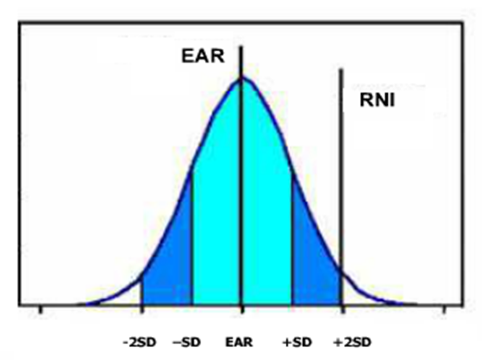
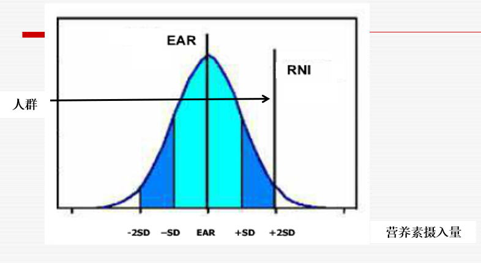
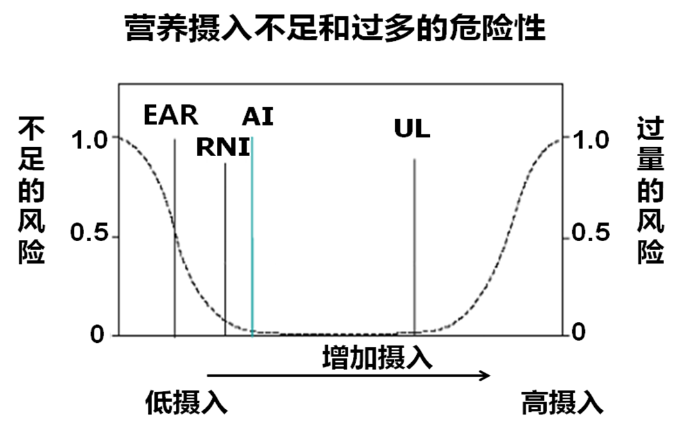
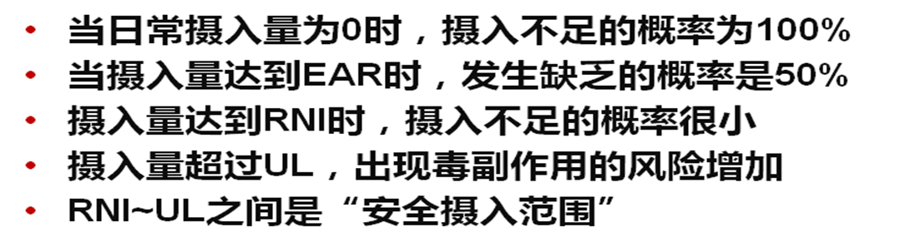
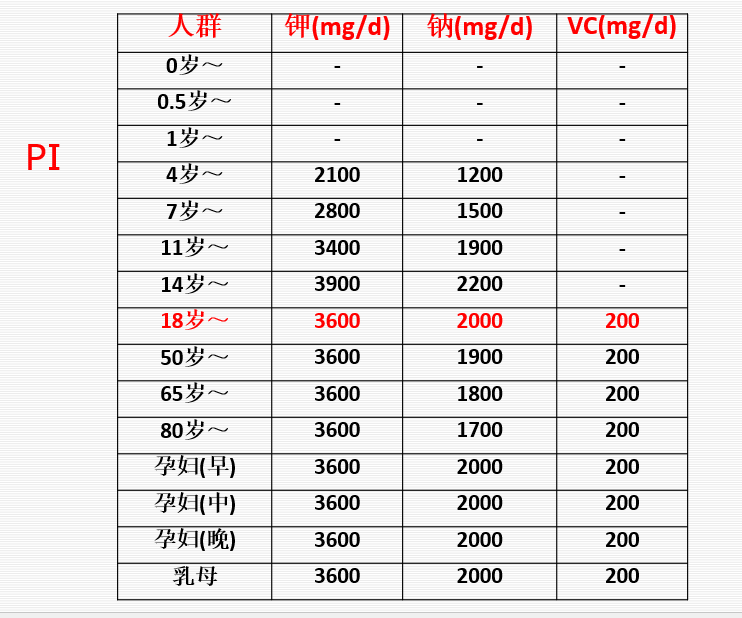
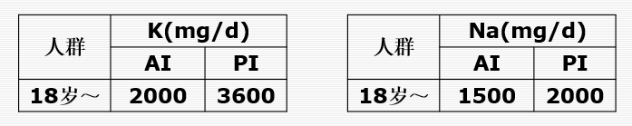
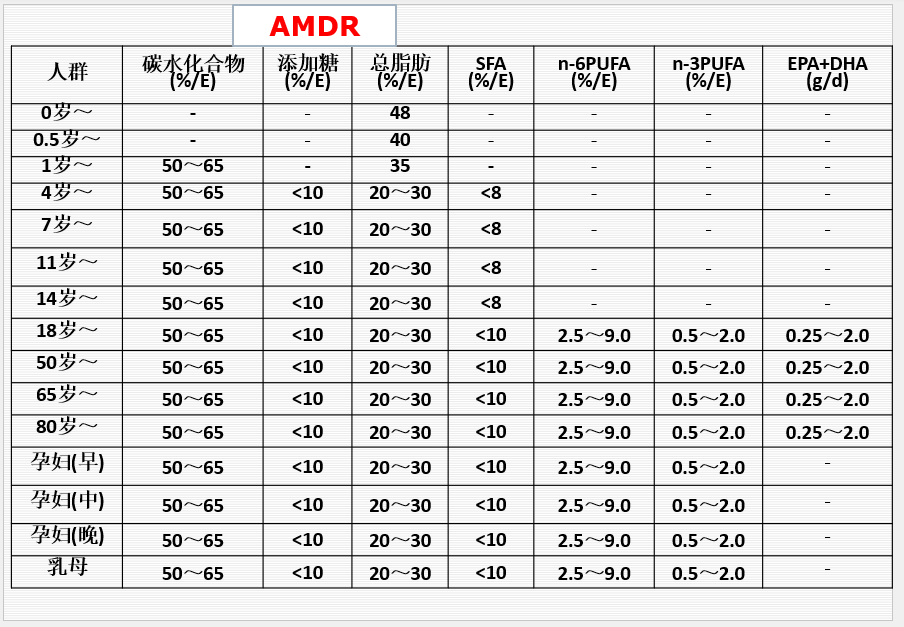
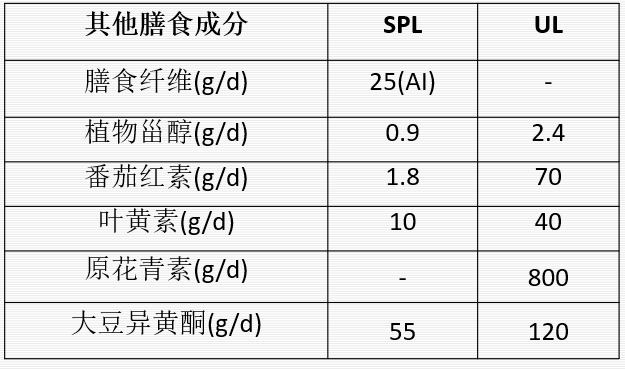

# 00绪论
## 营养学简介

### 营养学的定义
营养学（nutrition science）

- 研究机体营养规律以及改善措施的科学。

- 研究食物中对人体有益的成分及人体摄取和利用这些成分以维持、促进健康的规律和机制，在此基础上采取具体的、宏观的、社会性措施改善人类健康、提高生命质量。

### 营养学的研究内容
- 营养学基础
- 食物营养学
- 特定人群营养
- 临床营养
- 公共营养

## 食品卫生学简介
### 食品卫生学定义
食品卫生学(food hygiene)
研究食品中可能存在的、危害人体健康的有害因素及其对机体的作用规律和机制，在此基础上提出具体、宏观的预防措施，以提高食品卫生质量，保护食用者安全的科学。

### 食品卫生学研究内容
- 食品的污染问题
- 各类食品的卫生问题
- 食源性疾病预防
- 食品卫生监督管理
### 营养与食品卫生学的共同点
- 研究饮食与健康关系,提出防病、保护和促进健康的措施、政策和法规等的科学
- 特点:具有很强的科学性、社会性和应用性。
- 意义:与国计民生的关系密切，在增进人民体质，预防疾病、保护和提高健康水平等方面起重要作用
### 营养与食品卫生学的不同点
- 营养学：有利因素
- 食品卫生学：有害因素
### 食物、营养与人体健康关系

](<0101食物、营养与人体健康关系.png>)

# 01第一章  营养学基础
## 第一节 概述
### 一、食物成分
#### （一）营养素
- 定义：为维持机体繁殖、生长发育和生存等一切生命活动和过程，需要从外界环境中摄取的物质。
- 1.营养素的特点
   - （1）必须从外界环境中摄取
   - （2）是维持生存所必需的

](<0102宏量营养素_产能营养素_微量营养素.png>)

#### （二）水
- 水需要量：
    - 健康成人每天需水量：2500ml左右
    - 食物、饮水、代谢内生性水
    - 高温或强体力劳动条件下，适当增加饮水量
    - 中国居民膳食指南2016推荐成人1500ml/d
#### （三）食物生物活性成分
- 主要来自植物性食物的生物活性成分：
     - 植物化学物（phytochemical）
- 主要来自动物性食物的生物活性成分：
     - 肉碱、半胱氨酸、牛磺酸、谷氨酰胺、ɣ-氨基丁酸、褪黑素等
- 虽不是人体必需，但对健康的意义不可忽视
- 调节生理功能、延缓疾病发生和发展、促进健康
### 二、人体营养需要
- 人体摄取食物目的是：满足机体营养需要
- 需要得到满足→合理营养
- 合理营养—预防疾病、促进健康
#### 合理营养（rational nutrition）
人体每天从食物中摄入的能量和各种营养素的数量及其相互间的比例，能满足在不同生理阶段、不同劳动环境及不同劳动强度下的需要，并使机体处于良好的健康状态。
#### 营养不良（malnutrition）
由于一种多一种以上营养素的缺乏或过剩所造成的机体健康异常或疾病状态。
   
 - 营养缺乏(nutrition deficiency)（需要得不到满足）
 - 营养过剩（nutrition excess）（超过机体需要）
### 三、膳食营养素参考摄入量    Dietary reference intakes，DRIs
- 是一组每日平均膳食营养素摄入量的参考值，是为满足机体营养需要、维持机体处于良好健康状态、预防营养相关疾病发生
- 由各国行政部门或营养权威团体，根据营养科学原理及发展，并结合本国具体情况
- 提出的对社会各人群一日膳食中应含有的能量和各种营养素种类、数量的建议值。

> DRIs 指标：
> 
> - 估计平均需要量（estimated average requirement, EAR）
> - 推荐摄入量(recommended nutrient intake, RNI)
> - 适宜摄入量(adequate intake, AI)
> - 可耐受最高摄入量(tolerable upper level, UL)

#### (1)EAR: 
- 是指某一特定性别、年龄及生理状态群体中个体对某营养素需要量的平均值；

- 是根据个体需要量的研究资料计算得到，即依照某些指标进行判断，可以满足群体中50%个体需要量的摄入水平。

##### EAR的用途
- 1）评价膳食
  - 群体： 估测群体中摄入不足个体所占的比例      
- 2）计划膳食
   - 群体：以EAR为摄入不足的切点，可使摄入不足者所占比例很低
- 3）制订RNI的基础 

#### （2）RNI
- 是指可以满足某一特定性别、年龄及生理状况群体中绝大多数个体（97-98%）需要量的某种营养素摄入水平。
- 长期摄入RNI水平，不仅可满足机体对该营养素需要、维持组织中该营养素的适当储备，还有利于机体健康。

RNI=EAR+2SD

如资料不充分，一般设EAR变异系数为10％，
$RNI=EAR×１.２$

##### RNI 主要用途
- 1）可用于评价个体营养素摄取
  个体摄入量≥RNI   摄入不足几率很低
  个体摄入量<RNI   摄入不足的几率增加，虽不一定表明个体未达到适宜营养状态
- ※2）可进行个体计划膳食
   个体计划膳食目标，如达到或超过RNI，不足的几率很低

#### （3）AI
- 是指通过观察或实验获得的健康人群某种营养素的摄入量
- ※AI一定是来源于健康人群，尤其是6个月内的婴儿
- 纯母乳喂养的足月产健康婴儿，出生到4-6个月，母乳中的营养素含量就是婴儿各营养素的AI

----

- 无法获得EAR，不能计算RNI，则可用AI代替RNI
- AI与RNI相似之处：均可用于个体膳食的评价与计划
- 不同之处： AI准确性不如RNI，可能高于RNI
- 如果摄入长期高于AI ，或有毒副作用。
---

#### (4) UL
- 平均每日可以摄入某营养素的最高量
- 可耐受，对一般人群中的几乎所有个体，不致健康损害
- 摄入量超过UL，健康危害的风险增加
- 不表示达到UL才是有益的
- 不是一个建议的摄入水平
- 没有制订UL的营养素，是因为没有足够的资料，不意味绝对安全

##### 用途
- **1）评价个体膳食营养素摄入状况**
   - \>UL 可能面临健康风险
- **2）计划个体膳食营养素摄入量**
  -  \<UL 可避免摄入过量造成的危害
- **3）评价群体膳食营养素摄入状况**
  - 估测群体中面临健康风险的人所占比例
- **4）计划群体膳食营养素摄入量**
  - 控制群体中摄入过量的风险比例

营养摄入不足和过多的危险性

#### 其他指标

> 近年来
> > 营养相关慢性病发病率增高
> > 某些营养素对慢性病防控的积极作用被证实
> > RDA已不能满足慢性病防控的需要

> DRIs 指标：
> 
> - PI (proposal intakes for preventing non-communicabel chronic disease): 建议摄入量（预防非传染性慢性病)
> - AMDR (acceptable macronutrient distribution ranges)宏量营养素可接受范围
> - SPL(specific proposed levels)  特定建议值

### **四、合理膳食※**
#### 1.概念
   合理膳食(平衡膳食):是指能满足合理营养要求的膳食。

   合理膳食:  是合理营养的物质基础和前提
                   是实现合理营养的唯一途径

#### 2.合理膳食的要求
##### （1）种类齐全、数量充足、比例合适
###### 种类齐全：
    每日膳食应包含5大类食物
    每类2-4种
    至少10-20种食物，最好>30种

    数量充足：满足DRIs的要求

###### 比例适宜：
    动物性与植物性食物比例平衡
    植物性食物内的平衡
    动物性食物内的平衡

    产能营养素供能比的平衡
    复合碳水化合物与总碳水化合物之间的比例平衡
    优质蛋白质和总蛋白质之间的比例
    必需脂肪酸占总能量的比例
    SFA:MUFA:PUFA的比例平衡
    B族维生素与能量消耗之间的比例平衡
    Ca:P 
    其他矿物质之间的比例

##### （2）保证食物安全
##### （3）科学的烹调加工
- 减少营养素的损失
- 提高食物的消化吸收率
- 改善食物的感官性状、提高食欲
- 消除食物中的抗营养因子，有害化学物质和微生物
##### （4）合理的进餐制度和养成良好的饮食习惯
##### （5）遵循《中国居民膳食指南》的原则

### 小结
- 熟悉食物成分的健康意义
- 掌握DRIs的含义、熟悉其应用
- 掌握合理膳食概念和要求

