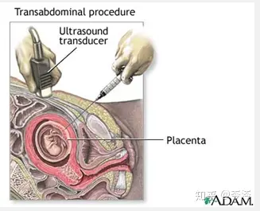
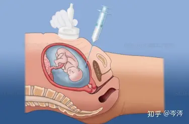
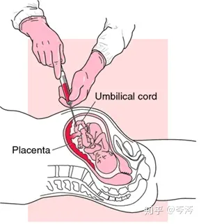

# 孕产期地中海性贫血的三级预防

## 0 提问： 针对孕产妇的地中海贫血的筛检属于一级预防还是二级预防？

针对孕产妇的地中海贫血的筛检属于二级预防。地中海贫血的预防措施分为三级，其中二级预防指的是实施产前诊断和遗传咨询。如果夫妇双方均为同类型地贫基因携带者，需要在怀孕后尽早进行产前诊断，确定胎儿地贫基因类型，评估胎儿出生后患严重贫血的风险。对确诊孕育重型地贫胎儿的孕妇，建议尽早采取干预措施，避免重型地贫儿出生。

## 1 参考资料

### 1.1 新闻报道

#### 1.1.1 广东省肿瘤康复学会

[健康科普 | 地中海贫血，如何精准筛查与诊断？](https://zhuanlan.zhihu.com/p/684782292)
广东省肿瘤康复学会在知乎上报道如下：

针对地中海贫血，我们主要采取三级预防措施：

一级预防：婚前孕前进行优生检查。在婚前夫妇双方进行基因诊断检查，能及早发现和明确夫妇双方地贫基因携带状况，针对性制定孕育计划，预防地贫发生。

二级预防：实施产前诊断和遗传咨询。夫妇双方均为同类型地贫基因携带者，需要在怀孕后尽早进行产前诊断，确定胎儿地贫基因类型，评估胎儿出生后患严重贫血的风险。对确诊孕育重型地贫胎儿的孕妇，建议尽早采取干预措施，避免重型地贫儿出生。

三级预防：开展新生儿疾病筛查。对新生儿及健康体检中发现的贫血患儿进行地贫筛查，促进地中海贫血的新生儿进行早诊断、早治疗，预防和减轻疾病对患儿身心的影响。

地中海贫血虽难治愈，但可防可控。对地中海贫血携带者进行筛查与诊断，做到早发现、早治疗，提高优生的质量，改善患者生命和生活质量。希望本文提供的筛查与诊断措施能够给地中海贫血患者带来帮助，让他们早日重获健康。

原文连接请访问：https://zhuanlan.zhihu.com/p/684782292

#### 1.1.2 广西医科大学 妇产科学硕士 岑涔
[什么是「地中海贫血」，应当如何预防和应对？](https://www.zhihu.com/question/388367129) 
广西医科大学 妇产科学硕士 岑涔 在知乎上回答如下：
##### 一级预防
是通过婚前、孕前优生检查，及早发现夫妇双方地中海贫血的基因携带状况，针对性制定孕育计划；

地贫筛查手段：

通过血常规检查和血红蛋白分析筛查，若地贫筛查结果提示为地贫可疑，则必须进一步进行地贫基因检测，以确诊是否为地贫以及地贫类型。

##### 二级预防
是实施产前诊断和遗传咨询，明确胎儿地中海贫血基因的类型，避免重型地中海贫血患儿出生；

通过采集胎儿的遗传物质（DNA）对胎儿进行基因诊断，确定胎儿的地贫基因类型。

目前采集胎儿遗传物质的方法主要有：

1.绒毛取材术采集绒毛组织（孕10周—14周）

绒毛穿刺术

2.羊膜腔穿刺术采集羊水细胞（孕16周以后）

羊膜腔穿刺术

3.经皮脐血管穿刺术采集脐血（孕20周之后）

脐带血穿刺术

4.目前也可以通过胚胎植入前遗传学诊断（即第三代试管婴儿，PGD）技术，筛选正常的胚胎受孕，实现孕育健康宝宝的愿望。

胚胎植入前遗传学诊断

##### 三级预防
是开展新生儿疾病筛查，促进患儿早诊、早治，预防和减轻疾病对患儿身心的影响，改善患儿的身体状况和生活质量。

原文连接请访问：https://www.zhihu.com/question/388367129

#### 1.1.3 搜狐网

[地中海贫血有多可怕，你知道吗？其实婚检孕检、产筛就可预防！](https://www.sohu.com/a/738937239_121124533)

搜狐网报道如下：

**一级预防即婚前孕前预防**：
新婚夫妇或计划怀孕夫妇在婚前或孕前享受免费婚前孕前健康检查，进行血常规检查、血红蛋白分析，对地贫筛查阳性夫妇进行基因检测，明确夫妇双方地贫基因携带状况，指导同类型地贫基因携带者孕期尽早接受产前诊断，或选择胚胎植入前遗传学诊断技术受孕，达到优生目的。

**二级预防即产前预防**：夫妇双方均为同类型地贫基因携带者（静止型a地贫除外），需要在怀孕后尽早进行产前诊断，确定胎儿地贫基因类型，评估胎儿出生后患严重贫血的风险。对确诊孕育重型地贫胎儿的孕妇，建议尽早采取干预措施，避免重型地贫儿出生。

原文连接请访问：https://www.sohu.com/a/738937239_121124533

#### 1.1.4 人民网
人民网报道如下：

[认识地中海贫血 三级预防策略是关键](http://cq.people.com.cn/n2/2023/0602/c365414-40441761.html)

地贫预防采取三级预防策略。
* **一级预防**是通过婚前孕前优生检查，及早发现夫妇双方地贫基因携带状况，针对性制订孕育计划，预防地贫的发生；
* **二级预防**是实施产前诊断和遗传咨询，明确胎儿地贫基因类型，避免重型地贫儿出生；
* **三级预防**是开展新生儿疾病筛查，促进确诊地贫患儿早诊早治。

原文连接请访问：http://cq.people.com.cn/n2/2023/0602/c365414-40441761.html

[做好婚前孕前筛查 及早干预防控“地贫”](http://cq.people.com.cn/n2/2022/0512/c367640-35265491.html)

**地贫的三级预防策略**

　　**一级预防**：婚前、孕前优生检查

　　通过婚前、孕前优生检查，及早发现夫妇双方地贫基因携带状况，针对性制定孕育计划，预防地贫的发生，达到优生的目的。

　　**二级预防**：产前诊断和遗传咨询

　　实施产前诊断和遗传咨询，明确胎儿地贫基因类型和轻重程度，尽早采取干预措施，避免重型地贫儿出生。

　　**三级预防**：新生儿疾病筛查

　　开展新生儿疾病筛查，促进确诊地贫的患儿早诊断、早治疗，预防和减轻疾病对患儿的身心影响，改善生活质量。

原文连接请访问：http://cq.people.com.cn/n2/2022/0512/c367640-35265491.html

### 1.2 中文文献论文

#### 1.2.1 落实“三级预防”措施 降低出生缺陷发生率

[1]农光任.落实“三级预防”措施  降低出生缺陷发生率[J].人口与健康,2023(03):74.

原文如下：

加强一级预防，防病于未然。完善“一站式”婚育综合服务平台建设，优化婚前医学检查服务流程，开展免费孕前优生健康检查，完善以孕前风险评估、免费婚前医学检查、地中海贫血（简称“地贫”）防治、增补叶酸为主的出生缺陷一级预防机制，对检测出阳性的夫妇实行后续随访及干预。

规范开展二级预防，减少严重出生缺陷儿出生。开展孕期筛查和产前诊断，识别胎儿的严重先天缺陷，早期发现，早期干预，减少缺陷儿的出生。

深入开展三级预防，减少先天残疾发生。持续开展新生儿疾病早期筛查，筛查病种涵盖神经、消化、泌尿生殖、肌肉骨骼、呼吸、五官6大类72种先天性结构畸形救助项目。

