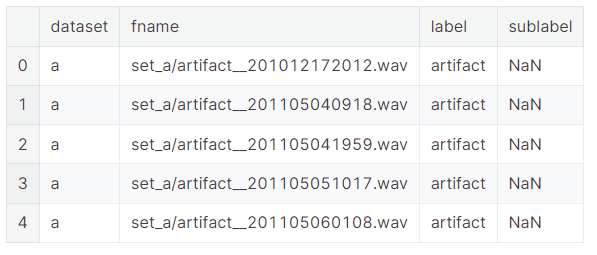
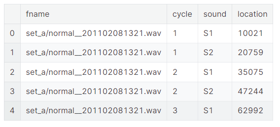
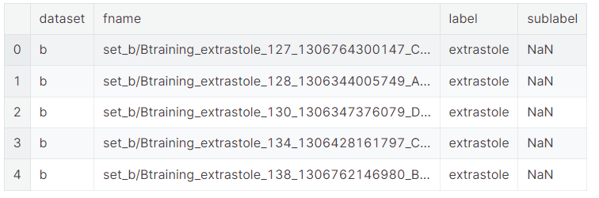
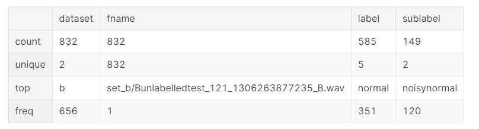

# Heart_sounds_analysis_and_classification_with_LSTM

> 网址：[Heart_sounds_analysis_and_classification_with_LSTM](https://www.kaggle.com/code/mychen76/heart-sounds-analysis-and-classification-with-lstm)

* 2019年发布
* 29，532次浏览
* 54人认可
* 577次复现

## Background
Heart sounds are the noises generated by the beating heart and the resultant flow of blood through it. In healthy adults, there are two normal heart sounds, often described as a lub and a dub (or dup), that occur in sequence with each heartbeat. These are the first heart sound (S1) and second heart sound (S2), produced by the closing of the atrioventricular valves and semilunar valves, respectively.

## Problem
An estimated 17.1 million people died from CVDs in 2004, representing 29% of all global deaths. Of these deaths, an estimated 7.2 million were due to coronary heart disease. Any method which can help to detect signs of heart disease c

The problem is of particular interest to machine learning researchers as it involves classification of audio sample data, where distinguishing between classes of interest is non-trivial. Data is gathered in real-world situations and frequently contains background noise of every conceivable type. The differences between heart sounds corresponding to different heart symptoms can also be extremely subtle and challenging to separate. Success in classifying this form of data requires extremely robust classifiers. Despite its medical significance, to date this is a relatively unexplored application for machine learning. Source: Classifying Heart Sounds Challenge [http://www.peterjbentley.com/heartchallenge/]

This is my first attempt to create a deep learning classification model based on RNN-LSTM as a primary choice. The goal of this notebook is optimized the model for better accuracy overtime. welcome any auggestion or question.

## Here's we go...


下面这段代码是一系列注释掉的命令和Python代码行，它们通常用于设置和检查Python环境、安装必要的库或依赖，并打印一些环境信息。下面是对这些代码的详细中文注释：

```bash
#%%bash
# 这一行是Jupyter Notebook的魔法命令，用于指定接下来的代码块应该在bash环境中执行。
# 接下来的几行代码都被注释掉了，不会执行。它们可能是用于环境设置和检查的初始步骤，在第一次构建完成后应该被删除。

# environement setup checking DELETE IT after first build complete
# 这一行是注释，提醒用户在第一次构建完成后删除这些环境设置检查的代码。

#python --version
# 这行命令用于检查Python的版本，但被注释掉了，不会执行。

#which python
# 这行命令用于显示Python解释器的路径，但被注释掉了，不会执行。

#pip --version
# 这行命令用于检查pip工具的版本，但被注释掉了，不会执行。

#which pip
# 这行命令用于显示pip工具的路径，但被注释掉了，不会执行。

#cat /etc/os-release
# 这行命令用于显示操作系统的版本信息，但被注释掉了，不会执行。

#uname -a
# 这行命令用于显示系统内核信息，但被注释掉了，不会执行。

#
# missing libraries install if required
# 如果缺少必要的库，应该安装它们。这部分代码提供了一些示例命令，但被注释掉了。

# echo y | apt install ffmpeg 
# 这行命令用于在Debian或Ubuntu系统上安装ffmpeg库，但被注释掉了，不会执行。

#!pip install librosa
# 这行命令用于全局安装librosa库，但被注释掉了，不会执行。

#
#import sys; print('sys.executable is', sys.executable)
# 这是一行Python代码，用于打印当前Python解释器的路径。它被注释掉了，不会执行。

#import os; print('os.getcwd is', os.getcwd())
# 这是一行Python代码，用于打印当前工作目录的路径。它被注释掉了，不会执行。
```

这些注释掉的命令和代码通常用于确保Python环境配置正确，安装必要的库和依赖，并验证环境设置。在实际使用中，如果需要执行这些操作，应该先取消注释（删除行首的`#`字符），然后再运行相应的命令或代码。在Jupyter Notebook中，`%%bash`魔法命令允许在一个单独的bash代码块中执行bash命令，这对于需要使用系统命令来配置Python环境的情况非常有用。


下面这段代码主要用于设置Python环境以进行音频分析和数据可视化。下面是对每行代码的详细中文注释：

```python
# 导入warnings模块，用于控制警告信息的显示。
import warnings                        # To ignore any warnings

# 使用filterwarnings函数忽略所有警告信息。
# 这可以在开发过程中减少不必要的警告信息的干扰。
warnings.filterwarnings("ignore")

# Jupyter Notebook的魔法命令，用于在Notebook内部直接显示matplotlib生成的图表。
%matplotlib inline

# Jupyter Notebook的魔法命令，用于在Notebook内部显示pylab（一个类似于MATLAB的Python库）的输出。
%pylab inline

# 导入os模块，提供了一系列操作系统接口的功能。
import os

# 导入pandas库，并使用别名pd。Pandas是一个强大的数据处理和分析工具。
import pandas as pd

# 导入librosa库，用于音频和音乐分析。
import librosa

# 导入librosa.display模块，用于音频数据的可视化。
import librosa.display

# 导入glob模块，用于文件路径模式匹配，常用于文件搜索。
import glob

# 导入matplotlib.pyplot模块，提供MATLAB风格的绘图接口。
import matplotlib.pyplot as plt

# Jupyter Notebook的魔法命令，用于设置InlineBackend的图表格式为'retina'，以提高在高分辨率显示屏上的图表质量。
%config InlineBackend.figure_format = 'retina'
```

这段代码的主要作用是为音频分析和数据可视化做好准备。通过忽略警告信息，可以使得输出更加清洁，减少不必要的干扰。同时，导入了必要的库，如`librosa`和`matplotlib`，这些库在音频分析和数据可视化中非常有用。`%matplotlib inline`和`%config InlineBackend.figure_format = 'retina'`这两个魔法命令确保了在Jupyter Notebook中可以内联显示高质量的图表。这些设置为后续的数据处理、分析和可视化打下了基础。


Populating the interactive namespace from numpy and matplotlib


下面这段代码用于获取并打印出当前安装的TensorFlow和Keras库的版本信息。下面是对每行代码的详细中文注释：

```python
# 导入TensorFlow库，并使用别名tf。
# TensorFlow是一个开源的机器学习框架，由Google开发，用于数据流编程和大规模机器学习。
import tensorflow as tf

# 打印TensorFlow库的版本信息。
# 通过访问TensorFlow库的__version__属性来获取其版本号，并将其与字符串'tensorflow version: '一同打印出来。
print('tensorflow version: ', tf.__version__)

# 导入Keras库。
# Keras是一个高层神经网络API，它可以运行在TensorFlow、CNTK或Theano之上。
import keras

# 打印Keras库的版本信息。
# 通过访问Keras库的__version__属性来获取其版本号，并将其与字符串'keras version: '一同打印出来。
print('keras version: ', keras.__version__)
```

执行这段代码后，会在控制台输出当前环境中安装的TensorFlow和Keras的具体版本号。这对于了解当前Python环境中所使用的库的版本，以及确保代码兼容性和复现性非常重要。特别是在进行机器学习项目或实验时，不同版本的库可能会有不同的API和功能，因此了解并记录所使用的版本是非常有用的。


```python
tensorflow version:  1.12.0
keras version:  2.2.4
```

这段输出显示了TensorFlow和Keras库的版本信息。下面是对这些输出信息的详细中文注释：

```python
# 这是TensorFlow库的版本号输出。
# "1.12.0"表示当前安装的TensorFlow版本是1.12.0。
# TensorFlow是一个由Google开发的开源机器学习框架，广泛用于深度学习和其他机器学习任务。
# 版本号通常遵循主版本号.次版本号.补丁版本号的格式，不同的版本号代表不同的功能更新和改进。
tensorflow version:  1.12.0

# 这是Keras库的版本号输出。
# "2.2.4"表示当前安装的Keras版本是2.2.4。
# Keras是一个用户友好的神经网络库，它能够运行在多种后端引擎之上，如TensorFlow、CNTK或Theano。
# 与TensorFlow的版本号类似，Keras的版本号也遵循主版本号.次版本号.补丁版本号的格式。
keras version:  2.2.4
```

这些版本信息对于开发者来说非常重要，因为它们可以帮助开发者确保他们的代码能够与特定版本的库兼容，同时也便于在需要时查找相关的文档和资源。此外，了解库的版本也有助于在遇到问题时进行调试，因为不同版本的库可能存在不同的bug或已更改的行为。在进行机器学习项目时，通常会在项目文档中记录所使用的库的版本信息，以便其他开发者或未来的自己能够复现和理解项目的环境设置。

Using TensorFlow backend.


下面这段代码定义了一些变量，用于配置音频文件处理的环境和参数。下面是对每行代码的详细中文注释：

```python
# 定义一个变量INPUT_DIR，存储音频文件所在的父文件夹路径。
# "../input"是一个相对路径，表示从当前工作目录向上一级目录中的"input"文件夹。
# 这个路径用于指定存放音频文件的位置，以便程序可以找到并处理这些文件。
INPUT_DIR="../input"

# 定义一个变量SAMPLE_RATE，设置音频处理的采样率。
# 16000表示音频文件将被处理为16000赫兹（Hz）的采样率。
# 采样率是指每秒钟采集声音信号的次数，16kHz是一个常用的采样率，适用于人声和一般音频分析。
SAMPLE_RATE = 16000

# 定义一个变量MAX_SOUND_CLIP_DURATION，设置音频片段的最大持续时间。
# 12表示音频片段的最大长度为12秒。
# 这个参数用于限制处理的音频片段的长度，可能用于避免过长的音频处理或分析，以节省时间和计算资源。
MAX_SOUND_CLIP_DURATION=12
```

这些变量通常用于音频处理和分析任务中，用于指定输入音频文件的位置、处理的采样率以及音频片段的长度限制。在实际应用中，根据具体的任务需求和计算资源，可能需要调整这些参数以获得最佳的处理效果。


## Explorer data
The audio files are of varying lengths, between 1 second and 30 seconds (some have been clipped to reduce excessive noise and provide the salient fragment of the sound).

Most information in heart sounds is contained in the low frequency components, with noise in the higher frequencies. It is common to apply a low-pass filter at 195 Hz. Fast Fourier transforms are also likely to provide useful information about volume and frequency over time. More domain-specific knowledge about the difference between the categories of sounds is provided below.

let's check what is inside each directory and content and input data organization


x下面这段代码使用了Unix shell命令来检查当前工作目录和列出上级目录`../input`中的所有文件和文件夹。这些代码通常在Jupyter Notebook中使用，以便于用户了解当前的工作目录以及输入数据的组织情况。以下是对这两行代码的详细中文注释：

```bash
# 打印当前工作目录的完整路径。
# `pwd`是"print working directory"的缩写，这个命令会显示当前所在的目录路径。
!pwd

# 列出上级目录`../input`中的所有文件和文件夹，并显示详细信息。
# `ls`是"list"的缩写，用于列出目录内容。
# `-all`选项告诉`ls`命令显示所有文件和文件夹（包括隐藏文件，即以`.`开头的文件）。
# `../input`是一个相对路径，表示当前工作目录的上一级目录中的`input`文件夹。
# `!`符号用于在Jupyter Notebook中执行shell命令。
!ls -all ../input
```

执行这段代码后，用户可以在Jupyter Notebook的输出区域看到两行结果：

1. `!pwd`命令的输出将显示当前Jupyter Notebook内核的工作目录路径。
2. `!ls -all ../input`命令的输出将列出`../input`目录下的所有文件和文件夹，包括它们的权限、所有者、大小、最后修改日期等详细信息。

这对于用户确认数据文件的位置和查看数据文件的基本信息非常有用，特别是在准备数据分析或机器学习任务时，了解数据的组织结构是非常重要的第一步。

结果：

```python
/kaggle/working
total 136
drwxr-xr-x 4 root root  4096 May  9  2018 .
drwxr-xr-x 6 root root  4096 Feb 27 05:17 ..
drwxr-xr-x 2 root root 12288 May  9  2018 set_a
-rw-r--r-- 1 root root  7031 May  9  2018 set_a.csv
-rw-r--r-- 1 root root 17115 May  9  2018 set_a_timing.csv
drwxr-xr-x 2 root root 45056 May  9  2018 set_b
-rw-r--r-- 1 root root 42145 May  9  2018 set_b.csv
```


这段输出结果显示了在Jupyter Notebook中执行上述代码后得到的当前工作目录和上级目录`../input`中的内容列表。以下是对输出结果的详细解读：

1. `/kaggle/working`: 这是通过`!pwd`命令得到的当前工作目录的路径。这意味着Jupyter Notebook正在Kaggle环境中的`/kaggle/working`目录下运行。

2. `total 136`: 这表示`../input`目录中的总文件和文件夹数量，包括隐藏文件和子目录。

3. `drwxr-xr-x 4 root root 4096 May 9 2018 .`: 这一行显示了当前目录（`.`）的权限和属性。`drwxr-xr-x`表示这是一个目录（`d`），权限设置为所有者（`root`）可以读写执行（`rwx`），组（`root`）和其他用户（`others`）可以读和执行（`r-x`）。`4`表示硬链接数，`root root`表示所有者和组都是`root`，`4096`是目录的大小（以字节为单位），`May 9 2018`是目录的最后修改时间。

4. `drwxr-xr-x 6 root root 4096 Feb 27 05:17 ..`: 类似地，这一行显示了上级目录（`..`）的权限和属性。

5. `drwxr-xr-x 2 root root 12288 May 9 2018 set_a`: 这一行显示了一个名为`set_a`的子目录的权限和属性。`12288`是子目录的大小。

6. `-rw-r--r-- 1 root root 7031 May 9 2018 set_a.csv`: 这是一个名为`set_a.csv`的文件，其权限设置为所有者可以读写（`rw-`），组和其他用户可以读（`r--`）。文件大小为7031字节，最后修改时间是2018年5月9日。

7. `-rw-r--r-- 1 root root 17115 May 9 2018 set_a_timing.csv`: 这是另一个名为`set_a_timing.csv`的文件，其权限和最后修改时间与上一个文件相同，但文件大小为17115字节。

8. `drwxr-xr-x 2 root root 45056 May 9 2018 set_b`: 这是另一个名为`set_b`的子目录，其权限和属性与`set_a`目录相同，大小为45056字节。

9. `-rw-r--r-- 1 root root 42145 May 9 2018 set_b.csv`: 这是一个名为`set_b.csv`的文件，其权限设置和其他文件相同，文件大小为42145字节。

这些信息对于了解数据集的结构和组织非常有用。例如，`.csv`文件可能包含元数据或标签信息，而`set_a`和`set_b`目录可能包含音频文件或其他数据。了解这些文件和目录的存在可以帮助用户准备数据处理和分析任务。


Check input data in csv files


下面这段代码使用Pandas库从指定的路径读取一个CSV文件，并显示其前几行内容。以下是对这两行代码的详细中文注释：

```python
# 使用Pandas库的read_csv函数读取位于INPUT_DIR路径下的"set_a.csv"文件，并将其内容存储到DataFrame对象set_a中。
# INPUT_DIR是一个之前定义的变量，其值为"../input"，表示音频文件所在的父文件夹路径。
# 因此，"../input/set_a.csv"是完整的文件路径。
set_a = pd.read_csv(INPUT_DIR + "/set_a.csv")

# 调用DataFrame对象set_a的head方法，显示其前五行数据。
# head方法默认显示前五行，但如果需要可以传入一个参数指定显示的行数。
# 这通常用于快速查看数据集的结构和前几行的样本数据，以便于进行初步的数据探索。
set_a.head()
```

执行这段代码后，会在Python环境中输出`set_a` DataFrame的前五行数据。这有助于用户了解CSV文件中包含的信息，例如列名、数据类型、缺失值情况等。在数据分析和机器学习的前期阶段，这种快速的数据预览是非常重要的，因为它可以帮助用户确定后续数据处理和分析的方向。




这段输出结果显示了使用Pandas的`read_csv`函数读取的CSV文件`set_a.csv`的前五行数据。以下是对输出结果的详细解读：

1. `dataset`: 这一列显示了数据集的名称，这里是`a`，可能表示这是数据集中的一个子集或特定部分。

2. `fname`: 这一列包含了音频文件的文件名和路径。路径前缀`set_a/`表明这些音频文件位于`set_a`目录下。

3. `label`: 这一列显示了音频文件的标签，这里所有的标签都是`artifact`，表示这些音频文件被标记为异常或杂音。

4. `sublabel`: 这一列可能用于提供额外的标签信息或分类细节。在这个例子中，所有的`sublabel`值都是`NaN`，表示这部分数据缺失或不适用。

从这些结果可以看出，CSV文件包含了关于音频文件的基本信息，包括它们所属的数据集、文件路径和标签。这些信息通常用于音频分析任务，例如声音分类、异常检测或声音事件检测。`NaN`值表示缺少子标签信息，这在数据处理时可能需要额外注意，因为某些分析可能需要完整的标签信息。在实际应用中，可能需要进一步的数据清洗或预处理来处理这些缺失值。


下面这段代码使用Pandas库从指定的路径读取一个名为`set_a_timing.csv`的CSV文件，并显示其前几行内容。以下是对这两行代码的详细中文注释：

```python
# 使用Pandas库的read_csv函数读取位于INPUT_DIR路径下的"set_a_timing.csv"文件，并将其内容存储到DataFrame对象set_a_timing中。
# INPUT_DIR是一个之前定义的变量，其值为"../input"，表示音频文件所在的父文件夹路径。
# 因此，"../input/set_a_timing.csv"是完整的文件路径，指向包含音频文件时间标签信息的CSV文件。
set_a_timing = pd.read_csv(INPUT_DIR + "/set_a_timing.csv")

# 调用DataFrame对象set_a_timing的head方法，显示其前五行数据。
# head方法默认显示前五行，但如果需要可以传入一个参数指定显示的行数。
# 这通常用于快速查看数据集的结构和前几行的样本数据，以便于进行初步的数据探索。
set_a_timing.head()
```

执行这段代码后，会在Python环境中输出`set_a_timing` DataFrame的前五行数据。这有助于用户了解时间标签CSV文件中包含的信息，例如音频文件的名称、时间戳或其他与时间相关的元数据。在音频分析任务中，时间标签是非常重要的，因为它们可以指示音频中特定事件的开始和结束时间，或者用于同步音频与视频、传感器数据等。通过查看这些时间标签，用户可以更好地理解音频数据的结构，并为后续的数据分析和处理做好准备。





这段输出结果显示了使用Pandas的`read_csv`函数读取的CSV文件`set_a_timing.csv`的前五行数据。以下是对输出结果的详细解读：

1. `fname`: 这一列显示了音频文件的文件名和路径。路径前缀`set_a/`表明这些音频文件位于`set_a`目录下。

2. `cycle`: 这一列可能表示音频文件中的循环或周期编号，用于标识同一音频文件中的不同心跳周期。在这里，所有的周期编号都是1或2，表明这些行数据来自两个不同的心跳周期。

3. `sound`: 这一列显示了音频文件中特定的声音事件，如心跳的不同阶段。在这里，`S1`和`S2`分别表示心脏的两个不同的声音事件，可能对应于心脏的关闭和开放阶段。

4. `location`: 这一列显示了声音事件在音频文件中的位置，通常以样本数表示。这个位置信息指示了在音频文件中可以找到特定声音事件的确切时间点。

从这些结果可以看出，CSV文件包含了关于音频文件中特定声音事件的详细信息，包括文件名、心跳周期、声音类型和声音位置。这些信息通常用于音频分析任务，例如心跳检测、心率监测或其他医学诊断。通过这些时间位置信息，可以对音频文件进行进一步的处理和分析，例如提取特定的声音片段、计算心率或识别异常声音。这些数据对于医学研究和临床诊断非常有价值。


```python
set_b=pd.read_csv(INPUT_DIR+"/set_b.csv")
set_b.head()
```




下面这段代码使用Pandas库将两个DataFrame对象`set_a`和`set_b`合并为一个新的DataFrame对象`train_ab`，并显示新DataFrame的描述性统计信息。以下是对这三行代码的详细中文注释：

```python
# 合并set_a和set_b两个DataFrame对象。
# frames是一个包含两个DataFrame对象的列表，即set_a和set_b。
# 这两个DataFrame可能包含了音频文件的相关信息，例如文件名、标签、时间戳等。
frames = [set_a, set_b]

# 使用Pandas库的concat函数将frames列表中的所有DataFrame对象合并为一个新的DataFrame对象train_ab。
# concat函数将多个DataFrame沿着某一轴（默认是行，即axis=0）拼接起来。
# 由于没有指定join参数，所以这里使用的是外连接（outer），即保留所有数据，如果某些键在其他DataFrame中不存在，则对应位置会被填充NaN。
train_ab = pd.concat(frames)

# 调用DataFrame对象train_ab的describe方法，显示其描述性统计信息。
# describe方法提供了DataFrame中数值列的统计概览，包括计数、平均值、标准差、最小值、25%分位数、中位数、75%分位数和最大值。
# 这对于快速了解数据集的分布情况和数值特征非常有用。
train_ab.describe()
```

执行这段代码后，会在Python环境中输出新合并的DataFrame`train_ab`的描述性统计信息。这有助于用户了解合并后数据集的数值特征，例如数据分布的范围、集中趋势和离散程度。在数据分析和机器学习的前期阶段，这种统计信息是非常重要的，因为它可以帮助用户确定数据的质量和潜在的问题，以及为后续的数据处理和模型训练提供依据。





这段输出结果显示了执行上述代码后，新合并的DataFrame `train_ab`的描述性统计信息。以下是对输出结果的详细解读：

1. `count`: 这一行显示了每一列的非空值数量。在这个例子中，`dataset`列有832个非空值，`fname`列也有832个非空值，`label`列有585个非空值，`sublabel`列有149个非空值。这表明`label`和`sublabel`列可能存在缺失值。

2. `unique`: 这一行显示了每一列的唯一值数量。`dataset`列有2个唯一值，意味着数据集可能只包含两个子集（例如`set_a`和`set_b`）。`fname`列有832个唯一值，表示有832个不同的音频文件。`label`列有5个唯一值，`sublabel`列有2个唯一值，表明标签和子标签的类别数量有限。

3. `top`: 这一行显示了每一列的最常出现的值。对于`fname`列，最常出现的文件名是`set_b/Bunlabelledtest_121_1306263877235_B.wav`。对于`label`列，最常出现的标签是`normal`。对于`sublabel`列，最常出现的子标签是`noisynormal`。

4. `freq`: 这一行显示了每一列的最常出现值的频率。`fname`列中最常出现的文件名出现了656次。`label`列中最常出现的标签`normal`出现了1次，这可能意味着数据集不平衡，或者`normal`标签在数据集中的代表性非常高。`sublabel`列中最常出现的子标签`noisynormal`出现了120次。

从这些统计信息可以看出，合并后的数据集包含来自两个不同子集的音频文件，且每个文件都有相应的标签和子标签。数据集中的标签和子标签类别数量有限，且某些类别可能比其他类别更常见。这些信息对于理解数据集的组成和准备后续的数据分析或机器学习任务非常重要。特别是在处理不平衡的数据集时，可能需要采取特定的策略来确保模型的性能不会偏向于过于常见的类别。


下面这段代码用于获取合并后的DataFrame `train_ab`中所有唯一的标签（`label`），并打印出训练样本的数量和类别的数量。以下是对这两行代码的详细中文注释：

```python
# 获取train_ab DataFrame中' label'列的所有唯一值，存储在变量nb_classes中。
# .unique()方法返回一个包含所有独立（唯一）值的NumPy数组。
nb_classes = train_ab.label.unique()

# 打印训练样本的数量和类别的数量。
# train_ab.shape[0]获取train_ab DataFrame的行数，即训练样本的总数。
# len(nb_classes)获取nb_classes数组的长度，即唯一标签的数量，也就是类别的数量。
print("Number of training examples=", train_ab.shape[0], "  Number of classes=", len(nb_classes))

# 打印所有唯一的标签（类别）。
# 这可以帮助用户了解数据集中有哪些不同的类别，以及每个类别有多少个样本。
print(nb_classes)
```

执行这段代码后，会在Python环境中输出训练样本的总数和类别的数量，以及每个类别的具体名称。这对于理解数据集的分布和准备后续的数据分析或机器学习任务非常重要。特别是在分类任务中，了解不同类别的样本数量和类别名称是构建和评估模型的基础。如果类别数量不平衡，可能需要采取特定的数据采样或处理策略来改善模型的性能。

结果：


```python
Number of training examples= 832   Number of classes= 6
['artifact' 'extrahls' 'murmur' 'normal' nan 'extrastole']
```

这段输出结果显示了执行上述代码后得到的训练样本数量和唯一标签（类别）的数量及具体类别名称。以下是对输出结果的详细解读：

1. `Number of training examples= 832`: 这表示合并后的DataFrame `train_ab`中共有832个训练样本。

2. `Number of classes= 6`: 这表示在`train_ab` DataFrame的`label`列中，共有6个不同的唯一标签，即数据集中共有6个类别。

3. `['artifact' 'extrahls' 'murmur' 'normal' nan 'extrastole']`: 这是`train_ab` DataFrame中`label`列的所有唯一标签列表。这些标签代表了音频文件中可能存在的声音类型或特征，具体包括：
   - `'artifact'`: 表示音频中的伪影或噪声。
   - `'extrahls'`: 可能表示额外的心音（heart sounds）。
   - `'murmur'`: 表示心脏杂音，可能是心脏疾病的迹象。
   - `'normal'`: 表示音频文件中的心跳声音是正常的。
   - `'nan'`: 表示缺失值或未分类的标签。
   - `'extrastole'`: 可能表示额外的心搏（extrasystoles），这是一种心律失常。

从这些结果可以看出，数据集包含多种类型的心脏声音，包括正常和异常的声音。`nan`的出现表明有些音频文件的标签缺失，这可能需要进一步的数据清洗或预处理。了解这些类别对于构建和训练一个能够识别和分类不同心脏声音的机器学习模型非常重要。在实际应用中，可能需要对这些类别进行进一步的分析，以确保模型能够准确地识别每种类型的声音。


Note: nan label indicate unclassified and unlabel test files


下面这段代码用于可视化数据集中不同类别的分布情况，并打印出每个类别的最小和最大样本数。以下是对每行代码的详细中文注释：

```python
# 使用groupby方法根据'label'和'dataset'列对train_ab DataFrame进行分组，并计算每个组的计数，存储在category_group对象中。
# 这样可以得到每个类别和数据集的样本数量。
category_group = train_ab.groupby(['label', 'dataset']).count()

# 将category_group对象进行unstack操作，使其转换为适合绘图的格式。
# 然后使用reindex方法重新索引，以确保图表按照样本数量排序。
# 使用plot方法绘制堆叠条形图，展示每个类别的样本数量分布。
# kind='bar'指定绘图类型为条形图，stacked=True表示堆叠条形图，title设置图表标题，figsize设置图表大小。
plot = category_group.unstack().reindex(category_group.unstack().sum(axis=1).sort_values().index) \
          .plot(kind='bar', stacked=True, title="Number of Audio Samples per Category", figsize=(16, 5))

# 设置x轴标签为"Category"。
plot.set_xlabel("Category")

# 设置y轴标签为"Samples Count"。
plot.set_ylabel("Samples Count")

# 打印每个类别的最小样本数量。
# train_ab.label.value_counts()计算每个类别的样本数，min函数找出最小值。
print('Min samples per category = ', min(train_ab.label.value_counts()))

# 打印每个类别的最大样本数量。
# train_ab.label.value_counts()计算每个类别的样本数，max函数找出最大值。
print('Max samples per category = ', max(train_ab.label.value_counts()))
```

执行这段代码后，会在Python环境中输出每个类别的最小和最大样本数量，并绘制一个堆叠条形图，展示不同类别在各个数据集中的样本数量分布。这有助于用户了解数据集中类别的分布情况，特别是在类别不平衡的情况下，可以为后续的数据采样或加权策略提供依据。通过可视化和统计最小/最大样本数，用户可以评估模型训练可能面临的挑战，例如某些类别的样本过少可能导致模型在这些类别上的泛化能力不足。

结果：

```python
Min samples per category =  19
Max samples per category =  351
```

这段输出结果显示了执行上述代码后得到的数据集中每个类别的最小和最大样本数量。以下是对输出结果的详细解读：

1. `Min samples per category = 19`: 这表示在数据集中，样本数量最少的类别只有19个样本。这可能意味着该类别在数据集中的代表性较低，可能是一个较少见的类别或者在数据收集过程中被较少记录的类别。

2. `Max samples per category = 351`: 这表示在数据集中，样本数量最多的类别有351个样本。这表明该类别在数据集中的代表性较高，可能是一个常见类别或者在数据收集过程中被特别关注的类别。

这些信息对于理解数据集的平衡性和类别分布非常重要。在机器学习中，类别的样本数量差异可能会影响模型的性能。如果某些类别的样本数量过少，可能会导致模型在这些类别上的识别能力不足，即模型可能会偏向于那些样本数量较多的类别。因此，在模型训练之前，可能需要采取一些策略来处理类别不平衡的问题，例如过采样（增加少数类别的样本数量）、欠采样（减少多数类别的样本数量）或使用加权损失函数来提高少数类别的重要性。

此外，通过可视化不同类别的样本数量分布，可以帮助我们更直观地了解数据集中类别的分布情况，从而为后续的数据预处理和模型选择提供依据。在实际应用中，确保数据集的多样性和平衡性对于构建一个公平且有效的机器学习模型至关重要。


```python
print('Minimum samples per category = ', min(train_ab.label.value_counts()))
print('Maximum samples per category = ', max(train_ab.label.value_counts()))
```

结果：

```python
Min samples per category =  19
Max samples per category =  351
```


### let's take a look some sample by category

#### 1. Normal case

In the Normal category there are normal, healthy heart sounds. These may contain noise in the final second of the recording as the device is removed from the body. They may contain a variety of background noises (from traffic to radios). They may also contain occasional random noise corresponding to breathing, or brushing the microphone against clothing or skin. A normal heart sound has a clear “lub dub, lub dub” pattern, with the time from “lub” to “dub” shorter than the time from “dub” to the next “lub” (when the heart rate is less than 140 beats per minute)(source: Rita Getz)


下面这行代码定义了一个变量`normal_file`，用于存储一个特定音频文件的完整路径。以下是对这行代码的详细中文注释：

```python
# 定义一个变量normal_file，用于存储音频文件的完整路径。
# normal_file变量的值是由INPUT_DIR变量和音频文件的相对路径"/set_a/normal__201106111136.wav"拼接而成的。
# INPUT_DIR是一个之前定义的变量，其值为"../input"，表示音频文件所在的父文件夹路径。
# 因此，"/set_a/normal__201106111136.wav"是相对于"../input"目录的路径，表示音频文件位于"set_a"子目录下。
# 拼接后的normal_file变量包含了音频文件的绝对路径，可以用于访问和处理该文件。
normal_file = INPUT_DIR + "/set_a/normal__201106111136.wav"
```

这行代码通常用于准备对特定音频文件进行读取或处理的操作。通过构建完整的文件路径，可以确保程序能够准确地找到并加载所需的音频文件。在音频分析和处理任务中，了解文件的具体位置是非常重要的，因为这有助于自动化处理流程并减少因路径错误导致的问题。


