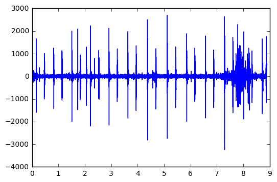

# Loading and Manipulating Heartbeat Audio

> 网址：[Loading_and_Manipulating_Heartbeat_Audio](https://www.kaggle.com/code/kinguistics/loading-and-manipulating-heartbeat-audio)
* 2017年发布
* 16，316次浏览
* 60人认可
* 196次复现


## 简介
This notebook will show you how to load and manipulate audio data in Python.

The Heartbeat Sounds dataset is primarily audio-based: all of the heartbeat sounds are stored as WAV files that record either normal or abnormal heartbeats. So let's learn how to load and play with WAVs in Python.

In general, uncompressed audio is stored as a sequence of numbers that indicate the amplitude of the recorded sound pressure at each time point. In the WAV standard, these numbers are packed into a bytestring. The interpretation of this byestring depends primarily on two factors: first, the sampling rate, usually given in Hertz, which indicates how many number samples comprise a second's worth of data; and second, the bit depth (or sample width), which indicates how many bits comprise a single number.

These parameters, along with other parameters like the number of channels (e.g., is the audio mono or stereo) are stored in the header of the WAV file.

The wave library handles the parsing of WAV file headers, which include the parameters mentioned above. Let's load the wave library and use it to open a sound file.


## 读取WAV格式的音频文件
下面这段代码是用于读取WAV格式的音频文件，并打印出音频帧的前20个字节的内容。下面是对每行代码的详细中文注释：

```python
# 导入Python的wave模块，它提供了读取和写入WAV文件的功能。
import wave

# 定义一个变量FNAME，存储音频文件的路径。这个路径是一个示例，指向'../input/set_a/normal__201101070538.wav'。
# 这个路径可能需要根据实际文件的位置进行调整。
FNAME = '../input/set_a/normal__201101070538.wav'

# 使用wave模块的open函数打开指定路径的WAV文件，返回一个wave对象。
# 这个对象提供了许多方法来操作和访问音频文件的数据。
f = wave.open(FNAME)

# 从打开的WAV文件中读取所有的音频帧，并将它们作为一个字节串存储在变量frames中。
# readframes函数的参数-1表示读取文件中的所有帧。
frames = f.readframes(-1)

# 打印出frames字节串的前20个字节。这通常用于快速查看音频数据的开始部分。
# 对于音频分析或处理，这些数据通常是二进制的，需要进一步的处理才能转换为可听的音频。
print(frames[:20])
```

这段代码的主要作用是读取WAV格式的音频文件，并快速查看文件的音频数据。在实际应用中，这些数据可以用于音频的特征提取、分类、分析等任务。打印出的前20个字节对于了解音频数据的基本结构和内容有一定的帮助，但由于音频数据通常是大量的二进制数据，所以这里的打印输出仅用于演示目的。


结果：
```python
b'\x0e\x00\x11\x00\x0e\x00\x00\x00\x02\x00\x0b\x00\xfe\xff\x05\x00\x05\x00\x04\x00'
```


So frames now holds the entire bytestring representing all the audio samples in the sound file. We need to unpack this bytestring into an array of numbers that we can actually work with.

The first question is: how many bytes represent a single observation? In my experience in voice recording, 16-bit and 24-bit are the most common sample widths, but you can find a whole collection on Wikipedia.

Powers of 2 tend to be the easiest to work with, and luckily for us the heartbeat audio seems to be 16-bit. We can check this by using the getsamplewidth() method on the wave file:


下面这行代码是用于输出通过`wave`模块打开的WAV文件的每个采样的宽度（以字节为单位）。下面是对这行代码的详细中文注释：

```python
# 调用已经打开的WAV文件对象f的getsampwidth方法。
# getsampwidth方法用于获取音频文件中每个采样值的宽度，即每个采样值占用的字节数。
# 采样宽度是音频数据的重要属性之一，它影响音频的质量和大小。
# 例如，一个采样宽度为2的音频文件意味着每个采样值使用2个字节存储，通常是16位的PCM编码音频。
sampwidth = f.getsampwidth()

# 打印出每个采样的宽度。这个值有助于了解音频文件的编码格式和存储密度。
print(sampwidth)
```

这行代码通常用于音频文件的处理和分析中，因为它提供了音频数据采样精度的信息。例如，采样宽度为1通常表示8位音频，而采样宽度为2则表示16位音频。了解采样宽度对于正确解析和处理音频数据至关重要，尤其是在进行音频数据转换或压缩时。


结果：

```python
2
```

代码`print(f.getsampwidth())`的输出结果为`2`，这表示该WAV文件中每个采样值的宽度是2个字节。这个信息对于理解音频文件的采样精度和数据表示方式非常重要。下面是对这个结果的详细解读：

1. **采样宽度（Sample Width）**: 采样宽度指的是每个音频采样值所占用的字节数。在这个例子中，`2`表示每个采样值使用2个字节（16位）来存储。

2. **音频质量**: 16位的采样宽度意味着音频信号的每个采样值可以表示从-32768到32767的整数值（如果是有符号整数的话）。这提供了相对较好的音频质量，能够捕捉到音频信号的细节和动态范围。

3. **数据表示**: 16位的采样宽度通常采用有符号整数（signed integer）来表示，这样可以表示正负值，适用于模拟音频信号的振幅表示。

4. **文件大小**: 使用16位采样宽度的音频文件相比于8位或其他更低位数的采样宽度会占用更多的存储空间。然而，它提供了更高的动态范围和更好的音质。

5. **兼容性**: 16位采样宽度是一种非常常见的音频格式，被广泛支持和使用在各种音频播放和编辑软件中。

了解这些信息对于后续的音频处理和分析非常重要，例如在进行音频信号的数字化处理、滤波、特征提取或格式转换时，都需要考虑到采样宽度这一参数。


The result of getsamplewidth() is in bytes, so multiply it by 8 to get the bit depth. Since the result from the call is 2, that means we're looking at a 16-bit file.

We'll unpack the bytestring by using the `struct` library in Python. struct requires a format string based on C format characters, which you can take a look at on the documentation page for Python's struct library.

We're in luck with the 16-bit depth, since the struct library prefers powers of 2. 16 bits corresponds to 2 bytes, so we'll use the signed format that corresponds to 2 bytes; according to the C format characters, we should use the format character 'h'.

A slight trick in the `struct` library is that it wants its format string to exactly match the expected size, so we have to multiply the format character 'h' by the number of frames in the bytestring:


这段代码用于将音频帧的字节串解包为原始采样值的数组，并打印出前10个采样值。下面是对每行代码的详细中文注释：

```python
# 导入Python的struct模块，它提供了处理二进制数据的格式转换功能。
import struct

# 调用wave对象f的getnframes方法获取音频文件中的总帧数。
# 这个方法返回的是音频文件中所有采样的帧数，而不是字节数。
nframes = f.getnframes()

# 使用struct模块的unpack函数将frames字节串解包为原始采样值的数组。
# 'h'是格式字符，表示解包为16位的有符号整数（short）。由于每个采样值占用2个字节（由之前的f.getsampwidth()返回的值），所以使用'h'*nframes来指定解包格式。
# frames是之前从音频文件中读取的所有音频帧的字节串。
samples = struct.unpack('h'*nframes, frames)

# 打印出解包后的采样值数组中的前10个采样值。
# 这通常用于快速查看音频数据的开始部分，以验证解包是否正确。
print(samples[:10])
```

这段代码的主要作用是将音频文件的原始数据转换为可以进一步处理和分析的数值。`struct.unpack`函数根据指定的格式字符串和数据字节串来解包数据，这里假设音频文件的采样宽度为2个字节（16位），因此使用`'h'`作为格式字符。解包后的结果是一个包含所有采样值的Python列表，可以用于音频信号的各种分析和处理任务。打印出的前10个采样值有助于了解音频数据的基本结构和内容。


`struct.unpack`函数中的`'h'`代表“short”，它是一种格式字符，用于指定解包二进制数据时的预期数据类型。在这个上下文中，`'h'`表示解包为16位的有符号整数。当`struct.unpack`函数遇到`'h'`时，它会从二进制数据中读取接下来的两个字节，并将其转换为一个16位的有符号整数。

`struct`模块提供了多种格式字符，用于表示不同的数据类型。以下是一些常用的格式字符及其含义：

- ` '?'`: 布尔值（True 或 False），对应于C语言中的`_Bool`类型。
- `'b'`: 有符号的字符（signed char）。
- `'B'`: 无符号的字符（unsigned char）。
- `'h'`: 有符号的短整型（short）。
- `'H'`: 无符号的短整型（unsigned short）。
- `'i'`: 有符号的整型（int）。
- `'I'`: 无符号的整型（unsigned int）。
- `'l'`: 有符号的长整型（long）。
- `'L'`: 无符号的长整型（unsigned long）。
- `'q'`: 有符号的长长整型（long long）。
- `'Q'`: 无符号的长长整型（unsigned long long）。
- `'s'`: 字符串（以null结尾的字符数组）。
- `'p'`: 指针（无符号整型，通常用于大小和地址）。

这些格式字符可以在`struct.pack`和`struct.unpack`函数中使用，以便在Python程序和二进制数据之间进行转换。使用这些格式字符时，需要确保数据的类型和大小与格式字符指定的类型和大小相匹配，以避免数据解释错误或结构体解析异常。


结果：

```python
(14, 17, 14, 0, 2, 11, -2, 5, 5, 4)
```

上面这段代码的输出结果是一个元组，包含了一系列整数。这些整数是从一个WAV音频文件中解包得到的前10个采样值。下面是对这个结果的详细解读：

1. **解包（Unpacking）**: `struct.unpack`函数用于将二进制数据（在这个例子中是`frames`变量存储的音频帧的字节串）转换为Python可以理解的原生数据类型（在这个例子中是16位有符号整数）。`'h'`是struct格式字符串，表示每个采样值将被解包为一个16位的有符号整数。

2. **采样值（Sample Values）**: 输出的元组中的每个元素代表音频文件中的一个采样值。这些值通常是从-32768到32767的整数，对应于音频信号在特定时间点的振幅。

3. **输出结果**: `(14, 17, 14, 0, 2, 11, -2, 5, 5, 4)` 表示音频文件中连续10帧的采样值。正数表示正向的振幅，负数表示负向的振幅，而`0`表示没有振幅（静音或信号的最低点）。

4. **音频信号的解释**: 这些采样值可以被用来重建音频波形，进行音频分析，或者作为音频处理算法的输入。例如，通过将这些采样值转换为电压值并发送到扬声器，可以播放出原始的音频信号。

5. **数据的可视化**: 这些采样值也可以通过绘图软件进行可视化，以波形图的形式展示音频信号的形状和变化。

了解这些采样值是音频信号处理和分析的基础。在实际应用中，可能需要对这些采样值进行进一步的处理，如滤波、特征提取、降噪等，以便于进行更复杂的音频分析任务。


To get the timing, we'll grab the sampling rate from the wave object.

下面这段代码用于计算音频文件中每个采样值的时间戳，并打印出前10个采样值的时间戳。下面是对每行代码的详细中文注释：

```python
# 调用wave对象f的getframerate方法获取音频文件的帧率。
# 帧率是指每秒钟播放的帧数，通常以赫兹（Hz）为单位。
framerate = f.getframerate()

# 使用列表推导式创建一个时间戳列表t。
# 列表中的每个元素对应于samples中采样值的时间点，以秒为单位。
# float(i)是将采样值的索引i转换为浮点数，除以framerate得到该采样值的时间戳。
# 由于samples列表中的采样值是连续的，索引从0开始，所以这个操作将为每个采样值生成一个从0开始的时间序列。
t = [float(i) / framerate for i in range(len(samples))]

# 打印出时间戳列表t中的前10个元素。
# 这通常用于快速查看音频数据的时间分布，或者用于进一步的时间相关分析。
print(t[:10])
```

这段代码的主要作用是将音频文件中的采样索引转换为时间戳，从而可以了解每个采样值在音频流中的具体位置。这对于音频分析和处理非常重要，尤其是在需要考虑时间因素的场景中，例如在进行信号的时间同步、特征提取或音频可视化时。打印出的前10个时间戳有助于了解音频数据的开始部分的时间分布情况。


```python
[0.0, 2.2675736961451248e-05, 4.5351473922902495e-05, 6.802721088435374e-05, 9.070294784580499e-05, 0.00011337868480725624, 0.00013605442176870748, 0.00015873015873015873, 0.00018140589569160998, 0.00020408163265306123]
```

这个输出结果是一个包含10个浮点数的列表，这些数值代表了音频文件中前10个采样点的时间戳，以秒为单位。这些时间戳是根据音频文件的采样率计算得出的。下面是对这些结果的详细解读：

1. `0.0`: 这是列表中的第一个值，表示音频文件的第一个采样点在时间上的位置是0秒，即音频开始的时刻。

2. 接下来的数值依次递增，表示每个采样点与前一个采样点之间的时间间隔。这些数值非常小，因为它们表示的是极短的时间间隔。

3. 例如，`2.2675736961451248e-05`是第二个采样点的时间戳，表示自音频开始以来经过了大约22.68微秒（microseconds）。

4. 这些时间戳的增量是根据音频文件的采样率计算的。例如，如果音频文件的采样率是44100 Hz，那么每秒钟有44100个采样点，每个采样点之间的时间间隔是1秒钟除以44100，即大约22.68微秒。

5. 列表中的每个后续值都是基于这个时间间隔累加得到的，因此它们表示的是从音频开始到每个采样点的累计时间。

6. 这些时间戳可以用于多种音频处理任务，例如同步音频信号与其他类型的数据（如视频或传感器数据），或者在音频编辑中定位特定的事件。

通过这些时间戳，我们可以准确地知道每个采样点在音频流中的位置，这对于音频分析、编辑和处理非常重要。例如，如果我们想要在音频中找到特定的事件并了解它发生的时间，我们可以使用这些时间戳来定位。


Now we can take a look at the waveform.


下面这段代码使用Python的`pylab`模块（通常被认为是`matplotlib`库的一个接口）来绘制音频采样值随时间变化的图表。下面是对每行代码的详细中文注释：

```python
# 从pylab模块导入所有功能。
# pylab是一个提供了MATLAB风格接口的库，它实际上是matplotlib库的一个子集。
# 导入后，可以直接使用pylab中的函数，如plot、legend等，而不需要显式地引用matplotlib。
from pylab import *

# plot函数用于创建一个二维图表。
# t是之前计算得到的采样时间戳列表，表示横轴（时间轴）的数据。
# samples是之前从音频文件中解包得到的采样值列表，表示纵轴（采样值轴）的数据。
# 这行代码将在图表中绘制时间戳和采样值之间的关系，形成一条曲线。
plot(t, samples)
```

这段代码的主要作用是在二维空间中展示音频信号的波形。`plot`函数接收两个列表作为参数，第一个列表（`t`）作为横轴（时间轴），第二个列表（`samples`）作为纵轴（采样值轴）。在图表中，每个采样值都会以点的形式出现在对应的时间点上，所有点连接起来就形成了一条表示音频信号随时间变化的曲线。

执行这段代码后，通常会在Python脚本运行的最后调用`show()`函数来显示图表。如果没有调用`show()`，那么在某些交互式环境中（如Jupyter Notebook），图表可能会自动显示。在其他情况下，可能需要手动调用`show()`来触发图表的渲染和显示。




