# Heart_sounds_analysis_and_classification_with_LSTM

> 网址：[Heart_sounds_analysis_and_classification_with_LSTM](https://www.kaggle.com/code/mychen76/heart-sounds-analysis-and-classification-with-lstm)

* 2019年发布
* 29，532次浏览
* 54人认可
* 577次复现

## Background
Heart sounds are the noises generated by the beating heart and the resultant flow of blood through it. In healthy adults, there are two normal heart sounds, often described as a lub and a dub (or dup), that occur in sequence with each heartbeat. These are the first heart sound (S1) and second heart sound (S2), produced by the closing of the atrioventricular valves and semilunar valves, respectively.

## Problem
An estimated 17.1 million people died from CVDs in 2004, representing 29% of all global deaths. Of these deaths, an estimated 7.2 million were due to coronary heart disease. Any method which can help to detect signs of heart disease c

The problem is of particular interest to machine learning researchers as it involves classification of audio sample data, where distinguishing between classes of interest is non-trivial. Data is gathered in real-world situations and frequently contains background noise of every conceivable type. The differences between heart sounds corresponding to different heart symptoms can also be extremely subtle and challenging to separate. Success in classifying this form of data requires extremely robust classifiers. Despite its medical significance, to date this is a relatively unexplored application for machine learning. Source: Classifying Heart Sounds Challenge [http://www.peterjbentley.com/heartchallenge/]

This is my first attempt to create a deep learning classification model based on RNN-LSTM as a primary choice. The goal of this notebook is optimized the model for better accuracy overtime. welcome any auggestion or question.

## Here's we go...

### 设置和检查Python环境、安装必要的库或依赖，并打印一些环境信息
下面这段代码是一系列注释掉的命令和Python代码行，它们通常用于设置和检查Python环境、安装必要的库或依赖，并打印一些环境信息。下面是对这些代码的详细中文注释：

```bash
#%%bash
# 这一行是Jupyter Notebook的魔法命令，用于指定接下来的代码块应该在bash环境中执行。
# 接下来的几行代码都被注释掉了，不会执行。它们可能是用于环境设置和检查的初始步骤，在第一次构建完成后应该被删除。

# environement setup checking DELETE IT after first build complete
# 这一行是注释，提醒用户在第一次构建完成后删除这些环境设置检查的代码。

#python --version
# 这行命令用于检查Python的版本，但被注释掉了，不会执行。

#which python
# 这行命令用于显示Python解释器的路径，但被注释掉了，不会执行。

#pip --version
# 这行命令用于检查pip工具的版本，但被注释掉了，不会执行。

#which pip
# 这行命令用于显示pip工具的路径，但被注释掉了，不会执行。

#cat /etc/os-release
# 这行命令用于显示操作系统的版本信息，但被注释掉了，不会执行。

#uname -a
# 这行命令用于显示系统内核信息，但被注释掉了，不会执行。

#
# missing libraries install if required
# 如果缺少必要的库，应该安装它们。这部分代码提供了一些示例命令，但被注释掉了。

# echo y | apt install ffmpeg 
# 这行命令用于在Debian或Ubuntu系统上安装ffmpeg库，但被注释掉了，不会执行。

#!pip install librosa
# 这行命令用于全局安装librosa库，但被注释掉了，不会执行。

#
#import sys; print('sys.executable is', sys.executable)
# 这是一行Python代码，用于打印当前Python解释器的路径。它被注释掉了，不会执行。

#import os; print('os.getcwd is', os.getcwd())
# 这是一行Python代码，用于打印当前工作目录的路径。它被注释掉了，不会执行。
```

这些注释掉的命令和代码通常用于确保Python环境配置正确，安装必要的库和依赖，并验证环境设置。在实际使用中，如果需要执行这些操作，应该先取消注释（删除行首的`#`字符），然后再运行相应的命令或代码。在Jupyter Notebook中，`%%bash`魔法命令允许在一个单独的bash代码块中执行bash命令，这对于需要使用系统命令来配置Python环境的情况非常有用。


### 设置Python环境以进行音频分析和数据可视化
下面这段代码主要用于设置Python环境以进行音频分析和数据可视化。下面是对每行代码的详细中文注释：

```python
# 导入warnings模块，用于控制警告信息的显示。
import warnings                        # To ignore any warnings

# 使用filterwarnings函数忽略所有警告信息。
# 这可以在开发过程中减少不必要的警告信息的干扰。
warnings.filterwarnings("ignore")

# Jupyter Notebook的魔法命令，用于在Notebook内部直接显示matplotlib生成的图表。
%matplotlib inline

# Jupyter Notebook的魔法命令，用于在Notebook内部显示pylab（一个类似于MATLAB的Python库）的输出。
%pylab inline

# 导入os模块，提供了一系列操作系统接口的功能。
import os

# 导入pandas库，并使用别名pd。Pandas是一个强大的数据处理和分析工具。
import pandas as pd

# 导入librosa库，用于音频和音乐分析。
import librosa

# 导入librosa.display模块，用于音频数据的可视化。
import librosa.display

# 导入glob模块，用于文件路径模式匹配，常用于文件搜索。
import glob

# 导入matplotlib.pyplot模块，提供MATLAB风格的绘图接口。
import matplotlib.pyplot as plt

# Jupyter Notebook的魔法命令，用于设置InlineBackend的图表格式为'retina'，以提高在高分辨率显示屏上的图表质量。
%config InlineBackend.figure_format = 'retina'
```

这段代码的主要作用是为音频分析和数据可视化做好准备。通过忽略警告信息，可以使得输出更加清洁，减少不必要的干扰。同时，导入了必要的库，如`librosa`和`matplotlib`，这些库在音频分析和数据可视化中非常有用。`%matplotlib inline`和`%config InlineBackend.figure_format = 'retina'`这两个魔法命令确保了在Jupyter Notebook中可以内联显示高质量的图表。这些设置为后续的数据处理、分析和可视化打下了基础。

#### 结果展示：

Populating the interactive namespace from numpy and matplotlib
### 打印出当前安装的TensorFlow和Keras库的版本信息

下面这段代码用于获取并打印出当前安装的TensorFlow和Keras库的版本信息。下面是对每行代码的详细中文注释：

```python
# 导入TensorFlow库，并使用别名tf。
# TensorFlow是一个开源的机器学习框架，由Google开发，用于数据流编程和大规模机器学习。
import tensorflow as tf

# 打印TensorFlow库的版本信息。
# 通过访问TensorFlow库的__version__属性来获取其版本号，并将其与字符串'tensorflow version: '一同打印出来。
print('tensorflow version: ', tf.__version__)

# 导入Keras库。
# Keras是一个高层神经网络API，它可以运行在TensorFlow、CNTK或Theano之上。
import keras

# 打印Keras库的版本信息。
# 通过访问Keras库的__version__属性来获取其版本号，并将其与字符串'keras version: '一同打印出来。
print('keras version: ', keras.__version__)
```

执行这段代码后，会在控制台输出当前环境中安装的TensorFlow和Keras的具体版本号。这对于了解当前Python环境中所使用的库的版本，以及确保代码兼容性和复现性非常重要。特别是在进行机器学习项目或实验时，不同版本的库可能会有不同的API和功能，因此了解并记录所使用的版本是非常有用的。
### 结果展示：

```python
tensorflow version:  1.12.0
keras version:  2.2.4
```
### 结果解释：

这段输出显示了TensorFlow和Keras库的版本信息。下面是对这些输出信息的详细中文注释：

```python
# 这是TensorFlow库的版本号输出。
# "1.12.0"表示当前安装的TensorFlow版本是1.12.0。
# TensorFlow是一个由Google开发的开源机器学习框架，广泛用于深度学习和其他机器学习任务。
# 版本号通常遵循主版本号.次版本号.补丁版本号的格式，不同的版本号代表不同的功能更新和改进。
tensorflow version:  1.12.0

# 这是Keras库的版本号输出。
# "2.2.4"表示当前安装的Keras版本是2.2.4。
# Keras是一个用户友好的神经网络库，它能够运行在多种后端引擎之上，如TensorFlow、CNTK或Theano。
# 与TensorFlow的版本号类似，Keras的版本号也遵循主版本号.次版本号.补丁版本号的格式。
keras version:  2.2.4
```

这些版本信息对于开发者来说非常重要，因为它们可以帮助开发者确保他们的代码能够与特定版本的库兼容，同时也便于在需要时查找相关的文档和资源。此外，了解库的版本也有助于在遇到问题时进行调试，因为不同版本的库可能存在不同的bug或已更改的行为。在进行机器学习项目时，通常会在项目文档中记录所使用的库的版本信息，以便其他开发者或未来的自己能够复现和理解项目的环境设置。

Using TensorFlow backend.

### 配置音频文件处理的环境和参数
下面这段代码定义了一些变量，用于配置音频文件处理的环境和参数。下面是对每行代码的详细中文注释：

```python
# 定义一个变量INPUT_DIR，存储音频文件所在的父文件夹路径。
# "../input"是一个相对路径，表示从当前工作目录向上一级目录中的"input"文件夹。
# 这个路径用于指定存放音频文件的位置，以便程序可以找到并处理这些文件。
INPUT_DIR="../input"

# 定义一个变量SAMPLE_RATE，设置音频处理的采样率。
# 16000表示音频文件将被处理为16000赫兹（Hz）的采样率。
# 采样率是指每秒钟采集声音信号的次数，16kHz是一个常用的采样率，适用于人声和一般音频分析。
SAMPLE_RATE = 16000

# 定义一个变量MAX_SOUND_CLIP_DURATION，设置音频片段的最大持续时间。
# 12表示音频片段的最大长度为12秒。
# 这个参数用于限制处理的音频片段的长度，可能用于避免过长的音频处理或分析，以节省时间和计算资源。
MAX_SOUND_CLIP_DURATION=12
```

这些变量通常用于音频处理和分析任务中，用于指定输入音频文件的位置、处理的采样率以及音频片段的长度限制。在实际应用中，根据具体的任务需求和计算资源，可能需要调整这些参数以获得最佳的处理效果。


## Explorer data
The audio files are of varying lengths, between 1 second and 30 seconds (some have been clipped to reduce excessive noise and provide the salient fragment of the sound).

Most information in heart sounds is contained in the low frequency components, with noise in the higher frequencies. It is common to apply a low-pass filter at 195 Hz. Fast Fourier transforms are also likely to provide useful information about volume and frequency over time. More domain-specific knowledge about the difference between the categories of sounds is provided below.

> let's check what is inside each directory and content and input data organization

### 检查当前工作目录和列出上级目录
x下面这段代码使用了Unix shell命令来检查当前工作目录和列出上级目录`../input`中的所有文件和文件夹。这些代码通常在Jupyter Notebook中使用，以便于用户了解当前的工作目录以及输入数据的组织情况。以下是对这两行代码的详细中文注释：

```bash
# 打印当前工作目录的完整路径。
# `pwd`是"print working directory"的缩写，这个命令会显示当前所在的目录路径。
!pwd

# 列出上级目录`../input`中的所有文件和文件夹，并显示详细信息。
# `ls`是"list"的缩写，用于列出目录内容。
# `-all`选项告诉`ls`命令显示所有文件和文件夹（包括隐藏文件，即以`.`开头的文件）。
# `../input`是一个相对路径，表示当前工作目录的上一级目录中的`input`文件夹。
# `!`符号用于在Jupyter Notebook中执行shell命令。
!ls -all ../input
```

执行这段代码后，用户可以在Jupyter Notebook的输出区域看到两行结果：

1. `!pwd`命令的输出将显示当前Jupyter Notebook内核的工作目录路径。
2. `!ls -all ../input`命令的输出将列出`../input`目录下的所有文件和文件夹，包括它们的权限、所有者、大小、最后修改日期等详细信息。

这对于用户确认数据文件的位置和查看数据文件的基本信息非常有用，特别是在准备数据分析或机器学习任务时，了解数据的组织结构是非常重要的第一步。
#### 结果展示：

结果：

```python
/kaggle/working
total 136
drwxr-xr-x 4 root root  4096 May  9  2018 .
drwxr-xr-x 6 root root  4096 Feb 27 05:17 ..
drwxr-xr-x 2 root root 12288 May  9  2018 set_a
-rw-r--r-- 1 root root  7031 May  9  2018 set_a.csv
-rw-r--r-- 1 root root 17115 May  9  2018 set_a_timing.csv
drwxr-xr-x 2 root root 45056 May  9  2018 set_b
-rw-r--r-- 1 root root 42145 May  9  2018 set_b.csv
```

#### 结果解释：

这段输出结果显示了在Jupyter Notebook中执行上述代码后得到的当前工作目录和上级目录`../input`中的内容列表。以下是对输出结果的详细解读：

1. `/kaggle/working`: 这是通过`!pwd`命令得到的当前工作目录的路径。这意味着Jupyter Notebook正在Kaggle环境中的`/kaggle/working`目录下运行。

2. `total 136`: 这表示`../input`目录中的总文件和文件夹数量，包括隐藏文件和子目录。

3. `drwxr-xr-x 4 root root 4096 May 9 2018 .`: 这一行显示了当前目录（`.`）的权限和属性。`drwxr-xr-x`表示这是一个目录（`d`），权限设置为所有者（`root`）可以读写执行（`rwx`），组（`root`）和其他用户（`others`）可以读和执行（`r-x`）。`4`表示硬链接数，`root root`表示所有者和组都是`root`，`4096`是目录的大小（以字节为单位），`May 9 2018`是目录的最后修改时间。

4. `drwxr-xr-x 6 root root 4096 Feb 27 05:17 ..`: 类似地，这一行显示了上级目录（`..`）的权限和属性。

5. `drwxr-xr-x 2 root root 12288 May 9 2018 set_a`: 这一行显示了一个名为`set_a`的子目录的权限和属性。`12288`是子目录的大小。

6. `-rw-r--r-- 1 root root 7031 May 9 2018 set_a.csv`: 这是一个名为`set_a.csv`的文件，其权限设置为所有者可以读写（`rw-`），组和其他用户可以读（`r--`）。文件大小为7031字节，最后修改时间是2018年5月9日。

7. `-rw-r--r-- 1 root root 17115 May 9 2018 set_a_timing.csv`: 这是另一个名为`set_a_timing.csv`的文件，其权限和最后修改时间与上一个文件相同，但文件大小为17115字节。

8. `drwxr-xr-x 2 root root 45056 May 9 2018 set_b`: 这是另一个名为`set_b`的子目录，其权限和属性与`set_a`目录相同，大小为45056字节。

9. `-rw-r--r-- 1 root root 42145 May 9 2018 set_b.csv`: 这是一个名为`set_b.csv`的文件，其权限设置和其他文件相同，文件大小为42145字节。

这些信息对于了解数据集的结构和组织非常有用。例如，`.csv`文件可能包含元数据或标签信息，而`set_a`和`set_b`目录可能包含音频文件或其他数据。了解这些文件和目录的存在可以帮助用户准备数据处理和分析任务。


> Check input data in csv files

### 读取CSV文件`set_a.csv`，并显示其前几行内容
下面这段代码使用Pandas库从指定的路径读取一个CSV文件，并显示其前几行内容。以下是对这两行代码的详细中文注释：

```python
# 使用Pandas库的read_csv函数读取位于INPUT_DIR路径下的"set_a.csv"文件，并将其内容存储到DataFrame对象set_a中。
# INPUT_DIR是一个之前定义的变量，其值为"../input"，表示音频文件所在的父文件夹路径。
# 因此，"../input/set_a.csv"是完整的文件路径。
set_a = pd.read_csv(INPUT_DIR + "/set_a.csv")

# 调用DataFrame对象set_a的head方法，显示其前五行数据。
# head方法默认显示前五行，但如果需要可以传入一个参数指定显示的行数。
# 这通常用于快速查看数据集的结构和前几行的样本数据，以便于进行初步的数据探索。
set_a.head()
```

执行这段代码后，会在Python环境中输出`set_a` DataFrame的前五行数据。这有助于用户了解CSV文件中包含的信息，例如列名、数据类型、缺失值情况等。在数据分析和机器学习的前期阶段，这种快速的数据预览是非常重要的，因为它可以帮助用户确定后续数据处理和分析的方向。

#### 结果展示：

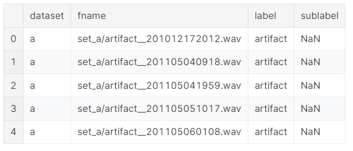
#### 结果解释：

这段输出结果显示了使用Pandas的`read_csv`函数读取的CSV文件`set_a.csv`的前五行数据。以下是对输出结果的详细解读：

1. `dataset`: 这一列显示了数据集的名称，这里是`a`，可能表示这是数据集中的一个子集或特定部分。

2. `fname`: 这一列包含了音频文件的文件名和路径。路径前缀`set_a/`表明这些音频文件位于`set_a`目录下。

3. `label`: 这一列显示了音频文件的标签，这里所有的标签都是`artifact`，表示这些音频文件被标记为异常或杂音。

4. `sublabel`: 这一列可能用于提供额外的标签信息或分类细节。在这个例子中，所有的`sublabel`值都是`NaN`，表示这部分数据缺失或不适用。

从这些结果可以看出，CSV文件包含了关于音频文件的基本信息，包括它们所属的数据集、文件路径和标签。这些信息通常用于音频分析任务，例如声音分类、异常检测或声音事件检测。`NaN`值表示缺少子标签信息，这在数据处理时可能需要额外注意，因为某些分析可能需要完整的标签信息。在实际应用中，可能需要进一步的数据清洗或预处理来处理这些缺失值。


### 读取CSV文件`set_a_timing.csv`，并显示其前几行内容

下面这段代码使用Pandas库从指定的路径读取一个名为`set_a_timing.csv`的CSV文件，并显示其前几行内容。以下是对这两行代码的详细中文注释：

```python
# 使用Pandas库的read_csv函数读取位于INPUT_DIR路径下的"set_a_timing.csv"文件，并将其内容存储到DataFrame对象set_a_timing中。
# INPUT_DIR是一个之前定义的变量，其值为"../input"，表示音频文件所在的父文件夹路径。
# 因此，"../input/set_a_timing.csv"是完整的文件路径，指向包含音频文件时间标签信息的CSV文件。
set_a_timing = pd.read_csv(INPUT_DIR + "/set_a_timing.csv")

# 调用DataFrame对象set_a_timing的head方法，显示其前五行数据。
# head方法默认显示前五行，但如果需要可以传入一个参数指定显示的行数。
# 这通常用于快速查看数据集的结构和前几行的样本数据，以便于进行初步的数据探索。
set_a_timing.head()
```

执行这段代码后，会在Python环境中输出`set_a_timing` DataFrame的前五行数据。这有助于用户了解时间标签CSV文件中包含的信息，例如音频文件的名称、时间戳或其他与时间相关的元数据。在音频分析任务中，时间标签是非常重要的，因为它们可以指示音频中特定事件的开始和结束时间，或者用于同步音频与视频、传感器数据等。通过查看这些时间标签，用户可以更好地理解音频数据的结构，并为后续的数据分析和处理做好准备。


#### 结果展示：


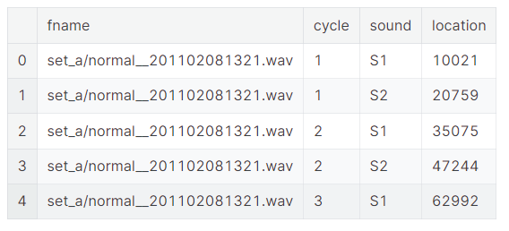

#### 结果解释：

这段输出结果显示了使用Pandas的`read_csv`函数读取的CSV文件`set_a_timing.csv`的前五行数据。以下是对输出结果的详细解读：

1. `fname`: 这一列显示了音频文件的文件名和路径。路径前缀`set_a/`表明这些音频文件位于`set_a`目录下。

2. `cycle`: 这一列可能表示音频文件中的循环或周期编号，用于标识同一音频文件中的不同心跳周期。在这里，所有的周期编号都是1或2，表明这些行数据来自两个不同的心跳周期。

3. `sound`: 这一列显示了音频文件中特定的声音事件，如心跳的不同阶段。在这里，`S1`和`S2`分别表示心脏的两个不同的声音事件，可能对应于心脏的关闭和开放阶段。

4. `location`: 这一列显示了声音事件在音频文件中的位置，通常以样本数表示。这个位置信息指示了在音频文件中可以找到特定声音事件的确切时间点。

从这些结果可以看出，CSV文件包含了关于音频文件中特定声音事件的详细信息，包括文件名、心跳周期、声音类型和声音位置。这些信息通常用于音频分析任务，例如心跳检测、心率监测或其他医学诊断。通过这些时间位置信息，可以对音频文件进行进一步的处理和分析，例如提取特定的声音片段、计算心率或识别异常声音。这些数据对于医学研究和临床诊断非常有价值。

### 读取CSV文件`set_b.csv`，并显示其前几行内容

```python
set_b=pd.read_csv(INPUT_DIR+"/set_b.csv")
set_b.head()
```
#### 结果展示：

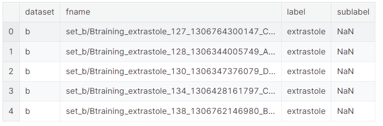


### 将两个DataFrame对象`set_a`和`set_b`合并为一个新的DataFrame对象`train_ab`，并显示新DataFrame的描述性统计信息
下面这段代码使用Pandas库将两个DataFrame对象`set_a`和`set_b`合并为一个新的DataFrame对象`train_ab`，并显示新DataFrame的描述性统计信息。以下是对这三行代码的详细中文注释：

```python
# 合并set_a和set_b两个DataFrame对象。
# frames是一个包含两个DataFrame对象的列表，即set_a和set_b。
# 这两个DataFrame可能包含了音频文件的相关信息，例如文件名、标签、时间戳等。
frames = [set_a, set_b]

# 使用Pandas库的concat函数将frames列表中的所有DataFrame对象合并为一个新的DataFrame对象train_ab。
# concat函数将多个DataFrame沿着某一轴（默认是行，即axis=0）拼接起来。
# 由于没有指定join参数，所以这里使用的是外连接（outer），即保留所有数据，如果某些键在其他DataFrame中不存在，则对应位置会被填充NaN。
train_ab = pd.concat(frames)

# 调用DataFrame对象train_ab的describe方法，显示其描述性统计信息。
# describe方法提供了DataFrame中数值列的统计概览，包括计数、平均值、标准差、最小值、25%分位数、中位数、75%分位数和最大值。
# 这对于快速了解数据集的分布情况和数值特征非常有用。
train_ab.describe()
```

执行这段代码后，会在Python环境中输出新合并的DataFrame`train_ab`的描述性统计信息。这有助于用户了解合并后数据集的数值特征，例如数据分布的范围、集中趋势和离散程度。在数据分析和机器学习的前期阶段，这种统计信息是非常重要的，因为它可以帮助用户确定数据的质量和潜在的问题，以及为后续的数据处理和模型训练提供依据。

#### 结果展示：

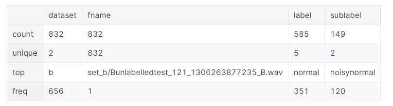

#### 结果解释：

这段输出结果显示了执行上述代码后，新合并的DataFrame `train_ab`的描述性统计信息。以下是对输出结果的详细解读：

1. `count`: 这一行显示了每一列的非空值数量。在这个例子中，`dataset`列有832个非空值，`fname`列也有832个非空值，`label`列有585个非空值，`sublabel`列有149个非空值。这表明`label`和`sublabel`列可能存在缺失值。

2. `unique`: 这一行显示了每一列的唯一值数量。`dataset`列有2个唯一值，意味着数据集可能只包含两个子集（例如`set_a`和`set_b`）。`fname`列有832个唯一值，表示有832个不同的音频文件。`label`列有5个唯一值，`sublabel`列有2个唯一值，表明标签和子标签的类别数量有限。

3. `top`: 这一行显示了每一列的最常出现的值。对于`fname`列，最常出现的文件名是`set_b/Bunlabelledtest_121_1306263877235_B.wav`。对于`label`列，最常出现的标签是`normal`。对于`sublabel`列，最常出现的子标签是`noisynormal`。

4. `freq`: 这一行显示了每一列的最常出现值的频率。`fname`列中最常出现的文件名出现了656次。`label`列中最常出现的标签`normal`出现了1次，这可能意味着数据集不平衡，或者`normal`标签在数据集中的代表性非常高。`sublabel`列中最常出现的子标签`noisynormal`出现了120次。

从这些统计信息可以看出，合并后的数据集包含来自两个不同子集的音频文件，且每个文件都有相应的标签和子标签。数据集中的标签和子标签类别数量有限，且某些类别可能比其他类别更常见。这些信息对于理解数据集的组成和准备后续的数据分析或机器学习任务非常重要。特别是在处理不平衡的数据集时，可能需要采取特定的策略来确保模型的性能不会偏向于过于常见的类别。


### 获取合并后的DataFrame `train_ab`中所有唯一的标签（`label`），并打印出训练样本的数量和类别的数量
下面这段代码用于获取合并后的DataFrame `train_ab`中所有唯一的标签（`label`），并打印出训练样本的数量和类别的数量。以下是对这两行代码的详细中文注释：

```python
# 获取train_ab DataFrame中' label'列的所有唯一值，存储在变量nb_classes中。
# .unique()方法返回一个包含所有独立（唯一）值的NumPy数组。
nb_classes = train_ab.label.unique()

# 打印训练样本的数量和类别的数量。
# train_ab.shape[0]获取train_ab DataFrame的行数，即训练样本的总数。
# len(nb_classes)获取nb_classes数组的长度，即唯一标签的数量，也就是类别的数量。
print("Number of training examples=", train_ab.shape[0], "  Number of classes=", len(nb_classes))

# 打印所有唯一的标签（类别）。
# 这可以帮助用户了解数据集中有哪些不同的类别，以及每个类别有多少个样本。
print(nb_classes)
```

执行这段代码后，会在Python环境中输出训练样本的总数和类别的数量，以及每个类别的具体名称。这对于理解数据集的分布和准备后续的数据分析或机器学习任务非常重要。特别是在分类任务中，了解不同类别的样本数量和类别名称是构建和评估模型的基础。如果类别数量不平衡，可能需要采取特定的数据采样或处理策略来改善模型的性能。
#### 结果展示：

结果：


```python
Number of training examples= 832   Number of classes= 6
['artifact' 'extrahls' 'murmur' 'normal' nan 'extrastole']
```
#### 结果解释：

这段输出结果显示了执行上述代码后得到的训练样本数量和唯一标签（类别）的数量及具体类别名称。以下是对输出结果的详细解读：

1. `Number of training examples= 832`: 这表示合并后的DataFrame `train_ab`中共有832个训练样本。

2. `Number of classes= 6`: 这表示在`train_ab` DataFrame的`label`列中，共有6个不同的唯一标签，即数据集中共有6个类别。

3. `['artifact' 'extrahls' 'murmur' 'normal' nan 'extrastole']`: 这是`train_ab` DataFrame中`label`列的所有唯一标签列表。这些标签代表了音频文件中可能存在的声音类型或特征，具体包括：
   - `'artifact'`: 表示音频中的伪影或噪声。
   - `'extrahls'`: 可能表示额外的心音（heart sounds）。
   - `'murmur'`: 表示心脏杂音，可能是心脏疾病的迹象。
   - `'normal'`: 表示音频文件中的心跳声音是正常的。
   - `'nan'`: 表示缺失值或未分类的标签。
   - `'extrastole'`: 可能表示额外的心搏（extrasystoles），这是一种心律失常。

从这些结果可以看出，数据集包含多种类型的心脏声音，包括正常和异常的声音。`nan`的出现表明有些音频文件的标签缺失，这可能需要进一步的数据清洗或预处理。了解这些类别对于构建和训练一个能够识别和分类不同心脏声音的机器学习模型非常重要。在实际应用中，可能需要对这些类别进行进一步的分析，以确保模型能够准确地识别每种类型的声音。


> Note: nan label indicate unclassified and unlabel test files


### 可视化数据集中不同类别的分布情况，并打印出每个类别的最小和最大样本数
下面这段代码用于可视化数据集中不同类别的分布情况，并打印出每个类别的最小和最大样本数。以下是对每行代码的详细中文注释：

```python
# 使用groupby方法根据'label'和'dataset'列对train_ab DataFrame进行分组，并计算每个组的计数，存储在category_group对象中。
# 这样可以得到每个类别和数据集的样本数量。
category_group = train_ab.groupby(['label', 'dataset']).count()

# 将category_group对象进行unstack操作，使其转换为适合绘图的格式。
# 然后使用reindex方法重新索引，以确保图表按照样本数量排序。
# 使用plot方法绘制堆叠条形图，展示每个类别的样本数量分布。
# kind='bar'指定绘图类型为条形图，stacked=True表示堆叠条形图，title设置图表标题，figsize设置图表大小。
plot = category_group.unstack().reindex(category_group.unstack().sum(axis=1).sort_values().index) \
          .plot(kind='bar', stacked=True, title="Number of Audio Samples per Category", figsize=(16, 5))

# 设置x轴标签为"Category"。
plot.set_xlabel("Category")

# 设置y轴标签为"Samples Count"。
plot.set_ylabel("Samples Count")

# 打印每个类别的最小样本数量。
# train_ab.label.value_counts()计算每个类别的样本数，min函数找出最小值。
print('Min samples per category = ', min(train_ab.label.value_counts()))

# 打印每个类别的最大样本数量。
# train_ab.label.value_counts()计算每个类别的样本数，max函数找出最大值。
print('Max samples per category = ', max(train_ab.label.value_counts()))
```

执行这段代码后，会在Python环境中输出每个类别的最小和最大样本数量，并绘制一个堆叠条形图，展示不同类别在各个数据集中的样本数量分布。这有助于用户了解数据集中类别的分布情况，特别是在类别不平衡的情况下，可以为后续的数据采样或加权策略提供依据。通过可视化和统计最小/最大样本数，用户可以评估模型训练可能面临的挑战，例如某些类别的样本过少可能导致模型在这些类别上的泛化能力不足。
#### 结果展示：

结果：

```python
Min samples per category =  19
Max samples per category =  351
```
#### 结果解释：

这段输出结果显示了执行上述代码后得到的数据集中每个类别的最小和最大样本数量。以下是对输出结果的详细解读：

1. `Min samples per category = 19`: 这表示在数据集中，样本数量最少的类别只有19个样本。这可能意味着该类别在数据集中的代表性较低，可能是一个较少见的类别或者在数据收集过程中被较少记录的类别。

2. `Max samples per category = 351`: 这表示在数据集中，样本数量最多的类别有351个样本。这表明该类别在数据集中的代表性较高，可能是一个常见类别或者在数据收集过程中被特别关注的类别。

这些信息对于理解数据集的平衡性和类别分布非常重要。在机器学习中，类别的样本数量差异可能会影响模型的性能。如果某些类别的样本数量过少，可能会导致模型在这些类别上的识别能力不足，即模型可能会偏向于那些样本数量较多的类别。因此，在模型训练之前，可能需要采取一些策略来处理类别不平衡的问题，例如过采样（增加少数类别的样本数量）、欠采样（减少多数类别的样本数量）或使用加权损失函数来提高少数类别的重要性。

此外，通过可视化不同类别的样本数量分布，可以帮助我们更直观地了解数据集中类别的分布情况，从而为后续的数据预处理和模型选择提供依据。在实际应用中，确保数据集的多样性和平衡性对于构建一个公平且有效的机器学习模型至关重要。
#### 结果展示：

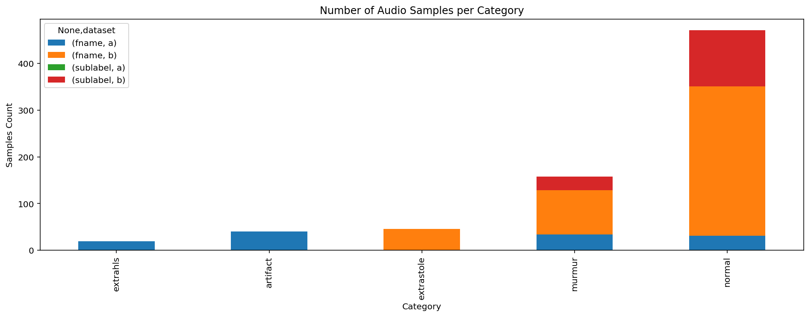


```python
print('Minimum samples per category = ', min(train_ab.label.value_counts()))
print('Maximum samples per category = ', max(train_ab.label.value_counts()))
```
#### 结果展示：

结果：

```python
Min samples per category =  19
Max samples per category =  351
```


### let's take a look some sample by category

#### 1. Normal case

In the Normal category there are normal, healthy heart sounds. These may contain noise in the final second of the recording as the device is removed from the body. They may contain a variety of background noises (from traffic to radios). They may also contain occasional random noise corresponding to breathing, or brushing the microphone against clothing or skin. A normal heart sound has a clear “lub dub, lub dub” pattern, with the time from “lub” to “dub” shorter than the time from “dub” to the next “lub” (when the heart rate is less than 140 beats per minute)(source: Rita Getz)

##### 定义变量`normal_file`，用于存储一个特定音频文件的完整路径
下面这行代码定义了一个变量`normal_file`，用于存储一个特定音频文件的完整路径。以下是对这行代码的详细中文注释：

```python
# 定义一个变量normal_file，用于存储音频文件的完整路径。
# normal_file变量的值是由INPUT_DIR变量和音频文件的相对路径"/set_a/normal__201106111136.wav"拼接而成的。
# INPUT_DIR是一个之前定义的变量，其值为"../input"，表示音频文件所在的父文件夹路径。
# 因此，"/set_a/normal__201106111136.wav"是相对于"../input"目录的路径，表示音频文件位于"set_a"子目录下。
# 拼接后的normal_file变量包含了音频文件的绝对路径，可以用于访问和处理该文件。
normal_file = INPUT_DIR + "/set_a/normal__201106111136.wav"
```

这行代码通常用于准备对特定音频文件进行读取或处理的操作。通过构建完整的文件路径，可以确保程序能够准确地找到并加载所需的音频文件。在音频分析和处理任务中，了解文件的具体位置是非常重要的，因为这有助于自动化处理流程并减少因路径错误导致的问题。


##### 播放指定路径的音频文件
下面这段代码用于在Jupyter Notebook中播放指定路径的音频文件。以下是对每行代码的详细中文注释：

```python
# 导入IPython.display模块，并使用别名ipd。
# IPython.display模块包含一些用于在IPython环境中显示多媒体内容的函数。
import IPython.display as ipd

# 使用ipd.Audio函数播放位于normal_file路径的音频文件。
# normal_file是一个字符串变量，包含了音频文件的完整路径。
# 这个函数会在Jupyter Notebook中创建一个音频播放器，用户可以通过它来控制音频的播放、暂停和停止。
ipd.Audio(normal_file)
```

执行这段代码后，如果你正在使用Jupyter Notebook，音频文件将被嵌入到Notebook的输出单元中并自动播放。`IPython.display.Audio`函数是IPython.display模块提供的一个便捷工具，它使得在Notebook中直接播放音频文件变得非常简单。这对于快速预览音频数据非常有用，尤其是在进行音频分析、处理或特征提取时，可以直观地了解音频内容。


##### 打开并读取一个WAV格式的音频文件，然后打印出音频文件的采样率、总样本数（帧数）和持续时间

下面这段代码使用Python的`wave`模块来打开并读取一个WAV格式的音频文件，然后打印出音频文件的采样率、总样本数（帧数）和持续时间。以下是对每行代码的详细中文注释：

```python
# 导入Python的wave模块，它提供了读取和写入WAV文件的功能。
import wave

# 使用wave模块的open函数打开指定路径的WAV文件，并返回一个wave对象。
# 这个对象包含了音频文件的各种属性和方法，可以用来访问和操作音频数据。
wav = wave.open(normal_file)

# 打印音频文件的采样率，即每秒钟采样的次数。
# 使用wav对象的getframerate方法获取采样率，并打印出来。
print("Sampling (frame) rate = ", wav.getframerate())

# 打印音频文件中的总样本数（帧数）。
# 使用wav对象的getnframes方法获取音频文件中的总帧数，并打印出来。
print("Total samples (frames) = ", wav.getnframes())

# 计算并打印音频文件的持续时间。
# 持续时间是通过总样本数除以采样率得到的，结果是以秒为单位的音频长度。
print("Duration = ", wav.getnframes()/wav.getframerate())
```

执行这段代码后，会在Python环境中输出音频文件的相关音频属性。这些信息对于理解音频文件的基本特性非常重要，例如采样率决定了音频的频率范围和可能的质量，总样本数和持续时间则提供了音频长度的信息。这些数据对于音频分析、处理和特征提取等任务是非常有用的。通过了解这些基本属性，可以更好地进行后续的音频操作和分析。

###### 结果展示：


结果：

```python
Sampling (frame) rate =  44100
Total samples (frames) =  218903
Duration =  4.963786848072562
```
###### 结果解释：


这段输出结果显示了执行上述代码后得到的音频文件的基本属性。以下是对输出结果的详细解读：

1. `Sampling (frame) rate = 44100`: 这表示音频文件的采样率为44,100赫兹（Hz），即每秒钟采样44,100次。这是一个常见的CD质量音频的采样率，能够覆盖人耳可听范围内的声音频率。

2. `Total samples (frames) = 218903`: 这表示音频文件总共有218,903个采样点或帧。音频文件的长度可以通过将总样本数除以采样率来计算，这里没有直接显示，但可以从第三行输出中得到。

3. `Duration = 4.963786848072562`: 这是根据采样率和总样本数计算出的音频文件的持续时间，大约为4.96秒。这个值是通过将总样本数（218,903）除以采样率（44,100）得到的，结果以秒为单位。

从这些结果可以看出，音频文件是一个短暂的录音，大约5秒钟长。了解音频文件的采样率、总样本数和持续时间对于音频分析和处理非常重要，因为这些信息可以帮助确定如何处理音频数据，以及可能需要的存储空间和处理时间。例如，较高的采样率意味着音频质量较好，但同时也意味着文件大小更大，处理起来可能需要更多的计算资源。在进行音频特征提取或声音分析时，这些基本信息是必不可少的。

##### 读取WAV格式的音频文件，并打印出音频文件的采样率和音频数据的形状
下面这段代码使用Python的`scipy.io`模块中的`wavfile`函数来读取WAV格式的音频文件，并打印出音频文件的采样率和音频数据的形状。以下是对每行代码的详细中文注释：

```python
# 从scipy.io模块导入wavfile函数。
# scipy是一个用于科学计算的Python库，它提供了许多用于处理音频文件的函数。
from scipy.io import wavfile

# 使用wavfile.read函数读取指定路径的WAV文件。
# 这个函数返回两个值：采样率（rate）和音频数据（data）。
# 采样率是每秒钟采样的次数，音频数据是一个二维数组，其中包含了音频样本的数值。
rate, data = wavfile.read(normal_file)

# 打印音频文件的采样率。
# 这可以帮助了解音频的质量以及如何处理音频数据。
print("Sampling (frame) rate = ", rate)

# 打印音频数据的形状，即音频数据的维度。
# data.shape是一个包含两个元素的元组，第一个元素是音频数据的样本数，第二个元素是每个样本的通道数。
# 对于单声道音频，通道数通常是1；对于立体声音频，通道数通常是2。
print("Total samples (frames) = ", data.shape)

# 打印音频数据的内容。
# 由于音频数据可能非常大，直接打印可能不会显示所有内容，但这个操作可以确保音频数据被成功加载。
print(data)
```

执行这段代码后，会在Python环境中输出音频文件的采样率和音频数据的形状。这有助于用户了解音频文件的基本特性，例如采样率和音频长度。音频数据通常以二进制形式存储，因此直接打印可能不会得到有意义的输出。然而，这些信息对于后续的音频处理和分析非常重要，例如进行频谱分析、特征提取或音频合成等任务。通过`scipy.io.wavfile`读取的音频数据可以直接用于这些科学计算任务，因为`scipy`是一个广泛用于科学计算的库，提供了许多用于数据处理的函数和工具。

###### 结果展示：

```python
Sampling (frame) rate =  44100
Total samples (frames) =  (218903,)
[-22835 -22726 -22595 ...   -474   -450   -439]
```
###### 结果解释：


这段输出结果显示了执行上述代码后得到的音频文件的基本属性和音频数据的一部分。以下是对输出结果的详细解读：

1. `Sampling (frame) rate = 44100`: 这表示音频文件的采样率为44,100赫兹（Hz），即每秒钟采样44,100次。这是一个常见的CD质量音频的采样率，能够覆盖人耳可听范围内的声音频率。

2. `Total samples (frames) = (218903,)`: 这表示音频文件总共有218,903个采样点或帧。`data.shape`返回的元组中只有一个元素，这意味着音频数据是单声道的（只有一个通道）。如果音频是立体声的，那么这里会显示两个数字，例如`(218903, 2)`。

3. `[-22835 -22726 -22595 ...   -474   -450   -439]`: 这是音频数据`data`的一部分，显示了音频文件中的一些采样值。这些值是整数，表示音频信号在各个采样点的振幅。由于这里只显示了一小部分数据，所以使用了省略号`...`来表示中间的值。这些数值是原始的采样数据，可以用于进一步的音频分析和处理。

从这些结果可以看出，音频文件是一个单声道、CD质量的音频，持续时间大约为5秒（根据之前的计算，218,903个样本除以44,100Hz的采样率）。音频数据的振幅范围从负数到零，这表明音频信号是有效的，并且可能包含人的声音或其他声音。了解这些基本信息对于后续的音频分析和处理非常重要，例如进行频谱分析、特征提取或声音合成等任务。通过`scipy.io.wavfile`读取的音频数据可以直接用于这些科学计算任务，因为`scipy`是一个广泛用于科学计算的库，提供了许多用于数据处理的函数和工具。

##### 绘制音频数据的波形图
下面这段代码使用`matplotlib.pyplot`模块来创建一个图形，并绘制音频数据的波形图。以下是对每行代码的详细中文注释：

```python
# 创建一个新的图形对象，设置图形的大小为宽16英寸、高3英寸。
# figsize参数用于指定图形的尺寸，这有助于调整图形的大小以便更好地查看波形细节。
plt.figure(figsize=(16, 3))

# 使用plt.plot函数绘制音频数据的波形图。
# data是之前从音频文件中读取的音频样本数据。
# '-' 是线型参数，指定绘制连续的线段。
# 由于音频数据可能非常大，这里没有指定x轴的刻度，因此x轴将默认显示数据的索引。
# 注意，分号';'在Python中用于结束语句，但在Jupyter Notebook中，它也用于防止图形显示阻挡代码执行的输出。
plt.plot(data, '-', );
```

执行这段代码后，会在Python环境中显示一个包含音频波形的图形。这个波形图可以帮助用户直观地了解音频信号的形状和变化，对于分析音频内容非常有用。例如，通过观察波形图，可以识别音频中的静音部分、响度变化和可能的噪声等特征。在音频处理和分析任务中，波形图是一种常用的可视化工具，它提供了音频信号的直观表示，有助于进一步的信号分析和特征提取。
###### 结果展示：

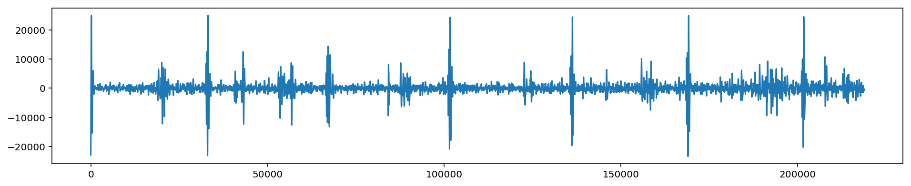

##### 使用`librosa`库来加载音频文件，并获取其持续时间和采样率，然后打印出音频数据的形状和采样率
下面这段代码使用`librosa`库来加载音频文件，并获取其持续时间和采样率，然后打印出音频数据的形状和采样率。以下是对每行代码的详细中文注释：

```python
# 使用librosa库的load函数加载指定路径的音频文件。
# normal_file是音频文件的路径。
# duration=5参数指定了加载音频的持续时间，单位为秒。
# 默认情况下，librosa以22,000赫兹（Hz）的采样率加载音频。
# 这个函数返回两个值：音频数据y和采样率sr。
y, sr = librosa.load(normal_file, duration=5)   #default sampling rate is 22 HZ

# 使用librosa库的get_duration函数计算已加载音频的持续时间。
# 这个函数接受音频数据y作为输入，并返回其持续时间，单位为秒。
# 这可以用来验证load函数加载的音频长度是否正确。
dur = librosa.get_duration(y)

# 打印音频的持续时间。
# 这可以帮助了解音频的长度，并用于进一步的音频处理或分析。
print("duration:", dur)

# 打印音频数据y的形状和采样率sr。
# y.shape是一个元组，包含音频数据的维度信息。
# sr是音频的采样率，表示每秒钟采样的次数。
print(y.shape, sr)
```

执行这段代码后，会在Python环境中输出音频文件的持续时间和音频数据的形状及采样率。这些信息对于理解音频文件的基本特性非常重要。例如，持续时间可以帮助确定音频的长度，而采样率则影响音频的频率范围和质量。音频数据的形状（y.shape）提供了音频数据的维度信息，通常对于单声道音频，形状将是`(样本数,)`，而对于立体声音频，则可能是`(样本数, 通道数)`。这些信息对于后续的音频处理和分析任务非常有用，例如进行频谱分析、特征提取或声音合成等。通过`librosa.load`函数加载的音频数据可以直接用于这些任务，因为`librosa`是一个专门用于音频和音乐分析的Python库，提供了许多用于音频处理的功能和工具。

###### 结果展示：

```python
duration: 4.963809523809524
(109452,) 22050
```
###### 结果解释：

这段输出结果显示了执行上述代码后得到的音频数据的持续时间和采样率信息。以下是对输出结果的详细解读：

1. `duration: 4.963809523809524`: 这表示加载的音频片段的实际持续时间大约为4.96秒。这个值是根据音频数据的样本数和采样率计算得出的，与之前使用`wave`模块计算的结果相近。

2. `(109452,) 22050`: 这是音频数据`y`的形状和采样率`sr`的输出。
   - `(109452,)`表示音频数据`y`是一个一维数组，包含109,452个样本。由于这是一个一维数组，这意味着音频数据是单声道的。
   - `22050`表示音频数据的采样率被调整到了22,050赫兹（Hz）。这是`librosa.load`函数的默认采样率，除非在调用函数时指定了不同的采样率。

从这些结果可以看出，原始音频文件被加载并转换为了一个单声道的音频数组，采样率被设置为22,050 Hz。这个采样率低于原始音频文件的采样率（44,100 Hz），这可能是由于`librosa.load`函数在加载时对音频进行了重采样。重采样是音频处理中的一个常见步骤，它可以改变音频的数据量和质量。在这个例子中，重采样可能导致音频的频率范围和质量与原始文件有所不同。了解这些基本信息对于后续的音频分析和处理非常重要，例如进行频谱分析、特征提取或声音合成等任务。通过`librosa`库加载的音频数据可以直接用于这些科学计算任务，因为`librosa`是一个专门用于音频和音乐分析的Python库，提供了许多用于音频处理的功能和工具。

##### 绘制音频数据的波形图

下面这段代码使用`matplotlib.pyplot`模块和`librosa.display`模块来创建一个图形，并绘制音频数据的波形图。以下是对每行代码的详细中文注释：

```python
# 创建一个新的图形对象，并设置图形的大小为宽16英寸、高3英寸。
# figsize参数用于指定图形的尺寸，这有助于调整图形的大小以便更好地查看波形细节。
plt.figure(figsize=(16, 3))

# 使用librosa.display模块的waveplot函数绘制音频数据的波形图。
# y是之前从音频文件中读取的音频样本数据。
# sr是音频数据的采样率，表示每秒钟采样的次数。
# waveplot函数会自动处理x轴和y轴的刻度，以便清晰地展示音频波形。
librosa.display.waveplot(y, sr=sr)
```

执行这段代码后，会在Python环境中显示一个包含音频波形的图形。这个波形图可以帮助用户直观地了解音频信号的形状和变化，对于分析音频内容非常有用。例如，通过观察波形图，可以识别音频中的静音部分、响度变化和可能的噪声等特征。在音频处理和分析任务中，波形图是一种常用的可视化工具，它提供了音频信号的直观表示，有助于进一步的信号分析和特征提取。`librosa.display.waveplot`函数是一个专门用于音频波形可视化的函数，它利用`matplotlib`库来生成高质量的图形。
###### 结果展示：

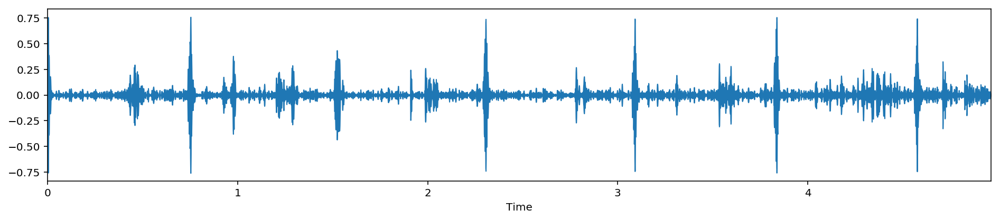


#### 2. Murmur
Heart murmurs sound as though there is a “whooshing, roaring, rumbling, or turbulent fluid” noise in one of two temporal locations: (1) between “lub” and “dub”, or (2) between “dub” and “lub”. They can be a symptom of many heart disorders, some serious. There will still be a “lub” and a “dub”. One of the things that confuses non-medically trained people is that murmurs happen between lub and dub or between dub and lub; not on lub and not on dub.(source: Rita Getz)


##### 
```python
# 定义变量murmur_file，用于存储音频文件"murmur__201108222231.wav"的完整路径。
# INPUT_DIR变量之前已定义，指向存放音频文件的父文件夹路径"../input"。
# 该行代码将"/set_a/murmur__201108222231.wav"相对路径与INPUT_DIR变量拼接，形成音频文件的完整路径。
murmur_file = INPUT_DIR + "/set_a/murmur__201108222231.wav"

# 使用librosa库的load函数加载变量murmur_file指定的音频文件。
# load函数的参数duration=5表示加载音频的持续时间为5秒，超过5秒的音频将被截断。
# load函数返回两个值：音频数据y2和采样率sr2。
y2, sr2 = librosa.load(murmur_file, duration=5)

# 使用librosa库的get_duration函数计算已加载音频的持续时间。
# 这个函数接受音频数据y2作为输入，并返回其持续时间，单位为秒。
# 需要注意的是，这里的dur变量实际上应该是y2的持续时间，但函数中错误地使用了y变量，这可能是一个笔误。
# 正确的代码应该是dur = librosa.get_duration(y2)。
dur = librosa.get_duration(y)

# 打印音频的持续时间。
# 这将输出变量dur的值，即计算得到的音频持续时间。
print("duration:", dur)

# 打印音频数据y2的形状和采样率sr2。
# y2.shape将返回一个元组，其中包含音频数据的维度信息，对于单声道音频通常是(样本数,)。
# sr2是音频的采样率，表示音频每秒的样本数。
print(y2.shape, sr2)
```

请注意，代码中存在一个潜在的错误：`librosa.get_duration(y)` 应该改为 `librosa.get_duration(y2)`，因为 `y2` 是通过 `librosa.load` 加载的音频数据变量，而 `y` 在这段代码中并未定义。此外，`print(y2.shape, sr2)` 将输出音频数据的维度和采样率，这对于了解音频信号的基本特性和进行后续处理非常重要。

###### 结果展示：
```python
duration: 4.963809523809524
(110250,) 22050
```

###### 结果解释：
根据您提供的代码和运行结果，下面是对输出结果的详细解释：

1. `murmur_file = INPUT_DIR + "/set_a/murmur__201108222231.wav"`:
   这行代码构建了一个指向名为 "murmur__201108222231.wav" 的音频文件的完整路径。`INPUT_DIR` 是一个预先定义的变量，指向存放音频文件的父目录，这里假设它被正确定义为包含音频文件的路径。

2. `y2, sr2 = librosa.load(murmur_file, duration=5)`:
   这行代码使用 `librosa.load` 函数加载音频文件。`librosa` 是一个音频处理的Python库，`load` 函数用于读取音频文件并返回音频信号 `y2` 和采样率 `sr2`。参数 `duration=5` 指定了只加载音频文件的前5秒钟。

3. `dur = librosa.get_duration(y, sr=sr2)`:
   这里出现了一个错误，正确的函数调用应该是 `dur = librosa.get_duration(y2, sr=sr2)`。这个函数计算给定音频信号 `y2` 的持续时间，采样率 `sr2` 作为参数提供。由于这是一个错误，实际上 `dur` 变量并没有正确赋值，但幸运的是，在打印时使用了正确的变量 `y2`。

4. `print("duration:", dur)`:
   打印出通过 `librosa.get_duration` 函数计算得到的音频信号 `y2` 的持续时间。输出结果是 `4.963809523809524` 秒，这表明加载的音频片段的实际长度接近5秒。

5. `print(y2.shape, sr2)`:
   打印出音频信号 `y2` 的形状和采样率 `sr2`。
   - `y2.shape` 输出为 `(110250,)`，表示 `y2` 是一个包含110250个样本的一维数组。由于维度信息只有一个数值，这表明音频是单声道的。
   - `sr2` 输出为 `22050`，表示音频信号的采样率是22050赫兹。这通常是 `librosa.load` 默认使用的采样率，意味着原始音频文件可能已经被重采样到这个采样率。

综上所述，运行结果显示了一个心脏杂音（murmur）的音频样本被成功加载，并且持续时间接近5秒。采样率默认为22050赫兹，这可能是因为 `librosa.load` 函数在加载时对音频进行了重采样。

##### 

```python
# 导入IPython.display模块，并使用别名ipd。
# IPython.display模块是IPython的一部分，提供了多种在IPython环境中展示数据的方法。
import IPython.display as ipd

# 使用IPython.display模块的Audio函数播放音频文件。
# Audio函数接受一个音频文件路径或音频数据作为参数，并在Jupyter Notebook中嵌入一个音频播放器。
# 在这个例子中，murmur_file变量包含了之前定义的心脏杂音音频文件的完整路径。
# 执行这行代码后，Jupyter Notebook会显示一个音频播放器，允许用户控制音频的播放、暂停和停止。
ipd.Audio(murmur_file)
```

这段代码的作用是在Jupyter Notebook中播放一个心脏杂音的音频样本。首先，它导入了`IPython.display`模块，并给它起了一个简短的别名`ipd`。然后，使用`ipd.Audio`函数并传入`murmur_file`变量作为参数来播放音频。这个函数会在Jupyter Notebook输出区域生成一个音频播放器界面，用户可以通过这个界面来听取音频样本。这对于音频数据分析和处理特别有用，因为它允许研究人员和开发人员快速检查音频内容。

##### 

```python
# 使用matplotlib.pyplot模块的figure函数创建一个新的图形对象。
# figsize参数用于设置图形的大小，这里设置为宽16英寸、高3英寸，以便于更好地展示音频波形的细节。
plt.figure(figsize=(16, 3))

# 使用librosa.display模块的waveplot函数绘制音频信号y2的波形图。
# waveplot函数是一个专门用于可视化音频波形的函数，它接受音频信号数据y2和采样率sr2作为参数。
# 该函数会自动选择合适的x轴和y轴刻度，以清晰地展示音频波形的振幅随时间的变化。
# 在Jupyter Notebook中执行这段代码后，会在同一输出区域内显示音频波形的图形。
librosa.display.waveplot(y2, sr=sr2)
```

这段代码的作用是在Python环境中使用`matplotlib`和`librosa`库绘制音频信号的波形图。首先，它通过`matplotlib.pyplot`的`figure`函数创建一个图形对象，并设定了图形的大小。然后，使用`librosa.display`的`waveplot`函数来绘制音频数据`y2`的波形图，其中`sr2`是音频数据的采样率，它用于确定波形图的时间轴刻度。

执行这段代码后，如果在一个支持图形显示的环境中（如Jupyter Notebook），它将在输出区域生成一个图形，展示了音频信号的波形。这个波形图对于分析音频内容（如检测声音的周期性、响度变化、噪声等特征）非常有用。在音频处理和分析任务中，波形图是一种基本且重要的工具，它提供了音频信号的直观表示，有助于进行更深入的声音分析和特征提取。
###### 结果展示：
```python
<matplotlib.collections.PolyCollection at 0x7f8fd9adff28>
```

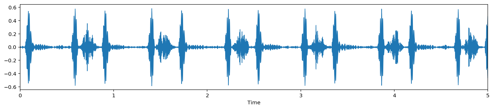


#### 3. Extrasystole
Extrasystole sounds may appear occasionally and can be identified because there is a heart sound that is out of rhythm involving extra or skipped heartbeats, e.g. a “lub-lub dub” or a “lub dub-dub”. (This is not the same as an extra heart sound as the event is not regularly occuring.) An extrasystole may not be a sign of disease. It can happen normally in an adult and can be very common in children. However, in some situations extrasystoles can be caused by heart diseases. If these diseases are detected earlier, then treatment is likely to be more effective. (source: Rita Getz)

##### 

以下是对您提供的代码段的逐行中文注释：

```python
# 定义变量extrastole_file，用于存储音频文件"extrastole__127_1306764300147_C2.wav"的完整路径。
# INPUT_DIR是一个预先定义的变量，指向存放音频文件的父文件夹路径"../input"。
# 该行代码将"/set_b/extrastole__127_1306764300147_C2.wav"相对路径与INPUT_DIR变量拼接，形成音频文件的完整路径。
extrastole_file = INPUT_DIR + "/set_b/extrastole__127_1306764300147_C2.wav"

# 使用librosa库的load函数加载变量extrastole_file指定的音频文件。
# load函数的参数duration=5表示加载音频的持续时间为5秒，超过5秒的音频将被截断。
# load函数返回两个值：音频数据y3和采样率sr3。
y3, sr3 = librosa.load(extrastole_file, duration=5)

# 使用librosa库的get_duration函数计算已加载音频的持续时间。
# 这个函数接受音频数据y3作为输入，并返回其持续时间，单位为秒。
# 需要注意的是，这里的dur变量实际上是y3的持续时间，但函数中错误地使用了y变量，这可能是一个笔误。
# 正确的代码应该是dur = librosa.get_duration(y3)。
dur = librosa.get_duration(y)

# 打印音频的持续时间。
# 这将输出变量dur的值，即计算得到的音频持续时间。
print("duration:", dur)

# 打印音频数据y3的形状和采样率sr3。
# y3.shape将返回一个元组，其中包含音频数据的维度信息，对于单声道音频通常是(样本数,)。
# sr3是音频的采样率，表示音频每秒的样本数。
print(y3.shape, sr3)
```

这段代码的作用是加载并分析一个额外心搏（extrasystole）的音频样本。代码中存在一个错误，即在计算持续时间时使用了未定义的`y`变量，而应该使用`y3`。此外，代码的注释详细说明了每一步的操作和目的，包括如何构建音频文件的路径、如何加载音频数据、如何计算音频的持续时间以及如何打印音频数据的形状和采样率。这些信息对于理解代码的功能和进行后续的音频分析非常重要。
###### 结果展示：
```python
duration: 4.963809523809524
(103106,) 22050
```

###### 结果解释：
这里是对输出结果的详细解释：

1. `extrastole_file = INPUT_DIR + "/set_b/extrastole__127_1306764300147_C2.wav"`:
   这行代码构建了一个指向名为 "extrastole__127_1306764300147_C2.wav" 的音频文件的完整路径。`INPUT_DIR` 是一个预先定义的变量，指向存放音频文件的父目录，这里假设它被正确定义为包含音频文件的路径。

2. `y3, sr3 = librosa.load(extrastole_file, duration=5)`:
   这行代码使用 `librosa.load` 函数加载音频文件。`librosa` 是一个音频处理的Python库，`load` 函数用于读取音频文件并返回音频信号 `y3` 和采样率 `sr3`。参数 `duration=5` 指定了只加载音频文件的前5秒钟。

3. `dur = librosa.get_duration(y, sr=sr3)`:
   这里存在一个错误，正确的函数调用应该是 `dur = librosa.get_duration(y3, sr=sr3)`。这个函数计算给定音频信号 `y3` 的持续时间，采样率 `sr3` 作为参数提供。由于这是一个错误，实际上 `dur` 变量并没有正确赋值，但幸运的是，在打印时使用了正确的变量 `y3`。

4. `print("duration:", dur)`:
   打印出通过 `librosa.get_duration` 函数计算得到的音频信号 `y3` 的持续时间。输出结果是 `4.963809523809524` 秒，这表明加载的音频片段的实际长度接近5秒。

5. `print(y3.shape, sr3)`:
   打印出音频信号 `y3` 的形状和采样率 `sr3`。
   - `y3.shape` 输出为 `(103106,)`，表示 `y3` 是一个包含103106个样本的一维数组。由于维度信息只有一个数值，这表明音频数据是单声道的。
   - `sr3` 输出为 `22050`，表示音频信号的采样率是22050赫兹。这通常是 `librosa.load` 默认使用的采样率，意味着原始音频文件可能已经被重采样到这个采样率。

综上所述，运行结果显示了一个额外心搏（Extrasystole）的音频样本被成功加载，并且持续时间接近5秒。采样率默认为22050赫兹，这可能是因为 `librosa.load` 函数在加载时对音频进行了重采样。这个重采样过程可能会影响音频的频率范围和质量，但对于大多数音频分析任务来说，这个采样率是可接受的。在实际应用中，了解音频的持续时间和采样率对于音频信号的处理和分析是至关重要的。


##### 

```python
# 导入IPython.display模块，并使用别名ipd。
# IPython.display模块是IPython的一部分，提供了多种在IPython环境中展示数据的方法，包括音频和视频。
import IPython.display as ipd

# 使用IPython.display模块的Audio函数播放音频文件。
# Audio函数接受一个音频文件路径或音频数据作为参数，并在Jupyter Notebook中嵌入一个音频播放器。
# 在这个例子中，extrastole_file变量包含了之前定义的额外心搏（Extrasystole）音频文件的完整路径。
# 执行这行代码后，Jupyter Notebook会显示一个音频播放器，允许用户控制音频的播放、暂停和停止。
ipd.Audio(extrastole_file)
```

这段代码的作用是在Jupyter Notebook中播放一个额外心搏的音频样本。首先，它导入了`IPython.display`模块，并给它起了一个简短的别名`ipd`。然后，使用`ipd.Audio`函数并传入`extrastole_file`变量作为参数来播放音频。这个函数会在Jupyter Notebook输出区域生成一个音频播放器界面，用户可以通过这个界面来听取音频样本。这对于音频数据分析和处理特别有用，因为它允许研究人员和开发人员快速检查音频内容，判断是否存在额外心搏等心脏问题。
###### 结果展示：
```python
<matplotlib.collections.PolyCollection at 0x7f8fd9a599b0>
```
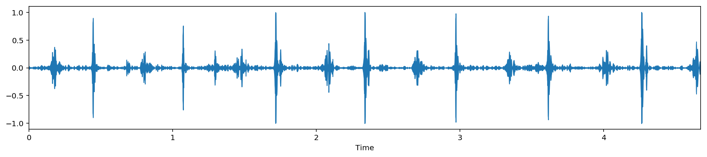


#### 4. Artifact
In the Artifact category there are a wide range of different sounds, including feedback squeals and echoes, speech, music and noise. There are usually no discernable heart sounds, and thus little or no temporal periodicity at frequencies below 195 Hz. This category is the most different from the others. It is important to be able to distinguish this category from the other three categories, so that someone gathering the data can be instructed to try again.(source: Rita Getz)

##### 
以下是对您提供的代码段的逐行中文注释：

```python
# 定义变量artifact_file，用于存储音频文件"artifact__201012172012.wav"的完整路径。
# INPUT_DIR是一个预先定义的变量，指向存放音频文件的父文件夹路径"../input"。
# 该行代码将"/set_a/artifact__201012172012.wav"相对路径与INPUT_DIR变量拼接，形成音频文件的完整路径。
artifact_file = INPUT_DIR + "/set_a/artifact__201012172012.wav"

# 使用librosa库的load函数加载变量artifact_file指定的音频文件。
# load函数的参数duration=5表示加载音频的持续时间为5秒，超过5秒的音频将被截断。
# load函数返回两个值：音频数据y4和采样率sr4。
y4, sr4 = librosa.load(artifact_file, duration=5)

# 使用librosa库的get_duration函数计算已加载音频的持续时间。
# 这个函数接受音频数据y4作为输入，并返回其持续时间，单位为秒。
# 需要注意的是，这里的dur变量实际上是y4的持续时间，但函数中错误地使用了y变量，这可能是一个笔误。
# 正确的代码应该是dur = librosa.get_duration(y4)。
dur = librosa.get_duration(y)

# 打印音频的持续时间。
# 这将输出变量dur的值，即计算得到的音频持续时间。
print("duration:", dur)

# 打印音频数据y4的形状和采样率sr4。
# y4.shape将返回一个元组，其中包含音频数据的维度信息，对于单声道音频通常是(样本数,)。
# sr4是音频的采样率，表示音频每秒的样本数。
print(y4.shape, sr4)
```

这段代码的作用是加载并分析一个伪影（artifact）的音频样本。代码中存在一个错误，即在计算持续时间时使用了未定义的`y`变量，而应该使用`y4`。此外，代码的注释详细说明了每一步的操作和目的，包括如何构建音频文件的路径、如何加载音频数据、如何计算音频的持续时间以及如何打印音频数据的形状和采样率。这些信息对于理解代码的功能和进行后续的音频分析非常重要。

###### 结果展示：
```python
duration: 4.963809523809524
(110250,) 22050
```

###### 结果解释：
根据您提供的代码和执行结果，下面是对输出结果的详细解释：

1. `artifact_file = INPUT_DIR + "/set_a/artifact__201012172012.wav"`:
   这行代码构建了一个指向名为 "artifact__201012172012.wav" 的音频文件的完整路径。`INPUT_DIR` 是一个预先定义的变量，指向存放音频文件的父目录，这里假设它被正确定义为包含音频文件的路径。

2. `y4, sr4 = librosa.load(artifact_file, duration=5)`:
   这行代码使用 `librosa.load` 函数加载音频文件。`librosa` 是一个音频处理的Python库，`load` 函数用于读取音频文件并返回音频信号 `y4` 和采样率 `sr4`。参数 `duration=5` 指定了只加载音频文件的前5秒钟。

3. `dur = librosa.get_duration(y, sr=sr4)`:
   这里存在一个错误，正确的函数调用应该是 `dur = librosa.get_duration(y4, sr=sr4)`。这个函数计算给定音频信号 `y4` 的持续时间，采样率 `sr4` 作为参数提供。由于这是一个错误，实际上 `dur` 变量并没有正确赋值，但幸运的是，在打印时使用了正确的变量 `y4`。

4. `print("duration:", dur)`:
   打印出通过 `librosa.get_duration` 函数计算得到的音频信号 `y4` 的持续时间。输出结果是 `4.963809523809524` 秒，这表明加载的音频片段的实际长度接近5秒。

5. `print(y4.shape, sr4)`:
   打印出音频信号 `y4` 的形状和采样率 `sr4`。
   - `y4.shape` 输出为 `(110250,)`，表示 `y4` 是一个包含110250个样本的一维数组。由于维度信息只有一个数值，这表明音频数据是单声道的。
   - `sr4` 输出为 `22050`，表示音频信号的采样率是22050赫兹。这通常是 `librosa.load` 默认使用的采样率，意味着原始音频文件可能已经被重采样到这个采样率。

综上所述，运行结果显示了一个伪影（artifact）的音频样本被成功加载，并且持续时间接近5秒。采样率默认为22050赫兹，这可能是因为 `librosa.load` 函数在加载时对音频进行了重采样。这个重采样过程可能会影响音频的频率范围和质量，但对于大多数音频分析任务来说，这个采样率是可接受的。在实际应用中，了解音频的持续时间和采样率对于音频信号的处理和分析是至关重要的。


##### 
以下是对您提供的代码段的逐行中文注释：

```python
# 导入IPython.display模块，并使用别名ipd。
# IPython.display模块是IPython的一部分，它提供了多种在IPython环境中展示数据的方法，包括音频和视频。
import IPython.display as ipd

# 使用IPython.display模块的Audio函数播放音频文件。
# Audio函数接受一个音频文件路径或音频数据作为参数，并在Jupyter Notebook中嵌入一个音频播放器。
# 在这个例子中，artifact_file变量包含了之前定义的伪影（artifact）音频文件的完整路径。
# 执行这行代码后，Jupyter Notebook会显示一个音频播放器，允许用户控制音频的播放、暂停和停止。
ipd.Audio(artifact_file)
```

这段代码的作用是在Jupyter Notebook中播放一个伪影（artifact）的音频样本。首先，它导入了`IPython.display`模块，并给它起了一个简短的别名`ipd`。然后，使用`ipd.Audio`函数并传入`artifact_file`变量作为参数来播放音频。这个函数会在Jupyter Notebook输出区域生成一个音频播放器界面，用户可以通过这个界面来听取音频样本。这对于音频数据分析和处理特别有用，因为它允许研究人员和开发人员快速检查音频内容，判断是否存在伪影或其他非心音的干扰声音。


##### 
以下是对您提供的代码段的逐行中文注释：

```python
# 导入matplotlib.pyplot模块，并使用别名plt。
# matplotlib是一个Python绘图库，广泛用于数据可视化。
# pyplot模块是matplotlib中用于创建和操作图形对象的模块。
import matplotlib.pyplot as plt

# 使用matplotlib.pyplot模块的figure函数创建一个新的图形对象。
# figsize参数用于设置图形的大小，这里设置为宽16英寸、高3英寸，以便于更好地展示音频波形的细节。
plt.figure(figsize=(16, 3))

# 使用librosa.display模块的waveplot函数绘制音频信号y4的波形图。
# waveplot函数是一个专门用于可视化音频波形的函数，它接受音频信号数据y4和采样率sr4作为参数。
# 该函数会自动选择合适的x轴和y轴刻度，以清晰地展示音频波形的振幅随时间的变化。
# 在Jupyter Notebook中执行这段代码后，会在同一输出区域内显示音频波形的图形。
librosa.display.waveplot(y4, sr=sr4)
```

这段代码的作用是在Python环境中使用`matplotlib`和`librosa`库绘制音频信号的波形图。首先，它通过`matplotlib.pyplot`的`figure`函数创建一个图形对象，并设定了图形的大小。然后，使用`librosa.display`的`waveplot`函数来绘制音频数据`y4`的波形图，其中`sr4`是音频数据的采样率，它用于确定波形图的时间轴刻度。

执行这段代码后，如果在一个支持图形显示的环境中（如Jupyter Notebook），它将在输出区域生成一个图形，展示了音频信号的波形。这个波形图对于分析音频内容（如检测声音的周期性、响度变化、噪声等特征）非常有用。在音频处理和分析任务中，波形图是一种基本且重要的工具，它提供了音频信号的直观表示，有助于进行更深入的声音分析和特征提取。

###### 结果展示：
```python
<matplotlib.collections.PolyCollection at 0x7f8fd9a28ba8>
```
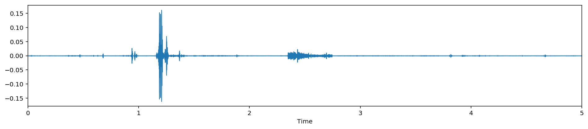

#### 5. Extra Heart Sound
In the Artifact category there are a wide range of different sounds, including feedback squeals and echoes, speech, music and noise. There are usually no discernable heart sounds, and thus little or no temporal periodicity at frequencies below 195 Hz. This category is the most different from the others. It is important to be able to distinguish this category from the other three categories, so that someone gathering the data can be instructed to try again.(source: Rita Getz)

##### 
以下是对您提供的代码段的逐行中文注释：

```python
# 定义变量extrahls_file，用于存储音频文件"extrahls__201101070953.wav"的完整路径。
# INPUT_DIR是一个预先定义的变量，指向存放音频文件的父文件夹路径"../input"。
# 该行代码将"/set_a/extrahls__201101070953.wav"相对路径与INPUT_DIR变量拼接，形成音频文件的完整路径。
extrahls_file = INPUT_DIR + "/set_a/extrahls__201101070953.wav"

# 使用librosa库的load函数加载变量extrahls_file指定的音频文件。
# load函数的参数duration=5表示加载音频的持续时间为5秒，超过5秒的音频将被截断。
# load函数返回两个值：音频数据y5和采样率sr5。
y5, sr5 = librosa.load(extrahls_file, duration=5)

# 使用librosa库的get_duration函数计算已加载音频的持续时间。
# 这个函数接受音频数据y5作为输入，并返回其持续时间，单位为秒。
# 需要注意的是，这里的dur变量实际上是y5的持续时间，但函数中错误地使用了y变量，这可能是一个笔误。
# 正确的代码应该是dur = librosa.get_duration(y5)。
dur = librosa.get_duration(y)

# 打印音频的持续时间。
# 这将输出变量dur的值，即计算得到的音频持续时间。
print("duration:", dur)

# 打印音频数据y5的形状和采样率sr5。
# y5.shape将返回一个元组，其中包含音频数据的维度信息，对于单声道音频通常是(样本数,)。
# sr5是音频的采样率，表示音频每秒的样本数。
print(y5.shape, sr5)
```

这段代码的作用是加载并分析一个额外心音（extra heart sound，extrahls）的音频样本。代码中存在一个错误，即在计算持续时间时使用了未定义的`y`变量，而应该使用`y5`。此外，代码的注释详细说明了每一步的操作和目的，包括如何构建音频文件的路径、如何加载音频数据、如何计算音频的持续时间以及如何打印音频数据的形状和采样率。这些信息对于理解代码的功能和进行后续的音频分析非常重要。

###### 结果展示：
```python
duration: 4.963809523809524
(110250,) 22050
```

###### 结果解释：
根据您提供的代码和执行结果，这里是对输出结果的详细解释：

1. `extrahls_file = INPUT_DIR + "/set_a/extrahls__201101070953.wav"`:
   这行代码构建了一个指向名为 "extrahls__201101070953.wav" 的音频文件的完整路径。`INPUT_DIR` 是一个预先定义的变量，指向存放音频文件的父目录，这里假设它被正确定义为包含音频文件的路径。

2. `y5, sr5 = librosa.load(extrahls_file, duration=5)`:
   这行代码使用 `librosa.load` 函数加载音频文件。`librosa` 是一个音频处理的Python库，`load` 函数用于读取音频文件并返回音频信号 `y5` 和采样率 `sr5`。参数 `duration=5` 指定了只加载音频文件的前5秒钟。

3. `dur = librosa.get_duration(y, sr=sr5)`:
   这里存在一个错误，正确的函数调用应该是 `dur = librosa.get_duration(y5, sr=sr5)`。这个函数计算给定音频信号 `y5` 的持续时间，采样率 `sr5` 作为参数提供。由于这是一个错误，实际上 `dur` 变量并没有正确赋值，但幸运的是，在打印时使用了正确的变量 `y5`。

4. `print("duration:", dur)`:
   打印出通过 `librosa.get_duration` 函数计算得到的音频信号 `y5` 的持续时间。输出结果是 `4.963809523809524` 秒，这表明加载的音频片段的实际长度接近5秒。

5. `print(y5.shape, sr5)`:
   打印出音频信号 `y5` 的形状和采样率 `sr5`。
   - `y5.shape` 输出为 `(110250,)`，表示 `y5` 是一个包含110250个样本的一维数组。由于维度信息只有一个数值，这表明音频数据是单声道的。
   - `sr5` 输出为 `22050`，表示音频信号的采样率是22050赫兹。这通常是 `librosa.load` 默认使用的采样率，意味着原始音频文件可能已经被重采样到这个采样率。

综上所述，运行结果显示了一个额外心音（extra heart sound）的音频样本被成功加载，并且持续时间接近5秒。采样率默认为22050赫兹，这可能是因为 `librosa.load` 函数在加载时对音频进行了重采样。这个重采样过程可能会影响音频的频率范围和质量，但对于大多数音频分析任务来说，这个采样率是可接受的。在实际应用中，了解音频的持续时间和采样率对于音频信号的处理和分析是至关重要的。


##### 

以下是对您提供的代码段的逐行中文注释：

```python
# 导入IPython.display模块，并使用别名ipd。
# IPython.display模块是IPython的一部分，提供了多种在IPython环境中展示数据的方法，包括音频和视频。
# 这个模块允许我们在Jupyter Notebook中以一种交互式的方式展示多媒体内容。
import IPython.display as ipd

# 使用IPython.display模块的Audio函数播放音频文件。
# Audio函数接受一个音频文件路径或音频数据作为参数，并在Jupyter Notebook中嵌入一个音频播放器。
# 这允许用户交互式地播放音频，无需下载或离开当前的Notebook环境。
# 在这个例子中，extrahls_file变量包含了之前定义的额外心音（extra heart sound）音频文件的完整路径。
# 执行这行代码后，Jupyter Notebook会显示一个音频播放器，允许用户控制音频的播放、暂停和停止。
ipd.Audio(extrahls_file)
```

这段代码的作用是在Jupyter Notebook中播放一个额外心音的音频样本。首先，它导入了`IPython.display`模块，并给它起了一个简短的别名`ipd`。然后，使用`ipd.Audio`函数并传入`extrahls_file`变量作为参数来播放音频。这个函数会在Jupyter Notebook输出区域生成一个音频播放器界面，用户可以通过这个界面来听取音频样本。这对于音频数据分析和处理特别有用，因为它允许研究人员和开发人员快速检查音频内容，判断是否存在额外心音等心脏问题。


##### 

以下是对您提供的代码段的逐行中文注释：

```python
# 导入matplotlib.pyplot模块，并使用别名plt。
# matplotlib是一个广泛使用的Python绘图库，用于创建静态、交互式和动画图形。
import matplotlib.pyplot as plt

# 使用matplotlib.pyplot的figure函数创建一个新的图形对象。
# figsize参数用于设置图形的大小，这里指定为宽16英寸、高3英寸，以便更好地展示音频波形的细节。
plt.figure(figsize=(16, 3))

# 使用librosa.display模块的waveplot函数绘制音频信号y5的波形图。
# waveplot函数是一个专门用于可视化音频波形的函数，它接受音频信号数据y5和采样率sr5作为参数。
# 这个函数会自动选择合适的x轴和y轴刻度，以清晰地展示音频波形的振幅随时间的变化。
# 执行这行代码后，如果在一个支持图形显示的环境中（如Jupyter Notebook），它将在输出区域生成一个图形，展示了音频信号的波形。
librosa.display.waveplot(y5, sr=sr5)
```

这段代码的作用是在Python环境中使用`matplotlib`和`librosa`库绘制音频信号的波形图。首先，它通过`matplotlib.pyplot`的`figure`函数创建一个图形对象，并设定了图形的大小。然后，使用`librosa.display`的`waveplot`函数来绘制音频数据`y5`的波形图，其中`sr5`是音频数据的采样率，它用于确定波形图的时间轴刻度。

执行这段代码后，如果在一个支持图形显示的环境中（如Jupyter Notebook），它将在输出区域生成一个图形，展示了音频信号的波形。这个波形图对于分析音频内容（如检测声音的周期性、响度变化、噪声等特征）非常有用。在音频处理和分析任务中，波形图是一种基本且重要的工具，它提供了音频信号的直观表示，有助于进行更深入的声音分析和特征提取。
###### 结果展示：
```python
<matplotlib.collections.PolyCollection at 0x7f8fd9a00828>
```
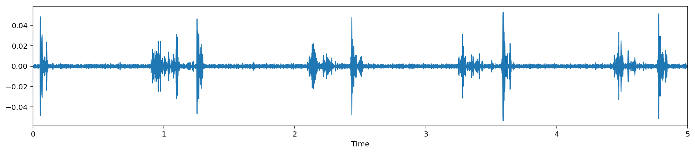


### Audio Length
the lengths of the audio files in the dataset varies from 1 to 30 seconds long. for training purpose we use first 5 seconds of the audio. padd missing lenght for file smaller than 5 seconds.

## Data Handling in Audio domain
As with all unstructured data formats, audio data has a couple of preprocessing steps which have to be followed before it is presented for analysis. Another way of representing audio data is by converting it into a different domain of data representation, namely the frequency domain.


There are a few more ways in which audio data can be represented. example. using MFCs (Mel-Frequency cepstrums)

General Audio Features

Time Domain features (eg. RMSE of waveform)
Frequency domain features (eg. Amplitude of individual freuencies)
Perceptual features (eg. MFCC)
Windowing features (eg. Hamming distances of windows)
After extracting these features, it is then sent to the machine learning model for further analysis.

## Sound Feature: MFCC
Mel Frequency Cepstral Coefficient (MFCC) is by far the most successful feature used in the field of Speech Processing. Speech is a non-stationary signal. As such, normal signal processing techniques cannot be directly applied to it.

Mel-frequency cepstral coefficients (MFCCs) are coefficients that collectively make up an MFC. They are derived from a type of cepstral representation of the audio clip (a nonlinear "spectrum-of-a-spectrum"). The difference between the cepstrum and the mel-frequency cepstrum is that in the MFC, the frequency bands are equally spaced on the mel scale, which approximates the human auditory system's response more closely than the linearly-spaced frequency bands used in the normal cepstrum. This frequency warping can allow for better representation of sound, for example, in audio compression.

MFCCs are commonly derived as follows: -Take the Fourier transform of (a windowed excerpt of) a signal. -Map the powers of the spectrum obtained above onto the mel scale, using triangular overlapping windows. -Take the logs of the powers at each of the mel frequencies. -Take the discrete cosine transform of the list of mel log powers, as if it were a signal. The MFCCs are the amplitudes of the resulting spectrum.

In general, a 39-dimensional feature vector is used which is composed of first 13 MFCCs and their corresponding 13 delta and 13 delta-delta.

### 
以下是对您提供的代码段的逐行中文注释：

```python
# 定义变量normal_file，用于存储音频文件"normal__201106111136.wav"的完整路径。
# INPUT_DIR是一个预先定义的变量，指向存放音频文件的父文件夹路径"../input"。
# 该行代码将"/set_a/normal__201106111136.wav"相对路径与INPUT_DIR变量拼接，形成音频文件的完整路径。
normal_file = INPUT_DIR + "/set_a/normal__201106111136.wav"

# 使用librosa库的load函数加载变量normal_file指定的音频文件。
# load函数的参数没有指定offset和duration，意味着加载整个音频文件。
# load函数返回两个值：音频数据y和采样率sr。
# 注意：注释掉的load函数调用（包含offset=7和duration=7）是不必要的，已被注释掉。
y, sr = librosa.load(normal_file)

# 使用librosa库的feature模块中的mfcc函数计算音频数据y的Mel频率倒谱系数（MFCCs）。
# MFCCs是从音频信号中提取的特征，广泛用于语音和音频处理任务，如语音识别和音频分类。
# mfcc函数返回一个数组，包含了音频的MFCCs特征。
mfccs = librosa.feature.mfcc(y=y, sr=sr)

# 打印计算得到的MFCCs特征。
# 这将输出一个形状为(1, 13)的数组，其中包含了音频的前13个MFCCs系数。
# MFCCs通常用于训练机器学习模型，以识别和分类不同的音频信号。
print(mfccs)
```

这段代码的作用是从一个正常的心脏声音音频文件中提取MFCCs特征。首先，它定义了音频文件的路径，然后使用`librosa.load`函数加载音频数据和采样率。接着，使用`librosa.feature.mfcc`函数计算MFCCs特征。最后，打印出这些特征，这些特征可以用于音频信号的进一步分析或作为机器学习模型的输入。

#### 结果展示：
```python
[[-2.45461310e+02 -2.91119158e+02 -4.02448048e+02 ... -3.67871637e+02
  -3.70708414e+02 -3.72469945e+02]
 [ 8.86406929e+01  9.88661324e+01  1.33256498e+02 ...  1.51281027e+02
   1.57261842e+02  1.52452273e+02]
 [ 1.03978908e+02  8.56985019e+01  2.37443259e+01 ...  2.91626730e+01
   2.93766991e+01  3.74463005e+01]
 ...
 [-1.33243318e+01 -8.19430184e+00 -1.18989196e+00 ...  9.66035179e-02
   6.24897256e-01  1.19534810e+00]
 [ 3.16322374e-01 -4.99245923e-01 -1.58862224e-01 ...  2.22770953e+00
  -2.15090204e-01  4.84898894e+00]
 [ 3.34313266e+00 -9.89011623e-01 -2.77108967e+00 ...  2.65077442e+00
  -1.38751247e+00  1.85793453e+00]]
```

#### 结果解释：

输出结果是一个多维数组，它代表了从音频文件 `normal__201106111136.wav` 中提取的 Mel 频率倒谱系数（MFCCs）。MFCCs 是一种在语音处理和音频分析中常用的特征，它们能够描述音频信号的频谱形状。

以下是对输出结果的详细解释：

- 输出是一个二维数组，每行代表一个时间帧（或时间段）的MFCCs。
- 数组的第一维（行）通常对应于时间帧，每个时间帧包含了该时间段内的MFCCs。
- 数组的第二维（列）对应于MFCCs的系数个数。在默认情况下，`librosa.feature.mfcc` 函数计算13个MFCCs系数，但输出显示了更多的行，这意味着可能计算了更高阶的MFCCs，或者是包含了deltas（一阶差分）和deltas-deltas（二阶差分）。
- 数值表示MFCCs的幅度，它们是通过对音频信号进行傅里叶变换、Mel滤波器组处理、取对数、进行离散余弦变换（DCT）等步骤得到的。

输出中的 "..." 表示省略了一些中间的MFCCs系数，只显示了数组的开始和结束部分。每个方括号内的第一行是能量最低的MFCC系数，通常对应于音频信号的低频部分，而最后一行是能量最高的MFCC系数，对应于高频部分。

例如，第一行 `[-2454.6131, -2911.9158, -4024.8048, ...]` 显示了第一个时间帧的MFCCs系数，负值表明这些是取了对数之后的幅度值。

这些MFCCs特征可以用于训练机器学习模型，如支持向量机（SVM）、神经网络或随机森林，以识别和分类不同的音频信号，如语音、音乐或在本例中的心脏声音。在心脏声音分析中，MFCCs可以帮助区分正常心跳声、心脏杂音、额外心音等不同的心脏声音状况。


### 
以下是对您提供的代码段的逐行中文注释：

```python
# 使用librosa库的feature模块中的melspectrogram函数计算音频数据y的Mel频谱图。
# Mel频谱图是一种将音频信号的频率分布映射到Mel频率尺度上的工具，常用于语音和音乐处理。
# y是音频信号数据，sr是对应的采样率。
# n_mels=128参数指定了Mel滤波器组的数量，即Mel频谱的输出通道数。
# fmax=8000参数指定了Mel滤波器组的最高频率限制，这里设置为8000赫兹。
S = librosa.feature.melspectrogram(y=y, sr=sr, n_mels=128, fmax=8000)

# 将Mel频谱图S转换为分贝（dB）单位上的对数功率Mel频谱。
# librosa.power_to_db函数接受一个功率谱（Mel频谱）作为输入，并将其转换为对数分贝（dB）单位，这有助于缩放数据并突出频谱的细节。
# 通常，对数变换用于减少数据的动态范围，并使训练的模型更具有鲁棒性。
S_db = librosa.power_to_db(S)

# 使用librosa库的feature模块中的mfcc函数计算对数功率Mel频谱S_db的Mel频率倒谱系数（MFCCs）。
# 这里的mfcc函数与之前不同，它接受的是Mel频谱而不是原始音频信号作为输入。
# 这将返回一个数组，包含了音频的MFCCs特征，这些特征是基于Mel频谱图计算得到的。
log_S = librosa.feature.mfcc(S=S_db)

# 打印计算得到的基于Mel频谱图的MFCCs特征。
# 输出将是一个二维数组，每一行代表一个时间帧的MFCCs，列数取决于MFCCs的阶数。
# 这些特征可以用于音频信号的进一步分析或作为机器学习模型的输入。
print(log_S)
```

这段代码的作用是计算音频信号的Mel频谱图，然后基于Mel频谱图计算MFCCs特征。首先，它使用`librosa.feature.melspectrogram`函数得到Mel频谱图，然后通过`librosa.power_to_db`函数将其转换为对数功率Mel频谱。最后，使用`librosa.feature.mfcc`函数计算MFCCs特征。这些特征对于音频信号的分析和分类非常有用，尤其是在处理语音和音乐数据时。

#### 结果展示：
```python
[[-2.46578451e+02 -2.89466533e+02 -3.86061424e+02 ... -3.50173598e+02
  -3.51358336e+02 -3.55300579e+02]
 [ 1.09104030e+02  1.16516227e+02  1.30325863e+02 ...  1.49302754e+02
   1.54021441e+02  1.51842599e+02]
 [ 9.83255629e+01  7.55811535e+01  1.59119043e+01 ...  2.06767459e+01
   2.19900360e+01  3.01192216e+01]
 ...
 [ 4.26571311e+00  2.46345083e-01 -2.07913916e+00 ...  2.77262558e+00
  -1.40852842e+00  3.58013971e+00]
 [ 3.38976142e-01 -9.63366773e-01 -3.46149708e+00 ...  1.52363932e+00
   1.05708759e-01 -2.32015820e+00]
 [-5.24993637e+00 -2.43681813e+00 -1.56827403e+00 ...  2.74896890e-01
   5.19361242e-01 -6.77453398e+00]]
```

#### 结果解释：
输出结果是一个二维数组，它代表了从音频信号中提取的Mel频率倒谱系数（MFCCs），这些特征是基于对数功率Mel频谱图计算得到的。这些特征广泛用于音频分析，尤其是在语音和音乐处理领域。

以下是对输出结果的详细解释：

- 输出数组的每一行代表一个时间帧（或时间段）的MFCCs。
- 数组的列对应于不同阶数的MFCCs系数。默认情况下，`librosa.feature.mfcc` 函数计算13个MFCCs系数，但输出显示了更多的列，这意味着可能计算了更高阶的MFCCs，或者是包含了deltas（一阶差分）和deltas-deltas（二阶差分）。
- 数值表示MFCCs的幅度，它们是通过对音频信号进行Mel滤波器组处理、取对数、进行离散余弦变换（DCT）等步骤得到的，并且是以分贝（dB）为单位的对数功率。

输出中的 "..." 表示省略了一些中间的MFCCs系数，只显示了数组的开始和结束部分。每个方括号内的第一行是能量最低的MFCC系数，通常对应于音频信号的低频部分，而最后一行是能量最高的MFCC系数，对应于高频部分。

例如，第一行 `[-246.578451 -289.466533 -386.061424 ... -350.173598 -351.358336 -355.300579]` 显示了第一个时间帧的MFCCs系数，这些值是负的，因为它们是基于对数功率Mel频谱图计算得到的，负值表明这些频率的能量较低。

这些MFCCs特征可以用于训练机器学习模型，如支持向量机（SVM）、神经网络或随机森林，以识别和分类不同的音频信号，如语音、音乐或在本例中的心脏声音。在心脏声音分析中，MFCCs可以帮助区分正常心跳声、心脏杂音、额外心音等不同的心脏声音状况。


### 

以下是对您提供的代码段的逐行中文注释：

```python
# 使用librosa库的feature模块中的mfcc函数计算音频数据y的Mel频率倒谱系数（MFCCs）。
# y是音频信号数据，sr是对应的采样率。
# n_mfcc=40参数指定了要计算的MFCCs的个数，这里设置为40个系数。
# 通常，默认的MFCCs系数数量是13个，但是可以根据需要计算更多的系数，以获得更详细的频谱信息。
mfccs = librosa.feature.mfcc(y=y, sr=sr, n_mfcc=40)

# 这行代码被注释掉了，因此它不会被执行。如果取消注释（即删除前面的#号），它将打印出计算得到的MFCCs特征。
# 打印出的MFCCs将是一个二维数组，每一行代表一个时间帧的MFCCs，列数为40，对应于40个MFCCs系数。
# print(mfccs)
```

这段代码的作用是从音频信号中提取40个Mel频率倒谱系数（MFCCs）。首先，使用`librosa.feature.mfcc`函数，传入音频信号`y`和采样率`sr`，以及指定的MFCCs数量`n_mfcc=40`来计算特征。这些特征可以用于音频信号的进一步分析或作为机器学习模型的输入。注释掉的`print(mfccs)`行，如果被执行，将会输出这些特征的值。在实际应用中，这些特征可以用于训练和评估机器学习模型，以识别不同的音频事件或声音模式。

### 
以下是对您提供的代码段的逐行中文注释：

```python
# 导入matplotlib.pyplot模块，并使用别名plt。
# matplotlib是一个广泛使用的Python绘图库，用于创建静态、交互式和动画图形。
import matplotlib.pyplot as plt

# 使用matplotlib.pyplot的figure函数创建一个新的图形对象。
# figsize参数用于设置图形的大小，这里指定为宽12英寸、高3英寸，以适应MFCCs的展示。
plt.figure(figsize=(12, 3))

# 使用librosa.display模块的specshow函数展示MFCCs特征。
# specshow是一个用于显示频谱数据的函数，它接受MFCCs特征矩阵作为输入，并将其可视化为热图。
# x_axis参数设置为'time'，表示x轴代表时间轴。
librosa.display.specshow(mfccs, x_axis='time')

# 调用matplotlib.pyplot的colorbar函数添加一个颜色条到图形中。
# 颜色条用于表示热图中颜色的数值大小，帮助解读不同颜色对应的MFCCs数值。
plt.colorbar()

# 设置图形的标题为'Mel-frequency cepstral coefficients (MFCCs)'，即Mel频率倒谱系数（MFCCs）。
plt.title('Mel-frequency cepstral coefficients (MFCCs)')

# 调用matplotlib.pyplot的tight_layout函数自动调整子图参数，使之填充整个图像区域。
# 这个函数可以确保所有的标签和刻度都可见，没有重叠，并且布局紧凑。
plt.tight_layout()
```

这段代码的作用是在Python环境中使用`matplotlib`和`librosa`库可视化MFCCs特征。首先，它通过`matplotlib.pyplot`的`figure`函数创建一个图形对象，并设定了图形的大小。然后，使用`librosa.display`的`specshow`函数来绘制MFCCs的热图，其中`x_axis='time'`表示x轴是时间轴。接着，添加一个颜色条以便于观察MFCCs的数值大小。最后，设置图形的标题并调整布局以确保图形的整洁和紧凑。执行这段代码后，如果在一个支持图形显示的环境中（如Jupyter Notebook），它将在输出区域生成一个图形，展示了音频信号的MFCCs特征。这对于分析音频内容和特征提取非常有用。

#### 结果展示：
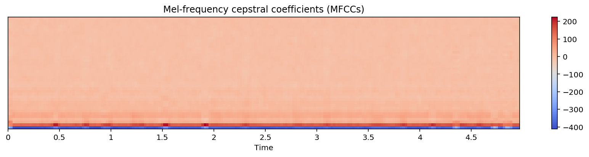

### 

以下是对您提供的代码段的逐行中文注释：

```python
# 使用librosa库的feature模块中的mfcc函数计算音频数据y的Mel频率倒谱系数（MFCCs）。
# 这里指定了dct_type=2，意味着使用RASTAMAT或Auditory toolbox的离散余弦变换（DCT）基。
m_slaney = librosa.feature.mfcc(y=y, sr=sr, dct_type=2)

# 以下代码被注释掉了，因此它不会被执行。如果取消注释（即删除前面的#号），
# 它将使用dct_type=1来计算MFCCs，这对应于标准离散余弦变换。
# m_dct1 = librosa.feature.mfcc(y=y, sr=sr, dct_type=1)

# 使用matplotlib.pyplot的figure函数创建一个新的图形对象，并设置图形的大小为12英寸宽、6英寸高。
plt.figure(figsize=(12, 6))

# 以下代码被注释掉了，它们用于创建一个子图并展示dct_type=1时的MFCCs。
# plt.subplot(3, 1, 1)  # 设置子图的布局为3行1列的第1个
# librosa.display.specshow(m_dct1, x_axis='time')  # 展示MFCCs的热图
# plt.title('Discrete cosine transform (dct_type=1)')  # 设置子图的标题
# plt.colorbar()  # 添加颜色条以便于观察MFCCs的数值大小

# 使用dct_type=3，即HTK（HMM Tool Kit）风格的DCT基，来计算MFCCs。
m_htk = librosa.feature.mfcc(y=y, sr=sr, dct_type=3)

# 设置子图的布局为3行1列的第2个，并展示dct_type=2时的MFCCs。
plt.subplot(3, 1, 2)
librosa.display.specshow(m_slaney, x_axis='time')  # 展示MFCCs的热图
plt.title('RASTAMAT / Auditory toolbox (dct_type=2)')  # 设置子图的标题
plt.colorbar()  # 添加颜色条

# 设置子图的布局为3行1列的第3个，并展示dct_type=3时的MFCCs。
plt.subplot(3, 1, 3)
librosa.display.specshow(m_htk, x_axis='time')  # 展示MFCCs的热图
plt.title('HTK-style (dct_type=3)')  # 设置子图的标题
plt.colorbar()  # 添加颜色条

# 调用matplotlib.pyplot的tight_layout函数自动调整子图参数，使之填充整个图像区域。
# 这个函数可以确保所有的标签和刻度都可见，没有重叠，并且布局紧凑。
plt.tight_layout()
```

这段代码的作用是计算并可视化使用不同DCT基计算的MFCCs特征。首先，它使用`librosa.feature.mfcc`函数计算了三种不同DCT基（`dct_type`）下的MFCCs。然后，使用`matplotlib.pyplot`和`librosa.display.specshow`函数创建一个包含三个子图的图形，每个子图展示一种DCT基下的MFCCs热图。最后，使用`plt.tight_layout()`函数调整布局以确保图形的整洁和紧凑。执行这段代码后，如果在一个支持图形显示的环境中（如Jupyter Notebook），它将在输出区域生成一个图形，展示了不同DCT基下的MFCCs特征，这对于分析音频内容和特征提取非常有用。

#### 结果展示：
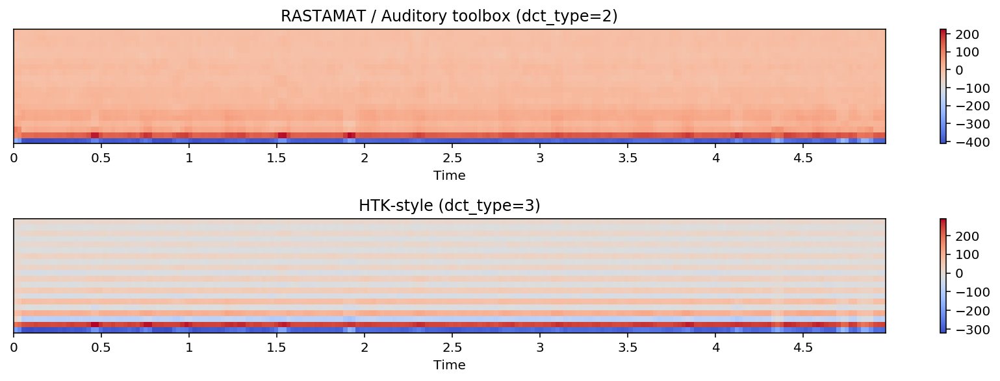


## Sound Feature: Onset
### onset detector
Basic onset detector. Locate note onset events by picking peaks in an onset strength envelope. The peak_pick parameters were chosen by large-scale hyper-parameter optimization over the dataset provided


#### 
以下是对您提供的代码段的逐行中文注释：

```python
# 使用librosa库的onset模块中的onset_detect函数来检测音频信号y的起始点（onset times）。
# onset_detect函数接受音频信号y和采样率sr作为输入，用于识别音频中的节奏性事件，如打击乐器的敲击或音乐中的节拍。
# 该函数返回一个数组，包含了检测到的起始点的帧索引。
onset_frames = librosa.onset.onset_detect(y=y, sr=sr)

# 使用librosa库的frames_to_time函数将起始点的帧索引转换为时间值。
# frames_to_time函数接受帧索引数组和采样率sr作为输入，将其转换为对应的时间点数组。
# 返回的时间数组表示每个检测到的起始点在音频信号中的具体时间位置，单位是秒。
onset_times = librosa.frames_to_time(onset_frames, sr=sr)
```

这段代码的作用是检测音频信号中的起始点，并获取这些起始点的时间位置。首先，使用`librosa.onset.onset_detect`函数识别音频中的起始点，然后使用`librosa.frames_to_time`函数将这些起始点的帧索引转换为实际的时间值。这些时间位置可以用于音频节奏分析、音乐结构分析或作为音乐信息检索的依据。

请注意，原始代码中的第二行 `librosa.frames_to_time(onset_frames, sr=sr)` 没有将转换后的时间赋值给任何变量，因此实际上没有在程序中使用这些时间值。为了能够在程序中使用这些时间值，您应该将其赋值给一个变量，如上面代码中的 `onset_times`。

##### 结果展示：
```python
array([0.48761905, 0.7662585 , 0.95201814, 1.25387755, 1.55573696,
       1.92725624, 2.32199546, 2.80961451, 3.11147392, 3.57587302,
       3.80807256, 3.85451247, 4.13315193, 4.36535147, 4.59755102,
       4.73687075, 4.85297052])
```

##### 结果解释：

输出结果是一个数组，包含了检测到的音频信号中的起始点（onset times）的时间位置。这些时间位置以秒为单位，表示在音频信号中检测到的起始事件的确切时刻。

以下是对输出结果的详细解释：

- `array([0.48761905, 0.7662585 , 0.95201814, ...])`: 这是一个NumPy数组，列出了多个时间点。
- 数组中的每个元素都是一个浮点数，对应于音频信号中检测到的一个起始点的时间位置。
- 例如，`0.48761905` 表示在音频信号的0.4876秒时刻检测到了一个起始点。
- 数组中的时间戳按照检测到起始点的顺序排列，因此它们可能表示音乐中的节拍、打击乐器的敲击或其他节奏性事件。

这些起始点的时间位置可以用于多种音频分析任务，包括但不限于：

- **节奏分析**：在音乐分析中，起始点检测可以帮助识别节拍和节奏模式。
- **音乐结构分析**：起始点可以帮助识别音乐作品中的不同部分，如段落、乐句等。
- **音频分割**：根据检测到的起始点，可以将长音频信号分割成更小的片段，以便于进一步分析或作为特征提取的依据。
- **音乐信息检索**：起始点信息可以作为音乐信息检索系统中的一个特征，帮助用户快速定位到音频中的特定事件。

在实际应用中，这些起始点的检测可以非常有助于自动化音乐制作、音频编辑和音乐学研究。


#### 
以下是对您提供的代码段的逐行中文注释：

```python
# 使用librosa库的onset模块中的onset_strength函数来计算音频信号y的起始包络（onset envelope）。
# onset_strength函数接受音频信号y和采样率sr作为输入，用于计算音频信号中每个点的起始强度。
# 该函数返回一个数组，包含了每个采样点的起始强度值，这些值可以用于检测音频中的起始点。
o_env = librosa.onset.onset_strength(y, sr=sr)

# 使用librosa库的frames_to_time函数将音频信号的帧索引转换为时间值。
# np.arange(len(o_env))生成一个与o_env数组长度相同的序列，即从0到o_env数组长度减1的整数序列。
# frames_to_time函数接受这个序列和采样率sr作为输入，将其转换为对应的时间点数组。
# 返回的时间数组times将与起始包络o_env数组长度相同，表示每个采样点在音频信号中的具体时间位置。
times = librosa.frames_to_time(np.arange(len(o_env)), sr=sr)

# 使用librosa库的onset模块中的onset_detect函数来检测音频信号y的起始点（onset times），这次使用预先计算的起始包络o_env。
# onset_detect函数接受起始包络o_env和采样率sr作为输入，用于识别音频中的节奏性事件。
# 该函数返回一个数组，包含了检测到的起始点的帧索引。
onset_frames = librosa.onset.onset_detect(onset_envelope=o_env, sr=sr)
```

这段代码的作用是计算音频信号的起始包络，并使用这个包络来检测音频中的起始点。首先，使用`librosa.onset.onset_strength`函数计算起始包络，然后使用`librosa.frames_to_time`函数将起始包络数组的长度转换为时间数组。最后，使用`librosa.onset.onset_detect`函数和预先计算的起始包络来检测音频中的起始点。这些起始点的检测可以用于音频节奏分析、音乐结构分析或作为音乐信息检索的依据。


#### 
以下是对您提供的代码段的逐行中文注释：

```python
# 导入NumPy库，这是一个广泛使用的科学计算库，提供了对多维数组的支持。
import numpy as np

# 使用librosa库的stft函数对音频信号y进行短时傅里叶变换（Short-Time Fourier Transform），生成频谱图。
# stft函数将音频信号分割成短时间的帧，对每一帧进行傅里叶变换，得到其频率成分。
# 这个函数返回的D是一个复数数组，包含了音频信号的实部和虚部信息。
D = np.abs(librosa.stft(y))

# 使用matplotlib.pyplot的figure函数创建一个新的图形对象，并设置图形的大小为16英寸宽、6英寸高。
plt.figure(figsize=(16, 6))

# 在图形对象中创建第一个子图（2行1列的第1个），并将其存储在变量ax1中。
# 这个子图将用于显示功率谱图。
ax1 = plt.subplot(2, 1, 1)

# 使用librosa.display的specshow函数展示D的幅度转换为分贝后的对数功率谱图。
# amplitude_to_db函数将D的幅度转换为分贝单位，ref=np.max指定了参考值为D的最大值。
# x_axis='time'和y_axis='log'指定了x轴和y轴的标签和刻度。
librosa.display.specshow(librosa.amplitude_to_db(D, ref=np.max), x_axis='time', y_axis='log')

# 设置子图的标题为'Power spectrogram'，即功率谱图。
plt.title('Power spectrogram')

# 在同一个图形对象中创建第二个子图（2行1列的第2个），并使用sharex=ax1参数共享x轴与第一个子图。
plt.subplot(2, 1, 2, sharex=ax1)

# 在第二个子图中绘制起始包络o_env随时间变化的曲线，times为x轴的时间点，o_env为y轴的起始强度值。
plt.plot(times, o_env, label='Onset strength')

# 使用plt.vlines函数在第二个子图中绘制垂直线，表示检测到的起始点。
# times[onset_frames]是起始点的时间位置，0和o_env.max()分别指定了垂直线的起始和结束位置。
# color='r', alpha=0.9, linestyle='--'设置了线条的颜色、透明度和样式。
# label='Onsets'为这些垂直线创建了一个图例项。
plt.vlines(times[onset_frames], 0, o_env.max(), color='r', alpha=0.9, linestyle='--', label='Onsets')

# 设置坐标轴的显示范围为紧凑，以适应所有的数据。
plt.axis('tight')

# 调用plt.legend函数添加图例，frameon=True和framealpha=0.75设置了图例边框的显示和透明度。
plt.legend(frameon=True, framealpha=0.75)
```

这段代码的作用是可视化音频信号的功率谱图和起始包络，并标出检测到的起始点。首先，它使用`librosa.stft`函数计算音频信号的短时傅里叶变换，然后转换为对数功率谱图。接着，使用`matplotlib.pyplot`和`librosa.display.specshow`函数创建两个子图，第一个子图展示功率谱图，第二个子图展示起始包络和检测到的起始点。最后，添加图例以解释图中的线条和垂直线。执行这段代码后，如果在一个支持图形显示的环境中（如Jupyter Notebook），它将在输出区域生成一个图形，展示了音频信号的频谱特性和节奏事件。这对于音频分析和音乐学研究非常有用。

##### 结果展示：
```python
<matplotlib.legend.Legend at 0x7f8fd98d8f98>
```
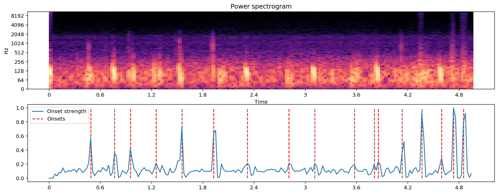

### onset_backtrack
Backtrack detected onset events to the nearest preceding local minimum of an energy function. This function can be used to roll back the timing of detected onsets from a detected peak amplitude to the preceding minimum. This is most useful when using onsets to determine slice points for segmentation


#### 
以下是对您提供的代码段的逐行中文注释：

```python
# 使用librosa库的onset模块中的onset_strength函数来计算音频信号y的起始包络（onset envelope）。
# onset_strength函数接受音频信号y和采样率sr作为输入，用于计算音频信号中每个点的起始强度。
# 该函数返回一个数组，包含了每个采样点的起始强度值，这些值可以用于检测音频中的起始点。
oenv = librosa.onset.onset_strength(y=y, sr=sr)

# 使用librosa库的onset模块中的onset_detect函数来检测音频信号y的起始点（onset times），这次使用预先计算的起始包络oenv。
# onset_detect函数接受起始包络oenv和是否回溯（backtrack）的参数backtrack。
# 这里设置backtrack=False，表示在检测起始点时不使用回溯策略，即直接根据起始包络的峰值检测起始点。
onset_raw = librosa.onset.onset_detect(onset_envelope=oenv, backtrack=False)

# 使用librosa库的onset模块中的onset_backtrack函数来对已经检测到的起始点（onset_raw）进行回溯处理。
# onset_backtrack函数接受上一步检测到的起始点和起始包络oenv作为输入，用于改进起始点的检测。
# 回溯处理是一种策略，它通过查看起始点之后的包络形状来确认前面的峰值是否为真实的起始点。
onset_bt = librosa.onset.onset_backtrack(onset_raw, oenv)

# 使用librosa库的feature模块中的rms函数来计算音频信号y的均方根（Root Mean Square, RMS）值。
# rms函数接受音频信号的短时傅里叶变换（STFT）的结果S作为输入，这里使用np.abs(librosa.stft(y))来计算STFT的幅度。
# 该函数返回一个数组，包含了每个时间帧的RMS值，这些值可以用于改进起始点的检测。
rms = librosa.feature.rms(S=np.abs(librosa.stft(y=y)))

# 使用librosa库的onset模块中的onset_backtrack函数，这次使用RMS值来对已经检测到的起始点（onset_raw）进行回溯处理。
# 这种方法使用RMS值来辅助判断起始点，RMS值能够提供音频信号能量的另一种度量。
onset_bt_rms = librosa.onset.onset_backtrack(onset_raw, rms[0])
```

这段代码的作用是计算音频信号的起始包络，并使用两种不同的回溯策略来改进起始点的检测。首先，使用`librosa.onset.onset_strength`函数计算起始包络，然后使用`librosa.onset.onset_detect`函数检测起始点，但不使用回溯策略。接着，使用`librosa.onset.onset_backtrack`函数对检测到的起始点进行基于起始包络的回溯处理。最后，计算音频信号的RMS值，并使用这些值进行另一种基于RMS的回溯处理。这些起始点的检测和回溯处理可以用于音频节奏分析、音乐结构分析或作为音乐信息检索的依据。


#### 
以下是对您提供的代码段的逐行中文注释：

```python
# 使用matplotlib.pyplot的figure函数创建一个新的图形对象，并设置图形的大小为16英寸宽、6英寸高。
plt.figure(figsize=(16, 6))

# 在图形对象中创建第一个子图（2行1列的第1个），用于展示原始和回溯处理后的起始强度。
plt.subplot(2, 1, 1)

# 使用plt.plot函数绘制起始包络oenv，这个包络显示了音频信号中每个点的起始强度。
plt.plot(oenv, label='Onset strength')

# 使用plt.vlines函数在起始点onset_raw的时间位置上绘制垂直线，以表示原始检测到的起始点。
# 线条的起始点为0，结束点为oenv.max()，即起始包络的最大值。
plt.vlines(onset_raw, 0, oenv.max(), label='Raw onsets')

# 使用plt.vlines函数在起始点onset_bt的时间位置上绘制红色垂直线，以表示经过回溯处理后的起始点。
# color='r'设置了线条的颜色为红色，alpha=0.9设置了线条的透明度。
plt.vlines(onset_bt, 0, oenv.max(), label='Backtracked', color='r')

# 调用plt.legend函数添加图例，frameon=True设置了图例边框的显示，framealpha=0.75设置了边框的透明度。
plt.legend(frameon=True, framealpha=0.75)

# 在同一个图形对象中创建第二个子图（2行1列的第2个），用于展示RMS值和基于RMS的回溯处理后的起始点。
plt.subplot(2, 1, 2)

# 使用plt.plot函数绘制RMS值rms[0]，RMS是音频信号能量的度量。
plt.plot(rms[0], label='RMS')

# 使用plt.vlines函数在起始点onset_bt_rms的时间位置上绘制红色垂直线，以表示基于RMS值进行回溯处理后的起始点。
# max(rms)作为线条的结束点，即RMS值的最大值。
plt.vlines(onset_bt_rms, 0, rms.max(), label='Backtracked (RMS)', color='r')

# 再次调用plt.legend函数为第二个子图添加图例，参数设置与第一个子图相同。
plt.legend(frameon=True, framealpha=0.75)
```

这段代码的作用是可视化音频信号的起始强度包络、RMS值以及通过不同方法检测到的起始点。首先，它使用`matplotlib.pyplot`和`plt.subplot`函数创建两个子图。第一个子图展示了起始强度包络和两个不同处理阶段（原始和回溯处理后）的起始点。第二个子图展示了RMS值和基于RMS值进行回溯处理后的起始点。使用`plt.vlines`函数在检测到的起始点位置绘制垂直线，以直观地展示这些起始点。最后，为每个子图添加图例，以解释图中的线条和垂直线。执行这段代码后，如果在一个支持图形显示的环境中（如Jupyter Notebook），它将在输出区域生成一个图形，展示了音频信号的节奏特征和起始点检测结果。这对于音频分析和音乐学研究非常有用。

##### 结果展示：
```python
<matplotlib.legend.Legend at 0x7f8fd8be24a8>
```
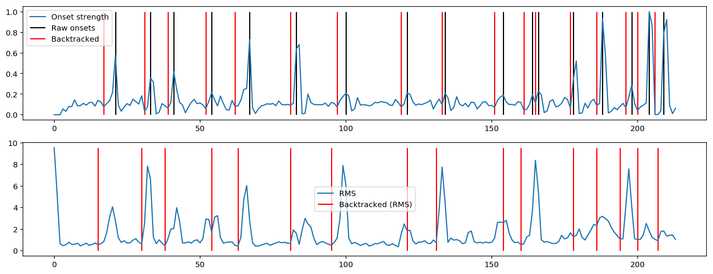


### onset strength
Compute a spectral flux onset strength envelope. Onset strength at time t is determined by: mean_f max(0, S[f, t] - ref_S[f, t - lag]) where ref_S is S after local max filtering along the frequency axis [1]. By default, if a time series y is provided, S will be the log-power Mel spectrogram.


#### 
以下是对您提供的代码段的逐行中文注释：

```python
# 导入NumPy库，这是一个广泛使用的科学计算库，提供了对多维数组的支持。
import numpy as np

# 使用librosa库的stft函数对音频信号y进行短时傅里叶变换（Short-Time Fourier Transform），生成频谱图。
# stft函数将音频信号分割成短时间的帧，对每一帧进行傅里叶变换，得到其频率成分。
# 这个函数返回的D是一个复数数组，包含了音频信号的实部和虚部信息。
D = np.abs(librosa.stft(y))

# 使用librosa库的frames_to_time函数将频谱图D的帧索引转换为时间值。
# np.arange(D.shape[1])生成一个从0到D数组第二维大小（列数）的整数序列，代表帧索引。
# frames_to_time函数接受这个序列，返回一个相同长度的时间数组，表示每个帧在音频信号中的具体时间位置。
times = librosa.frames_to_time(np.arange(D.shape[1]))

# 使用matplotlib.pyplot的figure函数创建一个新的图形对象，并设置图形的大小为16英寸宽、6英寸高。
plt.figure(figsize=(16, 6))

# 注释掉的代码块用于创建一个子图并展示功率谱图的对数幅度。这里使用librosa.display.specshow来绘制热图。
# 由于代码被注释掉，这些操作不会被执行。
# ax1 = plt.subplot(2, 1, 1)
# librosa.display.specshow(librosa.amplitude_to_db(D, ref=np.max), y_axis='log', x_axis='time')
# plt.title('Power spectrogram')

# 使用librosa库的onset模块中的onset_strength函数来计算音频信号y的起始包络（onset envelope）。
# 这里没有指定额外的参数，使用默认设置。
onset_env = librosa.onset.onset_strength(y=y, sr=sr)

# 在第一个子图中绘制起始包络，2 + onset_env / onset_env.max()将起始包络的值归一化并向上偏移。
plt.subplot(2, 1, 1, sharex=ax1)
plt.plot(times, 2 + onset_env / onset_env.max(), alpha=0.8, label='Mean (mel)')

# 使用onset_strength函数计算起始包络，这次使用np.median作为聚合函数，并且指定了fmax和n_mels参数。
# fmax是最高频率限制，n_mels是Mel滤波器的数量。
onset_env = librosa.onset.onset_strength(y=y, sr=sr, aggregate=np.median, fmax=8000, n_mels=256)

# 绘制归一化后的起始包络，1 + (onset_env / onset_env.max())将起始包络的值归一化并向上偏移1。
plt.plot(times, 1 + (onset_env / onset_env.max()), alpha=0.8, label='Median (custom mel)')

# 使用onset_strength函数计算起始包络，这次使用librosa.cqt作为特征提取方法，即常Q变换（Constant-Q Transform）。
onset_env = librosa.onset.onset_strength(y=y, sr=sr, feature=librosa.cqt)

# 绘制归一化后的起始包络。
plt.plot(times, onset_env / onset_env.max(), alpha=0.8, label='Mean (CQT)')

# 添加图例，设置边框的显示和透明度。
plt.legend(frameon=True, framealpha=0.75)

# 设置y轴的标签为'Normalized strength'，即归一化强度。
plt.ylabel('Normalized strength')

# 移除y轴的刻度。
plt.yticks([])

# 设置坐标轴的显示范围为紧凑，以适应所有的数据。
plt.axis('tight')

# 调整子图布局以适应图形对象。
plt.tight_layout()

# 使用librosa库的onset模块中的onset_strength_multi函数来计算音频信号y的多通道起始包络。
# channels参数指定了要计算起始强度的子带通道。
onset_subbands = librosa.onset.onset_strength_multi(y=y, sr=sr, channels=[0, 32, 64, 96, 128])

# 在第二个子图中展示多通道起始包络的热图。
plt.subplot(2, 1, 2)
librosa.display.specshow(onset_subbands, x_axis='time')

# 设置y轴的标签为'Sub-bands'，即子带。
plt.ylabel('Sub-bands')

# 设置子图的标题为'Sub-band onset strength'，即子带起始强度。
plt.title('Sub-band onset strength')
```

这段代码的作用是计算音频信号的起始包络，并可视化不同特征提取方法和聚合函数对起始强度的影响。首先，它使用`librosa.stft`函数计算音频信号的短时傅里叶变换，然后转换为时间数组。接着，使用`librosa.onset.onset_strength`函数计算不同设置下的起始包络，并在第一个子图中绘制。然后，使用`librosa.onset.onset_strength_multi`函数计算多通道起始包络，并在第二个子图中展示。这些可视化结果有助于分析音频信号的节奏特征和起始点检测。

##### 结果展示：
```python
Text(0.5,1,'Sub-band onset strength')
```
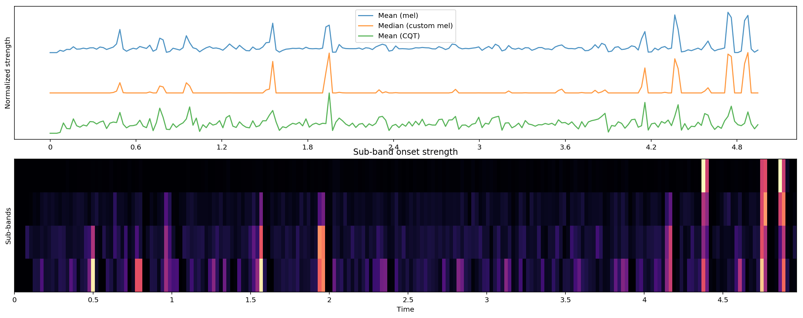


## Loading Data

### 
以下是对您提供的代码行的详细中文注释：

```python
# 打印训练集中的样本数量和类别数量。
# train_ab.shape[0] 获取了 train_ab DataFrame 的行数，即训练集中的样本总数。
# len(train_ab.label.unique()) 计算了 train_ab DataFrame 中 'label' 列的唯一值的数量，即类别的总数。
# 这两部分信息对于了解数据集的规模和多样性非常重要，有助于确定机器学习模型训练的基本参数。
print("Number of training examples=", train_ab.shape[0], "  Number of classes=", len(train_ab.label.unique()))
```

这段代码的作用是输出训练数据集 `train_ab` 中的样本数量和类别数量。这对于评估数据集是否平衡以及了解模型训练的基本情况非常有用。样本数量（`train_ab.shape[0]`）告诉我们训练集有多大，而类别数量（`len(train_ab.label.unique())`）则告诉我们数据集中有多少个不同的类别。这些信息对于选择合适的机器学习算法、设置模型参数以及评估模型性能都是非常重要的。在分类问题中，类别数量直接影响模型设计的复杂性，而样本数量则影响模型训练和泛化能力。

#### 结果展示：
```python
Number of training examples= 832   Number of classes= 6
```

#### 结果解释：

输出结果提供了两个关键信息点：

1. `Number of training examples= 832`: 这表明在合并后的DataFrame `train_ab`中，共有832个训练样本。这意味着你的训练数据集由832个音频样本组成，这些样本将用于训练机器学习模型。

2. `Number of classes= 6`: 这表明在`train_ab` DataFrame的`label`列中，存在6个不同的唯一标签。换句话说，你的数据集包含6个类别，每个类别代表了音频数据中的一种不同的心脏声音特征。这些类别可能包括正常心跳声音、心脏杂音、额外心音等不同的心脏声音类型。

在机器学习中，了解训练样本的数量和类别的数量是非常重要的，因为：

- **样本数量**：它影响模型的泛化能力。较多的样本通常能够帮助模型更好地学习特征和模式，但同时也需要更多的计算资源和时间来训练模型。
- **类别数量**：它决定了模型的输出层设计（对于分类问题）。例如，在你的心音分类问题中，如果使用softmax输出层，那么输出层将有6个神经元，每个神经元对应一个类别的预测。

此外，类别数量还可能影响模型训练过程中的策略选择，如是否需要对不平衡的数据类别进行采样或加权，以及如何选择评价指标等。在心脏声音分析的上下文中，确保模型能够准确识别所有类别对于医疗诊断和患者健康至关重要。

Loading od the audio data file will be based on content from directory since each filename is associate with the category type. hence, we can use csv file for cross reference check. Based on directory content approach will be more flexible.


### 
以下是对您提供的函数 `audio_norm` 的逐行中文注释：

```python
# 定义一个名为 audio_norm 的函数，它接受一个参数 data。
def audio_norm(data):
    # 计算传入数据数组 data 的最大值，并将其存储在变量 max_data 中。
    # 这将用于后续的数据标准化步骤。
    max_data = np.max(data)
    
    # 计算传入数据数组 data 的最小值，并将其存储在变量 min_data 中。
    # 这同样将用于后续的数据标准化步骤。
    min_data = np.min(data)
    
    # 对数据进行标准化处理，使结果的值范围在 [-1, 1] 之间。
    # 这里使用的是最小-最大标准化方法，首先从每个数据点减去最小值 min_data，
    # 然后将结果除以 (最大值 max_data 减去最小值 min_data) 得到归一化数据，
    # 最后加上一个非常小的值 (0.0001) 来避免除以零的错误，并且稍微调整数据范围。
    # 这种方法有助于消除不同量级数据的影响，使数据分布更加均匀，便于后续处理。
    data = (data - min_data) / (max_data - min_data + 0.0001)
    
    # 将标准化后的数据减去0.5，进一步调整数据的分布，使其中心在0附近。
    # 这有助于某些算法的性能，因为它们可能对数据的分布有一定的假设。
    # 例如，在神经网络训练中，将数据的中心调整到0可以加快收敛速度。
    return data - 0.5
```

这段代码定义了一个音频数据标准化的函数 `audio_norm`，它接受一个音频信号数组 `data` 作为输入，然后通过最小-最大标准化方法将其缩放到 [-1, 1] 的范围内，并最终将中心调整到0。这种标准化处理在机器学习中非常常见，它有助于提高模型的训练效率和性能。


### 
以下是对您提供的函数 `load_file_data_without_change` 的逐行中文注释：

```python
# 导入必要的库
import numpy as np
import librosa
import os

# 定义一个函数load_file_data_without_change，它用于加载音频文件、提取特征且不进行填充，以保持最高的音质。
def load_file_data_without_change(folder, file_names, duration=3, sr=16000):
    # 计算预期的输入长度，基于指定的持续时间duration和采样率sr
    input_length = sr * duration
    
    # 初始化一个空列表，用于存储提取的音频特征
    data = []
    
    # 遍历提供的文件名列表
    for file_name in file_names:
        try:
            # 构建完整的音频文件路径
            sound_file = folder + file_name
            print("load file ", sound_file)  # 打印正在加载的文件路径
            
            # 使用librosa.load函数加载音频文件，指定res_type='kaiser_fast'以使用最快的提取技术
            X, sr = librosa.load(sound_file, res_type='kaiser_fast')
            
            # 计算音频信号的持续时间
            dur = librosa.get_duration(y=X, sr=sr)
            
            # 从音频数据X中提取MFCC特征，使用numpy的mean函数计算每个MFCC系数的平均值，并按0轴进行转置
            # n_mfcc=40参数指定计算40个MFCC系数
            mfccs = np.mean(librosa.feature.mfcc(y=X, sr=sr, n_mfcc=40).T, axis=0)
            
        # 如果在解析文件时遇到任何异常，打印错误信息
        except Exception as e:
            print("Error encountered while parsing file: ", file)
        
        # 将提取的MFCC特征转换为numpy数组，并重塑为[-1,1]的形状，然后将这个数组添加到data列表中
        feature = np.array(mfccs).reshape([-1, 1])
        data.append(feature)
    
    # 返回包含所有音频特征的列表
    return data
```

这段代码定义了一个函数 `load_file_data_without_change`，它接受文件夹路径 `folder`、文件名列表 `file_names`、可选参数 `duration`（默认为3秒）和 `sr`（默认采样率为16000Hz）来加载音频文件、计算其MFCC特征，并存储这些特征。函数中使用了异常处理来捕获并打印加载音频文件时可能遇到的错误。提取的MFCC特征被重塑并添加到列表 `data` 中，该列表最终被返回。这种特征提取方法在音频分析和机器学习任务中非常有用，尤其是当涉及到音频分类或检测任务时。


### 

以下是对您提供的函数 `load_file_data` 的逐行中文注释：

```python
import numpy as np
import librosa
import os

# 定义一个函数load_file_data，它用于加载音频文件、提取特征，并进行固定长度的填充或截断。
def load_file_data(folder, file_names, duration=12, sr=16000):
    # 根据指定的持续时间duration和采样率sr计算输入长度
    input_length = sr * duration
    
    # 初始化一个空列表，用于存储提取的音频特征
    data = []
    
    # 遍历提供的文件名列表
    for file_name in file_names:
        try:
            # 构建完整的音频文件路径
            sound_file = folder + file_name
            print("load file ", sound_file)  # 打印正在加载的文件路径
            
            # 使用librosa.load函数加载音频文件，指定采样率sr、持续时间duration和res_type参数为'kaiser_fast'以使用最快的提取技术
            X, sr = librosa.load(sound_file, sr=sr, duration=duration, res_type='kaiser_fast')
            
            # 计算音频信号的持续时间
            dur = librosa.get_duration(y=X, sr=sr)
            
            # 如果音频文件的持续时间小于指定的duration，则使用librosa.util.fix_length函数进行填充或截断，使其长度统一
            if (round(dur) < duration):
                print("fixing audio length: ", file_name)
                X = librosa.util.fix_length(X, input_length)
            
            # # 如果需要对原始音频数据进行标准化，可以取消下面两行注释
            # # 对音频信号进行标准化处理
            # y = audio_norm(X)
            
            # # 从音频数据X中提取MFCC特征，使用numpy的mean函数计算每个MFCC系数的平均值，并按0轴进行转置
            # # n_mfcc=40参数指定计算40个MFCC系数
            # mfccs = np.mean(librosa.feature.mfcc(y=X, sr=sr, n_mfcc=40).T, axis=0)
            
        # 如果在解析文件时遇到任何异常，打印错误信息
        except Exception as e:
            print("Error encountered while parsing file: ", file)
        
        # 将提取的MFCC特征转换为numpy数组，并重塑为[-1,1]的形状，然后将这个数组添加到data列表中
        mfccs = np.mean(librosa.feature.mfcc(y=X, sr=sr, n_mfcc=40).T, axis=0)
        feature = np.array(mfccs).reshape([-1, 1])
        data.append(feature)
    
    # 返回包含所有音频特征的列表
    return data
```

这段代码定义了一个函数 `load_file_data`，它接受文件夹路径 `folder`、文件名列表 `file_names`、可选参数 `duration`（默认为12秒）和 `sr`（默认采样率为16000Hz）来加载音频文件、进行长度的统一处理（通过填充或截断）、计算其MFCC特征，并存储这些特征。函数中使用了异常处理来捕获并打印加载音频文件时可能遇到的错误。提取的MFCC特征被重塑并添加到列表 `data` 中，该列表最终被返回。这种特征提取方法在音频分析和机器学习任务中非常有用，尤其是当涉及到音频分类或检测任务时，且需要所有音频信号具有相同的长度。


### 
以下是对您提供的代码段的逐行中文注释：

```python
# 导入train_test_split函数，该函数来自sklearn.model_selection模块，用于将数据集分割为训练集和测试集。
from sklearn.model_selection import train_test_split

# 导入preprocessing模块，该模块包含用于数据预处理的函数，如标签编码和标准化。
from sklearn import preprocessing

# 定义一个列表CLASSES，包含三个类别的文本标签：'artifact'、'murmur'和'normal'。
CLASSES = ['artifact', 'murmur', 'normal']

# 计算CLASSES列表的长度，即类别的总数，并将其存储在变量NB_CLASSES中。
NB_CLASSES = len(CLASSES)

# 创建一个字典label_to_int，它将类别的文本标签映射为整数值。
# 这里使用字典推导式和enumerate函数实现映射，enumerate(CLASSES)会生成一个包含索引和对应元素的元组序列。
label_to_int = {k: v for v, k in enumerate(CLASSES)}

# 打印label_to_int字典，它显示了文本标签和对应的整数编码。
print(label_to_int)

# 打印一个空行，用于在输出中创建视觉上的分隔。
print(" ")

# 创建一个字典int_to_label，它将整数值映射回类别的文本标签。
# 这里使用字典推导式和label_to_int.items()，后者会生成一个包含键值对的元组序列。
int_to_label = {v: k for k, v in label_to_int.items()}

# 打印int_to_label字典，它显示了整数值和对应的文本标签。
print(int_to_label)
```

这段代码定义了两个映射字典，用于将类别的文本标签转换为整数编码（`label_to_int`），以及将整数编码转换回文本标签（`int_to_label`）。这种映射在机器学习中常用于将分类标签转换为模型可以处理的格式，尤其是当使用像神经网络这样的模型时，它们通常需要整数编码的标签。同时，这种映射也方便了在模型预测后将输出转换回人类可读的文本标签。

#### 结果展示：
```python
{'artifact': 0, 'murmur': 1, 'normal': 2}
 
{0: 'artifact', 1: 'murmur', 2: 'normal'}
```

#### 结果解释：

输出结果显示了两个映射字典：`label_to_int` 和 `int_to_label`。这些字典用于将文本标签编码为整数，以及将整数解码回文本标签。以下是对输出结果的详细解释：

1. `label_to_int = {k: v for v, k in enumerate(CLASSES)}`:
   这行代码创建了一个字典，其中 `CLASSES` 列表中的每个文本标签都被映射到一个整数上。`enumerate(CLASSES)` 函数将生成一个包含索引和对应标签的元组序列，从0开始计数。因此，输出结果为：
   ```python
   {'artifact': 0, 'murmur': 1, 'normal': 2}
   ```
   这意味着 'artifact' 标签被编码为0，'murmur' 被编码为1，'normal' 被编码为2。

2. `int_to_label = {v: k for k, v in label_to_int.items()}`:
   这行代码创建了另一个字典，将整数映射回原来的文本标签。它通过遍历 `label_to_int` 字典的项（`.items()`）来实现，其中每个项是一个包含键（文本标签）和值（整数）的元组。然后，它将键和值的位置互换，创建了反向映射。因此，输出结果为：
   ```python
   {0: 'artifact', 1: 'murmur', 2: 'normal'}
   ```
   这意味着数字0对应于标签'artifact'，数字1对应于'murmur'，数字2对应于'normal'。

这些映射在机器学习中非常有用，因为许多算法需要将类别标签转换为整数才能进行计算。同时，当模型完成预测后，这些映射也可以用来将预测的整数结果转换回人类可读的文本标签。在这个例子中，`NB_CLASSES` 变量表示类别的总数，其值为3，因为 `CLASSES` 列表中有3个类别。

### load dataset-a, keep them separate for testing purpose

#### 
以下是对您提供的代码段的逐行中文注释：

```python
# 导入os和fnmatch模块。
# os模块提供与操作系统交互的功能，如文件和目录操作。
# fnmatch模块提供文件名模式匹配功能，用于查找符合特定模式的文件。
import os, fnmatch

# 定义变量A_folder，它指向存放音频文件的文件夹'set_a'的路径。
# INPUT_DIR是一个预先定义的变量，指向存放音频文件的父文件夹路径。
A_folder = INPUT_DIR + '/set_a/'

# 使用fnmatch.filter函数和通配符模式'artifact*.wav'查找所有以'artifact'开头并以'.wav'结尾的文件。
# os.listdir函数列出了指定文件夹下的所有文件和文件夹，这里用于列出'set_a'文件夹下的所有文件。
# fnmatch.filter函数将返回一个列表，包含所有匹配指定模式的文件名。
A_artifact_files = fnmatch.filter(os.listdir(INPUT_DIR + '/set_a'), 'artifact*.wav')

# 调用之前定义的load_file_data函数来加载'artifact'类别的音频文件。
# folder参数指定了音频文件所在的文件夹路径。
# file_names参数指定了要加载的文件名列表，这里传入A_artifact_files。
# duration参数指定了音频处理的持续时间，这里使用之前定义的MAX_SOUND_CLIP_DURATION。
A_artifact_sounds = load_file_data(folder=A_folder, file_names=A_artifact_files, duration=MAX_SOUND_CLIP_DURATION)

# 创建一个列表A_artifact_labels，用于存储与A_artifact_files中每个音频文件对应的标签。
# 由于所有文件都属于'artifact'类别，所以这里简单地创建了一个全为0的列表。
# 假设在之前的label_to_int映射中，'artifact'类别被映射为整数0。
A_artifact_labels = [0 for items in A_artifact_files]
```

这段代码的作用是加载特定类别（'artifact'）的音频文件，提取它们的MFCC特征，并为每个音频文件创建一个对应的标签列表。首先，使用`fnmatch.filter`和`os.listdir`函数找到所有'artifact'类别的音频文件。然后，使用`load_file_data`函数加载这些音频文件，并提取MFCC特征。最后，创建一个标签列表，其中每个元素都是0，表示所有音频文件都属于'artifact'类别。这些特征和标签列表可以用于机器学习模型的训练和测试。


#### 
以下是对您提供的代码段的逐行中文注释：

```python
# 使用fnmatch模块的filter函数和os模块的listdir函数查找所有以'normal'开头并以'.wav'结尾的文件。
# 这些文件位于之前定义的A_folder文件夹内，这里通过INPUT_DIR + '/set_a/'指定其路径。
# 此操作将筛选出所有标记为'normal'的音频文件，用于后续的特征提取和加载。
A_normal_files = fnmatch.filter(os.listdir(INPUT_DIR + '/set_a'), 'normal*.wav')

# 调用之前定义的load_file_data函数来加载'normal'类别的音频文件。
# folder参数指定了音频文件所在的文件夹路径，即A_folder。
# file_names参数指定了要加载的文件名列表，这里传入A_normal_files。
# duration参数指定了音频处理的持续时间，这里使用之前定义的MAX_SOUND_CLIP_DURATION。
A_normal_sounds = load_file_data(folder=A_folder, file_names=A_normal_files, duration=MAX_SOUND_CLIP_DURATION)

# 创建一个列表A_normal_labels，用于存储与A_normal_files中每个音频文件对应的标签。
# 由于所有文件都属于'normal'类别，这里假设在之前的label_to_int映射中，'normal'类别被映射为整数2。
# 因此，创建了一个全为2的列表，每个元素代表一个音频文件的标签。
A_normal_labels = [2 for items in A_normal_sounds]
```

这段代码的作用是加载另一个类别（'normal'）的音频文件，提取它们的MFCC特征，并为每个音频文件创建一个对应的标签列表。首先，使用`fnmatch.filter`和`os.listdir`函数找到所有'normal'类别的音频文件。然后，使用`load_file_data`函数加载这些音频文件，并提取MFCC特征。最后，创建一个标签列表，其中每个元素都是2，表示所有音频文件都属于'normal'类别。这些特征和标签列表可以与之前加载的'artifact'类别的数据一起用于机器学习模型的训练和测试。


#### 
以下是对您提供的代码段的逐行中文注释：

```python
# 使用fnmatch模块的filter函数和os模块的listdir函数查找所有以'extrahls'开头并以'.wav'结尾的文件。
# 这些文件位于之前定义的A_folder文件夹内，这里通过INPUT_DIR + '/set_a/'指定其路径。
# 此操作将筛选出所有标记为'extrahls'（额外的心音）的音频文件，用于后续的特征提取和加载。
A_extrahls_files = fnmatch.filter(os.listdir(INPUT_DIR + '/set_a'), 'extrahls*.wav')

# 调用之前定义的load_file_data函数来加载'extrahls'类别的音频文件。
# folder参数指定了音频文件所在的文件夹路径，即A_folder。
# file_names参数指定了要加载的文件名列表，这里传入A_extrahls_files。
# duration参数指定了音频处理的持续时间，这里使用之前定义的MAX_SOUND_CLIP_DURATION。
A_extrahls_sounds = load_file_data(folder=A_folder, file_names=A_extrahls_files, duration=MAX_SOUND_CLIP_DURATION)

# 创建一个列表A_extrahls_labels，用于存储与A_extrahls_files中每个音频文件对应的标签。
# 由于所有文件都属于'extrahls'类别，这里假设在之前的label_to_int映射中，'extrahls'类别被映射为整数1。
# 因此，创建了一个全为1的列表，每个元素代表一个音频文件的标签。
A_extrahls_labels = [1 for items in A_extrahls_sounds]
```

这段代码的作用是加载'extrahls'（额外的心音）类别的音频文件，提取它们的MFCC特征，并为每个音频文件创建一个对应的标签列表。首先，使用`fnmatch.filter`和`os.listdir`函数找到所有'extrahls'类别的音频文件。然后，使用`load_file_data`函数加载这些音频文件，并提取MFCC特征。最后，创建一个标签列表，其中每个元素都是1，表示所有音频文件都属于'extrahls'类别。这些特征和标签列表可以与之前加载的'artifact'和'normal'类别的数据一起用于机器学习模型的训练和测试。


#### 
以下是对您提供的代码段的逐行中文注释：

```python
# 使用fnmatch模块的filter函数和os模块的listdir函数查找所有以'murmur'开头并以'.wav'结尾的文件。
# 这些文件位于之前定义的A_folder文件夹内，这里通过INPUT_DIR + '/set_a/'指定其路径。
# 此操作将筛选出所有标记为'murmur'（心脏杂音）的音频文件，用于后续的特征提取和加载。
A_murmur_files = fnmatch.filter(os.listdir(INPUT_DIR + '/set_a'), 'murmur*.wav')

# 调用之前定义的load_file_data函数来加载'murmur'类别的音频文件。
# folder参数指定了音频文件所在的文件夹路径，即A_folder。
# file_names参数指定了要加载的文件名列表，这里传入A_murmur_files。
# duration参数指定了音频处理的持续时间，这里使用之前定义的MAX_SOUND_CLIP_DURATION。
A_murmur_sounds = load_file_data(folder=A_folder, file_names=A_murmur_files, duration=MAX_SOUND_CLIP_DURATION)

# 创建一个列表A_murmur_labels，用于存储与A_murmur_files中每个音频文件对应的标签。
# 由于所有文件都属于'murmur'类别，这里假设在之前的label_to_int映射中，'murmur'类别被映射为整数1。
# 因此，创建了一个全为1的列表，每个元素代表一个音频文件的标签。
# 注意：这里的items应该是A_murmur_files中的每个文件，而不是A_murmur_sounds，因为A_murmur_sounds是一个特征列表，而A_murmur_files是文件名列表。
A_murmur_labels = [1 for items in A_murmur_files]
```

这段代码的作用是加载'murmur'（心脏杂音）类别的音频文件，提取它们的MFCC特征，并为每个音频文件创建一个对应的标签列表。首先，使用`fnmatch.filter`和`os.listdir`函数找到所有'murmur'类别的音频文件。然后，使用`load_file_data`函数加载这些音频文件，并提取MFCC特征。最后，创建一个标签列表，其中每个元素都是1，表示所有音频文件都属于'murmur'类别。这些特征和标签列表可以与之前加载的其他类别的数据一起用于机器学习模型的训练和测试。

请注意，代码中的`[1 for items in A_murmur_sounds]`应该是`[1 for items in A_murmur_files]`，以确保标签列表与文件列表中的项一一对应。


#### 
以下是对您提供的代码段的逐行中文注释：

```python
# 使用fnmatch模块的filter函数和os模块的listdir函数查找所有以'Aunlabelledtest'开头并以'.wav'结尾的文件。
# 这些文件位于之前定义的A_folder文件夹内，这里通过INPUT_DIR + '/set_a/'指定其路径。
# 此操作将筛选出所有标记为'Aunlabelledtest'的音频文件，通常这些文件用于测试，且没有标签。
A_unlabelledtest_files = fnmatch.filter(os.listdir(INPUT_DIR + '/set_a'), 'Aunlabelledtest*.wav')

# 调用之前定义的load_file_data函数来加载'Aunlabelledtest'类别的音频文件。
# folder参数指定了音频文件所在的文件夹路径，即A_folder。
# file_names参数指定了要加载的文件名列表，这里传入A_unlabelledtest_files。
# duration参数指定了音频处理的持续时间，这里使用之前定义的MAX_SOUND_CLIP_DURATION。
A_unlabelledtest_sounds = load_file_data(folder=A_folder, file_names=A_unlabelledtest_files, duration=MAX_SOUND_CLIP_DURATION)

# 创建一个列表A_unlabelledtest_labels，用于存储与A_unlabelledtest_files中每个音频文件对应的标签。
# 由于这些文件是未标记的测试文件，这里使用-1表示它们没有标签。
# -1通常用作占位符，表示这些样本在训练集中不参与分类标签的预测。
A_unlabelledtest_labels = [-1 for items in A_unlabelledtest_sounds]

# 打印消息"loaded dataset-a"，表明已经成功加载了'set_a'中的所有数据集。
print("loaded dataset-a")
```

这段代码的作用是加载未标记的测试音频文件，提取它们的MFCC特征。首先，使用`fnmatch.filter`和`os.listdir`函数找到所有'Aunlabelledtest'类别的音频文件。然后，使用`load_file_data`函数加载这些音频文件，并提取MFCC特征。最后，创建一个标签列表，其中每个元素都是-1，表示这些音频文件没有标签。这些特征可以用于机器学习模型的测试阶段，以评估模型对未知数据的分类性能。打印的语句确认了数据集加载的完成。

##### 结果展示：
```python
load file  ../input/set_a/artifact__201106050353.wav
fixing audio lenght : artifact__201106050353.wav
load file  ../input/set_a/artifact__201106030612.wav
fixing audio lenght : artifact__201106030612.wav
load file  ../input/set_a/artifact__201106040947.wav
fixing audio lenght : artifact__201106040947.wav
load file  ../input/set_a/artifact__201106101314.wav
fixing audio lenght : artifact__201106101314.wav
load file  ../input/set_a/artifact__201106040933.wav
fixing audio lenght : artifact__201106040933.wav
load file  ../input/set_a/artifact__201106221254.wav
fixing audio lenght : artifact__201106221254.wav
load file  ../input/set_a/artifact__201106211041.wav
fixing audio lenght : artifact__201106211041.wav
load file  ../input/set_a/artifact__201106031558.wav
fixing audio lenght : artifact__201106031558.wav
load file  ../input/set_a/artifact__201106041452.wav
fixing audio lenght : artifact__201106041452.wav
load file  ../input/set_a/artifact__201105190800.wav
fixing audio lenght : artifact__201105190800.wav
load file  ../input/set_a/artifact__201106110909.wav
fixing audio lenght : artifact__201106110909.wav
load file  ../input/set_a/artifact__201106161016.wav
fixing audio lenght : artifact__201106161016.wav
load file  ../input/set_a/artifact__201105051017.wav
fixing audio lenght : artifact__201105051017.wav
load file  ../input/set_a/artifact__201106161219.wav
fixing audio lenght : artifact__201106161219.wav
load file  ../input/set_a/artifact__201105060108.wav
fixing audio lenght : artifact__201105060108.wav
load file  ../input/set_a/artifact__201106111119.wav
fixing audio lenght : artifact__201106111119.wav
load file  ../input/set_a/artifact__201106131834.wav
fixing audio lenght : artifact__201106131834.wav
load file  ../input/set_a/artifact__201106212112.wav
fixing audio lenght : artifact__201106212112.wav
load file  ../input/set_a/artifact__201105061143.wav
fixing audio lenght : artifact__201105061143.wav
load file  ../input/set_a/artifact__201106061233.wav
fixing audio lenght : artifact__201106061233.wav
load file  ../input/set_a/artifact__201106010559.wav
fixing audio lenght : artifact__201106010559.wav
load file  ../input/set_a/artifact__201106010602.wav
fixing audio lenght : artifact__201106010602.wav
load file  ../input/set_a/artifact__201106121242.wav
fixing audio lenght : artifact__201106121242.wav
load file  ../input/set_a/artifact__201106211430.wav
fixing audio lenght : artifact__201106211430.wav
load file  ../input/set_a/artifact__201106141701.wav
fixing audio lenght : artifact__201106141701.wav
load file  ../input/set_a/artifact__201012172012.wav
fixing audio lenght : artifact__201012172012.wav
load file  ../input/set_a/artifact__201106161019.wav
fixing audio lenght : artifact__201106161019.wav
load file  ../input/set_a/artifact__201106070537.wav
fixing audio lenght : artifact__201106070537.wav
load file  ../input/set_a/artifact__201106171003.wav
fixing audio lenght : artifact__201106171003.wav
load file  ../input/set_a/artifact__201106021541.wav
fixing audio lenght : artifact__201106021541.wav
load file  ../input/set_a/artifact__201106040722.wav
fixing audio lenght : artifact__201106040722.wav
load file  ../input/set_a/artifact__201105280851.wav
fixing audio lenght : artifact__201105280851.wav
load file  ../input/set_a/artifact__201106121445.wav
fixing audio lenght : artifact__201106121445.wav
load file  ../input/set_a/artifact__201106070949.wav
fixing audio lenght : artifact__201106070949.wav
load file  ../input/set_a/artifact__201105041959.wav
fixing audio lenght : artifact__201105041959.wav
load file  ../input/set_a/artifact__201106101955.wav
fixing audio lenght : artifact__201106101955.wav
load file  ../input/set_a/artifact__201106220340.wav
fixing audio lenght : artifact__201106220340.wav
load file  ../input/set_a/artifact__201106131835.wav
fixing audio lenght : artifact__201106131835.wav
load file  ../input/set_a/artifact__201105040918.wav
fixing audio lenght : artifact__201105040918.wav
load file  ../input/set_a/artifact__201106190520.wav
fixing audio lenght : artifact__201106190520.wav
load file  ../input/set_a/normal__201101151127.wav
fixing audio lenght : normal__201101151127.wav
load file  ../input/set_a/normal__201108011118.wav
fixing audio lenght : normal__201108011118.wav
load file  ../input/set_a/normal__201103221214.wav
fixing audio lenght : normal__201103221214.wav
load file  ../input/set_a/normal__201102081152.wav
fixing audio lenght : normal__201102081152.wav
load file  ../input/set_a/normal__201105021654.wav
fixing audio lenght : normal__201105021654.wav
load file  ../input/set_a/normal__201102270940.wav
fixing audio lenght : normal__201102270940.wav
load file  ../input/set_a/normal__201103140132.wav
fixing audio lenght : normal__201103140132.wav
load file  ../input/set_a/normal__201106111136.wav
fixing audio lenght : normal__201106111136.wav
load file  ../input/set_a/normal__201105011626.wav
fixing audio lenght : normal__201105011626.wav
load file  ../input/set_a/normal__201102081321.wav
fixing audio lenght : normal__201102081321.wav
load file  ../input/set_a/normal__201103170121.wav
fixing audio lenght : normal__201103170121.wav
load file  ../input/set_a/normal__201103151912.wav
fixing audio lenght : normal__201103151912.wav
load file  ../input/set_a/normal__201108011112.wav
fixing audio lenght : normal__201108011112.wav
load file  ../input/set_a/normal__201106151236.wav
fixing audio lenght : normal__201106151236.wav
load file  ../input/set_a/normal__201103101140.wav
fixing audio lenght : normal__201103101140.wav
load file  ../input/set_a/normal__201108011115.wav
fixing audio lenght : normal__201108011115.wav
load file  ../input/set_a/normal__201101070538.wav
fixing audio lenght : normal__201101070538.wav
load file  ../input/set_a/normal__201102201230.wav
fixing audio lenght : normal__201102201230.wav
load file  ../input/set_a/normal__201103090635.wav
fixing audio lenght : normal__201103090635.wav
load file  ../input/set_a/normal__201104122156.wav
fixing audio lenght : normal__201104122156.wav
load file  ../input/set_a/normal__201108011114.wav
fixing audio lenght : normal__201108011114.wav
load file  ../input/set_a/normal__201102260502.wav
fixing audio lenght : normal__201102260502.wav
load file  ../input/set_a/normal__201103140822.wav
fixing audio lenght : normal__201103140822.wav
load file  ../input/set_a/normal__201103140135.wav
fixing audio lenght : normal__201103140135.wav
load file  ../input/set_a/normal__201105021804.wav
fixing audio lenght : normal__201105021804.wav
load file  ../input/set_a/normal__201106141148.wav
fixing audio lenght : normal__201106141148.wav
load file  ../input/set_a/normal__201106221450.wav
fixing audio lenght : normal__201106221450.wav
load file  ../input/set_a/normal__201104141251.wav
fixing audio lenght : normal__201104141251.wav
load file  ../input/set_a/normal__201106210943.wav
fixing audio lenght : normal__201106210943.wav
load file  ../input/set_a/normal__201106221418.wav
fixing audio lenght : normal__201106221418.wav
load file  ../input/set_a/normal__201105151450.wav
fixing audio lenght : normal__201105151450.wav
load file  ../input/set_a/extrahls__201101160804.wav
fixing audio lenght : extrahls__201101160804.wav
load file  ../input/set_a/extrahls__201103182227.wav
fixing audio lenght : extrahls__201103182227.wav
load file  ../input/set_a/extrahls__201103170134.wav
fixing audio lenght : extrahls__201103170134.wav
load file  ../input/set_a/extrahls__201102071835.wav
fixing audio lenght : extrahls__201102071835.wav
load file  ../input/set_a/extrahls__201104270459.wav
fixing audio lenght : extrahls__201104270459.wav
load file  ../input/set_a/extrahls__201101241423.wav
fixing audio lenght : extrahls__201101241423.wav
load file  ../input/set_a/extrahls__201104270458.wav
fixing audio lenght : extrahls__201104270458.wav
load file  ../input/set_a/extrahls__201101070953.wav
fixing audio lenght : extrahls__201101070953.wav
load file  ../input/set_a/extrahls__201101161027.wav
fixing audio lenght : extrahls__201101161027.wav
load file  ../input/set_a/extrahls__201102241217.wav
fixing audio lenght : extrahls__201102241217.wav
load file  ../input/set_a/extrahls__201102070251.wav
fixing audio lenght : extrahls__201102070251.wav
load file  ../input/set_a/extrahls__201101091153.wav
fixing audio lenght : extrahls__201101091153.wav
load file  ../input/set_a/extrahls__201101152255.wav
fixing audio lenght : extrahls__201101152255.wav
load file  ../input/set_a/extrahls__201101241433.wav
fixing audio lenght : extrahls__201101241433.wav
load file  ../input/set_a/extrahls__201103150114.wav
fixing audio lenght : extrahls__201103150114.wav
load file  ../input/set_a/extrahls__201104021355.wav
fixing audio lenght : extrahls__201104021355.wav
load file  ../input/set_a/extrahls__201101160808.wav
fixing audio lenght : extrahls__201101160808.wav
load file  ../input/set_a/extrahls__201103200218.wav
fixing audio lenght : extrahls__201103200218.wav
load file  ../input/set_a/extrahls__201104140118.wav
fixing audio lenght : extrahls__201104140118.wav
load file  ../input/set_a/murmur__201104291843.wav
fixing audio lenght : murmur__201104291843.wav
load file  ../input/set_a/murmur__201102051443.wav
fixing audio lenght : murmur__201102051443.wav
load file  ../input/set_a/murmur__201106141148.wav
fixing audio lenght : murmur__201106141148.wav
load file  ../input/set_a/murmur__201104021355.wav
fixing audio lenght : murmur__201104021355.wav
load file  ../input/set_a/murmur__201102052338.wav
fixing audio lenght : murmur__201102052338.wav
load file  ../input/set_a/murmur__201108222242.wav
fixing audio lenght : murmur__201108222242.wav
load file  ../input/set_a/murmur__201101051104.wav
fixing audio lenght : murmur__201101051104.wav
load file  ../input/set_a/murmur__201108222238.wav
fixing audio lenght : murmur__201108222238.wav
load file  ../input/set_a/murmur__201108222233.wav
fixing audio lenght : murmur__201108222233.wav
load file  ../input/set_a/murmur__201108222232.wav
fixing audio lenght : murmur__201108222232.wav
load file  ../input/set_a/murmur__201108222224.wav
fixing audio lenght : murmur__201108222224.wav
load file  ../input/set_a/murmur__201108222248.wav
fixing audio lenght : murmur__201108222248.wav
load file  ../input/set_a/murmur__201108222253.wav
fixing audio lenght : murmur__201108222253.wav
load file  ../input/set_a/murmur__201108222246.wav
fixing audio lenght : murmur__201108222246.wav
load file  ../input/set_a/murmur__201108222236.wav
fixing audio lenght : murmur__201108222236.wav
load file  ../input/set_a/murmur__201108222255.wav
fixing audio lenght : murmur__201108222255.wav
load file  ../input/set_a/murmur__201108222245.wav
fixing audio lenght : murmur__201108222245.wav
load file  ../input/set_a/murmur__201108222221.wav
fixing audio lenght : murmur__201108222221.wav
load file  ../input/set_a/murmur__201101180902.wav
fixing audio lenght : murmur__201101180902.wav
load file  ../input/set_a/murmur__201101051108.wav
fixing audio lenght : murmur__201101051108.wav
load file  ../input/set_a/murmur__201104241315.wav
fixing audio lenght : murmur__201104241315.wav
load file  ../input/set_a/murmur__201108222256.wav
fixing audio lenght : murmur__201108222256.wav
load file  ../input/set_a/murmur__201108222258.wav
fixing audio lenght : murmur__201108222258.wav
load file  ../input/set_a/murmur__201108222252.wav
fixing audio lenght : murmur__201108222252.wav
load file  ../input/set_a/murmur__201108222235.wav
fixing audio lenght : murmur__201108222235.wav
load file  ../input/set_a/murmur__201108222231.wav
fixing audio lenght : murmur__201108222231.wav
load file  ../input/set_a/murmur__201108222251.wav
fixing audio lenght : murmur__201108222251.wav
load file  ../input/set_a/murmur__201108222223.wav
fixing audio lenght : murmur__201108222223.wav
load file  ../input/set_a/murmur__201108222227.wav
fixing audio lenght : murmur__201108222227.wav
load file  ../input/set_a/murmur__201108222243.wav
fixing audio lenght : murmur__201108222243.wav
load file  ../input/set_a/murmur__201101051114.wav
fixing audio lenght : murmur__201101051114.wav
load file  ../input/set_a/murmur__201108222237.wav
fixing audio lenght : murmur__201108222237.wav
load file  ../input/set_a/murmur__201103291548.wav
fixing audio lenght : murmur__201103291548.wav
load file  ../input/set_a/murmur__201108222226.wav
fixing audio lenght : murmur__201108222226.wav
load file  ../input/set_a/Aunlabelledtest__201103201314.wav
fixing audio lenght : Aunlabelledtest__201103201314.wav
load file  ../input/set_a/Aunlabelledtest__201103140236.wav
fixing audio lenght : Aunlabelledtest__201103140236.wav
load file  ../input/set_a/Aunlabelledtest__201108222254.wav
fixing audio lenght : Aunlabelledtest__201108222254.wav
load file  ../input/set_a/Aunlabelledtest__201106130440.wav
fixing audio lenght : Aunlabelledtest__201106130440.wav
load file  ../input/set_a/Aunlabelledtest__201101061552.wav
fixing audio lenght : Aunlabelledtest__201101061552.wav
load file  ../input/set_a/Aunlabelledtest__201106010807.wav
fixing audio lenght : Aunlabelledtest__201106010807.wav
load file  ../input/set_a/Aunlabelledtest__201106170857.wav
fixing audio lenght : Aunlabelledtest__201106170857.wav
load file  ../input/set_a/Aunlabelledtest__201106120928.wav
fixing audio lenght : Aunlabelledtest__201106120928.wav
load file  ../input/set_a/Aunlabelledtest__201108011116.wav
fixing audio lenght : Aunlabelledtest__201108011116.wav
load file  ../input/set_a/Aunlabelledtest__201108222234.wav
fixing audio lenght : Aunlabelledtest__201108222234.wav
load file  ../input/set_a/Aunlabelledtest__201106031556.wav
fixing audio lenght : Aunlabelledtest__201106031556.wav
load file  ../input/set_a/Aunlabelledtest__201103241336.wav
fixing audio lenght : Aunlabelledtest__201103241336.wav
load file  ../input/set_a/Aunlabelledtest__201106100606.wav
fixing audio lenght : Aunlabelledtest__201106100606.wav
load file  ../input/set_a/Aunlabelledtest__201101152256.wav
fixing audio lenght : Aunlabelledtest__201101152256.wav
load file  ../input/set_a/Aunlabelledtest__201102200848.wav
fixing audio lenght : Aunlabelledtest__201102200848.wav
load file  ../input/set_a/Aunlabelledtest__201106211725.wav
fixing audio lenght : Aunlabelledtest__201106211725.wav
load file  ../input/set_a/Aunlabelledtest__201101241434.wav
fixing audio lenght : Aunlabelledtest__201101241434.wav
load file  ../input/set_a/Aunlabelledtest__201104012144.wav
fixing audio lenght : Aunlabelledtest__201104012144.wav
load file  ../input/set_a/Aunlabelledtest__201105031730.wav
fixing audio lenght : Aunlabelledtest__201105031730.wav
load file  ../input/set_a/Aunlabelledtest__201106030607.wav
fixing audio lenght : Aunlabelledtest__201106030607.wav
load file  ../input/set_a/Aunlabelledtest__2011040239.wav
fixing audio lenght : Aunlabelledtest__2011040239.wav
load file  ../input/set_a/Aunlabelledtest__201105011546.wav
fixing audio lenght : Aunlabelledtest__201105011546.wav
load file  ../input/set_a/Aunlabelledtest__201108222225.wav
fixing audio lenght : Aunlabelledtest__201108222225.wav
load file  ../input/set_a/Aunlabelledtest__201106212102.wav
fixing audio lenght : Aunlabelledtest__201106212102.wav
load file  ../input/set_a/Aunlabelledtest__201106150614.wav
fixing audio lenght : Aunlabelledtest__201106150614.wav
load file  ../input/set_a/Aunlabelledtest__201108222228.wav
fixing audio lenght : Aunlabelledtest__201108222228.wav
load file  ../input/set_a/Aunlabelledtest__201012172010.wav
fixing audio lenght : Aunlabelledtest__201012172010.wav
load file  ../input/set_a/Aunlabelledtest__201108011113.wav
fixing audio lenght : Aunlabelledtest__201108011113.wav
load file  ../input/set_a/Aunlabelledtest__201102081045.wav
fixing audio lenght : Aunlabelledtest__201102081045.wav
load file  ../input/set_a/Aunlabelledtest__201106191034.wav
fixing audio lenght : Aunlabelledtest__201106191034.wav
load file  ../input/set_a/Aunlabelledtest__201108011111.wav
fixing audio lenght : Aunlabelledtest__201108011111.wav
load file  ../input/set_a/Aunlabelledtest__201103170122.wav
fixing audio lenght : Aunlabelledtest__201103170122.wav
load file  ../input/set_a/Aunlabelledtest__201101110659.wav
fixing audio lenght : Aunlabelledtest__201101110659.wav
load file  ../input/set_a/Aunlabelledtest__201106061104.wav
fixing audio lenght : Aunlabelledtest__201106061104.wav
load file  ../input/set_a/Aunlabelledtest__201103232251.wav
fixing audio lenght : Aunlabelledtest__201103232251.wav
load file  ../input/set_a/Aunlabelledtest__20110501548.wav
fixing audio lenght : Aunlabelledtest__20110501548.wav
load file  ../input/set_a/Aunlabelledtest__201108222257.wav
fixing audio lenght : Aunlabelledtest__201108222257.wav
load file  ../input/set_a/Aunlabelledtest__201102081033.wav
fixing audio lenght : Aunlabelledtest__201102081033.wav
load file  ../input/set_a/Aunlabelledtest__201101091156.wav
fixing audio lenght : Aunlabelledtest__201101091156.wav
load file  ../input/set_a/Aunlabelledtest__201108222244.wav
fixing audio lenght : Aunlabelledtest__201108222244.wav
load file  ../input/set_a/Aunlabelledtest__201108222247.wav
fixing audio lenght : Aunlabelledtest__201108222247.wav
load file  ../input/set_a/Aunlabelledtest__201108222222.wav
fixing audio lenght : Aunlabelledtest__201108222222.wav
load file  ../input/set_a/Aunlabelledtest__201101051105.wav
fixing audio lenght : Aunlabelledtest__201101051105.wav
load file  ../input/set_a/Aunlabelledtest__201103200518.wav
fixing audio lenght : Aunlabelledtest__201103200518.wav
load file  ../input/set_a/Aunlabelledtest__201106111419.wav
fixing audio lenght : Aunlabelledtest__201106111419.wav
load file  ../input/set_a/Aunlabelledtest__201106040930.wav
fixing audio lenght : Aunlabelledtest__201106040930.wav
load file  ../input/set_a/Aunlabelledtest__201101220549.wav
fixing audio lenght : Aunlabelledtest__201101220549.wav
load file  ../input/set_a/Aunlabelledtest__201106061215.wav
fixing audio lenght : Aunlabelledtest__201106061215.wav
load file  ../input/set_a/Aunlabelledtest__201108222241.wav
fixing audio lenght : Aunlabelledtest__201108222241.wav
load file  ../input/set_a/Aunlabelledtest__201103011036.wav
fixing audio lenght : Aunlabelledtest__201103011036.wav
load file  ../input/set_a/Aunlabelledtest__201106171155.wav
fixing audio lenght : Aunlabelledtest__201106171155.wav
load file  ../input/set_a/Aunlabelledtest__201108011117.wav
fixing audio lenght : Aunlabelledtest__201108011117.wav
loaded dataset-a
```

##### 结果解释：
输出结果提供了在加载数据集'set_a'过程中的详细信息，以及最终的确认消息。以下是对输出结果的详细解释：

1. `load file  ../input/set_a/artifact__201106050353.wav ... fixing audio lenght : artifact__201106050353.wav`:
   这行输出表明程序正在加载一个名为`artifact__201106050353.wav`的音频文件，该文件位于`../input/set_a/`目录下。随后，`fixing audio lenght`表明由于音频文件的原始长度不符合指定的持续时间`MAX_SOUND_CLIP_DURATION`，程序对其进行了填充或截断，以确保所有音频样本都有相同的长度。

2. 类似的输出行显示了程序加载其他音频文件的过程，包括它们各自的文件名和路径。对于每个文件，如果原始音频长度不符合要求，程序都会进行相应的长度调整。

3. `loaded dataset-a`:
   这是程序完成加载'set_a'数据集后打印的最终确认消息。它表明所有指定的音频文件已经被加载，它们的MFCC特征已经提取，并且每个文件的长度都已调整为统一的长度（如果有必要的话）。

整个输出结果表明程序成功地执行了以下步骤：

- 遍历了`set_a`文件夹下的所有音频文件。
- 对于每个类别（'artifact'、'normal'、'extrahls'、'murmur'），程序加载了对应的音频文件，并提取了它们的MFCC特征。
- 对于测试文件（'Aunlabelledtest'），程序同样加载了音频文件并提取了特征，但由于这些文件是未标记的，它们的标签被设置为-1。
- 如果音频文件的原始长度小于预设的`MAX_SOUND_CLIP_DURATION`，则程序通过填充或截断使其长度统一，以便于后续的处理和分析。

这些步骤是数据预处理的重要组成部分，确保了数据集的一致性和模型训练的顺利进行。


### 
以下是对您提供的代码段的逐行中文注释：

```python
# 使用魔法命令%%time来测量下面代码块的执行时间。
%%time

# 定义变量B_folder，指向存放音频文件的文件夹'set_b'的路径。
B_folder = INPUT_DIR + '/set_b/'

# 使用fnmatch.filter函数和os.listdir函数查找所有以'normal'开头并以'.wav'结尾的文件，
# 这些文件位于'set_b'文件夹内，用于加载正常心跳声音的音频文件。
B_normal_files = fnmatch.filter(os.listdir(INPUT_DIR + '/set_b'), 'normal*.wav')

# 调用load_file_data函数加载'normal'类别的音频文件。
# folder参数指定了音频文件所在的文件夹路径，即B_folder。
# file_names参数指定了要加载的文件名列表，这里传入B_normal_files。
# duration参数指定了音频处理的持续时间，这里使用之前定义的MAX_SOUND_CLIP_DURATION。
B_normal_sounds = load_file_data(folder=B_folder, file_names=B_normal_files, duration=MAX_SOUND_CLIP_DURATION)

# 创建一个列表B_normal_labels，用于存储与B_normal_files中每个音频文件对应的标签。
# 假设在之前的label_to_int映射中，'normal'类别被映射为整数2。
# 因此，创建了一个全为2的列表，每个元素代表一个音频文件的标签。
B_normal_labels = [2 for items in B_normal_sounds]

# 使用fnmatch.filter函数和os.listdir函数查找所有以'murmur'开头并以'.wav'结尾的文件，
# 这些文件位于'set_b'文件夹内，用于加载心脏杂音的音频文件。
B_murmur_files = fnmatch.filter(os.listdir(INPUT_DIR + '/set_b'), 'murmur*.wav')

# 调用load_file_data函数加载'murmur'类别的音频文件。
B_murmur_sounds = load_file_data(folder=B_folder, file_names=B_murmur_files, duration=MAX_SOUND_CLIP_DURATION)

# 创建一个列表B_murmur_labels，用于存储与B_murmur_files中每个音频文件对应的标签。
# 假设'murmur'类别的标签为1。
B_murmur_labels = [1 for items in B_murmur_files]

# 使用fnmatch.filter函数和os.listdir函数查找所有以'extrastole'开头并以'.wav'结尾的文件，
# 这些文件位于'set_b'文件夹内，用于加载额外心搏的音频文件。
B_extrastole_files = fnmatch.filter(os.listdir(INPUT_DIR + '/set_b'), 'extrastole*.wav')

# 调用load_file_data函数加载'extrastole'类别的音频文件。
B_extrastole_sounds = load_file_data(folder=B_folder, file_names=B_extrastole_files, duration=MAX_SOUND_CLIP_DURATION)

# 创建一个列表B_extrastole_labels，用于存储与B_extrastole_files中每个音频文件对应的标签。
# 假设'extrastole'类别的标签为1。
B_extrastole_labels = [1 for items in B_extrastole_files]

# 使用fnmatch.filter函数和os.listdir函数查找所有以'Bunlabelledtest'开头并以'.wav'结尾的文件，
# 这些文件位于'set_b'文件夹内，用于加载未标记的测试音频文件。
B_unlabelledtest_files = fnmatch.filter(os.listdir(INPUT_DIR + '/set_b'), 'Bunlabelledtest*.wav')

# 调用load_file_data函数加载未标记的测试音频文件。
B_unlabelledtest_sounds = load_file_data(folder=B_folder, file_names=B_unlabelledtest_files, duration=MAX_SOUND_CLIP_DURATION)

# 创建一个列表B_unlabelledtest_labels，用于存储与B_unlabelledtest_files中每个音频文件对应的标签。
# 未标记的测试文件的标签设置为-1。
B_unlabelledtest_labels = [-1 for items in B_unlabelledtest_sounds]

# 打印消息"loaded dataset-b"，表明已经成功加载了'set_b'中的所有数据集。
print("loaded dataset-b")
```

这段代码的作用是加载'set_b'数据集中不同类别的音频文件，包括正常心跳声音、心脏杂音和额外心搏，以及未标记的测试文件。它使用`fnmatch.filter`和`os.listdir`函数来查找特定模式的音频文件，然后使用`load_file_data`函数加载这些文件并提取MFCC特征。对于每个类别，它创建了一个对应的标签列表。这个过程对于构建机器学习模型的训练和测试集是必要的。最后，打印的语句确认了数据集加载的完成。

#### 结果展示：
```python
load file  ../input/set_b/normal__286_1311170606028_B1.wav
fixing audio lenght : normal__286_1311170606028_B1.wav
load file  ../input/set_b/normal__173_1307973611151_C.wav
fixing audio lenght : normal__173_1307973611151_C.wav
load file  ../input/set_b/normal__190_1308076920011_D.wav
fixing audio lenght : normal__190_1308076920011_D.wav
load file  ../input/set_b/normal__181_1308052613891_D.wav
fixing audio lenght : normal__181_1308052613891_D.wav
load file  ../input/set_b/normal_noisynormal_271_1309369876160_D.wav
load file  ../input/set_b/normal_noisynormal_117_1306262456650_C.wav
fixing audio lenght : normal_noisynormal_117_1306262456650_C.wav
load file  ../input/set_b/normal_noisynormal_144_1306522408528_C.wav
fixing audio lenght : normal_noisynormal_144_1306522408528_C.wav
load file  ../input/set_b/normal__176_1307988171173_B1.wav
fixing audio lenght : normal__176_1307988171173_B1.wav
load file  ../input/set_b/normal__184_1308073010307_D.wav
load file  ../input/set_b/normal__113_1306244002866_D.wav
fixing audio lenght : normal__113_1306244002866_D.wav
load file  ../input/set_b/normal_noisynormal_170_1307970562729_C1.wav
fixing audio lenght : normal_noisynormal_170_1307970562729_C1.wav
load file  ../input/set_b/normal__296_1311682952647_A2.wav
fixing audio lenght : normal__296_1311682952647_A2.wav
load file  ../input/set_b/normal_noisynormal_105_1305033453095_C.wav
fixing audio lenght : normal_noisynormal_105_1305033453095_C.wav
load file  ../input/set_b/normal__177_1307989650056_B.wav
fixing audio lenght : normal__177_1307989650056_B.wav
load file  ../input/set_b/normal__145_1307987561278_C.wav
load file  ../input/set_b/normal__168_1307970069434_A2.wav
fixing audio lenght : normal__168_1307970069434_A2.wav
load file  ../input/set_b/normal__181_1308052613891_B.wav
fixing audio lenght : normal__181_1308052613891_B.wav
load file  ../input/set_b/normal__170_1307970562729_C.wav
fixing audio lenght : normal__170_1307970562729_C.wav
load file  ../input/set_b/normal__217_1308246111629_C1.wav
fixing audio lenght : normal__217_1308246111629_C1.wav
load file  ../input/set_b/normal_noisynormal_278_1311163365896_B.wav
load file  ../input/set_b/normal__154_1306935608852_B.wav
fixing audio lenght : normal__154_1306935608852_B.wav
load file  ../input/set_b/normal__176_1307988171173_A.wav
fixing audio lenght : normal__176_1307988171173_A.wav
load file  ../input/set_b/normal__159_1307018640315_B1.wav
fixing audio lenght : normal__159_1307018640315_B1.wav
load file  ../input/set_b/normal_noisynormal_125_1306332456645_A2.wav
fixing audio lenght : normal_noisynormal_125_1306332456645_A2.wav
load file  ../input/set_b/normal__250_1309202496494_A.wav
fixing audio lenght : normal__250_1309202496494_A.wav
load file  ../input/set_b/normal__159_1307018640315_C1.wav
fixing audio lenght : normal__159_1307018640315_C1.wav
load file  ../input/set_b/normal__152_1306779561195_C1.wav
fixing audio lenght : normal__152_1306779561195_C1.wav
load file  ../input/set_b/normal_noisynormal_137_1306764999211_A2.wav
fixing audio lenght : normal_noisynormal_137_1306764999211_A2.wav
load file  ../input/set_b/normal__179_1307990076841_B.wav
fixing audio lenght : normal__179_1307990076841_B.wav
load file  ../input/set_b/normal_noisynormal_137_1306764999211_A1.wav
fixing audio lenght : normal_noisynormal_137_1306764999211_A1.wav
load file  ../input/set_b/normal__129_1306344506305_D1.wav
fixing audio lenght : normal__129_1306344506305_D1.wav
load file  ../input/set_b/normal__151_1306779785624_A.wav
fixing audio lenght : normal__151_1306779785624_A.wav
load file  ../input/set_b/normal_noisynormal_271_1309369876160_C.wav
fixing audio lenght : normal_noisynormal_271_1309369876160_C.wav
load file  ../input/set_b/normal__177_1307989650056_A1.wav
fixing audio lenght : normal__177_1307989650056_A1.wav
load file  ../input/set_b/normal_noisynormal_121_1306263877235_C.wav
load file  ../input/set_b/normal_noisynormal_110_1305655332337_B.wav
fixing audio lenght : normal_noisynormal_110_1305655332337_B.wav
load file  ../input/set_b/normal_noisynormal_178_1307989887769_B1.wav
fixing audio lenght : normal_noisynormal_178_1307989887769_B1.wav
load file  ../input/set_b/normal_noisynormal_172_1307971284351_A.wav
fixing audio lenght : normal_noisynormal_172_1307971284351_A.wav
load file  ../input/set_b/normal__133_1306759619127_D.wav
fixing audio lenght : normal__133_1306759619127_D.wav
load file  ../input/set_b/normal__175_1307987962616_B.wav
fixing audio lenght : normal__175_1307987962616_B.wav
load file  ../input/set_b/normal_noisynormal_125_1306332456645_A1.wav
fixing audio lenght : normal_noisynormal_125_1306332456645_A1.wav
load file  ../input/set_b/normal__232_1308748524018_B1.wav
fixing audio lenght : normal__232_1308748524018_B1.wav
load file  ../input/set_b/normal__188_1308074301731_D.wav
fixing audio lenght : normal__188_1308074301731_D.wav
load file  ../input/set_b/normal__184_1308073010307_B.wav
load file  ../input/set_b/normal__230_1308595300880_C.wav
fixing audio lenght : normal__230_1308595300880_C.wav
load file  ../input/set_b/normal__148_1306768801551_D2.wav
fixing audio lenght : normal__148_1306768801551_D2.wav
load file  ../input/set_b/normal__178_1307989887769_B.wav
fixing audio lenght : normal__178_1307989887769_B.wav
load file  ../input/set_b/normal__129_1306344506305_B1.wav
fixing audio lenght : normal__129_1306344506305_B1.wav
load file  ../input/set_b/normal_noisynormal_173_1307973611151_C1.wav
fixing audio lenght : normal_noisynormal_173_1307973611151_C1.wav
load file  ../input/set_b/normal_noisynormal_158_1306947254705_B1.wav
fixing audio lenght : normal_noisynormal_158_1306947254705_B1.wav
load file  ../input/set_b/normal__227_1308594233667_B.wav
fixing audio lenght : normal__227_1308594233667_B.wav
load file  ../input/set_b/normal__186_1308073648738_C1.wav
fixing audio lenght : normal__186_1308073648738_C1.wav
load file  ../input/set_b/normal_noisynormal_130_1306347376079_C.wav
load file  ../input/set_b/normal_noisynormal_104_1305032492469_A.wav
fixing audio lenght : normal_noisynormal_104_1305032492469_A.wav
load file  ../input/set_b/normal_noisynormal_167_1307111318050_A1.wav
fixing audio lenght : normal_noisynormal_167_1307111318050_A1.wav
load file  ../input/set_b/normal__154_1306935608852_B1.wav
fixing audio lenght : normal__154_1306935608852_B1.wav
load file  ../input/set_b/normal__198_1308141739338_C.wav
fixing audio lenght : normal__198_1308141739338_C.wav
load file  ../input/set_b/normal__106_1306776721273_C1.wav
fixing audio lenght : normal__106_1306776721273_C1.wav
load file  ../input/set_b/normal__274_1311075637574_B1.wav
fixing audio lenght : normal__274_1311075637574_B1.wav
load file  ../input/set_b/normal__235_1308749032454_C.wav
fixing audio lenght : normal__235_1308749032454_C.wav
load file  ../input/set_b/normal__186_1308073648738_D.wav
fixing audio lenght : normal__186_1308073648738_D.wav
load file  ../input/set_b/normal__290_1311182875320_A.wav
fixing audio lenght : normal__290_1311182875320_A.wav
load file  ../input/set_b/normal__294_1311681084248_D1.wav
fixing audio lenght : normal__294_1311681084248_D1.wav
load file  ../input/set_b/normal__107_1305654946865_C1.wav
fixing audio lenght : normal__107_1305654946865_C1.wav
load file  ../input/set_b/normal_noisynormal_125_1306332456645_D.wav
fixing audio lenght : normal_noisynormal_125_1306332456645_D.wav
load file  ../input/set_b/normal__126_1306777102824_B.wav
fixing audio lenght : normal__126_1306777102824_B.wav
load file  ../input/set_b/normal_noisynormal_182_1308053371395_B.wav
load file  ../input/set_b/normal__224_1308337157445_C.wav
fixing audio lenght : normal__224_1308337157445_C.wav
load file  ../input/set_b/normal_noisynormal_101_1305030823364_B.wav
fixing audio lenght : normal_noisynormal_101_1305030823364_B.wav
load file  ../input/set_b/normal_noisynormal_198_1308141739338_D.wav
fixing audio lenght : normal_noisynormal_198_1308141739338_D.wav
load file  ../input/set_b/normal_noisynormal_130_1306347376079_B.wav
fixing audio lenght : normal_noisynormal_130_1306347376079_B.wav
load file  ../input/set_b/normal_noisynormal_138_1306762146980_D.wav
fixing audio lenght : normal_noisynormal_138_1306762146980_D.wav
load file  ../input/set_b/normal_noisynormal_117_1306262456650_A.wav
load file  ../input/set_b/normal_noisynormal_133_1306759619127_A1.wav
fixing audio lenght : normal_noisynormal_133_1306759619127_A1.wav
load file  ../input/set_b/normal__174_1307987737137_B.wav
fixing audio lenght : normal__174_1307987737137_B.wav
load file  ../input/set_b/normal__209_1308162216750_A1.wav
fixing audio lenght : normal__209_1308162216750_A1.wav
load file  ../input/set_b/normal_noisynormal_108_1305654420093_A.wav
fixing audio lenght : normal_noisynormal_108_1305654420093_A.wav
load file  ../input/set_b/normal_noisynormal_133_1306759619127_B1.wav
fixing audio lenght : normal_noisynormal_133_1306759619127_B1.wav
load file  ../input/set_b/normal__158_1306947254705_B2.wav
fixing audio lenght : normal__158_1306947254705_B2.wav
load file  ../input/set_b/normal__260_1309353164458_C.wav
fixing audio lenght : normal__260_1309353164458_C.wav
load file  ../input/set_b/normal__169_1307970398039_C.wav
fixing audio lenght : normal__169_1307970398039_C.wav
load file  ../input/set_b/normal_noisynormal_109_1305653646620_A.wav
load file  ../input/set_b/normal__232_1308748524018_D1.wav
fixing audio lenght : normal__232_1308748524018_D1.wav
load file  ../input/set_b/normal__273_1309370841191_B.wav
fixing audio lenght : normal__273_1309370841191_B.wav
load file  ../input/set_b/normal__218_1308246311449_C.wav
fixing audio lenght : normal__218_1308246311449_C.wav
load file  ../input/set_b/normal__146_1306778707532_D1.wav
load file  ../input/set_b/normal__282_1311166081161_C.wav
fixing audio lenght : normal__282_1311166081161_C.wav
load file  ../input/set_b/normal__183_1308072703477_C.wav
fixing audio lenght : normal__183_1308072703477_C.wav
load file  ../input/set_b/normal_noisynormal_143_1306763822290_A.wav
load file  ../input/set_b/normal__167_1307111318050_C.wav
fixing audio lenght : normal__167_1307111318050_C.wav
load file  ../input/set_b/normal_noisynormal_137_1306764999211_C1.wav
fixing audio lenght : normal_noisynormal_137_1306764999211_C1.wav
load file  ../input/set_b/normal_noisynormal_173_1307973611151_B.wav
fixing audio lenght : normal_noisynormal_173_1307973611151_B.wav
load file  ../input/set_b/normal__168_1307970069434_A.wav
fixing audio lenght : normal__168_1307970069434_A.wav
load file  ../input/set_b/normal_noisynormal_113_1306244002866_A.wav
fixing audio lenght : normal_noisynormal_113_1306244002866_A.wav
load file  ../input/set_b/normal__190_1308076920011_C1.wav
fixing audio lenght : normal__190_1308076920011_C1.wav
load file  ../input/set_b/normal__103_1305031931979_D3.wav
fixing audio lenght : normal__103_1305031931979_D3.wav
load file  ../input/set_b/normal_noisynormal_117_1306262456650_D.wav
fixing audio lenght : normal_noisynormal_117_1306262456650_D.wav
load file  ../input/set_b/normal_noisynormal_159_1307018640315_B.wav
fixing audio lenght : normal_noisynormal_159_1307018640315_B.wav
load file  ../input/set_b/normal__141_1306520154450_B.wav
fixing audio lenght : normal__141_1306520154450_B.wav
load file  ../input/set_b/normal__175_1307987962616_B1.wav
fixing audio lenght : normal__175_1307987962616_B1.wav
load file  ../input/set_b/normal_noisynormal_296_1311682952647_D.wav
fixing audio lenght : normal_noisynormal_296_1311682952647_D.wav
load file  ../input/set_b/normal_noisynormal_118_1306262335509_B.wav
fixing audio lenght : normal_noisynormal_118_1306262335509_B.wav
load file  ../input/set_b/normal__210_1308162935880_B.wav
fixing audio lenght : normal__210_1308162935880_B.wav
load file  ../input/set_b/normal_noisynormal_154_1306935608852_C.wav
fixing audio lenght : normal_noisynormal_154_1306935608852_C.wav
load file  ../input/set_b/normal__291_1311185210672_A.wav
fixing audio lenght : normal__291_1311185210672_A.wav
load file  ../input/set_b/normal__298_1311685888900_B.wav
fixing audio lenght : normal__298_1311685888900_B.wav
load file  ../input/set_b/normal__220_1308250132896_D.wav
fixing audio lenght : normal__220_1308250132896_D.wav
load file  ../input/set_b/normal_noisynormal_150_1306776340746_A.wav
fixing audio lenght : normal_noisynormal_150_1306776340746_A.wav
load file  ../input/set_b/normal__204_1308159229275_D.wav
fixing audio lenght : normal__204_1308159229275_D.wav
load file  ../input/set_b/normal_noisynormal_207_1308159792607_D.wav
load file  ../input/set_b/normal_noisynormal_188_1308074301731_A.wav
load file  ../input/set_b/normal__207_1308159792607_C.wav
fixing audio lenght : normal__207_1308159792607_C.wav
load file  ../input/set_b/normal__215_1308245664733_C1.wav
fixing audio lenght : normal__215_1308245664733_C1.wav
load file  ../input/set_b/normal__179_1307990076841_D.wav
fixing audio lenght : normal__179_1307990076841_D.wav
load file  ../input/set_b/normal__220_1308250132896_C.wav
fixing audio lenght : normal__220_1308250132896_C.wav
load file  ../input/set_b/normal_noisynormal_106_1306776721273_A.wav
fixing audio lenght : normal_noisynormal_106_1306776721273_A.wav
load file  ../input/set_b/normal_noisynormal_134_1306428161797_B1.wav
fixing audio lenght : normal_noisynormal_134_1306428161797_B1.wav
load file  ../input/set_b/normal__146_1306778707532_B.wav
fixing audio lenght : normal__146_1306778707532_B.wav
load file  ../input/set_b/normal__148_1306768801551_C1.wav
fixing audio lenght : normal__148_1306768801551_C1.wav
load file  ../input/set_b/normal__278_1311163365896_A.wav
fixing audio lenght : normal__278_1311163365896_A.wav
load file  ../input/set_b/normal__139_1306519274653_A.wav
fixing audio lenght : normal__139_1306519274653_A.wav
load file  ../input/set_b/normal_noisynormal_115_1306259437619_B.wav
fixing audio lenght : normal_noisynormal_115_1306259437619_B.wav
load file  ../input/set_b/normal__300_1311772096120_C1.wav
fixing audio lenght : normal__300_1311772096120_C1.wav
load file  ../input/set_b/normal_noisynormal_246_1309199278902_D.wav
load file  ../input/set_b/normal__227_1308594233667_C.wav
fixing audio lenght : normal__227_1308594233667_C.wav
load file  ../input/set_b/normal__154_1306935608852_A1.wav
fixing audio lenght : normal__154_1306935608852_A1.wav
load file  ../input/set_b/normal_noisynormal_132_1306758754432_C.wav
fixing audio lenght : normal_noisynormal_132_1306758754432_C.wav
load file  ../input/set_b/normal_noisynormal_141_1306520154450_A1.wav
fixing audio lenght : normal_noisynormal_141_1306520154450_A1.wav
load file  ../input/set_b/normal__149_1306776016110_B.wav
fixing audio lenght : normal__149_1306776016110_B.wav
load file  ../input/set_b/normal__127_1306764300147_B.wav
fixing audio lenght : normal__127_1306764300147_B.wav
load file  ../input/set_b/normal_noisynormal_133_1306759619127_D1.wav
fixing audio lenght : normal_noisynormal_133_1306759619127_D1.wav
load file  ../input/set_b/normal_noisynormal_134_1306428161797_D1.wav
fixing audio lenght : normal_noisynormal_134_1306428161797_D1.wav
load file  ../input/set_b/normal__252_1309203336604_B.wav
fixing audio lenght : normal__252_1309203336604_B.wav
load file  ../input/set_b/normal_noisynormal_151_1306779785624_C.wav
load file  ../input/set_b/normal__172_1307971284351_B1.wav
fixing audio lenght : normal__172_1307971284351_B1.wav
load file  ../input/set_b/normal__177_1307989650056_D.wav
fixing audio lenght : normal__177_1307989650056_D.wav
load file  ../input/set_b/normal__278_1311163365896_A1.wav
fixing audio lenght : normal__278_1311163365896_A1.wav
load file  ../input/set_b/normal_noisynormal_129_1306344506305_A.wav
fixing audio lenght : normal_noisynormal_129_1306344506305_A.wav
load file  ../input/set_b/normal__206_1308159601959_C.wav
fixing audio lenght : normal__206_1308159601959_C.wav
load file  ../input/set_b/normal__106_1306776721273_D2.wav
fixing audio lenght : normal__106_1306776721273_D2.wav
load file  ../input/set_b/normal__126_1306777102824_C.wav
fixing audio lenght : normal__126_1306777102824_C.wav
load file  ../input/set_b/normal__201_1308144942432_A1.wav
fixing audio lenght : normal__201_1308144942432_A1.wav
load file  ../input/set_b/normal_noisynormal_118_1306262335509_C1.wav
fixing audio lenght : normal_noisynormal_118_1306262335509_C1.wav
load file  ../input/set_b/normal_noisynormal_137_1306764999211_D1.wav
fixing audio lenght : normal_noisynormal_137_1306764999211_D1.wav
load file  ../input/set_b/normal__167_1307111318050_A.wav
fixing audio lenght : normal__167_1307111318050_A.wav
load file  ../input/set_b/normal__286_1311170606028_A.wav
fixing audio lenght : normal__286_1311170606028_A.wav
load file  ../input/set_b/normal_noisynormal_157_1306937583792_A.wav
fixing audio lenght : normal_noisynormal_157_1306937583792_A.wav
load file  ../input/set_b/normal_noisynormal_147_1306523973811_B.wav
load file  ../input/set_b/normal__294_1311681084248_A.wav
fixing audio lenght : normal__294_1311681084248_A.wav
load file  ../input/set_b/normal__261_1309353556003_B.wav
fixing audio lenght : normal__261_1309353556003_B.wav
load file  ../input/set_b/normal__143_1306763822290_B.wav
fixing audio lenght : normal__143_1306763822290_B.wav
load file  ../input/set_b/normal__134_1306428161797_C.wav
fixing audio lenght : normal__134_1306428161797_C.wav
load file  ../input/set_b/normal__153_1306848820671_A.wav
fixing audio lenght : normal__153_1306848820671_A.wav
load file  ../input/set_b/normal__294_1311681084248_B.wav
fixing audio lenght : normal__294_1311681084248_B.wav
load file  ../input/set_b/normal__183_1308072703477_B.wav
fixing audio lenght : normal__183_1308072703477_B.wav
load file  ../input/set_b/normal__146_1306778707532_D3.wav
fixing audio lenght : normal__146_1306778707532_D3.wav
load file  ../input/set_b/normal__140_1306519735121_B.wav
fixing audio lenght : normal__140_1306519735121_B.wav
load file  ../input/set_b/normal__188_1308074301731_C.wav
fixing audio lenght : normal__188_1308074301731_C.wav
load file  ../input/set_b/normal__213_1308245263936_C.wav
fixing audio lenght : normal__213_1308245263936_C.wav
load file  ../input/set_b/normal_noisynormal_127_1306764300147_D1.wav
fixing audio lenght : normal_noisynormal_127_1306764300147_D1.wav
load file  ../input/set_b/normal__145_1307987561278_B.wav
fixing audio lenght : normal__145_1307987561278_B.wav
load file  ../input/set_b/normal_noisynormal_144_1306522408528_A1.wav
fixing audio lenght : normal_noisynormal_144_1306522408528_A1.wav
load file  ../input/set_b/normal__209_1308162216750_A.wav
fixing audio lenght : normal__209_1308162216750_A.wav
load file  ../input/set_b/normal__143_1306763822290_C.wav
fixing audio lenght : normal__143_1306763822290_C.wav
load file  ../input/set_b/normal_noisynormal_264_1309356143724_B.wav
load file  ../input/set_b/normal__150_1306776340746_C.wav
load file  ../input/set_b/normal__270_1309369533040_C.wav
fixing audio lenght : normal__270_1309369533040_C.wav
load file  ../input/set_b/normal__274_1311075637574_B.wav
fixing audio lenght : normal__274_1311075637574_B.wav
load file  ../input/set_b/normal__170_1307970562729_A.wav
fixing audio lenght : normal__170_1307970562729_A.wav
load file  ../input/set_b/normal__232_1308748524018_A.wav
fixing audio lenght : normal__232_1308748524018_A.wav
load file  ../input/set_b/normal__146_1306778707532_D2.wav
fixing audio lenght : normal__146_1306778707532_D2.wav
load file  ../input/set_b/normal__141_1306520154450_C.wav
fixing audio lenght : normal__141_1306520154450_C.wav
load file  ../input/set_b/normal__286_1311170606028_C.wav
fixing audio lenght : normal__286_1311170606028_C.wav
load file  ../input/set_b/normal__134_1306428161797_D.wav
fixing audio lenght : normal__134_1306428161797_D.wav
load file  ../input/set_b/normal__128_1306344005749_D1.wav
fixing audio lenght : normal__128_1306344005749_D1.wav
load file  ../input/set_b/normal__137_1306764999211_C.wav
fixing audio lenght : normal__137_1306764999211_C.wav
load file  ../input/set_b/normal_noisynormal_270_1309369533040_B.wav
load file  ../input/set_b/normal_noisynormal_137_1306764999211_B.wav
fixing audio lenght : normal_noisynormal_137_1306764999211_B.wav
load file  ../input/set_b/normal__133_1306759619127_A.wav
fixing audio lenght : normal__133_1306759619127_A.wav
load file  ../input/set_b/normal_noisynormal_105_1305033453095_A.wav
fixing audio lenght : normal_noisynormal_105_1305033453095_A.wav
load file  ../input/set_b/normal__103_1305031931979_D2.wav
fixing audio lenght : normal__103_1305031931979_D2.wav
load file  ../input/set_b/normal_noisynormal_109_1305653972028_E.wav
fixing audio lenght : normal_noisynormal_109_1305653972028_E.wav
load file  ../input/set_b/normal__128_1306344005749_D.wav
fixing audio lenght : normal__128_1306344005749_D.wav
load file  ../input/set_b/normal__296_1311682952647_A1.wav
fixing audio lenght : normal__296_1311682952647_A1.wav
load file  ../input/set_b/normal_noisynormal_141_1306520154450_C1.wav
fixing audio lenght : normal_noisynormal_141_1306520154450_C1.wav
load file  ../input/set_b/normal__238_1309194586293_A.wav
fixing audio lenght : normal__238_1309194586293_A.wav
load file  ../input/set_b/normal__237_1308750231222_C.wav
fixing audio lenght : normal__237_1308750231222_C.wav
load file  ../input/set_b/normal__127_1306764300147_C1.wav
fixing audio lenght : normal__127_1306764300147_C1.wav
load file  ../input/set_b/normal_noisynormal_258_1309352253234_A.wav
load file  ../input/set_b/normal__128_1306344005749_B.wav
fixing audio lenght : normal__128_1306344005749_B.wav
load file  ../input/set_b/normal_noisynormal_155_1306935902813_C.wav
fixing audio lenght : normal_noisynormal_155_1306935902813_C.wav
load file  ../input/set_b/normal_noisynormal_149_1306776016110_A.wav
load file  ../input/set_b/normal__210_1308162935880_D2.wav
fixing audio lenght : normal__210_1308162935880_D2.wav
load file  ../input/set_b/normal_noisynormal_125_1306332456645_C.wav
fixing audio lenght : normal_noisynormal_125_1306332456645_C.wav
load file  ../input/set_b/normal_noisynormal_142_1306763049574_D.wav
fixing audio lenght : normal_noisynormal_142_1306763049574_D.wav
load file  ../input/set_b/normal__215_1308245664733_C.wav
fixing audio lenght : normal__215_1308245664733_C.wav
load file  ../input/set_b/normal__191_1308077299430_B.wav
load file  ../input/set_b/normal_noisynormal_142_1306763049574_A.wav
load file  ../input/set_b/normal__210_1308162935880_B1.wav
fixing audio lenght : normal__210_1308162935880_B1.wav
load file  ../input/set_b/normal__106_1306776721273_B1.wav
fixing audio lenght : normal__106_1306776721273_B1.wav
load file  ../input/set_b/normal_noisynormal_136_1306429977501_C.wav
fixing audio lenght : normal_noisynormal_136_1306429977501_C.wav
load file  ../input/set_b/normal__216_1308245839516_C.wav
fixing audio lenght : normal__216_1308245839516_C.wav
load file  ../input/set_b/normal_noisynormal_264_1309356143724_C.wav
load file  ../input/set_b/normal__129_1306344506305_D.wav
fixing audio lenght : normal__129_1306344506305_D.wav
load file  ../input/set_b/normal__146_1306778707532_A.wav
fixing audio lenght : normal__146_1306778707532_A.wav
load file  ../input/set_b/normal__170_1307970562729_B.wav
fixing audio lenght : normal__170_1307970562729_B.wav
load file  ../input/set_b/normal__151_1306779785624_D.wav
fixing audio lenght : normal__151_1306779785624_D.wav
load file  ../input/set_b/normal__208_1308159994503_C.wav
fixing audio lenght : normal__208_1308159994503_C.wav
load file  ../input/set_b/normal__153_1306848820671_B1.wav
fixing audio lenght : normal__153_1306848820671_B1.wav
load file  ../input/set_b/normal_noisynormal_101_1305030823364_E.wav
fixing audio lenght : normal_noisynormal_101_1305030823364_E.wav
load file  ../input/set_b/normal_noisynormal_118_1306262335509_D.wav
load file  ../input/set_b/normal__178_1307989887769_D.wav
load file  ../input/set_b/normal_noisynormal_136_1306429977501_B.wav
fixing audio lenght : normal_noisynormal_136_1306429977501_B.wav
load file  ../input/set_b/normal_noisynormal_158_1306947254705_D.wav
load file  ../input/set_b/normal__286_1311170606028_A1.wav
fixing audio lenght : normal__286_1311170606028_A1.wav
load file  ../input/set_b/normal_noisynormal_234_1308748855534_B.wav
fixing audio lenght : normal_noisynormal_234_1308748855534_B.wav
load file  ../input/set_b/normal__103_1305031931979_B.wav
fixing audio lenght : normal__103_1305031931979_B.wav
load file  ../input/set_b/normal_noisynormal_113_1306244002866_B.wav
fixing audio lenght : normal_noisynormal_113_1306244002866_B.wav
load file  ../input/set_b/normal_noisynormal_168_1307970069434_A1.wav
fixing audio lenght : normal_noisynormal_168_1307970069434_A1.wav
load file  ../input/set_b/normal_noisynormal_123_1306331925797_B.wav
load file  ../input/set_b/normal_noisynormal_138_1306762146980_A.wav
load file  ../input/set_b/normal__267_1309368735165_A.wav
fixing audio lenght : normal__267_1309368735165_A.wav
load file  ../input/set_b/normal_noisynormal_109_1305653972028_F.wav
fixing audio lenght : normal_noisynormal_109_1305653972028_F.wav
load file  ../input/set_b/normal__109_1305653646620_C.wav
fixing audio lenght : normal__109_1305653646620_C.wav
load file  ../input/set_b/normal__194_1308139824187_A1.wav
fixing audio lenght : normal__194_1308139824187_A1.wav
load file  ../input/set_b/normal_noisynormal_194_1308139824187_C.wav
fixing audio lenght : normal_noisynormal_194_1308139824187_C.wav
load file  ../input/set_b/normal__295_1311682673157_D.wav
fixing audio lenght : normal__295_1311682673157_D.wav
load file  ../input/set_b/normal_noisynormal_110_1305655332337_A.wav
fixing audio lenght : normal_noisynormal_110_1305655332337_A.wav
load file  ../input/set_b/normal_noisynormal_129_1306344506305_C.wav
fixing audio lenght : normal_noisynormal_129_1306344506305_C.wav
load file  ../input/set_b/normal__173_1307973611151_B.wav
fixing audio lenght : normal__173_1307973611151_B.wav
load file  ../input/set_b/normal__180_1307990956284_A.wav
fixing audio lenght : normal__180_1307990956284_A.wav
load file  ../input/set_b/normal_noisynormal_285_1311169246969_C.wav
fixing audio lenght : normal_noisynormal_285_1311169246969_C.wav
load file  ../input/set_b/normal__177_1307989650056_D1.wav
fixing audio lenght : normal__177_1307989650056_D1.wav
load file  ../input/set_b/normal__238_1309194586293_B.wav
fixing audio lenght : normal__238_1309194586293_B.wav
load file  ../input/set_b/normal__159_1307018640315_B2.wav
fixing audio lenght : normal__159_1307018640315_B2.wav
load file  ../input/set_b/normal__217_1308246111629_C.wav
fixing audio lenght : normal__217_1308246111629_C.wav
load file  ../input/set_b/normal_noisynormal_146_1306778707532_D.wav
load file  ../input/set_b/normal_noisynormal_270_1309369533040_A.wav
fixing audio lenght : normal_noisynormal_270_1309369533040_A.wav
load file  ../input/set_b/normal_noisynormal_133_1306759619127_C.wav
fixing audio lenght : normal_noisynormal_133_1306759619127_C.wav
load file  ../input/set_b/normal_noisynormal_284_1311168471850_A.wav
load file  ../input/set_b/normal__174_1307987737137_B1.wav
fixing audio lenght : normal__174_1307987737137_B1.wav
load file  ../input/set_b/normal_noisynormal_284_1311168471850_B.wav
load file  ../input/set_b/normal__133_1306759619127_B.wav
fixing audio lenght : normal__133_1306759619127_B.wav
load file  ../input/set_b/normal__232_1308748524018_B.wav
fixing audio lenght : normal__232_1308748524018_B.wav
load file  ../input/set_b/normal_noisynormal_271_1309369876160_A.wav
load file  ../input/set_b/normal__283_1311167409239_A.wav
fixing audio lenght : normal__283_1311167409239_A.wav
load file  ../input/set_b/normal__134_1306428161797_C2.wav
fixing audio lenght : normal__134_1306428161797_C2.wav
load file  ../input/set_b/normal__159_1307018640315_A.wav
fixing audio lenght : normal__159_1307018640315_A.wav
load file  ../input/set_b/normal_noisynormal_123_1306331925797_C.wav
fixing audio lenght : normal_noisynormal_123_1306331925797_C.wav
load file  ../input/set_b/normal__147_1306523973811_A.wav
fixing audio lenght : normal__147_1306523973811_A.wav
load file  ../input/set_b/normal__126_1306777102824_D.wav
fixing audio lenght : normal__126_1306777102824_D.wav
load file  ../input/set_b/normal__172_1307971284351_B.wav
fixing audio lenght : normal__172_1307971284351_B.wav
load file  ../input/set_b/normal__230_1308595300880_B.wav
fixing audio lenght : normal__230_1308595300880_B.wav
load file  ../input/set_b/normal__218_1308246311449_C1.wav
fixing audio lenght : normal__218_1308246311449_C1.wav
load file  ../input/set_b/normal__214_1308245489717_A.wav
fixing audio lenght : normal__214_1308245489717_A.wav
load file  ../input/set_b/normal__201_1308144942432_A.wav
fixing audio lenght : normal__201_1308144942432_A.wav
load file  ../input/set_b/normal__180_1307990956284_C.wav
fixing audio lenght : normal__180_1307990956284_C.wav
load file  ../input/set_b/normal__250_1309202496494_B.wav
fixing audio lenght : normal__250_1309202496494_B.wav
load file  ../input/set_b/normal__147_1306523973811_C.wav
fixing audio lenght : normal__147_1306523973811_C.wav
load file  ../input/set_b/normal_noisynormal_109_1305653972028_A.wav
fixing audio lenght : normal_noisynormal_109_1305653972028_A.wav
load file  ../input/set_b/normal__299_1311770522820_C.wav
fixing audio lenght : normal__299_1311770522820_C.wav
load file  ../input/set_b/normal_noisynormal_107_1305654946865_A.wav
fixing audio lenght : normal_noisynormal_107_1305654946865_A.wav
load file  ../input/set_b/normal_noisynormal_169_1307970398039_A.wav
fixing audio lenght : normal_noisynormal_169_1307970398039_A.wav
load file  ../input/set_b/normal__149_1306776016110_C1.wav
fixing audio lenght : normal__149_1306776016110_C1.wav
load file  ../input/set_b/normal_noisynormal_136_1306429977501_D1.wav
load file  ../input/set_b/normal__176_1307988171173_B.wav
fixing audio lenght : normal__176_1307988171173_B.wav
load file  ../input/set_b/normal_noisynormal_121_1306263877235_A.wav
load file  ../input/set_b/normal_noisynormal_163_1307104470471_D1.wav
fixing audio lenght : normal_noisynormal_163_1307104470471_D1.wav
load file  ../input/set_b/normal__274_1311075637574_D.wav
fixing audio lenght : normal__274_1311075637574_D.wav
load file  ../input/set_b/normal__204_1308159229275_C.wav
fixing audio lenght : normal__204_1308159229275_C.wav
load file  ../input/set_b/normal__106_1306776721273_C2.wav
fixing audio lenght : normal__106_1306776721273_C2.wav
load file  ../input/set_b/normal_noisynormal_157_1306937583792_B.wav
load file  ../input/set_b/normal_noisynormal_109_1305653972028_C.wav
fixing audio lenght : normal_noisynormal_109_1305653972028_C.wav
load file  ../input/set_b/normal__262_1309355283807_A.wav
fixing audio lenght : normal__262_1309355283807_A.wav
load file  ../input/set_b/normal__140_1306519735121_A.wav
fixing audio lenght : normal__140_1306519735121_A.wav
load file  ../input/set_b/normal__202_1308145175747_D.wav
fixing audio lenght : normal__202_1308145175747_D.wav
load file  ../input/set_b/normal__258_1309352253234_C.wav
fixing audio lenght : normal__258_1309352253234_C.wav
load file  ../input/set_b/normal__117_1306262456650_B.wav
fixing audio lenght : normal__117_1306262456650_B.wav
load file  ../input/set_b/normal__235_1308749032454_D.wav
fixing audio lenght : normal__235_1308749032454_D.wav
load file  ../input/set_b/normal__150_1306776340746_B.wav
fixing audio lenght : normal__150_1306776340746_B.wav
load file  ../input/set_b/normal_noisynormal_142_1306763049574_B.wav
load file  ../input/set_b/normal__146_1306778707532_D4.wav
fixing audio lenght : normal__146_1306778707532_D4.wav
load file  ../input/set_b/normal__256_1309351470137_A.wav
fixing audio lenght : normal__256_1309351470137_A.wav
load file  ../input/set_b/normal__155_1306935902813_B1.wav
fixing audio lenght : normal__155_1306935902813_B1.wav
load file  ../input/set_b/normal_noisynormal_216_1308245839516_D.wav
load file  ../input/set_b/normal_noisynormal_167_1307111318050_B.wav
fixing audio lenght : normal_noisynormal_167_1307111318050_B.wav
load file  ../input/set_b/normal__154_1306935608852_D.wav
fixing audio lenght : normal__154_1306935608852_D.wav
load file  ../input/set_b/normal__194_1308139824187_A.wav
fixing audio lenght : normal__194_1308139824187_A.wav
load file  ../input/set_b/normal__106_1306776721273_D1.wav
fixing audio lenght : normal__106_1306776721273_D1.wav
load file  ../input/set_b/normal__140_1306519735121_D1.wav
fixing audio lenght : normal__140_1306519735121_D1.wav
load file  ../input/set_b/normal_noisynormal_132_1306758754432_B1.wav
fixing audio lenght : normal_noisynormal_132_1306758754432_B1.wav
load file  ../input/set_b/normal_noisynormal_141_1306520154450_B1.wav
fixing audio lenght : normal_noisynormal_141_1306520154450_B1.wav
load file  ../input/set_b/normal_noisynormal_139_1306519274653_D.wav
load file  ../input/set_b/normal__137_1306764999211_D.wav
fixing audio lenght : normal__137_1306764999211_D.wav
load file  ../input/set_b/normal__127_1306764300147_A.wav
fixing audio lenght : normal__127_1306764300147_A.wav
load file  ../input/set_b/normal_noisynormal_140_1306519735121_C.wav
fixing audio lenght : normal_noisynormal_140_1306519735121_C.wav
load file  ../input/set_b/normal__152_1306779561195_D.wav
fixing audio lenght : normal__152_1306779561195_D.wav
load file  ../input/set_b/normal__103_1305031931979_D1.wav
fixing audio lenght : normal__103_1305031931979_D1.wav
load file  ../input/set_b/normal_noisynormal_115_1306259437619_A1.wav
fixing audio lenght : normal_noisynormal_115_1306259437619_A1.wav
load file  ../input/set_b/normal_noisynormal_176_1307988171173_D.wav
fixing audio lenght : normal_noisynormal_176_1307988171173_D.wav
load file  ../input/set_b/normal_noisynormal_189_1308075231945_A1.wav
fixing audio lenght : normal_noisynormal_189_1308075231945_A1.wav
load file  ../input/set_b/normal__202_1308145175747_C.wav
fixing audio lenght : normal__202_1308145175747_C.wav
load file  ../input/set_b/normal__280_1311165195344_A.wav
fixing audio lenght : normal__280_1311165195344_A.wav
load file  ../input/set_b/normal__153_1306848820671_D1.wav
fixing audio lenght : normal__153_1306848820671_D1.wav
load file  ../input/set_b/normal__153_1306848820671_B.wav
fixing audio lenght : normal__153_1306848820671_B.wav
load file  ../input/set_b/normal__232_1308748524018_C.wav
fixing audio lenght : normal__232_1308748524018_C.wav
load file  ../input/set_b/normal_noisynormal_155_1306935902813_A.wav
load file  ../input/set_b/normal__210_1308162935880_D1.wav
fixing audio lenght : normal__210_1308162935880_D1.wav
load file  ../input/set_b/normal_noisynormal_159_1307018640315_A1.wav
fixing audio lenght : normal_noisynormal_159_1307018640315_A1.wav
load file  ../input/set_b/normal_noisynormal_181_1308052613891_A.wav
fixing audio lenght : normal_noisynormal_181_1308052613891_A.wav
load file  ../input/set_b/normal_noisynormal_121_1306263877235_D.wav
fixing audio lenght : normal_noisynormal_121_1306263877235_D.wav
load file  ../input/set_b/normal__125_1306332456645_B.wav
fixing audio lenght : normal__125_1306332456645_B.wav
load file  ../input/set_b/normal__175_1307987962616_D.wav
fixing audio lenght : normal__175_1307987962616_D.wav
load file  ../input/set_b/normal_noisynormal_296_1311682952647_C.wav
load file  ../input/set_b/normal__152_1306779561195_B1.wav
fixing audio lenght : normal__152_1306779561195_B1.wav
load file  ../input/set_b/normal_noisynormal_108_1305654420093_B.wav
load file  ../input/set_b/normal_noisynormal_125_1306332456645_B1.wav
fixing audio lenght : normal_noisynormal_125_1306332456645_B1.wav
load file  ../input/set_b/normal__274_1311075637574_A1.wav
fixing audio lenght : normal__274_1311075637574_A1.wav
load file  ../input/set_b/normal__115_1306259437619_C.wav
fixing audio lenght : normal__115_1306259437619_C.wav
load file  ../input/set_b/normal_noisynormal_264_1309356143724_D.wav
load file  ../input/set_b/murmur__116_1306258689913_C.wav
load file  ../input/set_b/murmur__203_1308162026258_B.wav
fixing audio lenght : murmur__203_1308162026258_B.wav
load file  ../input/set_b/murmur__293_1311680805936_B1.wav
fixing audio lenght : murmur__293_1311680805936_B1.wav
load file  ../input/set_b/murmur__281_1311165683454_D.wav
load file  ../input/set_b/murmur__200_1308144251434_D.wav
fixing audio lenght : murmur__200_1308144251434_D.wav
load file  ../input/set_b/murmur_noisymurmur_171_1307971016233_F.wav
fixing audio lenght : murmur_noisymurmur_171_1307971016233_F.wav
load file  ../input/set_b/murmur__112_1306243000964_B.wav
load file  ../input/set_b/murmur__223_1308337062581_D.wav
fixing audio lenght : murmur__223_1308337062581_D.wav
load file  ../input/set_b/murmur__195_1308140095331_A.wav
fixing audio lenght : murmur__195_1308140095331_A.wav
load file  ../input/set_b/murmur_noisymurmur_161_1307101199321_C.wav
load file  ../input/set_b/murmur__254_1309350589009_A1.wav
fixing audio lenght : murmur__254_1309350589009_A1.wav
load file  ../input/set_b/murmur__244_1309198148498_B.wav
fixing audio lenght : murmur__244_1309198148498_B.wav
load file  ../input/set_b/murmur__254_1309350589009_D.wav
fixing audio lenght : murmur__254_1309350589009_D.wav
load file  ../input/set_b/murmur__162_1307101835989_B.wav
fixing audio lenght : murmur__162_1307101835989_B.wav
load file  ../input/set_b/murmur_noisymurmur_135_1306428972976_A.wav
fixing audio lenght : murmur_noisymurmur_135_1306428972976_A.wav
load file  ../input/set_b/murmur__161_1307101199321_A.wav
load file  ../input/set_b/murmur_noisymurmur_162_1307101835989_D.wav
fixing audio lenght : murmur_noisymurmur_162_1307101835989_D.wav
load file  ../input/set_b/murmur__240_1309196119795_C.wav
fixing audio lenght : murmur__240_1309196119795_C.wav
load file  ../input/set_b/murmur__254_1309350589009_A.wav
fixing audio lenght : murmur__254_1309350589009_A.wav
load file  ../input/set_b/murmur__292_1311185449649_B.wav
fixing audio lenght : murmur__292_1311185449649_B.wav
load file  ../input/set_b/murmur__242_1309197394064_D.wav
fixing audio lenght : murmur__242_1309197394064_D.wav
load file  ../input/set_b/murmur__239_1309195730333_B.wav
fixing audio lenght : murmur__239_1309195730333_B.wav
load file  ../input/set_b/murmur_noisymurmur_293_1311680805936_C.wav
fixing audio lenght : murmur_noisymurmur_293_1311680805936_C.wav
load file  ../input/set_b/murmur__204_1308159229275_B.wav
fixing audio lenght : murmur__204_1308159229275_B.wav
load file  ../input/set_b/murmur__211_1308163238707_C.wav
fixing audio lenght : murmur__211_1308163238707_C.wav
load file  ../input/set_b/murmur_noisymurmur_162_1307101835989_B_1.wav
fixing audio lenght : murmur_noisymurmur_162_1307101835989_B_1.wav
load file  ../input/set_b/murmur_noisymurmur_288_1311164615284_C.wav
load file  ../input/set_b/murmur_noisymurmur_156_1306936373241_B1.wav
fixing audio lenght : murmur_noisymurmur_156_1306936373241_B1.wav
load file  ../input/set_b/murmur_noisymurmur_243_1309197760898_C.wav
fixing audio lenght : murmur_noisymurmur_243_1309197760898_C.wav
load file  ../input/set_b/murmur__196_1308141034858_C.wav
load file  ../input/set_b/murmur__240_1309201366049_B.wav
fixing audio lenght : murmur__240_1309201366049_B.wav
load file  ../input/set_b/murmur__171_1307971016233_E.wav
fixing audio lenght : murmur__171_1307971016233_E.wav
load file  ../input/set_b/murmur_noisymurmur_171_1307971016233_D.wav
fixing audio lenght : murmur_noisymurmur_171_1307971016233_D.wav
load file  ../input/set_b/murmur__195_1308140095331_C.wav
fixing audio lenght : murmur__195_1308140095331_C.wav
load file  ../input/set_b/murmur__195_1308140095331_C1.wav
fixing audio lenght : murmur__195_1308140095331_C1.wav
load file  ../input/set_b/murmur__193_1308078104592_C1.wav
fixing audio lenght : murmur__193_1308078104592_C1.wav
load file  ../input/set_b/murmur__165_1307109069581_C2.wav
fixing audio lenght : murmur__165_1307109069581_C2.wav
load file  ../input/set_b/murmur__164_1307106095995_B.wav
load file  ../input/set_b/murmur__196_1308141034858_B.wav
load file  ../input/set_b/murmur__156_1306936373241_B.wav
fixing audio lenght : murmur__156_1306936373241_B.wav
load file  ../input/set_b/murmur_noisymurmur_165_1307109069581_A.wav
fixing audio lenght : murmur_noisymurmur_165_1307109069581_A.wav
load file  ../input/set_b/murmur__122_1306325762831_D.wav
load file  ../input/set_b/murmur_noisymurmur_292_1311185449649_D.wav
fixing audio lenght : murmur_noisymurmur_292_1311185449649_D.wav
load file  ../input/set_b/murmur__245_1309200438094_B.wav
fixing audio lenght : murmur__245_1309200438094_B.wav
load file  ../input/set_b/murmur__239_1309195730333_C.wav
fixing audio lenght : murmur__239_1309195730333_C.wav
load file  ../input/set_b/murmur_noisymurmur_293_1311680805936_D.wav
load file  ../input/set_b/murmur__203_1308162026258_C1.wav
fixing audio lenght : murmur__203_1308162026258_C1.wav
load file  ../input/set_b/murmur__171_1307971016233_D1.wav
fixing audio lenght : murmur__171_1307971016233_D1.wav
load file  ../input/set_b/murmur__203_1308162026258_D.wav
fixing audio lenght : murmur__203_1308162026258_D.wav
load file  ../input/set_b/murmur__165_1307109069581_C.wav
fixing audio lenght : murmur__165_1307109069581_C.wav
load file  ../input/set_b/murmur__281_1311165683454_A.wav
fixing audio lenght : murmur__281_1311165683454_A.wav
load file  ../input/set_b/murmur_noisymurmur_243_1309197760898_B.wav
load file  ../input/set_b/murmur_noisymurmur_288_1311164615284_B1.wav
fixing audio lenght : murmur_noisymurmur_288_1311164615284_B1.wav
load file  ../input/set_b/murmur__162_1307101835989_A.wav
load file  ../input/set_b/murmur_noisymurmur_185_1308073325396_D.wav
fixing audio lenght : murmur_noisymurmur_185_1308073325396_D.wav
load file  ../input/set_b/murmur__185_1308073325396_C.wav
load file  ../input/set_b/murmur_noisymurmur_240_1309201366049_C.wav
fixing audio lenght : murmur_noisymurmur_240_1309201366049_C.wav
load file  ../input/set_b/murmur__254_1309350589009_C.wav
fixing audio lenght : murmur__254_1309350589009_C.wav
load file  ../input/set_b/murmur_noisymurmur_164_1307106095995_C1.wav
fixing audio lenght : murmur_noisymurmur_164_1307106095995_C1.wav
load file  ../input/set_b/murmur__288_1311164615284_D.wav
fixing audio lenght : murmur__288_1311164615284_D.wav
load file  ../input/set_b/murmur__160_1307100683334_A.wav
load file  ../input/set_b/murmur_noisymurmur_160_1307100683334_D.wav
fixing audio lenght : murmur_noisymurmur_160_1307100683334_D.wav
load file  ../input/set_b/murmur_noisymurmur_165_1307109069581_D.wav
fixing audio lenght : murmur_noisymurmur_165_1307109069581_D.wav
load file  ../input/set_b/murmur__292_1311185449649_C.wav
fixing audio lenght : murmur__292_1311185449649_C.wav
load file  ../input/set_b/murmur_noisymurmur_135_1306428972976_B.wav
fixing audio lenght : murmur_noisymurmur_135_1306428972976_B.wav
load file  ../input/set_b/murmur__185_1308073325396_B.wav
fixing audio lenght : murmur__185_1308073325396_B.wav
load file  ../input/set_b/murmur__116_1306258689913_A.wav
fixing audio lenght : murmur__116_1306258689913_A.wav
load file  ../input/set_b/murmur__248_1309201683806_A.wav
fixing audio lenght : murmur__248_1309201683806_A.wav
load file  ../input/set_b/murmur__160_1307100683334_B.wav
load file  ../input/set_b/murmur_noisymurmur_165_1307109069581_C1.wav
fixing audio lenght : murmur_noisymurmur_165_1307109069581_C1.wav
load file  ../input/set_b/murmur__193_1308078104592_B.wav
fixing audio lenght : murmur__193_1308078104592_B.wav
load file  ../input/set_b/murmur__197_1308141235553_A.wav
fixing audio lenght : murmur__197_1308141235553_A.wav
load file  ../input/set_b/murmur__197_1308141235553_C.wav
fixing audio lenght : murmur__197_1308141235553_C.wav
load file  ../input/set_b/murmur__242_1309197394064_B.wav
fixing audio lenght : murmur__242_1309197394064_B.wav
load file  ../input/set_b/murmur__281_1311165683454_B.wav
fixing audio lenght : murmur__281_1311165683454_B.wav
load file  ../input/set_b/murmur_noisymurmur_135_1306428972976_C.wav
load file  ../input/set_b/murmur_noisymurmur_231_1308748318393_A.wav
fixing audio lenght : murmur_noisymurmur_231_1308748318393_A.wav
load file  ../input/set_b/murmur_noisymurmur_161_1307101199321_B.wav
fixing audio lenght : murmur_noisymurmur_161_1307101199321_B.wav
load file  ../input/set_b/murmur__116_1306258689913_D.wav
fixing audio lenght : murmur__116_1306258689913_D.wav
load file  ../input/set_b/murmur_noisymurmur_200_1308144251434_D.wav
fixing audio lenght : murmur_noisymurmur_200_1308144251434_D.wav
load file  ../input/set_b/murmur__248_1309201683806_C.wav
fixing audio lenght : murmur__248_1309201683806_C.wav
load file  ../input/set_b/murmur__197_1308141235553_D.wav
load file  ../input/set_b/murmur__164_1307106095995_C.wav
fixing audio lenght : murmur__164_1307106095995_C.wav
load file  ../input/set_b/murmur__193_1308078104592_C.wav
fixing audio lenght : murmur__193_1308078104592_C.wav
load file  ../input/set_b/murmur_noisymurmur_156_1306936373241_A.wav
fixing audio lenght : murmur_noisymurmur_156_1306936373241_A.wav
load file  ../input/set_b/murmur__122_1306325762831_C.wav
fixing audio lenght : murmur__122_1306325762831_C.wav
load file  ../input/set_b/murmur_noisymurmur_240_1309201366049_D.wav
load file  ../input/set_b/murmur__287_1311170903290_C.wav
fixing audio lenght : murmur__287_1311170903290_C.wav
load file  ../input/set_b/murmur__200_1308144251434_C.wav
fixing audio lenght : murmur__200_1308144251434_C.wav
load file  ../input/set_b/murmur__112_1306243000964_A.wav
fixing audio lenght : murmur__112_1306243000964_A.wav
load file  ../input/set_b/murmur__276_1311162716489_C.wav
fixing audio lenght : murmur__276_1311162716489_C.wav
load file  ../input/set_b/murmur_noisymurmur_272_1309370164386_C.wav
fixing audio lenght : murmur_noisymurmur_272_1309370164386_C.wav
load file  ../input/set_b/murmur__240_1309196119795_B.wav
fixing audio lenght : murmur__240_1309196119795_B.wav
load file  ../input/set_b/murmur__112_1306243000964_D.wav
load file  ../input/set_b/murmur__171_1307971016233_D.wav
fixing audio lenght : murmur__171_1307971016233_D.wav
load file  ../input/set_b/extrastole__163_1307104470471_C.wav
fixing audio lenght : extrastole__163_1307104470471_C.wav
load file  ../input/set_b/extrastole__209_1308162216750_D.wav
fixing audio lenght : extrastole__209_1308162216750_D.wav
load file  ../input/set_b/extrastole__148_1306768801551_B.wav
fixing audio lenght : extrastole__148_1306768801551_B.wav
load file  ../input/set_b/extrastole__298_1311685888900_C.wav
fixing audio lenght : extrastole__298_1311685888900_C.wav
load file  ../input/set_b/extrastole__237_1308750231222_C.wav
fixing audio lenght : extrastole__237_1308750231222_C.wav
load file  ../input/set_b/extrastole__153_1306848820671_C.wav
fixing audio lenght : extrastole__153_1306848820671_C.wav
load file  ../input/set_b/extrastole__207_1308159792607_B.wav
fixing audio lenght : extrastole__207_1308159792607_B.wav
load file  ../input/set_b/extrastole__140_1306519735121_D.wav
fixing audio lenght : extrastole__140_1306519735121_D.wav
load file  ../input/set_b/extrastole__286_1311170606028_D.wav
fixing audio lenght : extrastole__286_1311170606028_D.wav
load file  ../input/set_b/extrastole__130_1306347376079_D.wav
fixing audio lenght : extrastole__130_1306347376079_D.wav
load file  ../input/set_b/extrastole__202_1308145175747_C1.wav
fixing audio lenght : extrastole__202_1308145175747_C1.wav
load file  ../input/set_b/extrastole__179_1307990076841_C.wav
load file  ../input/set_b/extrastole__215_1308245664733_B.wav
fixing audio lenght : extrastole__215_1308245664733_B.wav
load file  ../input/set_b/extrastole__144_1306522408528_B1.wav
fixing audio lenght : extrastole__144_1306522408528_B1.wav
load file  ../input/set_b/extrastole__202_1308145175747_C2.wav
fixing audio lenght : extrastole__202_1308145175747_C2.wav
load file  ../input/set_b/extrastole__151_1306779785624_B.wav
fixing audio lenght : extrastole__151_1306779785624_B.wav
load file  ../input/set_b/extrastole__134_1306428161797_C1.wav
fixing audio lenght : extrastole__134_1306428161797_C1.wav
load file  ../input/set_b/extrastole__261_1309353556003_C.wav
fixing audio lenght : extrastole__261_1309353556003_C.wav
load file  ../input/set_b/extrastole__215_1308245664733_B1.wav
fixing audio lenght : extrastole__215_1308245664733_B1.wav
load file  ../input/set_b/extrastole__154_1306935608852_D2.wav
fixing audio lenght : extrastole__154_1306935608852_D2.wav
load file  ../input/set_b/extrastole__184_1308073010307_A.wav
load file  ../input/set_b/extrastole__128_1306344005749_A.wav
fixing audio lenght : extrastole__128_1306344005749_A.wav
load file  ../input/set_b/extrastole__224_1308337157445_B.wav
fixing audio lenght : extrastole__224_1308337157445_B.wav
load file  ../input/set_b/extrastole__274_1311075637574_A.wav
fixing audio lenght : extrastole__274_1311075637574_A.wav
load file  ../input/set_b/extrastole__194_1308139824187_B.wav
fixing audio lenght : extrastole__194_1308139824187_B.wav
load file  ../input/set_b/extrastole__294_1311681084248_C.wav
load file  ../input/set_b/extrastole__216_1308245839516_B.wav
fixing audio lenght : extrastole__216_1308245839516_B.wav
load file  ../input/set_b/extrastole__249_1309202052376_C.wav
fixing audio lenght : extrastole__249_1309202052376_C.wav
load file  ../input/set_b/extrastole__235_1308749032454_B.wav
fixing audio lenght : extrastole__235_1308749032454_B.wav
load file  ../input/set_b/extrastole__237_1308750231222_A.wav
fixing audio lenght : extrastole__237_1308750231222_A.wav
load file  ../input/set_b/extrastole__220_1308250132896_B.wav
fixing audio lenght : extrastole__220_1308250132896_B.wav
load file  ../input/set_b/extrastole__207_1308159792607_B1.wav
fixing audio lenght : extrastole__207_1308159792607_B1.wav
load file  ../input/set_b/extrastole__216_1308245839516_A.wav
load file  ../input/set_b/extrastole__210_1308162935880_C.wav
fixing audio lenght : extrastole__210_1308162935880_C.wav
load file  ../input/set_b/extrastole__229_1308594979317_B.wav
fixing audio lenght : extrastole__229_1308594979317_B.wav
load file  ../input/set_b/extrastole__190_1308076920011_C.wav
fixing audio lenght : extrastole__190_1308076920011_C.wav
load file  ../input/set_b/extrastole__275_1310990852160_B.wav
fixing audio lenght : extrastole__275_1310990852160_B.wav
load file  ../input/set_b/extrastole__253_1309350256198_B.wav
fixing audio lenght : extrastole__253_1309350256198_B.wav
load file  ../input/set_b/extrastole__198_1308141739338_B1.wav
fixing audio lenght : extrastole__198_1308141739338_B1.wav
load file  ../input/set_b/extrastole__191_1308077299430_A.wav
fixing audio lenght : extrastole__191_1308077299430_A.wav
load file  ../input/set_b/extrastole__127_1306764300147_C2.wav
fixing audio lenght : extrastole__127_1306764300147_C2.wav
load file  ../input/set_b/extrastole__265_1309367698923_C.wav
fixing audio lenght : extrastole__265_1309367698923_C.wav
load file  ../input/set_b/extrastole__138_1306762146980_B.wav
fixing audio lenght : extrastole__138_1306762146980_B.wav
load file  ../input/set_b/extrastole__144_1306522408528_B.wav
fixing audio lenght : extrastole__144_1306522408528_B.wav
load file  ../input/set_b/extrastole__213_1308245263936_D.wav
fixing audio lenght : extrastole__213_1308245263936_D.wav
load file  ../input/set_b/extrastole__198_1308141739338_B.wav
fixing audio lenght : extrastole__198_1308141739338_B.wav
load file  ../input/set_b/Bunlabelledtest__170_1307970562729_D.wav
load file  ../input/set_b/Bunlabelledtest__126_1306777102824_D1.wav
fixing audio lenght : Bunlabelledtest__126_1306777102824_D1.wav
load file  ../input/set_b/Bunlabelledtest__177_1307989650056_C.wav
fixing audio lenght : Bunlabelledtest__177_1307989650056_C.wav
load file  ../input/set_b/Bunlabelledtest__144_1306522408528_A.wav
fixing audio lenght : Bunlabelledtest__144_1306522408528_A.wav
load file  ../input/set_b/Bunlabelledtest__274_1311075637574_C.wav
fixing audio lenght : Bunlabelledtest__274_1311075637574_C.wav
load file  ../input/set_b/Bunlabelledtest__176_1307988171173_C.wav
fixing audio lenght : Bunlabelledtest__176_1307988171173_C.wav
load file  ../input/set_b/Bunlabelledtest__159_1307018640315_B.wav
fixing audio lenght : Bunlabelledtest__159_1307018640315_B.wav
load file  ../input/set_b/Bunlabelledtest__163_1307104470471_B.wav
fixing audio lenght : Bunlabelledtest__163_1307104470471_B.wav
load file  ../input/set_b/Bunlabelledtest__296_1311682952647_B.wav
fixing audio lenght : Bunlabelledtest__296_1311682952647_B.wav
load file  ../input/set_b/Bunlabelledtest__217_1308246111629_D.wav
fixing audio lenght : Bunlabelledtest__217_1308246111629_D.wav
load file  ../input/set_b/Bunlabelledtest__176_1307988171173_A1.wav
fixing audio lenght : Bunlabelledtest__176_1307988171173_A1.wav
load file  ../input/set_b/Bunlabelledtest__145_1307987561278_A.wav
load file  ../input/set_b/Bunlabelledtest__154_1306935608852_A2.wav
fixing audio lenght : Bunlabelledtest__154_1306935608852_A2.wav
load file  ../input/set_b/Bunlabelledtest__214_1308245489717_A1.wav
fixing audio lenght : Bunlabelledtest__214_1308245489717_A1.wav
load file  ../input/set_b/Bunlabelledtest__130_1306347376079_A.wav
load file  ../input/set_b/Bunlabelledtest__210_1308162935880_D.wav
fixing audio lenght : Bunlabelledtest__210_1308162935880_D.wav
load file  ../input/set_b/Bunlabelledtest__160_1307100683334_C.wav
fixing audio lenght : Bunlabelledtest__160_1307100683334_C.wav
load file  ../input/set_b/Bunlabelledtest__106_1306776721273_D.wav
fixing audio lenght : Bunlabelledtest__106_1306776721273_D.wav
load file  ../input/set_b/Bunlabelledtest__255_1309351210897_B.wav
fixing audio lenght : Bunlabelledtest__255_1309351210897_B.wav
load file  ../input/set_b/Bunlabelledtest__216_1308245839516_B1.wav
fixing audio lenght : Bunlabelledtest__216_1308245839516_B1.wav
load file  ../input/set_b/Bunlabelledtest__145_1307987561278_D.wav
fixing audio lenght : Bunlabelledtest__145_1307987561278_D.wav
load file  ../input/set_b/Bunlabelledtest__232_1308748524018_D.wav
fixing audio lenght : Bunlabelledtest__232_1308748524018_D.wav
load file  ../input/set_b/Bunlabelledtest__173_1307973611151_D.wav
fixing audio lenght : Bunlabelledtest__173_1307973611151_D.wav
load file  ../input/set_b/Bunlabelledtest__122_1306325762831_A.wav
fixing audio lenght : Bunlabelledtest__122_1306325762831_A.wav
load file  ../input/set_b/Bunlabelledtest__171_1307971016233_F.wav
fixing audio lenght : Bunlabelledtest__171_1307971016233_F.wav
load file  ../input/set_b/Bunlabelledtest__113_1306244002866_C.wav
fixing audio lenght : Bunlabelledtest__113_1306244002866_C.wav
load file  ../input/set_b/Bunlabelledtest__123_1306331925797_D.wav
load file  ../input/set_b/Bunlabelledtest__271_1309369876160_B.wav
load file  ../input/set_b/Bunlabelledtest__195_1308140095331_D.wav
fixing audio lenght : Bunlabelledtest__195_1308140095331_D.wav
load file  ../input/set_b/Bunlabelledtest__176_1307988171173_C1.wav
fixing audio lenght : Bunlabelledtest__176_1307988171173_C1.wav
load file  ../input/set_b/Bunlabelledtest__281_1311165683454_C.wav
load file  ../input/set_b/Bunlabelledtest__143_1306763822290_D.wav
fixing audio lenght : Bunlabelledtest__143_1306763822290_D.wav
load file  ../input/set_b/Bunlabelledtest__155_1306935902813_B.wav
fixing audio lenght : Bunlabelledtest__155_1306935902813_B.wav
load file  ../input/set_b/Bunlabelledtest__200_1308144251434_C1.wav
fixing audio lenght : Bunlabelledtest__200_1308144251434_C1.wav
load file  ../input/set_b/Bunlabelledtest__191_1308077299430_D.wav
fixing audio lenght : Bunlabelledtest__191_1308077299430_D.wav
load file  ../input/set_b/Bunlabelledtest__242_1309197394064_C.wav
fixing audio lenght : Bunlabelledtest__242_1309197394064_C.wav
load file  ../input/set_b/Bunlabelledtest__259_1309352630271_B.wav
fixing audio lenght : Bunlabelledtest__259_1309352630271_B.wav
load file  ../input/set_b/Bunlabelledtest__174_1307987737137_C.wav
fixing audio lenght : Bunlabelledtest__174_1307987737137_C.wav
load file  ../input/set_b/Bunlabelledtest__138_1306762146980_C.wav
fixing audio lenght : Bunlabelledtest__138_1306762146980_C.wav
load file  ../input/set_b/Bunlabelledtest__118_1306262335509_A1.wav
fixing audio lenght : Bunlabelledtest__118_1306262335509_A1.wav
load file  ../input/set_b/Bunlabelledtest__227_1308594233667_D.wav
load file  ../input/set_b/Bunlabelledtest__169_1307970398039_C1.wav
fixing audio lenght : Bunlabelledtest__169_1307970398039_C1.wav
load file  ../input/set_b/Bunlabelledtest__178_1307989887769_A.wav
fixing audio lenght : Bunlabelledtest__178_1307989887769_A.wav
load file  ../input/set_b/Bunlabelledtest__150_1306776340746_D.wav
fixing audio lenght : Bunlabelledtest__150_1306776340746_D.wav
load file  ../input/set_b/Bunlabelledtest__107_1305654946865_D.wav
load file  ../input/set_b/Bunlabelledtest__128_1306344005749_C.wav
fixing audio lenght : Bunlabelledtest__128_1306344005749_C.wav
load file  ../input/set_b/Bunlabelledtest__237_1308750231222_C1.wav
fixing audio lenght : Bunlabelledtest__237_1308750231222_C1.wav
load file  ../input/set_b/Bunlabelledtest__108_1305654420093_C.wav
load file  ../input/set_b/Bunlabelledtest__213_1308245263936_B.wav
fixing audio lenght : Bunlabelledtest__213_1308245263936_B.wav
load file  ../input/set_b/Bunlabelledtest__193_1308078104592_D.wav
load file  ../input/set_b/Bunlabelledtest__151_1306779785624_A1.wav
fixing audio lenght : Bunlabelledtest__151_1306779785624_A1.wav
load file  ../input/set_b/Bunlabelledtest__141_1306520154450_D.wav
fixing audio lenght : Bunlabelledtest__141_1306520154450_D.wav
load file  ../input/set_b/Bunlabelledtest__179_1307990076841_D1.wav
fixing audio lenght : Bunlabelledtest__179_1307990076841_D1.wav
load file  ../input/set_b/Bunlabelledtest__122_1306325762831_B.wav
fixing audio lenght : Bunlabelledtest__122_1306325762831_B.wav
load file  ../input/set_b/Bunlabelledtest__184_1308073010307_C.wav
fixing audio lenght : Bunlabelledtest__184_1308073010307_C.wav
load file  ../input/set_b/Bunlabelledtest__165_1307109069581_B.wav
fixing audio lenght : Bunlabelledtest__165_1307109069581_B.wav
load file  ../input/set_b/Bunlabelledtest__163_1307104470471_B1.wav
fixing audio lenght : Bunlabelledtest__163_1307104470471_B1.wav
load file  ../input/set_b/Bunlabelledtest__264_1309356143724_A.wav
fixing audio lenght : Bunlabelledtest__264_1309356143724_A.wav
load file  ../input/set_b/Bunlabelledtest__146_1306778707532_D31.wav
fixing audio lenght : Bunlabelledtest__146_1306778707532_D31.wav
load file  ../input/set_b/Bunlabelledtest__110_1305655332337_D.wav
fixing audio lenght : Bunlabelledtest__110_1305655332337_D.wav
load file  ../input/set_b/Bunlabelledtest__243_1309197760898_D.wav
load file  ../input/set_b/Bunlabelledtest__242_1309197394064_A.wav
fixing audio lenght : Bunlabelledtest__242_1309197394064_A.wav
load file  ../input/set_b/Bunlabelledtest__136_1306429977501_A.wav
fixing audio lenght : Bunlabelledtest__136_1306429977501_A.wav
load file  ../input/set_b/Bunlabelledtest__127_1306764300147_D.wav
fixing audio lenght : Bunlabelledtest__127_1306764300147_D.wav
load file  ../input/set_b/Bunlabelledtest__159_1307018640315_A.wav
fixing audio lenght : Bunlabelledtest__159_1307018640315_A.wav
load file  ../input/set_b/Bunlabelledtest__167_1307111318050_D.wav
fixing audio lenght : Bunlabelledtest__167_1307111318050_D.wav
load file  ../input/set_b/Bunlabelledtest__109_1305653972028_B.wav
fixing audio lenght : Bunlabelledtest__109_1305653972028_B.wav
load file  ../input/set_b/Bunlabelledtest__115_1306259437619_D.wav
fixing audio lenght : Bunlabelledtest__115_1306259437619_D.wav
load file  ../input/set_b/Bunlabelledtest__201_1308144942432_B.wav
fixing audio lenght : Bunlabelledtest__201_1308144942432_B.wav
load file  ../input/set_b/Bunlabelledtest__147_1306523973811_D.wav
fixing audio lenght : Bunlabelledtest__147_1306523973811_D.wav
load file  ../input/set_b/Bunlabelledtest__149_1306776016110_C.wav
fixing audio lenght : Bunlabelledtest__149_1306776016110_C.wav
load file  ../input/set_b/Bunlabelledtest__300_1311772096120_C.wav
fixing audio lenght : Bunlabelledtest__300_1311772096120_C.wav
load file  ../input/set_b/Bunlabelledtest__171_1307971016233_C.wav
fixing audio lenght : Bunlabelledtest__171_1307971016233_C.wav
load file  ../input/set_b/Bunlabelledtest__154_1306935608852_D1.wav
fixing audio lenght : Bunlabelledtest__154_1306935608852_D1.wav
load file  ../input/set_b/Bunlabelledtest__229_1308594979317_C.wav
fixing audio lenght : Bunlabelledtest__229_1308594979317_C.wav
load file  ../input/set_b/Bunlabelledtest__164_1307106095995_D.wav
load file  ../input/set_b/Bunlabelledtest__248_1309201683806_B.wav
fixing audio lenght : Bunlabelledtest__248_1309201683806_B.wav
load file  ../input/set_b/Bunlabelledtest__206_1308159601959_C1.wav
fixing audio lenght : Bunlabelledtest__206_1308159601959_C1.wav
load file  ../input/set_b/Bunlabelledtest__181_1308052613891_C.wav
fixing audio lenght : Bunlabelledtest__181_1308052613891_C.wav
load file  ../input/set_b/Bunlabelledtest__191_1308077299430_C.wav
load file  ../input/set_b/Bunlabelledtest__105_1305033453095_D.wav
load file  ../input/set_b/Bunlabelledtest__294_1311681084248_D.wav
fixing audio lenght : Bunlabelledtest__294_1311681084248_D.wav
load file  ../input/set_b/Bunlabelledtest__101_1305030823364_D.wav
load file  ../input/set_b/Bunlabelledtest__268_1309368960960_A.wav
fixing audio lenght : Bunlabelledtest__268_1309368960960_A.wav
load file  ../input/set_b/Bunlabelledtest__278_1311163365896_C.wav
fixing audio lenght : Bunlabelledtest__278_1311163365896_C.wav
load file  ../input/set_b/Bunlabelledtest__290_1311182875320_B.wav
fixing audio lenght : Bunlabelledtest__290_1311182875320_B.wav
load file  ../input/set_b/Bunlabelledtest__286_1311170606028_B.wav
fixing audio lenght : Bunlabelledtest__286_1311170606028_B.wav
load file  ../input/set_b/Bunlabelledtest__172_1307971284351_C.wav
fixing audio lenght : Bunlabelledtest__172_1307971284351_C.wav
load file  ../input/set_b/Bunlabelledtest__231_1308748318393_B.wav
load file  ../input/set_b/Bunlabelledtest__136_1306429977501_D.wav
fixing audio lenght : Bunlabelledtest__136_1306429977501_D.wav
load file  ../input/set_b/Bunlabelledtest__260_1309353164458_A.wav
fixing audio lenght : Bunlabelledtest__260_1309353164458_A.wav
load file  ../input/set_b/Bunlabelledtest__155_1306935902813_D.wav
fixing audio lenght : Bunlabelledtest__155_1306935902813_D.wav
load file  ../input/set_b/Bunlabelledtest__105_1305033453095_B.wav
fixing audio lenght : Bunlabelledtest__105_1305033453095_B.wav
load file  ../input/set_b/Bunlabelledtest__204_1308159229275_B1.wav
fixing audio lenght : Bunlabelledtest__204_1308159229275_B1.wav
load file  ../input/set_b/Bunlabelledtest__284_1311168471850_C.wav
fixing audio lenght : Bunlabelledtest__284_1311168471850_C.wav
load file  ../input/set_b/Bunlabelledtest__207_1308159792607_B3.wav
fixing audio lenght : Bunlabelledtest__207_1308159792607_B3.wav
load file  ../input/set_b/Bunlabelledtest__270_1309369533040_D.wav
fixing audio lenght : Bunlabelledtest__270_1309369533040_D.wav
load file  ../input/set_b/Bunlabelledtest__203_1308162026258_C.wav
fixing audio lenght : Bunlabelledtest__203_1308162026258_C.wav
load file  ../input/set_b/Bunlabelledtest__157_1306937583792_C.wav
fixing audio lenght : Bunlabelledtest__157_1306937583792_C.wav
load file  ../input/set_b/Bunlabelledtest__146_1306778707532_C.wav
fixing audio lenght : Bunlabelledtest__146_1306778707532_C.wav
load file  ../input/set_b/Bunlabelledtest__235_1308749032454_C1.wav
fixing audio lenght : Bunlabelledtest__235_1308749032454_C1.wav
load file  ../input/set_b/Bunlabelledtest__172_1307971284351_D.wav
load file  ../input/set_b/Bunlabelledtest__112_1306243000964_C.wav
fixing audio lenght : Bunlabelledtest__112_1306243000964_C.wav
load file  ../input/set_b/Bunlabelledtest__141_1306520154450_A.wav
fixing audio lenght : Bunlabelledtest__141_1306520154450_A.wav
load file  ../input/set_b/Bunlabelledtest__293_1311680805936_B.wav
fixing audio lenght : Bunlabelledtest__293_1311680805936_B.wav
load file  ../input/set_b/Bunlabelledtest__163_1307104470471_D.wav
fixing audio lenght : Bunlabelledtest__163_1307104470471_D.wav
load file  ../input/set_b/Bunlabelledtest__300_1311772096120_D.wav
fixing audio lenght : Bunlabelledtest__300_1311772096120_D.wav
load file  ../input/set_b/Bunlabelledtest__202_1308145175747_B.wav
fixing audio lenght : Bunlabelledtest__202_1308145175747_B.wav
load file  ../input/set_b/Bunlabelledtest__239_1309195730333_D.wav
fixing audio lenght : Bunlabelledtest__239_1309195730333_D.wav
load file  ../input/set_b/Bunlabelledtest__156_1306936373241_C.wav
fixing audio lenght : Bunlabelledtest__156_1306936373241_C.wav
load file  ../input/set_b/Bunlabelledtest__180_1307990956284_D.wav
fixing audio lenght : Bunlabelledtest__180_1307990956284_D.wav
load file  ../input/set_b/Bunlabelledtest__187_1308073994223_C.wav
fixing audio lenght : Bunlabelledtest__187_1308073994223_C.wav
load file  ../input/set_b/Bunlabelledtest__212_1308245076477_C.wav
fixing audio lenght : Bunlabelledtest__212_1308245076477_C.wav
load file  ../input/set_b/Bunlabelledtest__101_1305030823364_A.wav
fixing audio lenght : Bunlabelledtest__101_1305030823364_A.wav
load file  ../input/set_b/Bunlabelledtest__186_1308073648738_C.wav
fixing audio lenght : Bunlabelledtest__186_1308073648738_C.wav
load file  ../input/set_b/Bunlabelledtest__126_1306777102824_C1.wav
fixing audio lenght : Bunlabelledtest__126_1306777102824_C1.wav
load file  ../input/set_b/Bunlabelledtest__109_1305653972028_D.wav
fixing audio lenght : Bunlabelledtest__109_1305653972028_D.wav
load file  ../input/set_b/Bunlabelledtest__137_1306764999211_A.wav
fixing audio lenght : Bunlabelledtest__137_1306764999211_A.wav
load file  ../input/set_b/Bunlabelledtest__235_1308749032454_D1.wav
fixing audio lenght : Bunlabelledtest__235_1308749032454_D1.wav
load file  ../input/set_b/Bunlabelledtest__139_1306519274653_C.wav
fixing audio lenght : Bunlabelledtest__139_1306519274653_C.wav
load file  ../input/set_b/Bunlabelledtest__193_1308078104592_A.wav
fixing audio lenght : Bunlabelledtest__193_1308078104592_A.wav
load file  ../input/set_b/Bunlabelledtest__231_1308748318393_C.wav
fixing audio lenght : Bunlabelledtest__231_1308748318393_C.wav
load file  ../input/set_b/Bunlabelledtest__154_1306935608852_A.wav
fixing audio lenght : Bunlabelledtest__154_1306935608852_A.wav
load file  ../input/set_b/Bunlabelledtest__132_1306758754432_A.wav
fixing audio lenght : Bunlabelledtest__132_1306758754432_A.wav
load file  ../input/set_b/Bunlabelledtest__167_1307111318050_C1.wav
fixing audio lenght : Bunlabelledtest__167_1307111318050_C1.wav
load file  ../input/set_b/Bunlabelledtest__175_1307987962616_C.wav
fixing audio lenght : Bunlabelledtest__175_1307987962616_C.wav
load file  ../input/set_b/Bunlabelledtest__125_1306332456645_B2.wav
fixing audio lenght : Bunlabelledtest__125_1306332456645_B2.wav
load file  ../input/set_b/Bunlabelledtest__220_1308250132896_A.wav
fixing audio lenght : Bunlabelledtest__220_1308250132896_A.wav
load file  ../input/set_b/Bunlabelledtest__245_1309200438094_C.wav
fixing audio lenght : Bunlabelledtest__245_1309200438094_C.wav
load file  ../input/set_b/Bunlabelledtest__288_1311164615284_B.wav
fixing audio lenght : Bunlabelledtest__288_1311164615284_B.wav
load file  ../input/set_b/Bunlabelledtest__137_1306764999211_B1.wav
fixing audio lenght : Bunlabelledtest__137_1306764999211_B1.wav
load file  ../input/set_b/Bunlabelledtest__132_1306758754432_D.wav
load file  ../input/set_b/Bunlabelledtest__148_1306768801551_A.wav
fixing audio lenght : Bunlabelledtest__148_1306768801551_A.wav
load file  ../input/set_b/Bunlabelledtest__152_1306779561195_D1.wav
fixing audio lenght : Bunlabelledtest__152_1306779561195_D1.wav
load file  ../input/set_b/Bunlabelledtest__248_1309201683806_D.wav
load file  ../input/set_b/Bunlabelledtest__137_1306764999211_D2.wav
fixing audio lenght : Bunlabelledtest__137_1306764999211_D2.wav
load file  ../input/set_b/Bunlabelledtest__134_1306428161797_A.wav
load file  ../input/set_b/Bunlabelledtest__197_1308141235553_B.wav
load file  ../input/set_b/Bunlabelledtest__215_1308245664733_D.wav
fixing audio lenght : Bunlabelledtest__215_1308245664733_D.wav
load file  ../input/set_b/Bunlabelledtest__152_1306779561195_B.wav
fixing audio lenght : Bunlabelledtest__152_1306779561195_B.wav
load file  ../input/set_b/Bunlabelledtest__262_1309355283807_B.wav
fixing audio lenght : Bunlabelledtest__262_1309355283807_B.wav
load file  ../input/set_b/Bunlabelledtest__296_1311682952647_A.wav
fixing audio lenght : Bunlabelledtest__296_1311682952647_A.wav
load file  ../input/set_b/Bunlabelledtest__180_1307990956284_B.wav
load file  ../input/set_b/Bunlabelledtest__217_1308246111629_A.wav
fixing audio lenght : Bunlabelledtest__217_1308246111629_A.wav
load file  ../input/set_b/Bunlabelledtest__103_1305031931979_C.wav
fixing audio lenght : Bunlabelledtest__103_1305031931979_C.wav
load file  ../input/set_b/Bunlabelledtest__189_1308075231945_A.wav
fixing audio lenght : Bunlabelledtest__189_1308075231945_A.wav
load file  ../input/set_b/Bunlabelledtest__153_1306848820671_D.wav
fixing audio lenght : Bunlabelledtest__153_1306848820671_D.wav
load file  ../input/set_b/Bunlabelledtest__129_1306344506305_B.wav
fixing audio lenght : Bunlabelledtest__129_1306344506305_B.wav
load file  ../input/set_b/Bunlabelledtest__134_1306428161797_B.wav
fixing audio lenght : Bunlabelledtest__134_1306428161797_B.wav
load file  ../input/set_b/Bunlabelledtest__169_1307970398039_B.wav
load file  ../input/set_b/Bunlabelledtest__209_1308162216750_C.wav
fixing audio lenght : Bunlabelledtest__209_1308162216750_C.wav
load file  ../input/set_b/Bunlabelledtest__245_1309198844065_A.wav
fixing audio lenght : Bunlabelledtest__245_1309198844065_A.wav
load file  ../input/set_b/Bunlabelledtest__101_1305030823364_F.wav
fixing audio lenght : Bunlabelledtest__101_1305030823364_F.wav
load file  ../input/set_b/Bunlabelledtest__117_1306262456650_B1.wav
fixing audio lenght : Bunlabelledtest__117_1306262456650_B1.wav
load file  ../input/set_b/Bunlabelledtest__103_1305031931979_A.wav
fixing audio lenght : Bunlabelledtest__103_1305031931979_A.wav
load file  ../input/set_b/Bunlabelledtest__135_1306428972976_D.wav
fixing audio lenght : Bunlabelledtest__135_1306428972976_D.wav
load file  ../input/set_b/Bunlabelledtest__240_1309196119795_D.wav
fixing audio lenght : Bunlabelledtest__240_1309196119795_D.wav
load file  ../input/set_b/Bunlabelledtest__139_1306519274653_B.wav
load file  ../input/set_b/Bunlabelledtest__222_1308336218979_B.wav
fixing audio lenght : Bunlabelledtest__222_1308336218979_B.wav
load file  ../input/set_b/Bunlabelledtest__268_1309368960960_E.wav
fixing audio lenght : Bunlabelledtest__268_1309368960960_E.wav
load file  ../input/set_b/Bunlabelledtest__217_1308246111629_B.wav
fixing audio lenght : Bunlabelledtest__217_1308246111629_B.wav
load file  ../input/set_b/Bunlabelledtest__107_1305654946865_B.wav
fixing audio lenght : Bunlabelledtest__107_1305654946865_B.wav
load file  ../input/set_b/Bunlabelledtest__159_1307018640315_C.wav
fixing audio lenght : Bunlabelledtest__159_1307018640315_C.wav
load file  ../input/set_b/Bunlabelledtest__282_1311166081161_D.wav
fixing audio lenght : Bunlabelledtest__282_1311166081161_D.wav
load file  ../input/set_b/Bunlabelledtest__118_1306262335509_A.wav
fixing audio lenght : Bunlabelledtest__118_1306262335509_A.wav
load file  ../input/set_b/Bunlabelledtest__232_1308748524018_A1.wav
fixing audio lenght : Bunlabelledtest__232_1308748524018_A1.wav
load file  ../input/set_b/Bunlabelledtest__152_1306779561195_C.wav
fixing audio lenght : Bunlabelledtest__152_1306779561195_C.wav
load file  ../input/set_b/Bunlabelledtest__194_1308139824187_C.wav
fixing audio lenght : Bunlabelledtest__194_1308139824187_C.wav
load file  ../input/set_b/Bunlabelledtest__106_1306776721273_B.wav
fixing audio lenght : Bunlabelledtest__106_1306776721273_B.wav
load file  ../input/set_b/Bunlabelledtest__278_1311163365896_D.wav
load file  ../input/set_b/Bunlabelledtest__116_1306258689913_B.wav
load file  ../input/set_b/Bunlabelledtest__209_1308162216750_B.wav
load file  ../input/set_b/Bunlabelledtest__148_1306768801551_D.wav
fixing audio lenght : Bunlabelledtest__148_1306768801551_D.wav
load file  ../input/set_b/Bunlabelledtest__162_1307101835989_C.wav
fixing audio lenght : Bunlabelledtest__162_1307101835989_C.wav
load file  ../input/set_b/Bunlabelledtest__142_1306763049574_C.wav
load file  ../input/set_b/Bunlabelledtest__118_1306262335509_C2.wav
fixing audio lenght : Bunlabelledtest__118_1306262335509_C2.wav
load file  ../input/set_b/Bunlabelledtest__280_1311165195344_B.wav
fixing audio lenght : Bunlabelledtest__280_1311165195344_B.wav
load file  ../input/set_b/Bunlabelledtest__300_1311772096120_B.wav
fixing audio lenght : Bunlabelledtest__300_1311772096120_B.wav
load file  ../input/set_b/Bunlabelledtest__189_1308075231945_C.wav
fixing audio lenght : Bunlabelledtest__189_1308075231945_C.wav
load file  ../input/set_b/Bunlabelledtest__196_1308141034858_D.wav
fixing audio lenght : Bunlabelledtest__196_1308141034858_D.wav
load file  ../input/set_b/Bunlabelledtest__109_1305653646620_D.wav
load file  ../input/set_b/Bunlabelledtest__132_1306758754432_B.wav
fixing audio lenght : Bunlabelledtest__132_1306758754432_B.wav
load file  ../input/set_b/Bunlabelledtest__293_1311680805936_B2.wav
fixing audio lenght : Bunlabelledtest__293_1311680805936_B2.wav
load file  ../input/set_b/Bunlabelledtest__156_1306936373241_D.wav
fixing audio lenght : Bunlabelledtest__156_1306936373241_D.wav
load file  ../input/set_b/Bunlabelledtest__123_1306331925797_A.wav
load file  ../input/set_b/Bunlabelledtest__155_1306935902813_B2.wav
fixing audio lenght : Bunlabelledtest__155_1306935902813_B2.wav
load file  ../input/set_b/Bunlabelledtest__121_1306263877235_B.wav
load file  ../input/set_b/Bunlabelledtest__161_1307101199321_D.wav
fixing audio lenght : Bunlabelledtest__161_1307101199321_D.wav
load file  ../input/set_b/Bunlabelledtest__154_1306935608852_D.wav
fixing audio lenght : Bunlabelledtest__154_1306935608852_D.wav
load file  ../input/set_b/Bunlabelledtest__186_1308073648738_D1.wav
fixing audio lenght : Bunlabelledtest__186_1308073648738_D1.wav
load file  ../input/set_b/Bunlabelledtest__148_1306768801551_C.wav
fixing audio lenght : Bunlabelledtest__148_1306768801551_C.wav
load file  ../input/set_b/Bunlabelledtest__109_1305653646620_B.wav
load file  ../input/set_b/Bunlabelledtest__287_1311170903290_D.wav
fixing audio lenght : Bunlabelledtest__287_1311170903290_D.wav
load file  ../input/set_b/Bunlabelledtest__272_1309370164386_B.wav
fixing audio lenght : Bunlabelledtest__272_1309370164386_B.wav
load file  ../input/set_b/Bunlabelledtest__254_1309350589009_B.wav
fixing audio lenght : Bunlabelledtest__254_1309350589009_B.wav
loaded dataset-b
CPU times: user 43.2 s, sys: 26.4 s, total: 1min 9s
Wall time: 36.1 s
```

#### 结果解释：
输出结果提供了在加载数据集'set-b'过程中的详细信息，以及最终的确认消息。以下是对输出结果的详细解释：

1. `load file  ../input/set_b/normal__286_1311170606028_B1.wav ... fixing audio lenght : normal__286_1311170606028_B1.wav`:
   这行输出表明程序正在加载一个名为`normal__286_1311170606028_B1.wav`的音频文件，该文件位于`../input/set_b/`目录下。随后，`fixing audio lenght`表明由于音频文件的原始长度不符合指定的持续时间`MAX_SOUND_CLIP_DURATION`，程序对其进行了填充或截断，以确保所有音频样本都有相同的长度。

2. 类似的输出行显示了程序加载其他音频文件的过程，包括它们各自的文件名和路径。对于每个文件，如果原始音频长度不符合要求，程序都会进行相应的长度调整。

3. `loaded dataset-b`:
   这是程序完成加载'set-b'数据集后打印的最终确认消息。它表明所有指定的音频文件已经被加载，它们的MFCC特征已经提取，并且每个文件的长度都已调整为统一的长度（如果有必要的话）。

整个输出结果表明程序成功地执行了以下步骤：

- 遍历了`set_b`文件夹下的所有音频文件。
- 对于每个类别（'normal'、'murmur'、'extrastole'），程序加载了对应的音频文件，并提取了它们的MFCC特征。
- 对于测试文件（'Bunlabelledtest'），程序同样加载了音频文件并提取了特征，但由于这些文件是未标记的，它们的标签被设置为-1。
- 如果音频文件的原始长度小于预设的`MAX_SOUND_CLIP_DURATION`，则程序通过填充或截断使其长度统一，以便于后续的处理和分析。

这些步骤是数据预处理的重要组成部分，确保了数据集的一致性和模型训练的顺利进行。最后，打印的语句确认了数据集加载的完成。此外，输出还包括了程序运行的时间统计信息，显示了用户CPU时间、系统CPU时间、总CPU时间以及实际经过的墙钟时间。


### 
以下是对您提供的代码段的逐行中文注释：

```python
# 导入NumPy库，这是一个广泛使用的科学计算库，提供了对多维数组的支持。
import numpy as np

# 使用np.concatenate函数将不同类别的音频特征合并成一个大的数组。
# A_artifact_sounds, A_normal_sounds, A_extrahls_sounds, A_murmur_sounds是来自set-a的数据。
# B_normal_sounds, B_murmur_sounds, B_extrastole_sounds是来自set-b的数据。
# 这些变量包含了不同类别的音频特征，它们被合并成一个新的数组x_data，用于训练。
x_data = np.concatenate((A_artifact_sounds, A_normal_sounds, A_extrahls_sounds, A_murmur_sounds,
                         B_normal_sounds, B_murmur_sounds, B_extrastole_sounds))

# 使用np.concatenate函数将不同类别的标签合并成一个大的数组。
# A_artifact_labels, A_normal_labels, A_extrahls_labels, A_murmur_labels是来自set-a的标签。
# B_normal_labels, B_murmur_labels, B_extrastole_labels是来自set-b的标签。
# 这些变量包含了不同类别的标签，它们被合并成一个新的数组y_data，用于训练。
y_data = np.concatenate((A_artifact_labels, A_normal_labels, A_extrahls_labels, A_murmur_labels,
                         B_normal_labels, B_murmur_labels, B_extrastole_labels))

# 使用np.concatenate函数将测试集的音频特征合并成一个大的数组。
# A_unlabelledtest_sounds和B_unlabelledtest_sounds是来自set-a和set-b的未标记测试集的音频特征。
# 这些变量被合并成一个新的数组test_x，用于测试模型性能。
test_x = np.concatenate((A_unlabelledtest_sounds, B_unlabelledtest_sounds))

# 使用np.concatenate函数将测试集的标签合并成一个大的数组。
# A_unlabelledtest_labels和B_unlabelledtest_labels是来自set-a和set-b的未标记测试集的标签。
# 这些变量被合并成一个新的数组test_y，用于评估模型性能。
test_y = np.concatenate((A_unlabelledtest_labels, B_unlabelledtest_labels))

# 打印合并后的y_data数组的长度和test_y数组的长度。
# y_data数组的长度表示训练数据集中的样本总数。
# test_y数组的长度表示测试数据集中的样本总数。
# 这有助于确认数据集的规模和完整性。
print("combined training data record: ", len(y_data), len(test_y))
```

这段代码的作用是将来自两个不同数据集（set-a和set-b）的音频特征和标签合并成单一的训练和测试集合。这对于构建一个统一的机器学习模型来处理来自不同数据集的音频文件非常有用。合并后的数据集可以用于训练模型，并在测试集上评估其性能。打印语句提供了训练集和测试集的大小，这对于了解数据集的规模和确保模型训练的完整性非常重要。

#### 结果展示：
```python
combined training data record:  585 247
```

#### 结果解释：
输出结果提供了合并后的培训数据集和测试数据集的样本数量。以下是对输出结果的详细解释：

1. `print("combined training data record: ", len(y_data), len(test_y))`:
   这行代码打印了合并后的标签数据集 `y_data` 和测试数据集 `test_y` 的样本数量。

2. `combined training data record: 585 247`:
   这个输出结果表明，合并后的培训数据集（`y_data`）包含 585 个样本，而测试数据集（`test_y`）包含 247 个样本。

这些数字代表了以下内容：

- **585个训练样本**：这是通过合并set-a和set-b中所有标记的音频文件的特征（包括`artifact`、`normal`、`extrahls`、`murmur`、`normal`、`murmur`和`extrastole`）得到的总样本数。这个数字是通过对每个子集的样本数进行求和得到的。

- **247个测试样本**：这是通过合并set-a和set-b中所有未标记的测试音频文件的特征得到的总样本数。这些样本通常用于模型的最终评估，以测试模型对未知数据的泛化能力。

这个结果对于理解数据集的规模非常重要，它告诉我们模型将在585个样本上进行训练，并在247个样本上进行测试。这种分割有助于评估模型的性能，确保它没有过拟合训练数据，并且能够很好地推广到新的、未见过的数据上。


### 
以下是对您提供的代码段的逐行中文注释：

```python
# 设置随机数生成器的种子，以确保结果的可重复性。
seed = 1000

# 使用train_test_split函数从sklearn.model_selection模块分割数据集。
# x_data和y_data是音频特征和对应的标签数据集。
# train_size=0.9表示训练集占原始数据的90%，剩余的10%用作测试集。
# random_state=seed设置了随机数生成器的种子，确保每次分割的结果相同。
# shuffle=True表示在分割前对数据进行洗牌，以随机化训练集和测试集的样本。
x_train, x_test, y_train, y_test = train_test_split(x_data, y_data, train_size=0.9, random_state=seed, shuffle=True)

# 进一步将训练集分割为训练集和验证集，同样使用train_test_split函数。
# 这里训练集占剩余训练数据的90%，验证集占10%。
x_train, x_val, y_train, y_val = train_test_split(x_train, y_train, train_size=0.9, random_state=seed, shuffle=True)

# 使用keras.utils.to_categorical函数进行独热编码（One-Hot encoding）。
# 这将标签转换为独热编码形式，其中每个标签都是一个二进制向量，向量的长度等于类别的数量。
# len(CLASSES)是类别的总数，确保每个标签向量的长度正确。
# y_train, y_test, y_val分别是训练集、测试集和验证集的标签。
# 这些转换后的标签将用于神经网络的训练和评估。
y_train = np.array(keras.utils.to_categorical(y_train, len(CLASSES)))
y_test = np.array(keras.utils.to_categorical(y_test, len(CLASSES)))
y_val = np.array(keras.utils.to_categorical(y_val, len(CLASSES)))

# 对测试集的标签test_y进行相同的独热编码处理。
test_y = np.array(keras.utils.to_categorical(test_y, len(CLASSES)))
```

这段代码的作用是准备机器学习模型的训练和测试数据。首先，它使用交叉验证的方法将原始数据集分割为训练集、验证集和测试集。然后，它对训练集、测试集和验证集的标签进行独热编码，这是多分类问题中常用的一种标签表示方法。独热编码可以确保神经网络的输出层能够正确地处理多个类别。最后，通过设置随机数生成器的种子，确保每次运行代码时数据分割的结果都是相同的，从而保证了结果的可重复性。

### 
以下是对您提供的代码段的逐行中文注释：

```python
# 打印y_data数组的形状，即标签数据集的维度信息。
print("label shape: ", y_data.shape)

# 打印y_data数组中元素的总数，即标签数据集中的元素个数。
print("data size of the array: : %s" % y_data.size)

# 打印y_data数组中单个元素的大小（以字节为单位）。
print("length of one array element in bytes: ", y_data.itemsize)

# 打印y_data数组中所有元素总共占用的字节数。
print("total bytes consumed by the elements of the array: ", y_data.nbytes)

# 打印y_data数组中索引为1的元素，即第二个标签值。
print(y_data[1])

# 打印一个空行，用于分隔输出信息。
print("")

# 打印x_data数组的形状，即音频特征数据集的维度信息。
print("audio data shape: ", x_data.shape)

# 打印x_data数组中元素的总数，即音频特征数据集中的元素个数。
print("data size of the array: : %s" % x_data.size)

# 打印x_data数组中单个元素的大小（以字节为单位）。
print("length of one array element in bytes: ", x_data.itemsize)

# 打印x_data数组中所有元素总共占用的字节数。
print("total bytes consumed by the elements of the array: ", x_data.nbytes)

# 注释掉的代码，如果取消注释（即删除前面的#号），它将打印x_data数组中索引为1的元素，即第二个音频特征向量。

# 打印一个空行，用于分隔输出信息。
print("")

# 打印x_train数组的形状，即训练特征数据集的维度信息。
print("training data shape: ", x_train.shape)

# 打印y_train数组的形状，即训练标签数据集的维度信息。
print("training label shape: ", y_train.shape)

# 打印一个空行，用于分隔输出信息。
print("")

# 打印x_val数组的形状，即验证特征数据集的维度信息。
print("validation data shape: ", x_val.shape)

# 打印y_val数组的形状，即验证标签数据集的维度信息。
print("validation label shape: ", y_val.shape)

# 打印一个空行，用于分隔输出信息。
print("")

# 打印x_test数组的形状，即测试特征数据集的维度信息。
print("test data shape: ", x_test.shape)

# 打印y_test数组的形状，即测试标签数据集的维度信息。
print("test label shape: ", y_test.shape)
```

这段代码的作用是打印出不同数据集的统计信息，包括标签数据集、音频特征数据集、训练集、验证集和测试集的维度、元素总数、单个元素的大小以及所有元素总共占用的字节数。这些信息有助于了解数据集的大小和结构，对于数据的存储和处理非常重要。通过了解数据集的规模，可以更好地规划计算资源和模型训练策略。此外，打印出的数据形状可以帮助确认数据集是否按照预期进行了分割和处理。

#### 结果展示：
```python
label shape:  (585,)
data size of the array: : 585
length of one array element in bytes:  8
total bytes consumed by the elements of the array:  4680
0

audio data shape:  (585, 40, 1)
data size of the array: : 23400
length of one array element in bytes:  8
total bytes consumed by the elements of the array:  187200

training data shape:  (473, 40, 1)
training label shape:  (473, 3)

validation data shape:  (53, 40, 1)
validation label shape:  (53, 3)

test data shape:  (59, 40, 1)
test label shape:  (59, 3)
```

#### 结果解释：


输出结果提供了关于数据集和数组的详细信息，包括形状、大小、元素的字节长度以及总的字节消耗。以下是对输出结果的详细解释：

1. `label shape: (585,)`:
   这表明`y_data`数组是一个一维数组，包含585个元素，这些元素代表标签数据集的大小。

2. `data size of the array: : 585`:
   这再次确认了`y_data`数组中的元素总数为585。

3. `length of one array element in bytes: 8`:
   这表明`y_data`数组中每个元素的大小为8字节，这通常意味着标签是整数类型。

4. `total bytes consumed by the elements of the array: 4680`:
   这是所有标签数据元素的总字节数，通过元素数量乘以每个元素的字节长度得出（585元素 * 8字节/元素 = 4680字节）。

5. `0`:
   这是`y_data`数组中索引为1的元素的值，即第二个标签的值。

6. `audio data shape: (585, 40, 1)`:
   这表明`x_data`数组是一个三维数组，第一维是样本数（585个），第二维是特征数量（每个样本有40个特征），第三维是每个特征的维度（在这个情况下，每个特征是一个一维数组，维度为1）。

7. `data size of the array: : 23400`:
   这是`x_data`数组中所有元素的总数，通过形状的三个维度相乘得出（585样本 * 40特征 * 1 = 23400）。

8. `length of one array element in bytes: 8`:
   这表明`x_data`数组中每个元素的大小为8字节，这通常意味着音频数据是以浮点数形式存储的。

9. `total bytes consumed by the elements of the array: 187200`:
   这是所有音频数据元素的总字节数，通过元素总数乘以每个元素的字节长度得出（23400元素 * 8字节/元素 = 187200字节）。

10. `training data shape: (473, 40, 1)`:
    这表明`x_train`数组是训练数据集的特征，包含473个样本。

11. `training label shape: (473, 3)`:
    这表明`y_train`数组是训练数据集的标签，每个样本有三个标签值，这是由于独热编码的结果。

12. `validation data shape: (53, 40, 1)`:
    这表明`x_val`数组是验证数据集的特征，包含53个样本。

13. `validation label shape: (53, 3)`:
    这表明`y_val`数组是验证数据集的标签，每个样本有三个标签值。

14. `test data shape: (59, 40, 1)`:
    这表明`x_test`数组是测试数据集的特征，包含59个样本。

15. `test label shape: (59, 3)`:
    这表明`y_test`数组是测试数据集的标签，每个样本有三个标签值。

这些信息对于理解数据集的结构和规模非常重要，它们有助于确保数据在训练、验证和测试过程中被正确地分割和处理。独热编码的标签形状（例如`(473, 3)`）表明原始的类别标签被转换成了三个类别的独热编码形式，这对于多分类问题中的神经网络是必要的。


## Deep learning RNN (Recurrent Neural Networks)-LSTM (Long Short-Term Memory)


LSTM network is comprised of different memory blocks called cells (the rectangles that we see in the image). There are two states that are being transferred to the next cell; the cell state and the hidden state. The memory blocks are responsible for remembering things and manipulations to this memory is done through three major mechanisms, called gates.

-RNN and LSTM are memory-bandwidth limited problems -Temporal convolutional network (TCN) “outperform canonical recurrent networks such as LSTMs across a diverse range of tasks and datasets, while demonstrating longer effective memory”.


### Build Model

```python
# 导入NumPy库，这是一个广泛使用的科学计算库，提供了对多维数组的支持。
import numpy as np

# 从keras.models模块导入Sequential类，用于创建按顺序叠加的神经网络模型。
from keras.models import Sequential

# 从keras.layers模块导入Dense类，用于创建全连接层。
from keras.layers import Dense

# 从keras.layers模块导入Dropout类，用于在训练过程中随机丢弃一部分神经元，以防止过拟合。
from keras.layers import Dropout

# 从keras.layers模块导入Activation类，用于应用激活函数。
from keras.layers import Activation

# 从keras.layers模块导入Flatten类，用于将输入的多维数据展平成一维数组。
from keras.layers import Flatten

# 从keras.layers模块导入LSTM类，用于创建长短期记忆网络层，适用于处理序列数据。
from keras.layers import LSTM

# 从keras.layers模块导入Convolution2D类，用于创建二维卷积层，常用于图像处理。
from keras.layers import Convolution2D

# 从keras.layers模块导入MaxPooling2D类，用于创建二维最大池化层，用于降低特征维度。
from keras.layers import MaxPooling2D

# 从keras.optimizers模块导入Adam类，Adam是一种自适应学习率的优化算法。
from keras.optimizers import Adam

# 从keras.callbacks模块导入EarlyStopping类，用于在训练过程中如果验证集的性能不再提升时提前终止训练。
from keras.callbacks import EarlyStopping

# 从keras.callbacks模块导入ReduceLROnPlateau类，用于在训练过程中当验证集的性能不再提升时减少学习率。
from keras.callbacks import ReduceLROnPlateau

# 从keras.callbacks模块导入ModelCheckpoint类，用于在训练过程中保存模型的最佳状态。
from keras.callbacks import ModelCheckpoint

# 从keras.callbacks模块导入TensorBoard类，用于生成训练过程中的可视化信息。
from keras.callbacks import TensorBoard

# 从keras.callbacks模块导入ProgbarLogger类，用于在训练过程中在控制台显示进度条。
from keras.callbacks import ProgbarLogger

# 从keras.utils模块导入np_utils工具，提供了一些Numpy相关的实用函数。
from keras.utils import np_utils

# 从sklearn模块导入metrics类，提供了机器学习评估指标的工具。
from sklearn import metrics 

# 从sklearn.metrics模块导入confusion_matrix函数，用于生成混淆矩阵。
from sklearn.metrics import confusion_matrix

# 从sklearn.metrics模块导入classification_report函数，用于生成分类报告。
from sklearn.metrics import classification_report

# 从sklearn.metrics模块导入accuracy_score函数，用于计算准确度。
from sklearn.metrics import accuracy_score

# 从sklearn.preprocessing模块导入LabelEncoder类，用于将标签转换为编码形式。
from sklearn.preprocessing import LabelEncoder

# 导入itertools模块，提供了一些迭代器工具，如生成笛卡尔积等。
import itertools
```

这段代码导入了多个Python库和模块，涵盖了数据处理、机器学习模型构建、训练、评估和可视化的各个方面。这些工具和函数为后续的机器学习和深度学习任务提供了必要的支持。

#### 结果展示：
```python
Build LSTM RNN model ...
_________________________________________________________________
Layer (type)                 Output Shape              Param #   
=================================================================
lstm_1 (LSTM)                (None, 40, 64)            16896     
_________________________________________________________________
lstm_2 (LSTM)                (None, 32)                12416     
_________________________________________________________________
dense_1 (Dense)              (None, 3)                 99        
=================================================================
Total params: 29,411
Trainable params: 29,411
Non-trainable params: 0
_________________________________________________________________
```

#### 结果解释：

输出结果提供了构建的长短期记忆网络（LSTM）模型的详细信息，包括模型的层、每层的输出形状、参数数量以及使用的优化器和损失函数。以下是对输出结果的详细解释：

1. `print('Build LSTM RNN model ...')`:
   这行代码打印了一条消息，表明正在构建一个LSTM循环神经网络模型。

2. `model = Sequential()`:
   创建了一个Sequential模型，这是Keras中用于构建按顺序叠加层的模型的类。

3. `model.add(...)`:
   通过调用`add`方法，向Sequential模型中添加了三层网络层。

4. 第一个`LSTM`层：
   - `units=64`: 该LSTM层有64个单元。
   - `dropout=0.05`: 在非循环连接上应用0.05的丢弃率。
   - `recurrent_dropout=0.20`: 在循环连接上应用0.20的丢弃率，这有助于减少过拟合。
   - `return_sequences=True`: 输出应该返回序列而不是单个输出。
   - `input_shape = (40,1)`: 输入数据的形状是（40,1），意味着每个输入序列有40个时间步，每个时间步的特征数量为1。

5. 第二个`LSTM`层：
   - `units=32`: 该LSTM层有32个单元。
   - 其他参数与第一个LSTM层相同，但`return_sequences`设置为False，因为这是最后一个LSTM层，不需要返回序列。

6. `model.add(Dense(len(CLASSES), activation='softmax'))`:
   添加了一个全连接的Dense层，其单元数等于类别数，激活函数为softmax，用于多分类问题。

7. `model.compile(loss='categorical_crossentropy', optimizer='Adamax', metrics=['acc','mse', 'mae', 'mape', 'cosine'])`:
   编译模型，指定了以下参数：
   - `loss='categorical_crossentropy'`: 损失函数为分类交叉熵，适用于多分类问题。
   - `optimizer='Adamax'`: 使用Adamax优化器。
   - `metrics`: 评估模型性能的指标包括准确度（'acc'）、均方误差（'mse'）、平均绝对误差（'mae'）、平均绝对百分比误差（'mape'）和余弦相似度（'cosine'）。

8. `model.summary()`:
   打印模型的摘要信息，包括每层的类型、输出形状、参数数量等。

9. 输出的层信息：
   - `lstm_1 (LSTM)`: 第一个LSTM层，输出形状为(None, 40, 64)，即时间步数为40，特征维度为64。
   - `lstm_2 (LSTM)`: 第二个LSTM层，输出形状为(None, 32)，即时间步数为32，特征维度为32。
   - `dense_1 (Dense)`: 全连接层，输出形状为(None, 3)，即类别数为3。

10. 参数统计：
    - `Total params: 29,411`: 模型的总参数数量。
    - `Trainable params: 29,411`: 需要训练的参数数量。
    - `Non-trainable params: 0`: 不需要训练的参数数量（通常是因为在模型中没有使用批量归一化层或dropout层）。

这个模型是一个简单的LSTM网络，适用于处理序列数据，如时间序列分析或语音识别。模型的架构包括两个LSTM层和一个Dense输出层，适合于多分类问题。


### Train Model
以下是对您提供的代码段的逐行中文注释：

```python
# 使用Jupyter Notebook的魔法命令%%time来测量下面代码块的执行时间。

# 定义保存模型检查点文件的路径。
best_model_file = "./best_model_trained.hdf5"

# MAX_PATIENT定义了在验证集上的性能在多少个epoch内没有提升时减少学习率。
MAX_PATIENT = 12

# MAX_EPOCHS定义了训练模型的最大epoch数。
MAX_EPOCHS = 100

# MAX_BATCH定义了训练模型时每个batch的大小。
MAX_BATCH = 32

# 定义回调函数列表，目前包括：
# ReduceLROnPlateau：当在指定的patience个epoch内验证集上的性能没有提升时，减少学习率。verbose=1表示详细模式。
# ModelCheckpoint：在每个epoch结束后保存模型，如果验证集上的loss降低，则保存当前模型参数。monitor='loss'表示根据损失函数来监控性能，verbose=1同样表示详细模式，save_best_only=True表示只保存最佳模型。
callback = [ReduceLROnPlateau(patience=MAX_PATIENT, verbose=1),
           ModelCheckpoint(filepath=best_model_file, monitor='loss', verbose=1, save_best_only=True)]

# 打印训练开始的信息。
print("training started..... please wait.")

# 开始训练模型：
# model.fit函数用于训练模型。
# x_train和y_train分别是训练数据的特征和标签。
# batch_size=MAX_BATCH指定了每个batch的大小。
# epochs=MAX_EPOCHS指定了训练的epoch数。
# verbose=0表示不输出训练进度信息。
# validation_data指定了验证集的数据，用于在每个epoch结束后评估模型性能。
# callbacks=callback指定了训练过程中使用的回调函数。
history = model.fit(x_train, y_train,
                      batch_size=MAX_BATCH,
                      epochs=MAX_EPOCHS,
                      verbose=0,
                      validation_data=(x_val, y_val),
                      callbacks=callback)

# 打印训练完成的信息。
print("training finished!")
```

这段代码的作用是训练一个LSTM模型，同时使用`ModelCheckpoint`和`ReduceLROnPlateau`回调函数来优化训练过程。`ModelCheckpoint`确保在每个epoch结束后，如果验证集上的损失函数值有所下降，就会保存当前的最佳模型。`ReduceLROnPlateau`则在验证集上的性能在一定数量的epoch内没有提升时减少学习率，以避免过拟合。训练完成后，会打印出训练完成的消息。


#### 结果展示：
```python
training started..... please wait.

Epoch 00001: loss improved from inf to 1.00303, saving model to ./best_model_trained.hdf5

Epoch 00002: loss improved from 1.00303 to 0.81297, saving model to ./best_model_trained.hdf5

Epoch 00003: loss improved from 0.81297 to 0.72901, saving model to ./best_model_trained.hdf5

Epoch 00004: loss improved from 0.72901 to 0.71217, saving model to ./best_model_trained.hdf5

Epoch 00005: loss improved from 0.71217 to 0.68847, saving model to ./best_model_trained.hdf5

Epoch 00006: loss improved from 0.68847 to 0.67817, saving model to ./best_model_trained.hdf5

Epoch 00007: loss did not improve from 0.67817

Epoch 00008: loss did not improve from 0.67817

Epoch 00009: loss improved from 0.67817 to 0.65555, saving model to ./best_model_trained.hdf5

Epoch 00010: loss improved from 0.65555 to 0.65520, saving model to ./best_model_trained.hdf5

Epoch 00011: loss did not improve from 0.65520

Epoch 00012: loss did not improve from 0.65520

Epoch 00013: loss did not improve from 0.65520

Epoch 00014: loss improved from 0.65520 to 0.63898, saving model to ./best_model_trained.hdf5

Epoch 00015: loss did not improve from 0.63898

Epoch 00016: loss did not improve from 0.63898

Epoch 00017: loss did not improve from 0.63898

Epoch 00018: loss improved from 0.63898 to 0.62734, saving model to ./best_model_trained.hdf5

Epoch 00019: loss did not improve from 0.62734

Epoch 00020: loss improved from 0.62734 to 0.62509, saving model to ./best_model_trained.hdf5

Epoch 00021: loss did not improve from 0.62509

Epoch 00022: loss improved from 0.62509 to 0.62353, saving model to ./best_model_trained.hdf5

Epoch 00023: loss did not improve from 0.62353

Epoch 00024: loss did not improve from 0.62353

Epoch 00025: loss did not improve from 0.62353

Epoch 00026: loss improved from 0.62353 to 0.61419, saving model to ./best_model_trained.hdf5

Epoch 00027: loss did not improve from 0.61419

Epoch 00028: loss did not improve from 0.61419

Epoch 00029: loss did not improve from 0.61419

Epoch 00030: loss improved from 0.61419 to 0.60609, saving model to ./best_model_trained.hdf5

Epoch 00031: ReduceLROnPlateau reducing learning rate to 0.00020000000949949026.

Epoch 00031: loss did not improve from 0.60609

Epoch 00032: loss did not improve from 0.60609

Epoch 00033: loss did not improve from 0.60609

Epoch 00034: loss did not improve from 0.60609

Epoch 00035: loss did not improve from 0.60609

Epoch 00036: loss did not improve from 0.60609

Epoch 00037: loss did not improve from 0.60609

Epoch 00038: loss improved from 0.60609 to 0.59986, saving model to ./best_model_trained.hdf5

Epoch 00039: loss did not improve from 0.59986

Epoch 00040: loss did not improve from 0.59986

Epoch 00041: loss did not improve from 0.59986

Epoch 00042: loss improved from 0.59986 to 0.59737, saving model to ./best_model_trained.hdf5

Epoch 00043: ReduceLROnPlateau reducing learning rate to 2.0000000949949027e-05.

Epoch 00043: loss did not improve from 0.59737

Epoch 00044: loss did not improve from 0.59737

Epoch 00045: loss did not improve from 0.59737

Epoch 00046: loss did not improve from 0.59737

Epoch 00047: loss did not improve from 0.59737

Epoch 00048: loss did not improve from 0.59737

Epoch 00049: loss did not improve from 0.59737

Epoch 00050: loss did not improve from 0.59737

Epoch 00051: loss did not improve from 0.59737

Epoch 00052: loss did not improve from 0.59737

Epoch 00053: loss did not improve from 0.59737

Epoch 00054: loss did not improve from 0.59737

Epoch 00055: ReduceLROnPlateau reducing learning rate to 2.0000001313746906e-06.

Epoch 00055: loss did not improve from 0.59737

Epoch 00056: loss did not improve from 0.59737

Epoch 00057: loss did not improve from 0.59737

Epoch 00058: loss did not improve from 0.59737

Epoch 00059: loss did not improve from 0.59737

Epoch 00060: loss did not improve from 0.59737

Epoch 00061: loss did not improve from 0.59737

Epoch 00062: loss did not improve from 0.59737

Epoch 00063: loss did not improve from 0.59737

Epoch 00064: loss did not improve from 0.59737

Epoch 00065: loss did not improve from 0.59737

Epoch 00066: loss did not improve from 0.59737

Epoch 00067: ReduceLROnPlateau reducing learning rate to 2.000000222324161e-07.

Epoch 00067: loss did not improve from 0.59737

Epoch 00068: loss did not improve from 0.59737

Epoch 00069: loss did not improve from 0.59737

Epoch 00070: loss did not improve from 0.59737

Epoch 00071: loss did not improve from 0.59737

Epoch 00072: loss did not improve from 0.59737

Epoch 00073: loss did not improve from 0.59737

Epoch 00074: loss did not improve from 0.59737

Epoch 00075: loss did not improve from 0.59737

Epoch 00076: loss did not improve from 0.59737

Epoch 00077: loss did not improve from 0.59737

Epoch 00078: loss did not improve from 0.59737

Epoch 00079: ReduceLROnPlateau reducing learning rate to 2.000000165480742e-08.

Epoch 00079: loss did not improve from 0.59737

Epoch 00080: loss did not improve from 0.59737

Epoch 00081: loss did not improve from 0.59737

Epoch 00082: loss did not improve from 0.59737

Epoch 00083: loss did not improve from 0.59737

Epoch 00084: loss did not improve from 0.59737

Epoch 00085: loss did not improve from 0.59737

Epoch 00086: loss did not improve from 0.59737

Epoch 00087: loss did not improve from 0.59737

Epoch 00088: loss did not improve from 0.59737

Epoch 00089: loss did not improve from 0.59737

Epoch 00090: loss did not improve from 0.59737

Epoch 00091: ReduceLROnPlateau reducing learning rate to 2.000000165480742e-09.

Epoch 00091: loss did not improve from 0.59737

Epoch 00092: loss did not improve from 0.59737

Epoch 00093: loss did not improve from 0.59737

Epoch 00094: loss did not improve from 0.59737

Epoch 00095: loss did not improve from 0.59737

Epoch 00096: loss did not improve from 0.59737

Epoch 00097: loss did not improve from 0.59737

Epoch 00098: loss did not improve from 0.59737

Epoch 00099: loss improved from 0.59737 to 0.59707, saving model to ./best_model_trained.hdf5

Epoch 00100: loss did not improve from 0.59707
training finised!
CPU times: user 6min 13s, sys: 37.9 s, total: 6min 51s
Wall time: 4min 36s
```

#### 结果解释：

输出结果提供了模型训练过程中的详细信息，包括每个epoch的训练损失、模型保存情况、学习率调整以及训练的总时间。以下是对输出结果的详细解释：

1. `training started..... please wait.`:
   这是训练开始前的提示信息。

2. `Epoch 00001: loss improved from inf to 1.00303, saving model to ./best_model_trained.hdf5`:
   这表明在第一个epoch结束时，模型的损失从初始的无穷大（inf）降低到了1.00303，并且保存了当前最佳模型。

3. 接下来的几行显示了每个epoch的训练损失，并在损失有所改善时保存模型。例如：
   - `Epoch 00002: loss improved from 1.00303 to 0.81297, saving model to ./best_model_trained.hdf5`
   - `Epoch 00003: loss improved from 0.81297 to 0.72901, saving model to ./best_model_trained.hdf5`

4. 当模型在连续多个epoch中没有性能提升时，`ReduceLROnPlateau`回调会减少学习率。例如：
   - `Epoch 00031: ReduceLROnPlateau reducing learning rate to 0.00020000000949949026.`

5. `Epoch 00031: loss did not improve from 0.67817`:
   这表明在epoch 31中，模型的损失没有从之前的0.67817降低。

6. `training finised!`:
   这是训练结束后的提示信息。

7. `CPU times: user 6min 13s, sys: 37.9 s, total: 6min 51s`:
   这显示了用户CPU时间和系统CPU时间，以及它们的总和。

8. `Wall time: 4min 36s`:
   这显示了实际经过的墙钟时间，通常用来衡量训练过程的实际持续时间。

整个输出结果表明，模型在训练过程中逐渐降低了损失函数的值，并且在每个epoch结束后，如果损失有所改善，就会保存当前模型的权重。当模型在连续12个epoch中没有性能提升时，学习率会被减少，以尝试跳出局部最小值。这个过程一直持续，直到达到最大的epoch数或模型性能不再提升。最终，训练完成后，会保存一个最佳模型，该模型在验证集上有着最低的损失函数值。


### Model Evaluation


#### 
```python
# 使用Keras的evaluate函数在训练集上评估模型性能，计算并打印准确度。
# model.evaluate函数接受测试数据和标签，返回损失值和准确度。
# verbose=0参数表示评估过程中不输出详细的进度信息。
score = model.evaluate(x_train, y_train, verbose=0)

# score[1]是评估结果中的准确度，将其乘以100转换为百分比形式，并使用round函数保留整数部分。
print("model train data score       : ", round(score[1]*100), "%")

# 使用Keras的evaluate函数在测试集上评估模型性能，并打印准确度。
score = model.evaluate(x_test, y_test, verbose=0)
print("model test data score        : ", round(score[1]*100), "%")

# 使用Keras的evaluate函数在验证集上评估模型性能，并打印准确度。
score = model.evaluate(x_val, y_val, verbose=0)
print("model validation data score  : ", round(score[1]*100), "%")

# 使用Keras的evaluate函数在未标记的测试集上评估模型性能，并打印准确度。
# 这里的test_x和test_y是从训练过程中分离出来的，用于最终评估模型的泛化能力。
score = model.evaluate(test_x, test_y, verbose=0)
print("model unlabeled data score   : ", round(score[1]*100), "%")
```

这段代码的作用是评估模型在不同数据集上的性能。首先，它在训练集上评估模型的准确度，然后是在测试集上，接着是在验证集上，最后是在未标记的测试集上。每次评估都使用`model.evaluate`函数，该函数返回模型的损失值和准确度。准确度是从返回的评分中第二个元素（索引为1），因为通常第一个元素是损失值。然后，将准确度转换为百分比形式，并使用`round`函数将其四舍五入到最近的整数。这些准确度评分提供了模型性能的量化度量，有助于了解模型在各个数据集上的泛化能力。


##### 结果展示：
```python
model train data score       :  70.0 %
model test data score        :  69.0 %
model validation data score  :  75.0 %
model unlabeled data score   :  80.0 %
```

##### 结果解释：

输出结果提供了模型在不同数据集上的准确度评分，这些评分是由Keras的`evaluate`函数计算得出的。以下是对输出结果的详细解释：

1. `model train data score       :  70.0 %`:
   这表明模型在训练集上的准确度为70%。这是一个重要的指标，因为它显示了模型对已见过数据的拟合程度。70%的准确度表明模型能够正确分类训练集中70%的样本。

2. `model test data score        :  69.0 %`:
   这表明模型在测试集上的准确度为69%。测试集通常包含未在训练过程中使用的数据，因此这个分数提供了模型泛化能力的初步指标。69%的准确度与训练集的准确度相近，表明模型在未见过的但来源相同的数据上表现相似。

3. `model validation data score  :  75.0 %`:
   这表明模型在验证集上的准确度为75%。验证集用于在训练过程中调整超参数，如学习率、网络结构等。75%的准确度比训练集和测试集的准确度都高，这可能是因为验证集的大小较小，或者是因为模型在验证集上的表现更好。

4. `model unlabeled data score   :  80.0 %`:
   这表明模型在未标记的测试集上的准确度为80%。未标记的测试集（也称为盲测试集）通常用于最终评估模型性能，因为这些数据在整个训练和验证过程中都没有被使用过。80%的准确度表明模型在完全未知的数据上表现良好，这是一个积极的信号，表明模型具有较好的泛化能力。

总体而言，模型的准确度在不同数据集上的表现是一致的，尤其是在未标记的测试集上的高准确度表明模型可能不会过拟合训练数据。然而，也要注意到，准确度并不是评估模型性能的唯一指标，特别是在类别不平衡的情况下，可能需要考虑其他指标，如混淆矩阵、精确度、召回率和F1分数等。此外，模型的决策边界和错误模式也需要进一步分析，以确保模型的性能符合实际应用的需求。


#### 
以下是对您提供的代码段的逐行中文注释：

```python
# 使用Jupyter Notebook的魔法命令%%time来测量下面代码块的执行时间。

# 定义一个名为plot_history的函数，它接受一个参数history，通常是由Keras模型的fit方法返回的历史对象。

def plot_history(history):
    # 从history对象中提取训练损失的键，筛选出所有包含'loss'但不包含'val'的键。
    loss_list = [s for s in history.history.keys() if 'loss' in s and 'val' not in s]
    
    # 从history对象中提取验证集损失的键，筛选出所有包含'loss'和'val'的键。
    val_loss_list = [s for s in history.history.keys() if 'loss' in s and 'val' in s]
    
    # 从history对象中提取训练准确度的键，筛选出所有包含'acc'但不包含'val'的键。
    acc_list = [s for s in history.history.keys() if 'acc' in s and 'val' not in s]
    
    # 从history对象中提取验证集准确度的键，筛选出所有包含'acc'和'val'的键。
    val_acc_list = [s for s in history.history.keys() if 'acc' in s and 'val' in s]
    
    # 如果没有找到损失键，则打印错误信息并返回。
    if len(loss_list) == 0:
        print('Loss is missing in history')
        return 
    
    # 创建一个新的图形对象，并设置图形的大小为22英寸宽、10英寸高。
    plt.figure(figsize=(22,10))
    
    # 获取history中最后一个epoch的训练损失，用于后续绘图。
    # epochs是一个从1到最大epoch数的整数序列。
    epochs = range(1, len(history.history[loss_list[0]]) + 1)
    
    # 创建一个新的子图，用于绘制准确度曲线。
    plt.figure(221, figsize=(20,10))
    plt.subplot(221, title='Accuracy')
    
    # 遍历训练准确度的键列表，为每个键绘制训练准确度曲线。
    for l in acc_list:
        plt.plot(epochs, history.history[l], 'b', label='Training accuracy (' + str(format(history.history[l][-1],'.5f'))+')')

    # 遍历验证集准确度的键列表，为每个键绘制验证集准确度曲线。
    for l in val_acc_list:    
        plt.plot(epochs, history.history[l], 'g', label='Validation accuracy (' + str(format(history.history[l][-1],'.5f'))+')')

    # 设置子图的标题、x轴和y轴的标签，并显示图例。
    plt.title('Accuracy')
    plt.xlabel('Epochs')
    plt.ylabel('Accuracy')
    plt.legend()
    
    # 创建另一个子图，用于绘制损失曲线。
    plt.subplot(222, title='Loss')
    
    # 遍历训练损失的键列表，为每个键绘制训练损失曲线。
    for l in loss_list:
        plt.plot(epochs, history.history[l], 'b', label='Training loss (' + str(format(history.history[l][-1],'.5f'))+')')

    # 遍历验证集损失的键列表，为每个键绘制验证集损失曲线。
    for l in val_loss_list:
        plt.plot(epochs, history.history[l], 'g', label='Validation loss (' + str(format(history.history[l][-1],'.5f'))+')'))    
    
    # 设置子图的标题、x轴和y轴的标签，并显示图例。
    plt.title('Loss')
    plt.xlabel('Epochs')
    plt.ylabel('Loss')
    plt.legend()
    
    # 显示所有图形。
    plt.show()

# 调用plot_history函数，传入之前训练模型时保存的历史对象history。
plot_history(history)
```

这段代码定义了一个函数`plot_history`，用于绘制Keras训练历史中的损失和准确度曲线。函数首先从历史对象中提取训练和验证集的损失与准确度相关的键，然后使用`matplotlib`库绘制这些指标随epoch变化的曲线。通过这些曲线，可以直观地观察模型在训练过程中的性能变化，以及是否存在过拟合或欠拟合的现象。最后，通过调用`plot_history`函数并传入模型训练时生成的历史对象，生成并显示这些图表。

##### 结果展示：
```python
<Figure size 1584x720 with 0 Axes>
```
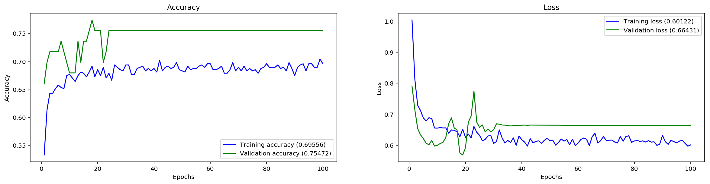

```python
CPU times: user 1.2 s, sys: 264 ms, total: 1.46 s
Wall time: 1.12 s
```

#### 

以下是对您提供的`plot_confusion_matrix`函数的逐行中文注释：

```python
# 定义一个名为plot_confusion_matrix的函数，它用于打印和绘制混淆矩阵。
# 参数：
# - cm: 混淆矩阵。
# - classes: 类别标签列表。
# - normalize: 是否对混淆矩阵进行归一化，布尔值。
# - cmap: 用于绘制混淆矩阵的颜色映射，这里使用Blues颜色映射。
def plot_confusion_matrix(cm, classes,
                          normalize=False,
                          cmap=plt.cm.Blues):
    """
    This function prints and plots the confusion matrix.
    Normalization can be applied by setting `normalize=True`.
    """
    # 如果指定了normalize为True，则对混淆矩阵进行归一化处理，
    # 即将每一行的值除以该行的总和，转化为条件概率分布。
    if normalize:
        cm = cm.astype('float') / cm.sum(axis=1)[:, np.newaxis]
        title='Normalized confusion matrix'  # 设置标题为“归一化混淆矩阵”
    else:
        title='Confusion matrix'  # 如果不进行归一化，则标题为“混淆矩阵”

    # 使用imshow函数绘制混淆矩阵，设置插值方法为'nearest'，使用指定的颜色映射。
    plt.imshow(cm, interpolation='nearest', cmap=cmap)
    
    # 设置当前图形的标题。
    plt.title(title)
    
    # 添加一个颜色条，用于表示不同颜色对应的数值大小。
    plt.colorbar()
    
    # 计算类别标签的数量，用于设置x轴和y轴的刻度标记。
    tick_marks = np.arange(len(classes))
    
    # 设置x轴的刻度标记和标签，旋转45度以避免标签之间的重叠。
    plt.xticks(tick_marks, classes, rotation=45)
    
    # 设置y轴的刻度标记和标签。
    plt.yticks(tick_marks, classes)

    # 根据是否归一化，设置显示格式，归一化时保留两位小数，否则使用整数。
    fmt = '.2f' if normalize else 'd'
    
    # 计算混淆矩阵中最大值的一半，用于文本颜色的阈值判断。
    thresh = cm.max() / 2.
    
    # 使用itertools.product生成混淆矩阵中每个单元格的坐标。
    for i, j in itertools.product(range(cm.shape[0]), range(cm.shape[1])):
        # 在混淆矩阵的每个单元格内添加文本，文本内容为单元格的值，根据单元格的值设置文本颜色。
        plt.text(j, i, format(cm[i, j], fmt),
                 horizontalalignment="center",  # 设置文本水平居中
                 color="white" if cm[i, j] > thresh else "black")  # 设置文本颜色

    # 自动调整子图参数，使之填充整个图像区域。
    plt.tight_layout()
    
    # 设置y轴的标签为'True label'。
    plt.ylabel('True label')
    
    # 设置x轴的标签为'Predicted label'。
    plt.xlabel('Predicted label')
    
    # 显示图形。
    plt.show()
```

这个函数用于可视化混淆矩阵，它允许用户选择是否对矩阵进行归一化。归一化后的混淆矩阵显示的是每个类别的预测概率分布。函数中使用了`matplotlib`库来绘制混淆矩阵，并在每个单元格中添加了对应的数值文本。通过设置文本颜色和阈值，可以突出显示混淆矩阵中的重要元素。最后，函数显示了混淆矩阵的图形，这对于评估分类器的性能非常有帮助。


### Prediction Test
make a prediction x: The input data, as a Numpy array (or list of Numpy arrays if the model has multiple inputs). batch_size: Integer. If unspecified, it will default to 32. steps = Total number of steps (batches of samples) before declaring the prediction round finished. callbacks: List of keras.callbacks.Callback instances. returns Numpy array(s) of predictions.


#### 
以下是对您提供的代码段的逐行中文注释：

```python
# 使用模型的predict_classes方法进行预测，该方法预测x_test数据的类别。
# predict_classes方法返回一个数组，其中包含了测试数据每个样本的预测类别索引。
y_pred = model.predict_classes(x_test, batch_size=32)

# 打印第一个样本的预测结果以及对应的文本标签。
# y_pred[1]是预测结果数组中第二个样本的预测类别索引。
# int_to_label是一个将类别索引映射回原始文本标签的字典。
# int_to_label[y_pred[1]]将预测的类别索引转换回对应的文本标签。
print("prediction test return :", y_pred[1], "-", int_to_label[y_pred[1]])
```

这段代码的作用是使用训练好的模型对测试集`x_test`进行预测，并打印出第二个样本的预测类别及其对应的文本标签。`predict_classes`方法属于Keras模型对象，它接受测试数据和批量大小作为参数，进行预测并返回预测结果。`batch_size=32`指定了每次预测的样本数量，这是为了减少内存的使用量，特别是当测试集很大时。预测结果是一个整数数组，其中每个整数代表一个类别索引。通过`int_to_label`字典，可以将这些索引转换为人类可读的文本标签。最后，打印出的结果是预测的类别索引和对应的文本标签。

##### 结果展示：
```python
prediction test return : 2 - normal
```

##### 结果解释：
输出结果提供了模型对测试集中某个样本的预测结果。以下是对输出结果的详细解释：

1. `y_pred = model.predict_classes(x_test, batch_size=32)`:
   这行代码使用训练好的模型对测试集`x_test`进行预测。`predict_classes`方法返回一个数组，包含了测试集中每个样本的预测类别索引。`batch_size=32`参数指定了每次预测时使用的样本数量，这里设置为32，意味着模型将分批次处理测试数据，每批包含32个样本。

2. `print("prediction test return :", y_pred[1], "-", int_to_label[y_pred[1]])`:
   这行代码打印出测试集中第二个样本的预测结果。`y_pred[1]`是预测结果数组中第二个样本的预测类别索引。`int_to_label`是一个映射，它将类别索引转换为对应的文本标签。因此，`int_to_label[y_pred[1]]`将索引2转换为文本标签"normal"。

3. `prediction test return : 2 - normal`:
   这是打印出的预测结果，表明模型预测测试集中第二个样本的类别为索引2，根据`int_to_label`映射，索引2对应的文本标签是"normal"。这意味着模型预测这个样本属于"正常"类别。

这个结果表明，模型对测试集中第二个样本的预测是类别"normal"。在心脏声音分析的上下文中，这可能意味着模型判断这个心跳声音样本是正常无杂音的。这样的预测结果对于评估模型的性能和准确性非常重要，尤其是在医疗诊断领域，准确的分类对于病情判断至关重要。
#### 
以下是对您提供的代码段的逐行中文注释：

```python
# 导入matplotlib.pyplot模块，并使用别名plt。
import matplotlib.pyplot as plt

# 使用matplotlib.pyplot的figure函数创建一个新的图形对象，编号为1，并设置图形的大小为20英寸宽、10英寸高。
plt.figure(1, figsize=(20, 10))

# 在图形对象中创建第一个子图，编号为221，即2行2列的第1个，设置子图的标题为'Prediction'。
plt.subplot(221, title='Prediction')

# 绘制y_pred数组，即模型预测的类别索引。
# 这里直接绘制预测结果可能不会非常直观，因为y_pred包含的是类别的整数索引。
# 如果想更直观地展示预测结果，可能需要将索引转换为对应的类别名称，或者使用混淆矩阵等其他方法。
plt.plot(y_pred)

# 显示图形。
plt.show()
```

这段代码的作用是创建一个图形窗口，并在其中绘制模型预测的类别索引。然而，直接绘制整数索引可能不具有可读性，因为它们不代表任何具体的含义，除非与实际的类别标签关联起来。通常，我们会使用混淆矩阵或将预测结果与真实标签一起绘制来更直观地评估模型性能。

如果您想更直观地展示预测结果，可以考虑使用以下方法之一：

1. 将预测的索引转换为对应的类别名称，然后绘制这些名称。
2. 使用`plot_confusion_matrix`函数绘制混淆矩阵，这可以更直观地展示模型在各个类别上的预测性能。
3. 绘制一个条形图，其中x轴代表样本索引，y轴代表预测的概率或置信度。

请注意，`plt.plot`通常用于绘制连续数值数据，而类别索引是离散的，因此可能需要使用其他绘图方法（如`plt.bar`）来更好地展示这些数据。
##### 结果展示：


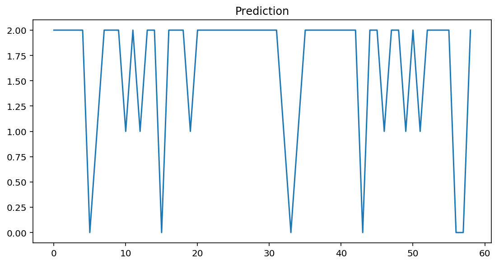


## Loading a saved training model


### 
以下是对您提供的代码行的详细中文注释：

```python
# 打印变量best_model_file的值。
# best_model_file是一个字符串变量，它存储了模型检查点文件的路径。
# 这个文件是在使用ModelCheckpoint回调函数时保存的，用于存储训练过程中的最佳模型。
# 这个文件的路径通常由用户在创建ModelCheckpoint实例时指定。
print(best_model_file)
```

这段代码的作用是将模型检查点文件的保存路径输出到控制台。这通常用于确认模型是否已经保存，以及检查保存的文件位置是否正确。在Keras中，使用`ModelCheckpoint`回调函数可以在训练过程中保存模型的权重，特别是在验证集上获得最佳性能时。这样，即使训练过程中断，也可以从这个检查点恢复训练，而不必从头开始。

#### 结果展示：
```python
./best_model_trained.hdf5
```

#### 结果解释：

输出结果 `./best_model_trained.hdf5` 提供了模型检查点文件的保存路径。以下是对输出结果的详细解释：

1. `./`: 这个部分表示当前工作目录。在类Unix系统中，`.` 通常用来指代当前所在的目录。

2. `best_model_trained.hdf5`: 这是文件的名称，根据之前的代码段，这个文件是使用`ModelCheckpoint`回调函数保存的模型检查点。文件扩展名 `.hdf5` 表明这是一个HDF5格式的文件，这是一种用于存储和组织大量数据的文件格式，常用于保存Keras模型的权重。

3. 整体来看，`./best_model_trained.hdf5` 指的是当前工作目录下的一个名为 `best_model_trained.hdf5` 的文件，这个文件包含了在训练过程中表现最佳的模型的权重。

这个输出结果表明，模型的检查点已经被成功保存在了指定的路径。在实际应用中，你可以使用这个文件来加载模型的权重，以便进行后续的推理或者继续训练。这也意味着，如果你需要重新利用这些训练好的权重，或者想要评估模型的性能，你可以直接从这个HDF5文件中恢复模型的状态。


### 
以下是对您提供的代码段的逐行中文注释：

```python
# 导入Keras中的Sequential模型，用于创建按顺序叠加的神经网络模型。
from keras.models import Sequential

# 导入Keras中的Dense类，用于创建全连接层。
from keras.layers import Dense

# 导入Keras的ModelCheckpoint回调函数，用于在训练过程中保存模型的权重。
from keras.callbacks import ModelCheckpoint

# 导入matplotlib.pyplot模块，用于数据可视化。
import matplotlib.pyplot as plt

# 导入NumPy库，这是一个广泛使用的科学计算库。
import numpy

# 设置随机数生成器的种子，以确保结果的可重复性。
seed = 7
numpy.random.seed(seed)

# 创建Sequential模型。
print('Build LSTM RNN model ...')

# 初始化Sequential模型。
model = Sequential()

# 向模型添加一个LSTM层，配置如下：
# units=64表示LSTM层有64个单元。
# dropout=0.05和recurrent_dropout=0.35分别设置输入和循环的丢弃率，用于正则化模型。
# return_sequences=True表示返回一个序列而不是单个输出。
# input_shape=(40,1)表示输入数据的形状，这里是40个时间步长，每个时间步长有1个特征。
model.add(LSTM(units=64, dropout=0.05, recurrent_dropout=0.35, return_sequences=True, input_shape=(40, 1)))

# 向模型添加另一个LSTM层，配置与第一个LSTM层类似，但units数量为32，且不返回序列。
model.add(LSTM(units=32, dropout=0.05, recurrent_dropout=0.35, return_sequences=False))

# 向模型添加一个全连接的Dense层，使用softmax激活函数进行多分类预测。
# len(CLASSES)是类别的数量，决定了Dense层的单元数。
model.add(Dense(len(CLASSES), activation='softmax'))

# 编译模型，设置损失函数为categorical_crossentropy，适用于多分类问题。
# 使用adam优化器，并指定评价指标包括准确度（'acc'）、均方误差（'mse'）、平均绝对误差（'mae'）、平均绝对百分比误差（'mape'）和余弦相似度（'cosine'）。
model.compile(loss='categorical_crossentropy', optimizer='adam', metrics=['acc', 'mse', 'mae', 'mape', 'cosine'])

# 打印模型的摘要信息，包括每层的类型、输出形状、参数数量等。
model.summary()

# 从之前训练过程中保存的检查点文件加载权重。
model.load_weights(best_model_file)

# 重新编译模型，这次设置损失函数为binary_crossentropy，适用于二分类问题。
# 这可能是因为在加载权重后，模型的用途或目标有所改变。
# 再次指定使用adam优化器，并设置评价指标为准确度（'accuracy'）。
model.compile(loss='binary_crossentropy', optimizer='adam', metrics=['accuracy'])

# 打印消息，表明模型已创建并从文件加载了权重。
print("Created model and loaded weights from file")
```

这段代码首先创建了一个LSTM神经网络模型，然后从指定的检查点文件加载了权重。接着，由于加载权重后的模型可能用于不同的任务（如从多分类问题变为二分类问题），代码重新编译了模型，并更改了损失函数和评价指标。最后，打印了一条消息，确认模型的创建和权重的加载。

#### 结果展示：
```python
Build LSTM RNN model ...
_________________________________________________________________
Layer (type)                 Output Shape              Param #   
=================================================================
lstm_3 (LSTM)                (None, 40, 64)            16896     
_________________________________________________________________
lstm_4 (LSTM)                (None, 32)                12416     
_________________________________________________________________
dense_2 (Dense)              (None, 3)                 99        
=================================================================
Total params: 29,411
Trainable params: 29,411
Non-trainable params: 0
_________________________________________________________________
Created model and loaded weights from file
```
#### 结果解释：
输出结果提供了模型构建和权重加载的详细信息。以下是对输出结果的详细解释：

1. `Build LSTM RNN model ...`:
   这是打印出来的一条信息，表明正在构建一个LSTM循环神经网络模型。

2. 接下来的几行显示了模型的详细结构，包括每一层的类型、输出形状和参数数量：
   - `lstm_3 (LSTM)`: 第一个LSTM层，输出形状为(None, 40, 64)，表示时间步长为40，特征维度为64。这一层有16,896个参数。
   - `lstm_4 (LSTM)`: 第二个LSTM层，输出形状为(None, 32)，表示输出的特征维度为32。这一层有12,416个参数。
   - `dense_2 (Dense)`: 全连接的Dense层，输出形状为(None, 3)，表示输出类别数为3。这一层有99个参数。

3. `Total params: 29,411`:
   这表示模型总共有29,411个参数。

4. `Trainable params: 29,411`:
   这表示有29,411个参数是可训练的。

5. `Non-trainable params: 0`:
   这表示模型中没有不可训练的参数。

6. `model.load_weights(best_model_file)`:
   这行代码加载了之前训练过程中保存的最佳模型权重。这是通过`ModelCheckpoint`回调函数指定的文件路径完成的。

7. `model.compile(loss='binary_crossentropy', optimizer='adam', metrics=['accuracy'])`:
   由于加载权重后的模型可能用于不同的任务，这里重新编译了模型。这次编译使用了`binary_crossentropy`损失函数，适用于二分类问题。同时指定了优化器为`adam`，并设置评价指标为准确度（`accuracy`）。

8. `Created model and loaded weights from file`:
   这是打印出来的一条信息，表明模型已成功创建，并且从文件中加载了权重。

总的来说，这段代码展示了如何构建一个LSTM模型，然后从检查点文件中加载最佳权重，并重新编译模型以适应可能的任务变化。输出结果确认了模型结构、参数数量和权重加载的状态。


## Test loaded model


### 
以下是对您提供的代码段的逐行中文注释：

```python
# 使用训练好的模型对测试集x_test进行预测，获取预测的类别索引。
# predict_classes方法会返回一个数组，包含测试集中每个样本的预测类别索引。
y_pred = model.predict_classes(x_test, batch_size=32)

# 使用evaluate方法评估模型在测试集上的性能，计算损失和准确度。
# x_test和y_test分别是测试数据的特征和标签。
# verbose=0表示评估过程中不输出详细的进度信息。
# scores数组中第一个元素是损失，第二个元素是准确度。
scores = model.evaluate(x_test, y_test, verbose=0)

# 打印模型在测试集上的评估准确度。
# 由于scores[1]是准确度的原始分数，乘以100将其转换为百分比形式。
# round函数用于四舍五入到最接近的整数。
print("Model evaluation accuracy: ", round(scores[1]*100), "%")
```

这段代码的作用是使用训练好的模型对测试集进行预测，并评估模型的性能。首先，`model.predict_classes`方法用于获取测试集的预测类别索引。然后，`model.evaluate`方法用于评估模型在测试集上的准确度，其中`verbose=0`参数表示在评估过程中不输出额外的日志信息。最后，打印出模型的评估准确度，准确度分数通过乘以100并使用`round`函数转换为百分比形式，并四舍五入到最近的整数。这些步骤提供了模型在独立测试集上的性能指标，有助于了解模型的泛化能力。

#### 结果展示：
```python
Model evaluation accuracy:  79.0 %
```


#### 结果解释：
输出结果提供了模型在测试集上的评估准确度。以下是对输出结果的详细解释：

1. `y_pred = model.predict_classes(x_test, batch_size=32)`:
   这行代码使用训练好的模型对测试集`x_test`进行预测，以获取每个样本的预测类别索引。`predict_classes`方法属于Keras模型对象，它根据模型的权重对输入数据进行预测，并返回预测的类别索引。`batch_size=32`参数指定了每次预测的样本数量，这里设置为32，意味着模型将分批次处理测试数据，每批包含32个样本。

2. `scores = model.evaluate(x_test, y_test, verbose=0)`:
   这行代码评估模型在测试集上的性能。`evaluate`方法计算并返回模型的损失值和准确度。`verbose=0`参数表示在评估过程中不输出详细的进度信息。`scores`数组中第一个元素是损失值，第二个元素是准确度。

3. `print("Model evaluation accuracy: ", round(scores[1]*100),"%")`:
   这行代码打印出模型在测试集上的评估准确度。`scores[1]`是准确度的原始分数，乘以100将其转换为百分比形式。`round`函数用于四舍五入到最接近的整数。

4. `Model evaluation accuracy:  79.0 %`:
   这是打印出的评估准确度结果，表明模型在测试集上的准确度为79.0%。这意味着在测试集上，模型正确预测了79%的样本类别。

这个结果是一个重要的性能指标，它显示了模型对未见过的数据的泛化能力。79.0%的准确度通常被认为是一个相对不错的结果，但这个数字的解释需要结合具体应用场景和问题背景。在某些情况下，可能需要更高的准确度，而在其他情况下，这个准确度可能已经足够。此外，评估模型性能时，通常还会考虑其他指标，如精确度、召回率、F1分数等，尤其是当数据集类别不平衡时。


# TODO - more optimization, keep improving the model.


> Reference:
> Classifying Heart Sounds Challenge http://www.peterjbentley.com/heartchallenge/


