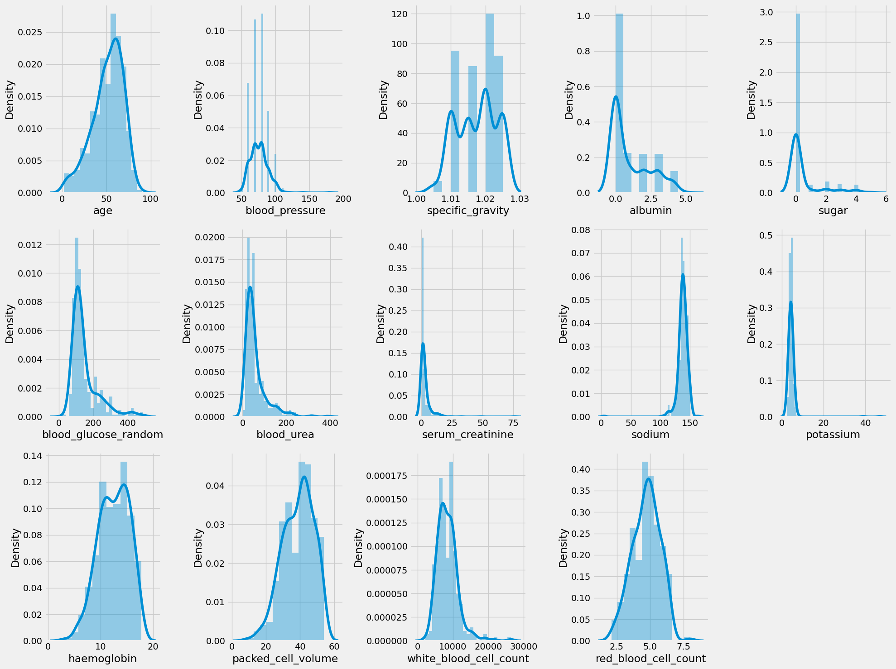
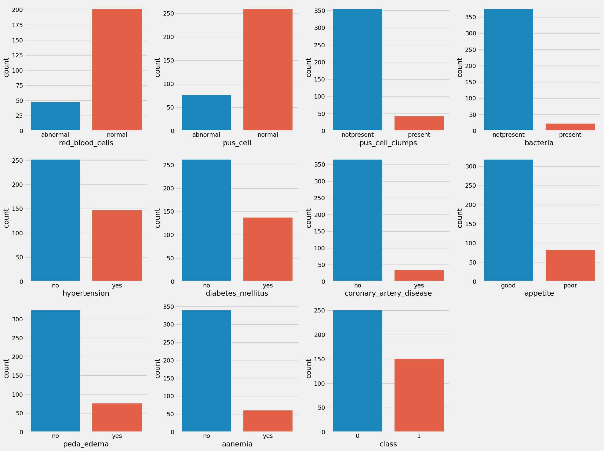
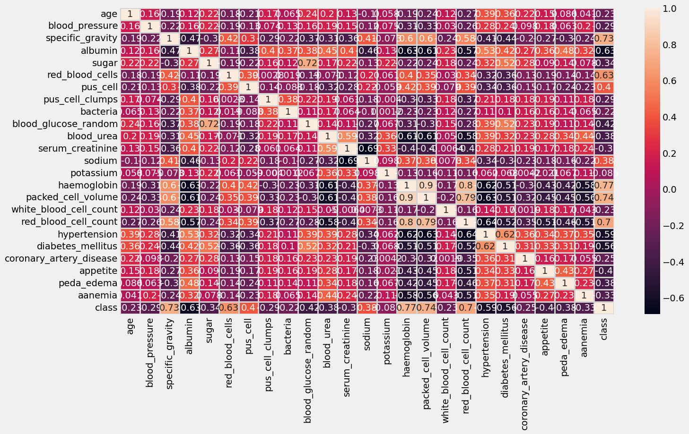
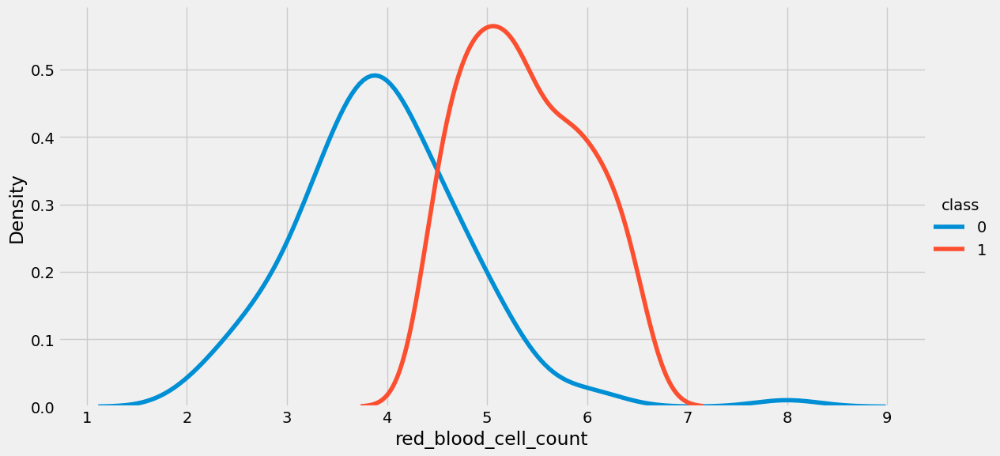
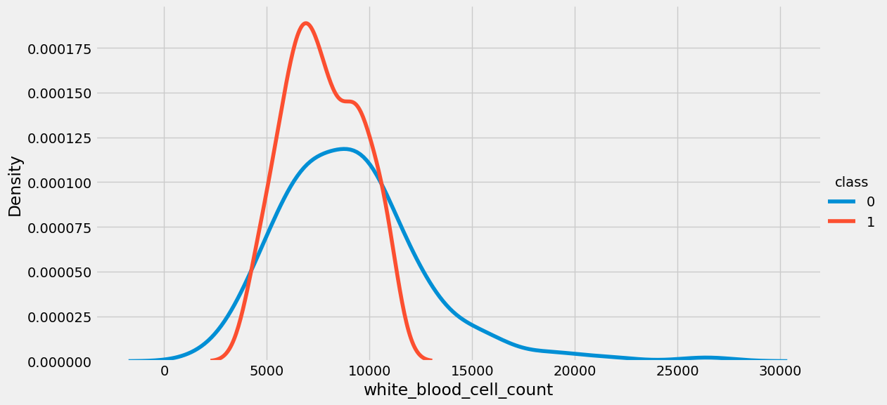
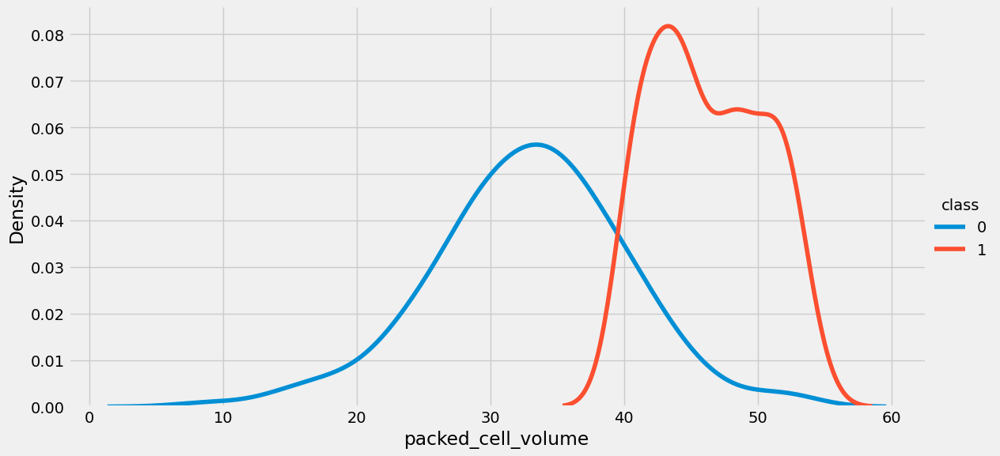
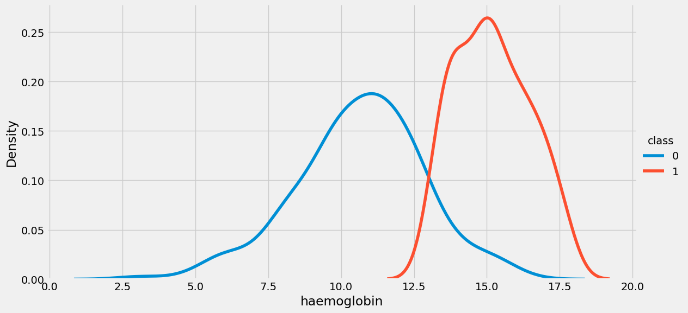
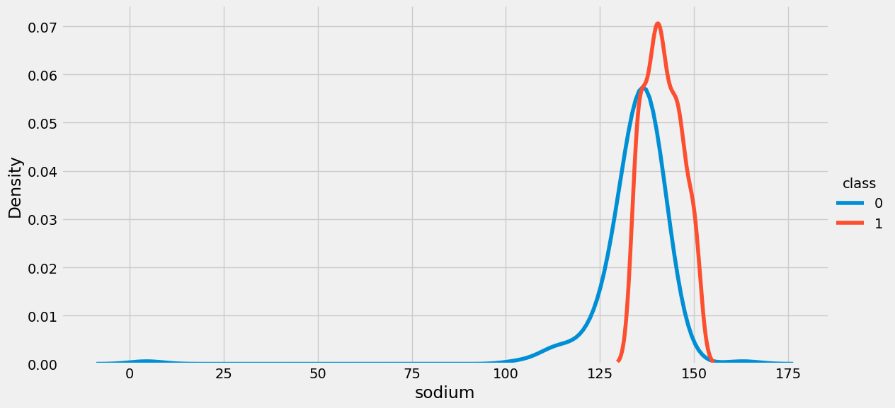
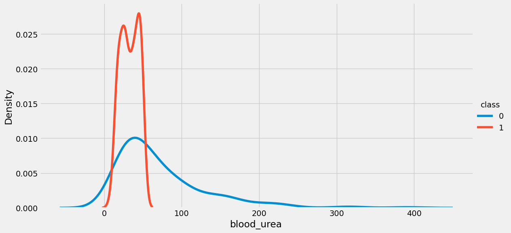
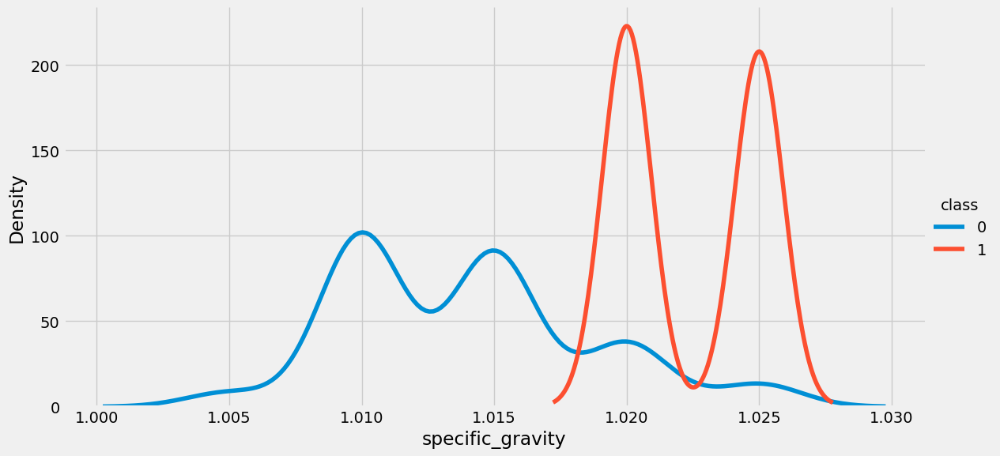

Chronic Kidney Disease Prediction (98% Accuracy)
#在终端中安装包
# 检查并安装 pandas
pip show pandas || pip install pandas -i https://pypi.tuna.tsinghua.edu.cn/simple 

# 检查并安装 numpy
pip show numpy || pip install numpy -i https://pypi.tuna.tsinghua.edu.cn/simple 

# 检查并安装 matplotlib
pip show matplotlib || pip install matplotlib -i https://pypi.tuna.tsinghua.edu.cn/simple 

# 检查并安装 seaborn
pip show seaborn || pip install seaborn -i https://pypi.tuna.tsinghua.edu.cn/simple 

# 检查并安装 plotly
pip show plotly || pip install plotly -i https://pypi.tuna.tsinghua.edu.cn/simple 

pip show xgboost || pip install xgboost -i https://pypi.tuna.tsinghua.edu.cn/simple

pip show catboost || pip install catboost -i https://pypi.tuna.tsinghua.edu.cn/simple

pip show lightgbm || pip install lightgbm -i https://pypi.tuna.tsinghua.edu.cn/simple

```python
# necessary imports 

import pandas as pd
import numpy as np
import matplotlib.pyplot as plt
import seaborn as sns
import plotly.express as px

import warnings
#warnings.filterwarnings('ignore')

plt.style.use('fivethirtyeight')
%matplotlib inline
pd.set_option('display.max_columns', 26)
```


```python
# 原始工作路径
%pwd
```


    '/work/home/aojiang/SothisAI/instance_service/01Chronic_Kidney_Disease_Prediction_98%_Accuracy'


```python
%cd /work/home/aojiang/00数据集/02肾脏疾病数据集/01Chronic_KIdney_Disease_dataset
```

    /work/home/aojiang/00数据集/02肾脏疾病数据集/01Chronic_KIdney_Disease_dataset
    


```python
# 原始工作路径
%pwd
```


    '/work/home/aojiang/00数据集/02肾脏疾病数据集/01Chronic_KIdney_Disease_dataset'


```python
# loading data

df= pd.read_csv('../01Chronic_KIdney_Disease_dataset/kidney_disease.csv')
df.head()
```


<div>
<style scoped>
    .dataframe tbody tr th:only-of-type {
        vertical-align: middle;
    }

    .dataframe tbody tr th {
        vertical-align: top;
    }

    .dataframe thead th {
        text-align: right;
    }
</style>
<table border="1" class="dataframe">
  <thead>
    <tr style="text-align: right;">
      <th></th>
      <th>id</th>
      <th>age</th>
      <th>bp</th>
      <th>sg</th>
      <th>al</th>
      <th>su</th>
      <th>rbc</th>
      <th>pc</th>
      <th>pcc</th>
      <th>ba</th>
      <th>bgr</th>
      <th>bu</th>
      <th>sc</th>
      <th>sod</th>
      <th>pot</th>
      <th>hemo</th>
      <th>pcv</th>
      <th>wc</th>
      <th>rc</th>
      <th>htn</th>
      <th>dm</th>
      <th>cad</th>
      <th>appet</th>
      <th>pe</th>
      <th>ane</th>
      <th>classification</th>
    </tr>
  </thead>
  <tbody>
    <tr>
      <th>0</th>
      <td>0</td>
      <td>48.0</td>
      <td>80.0</td>
      <td>1.020</td>
      <td>1.0</td>
      <td>0.0</td>
      <td>NaN</td>
      <td>normal</td>
      <td>notpresent</td>
      <td>notpresent</td>
      <td>121.0</td>
      <td>36.0</td>
      <td>1.2</td>
      <td>NaN</td>
      <td>NaN</td>
      <td>15.4</td>
      <td>44</td>
      <td>7800</td>
      <td>5.2</td>
      <td>yes</td>
      <td>yes</td>
      <td>no</td>
      <td>good</td>
      <td>no</td>
      <td>no</td>
      <td>ckd</td>
    </tr>
    <tr>
      <th>1</th>
      <td>1</td>
      <td>7.0</td>
      <td>50.0</td>
      <td>1.020</td>
      <td>4.0</td>
      <td>0.0</td>
      <td>NaN</td>
      <td>normal</td>
      <td>notpresent</td>
      <td>notpresent</td>
      <td>NaN</td>
      <td>18.0</td>
      <td>0.8</td>
      <td>NaN</td>
      <td>NaN</td>
      <td>11.3</td>
      <td>38</td>
      <td>6000</td>
      <td>NaN</td>
      <td>no</td>
      <td>no</td>
      <td>no</td>
      <td>good</td>
      <td>no</td>
      <td>no</td>
      <td>ckd</td>
    </tr>
    <tr>
      <th>2</th>
      <td>2</td>
      <td>62.0</td>
      <td>80.0</td>
      <td>1.010</td>
      <td>2.0</td>
      <td>3.0</td>
      <td>normal</td>
      <td>normal</td>
      <td>notpresent</td>
      <td>notpresent</td>
      <td>423.0</td>
      <td>53.0</td>
      <td>1.8</td>
      <td>NaN</td>
      <td>NaN</td>
      <td>9.6</td>
      <td>31</td>
      <td>7500</td>
      <td>NaN</td>
      <td>no</td>
      <td>yes</td>
      <td>no</td>
      <td>poor</td>
      <td>no</td>
      <td>yes</td>
      <td>ckd</td>
    </tr>
    <tr>
      <th>3</th>
      <td>3</td>
      <td>48.0</td>
      <td>70.0</td>
      <td>1.005</td>
      <td>4.0</td>
      <td>0.0</td>
      <td>normal</td>
      <td>abnormal</td>
      <td>present</td>
      <td>notpresent</td>
      <td>117.0</td>
      <td>56.0</td>
      <td>3.8</td>
      <td>111.0</td>
      <td>2.5</td>
      <td>11.2</td>
      <td>32</td>
      <td>6700</td>
      <td>3.9</td>
      <td>yes</td>
      <td>no</td>
      <td>no</td>
      <td>poor</td>
      <td>yes</td>
      <td>yes</td>
      <td>ckd</td>
    </tr>
    <tr>
      <th>4</th>
      <td>4</td>
      <td>51.0</td>
      <td>80.0</td>
      <td>1.010</td>
      <td>2.0</td>
      <td>0.0</td>
      <td>normal</td>
      <td>normal</td>
      <td>notpresent</td>
      <td>notpresent</td>
      <td>106.0</td>
      <td>26.0</td>
      <td>1.4</td>
      <td>NaN</td>
      <td>NaN</td>
      <td>11.6</td>
      <td>35</td>
      <td>7300</td>
      <td>4.6</td>
      <td>no</td>
      <td>no</td>
      <td>no</td>
      <td>good</td>
      <td>no</td>
      <td>no</td>
      <td>ckd</td>
    </tr>
  </tbody>
</table>
</div>


```python
df.shape
```


    (400, 26)


```python
# dropping id column
df.drop('id', axis = 1, inplace = True)
```


```python
# rename column names to make it more user-friendly

df.columns = ['age', 'blood_pressure', 'specific_gravity', 'albumin', 'sugar', 'red_blood_cells', 'pus_cell',
              'pus_cell_clumps', 'bacteria', 'blood_glucose_random', 'blood_urea', 'serum_creatinine', 'sodium',
              'potassium', 'haemoglobin', 'packed_cell_volume', 'white_blood_cell_count', 'red_blood_cell_count',
              'hypertension', 'diabetes_mellitus', 'coronary_artery_disease', 'appetite', 'peda_edema',
              'aanemia', 'class']
```


```python
df.head()
```


<div>
<style scoped>
    .dataframe tbody tr th:only-of-type {
        vertical-align: middle;
    }

    .dataframe tbody tr th {
        vertical-align: top;
    }

    .dataframe thead th {
        text-align: right;
    }
</style>
<table border="1" class="dataframe">
  <thead>
    <tr style="text-align: right;">
      <th></th>
      <th>age</th>
      <th>blood_pressure</th>
      <th>specific_gravity</th>
      <th>albumin</th>
      <th>sugar</th>
      <th>red_blood_cells</th>
      <th>pus_cell</th>
      <th>pus_cell_clumps</th>
      <th>bacteria</th>
      <th>blood_glucose_random</th>
      <th>blood_urea</th>
      <th>serum_creatinine</th>
      <th>sodium</th>
      <th>potassium</th>
      <th>haemoglobin</th>
      <th>packed_cell_volume</th>
      <th>white_blood_cell_count</th>
      <th>red_blood_cell_count</th>
      <th>hypertension</th>
      <th>diabetes_mellitus</th>
      <th>coronary_artery_disease</th>
      <th>appetite</th>
      <th>peda_edema</th>
      <th>aanemia</th>
      <th>class</th>
    </tr>
  </thead>
  <tbody>
    <tr>
      <th>0</th>
      <td>48.0</td>
      <td>80.0</td>
      <td>1.020</td>
      <td>1.0</td>
      <td>0.0</td>
      <td>NaN</td>
      <td>normal</td>
      <td>notpresent</td>
      <td>notpresent</td>
      <td>121.0</td>
      <td>36.0</td>
      <td>1.2</td>
      <td>NaN</td>
      <td>NaN</td>
      <td>15.4</td>
      <td>44</td>
      <td>7800</td>
      <td>5.2</td>
      <td>yes</td>
      <td>yes</td>
      <td>no</td>
      <td>good</td>
      <td>no</td>
      <td>no</td>
      <td>ckd</td>
    </tr>
    <tr>
      <th>1</th>
      <td>7.0</td>
      <td>50.0</td>
      <td>1.020</td>
      <td>4.0</td>
      <td>0.0</td>
      <td>NaN</td>
      <td>normal</td>
      <td>notpresent</td>
      <td>notpresent</td>
      <td>NaN</td>
      <td>18.0</td>
      <td>0.8</td>
      <td>NaN</td>
      <td>NaN</td>
      <td>11.3</td>
      <td>38</td>
      <td>6000</td>
      <td>NaN</td>
      <td>no</td>
      <td>no</td>
      <td>no</td>
      <td>good</td>
      <td>no</td>
      <td>no</td>
      <td>ckd</td>
    </tr>
    <tr>
      <th>2</th>
      <td>62.0</td>
      <td>80.0</td>
      <td>1.010</td>
      <td>2.0</td>
      <td>3.0</td>
      <td>normal</td>
      <td>normal</td>
      <td>notpresent</td>
      <td>notpresent</td>
      <td>423.0</td>
      <td>53.0</td>
      <td>1.8</td>
      <td>NaN</td>
      <td>NaN</td>
      <td>9.6</td>
      <td>31</td>
      <td>7500</td>
      <td>NaN</td>
      <td>no</td>
      <td>yes</td>
      <td>no</td>
      <td>poor</td>
      <td>no</td>
      <td>yes</td>
      <td>ckd</td>
    </tr>
    <tr>
      <th>3</th>
      <td>48.0</td>
      <td>70.0</td>
      <td>1.005</td>
      <td>4.0</td>
      <td>0.0</td>
      <td>normal</td>
      <td>abnormal</td>
      <td>present</td>
      <td>notpresent</td>
      <td>117.0</td>
      <td>56.0</td>
      <td>3.8</td>
      <td>111.0</td>
      <td>2.5</td>
      <td>11.2</td>
      <td>32</td>
      <td>6700</td>
      <td>3.9</td>
      <td>yes</td>
      <td>no</td>
      <td>no</td>
      <td>poor</td>
      <td>yes</td>
      <td>yes</td>
      <td>ckd</td>
    </tr>
    <tr>
      <th>4</th>
      <td>51.0</td>
      <td>80.0</td>
      <td>1.010</td>
      <td>2.0</td>
      <td>0.0</td>
      <td>normal</td>
      <td>normal</td>
      <td>notpresent</td>
      <td>notpresent</td>
      <td>106.0</td>
      <td>26.0</td>
      <td>1.4</td>
      <td>NaN</td>
      <td>NaN</td>
      <td>11.6</td>
      <td>35</td>
      <td>7300</td>
      <td>4.6</td>
      <td>no</td>
      <td>no</td>
      <td>no</td>
      <td>good</td>
      <td>no</td>
      <td>no</td>
      <td>ckd</td>
    </tr>
  </tbody>
</table>
</div>


```python
df.describe()
```


<div>
<style scoped>
    .dataframe tbody tr th:only-of-type {
        vertical-align: middle;
    }

    .dataframe tbody tr th {
        vertical-align: top;
    }

    .dataframe thead th {
        text-align: right;
    }
</style>
<table border="1" class="dataframe">
  <thead>
    <tr style="text-align: right;">
      <th></th>
      <th>age</th>
      <th>blood_pressure</th>
      <th>specific_gravity</th>
      <th>albumin</th>
      <th>sugar</th>
      <th>blood_glucose_random</th>
      <th>blood_urea</th>
      <th>serum_creatinine</th>
      <th>sodium</th>
      <th>potassium</th>
      <th>haemoglobin</th>
    </tr>
  </thead>
  <tbody>
    <tr>
      <th>count</th>
      <td>391.000000</td>
      <td>388.000000</td>
      <td>353.000000</td>
      <td>354.000000</td>
      <td>351.000000</td>
      <td>356.000000</td>
      <td>381.000000</td>
      <td>383.000000</td>
      <td>313.000000</td>
      <td>312.000000</td>
      <td>348.000000</td>
    </tr>
    <tr>
      <th>mean</th>
      <td>51.483376</td>
      <td>76.469072</td>
      <td>1.017408</td>
      <td>1.016949</td>
      <td>0.450142</td>
      <td>148.036517</td>
      <td>57.425722</td>
      <td>3.072454</td>
      <td>137.528754</td>
      <td>4.627244</td>
      <td>12.526437</td>
    </tr>
    <tr>
      <th>std</th>
      <td>17.169714</td>
      <td>13.683637</td>
      <td>0.005717</td>
      <td>1.352679</td>
      <td>1.099191</td>
      <td>79.281714</td>
      <td>50.503006</td>
      <td>5.741126</td>
      <td>10.408752</td>
      <td>3.193904</td>
      <td>2.912587</td>
    </tr>
    <tr>
      <th>min</th>
      <td>2.000000</td>
      <td>50.000000</td>
      <td>1.005000</td>
      <td>0.000000</td>
      <td>0.000000</td>
      <td>22.000000</td>
      <td>1.500000</td>
      <td>0.400000</td>
      <td>4.500000</td>
      <td>2.500000</td>
      <td>3.100000</td>
    </tr>
    <tr>
      <th>25%</th>
      <td>42.000000</td>
      <td>70.000000</td>
      <td>1.010000</td>
      <td>0.000000</td>
      <td>0.000000</td>
      <td>99.000000</td>
      <td>27.000000</td>
      <td>0.900000</td>
      <td>135.000000</td>
      <td>3.800000</td>
      <td>10.300000</td>
    </tr>
    <tr>
      <th>50%</th>
      <td>55.000000</td>
      <td>80.000000</td>
      <td>1.020000</td>
      <td>0.000000</td>
      <td>0.000000</td>
      <td>121.000000</td>
      <td>42.000000</td>
      <td>1.300000</td>
      <td>138.000000</td>
      <td>4.400000</td>
      <td>12.650000</td>
    </tr>
    <tr>
      <th>75%</th>
      <td>64.500000</td>
      <td>80.000000</td>
      <td>1.020000</td>
      <td>2.000000</td>
      <td>0.000000</td>
      <td>163.000000</td>
      <td>66.000000</td>
      <td>2.800000</td>
      <td>142.000000</td>
      <td>4.900000</td>
      <td>15.000000</td>
    </tr>
    <tr>
      <th>max</th>
      <td>90.000000</td>
      <td>180.000000</td>
      <td>1.025000</td>
      <td>5.000000</td>
      <td>5.000000</td>
      <td>490.000000</td>
      <td>391.000000</td>
      <td>76.000000</td>
      <td>163.000000</td>
      <td>47.000000</td>
      <td>17.800000</td>
    </tr>
  </tbody>
</table>
</div>


```python
df.info()
```

    <class 'pandas.core.frame.DataFrame'>
    RangeIndex: 400 entries, 0 to 399
    Data columns (total 25 columns):
     #   Column                   Non-Null Count  Dtype  
    ---  ------                   --------------  -----  
     0   age                      391 non-null    float64
     1   blood_pressure           388 non-null    float64
     2   specific_gravity         353 non-null    float64
     3   albumin                  354 non-null    float64
     4   sugar                    351 non-null    float64
     5   red_blood_cells          248 non-null    object 
     6   pus_cell                 335 non-null    object 
     7   pus_cell_clumps          396 non-null    object 
     8   bacteria                 396 non-null    object 
     9   blood_glucose_random     356 non-null    float64
     10  blood_urea               381 non-null    float64
     11  serum_creatinine         383 non-null    float64
     12  sodium                   313 non-null    float64
     13  potassium                312 non-null    float64
     14  haemoglobin              348 non-null    float64
     15  packed_cell_volume       330 non-null    object 
     16  white_blood_cell_count   295 non-null    object 
     17  red_blood_cell_count     270 non-null    object 
     18  hypertension             398 non-null    object 
     19  diabetes_mellitus        398 non-null    object 
     20  coronary_artery_disease  398 non-null    object 
     21  appetite                 399 non-null    object 
     22  peda_edema               399 non-null    object 
     23  aanemia                  399 non-null    object 
     24  class                    400 non-null    object 
    dtypes: float64(11), object(14)
    memory usage: 78.2+ KB
    


```python
# As we can see that 'packed_cell_volume', 'white_blood_cell_count' and 'red_blood_cell_count' are object type. We need to change them to numerical dtype.
# converting necessary columns to numerical type

df['packed_cell_volume'] = pd.to_numeric(df['packed_cell_volume'], errors='coerce')
df['white_blood_cell_count'] = pd.to_numeric(df['white_blood_cell_count'], errors='coerce')
df['red_blood_cell_count'] = pd.to_numeric(df['red_blood_cell_count'], errors='coerce')
```


```python
df.info()
```

    <class 'pandas.core.frame.DataFrame'>
    RangeIndex: 400 entries, 0 to 399
    Data columns (total 25 columns):
     #   Column                   Non-Null Count  Dtype  
    ---  ------                   --------------  -----  
     0   age                      391 non-null    float64
     1   blood_pressure           388 non-null    float64
     2   specific_gravity         353 non-null    float64
     3   albumin                  354 non-null    float64
     4   sugar                    351 non-null    float64
     5   red_blood_cells          248 non-null    object 
     6   pus_cell                 335 non-null    object 
     7   pus_cell_clumps          396 non-null    object 
     8   bacteria                 396 non-null    object 
     9   blood_glucose_random     356 non-null    float64
     10  blood_urea               381 non-null    float64
     11  serum_creatinine         383 non-null    float64
     12  sodium                   313 non-null    float64
     13  potassium                312 non-null    float64
     14  haemoglobin              348 non-null    float64
     15  packed_cell_volume       329 non-null    float64
     16  white_blood_cell_count   294 non-null    float64
     17  red_blood_cell_count     269 non-null    float64
     18  hypertension             398 non-null    object 
     19  diabetes_mellitus        398 non-null    object 
     20  coronary_artery_disease  398 non-null    object 
     21  appetite                 399 non-null    object 
     22  peda_edema               399 non-null    object 
     23  aanemia                  399 non-null    object 
     24  class                    400 non-null    object 
    dtypes: float64(14), object(11)
    memory usage: 78.2+ KB
    


```python
# Extracting categorical and numerical columns

cat_cols = [col for col in df.columns if df[col].dtype == 'object']
num_cols = [col for col in df.columns if df[col].dtype != 'object']
```


```python
# looking at unique values in categorical columns

for col in cat_cols:
    print(f"{col} has {df[col].unique()} values\n")
```

    red_blood_cells has [nan 'normal' 'abnormal'] values
    
    pus_cell has ['normal' 'abnormal' nan] values
    
    pus_cell_clumps has ['notpresent' 'present' nan] values
    
    bacteria has ['notpresent' 'present' nan] values
    
    hypertension has ['yes' 'no' nan] values
    
    diabetes_mellitus has ['yes' 'no' ' yes' '\tno' '\tyes' nan] values
    
    coronary_artery_disease has ['no' 'yes' '\tno' nan] values
    
    appetite has ['good' 'poor' nan] values
    
    peda_edema has ['no' 'yes' nan] values
    
    aanemia has ['no' 'yes' nan] values
    
    class has ['ckd' 'ckd\t' 'notckd'] values
    
    


```python
# There is some ambugity present in the columns we have to remove that.
# replace incorrect values

df['diabetes_mellitus'].replace(to_replace = {'\tno':'no','\tyes':'yes',' yes':'yes'},inplace=True)

df['coronary_artery_disease'] = df['coronary_artery_disease'].replace(to_replace = '\tno', value='no')

df['class'] = df['class'].replace(to_replace = {'ckd\t': 'ckd', 'notckd': 'not ckd'})
```


```python
df['class'] = df['class'].map({'ckd': 0, 'not ckd': 1})
df['class'] = pd.to_numeric(df['class'], errors='coerce')
```


```python
cols = ['diabetes_mellitus', 'coronary_artery_disease', 'class']

for col in cols:
    print(f"{col} has {df[col].unique()} values\n")
```

    diabetes_mellitus has ['yes' 'no' nan] values
    
    coronary_artery_disease has ['no' 'yes' nan] values
    
    class has [0 1] values
    
    


```python
# checking numerical features distribution
# Skewness is present in some of the columns.

plt.figure(figsize = (20, 15))
plotnumber = 1

for column in num_cols:
    if plotnumber <= 14:
        ax = plt.subplot(3, 5, plotnumber)
        sns.distplot(df[column])
        plt.xlabel(column)
        
    plotnumber += 1

plt.tight_layout()
plt.show()
```

    /opt/conda/lib/python3.7/site-packages/ipykernel_launcher.py:10: UserWarning: 
    
    `distplot` is a deprecated function and will be removed in seaborn v0.14.0.
    
    Please adapt your code to use either `displot` (a figure-level function with
    similar flexibility) or `histplot` (an axes-level function for histograms).
    
    For a guide to updating your code to use the new functions, please see
    https://gist.github.com/mwaskom/de44147ed2974457ad6372750bbe5751
    
      # Remove the CWD from sys.path while we load stuff.
    /opt/conda/lib/python3.7/site-packages/ipykernel_launcher.py:10: UserWarning: 
    
    `distplot` is a deprecated function and will be removed in seaborn v0.14.0.
    
    Please adapt your code to use either `displot` (a figure-level function with
    similar flexibility) or `histplot` (an axes-level function for histograms).
    
    For a guide to updating your code to use the new functions, please see
    https://gist.github.com/mwaskom/de44147ed2974457ad6372750bbe5751
    
      # Remove the CWD from sys.path while we load stuff.
    /opt/conda/lib/python3.7/site-packages/ipykernel_launcher.py:10: UserWarning: 
    
    `distplot` is a deprecated function and will be removed in seaborn v0.14.0.
    
    Please adapt your code to use either `displot` (a figure-level function with
    similar flexibility) or `histplot` (an axes-level function for histograms).
    
    For a guide to updating your code to use the new functions, please see
    https://gist.github.com/mwaskom/de44147ed2974457ad6372750bbe5751
    
      # Remove the CWD from sys.path while we load stuff.
    /opt/conda/lib/python3.7/site-packages/ipykernel_launcher.py:10: UserWarning: 
    
    `distplot` is a deprecated function and will be removed in seaborn v0.14.0.
    
    Please adapt your code to use either `displot` (a figure-level function with
    similar flexibility) or `histplot` (an axes-level function for histograms).
    
    For a guide to updating your code to use the new functions, please see
    https://gist.github.com/mwaskom/de44147ed2974457ad6372750bbe5751
    
      # Remove the CWD from sys.path while we load stuff.
    /opt/conda/lib/python3.7/site-packages/ipykernel_launcher.py:10: UserWarning: 
    
    `distplot` is a deprecated function and will be removed in seaborn v0.14.0.
    
    Please adapt your code to use either `displot` (a figure-level function with
    similar flexibility) or `histplot` (an axes-level function for histograms).
    
    For a guide to updating your code to use the new functions, please see
    https://gist.github.com/mwaskom/de44147ed2974457ad6372750bbe5751
    
      # Remove the CWD from sys.path while we load stuff.
    /opt/conda/lib/python3.7/site-packages/ipykernel_launcher.py:10: UserWarning: 
    
    `distplot` is a deprecated function and will be removed in seaborn v0.14.0.
    
    Please adapt your code to use either `displot` (a figure-level function with
    similar flexibility) or `histplot` (an axes-level function for histograms).
    
    For a guide to updating your code to use the new functions, please see
    https://gist.github.com/mwaskom/de44147ed2974457ad6372750bbe5751
    
      # Remove the CWD from sys.path while we load stuff.
    /opt/conda/lib/python3.7/site-packages/ipykernel_launcher.py:10: UserWarning: 
    
    `distplot` is a deprecated function and will be removed in seaborn v0.14.0.
    
    Please adapt your code to use either `displot` (a figure-level function with
    similar flexibility) or `histplot` (an axes-level function for histograms).
    
    For a guide to updating your code to use the new functions, please see
    https://gist.github.com/mwaskom/de44147ed2974457ad6372750bbe5751
    
      # Remove the CWD from sys.path while we load stuff.
    /opt/conda/lib/python3.7/site-packages/ipykernel_launcher.py:10: UserWarning: 
    
    `distplot` is a deprecated function and will be removed in seaborn v0.14.0.
    
    Please adapt your code to use either `displot` (a figure-level function with
    similar flexibility) or `histplot` (an axes-level function for histograms).
    
    For a guide to updating your code to use the new functions, please see
    https://gist.github.com/mwaskom/de44147ed2974457ad6372750bbe5751
    
      # Remove the CWD from sys.path while we load stuff.
    /opt/conda/lib/python3.7/site-packages/ipykernel_launcher.py:10: UserWarning: 
    
    `distplot` is a deprecated function and will be removed in seaborn v0.14.0.
    
    Please adapt your code to use either `displot` (a figure-level function with
    similar flexibility) or `histplot` (an axes-level function for histograms).
    
    For a guide to updating your code to use the new functions, please see
    https://gist.github.com/mwaskom/de44147ed2974457ad6372750bbe5751
    
      # Remove the CWD from sys.path while we load stuff.
    /opt/conda/lib/python3.7/site-packages/ipykernel_launcher.py:10: UserWarning: 
    
    `distplot` is a deprecated function and will be removed in seaborn v0.14.0.
    
    Please adapt your code to use either `displot` (a figure-level function with
    similar flexibility) or `histplot` (an axes-level function for histograms).
    
    For a guide to updating your code to use the new functions, please see
    https://gist.github.com/mwaskom/de44147ed2974457ad6372750bbe5751
    
      # Remove the CWD from sys.path while we load stuff.
    /opt/conda/lib/python3.7/site-packages/ipykernel_launcher.py:10: UserWarning: 
    
    `distplot` is a deprecated function and will be removed in seaborn v0.14.0.
    
    Please adapt your code to use either `displot` (a figure-level function with
    similar flexibility) or `histplot` (an axes-level function for histograms).
    
    For a guide to updating your code to use the new functions, please see
    https://gist.github.com/mwaskom/de44147ed2974457ad6372750bbe5751
    
      # Remove the CWD from sys.path while we load stuff.
    /opt/conda/lib/python3.7/site-packages/ipykernel_launcher.py:10: UserWarning: 
    
    `distplot` is a deprecated function and will be removed in seaborn v0.14.0.
    
    Please adapt your code to use either `displot` (a figure-level function with
    similar flexibility) or `histplot` (an axes-level function for histograms).
    
    For a guide to updating your code to use the new functions, please see
    https://gist.github.com/mwaskom/de44147ed2974457ad6372750bbe5751
    
      # Remove the CWD from sys.path while we load stuff.
    /opt/conda/lib/python3.7/site-packages/ipykernel_launcher.py:10: UserWarning: 
    
    `distplot` is a deprecated function and will be removed in seaborn v0.14.0.
    
    Please adapt your code to use either `displot` (a figure-level function with
    similar flexibility) or `histplot` (an axes-level function for histograms).
    
    For a guide to updating your code to use the new functions, please see
    https://gist.github.com/mwaskom/de44147ed2974457ad6372750bbe5751
    
      # Remove the CWD from sys.path while we load stuff.
    /opt/conda/lib/python3.7/site-packages/ipykernel_launcher.py:10: UserWarning: 
    
    `distplot` is a deprecated function and will be removed in seaborn v0.14.0.
    
    Please adapt your code to use either `displot` (a figure-level function with
    similar flexibility) or `histplot` (an axes-level function for histograms).
    
    For a guide to updating your code to use the new functions, please see
    https://gist.github.com/mwaskom/de44147ed2974457ad6372750bbe5751
    
      # Remove the CWD from sys.path while we load stuff.
    


    

    


```python
# looking at categorical columns

# 假设 df 是您的 DataFrame，cat_cols 是包含类别列名的列表
plt.figure(figsize=(20, 15))
plotnumber = 1

for column in cat_cols:
    if plotnumber <= 11:
        # 确保数据是类别型
        df[column] = pd.Categorical(df[column])
        ax = plt.subplot(3, 4, plotnumber)
        # 使用 order 参数指定类别顺序（可选）
        sns.countplot(data=df, x=column, order=df[column].cat.categories)
        plt.xlabel(column)
        # 重置类别顺序
        df[column] = df[column].cat.codes
    plotnumber += 1

plt.tight_layout()
plt.show()
```


    

    


```python
# heatmap of data

plt.figure(figsize = (15, 8))

sns.heatmap(df.corr(), annot = True, linewidths = 2, linecolor = 'lightgrey')
plt.show()
```


    

    


```python
df.columns
```


    Index(['age', 'blood_pressure', 'specific_gravity', 'albumin', 'sugar',
           'red_blood_cells', 'pus_cell', 'pus_cell_clumps', 'bacteria',
           'blood_glucose_random', 'blood_urea', 'serum_creatinine', 'sodium',
           'potassium', 'haemoglobin', 'packed_cell_volume',
           'white_blood_cell_count', 'red_blood_cell_count', 'hypertension',
           'diabetes_mellitus', 'coronary_artery_disease', 'appetite',
           'peda_edema', 'aanemia', 'class'],
          dtype='object')


# Exploratory Data Analysis (EDA)


```python
# defining functions to create plot

def violin(col):
    fig = px.violin(df, y=col, x="clas", color="clas", box=True, template = 'plotly_dark')
    return fig.show()

def kde(col):
    grid = sns.FacetGrid(df, hue="class", height = 6, aspect=2)
    grid.map(sns.kdeplot, col)
    grid.add_legend()
    
def scatter(col1, col2):
    fig = px.scatter(df, x=col1, y=col2, color="class", template = 'plotly_dark')
    return fig.show()
```


```python
print(df.columns)
```

    Index(['age', 'blood_pressure', 'specific_gravity', 'albumin', 'sugar',
           'red_blood_cells', 'pus_cell', 'pus_cell_clumps', 'bacteria',
           'blood_glucose_random', 'blood_urea', 'serum_creatinine', 'sodium',
           'potassium', 'haemoglobin', 'packed_cell_volume',
           'white_blood_cell_count', 'red_blood_cell_count', 'hypertension',
           'diabetes_mellitus', 'coronary_artery_disease', 'appetite',
           'peda_edema', 'aanemia', 'class'],
          dtype='object')
    
# 如果 "class" 列存在，创建一个名为 "clas" 的新列作为副本
if "class" in df.columns:
    df['clas'] = df["class"].copy()
else:
    print("Column 'class' does not exist in the DataFrame.")# 复制最后一列 "class" 并将其重命名为 "clas"
df['clas'] = df.iloc[:, -1]  # 使用iloc来选择最后一列print(df.columns)

```python

```


```python
violin('red_blood_cell_count')
```


<div>                            <div id="7b8bc3b2-1e5b-461c-a940-5dbf70be66c3" class="plotly-graph-div" style="height:525px; width:100%;"></div>            <script type="text/javascript">                require(["plotly"], function(Plotly) {                    window.PLOTLYENV=window.PLOTLYENV || {};                                    if (document.getElementById("7b8bc3b2-1e5b-461c-a940-5dbf70be66c3")) {                    Plotly.newPlot(                        "7b8bc3b2-1e5b-461c-a940-5dbf70be66c3",                        [{"alignmentgroup":"True","box":{"visible":true},"hovertemplate":"clas=%{x}\u003cbr\u003ered_blood_cell_count=%{y}\u003cextra\u003e\u003c\u002fextra\u003e","legendgroup":"0","marker":{"color":"#636efa"},"name":"0","offsetgroup":"0","orientation":"v","scalegroup":"True","showlegend":true,"x":[0,0,0,0,0,0,0,0,0,0,0,0,0,0,0,0,0,0,0,0,0,0,0,0,0,0,0,0,0,0,0,0,0,0,0,0,0,0,0,0,0,0,0,0,0,0,0,0,0,0,0,0,0,0,0,0,0,0,0,0,0,0,0,0,0,0,0,0,0,0,0,0,0,0,0,0,0,0,0,0,0,0,0,0,0,0,0,0,0,0,0,0,0,0,0,0,0,0,0,0,0,0,0,0,0,0,0,0,0,0,0,0,0,0,0,0,0,0,0,0,0,0,0,0,0,0,0,0,0,0,0,0,0,0,0,0,0,0,0,0,0,0,0,0,0,0,0,0,0,0,0,0,0,0,0,0,0,0,0,0,0,0,0,0,0,0,0,0,0,0,0,0,0,0,0,0,0,0,0,0,0,0,0,0,0,0,0,0,0,0,0,0,0,0,0,0,0,0,0,0,0,0,0,0,0,0,0,0,0,0,0,0,0,0,0,0,0,0,0,0,0,0,0,0,0,0,0,0,0,0,0,0,0,0,0,0,0,0,0,0,0,0,0,0,0,0,0,0,0,0],"x0":" ","xaxis":"x","y":[5.2,5.2,4.9,3.9,4.6,4.4,4.9,5.0,4.0,3.7,5.3,3.8,3.4,5.9,2.6,2.8,4.1,3.1,4.3,3.7,3.2,3.6,3.4,5.9,4.6,3.7,4.0,4.1,3.4,3.5,4.5,4.0,4.0,4.5,5.5,4.9,2.1,2.5,6.1,4.2,4.1,4.6,4.5,3.1,3.4,5.0,4.7,5.6,3.5,3.5,3.8,6.5,3.7,4.7,4.2,5.2,3.4,4.5,4.3,6.3,3.2,3.4,3.8,4.9,5.5,5.2,4.6,6.4,3.9,6.0,5.2,3.2,4.3,4.6,3.4,5.2,4.0,3.7,6.0,5.0,3.8,3.7,3.0,4.5,2.1,2.5,4.1,5.0,4.7,4.4,4.2,5.6,3.6,3.2,3.9,6.1,6.0,4.0,2.3,4.2,4.7,3.9,5.2,4.2,4.6,5.2,5.5,4.4,4.2,3.2,4.7,3.9,4.8,5.5,4.7,4.3,6.1,4.4,4.8,4.8,4.9,2.8,4.0,4.2,3.6,5.4,4.5,4.3,2.9,3.6,2.7,4.7,2.7,8.0,3.8,4.6,4.2,4.1,5.9,5.2,4.9,5.4,5.0,4.5,4.1,3.3,5.1,3.0,5.0,4.7,5.5,3.3,3.0,2.9,3.0,3.6,4.7,3.9,3.9,4.3,2.4,4.8,3.4,3.2,5.4,5.2,5.3,5.9,4.3,4.4,4.4,3.1,4.9,5.3,4.6,3.4,3.9,4.9,5.3,6.4,6.2,3.7,6.5,4.5,3.6,4.8,5.2,5.4,4.7,3.4,4.8,3.4,2.4,2.8,3.7,3.2,3.5,3.0,3.9,3.2,3.9,6.1,4.7,2.7,4.9,3.8,5.8,4.6,4.9,4.8,3.9,5.1,3.4,3.7,5.2,4.3,3.8,4.3,6.5,3.3,4.2,4.5,3.5,4.6,6.2,4.5,3.4,3.8,5.6,3.8,4.0,4.9,5.2,3.8,5.2,5.5,4.7,4.6,5.0,4.3,4.1,3.9,3.3,6.1,4.6,2.6,2.5,4.9,4.1,2.1],"y0":" ","yaxis":"y","type":"violin"},{"alignmentgroup":"True","box":{"visible":true},"hovertemplate":"clas=%{x}\u003cbr\u003ered_blood_cell_count=%{y}\u003cextra\u003e\u003c\u002fextra\u003e","legendgroup":"1","marker":{"color":"#EF553B"},"name":"1","offsetgroup":"1","orientation":"v","scalegroup":"True","showlegend":true,"x":[1,1,1,1,1,1,1,1,1,1,1,1,1,1,1,1,1,1,1,1,1,1,1,1,1,1,1,1,1,1,1,1,1,1,1,1,1,1,1,1,1,1,1,1,1,1,1,1,1,1,1,1,1,1,1,1,1,1,1,1,1,1,1,1,1,1,1,1,1,1,1,1,1,1,1,1,1,1,1,1,1,1,1,1,1,1,1,1,1,1,1,1,1,1,1,1,1,1,1,1,1,1,1,1,1,1,1,1,1,1,1,1,1,1,1,1,1,1,1,1,1,1,1,1,1,1,1,1,1,1,1,1,1,1,1,1,1,1,1,1,1,1,1,1,1,1,1,1,1,1],"x0":" ","xaxis":"x","y":[4.5,5.0,4.7,6.2,5.2,6.3,5.1,5.8,5.5,5.2,5.3,4.9,5.4,5.2,4.5,5.0,5.3,4.8,4.9,5.3,5.0,4.5,5.5,4.2,4.5,4.6,5.5,4.8,6.4,5.6,5.2,6.0,4.8,5.7,6.0,5.9,6.0,2.9,5.1,5.3,5.9,5.7,5.0,5.4,5.8,6.5,5.9,5.2,4.9,4.7,5.8,5.0,6.1,6.1,4.5,5.2,5.7,4.5,4.9,5.9,5.4,5.6,6.1,4.8,4.7,4.4,5.2,4.9,5.3,5.4,6.2,4.8,4.9,4.5,6.1,6.5,5.2,5.8,6.5,5.1,4.8,4.5,6.1,5.5,4.5,5.6,5.2,6.2,4.5,4.9,5.9,4.7,6.3,5.7,4.7,6.4,5.8,5.5,6.4,6.1,4.5,4.7,5.2,4.5,5.1,4.6,6.1,4.9,5.6,4.5,6.2,5.8,4.8,5.2,4.7,6.3,5.3,6.1,5.9,4.8,5.4,5.0,5.5,4.9,6.4,5.6,5.2,4.8,5.5,5.7,4.9,5.9,6.5,5.0,4.5,5.1,6.5,5.2,6.4,5.8,5.3,6.3,5.5,5.4,4.6,4.9,6.2,5.4,5.9,6.1],"y0":" ","yaxis":"y","type":"violin"}],                        {"template":{"data":{"barpolar":[{"marker":{"line":{"color":"rgb(17,17,17)","width":0.5},"pattern":{"fillmode":"overlay","size":10,"solidity":0.2}},"type":"barpolar"}],"bar":[{"error_x":{"color":"#f2f5fa"},"error_y":{"color":"#f2f5fa"},"marker":{"line":{"color":"rgb(17,17,17)","width":0.5},"pattern":{"fillmode":"overlay","size":10,"solidity":0.2}},"type":"bar"}],"carpet":[{"aaxis":{"endlinecolor":"#A2B1C6","gridcolor":"#506784","linecolor":"#506784","minorgridcolor":"#506784","startlinecolor":"#A2B1C6"},"baxis":{"endlinecolor":"#A2B1C6","gridcolor":"#506784","linecolor":"#506784","minorgridcolor":"#506784","startlinecolor":"#A2B1C6"},"type":"carpet"}],"choropleth":[{"colorbar":{"outlinewidth":0,"ticks":""},"type":"choropleth"}],"contourcarpet":[{"colorbar":{"outlinewidth":0,"ticks":""},"type":"contourcarpet"}],"contour":[{"colorbar":{"outlinewidth":0,"ticks":""},"colorscale":[[0.0,"#0d0887"],[0.1111111111111111,"#46039f"],[0.2222222222222222,"#7201a8"],[0.3333333333333333,"#9c179e"],[0.4444444444444444,"#bd3786"],[0.5555555555555556,"#d8576b"],[0.6666666666666666,"#ed7953"],[0.7777777777777778,"#fb9f3a"],[0.8888888888888888,"#fdca26"],[1.0,"#f0f921"]],"type":"contour"}],"heatmapgl":[{"colorbar":{"outlinewidth":0,"ticks":""},"colorscale":[[0.0,"#0d0887"],[0.1111111111111111,"#46039f"],[0.2222222222222222,"#7201a8"],[0.3333333333333333,"#9c179e"],[0.4444444444444444,"#bd3786"],[0.5555555555555556,"#d8576b"],[0.6666666666666666,"#ed7953"],[0.7777777777777778,"#fb9f3a"],[0.8888888888888888,"#fdca26"],[1.0,"#f0f921"]],"type":"heatmapgl"}],"heatmap":[{"colorbar":{"outlinewidth":0,"ticks":""},"colorscale":[[0.0,"#0d0887"],[0.1111111111111111,"#46039f"],[0.2222222222222222,"#7201a8"],[0.3333333333333333,"#9c179e"],[0.4444444444444444,"#bd3786"],[0.5555555555555556,"#d8576b"],[0.6666666666666666,"#ed7953"],[0.7777777777777778,"#fb9f3a"],[0.8888888888888888,"#fdca26"],[1.0,"#f0f921"]],"type":"heatmap"}],"histogram2dcontour":[{"colorbar":{"outlinewidth":0,"ticks":""},"colorscale":[[0.0,"#0d0887"],[0.1111111111111111,"#46039f"],[0.2222222222222222,"#7201a8"],[0.3333333333333333,"#9c179e"],[0.4444444444444444,"#bd3786"],[0.5555555555555556,"#d8576b"],[0.6666666666666666,"#ed7953"],[0.7777777777777778,"#fb9f3a"],[0.8888888888888888,"#fdca26"],[1.0,"#f0f921"]],"type":"histogram2dcontour"}],"histogram2d":[{"colorbar":{"outlinewidth":0,"ticks":""},"colorscale":[[0.0,"#0d0887"],[0.1111111111111111,"#46039f"],[0.2222222222222222,"#7201a8"],[0.3333333333333333,"#9c179e"],[0.4444444444444444,"#bd3786"],[0.5555555555555556,"#d8576b"],[0.6666666666666666,"#ed7953"],[0.7777777777777778,"#fb9f3a"],[0.8888888888888888,"#fdca26"],[1.0,"#f0f921"]],"type":"histogram2d"}],"histogram":[{"marker":{"pattern":{"fillmode":"overlay","size":10,"solidity":0.2}},"type":"histogram"}],"mesh3d":[{"colorbar":{"outlinewidth":0,"ticks":""},"type":"mesh3d"}],"parcoords":[{"line":{"colorbar":{"outlinewidth":0,"ticks":""}},"type":"parcoords"}],"pie":[{"automargin":true,"type":"pie"}],"scatter3d":[{"line":{"colorbar":{"outlinewidth":0,"ticks":""}},"marker":{"colorbar":{"outlinewidth":0,"ticks":""}},"type":"scatter3d"}],"scattercarpet":[{"marker":{"colorbar":{"outlinewidth":0,"ticks":""}},"type":"scattercarpet"}],"scattergeo":[{"marker":{"colorbar":{"outlinewidth":0,"ticks":""}},"type":"scattergeo"}],"scattergl":[{"marker":{"line":{"color":"#283442"}},"type":"scattergl"}],"scattermapbox":[{"marker":{"colorbar":{"outlinewidth":0,"ticks":""}},"type":"scattermapbox"}],"scatterpolargl":[{"marker":{"colorbar":{"outlinewidth":0,"ticks":""}},"type":"scatterpolargl"}],"scatterpolar":[{"marker":{"colorbar":{"outlinewidth":0,"ticks":""}},"type":"scatterpolar"}],"scatter":[{"marker":{"line":{"color":"#283442"}},"type":"scatter"}],"scatterternary":[{"marker":{"colorbar":{"outlinewidth":0,"ticks":""}},"type":"scatterternary"}],"surface":[{"colorbar":{"outlinewidth":0,"ticks":""},"colorscale":[[0.0,"#0d0887"],[0.1111111111111111,"#46039f"],[0.2222222222222222,"#7201a8"],[0.3333333333333333,"#9c179e"],[0.4444444444444444,"#bd3786"],[0.5555555555555556,"#d8576b"],[0.6666666666666666,"#ed7953"],[0.7777777777777778,"#fb9f3a"],[0.8888888888888888,"#fdca26"],[1.0,"#f0f921"]],"type":"surface"}],"table":[{"cells":{"fill":{"color":"#506784"},"line":{"color":"rgb(17,17,17)"}},"header":{"fill":{"color":"#2a3f5f"},"line":{"color":"rgb(17,17,17)"}},"type":"table"}]},"layout":{"annotationdefaults":{"arrowcolor":"#f2f5fa","arrowhead":0,"arrowwidth":1},"autotypenumbers":"strict","coloraxis":{"colorbar":{"outlinewidth":0,"ticks":""}},"colorscale":{"diverging":[[0,"#8e0152"],[0.1,"#c51b7d"],[0.2,"#de77ae"],[0.3,"#f1b6da"],[0.4,"#fde0ef"],[0.5,"#f7f7f7"],[0.6,"#e6f5d0"],[0.7,"#b8e186"],[0.8,"#7fbc41"],[0.9,"#4d9221"],[1,"#276419"]],"sequential":[[0.0,"#0d0887"],[0.1111111111111111,"#46039f"],[0.2222222222222222,"#7201a8"],[0.3333333333333333,"#9c179e"],[0.4444444444444444,"#bd3786"],[0.5555555555555556,"#d8576b"],[0.6666666666666666,"#ed7953"],[0.7777777777777778,"#fb9f3a"],[0.8888888888888888,"#fdca26"],[1.0,"#f0f921"]],"sequentialminus":[[0.0,"#0d0887"],[0.1111111111111111,"#46039f"],[0.2222222222222222,"#7201a8"],[0.3333333333333333,"#9c179e"],[0.4444444444444444,"#bd3786"],[0.5555555555555556,"#d8576b"],[0.6666666666666666,"#ed7953"],[0.7777777777777778,"#fb9f3a"],[0.8888888888888888,"#fdca26"],[1.0,"#f0f921"]]},"colorway":["#636efa","#EF553B","#00cc96","#ab63fa","#FFA15A","#19d3f3","#FF6692","#B6E880","#FF97FF","#FECB52"],"font":{"color":"#f2f5fa"},"geo":{"bgcolor":"rgb(17,17,17)","lakecolor":"rgb(17,17,17)","landcolor":"rgb(17,17,17)","showlakes":true,"showland":true,"subunitcolor":"#506784"},"hoverlabel":{"align":"left"},"hovermode":"closest","mapbox":{"style":"dark"},"paper_bgcolor":"rgb(17,17,17)","plot_bgcolor":"rgb(17,17,17)","polar":{"angularaxis":{"gridcolor":"#506784","linecolor":"#506784","ticks":""},"bgcolor":"rgb(17,17,17)","radialaxis":{"gridcolor":"#506784","linecolor":"#506784","ticks":""}},"scene":{"xaxis":{"backgroundcolor":"rgb(17,17,17)","gridcolor":"#506784","gridwidth":2,"linecolor":"#506784","showbackground":true,"ticks":"","zerolinecolor":"#C8D4E3"},"yaxis":{"backgroundcolor":"rgb(17,17,17)","gridcolor":"#506784","gridwidth":2,"linecolor":"#506784","showbackground":true,"ticks":"","zerolinecolor":"#C8D4E3"},"zaxis":{"backgroundcolor":"rgb(17,17,17)","gridcolor":"#506784","gridwidth":2,"linecolor":"#506784","showbackground":true,"ticks":"","zerolinecolor":"#C8D4E3"}},"shapedefaults":{"line":{"color":"#f2f5fa"}},"sliderdefaults":{"bgcolor":"#C8D4E3","bordercolor":"rgb(17,17,17)","borderwidth":1,"tickwidth":0},"ternary":{"aaxis":{"gridcolor":"#506784","linecolor":"#506784","ticks":""},"baxis":{"gridcolor":"#506784","linecolor":"#506784","ticks":""},"bgcolor":"rgb(17,17,17)","caxis":{"gridcolor":"#506784","linecolor":"#506784","ticks":""}},"title":{"x":0.05},"updatemenudefaults":{"bgcolor":"#506784","borderwidth":0},"xaxis":{"automargin":true,"gridcolor":"#283442","linecolor":"#506784","ticks":"","title":{"standoff":15},"zerolinecolor":"#283442","zerolinewidth":2},"yaxis":{"automargin":true,"gridcolor":"#283442","linecolor":"#506784","ticks":"","title":{"standoff":15},"zerolinecolor":"#283442","zerolinewidth":2}}},"xaxis":{"anchor":"y","domain":[0.0,1.0],"title":{"text":"clas"},"categoryorder":"array","categoryarray":[0,1]},"yaxis":{"anchor":"x","domain":[0.0,1.0],"title":{"text":"red_blood_cell_count"}},"legend":{"title":{"text":"clas"},"tracegroupgap":0},"margin":{"t":60},"violinmode":"overlay"},                        {"responsive": true}                    ).then(function(){

var gd = document.getElementById('7b8bc3b2-1e5b-461c-a940-5dbf70be66c3');
var x = new MutationObserver(function (mutations, observer) {{
        var display = window.getComputedStyle(gd).display;
        if (!display || display === 'none') {{
            console.log([gd, 'removed!']);
            Plotly.purge(gd);
            observer.disconnect();
        }}
}});

// Listen for the removal of the full notebook cells
var notebookContainer = gd.closest('#notebook-container');
if (notebookContainer) {{
    x.observe(notebookContainer, {childList: true});
}}

// Listen for the clearing of the current output cell
var outputEl = gd.closest('.output');
if (outputEl) {{
    x.observe(outputEl, {childList: true});
}}

                        })                };                });            </script>        </div>


```python
kde('red_blood_cell_count')
```


    

    


```python
violin('white_blood_cell_count')
```


<div>                            <div id="ee1c799f-a12b-43ec-863a-1d8e8d0413ab" class="plotly-graph-div" style="height:525px; width:100%;"></div>            <script type="text/javascript">                require(["plotly"], function(Plotly) {                    window.PLOTLYENV=window.PLOTLYENV || {};                                    if (document.getElementById("ee1c799f-a12b-43ec-863a-1d8e8d0413ab")) {                    Plotly.newPlot(                        "ee1c799f-a12b-43ec-863a-1d8e8d0413ab",                        [{"alignmentgroup":"True","box":{"visible":true},"hovertemplate":"class=%{x}\u003cbr\u003ewhite_blood_cell_count=%{y}\u003cextra\u003e\u003c\u002fextra\u003e","legendgroup":"0","marker":{"color":"#636efa"},"name":"0","offsetgroup":"0","orientation":"v","scalegroup":"True","showlegend":true,"x":[0,0,0,0,0,0,0,0,0,0,0,0,0,0,0,0,0,0,0,0,0,0,0,0,0,0,0,0,0,0,0,0,0,0,0,0,0,0,0,0,0,0,0,0,0,0,0,0,0,0,0,0,0,0,0,0,0,0,0,0,0,0,0,0,0,0,0,0,0,0,0,0,0,0,0,0,0,0,0,0,0,0,0,0,0,0,0,0,0,0,0,0,0,0,0,0,0,0,0,0,0,0,0,0,0,0,0,0,0,0,0,0,0,0,0,0,0,0,0,0,0,0,0,0,0,0,0,0,0,0,0,0,0,0,0,0,0,0,0,0,0,0,0,0,0,0,0,0,0,0,0,0,0,0,0,0,0,0,0,0,0,0,0,0,0,0,0,0,0,0,0,0,0,0,0,0,0,0,0,0,0,0,0,0,0,0,0,0,0,0,0,0,0,0,0,0,0,0,0,0,0,0,0,0,0,0,0,0,0,0,0,0,0,0,0,0,0,0,0,0,0,0,0,0,0,0,0,0,0,0,0,0,0,0,0,0,0,0,0,0,0,0,0,0,0,0,0,0,0,0],"x0":" ","xaxis":"x","y":[7800.0,6000.0,7500.0,6700.0,7300.0,7800.0,null,6900.0,9600.0,12100.0,null,4500.0,12200.0,null,11000.0,3800.0,null,null,11400.0,5300.0,9200.0,6200.0,6900.0,null,8300.0,8400.0,10300.0,9600.0,null,null,null,7800.0,9600.0,null,null,9800.0,null,6900.0,null,9800.0,9100.0,null,9200.0,7900.0,null,null,6400.0,8600.0,18900.0,21600.0,11000.0,null,4300.0,8500.0,9800.0,null,11300.0,null,7200.0,null,null,null,7700.0,null,null,null,null,null,null,6900.0,8300.0,14600.0,null,6300.0,6400.0,null,6200.0,7100.0,null,11800.0,9400.0,5500.0,null,null,3800.0,null,null,5800.0,13200.0,null,9800.0,12500.0,5600.0,7000.0,11900.0,null,null,9100.0,5800.0,10400.0,null,10700.0,7000.0,12700.0,null,6800.0,6500.0,13600.0,10200.0,null,11400.0,9000.0,null,9800.0,10300.0,5600.0,null,9800.0,null,null,null,null,null,14900.0,5500.0,null,8200.0,15200.0,5000.0,null,16300.0,12400.0,13200.0,8400.0,10200.0,null,null,9200.0,null,null,null,6500.0,null,null,10500.0,4200.0,null,15200.0,null,null,6700.0,null,null,14600.0,null,4700.0,null,7900.0,null,10900.0,9400.0,10200.0,6000.0,8100.0,9500.0,null,null,2200.0,6700.0,null,9600.0,12800.0,12800.0,11200.0,8600.0,4200.0,12400.0,null,9800.0,null,null,19100.0,null,null,5800.0,null,null,12300.0,null,7500.0,16700.0,9200.0,null,2600.0,null,null,9600.0,4300.0,26400.0,10700.0,7900.0,null,null,null,null,null,null,10400.0,6900.0,6900.0,9800.0,null,8800.0,7400.0,4900.0,null,null,10500.0,7000.0,8000.0,8800.0,null,null,9200.0,null,12000.0,7500.0,7200.0,null,15700.0,9500.0,null,null,null,4100.0,5700.0,null,9600.0,null,null,5000.0,4200.0,11500.0,11000.0,9800.0,7200.0,5000.0,null,10200.0,5400.0],"y0":" ","yaxis":"y","type":"violin"},{"alignmentgroup":"True","box":{"visible":true},"hovertemplate":"class=%{x}\u003cbr\u003ewhite_blood_cell_count=%{y}\u003cextra\u003e\u003c\u002fextra\u003e","legendgroup":"1","marker":{"color":"#EF553B"},"name":"1","offsetgroup":"1","orientation":"v","scalegroup":"True","showlegend":true,"x":[1,1,1,1,1,1,1,1,1,1,1,1,1,1,1,1,1,1,1,1,1,1,1,1,1,1,1,1,1,1,1,1,1,1,1,1,1,1,1,1,1,1,1,1,1,1,1,1,1,1,1,1,1,1,1,1,1,1,1,1,1,1,1,1,1,1,1,1,1,1,1,1,1,1,1,1,1,1,1,1,1,1,1,1,1,1,1,1,1,1,1,1,1,1,1,1,1,1,1,1,1,1,1,1,1,1,1,1,1,1,1,1,1,1,1,1,1,1,1,1,1,1,1,1,1,1,1,1,1,1,1,1,1,1,1,1,1,1,1,1,1,1,1,1,1,1,1,1,1,1],"x0":" ","xaxis":"x","y":[10400.0,9800.0,9100.0,6200.0,8300.0,9200.0,10700.0,9100.0,8400.0,4300.0,9400.0,5600.0,7200.0,8600.0,5000.0,10500.0,6800.0,9500.0,8500.0,6900.0,7200.0,9000.0,5600.0,null,null,4700.0,4500.0,6300.0,9400.0,5800.0,8100.0,9100.0,5500.0,10800.0,6700.0,5300.0,9800.0,null,11000.0,7100.0,8400.0,7000.0,10200.0,4700.0,8300.0,9600.0,6300.0,7700.0,8600.0,11000.0,9200.0,7200.0,null,6700.0,6200.0,9100.0,4300.0,7900.0,6900.0,8100.0,11000.0,7500.0,6300.0,8200.0,9400.0,7800.0,5000.0,8100.0,7000.0,null,10400.0,9600.0,4500.0,7800.0,null,6700.0,8300.0,10700.0,8600.0,7800.0,null,6700.0,10500.0,4300.0,5600.0,10700.0,9200.0,7500.0,4700.0,7000.0,6700.0,7300.0,7700.0,5500.0,8100.0,7900.0,4300.0,7200.0,7300.0,9400.0,9600.0,9900.0,7000.0,5800.0,6800.0,6300.0,7400.0,11000.0,5200.0,6000.0,5800.0,5400.0,10300.0,5900.0,9300.0,10700.0,10500.0,6700.0,9400.0,10300.0,9300.0,6500.0,10500.0,9200.0,8000.0,9700.0,9100.0,6400.0,7700.0,5400.0,6500.0,5800.0,6000.0,5100.0,11000.0,8000.0,5700.0,6200.0,9500.0,7200.0,6300.0,5800.0,6600.0,7400.0,9500.0,6700.0,7800.0,6600.0,7200.0,6800.0],"y0":" ","yaxis":"y","type":"violin"}],                        {"template":{"data":{"barpolar":[{"marker":{"line":{"color":"rgb(17,17,17)","width":0.5},"pattern":{"fillmode":"overlay","size":10,"solidity":0.2}},"type":"barpolar"}],"bar":[{"error_x":{"color":"#f2f5fa"},"error_y":{"color":"#f2f5fa"},"marker":{"line":{"color":"rgb(17,17,17)","width":0.5},"pattern":{"fillmode":"overlay","size":10,"solidity":0.2}},"type":"bar"}],"carpet":[{"aaxis":{"endlinecolor":"#A2B1C6","gridcolor":"#506784","linecolor":"#506784","minorgridcolor":"#506784","startlinecolor":"#A2B1C6"},"baxis":{"endlinecolor":"#A2B1C6","gridcolor":"#506784","linecolor":"#506784","minorgridcolor":"#506784","startlinecolor":"#A2B1C6"},"type":"carpet"}],"choropleth":[{"colorbar":{"outlinewidth":0,"ticks":""},"type":"choropleth"}],"contourcarpet":[{"colorbar":{"outlinewidth":0,"ticks":""},"type":"contourcarpet"}],"contour":[{"colorbar":{"outlinewidth":0,"ticks":""},"colorscale":[[0.0,"#0d0887"],[0.1111111111111111,"#46039f"],[0.2222222222222222,"#7201a8"],[0.3333333333333333,"#9c179e"],[0.4444444444444444,"#bd3786"],[0.5555555555555556,"#d8576b"],[0.6666666666666666,"#ed7953"],[0.7777777777777778,"#fb9f3a"],[0.8888888888888888,"#fdca26"],[1.0,"#f0f921"]],"type":"contour"}],"heatmapgl":[{"colorbar":{"outlinewidth":0,"ticks":""},"colorscale":[[0.0,"#0d0887"],[0.1111111111111111,"#46039f"],[0.2222222222222222,"#7201a8"],[0.3333333333333333,"#9c179e"],[0.4444444444444444,"#bd3786"],[0.5555555555555556,"#d8576b"],[0.6666666666666666,"#ed7953"],[0.7777777777777778,"#fb9f3a"],[0.8888888888888888,"#fdca26"],[1.0,"#f0f921"]],"type":"heatmapgl"}],"heatmap":[{"colorbar":{"outlinewidth":0,"ticks":""},"colorscale":[[0.0,"#0d0887"],[0.1111111111111111,"#46039f"],[0.2222222222222222,"#7201a8"],[0.3333333333333333,"#9c179e"],[0.4444444444444444,"#bd3786"],[0.5555555555555556,"#d8576b"],[0.6666666666666666,"#ed7953"],[0.7777777777777778,"#fb9f3a"],[0.8888888888888888,"#fdca26"],[1.0,"#f0f921"]],"type":"heatmap"}],"histogram2dcontour":[{"colorbar":{"outlinewidth":0,"ticks":""},"colorscale":[[0.0,"#0d0887"],[0.1111111111111111,"#46039f"],[0.2222222222222222,"#7201a8"],[0.3333333333333333,"#9c179e"],[0.4444444444444444,"#bd3786"],[0.5555555555555556,"#d8576b"],[0.6666666666666666,"#ed7953"],[0.7777777777777778,"#fb9f3a"],[0.8888888888888888,"#fdca26"],[1.0,"#f0f921"]],"type":"histogram2dcontour"}],"histogram2d":[{"colorbar":{"outlinewidth":0,"ticks":""},"colorscale":[[0.0,"#0d0887"],[0.1111111111111111,"#46039f"],[0.2222222222222222,"#7201a8"],[0.3333333333333333,"#9c179e"],[0.4444444444444444,"#bd3786"],[0.5555555555555556,"#d8576b"],[0.6666666666666666,"#ed7953"],[0.7777777777777778,"#fb9f3a"],[0.8888888888888888,"#fdca26"],[1.0,"#f0f921"]],"type":"histogram2d"}],"histogram":[{"marker":{"pattern":{"fillmode":"overlay","size":10,"solidity":0.2}},"type":"histogram"}],"mesh3d":[{"colorbar":{"outlinewidth":0,"ticks":""},"type":"mesh3d"}],"parcoords":[{"line":{"colorbar":{"outlinewidth":0,"ticks":""}},"type":"parcoords"}],"pie":[{"automargin":true,"type":"pie"}],"scatter3d":[{"line":{"colorbar":{"outlinewidth":0,"ticks":""}},"marker":{"colorbar":{"outlinewidth":0,"ticks":""}},"type":"scatter3d"}],"scattercarpet":[{"marker":{"colorbar":{"outlinewidth":0,"ticks":""}},"type":"scattercarpet"}],"scattergeo":[{"marker":{"colorbar":{"outlinewidth":0,"ticks":""}},"type":"scattergeo"}],"scattergl":[{"marker":{"line":{"color":"#283442"}},"type":"scattergl"}],"scattermapbox":[{"marker":{"colorbar":{"outlinewidth":0,"ticks":""}},"type":"scattermapbox"}],"scatterpolargl":[{"marker":{"colorbar":{"outlinewidth":0,"ticks":""}},"type":"scatterpolargl"}],"scatterpolar":[{"marker":{"colorbar":{"outlinewidth":0,"ticks":""}},"type":"scatterpolar"}],"scatter":[{"marker":{"line":{"color":"#283442"}},"type":"scatter"}],"scatterternary":[{"marker":{"colorbar":{"outlinewidth":0,"ticks":""}},"type":"scatterternary"}],"surface":[{"colorbar":{"outlinewidth":0,"ticks":""},"colorscale":[[0.0,"#0d0887"],[0.1111111111111111,"#46039f"],[0.2222222222222222,"#7201a8"],[0.3333333333333333,"#9c179e"],[0.4444444444444444,"#bd3786"],[0.5555555555555556,"#d8576b"],[0.6666666666666666,"#ed7953"],[0.7777777777777778,"#fb9f3a"],[0.8888888888888888,"#fdca26"],[1.0,"#f0f921"]],"type":"surface"}],"table":[{"cells":{"fill":{"color":"#506784"},"line":{"color":"rgb(17,17,17)"}},"header":{"fill":{"color":"#2a3f5f"},"line":{"color":"rgb(17,17,17)"}},"type":"table"}]},"layout":{"annotationdefaults":{"arrowcolor":"#f2f5fa","arrowhead":0,"arrowwidth":1},"autotypenumbers":"strict","coloraxis":{"colorbar":{"outlinewidth":0,"ticks":""}},"colorscale":{"diverging":[[0,"#8e0152"],[0.1,"#c51b7d"],[0.2,"#de77ae"],[0.3,"#f1b6da"],[0.4,"#fde0ef"],[0.5,"#f7f7f7"],[0.6,"#e6f5d0"],[0.7,"#b8e186"],[0.8,"#7fbc41"],[0.9,"#4d9221"],[1,"#276419"]],"sequential":[[0.0,"#0d0887"],[0.1111111111111111,"#46039f"],[0.2222222222222222,"#7201a8"],[0.3333333333333333,"#9c179e"],[0.4444444444444444,"#bd3786"],[0.5555555555555556,"#d8576b"],[0.6666666666666666,"#ed7953"],[0.7777777777777778,"#fb9f3a"],[0.8888888888888888,"#fdca26"],[1.0,"#f0f921"]],"sequentialminus":[[0.0,"#0d0887"],[0.1111111111111111,"#46039f"],[0.2222222222222222,"#7201a8"],[0.3333333333333333,"#9c179e"],[0.4444444444444444,"#bd3786"],[0.5555555555555556,"#d8576b"],[0.6666666666666666,"#ed7953"],[0.7777777777777778,"#fb9f3a"],[0.8888888888888888,"#fdca26"],[1.0,"#f0f921"]]},"colorway":["#636efa","#EF553B","#00cc96","#ab63fa","#FFA15A","#19d3f3","#FF6692","#B6E880","#FF97FF","#FECB52"],"font":{"color":"#f2f5fa"},"geo":{"bgcolor":"rgb(17,17,17)","lakecolor":"rgb(17,17,17)","landcolor":"rgb(17,17,17)","showlakes":true,"showland":true,"subunitcolor":"#506784"},"hoverlabel":{"align":"left"},"hovermode":"closest","mapbox":{"style":"dark"},"paper_bgcolor":"rgb(17,17,17)","plot_bgcolor":"rgb(17,17,17)","polar":{"angularaxis":{"gridcolor":"#506784","linecolor":"#506784","ticks":""},"bgcolor":"rgb(17,17,17)","radialaxis":{"gridcolor":"#506784","linecolor":"#506784","ticks":""}},"scene":{"xaxis":{"backgroundcolor":"rgb(17,17,17)","gridcolor":"#506784","gridwidth":2,"linecolor":"#506784","showbackground":true,"ticks":"","zerolinecolor":"#C8D4E3"},"yaxis":{"backgroundcolor":"rgb(17,17,17)","gridcolor":"#506784","gridwidth":2,"linecolor":"#506784","showbackground":true,"ticks":"","zerolinecolor":"#C8D4E3"},"zaxis":{"backgroundcolor":"rgb(17,17,17)","gridcolor":"#506784","gridwidth":2,"linecolor":"#506784","showbackground":true,"ticks":"","zerolinecolor":"#C8D4E3"}},"shapedefaults":{"line":{"color":"#f2f5fa"}},"sliderdefaults":{"bgcolor":"#C8D4E3","bordercolor":"rgb(17,17,17)","borderwidth":1,"tickwidth":0},"ternary":{"aaxis":{"gridcolor":"#506784","linecolor":"#506784","ticks":""},"baxis":{"gridcolor":"#506784","linecolor":"#506784","ticks":""},"bgcolor":"rgb(17,17,17)","caxis":{"gridcolor":"#506784","linecolor":"#506784","ticks":""}},"title":{"x":0.05},"updatemenudefaults":{"bgcolor":"#506784","borderwidth":0},"xaxis":{"automargin":true,"gridcolor":"#283442","linecolor":"#506784","ticks":"","title":{"standoff":15},"zerolinecolor":"#283442","zerolinewidth":2},"yaxis":{"automargin":true,"gridcolor":"#283442","linecolor":"#506784","ticks":"","title":{"standoff":15},"zerolinecolor":"#283442","zerolinewidth":2}}},"xaxis":{"anchor":"y","domain":[0.0,1.0],"title":{"text":"class"},"categoryorder":"array","categoryarray":[0,1]},"yaxis":{"anchor":"x","domain":[0.0,1.0],"title":{"text":"white_blood_cell_count"}},"legend":{"title":{"text":"class"},"tracegroupgap":0},"margin":{"t":60},"violinmode":"overlay"},                        {"responsive": true}                    ).then(function(){

var gd = document.getElementById('ee1c799f-a12b-43ec-863a-1d8e8d0413ab');
var x = new MutationObserver(function (mutations, observer) {{
        var display = window.getComputedStyle(gd).display;
        if (!display || display === 'none') {{
            console.log([gd, 'removed!']);
            Plotly.purge(gd);
            observer.disconnect();
        }}
}});

// Listen for the removal of the full notebook cells
var notebookContainer = gd.closest('#notebook-container');
if (notebookContainer) {{
    x.observe(notebookContainer, {childList: true});
}}

// Listen for the clearing of the current output cell
var outputEl = gd.closest('.output');
if (outputEl) {{
    x.observe(outputEl, {childList: true});
}}

                        })                };                });            </script>        </div>


```python
kde('white_blood_cell_count')
```


    

    


```python
violin('packed_cell_volume')
```


<div>                            <div id="53ce1a57-4708-4544-b415-a84dee06a89d" class="plotly-graph-div" style="height:525px; width:100%;"></div>            <script type="text/javascript">                require(["plotly"], function(Plotly) {                    window.PLOTLYENV=window.PLOTLYENV || {};                                    if (document.getElementById("53ce1a57-4708-4544-b415-a84dee06a89d")) {                    Plotly.newPlot(                        "53ce1a57-4708-4544-b415-a84dee06a89d",                        [{"alignmentgroup":"True","box":{"visible":true},"hovertemplate":"class=%{x}\u003cbr\u003epacked_cell_volume=%{y}\u003cextra\u003e\u003c\u002fextra\u003e","legendgroup":"0","marker":{"color":"#636efa"},"name":"0","offsetgroup":"0","orientation":"v","scalegroup":"True","showlegend":true,"x":[0,0,0,0,0,0,0,0,0,0,0,0,0,0,0,0,0,0,0,0,0,0,0,0,0,0,0,0,0,0,0,0,0,0,0,0,0,0,0,0,0,0,0,0,0,0,0,0,0,0,0,0,0,0,0,0,0,0,0,0,0,0,0,0,0,0,0,0,0,0,0,0,0,0,0,0,0,0,0,0,0,0,0,0,0,0,0,0,0,0,0,0,0,0,0,0,0,0,0,0,0,0,0,0,0,0,0,0,0,0,0,0,0,0,0,0,0,0,0,0,0,0,0,0,0,0,0,0,0,0,0,0,0,0,0,0,0,0,0,0,0,0,0,0,0,0,0,0,0,0,0,0,0,0,0,0,0,0,0,0,0,0,0,0,0,0,0,0,0,0,0,0,0,0,0,0,0,0,0,0,0,0,0,0,0,0,0,0,0,0,0,0,0,0,0,0,0,0,0,0,0,0,0,0,0,0,0,0,0,0,0,0,0,0,0,0,0,0,0,0,0,0,0,0,0,0,0,0,0,0,0,0,0,0,0,0,0,0,0,0,0,0,0,0,0,0,0,0,0,0],"x0":" ","xaxis":"x","y":[44.0,38.0,31.0,32.0,35.0,39.0,36.0,44.0,33.0,29.0,28.0,32.0,28.0,null,16.0,24.0,null,null,37.0,30.0,24.0,32.0,32.0,null,39.0,29.0,35.0,37.0,null,38.0,null,30.0,34.0,29.0,null,36.0,32.0,28.0,null,40.0,32.0,null,33.0,24.0,28.0,null,37.0,45.0,29.0,29.0,28.0,33.0,34.0,40.0,40.0,28.0,30.0,null,33.0,null,null,null,33.0,27.0,null,48.0,null,null,37.0,52.0,44.0,28.0,null,14.0,29.0,null,36.0,34.0,30.0,40.0,31.0,29.0,null,null,22.0,null,null,32.0,null,null,40.0,52.0,33.0,30.0,36.0,null,36.0,32.0,18.0,32.0,null,33.0,52.0,36.0,null,42.0,17.0,34.0,37.0,null,34.0,32.0,33.0,null,null,44.0,null,37.0,null,null,null,46.0,null,42.0,28.0,null,37.0,35.0,23.0,null,22.0,36.0,24.0,37.0,33.0,39.0,null,29.0,null,33.0,null,19.0,null,null,33.0,24.0,null,25.0,null,32.0,41.0,30.0,32.0,22.0,26.0,36.0,null,39.0,31.0,35.0,35.0,42.0,37.0,27.0,40.0,null,null,42.0,39.0,27.0,33.0,26.0,34.0,41.0,35.0,null,23.0,41.0,34.0,39.0,28.0,30.0,35.0,null,31.0,34.0,null,34.0,38.0,29.0,30.0,26.0,null,15.0,null,null,24.0,null,30.0,25.0,37.0,21.0,24.0,null,31.0,43.0,41.0,41.0,41.0,null,20.0,null,31.0,34.0,43.0,null,38.0,36.0,34.0,28.0,36.0,null,null,38.0,null,35.0,26.0,36.0,null,31.0,null,35.0,null,null,44.0,26.0,25.0,40.0,28.0,39.0,36.0,31.0,28.0,47.0,40.0,19.0,26.0,null,37.0,9.0],"y0":" ","yaxis":"y","type":"violin"},{"alignmentgroup":"True","box":{"visible":true},"hovertemplate":"class=%{x}\u003cbr\u003epacked_cell_volume=%{y}\u003cextra\u003e\u003c\u002fextra\u003e","legendgroup":"1","marker":{"color":"#EF553B"},"name":"1","offsetgroup":"1","orientation":"v","scalegroup":"True","showlegend":true,"x":[1,1,1,1,1,1,1,1,1,1,1,1,1,1,1,1,1,1,1,1,1,1,1,1,1,1,1,1,1,1,1,1,1,1,1,1,1,1,1,1,1,1,1,1,1,1,1,1,1,1,1,1,1,1,1,1,1,1,1,1,1,1,1,1,1,1,1,1,1,1,1,1,1,1,1,1,1,1,1,1,1,1,1,1,1,1,1,1,1,1,1,1,1,1,1,1,1,1,1,1,1,1,1,1,1,1,1,1,1,1,1,1,1,1,1,1,1,1,1,1,1,1,1,1,1,1,1,1,1,1,1,1,1,1,1,1,1,1,1,1,1,1,1,1,1,1,1,1,1,1],"x0":" ","xaxis":"x","y":[48.0,52.0,46.0,42.0,49.0,52.0,41.0,46.0,44.0,45.0,45.0,41.0,43.0,45.0,50.0,48.0,41.0,48.0,53.0,48.0,41.0,42.0,42.0,null,44.0,43.0,41.0,50.0,44.0,48.0,52.0,41.0,44.0,43.0,52.0,41.0,44.0,43.0,50.0,43.0,52.0,41.0,52.0,48.0,40.0,50.0,41.0,45.0,48.0,52.0,43.0,41.0,48.0,50.0,45.0,41.0,52.0,44.0,48.0,40.0,44.0,45.0,48.0,52.0,41.0,48.0,48.0,40.0,52.0,null,44.0,48.0,43.0,45.0,null,50.0,41.0,44.0,45.0,48.0,42.0,46.0,44.0,46.0,43.0,48.0,40.0,52.0,44.0,48.0,43.0,41.0,50.0,50.0,42.0,42.0,52.0,43.0,44.0,52.0,43.0,40.0,48.0,51.0,41.0,52.0,47.0,42.0,45.0,53.0,43.0,54.0,40.0,44.0,45.0,null,46.0,50.0,45.0,46.0,50.0,51.0,52.0,47.0,40.0,48.0,53.0,49.0,42.0,50.0,54.0,40.0,51.0,49.0,42.0,52.0,43.0,50.0,46.0,52.0,52.0,44.0,46.0,54.0,45.0,47.0,54.0,49.0,51.0,53.0],"y0":" ","yaxis":"y","type":"violin"}],                        {"template":{"data":{"barpolar":[{"marker":{"line":{"color":"rgb(17,17,17)","width":0.5},"pattern":{"fillmode":"overlay","size":10,"solidity":0.2}},"type":"barpolar"}],"bar":[{"error_x":{"color":"#f2f5fa"},"error_y":{"color":"#f2f5fa"},"marker":{"line":{"color":"rgb(17,17,17)","width":0.5},"pattern":{"fillmode":"overlay","size":10,"solidity":0.2}},"type":"bar"}],"carpet":[{"aaxis":{"endlinecolor":"#A2B1C6","gridcolor":"#506784","linecolor":"#506784","minorgridcolor":"#506784","startlinecolor":"#A2B1C6"},"baxis":{"endlinecolor":"#A2B1C6","gridcolor":"#506784","linecolor":"#506784","minorgridcolor":"#506784","startlinecolor":"#A2B1C6"},"type":"carpet"}],"choropleth":[{"colorbar":{"outlinewidth":0,"ticks":""},"type":"choropleth"}],"contourcarpet":[{"colorbar":{"outlinewidth":0,"ticks":""},"type":"contourcarpet"}],"contour":[{"colorbar":{"outlinewidth":0,"ticks":""},"colorscale":[[0.0,"#0d0887"],[0.1111111111111111,"#46039f"],[0.2222222222222222,"#7201a8"],[0.3333333333333333,"#9c179e"],[0.4444444444444444,"#bd3786"],[0.5555555555555556,"#d8576b"],[0.6666666666666666,"#ed7953"],[0.7777777777777778,"#fb9f3a"],[0.8888888888888888,"#fdca26"],[1.0,"#f0f921"]],"type":"contour"}],"heatmapgl":[{"colorbar":{"outlinewidth":0,"ticks":""},"colorscale":[[0.0,"#0d0887"],[0.1111111111111111,"#46039f"],[0.2222222222222222,"#7201a8"],[0.3333333333333333,"#9c179e"],[0.4444444444444444,"#bd3786"],[0.5555555555555556,"#d8576b"],[0.6666666666666666,"#ed7953"],[0.7777777777777778,"#fb9f3a"],[0.8888888888888888,"#fdca26"],[1.0,"#f0f921"]],"type":"heatmapgl"}],"heatmap":[{"colorbar":{"outlinewidth":0,"ticks":""},"colorscale":[[0.0,"#0d0887"],[0.1111111111111111,"#46039f"],[0.2222222222222222,"#7201a8"],[0.3333333333333333,"#9c179e"],[0.4444444444444444,"#bd3786"],[0.5555555555555556,"#d8576b"],[0.6666666666666666,"#ed7953"],[0.7777777777777778,"#fb9f3a"],[0.8888888888888888,"#fdca26"],[1.0,"#f0f921"]],"type":"heatmap"}],"histogram2dcontour":[{"colorbar":{"outlinewidth":0,"ticks":""},"colorscale":[[0.0,"#0d0887"],[0.1111111111111111,"#46039f"],[0.2222222222222222,"#7201a8"],[0.3333333333333333,"#9c179e"],[0.4444444444444444,"#bd3786"],[0.5555555555555556,"#d8576b"],[0.6666666666666666,"#ed7953"],[0.7777777777777778,"#fb9f3a"],[0.8888888888888888,"#fdca26"],[1.0,"#f0f921"]],"type":"histogram2dcontour"}],"histogram2d":[{"colorbar":{"outlinewidth":0,"ticks":""},"colorscale":[[0.0,"#0d0887"],[0.1111111111111111,"#46039f"],[0.2222222222222222,"#7201a8"],[0.3333333333333333,"#9c179e"],[0.4444444444444444,"#bd3786"],[0.5555555555555556,"#d8576b"],[0.6666666666666666,"#ed7953"],[0.7777777777777778,"#fb9f3a"],[0.8888888888888888,"#fdca26"],[1.0,"#f0f921"]],"type":"histogram2d"}],"histogram":[{"marker":{"pattern":{"fillmode":"overlay","size":10,"solidity":0.2}},"type":"histogram"}],"mesh3d":[{"colorbar":{"outlinewidth":0,"ticks":""},"type":"mesh3d"}],"parcoords":[{"line":{"colorbar":{"outlinewidth":0,"ticks":""}},"type":"parcoords"}],"pie":[{"automargin":true,"type":"pie"}],"scatter3d":[{"line":{"colorbar":{"outlinewidth":0,"ticks":""}},"marker":{"colorbar":{"outlinewidth":0,"ticks":""}},"type":"scatter3d"}],"scattercarpet":[{"marker":{"colorbar":{"outlinewidth":0,"ticks":""}},"type":"scattercarpet"}],"scattergeo":[{"marker":{"colorbar":{"outlinewidth":0,"ticks":""}},"type":"scattergeo"}],"scattergl":[{"marker":{"line":{"color":"#283442"}},"type":"scattergl"}],"scattermapbox":[{"marker":{"colorbar":{"outlinewidth":0,"ticks":""}},"type":"scattermapbox"}],"scatterpolargl":[{"marker":{"colorbar":{"outlinewidth":0,"ticks":""}},"type":"scatterpolargl"}],"scatterpolar":[{"marker":{"colorbar":{"outlinewidth":0,"ticks":""}},"type":"scatterpolar"}],"scatter":[{"marker":{"line":{"color":"#283442"}},"type":"scatter"}],"scatterternary":[{"marker":{"colorbar":{"outlinewidth":0,"ticks":""}},"type":"scatterternary"}],"surface":[{"colorbar":{"outlinewidth":0,"ticks":""},"colorscale":[[0.0,"#0d0887"],[0.1111111111111111,"#46039f"],[0.2222222222222222,"#7201a8"],[0.3333333333333333,"#9c179e"],[0.4444444444444444,"#bd3786"],[0.5555555555555556,"#d8576b"],[0.6666666666666666,"#ed7953"],[0.7777777777777778,"#fb9f3a"],[0.8888888888888888,"#fdca26"],[1.0,"#f0f921"]],"type":"surface"}],"table":[{"cells":{"fill":{"color":"#506784"},"line":{"color":"rgb(17,17,17)"}},"header":{"fill":{"color":"#2a3f5f"},"line":{"color":"rgb(17,17,17)"}},"type":"table"}]},"layout":{"annotationdefaults":{"arrowcolor":"#f2f5fa","arrowhead":0,"arrowwidth":1},"autotypenumbers":"strict","coloraxis":{"colorbar":{"outlinewidth":0,"ticks":""}},"colorscale":{"diverging":[[0,"#8e0152"],[0.1,"#c51b7d"],[0.2,"#de77ae"],[0.3,"#f1b6da"],[0.4,"#fde0ef"],[0.5,"#f7f7f7"],[0.6,"#e6f5d0"],[0.7,"#b8e186"],[0.8,"#7fbc41"],[0.9,"#4d9221"],[1,"#276419"]],"sequential":[[0.0,"#0d0887"],[0.1111111111111111,"#46039f"],[0.2222222222222222,"#7201a8"],[0.3333333333333333,"#9c179e"],[0.4444444444444444,"#bd3786"],[0.5555555555555556,"#d8576b"],[0.6666666666666666,"#ed7953"],[0.7777777777777778,"#fb9f3a"],[0.8888888888888888,"#fdca26"],[1.0,"#f0f921"]],"sequentialminus":[[0.0,"#0d0887"],[0.1111111111111111,"#46039f"],[0.2222222222222222,"#7201a8"],[0.3333333333333333,"#9c179e"],[0.4444444444444444,"#bd3786"],[0.5555555555555556,"#d8576b"],[0.6666666666666666,"#ed7953"],[0.7777777777777778,"#fb9f3a"],[0.8888888888888888,"#fdca26"],[1.0,"#f0f921"]]},"colorway":["#636efa","#EF553B","#00cc96","#ab63fa","#FFA15A","#19d3f3","#FF6692","#B6E880","#FF97FF","#FECB52"],"font":{"color":"#f2f5fa"},"geo":{"bgcolor":"rgb(17,17,17)","lakecolor":"rgb(17,17,17)","landcolor":"rgb(17,17,17)","showlakes":true,"showland":true,"subunitcolor":"#506784"},"hoverlabel":{"align":"left"},"hovermode":"closest","mapbox":{"style":"dark"},"paper_bgcolor":"rgb(17,17,17)","plot_bgcolor":"rgb(17,17,17)","polar":{"angularaxis":{"gridcolor":"#506784","linecolor":"#506784","ticks":""},"bgcolor":"rgb(17,17,17)","radialaxis":{"gridcolor":"#506784","linecolor":"#506784","ticks":""}},"scene":{"xaxis":{"backgroundcolor":"rgb(17,17,17)","gridcolor":"#506784","gridwidth":2,"linecolor":"#506784","showbackground":true,"ticks":"","zerolinecolor":"#C8D4E3"},"yaxis":{"backgroundcolor":"rgb(17,17,17)","gridcolor":"#506784","gridwidth":2,"linecolor":"#506784","showbackground":true,"ticks":"","zerolinecolor":"#C8D4E3"},"zaxis":{"backgroundcolor":"rgb(17,17,17)","gridcolor":"#506784","gridwidth":2,"linecolor":"#506784","showbackground":true,"ticks":"","zerolinecolor":"#C8D4E3"}},"shapedefaults":{"line":{"color":"#f2f5fa"}},"sliderdefaults":{"bgcolor":"#C8D4E3","bordercolor":"rgb(17,17,17)","borderwidth":1,"tickwidth":0},"ternary":{"aaxis":{"gridcolor":"#506784","linecolor":"#506784","ticks":""},"baxis":{"gridcolor":"#506784","linecolor":"#506784","ticks":""},"bgcolor":"rgb(17,17,17)","caxis":{"gridcolor":"#506784","linecolor":"#506784","ticks":""}},"title":{"x":0.05},"updatemenudefaults":{"bgcolor":"#506784","borderwidth":0},"xaxis":{"automargin":true,"gridcolor":"#283442","linecolor":"#506784","ticks":"","title":{"standoff":15},"zerolinecolor":"#283442","zerolinewidth":2},"yaxis":{"automargin":true,"gridcolor":"#283442","linecolor":"#506784","ticks":"","title":{"standoff":15},"zerolinecolor":"#283442","zerolinewidth":2}}},"xaxis":{"anchor":"y","domain":[0.0,1.0],"title":{"text":"class"},"categoryorder":"array","categoryarray":[0,1]},"yaxis":{"anchor":"x","domain":[0.0,1.0],"title":{"text":"packed_cell_volume"}},"legend":{"title":{"text":"class"},"tracegroupgap":0},"margin":{"t":60},"violinmode":"overlay"},                        {"responsive": true}                    ).then(function(){

var gd = document.getElementById('53ce1a57-4708-4544-b415-a84dee06a89d');
var x = new MutationObserver(function (mutations, observer) {{
        var display = window.getComputedStyle(gd).display;
        if (!display || display === 'none') {{
            console.log([gd, 'removed!']);
            Plotly.purge(gd);
            observer.disconnect();
        }}
}});

// Listen for the removal of the full notebook cells
var notebookContainer = gd.closest('#notebook-container');
if (notebookContainer) {{
    x.observe(notebookContainer, {childList: true});
}}

// Listen for the clearing of the current output cell
var outputEl = gd.closest('.output');
if (outputEl) {{
    x.observe(outputEl, {childList: true});
}}

                        })                };                });            </script>        </div>


```python
kde('packed_cell_volume')
```


    

    


```python
violin('haemoglobin')
```


<div>                            <div id="745162be-59d9-4d4c-b0e1-a7fae646b4f8" class="plotly-graph-div" style="height:525px; width:100%;"></div>            <script type="text/javascript">                require(["plotly"], function(Plotly) {                    window.PLOTLYENV=window.PLOTLYENV || {};                                    if (document.getElementById("745162be-59d9-4d4c-b0e1-a7fae646b4f8")) {                    Plotly.newPlot(                        "745162be-59d9-4d4c-b0e1-a7fae646b4f8",                        [{"alignmentgroup":"True","box":{"visible":true},"hovertemplate":"class=%{x}\u003cbr\u003ehaemoglobin=%{y}\u003cextra\u003e\u003c\u002fextra\u003e","legendgroup":"0","marker":{"color":"#636efa"},"name":"0","offsetgroup":"0","orientation":"v","scalegroup":"True","showlegend":true,"x":[0,0,0,0,0,0,0,0,0,0,0,0,0,0,0,0,0,0,0,0,0,0,0,0,0,0,0,0,0,0,0,0,0,0,0,0,0,0,0,0,0,0,0,0,0,0,0,0,0,0,0,0,0,0,0,0,0,0,0,0,0,0,0,0,0,0,0,0,0,0,0,0,0,0,0,0,0,0,0,0,0,0,0,0,0,0,0,0,0,0,0,0,0,0,0,0,0,0,0,0,0,0,0,0,0,0,0,0,0,0,0,0,0,0,0,0,0,0,0,0,0,0,0,0,0,0,0,0,0,0,0,0,0,0,0,0,0,0,0,0,0,0,0,0,0,0,0,0,0,0,0,0,0,0,0,0,0,0,0,0,0,0,0,0,0,0,0,0,0,0,0,0,0,0,0,0,0,0,0,0,0,0,0,0,0,0,0,0,0,0,0,0,0,0,0,0,0,0,0,0,0,0,0,0,0,0,0,0,0,0,0,0,0,0,0,0,0,0,0,0,0,0,0,0,0,0,0,0,0,0,0,0,0,0,0,0,0,0,0,0,0,0,0,0,0,0,0,0,0,0],"x0":" ","xaxis":"x","y":[15.4,11.3,9.6,11.2,11.6,12.2,12.4,12.4,10.8,9.5,9.4,10.8,9.7,9.8,5.6,7.6,12.6,12.1,12.7,10.3,7.7,10.9,9.8,null,11.1,9.9,11.6,12.5,null,12.9,null,10.1,11.3,10.1,null,12.0,10.3,9.7,12.5,13.0,11.1,null,9.7,7.9,9.7,9.3,12.4,15.0,10.0,9.7,8.6,10.3,10.9,13.6,13.0,9.5,10.2,null,10.5,6.6,null,null,11.0,7.5,9.8,15.0,null,null,10.9,15.6,15.2,9.8,10.3,4.8,9.1,8.1,10.3,11.9,10.1,13.5,10.8,8.3,null,null,7.1,9.9,null,11.1,null,null,13.0,16.1,10.4,9.2,11.6,null,11.2,10.0,6.2,11.2,null,11.3,13.9,10.2,null,14.1,6.0,11.2,11.8,11.7,11.7,10.0,10.8,null,12.1,12.4,null,12.5,11.4,null,12.6,15.0,6.0,14.0,9.1,null,12.0,11.4,8.1,11.1,8.2,11.8,8.6,12.0,10.8,13.2,9.3,10.0,null,11.1,null,6.1,null,null,11.1,8.0,null,7.9,null,10.5,12.3,9.6,10.9,8.3,8.4,11.1,null,12.6,10.9,10.4,10.9,14.3,9.8,9.0,14.3,null,null,12.7,11.0,8.7,12.5,8.7,10.6,13.1,11.0,null,8.3,13.2,9.8,11.9,10.3,10.0,11.3,null,11.3,12.0,null,10.7,12.2,9.5,9.9,9.1,null,5.5,null,5.8,8.1,6.8,11.2,8.8,12.0,7.9,8.0,8.5,8.8,12.6,13.8,12.0,12.3,11.5,7.3,null,10.9,10.9,13.7,null,12.8,12.2,11.8,9.8,11.9,null,null,13.0,null,11.5,7.9,11.3,null,9.6,null,11.5,null,null,15.0,7.9,9.1,12.7,9.4,11.9,11.4,10.4,9.4,13.4,12.2,6.3,8.6,null,12.6,3.1],"y0":" ","yaxis":"y","type":"violin"},{"alignmentgroup":"True","box":{"visible":true},"hovertemplate":"class=%{x}\u003cbr\u003ehaemoglobin=%{y}\u003cextra\u003e\u003c\u002fextra\u003e","legendgroup":"1","marker":{"color":"#EF553B"},"name":"1","offsetgroup":"1","orientation":"v","scalegroup":"True","showlegend":true,"x":[1,1,1,1,1,1,1,1,1,1,1,1,1,1,1,1,1,1,1,1,1,1,1,1,1,1,1,1,1,1,1,1,1,1,1,1,1,1,1,1,1,1,1,1,1,1,1,1,1,1,1,1,1,1,1,1,1,1,1,1,1,1,1,1,1,1,1,1,1,1,1,1,1,1,1,1,1,1,1,1,1,1,1,1,1,1,1,1,1,1,1,1,1,1,1,1,1,1,1,1,1,1,1,1,1,1,1,1,1,1,1,1,1,1,1,1,1,1,1,1,1,1,1,1,1,1,1,1,1,1,1,1,1,1,1,1,1,1,1,1,1,1,1,1,1,1,1,1,1,1],"x0":" ","xaxis":"x","y":[15.0,17.0,15.9,15.4,13.0,13.6,14.5,14.0,13.9,16.1,14.1,17.0,15.5,16.2,14.4,14.2,13.2,13.9,16.3,15.0,14.3,13.8,14.8,null,14.4,16.5,14.0,15.7,14.5,16.3,13.3,15.5,14.6,16.4,16.9,16.0,14.7,13.4,15.9,16.6,14.8,14.9,16.7,14.9,14.3,15.0,16.8,15.8,13.5,15.1,15.0,16.9,14.8,17.0,13.1,17.1,15.2,13.6,13.9,17.2,13.2,13.7,15.3,17.3,15.6,13.8,15.4,15.0,17.4,null,15.7,13.9,16.0,15.9,null,14.0,15.8,13.4,null,14.1,null,13.5,15.3,17.7,15.4,14.2,15.2,14.0,17.8,13.3,14.3,13.4,15.0,16.2,14.4,13.5,15.5,17.8,13.6,14.5,16.1,17.5,15.0,13.6,14.6,15.0,17.1,13.6,13.0,17.2,14.7,13.7,15.0,17.8,14.8,null,15.0,17.4,14.9,13.6,16.2,17.6,15.0,13.7,16.3,15.1,16.4,13.8,15.2,16.1,15.3,16.6,16.8,13.9,15.4,16.5,16.4,16.7,15.5,17.0,15.0,15.6,14.8,13.0,14.1,15.7,16.5,15.8,14.2,15.8],"y0":" ","yaxis":"y","type":"violin"}],                        {"template":{"data":{"barpolar":[{"marker":{"line":{"color":"rgb(17,17,17)","width":0.5},"pattern":{"fillmode":"overlay","size":10,"solidity":0.2}},"type":"barpolar"}],"bar":[{"error_x":{"color":"#f2f5fa"},"error_y":{"color":"#f2f5fa"},"marker":{"line":{"color":"rgb(17,17,17)","width":0.5},"pattern":{"fillmode":"overlay","size":10,"solidity":0.2}},"type":"bar"}],"carpet":[{"aaxis":{"endlinecolor":"#A2B1C6","gridcolor":"#506784","linecolor":"#506784","minorgridcolor":"#506784","startlinecolor":"#A2B1C6"},"baxis":{"endlinecolor":"#A2B1C6","gridcolor":"#506784","linecolor":"#506784","minorgridcolor":"#506784","startlinecolor":"#A2B1C6"},"type":"carpet"}],"choropleth":[{"colorbar":{"outlinewidth":0,"ticks":""},"type":"choropleth"}],"contourcarpet":[{"colorbar":{"outlinewidth":0,"ticks":""},"type":"contourcarpet"}],"contour":[{"colorbar":{"outlinewidth":0,"ticks":""},"colorscale":[[0.0,"#0d0887"],[0.1111111111111111,"#46039f"],[0.2222222222222222,"#7201a8"],[0.3333333333333333,"#9c179e"],[0.4444444444444444,"#bd3786"],[0.5555555555555556,"#d8576b"],[0.6666666666666666,"#ed7953"],[0.7777777777777778,"#fb9f3a"],[0.8888888888888888,"#fdca26"],[1.0,"#f0f921"]],"type":"contour"}],"heatmapgl":[{"colorbar":{"outlinewidth":0,"ticks":""},"colorscale":[[0.0,"#0d0887"],[0.1111111111111111,"#46039f"],[0.2222222222222222,"#7201a8"],[0.3333333333333333,"#9c179e"],[0.4444444444444444,"#bd3786"],[0.5555555555555556,"#d8576b"],[0.6666666666666666,"#ed7953"],[0.7777777777777778,"#fb9f3a"],[0.8888888888888888,"#fdca26"],[1.0,"#f0f921"]],"type":"heatmapgl"}],"heatmap":[{"colorbar":{"outlinewidth":0,"ticks":""},"colorscale":[[0.0,"#0d0887"],[0.1111111111111111,"#46039f"],[0.2222222222222222,"#7201a8"],[0.3333333333333333,"#9c179e"],[0.4444444444444444,"#bd3786"],[0.5555555555555556,"#d8576b"],[0.6666666666666666,"#ed7953"],[0.7777777777777778,"#fb9f3a"],[0.8888888888888888,"#fdca26"],[1.0,"#f0f921"]],"type":"heatmap"}],"histogram2dcontour":[{"colorbar":{"outlinewidth":0,"ticks":""},"colorscale":[[0.0,"#0d0887"],[0.1111111111111111,"#46039f"],[0.2222222222222222,"#7201a8"],[0.3333333333333333,"#9c179e"],[0.4444444444444444,"#bd3786"],[0.5555555555555556,"#d8576b"],[0.6666666666666666,"#ed7953"],[0.7777777777777778,"#fb9f3a"],[0.8888888888888888,"#fdca26"],[1.0,"#f0f921"]],"type":"histogram2dcontour"}],"histogram2d":[{"colorbar":{"outlinewidth":0,"ticks":""},"colorscale":[[0.0,"#0d0887"],[0.1111111111111111,"#46039f"],[0.2222222222222222,"#7201a8"],[0.3333333333333333,"#9c179e"],[0.4444444444444444,"#bd3786"],[0.5555555555555556,"#d8576b"],[0.6666666666666666,"#ed7953"],[0.7777777777777778,"#fb9f3a"],[0.8888888888888888,"#fdca26"],[1.0,"#f0f921"]],"type":"histogram2d"}],"histogram":[{"marker":{"pattern":{"fillmode":"overlay","size":10,"solidity":0.2}},"type":"histogram"}],"mesh3d":[{"colorbar":{"outlinewidth":0,"ticks":""},"type":"mesh3d"}],"parcoords":[{"line":{"colorbar":{"outlinewidth":0,"ticks":""}},"type":"parcoords"}],"pie":[{"automargin":true,"type":"pie"}],"scatter3d":[{"line":{"colorbar":{"outlinewidth":0,"ticks":""}},"marker":{"colorbar":{"outlinewidth":0,"ticks":""}},"type":"scatter3d"}],"scattercarpet":[{"marker":{"colorbar":{"outlinewidth":0,"ticks":""}},"type":"scattercarpet"}],"scattergeo":[{"marker":{"colorbar":{"outlinewidth":0,"ticks":""}},"type":"scattergeo"}],"scattergl":[{"marker":{"line":{"color":"#283442"}},"type":"scattergl"}],"scattermapbox":[{"marker":{"colorbar":{"outlinewidth":0,"ticks":""}},"type":"scattermapbox"}],"scatterpolargl":[{"marker":{"colorbar":{"outlinewidth":0,"ticks":""}},"type":"scatterpolargl"}],"scatterpolar":[{"marker":{"colorbar":{"outlinewidth":0,"ticks":""}},"type":"scatterpolar"}],"scatter":[{"marker":{"line":{"color":"#283442"}},"type":"scatter"}],"scatterternary":[{"marker":{"colorbar":{"outlinewidth":0,"ticks":""}},"type":"scatterternary"}],"surface":[{"colorbar":{"outlinewidth":0,"ticks":""},"colorscale":[[0.0,"#0d0887"],[0.1111111111111111,"#46039f"],[0.2222222222222222,"#7201a8"],[0.3333333333333333,"#9c179e"],[0.4444444444444444,"#bd3786"],[0.5555555555555556,"#d8576b"],[0.6666666666666666,"#ed7953"],[0.7777777777777778,"#fb9f3a"],[0.8888888888888888,"#fdca26"],[1.0,"#f0f921"]],"type":"surface"}],"table":[{"cells":{"fill":{"color":"#506784"},"line":{"color":"rgb(17,17,17)"}},"header":{"fill":{"color":"#2a3f5f"},"line":{"color":"rgb(17,17,17)"}},"type":"table"}]},"layout":{"annotationdefaults":{"arrowcolor":"#f2f5fa","arrowhead":0,"arrowwidth":1},"autotypenumbers":"strict","coloraxis":{"colorbar":{"outlinewidth":0,"ticks":""}},"colorscale":{"diverging":[[0,"#8e0152"],[0.1,"#c51b7d"],[0.2,"#de77ae"],[0.3,"#f1b6da"],[0.4,"#fde0ef"],[0.5,"#f7f7f7"],[0.6,"#e6f5d0"],[0.7,"#b8e186"],[0.8,"#7fbc41"],[0.9,"#4d9221"],[1,"#276419"]],"sequential":[[0.0,"#0d0887"],[0.1111111111111111,"#46039f"],[0.2222222222222222,"#7201a8"],[0.3333333333333333,"#9c179e"],[0.4444444444444444,"#bd3786"],[0.5555555555555556,"#d8576b"],[0.6666666666666666,"#ed7953"],[0.7777777777777778,"#fb9f3a"],[0.8888888888888888,"#fdca26"],[1.0,"#f0f921"]],"sequentialminus":[[0.0,"#0d0887"],[0.1111111111111111,"#46039f"],[0.2222222222222222,"#7201a8"],[0.3333333333333333,"#9c179e"],[0.4444444444444444,"#bd3786"],[0.5555555555555556,"#d8576b"],[0.6666666666666666,"#ed7953"],[0.7777777777777778,"#fb9f3a"],[0.8888888888888888,"#fdca26"],[1.0,"#f0f921"]]},"colorway":["#636efa","#EF553B","#00cc96","#ab63fa","#FFA15A","#19d3f3","#FF6692","#B6E880","#FF97FF","#FECB52"],"font":{"color":"#f2f5fa"},"geo":{"bgcolor":"rgb(17,17,17)","lakecolor":"rgb(17,17,17)","landcolor":"rgb(17,17,17)","showlakes":true,"showland":true,"subunitcolor":"#506784"},"hoverlabel":{"align":"left"},"hovermode":"closest","mapbox":{"style":"dark"},"paper_bgcolor":"rgb(17,17,17)","plot_bgcolor":"rgb(17,17,17)","polar":{"angularaxis":{"gridcolor":"#506784","linecolor":"#506784","ticks":""},"bgcolor":"rgb(17,17,17)","radialaxis":{"gridcolor":"#506784","linecolor":"#506784","ticks":""}},"scene":{"xaxis":{"backgroundcolor":"rgb(17,17,17)","gridcolor":"#506784","gridwidth":2,"linecolor":"#506784","showbackground":true,"ticks":"","zerolinecolor":"#C8D4E3"},"yaxis":{"backgroundcolor":"rgb(17,17,17)","gridcolor":"#506784","gridwidth":2,"linecolor":"#506784","showbackground":true,"ticks":"","zerolinecolor":"#C8D4E3"},"zaxis":{"backgroundcolor":"rgb(17,17,17)","gridcolor":"#506784","gridwidth":2,"linecolor":"#506784","showbackground":true,"ticks":"","zerolinecolor":"#C8D4E3"}},"shapedefaults":{"line":{"color":"#f2f5fa"}},"sliderdefaults":{"bgcolor":"#C8D4E3","bordercolor":"rgb(17,17,17)","borderwidth":1,"tickwidth":0},"ternary":{"aaxis":{"gridcolor":"#506784","linecolor":"#506784","ticks":""},"baxis":{"gridcolor":"#506784","linecolor":"#506784","ticks":""},"bgcolor":"rgb(17,17,17)","caxis":{"gridcolor":"#506784","linecolor":"#506784","ticks":""}},"title":{"x":0.05},"updatemenudefaults":{"bgcolor":"#506784","borderwidth":0},"xaxis":{"automargin":true,"gridcolor":"#283442","linecolor":"#506784","ticks":"","title":{"standoff":15},"zerolinecolor":"#283442","zerolinewidth":2},"yaxis":{"automargin":true,"gridcolor":"#283442","linecolor":"#506784","ticks":"","title":{"standoff":15},"zerolinecolor":"#283442","zerolinewidth":2}}},"xaxis":{"anchor":"y","domain":[0.0,1.0],"title":{"text":"class"},"categoryorder":"array","categoryarray":[0,1]},"yaxis":{"anchor":"x","domain":[0.0,1.0],"title":{"text":"haemoglobin"}},"legend":{"title":{"text":"class"},"tracegroupgap":0},"margin":{"t":60},"violinmode":"overlay"},                        {"responsive": true}                    ).then(function(){

var gd = document.getElementById('745162be-59d9-4d4c-b0e1-a7fae646b4f8');
var x = new MutationObserver(function (mutations, observer) {{
        var display = window.getComputedStyle(gd).display;
        if (!display || display === 'none') {{
            console.log([gd, 'removed!']);
            Plotly.purge(gd);
            observer.disconnect();
        }}
}});

// Listen for the removal of the full notebook cells
var notebookContainer = gd.closest('#notebook-container');
if (notebookContainer) {{
    x.observe(notebookContainer, {childList: true});
}}

// Listen for the clearing of the current output cell
var outputEl = gd.closest('.output');
if (outputEl) {{
    x.observe(outputEl, {childList: true});
}}

                        })                };                });            </script>        </div>


```python
kde('haemoglobin')
```


    

    


```python
violin('albumin')
```


<div>                            <div id="617d4179-4bf8-42b4-a70c-04b4f3d23da4" class="plotly-graph-div" style="height:525px; width:100%;"></div>            <script type="text/javascript">                require(["plotly"], function(Plotly) {                    window.PLOTLYENV=window.PLOTLYENV || {};                                    if (document.getElementById("617d4179-4bf8-42b4-a70c-04b4f3d23da4")) {                    Plotly.newPlot(                        "617d4179-4bf8-42b4-a70c-04b4f3d23da4",                        [{"alignmentgroup":"True","box":{"visible":true},"hovertemplate":"class=%{x}\u003cbr\u003ealbumin=%{y}\u003cextra\u003e\u003c\u002fextra\u003e","legendgroup":"0","marker":{"color":"#636efa"},"name":"0","offsetgroup":"0","orientation":"v","scalegroup":"True","showlegend":true,"x":[0,0,0,0,0,0,0,0,0,0,0,0,0,0,0,0,0,0,0,0,0,0,0,0,0,0,0,0,0,0,0,0,0,0,0,0,0,0,0,0,0,0,0,0,0,0,0,0,0,0,0,0,0,0,0,0,0,0,0,0,0,0,0,0,0,0,0,0,0,0,0,0,0,0,0,0,0,0,0,0,0,0,0,0,0,0,0,0,0,0,0,0,0,0,0,0,0,0,0,0,0,0,0,0,0,0,0,0,0,0,0,0,0,0,0,0,0,0,0,0,0,0,0,0,0,0,0,0,0,0,0,0,0,0,0,0,0,0,0,0,0,0,0,0,0,0,0,0,0,0,0,0,0,0,0,0,0,0,0,0,0,0,0,0,0,0,0,0,0,0,0,0,0,0,0,0,0,0,0,0,0,0,0,0,0,0,0,0,0,0,0,0,0,0,0,0,0,0,0,0,0,0,0,0,0,0,0,0,0,0,0,0,0,0,0,0,0,0,0,0,0,0,0,0,0,0,0,0,0,0,0,0,0,0,0,0,0,0,0,0,0,0,0,0,0,0,0,0,0,0],"x0":" ","xaxis":"x","y":[1.0,4.0,2.0,4.0,2.0,3.0,0.0,2.0,3.0,2.0,2.0,3.0,3.0,null,3.0,3.0,2.0,null,0.0,1.0,2.0,null,4.0,0.0,4.0,0.0,0.0,3.0,1.0,1.0,null,3.0,1.0,2.0,1.0,2.0,1.0,null,3.0,2.0,2.0,0.0,0.0,1.0,3.0,3.0,0.0,3.0,0.0,2.0,null,3.0,0.0,0.0,2.0,3.0,3.0,null,2.0,null,1.0,1.0,3.0,1.0,0.0,1.0,2.0,3.0,2.0,0.0,0.0,1.0,3.0,2.0,2.0,1.0,4.0,1.0,null,1.0,0.0,null,null,1.0,3.0,2.0,null,1.0,4.0,0.0,2.0,4.0,3.0,3.0,0.0,1.0,1.0,1.0,null,0.0,4.0,2.0,0.0,2.0,null,0.0,null,1.0,0.0,null,0.0,3.0,3.0,0.0,3.0,0.0,4.0,0.0,3.0,0.0,1.0,3.0,null,2.0,0.0,null,0.0,4.0,4.0,1.0,2.0,0.0,null,4.0,null,0.0,null,2.0,1.0,2.0,0.0,1.0,null,1.0,2.0,5.0,1.0,3.0,null,1.0,3.0,null,0.0,2.0,4.0,3.0,2.0,3.0,3.0,1.0,null,3.0,null,0.0,0.0,0.0,null,0.0,4.0,0.0,2.0,3.0,1.0,1.0,null,0.0,4.0,2.0,2.0,2.0,1.0,2.0,0.0,0.0,3.0,1.0,4.0,2.0,null,4.0,4.0,3.0,0.0,1.0,2.0,2.0,3.0,null,4.0,0.0,1.0,null,null,null,4.0,null,1.0,0.0,null,0.0,4.0,0.0,3.0,3.0,0.0,3.0,0.0,1.0,0.0,0.0,0.0,1.0,null,0.0,0.0,3.0,4.0,0.0,null,3.0,2.0,null,1.0,2.0,0.0,2.0,null,2.0,null,2.0,1.0,1.0,4.0,2.0,3.0,null,3.0,1.0,1.0,4.0],"y0":" ","yaxis":"y","type":"violin"},{"alignmentgroup":"True","box":{"visible":true},"hovertemplate":"class=%{x}\u003cbr\u003ealbumin=%{y}\u003cextra\u003e\u003c\u002fextra\u003e","legendgroup":"1","marker":{"color":"#EF553B"},"name":"1","offsetgroup":"1","orientation":"v","scalegroup":"True","showlegend":true,"x":[1,1,1,1,1,1,1,1,1,1,1,1,1,1,1,1,1,1,1,1,1,1,1,1,1,1,1,1,1,1,1,1,1,1,1,1,1,1,1,1,1,1,1,1,1,1,1,1,1,1,1,1,1,1,1,1,1,1,1,1,1,1,1,1,1,1,1,1,1,1,1,1,1,1,1,1,1,1,1,1,1,1,1,1,1,1,1,1,1,1,1,1,1,1,1,1,1,1,1,1,1,1,1,1,1,1,1,1,1,1,1,1,1,1,1,1,1,1,1,1,1,1,1,1,1,1,1,1,1,1,1,1,1,1,1,1,1,1,1,1,1,1,1,1,1,1,1,1,1,1],"x0":" ","xaxis":"x","y":[0.0,0.0,0.0,0.0,0.0,0.0,0.0,0.0,0.0,0.0,0.0,0.0,0.0,0.0,0.0,0.0,0.0,0.0,null,0.0,0.0,0.0,0.0,0.0,0.0,0.0,0.0,0.0,0.0,0.0,null,0.0,0.0,0.0,0.0,0.0,0.0,0.0,0.0,0.0,0.0,0.0,0.0,0.0,0.0,null,0.0,0.0,0.0,0.0,0.0,0.0,0.0,0.0,0.0,0.0,0.0,0.0,0.0,0.0,0.0,0.0,0.0,0.0,0.0,0.0,0.0,0.0,0.0,0.0,0.0,0.0,null,0.0,0.0,0.0,0.0,0.0,0.0,0.0,0.0,0.0,0.0,0.0,0.0,0.0,0.0,0.0,0.0,0.0,0.0,0.0,0.0,0.0,0.0,0.0,null,0.0,0.0,0.0,0.0,0.0,0.0,0.0,0.0,0.0,0.0,0.0,0.0,0.0,0.0,0.0,0.0,0.0,0.0,0.0,0.0,0.0,0.0,0.0,0.0,0.0,0.0,0.0,0.0,0.0,0.0,0.0,0.0,0.0,0.0,0.0,0.0,0.0,0.0,0.0,0.0,0.0,0.0,0.0,0.0,0.0,0.0,0.0,0.0,0.0,0.0,0.0,0.0,0.0],"y0":" ","yaxis":"y","type":"violin"}],                        {"template":{"data":{"barpolar":[{"marker":{"line":{"color":"rgb(17,17,17)","width":0.5},"pattern":{"fillmode":"overlay","size":10,"solidity":0.2}},"type":"barpolar"}],"bar":[{"error_x":{"color":"#f2f5fa"},"error_y":{"color":"#f2f5fa"},"marker":{"line":{"color":"rgb(17,17,17)","width":0.5},"pattern":{"fillmode":"overlay","size":10,"solidity":0.2}},"type":"bar"}],"carpet":[{"aaxis":{"endlinecolor":"#A2B1C6","gridcolor":"#506784","linecolor":"#506784","minorgridcolor":"#506784","startlinecolor":"#A2B1C6"},"baxis":{"endlinecolor":"#A2B1C6","gridcolor":"#506784","linecolor":"#506784","minorgridcolor":"#506784","startlinecolor":"#A2B1C6"},"type":"carpet"}],"choropleth":[{"colorbar":{"outlinewidth":0,"ticks":""},"type":"choropleth"}],"contourcarpet":[{"colorbar":{"outlinewidth":0,"ticks":""},"type":"contourcarpet"}],"contour":[{"colorbar":{"outlinewidth":0,"ticks":""},"colorscale":[[0.0,"#0d0887"],[0.1111111111111111,"#46039f"],[0.2222222222222222,"#7201a8"],[0.3333333333333333,"#9c179e"],[0.4444444444444444,"#bd3786"],[0.5555555555555556,"#d8576b"],[0.6666666666666666,"#ed7953"],[0.7777777777777778,"#fb9f3a"],[0.8888888888888888,"#fdca26"],[1.0,"#f0f921"]],"type":"contour"}],"heatmapgl":[{"colorbar":{"outlinewidth":0,"ticks":""},"colorscale":[[0.0,"#0d0887"],[0.1111111111111111,"#46039f"],[0.2222222222222222,"#7201a8"],[0.3333333333333333,"#9c179e"],[0.4444444444444444,"#bd3786"],[0.5555555555555556,"#d8576b"],[0.6666666666666666,"#ed7953"],[0.7777777777777778,"#fb9f3a"],[0.8888888888888888,"#fdca26"],[1.0,"#f0f921"]],"type":"heatmapgl"}],"heatmap":[{"colorbar":{"outlinewidth":0,"ticks":""},"colorscale":[[0.0,"#0d0887"],[0.1111111111111111,"#46039f"],[0.2222222222222222,"#7201a8"],[0.3333333333333333,"#9c179e"],[0.4444444444444444,"#bd3786"],[0.5555555555555556,"#d8576b"],[0.6666666666666666,"#ed7953"],[0.7777777777777778,"#fb9f3a"],[0.8888888888888888,"#fdca26"],[1.0,"#f0f921"]],"type":"heatmap"}],"histogram2dcontour":[{"colorbar":{"outlinewidth":0,"ticks":""},"colorscale":[[0.0,"#0d0887"],[0.1111111111111111,"#46039f"],[0.2222222222222222,"#7201a8"],[0.3333333333333333,"#9c179e"],[0.4444444444444444,"#bd3786"],[0.5555555555555556,"#d8576b"],[0.6666666666666666,"#ed7953"],[0.7777777777777778,"#fb9f3a"],[0.8888888888888888,"#fdca26"],[1.0,"#f0f921"]],"type":"histogram2dcontour"}],"histogram2d":[{"colorbar":{"outlinewidth":0,"ticks":""},"colorscale":[[0.0,"#0d0887"],[0.1111111111111111,"#46039f"],[0.2222222222222222,"#7201a8"],[0.3333333333333333,"#9c179e"],[0.4444444444444444,"#bd3786"],[0.5555555555555556,"#d8576b"],[0.6666666666666666,"#ed7953"],[0.7777777777777778,"#fb9f3a"],[0.8888888888888888,"#fdca26"],[1.0,"#f0f921"]],"type":"histogram2d"}],"histogram":[{"marker":{"pattern":{"fillmode":"overlay","size":10,"solidity":0.2}},"type":"histogram"}],"mesh3d":[{"colorbar":{"outlinewidth":0,"ticks":""},"type":"mesh3d"}],"parcoords":[{"line":{"colorbar":{"outlinewidth":0,"ticks":""}},"type":"parcoords"}],"pie":[{"automargin":true,"type":"pie"}],"scatter3d":[{"line":{"colorbar":{"outlinewidth":0,"ticks":""}},"marker":{"colorbar":{"outlinewidth":0,"ticks":""}},"type":"scatter3d"}],"scattercarpet":[{"marker":{"colorbar":{"outlinewidth":0,"ticks":""}},"type":"scattercarpet"}],"scattergeo":[{"marker":{"colorbar":{"outlinewidth":0,"ticks":""}},"type":"scattergeo"}],"scattergl":[{"marker":{"line":{"color":"#283442"}},"type":"scattergl"}],"scattermapbox":[{"marker":{"colorbar":{"outlinewidth":0,"ticks":""}},"type":"scattermapbox"}],"scatterpolargl":[{"marker":{"colorbar":{"outlinewidth":0,"ticks":""}},"type":"scatterpolargl"}],"scatterpolar":[{"marker":{"colorbar":{"outlinewidth":0,"ticks":""}},"type":"scatterpolar"}],"scatter":[{"marker":{"line":{"color":"#283442"}},"type":"scatter"}],"scatterternary":[{"marker":{"colorbar":{"outlinewidth":0,"ticks":""}},"type":"scatterternary"}],"surface":[{"colorbar":{"outlinewidth":0,"ticks":""},"colorscale":[[0.0,"#0d0887"],[0.1111111111111111,"#46039f"],[0.2222222222222222,"#7201a8"],[0.3333333333333333,"#9c179e"],[0.4444444444444444,"#bd3786"],[0.5555555555555556,"#d8576b"],[0.6666666666666666,"#ed7953"],[0.7777777777777778,"#fb9f3a"],[0.8888888888888888,"#fdca26"],[1.0,"#f0f921"]],"type":"surface"}],"table":[{"cells":{"fill":{"color":"#506784"},"line":{"color":"rgb(17,17,17)"}},"header":{"fill":{"color":"#2a3f5f"},"line":{"color":"rgb(17,17,17)"}},"type":"table"}]},"layout":{"annotationdefaults":{"arrowcolor":"#f2f5fa","arrowhead":0,"arrowwidth":1},"autotypenumbers":"strict","coloraxis":{"colorbar":{"outlinewidth":0,"ticks":""}},"colorscale":{"diverging":[[0,"#8e0152"],[0.1,"#c51b7d"],[0.2,"#de77ae"],[0.3,"#f1b6da"],[0.4,"#fde0ef"],[0.5,"#f7f7f7"],[0.6,"#e6f5d0"],[0.7,"#b8e186"],[0.8,"#7fbc41"],[0.9,"#4d9221"],[1,"#276419"]],"sequential":[[0.0,"#0d0887"],[0.1111111111111111,"#46039f"],[0.2222222222222222,"#7201a8"],[0.3333333333333333,"#9c179e"],[0.4444444444444444,"#bd3786"],[0.5555555555555556,"#d8576b"],[0.6666666666666666,"#ed7953"],[0.7777777777777778,"#fb9f3a"],[0.8888888888888888,"#fdca26"],[1.0,"#f0f921"]],"sequentialminus":[[0.0,"#0d0887"],[0.1111111111111111,"#46039f"],[0.2222222222222222,"#7201a8"],[0.3333333333333333,"#9c179e"],[0.4444444444444444,"#bd3786"],[0.5555555555555556,"#d8576b"],[0.6666666666666666,"#ed7953"],[0.7777777777777778,"#fb9f3a"],[0.8888888888888888,"#fdca26"],[1.0,"#f0f921"]]},"colorway":["#636efa","#EF553B","#00cc96","#ab63fa","#FFA15A","#19d3f3","#FF6692","#B6E880","#FF97FF","#FECB52"],"font":{"color":"#f2f5fa"},"geo":{"bgcolor":"rgb(17,17,17)","lakecolor":"rgb(17,17,17)","landcolor":"rgb(17,17,17)","showlakes":true,"showland":true,"subunitcolor":"#506784"},"hoverlabel":{"align":"left"},"hovermode":"closest","mapbox":{"style":"dark"},"paper_bgcolor":"rgb(17,17,17)","plot_bgcolor":"rgb(17,17,17)","polar":{"angularaxis":{"gridcolor":"#506784","linecolor":"#506784","ticks":""},"bgcolor":"rgb(17,17,17)","radialaxis":{"gridcolor":"#506784","linecolor":"#506784","ticks":""}},"scene":{"xaxis":{"backgroundcolor":"rgb(17,17,17)","gridcolor":"#506784","gridwidth":2,"linecolor":"#506784","showbackground":true,"ticks":"","zerolinecolor":"#C8D4E3"},"yaxis":{"backgroundcolor":"rgb(17,17,17)","gridcolor":"#506784","gridwidth":2,"linecolor":"#506784","showbackground":true,"ticks":"","zerolinecolor":"#C8D4E3"},"zaxis":{"backgroundcolor":"rgb(17,17,17)","gridcolor":"#506784","gridwidth":2,"linecolor":"#506784","showbackground":true,"ticks":"","zerolinecolor":"#C8D4E3"}},"shapedefaults":{"line":{"color":"#f2f5fa"}},"sliderdefaults":{"bgcolor":"#C8D4E3","bordercolor":"rgb(17,17,17)","borderwidth":1,"tickwidth":0},"ternary":{"aaxis":{"gridcolor":"#506784","linecolor":"#506784","ticks":""},"baxis":{"gridcolor":"#506784","linecolor":"#506784","ticks":""},"bgcolor":"rgb(17,17,17)","caxis":{"gridcolor":"#506784","linecolor":"#506784","ticks":""}},"title":{"x":0.05},"updatemenudefaults":{"bgcolor":"#506784","borderwidth":0},"xaxis":{"automargin":true,"gridcolor":"#283442","linecolor":"#506784","ticks":"","title":{"standoff":15},"zerolinecolor":"#283442","zerolinewidth":2},"yaxis":{"automargin":true,"gridcolor":"#283442","linecolor":"#506784","ticks":"","title":{"standoff":15},"zerolinecolor":"#283442","zerolinewidth":2}}},"xaxis":{"anchor":"y","domain":[0.0,1.0],"title":{"text":"class"},"categoryorder":"array","categoryarray":[0,1]},"yaxis":{"anchor":"x","domain":[0.0,1.0],"title":{"text":"albumin"}},"legend":{"title":{"text":"class"},"tracegroupgap":0},"margin":{"t":60},"violinmode":"overlay"},                        {"responsive": true}                    ).then(function(){

var gd = document.getElementById('617d4179-4bf8-42b4-a70c-04b4f3d23da4');
var x = new MutationObserver(function (mutations, observer) {{
        var display = window.getComputedStyle(gd).display;
        if (!display || display === 'none') {{
            console.log([gd, 'removed!']);
            Plotly.purge(gd);
            observer.disconnect();
        }}
}});

// Listen for the removal of the full notebook cells
var notebookContainer = gd.closest('#notebook-container');
if (notebookContainer) {{
    x.observe(notebookContainer, {childList: true});
}}

// Listen for the clearing of the current output cell
var outputEl = gd.closest('.output');
if (outputEl) {{
    x.observe(outputEl, {childList: true});
}}

                        })                };                });            </script>        </div>


```python
kde('albumin')
```

    /work/home/aojiang/.local/lib/python3.7/site-packages/seaborn/axisgrid.py:848: UserWarning:
    
    Dataset has 0 variance; skipping density estimate. Pass `warn_singular=False` to disable this warning.
    
    


    

    


```python
violin('blood_glucose_random')
```


<div>                            <div id="caccece6-bc68-4ddd-aa11-1fe3f59072c9" class="plotly-graph-div" style="height:525px; width:100%;"></div>            <script type="text/javascript">                require(["plotly"], function(Plotly) {                    window.PLOTLYENV=window.PLOTLYENV || {};                                    if (document.getElementById("caccece6-bc68-4ddd-aa11-1fe3f59072c9")) {                    Plotly.newPlot(                        "caccece6-bc68-4ddd-aa11-1fe3f59072c9",                        [{"alignmentgroup":"True","box":{"visible":true},"hovertemplate":"class=%{x}\u003cbr\u003eblood_glucose_random=%{y}\u003cextra\u003e\u003c\u002fextra\u003e","legendgroup":"0","marker":{"color":"#636efa"},"name":"0","offsetgroup":"0","orientation":"v","scalegroup":"True","showlegend":true,"x":[0,0,0,0,0,0,0,0,0,0,0,0,0,0,0,0,0,0,0,0,0,0,0,0,0,0,0,0,0,0,0,0,0,0,0,0,0,0,0,0,0,0,0,0,0,0,0,0,0,0,0,0,0,0,0,0,0,0,0,0,0,0,0,0,0,0,0,0,0,0,0,0,0,0,0,0,0,0,0,0,0,0,0,0,0,0,0,0,0,0,0,0,0,0,0,0,0,0,0,0,0,0,0,0,0,0,0,0,0,0,0,0,0,0,0,0,0,0,0,0,0,0,0,0,0,0,0,0,0,0,0,0,0,0,0,0,0,0,0,0,0,0,0,0,0,0,0,0,0,0,0,0,0,0,0,0,0,0,0,0,0,0,0,0,0,0,0,0,0,0,0,0,0,0,0,0,0,0,0,0,0,0,0,0,0,0,0,0,0,0,0,0,0,0,0,0,0,0,0,0,0,0,0,0,0,0,0,0,0,0,0,0,0,0,0,0,0,0,0,0,0,0,0,0,0,0,0,0,0,0,0,0,0,0,0,0,0,0,0,0,0,0,0,0,0,0,0,0,0,0],"x0":" ","xaxis":"x","y":[121.0,null,423.0,117.0,106.0,74.0,100.0,410.0,138.0,70.0,490.0,380.0,208.0,98.0,157.0,76.0,99.0,114.0,263.0,100.0,173.0,null,95.0,null,null,108.0,156.0,264.0,123.0,null,93.0,107.0,159.0,140.0,171.0,270.0,92.0,137.0,null,140.0,99.0,null,204.0,79.0,207.0,208.0,124.0,null,70.0,144.0,91.0,162.0,null,246.0,null,null,null,93.0,253.0,null,141.0,182.0,86.0,150.0,146.0,null,150.0,425.0,112.0,250.0,360.0,163.0,null,129.0,129.0,null,133.0,102.0,158.0,165.0,132.0,360.0,104.0,127.0,76.0,null,415.0,169.0,251.0,109.0,280.0,210.0,219.0,295.0,93.0,94.0,172.0,91.0,101.0,298.0,153.0,88.0,92.0,226.0,143.0,115.0,89.0,297.0,107.0,233.0,123.0,294.0,null,null,null,null,104.0,219.0,99.0,140.0,323.0,125.0,null,null,90.0,308.0,144.0,118.0,224.0,158.0,128.0,null,219.0,118.0,122.0,214.0,213.0,268.0,95.0,null,256.0,null,84.0,210.0,105.0,null,213.0,288.0,171.0,139.0,78.0,172.0,121.0,273.0,242.0,123.0,153.0,122.0,424.0,303.0,148.0,null,204.0,160.0,192.0,null,76.0,139.0,307.0,220.0,447.0,102.0,309.0,22.0,111.0,261.0,107.0,215.0,93.0,124.0,234.0,117.0,131.0,101.0,352.0,99.0,null,null,80.0,239.0,94.0,110.0,130.0,null,null,184.0,129.0,null,252.0,92.0,139.0,113.0,114.0,207.0,172.0,100.0,109.0,230.0,341.0,null,255.0,103.0,253.0,214.0,171.0,null,107.0,78.0,92.0,238.0,103.0,248.0,108.0,303.0,117.0,490.0,163.0,120.0,124.0,241.0,192.0,269.0,null,93.0,null,113.0,74.0,141.0,201.0,104.0,203.0,165.0,214.0,169.0,463.0,103.0,106.0,150.0,424.0,176.0],"y0":" ","yaxis":"y","type":"violin"},{"alignmentgroup":"True","box":{"visible":true},"hovertemplate":"class=%{x}\u003cbr\u003eblood_glucose_random=%{y}\u003cextra\u003e\u003c\u002fextra\u003e","legendgroup":"1","marker":{"color":"#EF553B"},"name":"1","offsetgroup":"1","orientation":"v","scalegroup":"True","showlegend":true,"x":[1,1,1,1,1,1,1,1,1,1,1,1,1,1,1,1,1,1,1,1,1,1,1,1,1,1,1,1,1,1,1,1,1,1,1,1,1,1,1,1,1,1,1,1,1,1,1,1,1,1,1,1,1,1,1,1,1,1,1,1,1,1,1,1,1,1,1,1,1,1,1,1,1,1,1,1,1,1,1,1,1,1,1,1,1,1,1,1,1,1,1,1,1,1,1,1,1,1,1,1,1,1,1,1,1,1,1,1,1,1,1,1,1,1,1,1,1,1,1,1,1,1,1,1,1,1,1,1,1,1,1,1,1,1,1,1,1,1,1,1,1,1,1,1,1,1,1,1,1,1],"x0":" ","xaxis":"x","y":[140.0,70.0,82.0,119.0,99.0,121.0,131.0,91.0,98.0,104.0,131.0,122.0,118.0,117.0,132.0,97.0,133.0,122.0,100.0,121.0,111.0,96.0,139.0,95.0,107.0,125.0,null,123.0,112.0,140.0,93.0,130.0,123.0,null,100.0,94.0,81.0,124.0,70.0,93.0,76.0,124.0,89.0,92.0,110.0,106.0,125.0,116.0,91.0,127.0,114.0,96.0,127.0,107.0,128.0,122.0,128.0,137.0,81.0,129.0,102.0,132.0,null,104.0,131.0,null,99.0,102.0,120.0,138.0,105.0,109.0,120.0,130.0,119.0,100.0,109.0,120.0,131.0,80.0,114.0,130.0,null,99.0,125.0,134.0,119.0,92.0,132.0,88.0,100.0,130.0,95.0,111.0,106.0,97.0,130.0,108.0,99.0,82.0,85.0,83.0,109.0,86.0,102.0,95.0,87.0,107.0,117.0,88.0,105.0,70.0,89.0,99.0,118.0,93.0,81.0,125.0,82.0,107.0,83.0,79.0,109.0,133.0,111.0,74.0,88.0,97.0,null,78.0,113.0,79.0,75.0,119.0,132.0,113.0,100.0,93.0,94.0,112.0,99.0,85.0,133.0,117.0,137.0,140.0,75.0,100.0,114.0,131.0],"y0":" ","yaxis":"y","type":"violin"}],                        {"template":{"data":{"barpolar":[{"marker":{"line":{"color":"rgb(17,17,17)","width":0.5},"pattern":{"fillmode":"overlay","size":10,"solidity":0.2}},"type":"barpolar"}],"bar":[{"error_x":{"color":"#f2f5fa"},"error_y":{"color":"#f2f5fa"},"marker":{"line":{"color":"rgb(17,17,17)","width":0.5},"pattern":{"fillmode":"overlay","size":10,"solidity":0.2}},"type":"bar"}],"carpet":[{"aaxis":{"endlinecolor":"#A2B1C6","gridcolor":"#506784","linecolor":"#506784","minorgridcolor":"#506784","startlinecolor":"#A2B1C6"},"baxis":{"endlinecolor":"#A2B1C6","gridcolor":"#506784","linecolor":"#506784","minorgridcolor":"#506784","startlinecolor":"#A2B1C6"},"type":"carpet"}],"choropleth":[{"colorbar":{"outlinewidth":0,"ticks":""},"type":"choropleth"}],"contourcarpet":[{"colorbar":{"outlinewidth":0,"ticks":""},"type":"contourcarpet"}],"contour":[{"colorbar":{"outlinewidth":0,"ticks":""},"colorscale":[[0.0,"#0d0887"],[0.1111111111111111,"#46039f"],[0.2222222222222222,"#7201a8"],[0.3333333333333333,"#9c179e"],[0.4444444444444444,"#bd3786"],[0.5555555555555556,"#d8576b"],[0.6666666666666666,"#ed7953"],[0.7777777777777778,"#fb9f3a"],[0.8888888888888888,"#fdca26"],[1.0,"#f0f921"]],"type":"contour"}],"heatmapgl":[{"colorbar":{"outlinewidth":0,"ticks":""},"colorscale":[[0.0,"#0d0887"],[0.1111111111111111,"#46039f"],[0.2222222222222222,"#7201a8"],[0.3333333333333333,"#9c179e"],[0.4444444444444444,"#bd3786"],[0.5555555555555556,"#d8576b"],[0.6666666666666666,"#ed7953"],[0.7777777777777778,"#fb9f3a"],[0.8888888888888888,"#fdca26"],[1.0,"#f0f921"]],"type":"heatmapgl"}],"heatmap":[{"colorbar":{"outlinewidth":0,"ticks":""},"colorscale":[[0.0,"#0d0887"],[0.1111111111111111,"#46039f"],[0.2222222222222222,"#7201a8"],[0.3333333333333333,"#9c179e"],[0.4444444444444444,"#bd3786"],[0.5555555555555556,"#d8576b"],[0.6666666666666666,"#ed7953"],[0.7777777777777778,"#fb9f3a"],[0.8888888888888888,"#fdca26"],[1.0,"#f0f921"]],"type":"heatmap"}],"histogram2dcontour":[{"colorbar":{"outlinewidth":0,"ticks":""},"colorscale":[[0.0,"#0d0887"],[0.1111111111111111,"#46039f"],[0.2222222222222222,"#7201a8"],[0.3333333333333333,"#9c179e"],[0.4444444444444444,"#bd3786"],[0.5555555555555556,"#d8576b"],[0.6666666666666666,"#ed7953"],[0.7777777777777778,"#fb9f3a"],[0.8888888888888888,"#fdca26"],[1.0,"#f0f921"]],"type":"histogram2dcontour"}],"histogram2d":[{"colorbar":{"outlinewidth":0,"ticks":""},"colorscale":[[0.0,"#0d0887"],[0.1111111111111111,"#46039f"],[0.2222222222222222,"#7201a8"],[0.3333333333333333,"#9c179e"],[0.4444444444444444,"#bd3786"],[0.5555555555555556,"#d8576b"],[0.6666666666666666,"#ed7953"],[0.7777777777777778,"#fb9f3a"],[0.8888888888888888,"#fdca26"],[1.0,"#f0f921"]],"type":"histogram2d"}],"histogram":[{"marker":{"pattern":{"fillmode":"overlay","size":10,"solidity":0.2}},"type":"histogram"}],"mesh3d":[{"colorbar":{"outlinewidth":0,"ticks":""},"type":"mesh3d"}],"parcoords":[{"line":{"colorbar":{"outlinewidth":0,"ticks":""}},"type":"parcoords"}],"pie":[{"automargin":true,"type":"pie"}],"scatter3d":[{"line":{"colorbar":{"outlinewidth":0,"ticks":""}},"marker":{"colorbar":{"outlinewidth":0,"ticks":""}},"type":"scatter3d"}],"scattercarpet":[{"marker":{"colorbar":{"outlinewidth":0,"ticks":""}},"type":"scattercarpet"}],"scattergeo":[{"marker":{"colorbar":{"outlinewidth":0,"ticks":""}},"type":"scattergeo"}],"scattergl":[{"marker":{"line":{"color":"#283442"}},"type":"scattergl"}],"scattermapbox":[{"marker":{"colorbar":{"outlinewidth":0,"ticks":""}},"type":"scattermapbox"}],"scatterpolargl":[{"marker":{"colorbar":{"outlinewidth":0,"ticks":""}},"type":"scatterpolargl"}],"scatterpolar":[{"marker":{"colorbar":{"outlinewidth":0,"ticks":""}},"type":"scatterpolar"}],"scatter":[{"marker":{"line":{"color":"#283442"}},"type":"scatter"}],"scatterternary":[{"marker":{"colorbar":{"outlinewidth":0,"ticks":""}},"type":"scatterternary"}],"surface":[{"colorbar":{"outlinewidth":0,"ticks":""},"colorscale":[[0.0,"#0d0887"],[0.1111111111111111,"#46039f"],[0.2222222222222222,"#7201a8"],[0.3333333333333333,"#9c179e"],[0.4444444444444444,"#bd3786"],[0.5555555555555556,"#d8576b"],[0.6666666666666666,"#ed7953"],[0.7777777777777778,"#fb9f3a"],[0.8888888888888888,"#fdca26"],[1.0,"#f0f921"]],"type":"surface"}],"table":[{"cells":{"fill":{"color":"#506784"},"line":{"color":"rgb(17,17,17)"}},"header":{"fill":{"color":"#2a3f5f"},"line":{"color":"rgb(17,17,17)"}},"type":"table"}]},"layout":{"annotationdefaults":{"arrowcolor":"#f2f5fa","arrowhead":0,"arrowwidth":1},"autotypenumbers":"strict","coloraxis":{"colorbar":{"outlinewidth":0,"ticks":""}},"colorscale":{"diverging":[[0,"#8e0152"],[0.1,"#c51b7d"],[0.2,"#de77ae"],[0.3,"#f1b6da"],[0.4,"#fde0ef"],[0.5,"#f7f7f7"],[0.6,"#e6f5d0"],[0.7,"#b8e186"],[0.8,"#7fbc41"],[0.9,"#4d9221"],[1,"#276419"]],"sequential":[[0.0,"#0d0887"],[0.1111111111111111,"#46039f"],[0.2222222222222222,"#7201a8"],[0.3333333333333333,"#9c179e"],[0.4444444444444444,"#bd3786"],[0.5555555555555556,"#d8576b"],[0.6666666666666666,"#ed7953"],[0.7777777777777778,"#fb9f3a"],[0.8888888888888888,"#fdca26"],[1.0,"#f0f921"]],"sequentialminus":[[0.0,"#0d0887"],[0.1111111111111111,"#46039f"],[0.2222222222222222,"#7201a8"],[0.3333333333333333,"#9c179e"],[0.4444444444444444,"#bd3786"],[0.5555555555555556,"#d8576b"],[0.6666666666666666,"#ed7953"],[0.7777777777777778,"#fb9f3a"],[0.8888888888888888,"#fdca26"],[1.0,"#f0f921"]]},"colorway":["#636efa","#EF553B","#00cc96","#ab63fa","#FFA15A","#19d3f3","#FF6692","#B6E880","#FF97FF","#FECB52"],"font":{"color":"#f2f5fa"},"geo":{"bgcolor":"rgb(17,17,17)","lakecolor":"rgb(17,17,17)","landcolor":"rgb(17,17,17)","showlakes":true,"showland":true,"subunitcolor":"#506784"},"hoverlabel":{"align":"left"},"hovermode":"closest","mapbox":{"style":"dark"},"paper_bgcolor":"rgb(17,17,17)","plot_bgcolor":"rgb(17,17,17)","polar":{"angularaxis":{"gridcolor":"#506784","linecolor":"#506784","ticks":""},"bgcolor":"rgb(17,17,17)","radialaxis":{"gridcolor":"#506784","linecolor":"#506784","ticks":""}},"scene":{"xaxis":{"backgroundcolor":"rgb(17,17,17)","gridcolor":"#506784","gridwidth":2,"linecolor":"#506784","showbackground":true,"ticks":"","zerolinecolor":"#C8D4E3"},"yaxis":{"backgroundcolor":"rgb(17,17,17)","gridcolor":"#506784","gridwidth":2,"linecolor":"#506784","showbackground":true,"ticks":"","zerolinecolor":"#C8D4E3"},"zaxis":{"backgroundcolor":"rgb(17,17,17)","gridcolor":"#506784","gridwidth":2,"linecolor":"#506784","showbackground":true,"ticks":"","zerolinecolor":"#C8D4E3"}},"shapedefaults":{"line":{"color":"#f2f5fa"}},"sliderdefaults":{"bgcolor":"#C8D4E3","bordercolor":"rgb(17,17,17)","borderwidth":1,"tickwidth":0},"ternary":{"aaxis":{"gridcolor":"#506784","linecolor":"#506784","ticks":""},"baxis":{"gridcolor":"#506784","linecolor":"#506784","ticks":""},"bgcolor":"rgb(17,17,17)","caxis":{"gridcolor":"#506784","linecolor":"#506784","ticks":""}},"title":{"x":0.05},"updatemenudefaults":{"bgcolor":"#506784","borderwidth":0},"xaxis":{"automargin":true,"gridcolor":"#283442","linecolor":"#506784","ticks":"","title":{"standoff":15},"zerolinecolor":"#283442","zerolinewidth":2},"yaxis":{"automargin":true,"gridcolor":"#283442","linecolor":"#506784","ticks":"","title":{"standoff":15},"zerolinecolor":"#283442","zerolinewidth":2}}},"xaxis":{"anchor":"y","domain":[0.0,1.0],"title":{"text":"class"},"categoryorder":"array","categoryarray":[0,1]},"yaxis":{"anchor":"x","domain":[0.0,1.0],"title":{"text":"blood_glucose_random"}},"legend":{"title":{"text":"class"},"tracegroupgap":0},"margin":{"t":60},"violinmode":"overlay"},                        {"responsive": true}                    ).then(function(){

var gd = document.getElementById('caccece6-bc68-4ddd-aa11-1fe3f59072c9');
var x = new MutationObserver(function (mutations, observer) {{
        var display = window.getComputedStyle(gd).display;
        if (!display || display === 'none') {{
            console.log([gd, 'removed!']);
            Plotly.purge(gd);
            observer.disconnect();
        }}
}});

// Listen for the removal of the full notebook cells
var notebookContainer = gd.closest('#notebook-container');
if (notebookContainer) {{
    x.observe(notebookContainer, {childList: true});
}}

// Listen for the clearing of the current output cell
var outputEl = gd.closest('.output');
if (outputEl) {{
    x.observe(outputEl, {childList: true});
}}

                        })                };                });            </script>        </div>


```python
kde('blood_glucose_random')
```


    

    


```python
violin('sodium')
```


<div>                            <div id="d21ae507-0d4c-4e8f-9d79-197e2bc4cc97" class="plotly-graph-div" style="height:525px; width:100%;"></div>            <script type="text/javascript">                require(["plotly"], function(Plotly) {                    window.PLOTLYENV=window.PLOTLYENV || {};                                    if (document.getElementById("d21ae507-0d4c-4e8f-9d79-197e2bc4cc97")) {                    Plotly.newPlot(                        "d21ae507-0d4c-4e8f-9d79-197e2bc4cc97",                        [{"alignmentgroup":"True","box":{"visible":true},"hovertemplate":"class=%{x}\u003cbr\u003esodium=%{y}\u003cextra\u003e\u003c\u002fextra\u003e","legendgroup":"0","marker":{"color":"#636efa"},"name":"0","offsetgroup":"0","orientation":"v","scalegroup":"True","showlegend":true,"x":[0,0,0,0,0,0,0,0,0,0,0,0,0,0,0,0,0,0,0,0,0,0,0,0,0,0,0,0,0,0,0,0,0,0,0,0,0,0,0,0,0,0,0,0,0,0,0,0,0,0,0,0,0,0,0,0,0,0,0,0,0,0,0,0,0,0,0,0,0,0,0,0,0,0,0,0,0,0,0,0,0,0,0,0,0,0,0,0,0,0,0,0,0,0,0,0,0,0,0,0,0,0,0,0,0,0,0,0,0,0,0,0,0,0,0,0,0,0,0,0,0,0,0,0,0,0,0,0,0,0,0,0,0,0,0,0,0,0,0,0,0,0,0,0,0,0,0,0,0,0,0,0,0,0,0,0,0,0,0,0,0,0,0,0,0,0,0,0,0,0,0,0,0,0,0,0,0,0,0,0,0,0,0,0,0,0,0,0,0,0,0,0,0,0,0,0,0,0,0,0,0,0,0,0,0,0,0,0,0,0,0,0,0,0,0,0,0,0,0,0,0,0,0,0,0,0,0,0,0,0,0,0,0,0,0,0,0,0,0,0,0,0,0,0,0,0,0,0,0,0],"x0":" ","xaxis":"x","y":[null,null,null,111.0,null,142.0,104.0,null,null,114.0,null,131.0,138.0,135.0,130.0,141.0,138.0,139.0,135.0,null,135.0,4.5,136.0,null,129.0,141.0,140.0,130.0,null,null,132.0,141.0,133.0,null,null,null,133.0,141.0,132.0,136.0,null,null,139.0,134.0,134.0,130.0,142.0,null,125.0,null,142.0,136.0,null,null,136.0,null,131.0,132.0,138.0,null,138.0,163.0,138.0,131.0,null,null,131.0,null,null,null,137.0,141.0,null,132.0,131.0,138.0,132.0,137.0,141.0,null,133.0,128.0,140.0,134.0,135.0,null,null,null,null,139.0,143.0,136.0,133.0,140.0,137.0,131.0,null,132.0,135.0,139.0,133.0,139.0,141.0,null,null,139.0,127.0,139.0,141.0,null,142.0,128.0,null,null,null,null,null,139.0,null,null,137.0,137.0,130.0,null,null,131.0,136.0,136.0,133.0,135.0,134.0,null,136.0,136.0,138.0,140.0,146.0,134.0,142.0,132.0,142.0,137.0,135.0,135.0,136.0,126.0,139.0,130.0,null,null,null,141.0,133.0,132.0,140.0,null,null,136.0,132.0,122.0,147.0,null,124.0,140.0,137.0,null,127.0,null,null,null,131.0,115.0,130.0,145.0,141.0,113.0,125.0,null,139.0,null,null,136.0,140.0,135.0,133.0,138.0,135.0,null,142.0,137.0,135.0,134.0,null,113.0,null,138.0,122.0,124.0,137.0,140.0,140.0,137.0,135.0,142.0,145.0,null,135.0,null,null,null,135.0,null,132.0,137.0,null,null,null,141.0,null,null,null,138.0,null,136.0,138.0,131.0,140.0,null,null,114.0,130.0,138.0,null,146.0,null,null,136.0,null,127.0,137.0,null,140.0,120.0,138.0,135.0,135.0,120.0,140.0,138.0,124.0],"y0":" ","yaxis":"y","type":"violin"},{"alignmentgroup":"True","box":{"visible":true},"hovertemplate":"class=%{x}\u003cbr\u003esodium=%{y}\u003cextra\u003e\u003c\u002fextra\u003e","legendgroup":"1","marker":{"color":"#EF553B"},"name":"1","offsetgroup":"1","orientation":"v","scalegroup":"True","showlegend":true,"x":[1,1,1,1,1,1,1,1,1,1,1,1,1,1,1,1,1,1,1,1,1,1,1,1,1,1,1,1,1,1,1,1,1,1,1,1,1,1,1,1,1,1,1,1,1,1,1,1,1,1,1,1,1,1,1,1,1,1,1,1,1,1,1,1,1,1,1,1,1,1,1,1,1,1,1,1,1,1,1,1,1,1,1,1,1,1,1,1,1,1,1,1,1,1,1,1,1,1,1,1,1,1,1,1,1,1,1,1,1,1,1,1,1,1,1,1,1,1,1,1,1,1,1,1,1,1,1,1,1,1,1,1,1,1,1,1,1,1,1,1,1,1,1,1,1,1,1,1,1,1],"x0":" ","xaxis":"x","y":[135.0,150.0,147.0,135.0,135.0,144.0,146.0,135.0,140.0,135.0,147.0,139.0,135.0,137.0,140.0,150.0,135.0,146.0,140.0,142.0,145.0,144.0,135.0,140.0,141.0,139.0,137.0,135.0,142.0,140.0,144.0,147.0,135.0,null,142.0,135.0,145.0,137.0,135.0,143.0,146.0,140.0,139.0,150.0,135.0,150.0,140.0,146.0,135.0,150.0,141.0,147.0,145.0,null,135.0,138.0,140.0,150.0,135.0,139.0,142.0,147.0,135.0,142.0,145.0,null,135.0,139.0,137.0,135.0,150.0,144.0,140.0,143.0,150.0,140.0,141.0,150.0,145.0,146.0,135.0,147.0,150.0,142.0,136.0,139.0,null,141.0,147.0,136.0,142.0,150.0,138.0,135.0,150.0,138.0,141.0,144.0,147.0,150.0,142.0,139.0,141.0,150.0,147.0,145.0,144.0,140.0,138.0,147.0,135.0,138.0,144.0,null,137.0,145.0,141.0,139.0,146.0,144.0,139.0,145.0,150.0,142.0,146.0,143.0,147.0,145.0,140.0,138.0,139.0,142.0,137.0,141.0,150.0,146.0,142.0,136.0,144.0,140.0,135.0,142.0,147.0,141.0,139.0,150.0,141.0,137.0,135.0,141.0],"y0":" ","yaxis":"y","type":"violin"}],                        {"template":{"data":{"barpolar":[{"marker":{"line":{"color":"rgb(17,17,17)","width":0.5},"pattern":{"fillmode":"overlay","size":10,"solidity":0.2}},"type":"barpolar"}],"bar":[{"error_x":{"color":"#f2f5fa"},"error_y":{"color":"#f2f5fa"},"marker":{"line":{"color":"rgb(17,17,17)","width":0.5},"pattern":{"fillmode":"overlay","size":10,"solidity":0.2}},"type":"bar"}],"carpet":[{"aaxis":{"endlinecolor":"#A2B1C6","gridcolor":"#506784","linecolor":"#506784","minorgridcolor":"#506784","startlinecolor":"#A2B1C6"},"baxis":{"endlinecolor":"#A2B1C6","gridcolor":"#506784","linecolor":"#506784","minorgridcolor":"#506784","startlinecolor":"#A2B1C6"},"type":"carpet"}],"choropleth":[{"colorbar":{"outlinewidth":0,"ticks":""},"type":"choropleth"}],"contourcarpet":[{"colorbar":{"outlinewidth":0,"ticks":""},"type":"contourcarpet"}],"contour":[{"colorbar":{"outlinewidth":0,"ticks":""},"colorscale":[[0.0,"#0d0887"],[0.1111111111111111,"#46039f"],[0.2222222222222222,"#7201a8"],[0.3333333333333333,"#9c179e"],[0.4444444444444444,"#bd3786"],[0.5555555555555556,"#d8576b"],[0.6666666666666666,"#ed7953"],[0.7777777777777778,"#fb9f3a"],[0.8888888888888888,"#fdca26"],[1.0,"#f0f921"]],"type":"contour"}],"heatmapgl":[{"colorbar":{"outlinewidth":0,"ticks":""},"colorscale":[[0.0,"#0d0887"],[0.1111111111111111,"#46039f"],[0.2222222222222222,"#7201a8"],[0.3333333333333333,"#9c179e"],[0.4444444444444444,"#bd3786"],[0.5555555555555556,"#d8576b"],[0.6666666666666666,"#ed7953"],[0.7777777777777778,"#fb9f3a"],[0.8888888888888888,"#fdca26"],[1.0,"#f0f921"]],"type":"heatmapgl"}],"heatmap":[{"colorbar":{"outlinewidth":0,"ticks":""},"colorscale":[[0.0,"#0d0887"],[0.1111111111111111,"#46039f"],[0.2222222222222222,"#7201a8"],[0.3333333333333333,"#9c179e"],[0.4444444444444444,"#bd3786"],[0.5555555555555556,"#d8576b"],[0.6666666666666666,"#ed7953"],[0.7777777777777778,"#fb9f3a"],[0.8888888888888888,"#fdca26"],[1.0,"#f0f921"]],"type":"heatmap"}],"histogram2dcontour":[{"colorbar":{"outlinewidth":0,"ticks":""},"colorscale":[[0.0,"#0d0887"],[0.1111111111111111,"#46039f"],[0.2222222222222222,"#7201a8"],[0.3333333333333333,"#9c179e"],[0.4444444444444444,"#bd3786"],[0.5555555555555556,"#d8576b"],[0.6666666666666666,"#ed7953"],[0.7777777777777778,"#fb9f3a"],[0.8888888888888888,"#fdca26"],[1.0,"#f0f921"]],"type":"histogram2dcontour"}],"histogram2d":[{"colorbar":{"outlinewidth":0,"ticks":""},"colorscale":[[0.0,"#0d0887"],[0.1111111111111111,"#46039f"],[0.2222222222222222,"#7201a8"],[0.3333333333333333,"#9c179e"],[0.4444444444444444,"#bd3786"],[0.5555555555555556,"#d8576b"],[0.6666666666666666,"#ed7953"],[0.7777777777777778,"#fb9f3a"],[0.8888888888888888,"#fdca26"],[1.0,"#f0f921"]],"type":"histogram2d"}],"histogram":[{"marker":{"pattern":{"fillmode":"overlay","size":10,"solidity":0.2}},"type":"histogram"}],"mesh3d":[{"colorbar":{"outlinewidth":0,"ticks":""},"type":"mesh3d"}],"parcoords":[{"line":{"colorbar":{"outlinewidth":0,"ticks":""}},"type":"parcoords"}],"pie":[{"automargin":true,"type":"pie"}],"scatter3d":[{"line":{"colorbar":{"outlinewidth":0,"ticks":""}},"marker":{"colorbar":{"outlinewidth":0,"ticks":""}},"type":"scatter3d"}],"scattercarpet":[{"marker":{"colorbar":{"outlinewidth":0,"ticks":""}},"type":"scattercarpet"}],"scattergeo":[{"marker":{"colorbar":{"outlinewidth":0,"ticks":""}},"type":"scattergeo"}],"scattergl":[{"marker":{"line":{"color":"#283442"}},"type":"scattergl"}],"scattermapbox":[{"marker":{"colorbar":{"outlinewidth":0,"ticks":""}},"type":"scattermapbox"}],"scatterpolargl":[{"marker":{"colorbar":{"outlinewidth":0,"ticks":""}},"type":"scatterpolargl"}],"scatterpolar":[{"marker":{"colorbar":{"outlinewidth":0,"ticks":""}},"type":"scatterpolar"}],"scatter":[{"marker":{"line":{"color":"#283442"}},"type":"scatter"}],"scatterternary":[{"marker":{"colorbar":{"outlinewidth":0,"ticks":""}},"type":"scatterternary"}],"surface":[{"colorbar":{"outlinewidth":0,"ticks":""},"colorscale":[[0.0,"#0d0887"],[0.1111111111111111,"#46039f"],[0.2222222222222222,"#7201a8"],[0.3333333333333333,"#9c179e"],[0.4444444444444444,"#bd3786"],[0.5555555555555556,"#d8576b"],[0.6666666666666666,"#ed7953"],[0.7777777777777778,"#fb9f3a"],[0.8888888888888888,"#fdca26"],[1.0,"#f0f921"]],"type":"surface"}],"table":[{"cells":{"fill":{"color":"#506784"},"line":{"color":"rgb(17,17,17)"}},"header":{"fill":{"color":"#2a3f5f"},"line":{"color":"rgb(17,17,17)"}},"type":"table"}]},"layout":{"annotationdefaults":{"arrowcolor":"#f2f5fa","arrowhead":0,"arrowwidth":1},"autotypenumbers":"strict","coloraxis":{"colorbar":{"outlinewidth":0,"ticks":""}},"colorscale":{"diverging":[[0,"#8e0152"],[0.1,"#c51b7d"],[0.2,"#de77ae"],[0.3,"#f1b6da"],[0.4,"#fde0ef"],[0.5,"#f7f7f7"],[0.6,"#e6f5d0"],[0.7,"#b8e186"],[0.8,"#7fbc41"],[0.9,"#4d9221"],[1,"#276419"]],"sequential":[[0.0,"#0d0887"],[0.1111111111111111,"#46039f"],[0.2222222222222222,"#7201a8"],[0.3333333333333333,"#9c179e"],[0.4444444444444444,"#bd3786"],[0.5555555555555556,"#d8576b"],[0.6666666666666666,"#ed7953"],[0.7777777777777778,"#fb9f3a"],[0.8888888888888888,"#fdca26"],[1.0,"#f0f921"]],"sequentialminus":[[0.0,"#0d0887"],[0.1111111111111111,"#46039f"],[0.2222222222222222,"#7201a8"],[0.3333333333333333,"#9c179e"],[0.4444444444444444,"#bd3786"],[0.5555555555555556,"#d8576b"],[0.6666666666666666,"#ed7953"],[0.7777777777777778,"#fb9f3a"],[0.8888888888888888,"#fdca26"],[1.0,"#f0f921"]]},"colorway":["#636efa","#EF553B","#00cc96","#ab63fa","#FFA15A","#19d3f3","#FF6692","#B6E880","#FF97FF","#FECB52"],"font":{"color":"#f2f5fa"},"geo":{"bgcolor":"rgb(17,17,17)","lakecolor":"rgb(17,17,17)","landcolor":"rgb(17,17,17)","showlakes":true,"showland":true,"subunitcolor":"#506784"},"hoverlabel":{"align":"left"},"hovermode":"closest","mapbox":{"style":"dark"},"paper_bgcolor":"rgb(17,17,17)","plot_bgcolor":"rgb(17,17,17)","polar":{"angularaxis":{"gridcolor":"#506784","linecolor":"#506784","ticks":""},"bgcolor":"rgb(17,17,17)","radialaxis":{"gridcolor":"#506784","linecolor":"#506784","ticks":""}},"scene":{"xaxis":{"backgroundcolor":"rgb(17,17,17)","gridcolor":"#506784","gridwidth":2,"linecolor":"#506784","showbackground":true,"ticks":"","zerolinecolor":"#C8D4E3"},"yaxis":{"backgroundcolor":"rgb(17,17,17)","gridcolor":"#506784","gridwidth":2,"linecolor":"#506784","showbackground":true,"ticks":"","zerolinecolor":"#C8D4E3"},"zaxis":{"backgroundcolor":"rgb(17,17,17)","gridcolor":"#506784","gridwidth":2,"linecolor":"#506784","showbackground":true,"ticks":"","zerolinecolor":"#C8D4E3"}},"shapedefaults":{"line":{"color":"#f2f5fa"}},"sliderdefaults":{"bgcolor":"#C8D4E3","bordercolor":"rgb(17,17,17)","borderwidth":1,"tickwidth":0},"ternary":{"aaxis":{"gridcolor":"#506784","linecolor":"#506784","ticks":""},"baxis":{"gridcolor":"#506784","linecolor":"#506784","ticks":""},"bgcolor":"rgb(17,17,17)","caxis":{"gridcolor":"#506784","linecolor":"#506784","ticks":""}},"title":{"x":0.05},"updatemenudefaults":{"bgcolor":"#506784","borderwidth":0},"xaxis":{"automargin":true,"gridcolor":"#283442","linecolor":"#506784","ticks":"","title":{"standoff":15},"zerolinecolor":"#283442","zerolinewidth":2},"yaxis":{"automargin":true,"gridcolor":"#283442","linecolor":"#506784","ticks":"","title":{"standoff":15},"zerolinecolor":"#283442","zerolinewidth":2}}},"xaxis":{"anchor":"y","domain":[0.0,1.0],"title":{"text":"class"},"categoryorder":"array","categoryarray":[0,1]},"yaxis":{"anchor":"x","domain":[0.0,1.0],"title":{"text":"sodium"}},"legend":{"title":{"text":"class"},"tracegroupgap":0},"margin":{"t":60},"violinmode":"overlay"},                        {"responsive": true}                    ).then(function(){

var gd = document.getElementById('d21ae507-0d4c-4e8f-9d79-197e2bc4cc97');
var x = new MutationObserver(function (mutations, observer) {{
        var display = window.getComputedStyle(gd).display;
        if (!display || display === 'none') {{
            console.log([gd, 'removed!']);
            Plotly.purge(gd);
            observer.disconnect();
        }}
}});

// Listen for the removal of the full notebook cells
var notebookContainer = gd.closest('#notebook-container');
if (notebookContainer) {{
    x.observe(notebookContainer, {childList: true});
}}

// Listen for the clearing of the current output cell
var outputEl = gd.closest('.output');
if (outputEl) {{
    x.observe(outputEl, {childList: true});
}}

                        })                };                });            </script>        </div>


```python
kde('sodium')
```


    

    


```python
violin('blood_urea')
```


<div>                            <div id="fb0f8355-dedd-4e34-94e3-a4272d812883" class="plotly-graph-div" style="height:525px; width:100%;"></div>            <script type="text/javascript">                require(["plotly"], function(Plotly) {                    window.PLOTLYENV=window.PLOTLYENV || {};                                    if (document.getElementById("fb0f8355-dedd-4e34-94e3-a4272d812883")) {                    Plotly.newPlot(                        "fb0f8355-dedd-4e34-94e3-a4272d812883",                        [{"alignmentgroup":"True","box":{"visible":true},"hovertemplate":"class=%{x}\u003cbr\u003eblood_urea=%{y}\u003cextra\u003e\u003c\u002fextra\u003e","legendgroup":"0","marker":{"color":"#636efa"},"name":"0","offsetgroup":"0","orientation":"v","scalegroup":"True","showlegend":true,"x":[0,0,0,0,0,0,0,0,0,0,0,0,0,0,0,0,0,0,0,0,0,0,0,0,0,0,0,0,0,0,0,0,0,0,0,0,0,0,0,0,0,0,0,0,0,0,0,0,0,0,0,0,0,0,0,0,0,0,0,0,0,0,0,0,0,0,0,0,0,0,0,0,0,0,0,0,0,0,0,0,0,0,0,0,0,0,0,0,0,0,0,0,0,0,0,0,0,0,0,0,0,0,0,0,0,0,0,0,0,0,0,0,0,0,0,0,0,0,0,0,0,0,0,0,0,0,0,0,0,0,0,0,0,0,0,0,0,0,0,0,0,0,0,0,0,0,0,0,0,0,0,0,0,0,0,0,0,0,0,0,0,0,0,0,0,0,0,0,0,0,0,0,0,0,0,0,0,0,0,0,0,0,0,0,0,0,0,0,0,0,0,0,0,0,0,0,0,0,0,0,0,0,0,0,0,0,0,0,0,0,0,0,0,0,0,0,0,0,0,0,0,0,0,0,0,0,0,0,0,0,0,0,0,0,0,0,0,0,0,0,0,0,0,0,0,0,0,0,0,0],"x0":" ","xaxis":"x","y":[36.0,18.0,53.0,56.0,26.0,25.0,54.0,31.0,60.0,107.0,55.0,60.0,72.0,86.0,90.0,162.0,46.0,87.0,27.0,31.0,148.0,180.0,163.0,null,50.0,75.0,45.0,87.0,31.0,28.0,155.0,33.0,39.0,55.0,153.0,39.0,29.0,65.0,103.0,70.0,80.0,20.0,29.0,202.0,77.0,89.0,24.0,17.0,32.0,72.0,114.0,66.0,38.0,24.0,null,null,164.0,155.0,142.0,96.0,66.0,391.0,15.0,111.0,null,20.0,55.0,null,73.0,20.0,19.0,92.0,35.0,107.0,107.0,16.0,139.0,48.0,85.0,55.0,98.0,45.0,77.0,19.0,186.0,46.0,37.0,47.0,52.0,32.0,35.0,26.0,82.0,90.0,66.0,25.0,32.0,51.0,106.0,24.0,22.0,80.0,32.0,217.0,88.0,32.0,118.0,53.0,15.0,50.1,19.0,71.0,34.0,null,51.0,28.0,16.0,36.0,25.0,27.0,40.0,21.0,219.0,30.0,98.0,36.0,125.0,125.0,166.0,49.0,208.0,25.0,176.0,125.0,null,24.0,68.0,86.0,51.0,68.0,40.0,106.0,145.0,165.0,53.0,322.0,23.0,36.0,26.0,29.0,27.0,46.0,20.0,235.0,132.0,40.0,76.0,42.0,48.0,35.0,39.0,null,34.0,40.0,15.0,null,44.0,19.0,28.0,68.0,41.0,60.0,113.0,1.5,146.0,58.0,40.0,133.0,153.0,53.0,56.0,52.0,23.0,106.0,137.0,23.0,46.0,22.0,66.0,58.0,67.0,115.0,16.0,223.0,49.0,98.6,158.0,111.0,40.0,37.0,89.0,94.0,74.0,80.0,82.0,28.0,96.0,50.0,37.0,null,132.0,18.0,150.0,73.0,30.0,null,15.0,61.0,19.0,57.0,null,30.0,68.0,30.0,28.0,95.0,54.0,48.0,52.0,191.0,17.0,51.0,null,20.0,19.0,93.0,66.0,53.0,241.0,50.0,46.0,45.0,96.0,48.0,64.0,79.0,215.0,18.0,55.0,309.0],"y0":" ","yaxis":"y","type":"violin"},{"alignmentgroup":"True","box":{"visible":true},"hovertemplate":"class=%{x}\u003cbr\u003eblood_urea=%{y}\u003cextra\u003e\u003c\u002fextra\u003e","legendgroup":"1","marker":{"color":"#EF553B"},"name":"1","offsetgroup":"1","orientation":"v","scalegroup":"True","showlegend":true,"x":[1,1,1,1,1,1,1,1,1,1,1,1,1,1,1,1,1,1,1,1,1,1,1,1,1,1,1,1,1,1,1,1,1,1,1,1,1,1,1,1,1,1,1,1,1,1,1,1,1,1,1,1,1,1,1,1,1,1,1,1,1,1,1,1,1,1,1,1,1,1,1,1,1,1,1,1,1,1,1,1,1,1,1,1,1,1,1,1,1,1,1,1,1,1,1,1,1,1,1,1,1,1,1,1,1,1,1,1,1,1,1,1,1,1,1,1,1,1,1,1,1,1,1,1,1,1,1,1,1,1,1,1,1,1,1,1,1,1,1,1,1,1,1,1,1,1,1,1,1,1],"x0":" ","xaxis":"x","y":[10.0,36.0,49.0,17.0,38.0,27.0,10.0,36.0,20.0,31.0,38.0,32.0,18.0,46.0,24.0,40.0,17.0,33.0,49.0,19.0,34.0,25.0,15.0,35.0,23.0,22.0,null,46.0,44.0,23.0,33.0,50.0,44.0,null,37.0,19.0,18.0,22.0,46.0,32.0,28.0,44.0,42.0,19.0,50.0,25.0,38.0,26.0,49.0,48.0,26.0,33.0,44.0,26.0,38.0,25.0,30.0,17.0,46.0,25.0,27.0,18.0,null,28.0,46.0,null,30.0,48.0,29.0,15.0,49.0,39.0,40.0,30.0,15.0,50.0,25.0,31.0,29.0,25.0,32.0,39.0,33.0,46.0,null,45.0,27.0,40.0,34.0,42.0,29.0,37.0,46.0,35.0,27.0,18.0,41.0,25.0,19.0,36.0,20.0,49.0,47.0,37.0,17.0,24.0,38.0,16.0,22.0,50.0,39.0,16.0,19.0,40.0,44.0,46.0,15.0,41.0,42.0,48.0,42.0,50.0,26.0,38.0,44.0,41.0,16.0,27.0,null,45.0,23.0,47.0,22.0,46.0,18.0,25.0,47.0,17.0,15.0,48.0,25.0,16.0,48.0,45.0,46.0,49.0,31.0,26.0,50.0,18.0],"y0":" ","yaxis":"y","type":"violin"}],                        {"template":{"data":{"barpolar":[{"marker":{"line":{"color":"rgb(17,17,17)","width":0.5},"pattern":{"fillmode":"overlay","size":10,"solidity":0.2}},"type":"barpolar"}],"bar":[{"error_x":{"color":"#f2f5fa"},"error_y":{"color":"#f2f5fa"},"marker":{"line":{"color":"rgb(17,17,17)","width":0.5},"pattern":{"fillmode":"overlay","size":10,"solidity":0.2}},"type":"bar"}],"carpet":[{"aaxis":{"endlinecolor":"#A2B1C6","gridcolor":"#506784","linecolor":"#506784","minorgridcolor":"#506784","startlinecolor":"#A2B1C6"},"baxis":{"endlinecolor":"#A2B1C6","gridcolor":"#506784","linecolor":"#506784","minorgridcolor":"#506784","startlinecolor":"#A2B1C6"},"type":"carpet"}],"choropleth":[{"colorbar":{"outlinewidth":0,"ticks":""},"type":"choropleth"}],"contourcarpet":[{"colorbar":{"outlinewidth":0,"ticks":""},"type":"contourcarpet"}],"contour":[{"colorbar":{"outlinewidth":0,"ticks":""},"colorscale":[[0.0,"#0d0887"],[0.1111111111111111,"#46039f"],[0.2222222222222222,"#7201a8"],[0.3333333333333333,"#9c179e"],[0.4444444444444444,"#bd3786"],[0.5555555555555556,"#d8576b"],[0.6666666666666666,"#ed7953"],[0.7777777777777778,"#fb9f3a"],[0.8888888888888888,"#fdca26"],[1.0,"#f0f921"]],"type":"contour"}],"heatmapgl":[{"colorbar":{"outlinewidth":0,"ticks":""},"colorscale":[[0.0,"#0d0887"],[0.1111111111111111,"#46039f"],[0.2222222222222222,"#7201a8"],[0.3333333333333333,"#9c179e"],[0.4444444444444444,"#bd3786"],[0.5555555555555556,"#d8576b"],[0.6666666666666666,"#ed7953"],[0.7777777777777778,"#fb9f3a"],[0.8888888888888888,"#fdca26"],[1.0,"#f0f921"]],"type":"heatmapgl"}],"heatmap":[{"colorbar":{"outlinewidth":0,"ticks":""},"colorscale":[[0.0,"#0d0887"],[0.1111111111111111,"#46039f"],[0.2222222222222222,"#7201a8"],[0.3333333333333333,"#9c179e"],[0.4444444444444444,"#bd3786"],[0.5555555555555556,"#d8576b"],[0.6666666666666666,"#ed7953"],[0.7777777777777778,"#fb9f3a"],[0.8888888888888888,"#fdca26"],[1.0,"#f0f921"]],"type":"heatmap"}],"histogram2dcontour":[{"colorbar":{"outlinewidth":0,"ticks":""},"colorscale":[[0.0,"#0d0887"],[0.1111111111111111,"#46039f"],[0.2222222222222222,"#7201a8"],[0.3333333333333333,"#9c179e"],[0.4444444444444444,"#bd3786"],[0.5555555555555556,"#d8576b"],[0.6666666666666666,"#ed7953"],[0.7777777777777778,"#fb9f3a"],[0.8888888888888888,"#fdca26"],[1.0,"#f0f921"]],"type":"histogram2dcontour"}],"histogram2d":[{"colorbar":{"outlinewidth":0,"ticks":""},"colorscale":[[0.0,"#0d0887"],[0.1111111111111111,"#46039f"],[0.2222222222222222,"#7201a8"],[0.3333333333333333,"#9c179e"],[0.4444444444444444,"#bd3786"],[0.5555555555555556,"#d8576b"],[0.6666666666666666,"#ed7953"],[0.7777777777777778,"#fb9f3a"],[0.8888888888888888,"#fdca26"],[1.0,"#f0f921"]],"type":"histogram2d"}],"histogram":[{"marker":{"pattern":{"fillmode":"overlay","size":10,"solidity":0.2}},"type":"histogram"}],"mesh3d":[{"colorbar":{"outlinewidth":0,"ticks":""},"type":"mesh3d"}],"parcoords":[{"line":{"colorbar":{"outlinewidth":0,"ticks":""}},"type":"parcoords"}],"pie":[{"automargin":true,"type":"pie"}],"scatter3d":[{"line":{"colorbar":{"outlinewidth":0,"ticks":""}},"marker":{"colorbar":{"outlinewidth":0,"ticks":""}},"type":"scatter3d"}],"scattercarpet":[{"marker":{"colorbar":{"outlinewidth":0,"ticks":""}},"type":"scattercarpet"}],"scattergeo":[{"marker":{"colorbar":{"outlinewidth":0,"ticks":""}},"type":"scattergeo"}],"scattergl":[{"marker":{"line":{"color":"#283442"}},"type":"scattergl"}],"scattermapbox":[{"marker":{"colorbar":{"outlinewidth":0,"ticks":""}},"type":"scattermapbox"}],"scatterpolargl":[{"marker":{"colorbar":{"outlinewidth":0,"ticks":""}},"type":"scatterpolargl"}],"scatterpolar":[{"marker":{"colorbar":{"outlinewidth":0,"ticks":""}},"type":"scatterpolar"}],"scatter":[{"marker":{"line":{"color":"#283442"}},"type":"scatter"}],"scatterternary":[{"marker":{"colorbar":{"outlinewidth":0,"ticks":""}},"type":"scatterternary"}],"surface":[{"colorbar":{"outlinewidth":0,"ticks":""},"colorscale":[[0.0,"#0d0887"],[0.1111111111111111,"#46039f"],[0.2222222222222222,"#7201a8"],[0.3333333333333333,"#9c179e"],[0.4444444444444444,"#bd3786"],[0.5555555555555556,"#d8576b"],[0.6666666666666666,"#ed7953"],[0.7777777777777778,"#fb9f3a"],[0.8888888888888888,"#fdca26"],[1.0,"#f0f921"]],"type":"surface"}],"table":[{"cells":{"fill":{"color":"#506784"},"line":{"color":"rgb(17,17,17)"}},"header":{"fill":{"color":"#2a3f5f"},"line":{"color":"rgb(17,17,17)"}},"type":"table"}]},"layout":{"annotationdefaults":{"arrowcolor":"#f2f5fa","arrowhead":0,"arrowwidth":1},"autotypenumbers":"strict","coloraxis":{"colorbar":{"outlinewidth":0,"ticks":""}},"colorscale":{"diverging":[[0,"#8e0152"],[0.1,"#c51b7d"],[0.2,"#de77ae"],[0.3,"#f1b6da"],[0.4,"#fde0ef"],[0.5,"#f7f7f7"],[0.6,"#e6f5d0"],[0.7,"#b8e186"],[0.8,"#7fbc41"],[0.9,"#4d9221"],[1,"#276419"]],"sequential":[[0.0,"#0d0887"],[0.1111111111111111,"#46039f"],[0.2222222222222222,"#7201a8"],[0.3333333333333333,"#9c179e"],[0.4444444444444444,"#bd3786"],[0.5555555555555556,"#d8576b"],[0.6666666666666666,"#ed7953"],[0.7777777777777778,"#fb9f3a"],[0.8888888888888888,"#fdca26"],[1.0,"#f0f921"]],"sequentialminus":[[0.0,"#0d0887"],[0.1111111111111111,"#46039f"],[0.2222222222222222,"#7201a8"],[0.3333333333333333,"#9c179e"],[0.4444444444444444,"#bd3786"],[0.5555555555555556,"#d8576b"],[0.6666666666666666,"#ed7953"],[0.7777777777777778,"#fb9f3a"],[0.8888888888888888,"#fdca26"],[1.0,"#f0f921"]]},"colorway":["#636efa","#EF553B","#00cc96","#ab63fa","#FFA15A","#19d3f3","#FF6692","#B6E880","#FF97FF","#FECB52"],"font":{"color":"#f2f5fa"},"geo":{"bgcolor":"rgb(17,17,17)","lakecolor":"rgb(17,17,17)","landcolor":"rgb(17,17,17)","showlakes":true,"showland":true,"subunitcolor":"#506784"},"hoverlabel":{"align":"left"},"hovermode":"closest","mapbox":{"style":"dark"},"paper_bgcolor":"rgb(17,17,17)","plot_bgcolor":"rgb(17,17,17)","polar":{"angularaxis":{"gridcolor":"#506784","linecolor":"#506784","ticks":""},"bgcolor":"rgb(17,17,17)","radialaxis":{"gridcolor":"#506784","linecolor":"#506784","ticks":""}},"scene":{"xaxis":{"backgroundcolor":"rgb(17,17,17)","gridcolor":"#506784","gridwidth":2,"linecolor":"#506784","showbackground":true,"ticks":"","zerolinecolor":"#C8D4E3"},"yaxis":{"backgroundcolor":"rgb(17,17,17)","gridcolor":"#506784","gridwidth":2,"linecolor":"#506784","showbackground":true,"ticks":"","zerolinecolor":"#C8D4E3"},"zaxis":{"backgroundcolor":"rgb(17,17,17)","gridcolor":"#506784","gridwidth":2,"linecolor":"#506784","showbackground":true,"ticks":"","zerolinecolor":"#C8D4E3"}},"shapedefaults":{"line":{"color":"#f2f5fa"}},"sliderdefaults":{"bgcolor":"#C8D4E3","bordercolor":"rgb(17,17,17)","borderwidth":1,"tickwidth":0},"ternary":{"aaxis":{"gridcolor":"#506784","linecolor":"#506784","ticks":""},"baxis":{"gridcolor":"#506784","linecolor":"#506784","ticks":""},"bgcolor":"rgb(17,17,17)","caxis":{"gridcolor":"#506784","linecolor":"#506784","ticks":""}},"title":{"x":0.05},"updatemenudefaults":{"bgcolor":"#506784","borderwidth":0},"xaxis":{"automargin":true,"gridcolor":"#283442","linecolor":"#506784","ticks":"","title":{"standoff":15},"zerolinecolor":"#283442","zerolinewidth":2},"yaxis":{"automargin":true,"gridcolor":"#283442","linecolor":"#506784","ticks":"","title":{"standoff":15},"zerolinecolor":"#283442","zerolinewidth":2}}},"xaxis":{"anchor":"y","domain":[0.0,1.0],"title":{"text":"class"},"categoryorder":"array","categoryarray":[0,1]},"yaxis":{"anchor":"x","domain":[0.0,1.0],"title":{"text":"blood_urea"}},"legend":{"title":{"text":"class"},"tracegroupgap":0},"margin":{"t":60},"violinmode":"overlay"},                        {"responsive": true}                    ).then(function(){

var gd = document.getElementById('fb0f8355-dedd-4e34-94e3-a4272d812883');
var x = new MutationObserver(function (mutations, observer) {{
        var display = window.getComputedStyle(gd).display;
        if (!display || display === 'none') {{
            console.log([gd, 'removed!']);
            Plotly.purge(gd);
            observer.disconnect();
        }}
}});

// Listen for the removal of the full notebook cells
var notebookContainer = gd.closest('#notebook-container');
if (notebookContainer) {{
    x.observe(notebookContainer, {childList: true});
}}

// Listen for the clearing of the current output cell
var outputEl = gd.closest('.output');
if (outputEl) {{
    x.observe(outputEl, {childList: true});
}}

                        })                };                });            </script>        </div>


```python
kde('blood_urea')
```


    

    


```python
violin('specific_gravity')
```


<div>                            <div id="877983e2-464b-4aed-94ea-b5d2678a639c" class="plotly-graph-div" style="height:525px; width:100%;"></div>            <script type="text/javascript">                require(["plotly"], function(Plotly) {                    window.PLOTLYENV=window.PLOTLYENV || {};                                    if (document.getElementById("877983e2-464b-4aed-94ea-b5d2678a639c")) {                    Plotly.newPlot(                        "877983e2-464b-4aed-94ea-b5d2678a639c",                        [{"alignmentgroup":"True","box":{"visible":true},"hovertemplate":"class=%{x}\u003cbr\u003especific_gravity=%{y}\u003cextra\u003e\u003c\u002fextra\u003e","legendgroup":"0","marker":{"color":"#636efa"},"name":"0","offsetgroup":"0","orientation":"v","scalegroup":"True","showlegend":true,"x":[0,0,0,0,0,0,0,0,0,0,0,0,0,0,0,0,0,0,0,0,0,0,0,0,0,0,0,0,0,0,0,0,0,0,0,0,0,0,0,0,0,0,0,0,0,0,0,0,0,0,0,0,0,0,0,0,0,0,0,0,0,0,0,0,0,0,0,0,0,0,0,0,0,0,0,0,0,0,0,0,0,0,0,0,0,0,0,0,0,0,0,0,0,0,0,0,0,0,0,0,0,0,0,0,0,0,0,0,0,0,0,0,0,0,0,0,0,0,0,0,0,0,0,0,0,0,0,0,0,0,0,0,0,0,0,0,0,0,0,0,0,0,0,0,0,0,0,0,0,0,0,0,0,0,0,0,0,0,0,0,0,0,0,0,0,0,0,0,0,0,0,0,0,0,0,0,0,0,0,0,0,0,0,0,0,0,0,0,0,0,0,0,0,0,0,0,0,0,0,0,0,0,0,0,0,0,0,0,0,0,0,0,0,0,0,0,0,0,0,0,0,0,0,0,0,0,0,0,0,0,0,0,0,0,0,0,0,0,0,0,0,0,0,0,0,0,0,0,0,0],"x0":" ","xaxis":"x","y":[1.02,1.02,1.01,1.005,1.01,1.015,1.01,1.015,1.015,1.02,1.01,1.01,1.015,null,1.01,1.015,1.015,null,1.025,1.015,1.015,null,1.025,1.01,1.015,1.025,1.015,1.01,null,1.005,null,1.015,1.01,1.02,1.01,1.02,1.015,null,1.02,1.01,1.01,1.01,1.01,1.01,1.01,1.02,1.015,1.01,1.005,1.01,null,1.015,1.015,1.015,1.01,1.005,1.015,null,1.02,null,1.02,1.01,1.02,1.015,1.01,1.01,1.02,1.02,1.01,1.015,1.015,1.01,1.01,1.015,1.015,1.015,1.005,1.01,null,1.01,1.01,null,null,1.015,1.01,1.015,null,1.005,1.01,1.02,1.01,1.015,1.01,1.01,1.01,1.015,1.01,1.015,null,null,1.015,1.015,1.01,1.015,null,1.015,null,1.015,1.015,null,1.015,1.01,1.015,1.015,1.015,1.01,1.015,1.02,1.01,1.01,1.025,null,null,1.015,1.015,null,1.015,1.015,1.015,1.025,1.01,1.01,null,1.015,1.01,1.015,1.02,1.01,1.01,1.015,1.01,1.01,null,1.015,1.01,1.015,1.01,1.01,null,1.02,1.025,null,1.01,1.01,1.005,1.02,1.015,1.025,1.02,1.01,null,1.015,null,1.01,1.015,1.02,null,1.02,1.015,1.01,1.015,1.02,1.01,1.015,null,1.01,1.01,1.015,1.02,1.01,1.01,1.025,1.02,1.015,1.015,1.02,1.02,1.01,null,1.01,1.01,1.01,1.015,1.025,1.01,1.02,1.01,null,1.02,1.015,1.025,null,null,null,1.01,null,1.01,1.01,null,1.02,1.015,1.015,1.015,1.01,1.015,1.01,1.01,1.01,1.015,1.01,1.01,1.02,null,1.01,1.02,1.01,1.015,1.015,null,1.01,1.01,null,1.015,1.015,1.01,1.01,null,1.015,null,1.015,1.015,1.015,1.01,1.02,1.015,null,1.015,1.025,1.01,1.01],"y0":" ","yaxis":"y","type":"violin"},{"alignmentgroup":"True","box":{"visible":true},"hovertemplate":"class=%{x}\u003cbr\u003especific_gravity=%{y}\u003cextra\u003e\u003c\u002fextra\u003e","legendgroup":"1","marker":{"color":"#EF553B"},"name":"1","offsetgroup":"1","orientation":"v","scalegroup":"True","showlegend":true,"x":[1,1,1,1,1,1,1,1,1,1,1,1,1,1,1,1,1,1,1,1,1,1,1,1,1,1,1,1,1,1,1,1,1,1,1,1,1,1,1,1,1,1,1,1,1,1,1,1,1,1,1,1,1,1,1,1,1,1,1,1,1,1,1,1,1,1,1,1,1,1,1,1,1,1,1,1,1,1,1,1,1,1,1,1,1,1,1,1,1,1,1,1,1,1,1,1,1,1,1,1,1,1,1,1,1,1,1,1,1,1,1,1,1,1,1,1,1,1,1,1,1,1,1,1,1,1,1,1,1,1,1,1,1,1,1,1,1,1,1,1,1,1,1,1,1,1,1,1,1,1],"x0":" ","xaxis":"x","y":[1.025,1.025,1.025,1.025,1.025,1.025,1.025,1.02,1.02,1.02,1.02,1.02,1.02,1.02,1.02,1.02,1.02,1.025,null,1.025,1.025,1.025,1.025,1.02,1.02,1.02,1.025,1.025,1.02,1.025,null,1.025,1.02,1.02,1.025,1.02,1.02,1.025,1.025,1.02,1.02,1.025,1.02,1.02,1.02,null,1.02,1.025,1.02,1.02,1.02,1.025,1.02,1.02,1.025,1.02,1.02,1.02,1.025,1.02,1.02,1.025,1.02,1.02,1.025,1.025,1.02,1.02,1.025,1.02,1.02,1.02,null,1.025,1.02,1.02,1.02,1.025,1.02,1.025,1.02,1.025,1.025,1.02,1.025,1.02,1.02,1.025,1.02,1.02,1.025,1.025,1.02,1.025,1.02,1.025,null,1.025,1.02,1.025,1.025,1.02,1.02,1.02,1.025,1.02,1.025,1.025,1.02,1.02,1.025,1.02,1.025,1.025,1.025,1.02,1.025,1.025,1.025,1.02,1.02,1.025,1.02,1.025,1.025,1.02,1.025,1.02,1.025,1.025,1.02,1.025,1.025,1.025,1.02,1.02,1.025,1.025,1.02,1.025,1.025,1.025,1.02,1.025,1.02,1.02,1.025,1.02,1.025,1.025],"y0":" ","yaxis":"y","type":"violin"}],                        {"template":{"data":{"barpolar":[{"marker":{"line":{"color":"rgb(17,17,17)","width":0.5},"pattern":{"fillmode":"overlay","size":10,"solidity":0.2}},"type":"barpolar"}],"bar":[{"error_x":{"color":"#f2f5fa"},"error_y":{"color":"#f2f5fa"},"marker":{"line":{"color":"rgb(17,17,17)","width":0.5},"pattern":{"fillmode":"overlay","size":10,"solidity":0.2}},"type":"bar"}],"carpet":[{"aaxis":{"endlinecolor":"#A2B1C6","gridcolor":"#506784","linecolor":"#506784","minorgridcolor":"#506784","startlinecolor":"#A2B1C6"},"baxis":{"endlinecolor":"#A2B1C6","gridcolor":"#506784","linecolor":"#506784","minorgridcolor":"#506784","startlinecolor":"#A2B1C6"},"type":"carpet"}],"choropleth":[{"colorbar":{"outlinewidth":0,"ticks":""},"type":"choropleth"}],"contourcarpet":[{"colorbar":{"outlinewidth":0,"ticks":""},"type":"contourcarpet"}],"contour":[{"colorbar":{"outlinewidth":0,"ticks":""},"colorscale":[[0.0,"#0d0887"],[0.1111111111111111,"#46039f"],[0.2222222222222222,"#7201a8"],[0.3333333333333333,"#9c179e"],[0.4444444444444444,"#bd3786"],[0.5555555555555556,"#d8576b"],[0.6666666666666666,"#ed7953"],[0.7777777777777778,"#fb9f3a"],[0.8888888888888888,"#fdca26"],[1.0,"#f0f921"]],"type":"contour"}],"heatmapgl":[{"colorbar":{"outlinewidth":0,"ticks":""},"colorscale":[[0.0,"#0d0887"],[0.1111111111111111,"#46039f"],[0.2222222222222222,"#7201a8"],[0.3333333333333333,"#9c179e"],[0.4444444444444444,"#bd3786"],[0.5555555555555556,"#d8576b"],[0.6666666666666666,"#ed7953"],[0.7777777777777778,"#fb9f3a"],[0.8888888888888888,"#fdca26"],[1.0,"#f0f921"]],"type":"heatmapgl"}],"heatmap":[{"colorbar":{"outlinewidth":0,"ticks":""},"colorscale":[[0.0,"#0d0887"],[0.1111111111111111,"#46039f"],[0.2222222222222222,"#7201a8"],[0.3333333333333333,"#9c179e"],[0.4444444444444444,"#bd3786"],[0.5555555555555556,"#d8576b"],[0.6666666666666666,"#ed7953"],[0.7777777777777778,"#fb9f3a"],[0.8888888888888888,"#fdca26"],[1.0,"#f0f921"]],"type":"heatmap"}],"histogram2dcontour":[{"colorbar":{"outlinewidth":0,"ticks":""},"colorscale":[[0.0,"#0d0887"],[0.1111111111111111,"#46039f"],[0.2222222222222222,"#7201a8"],[0.3333333333333333,"#9c179e"],[0.4444444444444444,"#bd3786"],[0.5555555555555556,"#d8576b"],[0.6666666666666666,"#ed7953"],[0.7777777777777778,"#fb9f3a"],[0.8888888888888888,"#fdca26"],[1.0,"#f0f921"]],"type":"histogram2dcontour"}],"histogram2d":[{"colorbar":{"outlinewidth":0,"ticks":""},"colorscale":[[0.0,"#0d0887"],[0.1111111111111111,"#46039f"],[0.2222222222222222,"#7201a8"],[0.3333333333333333,"#9c179e"],[0.4444444444444444,"#bd3786"],[0.5555555555555556,"#d8576b"],[0.6666666666666666,"#ed7953"],[0.7777777777777778,"#fb9f3a"],[0.8888888888888888,"#fdca26"],[1.0,"#f0f921"]],"type":"histogram2d"}],"histogram":[{"marker":{"pattern":{"fillmode":"overlay","size":10,"solidity":0.2}},"type":"histogram"}],"mesh3d":[{"colorbar":{"outlinewidth":0,"ticks":""},"type":"mesh3d"}],"parcoords":[{"line":{"colorbar":{"outlinewidth":0,"ticks":""}},"type":"parcoords"}],"pie":[{"automargin":true,"type":"pie"}],"scatter3d":[{"line":{"colorbar":{"outlinewidth":0,"ticks":""}},"marker":{"colorbar":{"outlinewidth":0,"ticks":""}},"type":"scatter3d"}],"scattercarpet":[{"marker":{"colorbar":{"outlinewidth":0,"ticks":""}},"type":"scattercarpet"}],"scattergeo":[{"marker":{"colorbar":{"outlinewidth":0,"ticks":""}},"type":"scattergeo"}],"scattergl":[{"marker":{"line":{"color":"#283442"}},"type":"scattergl"}],"scattermapbox":[{"marker":{"colorbar":{"outlinewidth":0,"ticks":""}},"type":"scattermapbox"}],"scatterpolargl":[{"marker":{"colorbar":{"outlinewidth":0,"ticks":""}},"type":"scatterpolargl"}],"scatterpolar":[{"marker":{"colorbar":{"outlinewidth":0,"ticks":""}},"type":"scatterpolar"}],"scatter":[{"marker":{"line":{"color":"#283442"}},"type":"scatter"}],"scatterternary":[{"marker":{"colorbar":{"outlinewidth":0,"ticks":""}},"type":"scatterternary"}],"surface":[{"colorbar":{"outlinewidth":0,"ticks":""},"colorscale":[[0.0,"#0d0887"],[0.1111111111111111,"#46039f"],[0.2222222222222222,"#7201a8"],[0.3333333333333333,"#9c179e"],[0.4444444444444444,"#bd3786"],[0.5555555555555556,"#d8576b"],[0.6666666666666666,"#ed7953"],[0.7777777777777778,"#fb9f3a"],[0.8888888888888888,"#fdca26"],[1.0,"#f0f921"]],"type":"surface"}],"table":[{"cells":{"fill":{"color":"#506784"},"line":{"color":"rgb(17,17,17)"}},"header":{"fill":{"color":"#2a3f5f"},"line":{"color":"rgb(17,17,17)"}},"type":"table"}]},"layout":{"annotationdefaults":{"arrowcolor":"#f2f5fa","arrowhead":0,"arrowwidth":1},"autotypenumbers":"strict","coloraxis":{"colorbar":{"outlinewidth":0,"ticks":""}},"colorscale":{"diverging":[[0,"#8e0152"],[0.1,"#c51b7d"],[0.2,"#de77ae"],[0.3,"#f1b6da"],[0.4,"#fde0ef"],[0.5,"#f7f7f7"],[0.6,"#e6f5d0"],[0.7,"#b8e186"],[0.8,"#7fbc41"],[0.9,"#4d9221"],[1,"#276419"]],"sequential":[[0.0,"#0d0887"],[0.1111111111111111,"#46039f"],[0.2222222222222222,"#7201a8"],[0.3333333333333333,"#9c179e"],[0.4444444444444444,"#bd3786"],[0.5555555555555556,"#d8576b"],[0.6666666666666666,"#ed7953"],[0.7777777777777778,"#fb9f3a"],[0.8888888888888888,"#fdca26"],[1.0,"#f0f921"]],"sequentialminus":[[0.0,"#0d0887"],[0.1111111111111111,"#46039f"],[0.2222222222222222,"#7201a8"],[0.3333333333333333,"#9c179e"],[0.4444444444444444,"#bd3786"],[0.5555555555555556,"#d8576b"],[0.6666666666666666,"#ed7953"],[0.7777777777777778,"#fb9f3a"],[0.8888888888888888,"#fdca26"],[1.0,"#f0f921"]]},"colorway":["#636efa","#EF553B","#00cc96","#ab63fa","#FFA15A","#19d3f3","#FF6692","#B6E880","#FF97FF","#FECB52"],"font":{"color":"#f2f5fa"},"geo":{"bgcolor":"rgb(17,17,17)","lakecolor":"rgb(17,17,17)","landcolor":"rgb(17,17,17)","showlakes":true,"showland":true,"subunitcolor":"#506784"},"hoverlabel":{"align":"left"},"hovermode":"closest","mapbox":{"style":"dark"},"paper_bgcolor":"rgb(17,17,17)","plot_bgcolor":"rgb(17,17,17)","polar":{"angularaxis":{"gridcolor":"#506784","linecolor":"#506784","ticks":""},"bgcolor":"rgb(17,17,17)","radialaxis":{"gridcolor":"#506784","linecolor":"#506784","ticks":""}},"scene":{"xaxis":{"backgroundcolor":"rgb(17,17,17)","gridcolor":"#506784","gridwidth":2,"linecolor":"#506784","showbackground":true,"ticks":"","zerolinecolor":"#C8D4E3"},"yaxis":{"backgroundcolor":"rgb(17,17,17)","gridcolor":"#506784","gridwidth":2,"linecolor":"#506784","showbackground":true,"ticks":"","zerolinecolor":"#C8D4E3"},"zaxis":{"backgroundcolor":"rgb(17,17,17)","gridcolor":"#506784","gridwidth":2,"linecolor":"#506784","showbackground":true,"ticks":"","zerolinecolor":"#C8D4E3"}},"shapedefaults":{"line":{"color":"#f2f5fa"}},"sliderdefaults":{"bgcolor":"#C8D4E3","bordercolor":"rgb(17,17,17)","borderwidth":1,"tickwidth":0},"ternary":{"aaxis":{"gridcolor":"#506784","linecolor":"#506784","ticks":""},"baxis":{"gridcolor":"#506784","linecolor":"#506784","ticks":""},"bgcolor":"rgb(17,17,17)","caxis":{"gridcolor":"#506784","linecolor":"#506784","ticks":""}},"title":{"x":0.05},"updatemenudefaults":{"bgcolor":"#506784","borderwidth":0},"xaxis":{"automargin":true,"gridcolor":"#283442","linecolor":"#506784","ticks":"","title":{"standoff":15},"zerolinecolor":"#283442","zerolinewidth":2},"yaxis":{"automargin":true,"gridcolor":"#283442","linecolor":"#506784","ticks":"","title":{"standoff":15},"zerolinecolor":"#283442","zerolinewidth":2}}},"xaxis":{"anchor":"y","domain":[0.0,1.0],"title":{"text":"class"},"categoryorder":"array","categoryarray":[0,1]},"yaxis":{"anchor":"x","domain":[0.0,1.0],"title":{"text":"specific_gravity"}},"legend":{"title":{"text":"class"},"tracegroupgap":0},"margin":{"t":60},"violinmode":"overlay"},                        {"responsive": true}                    ).then(function(){

var gd = document.getElementById('877983e2-464b-4aed-94ea-b5d2678a639c');
var x = new MutationObserver(function (mutations, observer) {{
        var display = window.getComputedStyle(gd).display;
        if (!display || display === 'none') {{
            console.log([gd, 'removed!']);
            Plotly.purge(gd);
            observer.disconnect();
        }}
}});

// Listen for the removal of the full notebook cells
var notebookContainer = gd.closest('#notebook-container');
if (notebookContainer) {{
    x.observe(notebookContainer, {childList: true});
}}

// Listen for the clearing of the current output cell
var outputEl = gd.closest('.output');
if (outputEl) {{
    x.observe(outputEl, {childList: true});
}}

                        })                };                });            </script>        </div>


```python
kde('specific_gravity')
```


    

    


```python
scatter('haemoglobin', 'packed_cell_volume')
```


<div>                            <div id="d00fc51c-c68d-4924-b658-6aa7c9eee5a9" class="plotly-graph-div" style="height:525px; width:100%;"></div>            <script type="text/javascript">                require(["plotly"], function(Plotly) {                    window.PLOTLYENV=window.PLOTLYENV || {};                                    if (document.getElementById("d00fc51c-c68d-4924-b658-6aa7c9eee5a9")) {                    Plotly.newPlot(                        "d00fc51c-c68d-4924-b658-6aa7c9eee5a9",                        [{"hovertemplate":"haemoglobin=%{x}\u003cbr\u003epacked_cell_volume=%{y}\u003cbr\u003eclass=%{marker.color}\u003cextra\u003e\u003c\u002fextra\u003e","legendgroup":"","marker":{"color":[0,0,0,0,0,0,0,0,0,0,0,0,0,0,0,0,0,0,0,0,0,0,0,0,0,0,0,0,0,0,0,0,0,0,0,0,0,0,0,0,0,0,0,0,0,0,0,0,0,0,0,0,0,0,0,0,0,0,0,0,0,0,0,0,0,0,0,0,0,0,0,0,0,0,0,0,0,0,0,0,0,0,0,0,0,0,0,0,0,0,0,0,0,0,0,0,0,0,0,0,0,0,0,0,0,0,0,0,0,0,0,0,0,0,0,0,0,0,0,0,0,0,0,0,0,0,0,0,0,0,0,0,0,0,0,0,0,0,0,0,0,0,0,0,0,0,0,0,0,0,0,0,0,0,0,0,0,0,0,0,0,0,0,0,0,0,0,0,0,0,0,0,0,0,0,0,0,0,0,0,0,0,0,0,0,0,0,0,0,0,0,0,0,0,0,0,0,0,0,0,0,0,0,0,0,0,0,0,0,0,0,0,0,0,0,0,0,0,0,0,0,0,0,0,0,0,0,0,0,0,0,0,0,0,0,0,0,0,0,0,0,0,0,0,0,0,0,0,0,0,1,1,1,1,1,1,1,1,1,1,1,1,1,1,1,1,1,1,1,1,1,1,1,1,1,1,1,1,1,1,1,1,1,1,1,1,1,1,1,1,1,1,1,1,1,1,1,1,1,1,1,1,1,1,1,1,1,1,1,1,1,1,1,1,1,1,1,1,1,1,1,1,1,1,1,1,1,1,1,1,1,1,1,1,1,1,1,1,1,1,1,1,1,1,1,1,1,1,1,1,1,1,1,1,1,1,1,1,1,1,1,1,1,1,1,1,1,1,1,1,1,1,1,1,1,1,1,1,1,1,1,1,1,1,1,1,1,1,1,1,1,1,1,1,1,1,1,1,1,1],"coloraxis":"coloraxis","symbol":"circle"},"mode":"markers","name":"","orientation":"v","showlegend":false,"x":[15.4,11.3,9.6,11.2,11.6,12.2,12.4,12.4,10.8,9.5,9.4,10.8,9.7,9.8,5.6,7.6,12.6,12.1,12.7,10.3,7.7,10.9,9.8,null,11.1,9.9,11.6,12.5,null,12.9,null,10.1,11.3,10.1,null,12.0,10.3,9.7,12.5,13.0,11.1,null,9.7,7.9,9.7,9.3,12.4,15.0,10.0,9.7,8.6,10.3,10.9,13.6,13.0,9.5,10.2,null,10.5,6.6,null,null,11.0,7.5,9.8,15.0,null,null,10.9,15.6,15.2,9.8,10.3,4.8,9.1,8.1,10.3,11.9,10.1,13.5,10.8,8.3,null,null,7.1,9.9,null,11.1,null,null,13.0,16.1,10.4,9.2,11.6,null,11.2,10.0,6.2,11.2,null,11.3,13.9,10.2,null,14.1,6.0,11.2,11.8,11.7,11.7,10.0,10.8,null,12.1,12.4,null,12.5,11.4,null,12.6,15.0,6.0,14.0,9.1,null,12.0,11.4,8.1,11.1,8.2,11.8,8.6,12.0,10.8,13.2,9.3,10.0,null,11.1,null,6.1,null,null,11.1,8.0,null,7.9,null,10.5,12.3,9.6,10.9,8.3,8.4,11.1,null,12.6,10.9,10.4,10.9,14.3,9.8,9.0,14.3,null,null,12.7,11.0,8.7,12.5,8.7,10.6,13.1,11.0,null,8.3,13.2,9.8,11.9,10.3,10.0,11.3,null,11.3,12.0,null,10.7,12.2,9.5,9.9,9.1,null,5.5,null,5.8,8.1,6.8,11.2,8.8,12.0,7.9,8.0,8.5,8.8,12.6,13.8,12.0,12.3,11.5,7.3,null,10.9,10.9,13.7,null,12.8,12.2,11.8,9.8,11.9,null,null,13.0,null,11.5,7.9,11.3,null,9.6,null,11.5,null,null,15.0,7.9,9.1,12.7,9.4,11.9,11.4,10.4,9.4,13.4,12.2,6.3,8.6,null,12.6,3.1,15.0,17.0,15.9,15.4,13.0,13.6,14.5,14.0,13.9,16.1,14.1,17.0,15.5,16.2,14.4,14.2,13.2,13.9,16.3,15.0,14.3,13.8,14.8,null,14.4,16.5,14.0,15.7,14.5,16.3,13.3,15.5,14.6,16.4,16.9,16.0,14.7,13.4,15.9,16.6,14.8,14.9,16.7,14.9,14.3,15.0,16.8,15.8,13.5,15.1,15.0,16.9,14.8,17.0,13.1,17.1,15.2,13.6,13.9,17.2,13.2,13.7,15.3,17.3,15.6,13.8,15.4,15.0,17.4,null,15.7,13.9,16.0,15.9,null,14.0,15.8,13.4,null,14.1,null,13.5,15.3,17.7,15.4,14.2,15.2,14.0,17.8,13.3,14.3,13.4,15.0,16.2,14.4,13.5,15.5,17.8,13.6,14.5,16.1,17.5,15.0,13.6,14.6,15.0,17.1,13.6,13.0,17.2,14.7,13.7,15.0,17.8,14.8,null,15.0,17.4,14.9,13.6,16.2,17.6,15.0,13.7,16.3,15.1,16.4,13.8,15.2,16.1,15.3,16.6,16.8,13.9,15.4,16.5,16.4,16.7,15.5,17.0,15.0,15.6,14.8,13.0,14.1,15.7,16.5,15.8,14.2,15.8],"xaxis":"x","y":[44.0,38.0,31.0,32.0,35.0,39.0,36.0,44.0,33.0,29.0,28.0,32.0,28.0,null,16.0,24.0,null,null,37.0,30.0,24.0,32.0,32.0,null,39.0,29.0,35.0,37.0,null,38.0,null,30.0,34.0,29.0,null,36.0,32.0,28.0,null,40.0,32.0,null,33.0,24.0,28.0,null,37.0,45.0,29.0,29.0,28.0,33.0,34.0,40.0,40.0,28.0,30.0,null,33.0,null,null,null,33.0,27.0,null,48.0,null,null,37.0,52.0,44.0,28.0,null,14.0,29.0,null,36.0,34.0,30.0,40.0,31.0,29.0,null,null,22.0,null,null,32.0,null,null,40.0,52.0,33.0,30.0,36.0,null,36.0,32.0,18.0,32.0,null,33.0,52.0,36.0,null,42.0,17.0,34.0,37.0,null,34.0,32.0,33.0,null,null,44.0,null,37.0,null,null,null,46.0,null,42.0,28.0,null,37.0,35.0,23.0,null,22.0,36.0,24.0,37.0,33.0,39.0,null,29.0,null,33.0,null,19.0,null,null,33.0,24.0,null,25.0,null,32.0,41.0,30.0,32.0,22.0,26.0,36.0,null,39.0,31.0,35.0,35.0,42.0,37.0,27.0,40.0,null,null,42.0,39.0,27.0,33.0,26.0,34.0,41.0,35.0,null,23.0,41.0,34.0,39.0,28.0,30.0,35.0,null,31.0,34.0,null,34.0,38.0,29.0,30.0,26.0,null,15.0,null,null,24.0,null,30.0,25.0,37.0,21.0,24.0,null,31.0,43.0,41.0,41.0,41.0,null,20.0,null,31.0,34.0,43.0,null,38.0,36.0,34.0,28.0,36.0,null,null,38.0,null,35.0,26.0,36.0,null,31.0,null,35.0,null,null,44.0,26.0,25.0,40.0,28.0,39.0,36.0,31.0,28.0,47.0,40.0,19.0,26.0,null,37.0,9.0,48.0,52.0,46.0,42.0,49.0,52.0,41.0,46.0,44.0,45.0,45.0,41.0,43.0,45.0,50.0,48.0,41.0,48.0,53.0,48.0,41.0,42.0,42.0,null,44.0,43.0,41.0,50.0,44.0,48.0,52.0,41.0,44.0,43.0,52.0,41.0,44.0,43.0,50.0,43.0,52.0,41.0,52.0,48.0,40.0,50.0,41.0,45.0,48.0,52.0,43.0,41.0,48.0,50.0,45.0,41.0,52.0,44.0,48.0,40.0,44.0,45.0,48.0,52.0,41.0,48.0,48.0,40.0,52.0,null,44.0,48.0,43.0,45.0,null,50.0,41.0,44.0,45.0,48.0,42.0,46.0,44.0,46.0,43.0,48.0,40.0,52.0,44.0,48.0,43.0,41.0,50.0,50.0,42.0,42.0,52.0,43.0,44.0,52.0,43.0,40.0,48.0,51.0,41.0,52.0,47.0,42.0,45.0,53.0,43.0,54.0,40.0,44.0,45.0,null,46.0,50.0,45.0,46.0,50.0,51.0,52.0,47.0,40.0,48.0,53.0,49.0,42.0,50.0,54.0,40.0,51.0,49.0,42.0,52.0,43.0,50.0,46.0,52.0,52.0,44.0,46.0,54.0,45.0,47.0,54.0,49.0,51.0,53.0],"yaxis":"y","type":"scatter"}],                        {"template":{"data":{"barpolar":[{"marker":{"line":{"color":"rgb(17,17,17)","width":0.5},"pattern":{"fillmode":"overlay","size":10,"solidity":0.2}},"type":"barpolar"}],"bar":[{"error_x":{"color":"#f2f5fa"},"error_y":{"color":"#f2f5fa"},"marker":{"line":{"color":"rgb(17,17,17)","width":0.5},"pattern":{"fillmode":"overlay","size":10,"solidity":0.2}},"type":"bar"}],"carpet":[{"aaxis":{"endlinecolor":"#A2B1C6","gridcolor":"#506784","linecolor":"#506784","minorgridcolor":"#506784","startlinecolor":"#A2B1C6"},"baxis":{"endlinecolor":"#A2B1C6","gridcolor":"#506784","linecolor":"#506784","minorgridcolor":"#506784","startlinecolor":"#A2B1C6"},"type":"carpet"}],"choropleth":[{"colorbar":{"outlinewidth":0,"ticks":""},"type":"choropleth"}],"contourcarpet":[{"colorbar":{"outlinewidth":0,"ticks":""},"type":"contourcarpet"}],"contour":[{"colorbar":{"outlinewidth":0,"ticks":""},"colorscale":[[0.0,"#0d0887"],[0.1111111111111111,"#46039f"],[0.2222222222222222,"#7201a8"],[0.3333333333333333,"#9c179e"],[0.4444444444444444,"#bd3786"],[0.5555555555555556,"#d8576b"],[0.6666666666666666,"#ed7953"],[0.7777777777777778,"#fb9f3a"],[0.8888888888888888,"#fdca26"],[1.0,"#f0f921"]],"type":"contour"}],"heatmapgl":[{"colorbar":{"outlinewidth":0,"ticks":""},"colorscale":[[0.0,"#0d0887"],[0.1111111111111111,"#46039f"],[0.2222222222222222,"#7201a8"],[0.3333333333333333,"#9c179e"],[0.4444444444444444,"#bd3786"],[0.5555555555555556,"#d8576b"],[0.6666666666666666,"#ed7953"],[0.7777777777777778,"#fb9f3a"],[0.8888888888888888,"#fdca26"],[1.0,"#f0f921"]],"type":"heatmapgl"}],"heatmap":[{"colorbar":{"outlinewidth":0,"ticks":""},"colorscale":[[0.0,"#0d0887"],[0.1111111111111111,"#46039f"],[0.2222222222222222,"#7201a8"],[0.3333333333333333,"#9c179e"],[0.4444444444444444,"#bd3786"],[0.5555555555555556,"#d8576b"],[0.6666666666666666,"#ed7953"],[0.7777777777777778,"#fb9f3a"],[0.8888888888888888,"#fdca26"],[1.0,"#f0f921"]],"type":"heatmap"}],"histogram2dcontour":[{"colorbar":{"outlinewidth":0,"ticks":""},"colorscale":[[0.0,"#0d0887"],[0.1111111111111111,"#46039f"],[0.2222222222222222,"#7201a8"],[0.3333333333333333,"#9c179e"],[0.4444444444444444,"#bd3786"],[0.5555555555555556,"#d8576b"],[0.6666666666666666,"#ed7953"],[0.7777777777777778,"#fb9f3a"],[0.8888888888888888,"#fdca26"],[1.0,"#f0f921"]],"type":"histogram2dcontour"}],"histogram2d":[{"colorbar":{"outlinewidth":0,"ticks":""},"colorscale":[[0.0,"#0d0887"],[0.1111111111111111,"#46039f"],[0.2222222222222222,"#7201a8"],[0.3333333333333333,"#9c179e"],[0.4444444444444444,"#bd3786"],[0.5555555555555556,"#d8576b"],[0.6666666666666666,"#ed7953"],[0.7777777777777778,"#fb9f3a"],[0.8888888888888888,"#fdca26"],[1.0,"#f0f921"]],"type":"histogram2d"}],"histogram":[{"marker":{"pattern":{"fillmode":"overlay","size":10,"solidity":0.2}},"type":"histogram"}],"mesh3d":[{"colorbar":{"outlinewidth":0,"ticks":""},"type":"mesh3d"}],"parcoords":[{"line":{"colorbar":{"outlinewidth":0,"ticks":""}},"type":"parcoords"}],"pie":[{"automargin":true,"type":"pie"}],"scatter3d":[{"line":{"colorbar":{"outlinewidth":0,"ticks":""}},"marker":{"colorbar":{"outlinewidth":0,"ticks":""}},"type":"scatter3d"}],"scattercarpet":[{"marker":{"colorbar":{"outlinewidth":0,"ticks":""}},"type":"scattercarpet"}],"scattergeo":[{"marker":{"colorbar":{"outlinewidth":0,"ticks":""}},"type":"scattergeo"}],"scattergl":[{"marker":{"line":{"color":"#283442"}},"type":"scattergl"}],"scattermapbox":[{"marker":{"colorbar":{"outlinewidth":0,"ticks":""}},"type":"scattermapbox"}],"scatterpolargl":[{"marker":{"colorbar":{"outlinewidth":0,"ticks":""}},"type":"scatterpolargl"}],"scatterpolar":[{"marker":{"colorbar":{"outlinewidth":0,"ticks":""}},"type":"scatterpolar"}],"scatter":[{"marker":{"line":{"color":"#283442"}},"type":"scatter"}],"scatterternary":[{"marker":{"colorbar":{"outlinewidth":0,"ticks":""}},"type":"scatterternary"}],"surface":[{"colorbar":{"outlinewidth":0,"ticks":""},"colorscale":[[0.0,"#0d0887"],[0.1111111111111111,"#46039f"],[0.2222222222222222,"#7201a8"],[0.3333333333333333,"#9c179e"],[0.4444444444444444,"#bd3786"],[0.5555555555555556,"#d8576b"],[0.6666666666666666,"#ed7953"],[0.7777777777777778,"#fb9f3a"],[0.8888888888888888,"#fdca26"],[1.0,"#f0f921"]],"type":"surface"}],"table":[{"cells":{"fill":{"color":"#506784"},"line":{"color":"rgb(17,17,17)"}},"header":{"fill":{"color":"#2a3f5f"},"line":{"color":"rgb(17,17,17)"}},"type":"table"}]},"layout":{"annotationdefaults":{"arrowcolor":"#f2f5fa","arrowhead":0,"arrowwidth":1},"autotypenumbers":"strict","coloraxis":{"colorbar":{"outlinewidth":0,"ticks":""}},"colorscale":{"diverging":[[0,"#8e0152"],[0.1,"#c51b7d"],[0.2,"#de77ae"],[0.3,"#f1b6da"],[0.4,"#fde0ef"],[0.5,"#f7f7f7"],[0.6,"#e6f5d0"],[0.7,"#b8e186"],[0.8,"#7fbc41"],[0.9,"#4d9221"],[1,"#276419"]],"sequential":[[0.0,"#0d0887"],[0.1111111111111111,"#46039f"],[0.2222222222222222,"#7201a8"],[0.3333333333333333,"#9c179e"],[0.4444444444444444,"#bd3786"],[0.5555555555555556,"#d8576b"],[0.6666666666666666,"#ed7953"],[0.7777777777777778,"#fb9f3a"],[0.8888888888888888,"#fdca26"],[1.0,"#f0f921"]],"sequentialminus":[[0.0,"#0d0887"],[0.1111111111111111,"#46039f"],[0.2222222222222222,"#7201a8"],[0.3333333333333333,"#9c179e"],[0.4444444444444444,"#bd3786"],[0.5555555555555556,"#d8576b"],[0.6666666666666666,"#ed7953"],[0.7777777777777778,"#fb9f3a"],[0.8888888888888888,"#fdca26"],[1.0,"#f0f921"]]},"colorway":["#636efa","#EF553B","#00cc96","#ab63fa","#FFA15A","#19d3f3","#FF6692","#B6E880","#FF97FF","#FECB52"],"font":{"color":"#f2f5fa"},"geo":{"bgcolor":"rgb(17,17,17)","lakecolor":"rgb(17,17,17)","landcolor":"rgb(17,17,17)","showlakes":true,"showland":true,"subunitcolor":"#506784"},"hoverlabel":{"align":"left"},"hovermode":"closest","mapbox":{"style":"dark"},"paper_bgcolor":"rgb(17,17,17)","plot_bgcolor":"rgb(17,17,17)","polar":{"angularaxis":{"gridcolor":"#506784","linecolor":"#506784","ticks":""},"bgcolor":"rgb(17,17,17)","radialaxis":{"gridcolor":"#506784","linecolor":"#506784","ticks":""}},"scene":{"xaxis":{"backgroundcolor":"rgb(17,17,17)","gridcolor":"#506784","gridwidth":2,"linecolor":"#506784","showbackground":true,"ticks":"","zerolinecolor":"#C8D4E3"},"yaxis":{"backgroundcolor":"rgb(17,17,17)","gridcolor":"#506784","gridwidth":2,"linecolor":"#506784","showbackground":true,"ticks":"","zerolinecolor":"#C8D4E3"},"zaxis":{"backgroundcolor":"rgb(17,17,17)","gridcolor":"#506784","gridwidth":2,"linecolor":"#506784","showbackground":true,"ticks":"","zerolinecolor":"#C8D4E3"}},"shapedefaults":{"line":{"color":"#f2f5fa"}},"sliderdefaults":{"bgcolor":"#C8D4E3","bordercolor":"rgb(17,17,17)","borderwidth":1,"tickwidth":0},"ternary":{"aaxis":{"gridcolor":"#506784","linecolor":"#506784","ticks":""},"baxis":{"gridcolor":"#506784","linecolor":"#506784","ticks":""},"bgcolor":"rgb(17,17,17)","caxis":{"gridcolor":"#506784","linecolor":"#506784","ticks":""}},"title":{"x":0.05},"updatemenudefaults":{"bgcolor":"#506784","borderwidth":0},"xaxis":{"automargin":true,"gridcolor":"#283442","linecolor":"#506784","ticks":"","title":{"standoff":15},"zerolinecolor":"#283442","zerolinewidth":2},"yaxis":{"automargin":true,"gridcolor":"#283442","linecolor":"#506784","ticks":"","title":{"standoff":15},"zerolinecolor":"#283442","zerolinewidth":2}}},"xaxis":{"anchor":"y","domain":[0.0,1.0],"title":{"text":"haemoglobin"}},"yaxis":{"anchor":"x","domain":[0.0,1.0],"title":{"text":"packed_cell_volume"}},"coloraxis":{"colorbar":{"title":{"text":"class"}},"colorscale":[[0.0,"#0d0887"],[0.1111111111111111,"#46039f"],[0.2222222222222222,"#7201a8"],[0.3333333333333333,"#9c179e"],[0.4444444444444444,"#bd3786"],[0.5555555555555556,"#d8576b"],[0.6666666666666666,"#ed7953"],[0.7777777777777778,"#fb9f3a"],[0.8888888888888888,"#fdca26"],[1.0,"#f0f921"]]},"legend":{"tracegroupgap":0},"margin":{"t":60}},                        {"responsive": true}                    ).then(function(){

var gd = document.getElementById('d00fc51c-c68d-4924-b658-6aa7c9eee5a9');
var x = new MutationObserver(function (mutations, observer) {{
        var display = window.getComputedStyle(gd).display;
        if (!display || display === 'none') {{
            console.log([gd, 'removed!']);
            Plotly.purge(gd);
            observer.disconnect();
        }}
}});

// Listen for the removal of the full notebook cells
var notebookContainer = gd.closest('#notebook-container');
if (notebookContainer) {{
    x.observe(notebookContainer, {childList: true});
}}

// Listen for the clearing of the current output cell
var outputEl = gd.closest('.output');
if (outputEl) {{
    x.observe(outputEl, {childList: true});
}}

                        })                };                });            </script>        </div>


```python
scatter('red_blood_cell_count', 'packed_cell_volume')
```


<div>                            <div id="3d87a0a9-2953-4c77-886c-65110d37ee0b" class="plotly-graph-div" style="height:525px; width:100%;"></div>            <script type="text/javascript">                require(["plotly"], function(Plotly) {                    window.PLOTLYENV=window.PLOTLYENV || {};                                    if (document.getElementById("3d87a0a9-2953-4c77-886c-65110d37ee0b")) {                    Plotly.newPlot(                        "3d87a0a9-2953-4c77-886c-65110d37ee0b",                        [{"hovertemplate":"red_blood_cell_count=%{x}\u003cbr\u003epacked_cell_volume=%{y}\u003cbr\u003eclass=%{marker.color}\u003cextra\u003e\u003c\u002fextra\u003e","legendgroup":"","marker":{"color":[0,0,0,0,0,0,0,0,0,0,0,0,0,0,0,0,0,0,0,0,0,0,0,0,0,0,0,0,0,0,0,0,0,0,0,0,0,0,0,0,0,0,0,0,0,0,0,0,0,0,0,0,0,0,0,0,0,0,0,0,0,0,0,0,0,0,0,0,0,0,0,0,0,0,0,0,0,0,0,0,0,0,0,0,0,0,0,0,0,0,0,0,0,0,0,0,0,0,0,0,0,0,0,0,0,0,0,0,0,0,0,0,0,0,0,0,0,0,0,0,0,0,0,0,0,0,0,0,0,0,0,0,0,0,0,0,0,0,0,0,0,0,0,0,0,0,0,0,0,0,0,0,0,0,0,0,0,0,0,0,0,0,0,0,0,0,0,0,0,0,0,0,0,0,0,0,0,0,0,0,0,0,0,0,0,0,0,0,0,0,0,0,0,0,0,0,0,0,0,0,0,0,0,0,0,0,0,0,0,0,0,0,0,0,0,0,0,0,0,0,0,0,0,0,0,0,0,0,0,0,0,0,0,0,0,0,0,0,0,0,0,0,0,0,0,0,0,0,0,0,1,1,1,1,1,1,1,1,1,1,1,1,1,1,1,1,1,1,1,1,1,1,1,1,1,1,1,1,1,1,1,1,1,1,1,1,1,1,1,1,1,1,1,1,1,1,1,1,1,1,1,1,1,1,1,1,1,1,1,1,1,1,1,1,1,1,1,1,1,1,1,1,1,1,1,1,1,1,1,1,1,1,1,1,1,1,1,1,1,1,1,1,1,1,1,1,1,1,1,1,1,1,1,1,1,1,1,1,1,1,1,1,1,1,1,1,1,1,1,1,1,1,1,1,1,1,1,1,1,1,1,1,1,1,1,1,1,1,1,1,1,1,1,1,1,1,1,1,1,1],"coloraxis":"coloraxis","symbol":"circle"},"mode":"markers","name":"","orientation":"v","showlegend":false,"x":[5.2,null,null,3.9,4.6,4.4,null,5.0,4.0,3.7,null,3.8,3.4,null,2.6,2.8,null,null,4.3,3.7,3.2,3.6,3.4,null,4.6,3.7,4.0,4.1,null,null,null,4.0,4.0,null,null,4.9,null,2.5,null,4.2,4.1,null,4.5,3.1,null,null,4.7,null,3.5,3.5,3.8,null,3.7,4.7,4.2,null,3.4,null,4.3,null,null,null,3.8,null,null,null,null,null,null,6.0,5.2,3.2,null,null,3.4,null,4.0,3.7,null,5.0,3.8,3.7,null,null,2.1,null,null,5.0,4.7,null,4.2,5.6,3.6,3.2,3.9,null,null,4.0,2.3,4.2,null,3.9,null,4.2,null,5.2,null,4.4,4.2,null,4.7,3.9,null,null,null,4.3,null,4.4,null,null,null,null,null,null,3.6,null,4.5,4.3,2.9,null,2.7,null,2.7,8.0,3.8,null,null,null,null,null,null,null,null,null,4.1,3.3,null,3.0,null,null,null,null,null,2.9,3.0,null,null,3.9,null,4.3,2.4,4.8,null,3.2,5.4,null,null,null,null,null,4.4,3.1,4.9,null,4.6,3.4,3.9,null,null,null,null,3.7,null,null,3.6,null,null,null,null,3.4,4.8,3.4,null,2.8,null,null,3.5,3.0,3.9,3.2,3.9,null,null,null,null,null,null,4.6,4.9,null,3.9,null,3.4,3.7,5.2,null,null,4.3,null,3.3,null,null,null,4.6,null,4.5,3.4,3.8,null,3.8,null,null,null,null,5.2,null,null,null,null,null,4.1,3.9,3.3,6.1,4.6,2.6,2.5,null,4.1,2.1,4.5,5.0,4.7,6.2,5.2,6.3,5.1,5.8,5.5,5.2,5.3,4.9,5.4,5.2,4.5,5.0,5.3,4.8,4.9,5.3,5.0,4.5,5.5,null,null,4.6,5.5,4.8,6.4,5.6,5.2,6.0,4.8,5.7,6.0,5.9,6.0,null,5.1,5.3,5.9,5.7,5.0,5.4,5.8,6.5,5.9,5.2,4.9,4.7,5.8,5.0,null,6.1,4.5,5.2,5.7,4.5,4.9,5.9,5.4,5.6,6.1,4.8,4.7,4.4,5.2,4.9,5.3,null,6.2,4.8,4.9,4.5,null,6.5,5.2,5.8,6.5,5.1,null,4.5,6.1,5.5,4.5,5.6,5.2,6.2,4.5,4.9,5.9,4.7,6.3,5.7,4.7,6.4,5.8,5.5,6.4,6.1,4.5,4.7,5.2,4.5,5.1,4.6,6.1,4.9,5.6,4.5,6.2,5.8,4.8,5.2,4.7,6.3,5.3,6.1,5.9,4.8,5.4,5.0,5.5,4.9,6.4,5.6,5.2,4.8,5.5,5.7,4.9,5.9,6.5,5.0,4.5,5.1,6.5,5.2,6.4,5.8,5.3,6.3,5.5,5.4,4.6,4.9,6.2,5.4,5.9,6.1],"xaxis":"x","y":[44.0,38.0,31.0,32.0,35.0,39.0,36.0,44.0,33.0,29.0,28.0,32.0,28.0,null,16.0,24.0,null,null,37.0,30.0,24.0,32.0,32.0,null,39.0,29.0,35.0,37.0,null,38.0,null,30.0,34.0,29.0,null,36.0,32.0,28.0,null,40.0,32.0,null,33.0,24.0,28.0,null,37.0,45.0,29.0,29.0,28.0,33.0,34.0,40.0,40.0,28.0,30.0,null,33.0,null,null,null,33.0,27.0,null,48.0,null,null,37.0,52.0,44.0,28.0,null,14.0,29.0,null,36.0,34.0,30.0,40.0,31.0,29.0,null,null,22.0,null,null,32.0,null,null,40.0,52.0,33.0,30.0,36.0,null,36.0,32.0,18.0,32.0,null,33.0,52.0,36.0,null,42.0,17.0,34.0,37.0,null,34.0,32.0,33.0,null,null,44.0,null,37.0,null,null,null,46.0,null,42.0,28.0,null,37.0,35.0,23.0,null,22.0,36.0,24.0,37.0,33.0,39.0,null,29.0,null,33.0,null,19.0,null,null,33.0,24.0,null,25.0,null,32.0,41.0,30.0,32.0,22.0,26.0,36.0,null,39.0,31.0,35.0,35.0,42.0,37.0,27.0,40.0,null,null,42.0,39.0,27.0,33.0,26.0,34.0,41.0,35.0,null,23.0,41.0,34.0,39.0,28.0,30.0,35.0,null,31.0,34.0,null,34.0,38.0,29.0,30.0,26.0,null,15.0,null,null,24.0,null,30.0,25.0,37.0,21.0,24.0,null,31.0,43.0,41.0,41.0,41.0,null,20.0,null,31.0,34.0,43.0,null,38.0,36.0,34.0,28.0,36.0,null,null,38.0,null,35.0,26.0,36.0,null,31.0,null,35.0,null,null,44.0,26.0,25.0,40.0,28.0,39.0,36.0,31.0,28.0,47.0,40.0,19.0,26.0,null,37.0,9.0,48.0,52.0,46.0,42.0,49.0,52.0,41.0,46.0,44.0,45.0,45.0,41.0,43.0,45.0,50.0,48.0,41.0,48.0,53.0,48.0,41.0,42.0,42.0,null,44.0,43.0,41.0,50.0,44.0,48.0,52.0,41.0,44.0,43.0,52.0,41.0,44.0,43.0,50.0,43.0,52.0,41.0,52.0,48.0,40.0,50.0,41.0,45.0,48.0,52.0,43.0,41.0,48.0,50.0,45.0,41.0,52.0,44.0,48.0,40.0,44.0,45.0,48.0,52.0,41.0,48.0,48.0,40.0,52.0,null,44.0,48.0,43.0,45.0,null,50.0,41.0,44.0,45.0,48.0,42.0,46.0,44.0,46.0,43.0,48.0,40.0,52.0,44.0,48.0,43.0,41.0,50.0,50.0,42.0,42.0,52.0,43.0,44.0,52.0,43.0,40.0,48.0,51.0,41.0,52.0,47.0,42.0,45.0,53.0,43.0,54.0,40.0,44.0,45.0,null,46.0,50.0,45.0,46.0,50.0,51.0,52.0,47.0,40.0,48.0,53.0,49.0,42.0,50.0,54.0,40.0,51.0,49.0,42.0,52.0,43.0,50.0,46.0,52.0,52.0,44.0,46.0,54.0,45.0,47.0,54.0,49.0,51.0,53.0],"yaxis":"y","type":"scatter"}],                        {"template":{"data":{"barpolar":[{"marker":{"line":{"color":"rgb(17,17,17)","width":0.5},"pattern":{"fillmode":"overlay","size":10,"solidity":0.2}},"type":"barpolar"}],"bar":[{"error_x":{"color":"#f2f5fa"},"error_y":{"color":"#f2f5fa"},"marker":{"line":{"color":"rgb(17,17,17)","width":0.5},"pattern":{"fillmode":"overlay","size":10,"solidity":0.2}},"type":"bar"}],"carpet":[{"aaxis":{"endlinecolor":"#A2B1C6","gridcolor":"#506784","linecolor":"#506784","minorgridcolor":"#506784","startlinecolor":"#A2B1C6"},"baxis":{"endlinecolor":"#A2B1C6","gridcolor":"#506784","linecolor":"#506784","minorgridcolor":"#506784","startlinecolor":"#A2B1C6"},"type":"carpet"}],"choropleth":[{"colorbar":{"outlinewidth":0,"ticks":""},"type":"choropleth"}],"contourcarpet":[{"colorbar":{"outlinewidth":0,"ticks":""},"type":"contourcarpet"}],"contour":[{"colorbar":{"outlinewidth":0,"ticks":""},"colorscale":[[0.0,"#0d0887"],[0.1111111111111111,"#46039f"],[0.2222222222222222,"#7201a8"],[0.3333333333333333,"#9c179e"],[0.4444444444444444,"#bd3786"],[0.5555555555555556,"#d8576b"],[0.6666666666666666,"#ed7953"],[0.7777777777777778,"#fb9f3a"],[0.8888888888888888,"#fdca26"],[1.0,"#f0f921"]],"type":"contour"}],"heatmapgl":[{"colorbar":{"outlinewidth":0,"ticks":""},"colorscale":[[0.0,"#0d0887"],[0.1111111111111111,"#46039f"],[0.2222222222222222,"#7201a8"],[0.3333333333333333,"#9c179e"],[0.4444444444444444,"#bd3786"],[0.5555555555555556,"#d8576b"],[0.6666666666666666,"#ed7953"],[0.7777777777777778,"#fb9f3a"],[0.8888888888888888,"#fdca26"],[1.0,"#f0f921"]],"type":"heatmapgl"}],"heatmap":[{"colorbar":{"outlinewidth":0,"ticks":""},"colorscale":[[0.0,"#0d0887"],[0.1111111111111111,"#46039f"],[0.2222222222222222,"#7201a8"],[0.3333333333333333,"#9c179e"],[0.4444444444444444,"#bd3786"],[0.5555555555555556,"#d8576b"],[0.6666666666666666,"#ed7953"],[0.7777777777777778,"#fb9f3a"],[0.8888888888888888,"#fdca26"],[1.0,"#f0f921"]],"type":"heatmap"}],"histogram2dcontour":[{"colorbar":{"outlinewidth":0,"ticks":""},"colorscale":[[0.0,"#0d0887"],[0.1111111111111111,"#46039f"],[0.2222222222222222,"#7201a8"],[0.3333333333333333,"#9c179e"],[0.4444444444444444,"#bd3786"],[0.5555555555555556,"#d8576b"],[0.6666666666666666,"#ed7953"],[0.7777777777777778,"#fb9f3a"],[0.8888888888888888,"#fdca26"],[1.0,"#f0f921"]],"type":"histogram2dcontour"}],"histogram2d":[{"colorbar":{"outlinewidth":0,"ticks":""},"colorscale":[[0.0,"#0d0887"],[0.1111111111111111,"#46039f"],[0.2222222222222222,"#7201a8"],[0.3333333333333333,"#9c179e"],[0.4444444444444444,"#bd3786"],[0.5555555555555556,"#d8576b"],[0.6666666666666666,"#ed7953"],[0.7777777777777778,"#fb9f3a"],[0.8888888888888888,"#fdca26"],[1.0,"#f0f921"]],"type":"histogram2d"}],"histogram":[{"marker":{"pattern":{"fillmode":"overlay","size":10,"solidity":0.2}},"type":"histogram"}],"mesh3d":[{"colorbar":{"outlinewidth":0,"ticks":""},"type":"mesh3d"}],"parcoords":[{"line":{"colorbar":{"outlinewidth":0,"ticks":""}},"type":"parcoords"}],"pie":[{"automargin":true,"type":"pie"}],"scatter3d":[{"line":{"colorbar":{"outlinewidth":0,"ticks":""}},"marker":{"colorbar":{"outlinewidth":0,"ticks":""}},"type":"scatter3d"}],"scattercarpet":[{"marker":{"colorbar":{"outlinewidth":0,"ticks":""}},"type":"scattercarpet"}],"scattergeo":[{"marker":{"colorbar":{"outlinewidth":0,"ticks":""}},"type":"scattergeo"}],"scattergl":[{"marker":{"line":{"color":"#283442"}},"type":"scattergl"}],"scattermapbox":[{"marker":{"colorbar":{"outlinewidth":0,"ticks":""}},"type":"scattermapbox"}],"scatterpolargl":[{"marker":{"colorbar":{"outlinewidth":0,"ticks":""}},"type":"scatterpolargl"}],"scatterpolar":[{"marker":{"colorbar":{"outlinewidth":0,"ticks":""}},"type":"scatterpolar"}],"scatter":[{"marker":{"line":{"color":"#283442"}},"type":"scatter"}],"scatterternary":[{"marker":{"colorbar":{"outlinewidth":0,"ticks":""}},"type":"scatterternary"}],"surface":[{"colorbar":{"outlinewidth":0,"ticks":""},"colorscale":[[0.0,"#0d0887"],[0.1111111111111111,"#46039f"],[0.2222222222222222,"#7201a8"],[0.3333333333333333,"#9c179e"],[0.4444444444444444,"#bd3786"],[0.5555555555555556,"#d8576b"],[0.6666666666666666,"#ed7953"],[0.7777777777777778,"#fb9f3a"],[0.8888888888888888,"#fdca26"],[1.0,"#f0f921"]],"type":"surface"}],"table":[{"cells":{"fill":{"color":"#506784"},"line":{"color":"rgb(17,17,17)"}},"header":{"fill":{"color":"#2a3f5f"},"line":{"color":"rgb(17,17,17)"}},"type":"table"}]},"layout":{"annotationdefaults":{"arrowcolor":"#f2f5fa","arrowhead":0,"arrowwidth":1},"autotypenumbers":"strict","coloraxis":{"colorbar":{"outlinewidth":0,"ticks":""}},"colorscale":{"diverging":[[0,"#8e0152"],[0.1,"#c51b7d"],[0.2,"#de77ae"],[0.3,"#f1b6da"],[0.4,"#fde0ef"],[0.5,"#f7f7f7"],[0.6,"#e6f5d0"],[0.7,"#b8e186"],[0.8,"#7fbc41"],[0.9,"#4d9221"],[1,"#276419"]],"sequential":[[0.0,"#0d0887"],[0.1111111111111111,"#46039f"],[0.2222222222222222,"#7201a8"],[0.3333333333333333,"#9c179e"],[0.4444444444444444,"#bd3786"],[0.5555555555555556,"#d8576b"],[0.6666666666666666,"#ed7953"],[0.7777777777777778,"#fb9f3a"],[0.8888888888888888,"#fdca26"],[1.0,"#f0f921"]],"sequentialminus":[[0.0,"#0d0887"],[0.1111111111111111,"#46039f"],[0.2222222222222222,"#7201a8"],[0.3333333333333333,"#9c179e"],[0.4444444444444444,"#bd3786"],[0.5555555555555556,"#d8576b"],[0.6666666666666666,"#ed7953"],[0.7777777777777778,"#fb9f3a"],[0.8888888888888888,"#fdca26"],[1.0,"#f0f921"]]},"colorway":["#636efa","#EF553B","#00cc96","#ab63fa","#FFA15A","#19d3f3","#FF6692","#B6E880","#FF97FF","#FECB52"],"font":{"color":"#f2f5fa"},"geo":{"bgcolor":"rgb(17,17,17)","lakecolor":"rgb(17,17,17)","landcolor":"rgb(17,17,17)","showlakes":true,"showland":true,"subunitcolor":"#506784"},"hoverlabel":{"align":"left"},"hovermode":"closest","mapbox":{"style":"dark"},"paper_bgcolor":"rgb(17,17,17)","plot_bgcolor":"rgb(17,17,17)","polar":{"angularaxis":{"gridcolor":"#506784","linecolor":"#506784","ticks":""},"bgcolor":"rgb(17,17,17)","radialaxis":{"gridcolor":"#506784","linecolor":"#506784","ticks":""}},"scene":{"xaxis":{"backgroundcolor":"rgb(17,17,17)","gridcolor":"#506784","gridwidth":2,"linecolor":"#506784","showbackground":true,"ticks":"","zerolinecolor":"#C8D4E3"},"yaxis":{"backgroundcolor":"rgb(17,17,17)","gridcolor":"#506784","gridwidth":2,"linecolor":"#506784","showbackground":true,"ticks":"","zerolinecolor":"#C8D4E3"},"zaxis":{"backgroundcolor":"rgb(17,17,17)","gridcolor":"#506784","gridwidth":2,"linecolor":"#506784","showbackground":true,"ticks":"","zerolinecolor":"#C8D4E3"}},"shapedefaults":{"line":{"color":"#f2f5fa"}},"sliderdefaults":{"bgcolor":"#C8D4E3","bordercolor":"rgb(17,17,17)","borderwidth":1,"tickwidth":0},"ternary":{"aaxis":{"gridcolor":"#506784","linecolor":"#506784","ticks":""},"baxis":{"gridcolor":"#506784","linecolor":"#506784","ticks":""},"bgcolor":"rgb(17,17,17)","caxis":{"gridcolor":"#506784","linecolor":"#506784","ticks":""}},"title":{"x":0.05},"updatemenudefaults":{"bgcolor":"#506784","borderwidth":0},"xaxis":{"automargin":true,"gridcolor":"#283442","linecolor":"#506784","ticks":"","title":{"standoff":15},"zerolinecolor":"#283442","zerolinewidth":2},"yaxis":{"automargin":true,"gridcolor":"#283442","linecolor":"#506784","ticks":"","title":{"standoff":15},"zerolinecolor":"#283442","zerolinewidth":2}}},"xaxis":{"anchor":"y","domain":[0.0,1.0],"title":{"text":"red_blood_cell_count"}},"yaxis":{"anchor":"x","domain":[0.0,1.0],"title":{"text":"packed_cell_volume"}},"coloraxis":{"colorbar":{"title":{"text":"class"}},"colorscale":[[0.0,"#0d0887"],[0.1111111111111111,"#46039f"],[0.2222222222222222,"#7201a8"],[0.3333333333333333,"#9c179e"],[0.4444444444444444,"#bd3786"],[0.5555555555555556,"#d8576b"],[0.6666666666666666,"#ed7953"],[0.7777777777777778,"#fb9f3a"],[0.8888888888888888,"#fdca26"],[1.0,"#f0f921"]]},"legend":{"tracegroupgap":0},"margin":{"t":60}},                        {"responsive": true}                    ).then(function(){

var gd = document.getElementById('3d87a0a9-2953-4c77-886c-65110d37ee0b');
var x = new MutationObserver(function (mutations, observer) {{
        var display = window.getComputedStyle(gd).display;
        if (!display || display === 'none') {{
            console.log([gd, 'removed!']);
            Plotly.purge(gd);
            observer.disconnect();
        }}
}});

// Listen for the removal of the full notebook cells
var notebookContainer = gd.closest('#notebook-container');
if (notebookContainer) {{
    x.observe(notebookContainer, {childList: true});
}}

// Listen for the clearing of the current output cell
var outputEl = gd.closest('.output');
if (outputEl) {{
    x.observe(outputEl, {childList: true});
}}

                        })                };                });            </script>        </div>


```python
scatter('red_blood_cell_count', 'albumin')
```


<div>                            <div id="9d444249-b567-4305-a00c-6658230a6eb0" class="plotly-graph-div" style="height:525px; width:100%;"></div>            <script type="text/javascript">                require(["plotly"], function(Plotly) {                    window.PLOTLYENV=window.PLOTLYENV || {};                                    if (document.getElementById("9d444249-b567-4305-a00c-6658230a6eb0")) {                    Plotly.newPlot(                        "9d444249-b567-4305-a00c-6658230a6eb0",                        [{"hovertemplate":"red_blood_cell_count=%{x}\u003cbr\u003ealbumin=%{y}\u003cbr\u003eclass=%{marker.color}\u003cextra\u003e\u003c\u002fextra\u003e","legendgroup":"","marker":{"color":[0,0,0,0,0,0,0,0,0,0,0,0,0,0,0,0,0,0,0,0,0,0,0,0,0,0,0,0,0,0,0,0,0,0,0,0,0,0,0,0,0,0,0,0,0,0,0,0,0,0,0,0,0,0,0,0,0,0,0,0,0,0,0,0,0,0,0,0,0,0,0,0,0,0,0,0,0,0,0,0,0,0,0,0,0,0,0,0,0,0,0,0,0,0,0,0,0,0,0,0,0,0,0,0,0,0,0,0,0,0,0,0,0,0,0,0,0,0,0,0,0,0,0,0,0,0,0,0,0,0,0,0,0,0,0,0,0,0,0,0,0,0,0,0,0,0,0,0,0,0,0,0,0,0,0,0,0,0,0,0,0,0,0,0,0,0,0,0,0,0,0,0,0,0,0,0,0,0,0,0,0,0,0,0,0,0,0,0,0,0,0,0,0,0,0,0,0,0,0,0,0,0,0,0,0,0,0,0,0,0,0,0,0,0,0,0,0,0,0,0,0,0,0,0,0,0,0,0,0,0,0,0,0,0,0,0,0,0,0,0,0,0,0,0,0,0,0,0,0,0,1,1,1,1,1,1,1,1,1,1,1,1,1,1,1,1,1,1,1,1,1,1,1,1,1,1,1,1,1,1,1,1,1,1,1,1,1,1,1,1,1,1,1,1,1,1,1,1,1,1,1,1,1,1,1,1,1,1,1,1,1,1,1,1,1,1,1,1,1,1,1,1,1,1,1,1,1,1,1,1,1,1,1,1,1,1,1,1,1,1,1,1,1,1,1,1,1,1,1,1,1,1,1,1,1,1,1,1,1,1,1,1,1,1,1,1,1,1,1,1,1,1,1,1,1,1,1,1,1,1,1,1,1,1,1,1,1,1,1,1,1,1,1,1,1,1,1,1,1,1],"coloraxis":"coloraxis","symbol":"circle"},"mode":"markers","name":"","orientation":"v","showlegend":false,"x":[5.2,null,null,3.9,4.6,4.4,null,5.0,4.0,3.7,null,3.8,3.4,null,2.6,2.8,null,null,4.3,3.7,3.2,3.6,3.4,null,4.6,3.7,4.0,4.1,null,null,null,4.0,4.0,null,null,4.9,null,2.5,null,4.2,4.1,null,4.5,3.1,null,null,4.7,null,3.5,3.5,3.8,null,3.7,4.7,4.2,null,3.4,null,4.3,null,null,null,3.8,null,null,null,null,null,null,6.0,5.2,3.2,null,null,3.4,null,4.0,3.7,null,5.0,3.8,3.7,null,null,2.1,null,null,5.0,4.7,null,4.2,5.6,3.6,3.2,3.9,null,null,4.0,2.3,4.2,null,3.9,null,4.2,null,5.2,null,4.4,4.2,null,4.7,3.9,null,null,null,4.3,null,4.4,null,null,null,null,null,null,3.6,null,4.5,4.3,2.9,null,2.7,null,2.7,8.0,3.8,null,null,null,null,null,null,null,null,null,4.1,3.3,null,3.0,null,null,null,null,null,2.9,3.0,null,null,3.9,null,4.3,2.4,4.8,null,3.2,5.4,null,null,null,null,null,4.4,3.1,4.9,null,4.6,3.4,3.9,null,null,null,null,3.7,null,null,3.6,null,null,null,null,3.4,4.8,3.4,null,2.8,null,null,3.5,3.0,3.9,3.2,3.9,null,null,null,null,null,null,4.6,4.9,null,3.9,null,3.4,3.7,5.2,null,null,4.3,null,3.3,null,null,null,4.6,null,4.5,3.4,3.8,null,3.8,null,null,null,null,5.2,null,null,null,null,null,4.1,3.9,3.3,6.1,4.6,2.6,2.5,null,4.1,2.1,4.5,5.0,4.7,6.2,5.2,6.3,5.1,5.8,5.5,5.2,5.3,4.9,5.4,5.2,4.5,5.0,5.3,4.8,4.9,5.3,5.0,4.5,5.5,null,null,4.6,5.5,4.8,6.4,5.6,5.2,6.0,4.8,5.7,6.0,5.9,6.0,null,5.1,5.3,5.9,5.7,5.0,5.4,5.8,6.5,5.9,5.2,4.9,4.7,5.8,5.0,null,6.1,4.5,5.2,5.7,4.5,4.9,5.9,5.4,5.6,6.1,4.8,4.7,4.4,5.2,4.9,5.3,null,6.2,4.8,4.9,4.5,null,6.5,5.2,5.8,6.5,5.1,null,4.5,6.1,5.5,4.5,5.6,5.2,6.2,4.5,4.9,5.9,4.7,6.3,5.7,4.7,6.4,5.8,5.5,6.4,6.1,4.5,4.7,5.2,4.5,5.1,4.6,6.1,4.9,5.6,4.5,6.2,5.8,4.8,5.2,4.7,6.3,5.3,6.1,5.9,4.8,5.4,5.0,5.5,4.9,6.4,5.6,5.2,4.8,5.5,5.7,4.9,5.9,6.5,5.0,4.5,5.1,6.5,5.2,6.4,5.8,5.3,6.3,5.5,5.4,4.6,4.9,6.2,5.4,5.9,6.1],"xaxis":"x","y":[1.0,4.0,2.0,4.0,2.0,3.0,0.0,2.0,3.0,2.0,2.0,3.0,3.0,null,3.0,3.0,2.0,null,0.0,1.0,2.0,null,4.0,0.0,4.0,0.0,0.0,3.0,1.0,1.0,null,3.0,1.0,2.0,1.0,2.0,1.0,null,3.0,2.0,2.0,0.0,0.0,1.0,3.0,3.0,0.0,3.0,0.0,2.0,null,3.0,0.0,0.0,2.0,3.0,3.0,null,2.0,null,1.0,1.0,3.0,1.0,0.0,1.0,2.0,3.0,2.0,0.0,0.0,1.0,3.0,2.0,2.0,1.0,4.0,1.0,null,1.0,0.0,null,null,1.0,3.0,2.0,null,1.0,4.0,0.0,2.0,4.0,3.0,3.0,0.0,1.0,1.0,1.0,null,0.0,4.0,2.0,0.0,2.0,null,0.0,null,1.0,0.0,null,0.0,3.0,3.0,0.0,3.0,0.0,4.0,0.0,3.0,0.0,1.0,3.0,null,2.0,0.0,null,0.0,4.0,4.0,1.0,2.0,0.0,null,4.0,null,0.0,null,2.0,1.0,2.0,0.0,1.0,null,1.0,2.0,5.0,1.0,3.0,null,1.0,3.0,null,0.0,2.0,4.0,3.0,2.0,3.0,3.0,1.0,null,3.0,null,0.0,0.0,0.0,null,0.0,4.0,0.0,2.0,3.0,1.0,1.0,null,0.0,4.0,2.0,2.0,2.0,1.0,2.0,0.0,0.0,3.0,1.0,4.0,2.0,null,4.0,4.0,3.0,0.0,1.0,2.0,2.0,3.0,null,4.0,0.0,1.0,null,null,null,4.0,null,1.0,0.0,null,0.0,4.0,0.0,3.0,3.0,0.0,3.0,0.0,1.0,0.0,0.0,0.0,1.0,null,0.0,0.0,3.0,4.0,0.0,null,3.0,2.0,null,1.0,2.0,0.0,2.0,null,2.0,null,2.0,1.0,1.0,4.0,2.0,3.0,null,3.0,1.0,1.0,4.0,0.0,0.0,0.0,0.0,0.0,0.0,0.0,0.0,0.0,0.0,0.0,0.0,0.0,0.0,0.0,0.0,0.0,0.0,null,0.0,0.0,0.0,0.0,0.0,0.0,0.0,0.0,0.0,0.0,0.0,null,0.0,0.0,0.0,0.0,0.0,0.0,0.0,0.0,0.0,0.0,0.0,0.0,0.0,0.0,null,0.0,0.0,0.0,0.0,0.0,0.0,0.0,0.0,0.0,0.0,0.0,0.0,0.0,0.0,0.0,0.0,0.0,0.0,0.0,0.0,0.0,0.0,0.0,0.0,0.0,0.0,null,0.0,0.0,0.0,0.0,0.0,0.0,0.0,0.0,0.0,0.0,0.0,0.0,0.0,0.0,0.0,0.0,0.0,0.0,0.0,0.0,0.0,0.0,0.0,null,0.0,0.0,0.0,0.0,0.0,0.0,0.0,0.0,0.0,0.0,0.0,0.0,0.0,0.0,0.0,0.0,0.0,0.0,0.0,0.0,0.0,0.0,0.0,0.0,0.0,0.0,0.0,0.0,0.0,0.0,0.0,0.0,0.0,0.0,0.0,0.0,0.0,0.0,0.0,0.0,0.0,0.0,0.0,0.0,0.0,0.0,0.0,0.0,0.0,0.0,0.0,0.0,0.0],"yaxis":"y","type":"scatter"}],                        {"template":{"data":{"barpolar":[{"marker":{"line":{"color":"rgb(17,17,17)","width":0.5},"pattern":{"fillmode":"overlay","size":10,"solidity":0.2}},"type":"barpolar"}],"bar":[{"error_x":{"color":"#f2f5fa"},"error_y":{"color":"#f2f5fa"},"marker":{"line":{"color":"rgb(17,17,17)","width":0.5},"pattern":{"fillmode":"overlay","size":10,"solidity":0.2}},"type":"bar"}],"carpet":[{"aaxis":{"endlinecolor":"#A2B1C6","gridcolor":"#506784","linecolor":"#506784","minorgridcolor":"#506784","startlinecolor":"#A2B1C6"},"baxis":{"endlinecolor":"#A2B1C6","gridcolor":"#506784","linecolor":"#506784","minorgridcolor":"#506784","startlinecolor":"#A2B1C6"},"type":"carpet"}],"choropleth":[{"colorbar":{"outlinewidth":0,"ticks":""},"type":"choropleth"}],"contourcarpet":[{"colorbar":{"outlinewidth":0,"ticks":""},"type":"contourcarpet"}],"contour":[{"colorbar":{"outlinewidth":0,"ticks":""},"colorscale":[[0.0,"#0d0887"],[0.1111111111111111,"#46039f"],[0.2222222222222222,"#7201a8"],[0.3333333333333333,"#9c179e"],[0.4444444444444444,"#bd3786"],[0.5555555555555556,"#d8576b"],[0.6666666666666666,"#ed7953"],[0.7777777777777778,"#fb9f3a"],[0.8888888888888888,"#fdca26"],[1.0,"#f0f921"]],"type":"contour"}],"heatmapgl":[{"colorbar":{"outlinewidth":0,"ticks":""},"colorscale":[[0.0,"#0d0887"],[0.1111111111111111,"#46039f"],[0.2222222222222222,"#7201a8"],[0.3333333333333333,"#9c179e"],[0.4444444444444444,"#bd3786"],[0.5555555555555556,"#d8576b"],[0.6666666666666666,"#ed7953"],[0.7777777777777778,"#fb9f3a"],[0.8888888888888888,"#fdca26"],[1.0,"#f0f921"]],"type":"heatmapgl"}],"heatmap":[{"colorbar":{"outlinewidth":0,"ticks":""},"colorscale":[[0.0,"#0d0887"],[0.1111111111111111,"#46039f"],[0.2222222222222222,"#7201a8"],[0.3333333333333333,"#9c179e"],[0.4444444444444444,"#bd3786"],[0.5555555555555556,"#d8576b"],[0.6666666666666666,"#ed7953"],[0.7777777777777778,"#fb9f3a"],[0.8888888888888888,"#fdca26"],[1.0,"#f0f921"]],"type":"heatmap"}],"histogram2dcontour":[{"colorbar":{"outlinewidth":0,"ticks":""},"colorscale":[[0.0,"#0d0887"],[0.1111111111111111,"#46039f"],[0.2222222222222222,"#7201a8"],[0.3333333333333333,"#9c179e"],[0.4444444444444444,"#bd3786"],[0.5555555555555556,"#d8576b"],[0.6666666666666666,"#ed7953"],[0.7777777777777778,"#fb9f3a"],[0.8888888888888888,"#fdca26"],[1.0,"#f0f921"]],"type":"histogram2dcontour"}],"histogram2d":[{"colorbar":{"outlinewidth":0,"ticks":""},"colorscale":[[0.0,"#0d0887"],[0.1111111111111111,"#46039f"],[0.2222222222222222,"#7201a8"],[0.3333333333333333,"#9c179e"],[0.4444444444444444,"#bd3786"],[0.5555555555555556,"#d8576b"],[0.6666666666666666,"#ed7953"],[0.7777777777777778,"#fb9f3a"],[0.8888888888888888,"#fdca26"],[1.0,"#f0f921"]],"type":"histogram2d"}],"histogram":[{"marker":{"pattern":{"fillmode":"overlay","size":10,"solidity":0.2}},"type":"histogram"}],"mesh3d":[{"colorbar":{"outlinewidth":0,"ticks":""},"type":"mesh3d"}],"parcoords":[{"line":{"colorbar":{"outlinewidth":0,"ticks":""}},"type":"parcoords"}],"pie":[{"automargin":true,"type":"pie"}],"scatter3d":[{"line":{"colorbar":{"outlinewidth":0,"ticks":""}},"marker":{"colorbar":{"outlinewidth":0,"ticks":""}},"type":"scatter3d"}],"scattercarpet":[{"marker":{"colorbar":{"outlinewidth":0,"ticks":""}},"type":"scattercarpet"}],"scattergeo":[{"marker":{"colorbar":{"outlinewidth":0,"ticks":""}},"type":"scattergeo"}],"scattergl":[{"marker":{"line":{"color":"#283442"}},"type":"scattergl"}],"scattermapbox":[{"marker":{"colorbar":{"outlinewidth":0,"ticks":""}},"type":"scattermapbox"}],"scatterpolargl":[{"marker":{"colorbar":{"outlinewidth":0,"ticks":""}},"type":"scatterpolargl"}],"scatterpolar":[{"marker":{"colorbar":{"outlinewidth":0,"ticks":""}},"type":"scatterpolar"}],"scatter":[{"marker":{"line":{"color":"#283442"}},"type":"scatter"}],"scatterternary":[{"marker":{"colorbar":{"outlinewidth":0,"ticks":""}},"type":"scatterternary"}],"surface":[{"colorbar":{"outlinewidth":0,"ticks":""},"colorscale":[[0.0,"#0d0887"],[0.1111111111111111,"#46039f"],[0.2222222222222222,"#7201a8"],[0.3333333333333333,"#9c179e"],[0.4444444444444444,"#bd3786"],[0.5555555555555556,"#d8576b"],[0.6666666666666666,"#ed7953"],[0.7777777777777778,"#fb9f3a"],[0.8888888888888888,"#fdca26"],[1.0,"#f0f921"]],"type":"surface"}],"table":[{"cells":{"fill":{"color":"#506784"},"line":{"color":"rgb(17,17,17)"}},"header":{"fill":{"color":"#2a3f5f"},"line":{"color":"rgb(17,17,17)"}},"type":"table"}]},"layout":{"annotationdefaults":{"arrowcolor":"#f2f5fa","arrowhead":0,"arrowwidth":1},"autotypenumbers":"strict","coloraxis":{"colorbar":{"outlinewidth":0,"ticks":""}},"colorscale":{"diverging":[[0,"#8e0152"],[0.1,"#c51b7d"],[0.2,"#de77ae"],[0.3,"#f1b6da"],[0.4,"#fde0ef"],[0.5,"#f7f7f7"],[0.6,"#e6f5d0"],[0.7,"#b8e186"],[0.8,"#7fbc41"],[0.9,"#4d9221"],[1,"#276419"]],"sequential":[[0.0,"#0d0887"],[0.1111111111111111,"#46039f"],[0.2222222222222222,"#7201a8"],[0.3333333333333333,"#9c179e"],[0.4444444444444444,"#bd3786"],[0.5555555555555556,"#d8576b"],[0.6666666666666666,"#ed7953"],[0.7777777777777778,"#fb9f3a"],[0.8888888888888888,"#fdca26"],[1.0,"#f0f921"]],"sequentialminus":[[0.0,"#0d0887"],[0.1111111111111111,"#46039f"],[0.2222222222222222,"#7201a8"],[0.3333333333333333,"#9c179e"],[0.4444444444444444,"#bd3786"],[0.5555555555555556,"#d8576b"],[0.6666666666666666,"#ed7953"],[0.7777777777777778,"#fb9f3a"],[0.8888888888888888,"#fdca26"],[1.0,"#f0f921"]]},"colorway":["#636efa","#EF553B","#00cc96","#ab63fa","#FFA15A","#19d3f3","#FF6692","#B6E880","#FF97FF","#FECB52"],"font":{"color":"#f2f5fa"},"geo":{"bgcolor":"rgb(17,17,17)","lakecolor":"rgb(17,17,17)","landcolor":"rgb(17,17,17)","showlakes":true,"showland":true,"subunitcolor":"#506784"},"hoverlabel":{"align":"left"},"hovermode":"closest","mapbox":{"style":"dark"},"paper_bgcolor":"rgb(17,17,17)","plot_bgcolor":"rgb(17,17,17)","polar":{"angularaxis":{"gridcolor":"#506784","linecolor":"#506784","ticks":""},"bgcolor":"rgb(17,17,17)","radialaxis":{"gridcolor":"#506784","linecolor":"#506784","ticks":""}},"scene":{"xaxis":{"backgroundcolor":"rgb(17,17,17)","gridcolor":"#506784","gridwidth":2,"linecolor":"#506784","showbackground":true,"ticks":"","zerolinecolor":"#C8D4E3"},"yaxis":{"backgroundcolor":"rgb(17,17,17)","gridcolor":"#506784","gridwidth":2,"linecolor":"#506784","showbackground":true,"ticks":"","zerolinecolor":"#C8D4E3"},"zaxis":{"backgroundcolor":"rgb(17,17,17)","gridcolor":"#506784","gridwidth":2,"linecolor":"#506784","showbackground":true,"ticks":"","zerolinecolor":"#C8D4E3"}},"shapedefaults":{"line":{"color":"#f2f5fa"}},"sliderdefaults":{"bgcolor":"#C8D4E3","bordercolor":"rgb(17,17,17)","borderwidth":1,"tickwidth":0},"ternary":{"aaxis":{"gridcolor":"#506784","linecolor":"#506784","ticks":""},"baxis":{"gridcolor":"#506784","linecolor":"#506784","ticks":""},"bgcolor":"rgb(17,17,17)","caxis":{"gridcolor":"#506784","linecolor":"#506784","ticks":""}},"title":{"x":0.05},"updatemenudefaults":{"bgcolor":"#506784","borderwidth":0},"xaxis":{"automargin":true,"gridcolor":"#283442","linecolor":"#506784","ticks":"","title":{"standoff":15},"zerolinecolor":"#283442","zerolinewidth":2},"yaxis":{"automargin":true,"gridcolor":"#283442","linecolor":"#506784","ticks":"","title":{"standoff":15},"zerolinecolor":"#283442","zerolinewidth":2}}},"xaxis":{"anchor":"y","domain":[0.0,1.0],"title":{"text":"red_blood_cell_count"}},"yaxis":{"anchor":"x","domain":[0.0,1.0],"title":{"text":"albumin"}},"coloraxis":{"colorbar":{"title":{"text":"class"}},"colorscale":[[0.0,"#0d0887"],[0.1111111111111111,"#46039f"],[0.2222222222222222,"#7201a8"],[0.3333333333333333,"#9c179e"],[0.4444444444444444,"#bd3786"],[0.5555555555555556,"#d8576b"],[0.6666666666666666,"#ed7953"],[0.7777777777777778,"#fb9f3a"],[0.8888888888888888,"#fdca26"],[1.0,"#f0f921"]]},"legend":{"tracegroupgap":0},"margin":{"t":60}},                        {"responsive": true}                    ).then(function(){

var gd = document.getElementById('9d444249-b567-4305-a00c-6658230a6eb0');
var x = new MutationObserver(function (mutations, observer) {{
        var display = window.getComputedStyle(gd).display;
        if (!display || display === 'none') {{
            console.log([gd, 'removed!']);
            Plotly.purge(gd);
            observer.disconnect();
        }}
}});

// Listen for the removal of the full notebook cells
var notebookContainer = gd.closest('#notebook-container');
if (notebookContainer) {{
    x.observe(notebookContainer, {childList: true});
}}

// Listen for the clearing of the current output cell
var outputEl = gd.closest('.output');
if (outputEl) {{
    x.observe(outputEl, {childList: true});
}}

                        })                };                });            </script>        </div>


```python
scatter('sugar', 'blood_glucose_random')
```


<div>                            <div id="c3ccdd5c-e74a-406e-a4c0-fcb807315850" class="plotly-graph-div" style="height:525px; width:100%;"></div>            <script type="text/javascript">                require(["plotly"], function(Plotly) {                    window.PLOTLYENV=window.PLOTLYENV || {};                                    if (document.getElementById("c3ccdd5c-e74a-406e-a4c0-fcb807315850")) {                    Plotly.newPlot(                        "c3ccdd5c-e74a-406e-a4c0-fcb807315850",                        [{"hovertemplate":"sugar=%{x}\u003cbr\u003eblood_glucose_random=%{y}\u003cbr\u003eclass=%{marker.color}\u003cextra\u003e\u003c\u002fextra\u003e","legendgroup":"","marker":{"color":[0,0,0,0,0,0,0,0,0,0,0,0,0,0,0,0,0,0,0,0,0,0,0,0,0,0,0,0,0,0,0,0,0,0,0,0,0,0,0,0,0,0,0,0,0,0,0,0,0,0,0,0,0,0,0,0,0,0,0,0,0,0,0,0,0,0,0,0,0,0,0,0,0,0,0,0,0,0,0,0,0,0,0,0,0,0,0,0,0,0,0,0,0,0,0,0,0,0,0,0,0,0,0,0,0,0,0,0,0,0,0,0,0,0,0,0,0,0,0,0,0,0,0,0,0,0,0,0,0,0,0,0,0,0,0,0,0,0,0,0,0,0,0,0,0,0,0,0,0,0,0,0,0,0,0,0,0,0,0,0,0,0,0,0,0,0,0,0,0,0,0,0,0,0,0,0,0,0,0,0,0,0,0,0,0,0,0,0,0,0,0,0,0,0,0,0,0,0,0,0,0,0,0,0,0,0,0,0,0,0,0,0,0,0,0,0,0,0,0,0,0,0,0,0,0,0,0,0,0,0,0,0,0,0,0,0,0,0,0,0,0,0,0,0,0,0,0,0,0,0,1,1,1,1,1,1,1,1,1,1,1,1,1,1,1,1,1,1,1,1,1,1,1,1,1,1,1,1,1,1,1,1,1,1,1,1,1,1,1,1,1,1,1,1,1,1,1,1,1,1,1,1,1,1,1,1,1,1,1,1,1,1,1,1,1,1,1,1,1,1,1,1,1,1,1,1,1,1,1,1,1,1,1,1,1,1,1,1,1,1,1,1,1,1,1,1,1,1,1,1,1,1,1,1,1,1,1,1,1,1,1,1,1,1,1,1,1,1,1,1,1,1,1,1,1,1,1,1,1,1,1,1,1,1,1,1,1,1,1,1,1,1,1,1,1,1,1,1,1,1],"coloraxis":"coloraxis","symbol":"circle"},"mode":"markers","name":"","orientation":"v","showlegend":false,"x":[0.0,0.0,3.0,0.0,0.0,0.0,0.0,4.0,0.0,0.0,4.0,0.0,1.0,null,2.0,0.0,0.0,null,3.0,0.0,0.0,null,0.0,0.0,0.0,0.0,0.0,4.0,3.0,0.0,null,0.0,1.0,0.0,0.0,1.0,0.0,null,0.0,2.0,0.0,0.0,0.0,0.0,0.0,0.0,0.0,0.0,0.0,0.0,null,0.0,0.0,5.0,2.0,0.0,4.0,null,0.0,null,0.0,3.0,0.0,0.0,0.0,0.0,0.0,0.0,0.0,4.0,4.0,0.0,3.0,0.0,0.0,0.0,0.0,0.0,null,0.0,0.0,null,null,0.0,0.0,null,null,0.0,0.0,0.0,2.0,1.0,0.0,2.0,0.0,0.0,1.0,0.0,null,4.0,0.0,0.0,0.0,0.0,null,0.0,null,4.0,0.0,null,0.0,3.0,0.0,2.0,0.0,0.0,0.0,0.0,0.0,0.0,3.0,null,null,3.0,0.0,null,0.0,0.0,3.0,0.0,0.0,0.0,null,0.0,null,2.0,null,0.0,0.0,0.0,4.0,0.0,null,4.0,0.0,0.0,3.0,1.0,null,0.0,0.0,null,0.0,1.0,3.0,0.0,0.0,0.0,2.0,0.0,null,0.0,null,0.0,0.0,2.0,null,0.0,4.0,2.0,5.0,0.0,2.0,0.0,null,0.0,0.0,1.0,0.0,0.0,4.0,0.0,0.0,0.0,2.0,0.0,0.0,0.0,null,1.0,0.0,0.0,0.0,0.0,null,1.0,0.0,null,2.0,0.0,0.0,null,null,null,2.0,null,0.0,0.0,null,0.0,2.0,0.0,4.0,1.0,0.0,0.0,0.0,0.0,0.0,0.0,0.0,0.0,null,3.0,0.0,5.0,2.0,0.0,null,0.0,0.0,null,0.0,0.0,0.0,0.0,null,2.0,null,0.0,0.0,0.0,3.0,1.0,2.0,null,0.0,0.0,3.0,1.0,0.0,0.0,0.0,0.0,0.0,0.0,0.0,0.0,0.0,0.0,0.0,0.0,0.0,0.0,0.0,0.0,0.0,0.0,null,0.0,0.0,0.0,0.0,0.0,0.0,0.0,0.0,0.0,0.0,0.0,null,0.0,0.0,0.0,0.0,0.0,0.0,0.0,0.0,0.0,0.0,0.0,0.0,0.0,0.0,null,0.0,0.0,0.0,0.0,0.0,0.0,0.0,0.0,0.0,0.0,0.0,0.0,0.0,0.0,0.0,0.0,0.0,0.0,0.0,0.0,0.0,0.0,0.0,0.0,0.0,0.0,null,0.0,0.0,0.0,0.0,0.0,0.0,0.0,0.0,0.0,0.0,0.0,0.0,0.0,0.0,0.0,0.0,0.0,0.0,0.0,0.0,0.0,0.0,0.0,null,0.0,0.0,0.0,0.0,0.0,0.0,0.0,0.0,0.0,0.0,0.0,0.0,0.0,0.0,0.0,0.0,0.0,0.0,0.0,0.0,0.0,0.0,0.0,0.0,0.0,0.0,0.0,0.0,0.0,0.0,0.0,0.0,0.0,0.0,0.0,0.0,0.0,0.0,0.0,0.0,0.0,0.0,0.0,0.0,0.0,0.0,0.0,0.0,0.0,0.0,0.0,0.0,0.0],"xaxis":"x","y":[121.0,null,423.0,117.0,106.0,74.0,100.0,410.0,138.0,70.0,490.0,380.0,208.0,98.0,157.0,76.0,99.0,114.0,263.0,100.0,173.0,null,95.0,null,null,108.0,156.0,264.0,123.0,null,93.0,107.0,159.0,140.0,171.0,270.0,92.0,137.0,null,140.0,99.0,null,204.0,79.0,207.0,208.0,124.0,null,70.0,144.0,91.0,162.0,null,246.0,null,null,null,93.0,253.0,null,141.0,182.0,86.0,150.0,146.0,null,150.0,425.0,112.0,250.0,360.0,163.0,null,129.0,129.0,null,133.0,102.0,158.0,165.0,132.0,360.0,104.0,127.0,76.0,null,415.0,169.0,251.0,109.0,280.0,210.0,219.0,295.0,93.0,94.0,172.0,91.0,101.0,298.0,153.0,88.0,92.0,226.0,143.0,115.0,89.0,297.0,107.0,233.0,123.0,294.0,null,null,null,null,104.0,219.0,99.0,140.0,323.0,125.0,null,null,90.0,308.0,144.0,118.0,224.0,158.0,128.0,null,219.0,118.0,122.0,214.0,213.0,268.0,95.0,null,256.0,null,84.0,210.0,105.0,null,213.0,288.0,171.0,139.0,78.0,172.0,121.0,273.0,242.0,123.0,153.0,122.0,424.0,303.0,148.0,null,204.0,160.0,192.0,null,76.0,139.0,307.0,220.0,447.0,102.0,309.0,22.0,111.0,261.0,107.0,215.0,93.0,124.0,234.0,117.0,131.0,101.0,352.0,99.0,null,null,80.0,239.0,94.0,110.0,130.0,null,null,184.0,129.0,null,252.0,92.0,139.0,113.0,114.0,207.0,172.0,100.0,109.0,230.0,341.0,null,255.0,103.0,253.0,214.0,171.0,null,107.0,78.0,92.0,238.0,103.0,248.0,108.0,303.0,117.0,490.0,163.0,120.0,124.0,241.0,192.0,269.0,null,93.0,null,113.0,74.0,141.0,201.0,104.0,203.0,165.0,214.0,169.0,463.0,103.0,106.0,150.0,424.0,176.0,140.0,70.0,82.0,119.0,99.0,121.0,131.0,91.0,98.0,104.0,131.0,122.0,118.0,117.0,132.0,97.0,133.0,122.0,100.0,121.0,111.0,96.0,139.0,95.0,107.0,125.0,null,123.0,112.0,140.0,93.0,130.0,123.0,null,100.0,94.0,81.0,124.0,70.0,93.0,76.0,124.0,89.0,92.0,110.0,106.0,125.0,116.0,91.0,127.0,114.0,96.0,127.0,107.0,128.0,122.0,128.0,137.0,81.0,129.0,102.0,132.0,null,104.0,131.0,null,99.0,102.0,120.0,138.0,105.0,109.0,120.0,130.0,119.0,100.0,109.0,120.0,131.0,80.0,114.0,130.0,null,99.0,125.0,134.0,119.0,92.0,132.0,88.0,100.0,130.0,95.0,111.0,106.0,97.0,130.0,108.0,99.0,82.0,85.0,83.0,109.0,86.0,102.0,95.0,87.0,107.0,117.0,88.0,105.0,70.0,89.0,99.0,118.0,93.0,81.0,125.0,82.0,107.0,83.0,79.0,109.0,133.0,111.0,74.0,88.0,97.0,null,78.0,113.0,79.0,75.0,119.0,132.0,113.0,100.0,93.0,94.0,112.0,99.0,85.0,133.0,117.0,137.0,140.0,75.0,100.0,114.0,131.0],"yaxis":"y","type":"scatter"}],                        {"template":{"data":{"barpolar":[{"marker":{"line":{"color":"rgb(17,17,17)","width":0.5},"pattern":{"fillmode":"overlay","size":10,"solidity":0.2}},"type":"barpolar"}],"bar":[{"error_x":{"color":"#f2f5fa"},"error_y":{"color":"#f2f5fa"},"marker":{"line":{"color":"rgb(17,17,17)","width":0.5},"pattern":{"fillmode":"overlay","size":10,"solidity":0.2}},"type":"bar"}],"carpet":[{"aaxis":{"endlinecolor":"#A2B1C6","gridcolor":"#506784","linecolor":"#506784","minorgridcolor":"#506784","startlinecolor":"#A2B1C6"},"baxis":{"endlinecolor":"#A2B1C6","gridcolor":"#506784","linecolor":"#506784","minorgridcolor":"#506784","startlinecolor":"#A2B1C6"},"type":"carpet"}],"choropleth":[{"colorbar":{"outlinewidth":0,"ticks":""},"type":"choropleth"}],"contourcarpet":[{"colorbar":{"outlinewidth":0,"ticks":""},"type":"contourcarpet"}],"contour":[{"colorbar":{"outlinewidth":0,"ticks":""},"colorscale":[[0.0,"#0d0887"],[0.1111111111111111,"#46039f"],[0.2222222222222222,"#7201a8"],[0.3333333333333333,"#9c179e"],[0.4444444444444444,"#bd3786"],[0.5555555555555556,"#d8576b"],[0.6666666666666666,"#ed7953"],[0.7777777777777778,"#fb9f3a"],[0.8888888888888888,"#fdca26"],[1.0,"#f0f921"]],"type":"contour"}],"heatmapgl":[{"colorbar":{"outlinewidth":0,"ticks":""},"colorscale":[[0.0,"#0d0887"],[0.1111111111111111,"#46039f"],[0.2222222222222222,"#7201a8"],[0.3333333333333333,"#9c179e"],[0.4444444444444444,"#bd3786"],[0.5555555555555556,"#d8576b"],[0.6666666666666666,"#ed7953"],[0.7777777777777778,"#fb9f3a"],[0.8888888888888888,"#fdca26"],[1.0,"#f0f921"]],"type":"heatmapgl"}],"heatmap":[{"colorbar":{"outlinewidth":0,"ticks":""},"colorscale":[[0.0,"#0d0887"],[0.1111111111111111,"#46039f"],[0.2222222222222222,"#7201a8"],[0.3333333333333333,"#9c179e"],[0.4444444444444444,"#bd3786"],[0.5555555555555556,"#d8576b"],[0.6666666666666666,"#ed7953"],[0.7777777777777778,"#fb9f3a"],[0.8888888888888888,"#fdca26"],[1.0,"#f0f921"]],"type":"heatmap"}],"histogram2dcontour":[{"colorbar":{"outlinewidth":0,"ticks":""},"colorscale":[[0.0,"#0d0887"],[0.1111111111111111,"#46039f"],[0.2222222222222222,"#7201a8"],[0.3333333333333333,"#9c179e"],[0.4444444444444444,"#bd3786"],[0.5555555555555556,"#d8576b"],[0.6666666666666666,"#ed7953"],[0.7777777777777778,"#fb9f3a"],[0.8888888888888888,"#fdca26"],[1.0,"#f0f921"]],"type":"histogram2dcontour"}],"histogram2d":[{"colorbar":{"outlinewidth":0,"ticks":""},"colorscale":[[0.0,"#0d0887"],[0.1111111111111111,"#46039f"],[0.2222222222222222,"#7201a8"],[0.3333333333333333,"#9c179e"],[0.4444444444444444,"#bd3786"],[0.5555555555555556,"#d8576b"],[0.6666666666666666,"#ed7953"],[0.7777777777777778,"#fb9f3a"],[0.8888888888888888,"#fdca26"],[1.0,"#f0f921"]],"type":"histogram2d"}],"histogram":[{"marker":{"pattern":{"fillmode":"overlay","size":10,"solidity":0.2}},"type":"histogram"}],"mesh3d":[{"colorbar":{"outlinewidth":0,"ticks":""},"type":"mesh3d"}],"parcoords":[{"line":{"colorbar":{"outlinewidth":0,"ticks":""}},"type":"parcoords"}],"pie":[{"automargin":true,"type":"pie"}],"scatter3d":[{"line":{"colorbar":{"outlinewidth":0,"ticks":""}},"marker":{"colorbar":{"outlinewidth":0,"ticks":""}},"type":"scatter3d"}],"scattercarpet":[{"marker":{"colorbar":{"outlinewidth":0,"ticks":""}},"type":"scattercarpet"}],"scattergeo":[{"marker":{"colorbar":{"outlinewidth":0,"ticks":""}},"type":"scattergeo"}],"scattergl":[{"marker":{"line":{"color":"#283442"}},"type":"scattergl"}],"scattermapbox":[{"marker":{"colorbar":{"outlinewidth":0,"ticks":""}},"type":"scattermapbox"}],"scatterpolargl":[{"marker":{"colorbar":{"outlinewidth":0,"ticks":""}},"type":"scatterpolargl"}],"scatterpolar":[{"marker":{"colorbar":{"outlinewidth":0,"ticks":""}},"type":"scatterpolar"}],"scatter":[{"marker":{"line":{"color":"#283442"}},"type":"scatter"}],"scatterternary":[{"marker":{"colorbar":{"outlinewidth":0,"ticks":""}},"type":"scatterternary"}],"surface":[{"colorbar":{"outlinewidth":0,"ticks":""},"colorscale":[[0.0,"#0d0887"],[0.1111111111111111,"#46039f"],[0.2222222222222222,"#7201a8"],[0.3333333333333333,"#9c179e"],[0.4444444444444444,"#bd3786"],[0.5555555555555556,"#d8576b"],[0.6666666666666666,"#ed7953"],[0.7777777777777778,"#fb9f3a"],[0.8888888888888888,"#fdca26"],[1.0,"#f0f921"]],"type":"surface"}],"table":[{"cells":{"fill":{"color":"#506784"},"line":{"color":"rgb(17,17,17)"}},"header":{"fill":{"color":"#2a3f5f"},"line":{"color":"rgb(17,17,17)"}},"type":"table"}]},"layout":{"annotationdefaults":{"arrowcolor":"#f2f5fa","arrowhead":0,"arrowwidth":1},"autotypenumbers":"strict","coloraxis":{"colorbar":{"outlinewidth":0,"ticks":""}},"colorscale":{"diverging":[[0,"#8e0152"],[0.1,"#c51b7d"],[0.2,"#de77ae"],[0.3,"#f1b6da"],[0.4,"#fde0ef"],[0.5,"#f7f7f7"],[0.6,"#e6f5d0"],[0.7,"#b8e186"],[0.8,"#7fbc41"],[0.9,"#4d9221"],[1,"#276419"]],"sequential":[[0.0,"#0d0887"],[0.1111111111111111,"#46039f"],[0.2222222222222222,"#7201a8"],[0.3333333333333333,"#9c179e"],[0.4444444444444444,"#bd3786"],[0.5555555555555556,"#d8576b"],[0.6666666666666666,"#ed7953"],[0.7777777777777778,"#fb9f3a"],[0.8888888888888888,"#fdca26"],[1.0,"#f0f921"]],"sequentialminus":[[0.0,"#0d0887"],[0.1111111111111111,"#46039f"],[0.2222222222222222,"#7201a8"],[0.3333333333333333,"#9c179e"],[0.4444444444444444,"#bd3786"],[0.5555555555555556,"#d8576b"],[0.6666666666666666,"#ed7953"],[0.7777777777777778,"#fb9f3a"],[0.8888888888888888,"#fdca26"],[1.0,"#f0f921"]]},"colorway":["#636efa","#EF553B","#00cc96","#ab63fa","#FFA15A","#19d3f3","#FF6692","#B6E880","#FF97FF","#FECB52"],"font":{"color":"#f2f5fa"},"geo":{"bgcolor":"rgb(17,17,17)","lakecolor":"rgb(17,17,17)","landcolor":"rgb(17,17,17)","showlakes":true,"showland":true,"subunitcolor":"#506784"},"hoverlabel":{"align":"left"},"hovermode":"closest","mapbox":{"style":"dark"},"paper_bgcolor":"rgb(17,17,17)","plot_bgcolor":"rgb(17,17,17)","polar":{"angularaxis":{"gridcolor":"#506784","linecolor":"#506784","ticks":""},"bgcolor":"rgb(17,17,17)","radialaxis":{"gridcolor":"#506784","linecolor":"#506784","ticks":""}},"scene":{"xaxis":{"backgroundcolor":"rgb(17,17,17)","gridcolor":"#506784","gridwidth":2,"linecolor":"#506784","showbackground":true,"ticks":"","zerolinecolor":"#C8D4E3"},"yaxis":{"backgroundcolor":"rgb(17,17,17)","gridcolor":"#506784","gridwidth":2,"linecolor":"#506784","showbackground":true,"ticks":"","zerolinecolor":"#C8D4E3"},"zaxis":{"backgroundcolor":"rgb(17,17,17)","gridcolor":"#506784","gridwidth":2,"linecolor":"#506784","showbackground":true,"ticks":"","zerolinecolor":"#C8D4E3"}},"shapedefaults":{"line":{"color":"#f2f5fa"}},"sliderdefaults":{"bgcolor":"#C8D4E3","bordercolor":"rgb(17,17,17)","borderwidth":1,"tickwidth":0},"ternary":{"aaxis":{"gridcolor":"#506784","linecolor":"#506784","ticks":""},"baxis":{"gridcolor":"#506784","linecolor":"#506784","ticks":""},"bgcolor":"rgb(17,17,17)","caxis":{"gridcolor":"#506784","linecolor":"#506784","ticks":""}},"title":{"x":0.05},"updatemenudefaults":{"bgcolor":"#506784","borderwidth":0},"xaxis":{"automargin":true,"gridcolor":"#283442","linecolor":"#506784","ticks":"","title":{"standoff":15},"zerolinecolor":"#283442","zerolinewidth":2},"yaxis":{"automargin":true,"gridcolor":"#283442","linecolor":"#506784","ticks":"","title":{"standoff":15},"zerolinecolor":"#283442","zerolinewidth":2}}},"xaxis":{"anchor":"y","domain":[0.0,1.0],"title":{"text":"sugar"}},"yaxis":{"anchor":"x","domain":[0.0,1.0],"title":{"text":"blood_glucose_random"}},"coloraxis":{"colorbar":{"title":{"text":"class"}},"colorscale":[[0.0,"#0d0887"],[0.1111111111111111,"#46039f"],[0.2222222222222222,"#7201a8"],[0.3333333333333333,"#9c179e"],[0.4444444444444444,"#bd3786"],[0.5555555555555556,"#d8576b"],[0.6666666666666666,"#ed7953"],[0.7777777777777778,"#fb9f3a"],[0.8888888888888888,"#fdca26"],[1.0,"#f0f921"]]},"legend":{"tracegroupgap":0},"margin":{"t":60}},                        {"responsive": true}                    ).then(function(){

var gd = document.getElementById('c3ccdd5c-e74a-406e-a4c0-fcb807315850');
var x = new MutationObserver(function (mutations, observer) {{
        var display = window.getComputedStyle(gd).display;
        if (!display || display === 'none') {{
            console.log([gd, 'removed!']);
            Plotly.purge(gd);
            observer.disconnect();
        }}
}});

// Listen for the removal of the full notebook cells
var notebookContainer = gd.closest('#notebook-container');
if (notebookContainer) {{
    x.observe(notebookContainer, {childList: true});
}}

// Listen for the clearing of the current output cell
var outputEl = gd.closest('.output');
if (outputEl) {{
    x.observe(outputEl, {childList: true});
}}

                        })                };                });            </script>        </div>


```python
scatter('packed_cell_volume','blood_urea')
```


<div>                            <div id="39bdd11c-0c52-42c7-9aff-f1cb73475b62" class="plotly-graph-div" style="height:525px; width:100%;"></div>            <script type="text/javascript">                require(["plotly"], function(Plotly) {                    window.PLOTLYENV=window.PLOTLYENV || {};                                    if (document.getElementById("39bdd11c-0c52-42c7-9aff-f1cb73475b62")) {                    Plotly.newPlot(                        "39bdd11c-0c52-42c7-9aff-f1cb73475b62",                        [{"hovertemplate":"packed_cell_volume=%{x}\u003cbr\u003eblood_urea=%{y}\u003cbr\u003eclass=%{marker.color}\u003cextra\u003e\u003c\u002fextra\u003e","legendgroup":"","marker":{"color":[0,0,0,0,0,0,0,0,0,0,0,0,0,0,0,0,0,0,0,0,0,0,0,0,0,0,0,0,0,0,0,0,0,0,0,0,0,0,0,0,0,0,0,0,0,0,0,0,0,0,0,0,0,0,0,0,0,0,0,0,0,0,0,0,0,0,0,0,0,0,0,0,0,0,0,0,0,0,0,0,0,0,0,0,0,0,0,0,0,0,0,0,0,0,0,0,0,0,0,0,0,0,0,0,0,0,0,0,0,0,0,0,0,0,0,0,0,0,0,0,0,0,0,0,0,0,0,0,0,0,0,0,0,0,0,0,0,0,0,0,0,0,0,0,0,0,0,0,0,0,0,0,0,0,0,0,0,0,0,0,0,0,0,0,0,0,0,0,0,0,0,0,0,0,0,0,0,0,0,0,0,0,0,0,0,0,0,0,0,0,0,0,0,0,0,0,0,0,0,0,0,0,0,0,0,0,0,0,0,0,0,0,0,0,0,0,0,0,0,0,0,0,0,0,0,0,0,0,0,0,0,0,0,0,0,0,0,0,0,0,0,0,0,0,0,0,0,0,0,0,1,1,1,1,1,1,1,1,1,1,1,1,1,1,1,1,1,1,1,1,1,1,1,1,1,1,1,1,1,1,1,1,1,1,1,1,1,1,1,1,1,1,1,1,1,1,1,1,1,1,1,1,1,1,1,1,1,1,1,1,1,1,1,1,1,1,1,1,1,1,1,1,1,1,1,1,1,1,1,1,1,1,1,1,1,1,1,1,1,1,1,1,1,1,1,1,1,1,1,1,1,1,1,1,1,1,1,1,1,1,1,1,1,1,1,1,1,1,1,1,1,1,1,1,1,1,1,1,1,1,1,1,1,1,1,1,1,1,1,1,1,1,1,1,1,1,1,1,1,1],"coloraxis":"coloraxis","symbol":"circle"},"mode":"markers","name":"","orientation":"v","showlegend":false,"x":[44.0,38.0,31.0,32.0,35.0,39.0,36.0,44.0,33.0,29.0,28.0,32.0,28.0,null,16.0,24.0,null,null,37.0,30.0,24.0,32.0,32.0,null,39.0,29.0,35.0,37.0,null,38.0,null,30.0,34.0,29.0,null,36.0,32.0,28.0,null,40.0,32.0,null,33.0,24.0,28.0,null,37.0,45.0,29.0,29.0,28.0,33.0,34.0,40.0,40.0,28.0,30.0,null,33.0,null,null,null,33.0,27.0,null,48.0,null,null,37.0,52.0,44.0,28.0,null,14.0,29.0,null,36.0,34.0,30.0,40.0,31.0,29.0,null,null,22.0,null,null,32.0,null,null,40.0,52.0,33.0,30.0,36.0,null,36.0,32.0,18.0,32.0,null,33.0,52.0,36.0,null,42.0,17.0,34.0,37.0,null,34.0,32.0,33.0,null,null,44.0,null,37.0,null,null,null,46.0,null,42.0,28.0,null,37.0,35.0,23.0,null,22.0,36.0,24.0,37.0,33.0,39.0,null,29.0,null,33.0,null,19.0,null,null,33.0,24.0,null,25.0,null,32.0,41.0,30.0,32.0,22.0,26.0,36.0,null,39.0,31.0,35.0,35.0,42.0,37.0,27.0,40.0,null,null,42.0,39.0,27.0,33.0,26.0,34.0,41.0,35.0,null,23.0,41.0,34.0,39.0,28.0,30.0,35.0,null,31.0,34.0,null,34.0,38.0,29.0,30.0,26.0,null,15.0,null,null,24.0,null,30.0,25.0,37.0,21.0,24.0,null,31.0,43.0,41.0,41.0,41.0,null,20.0,null,31.0,34.0,43.0,null,38.0,36.0,34.0,28.0,36.0,null,null,38.0,null,35.0,26.0,36.0,null,31.0,null,35.0,null,null,44.0,26.0,25.0,40.0,28.0,39.0,36.0,31.0,28.0,47.0,40.0,19.0,26.0,null,37.0,9.0,48.0,52.0,46.0,42.0,49.0,52.0,41.0,46.0,44.0,45.0,45.0,41.0,43.0,45.0,50.0,48.0,41.0,48.0,53.0,48.0,41.0,42.0,42.0,null,44.0,43.0,41.0,50.0,44.0,48.0,52.0,41.0,44.0,43.0,52.0,41.0,44.0,43.0,50.0,43.0,52.0,41.0,52.0,48.0,40.0,50.0,41.0,45.0,48.0,52.0,43.0,41.0,48.0,50.0,45.0,41.0,52.0,44.0,48.0,40.0,44.0,45.0,48.0,52.0,41.0,48.0,48.0,40.0,52.0,null,44.0,48.0,43.0,45.0,null,50.0,41.0,44.0,45.0,48.0,42.0,46.0,44.0,46.0,43.0,48.0,40.0,52.0,44.0,48.0,43.0,41.0,50.0,50.0,42.0,42.0,52.0,43.0,44.0,52.0,43.0,40.0,48.0,51.0,41.0,52.0,47.0,42.0,45.0,53.0,43.0,54.0,40.0,44.0,45.0,null,46.0,50.0,45.0,46.0,50.0,51.0,52.0,47.0,40.0,48.0,53.0,49.0,42.0,50.0,54.0,40.0,51.0,49.0,42.0,52.0,43.0,50.0,46.0,52.0,52.0,44.0,46.0,54.0,45.0,47.0,54.0,49.0,51.0,53.0],"xaxis":"x","y":[36.0,18.0,53.0,56.0,26.0,25.0,54.0,31.0,60.0,107.0,55.0,60.0,72.0,86.0,90.0,162.0,46.0,87.0,27.0,31.0,148.0,180.0,163.0,null,50.0,75.0,45.0,87.0,31.0,28.0,155.0,33.0,39.0,55.0,153.0,39.0,29.0,65.0,103.0,70.0,80.0,20.0,29.0,202.0,77.0,89.0,24.0,17.0,32.0,72.0,114.0,66.0,38.0,24.0,null,null,164.0,155.0,142.0,96.0,66.0,391.0,15.0,111.0,null,20.0,55.0,null,73.0,20.0,19.0,92.0,35.0,107.0,107.0,16.0,139.0,48.0,85.0,55.0,98.0,45.0,77.0,19.0,186.0,46.0,37.0,47.0,52.0,32.0,35.0,26.0,82.0,90.0,66.0,25.0,32.0,51.0,106.0,24.0,22.0,80.0,32.0,217.0,88.0,32.0,118.0,53.0,15.0,50.1,19.0,71.0,34.0,null,51.0,28.0,16.0,36.0,25.0,27.0,40.0,21.0,219.0,30.0,98.0,36.0,125.0,125.0,166.0,49.0,208.0,25.0,176.0,125.0,null,24.0,68.0,86.0,51.0,68.0,40.0,106.0,145.0,165.0,53.0,322.0,23.0,36.0,26.0,29.0,27.0,46.0,20.0,235.0,132.0,40.0,76.0,42.0,48.0,35.0,39.0,null,34.0,40.0,15.0,null,44.0,19.0,28.0,68.0,41.0,60.0,113.0,1.5,146.0,58.0,40.0,133.0,153.0,53.0,56.0,52.0,23.0,106.0,137.0,23.0,46.0,22.0,66.0,58.0,67.0,115.0,16.0,223.0,49.0,98.6,158.0,111.0,40.0,37.0,89.0,94.0,74.0,80.0,82.0,28.0,96.0,50.0,37.0,null,132.0,18.0,150.0,73.0,30.0,null,15.0,61.0,19.0,57.0,null,30.0,68.0,30.0,28.0,95.0,54.0,48.0,52.0,191.0,17.0,51.0,null,20.0,19.0,93.0,66.0,53.0,241.0,50.0,46.0,45.0,96.0,48.0,64.0,79.0,215.0,18.0,55.0,309.0,10.0,36.0,49.0,17.0,38.0,27.0,10.0,36.0,20.0,31.0,38.0,32.0,18.0,46.0,24.0,40.0,17.0,33.0,49.0,19.0,34.0,25.0,15.0,35.0,23.0,22.0,null,46.0,44.0,23.0,33.0,50.0,44.0,null,37.0,19.0,18.0,22.0,46.0,32.0,28.0,44.0,42.0,19.0,50.0,25.0,38.0,26.0,49.0,48.0,26.0,33.0,44.0,26.0,38.0,25.0,30.0,17.0,46.0,25.0,27.0,18.0,null,28.0,46.0,null,30.0,48.0,29.0,15.0,49.0,39.0,40.0,30.0,15.0,50.0,25.0,31.0,29.0,25.0,32.0,39.0,33.0,46.0,null,45.0,27.0,40.0,34.0,42.0,29.0,37.0,46.0,35.0,27.0,18.0,41.0,25.0,19.0,36.0,20.0,49.0,47.0,37.0,17.0,24.0,38.0,16.0,22.0,50.0,39.0,16.0,19.0,40.0,44.0,46.0,15.0,41.0,42.0,48.0,42.0,50.0,26.0,38.0,44.0,41.0,16.0,27.0,null,45.0,23.0,47.0,22.0,46.0,18.0,25.0,47.0,17.0,15.0,48.0,25.0,16.0,48.0,45.0,46.0,49.0,31.0,26.0,50.0,18.0],"yaxis":"y","type":"scatter"}],                        {"template":{"data":{"barpolar":[{"marker":{"line":{"color":"rgb(17,17,17)","width":0.5},"pattern":{"fillmode":"overlay","size":10,"solidity":0.2}},"type":"barpolar"}],"bar":[{"error_x":{"color":"#f2f5fa"},"error_y":{"color":"#f2f5fa"},"marker":{"line":{"color":"rgb(17,17,17)","width":0.5},"pattern":{"fillmode":"overlay","size":10,"solidity":0.2}},"type":"bar"}],"carpet":[{"aaxis":{"endlinecolor":"#A2B1C6","gridcolor":"#506784","linecolor":"#506784","minorgridcolor":"#506784","startlinecolor":"#A2B1C6"},"baxis":{"endlinecolor":"#A2B1C6","gridcolor":"#506784","linecolor":"#506784","minorgridcolor":"#506784","startlinecolor":"#A2B1C6"},"type":"carpet"}],"choropleth":[{"colorbar":{"outlinewidth":0,"ticks":""},"type":"choropleth"}],"contourcarpet":[{"colorbar":{"outlinewidth":0,"ticks":""},"type":"contourcarpet"}],"contour":[{"colorbar":{"outlinewidth":0,"ticks":""},"colorscale":[[0.0,"#0d0887"],[0.1111111111111111,"#46039f"],[0.2222222222222222,"#7201a8"],[0.3333333333333333,"#9c179e"],[0.4444444444444444,"#bd3786"],[0.5555555555555556,"#d8576b"],[0.6666666666666666,"#ed7953"],[0.7777777777777778,"#fb9f3a"],[0.8888888888888888,"#fdca26"],[1.0,"#f0f921"]],"type":"contour"}],"heatmapgl":[{"colorbar":{"outlinewidth":0,"ticks":""},"colorscale":[[0.0,"#0d0887"],[0.1111111111111111,"#46039f"],[0.2222222222222222,"#7201a8"],[0.3333333333333333,"#9c179e"],[0.4444444444444444,"#bd3786"],[0.5555555555555556,"#d8576b"],[0.6666666666666666,"#ed7953"],[0.7777777777777778,"#fb9f3a"],[0.8888888888888888,"#fdca26"],[1.0,"#f0f921"]],"type":"heatmapgl"}],"heatmap":[{"colorbar":{"outlinewidth":0,"ticks":""},"colorscale":[[0.0,"#0d0887"],[0.1111111111111111,"#46039f"],[0.2222222222222222,"#7201a8"],[0.3333333333333333,"#9c179e"],[0.4444444444444444,"#bd3786"],[0.5555555555555556,"#d8576b"],[0.6666666666666666,"#ed7953"],[0.7777777777777778,"#fb9f3a"],[0.8888888888888888,"#fdca26"],[1.0,"#f0f921"]],"type":"heatmap"}],"histogram2dcontour":[{"colorbar":{"outlinewidth":0,"ticks":""},"colorscale":[[0.0,"#0d0887"],[0.1111111111111111,"#46039f"],[0.2222222222222222,"#7201a8"],[0.3333333333333333,"#9c179e"],[0.4444444444444444,"#bd3786"],[0.5555555555555556,"#d8576b"],[0.6666666666666666,"#ed7953"],[0.7777777777777778,"#fb9f3a"],[0.8888888888888888,"#fdca26"],[1.0,"#f0f921"]],"type":"histogram2dcontour"}],"histogram2d":[{"colorbar":{"outlinewidth":0,"ticks":""},"colorscale":[[0.0,"#0d0887"],[0.1111111111111111,"#46039f"],[0.2222222222222222,"#7201a8"],[0.3333333333333333,"#9c179e"],[0.4444444444444444,"#bd3786"],[0.5555555555555556,"#d8576b"],[0.6666666666666666,"#ed7953"],[0.7777777777777778,"#fb9f3a"],[0.8888888888888888,"#fdca26"],[1.0,"#f0f921"]],"type":"histogram2d"}],"histogram":[{"marker":{"pattern":{"fillmode":"overlay","size":10,"solidity":0.2}},"type":"histogram"}],"mesh3d":[{"colorbar":{"outlinewidth":0,"ticks":""},"type":"mesh3d"}],"parcoords":[{"line":{"colorbar":{"outlinewidth":0,"ticks":""}},"type":"parcoords"}],"pie":[{"automargin":true,"type":"pie"}],"scatter3d":[{"line":{"colorbar":{"outlinewidth":0,"ticks":""}},"marker":{"colorbar":{"outlinewidth":0,"ticks":""}},"type":"scatter3d"}],"scattercarpet":[{"marker":{"colorbar":{"outlinewidth":0,"ticks":""}},"type":"scattercarpet"}],"scattergeo":[{"marker":{"colorbar":{"outlinewidth":0,"ticks":""}},"type":"scattergeo"}],"scattergl":[{"marker":{"line":{"color":"#283442"}},"type":"scattergl"}],"scattermapbox":[{"marker":{"colorbar":{"outlinewidth":0,"ticks":""}},"type":"scattermapbox"}],"scatterpolargl":[{"marker":{"colorbar":{"outlinewidth":0,"ticks":""}},"type":"scatterpolargl"}],"scatterpolar":[{"marker":{"colorbar":{"outlinewidth":0,"ticks":""}},"type":"scatterpolar"}],"scatter":[{"marker":{"line":{"color":"#283442"}},"type":"scatter"}],"scatterternary":[{"marker":{"colorbar":{"outlinewidth":0,"ticks":""}},"type":"scatterternary"}],"surface":[{"colorbar":{"outlinewidth":0,"ticks":""},"colorscale":[[0.0,"#0d0887"],[0.1111111111111111,"#46039f"],[0.2222222222222222,"#7201a8"],[0.3333333333333333,"#9c179e"],[0.4444444444444444,"#bd3786"],[0.5555555555555556,"#d8576b"],[0.6666666666666666,"#ed7953"],[0.7777777777777778,"#fb9f3a"],[0.8888888888888888,"#fdca26"],[1.0,"#f0f921"]],"type":"surface"}],"table":[{"cells":{"fill":{"color":"#506784"},"line":{"color":"rgb(17,17,17)"}},"header":{"fill":{"color":"#2a3f5f"},"line":{"color":"rgb(17,17,17)"}},"type":"table"}]},"layout":{"annotationdefaults":{"arrowcolor":"#f2f5fa","arrowhead":0,"arrowwidth":1},"autotypenumbers":"strict","coloraxis":{"colorbar":{"outlinewidth":0,"ticks":""}},"colorscale":{"diverging":[[0,"#8e0152"],[0.1,"#c51b7d"],[0.2,"#de77ae"],[0.3,"#f1b6da"],[0.4,"#fde0ef"],[0.5,"#f7f7f7"],[0.6,"#e6f5d0"],[0.7,"#b8e186"],[0.8,"#7fbc41"],[0.9,"#4d9221"],[1,"#276419"]],"sequential":[[0.0,"#0d0887"],[0.1111111111111111,"#46039f"],[0.2222222222222222,"#7201a8"],[0.3333333333333333,"#9c179e"],[0.4444444444444444,"#bd3786"],[0.5555555555555556,"#d8576b"],[0.6666666666666666,"#ed7953"],[0.7777777777777778,"#fb9f3a"],[0.8888888888888888,"#fdca26"],[1.0,"#f0f921"]],"sequentialminus":[[0.0,"#0d0887"],[0.1111111111111111,"#46039f"],[0.2222222222222222,"#7201a8"],[0.3333333333333333,"#9c179e"],[0.4444444444444444,"#bd3786"],[0.5555555555555556,"#d8576b"],[0.6666666666666666,"#ed7953"],[0.7777777777777778,"#fb9f3a"],[0.8888888888888888,"#fdca26"],[1.0,"#f0f921"]]},"colorway":["#636efa","#EF553B","#00cc96","#ab63fa","#FFA15A","#19d3f3","#FF6692","#B6E880","#FF97FF","#FECB52"],"font":{"color":"#f2f5fa"},"geo":{"bgcolor":"rgb(17,17,17)","lakecolor":"rgb(17,17,17)","landcolor":"rgb(17,17,17)","showlakes":true,"showland":true,"subunitcolor":"#506784"},"hoverlabel":{"align":"left"},"hovermode":"closest","mapbox":{"style":"dark"},"paper_bgcolor":"rgb(17,17,17)","plot_bgcolor":"rgb(17,17,17)","polar":{"angularaxis":{"gridcolor":"#506784","linecolor":"#506784","ticks":""},"bgcolor":"rgb(17,17,17)","radialaxis":{"gridcolor":"#506784","linecolor":"#506784","ticks":""}},"scene":{"xaxis":{"backgroundcolor":"rgb(17,17,17)","gridcolor":"#506784","gridwidth":2,"linecolor":"#506784","showbackground":true,"ticks":"","zerolinecolor":"#C8D4E3"},"yaxis":{"backgroundcolor":"rgb(17,17,17)","gridcolor":"#506784","gridwidth":2,"linecolor":"#506784","showbackground":true,"ticks":"","zerolinecolor":"#C8D4E3"},"zaxis":{"backgroundcolor":"rgb(17,17,17)","gridcolor":"#506784","gridwidth":2,"linecolor":"#506784","showbackground":true,"ticks":"","zerolinecolor":"#C8D4E3"}},"shapedefaults":{"line":{"color":"#f2f5fa"}},"sliderdefaults":{"bgcolor":"#C8D4E3","bordercolor":"rgb(17,17,17)","borderwidth":1,"tickwidth":0},"ternary":{"aaxis":{"gridcolor":"#506784","linecolor":"#506784","ticks":""},"baxis":{"gridcolor":"#506784","linecolor":"#506784","ticks":""},"bgcolor":"rgb(17,17,17)","caxis":{"gridcolor":"#506784","linecolor":"#506784","ticks":""}},"title":{"x":0.05},"updatemenudefaults":{"bgcolor":"#506784","borderwidth":0},"xaxis":{"automargin":true,"gridcolor":"#283442","linecolor":"#506784","ticks":"","title":{"standoff":15},"zerolinecolor":"#283442","zerolinewidth":2},"yaxis":{"automargin":true,"gridcolor":"#283442","linecolor":"#506784","ticks":"","title":{"standoff":15},"zerolinecolor":"#283442","zerolinewidth":2}}},"xaxis":{"anchor":"y","domain":[0.0,1.0],"title":{"text":"packed_cell_volume"}},"yaxis":{"anchor":"x","domain":[0.0,1.0],"title":{"text":"blood_urea"}},"coloraxis":{"colorbar":{"title":{"text":"class"}},"colorscale":[[0.0,"#0d0887"],[0.1111111111111111,"#46039f"],[0.2222222222222222,"#7201a8"],[0.3333333333333333,"#9c179e"],[0.4444444444444444,"#bd3786"],[0.5555555555555556,"#d8576b"],[0.6666666666666666,"#ed7953"],[0.7777777777777778,"#fb9f3a"],[0.8888888888888888,"#fdca26"],[1.0,"#f0f921"]]},"legend":{"tracegroupgap":0},"margin":{"t":60}},                        {"responsive": true}                    ).then(function(){

var gd = document.getElementById('39bdd11c-0c52-42c7-9aff-f1cb73475b62');
var x = new MutationObserver(function (mutations, observer) {{
        var display = window.getComputedStyle(gd).display;
        if (!display || display === 'none') {{
            console.log([gd, 'removed!']);
            Plotly.purge(gd);
            observer.disconnect();
        }}
}});

// Listen for the removal of the full notebook cells
var notebookContainer = gd.closest('#notebook-container');
if (notebookContainer) {{
    x.observe(notebookContainer, {childList: true});
}}

// Listen for the clearing of the current output cell
var outputEl = gd.closest('.output');
if (outputEl) {{
    x.observe(outputEl, {childList: true});
}}

                        })                };                });            </script>        </div>


```python
px.bar(df, x="specific_gravity", y="packed_cell_volume", color='class', barmode='group', template = 'plotly_dark', height = 400)
```


<div>                            <div id="3f399948-cd22-4105-a3d5-6a459570e834" class="plotly-graph-div" style="height:400px; width:100%;"></div>            <script type="text/javascript">                require(["plotly"], function(Plotly) {                    window.PLOTLYENV=window.PLOTLYENV || {};                                    if (document.getElementById("3f399948-cd22-4105-a3d5-6a459570e834")) {                    Plotly.newPlot(                        "3f399948-cd22-4105-a3d5-6a459570e834",                        [{"alignmentgroup":"True","hovertemplate":"specific_gravity=%{x}\u003cbr\u003epacked_cell_volume=%{y}\u003cbr\u003eclass=%{marker.color}\u003cextra\u003e\u003c\u002fextra\u003e","legendgroup":"","marker":{"color":[0,0,0,0,0,0,0,0,0,0,0,0,0,0,0,0,0,0,0,0,0,0,0,0,0,0,0,0,0,0,0,0,0,0,0,0,0,0,0,0,0,0,0,0,0,0,0,0,0,0,0,0,0,0,0,0,0,0,0,0,0,0,0,0,0,0,0,0,0,0,0,0,0,0,0,0,0,0,0,0,0,0,0,0,0,0,0,0,0,0,0,0,0,0,0,0,0,0,0,0,0,0,0,0,0,0,0,0,0,0,0,0,0,0,0,0,0,0,0,0,0,0,0,0,0,0,0,0,0,0,0,0,0,0,0,0,0,0,0,0,0,0,0,0,0,0,0,0,0,0,0,0,0,0,0,0,0,0,0,0,0,0,0,0,0,0,0,0,0,0,0,0,0,0,0,0,0,0,0,0,0,0,0,0,0,0,0,0,0,0,0,0,0,0,0,0,0,0,0,0,0,0,0,0,0,0,0,0,0,0,0,0,0,0,0,0,0,0,0,0,0,0,0,0,0,0,0,0,0,0,0,0,0,0,0,0,0,0,0,0,0,0,0,0,0,0,0,0,0,0,1,1,1,1,1,1,1,1,1,1,1,1,1,1,1,1,1,1,1,1,1,1,1,1,1,1,1,1,1,1,1,1,1,1,1,1,1,1,1,1,1,1,1,1,1,1,1,1,1,1,1,1,1,1,1,1,1,1,1,1,1,1,1,1,1,1,1,1,1,1,1,1,1,1,1,1,1,1,1,1,1,1,1,1,1,1,1,1,1,1,1,1,1,1,1,1,1,1,1,1,1,1,1,1,1,1,1,1,1,1,1,1,1,1,1,1,1,1,1,1,1,1,1,1,1,1,1,1,1,1,1,1,1,1,1,1,1,1,1,1,1,1,1,1,1,1,1,1,1,1],"coloraxis":"coloraxis","pattern":{"shape":""}},"name":"","offsetgroup":"","orientation":"v","showlegend":false,"textposition":"auto","x":[1.02,1.02,1.01,1.005,1.01,1.015,1.01,1.015,1.015,1.02,1.01,1.01,1.015,null,1.01,1.015,1.015,null,1.025,1.015,1.015,null,1.025,1.01,1.015,1.025,1.015,1.01,null,1.005,null,1.015,1.01,1.02,1.01,1.02,1.015,null,1.02,1.01,1.01,1.01,1.01,1.01,1.01,1.02,1.015,1.01,1.005,1.01,null,1.015,1.015,1.015,1.01,1.005,1.015,null,1.02,null,1.02,1.01,1.02,1.015,1.01,1.01,1.02,1.02,1.01,1.015,1.015,1.01,1.01,1.015,1.015,1.015,1.005,1.01,null,1.01,1.01,null,null,1.015,1.01,1.015,null,1.005,1.01,1.02,1.01,1.015,1.01,1.01,1.01,1.015,1.01,1.015,null,null,1.015,1.015,1.01,1.015,null,1.015,null,1.015,1.015,null,1.015,1.01,1.015,1.015,1.015,1.01,1.015,1.02,1.01,1.01,1.025,null,null,1.015,1.015,null,1.015,1.015,1.015,1.025,1.01,1.01,null,1.015,1.01,1.015,1.02,1.01,1.01,1.015,1.01,1.01,null,1.015,1.01,1.015,1.01,1.01,null,1.02,1.025,null,1.01,1.01,1.005,1.02,1.015,1.025,1.02,1.01,null,1.015,null,1.01,1.015,1.02,null,1.02,1.015,1.01,1.015,1.02,1.01,1.015,null,1.01,1.01,1.015,1.02,1.01,1.01,1.025,1.02,1.015,1.015,1.02,1.02,1.01,null,1.01,1.01,1.01,1.015,1.025,1.01,1.02,1.01,null,1.02,1.015,1.025,null,null,null,1.01,null,1.01,1.01,null,1.02,1.015,1.015,1.015,1.01,1.015,1.01,1.01,1.01,1.015,1.01,1.01,1.02,null,1.01,1.02,1.01,1.015,1.015,null,1.01,1.01,null,1.015,1.015,1.01,1.01,null,1.015,null,1.015,1.015,1.015,1.01,1.02,1.015,null,1.015,1.025,1.01,1.01,1.025,1.025,1.025,1.025,1.025,1.025,1.025,1.02,1.02,1.02,1.02,1.02,1.02,1.02,1.02,1.02,1.02,1.025,null,1.025,1.025,1.025,1.025,1.02,1.02,1.02,1.025,1.025,1.02,1.025,null,1.025,1.02,1.02,1.025,1.02,1.02,1.025,1.025,1.02,1.02,1.025,1.02,1.02,1.02,null,1.02,1.025,1.02,1.02,1.02,1.025,1.02,1.02,1.025,1.02,1.02,1.02,1.025,1.02,1.02,1.025,1.02,1.02,1.025,1.025,1.02,1.02,1.025,1.02,1.02,1.02,null,1.025,1.02,1.02,1.02,1.025,1.02,1.025,1.02,1.025,1.025,1.02,1.025,1.02,1.02,1.025,1.02,1.02,1.025,1.025,1.02,1.025,1.02,1.025,null,1.025,1.02,1.025,1.025,1.02,1.02,1.02,1.025,1.02,1.025,1.025,1.02,1.02,1.025,1.02,1.025,1.025,1.025,1.02,1.025,1.025,1.025,1.02,1.02,1.025,1.02,1.025,1.025,1.02,1.025,1.02,1.025,1.025,1.02,1.025,1.025,1.025,1.02,1.02,1.025,1.025,1.02,1.025,1.025,1.025,1.02,1.025,1.02,1.02,1.025,1.02,1.025,1.025],"xaxis":"x","y":[44.0,38.0,31.0,32.0,35.0,39.0,36.0,44.0,33.0,29.0,28.0,32.0,28.0,null,16.0,24.0,null,null,37.0,30.0,24.0,32.0,32.0,null,39.0,29.0,35.0,37.0,null,38.0,null,30.0,34.0,29.0,null,36.0,32.0,28.0,null,40.0,32.0,null,33.0,24.0,28.0,null,37.0,45.0,29.0,29.0,28.0,33.0,34.0,40.0,40.0,28.0,30.0,null,33.0,null,null,null,33.0,27.0,null,48.0,null,null,37.0,52.0,44.0,28.0,null,14.0,29.0,null,36.0,34.0,30.0,40.0,31.0,29.0,null,null,22.0,null,null,32.0,null,null,40.0,52.0,33.0,30.0,36.0,null,36.0,32.0,18.0,32.0,null,33.0,52.0,36.0,null,42.0,17.0,34.0,37.0,null,34.0,32.0,33.0,null,null,44.0,null,37.0,null,null,null,46.0,null,42.0,28.0,null,37.0,35.0,23.0,null,22.0,36.0,24.0,37.0,33.0,39.0,null,29.0,null,33.0,null,19.0,null,null,33.0,24.0,null,25.0,null,32.0,41.0,30.0,32.0,22.0,26.0,36.0,null,39.0,31.0,35.0,35.0,42.0,37.0,27.0,40.0,null,null,42.0,39.0,27.0,33.0,26.0,34.0,41.0,35.0,null,23.0,41.0,34.0,39.0,28.0,30.0,35.0,null,31.0,34.0,null,34.0,38.0,29.0,30.0,26.0,null,15.0,null,null,24.0,null,30.0,25.0,37.0,21.0,24.0,null,31.0,43.0,41.0,41.0,41.0,null,20.0,null,31.0,34.0,43.0,null,38.0,36.0,34.0,28.0,36.0,null,null,38.0,null,35.0,26.0,36.0,null,31.0,null,35.0,null,null,44.0,26.0,25.0,40.0,28.0,39.0,36.0,31.0,28.0,47.0,40.0,19.0,26.0,null,37.0,9.0,48.0,52.0,46.0,42.0,49.0,52.0,41.0,46.0,44.0,45.0,45.0,41.0,43.0,45.0,50.0,48.0,41.0,48.0,53.0,48.0,41.0,42.0,42.0,null,44.0,43.0,41.0,50.0,44.0,48.0,52.0,41.0,44.0,43.0,52.0,41.0,44.0,43.0,50.0,43.0,52.0,41.0,52.0,48.0,40.0,50.0,41.0,45.0,48.0,52.0,43.0,41.0,48.0,50.0,45.0,41.0,52.0,44.0,48.0,40.0,44.0,45.0,48.0,52.0,41.0,48.0,48.0,40.0,52.0,null,44.0,48.0,43.0,45.0,null,50.0,41.0,44.0,45.0,48.0,42.0,46.0,44.0,46.0,43.0,48.0,40.0,52.0,44.0,48.0,43.0,41.0,50.0,50.0,42.0,42.0,52.0,43.0,44.0,52.0,43.0,40.0,48.0,51.0,41.0,52.0,47.0,42.0,45.0,53.0,43.0,54.0,40.0,44.0,45.0,null,46.0,50.0,45.0,46.0,50.0,51.0,52.0,47.0,40.0,48.0,53.0,49.0,42.0,50.0,54.0,40.0,51.0,49.0,42.0,52.0,43.0,50.0,46.0,52.0,52.0,44.0,46.0,54.0,45.0,47.0,54.0,49.0,51.0,53.0],"yaxis":"y","type":"bar"}],                        {"template":{"data":{"barpolar":[{"marker":{"line":{"color":"rgb(17,17,17)","width":0.5},"pattern":{"fillmode":"overlay","size":10,"solidity":0.2}},"type":"barpolar"}],"bar":[{"error_x":{"color":"#f2f5fa"},"error_y":{"color":"#f2f5fa"},"marker":{"line":{"color":"rgb(17,17,17)","width":0.5},"pattern":{"fillmode":"overlay","size":10,"solidity":0.2}},"type":"bar"}],"carpet":[{"aaxis":{"endlinecolor":"#A2B1C6","gridcolor":"#506784","linecolor":"#506784","minorgridcolor":"#506784","startlinecolor":"#A2B1C6"},"baxis":{"endlinecolor":"#A2B1C6","gridcolor":"#506784","linecolor":"#506784","minorgridcolor":"#506784","startlinecolor":"#A2B1C6"},"type":"carpet"}],"choropleth":[{"colorbar":{"outlinewidth":0,"ticks":""},"type":"choropleth"}],"contourcarpet":[{"colorbar":{"outlinewidth":0,"ticks":""},"type":"contourcarpet"}],"contour":[{"colorbar":{"outlinewidth":0,"ticks":""},"colorscale":[[0.0,"#0d0887"],[0.1111111111111111,"#46039f"],[0.2222222222222222,"#7201a8"],[0.3333333333333333,"#9c179e"],[0.4444444444444444,"#bd3786"],[0.5555555555555556,"#d8576b"],[0.6666666666666666,"#ed7953"],[0.7777777777777778,"#fb9f3a"],[0.8888888888888888,"#fdca26"],[1.0,"#f0f921"]],"type":"contour"}],"heatmapgl":[{"colorbar":{"outlinewidth":0,"ticks":""},"colorscale":[[0.0,"#0d0887"],[0.1111111111111111,"#46039f"],[0.2222222222222222,"#7201a8"],[0.3333333333333333,"#9c179e"],[0.4444444444444444,"#bd3786"],[0.5555555555555556,"#d8576b"],[0.6666666666666666,"#ed7953"],[0.7777777777777778,"#fb9f3a"],[0.8888888888888888,"#fdca26"],[1.0,"#f0f921"]],"type":"heatmapgl"}],"heatmap":[{"colorbar":{"outlinewidth":0,"ticks":""},"colorscale":[[0.0,"#0d0887"],[0.1111111111111111,"#46039f"],[0.2222222222222222,"#7201a8"],[0.3333333333333333,"#9c179e"],[0.4444444444444444,"#bd3786"],[0.5555555555555556,"#d8576b"],[0.6666666666666666,"#ed7953"],[0.7777777777777778,"#fb9f3a"],[0.8888888888888888,"#fdca26"],[1.0,"#f0f921"]],"type":"heatmap"}],"histogram2dcontour":[{"colorbar":{"outlinewidth":0,"ticks":""},"colorscale":[[0.0,"#0d0887"],[0.1111111111111111,"#46039f"],[0.2222222222222222,"#7201a8"],[0.3333333333333333,"#9c179e"],[0.4444444444444444,"#bd3786"],[0.5555555555555556,"#d8576b"],[0.6666666666666666,"#ed7953"],[0.7777777777777778,"#fb9f3a"],[0.8888888888888888,"#fdca26"],[1.0,"#f0f921"]],"type":"histogram2dcontour"}],"histogram2d":[{"colorbar":{"outlinewidth":0,"ticks":""},"colorscale":[[0.0,"#0d0887"],[0.1111111111111111,"#46039f"],[0.2222222222222222,"#7201a8"],[0.3333333333333333,"#9c179e"],[0.4444444444444444,"#bd3786"],[0.5555555555555556,"#d8576b"],[0.6666666666666666,"#ed7953"],[0.7777777777777778,"#fb9f3a"],[0.8888888888888888,"#fdca26"],[1.0,"#f0f921"]],"type":"histogram2d"}],"histogram":[{"marker":{"pattern":{"fillmode":"overlay","size":10,"solidity":0.2}},"type":"histogram"}],"mesh3d":[{"colorbar":{"outlinewidth":0,"ticks":""},"type":"mesh3d"}],"parcoords":[{"line":{"colorbar":{"outlinewidth":0,"ticks":""}},"type":"parcoords"}],"pie":[{"automargin":true,"type":"pie"}],"scatter3d":[{"line":{"colorbar":{"outlinewidth":0,"ticks":""}},"marker":{"colorbar":{"outlinewidth":0,"ticks":""}},"type":"scatter3d"}],"scattercarpet":[{"marker":{"colorbar":{"outlinewidth":0,"ticks":""}},"type":"scattercarpet"}],"scattergeo":[{"marker":{"colorbar":{"outlinewidth":0,"ticks":""}},"type":"scattergeo"}],"scattergl":[{"marker":{"line":{"color":"#283442"}},"type":"scattergl"}],"scattermapbox":[{"marker":{"colorbar":{"outlinewidth":0,"ticks":""}},"type":"scattermapbox"}],"scatterpolargl":[{"marker":{"colorbar":{"outlinewidth":0,"ticks":""}},"type":"scatterpolargl"}],"scatterpolar":[{"marker":{"colorbar":{"outlinewidth":0,"ticks":""}},"type":"scatterpolar"}],"scatter":[{"marker":{"line":{"color":"#283442"}},"type":"scatter"}],"scatterternary":[{"marker":{"colorbar":{"outlinewidth":0,"ticks":""}},"type":"scatterternary"}],"surface":[{"colorbar":{"outlinewidth":0,"ticks":""},"colorscale":[[0.0,"#0d0887"],[0.1111111111111111,"#46039f"],[0.2222222222222222,"#7201a8"],[0.3333333333333333,"#9c179e"],[0.4444444444444444,"#bd3786"],[0.5555555555555556,"#d8576b"],[0.6666666666666666,"#ed7953"],[0.7777777777777778,"#fb9f3a"],[0.8888888888888888,"#fdca26"],[1.0,"#f0f921"]],"type":"surface"}],"table":[{"cells":{"fill":{"color":"#506784"},"line":{"color":"rgb(17,17,17)"}},"header":{"fill":{"color":"#2a3f5f"},"line":{"color":"rgb(17,17,17)"}},"type":"table"}]},"layout":{"annotationdefaults":{"arrowcolor":"#f2f5fa","arrowhead":0,"arrowwidth":1},"autotypenumbers":"strict","coloraxis":{"colorbar":{"outlinewidth":0,"ticks":""}},"colorscale":{"diverging":[[0,"#8e0152"],[0.1,"#c51b7d"],[0.2,"#de77ae"],[0.3,"#f1b6da"],[0.4,"#fde0ef"],[0.5,"#f7f7f7"],[0.6,"#e6f5d0"],[0.7,"#b8e186"],[0.8,"#7fbc41"],[0.9,"#4d9221"],[1,"#276419"]],"sequential":[[0.0,"#0d0887"],[0.1111111111111111,"#46039f"],[0.2222222222222222,"#7201a8"],[0.3333333333333333,"#9c179e"],[0.4444444444444444,"#bd3786"],[0.5555555555555556,"#d8576b"],[0.6666666666666666,"#ed7953"],[0.7777777777777778,"#fb9f3a"],[0.8888888888888888,"#fdca26"],[1.0,"#f0f921"]],"sequentialminus":[[0.0,"#0d0887"],[0.1111111111111111,"#46039f"],[0.2222222222222222,"#7201a8"],[0.3333333333333333,"#9c179e"],[0.4444444444444444,"#bd3786"],[0.5555555555555556,"#d8576b"],[0.6666666666666666,"#ed7953"],[0.7777777777777778,"#fb9f3a"],[0.8888888888888888,"#fdca26"],[1.0,"#f0f921"]]},"colorway":["#636efa","#EF553B","#00cc96","#ab63fa","#FFA15A","#19d3f3","#FF6692","#B6E880","#FF97FF","#FECB52"],"font":{"color":"#f2f5fa"},"geo":{"bgcolor":"rgb(17,17,17)","lakecolor":"rgb(17,17,17)","landcolor":"rgb(17,17,17)","showlakes":true,"showland":true,"subunitcolor":"#506784"},"hoverlabel":{"align":"left"},"hovermode":"closest","mapbox":{"style":"dark"},"paper_bgcolor":"rgb(17,17,17)","plot_bgcolor":"rgb(17,17,17)","polar":{"angularaxis":{"gridcolor":"#506784","linecolor":"#506784","ticks":""},"bgcolor":"rgb(17,17,17)","radialaxis":{"gridcolor":"#506784","linecolor":"#506784","ticks":""}},"scene":{"xaxis":{"backgroundcolor":"rgb(17,17,17)","gridcolor":"#506784","gridwidth":2,"linecolor":"#506784","showbackground":true,"ticks":"","zerolinecolor":"#C8D4E3"},"yaxis":{"backgroundcolor":"rgb(17,17,17)","gridcolor":"#506784","gridwidth":2,"linecolor":"#506784","showbackground":true,"ticks":"","zerolinecolor":"#C8D4E3"},"zaxis":{"backgroundcolor":"rgb(17,17,17)","gridcolor":"#506784","gridwidth":2,"linecolor":"#506784","showbackground":true,"ticks":"","zerolinecolor":"#C8D4E3"}},"shapedefaults":{"line":{"color":"#f2f5fa"}},"sliderdefaults":{"bgcolor":"#C8D4E3","bordercolor":"rgb(17,17,17)","borderwidth":1,"tickwidth":0},"ternary":{"aaxis":{"gridcolor":"#506784","linecolor":"#506784","ticks":""},"baxis":{"gridcolor":"#506784","linecolor":"#506784","ticks":""},"bgcolor":"rgb(17,17,17)","caxis":{"gridcolor":"#506784","linecolor":"#506784","ticks":""}},"title":{"x":0.05},"updatemenudefaults":{"bgcolor":"#506784","borderwidth":0},"xaxis":{"automargin":true,"gridcolor":"#283442","linecolor":"#506784","ticks":"","title":{"standoff":15},"zerolinecolor":"#283442","zerolinewidth":2},"yaxis":{"automargin":true,"gridcolor":"#283442","linecolor":"#506784","ticks":"","title":{"standoff":15},"zerolinecolor":"#283442","zerolinewidth":2}}},"xaxis":{"anchor":"y","domain":[0.0,1.0],"title":{"text":"specific_gravity"}},"yaxis":{"anchor":"x","domain":[0.0,1.0],"title":{"text":"packed_cell_volume"}},"coloraxis":{"colorbar":{"title":{"text":"class"}},"colorscale":[[0.0,"#0d0887"],[0.1111111111111111,"#46039f"],[0.2222222222222222,"#7201a8"],[0.3333333333333333,"#9c179e"],[0.4444444444444444,"#bd3786"],[0.5555555555555556,"#d8576b"],[0.6666666666666666,"#ed7953"],[0.7777777777777778,"#fb9f3a"],[0.8888888888888888,"#fdca26"],[1.0,"#f0f921"]]},"legend":{"tracegroupgap":0},"margin":{"t":60},"barmode":"group","height":400},                        {"responsive": true}                    ).then(function(){

var gd = document.getElementById('3f399948-cd22-4105-a3d5-6a459570e834');
var x = new MutationObserver(function (mutations, observer) {{
        var display = window.getComputedStyle(gd).display;
        if (!display || display === 'none') {{
            console.log([gd, 'removed!']);
            Plotly.purge(gd);
            observer.disconnect();
        }}
}});

// Listen for the removal of the full notebook cells
var notebookContainer = gd.closest('#notebook-container');
if (notebookContainer) {{
    x.observe(notebookContainer, {childList: true});
}}

// Listen for the clearing of the current output cell
var outputEl = gd.closest('.output');
if (outputEl) {{
    x.observe(outputEl, {childList: true});
}}

                        })                };                });            </script>        </div>


```python
px.bar(df, x="specific_gravity", y="albumin", color='class', barmode='group', template = 'plotly_dark', height = 400)
```


<div>                            <div id="587b4cc7-88aa-4764-98f3-9d15061ca9df" class="plotly-graph-div" style="height:400px; width:100%;"></div>            <script type="text/javascript">                require(["plotly"], function(Plotly) {                    window.PLOTLYENV=window.PLOTLYENV || {};                                    if (document.getElementById("587b4cc7-88aa-4764-98f3-9d15061ca9df")) {                    Plotly.newPlot(                        "587b4cc7-88aa-4764-98f3-9d15061ca9df",                        [{"alignmentgroup":"True","hovertemplate":"specific_gravity=%{x}\u003cbr\u003ealbumin=%{y}\u003cbr\u003eclass=%{marker.color}\u003cextra\u003e\u003c\u002fextra\u003e","legendgroup":"","marker":{"color":[0,0,0,0,0,0,0,0,0,0,0,0,0,0,0,0,0,0,0,0,0,0,0,0,0,0,0,0,0,0,0,0,0,0,0,0,0,0,0,0,0,0,0,0,0,0,0,0,0,0,0,0,0,0,0,0,0,0,0,0,0,0,0,0,0,0,0,0,0,0,0,0,0,0,0,0,0,0,0,0,0,0,0,0,0,0,0,0,0,0,0,0,0,0,0,0,0,0,0,0,0,0,0,0,0,0,0,0,0,0,0,0,0,0,0,0,0,0,0,0,0,0,0,0,0,0,0,0,0,0,0,0,0,0,0,0,0,0,0,0,0,0,0,0,0,0,0,0,0,0,0,0,0,0,0,0,0,0,0,0,0,0,0,0,0,0,0,0,0,0,0,0,0,0,0,0,0,0,0,0,0,0,0,0,0,0,0,0,0,0,0,0,0,0,0,0,0,0,0,0,0,0,0,0,0,0,0,0,0,0,0,0,0,0,0,0,0,0,0,0,0,0,0,0,0,0,0,0,0,0,0,0,0,0,0,0,0,0,0,0,0,0,0,0,0,0,0,0,0,0,1,1,1,1,1,1,1,1,1,1,1,1,1,1,1,1,1,1,1,1,1,1,1,1,1,1,1,1,1,1,1,1,1,1,1,1,1,1,1,1,1,1,1,1,1,1,1,1,1,1,1,1,1,1,1,1,1,1,1,1,1,1,1,1,1,1,1,1,1,1,1,1,1,1,1,1,1,1,1,1,1,1,1,1,1,1,1,1,1,1,1,1,1,1,1,1,1,1,1,1,1,1,1,1,1,1,1,1,1,1,1,1,1,1,1,1,1,1,1,1,1,1,1,1,1,1,1,1,1,1,1,1,1,1,1,1,1,1,1,1,1,1,1,1,1,1,1,1,1,1],"coloraxis":"coloraxis","pattern":{"shape":""}},"name":"","offsetgroup":"","orientation":"v","showlegend":false,"textposition":"auto","x":[1.02,1.02,1.01,1.005,1.01,1.015,1.01,1.015,1.015,1.02,1.01,1.01,1.015,null,1.01,1.015,1.015,null,1.025,1.015,1.015,null,1.025,1.01,1.015,1.025,1.015,1.01,null,1.005,null,1.015,1.01,1.02,1.01,1.02,1.015,null,1.02,1.01,1.01,1.01,1.01,1.01,1.01,1.02,1.015,1.01,1.005,1.01,null,1.015,1.015,1.015,1.01,1.005,1.015,null,1.02,null,1.02,1.01,1.02,1.015,1.01,1.01,1.02,1.02,1.01,1.015,1.015,1.01,1.01,1.015,1.015,1.015,1.005,1.01,null,1.01,1.01,null,null,1.015,1.01,1.015,null,1.005,1.01,1.02,1.01,1.015,1.01,1.01,1.01,1.015,1.01,1.015,null,null,1.015,1.015,1.01,1.015,null,1.015,null,1.015,1.015,null,1.015,1.01,1.015,1.015,1.015,1.01,1.015,1.02,1.01,1.01,1.025,null,null,1.015,1.015,null,1.015,1.015,1.015,1.025,1.01,1.01,null,1.015,1.01,1.015,1.02,1.01,1.01,1.015,1.01,1.01,null,1.015,1.01,1.015,1.01,1.01,null,1.02,1.025,null,1.01,1.01,1.005,1.02,1.015,1.025,1.02,1.01,null,1.015,null,1.01,1.015,1.02,null,1.02,1.015,1.01,1.015,1.02,1.01,1.015,null,1.01,1.01,1.015,1.02,1.01,1.01,1.025,1.02,1.015,1.015,1.02,1.02,1.01,null,1.01,1.01,1.01,1.015,1.025,1.01,1.02,1.01,null,1.02,1.015,1.025,null,null,null,1.01,null,1.01,1.01,null,1.02,1.015,1.015,1.015,1.01,1.015,1.01,1.01,1.01,1.015,1.01,1.01,1.02,null,1.01,1.02,1.01,1.015,1.015,null,1.01,1.01,null,1.015,1.015,1.01,1.01,null,1.015,null,1.015,1.015,1.015,1.01,1.02,1.015,null,1.015,1.025,1.01,1.01,1.025,1.025,1.025,1.025,1.025,1.025,1.025,1.02,1.02,1.02,1.02,1.02,1.02,1.02,1.02,1.02,1.02,1.025,null,1.025,1.025,1.025,1.025,1.02,1.02,1.02,1.025,1.025,1.02,1.025,null,1.025,1.02,1.02,1.025,1.02,1.02,1.025,1.025,1.02,1.02,1.025,1.02,1.02,1.02,null,1.02,1.025,1.02,1.02,1.02,1.025,1.02,1.02,1.025,1.02,1.02,1.02,1.025,1.02,1.02,1.025,1.02,1.02,1.025,1.025,1.02,1.02,1.025,1.02,1.02,1.02,null,1.025,1.02,1.02,1.02,1.025,1.02,1.025,1.02,1.025,1.025,1.02,1.025,1.02,1.02,1.025,1.02,1.02,1.025,1.025,1.02,1.025,1.02,1.025,null,1.025,1.02,1.025,1.025,1.02,1.02,1.02,1.025,1.02,1.025,1.025,1.02,1.02,1.025,1.02,1.025,1.025,1.025,1.02,1.025,1.025,1.025,1.02,1.02,1.025,1.02,1.025,1.025,1.02,1.025,1.02,1.025,1.025,1.02,1.025,1.025,1.025,1.02,1.02,1.025,1.025,1.02,1.025,1.025,1.025,1.02,1.025,1.02,1.02,1.025,1.02,1.025,1.025],"xaxis":"x","y":[1.0,4.0,2.0,4.0,2.0,3.0,0.0,2.0,3.0,2.0,2.0,3.0,3.0,null,3.0,3.0,2.0,null,0.0,1.0,2.0,null,4.0,0.0,4.0,0.0,0.0,3.0,1.0,1.0,null,3.0,1.0,2.0,1.0,2.0,1.0,null,3.0,2.0,2.0,0.0,0.0,1.0,3.0,3.0,0.0,3.0,0.0,2.0,null,3.0,0.0,0.0,2.0,3.0,3.0,null,2.0,null,1.0,1.0,3.0,1.0,0.0,1.0,2.0,3.0,2.0,0.0,0.0,1.0,3.0,2.0,2.0,1.0,4.0,1.0,null,1.0,0.0,null,null,1.0,3.0,2.0,null,1.0,4.0,0.0,2.0,4.0,3.0,3.0,0.0,1.0,1.0,1.0,null,0.0,4.0,2.0,0.0,2.0,null,0.0,null,1.0,0.0,null,0.0,3.0,3.0,0.0,3.0,0.0,4.0,0.0,3.0,0.0,1.0,3.0,null,2.0,0.0,null,0.0,4.0,4.0,1.0,2.0,0.0,null,4.0,null,0.0,null,2.0,1.0,2.0,0.0,1.0,null,1.0,2.0,5.0,1.0,3.0,null,1.0,3.0,null,0.0,2.0,4.0,3.0,2.0,3.0,3.0,1.0,null,3.0,null,0.0,0.0,0.0,null,0.0,4.0,0.0,2.0,3.0,1.0,1.0,null,0.0,4.0,2.0,2.0,2.0,1.0,2.0,0.0,0.0,3.0,1.0,4.0,2.0,null,4.0,4.0,3.0,0.0,1.0,2.0,2.0,3.0,null,4.0,0.0,1.0,null,null,null,4.0,null,1.0,0.0,null,0.0,4.0,0.0,3.0,3.0,0.0,3.0,0.0,1.0,0.0,0.0,0.0,1.0,null,0.0,0.0,3.0,4.0,0.0,null,3.0,2.0,null,1.0,2.0,0.0,2.0,null,2.0,null,2.0,1.0,1.0,4.0,2.0,3.0,null,3.0,1.0,1.0,4.0,0.0,0.0,0.0,0.0,0.0,0.0,0.0,0.0,0.0,0.0,0.0,0.0,0.0,0.0,0.0,0.0,0.0,0.0,null,0.0,0.0,0.0,0.0,0.0,0.0,0.0,0.0,0.0,0.0,0.0,null,0.0,0.0,0.0,0.0,0.0,0.0,0.0,0.0,0.0,0.0,0.0,0.0,0.0,0.0,null,0.0,0.0,0.0,0.0,0.0,0.0,0.0,0.0,0.0,0.0,0.0,0.0,0.0,0.0,0.0,0.0,0.0,0.0,0.0,0.0,0.0,0.0,0.0,0.0,0.0,0.0,null,0.0,0.0,0.0,0.0,0.0,0.0,0.0,0.0,0.0,0.0,0.0,0.0,0.0,0.0,0.0,0.0,0.0,0.0,0.0,0.0,0.0,0.0,0.0,null,0.0,0.0,0.0,0.0,0.0,0.0,0.0,0.0,0.0,0.0,0.0,0.0,0.0,0.0,0.0,0.0,0.0,0.0,0.0,0.0,0.0,0.0,0.0,0.0,0.0,0.0,0.0,0.0,0.0,0.0,0.0,0.0,0.0,0.0,0.0,0.0,0.0,0.0,0.0,0.0,0.0,0.0,0.0,0.0,0.0,0.0,0.0,0.0,0.0,0.0,0.0,0.0,0.0],"yaxis":"y","type":"bar"}],                        {"template":{"data":{"barpolar":[{"marker":{"line":{"color":"rgb(17,17,17)","width":0.5},"pattern":{"fillmode":"overlay","size":10,"solidity":0.2}},"type":"barpolar"}],"bar":[{"error_x":{"color":"#f2f5fa"},"error_y":{"color":"#f2f5fa"},"marker":{"line":{"color":"rgb(17,17,17)","width":0.5},"pattern":{"fillmode":"overlay","size":10,"solidity":0.2}},"type":"bar"}],"carpet":[{"aaxis":{"endlinecolor":"#A2B1C6","gridcolor":"#506784","linecolor":"#506784","minorgridcolor":"#506784","startlinecolor":"#A2B1C6"},"baxis":{"endlinecolor":"#A2B1C6","gridcolor":"#506784","linecolor":"#506784","minorgridcolor":"#506784","startlinecolor":"#A2B1C6"},"type":"carpet"}],"choropleth":[{"colorbar":{"outlinewidth":0,"ticks":""},"type":"choropleth"}],"contourcarpet":[{"colorbar":{"outlinewidth":0,"ticks":""},"type":"contourcarpet"}],"contour":[{"colorbar":{"outlinewidth":0,"ticks":""},"colorscale":[[0.0,"#0d0887"],[0.1111111111111111,"#46039f"],[0.2222222222222222,"#7201a8"],[0.3333333333333333,"#9c179e"],[0.4444444444444444,"#bd3786"],[0.5555555555555556,"#d8576b"],[0.6666666666666666,"#ed7953"],[0.7777777777777778,"#fb9f3a"],[0.8888888888888888,"#fdca26"],[1.0,"#f0f921"]],"type":"contour"}],"heatmapgl":[{"colorbar":{"outlinewidth":0,"ticks":""},"colorscale":[[0.0,"#0d0887"],[0.1111111111111111,"#46039f"],[0.2222222222222222,"#7201a8"],[0.3333333333333333,"#9c179e"],[0.4444444444444444,"#bd3786"],[0.5555555555555556,"#d8576b"],[0.6666666666666666,"#ed7953"],[0.7777777777777778,"#fb9f3a"],[0.8888888888888888,"#fdca26"],[1.0,"#f0f921"]],"type":"heatmapgl"}],"heatmap":[{"colorbar":{"outlinewidth":0,"ticks":""},"colorscale":[[0.0,"#0d0887"],[0.1111111111111111,"#46039f"],[0.2222222222222222,"#7201a8"],[0.3333333333333333,"#9c179e"],[0.4444444444444444,"#bd3786"],[0.5555555555555556,"#d8576b"],[0.6666666666666666,"#ed7953"],[0.7777777777777778,"#fb9f3a"],[0.8888888888888888,"#fdca26"],[1.0,"#f0f921"]],"type":"heatmap"}],"histogram2dcontour":[{"colorbar":{"outlinewidth":0,"ticks":""},"colorscale":[[0.0,"#0d0887"],[0.1111111111111111,"#46039f"],[0.2222222222222222,"#7201a8"],[0.3333333333333333,"#9c179e"],[0.4444444444444444,"#bd3786"],[0.5555555555555556,"#d8576b"],[0.6666666666666666,"#ed7953"],[0.7777777777777778,"#fb9f3a"],[0.8888888888888888,"#fdca26"],[1.0,"#f0f921"]],"type":"histogram2dcontour"}],"histogram2d":[{"colorbar":{"outlinewidth":0,"ticks":""},"colorscale":[[0.0,"#0d0887"],[0.1111111111111111,"#46039f"],[0.2222222222222222,"#7201a8"],[0.3333333333333333,"#9c179e"],[0.4444444444444444,"#bd3786"],[0.5555555555555556,"#d8576b"],[0.6666666666666666,"#ed7953"],[0.7777777777777778,"#fb9f3a"],[0.8888888888888888,"#fdca26"],[1.0,"#f0f921"]],"type":"histogram2d"}],"histogram":[{"marker":{"pattern":{"fillmode":"overlay","size":10,"solidity":0.2}},"type":"histogram"}],"mesh3d":[{"colorbar":{"outlinewidth":0,"ticks":""},"type":"mesh3d"}],"parcoords":[{"line":{"colorbar":{"outlinewidth":0,"ticks":""}},"type":"parcoords"}],"pie":[{"automargin":true,"type":"pie"}],"scatter3d":[{"line":{"colorbar":{"outlinewidth":0,"ticks":""}},"marker":{"colorbar":{"outlinewidth":0,"ticks":""}},"type":"scatter3d"}],"scattercarpet":[{"marker":{"colorbar":{"outlinewidth":0,"ticks":""}},"type":"scattercarpet"}],"scattergeo":[{"marker":{"colorbar":{"outlinewidth":0,"ticks":""}},"type":"scattergeo"}],"scattergl":[{"marker":{"line":{"color":"#283442"}},"type":"scattergl"}],"scattermapbox":[{"marker":{"colorbar":{"outlinewidth":0,"ticks":""}},"type":"scattermapbox"}],"scatterpolargl":[{"marker":{"colorbar":{"outlinewidth":0,"ticks":""}},"type":"scatterpolargl"}],"scatterpolar":[{"marker":{"colorbar":{"outlinewidth":0,"ticks":""}},"type":"scatterpolar"}],"scatter":[{"marker":{"line":{"color":"#283442"}},"type":"scatter"}],"scatterternary":[{"marker":{"colorbar":{"outlinewidth":0,"ticks":""}},"type":"scatterternary"}],"surface":[{"colorbar":{"outlinewidth":0,"ticks":""},"colorscale":[[0.0,"#0d0887"],[0.1111111111111111,"#46039f"],[0.2222222222222222,"#7201a8"],[0.3333333333333333,"#9c179e"],[0.4444444444444444,"#bd3786"],[0.5555555555555556,"#d8576b"],[0.6666666666666666,"#ed7953"],[0.7777777777777778,"#fb9f3a"],[0.8888888888888888,"#fdca26"],[1.0,"#f0f921"]],"type":"surface"}],"table":[{"cells":{"fill":{"color":"#506784"},"line":{"color":"rgb(17,17,17)"}},"header":{"fill":{"color":"#2a3f5f"},"line":{"color":"rgb(17,17,17)"}},"type":"table"}]},"layout":{"annotationdefaults":{"arrowcolor":"#f2f5fa","arrowhead":0,"arrowwidth":1},"autotypenumbers":"strict","coloraxis":{"colorbar":{"outlinewidth":0,"ticks":""}},"colorscale":{"diverging":[[0,"#8e0152"],[0.1,"#c51b7d"],[0.2,"#de77ae"],[0.3,"#f1b6da"],[0.4,"#fde0ef"],[0.5,"#f7f7f7"],[0.6,"#e6f5d0"],[0.7,"#b8e186"],[0.8,"#7fbc41"],[0.9,"#4d9221"],[1,"#276419"]],"sequential":[[0.0,"#0d0887"],[0.1111111111111111,"#46039f"],[0.2222222222222222,"#7201a8"],[0.3333333333333333,"#9c179e"],[0.4444444444444444,"#bd3786"],[0.5555555555555556,"#d8576b"],[0.6666666666666666,"#ed7953"],[0.7777777777777778,"#fb9f3a"],[0.8888888888888888,"#fdca26"],[1.0,"#f0f921"]],"sequentialminus":[[0.0,"#0d0887"],[0.1111111111111111,"#46039f"],[0.2222222222222222,"#7201a8"],[0.3333333333333333,"#9c179e"],[0.4444444444444444,"#bd3786"],[0.5555555555555556,"#d8576b"],[0.6666666666666666,"#ed7953"],[0.7777777777777778,"#fb9f3a"],[0.8888888888888888,"#fdca26"],[1.0,"#f0f921"]]},"colorway":["#636efa","#EF553B","#00cc96","#ab63fa","#FFA15A","#19d3f3","#FF6692","#B6E880","#FF97FF","#FECB52"],"font":{"color":"#f2f5fa"},"geo":{"bgcolor":"rgb(17,17,17)","lakecolor":"rgb(17,17,17)","landcolor":"rgb(17,17,17)","showlakes":true,"showland":true,"subunitcolor":"#506784"},"hoverlabel":{"align":"left"},"hovermode":"closest","mapbox":{"style":"dark"},"paper_bgcolor":"rgb(17,17,17)","plot_bgcolor":"rgb(17,17,17)","polar":{"angularaxis":{"gridcolor":"#506784","linecolor":"#506784","ticks":""},"bgcolor":"rgb(17,17,17)","radialaxis":{"gridcolor":"#506784","linecolor":"#506784","ticks":""}},"scene":{"xaxis":{"backgroundcolor":"rgb(17,17,17)","gridcolor":"#506784","gridwidth":2,"linecolor":"#506784","showbackground":true,"ticks":"","zerolinecolor":"#C8D4E3"},"yaxis":{"backgroundcolor":"rgb(17,17,17)","gridcolor":"#506784","gridwidth":2,"linecolor":"#506784","showbackground":true,"ticks":"","zerolinecolor":"#C8D4E3"},"zaxis":{"backgroundcolor":"rgb(17,17,17)","gridcolor":"#506784","gridwidth":2,"linecolor":"#506784","showbackground":true,"ticks":"","zerolinecolor":"#C8D4E3"}},"shapedefaults":{"line":{"color":"#f2f5fa"}},"sliderdefaults":{"bgcolor":"#C8D4E3","bordercolor":"rgb(17,17,17)","borderwidth":1,"tickwidth":0},"ternary":{"aaxis":{"gridcolor":"#506784","linecolor":"#506784","ticks":""},"baxis":{"gridcolor":"#506784","linecolor":"#506784","ticks":""},"bgcolor":"rgb(17,17,17)","caxis":{"gridcolor":"#506784","linecolor":"#506784","ticks":""}},"title":{"x":0.05},"updatemenudefaults":{"bgcolor":"#506784","borderwidth":0},"xaxis":{"automargin":true,"gridcolor":"#283442","linecolor":"#506784","ticks":"","title":{"standoff":15},"zerolinecolor":"#283442","zerolinewidth":2},"yaxis":{"automargin":true,"gridcolor":"#283442","linecolor":"#506784","ticks":"","title":{"standoff":15},"zerolinecolor":"#283442","zerolinewidth":2}}},"xaxis":{"anchor":"y","domain":[0.0,1.0],"title":{"text":"specific_gravity"}},"yaxis":{"anchor":"x","domain":[0.0,1.0],"title":{"text":"albumin"}},"coloraxis":{"colorbar":{"title":{"text":"class"}},"colorscale":[[0.0,"#0d0887"],[0.1111111111111111,"#46039f"],[0.2222222222222222,"#7201a8"],[0.3333333333333333,"#9c179e"],[0.4444444444444444,"#bd3786"],[0.5555555555555556,"#d8576b"],[0.6666666666666666,"#ed7953"],[0.7777777777777778,"#fb9f3a"],[0.8888888888888888,"#fdca26"],[1.0,"#f0f921"]]},"legend":{"tracegroupgap":0},"margin":{"t":60},"barmode":"group","height":400},                        {"responsive": true}                    ).then(function(){

var gd = document.getElementById('587b4cc7-88aa-4764-98f3-9d15061ca9df');
var x = new MutationObserver(function (mutations, observer) {{
        var display = window.getComputedStyle(gd).display;
        if (!display || display === 'none') {{
            console.log([gd, 'removed!']);
            Plotly.purge(gd);
            observer.disconnect();
        }}
}});

// Listen for the removal of the full notebook cells
var notebookContainer = gd.closest('#notebook-container');
if (notebookContainer) {{
    x.observe(notebookContainer, {childList: true});
}}

// Listen for the clearing of the current output cell
var outputEl = gd.closest('.output');
if (outputEl) {{
    x.observe(outputEl, {childList: true});
}}

                        })                };                });            </script>        </div>


```python
px.bar(df, x="blood_pressure", y="packed_cell_volume", color='class', barmode='group', template = 'plotly_dark', height = 400)
```


<div>                            <div id="fd217633-af64-473e-bee7-4cc19a9e37f4" class="plotly-graph-div" style="height:400px; width:100%;"></div>            <script type="text/javascript">                require(["plotly"], function(Plotly) {                    window.PLOTLYENV=window.PLOTLYENV || {};                                    if (document.getElementById("fd217633-af64-473e-bee7-4cc19a9e37f4")) {                    Plotly.newPlot(                        "fd217633-af64-473e-bee7-4cc19a9e37f4",                        [{"alignmentgroup":"True","hovertemplate":"blood_pressure=%{x}\u003cbr\u003epacked_cell_volume=%{y}\u003cbr\u003eclass=%{marker.color}\u003cextra\u003e\u003c\u002fextra\u003e","legendgroup":"","marker":{"color":[0,0,0,0,0,0,0,0,0,0,0,0,0,0,0,0,0,0,0,0,0,0,0,0,0,0,0,0,0,0,0,0,0,0,0,0,0,0,0,0,0,0,0,0,0,0,0,0,0,0,0,0,0,0,0,0,0,0,0,0,0,0,0,0,0,0,0,0,0,0,0,0,0,0,0,0,0,0,0,0,0,0,0,0,0,0,0,0,0,0,0,0,0,0,0,0,0,0,0,0,0,0,0,0,0,0,0,0,0,0,0,0,0,0,0,0,0,0,0,0,0,0,0,0,0,0,0,0,0,0,0,0,0,0,0,0,0,0,0,0,0,0,0,0,0,0,0,0,0,0,0,0,0,0,0,0,0,0,0,0,0,0,0,0,0,0,0,0,0,0,0,0,0,0,0,0,0,0,0,0,0,0,0,0,0,0,0,0,0,0,0,0,0,0,0,0,0,0,0,0,0,0,0,0,0,0,0,0,0,0,0,0,0,0,0,0,0,0,0,0,0,0,0,0,0,0,0,0,0,0,0,0,0,0,0,0,0,0,0,0,0,0,0,0,0,0,0,0,0,0,1,1,1,1,1,1,1,1,1,1,1,1,1,1,1,1,1,1,1,1,1,1,1,1,1,1,1,1,1,1,1,1,1,1,1,1,1,1,1,1,1,1,1,1,1,1,1,1,1,1,1,1,1,1,1,1,1,1,1,1,1,1,1,1,1,1,1,1,1,1,1,1,1,1,1,1,1,1,1,1,1,1,1,1,1,1,1,1,1,1,1,1,1,1,1,1,1,1,1,1,1,1,1,1,1,1,1,1,1,1,1,1,1,1,1,1,1,1,1,1,1,1,1,1,1,1,1,1,1,1,1,1,1,1,1,1,1,1,1,1,1,1,1,1,1,1,1,1,1,1],"coloraxis":"coloraxis","pattern":{"shape":""}},"name":"","offsetgroup":"","orientation":"v","showlegend":false,"textposition":"auto","x":[80.0,50.0,80.0,70.0,80.0,90.0,70.0,null,100.0,90.0,60.0,70.0,70.0,70.0,80.0,80.0,70.0,80.0,100.0,60.0,80.0,90.0,80.0,70.0,100.0,60.0,80.0,70.0,70.0,70.0,70.0,90.0,90.0,100.0,70.0,90.0,70.0,80.0,80.0,80.0,90.0,70.0,100.0,80.0,80.0,80.0,70.0,80.0,70.0,70.0,60.0,100.0,90.0,80.0,80.0,80.0,70.0,90.0,80.0,100.0,90.0,80.0,60.0,70.0,80.0,90.0,70.0,80.0,70.0,70.0,80.0,60.0,90.0,100.0,90.0,null,80.0,70.0,80.0,80.0,80.0,90.0,70.0,70.0,70.0,70.0,80.0,100.0,110.0,70.0,100.0,70.0,70.0,100.0,70.0,90.0,80.0,60.0,140.0,180.0,70.0,90.0,60.0,70.0,90.0,80.0,90.0,100.0,80.0,70.0,90.0,80.0,60.0,90.0,60.0,80.0,70.0,70.0,70.0,70.0,90.0,60.0,70.0,80.0,100.0,90.0,90.0,60.0,90.0,70.0,90.0,50.0,null,100.0,100.0,80.0,90.0,60.0,null,70.0,70.0,70.0,90.0,80.0,90.0,90.0,100.0,60.0,60.0,70.0,60.0,90.0,70.0,90.0,90.0,70.0,90.0,70.0,60.0,80.0,60.0,null,70.0,80.0,null,80.0,60.0,70.0,70.0,70.0,70.0,70.0,80.0,70.0,70.0,50.0,90.0,80.0,90.0,90.0,90.0,70.0,80.0,70.0,60.0,null,50.0,null,null,60.0,60.0,70.0,110.0,90.0,70.0,90.0,100.0,80.0,100.0,80.0,90.0,70.0,60.0,90.0,90.0,70.0,70.0,70.0,80.0,70.0,100.0,120.0,70.0,80.0,80.0,null,70.0,100.0,90.0,90.0,80.0,70.0,60.0,90.0,60.0,90.0,100.0,80.0,70.0,50.0,60.0,90.0,90.0,100.0,100.0,70.0,80.0,70.0,100.0,90.0,70.0,70.0,70.0,90.0,90.0,100.0,110.0,90.0,70.0,90.0,80.0,80.0,80.0,80.0,60.0,80.0,80.0,60.0,80.0,80.0,80.0,80.0,80.0,80.0,80.0,80.0,80.0,80.0,80.0,80.0,80.0,80.0,80.0,80.0,80.0,80.0,60.0,60.0,60.0,70.0,80.0,80.0,70.0,70.0,80.0,70.0,70.0,70.0,70.0,70.0,70.0,80.0,80.0,null,60.0,70.0,70.0,60.0,60.0,60.0,60.0,60.0,70.0,70.0,80.0,80.0,80.0,60.0,80.0,60.0,60.0,60.0,70.0,80.0,70.0,70.0,null,70.0,70.0,60.0,60.0,60.0,60.0,80.0,80.0,80.0,60.0,60.0,70.0,60.0,80.0,70.0,70.0,80.0,80.0,60.0,60.0,70.0,80.0,70.0,70.0,70.0,60.0,60.0,60.0,60.0,60.0,60.0,80.0,70.0,70.0,80.0,60.0,60.0,60.0,60.0,70.0,70.0,60.0,60.0,60.0,80.0,80.0,80.0,80.0,80.0,80.0,60.0,80.0,70.0,70.0,60.0,60.0,70.0,80.0,80.0,70.0,70.0,60.0,80.0,60.0,70.0,80.0,80.0,60.0,70.0,70.0,80.0,80.0,80.0,80.0,80.0,80.0,60.0,80.0,80.0,70.0,80.0,60.0,80.0],"xaxis":"x","y":[44.0,38.0,31.0,32.0,35.0,39.0,36.0,44.0,33.0,29.0,28.0,32.0,28.0,null,16.0,24.0,null,null,37.0,30.0,24.0,32.0,32.0,null,39.0,29.0,35.0,37.0,null,38.0,null,30.0,34.0,29.0,null,36.0,32.0,28.0,null,40.0,32.0,null,33.0,24.0,28.0,null,37.0,45.0,29.0,29.0,28.0,33.0,34.0,40.0,40.0,28.0,30.0,null,33.0,null,null,null,33.0,27.0,null,48.0,null,null,37.0,52.0,44.0,28.0,null,14.0,29.0,null,36.0,34.0,30.0,40.0,31.0,29.0,null,null,22.0,null,null,32.0,null,null,40.0,52.0,33.0,30.0,36.0,null,36.0,32.0,18.0,32.0,null,33.0,52.0,36.0,null,42.0,17.0,34.0,37.0,null,34.0,32.0,33.0,null,null,44.0,null,37.0,null,null,null,46.0,null,42.0,28.0,null,37.0,35.0,23.0,null,22.0,36.0,24.0,37.0,33.0,39.0,null,29.0,null,33.0,null,19.0,null,null,33.0,24.0,null,25.0,null,32.0,41.0,30.0,32.0,22.0,26.0,36.0,null,39.0,31.0,35.0,35.0,42.0,37.0,27.0,40.0,null,null,42.0,39.0,27.0,33.0,26.0,34.0,41.0,35.0,null,23.0,41.0,34.0,39.0,28.0,30.0,35.0,null,31.0,34.0,null,34.0,38.0,29.0,30.0,26.0,null,15.0,null,null,24.0,null,30.0,25.0,37.0,21.0,24.0,null,31.0,43.0,41.0,41.0,41.0,null,20.0,null,31.0,34.0,43.0,null,38.0,36.0,34.0,28.0,36.0,null,null,38.0,null,35.0,26.0,36.0,null,31.0,null,35.0,null,null,44.0,26.0,25.0,40.0,28.0,39.0,36.0,31.0,28.0,47.0,40.0,19.0,26.0,null,37.0,9.0,48.0,52.0,46.0,42.0,49.0,52.0,41.0,46.0,44.0,45.0,45.0,41.0,43.0,45.0,50.0,48.0,41.0,48.0,53.0,48.0,41.0,42.0,42.0,null,44.0,43.0,41.0,50.0,44.0,48.0,52.0,41.0,44.0,43.0,52.0,41.0,44.0,43.0,50.0,43.0,52.0,41.0,52.0,48.0,40.0,50.0,41.0,45.0,48.0,52.0,43.0,41.0,48.0,50.0,45.0,41.0,52.0,44.0,48.0,40.0,44.0,45.0,48.0,52.0,41.0,48.0,48.0,40.0,52.0,null,44.0,48.0,43.0,45.0,null,50.0,41.0,44.0,45.0,48.0,42.0,46.0,44.0,46.0,43.0,48.0,40.0,52.0,44.0,48.0,43.0,41.0,50.0,50.0,42.0,42.0,52.0,43.0,44.0,52.0,43.0,40.0,48.0,51.0,41.0,52.0,47.0,42.0,45.0,53.0,43.0,54.0,40.0,44.0,45.0,null,46.0,50.0,45.0,46.0,50.0,51.0,52.0,47.0,40.0,48.0,53.0,49.0,42.0,50.0,54.0,40.0,51.0,49.0,42.0,52.0,43.0,50.0,46.0,52.0,52.0,44.0,46.0,54.0,45.0,47.0,54.0,49.0,51.0,53.0],"yaxis":"y","type":"bar"}],                        {"template":{"data":{"barpolar":[{"marker":{"line":{"color":"rgb(17,17,17)","width":0.5},"pattern":{"fillmode":"overlay","size":10,"solidity":0.2}},"type":"barpolar"}],"bar":[{"error_x":{"color":"#f2f5fa"},"error_y":{"color":"#f2f5fa"},"marker":{"line":{"color":"rgb(17,17,17)","width":0.5},"pattern":{"fillmode":"overlay","size":10,"solidity":0.2}},"type":"bar"}],"carpet":[{"aaxis":{"endlinecolor":"#A2B1C6","gridcolor":"#506784","linecolor":"#506784","minorgridcolor":"#506784","startlinecolor":"#A2B1C6"},"baxis":{"endlinecolor":"#A2B1C6","gridcolor":"#506784","linecolor":"#506784","minorgridcolor":"#506784","startlinecolor":"#A2B1C6"},"type":"carpet"}],"choropleth":[{"colorbar":{"outlinewidth":0,"ticks":""},"type":"choropleth"}],"contourcarpet":[{"colorbar":{"outlinewidth":0,"ticks":""},"type":"contourcarpet"}],"contour":[{"colorbar":{"outlinewidth":0,"ticks":""},"colorscale":[[0.0,"#0d0887"],[0.1111111111111111,"#46039f"],[0.2222222222222222,"#7201a8"],[0.3333333333333333,"#9c179e"],[0.4444444444444444,"#bd3786"],[0.5555555555555556,"#d8576b"],[0.6666666666666666,"#ed7953"],[0.7777777777777778,"#fb9f3a"],[0.8888888888888888,"#fdca26"],[1.0,"#f0f921"]],"type":"contour"}],"heatmapgl":[{"colorbar":{"outlinewidth":0,"ticks":""},"colorscale":[[0.0,"#0d0887"],[0.1111111111111111,"#46039f"],[0.2222222222222222,"#7201a8"],[0.3333333333333333,"#9c179e"],[0.4444444444444444,"#bd3786"],[0.5555555555555556,"#d8576b"],[0.6666666666666666,"#ed7953"],[0.7777777777777778,"#fb9f3a"],[0.8888888888888888,"#fdca26"],[1.0,"#f0f921"]],"type":"heatmapgl"}],"heatmap":[{"colorbar":{"outlinewidth":0,"ticks":""},"colorscale":[[0.0,"#0d0887"],[0.1111111111111111,"#46039f"],[0.2222222222222222,"#7201a8"],[0.3333333333333333,"#9c179e"],[0.4444444444444444,"#bd3786"],[0.5555555555555556,"#d8576b"],[0.6666666666666666,"#ed7953"],[0.7777777777777778,"#fb9f3a"],[0.8888888888888888,"#fdca26"],[1.0,"#f0f921"]],"type":"heatmap"}],"histogram2dcontour":[{"colorbar":{"outlinewidth":0,"ticks":""},"colorscale":[[0.0,"#0d0887"],[0.1111111111111111,"#46039f"],[0.2222222222222222,"#7201a8"],[0.3333333333333333,"#9c179e"],[0.4444444444444444,"#bd3786"],[0.5555555555555556,"#d8576b"],[0.6666666666666666,"#ed7953"],[0.7777777777777778,"#fb9f3a"],[0.8888888888888888,"#fdca26"],[1.0,"#f0f921"]],"type":"histogram2dcontour"}],"histogram2d":[{"colorbar":{"outlinewidth":0,"ticks":""},"colorscale":[[0.0,"#0d0887"],[0.1111111111111111,"#46039f"],[0.2222222222222222,"#7201a8"],[0.3333333333333333,"#9c179e"],[0.4444444444444444,"#bd3786"],[0.5555555555555556,"#d8576b"],[0.6666666666666666,"#ed7953"],[0.7777777777777778,"#fb9f3a"],[0.8888888888888888,"#fdca26"],[1.0,"#f0f921"]],"type":"histogram2d"}],"histogram":[{"marker":{"pattern":{"fillmode":"overlay","size":10,"solidity":0.2}},"type":"histogram"}],"mesh3d":[{"colorbar":{"outlinewidth":0,"ticks":""},"type":"mesh3d"}],"parcoords":[{"line":{"colorbar":{"outlinewidth":0,"ticks":""}},"type":"parcoords"}],"pie":[{"automargin":true,"type":"pie"}],"scatter3d":[{"line":{"colorbar":{"outlinewidth":0,"ticks":""}},"marker":{"colorbar":{"outlinewidth":0,"ticks":""}},"type":"scatter3d"}],"scattercarpet":[{"marker":{"colorbar":{"outlinewidth":0,"ticks":""}},"type":"scattercarpet"}],"scattergeo":[{"marker":{"colorbar":{"outlinewidth":0,"ticks":""}},"type":"scattergeo"}],"scattergl":[{"marker":{"line":{"color":"#283442"}},"type":"scattergl"}],"scattermapbox":[{"marker":{"colorbar":{"outlinewidth":0,"ticks":""}},"type":"scattermapbox"}],"scatterpolargl":[{"marker":{"colorbar":{"outlinewidth":0,"ticks":""}},"type":"scatterpolargl"}],"scatterpolar":[{"marker":{"colorbar":{"outlinewidth":0,"ticks":""}},"type":"scatterpolar"}],"scatter":[{"marker":{"line":{"color":"#283442"}},"type":"scatter"}],"scatterternary":[{"marker":{"colorbar":{"outlinewidth":0,"ticks":""}},"type":"scatterternary"}],"surface":[{"colorbar":{"outlinewidth":0,"ticks":""},"colorscale":[[0.0,"#0d0887"],[0.1111111111111111,"#46039f"],[0.2222222222222222,"#7201a8"],[0.3333333333333333,"#9c179e"],[0.4444444444444444,"#bd3786"],[0.5555555555555556,"#d8576b"],[0.6666666666666666,"#ed7953"],[0.7777777777777778,"#fb9f3a"],[0.8888888888888888,"#fdca26"],[1.0,"#f0f921"]],"type":"surface"}],"table":[{"cells":{"fill":{"color":"#506784"},"line":{"color":"rgb(17,17,17)"}},"header":{"fill":{"color":"#2a3f5f"},"line":{"color":"rgb(17,17,17)"}},"type":"table"}]},"layout":{"annotationdefaults":{"arrowcolor":"#f2f5fa","arrowhead":0,"arrowwidth":1},"autotypenumbers":"strict","coloraxis":{"colorbar":{"outlinewidth":0,"ticks":""}},"colorscale":{"diverging":[[0,"#8e0152"],[0.1,"#c51b7d"],[0.2,"#de77ae"],[0.3,"#f1b6da"],[0.4,"#fde0ef"],[0.5,"#f7f7f7"],[0.6,"#e6f5d0"],[0.7,"#b8e186"],[0.8,"#7fbc41"],[0.9,"#4d9221"],[1,"#276419"]],"sequential":[[0.0,"#0d0887"],[0.1111111111111111,"#46039f"],[0.2222222222222222,"#7201a8"],[0.3333333333333333,"#9c179e"],[0.4444444444444444,"#bd3786"],[0.5555555555555556,"#d8576b"],[0.6666666666666666,"#ed7953"],[0.7777777777777778,"#fb9f3a"],[0.8888888888888888,"#fdca26"],[1.0,"#f0f921"]],"sequentialminus":[[0.0,"#0d0887"],[0.1111111111111111,"#46039f"],[0.2222222222222222,"#7201a8"],[0.3333333333333333,"#9c179e"],[0.4444444444444444,"#bd3786"],[0.5555555555555556,"#d8576b"],[0.6666666666666666,"#ed7953"],[0.7777777777777778,"#fb9f3a"],[0.8888888888888888,"#fdca26"],[1.0,"#f0f921"]]},"colorway":["#636efa","#EF553B","#00cc96","#ab63fa","#FFA15A","#19d3f3","#FF6692","#B6E880","#FF97FF","#FECB52"],"font":{"color":"#f2f5fa"},"geo":{"bgcolor":"rgb(17,17,17)","lakecolor":"rgb(17,17,17)","landcolor":"rgb(17,17,17)","showlakes":true,"showland":true,"subunitcolor":"#506784"},"hoverlabel":{"align":"left"},"hovermode":"closest","mapbox":{"style":"dark"},"paper_bgcolor":"rgb(17,17,17)","plot_bgcolor":"rgb(17,17,17)","polar":{"angularaxis":{"gridcolor":"#506784","linecolor":"#506784","ticks":""},"bgcolor":"rgb(17,17,17)","radialaxis":{"gridcolor":"#506784","linecolor":"#506784","ticks":""}},"scene":{"xaxis":{"backgroundcolor":"rgb(17,17,17)","gridcolor":"#506784","gridwidth":2,"linecolor":"#506784","showbackground":true,"ticks":"","zerolinecolor":"#C8D4E3"},"yaxis":{"backgroundcolor":"rgb(17,17,17)","gridcolor":"#506784","gridwidth":2,"linecolor":"#506784","showbackground":true,"ticks":"","zerolinecolor":"#C8D4E3"},"zaxis":{"backgroundcolor":"rgb(17,17,17)","gridcolor":"#506784","gridwidth":2,"linecolor":"#506784","showbackground":true,"ticks":"","zerolinecolor":"#C8D4E3"}},"shapedefaults":{"line":{"color":"#f2f5fa"}},"sliderdefaults":{"bgcolor":"#C8D4E3","bordercolor":"rgb(17,17,17)","borderwidth":1,"tickwidth":0},"ternary":{"aaxis":{"gridcolor":"#506784","linecolor":"#506784","ticks":""},"baxis":{"gridcolor":"#506784","linecolor":"#506784","ticks":""},"bgcolor":"rgb(17,17,17)","caxis":{"gridcolor":"#506784","linecolor":"#506784","ticks":""}},"title":{"x":0.05},"updatemenudefaults":{"bgcolor":"#506784","borderwidth":0},"xaxis":{"automargin":true,"gridcolor":"#283442","linecolor":"#506784","ticks":"","title":{"standoff":15},"zerolinecolor":"#283442","zerolinewidth":2},"yaxis":{"automargin":true,"gridcolor":"#283442","linecolor":"#506784","ticks":"","title":{"standoff":15},"zerolinecolor":"#283442","zerolinewidth":2}}},"xaxis":{"anchor":"y","domain":[0.0,1.0],"title":{"text":"blood_pressure"}},"yaxis":{"anchor":"x","domain":[0.0,1.0],"title":{"text":"packed_cell_volume"}},"coloraxis":{"colorbar":{"title":{"text":"class"}},"colorscale":[[0.0,"#0d0887"],[0.1111111111111111,"#46039f"],[0.2222222222222222,"#7201a8"],[0.3333333333333333,"#9c179e"],[0.4444444444444444,"#bd3786"],[0.5555555555555556,"#d8576b"],[0.6666666666666666,"#ed7953"],[0.7777777777777778,"#fb9f3a"],[0.8888888888888888,"#fdca26"],[1.0,"#f0f921"]]},"legend":{"tracegroupgap":0},"margin":{"t":60},"barmode":"group","height":400},                        {"responsive": true}                    ).then(function(){

var gd = document.getElementById('fd217633-af64-473e-bee7-4cc19a9e37f4');
var x = new MutationObserver(function (mutations, observer) {{
        var display = window.getComputedStyle(gd).display;
        if (!display || display === 'none') {{
            console.log([gd, 'removed!']);
            Plotly.purge(gd);
            observer.disconnect();
        }}
}});

// Listen for the removal of the full notebook cells
var notebookContainer = gd.closest('#notebook-container');
if (notebookContainer) {{
    x.observe(notebookContainer, {childList: true});
}}

// Listen for the clearing of the current output cell
var outputEl = gd.closest('.output');
if (outputEl) {{
    x.observe(outputEl, {childList: true});
}}

                        })                };                });            </script>        </div>


```python
px.bar(df, x="blood_pressure", y="haemoglobin", color='class', barmode='group', template = 'plotly_dark', height = 400)
```


<div>                            <div id="14772a4e-8f95-4aba-a132-03172d7c7fa4" class="plotly-graph-div" style="height:400px; width:100%;"></div>            <script type="text/javascript">                require(["plotly"], function(Plotly) {                    window.PLOTLYENV=window.PLOTLYENV || {};                                    if (document.getElementById("14772a4e-8f95-4aba-a132-03172d7c7fa4")) {                    Plotly.newPlot(                        "14772a4e-8f95-4aba-a132-03172d7c7fa4",                        [{"alignmentgroup":"True","hovertemplate":"blood_pressure=%{x}\u003cbr\u003ehaemoglobin=%{y}\u003cbr\u003eclass=%{marker.color}\u003cextra\u003e\u003c\u002fextra\u003e","legendgroup":"","marker":{"color":[0,0,0,0,0,0,0,0,0,0,0,0,0,0,0,0,0,0,0,0,0,0,0,0,0,0,0,0,0,0,0,0,0,0,0,0,0,0,0,0,0,0,0,0,0,0,0,0,0,0,0,0,0,0,0,0,0,0,0,0,0,0,0,0,0,0,0,0,0,0,0,0,0,0,0,0,0,0,0,0,0,0,0,0,0,0,0,0,0,0,0,0,0,0,0,0,0,0,0,0,0,0,0,0,0,0,0,0,0,0,0,0,0,0,0,0,0,0,0,0,0,0,0,0,0,0,0,0,0,0,0,0,0,0,0,0,0,0,0,0,0,0,0,0,0,0,0,0,0,0,0,0,0,0,0,0,0,0,0,0,0,0,0,0,0,0,0,0,0,0,0,0,0,0,0,0,0,0,0,0,0,0,0,0,0,0,0,0,0,0,0,0,0,0,0,0,0,0,0,0,0,0,0,0,0,0,0,0,0,0,0,0,0,0,0,0,0,0,0,0,0,0,0,0,0,0,0,0,0,0,0,0,0,0,0,0,0,0,0,0,0,0,0,0,0,0,0,0,0,0,1,1,1,1,1,1,1,1,1,1,1,1,1,1,1,1,1,1,1,1,1,1,1,1,1,1,1,1,1,1,1,1,1,1,1,1,1,1,1,1,1,1,1,1,1,1,1,1,1,1,1,1,1,1,1,1,1,1,1,1,1,1,1,1,1,1,1,1,1,1,1,1,1,1,1,1,1,1,1,1,1,1,1,1,1,1,1,1,1,1,1,1,1,1,1,1,1,1,1,1,1,1,1,1,1,1,1,1,1,1,1,1,1,1,1,1,1,1,1,1,1,1,1,1,1,1,1,1,1,1,1,1,1,1,1,1,1,1,1,1,1,1,1,1,1,1,1,1,1,1],"coloraxis":"coloraxis","pattern":{"shape":""}},"name":"","offsetgroup":"","orientation":"v","showlegend":false,"textposition":"auto","x":[80.0,50.0,80.0,70.0,80.0,90.0,70.0,null,100.0,90.0,60.0,70.0,70.0,70.0,80.0,80.0,70.0,80.0,100.0,60.0,80.0,90.0,80.0,70.0,100.0,60.0,80.0,70.0,70.0,70.0,70.0,90.0,90.0,100.0,70.0,90.0,70.0,80.0,80.0,80.0,90.0,70.0,100.0,80.0,80.0,80.0,70.0,80.0,70.0,70.0,60.0,100.0,90.0,80.0,80.0,80.0,70.0,90.0,80.0,100.0,90.0,80.0,60.0,70.0,80.0,90.0,70.0,80.0,70.0,70.0,80.0,60.0,90.0,100.0,90.0,null,80.0,70.0,80.0,80.0,80.0,90.0,70.0,70.0,70.0,70.0,80.0,100.0,110.0,70.0,100.0,70.0,70.0,100.0,70.0,90.0,80.0,60.0,140.0,180.0,70.0,90.0,60.0,70.0,90.0,80.0,90.0,100.0,80.0,70.0,90.0,80.0,60.0,90.0,60.0,80.0,70.0,70.0,70.0,70.0,90.0,60.0,70.0,80.0,100.0,90.0,90.0,60.0,90.0,70.0,90.0,50.0,null,100.0,100.0,80.0,90.0,60.0,null,70.0,70.0,70.0,90.0,80.0,90.0,90.0,100.0,60.0,60.0,70.0,60.0,90.0,70.0,90.0,90.0,70.0,90.0,70.0,60.0,80.0,60.0,null,70.0,80.0,null,80.0,60.0,70.0,70.0,70.0,70.0,70.0,80.0,70.0,70.0,50.0,90.0,80.0,90.0,90.0,90.0,70.0,80.0,70.0,60.0,null,50.0,null,null,60.0,60.0,70.0,110.0,90.0,70.0,90.0,100.0,80.0,100.0,80.0,90.0,70.0,60.0,90.0,90.0,70.0,70.0,70.0,80.0,70.0,100.0,120.0,70.0,80.0,80.0,null,70.0,100.0,90.0,90.0,80.0,70.0,60.0,90.0,60.0,90.0,100.0,80.0,70.0,50.0,60.0,90.0,90.0,100.0,100.0,70.0,80.0,70.0,100.0,90.0,70.0,70.0,70.0,90.0,90.0,100.0,110.0,90.0,70.0,90.0,80.0,80.0,80.0,80.0,60.0,80.0,80.0,60.0,80.0,80.0,80.0,80.0,80.0,80.0,80.0,80.0,80.0,80.0,80.0,80.0,80.0,80.0,80.0,80.0,80.0,80.0,60.0,60.0,60.0,70.0,80.0,80.0,70.0,70.0,80.0,70.0,70.0,70.0,70.0,70.0,70.0,80.0,80.0,null,60.0,70.0,70.0,60.0,60.0,60.0,60.0,60.0,70.0,70.0,80.0,80.0,80.0,60.0,80.0,60.0,60.0,60.0,70.0,80.0,70.0,70.0,null,70.0,70.0,60.0,60.0,60.0,60.0,80.0,80.0,80.0,60.0,60.0,70.0,60.0,80.0,70.0,70.0,80.0,80.0,60.0,60.0,70.0,80.0,70.0,70.0,70.0,60.0,60.0,60.0,60.0,60.0,60.0,80.0,70.0,70.0,80.0,60.0,60.0,60.0,60.0,70.0,70.0,60.0,60.0,60.0,80.0,80.0,80.0,80.0,80.0,80.0,60.0,80.0,70.0,70.0,60.0,60.0,70.0,80.0,80.0,70.0,70.0,60.0,80.0,60.0,70.0,80.0,80.0,60.0,70.0,70.0,80.0,80.0,80.0,80.0,80.0,80.0,60.0,80.0,80.0,70.0,80.0,60.0,80.0],"xaxis":"x","y":[15.4,11.3,9.6,11.2,11.6,12.2,12.4,12.4,10.8,9.5,9.4,10.8,9.7,9.8,5.6,7.6,12.6,12.1,12.7,10.3,7.7,10.9,9.8,null,11.1,9.9,11.6,12.5,null,12.9,null,10.1,11.3,10.1,null,12.0,10.3,9.7,12.5,13.0,11.1,null,9.7,7.9,9.7,9.3,12.4,15.0,10.0,9.7,8.6,10.3,10.9,13.6,13.0,9.5,10.2,null,10.5,6.6,null,null,11.0,7.5,9.8,15.0,null,null,10.9,15.6,15.2,9.8,10.3,4.8,9.1,8.1,10.3,11.9,10.1,13.5,10.8,8.3,null,null,7.1,9.9,null,11.1,null,null,13.0,16.1,10.4,9.2,11.6,null,11.2,10.0,6.2,11.2,null,11.3,13.9,10.2,null,14.1,6.0,11.2,11.8,11.7,11.7,10.0,10.8,null,12.1,12.4,null,12.5,11.4,null,12.6,15.0,6.0,14.0,9.1,null,12.0,11.4,8.1,11.1,8.2,11.8,8.6,12.0,10.8,13.2,9.3,10.0,null,11.1,null,6.1,null,null,11.1,8.0,null,7.9,null,10.5,12.3,9.6,10.9,8.3,8.4,11.1,null,12.6,10.9,10.4,10.9,14.3,9.8,9.0,14.3,null,null,12.7,11.0,8.7,12.5,8.7,10.6,13.1,11.0,null,8.3,13.2,9.8,11.9,10.3,10.0,11.3,null,11.3,12.0,null,10.7,12.2,9.5,9.9,9.1,null,5.5,null,5.8,8.1,6.8,11.2,8.8,12.0,7.9,8.0,8.5,8.8,12.6,13.8,12.0,12.3,11.5,7.3,null,10.9,10.9,13.7,null,12.8,12.2,11.8,9.8,11.9,null,null,13.0,null,11.5,7.9,11.3,null,9.6,null,11.5,null,null,15.0,7.9,9.1,12.7,9.4,11.9,11.4,10.4,9.4,13.4,12.2,6.3,8.6,null,12.6,3.1,15.0,17.0,15.9,15.4,13.0,13.6,14.5,14.0,13.9,16.1,14.1,17.0,15.5,16.2,14.4,14.2,13.2,13.9,16.3,15.0,14.3,13.8,14.8,null,14.4,16.5,14.0,15.7,14.5,16.3,13.3,15.5,14.6,16.4,16.9,16.0,14.7,13.4,15.9,16.6,14.8,14.9,16.7,14.9,14.3,15.0,16.8,15.8,13.5,15.1,15.0,16.9,14.8,17.0,13.1,17.1,15.2,13.6,13.9,17.2,13.2,13.7,15.3,17.3,15.6,13.8,15.4,15.0,17.4,null,15.7,13.9,16.0,15.9,null,14.0,15.8,13.4,null,14.1,null,13.5,15.3,17.7,15.4,14.2,15.2,14.0,17.8,13.3,14.3,13.4,15.0,16.2,14.4,13.5,15.5,17.8,13.6,14.5,16.1,17.5,15.0,13.6,14.6,15.0,17.1,13.6,13.0,17.2,14.7,13.7,15.0,17.8,14.8,null,15.0,17.4,14.9,13.6,16.2,17.6,15.0,13.7,16.3,15.1,16.4,13.8,15.2,16.1,15.3,16.6,16.8,13.9,15.4,16.5,16.4,16.7,15.5,17.0,15.0,15.6,14.8,13.0,14.1,15.7,16.5,15.8,14.2,15.8],"yaxis":"y","type":"bar"}],                        {"template":{"data":{"barpolar":[{"marker":{"line":{"color":"rgb(17,17,17)","width":0.5},"pattern":{"fillmode":"overlay","size":10,"solidity":0.2}},"type":"barpolar"}],"bar":[{"error_x":{"color":"#f2f5fa"},"error_y":{"color":"#f2f5fa"},"marker":{"line":{"color":"rgb(17,17,17)","width":0.5},"pattern":{"fillmode":"overlay","size":10,"solidity":0.2}},"type":"bar"}],"carpet":[{"aaxis":{"endlinecolor":"#A2B1C6","gridcolor":"#506784","linecolor":"#506784","minorgridcolor":"#506784","startlinecolor":"#A2B1C6"},"baxis":{"endlinecolor":"#A2B1C6","gridcolor":"#506784","linecolor":"#506784","minorgridcolor":"#506784","startlinecolor":"#A2B1C6"},"type":"carpet"}],"choropleth":[{"colorbar":{"outlinewidth":0,"ticks":""},"type":"choropleth"}],"contourcarpet":[{"colorbar":{"outlinewidth":0,"ticks":""},"type":"contourcarpet"}],"contour":[{"colorbar":{"outlinewidth":0,"ticks":""},"colorscale":[[0.0,"#0d0887"],[0.1111111111111111,"#46039f"],[0.2222222222222222,"#7201a8"],[0.3333333333333333,"#9c179e"],[0.4444444444444444,"#bd3786"],[0.5555555555555556,"#d8576b"],[0.6666666666666666,"#ed7953"],[0.7777777777777778,"#fb9f3a"],[0.8888888888888888,"#fdca26"],[1.0,"#f0f921"]],"type":"contour"}],"heatmapgl":[{"colorbar":{"outlinewidth":0,"ticks":""},"colorscale":[[0.0,"#0d0887"],[0.1111111111111111,"#46039f"],[0.2222222222222222,"#7201a8"],[0.3333333333333333,"#9c179e"],[0.4444444444444444,"#bd3786"],[0.5555555555555556,"#d8576b"],[0.6666666666666666,"#ed7953"],[0.7777777777777778,"#fb9f3a"],[0.8888888888888888,"#fdca26"],[1.0,"#f0f921"]],"type":"heatmapgl"}],"heatmap":[{"colorbar":{"outlinewidth":0,"ticks":""},"colorscale":[[0.0,"#0d0887"],[0.1111111111111111,"#46039f"],[0.2222222222222222,"#7201a8"],[0.3333333333333333,"#9c179e"],[0.4444444444444444,"#bd3786"],[0.5555555555555556,"#d8576b"],[0.6666666666666666,"#ed7953"],[0.7777777777777778,"#fb9f3a"],[0.8888888888888888,"#fdca26"],[1.0,"#f0f921"]],"type":"heatmap"}],"histogram2dcontour":[{"colorbar":{"outlinewidth":0,"ticks":""},"colorscale":[[0.0,"#0d0887"],[0.1111111111111111,"#46039f"],[0.2222222222222222,"#7201a8"],[0.3333333333333333,"#9c179e"],[0.4444444444444444,"#bd3786"],[0.5555555555555556,"#d8576b"],[0.6666666666666666,"#ed7953"],[0.7777777777777778,"#fb9f3a"],[0.8888888888888888,"#fdca26"],[1.0,"#f0f921"]],"type":"histogram2dcontour"}],"histogram2d":[{"colorbar":{"outlinewidth":0,"ticks":""},"colorscale":[[0.0,"#0d0887"],[0.1111111111111111,"#46039f"],[0.2222222222222222,"#7201a8"],[0.3333333333333333,"#9c179e"],[0.4444444444444444,"#bd3786"],[0.5555555555555556,"#d8576b"],[0.6666666666666666,"#ed7953"],[0.7777777777777778,"#fb9f3a"],[0.8888888888888888,"#fdca26"],[1.0,"#f0f921"]],"type":"histogram2d"}],"histogram":[{"marker":{"pattern":{"fillmode":"overlay","size":10,"solidity":0.2}},"type":"histogram"}],"mesh3d":[{"colorbar":{"outlinewidth":0,"ticks":""},"type":"mesh3d"}],"parcoords":[{"line":{"colorbar":{"outlinewidth":0,"ticks":""}},"type":"parcoords"}],"pie":[{"automargin":true,"type":"pie"}],"scatter3d":[{"line":{"colorbar":{"outlinewidth":0,"ticks":""}},"marker":{"colorbar":{"outlinewidth":0,"ticks":""}},"type":"scatter3d"}],"scattercarpet":[{"marker":{"colorbar":{"outlinewidth":0,"ticks":""}},"type":"scattercarpet"}],"scattergeo":[{"marker":{"colorbar":{"outlinewidth":0,"ticks":""}},"type":"scattergeo"}],"scattergl":[{"marker":{"line":{"color":"#283442"}},"type":"scattergl"}],"scattermapbox":[{"marker":{"colorbar":{"outlinewidth":0,"ticks":""}},"type":"scattermapbox"}],"scatterpolargl":[{"marker":{"colorbar":{"outlinewidth":0,"ticks":""}},"type":"scatterpolargl"}],"scatterpolar":[{"marker":{"colorbar":{"outlinewidth":0,"ticks":""}},"type":"scatterpolar"}],"scatter":[{"marker":{"line":{"color":"#283442"}},"type":"scatter"}],"scatterternary":[{"marker":{"colorbar":{"outlinewidth":0,"ticks":""}},"type":"scatterternary"}],"surface":[{"colorbar":{"outlinewidth":0,"ticks":""},"colorscale":[[0.0,"#0d0887"],[0.1111111111111111,"#46039f"],[0.2222222222222222,"#7201a8"],[0.3333333333333333,"#9c179e"],[0.4444444444444444,"#bd3786"],[0.5555555555555556,"#d8576b"],[0.6666666666666666,"#ed7953"],[0.7777777777777778,"#fb9f3a"],[0.8888888888888888,"#fdca26"],[1.0,"#f0f921"]],"type":"surface"}],"table":[{"cells":{"fill":{"color":"#506784"},"line":{"color":"rgb(17,17,17)"}},"header":{"fill":{"color":"#2a3f5f"},"line":{"color":"rgb(17,17,17)"}},"type":"table"}]},"layout":{"annotationdefaults":{"arrowcolor":"#f2f5fa","arrowhead":0,"arrowwidth":1},"autotypenumbers":"strict","coloraxis":{"colorbar":{"outlinewidth":0,"ticks":""}},"colorscale":{"diverging":[[0,"#8e0152"],[0.1,"#c51b7d"],[0.2,"#de77ae"],[0.3,"#f1b6da"],[0.4,"#fde0ef"],[0.5,"#f7f7f7"],[0.6,"#e6f5d0"],[0.7,"#b8e186"],[0.8,"#7fbc41"],[0.9,"#4d9221"],[1,"#276419"]],"sequential":[[0.0,"#0d0887"],[0.1111111111111111,"#46039f"],[0.2222222222222222,"#7201a8"],[0.3333333333333333,"#9c179e"],[0.4444444444444444,"#bd3786"],[0.5555555555555556,"#d8576b"],[0.6666666666666666,"#ed7953"],[0.7777777777777778,"#fb9f3a"],[0.8888888888888888,"#fdca26"],[1.0,"#f0f921"]],"sequentialminus":[[0.0,"#0d0887"],[0.1111111111111111,"#46039f"],[0.2222222222222222,"#7201a8"],[0.3333333333333333,"#9c179e"],[0.4444444444444444,"#bd3786"],[0.5555555555555556,"#d8576b"],[0.6666666666666666,"#ed7953"],[0.7777777777777778,"#fb9f3a"],[0.8888888888888888,"#fdca26"],[1.0,"#f0f921"]]},"colorway":["#636efa","#EF553B","#00cc96","#ab63fa","#FFA15A","#19d3f3","#FF6692","#B6E880","#FF97FF","#FECB52"],"font":{"color":"#f2f5fa"},"geo":{"bgcolor":"rgb(17,17,17)","lakecolor":"rgb(17,17,17)","landcolor":"rgb(17,17,17)","showlakes":true,"showland":true,"subunitcolor":"#506784"},"hoverlabel":{"align":"left"},"hovermode":"closest","mapbox":{"style":"dark"},"paper_bgcolor":"rgb(17,17,17)","plot_bgcolor":"rgb(17,17,17)","polar":{"angularaxis":{"gridcolor":"#506784","linecolor":"#506784","ticks":""},"bgcolor":"rgb(17,17,17)","radialaxis":{"gridcolor":"#506784","linecolor":"#506784","ticks":""}},"scene":{"xaxis":{"backgroundcolor":"rgb(17,17,17)","gridcolor":"#506784","gridwidth":2,"linecolor":"#506784","showbackground":true,"ticks":"","zerolinecolor":"#C8D4E3"},"yaxis":{"backgroundcolor":"rgb(17,17,17)","gridcolor":"#506784","gridwidth":2,"linecolor":"#506784","showbackground":true,"ticks":"","zerolinecolor":"#C8D4E3"},"zaxis":{"backgroundcolor":"rgb(17,17,17)","gridcolor":"#506784","gridwidth":2,"linecolor":"#506784","showbackground":true,"ticks":"","zerolinecolor":"#C8D4E3"}},"shapedefaults":{"line":{"color":"#f2f5fa"}},"sliderdefaults":{"bgcolor":"#C8D4E3","bordercolor":"rgb(17,17,17)","borderwidth":1,"tickwidth":0},"ternary":{"aaxis":{"gridcolor":"#506784","linecolor":"#506784","ticks":""},"baxis":{"gridcolor":"#506784","linecolor":"#506784","ticks":""},"bgcolor":"rgb(17,17,17)","caxis":{"gridcolor":"#506784","linecolor":"#506784","ticks":""}},"title":{"x":0.05},"updatemenudefaults":{"bgcolor":"#506784","borderwidth":0},"xaxis":{"automargin":true,"gridcolor":"#283442","linecolor":"#506784","ticks":"","title":{"standoff":15},"zerolinecolor":"#283442","zerolinewidth":2},"yaxis":{"automargin":true,"gridcolor":"#283442","linecolor":"#506784","ticks":"","title":{"standoff":15},"zerolinecolor":"#283442","zerolinewidth":2}}},"xaxis":{"anchor":"y","domain":[0.0,1.0],"title":{"text":"blood_pressure"}},"yaxis":{"anchor":"x","domain":[0.0,1.0],"title":{"text":"haemoglobin"}},"coloraxis":{"colorbar":{"title":{"text":"class"}},"colorscale":[[0.0,"#0d0887"],[0.1111111111111111,"#46039f"],[0.2222222222222222,"#7201a8"],[0.3333333333333333,"#9c179e"],[0.4444444444444444,"#bd3786"],[0.5555555555555556,"#d8576b"],[0.6666666666666666,"#ed7953"],[0.7777777777777778,"#fb9f3a"],[0.8888888888888888,"#fdca26"],[1.0,"#f0f921"]]},"legend":{"tracegroupgap":0},"margin":{"t":60},"barmode":"group","height":400},                        {"responsive": true}                    ).then(function(){

var gd = document.getElementById('14772a4e-8f95-4aba-a132-03172d7c7fa4');
var x = new MutationObserver(function (mutations, observer) {{
        var display = window.getComputedStyle(gd).display;
        if (!display || display === 'none') {{
            console.log([gd, 'removed!']);
            Plotly.purge(gd);
            observer.disconnect();
        }}
}});

// Listen for the removal of the full notebook cells
var notebookContainer = gd.closest('#notebook-container');
if (notebookContainer) {{
    x.observe(notebookContainer, {childList: true});
}}

// Listen for the clearing of the current output cell
var outputEl = gd.closest('.output');
if (outputEl) {{
    x.observe(outputEl, {childList: true});
}}

                        })                };                });            </script>        </div>


# Data Pre Processing


```python
# checking for null values

df.isna().sum().sort_values(ascending = False)
```


    red_blood_cell_count       131
    white_blood_cell_count     106
    potassium                   88
    sodium                      87
    packed_cell_volume          71
    haemoglobin                 52
    sugar                       49
    specific_gravity            47
    albumin                     46
    blood_glucose_random        44
    blood_urea                  19
    serum_creatinine            17
    blood_pressure              12
    age                          9
    bacteria                     0
    pus_cell_clumps              0
    pus_cell                     0
    red_blood_cells              0
    hypertension                 0
    diabetes_mellitus            0
    coronary_artery_disease      0
    appetite                     0
    peda_edema                   0
    aanemia                      0
    class                        0
    clas                         0
    dtype: int64


```python
df[num_cols].isnull().sum()
```


    age                         9
    blood_pressure             12
    specific_gravity           47
    albumin                    46
    sugar                      49
    blood_glucose_random       44
    blood_urea                 19
    serum_creatinine           17
    sodium                     87
    potassium                  88
    haemoglobin                52
    packed_cell_volume         71
    white_blood_cell_count    106
    red_blood_cell_count      131
    dtype: int64


```python
df[cat_cols].isnull().sum()
```


    red_blood_cells            0
    pus_cell                   0
    pus_cell_clumps            0
    bacteria                   0
    hypertension               0
    diabetes_mellitus          0
    coronary_artery_disease    0
    appetite                   0
    peda_edema                 0
    aanemia                    0
    class                      0
    dtype: int64


```python
# filling null values, we will use two methods, random sampling for higher null values and 
# mean/mode sampling for lower null values

def random_value_imputation(feature):
    random_sample = df[feature].dropna().sample(df[feature].isna().sum())
    random_sample.index = df[df[feature].isnull()].index
    df.loc[df[feature].isnull(), feature] = random_sample
    
def impute_mode(feature):
    mode = df[feature].mode()[0]
    df[feature] = df[feature].fillna(mode)
```


```python
# filling num_cols null values using random sampling method

for col in num_cols:
    random_value_imputation(col)
```


```python
df[num_cols].isnull().sum()
```


    age                       0
    blood_pressure            0
    specific_gravity          0
    albumin                   0
    sugar                     0
    blood_glucose_random      0
    blood_urea                0
    serum_creatinine          0
    sodium                    0
    potassium                 0
    haemoglobin               0
    packed_cell_volume        0
    white_blood_cell_count    0
    red_blood_cell_count      0
    dtype: int64


```python
# filling "red_blood_cells" and "pus_cell" using random sampling method and rest of cat_cols using mode imputation

random_value_imputation('red_blood_cells')
random_value_imputation('pus_cell')

for col in cat_cols:
    impute_mode(col)
```


```python
# All the missing values are handeled now, lets do ctaegorical features encding now
df[cat_cols].isnull().sum()
```


    red_blood_cells            0
    pus_cell                   0
    pus_cell_clumps            0
    bacteria                   0
    hypertension               0
    diabetes_mellitus          0
    coronary_artery_disease    0
    appetite                   0
    peda_edema                 0
    aanemia                    0
    class                      0
    dtype: int64


# Feature Encoding


```python
for col in cat_cols:
    print(f"{col} has {df[col].nunique()} categories\n")
```

    red_blood_cells has 3 categories
    
    pus_cell has 3 categories
    
    pus_cell_clumps has 3 categories
    
    bacteria has 3 categories
    
    hypertension has 3 categories
    
    diabetes_mellitus has 3 categories
    
    coronary_artery_disease has 3 categories
    
    appetite has 3 categories
    
    peda_edema has 3 categories
    
    aanemia has 3 categories
    
    class has 2 categories
    
    


```python
# As all of the categorical columns have 2 categories we can use label encoder
from sklearn.preprocessing import LabelEncoder

le = LabelEncoder()

for col in cat_cols:
    df[col] = le.fit_transform(df[col])
```


```python
df.head()
```


<div>
<style scoped>
    .dataframe tbody tr th:only-of-type {
        vertical-align: middle;
    }

    .dataframe tbody tr th {
        vertical-align: top;
    }

    .dataframe thead th {
        text-align: right;
    }
</style>
<table border="1" class="dataframe">
  <thead>
    <tr style="text-align: right;">
      <th></th>
      <th>age</th>
      <th>blood_pressure</th>
      <th>specific_gravity</th>
      <th>albumin</th>
      <th>sugar</th>
      <th>red_blood_cells</th>
      <th>pus_cell</th>
      <th>pus_cell_clumps</th>
      <th>bacteria</th>
      <th>blood_glucose_random</th>
      <th>blood_urea</th>
      <th>serum_creatinine</th>
      <th>sodium</th>
      <th>potassium</th>
      <th>haemoglobin</th>
      <th>packed_cell_volume</th>
      <th>white_blood_cell_count</th>
      <th>red_blood_cell_count</th>
      <th>hypertension</th>
      <th>diabetes_mellitus</th>
      <th>coronary_artery_disease</th>
      <th>appetite</th>
      <th>peda_edema</th>
      <th>aanemia</th>
      <th>class</th>
      <th>clas</th>
    </tr>
  </thead>
  <tbody>
    <tr>
      <th>0</th>
      <td>48.0</td>
      <td>80.0</td>
      <td>1.020</td>
      <td>1.0</td>
      <td>0.0</td>
      <td>0</td>
      <td>2</td>
      <td>1</td>
      <td>1</td>
      <td>121.0</td>
      <td>36.0</td>
      <td>1.2</td>
      <td>150.0</td>
      <td>4.7</td>
      <td>15.4</td>
      <td>44.0</td>
      <td>7800.0</td>
      <td>5.2</td>
      <td>2</td>
      <td>2</td>
      <td>1</td>
      <td>1</td>
      <td>1</td>
      <td>1</td>
      <td>0</td>
      <td>0</td>
    </tr>
    <tr>
      <th>1</th>
      <td>7.0</td>
      <td>50.0</td>
      <td>1.020</td>
      <td>4.0</td>
      <td>0.0</td>
      <td>0</td>
      <td>2</td>
      <td>1</td>
      <td>1</td>
      <td>82.0</td>
      <td>18.0</td>
      <td>0.8</td>
      <td>150.0</td>
      <td>3.6</td>
      <td>11.3</td>
      <td>38.0</td>
      <td>6000.0</td>
      <td>5.2</td>
      <td>1</td>
      <td>1</td>
      <td>1</td>
      <td>1</td>
      <td>1</td>
      <td>1</td>
      <td>0</td>
      <td>0</td>
    </tr>
    <tr>
      <th>2</th>
      <td>62.0</td>
      <td>80.0</td>
      <td>1.010</td>
      <td>2.0</td>
      <td>3.0</td>
      <td>2</td>
      <td>2</td>
      <td>1</td>
      <td>1</td>
      <td>423.0</td>
      <td>53.0</td>
      <td>1.8</td>
      <td>141.0</td>
      <td>5.0</td>
      <td>9.6</td>
      <td>31.0</td>
      <td>7500.0</td>
      <td>4.9</td>
      <td>1</td>
      <td>2</td>
      <td>1</td>
      <td>2</td>
      <td>1</td>
      <td>2</td>
      <td>0</td>
      <td>0</td>
    </tr>
    <tr>
      <th>3</th>
      <td>48.0</td>
      <td>70.0</td>
      <td>1.005</td>
      <td>4.0</td>
      <td>0.0</td>
      <td>2</td>
      <td>1</td>
      <td>2</td>
      <td>1</td>
      <td>117.0</td>
      <td>56.0</td>
      <td>3.8</td>
      <td>111.0</td>
      <td>2.5</td>
      <td>11.2</td>
      <td>32.0</td>
      <td>6700.0</td>
      <td>3.9</td>
      <td>2</td>
      <td>1</td>
      <td>1</td>
      <td>2</td>
      <td>2</td>
      <td>2</td>
      <td>0</td>
      <td>0</td>
    </tr>
    <tr>
      <th>4</th>
      <td>51.0</td>
      <td>80.0</td>
      <td>1.010</td>
      <td>2.0</td>
      <td>0.0</td>
      <td>2</td>
      <td>2</td>
      <td>1</td>
      <td>1</td>
      <td>106.0</td>
      <td>26.0</td>
      <td>1.4</td>
      <td>138.0</td>
      <td>5.0</td>
      <td>11.6</td>
      <td>35.0</td>
      <td>7300.0</td>
      <td>4.6</td>
      <td>1</td>
      <td>1</td>
      <td>1</td>
      <td>1</td>
      <td>1</td>
      <td>1</td>
      <td>0</td>
      <td>0</td>
    </tr>
  </tbody>
</table>
</div>


# Model Building


```python
ind_col = [col for col in df.columns if col != 'class']
dep_col = 'class'

X = df[ind_col]
y = df[dep_col]
```


```python
# splitting data intp training and test set

from sklearn.model_selection import train_test_split

X_train, X_test, y_train, y_test = train_test_split(X, y, test_size = 0.30, random_state = 0)
```

## KNN


```python
from sklearn.neighbors import KNeighborsClassifier
from sklearn.metrics import accuracy_score, confusion_matrix, classification_report

knn = KNeighborsClassifier()
knn.fit(X_train, y_train)

# accuracy score, confusion matrix and classification report of knn

knn_acc = accuracy_score(y_test, knn.predict(X_test))

print(f"Training Accuracy of KNN is {accuracy_score(y_train, knn.predict(X_train))}")
print(f"Test Accuracy of KNN is {knn_acc} \n")

print(f"Confusion Matrix :- \n{confusion_matrix(y_test, knn.predict(X_test))}\n")
print(f"Classification Report :- \n {classification_report(y_test, knn.predict(X_test))}")
```

    Training Accuracy of KNN is 0.7785714285714286
    Test Accuracy of KNN is 0.6833333333333333 
    
    Confusion Matrix :- 
    [[53 19]
     [19 29]]
    
    Classification Report :- 
                   precision    recall  f1-score   support
    
               0       0.74      0.74      0.74        72
               1       0.60      0.60      0.60        48
    
        accuracy                           0.68       120
       macro avg       0.67      0.67      0.67       120
    weighted avg       0.68      0.68      0.68       120
    
    

## Decision Tree Classifier


```python
from sklearn.tree import DecisionTreeClassifier

dtc = DecisionTreeClassifier()
dtc.fit(X_train, y_train)

# accuracy score, confusion matrix and classification report of decision tree

dtc_acc = accuracy_score(y_test, dtc.predict(X_test))

print(f"Training Accuracy of Decision Tree Classifier is {accuracy_score(y_train, dtc.predict(X_train))}")
print(f"Test Accuracy of Decision Tree Classifier is {dtc_acc} \n")

print(f"Confusion Matrix :- \n{confusion_matrix(y_test, dtc.predict(X_test))}\n")
print(f"Classification Report :- \n {classification_report(y_test, dtc.predict(X_test))}")
```

    Training Accuracy of Decision Tree Classifier is 1.0
    Test Accuracy of Decision Tree Classifier is 1.0 
    
    Confusion Matrix :- 
    [[72  0]
     [ 0 48]]
    
    Classification Report :- 
                   precision    recall  f1-score   support
    
               0       1.00      1.00      1.00        72
               1       1.00      1.00      1.00        48
    
        accuracy                           1.00       120
       macro avg       1.00      1.00      1.00       120
    weighted avg       1.00      1.00      1.00       120
    
    


```python
# hyper parameter tuning of decision tree 

from sklearn.model_selection import GridSearchCV
grid_param = {
    'criterion' : ['gini', 'entropy'],
    'max_depth' : [3, 5, 7, 10],
    'splitter' : ['best', 'random'],
    'min_samples_leaf' : [1, 2, 3, 5, 7],
    'min_samples_split' : [1, 2, 3, 5, 7],
    'max_features' : ['auto', 'sqrt', 'log2']
}

grid_search_dtc = GridSearchCV(dtc, grid_param, cv = 5, n_jobs = -1, verbose = 1)
grid_search_dtc.fit(X_train, y_train)
```

    Fitting 5 folds for each of 1200 candidates, totalling 6000 fits
    

    /work/home/aojiang/.local/lib/python3.7/site-packages/sklearn/model_selection/_validation.py:372: FitFailedWarning:
    
    
    1200 fits failed out of a total of 6000.
    The score on these train-test partitions for these parameters will be set to nan.
    If these failures are not expected, you can try to debug them by setting error_score='raise'.
    
    Below are more details about the failures:
    --------------------------------------------------------------------------------
    1200 fits failed with the following error:
    Traceback (most recent call last):
      File "/work/home/aojiang/.local/lib/python3.7/site-packages/sklearn/model_selection/_validation.py", line 680, in _fit_and_score
        estimator.fit(X_train, y_train, **fit_params)
      File "/work/home/aojiang/.local/lib/python3.7/site-packages/sklearn/tree/_classes.py", line 942, in fit
        X_idx_sorted=X_idx_sorted,
      File "/work/home/aojiang/.local/lib/python3.7/site-packages/sklearn/tree/_classes.py", line 254, in fit
        % self.min_samples_split
    ValueError: min_samples_split must be an integer greater than 1 or a float in (0.0, 1.0]; got the integer 1
    
    
    /work/home/aojiang/.local/lib/python3.7/site-packages/sklearn/model_selection/_search.py:972: UserWarning:
    
    One or more of the test scores are non-finite: [       nan        nan 0.975      ... 0.90357143 0.98571429 0.95357143]
    
    


    GridSearchCV(cv=5, estimator=DecisionTreeClassifier(), n_jobs=-1,
                 param_grid={'criterion': ['gini', 'entropy'],
                             'max_depth': [3, 5, 7, 10],
                             'max_features': ['auto', 'sqrt', 'log2'],
                             'min_samples_leaf': [1, 2, 3, 5, 7],
                             'min_samples_split': [1, 2, 3, 5, 7],
                             'splitter': ['best', 'random']},
                 verbose=1)


```python
# best parameters and best score

print(grid_search_dtc.best_params_)
print(grid_search_dtc.best_score_)
```

    {'criterion': 'gini', 'max_depth': 3, 'max_features': 'auto', 'min_samples_leaf': 5, 'min_samples_split': 5, 'splitter': 'best'}
    1.0
    


```python
# best estimator

dtc = grid_search_dtc.best_estimator_

# accuracy score, confusion matrix and classification report of decision tree

dtc_acc = accuracy_score(y_test, dtc.predict(X_test))

print(f"Training Accuracy of Decision Tree Classifier is {accuracy_score(y_train, dtc.predict(X_train))}")
print(f"Test Accuracy of Decision Tree Classifier is {dtc_acc} \n")

print(f"Confusion Matrix :- \n{confusion_matrix(y_test, dtc.predict(X_test))}\n")
print(f"Classification Report :- \n {classification_report(y_test, dtc.predict(X_test))}")
```

    Training Accuracy of Decision Tree Classifier is 0.9928571428571429
    Test Accuracy of Decision Tree Classifier is 1.0 
    
    Confusion Matrix :- 
    [[72  0]
     [ 0 48]]
    
    Classification Report :- 
                   precision    recall  f1-score   support
    
               0       1.00      1.00      1.00        72
               1       1.00      1.00      1.00        48
    
        accuracy                           1.00       120
       macro avg       1.00      1.00      1.00       120
    weighted avg       1.00      1.00      1.00       120
    
    

## Random Forest Classifier


```python
from sklearn.ensemble import RandomForestClassifier

rd_clf = RandomForestClassifier(criterion = 'entropy', max_depth = 11, max_features = 'auto', min_samples_leaf = 2, min_samples_split = 3, n_estimators = 130)
rd_clf.fit(X_train, y_train)

# accuracy score, confusion matrix and classification report of random forest

rd_clf_acc = accuracy_score(y_test, rd_clf.predict(X_test))

print(f"Training Accuracy of Random Forest Classifier is {accuracy_score(y_train, rd_clf.predict(X_train))}")
print(f"Test Accuracy of Random Forest Classifier is {rd_clf_acc} \n")

print(f"Confusion Matrix :- \n{confusion_matrix(y_test, rd_clf.predict(X_test))}\n")
print(f"Classification Report :- \n {classification_report(y_test, rd_clf.predict(X_test))}")
```

    Training Accuracy of Random Forest Classifier is 1.0
    Test Accuracy of Random Forest Classifier is 1.0 
    
    Confusion Matrix :- 
    [[72  0]
     [ 0 48]]
    
    Classification Report :- 
                   precision    recall  f1-score   support
    
               0       1.00      1.00      1.00        72
               1       1.00      1.00      1.00        48
    
        accuracy                           1.00       120
       macro avg       1.00      1.00      1.00       120
    weighted avg       1.00      1.00      1.00       120
    
    

## Ada Boost Classifier


```python
from sklearn.ensemble import AdaBoostClassifier

ada = AdaBoostClassifier(base_estimator = dtc)
ada.fit(X_train, y_train)

# accuracy score, confusion matrix and classification report of ada boost

ada_acc = accuracy_score(y_test, ada.predict(X_test))

print(f"Training Accuracy of Ada Boost Classifier is {accuracy_score(y_train, ada.predict(X_train))}")
print(f"Test Accuracy of Ada Boost Classifier is {ada_acc} \n")

print(f"Confusion Matrix :- \n{confusion_matrix(y_test, ada.predict(X_test))}\n")
print(f"Classification Report :- \n {classification_report(y_test, ada.predict(X_test))}")
```

    Training Accuracy of Ada Boost Classifier is 1.0
    Test Accuracy of Ada Boost Classifier is 1.0 
    
    Confusion Matrix :- 
    [[72  0]
     [ 0 48]]
    
    Classification Report :- 
                   precision    recall  f1-score   support
    
               0       1.00      1.00      1.00        72
               1       1.00      1.00      1.00        48
    
        accuracy                           1.00       120
       macro avg       1.00      1.00      1.00       120
    weighted avg       1.00      1.00      1.00       120
    
    

## Gradient Boosting Classifier


```python
from sklearn.ensemble import GradientBoostingClassifier

gb = GradientBoostingClassifier()
gb.fit(X_train, y_train)

# accuracy score, confusion matrix and classification report of gradient boosting classifier

gb_acc = accuracy_score(y_test, gb.predict(X_test))

print(f"Training Accuracy of Gradient Boosting Classifier is {accuracy_score(y_train, gb.predict(X_train))}")
print(f"Test Accuracy of Gradient Boosting Classifier is {gb_acc} \n")

print(f"Confusion Matrix :- \n{confusion_matrix(y_test, gb.predict(X_test))}\n")
print(f"Classification Report :- \n {classification_report(y_test, gb.predict(X_test))}")
```

    Training Accuracy of Gradient Boosting Classifier is 1.0
    Test Accuracy of Gradient Boosting Classifier is 1.0 
    
    Confusion Matrix :- 
    [[72  0]
     [ 0 48]]
    
    Classification Report :- 
                   precision    recall  f1-score   support
    
               0       1.00      1.00      1.00        72
               1       1.00      1.00      1.00        48
    
        accuracy                           1.00       120
       macro avg       1.00      1.00      1.00       120
    weighted avg       1.00      1.00      1.00       120
    
    

## Stochastic Gradient Boosting (SGB)


```python
sgb = GradientBoostingClassifier(max_depth = 4, subsample = 0.90, max_features = 0.75, n_estimators = 200)
sgb.fit(X_train, y_train)

# accuracy score, confusion matrix and classification report of stochastic gradient boosting classifier

sgb_acc = accuracy_score(y_test, sgb.predict(X_test))

print(f"Training Accuracy of Stochastic Gradient Boosting is {accuracy_score(y_train, sgb.predict(X_train))}")
print(f"Test Accuracy of Stochastic Gradient Boosting is {sgb_acc} \n")

print(f"Confusion Matrix :- \n{confusion_matrix(y_test, sgb.predict(X_test))}\n")
print(f"Classification Report :- \n {classification_report(y_test, sgb.predict(X_test))}")

```

    Training Accuracy of Stochastic Gradient Boosting is 1.0
    Test Accuracy of Stochastic Gradient Boosting is 1.0 
    
    Confusion Matrix :- 
    [[72  0]
     [ 0 48]]
    
    Classification Report :- 
                   precision    recall  f1-score   support
    
               0       1.00      1.00      1.00        72
               1       1.00      1.00      1.00        48
    
        accuracy                           1.00       120
       macro avg       1.00      1.00      1.00       120
    weighted avg       1.00      1.00      1.00       120
    
    

## XgBoost


```python
from xgboost import XGBClassifier

xgb = XGBClassifier(objective = 'binary:logistic', learning_rate = 0.5, max_depth = 5, n_estimators = 150)
xgb.fit(X_train, y_train)

# accuracy score, confusion matrix and classification report of xgboost

xgb_acc = accuracy_score(y_test, xgb.predict(X_test))

print(f"Training Accuracy of XgBoost is {accuracy_score(y_train, xgb.predict(X_train))}")
print(f"Test Accuracy of XgBoost is {xgb_acc} \n")

print(f"Confusion Matrix :- \n{confusion_matrix(y_test, xgb.predict(X_test))}\n")
print(f"Classification Report :- \n {classification_report(y_test, xgb.predict(X_test))}")
```

    Training Accuracy of XgBoost is 1.0
    Test Accuracy of XgBoost is 1.0 
    
    Confusion Matrix :- 
    [[72  0]
     [ 0 48]]
    
    Classification Report :- 
                   precision    recall  f1-score   support
    
               0       1.00      1.00      1.00        72
               1       1.00      1.00      1.00        48
    
        accuracy                           1.00       120
       macro avg       1.00      1.00      1.00       120
    weighted avg       1.00      1.00      1.00       120
    
    

## Cat Boost Classifier


```python
from catboost import CatBoostClassifier

cat = CatBoostClassifier(iterations=10)
cat.fit(X_train, y_train)
```

    Learning rate set to 0.408198
    0:	learn: 0.1438887	total: 48.1ms	remaining: 433ms
    1:	learn: 0.0573495	total: 49ms	remaining: 196ms
    2:	learn: 0.0280445	total: 49.9ms	remaining: 116ms
    3:	learn: 0.0171949	total: 50.8ms	remaining: 76.2ms
    4:	learn: 0.0124693	total: 51.6ms	remaining: 51.6ms
    5:	learn: 0.0086770	total: 52.5ms	remaining: 35ms
    6:	learn: 0.0068349	total: 53.4ms	remaining: 22.9ms
    7:	learn: 0.0059670	total: 54.2ms	remaining: 13.6ms
    8:	learn: 0.0051756	total: 55.1ms	remaining: 6.12ms
    9:	learn: 0.0044264	total: 55.9ms	remaining: 0us
    

    TBB Warning: The number of workers is currently limited to 4. The request for 31 workers is ignored. Further requests for more workers will be silently ignored until the limit changes.
    
    


    <catboost.core.CatBoostClassifier at 0x7f911b864350>


```python
# accuracy score, confusion matrix and classification report of cat boost

cat_acc = accuracy_score(y_test, cat.predict(X_test))

print(f"Training Accuracy of Cat Boost Classifier is {accuracy_score(y_train, cat.predict(X_train))}")
print(f"Test Accuracy of Cat Boost Classifier is {cat_acc} \n")

print(f"Confusion Matrix :- \n{confusion_matrix(y_test, cat.predict(X_test))}\n")
print(f"Classification Report :- \n {classification_report(y_test, cat.predict(X_test))}")
```

    Training Accuracy of Cat Boost Classifier is 1.0
    Test Accuracy of Cat Boost Classifier is 1.0 
    
    Confusion Matrix :- 
    [[72  0]
     [ 0 48]]
    
    Classification Report :- 
                   precision    recall  f1-score   support
    
               0       1.00      1.00      1.00        72
               1       1.00      1.00      1.00        48
    
        accuracy                           1.00       120
       macro avg       1.00      1.00      1.00       120
    weighted avg       1.00      1.00      1.00       120
    
    

## Extra Trees Classifier


```python
from sklearn.ensemble import ExtraTreesClassifier

etc = ExtraTreesClassifier()
etc.fit(X_train, y_train)

# accuracy score, confusion matrix and classification report of extra trees classifier

etc_acc = accuracy_score(y_test, etc.predict(X_test))

print(f"Training Accuracy of Extra Trees Classifier is {accuracy_score(y_train, etc.predict(X_train))}")
print(f"Test Accuracy of Extra Trees Classifier is {etc_acc} \n")

print(f"Confusion Matrix :- \n{confusion_matrix(y_test, etc.predict(X_test))}\n")
print(f"Classification Report :- \n {classification_report(y_test, etc.predict(X_test))}")
```

    Training Accuracy of Extra Trees Classifier is 1.0
    Test Accuracy of Extra Trees Classifier is 1.0 
    
    Confusion Matrix :- 
    [[72  0]
     [ 0 48]]
    
    Classification Report :- 
                   precision    recall  f1-score   support
    
               0       1.00      1.00      1.00        72
               1       1.00      1.00      1.00        48
    
        accuracy                           1.00       120
       macro avg       1.00      1.00      1.00       120
    weighted avg       1.00      1.00      1.00       120
    
    

## LGBM Classifier


```python
from lightgbm import LGBMClassifier

lgbm = LGBMClassifier(learning_rate = 1)
lgbm.fit(X_train, y_train)

# accuracy score, confusion matrix and classification report of lgbm classifier

lgbm_acc = accuracy_score(y_test, lgbm.predict(X_test))

print(f"Training Accuracy of LGBM Classifier is {accuracy_score(y_train, lgbm.predict(X_train))}")
print(f"Test Accuracy of LGBM Classifier is {lgbm_acc} \n")

print(f"{confusion_matrix(y_test, lgbm.predict(X_test))}\n")
print(classification_report(y_test, lgbm.predict(X_test)))
```

    [LightGBM] [Info] Number of positive: 102, number of negative: 178
    [LightGBM] [Info] Auto-choosing row-wise multi-threading, the overhead of testing was 0.012303 seconds.
    You can set `force_row_wise=true` to remove the overhead.
    And if memory is not enough, you can set `force_col_wise=true`.
    [LightGBM] [Info] Total Bins 527
    [LightGBM] [Info] Number of data points in the train set: 280, number of used features: 24
    [LightGBM] [Info] [binary:BoostFromScore]: pavg=0.364286 -> initscore=-0.556811
    [LightGBM] [Info] Start training from score -0.556811
    [LightGBM] [Warning] No further splits with positive gain, best gain: -inf
    [LightGBM] [Warning] No further splits with positive gain, best gain: -inf
    [LightGBM] [Warning] No further splits with positive gain, best gain: -inf
    [LightGBM] [Warning] No further splits with positive gain, best gain: -inf
    [LightGBM] [Warning] No further splits with positive gain, best gain: -inf
    [LightGBM] [Warning] No further splits with positive gain, best gain: -inf
    [LightGBM] [Warning] No further splits with positive gain, best gain: -inf
    [LightGBM] [Warning] No further splits with positive gain, best gain: -inf
    [LightGBM] [Warning] No further splits with positive gain, best gain: -inf
    [LightGBM] [Warning] No further splits with positive gain, best gain: -inf
    [LightGBM] [Warning] No further splits with positive gain, best gain: -inf
    [LightGBM] [Warning] No further splits with positive gain, best gain: -inf
    [LightGBM] [Warning] Stopped training because there are no more leaves that meet the split requirements
    [LightGBM] [Warning] No further splits with positive gain, best gain: -inf
    [LightGBM] [Warning] Stopped training because there are no more leaves that meet the split requirements
    [LightGBM] [Warning] No further splits with positive gain, best gain: -inf
    [LightGBM] [Warning] Stopped training because there are no more leaves that meet the split requirements
    [LightGBM] [Warning] No further splits with positive gain, best gain: -inf
    [LightGBM] [Warning] Stopped training because there are no more leaves that meet the split requirements
    [LightGBM] [Warning] No further splits with positive gain, best gain: -inf
    [LightGBM] [Warning] Stopped training because there are no more leaves that meet the split requirements
    [LightGBM] [Warning] No further splits with positive gain, best gain: -inf
    [LightGBM] [Warning] Stopped training because there are no more leaves that meet the split requirements
    [LightGBM] [Warning] No further splits with positive gain, best gain: -inf
    [LightGBM] [Warning] Stopped training because there are no more leaves that meet the split requirements
    [LightGBM] [Warning] No further splits with positive gain, best gain: -inf
    [LightGBM] [Warning] Stopped training because there are no more leaves that meet the split requirements
    [LightGBM] [Warning] No further splits with positive gain, best gain: -inf
    [LightGBM] [Warning] Stopped training because there are no more leaves that meet the split requirements
    [LightGBM] [Warning] No further splits with positive gain, best gain: -inf
    [LightGBM] [Warning] Stopped training because there are no more leaves that meet the split requirements
    [LightGBM] [Warning] No further splits with positive gain, best gain: -inf
    [LightGBM] [Warning] Stopped training because there are no more leaves that meet the split requirements
    [LightGBM] [Warning] No further splits with positive gain, best gain: -inf
    [LightGBM] [Warning] Stopped training because there are no more leaves that meet the split requirements
    [LightGBM] [Warning] No further splits with positive gain, best gain: -inf
    [LightGBM] [Warning] Stopped training because there are no more leaves that meet the split requirements
    [LightGBM] [Warning] No further splits with positive gain, best gain: -inf
    [LightGBM] [Warning] Stopped training because there are no more leaves that meet the split requirements
    [LightGBM] [Warning] No further splits with positive gain, best gain: -inf
    [LightGBM] [Warning] Stopped training because there are no more leaves that meet the split requirements
    [LightGBM] [Warning] No further splits with positive gain, best gain: -inf
    [LightGBM] [Warning] Stopped training because there are no more leaves that meet the split requirements
    [LightGBM] [Warning] No further splits with positive gain, best gain: -inf
    [LightGBM] [Warning] Stopped training because there are no more leaves that meet the split requirements
    [LightGBM] [Warning] No further splits with positive gain, best gain: -inf
    [LightGBM] [Warning] Stopped training because there are no more leaves that meet the split requirements
    [LightGBM] [Warning] No further splits with positive gain, best gain: -inf
    [LightGBM] [Warning] Stopped training because there are no more leaves that meet the split requirements
    [LightGBM] [Warning] No further splits with positive gain, best gain: -inf
    [LightGBM] [Warning] Stopped training because there are no more leaves that meet the split requirements
    [LightGBM] [Warning] No further splits with positive gain, best gain: -inf
    [LightGBM] [Warning] Stopped training because there are no more leaves that meet the split requirements
    [LightGBM] [Warning] No further splits with positive gain, best gain: -inf
    [LightGBM] [Warning] Stopped training because there are no more leaves that meet the split requirements
    [LightGBM] [Warning] No further splits with positive gain, best gain: -inf
    [LightGBM] [Warning] Stopped training because there are no more leaves that meet the split requirements
    [LightGBM] [Warning] No further splits with positive gain, best gain: -inf
    [LightGBM] [Warning] Stopped training because there are no more leaves that meet the split requirements
    [LightGBM] [Warning] No further splits with positive gain, best gain: -inf
    [LightGBM] [Warning] Stopped training because there are no more leaves that meet the split requirements
    [LightGBM] [Warning] No further splits with positive gain, best gain: -inf
    [LightGBM] [Warning] Stopped training because there are no more leaves that meet the split requirements
    [LightGBM] [Warning] No further splits with positive gain, best gain: -inf
    [LightGBM] [Warning] Stopped training because there are no more leaves that meet the split requirements
    [LightGBM] [Warning] No further splits with positive gain, best gain: -inf
    [LightGBM] [Warning] Stopped training because there are no more leaves that meet the split requirements
    [LightGBM] [Warning] No further splits with positive gain, best gain: -inf
    [LightGBM] [Warning] Stopped training because there are no more leaves that meet the split requirements
    [LightGBM] [Warning] No further splits with positive gain, best gain: -inf
    [LightGBM] [Warning] Stopped training because there are no more leaves that meet the split requirements
    [LightGBM] [Warning] No further splits with positive gain, best gain: -inf
    [LightGBM] [Warning] Stopped training because there are no more leaves that meet the split requirements
    [LightGBM] [Warning] No further splits with positive gain, best gain: -inf
    [LightGBM] [Warning] Stopped training because there are no more leaves that meet the split requirements
    [LightGBM] [Warning] No further splits with positive gain, best gain: -inf
    [LightGBM] [Warning] Stopped training because there are no more leaves that meet the split requirements
    [LightGBM] [Warning] No further splits with positive gain, best gain: -inf
    [LightGBM] [Warning] Stopped training because there are no more leaves that meet the split requirements
    [LightGBM] [Warning] No further splits with positive gain, best gain: -inf
    [LightGBM] [Warning] Stopped training because there are no more leaves that meet the split requirements
    [LightGBM] [Warning] No further splits with positive gain, best gain: -inf
    [LightGBM] [Warning] Stopped training because there are no more leaves that meet the split requirements
    [LightGBM] [Warning] No further splits with positive gain, best gain: -inf
    [LightGBM] [Warning] Stopped training because there are no more leaves that meet the split requirements
    [LightGBM] [Warning] No further splits with positive gain, best gain: -inf
    [LightGBM] [Warning] Stopped training because there are no more leaves that meet the split requirements
    [LightGBM] [Warning] No further splits with positive gain, best gain: -inf
    [LightGBM] [Warning] Stopped training because there are no more leaves that meet the split requirements
    [LightGBM] [Warning] No further splits with positive gain, best gain: -inf
    [LightGBM] [Warning] Stopped training because there are no more leaves that meet the split requirements
    [LightGBM] [Warning] No further splits with positive gain, best gain: -inf
    [LightGBM] [Warning] Stopped training because there are no more leaves that meet the split requirements
    [LightGBM] [Warning] No further splits with positive gain, best gain: -inf
    [LightGBM] [Warning] Stopped training because there are no more leaves that meet the split requirements
    [LightGBM] [Warning] No further splits with positive gain, best gain: -inf
    [LightGBM] [Warning] Stopped training because there are no more leaves that meet the split requirements
    [LightGBM] [Warning] No further splits with positive gain, best gain: -inf
    [LightGBM] [Warning] Stopped training because there are no more leaves that meet the split requirements
    [LightGBM] [Warning] No further splits with positive gain, best gain: -inf
    [LightGBM] [Warning] Stopped training because there are no more leaves that meet the split requirements
    [LightGBM] [Warning] No further splits with positive gain, best gain: -inf
    [LightGBM] [Warning] Stopped training because there are no more leaves that meet the split requirements
    [LightGBM] [Warning] No further splits with positive gain, best gain: -inf
    [LightGBM] [Warning] Stopped training because there are no more leaves that meet the split requirements
    [LightGBM] [Warning] No further splits with positive gain, best gain: -inf
    [LightGBM] [Warning] Stopped training because there are no more leaves that meet the split requirements
    [LightGBM] [Warning] No further splits with positive gain, best gain: -inf
    [LightGBM] [Warning] Stopped training because there are no more leaves that meet the split requirements
    [LightGBM] [Warning] No further splits with positive gain, best gain: -inf
    [LightGBM] [Warning] Stopped training because there are no more leaves that meet the split requirements
    [LightGBM] [Warning] No further splits with positive gain, best gain: -inf
    [LightGBM] [Warning] Stopped training because there are no more leaves that meet the split requirements
    [LightGBM] [Warning] No further splits with positive gain, best gain: -inf
    [LightGBM] [Warning] Stopped training because there are no more leaves that meet the split requirements
    [LightGBM] [Warning] No further splits with positive gain, best gain: -inf
    [LightGBM] [Warning] Stopped training because there are no more leaves that meet the split requirements
    [LightGBM] [Warning] No further splits with positive gain, best gain: -inf
    [LightGBM] [Warning] Stopped training because there are no more leaves that meet the split requirements
    [LightGBM] [Warning] No further splits with positive gain, best gain: -inf
    [LightGBM] [Warning] Stopped training because there are no more leaves that meet the split requirements
    [LightGBM] [Warning] No further splits with positive gain, best gain: -inf
    [LightGBM] [Warning] Stopped training because there are no more leaves that meet the split requirements
    [LightGBM] [Warning] No further splits with positive gain, best gain: -inf
    [LightGBM] [Warning] Stopped training because there are no more leaves that meet the split requirements
    [LightGBM] [Warning] No further splits with positive gain, best gain: -inf
    [LightGBM] [Warning] Stopped training because there are no more leaves that meet the split requirements
    [LightGBM] [Warning] No further splits with positive gain, best gain: -inf
    [LightGBM] [Warning] Stopped training because there are no more leaves that meet the split requirements
    [LightGBM] [Warning] No further splits with positive gain, best gain: -inf
    [LightGBM] [Warning] Stopped training because there are no more leaves that meet the split requirements
    [LightGBM] [Warning] No further splits with positive gain, best gain: -inf
    [LightGBM] [Warning] Stopped training because there are no more leaves that meet the split requirements
    [LightGBM] [Warning] No further splits with positive gain, best gain: -inf
    [LightGBM] [Warning] Stopped training because there are no more leaves that meet the split requirements
    [LightGBM] [Warning] No further splits with positive gain, best gain: -inf
    [LightGBM] [Warning] Stopped training because there are no more leaves that meet the split requirements
    [LightGBM] [Warning] No further splits with positive gain, best gain: -inf
    [LightGBM] [Warning] Stopped training because there are no more leaves that meet the split requirements
    [LightGBM] [Warning] No further splits with positive gain, best gain: -inf
    [LightGBM] [Warning] Stopped training because there are no more leaves that meet the split requirements
    [LightGBM] [Warning] No further splits with positive gain, best gain: -inf
    [LightGBM] [Warning] Stopped training because there are no more leaves that meet the split requirements
    [LightGBM] [Warning] No further splits with positive gain, best gain: -inf
    [LightGBM] [Warning] Stopped training because there are no more leaves that meet the split requirements
    [LightGBM] [Warning] No further splits with positive gain, best gain: -inf
    [LightGBM] [Warning] Stopped training because there are no more leaves that meet the split requirements
    [LightGBM] [Warning] No further splits with positive gain, best gain: -inf
    [LightGBM] [Warning] Stopped training because there are no more leaves that meet the split requirements
    [LightGBM] [Warning] No further splits with positive gain, best gain: -inf
    [LightGBM] [Warning] Stopped training because there are no more leaves that meet the split requirements
    [LightGBM] [Warning] No further splits with positive gain, best gain: -inf
    [LightGBM] [Warning] Stopped training because there are no more leaves that meet the split requirements
    [LightGBM] [Warning] No further splits with positive gain, best gain: -inf
    [LightGBM] [Warning] Stopped training because there are no more leaves that meet the split requirements
    [LightGBM] [Warning] No further splits with positive gain, best gain: -inf
    [LightGBM] [Warning] Stopped training because there are no more leaves that meet the split requirements
    [LightGBM] [Warning] No further splits with positive gain, best gain: -inf
    [LightGBM] [Warning] Stopped training because there are no more leaves that meet the split requirements
    [LightGBM] [Warning] No further splits with positive gain, best gain: -inf
    [LightGBM] [Warning] Stopped training because there are no more leaves that meet the split requirements
    [LightGBM] [Warning] No further splits with positive gain, best gain: -inf
    [LightGBM] [Warning] Stopped training because there are no more leaves that meet the split requirements
    [LightGBM] [Warning] No further splits with positive gain, best gain: -inf
    [LightGBM] [Warning] Stopped training because there are no more leaves that meet the split requirements
    [LightGBM] [Warning] No further splits with positive gain, best gain: -inf
    [LightGBM] [Warning] Stopped training because there are no more leaves that meet the split requirements
    [LightGBM] [Warning] No further splits with positive gain, best gain: -inf
    [LightGBM] [Warning] Stopped training because there are no more leaves that meet the split requirements
    [LightGBM] [Warning] No further splits with positive gain, best gain: -inf
    [LightGBM] [Warning] Stopped training because there are no more leaves that meet the split requirements
    [LightGBM] [Warning] No further splits with positive gain, best gain: -inf
    [LightGBM] [Warning] Stopped training because there are no more leaves that meet the split requirements
    [LightGBM] [Warning] No further splits with positive gain, best gain: -inf
    [LightGBM] [Warning] Stopped training because there are no more leaves that meet the split requirements
    [LightGBM] [Warning] No further splits with positive gain, best gain: -inf
    [LightGBM] [Warning] Stopped training because there are no more leaves that meet the split requirements
    [LightGBM] [Warning] No further splits with positive gain, best gain: -inf
    [LightGBM] [Warning] Stopped training because there are no more leaves that meet the split requirements
    [LightGBM] [Warning] No further splits with positive gain, best gain: -inf
    [LightGBM] [Warning] Stopped training because there are no more leaves that meet the split requirements
    [LightGBM] [Warning] No further splits with positive gain, best gain: -inf
    [LightGBM] [Warning] Stopped training because there are no more leaves that meet the split requirements
    [LightGBM] [Warning] No further splits with positive gain, best gain: -inf
    [LightGBM] [Warning] Stopped training because there are no more leaves that meet the split requirements
    [LightGBM] [Warning] No further splits with positive gain, best gain: -inf
    [LightGBM] [Warning] Stopped training because there are no more leaves that meet the split requirements
    [LightGBM] [Warning] No further splits with positive gain, best gain: -inf
    [LightGBM] [Warning] Stopped training because there are no more leaves that meet the split requirements
    Training Accuracy of LGBM Classifier is 1.0
    Test Accuracy of LGBM Classifier is 1.0 
    
    [[72  0]
     [ 0 48]]
    
                  precision    recall  f1-score   support
    
               0       1.00      1.00      1.00        72
               1       1.00      1.00      1.00        48
    
        accuracy                           1.00       120
       macro avg       1.00      1.00      1.00       120
    weighted avg       1.00      1.00      1.00       120
    
    

# Models Comparison


```python
models = pd.DataFrame({
    'Model' : [ 'KNN', 'Decision Tree Classifier', 'Random Forest Classifier','Ada Boost Classifier',
             'Gradient Boosting Classifier', 'Stochastic Gradient Boosting', 'XgBoost', 'Cat Boost', 'Extra Trees Classifier'],
    'Score' : [knn_acc, dtc_acc, rd_clf_acc, ada_acc, gb_acc, sgb_acc, xgb_acc, cat_acc, etc_acc]
})


models.sort_values(by = 'Score', ascending = False)
```


<div>
<style scoped>
    .dataframe tbody tr th:only-of-type {
        vertical-align: middle;
    }

    .dataframe tbody tr th {
        vertical-align: top;
    }

    .dataframe thead th {
        text-align: right;
    }
</style>
<table border="1" class="dataframe">
  <thead>
    <tr style="text-align: right;">
      <th></th>
      <th>Model</th>
      <th>Score</th>
    </tr>
  </thead>
  <tbody>
    <tr>
      <th>1</th>
      <td>Decision Tree Classifier</td>
      <td>1.000000</td>
    </tr>
    <tr>
      <th>2</th>
      <td>Random Forest Classifier</td>
      <td>1.000000</td>
    </tr>
    <tr>
      <th>3</th>
      <td>Ada Boost Classifier</td>
      <td>1.000000</td>
    </tr>
    <tr>
      <th>4</th>
      <td>Gradient Boosting Classifier</td>
      <td>1.000000</td>
    </tr>
    <tr>
      <th>5</th>
      <td>Stochastic Gradient Boosting</td>
      <td>1.000000</td>
    </tr>
    <tr>
      <th>6</th>
      <td>XgBoost</td>
      <td>1.000000</td>
    </tr>
    <tr>
      <th>7</th>
      <td>Cat Boost</td>
      <td>1.000000</td>
    </tr>
    <tr>
      <th>8</th>
      <td>Extra Trees Classifier</td>
      <td>1.000000</td>
    </tr>
    <tr>
      <th>0</th>
      <td>KNN</td>
      <td>0.683333</td>
    </tr>
  </tbody>
</table>
</div>


```python
px.bar(data_frame = models, x = 'Score', y = 'Model', color = 'Score', template = 'plotly_dark', 
       title = 'Models Comparison')

```


<div>                            <div id="914a7e3e-3e41-4217-b060-53e077abe863" class="plotly-graph-div" style="height:525px; width:100%;"></div>            <script type="text/javascript">                require(["plotly"], function(Plotly) {                    window.PLOTLYENV=window.PLOTLYENV || {};                                    if (document.getElementById("914a7e3e-3e41-4217-b060-53e077abe863")) {                    Plotly.newPlot(                        "914a7e3e-3e41-4217-b060-53e077abe863",                        [{"alignmentgroup":"True","hovertemplate":"Score=%{marker.color}\u003cbr\u003eModel=%{y}\u003cextra\u003e\u003c\u002fextra\u003e","legendgroup":"","marker":{"color":[0.6833333333333333,1.0,1.0,1.0,1.0,1.0,1.0,1.0,1.0],"coloraxis":"coloraxis","pattern":{"shape":""}},"name":"","offsetgroup":"","orientation":"h","showlegend":false,"textposition":"auto","x":[0.6833333333333333,1.0,1.0,1.0,1.0,1.0,1.0,1.0,1.0],"xaxis":"x","y":["KNN","Decision Tree Classifier","Random Forest Classifier","Ada Boost Classifier","Gradient Boosting Classifier","Stochastic Gradient Boosting","XgBoost","Cat Boost","Extra Trees Classifier"],"yaxis":"y","type":"bar"}],                        {"template":{"data":{"barpolar":[{"marker":{"line":{"color":"rgb(17,17,17)","width":0.5},"pattern":{"fillmode":"overlay","size":10,"solidity":0.2}},"type":"barpolar"}],"bar":[{"error_x":{"color":"#f2f5fa"},"error_y":{"color":"#f2f5fa"},"marker":{"line":{"color":"rgb(17,17,17)","width":0.5},"pattern":{"fillmode":"overlay","size":10,"solidity":0.2}},"type":"bar"}],"carpet":[{"aaxis":{"endlinecolor":"#A2B1C6","gridcolor":"#506784","linecolor":"#506784","minorgridcolor":"#506784","startlinecolor":"#A2B1C6"},"baxis":{"endlinecolor":"#A2B1C6","gridcolor":"#506784","linecolor":"#506784","minorgridcolor":"#506784","startlinecolor":"#A2B1C6"},"type":"carpet"}],"choropleth":[{"colorbar":{"outlinewidth":0,"ticks":""},"type":"choropleth"}],"contourcarpet":[{"colorbar":{"outlinewidth":0,"ticks":""},"type":"contourcarpet"}],"contour":[{"colorbar":{"outlinewidth":0,"ticks":""},"colorscale":[[0.0,"#0d0887"],[0.1111111111111111,"#46039f"],[0.2222222222222222,"#7201a8"],[0.3333333333333333,"#9c179e"],[0.4444444444444444,"#bd3786"],[0.5555555555555556,"#d8576b"],[0.6666666666666666,"#ed7953"],[0.7777777777777778,"#fb9f3a"],[0.8888888888888888,"#fdca26"],[1.0,"#f0f921"]],"type":"contour"}],"heatmapgl":[{"colorbar":{"outlinewidth":0,"ticks":""},"colorscale":[[0.0,"#0d0887"],[0.1111111111111111,"#46039f"],[0.2222222222222222,"#7201a8"],[0.3333333333333333,"#9c179e"],[0.4444444444444444,"#bd3786"],[0.5555555555555556,"#d8576b"],[0.6666666666666666,"#ed7953"],[0.7777777777777778,"#fb9f3a"],[0.8888888888888888,"#fdca26"],[1.0,"#f0f921"]],"type":"heatmapgl"}],"heatmap":[{"colorbar":{"outlinewidth":0,"ticks":""},"colorscale":[[0.0,"#0d0887"],[0.1111111111111111,"#46039f"],[0.2222222222222222,"#7201a8"],[0.3333333333333333,"#9c179e"],[0.4444444444444444,"#bd3786"],[0.5555555555555556,"#d8576b"],[0.6666666666666666,"#ed7953"],[0.7777777777777778,"#fb9f3a"],[0.8888888888888888,"#fdca26"],[1.0,"#f0f921"]],"type":"heatmap"}],"histogram2dcontour":[{"colorbar":{"outlinewidth":0,"ticks":""},"colorscale":[[0.0,"#0d0887"],[0.1111111111111111,"#46039f"],[0.2222222222222222,"#7201a8"],[0.3333333333333333,"#9c179e"],[0.4444444444444444,"#bd3786"],[0.5555555555555556,"#d8576b"],[0.6666666666666666,"#ed7953"],[0.7777777777777778,"#fb9f3a"],[0.8888888888888888,"#fdca26"],[1.0,"#f0f921"]],"type":"histogram2dcontour"}],"histogram2d":[{"colorbar":{"outlinewidth":0,"ticks":""},"colorscale":[[0.0,"#0d0887"],[0.1111111111111111,"#46039f"],[0.2222222222222222,"#7201a8"],[0.3333333333333333,"#9c179e"],[0.4444444444444444,"#bd3786"],[0.5555555555555556,"#d8576b"],[0.6666666666666666,"#ed7953"],[0.7777777777777778,"#fb9f3a"],[0.8888888888888888,"#fdca26"],[1.0,"#f0f921"]],"type":"histogram2d"}],"histogram":[{"marker":{"pattern":{"fillmode":"overlay","size":10,"solidity":0.2}},"type":"histogram"}],"mesh3d":[{"colorbar":{"outlinewidth":0,"ticks":""},"type":"mesh3d"}],"parcoords":[{"line":{"colorbar":{"outlinewidth":0,"ticks":""}},"type":"parcoords"}],"pie":[{"automargin":true,"type":"pie"}],"scatter3d":[{"line":{"colorbar":{"outlinewidth":0,"ticks":""}},"marker":{"colorbar":{"outlinewidth":0,"ticks":""}},"type":"scatter3d"}],"scattercarpet":[{"marker":{"colorbar":{"outlinewidth":0,"ticks":""}},"type":"scattercarpet"}],"scattergeo":[{"marker":{"colorbar":{"outlinewidth":0,"ticks":""}},"type":"scattergeo"}],"scattergl":[{"marker":{"line":{"color":"#283442"}},"type":"scattergl"}],"scattermapbox":[{"marker":{"colorbar":{"outlinewidth":0,"ticks":""}},"type":"scattermapbox"}],"scatterpolargl":[{"marker":{"colorbar":{"outlinewidth":0,"ticks":""}},"type":"scatterpolargl"}],"scatterpolar":[{"marker":{"colorbar":{"outlinewidth":0,"ticks":""}},"type":"scatterpolar"}],"scatter":[{"marker":{"line":{"color":"#283442"}},"type":"scatter"}],"scatterternary":[{"marker":{"colorbar":{"outlinewidth":0,"ticks":""}},"type":"scatterternary"}],"surface":[{"colorbar":{"outlinewidth":0,"ticks":""},"colorscale":[[0.0,"#0d0887"],[0.1111111111111111,"#46039f"],[0.2222222222222222,"#7201a8"],[0.3333333333333333,"#9c179e"],[0.4444444444444444,"#bd3786"],[0.5555555555555556,"#d8576b"],[0.6666666666666666,"#ed7953"],[0.7777777777777778,"#fb9f3a"],[0.8888888888888888,"#fdca26"],[1.0,"#f0f921"]],"type":"surface"}],"table":[{"cells":{"fill":{"color":"#506784"},"line":{"color":"rgb(17,17,17)"}},"header":{"fill":{"color":"#2a3f5f"},"line":{"color":"rgb(17,17,17)"}},"type":"table"}]},"layout":{"annotationdefaults":{"arrowcolor":"#f2f5fa","arrowhead":0,"arrowwidth":1},"autotypenumbers":"strict","coloraxis":{"colorbar":{"outlinewidth":0,"ticks":""}},"colorscale":{"diverging":[[0,"#8e0152"],[0.1,"#c51b7d"],[0.2,"#de77ae"],[0.3,"#f1b6da"],[0.4,"#fde0ef"],[0.5,"#f7f7f7"],[0.6,"#e6f5d0"],[0.7,"#b8e186"],[0.8,"#7fbc41"],[0.9,"#4d9221"],[1,"#276419"]],"sequential":[[0.0,"#0d0887"],[0.1111111111111111,"#46039f"],[0.2222222222222222,"#7201a8"],[0.3333333333333333,"#9c179e"],[0.4444444444444444,"#bd3786"],[0.5555555555555556,"#d8576b"],[0.6666666666666666,"#ed7953"],[0.7777777777777778,"#fb9f3a"],[0.8888888888888888,"#fdca26"],[1.0,"#f0f921"]],"sequentialminus":[[0.0,"#0d0887"],[0.1111111111111111,"#46039f"],[0.2222222222222222,"#7201a8"],[0.3333333333333333,"#9c179e"],[0.4444444444444444,"#bd3786"],[0.5555555555555556,"#d8576b"],[0.6666666666666666,"#ed7953"],[0.7777777777777778,"#fb9f3a"],[0.8888888888888888,"#fdca26"],[1.0,"#f0f921"]]},"colorway":["#636efa","#EF553B","#00cc96","#ab63fa","#FFA15A","#19d3f3","#FF6692","#B6E880","#FF97FF","#FECB52"],"font":{"color":"#f2f5fa"},"geo":{"bgcolor":"rgb(17,17,17)","lakecolor":"rgb(17,17,17)","landcolor":"rgb(17,17,17)","showlakes":true,"showland":true,"subunitcolor":"#506784"},"hoverlabel":{"align":"left"},"hovermode":"closest","mapbox":{"style":"dark"},"paper_bgcolor":"rgb(17,17,17)","plot_bgcolor":"rgb(17,17,17)","polar":{"angularaxis":{"gridcolor":"#506784","linecolor":"#506784","ticks":""},"bgcolor":"rgb(17,17,17)","radialaxis":{"gridcolor":"#506784","linecolor":"#506784","ticks":""}},"scene":{"xaxis":{"backgroundcolor":"rgb(17,17,17)","gridcolor":"#506784","gridwidth":2,"linecolor":"#506784","showbackground":true,"ticks":"","zerolinecolor":"#C8D4E3"},"yaxis":{"backgroundcolor":"rgb(17,17,17)","gridcolor":"#506784","gridwidth":2,"linecolor":"#506784","showbackground":true,"ticks":"","zerolinecolor":"#C8D4E3"},"zaxis":{"backgroundcolor":"rgb(17,17,17)","gridcolor":"#506784","gridwidth":2,"linecolor":"#506784","showbackground":true,"ticks":"","zerolinecolor":"#C8D4E3"}},"shapedefaults":{"line":{"color":"#f2f5fa"}},"sliderdefaults":{"bgcolor":"#C8D4E3","bordercolor":"rgb(17,17,17)","borderwidth":1,"tickwidth":0},"ternary":{"aaxis":{"gridcolor":"#506784","linecolor":"#506784","ticks":""},"baxis":{"gridcolor":"#506784","linecolor":"#506784","ticks":""},"bgcolor":"rgb(17,17,17)","caxis":{"gridcolor":"#506784","linecolor":"#506784","ticks":""}},"title":{"x":0.05},"updatemenudefaults":{"bgcolor":"#506784","borderwidth":0},"xaxis":{"automargin":true,"gridcolor":"#283442","linecolor":"#506784","ticks":"","title":{"standoff":15},"zerolinecolor":"#283442","zerolinewidth":2},"yaxis":{"automargin":true,"gridcolor":"#283442","linecolor":"#506784","ticks":"","title":{"standoff":15},"zerolinecolor":"#283442","zerolinewidth":2}}},"xaxis":{"anchor":"y","domain":[0.0,1.0],"title":{"text":"Score"}},"yaxis":{"anchor":"x","domain":[0.0,1.0],"title":{"text":"Model"}},"coloraxis":{"colorbar":{"title":{"text":"Score"}},"colorscale":[[0.0,"#0d0887"],[0.1111111111111111,"#46039f"],[0.2222222222222222,"#7201a8"],[0.3333333333333333,"#9c179e"],[0.4444444444444444,"#bd3786"],[0.5555555555555556,"#d8576b"],[0.6666666666666666,"#ed7953"],[0.7777777777777778,"#fb9f3a"],[0.8888888888888888,"#fdca26"],[1.0,"#f0f921"]]},"legend":{"tracegroupgap":0},"title":{"text":"Models Comparison"},"barmode":"relative"},                        {"responsive": true}                    ).then(function(){

var gd = document.getElementById('914a7e3e-3e41-4217-b060-53e077abe863');
var x = new MutationObserver(function (mutations, observer) {{
        var display = window.getComputedStyle(gd).display;
        if (!display || display === 'none') {{
            console.log([gd, 'removed!']);
            Plotly.purge(gd);
            observer.disconnect();
        }}
}});

// Listen for the removal of the full notebook cells
var notebookContainer = gd.closest('#notebook-container');
if (notebookContainer) {{
    x.observe(notebookContainer, {childList: true});
}}

// Listen for the clearing of the current output cell
var outputEl = gd.closest('.output');
if (outputEl) {{
    x.observe(outputEl, {childList: true});
}}

                        })                };                });            </script>        </div>

