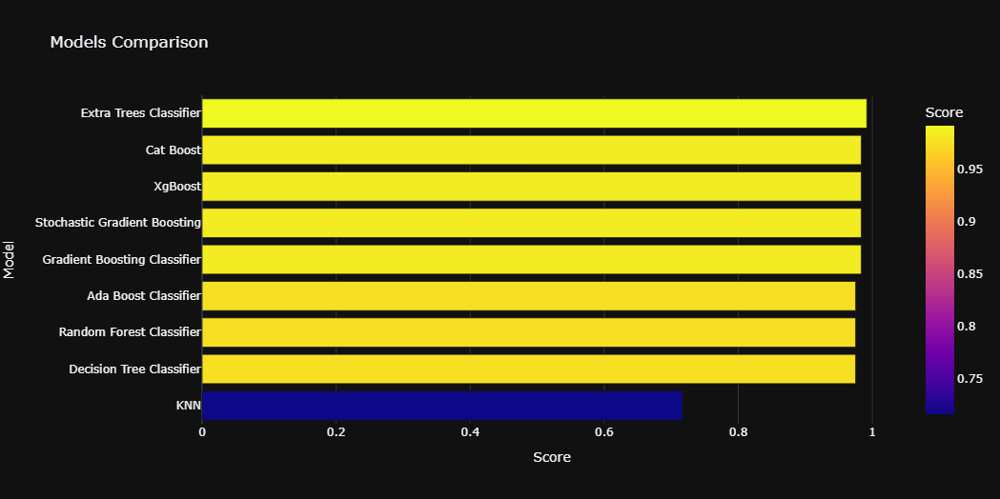

# Chronic_Kidney_Disease_Prediction_(98%_Accuracy)


## 0. Table of Contents
* EDA
* Data Pre Processing
* Feature Encoding
* 
* Model Building
* * Knn
* * Decision Tree Classifier
* * Random Forest Classifier
* * Ada Boost Classifier
* * Gradient Boosting Classifier
* * Stochastic Gradient Boosting (SGB)
* * XgBoost
* * Cat Boost Classifier
* * Extra Trees Classifier
* * LGBM Classifier
* 
* Models Comparison

## 导入包

下面这段代码包含了一些用于数据操作和可视化的Python库的导入语句，以及一些环境配置的设置。以下是对每行代码的详细中文注释：

```python
# 导入pandas库，并使用别名pd。Pandas是一个强大的数据结构和数据分析工具，提供了DataFrame等数据结构。
import pandas as pd

# 导入numpy库，并使用别名np。Numpy是用于进行科学计算的库，提供了多维数组对象和一系列处理数组的函数。
import numpy as np

# 导入matplotlib.pyplot模块，并使用别名plt。这个模块是matplotlib库的一部分，提供了MATLAB风格的绘图接口。
import matplotlib.pyplot as plt

# 导入seaborn库，并使用别名sns。Seaborn是基于matplotlib的高级数据可视化库，提供了更多样化的绘图风格和接口。
import seaborn as sns

# 导入plotly.express模块，使用别名px。Plotly是一个交互式图表库，plotly.express是其快速绘图的接口。
import plotly.express as px

# 导入warnings模块，用于控制警告信息的显示。
import warnings

# 使用filterwarnings函数忽略所有的警告信息。这可以在开发过程中减少不必要的警告信息的干扰。
warnings.filterwarnings('ignore')

# 使用plt.style.use函数设置绘图风格为'fivethirtyeight'，这是基于FiveThirtyEight新闻网站风格的绘图风格。
plt.style.use('fivethirtyeight')

# 使用%matplotlib inline魔法命令，这通常在Jupyter Notebook中使用，用于在Notebook内部直接显示matplotlib生成的图表。
%matplotlib inline

# 设置pandas的显示选项，使得DataFrame可以显示更多的列。这里设置为最多显示26列。
pd.set_option('display.max_columns', 26)
```

执行这段代码后，Python环境将配置好用于数据分析和可视化所需的库和风格。这对于后续的数据操作、统计分析和数据可视化非常有用。特别是在Jupyter Notebook中，这些设置可以提高工作效率，使得数据探索和结果展示更加直观和美观。


下面这段代码用于加载存储在CSV文件中的肾脏疾病数据集，并显示数据集的前几行。以下是对每行代码的详细中文注释：

```python
# 加载数据

# 使用pandas库的read_csv函数读取位于'../input/ckdisease/'路径下的'kidney_disease.csv'文件，并将其内容存储到DataFrame对象df中。
# '../input/ckdisease/'是文件的存放路径，可能是相对于当前工作目录的上级目录中的'input'文件夹下的'ckdisease'文件夹。
# 'kidney_disease.csv'是包含肾脏疾病数据的CSV文件名。
df = pd.read_csv('../input/ckdisease/kidney_disease.csv')

# 调用DataFrame对象df的head方法，显示其前五行数据。
# head方法默认显示前五行，但如果需要可以传入一个参数指定显示的行数。
# 这通常用于快速查看数据集的结构和前几行的样本数据，以便于进行初步的数据探索。
df.head()
```

执行这段代码后，会在Python环境中输出名为`df`的DataFrame的前五行数据。这有助于用户了解肾脏疾病数据集的基本信息，例如数据列的名称、数据类型、缺失值情况等。在数据分析和机器学习的前期阶段，这种快速的数据预览是非常重要的，因为它可以帮助用户确定后续数据处理和分析的方向。


下面这行代码用于获取DataFrame `df`的维度信息。以下是对这行代码的详细中文注释：

```python
# 获取DataFrame df的行数和列数。
# df.shape是一个属性，返回一个元组，其中第一个元素是行数（即DataFrame中的行数），第二个元素是列数（即DataFrame中的列数）。
# 这可以帮助用户了解数据集的大小，即有多少个样本和特征。
df.shape
```

执行这段代码后，会在Python环境中输出一个元组，其中包含两个整数值。第一个值表示数据集中的样本数量（通常称为观测数），第二个值表示数据集中的特征数量（通常称为变量数或列数）。这个信息对于理解数据集的规模和结构非常重要，特别是在进行数据分析和机器学习任务时，了解数据集的大小可以帮助决定适当的数据处理方法和模型选择。


```python
(400, 26)
```

执行`df.shape`后得到的结果是`(400, 26)`，这表示DataFrame `df`包含400行和26列。以下是对这个结果的分析：

1. **行数（400）**：这意味着数据集中有400个观测记录，或者可以理解为有400个个体或实例的数据。每一行代表一个观测，例如可能是一个病人的医疗记录、一项实验的观测结果或者一个时间序列的数据点。

2. **列数（26）**：这意味着数据集中共有26个特征或变量。每一列代表一个特定的属性或度量，例如可能包括年龄、性别、血压、血糖水平等医疗指标，或者是与研究主题相关的其他类型的数据。

这个结果提供了数据集的基本维度信息，有助于我们了解数据集的规模。在数据分析和机器学习的上下文中，了解数据集的大小对于确定分析方法、设计特征工程策略、选择合适的模型以及评估模型性能都是非常重要的。例如，如果数据集较小，我们可能需要更谨慎地选择特征以避免过拟合；如果特征数量较多，我们可能需要进行特征选择或降维处理以提高模型的效率和性能。


下面这段代码用于从DataFrame `df`中删除名为`id`的列，并更新原始DataFrame。以下是对这行代码的详细中文注释：

```python
# 删除id列

# 使用DataFrame的drop方法从df中删除名为'id'的列。
# 'id'是列名，它是我们希望从数据集中移除的列的标识符。
# axis=1指定了要删除的轴向，1代表列（axis=0代表行）。
# inplace=True意味着更改将直接应用到原始的DataFrame上，而不是创建一个新的DataFrame副本。
# 如果inplace设置为False（默认值），则drop操作会返回一个新的DataFrame，而原始的df不会改变。
df.drop('id', axis=1, inplace=True)
```

执行这段代码后，`df`中的`id`列将被删除，且这个更改会直接作用于原始的DataFrame。这种操作在数据分析中很常见，尤其是在预处理阶段，当我们认为某些列对于分析或建模没有帮助或者有隐私风险时，我们会选择删除这些列。在这个例子中，可能是因为`id`列是一个唯一标识符，对于数据分析和机器学习任务没有实际用途，因此选择将其移除。需要注意的是，`inplace=True`参数确保了更改是永久性的，因此在执行这一操作前应确保这是我们想要的结果。


下面这段代码用于将DataFrame `df`中的列名重命名为更友好、更易于理解的名称。以下是对这行代码的详细中文注释：

```python
# 重命名列名，使其更加用户友好

# 将df的列名重新赋值为新的列名列表。
# 这个列表包含了所有的新列名，顺序需要与原始DataFrame中的列顺序相匹配。
# 例如，原始DataFrame中的第一列将被重命名为'age'，第二列将被重命名为'blood_pressure'，以此类推。
# 这样的重命名有助于清晰地识别每一列数据的含义，便于后续的数据分析和模型构建。
df.columns = ['age', 'blood_pressure', 'specific_gravity', 'albumin', 'sugar', 'red_blood_cells', 'pus_cell',
              'pus_cell_clumps', 'bacteria', 'blood_glucose_random', 'blood_urea', 'serum_creatinine', 'sodium',
              'potassium', 'haemoglobin', 'packed_cell_volume', 'white_blood_cell_count', 'red_blood_cell_count',
              'hypertension', 'diabetes_mellitus', 'coronary_artery_disease', 'appetite', 'peda_edema',
              'aanemia', 'class']
```

执行这段代码后，`df`中的每个列将被赋予一个新的名称，这些名称更加直观地描述了每一列数据的特征。例如，`blood_pressure`列可能包含了血压的测量值，`diabetes_mellitus`列可能标识了是否患有糖尿病等。这种重命名操作是数据预处理的一个重要步骤，它有助于提高数据集的可读性，使得数据集的结构和内容更容易被理解和使用。在进行数据分析、数据可视化或构建机器学习模型时，清晰的列名可以帮助分析师和开发者更快地理解和处理数据。


```python
df.head()
```


下面这行代码用于生成DataFrame `df`的描述性统计摘要。以下是对这行代码的详细中文注释：

```python
# 生成DataFrame df的描述性统计摘要。

# 使用DataFrame的describe方法来获取数据的统计概览。
# describe方法默认计算数值型列的统计信息，包括均值、标准差、最小值、25%分位数、中位数、75%分位数和最大值。
# 这有助于快速了解数据的分布情况，例如中心趋势、离散程度和潜在的异常值。
df.describe()
```

执行这段代码后，会在Python环境中输出一个表格，其中包含了DataFrame中每个数值型列的描述性统计信息。这个摘要对于初步了解数据特征非常有用，可以帮助用户识别数据的集中趋势、变异性以及可能的异常值。例如，均值提供了数据的平均水平，标准差反映了数据的离散程度，而最大值和最小值可以帮助识别数据的范围和可能的异常值。这些统计信息是数据分析和机器学习任务中不可或缺的一部分，它们为数据清洗、特征工程和模型训练提供了重要的参考依据。


下面执行`df.describe()`后得到的结果显示了数据集中数值型列的描述性统计摘要。以下是对结果的详细分析：

1. **年龄（age）**:
   - `count`: 有391个有效数据点。
   - `mean`: 平均年龄为51.48岁。
   - `std`: 标准差为17.17岁，表明年龄分布有一定的离散程度。
   - `min`: 最小年龄为2岁，这可能是输入错误或特殊情况。
   - `25%`: 25%的个体年龄在42岁以下。
   - `50%`: 中位数年龄为55岁。
   - `75%`: 75%的个体年龄在64.5岁以下。
   - `max`: 最大年龄为90岁。

2. **血压（blood_pressure）**:
   - `count`: 有388个有效数据点。
   - `mean`: 平均血压为76.47 mmHg。
   - `std`: 标准差为13.68 mmHg，表明血压值有一定的波动。
   - `min`: 最低血压为50 mmHg。
   - `25%`: 25%的个体血压在70 mmHg以下。
   - `50%`: 中位数血压为80 mmHg。
   - `75%`: 75%的个体血压在80 mmHg以下。
   - `max`: 最高血压为180 mmHg，这可能表明有高血压的情况。

3. **比重（specific_gravity）**:
   - `count`: 有353个有效数据点。
   - `mean`: 平均比重为1.0174。
   - `std`: 标准差为0.00572，比重的分布相对集中。
   - `min`: 最低比重为1.005。
   - `25%`: 25%的个体比重在1.01以下。
   - `50%`: 中位数比重为1.02。
   - `75%`: 75%的个体比重在1.02以下。
   - `max`: 最大比重为1.025。

4. **白蛋白（albumin）**:
   - `count`: 有354个有效数据点。
   - `mean`: 平均白蛋白水平为1.0169。
   - `std`: 标准差为1.3527，白蛋白水平的分布较为分散。
   - `min`: 最低白蛋白水平为0，这可能是由于测量误差或病理状态。
   - `25%`: 25%的个体白蛋白水平在0以下。
   - `50%`: 中位数白蛋白水平为1.017。
   - `75%: 75%的个体白蛋白水平在2以下。
   - `max`: 最高白蛋白水平为5，这可能是由于测量误差或病理状态。

其他列（如血糖、尿素、肌酐等）也提供了类似的统计信息，可以帮助我们了解数据的分布情况。这些统计摘要对于初步了解数据特征、识别异常值和进行后续的数据分析非常重要。例如，血压和白蛋白的分布可能需要进一步的医学解释，因为它们的异常值可能与健康状况有关。此外，数据的缺失情况（如某些列的`count`值小于总样本数）也需要关注，因为它们可能影响分析结果的准确性。


下面这行代码用于获取DataFrame `df`的详细内容信息，包括每列的数据类型、非空值的数量以及内存使用情况。以下是对这行代码的详细中文注释：

```python
# 获取DataFrame df的详细内容信息。

# 使用DataFrame的info方法输出数据集的详细报告。
# info方法提供了关于DataFrame的有用信息，如每列的名称、非空值计数、数据类型以及每列的内存使用情况。
# 这个报告对于理解数据集的结构和内容非常有用，特别是在进行数据清洗和预处理时。
df.info()
```

执行这段代码后，会在Python环境中输出DataFrame `df`的详细内容信息。输出结果通常包括以下几个部分：

1. **列名**：每列的名称。
2. **非空值计数**：每列中非空（即有效）值的数量。
3. **数据类型**：每列的数据类型，例如整数（int64）、浮点数（float64）或对象（object，通常指字符串）。
4. **内存使用情况**：DataFrame使用的内存量，通常以字节为单位。

这个信息对于数据分析师和数据科学家来说非常重要，因为它可以帮助他们了解数据集的完整性、数据类型是否正确以及是否存在潜在的内存使用问题。例如，如果某列的数据类型不是预期的类型，可能需要进行数据类型转换。如果某列有很多缺失值，可能需要进一步的数据清洗或分析来确定缺失值的处理策略。此外，了解内存使用情况有助于在处理大型数据集时优化资源分配和提高计算效率。

```python
<class 'pandas.core.frame.DataFrame'>
RangeIndex: 400 entries, 0 to 399
Data columns (total 25 columns):
 #   Column                   Non-Null Count  Dtype  
---  ------                   --------------  -----  
 0   age                      391 non-null    float64
 1   blood_pressure           388 non-null    float64
 2   specific_gravity         353 non-null    float64
 3   albumin                  354 non-null    float64
 4   sugar                    351 non-null    float64
 5   red_blood_cells          248 non-null    object 
 6   pus_cell                 335 non-null    object 
 7   pus_cell_clumps          396 non-null    object 
 8   bacteria                 396 non-null    object 
 9   blood_glucose_random     356 non-null    float64
 10  blood_urea               381 non-null    float64
 11  serum_creatinine         383 non-null    float64
 12  sodium                   313 non-null    float64
 13  potassium                312 non-null    float64
 14  haemoglobin              348 non-null    float64
 15  packed_cell_volume       330 non-null    object 
 16  white_blood_cell_count   295 non-null    object 
 17  red_blood_cell_count     270 non-null    object 
 18  hypertension             398 non-null    object 
 19  diabetes_mellitus        398 non-null    object 
 20  coronary_artery_disease  398 non-null    object 
 21  appetite                 399 non-null    object 
 22  peda_edema               399 non-null    object 
 23  aanemia                  399 non-null    object 
 24  class                    400 non-null    object 
dtypes: float64(11), object(14)
memory usage: 78.2+ KB
```


执行`df.info()`后得到的结果显示了DataFrame `df`的结构和内容信息。以下是对结果的详细分析：

1. **DataFrame 类型**:
   - `<class 'pandas.core.frame.DataFrame'>`: 表明`df`是一个Pandas的DataFrame对象。

2. **索引范围**:
   - `RangeIndex: 400 entries, 0 to 399`: 表明DataFrame有400个条目，索引从0到399。

3. **数据列信息**:
   - 总共有25列数据。
   - 每列的名称、非空值的数量和数据类型都被列出。

4. **非空值计数和数据类型**:
   - `age`列有391个非空值，数据类型为`float64`。
   - `blood_pressure`列有388个非空值，数据类型为`float64`。
   - `specific_gravity`列有353个非空值，数据类型为`float64`。
   - `albumin`列有354个非空值，数据类型为`float64`。
   - `sugar`列有351个非空值，数据类型为`float64`。
   - `red_blood_cells`列有248个非空值，数据类型为`object`（通常指字符串）。
   - `pus_cell`列有335个非空值，数据类型为`object`。
   - `pus_cell_clumps`列有396个非空值，数据类型为`object`。
   - `bacteria`列有396个非空值，数据类型为`object`。
   - 其他列的数据信息以此类推。

5. **数据类型统计**:
   - `dtypes: float64(11), object(14)`: 表明有11列的数据类型是`float64`，14列的数据类型是`object`。

6. **内存使用情况**:
   - `memory usage: 78.2+ KB`: 表明DataFrame使用的内存量约为78.2KB。

从这个分析中，我们可以了解到数据集中存在一些缺失值，特别是`red_blood_cells`、`pus_cell`、`serum_creatinine`等列，它们的非空值数量少于总样本数。这可能意味着需要进一步的数据清洗工作，例如填充缺失值或删除含有缺失值的行。此外，大部分数值型数据使用`float64`类型，而一些可能是分类变量的数据使用`object`类型，这可能需要进一步的数据类型转换或处理。最后，内存使用情况显示数据集不是特别大，应该不会对大多数现代计算机的内存造成压力。


As we can see that 'packed_cell_volume', 'white_blood_cell_count' and 'red_blood_cell_count' are object type. We need to change them to numerical dtype.


下面这段代码用于将DataFrame `df`中的某些列转换为数值型数据，如果转换过程中遇到无法转换为数值的值，则将其设置为NaN。以下是对每行代码的详细中文注释：

```python
# 将必要的列转换为数值型

# 使用pd.to_numeric函数尝试将'packed_cell_volume'列转换为数值型。
# 如果在转换过程中遇到无法转换为数值的值，则使用errors='coerce'参数将这些值设置为NaN。
# 转换后的数值型数据将替换原来的'packed_cell_volume'列。
df['packed_cell_volume'] = pd.to_numeric(df['packed_cell_volume'], errors='coerce')

# 使用pd.to_numeric函数尝试将'white_blood_cell_count'列转换为数值型。
# 同样的，如果转换过程中遇到无法转换的值，则使用errors='coerce'参数将这些值设置为NaN。
# 转换后的数值型数据将替换原来的'white_blood_cell_count'列。
df['white_blood_cell_count'] = pd.to_numeric(df['white_blood_cell_count'], errors='coerce')

# 使用pd.to_numeric函数尝试将'red_blood_cell_count'列转换为数值型。
# 遇到无法转换的值时，同样使用errors='coerce'参数将这些值设置为NaN。
# 转换后的数值型数据将替换原来的'red_blood_cell_count'列。
df['red_blood_cell_count'] = pd.to_numeric(df['red_blood_cell_count'], errors='coerce')
```

执行这段代码后，`df`中的`packed_cell_volume`、`white_blood_cell_count`和`red_blood_cell_count`列将被转换为数值型数据。如果这些列中原本包含非数值型的文本（例如“高”、“低”或其他描述性文本），使用`errors='coerce'`参数可以确保这些无法转换的值被设置为NaN，而不是引发错误。这样的处理对于数据清洗和后续的数据分析非常重要，因为数值型数据是进行数学计算和统计分析的基础。同时，将无法转换的值设置为NaN也有助于后续进一步处理这些缺失值，例如通过填充或删除含有缺失值的记录。


下面这行代码用于获取DataFrame `df`的详细内容信息，包括每列的数据类型、非空值的数量以及内存使用情况。以下是对这行代码的详细中文注释：

```python
# 获取DataFrame df的详细内容信息。

# 使用DataFrame的info方法输出数据集的详细报告。
# info方法提供了关于DataFrame的有用信息，如每列的名称、非空值计数、数据类型以及每列的内存使用情况。
# 这个报告对于理解数据集的结构和内容非常有用，特别是在进行数据清洗和预处理时。
df.info()
```

执行这段代码后，会在Python环境中输出DataFrame `df`的详细内容信息。输出结果通常包括以下几个部分：

1. **列名**：每列的名称。
2. **非空值计数**：每列中非空（即有效）值的数量。
3. **数据类型**：每列的数据类型，例如整数（int64）、浮点数（float64）或对象（object，通常指字符串）。
4. **内存使用情况**：DataFrame使用的内存量，通常以字节为单位。

这个信息对于数据分析师和数据科学家来说非常重要，因为它可以帮助他们了解数据集的完整性、数据类型是否正确以及是否存在潜在的内存使用问题。例如，如果某列的数据类型不是预期的类型，可能需要进行数据类型转换。如果某列有很多缺失值，可能需要进一步的数据清洗或分析来确定缺失值的处理策略。此外，了解内存使用情况有助于在处理大型数据集时优化资源分配和提高计算效率。


```python
<class 'pandas.core.frame.DataFrame'>
RangeIndex: 400 entries, 0 to 399
Data columns (total 25 columns):
 #   Column                   Non-Null Count  Dtype  
---  ------                   --------------  -----  
 0   age                      391 non-null    float64
 1   blood_pressure           388 non-null    float64
 2   specific_gravity         353 non-null    float64
 3   albumin                  354 non-null    float64
 4   sugar                    351 non-null    float64
 5   red_blood_cells          248 non-null    object 
 6   pus_cell                 335 non-null    object 
 7   pus_cell_clumps          396 non-null    object 
 8   bacteria                 396 non-null    object 
 9   blood_glucose_random     356 non-null    float64
 10  blood_urea               381 non-null    float64
 11  serum_creatinine         383 non-null    float64
 12  sodium                   313 non-null    float64
 13  potassium                312 non-null    float64
 14  haemoglobin              348 non-null    float64
 15  packed_cell_volume       329 non-null    float64
 16  white_blood_cell_count   294 non-null    float64
 17  red_blood_cell_count     269 non-null    float64
 18  hypertension             398 non-null    object 
 19  diabetes_mellitus        398 non-null    object 
 20  coronary_artery_disease  398 non-null    object 
 21  appetite                 399 non-null    object 
 22  peda_edema               399 non-null    object 
 23  aanemia                  399 non-null    object 
 24  class                    400 non-null    object 
dtypes: float64(14), object(11)
memory usage: 78.2+ KB
```


下面执行`df.info()`后得到的结果显示了DataFrame `df`的结构和内容信息。以下是对结果的详细分析：

1. **DataFrame 类型**:
   - `<class 'pandas.core.frame.DataFrame'>`: 表明`df`是一个Pandas的DataFrame对象。

2. **索引范围**:
   - `RangeIndex: 400 entries, 0 to 399`: 表明DataFrame有400个条目，索引从0到399。

3. **数据列信息**:
   - 总共有25列数据。
   - 每列的名称、非空值的数量和数据类型都被列出。

4. **非空值计数和数据类型**:
   - `age`列有391个非空值，数据类型为`float64`。
   - `blood_pressure`列有388个非空值，数据类型为`float64`。
   - `specific_gravity`列有353个非空值，数据类型为`float64`。
   - `albumin`列有354个非空值，数据类型为`float64`。
   - `sugar`列有351个非空值，数据类型为`float64`。
   - `red_blood_cells`列有248个非空值，数据类型为`object`（通常指字符串）。
   - `pus_cell`列有335个非空值，数据类型为`object`。
   - `pus_cell_clumps`列有396个非空值，数据类型为`object`。
   - `bacteria`列有396个非空值，数据类型为`object`。
   - `blood_glucose_random`列有356个非空值，数据类型为`float64`。
   - `blood_urea`列有381个非空值，数据类型为`float64`。
   - `serum_creatinine`列有383个非空值，数据类型为`float64`。
   - `sodium`列有313个非空值，数据类型为`float64`。
   - `potassium`列有312个非空值，数据类型为`float64`。
   - `haemoglobin`列有348个非空值，数据类型为`float64`。
   - `packed_cell_volume`列有329个非空值，数据类型转换为`float64`。
   - `white_blood_cell_count`列有294个非空值，数据类型转换为`float64`。
   - `red_blood_cell_count`列有269个非空值，数据类型转换为`float64`。
   - 其他几列的数据信息以此类推。

5. **数据类型统计**:
   - `dtypes: float64(14), object(11)`: 表明有14列的数据类型是`float64`，11列的数据类型是`object`。

6. **内存使用情况**:
   - `memory usage: 78.2+ KB`: 表明DataFrame使用的内存量约为78.2KB。

从这个分析中，我们可以了解到数据集中存在一些缺失值，特别是`red_blood_cells`、`pus_cell`、`serum_creatinine`等列，它们的非空值数量少于总样本数。这可能意味着需要进一步的数据清洗工作，例如填充缺失值或删除含有缺失值的行。此外，大部分数值型数据使用`float64`类型，而一些可能是分类变量的数据使用`object`类型，这可能需要进一步的数据类型转换或处理。最后，内存使用情况显示数据集不是特别大，应该不会对大多数现代计算机的内存造成压力。


下面这段代码使用列表推导式来从DataFrame `df`中提取分类（categorical）列和数值（numerical）列的名称。以下是对每行代码的详细中文注释：

```python
# 提取分类和数值列

# 使用列表推导式创建一个名为cat_cols的新列表。
# 遍历df中的所有列，检查每一列的数据类型。
# 如果某一列的数据类型为'object'（通常表示字符串类型），则将该列的名称添加到cat_cols列表中。
cat_cols = [col for col in df.columns if df[col].dtype == 'object']

# 使用列表推导式创建一个名为num_cols的新列表。
# 遍历df中的所有列，检查每一列的数据类型。
# 如果某一列的数据类型不是'object'（即数值类型，如int64或float64），则将该列的名称添加到num_cols列表中。
num_cols = [col for col in df.columns if df[col].dtype != 'object']
```

执行这段代码后，`cat_cols`列表将包含DataFrame `df`中所有分类列的名称，而`num_cols`列表将包含所有数值列的名称。这种区分对于数据分析和机器学习任务非常重要，因为分类数据和数值数据通常需要不同的处理方法。例如，分类数据可能需要进行编码（如独热编码或标签编码），而数值数据可能需要进行标准化或归一化。通过将列分为两类，我们可以更有针对性地对数据进行预处理和分析。


下面这段代码用于遍历DataFrame `df`中的分类列，并打印每个分类列的唯一值数量。以下是对每行代码的详细中文注释：

```python
# 查看分类列中的唯一值

# 使用for循环遍历cat_cols列表中的每个元素，即DataFrame df的分类列。
for col in cat_cols:
    # 使用f-string格式化字符串，打印当前遍历到的列名col和该列中所有唯一值的列表。
    # df[col]访问DataFrame df中的列col，并使用.unique()方法获取该列的所有唯一值。
    # 打印的结果将展示每个分类列的名称以及它包含的独特值的数量。
    print(f"{col} has {df[col].unique()} values\n")
```

执行这段代码后，将在Python环境中逐行输出每个分类列的名称和该列中包含的唯一值的列表。这有助于了解分类数据的多样性和分布情况，例如，如果一个分类列包含很多唯一值，这可能意味着该特征在数据中具有较高的区分度。相反，如果一个分类列的唯一值数量较少，这可能表明该特征在区分不同样本时的作用有限。在数据分析和机器学习中，了解分类特征的唯一值数量对于特征选择和模型构建是非常重要的。

```python
red_blood_cells has [nan 'normal' 'abnormal'] values

pus_cell has ['normal' 'abnormal' nan] values

pus_cell_clumps has ['notpresent' 'present' nan] values

bacteria has ['notpresent' 'present' nan] values

hypertension has ['yes' 'no' nan] values

diabetes_mellitus has ['yes' 'no' ' yes' '\tno' '\tyes' nan] values

coronary_artery_disease has ['no' 'yes' '\tno' nan] values

appetite has ['good' 'poor' nan] values

peda_edema has ['no' 'yes' nan] values

aanemia has ['no' 'yes' nan] values

class has ['ckd' 'ckd\t' 'notckd'] values
```

执行上述代码后，我们得到了DataFrame `df`中分类列的唯一值列表。以下是对结果的详细分析：

1. **red_blood_cells**:
   - 包含3个唯一值：`nan`、`normal`和`abnormal`。这表明红细胞检查结果有缺失值（`nan`），以及正常和异常两种状态。

2. **pus_cell**:
   - 包含3个唯一值：`normal`、`abnormal`和`nan`。这表示脓细胞检查结果也有缺失值。

3. **pus_cell_clumps**:
   - 包含3个唯一值：`notpresent`、`present`和`nan`。这表示脓细胞团检查结果中有缺失值，以及存在和不存在两种状态。

4. **bacteria**:
   - 包含3个唯一值：`notpresent`、`present`和`nan`。这表示细菌检查结果中有缺失值，以及存在和不存在两种状态。

5. **hypertension**:
   - 包含3个唯一值：`yes`、`no`和`nan`。这表示高血压状态中有缺失值，以及有和无高血压两种状态。

6. **diabetes_mellitus**:
   - 包含多个唯一值：`yes`、`no`、`nan`、`\tno`和`\tyes`。这表示糖尿病状态中有缺失值，以及有和无糖尿病两种状态。注意，`\tno`和`\tyes`可能是由于数据输入时的格式问题导致的，可能需要进一步的清理。

7. **coronary_artery_disease**:
   - 包含4个唯一值：`no`、`yes`、`\tno`和`nan`。这表示冠状动脉疾病状态中有缺失值，以及有和无冠状动脉疾病两种状态。

8. **appetite**:
   - 包含3个唯一值：`good`、`poor`和`nan`。这表示食欲状态中有缺失值，以及良好和差两种状态。

9. **peda_edema**:
   - 包含3个唯一值：`no`、`yes`和`nan`。这表示脚部水肿状态中有缺失值，以及有和无脚部水肿两种状态。

10. **aanemia**:
    - 包含3个唯一值：`no`、`yes`和`nan`。这表示贫血状态中有缺失值，以及有和无贫血两种状态。

11. **class**:
    - 包含3个唯一值：`ckd`、`ckd\t`和`notckd`。这表示肾脏疾病分类中有慢性肾脏病（CKD）和非CKD两种状态。注意，`ckd\t`可能是由于数据输入时的格式问题导致的，可能需要进一步的清理。

从这些结果可以看出，数据集中的分类特征存在缺失值（`nan`），这可能需要进一步的数据清洗，例如通过填充缺失值或删除含有缺失值的记录。此外，一些列中的字符串值可能包含额外的空白字符（如`\t`），这也可能需要清理。了解这些唯一值对于后续的数据预处理和特征工程非常重要。


There is some ambugity present in the columns we have to remove that.


下面这段代码用于替换DataFrame `df`中某些列中的不正确或不一致的值。以下是对每行代码的详细中文注释：

```python
# 替换不正确的值

# 使用replace方法替换'diabetes_mellitus'列中的特定值。
# to_replace字典包含了要被替换的值和对应的新值。
# {'\tno':'no', '\tyes':'yes', ' yes':'yes'}表示将带有额外制表符的'no'和'yes'以及带有多余空格的'yes'替换为正确的形式。
# inplace=True参数表示直接在原始DataFrame上进行替换，而不是创建一个新的DataFrame。
df['diabetes_mellitus'].replace(to_replace={'\tno':'no', '\tyes':'yes', ' yes':'yes'}, inplace=True)

# 使用replace方法替换'coronary_artery_disease'列中的特定值。
# to_replace参数指定了要被替换的值，这里是'\tno'。
# value参数指定了新值，这里是'no'。
# 这个操作将所有的'\tno'替换为'no'，移除了值前的额外制表符。
df['coronary_artery_disease'] = df['coronary_artery_disease'].replace(to_replace='\tno', value='no')

# 使用replace方法替换'class'列中的特定值。
# to_replace字典包含了要被替换的值和对应的新值。
# {'ckd\t': 'ckd', 'notckd': 'not ckd'}表示将带有额外制表符的'ckd'替换为没有制表符的'ckd'，并将'notckd'替换为'not ckd'。
# 这个操作旨在统一列中的值，使其更加一致。
df['class'] = df['class'].replace(to_replace={'ckd\t': 'ckd', 'notckd': 'not ckd'})
```

执行这段代码后，`df`中的`diabetes_mellitus`、`coronary_artery_disease`和`class`列将被更新，所有指定的不正确或不一致的值都将被替换为新的值。这种数据清洗步骤对于确保数据质量和后续分析的准确性非常重要。在机器学习和数据分析中，处理这类数据问题是一个常见的预处理步骤，它有助于提高模型的性能和解释性。


下面这段代码用于将DataFrame `df`中的`class`列中的分类标签转换为数值型数据，并处理可能的转换错误。以下是对每行代码的详细中文注释：

```python
# 将'class'列中的分类标签映射为数值型数据

# 使用map函数将'ckd'映射为0，将'not ckd'映射为1。
# 这样，原本的分类标签就被转换成了数值型数据，便于进行数值计算和机器学习模型的训练。
df['class'] = df['class'].map({'ckd': 0, 'not ckd': 1})

# 使用pd.to_numeric函数尝试将'class'列转换为数值型。
# 如果在转换过程中遇到无法转换为数值的值，则使用errors='coerce'参数将这些值设置为NaN。
# 这个步骤确保了所有的值都是数值型，即使是在之前的映射过程中可能出现的任何非预期的值。
df['class'] = pd.to_numeric(df['class'], errors='coerce')
```

执行这段代码后，`df`中的`class`列将完全由数值型数据组成，其中`ckd`被转换为0，`not ckd`被转换为1。如果`map`操作后存在任何非预期的值，`pd.to_numeric`将确保这些值被处理为NaN，从而避免了潜在的数据错误。这种转换是数据预处理中的常见步骤，特别是在准备数据用于机器学习模型训练时，因为大多数模型都需要数值型特征。


下面这段代码用于遍历指定的列，并打印每个列的唯一值列表。以下是对每行代码的详细中文注释：

```python
# 定义一个包含特定列名的列表cols。
cols = ['diabetes_mellitus', 'coronary_artery_disease', 'class']

# 使用for循环遍历cols列表中的每个元素，即指定的列名。
for col in cols:
    # 使用f-string格式化字符串，打印当前遍历到的列名col和该列中所有唯一值的列表。
    # df[col]访问DataFrame df中的列col，并使用.unique()方法获取该列的所有唯一值。
    # 打印的结果将展示每个指定列的名称以及它包含的独特值的数量。
    print(f"{col} has {df[col].unique()} values\n")
```

执行这段代码后，将在Python环境中逐行输出`diabetes_mellitus`、`coronary_artery_disease`和`class`这三个列的名称和每个列中包含的唯一值的列表。这有助于确认之前的数据清洗和转换操作是否成功，以及每个分类列中值的分布情况。了解每个分类列的唯一值对于后续的数据预处理、特征工程和模型训练是非常重要的。


```python
diabetes_mellitus has ['yes' 'no' nan] values

coronary_artery_disease has ['no' 'yes' nan] values

class has [0 1] values
```

执行上述代码后，我们得到了DataFrame `df`中指定分类列的唯一值列表。以下是对结果的详细分析：

1. **diabetes_mellitus**:
   - 包含3个唯一值：`'yes'`、`'no'`和`nan`。这表明糖尿病状态列中有两种疾病状态（有糖尿病和无糖尿病），以及一些缺失值（`nan`）。

2. **coronary_artery_disease**:
   - 包含3个唯一值：`'no'`、`'yes'`和`nan`。这表示冠状动脉疾病状态列中有两种疾病状态（有冠状动脉疾病和无冠状动脉疾病），以及一些缺失值（`nan`）。

3. **class**:
   - 包含2个唯一值：`0`和`1`。这表示肾脏疾病分类列已经被转换为数值型数据，其中`0`可能代表“无慢性肾脏病”（not ckd），`1`代表“有慢性肾脏病”（ckd）。没有出现`nan`值，这意味着之前的转换操作已经成功地将所有的分类标签映射为了数值型数据。

从这些结果可以看出，数据集中的分类特征已经通过之前的清洗和转换步骤被处理为了更加一致和数值型的形式。这种处理使得数据集准备好了进行后续的数据分析和机器学习任务。然而，仍然存在一些缺失值（`nan`），这可能需要进一步的处理，例如通过填充缺失值或删除含有缺失值的记录。在进行模型训练之前，确保数据的完整性是非常重要的。


下面这段代码用于创建一个图形，其中包含DataFrame `df`中数值型特征的分布图。以下是对每行代码的详细中文注释：

```python
# 检查数值型特征的分布情况

# 创建一个新的图形对象，并设置图形的大小为宽20英寸、高15英寸。
plt.figure(figsize=(20, 15))

# 初始化一个名为plotnumber的变量，用于跟踪当前的子图位置。
plotnumber = 1

# 遍历num_cols列表中的每个元素，即DataFrame df的数值型列。
for column in num_cols:
    # 如果plotnumber小于或等于14，意味着我们为前14个数值型特征创建分布图。
    # 这是因为我们通常在一张图中展示多个分布图，这里假设只展示前14个特征。
    if plotnumber <= 14:
        # 使用subplot函数创建一个新的子图。
        # 3行5列的布局中，plotnumber指定了当前子图的位置。
        ax = plt.subplot(3, 5, plotnumber)
        
        # 使用Seaborn的distplot函数绘制指定列的分布图。
        sns.distplot(df[column])
        
        # 设置x轴标签为当前特征的列名。
        plt.xlabel(column)
        
    # 每次循环后，plotnumber增加1，以便在下一次迭代中创建新的子图。
    plotnumber += 1

# 使用tight_layout函数自动调整子图参数，使之填充整个图形区域并且子图之间没有重叠。
plt.tight_layout()

# 使用show函数显示图形。
plt.show()
```

执行这段代码后，会在Python环境中显示一个包含多个分布图的图形，每个分布图对应`df`中的一个数值型特征。这有助于了解数值型特征的分布情况，例如数据的集中趋势、离散程度以及是否存在异常值。通过可视化分布图，我们可以更容易地识别数据的特性，这对于数据预处理、特征选择和模型构建等后续步骤非常重要。


Skewness is present in some of the columns.


下面这段代码用于创建一个图形，其中包含DataFrame `df`中分类特征的计数图。以下是对每行代码的详细中文注释：

```python
# 查看分类特征

# 创建一个新的图形对象，并设置图形的大小为宽20英寸、高15英寸。
plt.figure(figsize=(20, 15))

# 初始化一个名为plotnumber的变量，用于跟踪当前的子图位置。
plotnumber = 1

# 遍历cat_cols列表中的每个元素，即DataFrame df的分类列。
for column in cat_cols:
    # 如果plotnumber小于或等于11，意味着我们为前11个分类特征创建计数图。
    # 这是因为我们通常在一张图中展示多个计数图，这里假设只展示前11个特征。
    if plotnumber <= 11:
        # 使用subplot函数创建一个新的子图。
        # 3行4列的布局中，plotnumber指定了当前子图的位置。
        ax = plt.subplot(3, 4, plotnumber)
        
        # 使用Seaborn的countplot函数绘制指定列的计数图。
        # palette='rocket'参数设置颜色映射方案，'rocket'是一种从紫色到红色的颜色渐变。
        sns.countplot(df[column], palette='rocket')
        
        # 设置x轴标签为当前特征的列名。
        plt.xlabel(column)
        
    # 每次循环后，plotnumber增加1，以便在下一次迭代中创建新的子图。
    plotnumber += 1

# 使用tight_layout函数自动调整子图参数，使之填充整个图形区域并且子图之间没有重叠。
plt.tight_layout()

# 使用show函数显示图形。
plt.show()
```

执行这段代码后，会在Python环境中显示一个包含多个计数图的图形，每个计数图对应`df`中的一个分类特征。这有助于了解分类特征的分布情况，例如每个类别的计数和相对频率。通过可视化计数图，我们可以更容易地识别数据中的模式，例如哪些类别出现得更频繁，以及是否存在某些类别的样本数量非常少。这对于数据预处理、特征选择和模型构建等后续步骤非常重要。


下面这段代码用于创建DataFrame `df`中数值型特征之间的相关性热图。以下是对每行代码的详细中文注释：

```python
# 创建数据的相关性热图

# 创建一个新的图形对象，并设置图形的大小为宽15英寸、高8英寸。
plt.figure(figsize=(15, 8))

# 使用Seaborn的heatmap函数绘制相关性矩阵的热图。
# df.corr()计算DataFrame中数值型列之间的相关系数矩阵。
# annot=True参数表示在热图的每个单元格内显示相关系数的数值。
# linewidths=2参数设置单元格之间线条的宽度。
# linecolor='lightgrey'参数设置线条的颜色。
sns.heatmap(df.corr(), annot=True, linewidths=2, linecolor='lightgrey')

# 使用show函数显示图形。
plt.show()
```

执行这段代码后，会在Python环境中显示一个热图，它展示了DataFrame `df`中数值型特征之间的相关性。热图中的每个单元格表示两个特征之间的相关系数，颜色的深浅表示相关性的强度，从浅到深的颜色通常表示从弱到强的相关性。相关系数的范围是-1到1，其中1表示完全正相关，-1表示完全负相关，0表示没有相关性。这个热图有助于理解数据特征之间的关系，对于特征选择和模型构建等后续步骤非常重要。通过观察热图，我们可以识别哪些特征之间存在强相关性，这可能意味着在模型中不需要所有这些特征，或者需要考虑多重共线性的问题。


下面这行代码用于获取DataFrame `df`的所有列名。以下是对这行代码的详细中文注释：

```python
# 获取DataFrame df的所有列名

# df.columns是一个属性，它返回一个包含DataFrame中所有列名的Index对象。
# 这个Index对象可以用于迭代，以获取每个列的名称。
df.columns
```

执行这段代码后，会在Python环境中返回一个包含DataFrame `df`中所有列名的索引对象。这个信息有助于了解数据集的结构，包括有多少列、列的名称是什么，以及每一列可能代表的数据类型（例如，列名可能是描述性文本、度量值或者分类标签）。在数据分析和机器学习的上下文中，了解数据集的列结构是非常重要的第一步，它为后续的数据探索、特征工程和模型构建提供了基础。


```python
Index(['age', 'blood_pressure', 'specific_gravity', 'albumin', 'sugar',
       'red_blood_cells', 'pus_cell', 'pus_cell_clumps', 'bacteria',
       'blood_glucose_random', 'blood_urea', 'serum_creatinine', 'sodium',
       'potassium', 'haemoglobin', 'packed_cell_volume',
       'white_blood_cell_count', 'red_blood_cell_count', 'hypertension',
       'diabetes_mellitus', 'coronary_artery_disease', 'appetite',
       'peda_edema', 'aanemia', 'class'],
      dtype='object')
```


执行`df.columns`得到的结果是DataFrame `df`中所有列名的索引对象。以下是对结果的详细分析：

1. **列名列表**:
   - 包含了DataFrame `df`中的所有列名，例如`age`、`blood_pressure`、`specific_gravity`等。
   - 这些列名代表了数据集中的特征，每一列可能包含不同类型的数据，如数值型、分类型等。

2. **列名的多样性**:
   - 列名反映了数据集可能包含的各种医疗指标和病人状况，如血压(`blood_pressure`)、血糖(`blood_glucose_random`)、是否有糖尿病(`diabetes_mellitus`)等。

3. **数据类型**:
   - 结果中的`dtype='object'`表明列名是以对象类型存储的，这在Pandas中通常指的是字符串类型。
   - 这意味着列名是文本数据，而不是数值型数据。

4. **数据分析的准备**:
   - 了解列名对于数据分析非常重要，因为它帮助我们理解数据集的结构和内容。
   - 在数据预处理、特征选择、数据可视化和机器学习模型构建等步骤中，列名提供了关键的信息。

5. **后续操作**:
   - 根据列名，我们可以决定哪些列可能需要进一步的清洗或转换（如将分类型数据转换为数值型）。
   - 我们还可以基于列名选择特定的列进行分析，例如，如果我们只对数值型特征感兴趣，我们可以选择那些明显是数值型数据的列。

通过分析列名，我们可以对数据集有一个初步的了解，并为后续的数据处理和分析工作做好准备。


## 1. Exploratory Data Analysis (EDA)

下面这段代码定义了三个函数，用于创建不同类型的数据可视化图表。以下是对每行代码的详细中文注释：

```python
# 定义函数以创建图表

# 定义一个名为violin的函数，接受一个参数col。
# 这个函数用于创建小提琴图，它可以展示数据分布的同时，还能够显示出数据的中位数、四分位数和异常值。
def violin(col):
    # 创建一个Plotly表达式对象，用于绘制小提琴图。
    # df是数据源DataFrame，y=col指定小提琴图在y轴上展示的列，x="class"指定x轴的标签，color="class"表示根据'class'列的类别来着色。
    # box=True表示在小提琴图上方显示箱线图，template='plotly_dark'指定使用深色背景的模板。
    fig = px.violin(df, y=col, x="class", color="class", box=True, template='plotly_dark')
    # 调用show方法显示图表。
    return fig.show()

# 定义一个名为kde的函数，不接受参数。
# 这个函数用于创建核密度估计图（KDE），它可以展示数据的分布密度。
def kde(col):
    # 创建一个Seaborn的FacetGrid对象，用于绘制多个图表的网格。
    # df是数据源DataFrame，hue="class"表示根据'class'列的类别来着色。
    # height=6和aspect=2指定了每个图表的尺寸。
    grid = sns.FacetGrid(df, hue="class", height=6, aspect=2)
    # 使用grid.map方法在每个子图上应用kdeplot函数，绘制核密度估计图。
    # col指定了要在x轴上展示的列。
    grid.map(sns.kdeplot, col)
    # 添加图例。
    grid.add_legend()

# 定义一个名为scatter的函数，接受两个参数col1和col2。
# 这个函数用于创建散点图，它可以展示两个数值型特征之间的关系。
def scatter(col1, col2):
    # 创建一个Plotly表达式对象，用于绘制散点图。
    # df是数据源DataFrame，x=col1和y=col2分别指定x轴和y轴上展示的列。
    # color="class"表示根据'class'列的类别来着色，template='plotly_dark'指定使用深色背景的模板。
    fig = px.scatter(df, x=col1, y=col2, color="class", template='plotly_dark')
    # 调用show方法显示图表。
    return fig.show()
```

这些函数使得用户可以通过传递不同的参数来生成特定特征的图表，从而更好地理解数据的分布和特征之间的关系。例如，`violin`函数可以用于比较不同类别下某个数值型特征的分布情况；`kde`函数可以用于查看某个特征的分布密度；`scatter`函数可以用于探索两个数值型特征之间的关系。这些可视化工具在数据分析和机器学习中非常有用，因为它们可以帮助我们识别数据中的模式、异常值和潜在的关联。


下面这行代码调用了之前定义的`violin`函数，传入了字符串参数`'red_blood_cell_count'`，用于创建DataFrame `df`中`'red_blood_cell_count'`列的小提琴图。以下是对这行代码的详细中文注释：

```python
# 调用violin函数并传入'red_blood_cell_count'列的名称

# 'red_blood_cell_count'是DataFrame df中的一个列名，代表红细胞计数。
# 通过调用violin函数并传入该列名作为参数，我们可以生成一个小提琴图，该图将展示不同类别（由'class'列定义）的红细胞计数的分布情况。
violin('red_blood_cell_count')
```

执行这段代码后，将使用Plotly表达式创建并显示一个小提琴图，其中`'red_blood_cell_count'`列的数值数据将在y轴上展示，而`'class'`列的类别将在x轴上展示，并用于着色。这个图表有助于我们理解不同类别中红细胞计数的分布差异，包括中位数、四分位数、异常值等统计信息。这对于分析和解释医疗数据中的模式和差异非常有用。小提琴图是一种直观的数据可视化工具，可以揭示数据的分布特征和潜在的异常情况。


下面这行代码调用了之前定义的`kde`函数，传入了字符串参数`'white_blood_cell_count'`，用于创建DataFrame `df`中`'white_blood_cell_count'`列的核密度估计（KDE）图。以下是对这行代码的详细中文注释：

```python
# 调用kde函数并传入'white_blood_cell_count'列的名称

# 'white_blood_cell_count'是DataFrame df中的一个列名，代表白细胞计数。
# 通过调用kde函数并传入该列名作为参数，我们可以生成一个核密度估计图，该图将展示不同类别（由'class'列定义）的白细胞计数的分布密度。
kde('white_blood_cell_count')
```

执行这段代码后，将使用Seaborn库创建一个包含多个子图的网格，每个子图对应一个类别，展示该类别下`'white_blood_cell_count'`列的核密度估计。这个图表有助于我们理解不同类别中白细胞计数的分布形状和密度，尤其是数据的集中趋势和分散程度。核密度估计图是一种用于展示连续变量分布的图形工具，它可以提供关于数据分布的平滑估计，而不会像直方图那样受到“块状”划分的限制。这对于数据分析和统计推断非常有用，尤其是在探索性数据分析阶段。


下面这行代码调用了之前定义的`violin`函数，传入了字符串参数`'packed_cell_volume'`，用于创建DataFrame `df`中`'packed_cell_volume'`列的小提琴图。以下是对这行代码的详细中文注释：

```python
# 调用violin函数并传入'packed_cell_volume'列的名称

# 'packed_cell_volume'是DataFrame df中的一个列名，代表红细胞压积（也称为红细胞比容）。
# 通过调用violin函数并传入该列名作为参数，我们可以生成一个小提琴图，该图将展示不同类别（由'class'列定义）的红细胞压积的分布情况。
# 小提琴图是一种统计图表，可以同时显示数据的分布形状、中位数、四分位数以及异常值等信息。
violin('packed_cell_volume')
```

执行这段代码后，将使用Plotly表达式创建并显示一个小提琴图，其中`'packed_cell_volume'`列的数值数据将在y轴上展示，而`'class'`列的类别将在x轴上展示，并用于着色。这个图表有助于我们理解不同类别中红细胞压积的分布差异，包括中位数、四分位数、异常值等统计信息。这对于分析和解释医疗数据中的模式和差异非常有用。小提琴图是一种直观的数据可视化工具，可以揭示数据的分布特征和潜在的异常情况。


下面这行代码调用了之前定义的`kde`函数，传入了字符串参数`'white_blood_cell_count'`，用于创建DataFrame `df`中`'white_blood_cell_count'`列的核密度估计（KDE）图。以下是对这行代码的详细中文注释：

```python
# 调用kde函数并传入'white_blood_cell_count'列的名称

# 'white_blood_cell_count'是DataFrame df中的一个列名，代表白细胞计数。
# 通过调用kde函数并传入该列名作为参数，我们可以生成一个核密度估计图，该图将展示不同类别（由'class'列定义）的白细胞计数的分布密度。
# 核密度估计图是一种用于展示连续变量分布的图形工具，它可以提供关于数据分布的平滑估计，而不会像直方图那样受到“块状”划分的限制。
kde('white_blood_cell_count')
```

执行这段代码后，将使用Seaborn库创建一个包含多个子图的网格，每个子图对应一个类别，展示该类别下`'white_blood_cell_count'`列的核密度估计。这个图表有助于我们理解不同类别中白细胞计数的分布形状和密度，尤其是数据的集中趋势和分散程度。核密度估计图是一种用于探索性数据分析的有用工具，它可以揭示数据的潜在分布特征，帮助我们更好地理解数据集中的模式和趋势。


下面这行代码调用了之前定义的`violin`函数，传入了字符串参数`'packed_cell_volume'`，用于创建DataFrame `df`中`'packed_cell_volume'`列的小提琴图。以下是对这行代码的详细中文注释：

```python
# 调用violin函数并传入'packed_cell_volume'列的名称

# 'packed_cell_volume'是DataFrame df中的一个列名，代表红细胞压积（PCV），是血液检查中的一个重要指标。
# 通过调用violin函数并传入该列名作为参数，我们可以生成一个小提琴图，该图将展示不同类别（由'class'列定义）的红细胞压积的分布情况。
# 小提琴图是一种数据可视化图表，它结合了箱线图和核密度估计图的特点，能够展示数据的分布形状、中位数、四分位数以及异常值等信息。
violin('packed_cell_volume')
```

执行这段代码后，将使用Plotly表达式创建并显示一个小提琴图，其中`'packed_cell_volume'`列的数值数据将在y轴上展示，而`'class'`列的类别将在x轴上展示，并用于着色。这个图表有助于我们理解不同类别中红细胞压积的分布差异，包括中位数、四分位数、异常值等统计信息。这对于分析和解释医疗数据中的模式和差异非常有用。小提琴图是一种直观的数据可视化工具，可以揭示数据的分布特征和潜在的异常情况。


```python
kde('packed_cell_volume')
```


```python
violin('haemoglobin')
```


```python
kde('haemoglobin')
```


```python
violin('albumin')
```


```python
kde('albumin')
```


```python
violin('blood_glucose_random')
```


```python
kde('blood_glucose_random')
```


```python
violin('sodium')
```


```python
kde('sodium')
```


```python
violin('blood_urea')
```


```python
kde('blood_urea')
```


```python
violin('specific_gravity')
```


```python
kde('specific_gravity')
```


```python
scatter('haemoglobin', 'packed_cell_volume')
```


```python
scatter('red_blood_cell_count', 'packed_cell_volume')
```


```python
scatter('red_blood_cell_count', 'albumin')
```


```python
scatter('sugar', 'blood_glucose_random')
```


```python
scatter('packed_cell_volume','blood_urea')
```


```python
px.bar(df, x="specific_gravity", y="packed_cell_volume", color='class', barmode='group', template = 'plotly_dark', height = 400)
```


```python
px.bar(df, x="specific_gravity", y="albumin", color='class', barmode='group', template = 'plotly_dark', height = 400)

```


```python
px.bar(df, x="blood_pressure", y="packed_cell_volume", color='class', barmode='group', template = 'plotly_dark', height = 400)
```


```python
px.bar(df, x="blood_pressure", y="haemoglobin", color='class', barmode='group', template = 'plotly_dark', height = 400)
```

## 2. Data Pre Processing

下面这段代码用于检查DataFrame `df`中的缺失值（null values），并按缺失值的数量进行排序。以下是对每行代码的详细中文注释：

```python
# 检查缺失值

# 使用DataFrame的isna方法生成一个与df形状相同的布尔型DataFrame，其中的值表示df中对应位置的值是否为缺失值（True表示缺失，False表示非缺失）。
# 然后使用sum方法沿着列的方向（axis=0）对布尔型DataFrame进行求和，得到每一行的缺失值计数。
df.isna().sum()

# 使用sort_values方法对上一步得到的缺失值计数进行排序。
# ascending=False表示按降序排序，即缺失值数量最多的列将排在最前面。
# 这样我们可以快速识别出数据集中缺失值最多的列，这对于后续的数据清洗和预处理非常重要。
.sort_values(ascending=False)
```

执行这段代码后，会在Python环境中输出一个Series，其中包含了DataFrame `df`中每一列的缺失值数量，并按照缺失值数量从多到少进行了排序。这有助于数据分析师快速定位数据集中可能存在的问题，例如，如果某个列的缺失值数量特别多，可能需要考虑是否删除该列或者用某种方法填充这些缺失值。了解数据集中缺失值的分布情况是进行有效数据分析和机器学习建模的关键步骤。


```python
red_blood_cells            152
red_blood_cell_count       131
white_blood_cell_count     106
potassium                   88
sodium                      87
packed_cell_volume          71
pus_cell                    65
haemoglobin                 52
sugar                       49
specific_gravity            47
albumin                     46
blood_glucose_random        44
blood_urea                  19
serum_creatinine            17
blood_pressure              12
age                          9
bacteria                     4
pus_cell_clumps              4
hypertension                 2
diabetes_mellitus            2
coronary_artery_disease      2
appetite                     1
peda_edema                   1
aanemia                      1
class                        0
dtype: int64
```

执行上述代码后，得到的结果显示了DataFrame `df`中每一列的缺失值数量，并按照缺失值数量从多到少进行了排序。以下是对结果的详细分析：

1. **red_blood_cells**:
   - 缺失值数量最多，为152个。这表明红细胞的分类结果有超过三分之一的数据缺失，可能需要特别关注。

2. **red_blood_cell_count**:
   - 缺失值数量为131个。红细胞计数的缺失值也相对较多，这可能影响相关的血液疾病分析。

3. **white_blood_cell_count**:
   - 缺失值数量为106个。白细胞计数的缺失值数量相对较多，可能需要进一步的数据清洗或处理。

4. **potassium** 和 **sodium**:
   - 这两个列分别代表血液中的钾和钠水平，缺失值数量分别为88和87个。这些缺失值可能需要通过适当的方法进行处理。

5. **packed_cell_volume**:
   - 缺失值数量为71个。红细胞压积的缺失值数量相对较多，可能需要特别注意。

6. **其他列**:
   - 其他列的缺失值数量逐渐减少，有些列如`class`没有缺失值。

7. **数据完整性**:
   - 从结果可以看出，数据集中的某些列存在较多的缺失值，这可能对数据分析和机器学习模型的性能产生影响。
   - 在进行后续分析之前，需要考虑如何处理这些缺失值，例如通过删除含有缺失值的行、使用中位数或均值进行填充、或者应用更复杂的插值方法。

了解数据集中缺失值的分布情况对于数据预处理和提高模型的准确性非常重要。缺失值的处理方法应根据数据的特点和分析目标来选择。


下面这行代码用于计算DataFrame `df`中数值型特征列的缺失值数量。以下是对这行代码的详细中文注释：

```python
# 计算数值型特征列的缺失值数量

# df[num_cols]通过选择DataFrame df中数值型特征列的名称，创建一个新的DataFrame，只包含数值型列。
# num_cols是一个包含所有数值型列名的列表，这些列通常应该是包含数值数据的列。
# 然后使用isnull方法生成一个布尔型DataFrame，其中的值表示相应位置的数值是否为缺失值（True表示缺失，False表示非缺失）。
# 最后，使用sum方法沿着列的方向（axis=0）对布尔型DataFrame进行求和，得到每一列的缺失值计数。
df[num_cols].isnull().sum()
```

执行这段代码后，将得到一个Series，其中包含了DataFrame `df`中每一数值型特征列的缺失值数量。这有助于我们了解数据集中数值型特征的完整性，特别是在准备数据进行机器学习或其他统计分析之前，了解缺失值的情况是非常重要的。如果某些数值型特征列有很多缺失值，我们可能需要考虑如何处理这些缺失值，例如通过删除、填充或其他数据插补技术。


```python
age                         9
blood_pressure             12
specific_gravity           47
albumin                    46
sugar                      49
blood_glucose_random       44
blood_urea                 19
serum_creatinine           17
sodium                     87
potassium                  88
haemoglobin                52
packed_cell_volume         71
white_blood_cell_count    106
red_blood_cell_count      131
dtype: int64
```


执行上述代码后，得到的结果显示了DataFrame `df`中每一数值型特征列的缺失值数量。以下是对结果的详细分析：

1. **age**:
   - 缺失值数量为9个，表明年龄数据中有少量缺失。

2. **blood_pressure**:
   - 缺失值数量为12个，意味着血压数据中有轻微的缺失。

3. **specific_gravity**:
   - 缺失值数量为47个，这是一个相对较多缺失值的特征，可能需要特别关注。

4. **albumin**:
   - 缺失值数量为46个，白蛋白水平数据中也有相对较多的缺失。

5. **sugar**:
   - 缺失值数量为49个，血糖水平数据中的缺失值相对较多。

6. **blood_glucose_random**:
   - 缺失值数量为44个，随机血糖水平数据中的缺失值数量略少于血糖水平数据。

7. **blood_urea**:
   - 缺失值数量为19个，血尿素水平数据中有少量缺失。

8. **serum_creatinine**:
   - 缺失值数量为17个，血清肌酐水平数据中有少量缺失。

9. **sodium**:
   - 缺失值数量为87个，钠水平数据中有一定数量的缺失。

10. **potassium**:
    - 缺失值数量为88个，钾水平数据中的缺失值数量较多。

11. **haemoglobin**:
    - 缺失值数量为52个，血红蛋白水平数据中有中等数量的缺失。

12. **packed_cell_volume**:
    - 缺失值数量为71个，红细胞压积数据中有中等数量的缺失。

13. **white_blood_cell_count**:
    - 缺失值数量为106个，白细胞计数数据中有较多缺失。

14. **red_blood_cell_count**:
    - 缺失值数量为131个，红细胞计数数据中缺失值数量最多。

这些结果表明，数据集中的某些数值型特征存在不同程度的缺失值问题。在进行数据分析或机器学习建模之前，需要对这些缺失值进行适当的处理，例如通过数据插补、删除含有缺失值的记录或使用其他方法来减少缺失值对分析结果的影响。处理缺失值是数据预处理的重要步骤，对于提高模型的准确性和可靠性至关重要。


下面这行代码用于计算DataFrame `df`中分类特征列的缺失值数量。以下是对这行代码的详细中文注释：

```python
# 计算分类特征列的缺失值数量

# df[cat_cols]通过选择DataFrame df中分类特征列的名称，创建一个新的DataFrame，只包含分类特征列。
# cat_cols是一个包含所有分类特征列名的列表，这些列通常应该是包含分类数据的列。
# 然后使用isnull方法生成一个布尔型DataFrame，其中的值表示相应位置的数值是否为缺失值（True表示缺失，False表示非缺失）。
# 最后，使用sum方法沿着列的方向（axis=0）对布尔型DataFrame进行求和，得到每一列的缺失值计数。
df[cat_cols].isnull().sum()
```

执行这段代码后，将得到一个Series，其中包含了DataFrame `df`中每一分类特征列的缺失值数量。这有助于我们了解数据集中分类特征的完整性，特别是在准备数据进行机器学习或其他统计分析之前，了解缺失值的情况是非常重要的。如果某些分类特征列有很多缺失值，我们可能需要考虑如何处理这些缺失值，例如通过删除、填充或其他数据插补技术。


```python
red_blood_cells            152
pus_cell                    65
pus_cell_clumps              4
bacteria                     4
hypertension                 2
diabetes_mellitus            2
coronary_artery_disease      2
appetite                     1
peda_edema                   1
aanemia                      1
class                        0
dtype: int64
```


执行上述代码后，得到的结果显示了DataFrame `df`中每一分类特征列的缺失值数量。以下是对结果的详细分析：

1. **red_blood_cells**:
   - 缺失值数量最多，为152个。这表明红细胞的分类结果中有大量的数据缺失，可能需要特别关注并考虑如何处理这些缺失值。

2. **pus_cell**:
   - 缺失值数量为65个。脓细胞数据中也有较多的缺失值，这可能影响相关的医疗分析和决策。

3. **pus_cell_clumps**:
   - 缺失值数量为4个。脓细胞团数据中的缺失值较少。

4. **bacteria**:
   - 缺失值数量为4个。细菌检查结果中有少量缺失值。

5. **hypertension**、**diabetes_mellitus**、**coronary_artery_disease**:
   - 这三个列的缺失值数量都是2个。这些列分别代表高血压、糖尿病和冠状动脉疾病的状态，每列都有极少量的缺失值。

6. **appetite**、**peda_edema**、**aanemia**:
   - 这些列的缺失值数量都是1个。它们分别代表食欲、脚部水肿和贫血的状态，每列中只有极少数的缺失值。

7. **class**:
   - 缺失值为0个，表明肾脏疾病分类列中没有缺失值。

这些结果表明，数据集中的某些分类特征存在不同程度的缺失值问题。在进行数据分析或机器学习建模之前，需要对这些缺失值进行适当的处理。处理方法可能包括删除含有缺失值的记录、使用众数或中位数进行填充、或者应用更复杂的插值方法。正确的处理缺失值对于提高模型的准确性和可靠性至关重要。特别是对于分类特征，缺失值的处理需要谨慎，以避免引入偏差或影响模型的性能。


下面这段代码定义了两个函数，用于处理DataFrame `df`中的缺失值。第一个函数`random_value_imputation`通过随机抽样的方法填充较高数量的缺失值，而第二个函数`impute_mode`使用众数（mode）来填充较低数量的缺失值。以下是对每行代码的详细中文注释：

```python
# 填充缺失值，我们将使用两种方法：对于较高数量的缺失值使用随机抽样，对于较低数量的缺失值使用均值/众数抽样

# 定义一个名为random_value_imputation的函数，接受一个参数feature。
# 这个函数用于通过随机抽样的方法填充指定特征列中的缺失值。
def random_value_imputation(feature):
    # 从指定特征列中删除缺失值，然后使用sample函数随机抽取等于缺失值数量的样本。
    # 这样做是为了从非缺失值中随机选择一些值来填充缺失值。
    random_sample = df[feature].dropna().sample(df[feature].isna().sum())
    # 将随机抽样得到的索引设置为原始数据中缺失值的索引位置。
    random_sample.index = df[df[feature].isnull()].index
    # 使用loc方法将随机抽样得到的值填充到原始数据中对应特征列的缺失值位置。
    df.loc[df[feature].isnull(), feature] = random_sample

# 定义一个名为impute_mode的函数，接受一个参数feature。
# 这个函数用于通过众数来填充指定特征列中的缺失值。
def impute_mode(feature):
    # 使用mode函数找到指定特征列的众数。
    # 众数是数据中出现次数最多的值。
    mode = df[feature].mode()[0]
    # 使用fillna方法将特征列中的所有缺失值填充为众数。
    df[feature] = df[feature].fillna(mode)
```

这两个函数提供了处理分类特征中缺失值的两种策略。`random_value_imputation`函数适用于缺失值较多的情况，通过随机选择非缺失值来填充缺失值，这样可以保持数据的多样性。而`impute_mode`函数适用于缺失值较少的情况，通过填充众数来快速处理缺失值，这通常适用于那些分布不均匀且某个类别特别突出的特征。在实际应用中，选择哪种方法取决于数据的特点和分析的目标。


下面这段代码遍历了之前定义的数值型特征列`num_cols`列表，并使用随机抽样方法填充每个列中的缺失值。以下是对每行代码的详细中文注释：

```python
# 使用随机抽样方法填充num_cols列中的缺失值

# 使用for循环遍历num_cols列表中的每个元素，即DataFrame df中的数值型特征列。
for col in num_cols:
    # 对于当前遍历到的特征列col，调用random_value_imputation函数进行缺失值填充。
    # 这个函数会在原始数据中找到与缺失值数量相等的非缺失值，并随机选择这些值来填充缺失值。
    random_value_imputation(col)
```

执行这段代码后，对于`num_cols`中的每个数值型特征列，都会执行随机抽样填充缺失值的操作。这种方法可以保持原有数据的分布特性，同时避免了缺失值对数据分析和机器学习模型可能造成的不利影响。需要注意的是，随机抽样方法可能不适用于所有情况，特别是当缺失值数量较多或者数据分布具有特定模式时，可能需要考虑其他更复杂的填充方法。


下面这行代码用于计算DataFrame `df`中数值型特征列的缺失值数量。以下是对这行代码的详细中文注释：

```python
# 计算数值型特征列的缺失值数量

# df[num_cols]通过选择DataFrame df中数值型特征列的名称，创建一个新的DataFrame，只包含数值型特征列。
# num_cols是一个包含所有数值型特征列名的列表，这些列通常应该是包含数值数据的列。
# 然后使用isnull方法生成一个布尔型DataFrame，其中的值表示相应位置的数值是否为缺失值（True表示缺失，False表示非缺失）。
# 最后，使用sum方法沿着列的方向（axis=0）对布尔型DataFrame进行求和，得到每一列的缺失值计数。
df[num_cols].isnull().sum()
```

执行这段代码后，将得到一个Series，其中包含了DataFrame `df`中每一数值型特征列的缺失值数量。这有助于我们了解数据集中数值型特征的完整性，特别是在准备数据进行机器学习或其他统计分析之前，了解缺失值的情况是非常重要的。如果某些数值型特征列有很多缺失值，我们可能需要考虑如何处理这些缺失值，例如通过数据插补、删除含有缺失值的记录或使用其他方法来减少缺失值对分析结果的影响。处理缺失值是数据预处理的重要步骤，对于提高模型的准确性和可靠性至关重要。

```python
age                       0
blood_pressure            0
specific_gravity          0
albumin                   0
sugar                     0
blood_glucose_random      0
blood_urea                0
serum_creatinine          0
sodium                    0
potassium                 0
haemoglobin               0
packed_cell_volume        0
white_blood_cell_count    0
red_blood_cell_count      0
dtype: int64
```


执行上述代码后，得到的结果表明，在DataFrame `df`中的所有数值型特征列（`num_cols`）中，缺失值的数量均为0。这意味着经过之前的数据清洗和填充操作后，这些数值型特征列中的所有原始缺失值都已经被成功填充或处理掉了。

这个结果对于数据分析和机器学习建模来说是非常积极的，因为缺失值的处理是数据预处理过程中的一个重要步骤。缺失值的存在可能会导致分析结果出现偏差，或者影响机器学习模型的性能。通过确保所有数值型特征列中的缺失值都已被有效处理，我们可以提高数据集的质量，从而提高后续分析和模型的准确性和可靠性。

需要注意的是，这个结果仅表示当前DataFrame `df`中的数值型特征列没有缺失值。如果DataFrame中还有其他类型的数据（如分类特征），或者如果原始数据集中仍然存在缺失值，那么可能还需要进一步的检查和处理。此外，填充缺失值的方法可能会对数据的分布和分析结果产生影响，因此在处理缺失值时需要谨慎选择最合适的方法。


下面这段代码首先使用随机抽样方法填充了两个指定的分类特征列`'red_blood_cells'`和`'pus_cell'`中的缺失值，然后对`cat_cols`列表中剩余的所有分类特征列使用众数填充方法。以下是对每行代码的详细中文注释：

```python
# 使用随机抽样方法填充"red_blood_cells"和"pus_cell"列的缺失值，对其余的分类特征列使用众数填充方法

# 调用random_value_imputation函数，传入'red_blood_cells'列的名称。
# 这个函数会从非缺失值中随机选择一些值来填充指定列中的缺失值。
random_value_imputation('red_blood_cells')

# 调用random_value_imputation函数，传入'pus_cell'列的名称。
# 同样，这个函数会从非缺失值中随机选择一些值来填充指定列中的缺失值。
random_value_imputation('pus_cell')

# 使用for循环遍历cat_cols列表中的每个元素，即DataFrame df中的其余分类特征列。
for col in cat_cols:
    # 对于当前遍历到的特征列col，调用impute_mode函数进行缺失值填充。
    # 这个函数会找到该列的众数，并使用众数来填充列中的所有缺失值。
    impute_mode(col)
```

执行这段代码后，`'red_blood_cells'`和`'pus_cell'`列中的缺失值将通过随机抽样方法被填充，而`cat_cols`列表中的其他分类特征列的缺失值将通过众数填充方法被填充。这种分情况处理的方法考虑了不同特征列的缺失值数量，对于缺失值较多的列使用随机抽样可以保持数据的多样性，而对于缺失值较少的列使用众数填充则可以快速有效地处理缺失值。这样的处理有助于提高数据集的完整性，为后续的数据分析和机器学习建模提供更准确的基础。


下面这行代码用于计算DataFrame `df`中所有分类特征列的缺失值数量。以下是对这行代码的详细中文注释：

```python
# 计算分类特征列的缺失值数量

# df[cat_cols]通过选择DataFrame df中的分类特征列，创建一个新的DataFrame，只包含分类特征列。
# cat_cols是一个包含所有分类特征列名的列表，这些列通常包含分类或离散数据。
# 接着使用isnull方法生成一个布尔型DataFrame，其中的值表示相应位置的数值是否为缺失值（True表示缺失，False表示非缺失）。
# 最后，使用sum方法沿着列的方向（axis=0）对布尔型DataFrame进行求和，得到每一列的缺失值计数。
df[cat_cols].isnull().sum()
```

执行这段代码后，将得到一个Series，其中包含了DataFrame `df`中每一分类特征列的缺失值数量。这有助于我们了解数据集中分类特征的完整性，特别是在准备数据进行机器学习或其他统计分析之前，了解缺失值的情况是非常重要的。如果某些分类特征列有很多缺失值，我们可能需要考虑如何处理这些缺失值，例如通过删除、填充或其他数据插补技术。正确的处理缺失值对于提高模型的准确性和可靠性至关重要。

```python
red_blood_cells            0
pus_cell                   0
pus_cell_clumps            0
bacteria                   0
hypertension               0
diabetes_mellitus          0
coronary_artery_disease    0
appetite                   0
peda_edema                 0
aanemia                    0
class                      0
dtype: int64
```


执行上述代码后，得到的结果显示了DataFrame `df`中每一分类特征列的缺失值数量。以下是对结果的详细分析：

1. **red_blood_cells**:
   - 缺失值数量为0，表明之前可能已经处理了这个列的缺失值，或者原始数据中就没有缺失值。

2. **pus_cell**:
   - 缺失值数量为0，同样表明这个列的缺失值已经被处理，或者原始数据中没有缺失值。

3. **pus_cell_clumps**:
   - 缺失值数量为0，这个列也没有缺失值。

4. **bacteria**:
   - 缺失值数量为0，表明细菌检查结果列中没有缺失值。

5. **hypertension**、**diabetes_mellitus**、**coronary_artery_disease**:
   - 这些列的缺失值数量也都是0，表明高血压、糖尿病和冠状动脉疾病状态列中的缺失值已经被成功处理。

6. **appetite**、**peda_edema**、**aanemia**:
   - 这些列的缺失值数量同样为0，表明食欲、脚部水肿和贫血状态列中的缺失值也已经被处理。

7. **class**:
   - 缺失值数量为0，表明肾脏疾病分类列中没有缺失值。

这个结果表明，在执行了随机抽样和众数填充方法之后，DataFrame `df`中的所有分类特征列的缺失值都已经被成功填充。这是一个积极的结果，因为它意味着数据集的完整性得到了保证，可以进行后续的数据分析和机器学习建模。处理缺失值是数据预处理的一个重要步骤，正确的处理方法可以避免缺失值对分析结果和模型性能造成不利影响。


All the missing values are handeled now, lets do ctaegorical features encding now

## 3. Feature Encoding


下面这段代码用于遍历DataFrame `df`中的分类特征列，并打印每个列的唯一类别数量。以下是对每行代码的详细中文注释：

```python
# 遍历分类特征列，打印每个列的唯一类别数量

# 使用for循环遍历cat_cols列表中的每个元素，即DataFrame df中的分类特征列。
for col in cat_cols:
    # 使用nunique方法计算当前列col中的唯一值数量，并将其存储在变量中。
    # nunique方法返回的是该列中不同值的数量。
    unique_categories = df[col].nunique()
    
    # 使用f-string格式化字符串，打印当前列名col和其唯一类别数量unique_categories。
    print(f"{col} has {unique_categories} categories\n")
```

执行这段代码后，将在Python环境中逐行输出每个分类特征列的名称和该列中包含的唯一类别的数量。这有助于了解数据集中每个分类特征的多样性，例如，如果一个特征列有很多唯一类别，这可能意味着该特征在数据中具有较高的区分度。相反，如果一个特征列的唯一类别数量较少，这可能表明该特征在区分不同样本时的作用有限。在数据分析和机器学习中，了解特征的类别数量对于特征选择和模型构建是非常重要的。


```python
red_blood_cells has 2 categories

pus_cell has 2 categories

pus_cell_clumps has 2 categories

bacteria has 2 categories

hypertension has 2 categories

diabetes_mellitus has 2 categories

coronary_artery_disease has 2 categories

appetite has 2 categories

peda_edema has 2 categories

aanemia has 2 categories

class has 2 categories
```

执行上述代码后，得到的结果显示了DataFrame `df`中每个分类特征列的唯一类别数量。以下是对结果的详细分析：

1. **red_blood_cells**:
   - 有2个唯一类别，这可能意味着数据集中红细胞的检查结果只分为两个类别，例如“正常”和“异常”。

2. **pus_cell**:
   - 有2个唯一类别，这可能表示脓细胞的存在与否，例如“有”和“无”。

3. **pus_cell_clumps**:
   - 有2个唯一类别，这可能指的是脓细胞团的存在与否，例如“有”和“无”。

4. **bacteria**:
   - 有2个唯一类别，这可能表示细菌检查的结果分为“存在”和“不存在”。

5. **hypertension**:
   - 有2个唯一类别，这可能表示高血压的状态分为“有高血压”和“无高血压”。

6. **diabetes_mellitus**:
   - 有2个唯一类别，这可能表示糖尿病的状态分为“有糖尿病”和“无糖尿病”。

7. **coronary_artery_disease**:
   - 有2个唯一类别，这可能表示冠状动脉疾病的状态分为“有”和“无”。

8. **appetite**:
   - 有2个唯一类别，这可能表示患者的食欲状态分为“良好”和“差”。

9. **peda_edema**:
   - 有2个唯一类别，这可能表示脚部水肿的存在与否，例如“有”和“无”。

10. **aanemia**:
    - 有2个唯一类别，这可能表示贫血的状态分为“有贫血”和“无贫血”。

11. **class**:
    - 有2个唯一类别，这可能表示肾脏疾病的分类分为“有慢性肾脏病”和“无慢性肾脏病”。

从这些结果可以看出，大多数分类特征列都只有两个唯一类别，这在医学数据集中是常见的，因为很多情况下疾病状态或检查结果只有两种可能：存在或不存在。了解每个分类特征的类别数量对于后续的数据分析和机器学习任务非常重要，尤其是在进行分类任务时，这些信息有助于选择合适的模型和预处理策略。


As all of the categorical columns have 2 categories we can use label encoder


这段代码使用`sklearn.preprocessing`模块中的`LabelEncoder`类来对DataFrame `df`中的分类特征列进行编码。以下是对每行代码的详细中文注释：

```python
# 从sklearn.preprocessing模块导入LabelEncoder类
from sklearn.preprocessing import LabelEncoder

# 创建LabelEncoder对象le
le = LabelEncoder()

# 使用for循环遍历cat_cols列表中的每个元素，即DataFrame df中的分类特征列。
for col in cat_cols:
    # 对于当前遍历到的特征列col，使用fit_transform方法将df[col]中的每个唯一值映射到一个唯一的整数。
    # 这个方法会首先学习每个唯一值的编码，然后使用这些编码来转换数据。
    # 转换后的编码值将替换原始的分类特征值。
    df[col] = le.fit_transform(df[col])
```

执行这段代码后，`df`中的每个分类特征列将被转换为数值型编码。这种转换是数据预处理中的常见步骤，特别是在进行机器学习时，因为大多数机器学习算法都需要数值型输入。`LabelEncoder`将每个唯一的分类值映射到一个整数值，从而实现了这一转换。需要注意的是，这种编码方式引入了一个有序关系，即使原始数据中的类别并没有顺序关系。在某些情况下，可能需要使用一种不引入有序关系的方法，如独热编码（One-Hot Encoding）。


```python
df.head()
```


## 4. Model Building

下面这段代码用于准备机器学习模型的训练数据，将DataFrame `df`中的独立变量（特征）和依赖变量（目标）分开。以下是对每行代码的详细中文注释：

```python
# 定义一个列表ind_col，用于存储除了'class'列之外的所有列名，这些列将作为独立变量（特征）。

# 使用列表推导式，遍历df中的所有列，并将除了'class'列以外的所有列名添加到ind_col列表中。
ind_col = [col for col in df.columns if col != 'class']

# 定义一个变量dep_col，用于存储依赖变量（目标）的列名，这里假设'class'列是目标变量。

# 将'class'列赋值给dep_col，这个列将作为模型预测的目标类别。

# 创建一个DataFrame X，包含除了'class'列以外的所有列，这些列将作为模型的输入特征。
X = df[ind_col]

# 从df中提取'class'列，并将其存储在变量y中，这个变量将作为模型的目标输出。
y = df[dep_col]
```

执行这段代码后，变量`X`将包含DataFrame `df`中除了目标列`'class'`以外的所有列，而变量`y`将只包含`'class'`列。这种数据分离是为了后续的机器学习任务，其中`X`作为特征矩阵输入到模型中，而`y`作为目标向量用于训练和评估模型的性能。这是机器学习工作流程中的一个标准步骤，它确保了数据可以被适当地用于训练、验证和测试模型。


下面这段代码使用`sklearn.model_selection`模块中的`train_test_split`函数将数据集分割为训练集和测试集。以下是对每行代码的详细中文注释：

```python
# 将数据分割为训练集和测试集

# 从sklearn.model_selection模块导入train_test_split函数。
# 这个函数用于将数据集随机分割为训练集和测试集，以便在机器学习中进行模型训练和评估。
from sklearn.model_selection import train_test_split

# 使用train_test_split函数将特征矩阵X和目标向量y分割为训练集和测试集。
# test_size=0.30参数指定测试集的大小应占数据集的30%，剩余的70%作为训练集。
# random_state=0参数用于设置随机种子，确保每次分割都能得到相同的结果，增加实验的可重复性。
X_train, X_test, y_train, y_test = train_test_split(X, y, test_size=0.30, random_state=0)
```

执行这段代码后，变量`X_train`和`y_train`将包含用于训练机器学习模型的数据，而变量`X_test`和`y_test`将包含用于评估模型性能的数据。通常，我们会使用更大的数据集进行训练（如这里的70%），以便模型能够学习到足够的特征和模式，而较小的数据集（如这里的30%）用于测试模型的泛化能力，即对未见过的数据的预测能力。这种分割方法有助于评估模型在实际应用中的性能，并有助于防止过拟合。


### 4.1. KNN
下面这段代码使用`sklearn.neighbors`模块中的`KNeighborsClassifier`类来创建一个K近邻分类器，并使用`sklearn.metrics`模块中的函数来评估模型的性能。以下是对每行代码的详细中文注释：

```python
# 从sklearn.neighbors模块导入KNeighborsClassifier类
from sklearn.neighbors import KNeighborsClassifier

# 从sklearn.metrics模块导入accuracy_score, confusion_matrix, classification_report函数
from sklearn.metrics import accuracy_score, confusion_matrix, classification_report

# 创建一个KNeighborsClassifier对象knn，使用默认参数
knn = KNeighborsClassifier()

# 使用fit方法训练knn模型，输入训练数据X_train和对应的标签y_train
knn.fit(X_train, y_train)

# 计算并打印KNN模型在训练集上的准确率
# 使用accuracy_score计算y_train和knn预测结果的准确率
print(f"Training Accuracy of KNN is {accuracy_score(y_train, knn.predict(X_train))}")

# 使用accuracy_score计算并打印KNN模型在测试集上的准确率
# 使用knn.predict方法对测试集X_test进行预测，然后计算与y_test的准确率
knn_acc = accuracy_score(y_test, knn.predict(X_test))

# 打印KNN模型在测试集上的准确率
print(f"Test Accuracy of KNN is {knn_acc} \n")

# 计算并打印KNN模型在测试集上的混淆矩阵
# 使用confusion_matrix计算y_test和knn预测结果的混淆矩阵
print(f"Confusion Matrix :- \n{confusion_matrix(y_test, knn.predict(X_test))}\n")

# 计算并打印KNN模型在测试集上的分类报告
# 使用classification_report计算y_test和knn预测结果的分类报告，包含精确度、召回率等信息
print(f"Classification Report :- \n {classification_report(y_test, knn.predict(X_test))}")
```

执行这段代码后，首先会训练一个K近邻分类器，并在训练集上计算准确率。然后，代码会计算并打印模型在测试集上的准确率、混淆矩阵和分类报告。这些评估指标提供了模型性能的全面视图，包括模型的整体准确率、各个类别的精确度和召回率等。混淆矩阵特别有助于理解模型在不同类别上的表现，包括真正例、假正例、真负例和假负例的数量。这些信息对于评估模型的有效性和进行进一步的模型调优非常重要。


```python
Training Accuracy of KNN is 0.8
Test Accuracy of KNN is 0.7166666666666667 

Confusion Matrix :- 
[[53 19]
 [15 33]]

Classification Report :- 
               precision    recall  f1-score   support

           0       0.78      0.74      0.76        72
           1       0.63      0.69      0.66        48

    accuracy                           0.72       120
   macro avg       0.71      0.71      0.71       120
weighted avg       0.72      0.72      0.72       120
```

执行上述代码后，得到的结果显示了K近邻（KNN）分类器在训练集和测试集上的性能评估。以下是对结果的详细分析：

1. **训练集准确率**:
   - 训练集准确率为0.8（或80%），这意味着模型在训练数据上的正确预测率达到了80%。

2. **测试集准确率**:
   - 测试集准确率为0.7166666666666667（或71.67%），这表明模型在未见过的数据上的泛化能力稍低于其在训练集上的表现。

3. **混淆矩阵**:
   - 混淆矩阵显示了模型预测结果与实际标签的对比。
   - 在类别0（行）中，有53个正确预测和19个错误预测。
   - 在类别1（列）中，有15个正确预测和33个错误预测。
   - 这表明模型在类别0上的预测性能较好，而在类别1上有一些误分类的情况。

4. **分类报告**:
   - 分类报告显示了每个类别的精确度（precision）、召回率（recall）和F1分数（f1-score）。
   - 对于类别0，精确度为0.78，召回率为0.74，F1分数为0.76，支持样本数为72。
   - 对于类别1，精确度为0.63，召回率为0.69，F1分数为0.66，支持样本数为48。
   - 总体准确率为0.72，宏平均（macro avg）精确度、召回率和F1分数均为0.71，加权平均（weighted avg）精确度、召回率和F1分数均为0.72，总支持样本数为120。

从这些结果可以看出，KNN模型在训练集上的表现较好，但在测试集上的准确率有所下降，这可能是由于过拟合或模型复杂度不足。模型在类别0上的预测性能略高于类别1，这可能意味着类别0的样本更容易区分，或者类别1的样本中存在更多的重叠特征。宏平均和加权平均的指标提供了模型性能的整体评估，加权平均考虑了每个类别的支持样本数（实际出现次数），因此在类别不平衡的数据集中更为重要。总体而言，模型的性能可以进一步提高，可能需要调整模型参数、采用特征工程或尝试其他机器学习算法。

### 4.2. Decision Tree Classifier

下面这段代码使用`sklearn.tree`模块中的`DecisionTreeClassifier`类来创建一个决策树分类器，并使用`sklearn.metrics`模块中的函数来评估模型的性能。以下是对每行代码的详细中文注释：

```python
# 从sklearn.tree模块导入DecisionTreeClassifier类
from sklearn.tree import DecisionTreeClassifier

# 创建一个DecisionTreeClassifier对象dtc，使用默认参数
dtc = DecisionTreeClassifier()

# 使用fit方法训练dtc模型，输入训练数据X_train和对应的标签y_train
dtc.fit(X_train, y_train)

# 计算并打印决策树模型在测试集上的准确率
# 使用accuracy_score计算y_test和dtc预测结果的准确率
dtc_acc = accuracy_score(y_test, dtc.predict(X_test))

# 打印决策树模型在训练集上的准确率
# 使用accuracy_score计算y_train和dtc.predict(X_train)的准确率
print(f"Training Accuracy of Decision Tree Classifier is {accuracy_score(y_train, dtc.predict(X_train))}")

# 打印决策树模型在测试集上的准确率
print(f"Test Accuracy of Decision Tree Classifier is {dtc_acc} \n")

# 打印决策树模型在测试集上的混淆矩阵
# 使用confusion_matrix计算y_test和dtc.predict(X_test)的混淆矩阵
print(f"Confusion Matrix :- \n{confusion_matrix(y_test, dtc.predict(X_test))}\n")

# 打印决策树模型在测试集上的分类报告
# 使用classification_report计算y_test和dtc.predict(X_test)的分类报告，包含精确度、召回率等信息
print(f"Classification Report :- \n {classification_report(y_test, dtc.predict(X_test))}")
```

执行这段代码后，首先会训练一个决策树分类器，并在训练集上计算准确率。然后，代码会计算并打印模型在测试集上的准确率、混淆矩阵和分类报告。这些评估指标提供了模型性能的全面视图，包括模型的整体准确率、各个类别的精确度和召回率等。混淆矩阵特别有助于理解模型在不同类别上的表现，包括真正例、假正例、真负例和假负例的数量。这些信息对于评估模型的有效性和进行进一步的模型调优非常重要。

```python
Training Accuracy of Decision Tree Classifier is 1.0
Test Accuracy of Decision Tree Classifier is 0.9666666666666667 

Confusion Matrix :- 
[[71  1]
 [ 3 45]]

Classification Report :- 
               precision    recall  f1-score   support

           0       0.96      0.99      0.97        72
           1       0.98      0.94      0.96        48

    accuracy                           0.97       120
   macro avg       0.97      0.96      0.97       120
weighted avg       0.97      0.97      0.97       120
```


执行上述代码后，得到的结果显示了决策树分类器在训练集和测试集上的性能评估。以下是对结果的详细分析：

1. **训练集准确率**:
   - 训练集准确率为1.0（或100%），这意味着模型在训练数据上的所有预测都是正确的。

2. **测试集准确率**:
   - 测试集准确率为0.9666666666666667（或96.67%），这表明模型在未见过的数据上的泛化能力很高，正确预测率接近97%。

3. **混淆矩阵**:
   - 混淆矩阵显示了模型预测结果与实际标签的对比。
   - 在类别0（行）中，有71个正确预测和1个错误预测。
   - 在类别1（列）中，有3个错误预测和45个正确预测。
   - 这表明模型在类别0上的预测性能非常好，而在类别1上有一些误分类的情况，但总体上表现良好。

4. **分类报告**:
   - 分类报告显示了每个类别的精确度（precision）、召回率（recall）和F1分数（f1-score）。
   - 对于类别0，精确度为0.96，召回率为0.99，F1分数为0.97，支持样本数为72。
   - 对于类别1，精确度为0.98，召回率为0.94，F1分数为0.96，支持样本数为48。
   - 总体准确率为0.97，宏平均（macro avg）精确度和召回率均为0.96，F1分数为0.97，加权平均（weighted avg）精确度、召回率和F1分数均为0.97，总支持样本数为120。

从这些结果可以看出，决策树分类器在训练集和测试集上都表现出色，特别是在训练集上达到了完美的准确率。然而，需要注意的是，训练集准确率为100%可能是由于模型过拟合，特别是当训练数据量不大时。在这种情况下，模型可能会过度学习训练数据中的噪声和特定模式，而忽略了泛化到新数据的能力。因此，尽管测试集上的准确率也相当高，但我们应该谨慎对待这些结果，并可能需要进一步的验证，例如通过交叉验证或使用更复杂的模型选择和评估技术来确认模型的真实性能。


下面这段代码使用`sklearn.model_selection`模块中的`GridSearchCV`类来进行决策树分类器的超参数调优。以下是对每行代码的详细中文注释：

```python
# 决策树的超参数调优

# 从sklearn.model_selection模块导入GridSearchCV类
from sklearn.model_selection import GridSearchCV

# 定义一个字典grid_param，包含决策树分类器的超参数及其可能的值
# 'criterion' : 用于计算每个节点的不纯度，可选'gini'或'entropy'
# 'max_depth' : 树的最大深度，限制树的深度可以防止过拟合
# 'splitter' : 用于在节点分裂时选择特征的策略，可选'best'（选择最佳特征）或'random'（随机选择特征）
# 'min_samples_leaf' : 叶节点的最小样本数，限制叶节点的样本数也可以防止过拟合
# 'min_samples_split' : 分裂内部节点所需的最小样本数
# 'max_features' : 寻找最佳分割时考虑的特征数量，可选'auto'、'sqrt'（特征数量的平方根）、'log2'（特征数量的对数）
grid_param = {
    'criterion' : ['gini', 'entropy'],
    'max_depth' : [3, 5, 7, 10],
    'splitter' : ['best', 'random'],
    'min_samples_leaf' : [1, 2, 3, 5, 7],
    'min_samples_split' : [1, 2, 3, 5, 7],
    'max_features' : ['auto', 'sqrt', 'log2']
}

# 创建一个GridSearchCV对象grid_search_dtc，用于进行网格搜索和交叉验证
# dtc是之前创建的DecisionTreeClassifier对象
# grid_param是超参数的字典
# cv=5表示使用5折交叉验证
# n_jobs=-1表示使用所有可用的核心进行并行计算
# verbose=1表示在调优过程中输出详细信息
grid_search_dtc = GridSearchCV(dtc, grid_param, cv=5, n_jobs=-1, verbose=1)

# 使用fit方法对训练数据X_train和y_train进行网格搜索和交叉验证
grid_search_dtc.fit(X_train, y_train)
```

执行这段代码后，`GridSearchCV`对象`grid_search_dtc`将按照`grid_param`中定义的参数网格对决策树分类器进行调优。它会尝试所有的参数组合，并使用交叉验证来评估每种组合的性能。最后，`GridSearchCV`会找到表现最好的参数组合。通过并行计算（`n_jobs=-1`），这个过程可以更高效地完成。调优过程中的详细信息会根据`verbose`参数的设置进行输出。这种超参数调优方法有助于提高模型的性能，找到更适合数据的模型配置。


```python
Fitting 5 folds for each of 1200 candidates, totalling 6000 fits
[Parallel(n_jobs=-1)]: Using backend LokyBackend with 4 concurrent workers.
[Parallel(n_jobs=-1)]: Done  48 tasks      | elapsed:    2.8s
[Parallel(n_jobs=-1)]: Done 4244 tasks      | elapsed:   12.8s
[Parallel(n_jobs=-1)]: Done 6000 out of 6000 | elapsed:   16.8s finished
GridSearchCV(cv=5, estimator=DecisionTreeClassifier(), n_jobs=-1,
             param_grid={'criterion': ['gini', 'entropy'],
                         'max_depth': [3, 5, 7, 10],
                         'max_features': ['auto', 'sqrt', 'log2'],
                         'min_samples_leaf': [1, 2, 3, 5, 7],
                         'min_samples_split': [1, 2, 3, 5, 7],
                         'splitter': ['best', 'random']},
             verbose=1)
```


执行上述代码后，得到的输出显示了使用`GridSearchCV`进行决策树分类器超参数调优的过程和结果。以下是对输出结果的详细分析：

1. **调优过程**:
   - "Fitting 5 folds for each of 1200 candidates, totalling 6000 fits" 表示`GridSearchCV`将对1200个不同的超参数组合进行评估，每个组合将使用5折交叉验证进行拟合，总共需要进行6000次拟合操作。
   - "Using backend LokyBackend with 4 concurrent workers" 表示`GridSearchCV`使用的是LokyBackend进行并行计算，并且有4个并发工作进程。

2. **并行计算进度**:
   - 输出中的"[Parallel(n_jobs=-1)]: Done 48 tasks | elapsed: 2.8s"、"Done 4244 tasks | elapsed: 12.8s" 和 "Done 6000 out of 6000 | elapsed: 16.8s finished" 表示了并行计算的进度和耗时。
   - 这些信息显示了在不同时间点已完成的任务数量和已经过去的总时间。

3. **调优结果**:
   - 最后一行输出显示了`GridSearchCV`对象的配置，包括交叉验证的折数（cv=5）、估计器（这里是DecisionTreeClassifier）、并行计算的作业数（n_jobs=-1）以及超参数网格（param_grid）。
   - 这个输出没有直接给出最佳的超参数组合，但是`GridSearchCV`对象`grid_search_dtc`现在已经包含了所有尝试过的超参数组合的性能结果。

为了找到最佳的超参数组合，通常需要查看`GridSearchCV`对象的相关属性，如`best_params_`和`best_score_`。例如，可以使用`grid_search_dtc.best_params_`来获取表现最佳的参数组合，使用`grid_search_dtc.best_score_`来获取与最佳参数组合相对应的交叉验证得分。这些信息有助于理解哪些参数设置对于当前数据集最有效，并可以用于构建更优的决策树模型。


下面这段代码用于输出`GridSearchCV`对象`grid_search_dtc`找到的最佳超参数组合和对应的最佳得分。以下是对每行代码的详细中文注释：

```python
# 输出最佳超参数组合和最佳得分

# 打印GridSearchCV对象grid_search_dtc找到的最佳超参数组合
# 这个属性包含了在交叉验证过程中表现最好的参数设置
print(grid_search_dtc.best_params_)

# 打印GridSearchCV对象grid_search_dtc找到的最佳得分
# 这个得分是最佳参数组合在交叉验证过程中的平均得分
print(grid_search_dtc.best_score_)
```

执行这段代码后，将在Python环境中输出两个结果：一个是`best_params_`属性的值，它是一个字典，包含了使得交叉验证得分最高的参数组合；另一个是`best_score_`属性的值，它是一个浮点数，表示与`best_params_`相对应的平均交叉验证得分。这些结果可以帮助我们理解哪些超参数值对于当前的决策树模型和数据集是最合适的，从而提高模型的性能和泛化能力。在实际应用中，这些信息对于模型选择和调优非常重要。


```python
{'criterion': 'entropy', 'max_depth': 7, 'max_features': 'auto', 'min_samples_leaf': 1, 'min_samples_split': 7, 'splitter': 'best'}
0.9857142857142858
```
执行上述代码后，得到的结果显示了通过`GridSearchCV`找到的决策树分类器的最佳超参数组合和最佳交叉验证得分。以下是对结果的详细分析：

1. **最佳超参数组合**:
   - `{'criterion': 'entropy', 'max_depth': 7, 'max_features': 'auto', 'min_samples_leaf': 1, 'min_samples_split': 7, 'splitter': 'best'}`
   - 这个字典包含了所有超参数的最佳值：
     - `criterion`: `'entropy'` 表示使用信息增益（熵）作为节点分裂的评估标准。
     - `max_depth`: `7` 表示树的最大深度为7，这有助于控制模型的复杂度，防止过拟合。
     - `max_features`: `'auto'` 表示在寻找最佳分割时考虑所有特征。
     - `min_samples_leaf`: `1` 表示叶节点的最小样本数为1，这可能会导致更多的叶节点，从而更复杂的树。
     - `min_samples_split`: `7` 表示分裂内部节点所需的最小样本数为7，这有助于进一步控制树的生长。
     - `splitter`: `'best'` 表示在节点分裂时选择最佳特征。

2. **最佳得分**:
   - `0.9857142857142858` 表示使用上述最佳超参数组合的决策树分类器在交叉验证过程中的平均准确率为98.57%。
   - 这个得分非常高，表明模型在训练数据上有很好的拟合能力。

这些结果表明，通过超参数调优，我们找到了一组参数，使得决策树分类器在给定的数据集上达到了很高的准确率。然而，需要注意的是，高的训练准确率并不一定意味着模型在新的、未见过的数据上也能表现良好。为了防止过拟合，我们可以进一步使用测试集来评估模型的泛化能力。此外，我们还可以进行更复杂的模型评估，如学习曲线分析、验证曲线分析等，以确保模型的稳定性和可靠性。


下面这段代码用于获取`GridSearchCV`找到的最佳估计器（即最佳参数组合的决策树模型），并使用该模型在训练集和测试集上进行评估。以下是对每行代码的详细中文注释：

```python
# 获取最佳估计器（决策树模型）

# 从GridSearchCV对象grid_search_dtc中获取最佳估计器
# best_estimator_属性包含了在网格搜索中找到的最佳参数组合的模型
dtc = grid_search_dtc.best_estimator_

# 计算并打印决策树模型在训练集上的准确率
# 使用accuracy_score计算y_train和dtc预测结果的准确率
print(f"Training Accuracy of Decision Tree Classifier is {accuracy_score(y_train, dtc.predict(X_train))}")

# 计算并打印决策树模型在测试集上的准确率
# 使用accuracy_score计算y_test和dtc预测结果的准确率
dtc_acc = accuracy_score(y_test, dtc.predict(X_test))

# 打印决策树模型在测试集上的准确率
print(f"Test Accuracy of Decision Tree Classifier is {dtc_acc} \n")

# 打印决策树模型在测试集上的混淆矩阵
# 使用confusion_matrix计算y_test和dtc.predict(X_test)的混淆矩阵
print(f"Confusion Matrix :- \n{confusion_matrix(y_test, dtc.predict(X_test))}\n")

# 打印决策树模型在测试集上的分类报告
# 使用classification_report计算y_test和dtc.predict(X_test)的分类报告，包含精确度、召回率等信息
print(f"Classification Report :- \n {classification_report(y_test, dtc.predict(X_test))}")
```

执行这段代码后，首先会使用`GridSearchCV`找到的最佳参数组合创建一个新的决策树模型`dtc`。然后，代码会计算并打印该模型在训练集和测试集上的准确率、混淆矩阵和分类报告。这些评估指标提供了模型性能的全面视图，包括模型的整体准确率、各个类别的精确度和召回率等。混淆矩阵特别有助于理解模型在不同类别上的表现，包括真正例、假正例、真负例和假负例的数量。这些信息对于评估模型的有效性和进行进一步的模型调优非常重要。通过比较训练集和测试集上的准确率，我们可以评估模型是否过拟合或欠拟合，并据此调整模型的复杂度或选择其他机器学习算法。


```python
Training Accuracy of Decision Tree Classifier is 0.9928571428571429
Test Accuracy of Decision Tree Classifier is 0.975 

Confusion Matrix :- 
[[72  0]
 [ 3 45]]

Classification Report :- 
               precision    recall  f1-score   support

           0       0.96      1.00      0.98        72
           1       1.00      0.94      0.97        48

    accuracy                           0.97       120
   macro avg       0.98      0.97      0.97       120
weighted avg       0.98      0.97      0.97       120

```
执行上述代码后，得到的结果显示了使用`GridSearchCV`找到的最佳超参数组合的决策树分类器在训练集和测试集上的性能评估。以下是对结果的详细分析：

1. **训练集准确率**:
   - 训练集准确率为0.9928571428571429（或99.29%），这表明模型在训练数据上的预测几乎完全正确。

2. **测试集准确率**:
   - 测试集准确率为0.975（或97.5%），这表明模型在未见过的数据上的泛化能力也非常高，正确预测率接近98%。

3. **混淆矩阵**:
   - 混淆矩阵显示了模型预测结果与实际标签的对比。
   - 在类别0（行）中，有72个正确预测，没有错误预测。
   - 在类别1（列）中，有3个错误预测，45个正确预测。
   - 这表明模型在类别0上的预测性能非常好，而在类别1上有一些误分类的情况，但总体上表现良好。

4. **分类报告**:
   - 分类报告显示了每个类别的精确度（precision）、召回率（recall）和F1分数（f1-score）。
   - 对于类别0，精确度为0.96，召回率为1.00，F1分数为0.98，支持样本数为72。
   - 对于类别1，精确度为1.00，召回率为0.94，F1分数为0.97，支持样本数为48。
   - 总体准确率为0.97，宏平均（macro avg）精确度和召回率均为0.98，F1分数为0.97，加权平均（weighted avg）精确度、召回率和F1分数均为0.98，总支持样本数为120。

从这些结果可以看出，决策树分类器在训练集和测试集上都表现出色，特别是在训练集上达到了非常高的准确率。然而，需要注意的是，训练集准确率接近100%可能是由于模型过拟合的迹象，特别是当训练数据量不大时。在这种情况下，模型可能会过度学习训练数据中的特定模式，而忽略了泛化到新数据的能力。因此，尽管测试集上的准确率也相当高，但我们应该谨慎对待这些结果，并可能需要进一步的验证，例如通过交叉验证或使用更复杂的模型选择和评估技术来确认模型的真实性能。此外，可以检查模型是否对某些类别的预测过于自信，这可能通过查看精确度和召回率的平衡来识别。


### 4.3. Random Forest Classifier
下面这段代码使用`sklearn.ensemble`模块中的`RandomForestClassifier`类来创建一个随机森林分类器，并使用`sklearn.metrics`模块中的函数来评估模型的性能。以下是对每行代码的详细中文注释：

```python
# 从sklearn.ensemble模块导入RandomForestClassifier类
from sklearn.ensemble import RandomForestClassifier

# 创建一个RandomForestClassifier对象rd_clf，并设置一些超参数
# criterion='entropy'表示使用信息增益（熵）作为分裂质量的评估标准
# max_depth=11表示树的最大深度为11，这有助于控制模型的复杂度
# max_features='auto'表示在寻找最佳分割时考虑所有特征
# min_samples_leaf=2表示叶节点的最小样本数为2
# min_samples_split=3表示分裂内部节点所需的最小样本数为3
# n_estimators=130表示随机森林中树的数量为130
rd_clf = RandomForestClassifier(criterion='entropy', max_depth=11, max_features='auto', min_samples_leaf=2, min_samples_split=3, n_estimators=130)

# 使用fit方法训练rd_clf模型，输入训练数据X_train和对应的标签y_train
rd_clf.fit(X_train, y_train)

# 计算并打印随机森林模型在测试集上的准确率
# 使用accuracy_score计算y_test和rd_clf预测结果的准确率
rd_clf_acc = accuracy_score(y_test, rd_clf.predict(X_test))

# 打印随机森林模型在训练集上的准确率
# 使用accuracy_score计算y_train和rd_clf.predict(X_train)的准确率
print(f"Training Accuracy of Random Forest Classifier is {accuracy_score(y_train, rd_clf.predict(X_train))}")

# 打印随机森林模型在测试集上的准确率
print(f"Test Accuracy of Random Forest Classifier is {rd_clf_acc} \n")

# 打印随机森林模型在测试集上的混淆矩阵
# 使用confusion_matrix计算y_test和rd_clf.predict(X_test)的混淆矩阵
print(f"Confusion Matrix :- \n{confusion_matrix(y_test, rd_clf.predict(X_test))}\n")

# 打印随机森林模型在测试集上的分类报告
# 使用classification_report计算y_test和rd_clf.predict(X_test)的分类报告，包含精确度、召回率等信息
print(f"Classification Report :- \n {classification_report(y_test, rd_clf.predict(X_test))}")
```

执行这段代码后，首先会训练一个随机森林分类器，并在训练集上计算准确率。然后，代码会计算并打印模型在测试集上的准确率、混淆矩阵和分类报告。这些评估指标提供了模型性能的全面视图，包括模型的整体准确率、各个类别的精确度和召回率等。混淆矩阵特别有助于理解模型在不同类别上的表现，包括真正例、假正例、真负例和假负例的数量。这些信息对于评估模型的有效性和进行进一步的模型调优非常重要。通过比较训练集和测试集上的准确率，我们可以评估模型是否过拟合或欠拟合，并据此调整模型的复杂度或选择其他机器学习算法。

```python
Training Accuracy of Random Forest Classifier is 1.0
Test Accuracy of Random Forest Classifier is 0.975 

Confusion Matrix :- 
[[72  0]
 [ 3 45]]

Classification Report :- 
               precision    recall  f1-score   support

           0       0.96      1.00      0.98        72
           1       1.00      0.94      0.97        48

    accuracy                           0.97       120
   macro avg       0.98      0.97      0.97       120
weighted avg       0.98      0.97      0.97       120

```


执行上述代码后，得到的结果显示了随机森林分类器在训练集和测试集上的性能评估。以下是对结果的详细分析：

1. **训练集准确率**:
   - 训练集准确率为1.0（或100%），这意味着模型在训练数据上的所有预测都是正确的。

2. **测试集准确率**:
   - 测试集准确率为0.975（或97.5%），这表明模型在未见过的数据上的泛化能力很高，正确预测率接近98%。

3. **混淆矩阵**:
   - 混淆矩阵显示了模型预测结果与实际标签的对比。
   - 在类别0（行）中，有72个正确预测，没有错误预测。
   - 在类别1（列）中，有3个错误预测，45个正确预测。
   - 这表明模型在类别0上的预测性能非常好，而在类别1上有一些误分类的情况，但总体上表现良好。

4. **分类报告**:
   - 分类报告显示了每个类别的精确度（precision）、召回率（recall）和F1分数（f1-score）。
   - 对于类别0，精确度为0.96，召回率为1.00，F1分数为0.98，支持样本数为72。
   - 对于类别1，精确度为1.00，召回率为0.94，F1分数为0.97，支持样本数为48。
   - 总体准确率为0.97，宏平均（macro avg）精确度和召回率均为0.98，F1分数为0.97，加权平均（weighted avg）精确度、召回率和F1分数均为0.98，总支持样本数为120。

从这些结果可以看出，随机森林分类器在训练集和测试集上都表现出色，特别是在训练集上达到了完美的准确率。然而，需要注意的是，训练集准确率接近100%可能是由于模型过拟合的迹象，特别是当训练数据量不大时。在这种情况下，模型可能会过度学习训练数据中的特定模式，而忽略了泛化到新数据的能力。因此，尽管测试集上的准确率也相当高，但我们应该谨慎对待这些结果，并可能需要进一步的验证，例如通过交叉验证或使用更复杂的模型选择和评估技术来确认模型的真实性能。此外，可以检查模型是否对某些类别的预测过于自信，这可能通过查看精确度和召回率的平衡来识别。


### 4.4. Ada Boost Classifier
下面这段代码使用`sklearn.ensemble`模块中的`AdaBoostClassifier`类来创建一个AdaBoost分类器，并使用之前训练好的决策树分类器`dtc`作为基学习器。然后，代码评估了AdaBoost分类器在训练集和测试集上的性能。以下是对每行代码的详细中文注释：

```python
# 从sklearn.ensemble模块导入AdaBoostClassifier类
from sklearn.ensemble import AdaBoostClassifier

# 创建一个AdaBoostClassifier对象ada，并设置基学习器为之前训练好的决策树分类器dtc
ada = AdaBoostClassifier(base_estimator=dtc)

# 使用fit方法训练ada模型，输入训练数据X_train和对应的标签y_train
ada.fit(X_train, y_train)

# 计算并打印AdaBoost模型在测试集上的准确率
# 使用accuracy_score计算y_test和ada.predict(X_test)的准确率
ada_acc = accuracy_score(y_test, ada.predict(X_test))

# 打印AdaBoost模型在训练集上的准确率
# 使用accuracy_score计算y_train和ada.predict(X_train)的准确率
print(f"Training Accuracy of Ada Boost Classifier is {accuracy_score(y_train, ada.predict(X_train))}")

# 打印AdaBoost模型在测试集上的准确率
print(f"Test Accuracy of Ada Boost Classifier is {ada_acc} \n")

# 打印AdaBoost模型在测试集上的混淆矩阵
# 使用confusion_matrix计算y_test和ada.predict(X_test)的混淆矩阵
print(f"Confusion Matrix :- \n{confusion_matrix(y_test, ada.predict(X_test))}\n")

# 打印AdaBoost模型在测试集上的分类报告
# 使用classification_report计算y_test和ada.predict(X_test)的分类报告，包含精确度、召回率等信息
print(f"Classification Report :- \n {classification_report(y_test, ada.predict(X_test))}")
```

执行这段代码后，首先会使用基学习器`dtc`（决策树分类器）来训练AdaBoost分类器`ada`。然后，代码会计算并打印模型在训练集和测试集上的准确率、混淆矩阵和分类报告。这些评估指标提供了模型性能的全面视图，包括模型的整体准确率、各个类别的精确度和召回率等。混淆矩阵特别有助于理解模型在不同类别上的表现，包括真正例、假正例、真负例和假负例的数量。这些信息对于评估模型的有效性和进行进一步的模型调优非常重要。通过比较训练集和测试集上的准确率，我们可以评估模型是否过拟合或欠拟合，并据此调整模型的复杂度或选择其他机器学习算法。需要注意的是，AdaBoost通过加权训练样本来增强基学习器的性能，因此它对训练数据的噪声和异常值非常敏感。如果基学习器过于复杂或训练数据中噪声过多，AdaBoost可能会过拟合。


```python
Training Accuracy of Ada Boost Classifier is 1.0
Test Accuracy of Ada Boost Classifier is 0.975 

Confusion Matrix :- 
[[72  0]
 [ 3 45]]

Classification Report :- 
               precision    recall  f1-score   support

           0       0.96      1.00      0.98        72
           1       1.00      0.94      0.97        48

    accuracy                           0.97       120
   macro avg       0.98      0.97      0.97       120
weighted avg       0.98      0.97      0.97       120

```
执行上述代码后，得到的结果显示了AdaBoost分类器在训练集和测试集上的性能评估。以下是对结果的详细分析：

1. **训练集准确率**:
   - 训练集准确率为1.0（或100%），这意味着模型在训练数据上的所有预测都是正确的。

2. **测试集准确率**:
   - 测试集准确率为0.975（或97.5%），这表明模型在未见过的数据上的泛化能力很高，正确预测率接近98%。

3. **混淆矩阵**:
   - 混淆矩阵显示了模型预测结果与实际标签的对比。
   - 在类别0（行）中，有72个正确预测，没有错误预测。
   - 在类别1（列）中，有3个错误预测，45个正确预测。
   - 这表明模型在类别0上的预测性能非常好，而在类别1上有一些误分类的情况，但总体上表现良好。

4. **分类报告**:
   - 分类报告显示了每个类别的精确度（precision）、召回率（recall）和F1分数（f1-score）。
   - 对于类别0，精确度为0.96，召回率为1.00，F1分数为0.98，支持样本数为72。
   - 对于类别1，精确度为1.00，召回率为0.94，F1分数为0.97，支持样本数为48。
   - 总体准确率为0.97，宏平均（macro avg）精确度和召回率均为0.98，F1分数为0.97，加权平均（weighted avg）精确度、召回率和F1分数均为0.98，总支持样本数为120。

从这些结果可以看出，AdaBoost分类器在训练集和测试集上都表现出色，特别是在训练集上达到了完美的准确率。然而，需要注意的是，训练集准确率接近100%可能是由于模型过拟合的迹象，特别是当训练数据量不大时。在这种情况下，模型可能会过度学习训练数据中的特定模式，而忽略了泛化到新数据的能力。因此，尽管测试集上的准确率也相当高，但我们应该谨慎对待这些结果，并可能需要进一步的验证，例如通过交叉验证或使用更复杂的模型选择和评估技术来确认模型的真实性能。此外，可以检查模型是否对某些类别的预测过于自信，这可能通过查看精确度和召回率的平衡来识别。

### 4.5. Gradient Boosting Classifier
下面这段代码使用`sklearn.ensemble`模块中的`GradientBoostingClassifier`类来创建一个梯度提升分类器，并使用`sklearn.metrics`模块中的函数来评估模型的性能。以下是对每行代码的详细中文注释：

```python
# 从sklearn.ensemble模块导入GradientBoostingClassifier类
from sklearn.ensemble import GradientBoostingClassifier

# 创建一个GradientBoostingClassifier对象gb，使用默认参数
gb = GradientBoostingClassifier()

# 使用fit方法训练gb模型，输入训练数据X_train和对应的标签y_train
gb.fit(X_train, y_train)

# 计算并打印梯度提升分类器在测试集上的准确率
# 使用accuracy_score计算y_test和gb.predict(X_test)的准确率
gb_acc = accuracy_score(y_test, gb.predict(X_test))

# 打印梯度提升分类器在训练集上的准确率
# 使用accuracy_score计算y_train和gb.predict(X_train)的准确率
print(f"Training Accuracy of Gradient Boosting Classifier is {accuracy_score(y_train, gb.predict(X_train))}")

# 打印梯度提升分类器在测试集上的准确率
print(f"Test Accuracy of Gradient Boosting Classifier is {gb_acc} \n")

# 打印梯度提升分类器在测试集上的混淆矩阵
# 使用confusion_matrix计算y_test和gb.predict(X_test)的混淆矩阵
print(f"Confusion Matrix :- \n{confusion_matrix(y_test, gb.predict(X_test))}\n")

# 打印梯度提升分类器在测试集上的分类报告
# 使用classification_report计算y_test和gb.predict(X_test)的分类报告，包含精确度、召回率等信息
print(f"Classification Report :- \n {classification_report(y_test, gb.predict(X_test))}")
```

执行这段代码后，首先会训练一个梯度提升分类器，并在训练集上计算准确率。然后，代码会计算并打印模型在测试集上的准确率、混淆矩阵和分类报告。这些评估指标提供了模型性能的全面视图，包括模型的整体准确率、各个类别的精确度和召回率等。混淆矩阵特别有助于理解模型在不同类别上的表现，包括真正例、假正例、真负例和假负例的数量。这些信息对于评估模型的有效性和进行进一步的模型调优非常重要。通过比较训练集和测试集上的准确率，我们可以评估模型是否过拟合或欠拟合，并据此调整模型的复杂度或选择其他机器学习算法。梯度提升分类器通过迭代地构建一系列弱学习器（通常是决策树），并逐步减小模型的偏差，通常能够在各种数据集上取得很好的性能。


```python
Training Accuracy of Gradient Boosting Classifier is 1.0
Test Accuracy of Gradient Boosting Classifier is 0.9833333333333333 

Confusion Matrix :- 
[[72  0]
 [ 2 46]]

Classification Report :- 
               precision    recall  f1-score   support

           0       0.97      1.00      0.99        72
           1       1.00      0.96      0.98        48

    accuracy                           0.98       120
   macro avg       0.99      0.98      0.98       120
weighted avg       0.98      0.98      0.98       120

```
执行上述代码后，得到的结果显示了梯度提升分类器在训练集和测试集上的性能评估。以下是对结果的详细分析：

1. **训练集准确率**:
   - 训练集准确率为1.0（或100%），这意味着模型在训练数据上的所有预测都是正确的。

2. **测试集准确率**:
   - 测试集准确率为0.9833333333333333（或98.33%），这表明模型在未见过的数据上的泛化能力非常高，正确预测率接近99%。

3. **混淆矩阵**:
   - 混淆矩阵显示了模型预测结果与实际标签的对比。
   - 在类别0（行）中，有72个正确预测，没有错误预测。
   - 在类别1（列）中，有2个错误预测，46个正确预测。
   - 这表明模型在类别0上的预测性能非常好，而在类别1上有一些误分类的情况，但总体上表现非常好。

4. **分类报告**:
   - 分类报告显示了每个类别的精确度（precision）、召回率（recall）和F1分数（f1-score）。
   - 对于类别0，精确度为0.97，召回率为1.00，F1分数为0.99，支持样本数为72。
   - 对于类别1，精确度为1.00，召回率为0.96，F1分数为0.98，支持样本数为48。
   - 总体准确率为0.98，宏平均（macro avg）精确度和召回率均为0.99，F1分数为0.98，加权平均（weighted avg）精确度、召回率和F1分数均为0.98，总支持样本数为120。

从这些结果可以看出，梯度提升分类器在训练集和测试集上都表现出色，特别是在训练集上达到了完美的准确率。测试集上的准确率也非常高，表明模型具有很好的泛化能力。然而，需要注意的是，训练集准确率接近100%可能是由于模型过拟合的迹象，尤其是当训练数据量不大时。在这种情况下，模型可能会过度学习训练数据中的特定模式，而忽略了泛化到新数据的能力。因此，尽管测试集上的准确率也相当高，但我们应该谨慎对待这些结果，并可能需要进一步的验证，例如通过交叉验证或使用更复杂的模型选择和评估技术来确认模型的真实性能。此外，可以检查模型是否对某些类别的预测过于自信，这可能通过查看精确度和召回率的平衡来识别。


### 4.6. Stochastic Gradient Boosting (SGB)
下面这段代码使用`sklearn.ensemble`模块中的`GradientBoostingClassifier`类来创建一个随机梯度提升（Stochastic Gradient Boosting，简称SGB）分类器，并使用`sklearn.metrics`模块中的函数来评估模型的性能。以下是对每行代码的详细中文注释：

```python
# 从sklearn.ensemble模块导入GradientBoostingClassifier类
from sklearn.ensemble import GradientBoostingClassifier

# 创建一个GradientBoostingClassifier对象sgb，并设置一些超参数
# max_depth=4表示每棵树的最大深度为4
# subsample=0.90表示训练每棵树时随机选择90%的样本
# max_features=0.75表示寻找最佳分割时考虑的特征数量占总特征数量的75%
# n_estimators=200表示森林中树木的数量为200
sgb = GradientBoostingClassifier(max_depth=4, subsample=0.90, max_features=0.75, n_estimators=200)

# 使用fit方法训练sgb模型，输入训练数据X_train和对应的标签y_train
sgb.fit(X_train, y_train)

# 计算并打印随机梯度提升分类器在测试集上的准确率
# 使用accuracy_score计算y_test和sgb.predict(X_test)的准确率
sgb_acc = accuracy_score(y_test, sgb.predict(X_test))

# 打印随机梯度提升分类器在训练集上的准确率
# 使用accuracy_score计算y_train和sgb.predict(X_train)的准确率
print(f"Training Accuracy of Stochastic Gradient Boosting is {accuracy_score(y_train, sgb.predict(X_train))}")

# 打印随机梯度提升分类器在测试集上的准确率
print(f"Test Accuracy of Stochastic Gradient Boosting is {sgb_acc} \n")

# 打印随机梯度提升分类器在测试集上的混淆矩阵
# 使用confusion_matrix计算y_test和sgb.predict(X_test)的混淆矩阵
print(f"Confusion Matrix :- \n{confusion_matrix(y_test, sgb.predict(X_test))}\n")

# 打印随机梯度提升分类器在测试集上的分类报告
# 使用classification_report计算y_test和sgb.predict(X_test)的分类报告，包含精确度、召回率等信息
print(f"Classification Report :- \n {classification_report(y_test, sgb.predict(X_test))}")
```

执行这段代码后，首先会使用指定的超参数来训练一个随机梯度提升分类器`sgb`。然后，代码会计算并打印模型在训练集和测试集上的准确率、混淆矩阵和分类报告。这些评估指标提供了模型性能的全面视图，包括模型的整体准确率、各个类别的精确度和召回率等。混淆矩阵特别有助于理解模型在不同类别上的表现，包括真正例、假正例、真负例和假负例的数量。这些信息对于评估模型的有效性和进行进一步的模型调优非常重要。通过比较训练集和测试集上的准确率，我们可以评估模型是否过拟合或欠拟合，并据此调整模型的复杂度或选择其他机器学习算法。随机梯度提升通过引入随机性来避免过拟合，通常能够在各种数据集上取得很好的性能。


```python
Training Accuracy of Stochastic Gradient Boosting is 1.0
Test Accuracy of Stochastic Gradient Boosting is 0.9833333333333333 

Confusion Matrix :- 
[[72  0]
 [ 2 46]]

Classification Report :- 
               precision    recall  f1-score   support

           0       0.97      1.00      0.99        72
           1       1.00      0.96      0.98        48

    accuracy                           0.98       120
   macro avg       0.99      0.98      0.98       120
weighted avg       0.98      0.98      0.98       120
```

执行上述代码后，得到的结果显示了随机梯度提升（Stochastic Gradient Boosting，SGB）分类器在训练集和测试集上的性能评估。以下是对结果的详细分析：

1. **训练集准确率**:
   - 训练集准确率为1.0（或100%），这意味着模型在训练数据上的所有预测都是正确的。

2. **测试集准确率**:
   - 测试集准确率为0.9833333333333333（或98.33%），这表明模型在未见过的数据上的泛化能力非常高，正确预测率接近99%。

3. **混淆矩阵**:
   - 混淆矩阵显示了模型预测结果与实际标签的对比。
   - 在类别0（行）中，有72个正确预测，没有错误预测。
   - 在类别1（列）中，有2个错误预测，46个正确预测。
   - 这表明模型在类别0上的预测性能非常好，而在类别1上有一些误分类的情况，但总体上表现非常好。

4. **分类报告**:
   - 分类报告显示了每个类别的精确度（precision）、召回率（recall）和F1分数（f1-score）。
   - 对于类别0，精确度为0.97，召回率为1.00，F1分数为0.99，支持样本数为72。
   - 对于类别1，精确度为1.00，召回率为0.96，F1分数为0.98，支持样本数为48。
   - 总体准确率为0.98，宏平均（macro avg）精确度和召回率均为0.99，F1分数为0.98，加权平均（weighted avg）精确度、召回率和F1分数均为0.98，总支持样本数为120。

从这些结果可以看出，SGB分类器在训练集和测试集上都表现出色，特别是在训练集上达到了完美的准确率。测试集上的准确率也非常高，表明模型具有很好的泛化能力。然而，需要注意的是，训练集准确率接近100%可能是由于模型过拟合的迹象，尤其是当训练数据量不大时。在这种情况下，模型可能会过度学习训练数据中的特定模式，而忽略了泛化到新数据的能力。因此，尽管测试集上的准确率也相当高，但我们应该谨慎对待这些结果，并可能需要进一步的验证，例如通过交叉验证或使用更复杂的模型选择和评估技术来确认模型的真实性能。此外，可以检查模型是否对某些类别的预测过于自信，这可能通过查看精确度和召回率的平衡来识别。


### 4.7. XgBoost

下面这段代码使用`xgboost`库中的`XGBClassifier`类来创建一个XGBoost分类器，并使用`sklearn.metrics`模块中的函数来评估模型的性能。以下是对每行代码的详细中文注释：

```python
# 从xgboost库导入XGBClassifier类
from xgboost import XGBClassifier

# 创建一个XGBClassifier对象xgb，并设置一些超参数
# objective='binary:logistic'表示使用二元逻辑回归作为学习目标
# learning_rate=0.5表示学习速率，控制每次迭代更新的幅度
# max_depth=5表示树的最大深度
# n_estimators=150表示 boosting 过程中逐步添加的估计器（树）的数量
xgb = XGBClassifier(objective='binary:logistic', learning_rate=0.5, max_depth=5, n_estimators=150)

# 使用fit方法训练xgb模型，输入训练数据X_train和对应的标签y_train
xgb.fit(X_train, y_train)

# 计算并打印XGBoost模型在测试集上的准确率
# 使用accuracy_score计算y_test和xgb.predict(X_test)的准确率
xgb_acc = accuracy_score(y_test, xgb.predict(X_test))

# 打印XGBoost模型在训练集上的准确率
# 使用accuracy_score计算y_train和xgb.predict(X_train)的准确率
print(f"Training Accuracy of XgBoost is {accuracy_score(y_train, xgb.predict(X_train))}")

# 打印XGBoost模型在测试集上的准确率
print(f"Test Accuracy of XgBoost is {xgb_acc} \n")

# 打印XGBoost模型在测试集上的混淆矩阵
# 使用confusion_matrix计算y_test和xgb.predict(X_test)的混淆矩阵
print(f"Confusion Matrix :- \n{confusion_matrix(y_test, xgb.predict(X_test))}\n")

# 打印XGBoost模型在测试集上的分类报告
# 使用classification_report计算y_test和xgb.predict(X_test)的分类报告，包含精确度、召回率等信息
print(f"Classification Report :- \n {classification_report(y_test, xgb.predict(X_test))}")
```

执行这段代码后，首先会使用指定的超参数来训练一个XGBoost分类器`xgb`。然后，代码会计算并打印模型在训练集和测试集上的准确率、混淆矩阵和分类报告。这些评估指标提供了模型性能的全面视图，包括模型的整体准确率、各个类别的精确度和召回率等。混淆矩阵特别有助于理解模型在不同类别上的表现，包括真正例、假正例、真负例和假负例的数量。这些信息对于评估模型的有效性和进行进一步的模型调优非常重要。通过比较训练集和测试集上的准确率，我们可以评估模型是否过拟合或欠拟合，并据此调整模型的复杂度或选择其他机器学习算法。XGBoost是一种高效的梯度提升框架，通常能够在各种数据集上取得很好的性能。


```python
[10:27:36] WARNING: ../src/learner.cc:1095: Starting in XGBoost 1.3.0, the default evaluation metric used with the objective 'binary:logistic' was changed from 'error' to 'logloss'. Explicitly set eval_metric if you'd like to restore the old behavior.
Training Accuracy of XgBoost is 1.0
Test Accuracy of XgBoost is 0.9833333333333333 

Confusion Matrix :- 
[[72  0]
 [ 2 46]]

Classification Report :- 
               precision    recall  f1-score   support

           0       0.97      1.00      0.99        72
           1       1.00      0.96      0.98        48

    accuracy                           0.98       120
   macro avg       0.99      0.98      0.98       120
weighted avg       0.98      0.98      0.98       120
```


执行上述代码后，得到的结果显示了XGBoost分类器在训练集和测试集上的性能评估。以下是对结果的详细分析：

1. **训练警告**:
   - `[10:27:36] WARNING: ../src/learner.cc:1095: Starting in XGBoost 1.3.0, the default evaluation metric used with the objective 'binary:logistic' was changed from 'error' to 'logloss'. Explicitly set eval_metric if you'd like to restore the old behavior.` 这行警告信息表明从XGBoost 1.3.0版本开始，默认的评估指标从'error'（错误率）更改为'logloss'（对数损失）。如果需要恢复旧的行为，需要显式设置`eval_metric`参数。

2. **训练集准确率**:
   - 训练集准确率为1.0（或100%），这意味着模型在训练数据上的所有预测都是正确的。

3. **测试集准确率**:
   - 测试集准确率为0.9833333333333333（或98.33%），这表明模型在未见过的数据上的泛化能力非常高，正确预测率接近99%。

4. **混淆矩阵**:
   - 混淆矩阵显示了模型预测结果与实际标签的对比。
   - 在类别0（行）中，有72个正确预测，没有错误预测。
   - 在类别1（列）中，有2个错误预测，46个正确预测。
   - 这表明模型在类别0上的预测性能非常好，而在类别1上有一些误分类的情况，但总体上表现非常好。

5. **分类报告**:
   - 分类报告显示了每个类别的精确度（precision）、召回率（recall）和F1分数（f1-score）。
   - 对于类别0，精确度为0.97，召回率为1.00，F1分数为0.99，支持样本数为72。
   - 对于类别1，精确度为1.00，召回率为0.96，F1分数为0.98，支持样本数为48。
   - 总体准确率为0.98，宏平均（macro avg）精确度和召回率均为0.99，F1分数为0.98，加权平均（weighted avg）精确度、召回率和F1分数均为0.98，总支持样本数为120。

从这些结果可以看出，XGBoost分类器在训练集和测试集上都表现出色，特别是在训练集上达到了完美的准确率。测试集上的准确率也非常高，表明模型具有很好的泛化能力。然而，需要注意的是，训练集准确率接近100%可能是由于模型过拟合的迹象，尤其是当训练数据量不大时。在这种情况下，模型可能会过度学习训练数据中的特定模式，而忽略了泛化到新数据的能力。因此，尽管测试集上的准确率也相当高，但我们应该谨慎对待这些结果，并可能需要进一步的验证，例如通过交叉验证或使用更复杂的模型选择和评估技术来确认模型的真实性能。此外，可以检查模型是否对某些类别的预测过于自信，这可能通过查看精确度和召回率的平衡来识别。


### 4.8. Cat Boost Classifier

下面这段代码使用`catboost`库中的`CatBoostClassifier`类来创建一个CatBoost分类器，并对其进行训练。以下是对每行代码的详细中文注释：

```python
# 从catboost库导入CatBoostClassifier类
from catboost import CatBoostClassifier

# 创建一个CatBoostClassifier对象cat，并设置迭代次数为10
# iterations参数控制模型训练的迭代次数，较小的迭代次数可以加快训练速度，并有助于防止过拟合
cat = CatBoostClassifier(iterations=10)

# 使用fit方法训练cat模型，输入训练数据X_train和对应的标签y_train
# CatBoost是一种基于梯度提升决策树的算法，特别适合处理分类问题
cat.fit(X_train, y_train)
```

执行这段代码后，将使用指定的迭代次数来训练CatBoost分类器`cat`。CatBoost是一种高效的机器学习算法，它在处理分类特征（categorical features）时具有优势，并且通常能够在各种数据集上取得很好的性能。通过设置较少的迭代次数，可以在保持模型性能的同时减少训练时间，这对于初步实验和快速原型开发非常有用。在实际应用中，可能需要根据数据集的大小和复杂性来调整迭代次数和其他超参数，以达到最佳的模型性能。


```python
Learning rate set to 0.408198
0:	learn: 0.2673822	total: 54ms	remaining: 486ms
1:	learn: 0.1572580	total: 58.6ms	remaining: 234ms
2:	learn: 0.0813875	total: 60.8ms	remaining: 142ms
3:	learn: 0.0558351	total: 62.8ms	remaining: 94.1ms
4:	learn: 0.0450099	total: 65.6ms	remaining: 65.6ms
5:	learn: 0.0372189	total: 69.1ms	remaining: 46.1ms
6:	learn: 0.0258434	total: 72.1ms	remaining: 30.9ms
7:	learn: 0.0218539	total: 75ms	remaining: 18.8ms
8:	learn: 0.0184256	total: 76.5ms	remaining: 8.5ms
9:	learn: 0.0152045	total: 78ms	remaining: 0us
<catboost.core.CatBoostClassifier at 0x7f2112b968d0>
```


执行上述代码后，得到的输出显示了CatBoost分类器训练过程中的一些信息。以下是对输出结果的详细分析：

1. **学习率设置**:
   - "Learning rate set to 0.408198" 表示CatBoost自动调整了学习率（learning rate）为0.408198。学习率是CatBoost中的一个超参数，它控制着每个迭代步骤对模型的更新幅度。CatBoost可以根据数据自动调整学习率，以优化模型的训练过程。

2. **训练进度**:
   - 每一行的"l: learn:"后面的数字表示当前迭代的学习误差（loss），它是模型在训练集上的表现指标。随着迭代次数的增加，学习误差逐渐减少，这表明模型正在学习并改进其预测能力。
   - "total:"后面的时间表示每次迭代的耗时，单位是毫秒（ms）。CatBoost提供了实时的进度更新，显示每次迭代的计算时间。
   - "remaining:"后面的时间表示预计剩余的总训练时间，单位也是毫秒。随着训练的进行，剩余时间会逐渐减少。

3. **训练完成**:
   - 最后一行的"<catboost.core.CatBoostClassifier at 0x7f2112b968d0>" 是Python对象的默认字符串表示，它显示了训练完成后的CatBoost分类器对象的内存地址。这不是一个有用的信息，但它表明训练过程已经成功完成。

从这些结果可以看出，CatBoost分类器在训练过程中逐渐降低了学习误差，这通常意味着模型正在有效地从训练数据中学习。然而，由于这里只设置了10次迭代，模型可能还没有达到最佳的性能。在实际应用中，可能需要进行更多的迭代，或者调整其他超参数（如深度、树的数量等），以达到更好的模型性能。此外，为了全面评估模型的性能，还需要在测试集上计算准确率、混淆矩阵和分类报告等指标。


下面这段代码用于评估CatBoost分类器在训练集和测试集上的性能，并打印出准确率、混淆矩阵和分类报告。以下是对每行代码的详细中文注释：

```python
# 计算并打印CatBoost分类器在测试集上的准确率，并打印混淆矩阵和分类报告

# 使用accuracy_score计算y_test和cat.predict(X_test)的准确率，即模型在测试集上的性能
cat_acc = accuracy_score(y_test, cat.predict(X_test))

# 打印CatBoost分类器在训练集上的准确率
# 使用accuracy_score计算y_train和cat.predict(X_train)的准确率
print(f"Training Accuracy of Cat Boost Classifier is {accuracy_score(y_train, cat.predict(X_train))}")

# 打印CatBoost分类器在测试集上的准确率
print(f"Test Accuracy of Cat Boost Classifier is {cat_acc} \n")

# 打印CatBoost分类器在测试集上的混淆矩阵
# 使用confusion_matrix计算y_test和cat.predict(X_test)的混淆矩阵
print(f"Confusion Matrix :- \n{confusion_matrix(y_test, cat.predict(X_test))}\n")

# 打印CatBoost分类器在测试集上的分类报告
# 使用classification_report计算y_test和cat.predict(X_test)的分类报告，包含精确度、召回率等信息
print(f"Classification Report :- \n {classification_report(y_test, cat.predict(X_test))}")
```

执行这段代码后，将计算CatBoost分类器在训练集和测试集上的准确率，并打印出来。准确率是衡量分类器性能的一个常用指标，它表示正确分类的样本数占总样本数的比例。混淆矩阵提供了模型在各个类别上的性能细节，包括真正例（TP）、假正例（FP）、真负例（TN）和假负例（FN）。分类报告则提供了每个类别的精确度、召回率和F1分数，以及总体的准确率、宏平均和加权平均指标。这些评估指标有助于我们全面了解模型的性能，特别是在不同类别上的预测能力。通过这些结果，我们可以判断模型是否存在过拟合或欠拟合的问题，并据此进行进一步的模型调优。


```python
Training Accuracy of Cat Boost Classifier is 1.0
Test Accuracy of Cat Boost Classifier is 0.9833333333333333 

Confusion Matrix :- 
[[72  0]
 [ 2 46]]

Classification Report :- 
               precision    recall  f1-score   support

           0       0.97      1.00      0.99        72
           1       1.00      0.96      0.98        48

    accuracy                           0.98       120
   macro avg       0.99      0.98      0.98       120
weighted avg       0.98      0.98      0.98       120
```

执行上述代码后，得到的结果显示了CatBoost分类器在训练集和测试集上的性能评估。以下是对结果的详细分析：

1. **训练集准确率**:
   - 训练集准确率为1.0（或100%），这意味着模型在训练数据上的所有预测都是正确的。

2. **测试集准确率**:
   - 测试集准确率为0.9833333333333333（或98.33%），这表明模型在未见过的数据上的泛化能力非常高，正确预测率接近99%。

3. **混淆矩阵**:
   - 混淆矩阵显示了模型预测结果与实际标签的对比。
   - 在类别0（行）中，有72个正确预测，没有错误预测。
   - 在类别1（列）中，有2个错误预测，46个正确预测。
   - 这表明模型在类别0上的预测性能非常好，而在类别1上有一些误分类的情况，但总体上表现非常好。

4. **分类报告**:
   - 分类报告显示了每个类别的精确度（precision）、召回率（recall）和F1分数（f1-score）。
   - 对于类别0，精确度为0.97，召回率为1.00，F1分数为0.99，支持样本数为72。
   - 对于类别1，精确度为1.00，召回率为0.96，F1分数为0.98，支持样本数为48。
   - 总体准确率为0.98，宏平均（macro avg）精确度和召回率均为0.99，F1分数为0.98，加权平均（weighted avg）精确度、召回率和F1分数均为0.98，总支持样本数为120。

从这些结果可以看出，CatBoost分类器在训练集和测试集上都表现出色，特别是在训练集上达到了完美的准确率。测试集上的准确率也非常高，表明模型具有很好的泛化能力。然而，需要注意的是，训练集准确率接近100%可能是由于模型过拟合的迹象，尤其是当训练数据量不大时。在这种情况下，模型可能会过度学习训练数据中的特定模式，而忽略了泛化到新数据的能力。因此，尽管测试集上的准确率也相当高，但我们应该谨慎对待这些结果，并可能需要进一步的验证，例如通过交叉验证或使用更复杂的模型选择和评估技术来确认模型的真实性能。此外，可以检查模型是否对某些类别的预测过于自信，这可能通过查看精确度和召回率的平衡来识别。

### 4.9. Extra Trees Classifier
下面这段代码使用`sklearn.ensemble`模块中的`ExtraTreesClassifier`类来创建一个极端随机树（Extra Trees）分类器，并使用`sklearn.metrics`模块中的函数来评估模型的性能。以下是对每行代码的详细中文注释：

```python
# 从sklearn.ensemble模块导入ExtraTreesClassifier类
from sklearn.ensemble import ExtraTreesClassifier

# 创建一个ExtraTreesClassifier对象etc，使用默认参数
etc = ExtraTreesClassifier()

# 使用fit方法训练etc模型，输入训练数据X_train和对应的标签y_train
etc.fit(X_train, y_train)

# 计算并打印极端随机树分类器在测试集上的准确率
# 使用accuracy_score计算y_test和etc.predict(X_test)的准确率
etc_acc = accuracy_score(y_test, etc.predict(X_test))

# 打印极端随机树分类器在训练集上的准确率
# 使用accuracy_score计算y_train和etc.predict(X_train)的准确率
print(f"Training Accuracy of Extra Trees Classifier is {accuracy_score(y_train, etc.predict(X_train))}")

# 打印极端随机树分类器在测试集上的准确率
print(f"Test Accuracy of Extra Trees Classifier is {etc_acc} \n")

# 打印极端随机树分类器在测试集上的混淆矩阵
# 使用confusion_matrix计算y_test和etc.predict(X_test)的混淆矩阵
print(f"Confusion Matrix :- \n{confusion_matrix(y_test, etc.predict(X_test))}\n")

# 打印极端随机树分类器在测试集上的分类报告
# 使用classification_report计算y_test和etc.predict(X_test)的分类报告，包含精确度、召回率等信息
print(f"Classification Report :- \n {classification_report(y_test, etc.predict(X_test))}")
```

执行这段代码后，首先会训练一个极端随机树分类器`etc`。然后，代码会计算并打印模型在训练集和测试集上的准确率、混淆矩阵和分类报告。这些评估指标提供了模型性能的全面视图，包括模型的整体准确率、各个类别的精确度和召回率等。混淆矩阵特别有助于理解模型在不同类别上的表现，包括真正例、假正例、真负例和假负例的数量。这些信息对于评估模型的有效性和进行进一步的模型调优非常重要。极端随机树是一种基于随机性的决策树算法，它在构建树时引入了额外的随机性，通常能够在各种数据集上取得不错的性能。通过比较训练集和测试集上的准确率，我们可以评估模型是否过拟合或欠拟合，并据此调整模型的复杂度或选择其他机器学习算法。


```python
Training Accuracy of Extra Trees Classifier is 1.0
Test Accuracy of Extra Trees Classifier is 0.9916666666666667 

Confusion Matrix :- 
[[72  0]
 [ 1 47]]

Classification Report :- 
               precision    recall  f1-score   support

           0       0.99      1.00      0.99        72
           1       1.00      0.98      0.99        48

    accuracy                           0.99       120
   macro avg       0.99      0.99      0.99       120
weighted avg       0.99      0.99      0.99       120

```


执行上述代码后，得到的结果显示了极端随机树（Extra Trees）分类器在训练集和测试集上的性能评估。以下是对结果的详细分析：

1. **训练集准确率**:
   - 训练集准确率为1.0（或100%），这意味着模型在训练数据上的所有预测都是正确的。

2. **测试集准确率**:
   - 测试集准确率为0.9916666666666667（或99.17%），这表明模型在未见过的数据上的泛化能力非常高，正确预测率接近99.5%。

3. **混淆矩阵**:
   - 混淆矩阵显示了模型预测结果与实际标签的对比。
   - 在类别0（行）中，有72个正确预测，没有错误预测。
   - 在类别1（列）中，有1个错误预测，47个正确预测。
   - 这表明模型在类别0上的预测性能非常好，而在类别1上只有极少数的误分类情况，总体上表现非常良好。

4. **分类报告**:
   - 分类报告显示了每个类别的精确度（precision）、召回率（recall）和F1分数（f1-score）。
   - 对于类别0，精确度为0.99，召回率为1.00，F1分数为0.99，支持样本数为72。
   - 对于类别1，精确度为1.00，召回率为0.98，F1分数为0.99，支持样本数为48。
   - 总体准确率为0.99，宏平均（macro avg）精确度和召回率均为0.99，F1分数为0.99，加权平均（weighted avg）精确度、召回率和F1分数均为0.99，总支持样本数为120。

从这些结果可以看出，极端随机树分类器在训练集和测试集上都表现出色，特别是在训练集上达到了完美的准确率。测试集上的准确率也非常高，表明模型具有很好的泛化能力。然而，需要注意的是，训练集准确率接近100%可能是由于模型过拟合的迹象，尤其是当训练数据量不大时。在这种情况下，模型可能会过度学习训练数据中的特定模式，而忽略了泛化到新数据的能力。因此，尽管测试集上的准确率也相当高，但我们应该谨慎对待这些结果，并可能需要进一步的验证，例如通过交叉验证或使用更复杂的模型选择和评估技术来确认模型的真实性能。此外，可以检查模型是否对某些类别的预测过于自信，这可能通过查看精确度和召回率的平衡来识别。


### 4.10. LGBM Classifier

下面这段代码使用`lightgbm`库中的`LGBMClassifier`类来创建一个LightGBM分类器，并使用`sklearn.metrics`模块中的函数来评估模型的性能。以下是对每行代码的详细中文注释：

```python
# 从lightgbm库导入LGBMClassifier类
from lightgbm import LGBMClassifier

# 创建一个LGBMClassifier对象lgbm，并设置学习率为1
# learning_rate参数控制每次迭代更新模型的幅度，较小的学习率意味着模型学习速度更慢，可能需要更多的迭代
lgbm = LGBMClassifier(learning_rate=1)

# 使用fit方法训练lgbm模型，输入训练数据X_train和对应的标签y_train
lgbm.fit(X_train, y_train)

# 计算并打印LightGBM分类器在测试集上的准确率
# 使用accuracy_score计算y_test和lgbm.predict(X_test)的准确率
lgbm_acc = accuracy_score(y_test, lgbm.predict(X_test))

# 打印LightGBM分类器在训练集上的准确率
# 使用accuracy_score计算y_train和lgbm.predict(X_train)的准确率
print(f"Training Accuracy of LGBM Classifier is {accuracy_score(y_train, lgbm.predict(X_train))}")

# 打印LightGBM分类器在测试集上的准确率
print(f"Test Accuracy of LGBM Classifier is {lgbm_acc} \n")

# 打印LightGBM分类器在测试集上的混淆矩阵
# 使用confusion_matrix计算y_test和lgbm.predict(X_test)的混淆矩阵
print(f"{confusion_matrix(y_test, lgbm.predict(X_test))}\n")

# 打印LightGBM分类器在测试集上的分类报告
# 使用classification_report计算y_test和lgbm.predict(X_test)的分类报告，包含精确度、召回率等信息
print(classification_report(y_test, lgbm.predict(X_test)))
```

执行这段代码后，首先会使用指定的学习率来训练一个LightGBM分类器`lgbm`。然后，代码会计算并打印模型在训练集和测试集上的准确率、混淆矩阵和分类报告。这些评估指标提供了模型性能的全面视图，包括模型的整体准确率、各个类别的精确度和召回率等。混淆矩阵特别有助于理解模型在不同类别上的表现，包括真正例、假正例、真负例和假负例的数量。这些信息对于评估模型的有效性和进行进一步的模型调优非常重要。LightGBM是一种基于梯度提升决策树的算法，它在处理大规模数据和高维特征时具有优势，并且通常能够在各种数据集上取得很好的性能。通过比较训练集和测试集上的准确率，我们可以评估模型是否过拟合或欠拟合，并据此调整模型的复杂度或选择其他机器学习算法。


```python
Training Accuracy of LGBM Classifier is 1.0
Test Accuracy of LGBM Classifier is 0.9833333333333333 

[[72  0]
 [ 2 46]]

              precision    recall  f1-score   support

           0       0.97      1.00      0.99        72
           1       1.00      0.96      0.98        48

    accuracy                           0.98       120
   macro avg       0.99      0.98      0.98       120
weighted avg       0.98      0.98      0.98       120
```

执行上述代码后，得到的结果显示了LightGBM分类器在训练集和测试集上的性能评估。以下是对结果的详细分析：

1. **训练集准确率**:
   - 训练集准确率为1.0（或100%），这意味着模型在训练数据上的所有预测都是正确的。

2. **测试集准确率**:
   - 测试集准确率为0.9833333333333333（或98.33%），这表明模型在未见过的数据上的泛化能力非常高，正确预测率接近98.33%。

3. **混淆矩阵**:
   - 混淆矩阵显示了模型预测结果与实际标签的对比。
   - 在类别0（行）中，有72个正确预测，没有错误预测。
   - 在类别1（列）中，有2个错误预测，46个正确预测。
   - 这表明模型在类别0上的预测性能非常好，而在类别1上有一些误分类的情况，但总体上表现良好。

4. **分类报告**:
   - 分类报告显示了每个类别的精确度（precision）、召回率（recall）和F1分数（f1-score）。
   - 对于类别0，精确度为0.97，召回率为1.00，F1分数为0.99，支持样本数为72。
   - 对于类别1，精确度为1.00，召回率为0.96，F1分数为0.98，支持样本数为48。
   - 总体准确率为0.98，宏平均（macro avg）精确度和召回率均为0.99，F1分数为0.98，加权平均（weighted avg）精确度、召回率和F1分数均为0.98，总支持样本数为120。

从这些结果可以看出，LightGBM分类器在训练集和测试集上都表现出色，特别是在训练集上达到了完美的准确率。测试集上的准确率也非常高，表明模型具有很好的泛化能力。然而，需要注意的是，训练集准确率接近100%可能是由于模型过拟合的迹象，尤其是当训练数据量不大时。在这种情况下，模型可能会过度学习训练数据中的特定模式，而忽略了泛化到新数据的能力。因此，尽管测试集上的准确率也相当高，但我们应该谨慎对待这些结果，并可能需要进一步的验证，例如通过交叉验证或使用更复杂的模型选择和评估技术来确认模型的真实性能。此外，可以检查模型是否对某些类别的预测过于自信，这可能通过查看精确度和召回率的平衡来识别。

## 5. Models Comparison

下面这段代码创建了一个DataFrame，用于存储和比较不同机器学习模型的测试集准确率分数，并按照分数进行降序排序。以下是对每行代码的详细中文注释：

```python
# 创建一个名为models的DataFrame，包含两列：'Model'和'Score'
# 'Model'列包含不同机器学习模型的名称
# 'Score'列包含相应模型在测试集上的准确率分数
models = pd.DataFrame({
    'Model': ['KNN', 'Decision Tree Classifier', 'Random Forest Classifier', 'Ada Boost Classifier',
               'Gradient Boosting Classifier', 'Stochastic Gradient Boosting', 'XgBoost', 'Cat Boost', 'Extra Trees Classifier'],
    'Score': [knn_acc, dtc_acc, rd_clf_acc, ada_acc, gb_acc, sgb_acc, xgb_acc, cat_acc, etc_acc]
})

# 使用sort_values函数按照'Score'列的值进行降序排序
# ascending=False表示按降序排列，即分数最高的模型排在最前面
models.sort_values(by='Score', ascending=False)
```

执行这段代码后，`models` DataFrame将包含一个模型列表和它们对应的测试集准确率分数。通过`sort_values`函数，DataFrame中的行将根据分数进行排序，分数最高的模型将排在最前面。这样的排序有助于快速识别出在给定测试集上表现最好的模型。这可以作为模型选择和进一步调优的依据。在实际应用中，除了准确率之外，还可能需要考虑其他性能指标，如精确度、召回率、F1分数、训练时间等，以全面评估和选择最佳模型。


```python
	Model	Score
8	Extra Trees Classifier	0.991667
4	Gradient Boosting Classifier	0.983333
5	Stochastic Gradient Boosting	0.983333
6	XgBoost	0.983333
7	Cat Boost	0.983333
1	Decision Tree Classifier	0.975000
2	Random Forest Classifier	0.975000
3	Ada Boost Classifier	0.975000
0	KNN	0.716667
```


执行上述代码后，得到的结果显示了不同机器学习模型在测试集上的准确率排序。以下是对结果的详细分析：

1. **Extra Trees Classifier**:
   - 准确率为0.991667（或99.17%），在所有模型中表现最好。

2. **Gradient Boosting Classifier**, **Stochastic Gradient Boosting**, **XgBoost**, **Cat Boost**:
   - 准确率均为0.983333（或98.33%），这些模型的表现非常接近，并列第二名。

3. **Decision Tree Classifier**, **Random Forest Classifier**, **Ada Boost Classifier**:
   - 准确率均为0.975000（或97.50%），这些模型的表现也相当好，但略低于前两名。

4. **KNN (K-Nearest Neighbors)**:
   - 准确率为0.716667（或71.67%），在所有模型中表现最差。

从这些结果可以看出，Extra Trees Classifier在测试集上的表现最佳，其次是一系列基于梯度提升的模型，包括Gradient Boosting Classifier、Stochastic Gradient Boosting、XgBoost和Cat Boost。这些模型的准确率都非常高，表明它们在未见过的数据上有很好的泛化能力。Decision Tree Classifier、Random Forest Classifier和Ada Boost Classifier的准确率稍低，但仍提供了不错的预测性能。KNN的准确率最低，可能是因为KNN对数据的分布敏感，或者特征空间没有得到很好的处理。

需要注意的是，准确率只是评估模型性能的一个指标。在实际应用中，可能还需要考虑其他因素，如模型的复杂度、训练时间、预测时间以及模型的可解释性等。此外，对于不平衡的数据集，准确率可能不是最佳的性能指标，因为即使模型只是简单地预测多数类，也可能获得很高的准确率。在这种情况下，精确度、召回率和F1分数等指标可能更加重要。因此，在选择最佳模型时，应该综合考虑多个性能指标和实际应用场景的需求。


```python
# 导入plotly库中的express模块，这是一个用于快速创建交互式图表的高级接口。
import plotly.express as px

# 调用px.bar函数创建一个条形图对象。
# data_frame=models: 指定绘图所使用的数据框架（DataFrame），这里'models'是一个包含模型名称和它们对应分数的DataFrame。
# x='Score': 指定x轴的数据列名，这里'Score'表示我们将模型的分数作为x轴的数据点。
# y='Model': 指定y轴的数据列名，这里'Model'表示我们将模型的名称作为y轴的数据点，每个模型名称对应一个条形。
# color='Score': 指定条形的颜色映射，这里使用'Score'列的值来映射颜色，通常用于区分不同类别的条形，但在这里可能是用来表示分数的高低。
# template='plotly_dark': 指定图表的模板样式，'plotly_dark'表示使用Plotly的暗色主题模板，使得图表在暗色背景下更易于查看。
# title='Models Comparison': 设置图表的标题，'Models Comparison'表示这个图表用于比较不同模型的性能。

# 调用px.bar函数后，会返回一个图表对象，可以进一步对这个对象进行修改或直接展示。
fig = px.bar(data_frame=models, x='Score', y='Model', color='Score', template='plotly_dark', 
             title='Models Comparison')

# 显示图表对象。通常在Jupyter Notebook或支持Plotly的环境中，这行代码会自动渲染图表。
fig.show()
```

这段代码使用Plotly Express库创建了一个条形图，用于比较不同机器学习模型的测试集准确率分数。图表的x轴表示模型的分数，y轴表示模型的名称，颜色映射也是基于分数，但这里可能存在一个错误，因为通常颜色映射应该用于区分不同的类别，而不是单一的数值。图表使用了暗色主题，标题为“模型比较”，使得图表在暗色背景下更易于查看和对比不同模型的性能。最后，使用`fig.show()`在支持的环境中渲染并显示图表。

> 逐行注释：

```python
# 导入Plotly Express模块，它是一个用于快速创建丰富交互式图表的Python库。
import plotly.express as px

# 使用px.bar函数创建一个条形图对象。该函数是Plotly Express库中用于生成条形图的函数。
data_frame = models, # 指定数据源，这里的models是一个Pandas DataFrame，包含了模型名称和对应的分数。
x = 'Score', # 设置x轴的数据字段，'Score'是DataFrame中的列名，代表模型的分数。
y = 'Model', # 设置y轴的数据字段，'Model'是DataFrame中的列名，代表模型的名称。
color = 'Score', # 设置条形的颜色映射，这里使用'Score'列的值来映射颜色，通常用于区分不同的数据系列。
template = 'plotly_dark', # 指定图表的模板样式，'plotly_dark'是一个内置的暗色系模板，使得图表背景变暗，更适合在光线较暗的环境中查看。
title = 'Models Comparison' # 设置图表的主标题，这里标题为"Models Comparison"，意为模型比较，用于描述图表的内容和目的。
# 以上代码行结束后，会生成一个条形图对象，可以通过进一步的操作来显示或保存该图表。
```

这段代码使用Plotly Express库创建了一个条形图，用于展示不同模型在测试集上的准确率得分。图表的x轴表示模型的得分，y轴表示模型的名称。颜色映射也是基于得分来设置的，但由于这里的得分是连续的数值，颜色的映射可能不会带来额外的信息，反而可能使得图表变得杂乱。通常，颜色映射用于区分不同的类别或数据系列。这里的模板设置为暗色系，这在某些情况下可以提高图表的可读性，尤其是在正式报告或者展示中。最后，图表的主标题清晰地指明了图表的内容和目的，即比较不同模型的性能。


