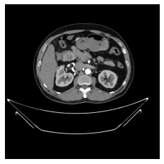

# Watershed Segmentation on Kidney Cysts

## 1. Importing Libraries

```python
# 导入OpenCV库，它是一个开源的计算机视觉和机器学习软件库。
import cv2

# 导入matplotlib.pyplot模块，它提供了丰富的绘图功能，用于创建和展示图表。
import matplotlib.pyplot as plt

# 这一行代码是Jupyter Notebook的魔术命令，用于在Notebook中内嵌图表。
%matplotlib inline

# 导入numpy库，它是一个强大的科学计算库，提供了多维数组对象和一系列处理数组的函数。
import numpy as np
```
这些代码行通常用于数据科学和机器学习相关的Python脚本中，用于图像处理、数据可视化和数值计算。在Jupyter Notebook中使用时，`%matplotlib inline`魔术命令会使得生成的图表直接嵌入到Notebook的单元格输出中。


这段代码导入了OpenCV库、Matplotlib库和NumPy库，这些库在图像处理和数值计算中非常常用。以下是对每行代码的详细中文注释：

```python
# 导入OpenCV库，这是一个开源的计算机视觉库，提供了丰富的图像处理功能
import cv2

# 导入matplotlib.pyplot模块，这是Matplotlib库的一部分，用于创建和展示图表
import matplotlib.pyplot as plt

# 使用Jupyter Notebook的魔法命令%matplotlib inline，这通常在Jupyter Notebook中使用
# 它使得Matplotlib的图表可以直接在Notebook中内联显示，而不是在新窗口中打开
%matplotlib inline 

# 导入NumPy库，这是一个用于科学计算的Python库，提供了多维数组对象和一系列处理数组的函数
import numpy as np
```

执行这段代码后，Python环境中将可以使用OpenCV、Matplotlib和NumPy库的功能。OpenCV可以用于读取、处理和保存图像，以及执行图像识别和机器视觉任务。Matplotlib用于创建各种静态、动态和交互式的图表。NumPy提供了强大的数值计算能力，特别是在处理大型多维数组和矩阵运算时。这些库在数据分析、科学计算和机器学习等领域中非常有用。在Jupyter Notebook中使用`%matplotlib inline`魔法命令可以确保图表直接嵌入到Notebook的输出中，方便查看和交互。


## 2. Plotting Image

下面这段代码使用OpenCV库读取一张图像文件，并使用Matplotlib库在屏幕上显示这张图像。以下是对每行代码的详细中文注释：

```python
# 使用cv2.imread函数读取指定路径的图像文件
# "/kaggle/input/ct-kidney-dataset-normal-cyst-tumor-and-stone/CT-KIDNEY-DATASET-Normal-Cyst-Tumor-Stone/CT-KIDNEY-DATASET-Normal-Cyst-Tumor-Stone/Tumor/Tumor- (10).jpg"是图像文件的路径
# 1表示以彩色图像的形式读取（1代表彩色，0代表灰度图像）
orig_img = cv2.imread("/kaggle/input/ct-kidney-dataset-normal-cyst-tumor-and-stone/CT-KIDNEY-DATASET-Normal-Cyst-Tumor-Stone/CT-KIDNEY-DATASET-Normal-Cyst-Tumor-Stone/Tumor/Tumor- (10).jpg", 1) # 1 indicates color image

# OpenCV默认使用BGR（蓝绿红）格式存储图像，而Matplotlib使用RGB（红绿蓝）格式显示图像
# 使用cv2.cvtColor函数将图像从BGR格式转换为RGB格式
# cv2.COLOR_BGR2RGB是转换格式的标志
orig_img_rgb = cv2.cvtColor(orig_img, cv2.COLOR_BGR2RGB)

# 使用Matplotlib的imshow函数显示转换为RGB格式的图像
plt.imshow(orig_img_rgb)

# 使用plt.axis('off')关闭坐标轴显示
plt.axis('off')

# 使用plt.show()函数显示图像
plt.show()
```

执行这段代码后，将在屏幕上显示指定路径下的彩色图像，且不显示坐标轴。这种图像显示方法常用于图像处理和分析任务，例如在医学图像分析中查看CT扫描或MRI图像。通过转换图像格式，确保图像在Matplotlib中正确显示，因为不同的库可能使用不同的颜色通道顺序。




## 3. Converting the Image into Greyscale


## 4. Performing Otsu's Binarization


## 5. Specifying the Background and Foreground after Noise Removal


## 6. Performing Distance Transfrom


## 7. Plotting the Foreground, Background and the Subtracted Image


## 8. Displaying the connected components sure_bg and sure_fg


## 9. Applying Watershed Segmentation


