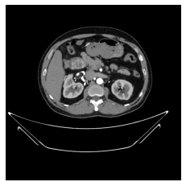
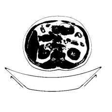
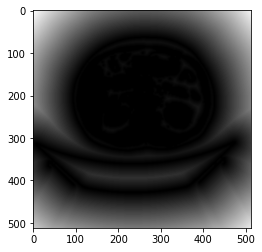
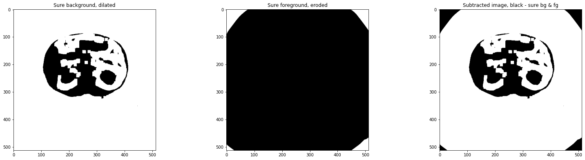
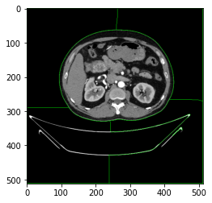

# Watershed Segmentation on Kidney Cysts

> 网址：[Watershed Segmentation on Kidney Cysts](https://www.kaggle.com/code/sanya9/watershed-segmentation-on-kidney-cysts)

* 2023年发布
* 2,801次浏览
* 33人认可
* 51次复现
## 1. Importing Libraries

下面这段代码导入了OpenCV库、Matplotlib库和NumPy库，这些库在图像处理和数值计算中非常常用。以下是对每行代码的详细中文注释：

```python
# 导入OpenCV库，这是一个开源的计算机视觉库，提供了丰富的图像处理功能
import cv2

# 导入matplotlib.pyplot模块，这是Matplotlib库的一部分，用于创建和展示图表
import matplotlib.pyplot as plt

# 使用Jupyter Notebook的魔法命令%matplotlib inline，这通常在Jupyter Notebook中使用
# 它使得Matplotlib的图表可以直接在Notebook中内联显示，而不是在新窗口中打开
%matplotlib inline 

# 导入NumPy库，这是一个用于科学计算的Python库，提供了多维数组对象和一系列处理数组的函数
import numpy as np
```

执行这段代码后，Python环境中将可以使用OpenCV、Matplotlib和NumPy库的功能。OpenCV可以用于读取、处理和保存图像，以及执行图像识别和机器视觉任务。Matplotlib用于创建各种静态、动态和交互式的图表。NumPy提供了强大的数值计算能力，特别是在处理大型多维数组和矩阵运算时。这些库在数据分析、科学计算和机器学习等领域中非常有用。在Jupyter Notebook中使用`%matplotlib inline`魔法命令可以确保图表直接嵌入到Notebook的输出中，方便查看和交互。


## 2. Plotting Image

下面这段代码使用OpenCV库读取一张图像文件，并使用Matplotlib库在屏幕上显示这张图像。以下是对每行代码的详细中文注释：

```python
# 使用cv2.imread函数读取指定路径的图像文件
# "/kaggle/input/ct-kidney-dataset-normal-cyst-tumor-and-stone/CT-KIDNEY-DATASET-Normal-Cyst-Tumor-Stone/CT-KIDNEY-DATASET-Normal-Cyst-Tumor-Stone/Tumor/Tumor- (10).jpg"是图像文件的路径
# 1表示以彩色图像的形式读取（1代表彩色，0代表灰度图像）
orig_img = cv2.imread("/kaggle/input/ct-kidney-dataset-normal-cyst-tumor-and-stone/CT-KIDNEY-DATASET-Normal-Cyst-Tumor-Stone/CT-KIDNEY-DATASET-Normal-Cyst-Tumor-Stone/Tumor/Tumor- (10).jpg", 1) # 1 indicates color image

# OpenCV默认使用BGR（蓝绿红）格式存储图像，而Matplotlib使用RGB（红绿蓝）格式显示图像
# 使用cv2.cvtColor函数将图像从BGR格式转换为RGB格式
# cv2.COLOR_BGR2RGB是转换格式的标志
orig_img_rgb = cv2.cvtColor(orig_img, cv2.COLOR_BGR2RGB)

# 使用Matplotlib的imshow函数显示转换为RGB格式的图像
plt.imshow(orig_img_rgb)

# 使用plt.axis('off')关闭坐标轴显示
plt.axis('off')

# 使用plt.show()函数显示图像
plt.show()
```

执行这段代码后，将在屏幕上显示指定路径下的彩色图像，且不显示坐标轴。这种图像显示方法常用于图像处理和分析任务，例如在医学图像分析中查看CT扫描或MRI图像。通过转换图像格式，确保图像在Matplotlib中正确显示，因为不同的库可能使用不同的颜色通道顺序。


## 3. Converting the Image into Greyscale

下面这段代码使用OpenCV库将原始的彩色图像转换为灰度图像，并使用Matplotlib库在屏幕上显示转换后的灰度图像。以下是对每行代码的详细中文注释：

```python
# 使用cv2.cvtColor函数将原始彩色图像orig_img转换为灰度图像
# cv2.COLOR_BGR2GRAY标志指定了颜色转换的类型，即从BGR颜色空间转换到灰度空间
gray_img = cv2.cvtColor(orig_img, cv2.COLOR_BGR2GRAY)

# 使用Matplotlib的imshow函数显示灰度图像
# cmap='gray'参数指定了颜色映射表，用于灰度图像的显示
plt.imshow(gray_img, cmap='gray')

# 使用plt.axis('off')关闭坐标轴显示，这样图像显示时不会显示坐标轴
plt.axis('off')

# 使用plt.show()函数显示图像，这将使得图像在屏幕上展示出来
plt.show()
```

执行这段代码后，将在屏幕上显示转换后的灰度图像，且不显示坐标轴。灰度图像通常用于图像处理中的预处理步骤，例如边缘检测、特征提取等。通过移除颜色信息，灰度图像简化了图像的数据量，有助于提高某些算法的效率。在医学图像分析中，灰度图像也常用于突出显示图像中的某些特征，如组织密度或病变区域。




## 4. Performing Otsu's Binarization

This means that if the value of the pixel exceeds the threshold, it would be considered as 1. Else, 0

下面这段代码使用OpenCV库对灰度图像应用Otsu's阈值法进行二值化处理，并显示二值化后的图像。以下是对每行代码的详细中文注释：

```python
# 使用cv2.threshold函数对灰度图像gray_img应用阈值处理
# 0表示阈值的起始点（因为Otsu's方法会自动计算最佳阈值，所以起始点不是关键）
# 255表示阈值的最大值，对于8位图像，最大值为255
# cv2.THRESH_BINARY_INV表示使用反向二值化，即背景为0，前景为255
# cv2.THRESH_OTSU表示使用Otsu's方法自动计算最佳阈值
# ret是计算出的阈值，thresh是应用阈值后的二值化图像
ret, thresh = cv2.threshold(gray_img, 0, 255, cv2.THRESH_BINARY_INV + cv2.THRESH_OTSU)

# 打印阈值的计算结果
# ret是Otsu's方法计算出的最佳阈值
print("Threshold limit: " + str(ret))

# 使用Matplotlib的imshow函数显示二值化后的图像
# cmap='gray'参数指定了颜色映射表，用于灰度图像的显示
plt.imshow(thresh, cmap='gray')

# 使用plt.axis('off')关闭坐标轴显示，这样图像显示时不会显示坐标轴
plt.axis('off')
```

执行这段代码后，将计算出最佳阈值并打印出来，然后在屏幕上显示二值化后的图像，且不显示坐标轴。Otsu's阈值法是一种自适应阈值计算方法，它通过最小化类内方差或最大化类间方差来确定最佳阈值。反向二值化（INV）意味着通常被认为是背景的像素值被设置为0，而前景像素值被设置为255。这种处理通常用于图像分割，可以突出显示图像中的特定区域，例如在医学图像分析中分割出感兴趣的结构或病变。


```python
Threshold limit: 68.0
<matplotlib.image.AxesImage at 0x7f674dce1810>
```




执行上述代码后，得到了Otsu's阈值法计算出的最佳阈值，并将灰度图像进行了二值化处理。以下是对结果的详细分析：

1. **阈值限制（Threshold limit）**:
   - 输出显示最佳阈值为68.0。这意味着Otsu's方法通过最大化类间方差来确定，当像素值高于68时，它们属于前景；当像素值低于或等于68时，它们属于背景。这个阈值用于将灰度图像转换为二值图像，其中前景和背景被分割开来。

2. **二值化图像显示**:
   - 代码中的`plt.imshow(thresh, cmap='gray')`部分用于在Matplotlib中显示二值化后的图像。由于`cmap='gray'`参数的使用，图像将以灰度形式显示，这有助于更清晰地观察二值化的效果。

3. **返回的对象**:
   - `<matplotlib.image.AxesImage at 0x7f674dce1810>`是Matplotlib中`AxesImage`对象的默认字符串表示，它表明图像已经被成功绘制在了Matplotlib的轴对象上。

从这些结果可以看出，通过Otsu's方法自动计算阈值并应用二值化，我们可以将图像中的前景和背景有效地分离。在医学图像分析中，这种技术常用于识别和分割感兴趣的区域，例如肿瘤、囊肿或其他病变。二值化图像可以进一步用于形态学分析、特征提取或作为图像分割的基础。需要注意的是，Otsu's方法的效果依赖于图像的质量和内容，对于不同的图像，计算出的最佳阈值可能会有所不同。因此，在实际应用中，可能需要对方法进行调整或尝试其他阈值计算方法以获得最佳结果。


## 5. Specifying the Background and Foreground after Noise Removal

下面这段代码使用OpenCV库进行图像处理，包括去噪、确定感兴趣区域（前景和背景）以及找出未知区域。以下是对每行代码的详细中文注释：

```python
# 去噪处理
# 创建一个3x3的矩阵，所有元素为1，数据类型为无符号8位整数
kernel = np.ones((3, 3), np.uint8)

# 使用开运算（先腐蚀后膨胀）去除小的噪声
# thresh是输入的二值图像
# cv2.MORPH_OPEN指定进行开运算
# kernel是结构元素
# iterations=2表示进行两次迭代
opening = cv2.morphologyEx(thresh, cv2.MORPH_OPEN, kernel, iterations=2)

# 确定背景区域
# 使用膨胀运算增大背景区域
# cv2.dilate函数对图像进行膨胀操作
# kernel是结构元素
# iterations=3表示进行三次迭代
sure_bg = cv2.dilate(opening, kernel, iterations=3)

# 确定前景区域
# 计算距离变换，使用L2距离，距离最大值为5
# dist_transform是计算得到的距离变换图像
dist_transform = cv2.distanceTransform(opening, cv2.DIST_L2, 5)

# 通过阈值处理确定前景区域
# cv2.threshold函数对dist_transform应用阈值
# 0.7*dist_transform.max()计算阈值，即距离变换最大值的70%
# 255是最大阈值，0是最小阈值
# sure_fg是阈值处理后的图像
ret, sure_fg = cv2.threshold(dist_transform, 0.7*dist_transform.max(), 255, 0)

# 找出未知区域
# 将sure_fg转换为uint8类型
sure_fg = np.uint8(sure_fg)

# 从背景区域中减去前景区域，得到未知区域
unknown = cv2.subtract(sure_bg, sure_fg)
```

执行这段代码后，将对原始图像进行一系列的形态学处理，目的是去除噪声并分离出感兴趣的区域。开运算有助于去除小的噪声，而膨胀运算则增大了背景区域。距离变换和阈值处理用于确定前景区域。最后，通过从背景区域中减去前景区域，得到未知区域，这通常包含了我们真正感兴趣的特征或结构。这些技术在图像分割、目标检测和医学图像分析等领域中非常有用。


## 6. Performing Distance Transfrom
In distance transfrom, the gray level intensities of the points inside the foreground are changed to distance their respective distances from the closest 0 value

下面这行代码使用Matplotlib库的`imshow`函数来显示距离变换的结果，并且设置颜色映射表为灰度。以下是对这行代码的详细中文注释：

```python
# 使用Matplotlib的imshow函数显示距离变换图像dist_transform
# cmap='gray'参数指定了颜色映射表为灰度，这使得图像中的每个像素值都按照灰度级别显示，从黑到白表示距离的变化
plt.imshow(dist_transform, cmap='gray')
```

执行这段代码后，将在屏幕上显示距离变换图像，其中像素的亮暗程度表示其到最近零像素的距离。在形态学中，距离变换是一种常用的技术，它可以用于计算图像中每个像素点到最近边界的距离。这种变换在图像分割、目标识别和特征提取等任务中非常有用。通过灰度映射，我们可以更清晰地观察和分析距离变换的结果。


```python
<matplotlib.image.AxesImage at 0x7f673c054090>
```




执行上述代码后，得到的结果是`<matplotlib.image.AxesImage at 0x7f673c054090>`，这是一个Matplotlib库中的`AxesImage`对象的引用。这个对象表示图像已经被成功绘制在了Matplotlib的轴对象上，但本身并不包含图像的可视化结果。

在实际使用中，这行代码应该在一个Jupyter Notebook或其他支持Matplotlib的环境（如Python脚本在支持的IDE中运行）中执行，以便图像能够被渲染并显示。`AxesImage`对象的引用通常不会在控制台或终端中显示图像，而是在Matplotlib的绘图窗口中展示。

由于这里只提供了`AxesImage`对象的引用，我们无法直接从文本中分析图像的内容。如果你在Jupyter Notebook或其他支持的环境中运行这段代码，你应该能够看到一个灰度图像，其中像素的亮度表示它们到最近零像素的距离。这种图像通常用于进一步的图像分析，例如在医学图像处理中识别孤立的病变或结构。在实际应用中，你可能需要结合其他图像处理技术来提取有用的信息或进行图像分割。

## 7. Plotting the Foreground, Background and the Subtracted Image

下面这段代码使用Matplotlib库创建一个图形，并在其中绘制三个子图来显示图像处理的不同阶段。以下是对每行代码的详细中文注释：

```python
# 创建一个新的图形对象fig，并设置图形的大小为宽20英寸、高10英寸
fig = plt.figure(figsize=(20, 10)) # to change figsize

# 创建第一个子图，位置由131定义（1行3列的第1个）
plt.subplot(131)
# 显示sure_bg图像，cmap='gray'表示使用灰度颜色映射
plt.imshow(sure_bg, cmap='gray')
# 设置子图的标题
plt.title('Sure background, dilated')

# 创建第二个子图，位置由132定义（1行3列的第2个）
plt.subplot(132)
# 显示sure_fg图像，使用灰度颜色映射
plt.imshow(sure_fg, cmap='gray')
# 设置子图的标题
plt.title('Sure foreground, eroded')

# 创建第三个子图，位置由133定义（1行3列的第3个）
plt.subplot(133)
# 显示unknown图像，使用灰度颜色映射
plt.imshow(unknown, cmap='gray')
# 设置子图的标题
plt.title('Subtracted image, black - sure bg & fg')

# 自动调整子图布局以避免重叠
plt.tight_layout()

# 调整子图之间的水平间距
plt.subplots_adjust(wspace=0.5)
```

执行这段代码后，将在一个图形中创建三个子图，分别显示确定的背景区域（膨胀后）、确定的前景区域（腐蚀后）以及未知区域（背景和前景的差值图像）。每个子图都使用灰度颜色映射来展示图像，这有助于更清晰地观察图像处理的效果。`plt.tight_layout()`函数用于自动调整子图参数，使之填充整个图形区域并且子图之间没有重叠。`plt.subplots_adjust(wspace=0.5)`用于微调子图之间的水平间距，使得子图之间有一定的间隔，便于观察和比较。

这种可视化方法在图像处理和分析中非常有用，尤其是在进行图像分割和目标识别时，可以帮助我们理解不同处理步骤对图像的影响，以及如何改进算法以达到更好的分割效果。



* The background is denoted by black
* The second image is distance transformed and thresholded
* The white area is the unknown area


## 8. Displaying the connected components sure_bg and sure_fg

下面这段代码使用OpenCV库的`connectedComponents`函数来对二值图像进行连通组件分析，并且使用Matplotlib库来显示结果。以下是对每行代码的详细中文注释：

```python
# 使用cv2.connectedComponents函数对sure_fg图像进行连通组件分析
# 该函数返回两个值：ret和markers
# ret是连通区域的数量（不包括背景）
# markers是标记图像，每个连通区域的像素都有不同的标记值
ret, markers = cv2.connectedComponents(sure_fg)

# 将标记值加1，因为连通组件分析返回的标记值从1开始，我们需要背景为0
markers = markers + 1

# 将未知区域（unknown数组中值为255的像素）的标记值设置为0，即背景
markers[unknown == 255] = 0

# 创建一个新的图形对象fig，并设置图形的大小为宽20英寸、高10英寸
fig = plt.figure(figsize=(20, 10)) # to change figsize

# 创建第一个子图，位置由121定义（1行2列的第1个）
plt.subplot(121)
# 显示标记图像markers，使用灰度颜色映射
plt.imshow(markers, cmap='gray')

# 创建第二个子图，位置由122定义（1行2列的第2个）
plt.subplot(122)
# 直接显示标记图像markers，不使用颜色映射
plt.imshow(markers)
```

执行这段代码后，将对二值图像`sure_fg`进行连通组件分析，识别出所有的连通区域，并将每个区域的像素赋予一个唯一的标记值。通过将标记值加1，我们使得背景区域的标记值为0，而其他连通区域的标记值则从1开始递增。然后，我们将未知区域的像素标记为背景（0）。最后，我们创建一个图形对象，并在其中绘制两个子图来分别以灰度和彩色显示标记图像。

连通组件分析是图像处理中的一种基本技术，常用于分割图像中的独立对象，例如在医学图像中识别不同的组织或病变。通过这种分析，我们可以对每个连通区域进行进一步的分析，例如计算区域的面积、形状或纹理特征。在实际应用中，这有助于识别和分类图像中的不同结构，以及进行目标跟踪和图像识别等任务。


```python
<matplotlib.image.AxesImage at 0x7f674de05610>
```


## 9. Applying Watershed Segmentation

下面 这段代码使用OpenCV库的`watershed`函数来执行图像的分水岭算法，并更新原始图像以突出显示分水岭边界。以下是对每行代码的详细中文注释：

```python
# 使用cv2.watershed函数对原始图像orig_img执行分水岭算法
# markers是连通组件分析的结果，它提供了图像中每个连通区域的标记
# 分水岭算法将根据markers中的标记值来确定分水岭边界
markers = cv2.watershed(orig_img, markers)

# 将markers中标记值为-1的像素点设置为绿色，这里的[0, 255, 0]表示绿色的BGR值
# 在分水岭算法中，标记值为-1的像素点通常被视为边界或分割线
orig_img[markers == -1] = [0, 255, 0]
```

执行这段代码后，`watershed`函数将在`orig_img`图像上执行分水岭算法，根据`markers`中的标记值来划分区域。分水岭算法通常用于图像分割，特别是在图像中存在多个相似区域时，它可以有效地将这些区域分开。在医学图像处理中，分水岭算法可以帮助识别和分割不同的组织结构或病变。

在`watershed`算法中，标记值为-1的像素点被视为分割线，这些点通常是图像中区域边界的起点。通过将这些点设置为绿色，我们可以在原始图像中清晰地看到分水岭算法的分割线，这有助于我们理解算法是如何分割图像的。需要注意的是，分水岭算法可能会产生过分割的效果，因此在实际应用中可能需要结合其他图像处理技术来优化分割结果。


下面这行代码使用Matplotlib库的`imshow`函数来显示图像。以下是对这行代码的详细中文注释：

```python
# 使用Matplotlib的imshow函数显示图像orig_img
# orig_img是一个图像数组，可以是彩色图像或灰度图像
plt.imshow(orig_img)
```

执行这段代码后，将在屏幕上显示`orig_img`图像。如果`orig_img`是之前经过分水岭算法处理的图像，并且已经将分割线标记为绿色，那么我们将能够看到原始图像中的分割线。这种可视化方法有助于我们理解图像处理的效果，特别是在进行图像分割和分析时，可以观察分割线是否正确地划分了图像中的不同区域。

需要注意的是，如果`orig_img`是彩色图像，`imshow`函数默认使用RGB颜色映射。如果图像是灰度图像或其他颜色空间，可以通过设置`cmap`参数来指定合适的颜色映射表。在Jupyter Notebook或其他支持Matplotlib的环境中运行这段代码，图像将被渲染并显示在输出区域。如果在不支持Matplotlib的环境中运行，可能需要额外的代码来保存图像到文件或使用其他库进行显示。


```python
<matplotlib.image.AxesImage at 0x7f673067c2d0>
```





