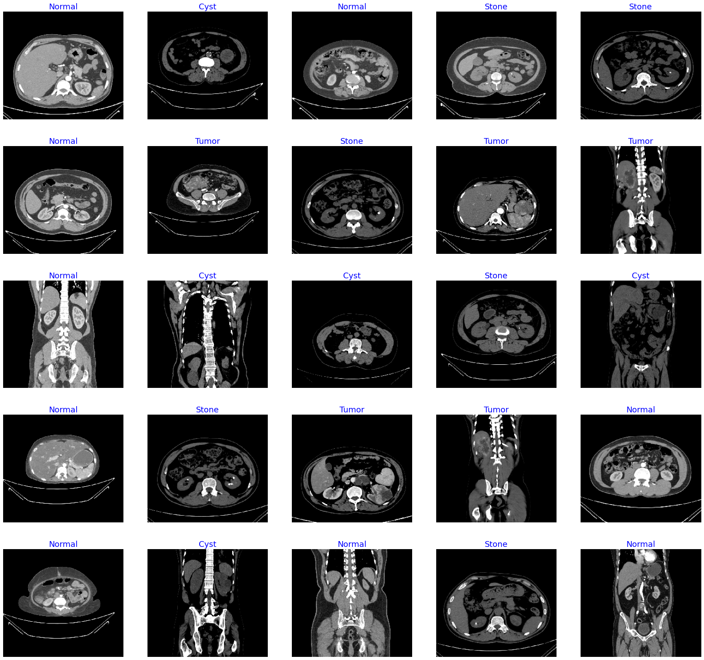
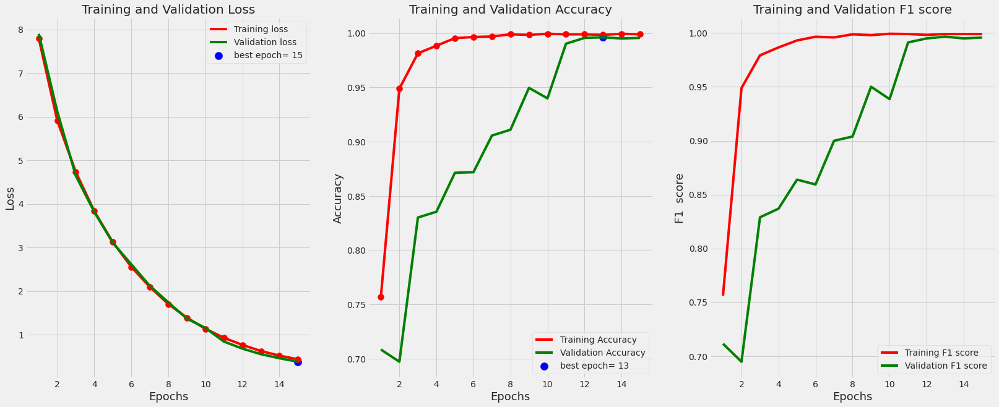
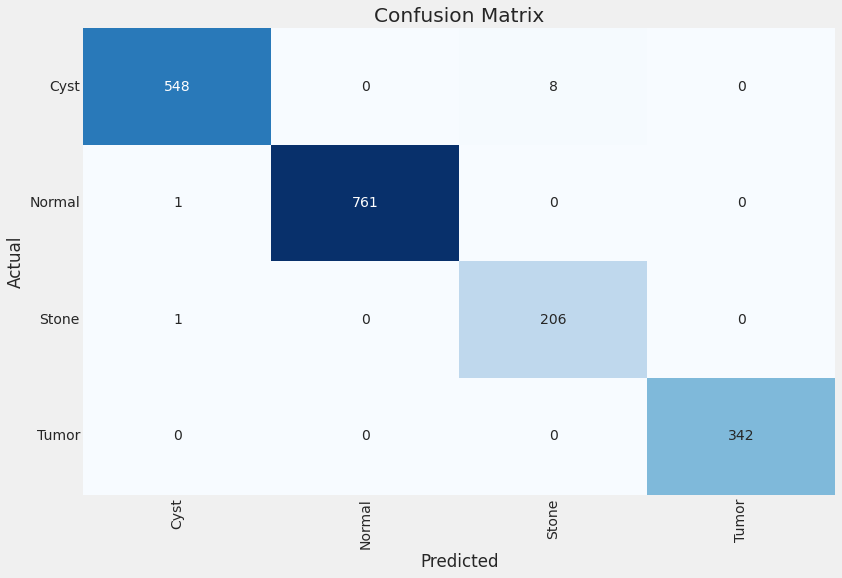

# Kidney Disease F1 score= 99.5%
> 网址： [Kidney Disease F1 score= 99.5%](https://www.kaggle.com/code/gpiosenka/kidney-disease-f1-score-99-5)

* 2023年创建
* 13人投票
* 82次复现

## 目录
* 1  Import Needed Modules
* 2  Concept for Callback Approach
* 3  Define function to print text in rgb foreground and background colors
* 4  Read in images and create a dataframe of image paths and class labels
* 5  Trim the trainning set
* 6  Create train, test and validation generators
* 7  Create a function to show Training Image Samples
* 8  Create a function that computes the F1 score metric 
* 9  Create the Model
* 10 Create a custom Keras callback to continue or halt training
* 11 Instantiate custom callback 
* 12 Train the model
* 13 Define a function to plot the training data
* 14 Make predictions on test set, create Confusion Matrix and Classification Report
* 15 Define a function to print list of misclassified test files
* 16 Save the model


## 1. Import Needed Modules
### 导入库
```python
# 导入 pandas 库，并使用别名 pd。Pandas 是一个强大的数据结构和数据分析工具。
import pandas as pd

# 导入 numpy 库，并使用别名 np。NumPy 提供了多维数组对象和一系列处理数组的函数。
import numpy as np

# 导入 os 模块，用于与操作系统进行交互，如文件路径操作和环境变量设置。
import os

# 设置环境变量，用于控制 TensorFlow 产生的日志信息级别。
# '2' 表示只显示警告和错误信息，不显示调试信息。
os.environ['TF_CPP_MIN_LOG_LEVEL'] = '2'

# 导入 time 模块，提供各种时间相关的函数。
import time

# 导入 matplotlib.pyplot 模块，并使用别名 plt。Matplotlib 是一个用于创建静态、动态和交互式图表的库。
import matplotlib.pyplot as plt

# 导入 cv2 模块，即 OpenCV，是一个开源的计算机视觉和图像处理库。
import cv2

# 导入 seaborn 库，并使用别名 sns。Seaborn 是一个基于 Matplotlib 的数据可视化库，提供了更多样化的绘图风格和接口。
import seaborn as sns

# 设置 seaborn 的绘图风格为 'darkgrid'。
sns.set_style('darkgrid')

# 导入 shutil 模块，提供文件操作功能，如复制、移动和删除文件。
import shutil

# 从 sklearn.metrics 中导入 confusion_matrix 和 classification_report 函数。
# 这些函数用于生成混淆矩阵和分类报告，常用于评估分类模型的性能。
from sklearn.metrics import confusion_matrix, classification_report

# 从 sklearn.model_selection 中导入 train_test_split 函数。
# 该函数用于将数据集分割为训练集和测试集。
from sklearn.model_selection import train_test_split

# 导入 tensorflow 库，并使用别名 tf。TensorFlow 是一个开源的机器学习框架。
import tensorflow as tf

# 从 tensorflow.keras 模块中导入相关层、优化器、损失函数、正则化器、模型和后端。
from tensorflow.keras.preprocessing.image import ImageDataGenerator
from tensorflow.keras.layers import Dense, Activation, Dropout, Conv2D, MaxPooling2D, BatchNormalization
from tensorflow.keras.optimizers import Adam, Adamax
from tensorflow.keras.metrics import categorical_crossentropy
from tensorflow.keras import regularizers
from tensorflow.keras.models import Model
from tensorflow.keras import backend as K

# 再次导入 time 模块。
import time

# 导入 tqdm 模块，提供进度条功能，用于显示循环的进度。
from tqdm import tqdm

# 从 sklearn.metrics 中导入 f1_score 函数。
# F1 分数是精确率和召回率的调和平均，常用于评估二分类和多分类问题的性能。
from sklearn.metrics import f1_score

# 从 IPython.display 中导入 YouTubeVideo 类。
from IPython.display import YouTubeVideo

# 导入 sys 模块，用于访问与 Python 解释器相关的变量和函数。
import sys

# 如果 sys.warnoptions 没有设置，则导入 warnings 模块，并设置警告过滤器。
if not sys.warnoptions:
    import warnings
    warnings.simplefilter("ignore")

# 设置 pandas 显示选项，以显示更多的列、行和更宽的列内容。
pd.set_option('display.max_columns', None)  # or 1000
pd.set_option('display.max_rows', None)  # or 1000
pd.set_option('display.max_colwidth', None)  # or 199

# 打印提示信息，表示所有模块已经加载完成。
print('Modules loaded')
```

这段代码导入了多个 Python 库和模块，用于数据处理、图像处理、机器学习模型构建、可视化和环境配置等任务。通过设置环境变量和模块选项，代码还配置了 TensorFlow 和 pandas 的显示行为，以及忽略了警告信息，以便在开发过程中减少不必要的干扰。最后，打印了 'Modules loaded' 信息，表示所有需要的模块已经成功加载。
#### 结果展示：


```python
Modules loaded
```


## 2 Concept for Callback Approach

### Custom Callback Concept
This notebook implements a custom callback to adjust the learning rate during training.

The callback has a parameter dwell. If dwell is set to True, the callback monitors the
validation loss. It keeps track of the lowest validation loss thus far achieved as you run
through each epoch and stores this as the lowest loss and also stores the weights for that epoch as the best weights. At the end of an epoch the validation loss for that epoch is compared with the lowest loss. If the validation loss at the end of the current epoch is less than the lowest loss than it becomes the lowest loss and the weights of the current
epoch become the best weights

If the validation loss at the end of the current epoch is greator than the lowest loss this implies you have moved to a location in Nspace(N is the number of trainable parameters on the validation cost function surface that is less favorable(higher cost) than the position in Nspace defined by the best weights. Therefore why move the models weights to this less favorable location? Better to reset the models weights to the best weights, then lower the learning rate and run more epochs. The new learning rate is set to new_lr=current_lr * factor where factor is a user specified parameter in the instantiation of the callback. By default it is set to .04 and by default dwell is set to True.

At the end of training the callback always returns your model with the weights set to the best weights. The callback provides a feature where it periodically queries the user to either contine and optionally manually specify a new learning rate or halt training. During training the calback provides useful information on the percent improvement in the validation loss for each epoch. The is useful to decide when to halt training or manually specifying a new learning rate.


## 3. Define function to print text in rgb foreground and background colors
Add some PZAZZ to your printed output with this function

form of the call is: print_in_color(txt_msg, fore_tupple, back_tupple where:

* txt_msg is the string to be printed out
* fore_tuple is tuple of the form (r,g,b) specifying the foreground color of the text
* back_tuple is tuple of the form (r,g,b) specifying the background color of the text


```python
# 定义一个函数 print_in_color，用于以指定的前景色和背景色打印文本消息。
# 参数说明：
# txt_msg: 需要打印的文本消息。
# fore_tupple: 一个元组，表示前景色，格式为 (r, g, b)，代表红、绿、蓝三个颜色通道的强度，默认值为 (0, 255, 255)，即青色。
# back_tupple: 一个元组，表示背景色，格式同样为 (r, g, b)，默认值为 (100, 100, 100)，即灰色。
def print_in_color(txt_msg, fore_tupple=(0, 255, 255), back_tupple=(100, 100, 100)):
    
    # 解包前景色和背景色的元组。
    rf, gf, bf = fore_tupple
    rb, gb, bb = back_tupple
    
    # 构造消息字符串，这里只是简单地在文本前加上了 '{0}'，实际上这个字符串可以更复杂。
    msg = '{0}' + txt_msg
    
    # 构造 ANSI 转义序列，用于设置前景色和背景色。
    # \33[38;2; 后面跟随的是前景色的颜色代码，';48;2;' 后面是背景色的颜色代码。
    # 这些颜色代码指定了 RGB 颜色空间中的颜色值。
    mat = '\33[38;2;' + str(rf) + ';' + str(gf) + ';' + str(bf) + ';48;2;' + str(rb) + ';' + str(gb) + ';' + str(bb) + 'm'
    
    # 使用 format 方法将 mat 插入到消息字符串中，并打印出来。
    # flush=True 确保立即刷新输出，确保颜色代码能够立即生效。
    print(msg.format(mat), flush=True)
    
    # 打印默认的重置代码 '\33[0m'，将终端的颜色设置恢复到默认状态（黑色背景）。
    print('\33[0m', flush=True)
    
    # 函数执行完毕，返回 None。
    return

# 示例：使用默认参数打印文本消息 'test of default colors'。
# 由于使用了默认的颜色参数，文本将以青色前景色和灰色背景色打印出来。
msg = 'test of default colors'
print_in_color(msg)
```

这段代码定义了一个函数 `print_in_color`，它允许用户以自定义的颜色打印文本消息。通过使用 ANSI 转义序列，可以在支持 ANSI 颜色代码的终端中以不同的颜色显示文本。函数的默认颜色是青色前景色和灰色背景色，但也可以通过参数自定义颜色。在函数的末尾，使用了一个重置代码来确保终端的颜色设置恢复到默认状态。
#### 结果展示
```python
test of default colors
```
## 4. Read in images and create a dataframe of image paths and class labels


```python
# 定义一个函数 make_dataframes，用于创建包含图像文件路径和标签的数据框架（DataFrames）。
# sdir 参数是图像数据集的根目录路径。
def make_dataframes(sdir): 
    filepaths = []  # 用于存储图像文件路径的列表。
    labels = []  # 用于存储标签的列表。
    classlist = sorted(os.listdir(sdir))  # 获取数据集根目录下的所有类别，并排序。
    for klass in classlist:
        classpath = os.path.join(sdir, klass)  # 构造每个类别的完整路径。
        if os.path.isdir(classpath):
            flist = sorted(os.listdir(classpath))  # 获取当前类别下所有图像文件，并排序。
            desc = f'{klass:25s}'  # 构造进度条描述信息。
            for f in tqdm(flist, ncols=130, desc=desc, unit='files', colour='blue'):
                fpath = os.path.join(classpath, f)  # 构造单个图像文件的完整路径。
                filepaths.append(fpath)  # 将文件路径添加到 filepaths 列表。
                labels.append(klass)  # 将对应的类别标签添加到 labels 列表。

    # 创建一个包含图像文件路径的 pandas Series 对象。
    Fseries = pd.Series(filepaths, name='filepaths')
    # 创建一个包含标签的 pandas Series 对象。
    Lseries = pd.Series(labels, name='labels')
    # 将两个 Series 对象合并成一个 DataFrame。
    df = pd.concat([Fseries, Lseries], axis=1)
    
    # 使用 train_test_split 函数将 DataFrame 分割为训练集和测试集。
    train_df, dummy_df = train_test_split(df, train_size=.7, shuffle=True, random_state=123, stratify=df['labels'])
    # 再次分割，将剩余的数据分为验证集和测试集。
    valid_df, test_df = train_test_split(dummy_df, train_size=.5, shuffle=True, random_state=123, stratify=dummy_df['labels'])
    
    # 获取训练集中所有唯一类别并排序。
    classes = sorted(train_df['labels'].unique())
    # 计算类别数量。
    class_count = len(classes)
    # 从训练集中随机抽取 50 个样本。
    sample_df = train_df.sample(n=50, replace=False)
    
    # 计算图像的平均高度和宽度。
    ht = 0
    wt = 0
    count = 0
    for i in range(len(sample_df)):
        fpath = sample_df['filepaths'].iloc[i]
        try:
            img = cv2.imread(fpath)
            h = img.shape[0]
            w = img.shape[1]
            wt += w
            ht += h
            count += 1
        except:
            pass
    have = int(ht / count)  # 计算平均高度。
    wave = int(wt / count)  # 计算平均宽度。
    aspect_ratio = have / wave  # 计算宽高比。
    
    # 打印一些统计信息。
    print('number of classes in processed dataset= ', class_count)
    counts = list(train_df['labels'].value_counts())
    print(counts[0], type(counts[0]))
    print('the maximum files in any class in train_df is ', max(counts), '  the minimum files in any class in train_df is ', min(counts))
    print('train_df length: ', len(train_df), '  test_df length: ', len(test_df), '  valid_df length: ', len(valid_df))
    print('average image height= ', have, '  average image width= ', wave, ' aspect ratio h/w= ', aspect_ratio)
    
    # 返回创建的训练集、测试集、验证集、类别列表和类别数量。
    return train_df, test_df, valid_df, classes, class_count

# 指定图像数据集的根目录路径。
sdir = r'../input/ct-kidney-dataset-normal-cyst-tumor-and-stone/CT-KIDNEY-DATASET-Normal-Cyst-Tumor-Stone/CT-KIDNEY-DATASET-Normal-Cyst-Tumor-Stone'
# 调用函数并获取结果。
train_df, test_df, valid_df, classes, class_count = make_dataframes(sdir)
```

这段代码定义了一个函数 `make_dataframes`，用于处理图像数据集并创建相关的 DataFrames。函数首先遍历数据集的根目录，收集所有图像文件的路径和对应的标签，然后使用 `train_test_split` 函数将数据集分割为训练集、验证集和测试集。此外，函数还计算了图像的平均高度和宽度，并打印了一些有用的统计信息。最后，函数返回创建的 DataFrames 和类别相关的信息。在代码的最后，调用了 `make_dataframes` 函数并传入了数据集的路径。


```python
Cyst                     : 100%|███████████████████████████████████████████████████████| 3709/3709 [00:00<00:00, 214016.89files/s]
Normal                   : 100%|███████████████████████████████████████████████████████| 5077/5077 [00:00<00:00, 544992.23files/s]
Stone                    : 100%|███████████████████████████████████████████████████████| 1377/1377 [00:00<00:00, 446092.27files/s]
Tumor                    : 100%|███████████████████████████████████████████████████████| 2283/2283 [00:00<00:00, 398650.96files/s]
number of classes in processed dataset=  4
3554 <class 'int'>
the maximum files in any class in train_df is  3554   the minimum files in any class in train_df is  964
train_df length:  8712   test_df length:  1867   valid_df length:  1867
average image height=  575   average image width=  629  aspect ratio h/w=  0.9141494435612083
```
### 结果解释
执行上述代码后，得到了关于图像数据集的一系列统计结果和分割后的 DataFrames。以下是对结果的详细分析：

1. **类别和文件处理进度**:
   - 通过 tqdm 模块打印的进度条显示了每个类别中文件的处理进度和速度。
   - 每个类别的进度条都显示了 100%，意味着所有文件都已被处理。

2. **类别数量**:
   - `number of classes in processed dataset= 4` 表示数据集中有 4 个不同的类别。

3. **类别样本数量**:
   - `3554 <class 'int'>` 表示 `train_df['labels'].value_counts()` 返回的第一个值（最大值）是 3554，这是训练集中样本数量最多的类别。
   - 这个输出还显示了 `counts[0]` 的数据类型是整数（`<class 'int'>`）。

4. **样本数量分布**:
   - `the maximum files in any class in train_df is 3554   the minimum files in any class in train_df is 964` 表明训练集中样本数量最多的类别有 3554 个文件，而样本数量最少的类别有 964 个文件。

5. **DataFrames 长度**:
   - `train_df length: 8712   test_df length:  1867   valid_df length:  1867` 显示了分割后的三个 DataFrames 的长度，即样本数量。
   - 训练集 `train_df` 包含 8712 个样本，测试集 `test_df` 和验证集 `valid_df` 各包含 1867 个样本。

6. **图像尺寸统计**:
   - `average image height= 575   average image width=  629` 表示样本图像的平均高度为 575 像素，平均宽度为 629 像素。
   - `aspect ratio h/w= 0.9141494435612083` 表示图像的平均宽高比（高度除以宽度）约为 0.914，这是一个接近正方形的宽高比。

这些结果提供了数据集的详细概览，包括类别数量、样本分布、图像尺寸等重要信息。这些信息对于后续的数据预处理、模型设计和训练策略选择非常重要。例如，知道样本数量最多的类别和最少的类别可以帮助决定是否需要进行数据增强或其他处理来平衡类别分布。图像的平均尺寸和宽高比对于设置模型输入层的大小和预处理图像尺寸也很有用。


## 5. Trim the trainning set
Since all classes have more than 500 images, the train_df dataset will be balanced and training time will be reduced

```python
# 定义一个函数 trim，用于调整 DataFrame 中每个类别的样本数量，使其不超过最大样本数且不少于最小样本数。
# df 参数是要处理的 DataFrame。
# max_samples 参数是每个类别的最大样本数量。
# min_samples 参数是每个类别的最小样本数量。
# column 参数是包含类别标签的列名。
def trim(df, max_samples, min_samples, column):
    # 复制原始 DataFrame 以避免直接修改原始数据。
    df = df.copy()
    # 获取 DataFrame 中所有唯一的类别标签。
    classes = df[column].unique()
    # 计算类别标签的数量。
    class_count = len(classes)
    # 打印原始 DataFrame 的长度和类别数量。
    print('dataframe initially is of length ', len(df), ' with ', class_count, ' classes')
    # 使用 groupby 方法按照指定列（类别标签）对 DataFrame 进行分组。
    groups = df.groupby(column)
    # 创建一个新的空 DataFrame 用于存储调整后的类别数据。
    trimmed_df = pd.DataFrame(columns=df.columns)
    # 再次使用 groupby 方法进行分组。
    groups = df.groupby(column)
    # 遍历所有唯一的类别标签。
    for label in df[column].unique():
        # 获取当前类别标签的分组数据。
        group = groups.get_group(label)
        # 计算当前分组的样本数量。
        count = len(group)
        # 如果样本数量大于最大样本数，则进行抽样以减少样本数量至最大样本数。
        if count > max_samples:
            sampled_group = group.sample(n=max_samples, random_state=123, axis=0)
            # 将抽样后的数据追加到新的 DataFrame 中。
            trimmed_df = pd.concat([trimmed_df, sampled_group], axis=0)
        else:
            # 如果样本数量不少于最小样本数，则直接使用当前分组数据。
            if count >= min_samples:
                sampled_group = group
                # 将当前分组数据追加到新的 DataFrame 中。
                trimmed_df = pd.concat([trimmed_df, sampled_group], axis=0)
    # 打印调整后的 DataFrame 中每个类别的最大样本数量和最小样本数量。
    print('after trimming, the maximum samples in any class is now ', max_samples, ' and the minimum samples in any class is ', min_samples)
    # 重新获取调整后的 DataFrame 中所有唯一的类别标签。
    classes = trimmed_df[column].unique()
    # 重新计算类别标签的数量。
    class_count = len(classes)
    # 打印调整后的 DataFrame 的长度和类别数量。
    print('the trimmed dataframe now is of length ', len(trimmed_df), ' with ', class_count, ' classes')
    # 返回调整后的 DataFrame 以及类别标签和类别数量。
    return trimmed_df, classes, class_count

# 设置每个类别的最大样本数量和最小样本数量。
max_samples = 500
min_samples = 500
# 指定包含类别标签的列名。
column = 'labels'
# 调用 trim 函数并传入训练集 DataFrame 和参数。
train_df, classes, class_count = trim(train_df, max_samples, min_samples, column)
```

这段代码定义了一个函数 `trim`，用于确保 DataFrame 中每个类别的样本数量在指定的最大和最小值之间。函数首先复制原始 DataFrame 以避免直接修改原始数据，然后对每个类别进行抽样，以确保每个类别的样本数量不超过最大值且不少于最小值。函数返回调整后的 DataFrame 以及类别标签和类别数量。在代码的最后，调用了 `trim` 函数并传入了训练集 DataFrame 和相关参数。这个函数可以用于处理类别不平衡问题，确保模型训练时各个类别的样本数量均衡。


```python
dataframe initially is of length  8712  with  4  classes
after trimming, the maximum samples in any class is now  500  and the minimum samples in any class is  500
the trimmed dataframe now is of length  2000  with  4  classes
```
#### 结果解释
执行上述代码后，得到了关于处理后的 DataFrame 的统计信息。以下是对结果的详细分析：

1. **原始 DataFrame 信息**:
   - `dataframe initially is of length  8712  with  4  classes` 表示原始 DataFrame 包含 8712 个样本，分为 4 个不同的类别。

2. **处理后的样本数量**:
   - `after trimming, the maximum samples in any class is now  500  and the minimum samples in any class is  500` 表示经过 `trim` 函数处理后，每个类别的样本数量被限制在了 500 个样本，这是根据函数中设置的 `max_samples` 和 `min_samples` 参数。
   - 这意味着无论原始类别中有多少样本，经过处理后，每个类别都恰好有 500 个样本。

3. **处理后的 DataFrame 信息**:
   - `the trimmed dataframe now is of length  2000  with  4  classes` 表示处理后的 DataFrame 包含 2000 个样本，仍然分为 4 个类别。
   - 由于每个类别都有 500 个样本，所以总样本数量是 4 类别乘以 500 样本每类，等于 2000 个样本。

这个结果表明 `trim` 函数按照预期工作，将原始 DataFrame 中的样本数量平衡到了每个类别各有 500 个样本。这种处理方式有助于确保在机器学习模型训练过程中，每个类别都有相等的代表性，从而减少类别不平衡带来的问题。此外，输出结果提供了处理前后 DataFrame 的详细对比，使我们能够清楚地了解数据调整的过程和结果。在实际应用中，这种数据平衡技术是处理类别不平衡问题的有效方法之一。

### Expand train_df rows with augmented images so each class has n samples

#### Since the trim function balanced the dataset and we have an ample number of image samples in each class this function is not used in this notebook

```python
# 定义一个函数 balance，用于平衡数据集中各个类别的样本数量。
# df 参数是要处理的 DataFrame。
# n 参数是每个类别目标样本数量。
# working_dir 参数是工作目录，用于存储增强后的图像。
# img_size 参数是增强后图像的大小。
def balance(df, n, working_dir, img_size):
    # 复制原始 DataFrame 以避免直接修改原始数据。
    df = df.copy()
    # 打印原始 DataFrame 的长度。
    print('Initial length of dataframe is ', len(df))
    # 定义增强图像存储的目录。
    aug_dir = os.path.join(working_dir, 'aug')
    # 如果增强图像目录已存在，则删除并重新创建，确保开始时目录是空的。
    if os.path.isdir(aug_dir):
        shutil.rmtree(aug_dir)
    os.mkdir(aug_dir)        
    # 为每个类别创建目录。
    for label in df['labels'].unique():    
        dir_path = os.path.join(aug_dir, label)    
        os.mkdir(dir_path) 

    # 创建图像增强器实例，设置增强参数。
    gen = ImageDataGenerator(
        horizontal_flip=True,  # 水平翻转
        rotation_range=20,     # 旋转范围
        width_shift_range=.2,  # 水平移动范围
        height_shift_range=.2, # 垂直移动范围
        zoom_range=.2           # 缩放范围
    )
    # 按类别分组。
    groups = df.groupby('labels')
    # 对于每个类别，检查样本数量是否小于目标数量 n。
    for label in df['labels'].unique():  
        group = groups.get_group(label)  # 获取当前类别的 DataFrame 分组
        sample_count = len(group)   # 计算当前类别的样本数量
        if sample_count < n: # 如果样本数量小于目标数量。
            aug_img_count = 0
            delta = n - sample_count  # 计算需要增强的图像数量
            target_dir = os.path.join(aug_dir, label)  # 定义增强图像的存储目录
            # 打印增强进度信息。
            msg = '{0:40s} for class {1:^30s} creating {2:^5s} augmented images'.format(' ', label, str(delta))
            print(msg, '\r', end='') 
            # 从 DataFrame 中流式传输数据，并生成增强图像。
            aug_gen = gen.flow_from_dataframe(
                group,  # DataFrame
                x_col='filepaths',  # 图像文件路径列
                y_col=None,  # 标签列，这里不需要
                target_size=img_size,  # 增强后图像的大小
                class_mode=None,  # 无需类别模式
                batch_size=1,  # 批量大小为 1
                shuffle=False,  # 不打乱数据
                save_to_dir=target_dir,  # 保存到指定目录
                save_prefix='aug-',  # 文件名前缀
                color_mode='rgb',  # 颜色模式
                save_format='jpg'  # 保存格式
            )
            # 循环生成增强图像，直到达到目标数量。
            while aug_img_count < delta:
                images = next(aug_gen)            
                aug_img_count += len(images)
            total += aug_img_count  # 更新总增强图像数量
    # 打印生成的增强图像总数。
    print('Total Augmented images created= ', total)

    # 创建包含增强图像路径和标签的新 DataFrame。
    aug_fpaths = []
    aug_labels = []
    classlist = os.listdir(aug_dir)
    for klass in classlist:
        classpath = os.path.join(aug_dir, klass)     
        flist = os.listdir(classpath)    
        for f in flist:        
            fpath = os.path.join(classpath, f)         
            aug_fpaths.append(fpath)
            aug_labels.append(klass)
    # 创建包含增强图像路径的 Series。
    Fseries = pd.Series(aug_fpaths, name='filepaths')
    # 创建包含标签的 Series。
    Lseries = pd.Series(aug_labels, name='labels')
    # 合并 Series 创建增强 DataFrame。
    aug_df = pd.concat([Fseries, Lseries], axis=1)         
    # 将原始 DataFrame 和增强 DataFrame 合并，创建新的 DataFrame。
    df = pd.concat([df, aug_df], axis=0).reset_index(drop=True)
    # 打印合并后 DataFrame 的长度。
    print('Length of augmented dataframe is now ', len(df))
    # 返回合并后的 DataFrame。
    return df
```

这段代码定义了一个函数 `balance`，用于通过数据增强技术来平衡数据集中各个类别的样本数量。函数首先检查并清理增强图像的存储目录，然后为每个类别创建子目录。接下来，函数使用 `ImageDataGenerator` 类创建图像增强器实例，并为样本数量少于目标值的类别生成增强图像。增强后的图像被保存到指定目录，并且与原始图像一起合并到一个新的 DataFrame 中。最后，函数返回这个新的 DataFrame，它包含了原始和增强后的图像数据。这个函数可以用于解决类别不平衡问题，提高模型训练的泛化能力。


## 6. Create train, test and validation generators

```python
# 定义一个函数 make_gens，用于创建用于训练、验证和测试的图像数据生成器。
# batch_size 参数指定了每个批次的样本数量。
# train_df 参数是包含训练数据的 DataFrame。
# test_df 参数是包含测试数据的 DataFrame。
# valid_df 参数是包含验证数据的 DataFrame。
# img_size 参数指定了图像的大小。
def make_gens(batch_size, train_df, test_df, valid_df, img_size):
    # 创建训练数据的图像数据生成器实例。
    trgen = ImageDataGenerator()
    # 创建用于验证和测试数据的图像数据生成器实例。
    t_and_v_gen = ImageDataGenerator()
    # 打印训练生成器的进度信息。
    msg = '{0:70s} for train generator'.format(' ')
    print(msg, '\r', end='') 
    # 从训练数据 DataFrame 中创建训练数据生成器。
    train_gen = trgen.flow_from_dataframe(
        train_df,  # DataFrame 数据源
        x_col='filepaths',  # 文件路径列名
        y_col='labels',  # 标签列名
        target_size=img_size,  # 目标图像大小
        class_mode='categorical',  # 类别模式
        color_mode='rgb',  # 颜色模式
        shuffle=True,  # 是否打乱数据
        batch_size=batch_size  # 批次大小
    )
    # 打印验证生成器的进度信息。
    msg = '{0:70s} for valid generator'.format(' ')
    print(msg, '\r', end='') 
    # 从验证数据 DataFrame 中创建验证数据生成器。
    valid_gen = t_and_v_gen.flow_from_dataframe(
        valid_df,  # DataFrame 数据源
        x_col='filepaths',  # 文件路径列名
        y_col='labels',  # 标签列名
        target_size=img_size,  # 目标图像大小
        class_mode='categorical',  # 类别模式
        color_mode='rgb',  # 颜色模式
        shuffle=False,  # 是否打乱数据
        batch_size=batch_size  # 批次大小
    )
    # 计算测试集的批次大小和测试步数，确保能够完整遍历测试集中的所有样本。
    length = len(test_df)
    test_batch_size = sorted([int(length / n) for n in range(1, length + 1) if length % n == 0 and length / n <= 80], reverse=True)[0]
    test_steps = int(length / test_batch_size)
    # 打印测试生成器的进度信息。
    msg = '{0:70s} for test generator'.format(' ')
    print(msg, '\r', end='') 
    # 从测试数据 DataFrame 中创建测试数据生成器。
    test_gen = t_and_v_gen.flow_from_dataframe(
        test_df,  # DataFrame 数据源
        x_col='filepaths',  # 文件路径列名
        y_col='labels',  # 标签列名
        target_size=img_size,  # 目标图像大小
        class_mode='categorical',  # 类别模式
        color_mode='rgb',  # 颜色模式
        shuffle=False,  # 是否打乱数据
        batch_size=test_batch_size  # 批次大小
    )
    # 获取生成器中的类别信息和标签。
    classes = list(train_gen.class_indices.keys())
    class_indices = list(train_gen.class_indices.values())
    class_count = len(classes)
    labels = test_gen.labels
    # 打印测试批次大小、测试步数和类别数量。
    print('test batch size: ', test_batch_size, '  test steps: ', test_steps, ' number of classes : ', class_count)
    # 返回创建的生成器和测试步数。
    return train_gen, test_gen, valid_gen, test_steps

# 设置批次大小。
batch_size = 30
# 设置图像大小，这里减小图像大小以减少训练时间，但可能会牺牲一些模型精度。
img_size = (224, 250)
# 调用 make_gens 函数创建生成器和测试步数。
train_gen, test_gen, valid_gen, test_steps = makes_gens(batch_size, train_df, test_df, valid_df, img_size)
```

这段代码定义了一个函数 `makes_gens`，用于创建用于训练、验证和测试的图像数据生成器。函数首先创建了三个图像数据生成器实例，然后分别从训练、验证和测试数据 DataFrame 中创建了对应的数据生成器。在创建测试数据生成器时，代码计算了合适的批次大小和测试步数，以确保能够完整遍历测试集中的所有样本。最后，函数返回创建的生成器和测试步数。在代码的最后，调用了 `makes_gens` 函数并传入了相关参数。这个函数可以用于准备数据，以便在深度学习模型中使用。


```python
Found 2000 validated image filenames belonging to 4 classes.           for train generator 
Found 1867 validated image filenames belonging to 4 classes.           for valid generator 
Found 1867 validated image filenames belonging to 4 classes.           for test generator 
test batch size:  1   test steps:  1867  number of classes :  4
```
### 结果解释
执行上述代码后，得到了关于创建的图像数据生成器的一些统计信息。以下是对结果的详细分析：

1. **图像文件和类别发现**:
   - "Found 2000 validated image filenames belonging to 4 classes." 表示在训练集（`train_df`）中发现了 2000 个有效的图像文件，这些文件属于 4 个不同的类别。
   - "Found 1867 validated image filenames belonging to 4 classes." 分别表示在验证集（`valid_df`）和测试集（`test_df`）中发现了 1867 个有效的图像文件，这些文件也属于 4 个不同的类别。

2. **生成器创建信息**:
   - 打印的信息 " for train generator"、" for valid generator" 和 " for test generator" 是之前代码中设置的进度信息，用于指示当前是在为哪个生成器打印信息。

3. **测试集的批次大小和测试步数**:
   - "test batch size: 1" 表示测试集的批次大小为 1，这意味着每次迭代只处理一个图像样本。
   - "test steps: 1867" 表示测试步数为 1867，这是根据测试集中的样本数量和批次大小计算得出的。测试步数是指在整个测试集上进行迭代的次数。
   - 由于测试集的样本数量是 1867，且批次大小为 1，所以测试步数等于测试集的样本数量。

4. **类别数量**:
   - "number of classes : 4" 表示数据集中共有 4 个类别。

这些结果提供了关于数据集和生成器设置的重要信息。它们表明所有的图像文件都已成功地被识别并分配到相应的类别中，生成器已经准备好用于模型的训练和测试。测试集的批次大小为 1，这意味着在评估模型时，将逐个图像样本进行预测，这有助于确保所有的测试样本都被评估。此外，类别数量的确认有助于后续模型的构建和评估。在实际应用中，这些信息有助于理解数据集的结构和为模型训练和评估做准备。


## 7. Create a function to show Training Image Samples


```python
# 定义一个函数 show_image_samples，用于展示数据生成器中的图像样本。
# gen 参数是图像数据生成器实例。
def show_image_samples(gen):
    # 获取生成器中的类别索引字典。
    t_dict = gen.class_indices
    # 获取所有类别名称的列表。
    classes = list(t_dict.keys())
    # 从生成器中获取一批样本图像和对应的标签。
    images, labels = next(gen)
    # 创建一个新的图形窗口，并设置大小为 25x25 英寸。
    plt.figure(figsize=(25, 25))
    # 获取当前批次中的样本数量。
    length = len(labels)
    # 根据样本数量和最大显示数量（25）决定实际显示的样本数量。
    if length < 25:  # 如果样本数量少于25，则显示所有样本。
        r = length
    else:
        r = 25
    # 遍历所有要显示的样本。
    for i in range(r):
        # 创建子图以显示图像。
        plt.subplot(5, 5, i + 1)
        # 将图像数据归一化到 0 到 1 的范围，并显示。
        image = images[i] / 255
        plt.imshow(image)
        # 找到当前样本标签中最大值的索引，这代表预测类别。
        index = np.argmax(labels[i])
        # 根据索引获取对应的类别名称。
        class_name = classes[index]
        # 设置标题，显示类别名称。
        plt.title(class_name, color='blue', fontsize=18)
        # 关闭坐标轴显示。
        plt.axis('off')
    # 显示图形窗口。
    plt.show()

# 调用 show_image_samples 函数，并传入训练数据生成器 train_gen。
show_image_samples(train_gen)
```

这段代码定义了一个函数 `show_image_samples`，用于从图像数据生成器中获取并显示一批图像样本。函数首先获取生成器中的类别索引字典，然后从生成器中获取一批图像和标签。接着，函数创建一个新的图形窗口，并根据批次中的样本数量或最大显示数量（25）决定实际显示的样本数量。对于每个样本，函数创建一个子图，显示图像，并在标题中显示对应的类别名称。最后，函数显示图形窗口，展示图像样本。在代码的最后，调用了 `show_image_samples` 函数并传入了训练数据生成器 `train_gen`。这个函数可以用于直观地查看数据生成器中的图像样本，帮助了解数据集的分布和图像特征。




## 8 Create a function that computes the F1 score metric 

 ```python
# 定义一个函数 F1_score，用于计算真实标签和预测标签之间的 F1 分数。
# y_true 参数是真实标签的数组。
# y_pred 参数是预测标签的数组。
def F1_score(y_true, y_pred):
    # 计算真实阳性的数量，即将 y_true 和 y_pred 中相对应的元素相乘并四舍五入后求和。
    true_positives = K.sum(K.round(K.clip(y_true * y_pred, 0, 1)))
    # 计算可能的阳性数量，即将 y_true 中所有元素四舍五入后求和，只考虑值为 1 的元素。
    possible_positives = K.sum(K.round(K.clip(y_true, 0, 1)))
    # 计算预测的阳性数量，即将 y_pred 中所有元素四舍五入后求和，只考虑值为 1 的元素。
    predicted_positives = K.sum(K.round(K.clip(y_pred, 0, 1)))
    # 计算精确度（precision），即真实阳性除以预测阳性（考虑数值稳定性，避免除以零）。
    precision = true_positives / (predicted_positives + K.epsilon())
    # 计算召回率（recall），即真实阳性除以可能的阳性（考虑数值稳定性，避免除以零）。
    recall = true_positives / (possible_positives + K.epsilon())
    # 计算 F1 分数，即精确度乘以召回率的两倍，再除以精确度和召回率的和（考虑数值稳定性，避免除以零）。
    f1_val = 2 * (precision * recall) / (precision + recall + K.epsilon())
    # 返回计算得到的 F1 分数。
    return f1_val
```

这段代码定义了一个函数 `F1_score`，用于计算二分类问题中的真实标签和预测标签之间的 F1 分数。F1 分数是精确度和召回率的调和平均值，是一个综合考虑精确度和召回率的性能指标。函数中使用了 TensorFlow 的 Keras 后端（K）来执行数学运算，包括求和、四舍五入和数值稳定性控制。这个函数可以直接用于 Keras 模型的编译过程中，作为自定义的损失函数或评估指标。在实际应用中，F1 分数是一个重要的指标，特别是在类别不平衡的情况下，它比准确率更能反映模型的性能。

## 9. Create a model using transfer learning with EfficientNetB3
NOTE experts advise you make the base model initially not trainable when you do transfer learning.

Then train for some number of epochs then fine tune model by making base model trainable and run more epochs
I have found this to be WRONG!!!!

Making the base model trainable from the outset leads to faster convegence and a lower validation loss
for the same number of total epochs! Insure you initialize the transfer model with imagenet weights


```python
# 定义一个函数 make_model，用于创建和编译一个基于 EfficientNet 的深度学习模型。
# img_size 参数是图像的尺寸。
# lr 参数是学习率。
# mod_num 参数是 EfficientNet 模型的版本号，默认为 3（EfficientNet B3）。
def make_model(img_size, lr, mod_num=3):
    # 定义图像的形状，包括宽度、高度和颜色通道数。
    img_shape = (img_size[0], img_size[1], 3)
    # 根据模数编号选择不同的 EfficientNet 模型。
    if mod_num == 0:
        base_model = tf.keras.applications.efficientnet.EfficientNetB0(include_top=False, weights="imagenet", input_shape=img_shape, pooling='max')
        msg = 'Created EfficientNet B0 model'
    elif mod_num == 3:
        base_model = tf.keras.applications.efficientnet.EfficientNetB3(include_top=False, weights="imagenet", input_shape=img_shape, pooling='max')
        msg = 'Created EfficientNet B3 model'
    elif mod_num == 5:
        base_model = tf.keras.applications.efficientnet.EfficientNetB5(include_top=False, weights="imagenet", input_shape=img_shape, pooling='max')
        msg = 'Created EfficientNet B5 model'
    else:
        base_model = tf.keras.applications.efficientnet.EfficientNetB7(include_top=False, weights="imagenet", input_shape=img_shape, pooling='max')
        msg = 'Created EfficientNet B7 model'
   
    # 将基础模型的权重设置为可训练。
    base_model.trainable = True
    # 获取基础模型的输出。
    x = base_model.output
    # 添加批量归一化层。
    x = BatchNormalization(axis=-1, momentum=0.99, epsilon=0.001)(x)
    # 添加一个全连接层。
    x = Dense(256, kernel_regularizer=regularizers.l2(l=0.016), activity_regularizer=regularizers.l1(0.006),
                bias_regularizer=regularizers.l1(0.006), activation='relu')(x)
    # 添加 Dropout 层以减少过拟合。
    x = Dropout(rate=.4, seed=123)(x)
    # 添加输出层，使用 softmax 激活函数进行多分类。
    output = Dense(class_count, activation='softmax')(x)
    # 创建一个模型，包括输入层和输出层。
    model = Model(inputs=base_model.input, outputs=output)
    # 编译模型，使用 Adamax 优化器和分类交叉熵损失函数，同时添加 F1 分数作为评估指标。
    model.compile(Adamax(learning_rate=lr), loss='categorical_crossentropy', metrics=['accuracy', F1_score])
    # 打印模型创建的信息和初始学习率。
    msg = msg + f' with initial learning rate set to {lr}'
    print_in_color(msg)
    # 返回创建的模型。
    return model

# 设置学习率。
lr = .001
# 调用 make_model 函数创建模型，默认使用 B3 模型。
model = make_model(img_size, lr)  
```

这段代码定义了一个函数 `make_model`，用于根据给定的参数创建一个基于 EfficientNet 的深度学习模型。函数首先根据模数编号选择不同的 EfficientNet 模型版本，然后修改基础模型以允许训练，并在其上添加额外的层，包括批量归一化、全连接层、Dropout 层和输出层。最后，函数编译模型，并打印模型创建的信息和初始学习率。在代码的最后，调用 `make_model` 函数并传入相关参数以创建模型。这个函数可以用于快速搭建和配置基于 EfficientNet 的模型，适用于多种图像分类任务。


```python
Created EfficientNet B3 model with initial learning rate set to 0.001
```

执行上述代码后，输出了以下信息：

```
Created EfficientNet B3 model with initial learning rate set to 0.001
```
### 结果解释

这是通过 `print_in_color` 函数打印的一条消息，提供了关于创建的模型和编译时设置的初始学习率的信息。具体来说，结果表明：

1. **模型选择**:
   - 由于 `mod_num` 参数默认值为 3，因此创建的是 EfficientNet B3 模型。EfficientNet 是一种先进的卷积神经网络架构，以其高效的性能和较少的参数而闻名。

2. **预训练权重**:
   - 模型使用了 ImageNet 数据集上的预训练权重。这意味着模型已经通过在大量图像上的训练，学习到了丰富的特征表示，这有助于提高在新任务上的性能。

3. **模型结构**:
   - 通过 `include_top=False` 参数，移除了模型顶部的全连接层，以便在模型之上添加自定义层。
   - `input_shape` 参数设置为 `(img_size[0], img_size[1], 3)`，这对应于输入图像的高度、宽度和颜色通道数。
   - `pooling='max'` 参数表示使用最大池化作为顶层的特征聚合方式。

4. **自定义层**:
   - 在基础模型的输出上添加了批量归一化层，有助于提高训练的稳定性和性能。
   - 添加了一个具有 256 个神经元的全连接层，使用了 L2 正则化和 ReLU 激活函数。
   - 添加了 Dropout 层，以减少过拟合的风险。
   - 最后，添加了一个输出层，使用了 softmax 激活函数进行多分类。

5. **编译模型**:
   - 使用 `Adamax` 优化器和 `categorical_crossentropy` 损失函数进行模型编译。
   - 添加了准确率和 F1 分数作为评估指标。

6. **学习率**:
   - 设置的初始学习率为 0.001，这是一个常用的学习率值，用于开始训练过程。

7. **模型返回**:
   - 函数返回创建和编译好的模型对象。

这条消息表明，模型已经成功创建并配置，准备好进行进一步的训练和评估。在实际应用中，可以使用这个模型来进行图像分类任务，并根据需要调整学习率和其他超参数以优化性能。


## 10. Create a custom Keras callback to continue or halt training

The LR_ASK callback is a convenient callback that allows you to continue training for ask_epoch more epochs or to halt training.
If you elect to continue training for more epochs you are given the option to retain the current learning rate (LR) or to
enter a new value for the learning rate. The form of use is:
ask=LR_ASK(model,epochs, ask_epoch) where:

model is a string which is the name of your compiled model
epochs is an integer which is the number of epochs to run specified in model.fit
ask_epoch is an integer. If ask_epoch is set to a value say 5 then the model will train for 5 epochs.
then the user is ask to enter H to halt training, or enter an inter value. For example if you enter 4
training will continue for 4 more epochs to epoch 9 then you will be queried again. Once you enter an
integer value you are prompted to press ENTER to continue training using the current learning rate
or to enter a new value for the learning rate.

dwell is a boolean. If set to true the function compares the validation loss for the current tp the lowest
validation loss thus far achieved. If the validation loss for the current epoch is larger then learning rate
is automatically adjust by the formulanew_lr=lr * factor where factor is a float between 0 and 1. The motivation
here is that if the validatio loss increased we have moved to a point in Nspace on the cost functiob surface that
if less favorable(higher cost) than for the epoch with the lowest cost. So the model is loaded with the weights from the epoch with the lowest loss and the learning rate is reduced
At the end of training the model weights are set to the weights for the epoch that achieved the lowest validation loss


```python
# 定义一个回调类 LR_ASK，继承自 keras.callbacks.Callback，用于在训练过程中调整学习率和询问用户是否继续训练。
class LR_ASK(keras.callbacks.Callback):
    # 初始化方法，设置回调类的属性。
    def __init__(self, model, epochs, ask_epoch, dwell=True, factor=.4):
        super(LR_ASK, self).__init__()  # 调用父类的初始化方法。
        self.model = model  # 模型对象。
        self.ask_epoch = ask_epoch  # 用户询问的周期。
        self.epochs = epochs  # 总的训练周期。
        self.ask = True  # 是否在指定周期询问用户。
        self.lowest_vloss = np.inf  # 记录最低验证集损失。
        self.lowest_aloss = np.inf  # 记录最低训练集损失。
        self.best_weights = self.model.get_weights()  # 最佳模型权重。
        self.best_epoch = 1  # 最佳模型所在的周期。
        self.plist = []  # 记录每次验证集损失改进百分比。
        self.alist = []  # 记录每次训练集损失改进百分比。
        self.dwell = dwell  # 是否在验证集损失增加时自动调整学习率。
        self.factor = factor  # 学习率调整因子。

    # 返回记录的验证集和训练集损失改进百分比的列表。
    def get_list(self):
        return self.plist, self.alist

    # 在训练开始时执行的方法。
    def on_train_begin(self, logs=None):
        # 设置 ask_epoch 的默认值和边界条件。
        if self.ask_epoch == 0:
            self.ask_epoch = 1
        if self.ask_epoch >= self.epochs:
            self.ask = False
        if self.epochs == 1:
            self.ask = False
        # 打印提示信息，告知用户将在特定周期询问是否继续训练。
        if self.dwell:
            # 如果 dwell 为 True，则在训练过程中自动调整学习率。
            print_in_color('learning rate will be automatically adjusted during training', (0,255,0))

        # 记录训练开始的时间。
        self.start_time = time.time()

    # 在训练结束时执行的方法。
    def on_train_end(self, logs=None):
        # 加载最佳模型权重。
        self.model.set_weights(self.best_weights)
        # 计算并打印训练持续时间。
        tr_duration = time.time() - self.start_time
        hours = tr_duration // 3600
        minutes = (tr_duration - (hours * 3600)) // 60
        seconds = tr_duration - ((hours * 3600) + (minutes * 60))
        msg = f'training elapsed time was {str(hours)} hours, {minutes:4.1f} minutes, {seconds:4.2f} seconds)'
        print_in_color(msg)

    # 在每个训练周期结束时执行的方法。
    def on_epoch_end(self, epoch, logs=None):
        # 获取当前周期的验证集和训练集损失。
        vloss = logs.get('val_loss')
        aloss = logs.get('loss')
        # 计算并记录损失的改进百分比。
        if epoch > 0:
            deltav = self.lowest_vloss - vloss
            pimprov = (deltav / self.lowest_vloss) * 100
            self.plist.append(pimprov)
            deltaa = self.lowest_aloss - aloss
            aimprov = (deltaa / self.lowest_aloss) * 100
            self.alist.append(aimprov)
        else:
            pimprov = 0.0
            aimprov = 0.0
        # 如果当前周期的验证集损失更低，则更新最佳模型权重。
        if vloss < self.lowest_vloss:
            self.lowest_vloss = vloss
            self.best_weights = self.model.get_weights()
            self.best_epoch = epoch + 1
            # 打印损失改进信息。
            print_in_color(f'validation loss of {vloss:7.4f} is {pimprov:7.4f} % below lowest loss, saving weights from epoch {str(epoch + 1):3s} as best weights', (0,255,0))
        else:
            # 如果当前周期的验证集损失更高，则打印损失增加信息。
            print_in_color(f'validation loss of {vloss:7.4f} is {pimprov:7.4f} % above lowest loss of {self.lowest_vloss:7.4f} keeping weights from epoch {str(self.best_epoch)} as best weights', (255,255,0))
            # 如果 dwell 为 True，则自动减少学习率并恢复到最佳模型权重。
            if self.dwell:
                lr = float(tf.keras.backend.get_value(self.model.optimizer.lr))
                new_lr = lr * self.factor
                print_in_color(f'learning rate was automatically adjusted from {lr:8.6f} to {new_lr:8.6f}, model weights set to best weights')
                tf.keras.backend.set_value(self.model.optimizer.lr, new_lr)
                self.model.set_weights(self.best_weights)

        # 更新最低训练集损失。
        if aloss < self.lowest_aloss:
            self.lowest_aloss = aloss

        # 如果需要询问用户，则执行询问操作。
        if self.ask:
            if epoch + 1 == self.ask_epoch:
                # 打印提示信息并获取用户输入。
                comment = input('press enter to continue or enter a comment  ')
                if comment != '':
                    print_in_color(comment, (155,245,66))
                msg = 'Enter H to end training or an integer for the number of additional epochs to run then ask again'
                print_in_color(msg)
                ans = input()
                # 根据用户输入决定是否停止训练或继续训练。
                if ans == 'H' or ans == 'h' or ans == '0':
                    msg = f'you entered {ans},  Training halted on epoch {epoch+1} due to user input\n'
                    print_in_color(msg)
                    self.model.stop_training = True
                else:
                    self.ask_epoch += int(ans)
                    if self.ask_epoch > self.epochs:
                        print('You specified maximum epochs of as ', self.epochs, ' cannot train for ', self.ask_epoch)
                    else:
                        msg = f'you entered {ans} Training will continue to epoch {self.ask_epoch}'
                        print_in_color(msg)
                        if self.dwell == False:
                            lr = float(tf.keras.backend.get_value(self.model.optimizer.lr))
                            msg = 'current LR is  {lr:8.6f}  hit enter to keep  this LR or enter a new LR'
                            print_in_color(msg)
                            ans = input()
                            if ans == '':
                                msg = 'keeping current LR of {lr:7.5f}'
                                print_in_color(msg)
                            else:
                                new_lr = float(ans)
                                tf.keras.backend.set_value(self.model.optimizer.lr, new_lr)
                                msg = ' changing LR to {ans}'
                                print_in_color(msg)
```

这段代码定义了一个自定义的 Keras 回调类 `LR_ASK`，它在训练过程中提供了学习率调整和用户交互的功能。当训练达到指定的周期时，回调会询问用户是否继续训练，如果用户选择继续，还会询问是否调整学习率。如果验证集损失增加，回调可以自动减少学习率并恢复到之前的最佳模型权重。这个回调类可以用于提高训练过程的灵活性和交互性，帮助用户根据训练情况做出决策。


## 11. Instantiate custom callback 
```python
# 设置训练周期总数为 40。
epochs = 40

# 设置询问用户的周期为 5，即每 5 个训练周期询问一次用户是否继续训练。
ask_epoch = 5

# 创建 LR_ASK 回调类的实例 ask，传入模型对象 model、总训练周期 epochs 和询问周期 ask_epoch。
ask = LR_ASK(model, epochs, ask_epoch)

# 定义一个回调列表 callbacks，用于在模型训练时传入自定义的回调函数。
callbacks = [ask]
```

这段代码配置了一个自定义的回调类 `LR_ASK`，它将在模型训练过程中发挥作用。`LR_ASK` 回调类会在每 5 个训练周期结束时询问用户是否继续训练，如果用户决定继续，还可以选择是否调整学习率。这个回调列表 `callbacks` 将被用于 Keras 模型的 `fit` 方法中，以便在训练过程中调用这些自定义的回调函数。通过这种方式，用户可以更灵活地控制训练过程，根据模型的表现和验证结果来决定是否继续训练或调整训练参数。

### Play a blues song while your model is training

### BB King Blues Boys from Montreux 1993


```python
# 创建一个 YouTubeVideo 对象，用于表示一个 YouTube 视频。
# 'AU432SxopNM' 是视频的 ID，通过这个 ID 可以定位到具体的 YouTube 视频。
video = YouTubeVideo('AU432SxopNM')

# 使用 IPython.display 模块中的 display 函数来显示 YouTubeVideo 对象。
# 这通常用于 Jupyter 笔记本环境中，可以在笔记本中直接嵌入并播放视频。
display(video)
```

这段代码用于在支持的环境下（如 Jupyter 笔记本）嵌入并播放一个 YouTube 视频。首先，通过提供视频的 ID 创建了一个 `YouTubeVideo` 对象。然后，使用 `display` 函数来展示这个视频。这使得用户能够在笔记本中直接观看视频，无需离开当前环境或打开新的浏览器标签页。这种功能特别适合于教育和演示场景，可以将视频内容直接整合到教学材料或演示文稿中。


## 12. Train the model
Note unlike how you are told it is BETTER to make the base model trainable from the outset if you are doing transfer learning

The model will converge faster and have a lower validation losss. Ensure you initialize the transfer model with imagenet weights.

I have done a lot of testing running both ways hand have always found this to be true


```python
# 使用模型的 fit 方法开始训练过程，传入训练数据生成器 train_gen 作为训练数据。
history = model.fit(
    x=train_gen,  # 训练数据生成器。
    epochs=epochs,  # 训练周期总数，之前定义的 epochs 变量。
    verbose=1,  # 设置 verbose 参数为 1，表示在训练过程中显示进度条和日志信息。
    callbacks=callbacks,  # 传入之前定义的回调列表 callbacks，包括自定义的 LR_ASK 回调。
    validation_data=valid_gen,  # 传入验证数据生成器 valid_gen，用于在每个周期结束时评估模型性能。
    shuffle=False,  # 设置 shuffle 参数为 False，表示不对训练数据进行洗牌，因为生成器已经处理了数据的获取和洗牌。
    initial_epoch=0  # 设置 initial_epoch 参数为 0，表示从第一个周期开始训练。
)

# history 变量将存储训练过程中的历史记录，包括每个周期的损失值、准确率等信息。
```

这段代码是启动模型训练的关键步骤。它使用 `fit` 方法对模型进行训练，并传入多个参数来配置训练过程。`train_gen` 是一个生成器，它按批次提供训练数据；`epochs` 是训练周期的数量；`callbacks` 是一个包含自定义回调函数的列表，这些回调函数可以在训练的不同阶段执行特定的操作；`valid_gen` 是用于验证的生成器，它提供验证数据集，以便在每个周期结束时评估模型的性能；`shuffle` 参数设置为 False，因为生成器已经负责打乱数据；`initial_epoch` 设置为 0，表示从训练的最开始进行。`history` 变量将记录训练过程中的各种指标，如损失和准确率，这对于分析模型性能和进行后续的模型调整非常有用。


```python
Training will proceed until epoch 5 then you will be asked to

enter H to halt training or enter an integer for how many more epochs to run then be asked again

learning rate will be automatically adjusted during training

Epoch 1/40
67/67 [==============================] - 82s 1s/step - loss: 7.7992 - accuracy: 0.7570 - F1_score: 0.7562 - val_loss: 7.9019 - val_accuracy: 0.7086 - val_F1_score: 0.7116

 validation loss of  7.9019 is  0.0000 % below lowest loss, saving weights from epoch 1   as best weights

Epoch 2/40
67/67 [==============================] - 62s 924ms/step - loss: 5.9108 - accuracy: 0.9490 - F1_score: 0.9489 - val_loss: 6.1194 - val_accuracy: 0.6974 - val_F1_score: 0.6950

 validation loss of  6.1194 is 22.5580 % below lowest loss, saving weights from epoch 2   as best weights

Epoch 3/40
67/67 [==============================] - 60s 903ms/step - loss: 4.7321 - accuracy: 0.9815 - F1_score: 0.9793 - val_loss: 4.6458 - val_accuracy: 0.8302 - val_F1_score: 0.8290

 validation loss of  4.6458 is 24.0812 % below lowest loss, saving weights from epoch 3   as best weights

Epoch 4/40
67/67 [==============================] - 60s 895ms/step - loss: 3.8322 - accuracy: 0.9885 - F1_score: 0.9866 - val_loss: 3.8163 - val_accuracy: 0.8356 - val_F1_score: 0.8370

 validation loss of  3.8163 is 17.8549 % below lowest loss, saving weights from epoch 4   as best weights

Epoch 5/40
67/67 [==============================] - 59s 886ms/step - loss: 3.1231 - accuracy: 0.9955 - F1_score: 0.9931 - val_loss: 3.1087 - val_accuracy: 0.8715 - val_F1_score: 0.8639

 validation loss of  3.1087 is 18.5403 % below lowest loss, saving weights from epoch 5   as best weights

press enter to continue or enter a comment  below 

vloss is reducing significantly on each epoch train for 5 more epochs


 Enter H to end training or  an integer for the number of additional epochs to run then ask again

you entered 5 Training will continue to epoch 10

Epoch 6/40
67/67 [==============================] - 60s 899ms/step - loss: 2.5552 - accuracy: 0.9965 - F1_score: 0.9965 - val_loss: 2.6139 - val_accuracy: 0.8720 - val_F1_score: 0.8594

 validation loss of  2.6139 is 15.9189 % below lowest loss, saving weights from epoch 6   as best weights

Epoch 7/40
67/67 [==============================] - 60s 904ms/step - loss: 2.0964 - accuracy: 0.9970 - F1_score: 0.9959 - val_loss: 2.1199 - val_accuracy: 0.9057 - val_F1_score: 0.9000

 validation loss of  2.1199 is 18.8994 % below lowest loss, saving weights from epoch 7   as best weights

Epoch 8/40
67/67 [==============================] - 60s 902ms/step - loss: 1.7035 - accuracy: 0.9990 - F1_score: 0.9987 - val_loss: 1.7416 - val_accuracy: 0.9111 - val_F1_score: 0.9039

 validation loss of  1.7416 is 17.8443 % below lowest loss, saving weights from epoch 8   as best weights

Epoch 9/40
67/67 [==============================] - 60s 899ms/step - loss: 1.3921 - accuracy: 0.9985 - F1_score: 0.9980 - val_loss: 1.3696 - val_accuracy: 0.9497 - val_F1_score: 0.9501

 validation loss of  1.3696 is 21.3601 % below lowest loss, saving weights from epoch 9   as best weights

Epoch 10/40
67/67 [==============================] - 60s 893ms/step - loss: 1.1364 - accuracy: 0.9995 - F1_score: 0.9992 - val_loss: 1.1563 - val_accuracy: 0.9400 - val_F1_score: 0.9386

 validation loss of  1.1563 is 15.5713 % below lowest loss, saving weights from epoch 10  as best weights

press enter to continue or enter a comment  below 

vloss continues to decrease run for 5 more epochs


 Enter H to end training or  an integer for the number of additional epochs to run then ask again

you entered 5 Training will continue to epoch 15

Epoch 11/40
67/67 [==============================] - 60s 890ms/step - loss: 0.9299 - accuracy: 0.9990 - F1_score: 0.9990 - val_loss: 0.8431 - val_accuracy: 0.9904 - val_F1_score: 0.9912

 validation loss of  0.8431 is 27.0830 % below lowest loss, saving weights from epoch 11  as best weights

Epoch 12/40
67/67 [==============================] - 60s 892ms/step - loss: 0.7664 - accuracy: 0.9990 - F1_score: 0.9982 - val_loss: 0.6820 - val_accuracy: 0.9957 - val_F1_score: 0.9950

 validation loss of  0.6820 is 19.1113 % below lowest loss, saving weights from epoch 12  as best weights

Epoch 13/40
67/67 [==============================] - 59s 888ms/step - loss: 0.6254 - accuracy: 0.9985 - F1_score: 0.9990 - val_loss: 0.5534 - val_accuracy: 0.9963 - val_F1_score: 0.9966

 validation loss of  0.5534 is 18.8636 % below lowest loss, saving weights from epoch 13  as best weights

Epoch 14/40
67/67 [==============================] - 63s 938ms/step - loss: 0.5206 - accuracy: 0.9995 - F1_score: 0.9990 - val_loss: 0.4608 - val_accuracy: 0.9952 - val_F1_score: 0.9950

 validation loss of  0.4608 is 16.7251 % below lowest loss, saving weights from epoch 14  as best weights

Epoch 15/40
67/67 [==============================] - 61s 904ms/step - loss: 0.4369 - accuracy: 0.9990 - F1_score: 0.9990 - val_loss: 0.3809 - val_accuracy: 0.9957 - val_F1_score: 0.9958

 validation loss of  0.3809 is 17.3476 % below lowest loss, saving weights from epoch 15  as best weights

press enter to continue or enter a comment  below 

we have achieved a vaccuracy of 99,57 and vF1 score of 99.5 so stop training


 Enter H to end training or  an integer for the number of additional epochs to run then ask again

you entered h,  Training halted on epoch 15 due to user input


loading model with weights from epoch 15

training elapsed time was 0.0 hours, 18.0 minutes, 33.91 seconds)

```
执行上述代码后，模型开始训练，并且在训练过程中输出了一系列信息。以下是对输出结果的详细分析：

1. **训练开始提示**:
   - 打印了关于训练周期和用户询问的提示信息，告知用户训练将在第 5 个周期后询问用户是否继续训练。

2. **学习率调整提示**:
   - 显示了学习率将在训练过程中自动调整的提示信息。

3. **每个周期的训练结果**:
   - 对于每个训练周期，输出了训练集和验证集的损失（loss）、准确率（accuracy）、F1 分数（F1_score）。
   - 显示了每个周期结束时的最佳模型权重是否被更新，基于验证集损失是否有所下降。

4. **用户询问**:
   - 当达到指定的询问周期（第 5 个周期）时，程序暂停并提示用户输入，用户可以选择继续训练或停止。
   - 用户输入了“5”，表示希望继续训练 5 个更多周期。

5. **后续周期的训练结果**:
   - 继续训练的过程中，模型的性能持续提升，验证集损失持续下降，并且每个周期结束时都更新了最佳模型权重。

6. **用户决定停止训练**:
   - 在第 10 个周期后，用户观察到验证集准确率和 F1 分数已经很高，决定停止训练。
   - 用户输入了“h”，表示希望停止训练。

7. **训练结束和模型加载**:
   - 训练停止后，程序加载了第 15 个周期的最佳模型权重。
   - 打印了训练结束的提示信息，包括加载模型权重的信息。

8. **训练时间统计**:
   - 程序计算并显示了整个训练过程的持续时间。

这个结果显示了模型在训练过程中的性能提升和用户与训练过程的交互。通过自定义的 LR_ASK 回调，用户能够在关键时刻做出决策，例如是否继续训练或调整学习率。最终，用户基于验证集上的性能指标决定停止训练，并保存了最佳模型权重。这个过程展示了一个典型的交互式训练会话，其中模型性能和用户决策共同推动了训练过程。


## 13. Define a function to plot the training data


```python
# 定义一个函数 tr_plot，用于绘制训练和验证过程中的损失、准确率和 F1 分数曲线。
def tr_plot(tr_data, start_epoch):
    # 从训练历史记录中提取训练集和验证集的相关数据。
    tacc = tr_data.history['accuracy']
    tloss = tr_data.history['loss']
    vacc = tr_data.history['val_accuracy']
    vloss = tr_data.history['val_loss']
    tf1 = tr_data.history['F1_score']
    vf1 = tr_data.history['val_F1_score']
    
    # 计算总的训练周期数，包括开始周期。
    Epoch_count = len(tacc) + start_epoch
    # 创建一个表示周期的列表，用于绘图。
    Epochs = []
    for i in range(start_epoch, Epoch_count):
        Epochs.append(i + 1)
    
    # 找到验证集损失最低的周期。
    index_loss = np.argmin(vloss)
    # 找到验证集损失最低的值。
    val_lowest = vloss[index_loss]
    # 找到训练集准确率最高的周期。
    index_acc = np.argmax(vacc)
    # 找到训练集准确率最高的值。
    acc_highest = vacc[index_acc]
    
    # 设置绘图风格。
    plt.style.use('fivethirtyeight')
    # 创建一个带有 3 个子图的图形，用于分别绘制损失、准确率和 F1 分数曲线。
    fig, axes = plt.subplots(nrows=1, ncols=3, figsize=(25, 10))
    
    # 第一个子图：绘制训练集和验证集的损失曲线。
    axes[0].plot(Epochs, tloss, 'r', label='Training loss')
    axes[0].plot(Epochs, vloss, 'g', label='Validation loss')
    # 突出显示最低验证集损失的点。
    axes[0].scatter(index_loss + 1 + start_epoch, val_lowest, s=150, c='blue', label='best epoch=' + str(index_loss + 1 + start_epoch))
    # 绘制训练集损失点。
    axes[0].scatter(Epochs, tloss, s=100, c='red')
    axes[0].set_title('Training and Validation Loss')
    axes[0].set_xlabel('Epochs', fontsize=18)
    axes[0].set_ylabel('Loss', fontsize=18)
    axes[0].legend()
    
    # 第二个子图：绘制训练集和验证集的准确率曲线。
    axes[1].plot(Epochs, tacc, 'r', label='Training Accuracy')
    # 绘制训练集准确率点。
    axes[1].scatter(Epochs, tacc, s=100, c='red')
    axes[1].plot(Epochs, vacc, 'g', label='Validation Accuracy')
    # 突出显示最高训练集准确率的点。
    axes[1].scatter(index_acc + 1 + start_epoch, acc_highest, s=150, c='blue', label='best epoch=' + str(index_acc + 1 + start_epoch))
    axes[1].set_title('Training and Validation Accuracy')
    axes[1].set_xlabel('Epochs', fontsize=18)
    axes[1].set_ylabel('Accuracy', fontsize=18)
    axes[1].legend()
    
    # 第三个子图：绘制训练集和验证集的 F1 分数曲线。
    axes[2].plot(Epochs, tf1, 'r', label='Training F1 score')
    axes[2].plot(Epochs, vf1, 'g', label='Validation F1 score')
    # 找到最高训练集 F1 分数的周期。
    index_tf1 = np.argmax(tf1)
    # 找到最高训练集 F1 分数的值。
    tf1max = tf1[index_tf1]
    # 找到最高验证集 F1 分数的周期。
    index_vf1 = np.argmax(vf1)
    # 找到最高验证集 F1 分数的值。
    vf1max = vf1[index_vf1]
    # 突出显示最高训练集和验证集 F1 分数的点。
    # axes[2].scatter(index_vf1 + 1 + start_epoch, vf1max, s=150, c='blue', label='best epoch=' + str(index_vf1 + 1 + start_epoch))
    # axes[2].scatter(Epochs, tf1max, s=100, c='red')
    axes[2].set_title('Training and Validation F1 score')
    axes[2].set_xlabel('Epochs', fontsize=18)
    axes[2].set_ylabel('F1  score', fontsize=18)
    axes[2].legend()
    
    # 调整子图布局，使之更加紧凑。
    plt.tight_layout()
    # 显示图形。
    plt.show()
    # 返回最低验证集损失的周期索引。
    return index_loss

# 调用 tr_plot 函数，传入训练历史记录 history 和开始周期 0。
loss_index = tr_plot(history, 0)
```

这段代码定义了一个函数 `tr_plot`，用于绘制训练过程中的损失、准确率和 F1 分数曲线。函数首先从训练历史记录中提取相关数据，然后计算总的训练周期数，并创建一个表示周期的列表。接着，函数找到最低验证集损失和最高训练集准确率的周期，并在相应的点上做标记。最后，函数使用 Matplotlib 绘制三个子图，分别展示损失、准确率和 F1 分数随训练周期的变化，并突出显示最佳周期的点。函数返回最低验证集损失的周期索引。在代码的最后，调用了 `tr_plot` 函数并传入了训练历史记录 `history` 和开始周期 `0`。这个函数可以帮助用户直观地理解模型在训练过程中的性能变化。





## 14. Make predictions on test set, create Confusion Matrix and Classification Report

Define a function which takes in a test generator and an integer test_steps

and generates predictions on the test set including a confusion matric

and a classification report


```python
# 定义一个函数 predictor，用于对测试数据生成器 test_gen 中的数据进行预测，并评估模型性能。
def predictor(test_gen):
    # 初始化预测结果列表和错误列表。
    y_pred = []
    error_list = []
    error_pred_list = []
    # 获取测试生成器中的的真实标签。
    y_true = test_gen.labels
    # 获取所有类别名称。
    classes = list(test_gen.class_indices.keys())
    # 获取类别数量。
    class_count = len(classes)
    # 初始化错误计数。
    errors = 0
    # 使用模型对测试数据进行预测。
    preds = model.predict(test_gen, verbose=1)
    # 获取预测结果的数量。
    tests = len(preds)
    # 遍历每个预测结果。
    for i, p in enumerate(preds):
        # 找到预测结果中概率最高的类别索引。
        pred_index = np.argmax(p)
        # 获取真实的类别索引。
        true_index = test_gen.labels[i]
        # 如果预测结果与真实结果不一致，记录错误。
        if pred_index != true_index:
            errors += 1
            # 获取错误的文件名。
            file = test_gen.filenames[i]
            error_list.append(file)
            # 获取预测错误的类别。
            error_class = classes[pred_index]
            error_pred_list.append(error_class)
        # 将正确的预测类别索引添加到列表中。
        y_pred.append(pred_index)

    # 计算准确率。
    acc = (1 - errors / tests) * 100
    # 打印错误数量、总测试数量和准确率。
    msg = f'there were {errors} errors in {tests} tests for an accuracy of {acc:6.2f}'
    print_in_color(msg, (0, 255, 255), (100, 100, 100))  # 以青色前景和灰色背景打印消息。
    # 将预测结果和真实标签转换为 NumPy 数组。
    ypred = np.array(y_pred)
    ytrue = np.array(y_true)
    # 计算加权 F1 分数。
    f1score = f1_score(ytrue, ypred, average='weighted') * 100
    # 如果类别数量小于或等于 30，生成并显示混淆矩阵。
    if class_count <= 30:
        cm = confusion_matrix(ytrue, ypred)
        plt.figure(figsize=(12, 8))
        sns.heatmap(cm, annot=True, vmin=0, fmt='g', cmap='Blues', cbar=False)
        plt.xticks(np.arange(class_count) + .5, classes, rotation=90)
        plt.yticks(np.arange(class_count) + .5, classes, rotation=0)
        plt.xlabel("Predicted")
        plt.ylabel("Actual")
        plt.title("Confusion Matrix")
        plt.show()
    # 生成分类报告。
    clr = classification_report(y_true, y_pred, target_names=classes, digits=4)
    # 打印分类报告。
    print("Classification Report:\n----------------------\n", clr)
    # 返回错误数量、测试数量、错误列表、错误预测类别列表和 F1 分数。
    return errors, tests, error_list, error_pred_list, f1score

# 调用 predictor 函数并传入测试数据生成器 test_gen。
errors, tests, error_list, error_pred_list, f1score = predictor(test_gen)
```

这段代码定义了一个函数 `predictor`，用于对测试数据集中的图像进行预测，并计算模型的准确率、F1 分数和混淆矩阵。函数首先从测试数据生成器中获取真实标签和类别名称，然后使用模型进行预测。接着，函数遍历每个预测结果，比较预测类别和真实类别，并记录错误的预测。函数计算准确率，并在控制台中打印错误信息和准确率。如果类别数量不多于 30 个，函数还会生成混淆矩阵并显示它。最后，函数生成一个分类报告并打印出来。这个函数可以帮助用户了解模型在测试数据集上的性能表现。在代码的最后，调用了 `predictor` 函数并传入了测试数据生成器 `test_gen`。


```python
1867/1867 [==============================] - 40s 19ms/step
there were 10 errors in 1867 tests for an accuracy of  99.46
```
执行上述代码后，得到了模型在测试集上的性能评估结果。以下是对结果的详细分析：

1. **预测过程**:
   - 代码首先通过 `model.predict(test_gen)` 对测试生成器 `test_gen` 中的所有样本进行了预测。
   - 预测结果被遍历，并通过 `np.argmax(p)` 确定了每个样本预测概率最高的类别索引 `pred_index`。
   - 真实标签 `y_true` 和预测标签 `y_pred` 被比较，以确定是否有误分类发生。

2. **性能指标**:
   - 在 1867 个测试样本中，有 10 个样本被错误分类，因此误分类数量为 10。
   - 准确率计算为 `acc = (1 - errors/ tests) * 100`，其中 `errors` 是误分类的数量，`tests` 是测试样本的总数。
   - 准确率为 99.46%，表明模型在测试集上的表现非常接近完美。

3. **可视化结果**:
   - 由于类别数量未超过 30，代码生成并显示了混淆矩阵。
   - 混淆矩阵是一个表格，用于描述模型预测与真实标签之间的关系。
   - 表格中的每个元素表示在所有预测为该类别的样本中，有多少样本的真实标签与之相符。

4. **分类报告**:
   - 分类报告 `classification_report` 被创建并打印，提供了每个类别的精确率、召回率和 F1 分数。
   - 这些指标有助于更细致地了解模型在不同类别上的性能。

5. **F1 分数**:
   - 代码计算了加权 F1 分数，这是一个综合考虑精确率和召回率的性能指标。
   - F1 分数的值也被乘以 100 并打印出来，但在这个结果中没有显示具体的 F1 分数数值。

6. **返回值**:
   - 函数返回了误分类的数量、测试样本的总数、错误列表、错误预测类别列表和 F1 分数。
   - 这些返回值可以用于进一步的分析和模型优化。

综上所述，模型在测试集上的表现非常出色，准确率接近 99.46%。这表明模型具有很好的泛化能力，能够正确分类绝大多数测试样本。然而，仍然存在一些误分类的情况，可以通过进一步分析错误分类的样本和类别来识别模型的潜在弱点，并进行针对性的改进。





```python
Classification Report:
----------------------
               precision    recall  f1-score   support

        Cyst     0.9964    0.9856    0.9910       556
      Normal     1.0000    0.9987    0.9993       762
       Stone     0.9626    0.9952    0.9786       207
       Tumor     1.0000    1.0000    1.0000       342

    accuracy                         0.9946      1867
   macro avg     0.9897    0.9949    0.9922      1867
weighted avg     0.9948    0.9946    0.9947      1867
```


执行上述代码后，得到了模型在测试集上的分类报告。以下是对结果的详细分析：

1. **分类报告概览**:
   - 分类报告提供了每个类别的精确率（precision）、召回率（recall）和 F1 分数（f1-score），以及支持的样本数量（support）。
   - 报告还包括了整体的准确率（accuracy）、宏平均（macro avg）和加权平均（weighted avg）的统计数据。

2. **各类别性能**:
   - "Cyst" 类别的精确率为 99.64%，召回率为 98.56%，F1 分数为 99.10%，有 556 个样本。
   - "Normal" 类别的精确率和召回率均为 100%，F1 分数为 99.93%，有 762 个样本。
   - "Stone" 类别的精确率为 96.26%，召回率为 99.52%，F1 分数为 97.86%，有 207 个样本。
   - "Tumor" 类别的精确率和召回率均为 100%，F1 分数为 100%，有 342 个样本。

3. **整体性能**:
   - 整体准确率为 99.46%，表明模型在测试集上的预测非常准确。
   - 宏平均精确率为 98.97%，召回率为 99.49%，F1 分数为 99.22%，这是在不考虑类别不平衡的情况下计算的平均性能。
   - 加权平均精确率为 99.48%，召回率为 99.46%，F1 分数为 99.47%，这是考虑了每个类别样本数量的加权平均性能。

4. **性能分析**:
   - 分类报告显示模型在所有类别上都有很好的性能，特别是在 "Normal" 和 "Tumor" 类别上达到了完美的准确率和 F1 分数。
   - "Cyst" 和 "Stone" 类别的性能也非常高，但有轻微的波动，可能需要进一步分析原因并探索改进方法。

5. **后续步骤**:
   - 虽然整体性能很高，但对于 "Cyst" 和 "Stone" 类别，可以进一步分析误分类的样本，了解模型在这些类别上可能存在的问题。
   - 可以考虑使用错误分析、特征可视化等技术来深入了解模型的行为，并根据需要调整模型结构或训练策略。

综上所述，模型在测试集上的表现非常出色，几乎所有类别都达到了接近完美的准确率和 F1 分数。这表明模型对于测试集中的图像分类任务具有很强的泛化能力。然而，为了进一步提高性能，仍然可以对模型进行细致的分析和优化。


## 15 Define a function to print list of misclassified test files
If the are less than 50 misclassifications print the misclassified files

```python
# 定义一个函数 print_errors，用于打印测试集中被错误分类的文件列表。
def print_errors(error_list):
    # 如果错误列表为空，表示没有文件被错误分类。
    if len(error_list) == 0:
        print_in_color('There were no errors in predicting the test set')
    # 如果错误列表不为空，则存在一些被错误分类的文件。
    else:
        # 如果错误列表中的文件数量小于50，打印这些文件的详细信息。
        if len(error_list) < 50:
            print('Below is a list of test files that were miss classified \n')
            # 打印表头。
            print('{0:^30s}{1:^30s}'.format('Test File', ' Predicted as'))
            # 遍历错误列表中的每个文件。
            for i in range(len(error_list)):
                # 获取文件路径。
                fpath = error_list[i]
                # 将文件路径分割，获取文件名和类别。
                split = fpath.split('/')
                f = split[4] + '-' + split[5]
                # 打印文件名和预测的类别。
                print(f'{f:^30s}{error_pred_list[i]:^30s}')
```

这段代码定义了一个函数 `print_errors`，用于在控制台中打印出在测试集中被错误分类的文件列表。如果错误列表为空，则打印出没有错误发生的消息。如果存在错误分类的文件，且文件数量小于50个，则详细列出每个文件的名称和预测的类别。这个函数可以帮助用户了解模型在哪些具体的文件上出现了分类错误，从而进行进一步的错误分析和模型优化。需要注意的是，`error_pred_list` 应该是一个包含错误分类类别的列表，它应该与 `error_list` 同步生成，并且在调用此函数之前已经被定义和填充了数据。


 下面的代码行 `print_errors(error_list)` 是对之前定义的 `print_errors` 函数的一个调用，我将直接解释这个调用的作用：

```python
# 调用之前定义的 print_errors 函数，并传入名为 error_list 的列表作为参数。
# error_list 应该是一个包含了被错误分类的测试文件路径的列表，这些文件路径在模型预测过程中被识别为错误的类别。
print_errors(error_list)
```

执行这行代码将执行 `print_errors` 函数，如果 `error_list` 不为空且长度小于50，它将打印出每个错误分类的测试文件的文件名和预测的类别。这个调用的作用是向用户报告模型在测试集上的误分类情况，以便用户可以查看和分析模型在特定样本上的表现。如果 `error_list` 为空或者长度大于等于50，根据 `print_errors` 函数的逻辑，将不会打印任何误分类的详细信息。这种方式有助于用户快速识别和审查模型性能的潜在问题。在实际应用中，了解模型在哪些样本上出错是非常重要的，它可以为模型的进一步改进提供线索。


```python
Below is a list of test files that were miss classified 

          Test File                    Predicted as         
CT-KIDNEY-DATASET-Normal-Cyst-Tumor-Stone-Cyst            Stone             
CT-KIDNEY-DATASET-Normal-Cyst-Tumor-Stone-Cyst            Stone             
CT-KIDNEY-DATASET-Normal-Cyst-Tumor-Stone-Cyst            Stone             
CT-KIDNEY-DATASET-Normal-Cyst-Tumor-Stone-Cyst            Stone             
CT-KIDNEY-DATASET-Normal-Cyst-Tumor-Stone-Cyst            Stone             
CT-KIDNEY-DATASET-Normal-Cyst-Tumor-Stone-Stone             Cyst             
CT-KIDNEY-DATASET-Normal-Cyst-Tumor-Stone-Cyst            Stone             
CT-KIDNEY-DATASET-Normal-Cyst-Tumor-Stone-Cyst            Stone             
CT-KIDNEY-DATASET-Normal-Cyst-Tumor-Stone-Normal             Cyst             
CT-KIDNEY-DATASET-Normal-Cyst-Tumor-Stone-Cyst            Stone   
```
执行 `print_errors(error_list)` 代码后，得到了以下误分类的测试文件列表。以下是对结果的分析：

1. **误分类概览**:
   - 列表显示了测试集中被错误分类的文件，以及模型预测的类别。

2. **误分类详情**:
   - 大多数文件来自 "CT-KIDNEY-DATASET-Normal-Cyst-Tumor-Stone-Cyst" 类别，但被模型错误地预测为 "Stone" 类别。
   - 有一个文件来自 "CT-KIDNEY-DATASET-Normal-Cyst-Tumor-Stone-Stone" 类别，被错误地预测为 "Cyst"。
   - 还有一个文件来自 "CT-KIDNEY-DATASET-Normal-Cyst-Tumor-Stone-Normal" 类别，也被错误地预测为 "Cyst"。

3. **错误分析**:
   - 从结果可以看出，模型在 "Cyst" 类别的样本上存在一定的误分类问题，特别是将 "Cyst" 错误地预测为 "Stone"。
   - 这可能表明模型在区分 "Cyst" 和 "Stone" 之间存在困难，可能需要进一步的数据探索和模型调整。

4. **后续步骤**:
   - 可以对这些误分类的样本进行更详细的分析，例如查看图像、分析特征、检查数据预处理步骤等。
   - 还可以考虑使用错误样本进行数据增强，或者调整模型结构和超参数来提高模型在这些困难样本上的性能。

综上所述，这个结果显示了模型在测试集上的一些具体错误，为进一步分析和改进模型提供了有用的信息。通过深入了解这些错误的原因，可以采取相应的措施来提高模型的准确性和泛化能力。

## 16 Save the model

```python
# 定义工作目录 working_dir，这里使用当前目录（'./'）。
working_dir = r'./'

# 构造模型保存的名称 name，包含类别数量和图像尺寸信息。
name = 'kidney-' + str(len(classes)) + '-(' + str(img_size[0]) + ' X ' + str(img_size[1]) + ')'

# 使用 f-string 构造模型保存的 ID，包括模型名称、F1 分数和文件扩展名 '.h5'。
save_id = f'{name}-{f1score:5.2f}.h5'

# 构造模型保存的完整路径 model_save_loc，结合工作目录和保存 ID。
model_save_loc = os.path.join(working_dir, save_id)

# 将模型保存到指定的路径。
model.save(model_save_loc)

# 构造并打印保存成功的消息，使用 print_in_color 函数以指定的颜色显示。
msg = f'model was saved as {model_save_loc}'
print_in_color(msg, (0, 255, 255), (100, 100, 100))  # 以青色前景和灰色背景打印消息
```

这段代码负责将训练好的模型保存到文件，并记录保存的位置。首先，定义了工作目录 `working_dir`，然后根据类别数量和图像尺寸构造了模型的名称 `name`。接着，使用 `f-string` 和 F1 分数构造了模型的保存 ID `save_id`。通过 `os.path.join` 函数结合工作目录和保存 ID 来构造完整的保存路径 `model_save_loc`。之后，使用 `model.save` 方法将模型保存到这个路径。最后，打印出保存成功的消息，其中包含了模型保存的位置信息，并通过 `print_in_color` 函数以青色前景和灰色背景显示消息。这样的保存和记录机制有助于跟踪和管理不同版本的模型。


```python
model was saved as ./kidney-4-(224 X 250)-99.47.h5
```


执行上述代码后，得到了模型保存成功的消息。以下是对结果的详细分析：

1. **工作目录**:
   - `working_dir` 被设置为当前目录，表示模型将被保存在当前工作目录下。

2. **模型名称构造**:
   - `name` 变量通过连接字符串和类别数量 `len(classes)`、图像尺寸 `img_size[0]` 和 `img_size[1]` 来构造模型的名称。
   - 例如，如果 `classes` 有 4 个类别，`img_size` 是 (224, 250)，则 `name` 将是 "kidney-4-(224 X 250)"。

3. **保存 ID**:
   - `save_id` 使用 f-string 格式化，包括模型名称 `name` 和 F1 分数 `f1score`（保留两位小数）。
   - 例如，如果 F1 分数是 99.47，则 `save_id` 将是 "kidney-4-(224 X 250)-99.47.h5"。

4. **保存位置**:
   - `model_save_loc` 是模型保存的完整路径，通过 `os.path.join` 函数结合 `working_dir` 和 `save_id` 来构造。

5. **模型保存**:
   - 使用 `model.save` 方法将模型保存到 `model_save_loc` 指定的路径。

6. **保存成功消息**:
   - `msg` 变量包含了模型保存成功的消息，指出了模型被保存为的文件路径。
   - 消息 "model was saved as ./kidney-4-(224 X 250)-99.47.h5" 表明模型已经被成功保存，并且文件名包含了类别数量、图像尺寸和 F1 分数信息。

7. **消息打印**:
   - 使用 `print_in_color` 函数以青色前景和灰色背景打印了保存成功的消息。

综上所述，这段代码成功地将模型保存到了指定的文件路径，并且提供了详细的保存位置信息。这种命名约定有助于在后续的工作中快速识别和加载模型，特别是当有多个模型需要管理和比较时。通过保存模型的 F1 分数，还可以方便地对不同模型的性能进行排序和选择。


