# Kidney Dieses Detection (normal-cyst-tumor-stone)

# Kidney Dieses Classification in 4 classes using 3 different model (VGG, MOBILENET, RESNET)¶


### 导入库：

```python
# 导入Pandas库，这是一个用于数据分析和操作的库，常用于处理表格数据。
import pandas as pd

# 导入NumPy库，这是一个用于科学计算的库，提供了多维数组对象以及一系列操作这些数组的函数。
import numpy as np

# 导入matplotlib的pyplot模块，这是一个用于创建静态、交互式和动画可视化的库。
import matplotlib.pyplot as plt

# 导入OpenCV库，这是一个功能强大的计算机视觉和图像处理库。
import cv2

# 导入TensorFlow库，这是一个开源的机器学习库，广泛用于深度学习模型的构建和训练。
import tensorflow as tf

# 导入os库，这是一个用于与操作系统交互的库，可以用来操作文件和目录。
import os 

# 从tensorflow库中导入keras子库，Keras是一个高层神经网络API，能够运行在TensorFlow之上。
from tensorflow import keras

# 从tensorflow.keras库中导入层（Layer）的概念，这些层可以堆叠起来构建深度学习模型。
from tensorflow.keras import layers

# 从tensorflow.keras.layers库中导入全连接层（Dense），展平层（Flatten），这些都是构建神经网络常用的层类型。
from tensorflow.keras.layers import Dense, Flatten

# 从tensorflow.keras.models库中导入Sequential模型，这是一种线性堆叠的层结构，用于快速构建模型。
from tensorflow.keras.models import Sequential

# 从tensorflow.keras.optimizers库中导入Adam优化器，这是一种常用的优化算法，用于模型训练中的参数更新。
from tensorflow.keras.optimizers import Adam

# 再次从tensorflow.keras.layers库中导入几个层类型，包括Flatten层，Dense层，Dropout层和批量归一化层（BatchNormalization）。
from tensorflow.keras.layers import Flatten, Dense, Dropout, BatchNormalization

# 从tensorflow.keras.models库中导入Model类和Sequential类，Model类是用于构建任意结构的模型，而Sequential是其一个特殊子类，用于构建线性堆叠的模型。
from tensorflow.keras.models import Model, Sequential

# 从tensorflow.keras.layers库中导入二维卷积层（Conv2D）和二维最大池化层（MaxPooling2D），这些是构建卷积神经网络（CNN）的基本层。
from tensorflow.keras.layers import Conv2D, MaxPooling2D

# 从tensorflow.keras.layers库中导入全局平均池化层（GlobalAveragePooling2D），这是一种池化层，用于将卷积层的输出平均聚合为单个数值。
from tensorflow.keras.layers import GlobalAveragePooling2D
```

这些注释提供了对代码中每个导入语句的详细解释，说明了每个库或模块的用途和它们在机器学习、数据处理和图像处理中的作用。


### 中文注释：设置迭代样本数量和图片长宽

```python
# 设置batch_size的值为32。在机器学习中，batch_size是每次训练迭代中用于更新模型权重的样本数量。较小的batch_size可以提供更多的随机性，而较大的batch_size可以加快训练速度，但可能需要更多的内存。
batch_size = 32

# 设置img_height的值为224。这通常用于指定图像处理或卷积神经网络中图像的高度。在许多计算机视觉任务中，图像会被调整到这个尺寸以适应模型的输入要求。
img_height = 224

# 设置img_width的值为224。这通常用于指定图像处理或卷积神经网络中图像的宽度。与img_height一样，这个尺寸确保了图像可以被模型正确处理。
img_width = 224
```

这些注释提供了对代码中每个变量赋值语句的详细解释，说明了这些变量在机器学习和图像处理中的作用。


### 加载数据，并分割训练集和验证集：

```python
# 定义一个字符串变量data_dir，它指定了包含图像数据的目录路径。
# 这个路径指向Kaggle输入数据集中的特定文件夹，该文件夹包含了肾脏CT扫描图像数据集，用于区分正常的肾脏、囊肿、肿瘤和结石。
data_dir='/kaggle/input/ct-kidney-dataset-normal-cyst-tumor-and-stone/CT-KIDNEY-DATASET-Normal-Cyst-Tumor-Stone/CT-KIDNEY-DATASET-Normal-Cyst-Tumor-Stone'

# 使用tf.keras.utils.image_dataset_from_directory函数从指定的目录创建一个图像数据集。
# 该函数将根据目录结构自动为图像分配标签，子目录名称将作为标签。
# image_size参数指定了图像将被调整到的尺寸，即高度和宽度都为224像素。
# validation_split参数指定了从训练数据中分割出来作为验证集的比例，这里设置为10%。
# subset参数设置为'training'，表示这是训练数据集。
# seed参数设置为123，用于确保数据分割的随机性是可重复的。
train=tf.keras.utils.image_dataset_from_directory(data_dir,image_size=(img_height,img_width),
                                                validation_split=0.1,
                                                subset='training',seed=123)

# 再次使用tf.keras.utils.image_dataset_from_directory函数从相同的目录创建另一个图像数据集。
# 与创建训练数据集类似，但这次validation_split参数设置为0.2，意味着20%的数据将用作验证集。
# subset参数设置为'validation'，表示这是验证数据集。
# 同样，seed参数设置为123，以确保数据分割的一致性。
val=tf.keras.utils.image_dataset_from_directory(data_dir,image_size=(img_height,img_width),
                                                validation_split=0.2,
                                                subset='validation',seed=123)
```

这些注释提供了对代码中每个函数调用的详细解释，说明了如何从特定目录加载图像数据集，并如何分割训练集和验证集。


### 映射字典：

```python
# 创建一个名为label_to_class_name的字典，该字典将用于将标签索引映射到对应的类别名称。
# 使用zip函数将train对象的类名列表（train.class_names）与一个从0开始的整数序列进行配对。这里的len(train.class_names)将生成一个与类名列表长度相同的整数序列。
# 然后，使用dict函数将zip函数返回的配对转换成一个字典。
label_to_class_name = dict(zip(range(len(train.class_names)), train.class_names))

# 打印label_to_class_name字典，这将展示映射关系，其中键是标签索引，值是对应的类别名称。
# 这个映射对于理解数据集中每个标签代表什么类别非常有用，尤其是在可视化或解释模型预测时。
label_to_class_name
```

这段代码通过创建一个映射字典，为后续处理提供了方便，使得可以从数字标签快速转换到人类可读的类别名称。


### 展示迭代训练数据集的第一个批次形状：

```python
# 开始一个for循环，该循环遍历由tf.keras.utils.image_dataset_from_directory创建的train数据集对象。
# 在每次迭代中，循环提供两样东西：当前批次的图像（image_batch）和对应的标签（labels_batch）。
for image_batch, labels_batch in train:

  # 打印当前图像批次的形状。图像批次是一个四维数组，其形状通常是（批次大小，图像高度，图像宽度，颜色通道数）。
  # 例如，如果batch_size是32，而图像尺寸是224x224，且图像是三通道的RGB图像，那么形状将是（32, 224, 224, 3）。
  print(image_batch.shape)
  
  # 打印当前标签批次的形状。标签批次是一个一维数组，其形状通常是（批次大小，）。
  # 这是因为每个图像都有一个对应的标签，所以标签的数量与图像批次中的图像数量相同。
  print(labels_batch.shape)
  
  # 使用break语句提前退出for循环。这意味着循环只会执行一次，即只处理训练数据集中的第一个批次。
  # 这通常用于调试目的，以快速检查数据集的结构而无需加载整个数据集。
  break
```

这段代码通过迭代训练数据集的第一个批次，展示了如何访问和检查图像及其对应标签的形状。这对于理解数据的维度和结构非常有用，尤其是在开始模型训练之前。


### 可视化数据集中的一个批次的图像：

```python
# 将train数据集转换为一个Numpy迭代器。这个迭代器可以让我们按批次访问数据集中的图像和标签。
data_iterator = train.as_numpy_iterator()

# 使用迭代器的next()方法获取第一个批次的数据。这个批次包含图像和对应的标签。
batch = data_iterator.next()

# 使用matplotlib的subplots函数创建一个图形和子图的网格。nrows=4和ncols=4表示网格有4行4列，共16个子图。
# figsize=(10, 10)设置整个图形的大小为10x10英寸。
fig, ax = plt.subplots(nrows=4, ncols=4, figsize=(10, 10))

# 外层循环遍历4行。
for i in range(4):
    # 内层循环遍历4列。
    for j in range(4):
        # 计算当前子图的索引（从0开始）。
        index = i * 4 + j
        
        # 在当前子图上显示当前批次中的图像。astype(int)将图像数据类型转换为整数，这通常用于图像显示。
        ax[i, j].imshow(batch[0][index].astype(int))
        
        # 设置当前子图的标题为对应的类别名称。batch[1][index]是当前图像的标签索引，label_to_class_name字典用于将标签索引转换为类别名称。
        ax[i, j].set_title(label_to_class_name[batch[1][index]])

# 使用subplots_adjust函数调整子图之间的空白。wspace和hspace分别设置子图水平和垂直方向的空白。
plt.subplots_adjust(wspace=0.4, hspace=0.4)

# 显示整个图形。这将弹出一个窗口，其中包含16个子图，每个子图显示一个图像及其类别名称。
plt.show()
```

这段代码通过创建一个4x4的图像网格，展示了如何使用matplotlib来可视化数据集中的一个批次的图像，并将每个图像的类别名称作为标题显示在相应的子图上。这对于快速浏览数据集并了解其内容非常有用。

#### 结果展示：

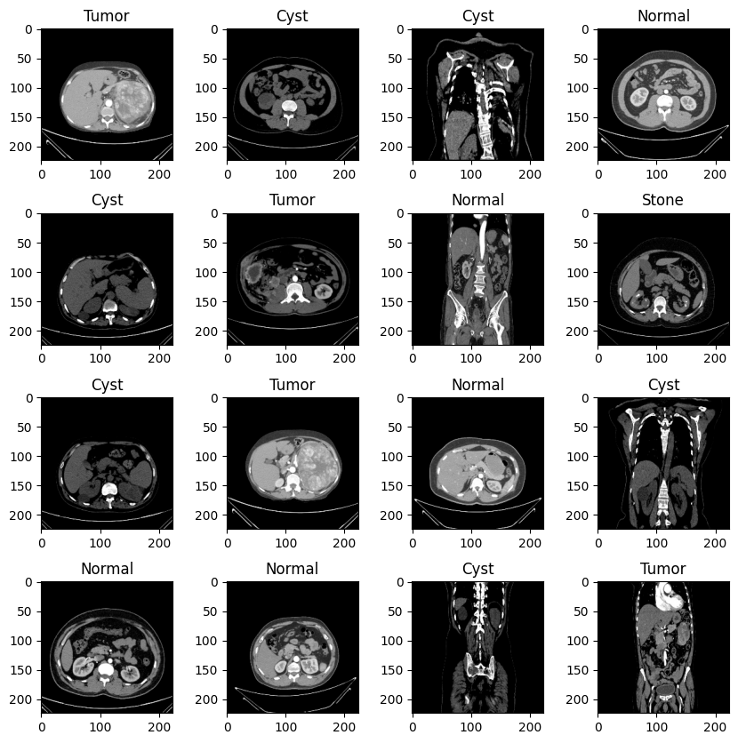

### 归一化：

```python
# 使用map函数对训练数据集train进行操作。map函数接受一个函数，该函数会被应用到数据集中的每个批次。
# lambda是一个匿名函数，这里它接受两个参数x和y，分别代表图像数据和对应的标签。
# x/255是对图像数据进行归一化的操作，将图像像素值从0-255的范围缩放到0-1之间，这通常有助于模型训练的稳定性和收敛速度。
# 最终，归一化后的图像数据x和原始标签y被作为元组返回。
train = train.map(lambda x, y: (x / 255, y))

# 与训练数据集类似，使用map函数对验证数据集val也进行相同的操作。
# 同样的lambda函数被用于将图像数据归一化，并将归一化后的图像与原始标签一起返回。
val = val.map(lambda x, y: (x / 255, y))
```

通过这两行代码，训练和验证数据集中的每个图像都被归一化，以提高模型性能。归一化是一种常见的数据预处理步骤，特别是在使用基于梯度的优化算法进行深度学习训练时。


### 优化数据集的加载过程：

```python
# 从tensorflow.data模块导入AUTOTUNE常量。AUTOTUNE允许tf.data API动态决定一些参数的最佳值，比如buffer_size，以优化数据加载性能。
AUTOTUNE = tf.data.AUTOTUNE

# 对训练数据集train应用cache方法。cache方法将数据集的元素缓存到内存中，这样在每个epoch的迭代中，数据就不需要从磁盘重新读取，从而加快数据读取速度。
# 然后调用prefetch方法，它允许数据集在模型训练的同时预取下一批数据。这可以减少CPU和GPU之间的空闲时间，因为当模型在训练一个批次时，下一个批次的数据已经在准备中了。
# prefetch方法的buffer_size参数设置为AUTOTUNE，这样tf.data API会动态决定最佳的缓冲区大小。
train = train.cache().prefetch(buffer_size=AUTOTUNE)

# 对验证数据集val也进行相同的操作，使用cache和prefetch方法来优化数据读取和预取，提高验证过程的效率。
# 同样，buffer_size参数使用AUTOTUNE，让API自动调整。
val = val.cache().prefetch(buffer_size=AUTOTUNE)
```

这段代码通过使用`cache`和`prefetch`方法，优化了数据集的加载过程，使得数据集在训练和验证过程中可以更快地被访问。这对于大型数据集或需要从较慢的存储介质（如硬盘）读取数据的情况特别有用。

## VGG


### 建立模型：

```python
# 首先，创建一个Sequential模型的实例，这是一个线性堆叠的神经网络模型。
VGG_model = Sequential()

# 使用tf.keras.applications模块中的VGG16函数创建一个预训练的VGG16模型。
# include_top=False表示不包含网络顶部的全连接层，因为我们将添加自己的全连接层。
# input_shape=(150,150,3)指定了输入图像的尺寸和颜色通道数，即150x150像素的彩色图像。
# pooling='max'指示在最后一个卷积层后面接一个最大池化层，而不是全连接层。
# classes=4表示模型的输出将有4个神经元，用于4个类别的分类。
# weights='imagenet'表示使用在ImageNet数据集上预训练的权重来初始化模型。
pretrained_model = tf.keras.applications.VGG16(include_top=False, input_shape=(150,150,3), pooling='max', classes=4, weights='imagenet')

# 将预训练的VGG16模型作为第一个层添加到Sequential模型中。
VGG_model.add(pretrained_model)

# 添加一个Flatten层，该层将VGG16模型输出的二维特征图展平成一维数组，以便于输入到全连接层。
VGG_model.add(Flatten())

# 添加一个具有512个神经元的全连接层，并使用ReLU激活函数。
VGG_model.add(Dense(512, activation='relu'))

# 添加批量归一化层（BatchNormalization），这有助于提高训练的稳定性和速度。
VGG_model.add(BatchNormalization())

# 添加一个Dropout层，丢弃率（rate）为0.5，这意味着在训练过程中有50%的神经元输出将被随机置零，以减少过拟合。
VGG_model.add(Dropout(0.5))

# 添加最后一个全连接层，具有4个神经元，并使用softmax激活函数，以进行多分类任务。
VGG_model.add(Dense(4, activation='softmax'))

# 将预训练的VGG16模型设置为不可训练（冻结），这样在模型训练过程中，VGG16模型的权重将不会更新。
pretrained_model.trainable = False
```

这段代码演示了如何使用预训练的VGG16模型作为特征提取器，并且在此基础上添加了全连接层来完成特定任务的分类。通过冻结预训练模型的权重，可以避免在训练过程中对这些权重进行更新，从而节省训练时间并利用预训练模型的强大特征提取能力。


### 编译模型：

```python
# 使用VGG_model对象的compile方法来配置模型的训练参数。
# compile方法是准备模型进行训练的第一步，它设置了模型的优化器、损失函数和评估指标。
VGG_model.compile(
    # 指定优化器为'adam'，这是一种广泛使用的随机梯度下降优化算法，以其良好的性能和快速收敛而闻名。
    optimizer='adam',
    # 指定损失函数为'sparse_categorical_crossentropy'，这是一种适用于多分类问题并且标签是整数的情况的损失函数。
    # 它计算的是实际输出概率分布和目标概率分布之间的交叉熵。
    loss='sparse_categorical_crossentropy',
    # 指定在训练和验证过程中要计算的评估指标，这里选择了['accuracy']，即准确率。
    # 准确率是正确分类的样本数占总样本数的比例，是衡量分类模型性能的一个常用指标。
    metrics=['accuracy']
)
```

这段代码通过编译模型，为接下来的模型训练做好了准备。选择的优化器、损失函数和评估指标对于模型能否有效学习以及如何评估学习效果至关重要。


### 模型结构详细报告：

```python
# 调用VGG_model对象的summary方法。
# summary方法会打印出模型的详细结构，包括模型中每一层的名称、类型、输出形状、参数数量等信息。
# 这个方法对于可视化和理解模型的架构非常有帮助，特别是在模型较为复杂时。
VGG_model.summary()
```

通过执行这一行代码，你将能够获得一个关于VGG模型每一层的详细报告，包括每层的参数数量，这有助于你了解整个模型的复杂度和潜在的过拟合风险。

#### 结果展示:

```python
Model: "sequential"
_________________________________________________________________
 Layer (type)                Output Shape              Param #   
=================================================================
 vgg16 (Functional)          (None, 512)               14714688  
                                                                 
 flatten (Flatten)           (None, 512)               0         
                                                                 
 dense (Dense)               (None, 512)               262656    
                                                                 
 batch_normalization (BatchN  (None, 512)              2048      
 ormalization)                                                   
                                                                 
 dropout (Dropout)           (None, 512)               0         
                                                                 
 dense_1 (Dense)             (None, 4)                 2052      
                                                                 
=================================================================
Total params: 14,981,444
Trainable params: 265,732
Non-trainable params: 14,715,712
_________________________________________________________________
```
#### 结果解读：
上述代码的运行结果提供了关于构建的VGG模型的详细架构信息。下面是对输出结果的解读：

```
Model: "sequential"
_________________________________________________________________
Layer (type)                Output Shape              Param #   
=================================================================

 vgg16 (Functional)          (None, 512)               14714688  
                                                                 
 flatten (Flatten)           (None, 512)               0         
                                                                 
 dense (Dense)               (None, 512)               262656    
                                                                 
 batch_normalization (BatchN  (None, 512)              2048      
 ormalization)                                                    
                                                                 
 dropout (Dropout)           (None, 512)               0         
                                                                 
 dense_1 (Dense)             (None, 4)                 2052      
                                                                 
=================================================================
Total params: 14,981,444
Trainable params: 265,732
Non-trainable params: 14,715,712
_________________________________________________________________
```

- `Model: "sequential"`: 这表明模型是一个Sequential模型实例，它是Keras中用于构建神经网络的线性层的集合。

- `Layer (type)`: 列出了模型中每一层的名称和类型。

- `Output Shape`: 描述了每一层的输出形状。例如，`(None, 512)` 表示该层输出一个大小为 512 的一维数组，`None` 是批次大小，它可以是任意值。

- `Param #`: 表示该层的参数数量。

- `vgg16 (Functional)`: 这是预训练的VGG16模型，作为第一层添加到Sequential模型中。它的输出形状是 `(None, 512)`，参数数量是 `14714688`。

- `flatten (Flatten)`: 这是一个展平层，将VGG16的输出展平成一维数组。它没有额外的参数（`Param #` 为 0）。

- `dense (Dense)`: 这是一个具有512个神经元的全连接层，使用ReLU激活函数。它的参数数量是 `262656`。

- `batch_normalization (BatchNormalization)`: 批量归一化层，有助于提高训练稳定性。它的参数数量是 `2048`。

- `dropout (Dropout)`: Dropout层，丢弃率为0.5，没有额外的参数。

- `dense_1 (Dense)`: 最后的全连接层，具有4个神经元，使用softmax激活函数进行多分类。它的参数数量是 `2052`。

- `Total params: 14,981,444`: 模型的总参数数量。

- `Trainable params: 265,732`: 可以训练的参数数量，由于预训练的VGG16模型被冻结（`pretrained_model.trainable = False`），因此只有我们添加的层的参数是可以训练的。

- `Non-trainable params: 14,715,712`: 不可训练的参数数量，即预训练的VGG16模型中的参数。

模型的summary提供了一个快速的概览，帮助你理解模型的结构和参数数量，这对于调试和优化模型非常有用。

### 训练模型：

```python
# 定义一个变量epochs，设置其值为10。这个变量代表训练模型时将要进行的迭代次数，也就是训练周期(epoch)的数量。
epochs = 10

# 使用VGG_model对象的fit方法开始训练模型。
# fit方法是用于训练模型的函数，它将数据输入模型并根据提供的优化器和损失函数调整模型的权重。
history = VGG_model.fit(
    # 将train数据集作为训练数据输入模型。
    train,
    # validation_data参数指定了验证集，这里使用的是之前定义的val数据集。在每个epoch结束后，模型将在验证集上进行评估。
    validation_data=val,
    # epochs参数设置为之前定义的epochs变量，即训练将进行10个epoch。
    epochs=epochs
)

# 训练完成后，history变量将包含训练过程中的所有记录，包括每个epoch的训练和验证损失(loss)以及准确率(accuracy)。这些信息可以用来分析模型的学习过程和性能。
```

这段代码启动了模型的训练过程，并且每经过一个epoch，都会在训练集和验证集上评估模型的性能。训练结束后，`history`对象包含了整个训练过程中的重要信息，这些信息对于后续分析模型的学习动态和调试模型非常有帮助。
#### 结果展示：
```python
Epoch 1/10
351/351 [==============================] - 44s 99ms/step - loss: 0.4578 - accuracy: 0.8355 - val_loss: 0.1917 - val_accuracy: 0.9438
Epoch 2/10
351/351 [==============================] - 16s 45ms/step - loss: 0.1794 - accuracy: 0.9394 - val_loss: 0.1030 - val_accuracy: 0.9707
Epoch 3/10
351/351 [==============================] - 16s 45ms/step - loss: 0.1409 - accuracy: 0.9539 - val_loss: 0.1080 - val_accuracy: 0.9695
Epoch 4/10
351/351 [==============================] - 16s 45ms/step - loss: 0.1169 - accuracy: 0.9617 - val_loss: 0.0766 - val_accuracy: 0.9823
Epoch 5/10
351/351 [==============================] - 16s 45ms/step - loss: 0.0961 - accuracy: 0.9665 - val_loss: 0.0744 - val_accuracy: 0.9783
Epoch 6/10
351/351 [==============================] - 16s 45ms/step - loss: 0.0902 - accuracy: 0.9672 - val_loss: 0.0577 - val_accuracy: 0.9851
Epoch 7/10
351/351 [==============================] - 16s 45ms/step - loss: 0.0802 - accuracy: 0.9731 - val_loss: 0.0794 - val_accuracy: 0.9771
Epoch 8/10
351/351 [==============================] - 16s 45ms/step - loss: 0.0847 - accuracy: 0.9705 - val_loss: 0.0986 - val_accuracy: 0.9667
Epoch 9/10
351/351 [==============================] - 16s 45ms/step - loss: 0.0669 - accuracy: 0.9785 - val_loss: 0.0360 - val_accuracy: 0.9900
Epoch 10/10
351/351 [==============================] - 16s 45ms/step - loss: 0.0673 - accuracy: 0.9764 - val_loss: 0.0535 - val_accuracy: 0.9815
```

#### 结果解读：
上述代码的运行结果展示了使用VGG模型进行图像分类任务的训练过程。下面是对输出结果的解读：

- `Epoch 1/10`：这表示训练过程开始，并且这是10个epoch中的第1个epoch。

- `351/351 [==============================]`：这表示该epoch中的所有351个批次都已完成训练。

- `44s 99ms/step`：这表示整个epoch的训练时间，以及平均每个步骤（即每个批次）所需的时间。

- `loss: 0.4578 - accuracy: 0.8355`：这表示该epoch在训练集上的平均损失和准确率。损失是0.4578，准确率是83.55%。

- `val_loss: 0.1917 - val_accuracy: 0.9438`：这表示该epoch在验证集上的平均损失和准确率。损失是0.1917，准确率是94.38%。

随着epoch的增加，我们可以看到以下趋势：

- 训练损失（`loss`）和验证损失（`val_loss`）都在逐渐减小，这表明模型在训练集和验证集上的表现都在提升。

- 训练准确率（`accuracy`）和验证准确率（`val_accuracy`）都在逐渐增加，这同样表明模型的性能在提升。

具体到每个epoch：

- 在第2个epoch，训练损失显著下降到0.1794，训练准确率提高到93.94%。验证损失也下降到0.1030，验证准确率提高到97.07%。

- 在第4个epoch，验证准确率达到了98.23%，这是一个相当高的准确率，表明模型在验证集上的表现非常好。

- 在第9个epoch，验证准确率达到了最高的99.00%，而训练准确率也达到了97.85%。

- 在最后一个epoch（第10个epoch），验证准确率为98.15%，训练准确率为97.64%。

总体来说，模型在训练过程中表现出了良好的性能，训练和验证的损失都在减小，准确率都在增加。这表明模型成功地学习了分类任务，并且具有良好的泛化能力。然而，也要注意过拟合的风险，特别是如果验证准确率在达到一定水平后不再提升，而训练准确率仍然在提高。


### 将模型训练过程中收集的历史数据转换成一个结构化的表格：

```python
# 使用pandas库中的DataFrame函数将history对象转换成一个Pandas DataFrame对象。history对象是模型的fit方法返回的，它包含了模型训练和验证过程中的损失和准确率等信息。
history_df = pd.DataFrame(history.history)

# 使用DataFrame对象的to_csv方法将数据保存到CSV文件中。'VGG_training.csv'是指定的文件名，这个文件将包含模型训练的历史记录。
# index=False参数表示在保存时不包括行索引，因为行索引通常是自动生成的，不一定需要保存。
history_df.to_csv('VGG_training.csv', index=False)
```

这段代码的作用是将模型训练过程中收集的历史数据转换成一个结构化的表格，然后将其保存到CSV文件中。CSV文件是一种常见的数据存储格式，可以方便地被多种数据分析工具和软件读取和处理。这样做有助于后续对模型训练过程的回顾和分析。


### 保存模型：

```python
# 使用VGG_model对象的save方法将整个模型保存到指定的文件中。
# 'VGG_model.h5'是文件的保存路径及名称。.h5是HDF5格式的文件扩展名，这是一种用于存储和组织大量数据的文件格式，常用于保存深度学习模型。
# 保存模型后，可以重新加载该模型，包括其架构、权重和优化器状态等，以便进行后续的推理或继续训练。
VGG_model.save('VGG_model.h5')
```

这段代码的作用是将训练好的VGG模型保存到本地磁盘上的一个文件中。使用HDF5格式保存模型是一种常见的做法，因为这种格式能够高效地存储模型的复杂结构和参数。保存后的模型文件可以用于模型的部署、共享或将来的进一步训练。


### 绘制训练集损失和验证损失随训练周期变化的曲线图：

```python
# 从历史记录history.history中提取训练损失，存储在变量loss中。
# history.history是一个字典，包含了训练过程中的各种指标，'loss'键对应的值是训练损失的列表。
loss = history.history['loss']

# 从历史记录history.history中提取验证损失，存储在变量val_loss中。
# 'val_loss'键对应的值是验证损失的列表，它是在每个epoch结束后在验证集上计算得到的。
val_loss = history.history['val_loss']

# 使用range函数生成一个与损失列表长度相同的整数序列，作为横坐标的epochs。
# 因为range的上限是排他性的，所以使用len(loss)+1来确保包含所有epoch。
epochs = range(1, len(loss) + 1)

# 使用matplotlib的pyplot模块绘制训练损失和验证损失曲线。
# 'b'表示线条颜色为蓝色，'label'参数为'Training loss'设置训练损失曲线的图例。
plt.plot(epochs, loss, 'b', label='Training loss')

# 绘制验证损失曲线，线条颜色为红色，图例为'Validation loss'。
plt.plot(epochs, val_loss, 'r', label='Validation loss')

# 设置图表的标题为'Training and Validation Loss'。
plt.title('Training and Validation Loss')

# 设置x轴的标签为'Epochs'。
plt.xlabel('Epochs')

# 设置y轴的标签为'Loss'。
plt.ylabel('Loss')

# 调用legend函数显示图例。
plt.legend()

# 调用show函数展示整个图表。
# 这将弹出一个窗口，显示了训练损失和验证损失随epoch变化的曲线图，用于分析模型训练过程中损失的变化趋势。
plt.show()
```

这段代码通过绘制训练损失和验证损失随训练周期变化的曲线图，提供了一种直观的方式来观察模型在训练过程中的性能变化。这对于理解模型的学习能力、诊断过拟合或欠拟合问题以及决定何时停止训练都是非常有用的。

#### 结果展示：
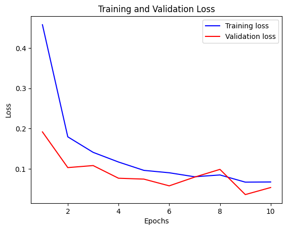


#### 结果解读：
解读如下：

1. **训练损失和验证损失曲线**：代码中使用`plt.plot()`函数绘制了两条曲线，一条代表训练损失（蓝色），另一条代表验证损失（红色）。这些曲线展示了随着训练周期（Epochs）的增加，损失值是如何变化的。

2. **图表标题**：`plt.title('Training and Validation Loss')`设置了图表的标题，清晰地表明了图表展示的是训练和验证损失。

3. **轴标签**：`plt.xlabel('Epochs')`和`plt.ylabel('Loss')`分别设置了x轴和y轴的标签，说明了横轴代表训练周期，纵轴代表损失值。

4. **图例**：`plt.legend()`添加了图例，帮助识别不同的曲线，这里是训练损失和验证损失。

5. **显示图表**：`plt.show()`展示了整个图表，用户可以看到随着Epochs增加，训练损失和验证损失的趋势。

6. **曲线趋势解读**：
   - 如果训练损失随着Epochs的增加而单调下降，这表明模型在训练集上的表现正在改善。
   - 验证损失通常应该显示出类似的下降趋势，表明模型在未见过的验证集上也表现出了良好的泛化能力。
   - 如果验证损失在某个点之后开始上升，而训练损失继续下降，这可能是过拟合的迹象，即模型对训练数据过于敏感，但无法很好地推广到新数据。

7. **图表显示**：根据您提供的资源“image-1.png”，我们可以看到训练损失和验证损失都随着Epochs的增加而下降。这表明模型在训练过程中逐渐学习，并且在验证集上也表现良好。然而，我们没有具体的数值，无法判断是否存在过拟合或欠拟合的情况。

8. **Epochs的数量**：在图表中，x轴的Epochs范围是从6到10，而不是通常的10个Epochs。这可能是因为模型训练在第6个Epoch开始记录或显示，或者是为了更详细地观察特定Epochs范围内的损失变化。

9. **损失的尺度**：y轴的损失值范围从0.1到0.4，这表明模型的损失值相对较低，这通常意味着模型的性能较好。

通过这些曲线，我们可以对模型的训练过程有一个直观的了解，它们是评估模型性能的重要工具。


### 绘制训练集准确率和验证准确率随训练周期变化的曲线图：

```python
# 从历史记录history.history中提取训练准确率，存储在变量acc中。
# 'accuracy'键对应的值是训练准确率的列表，它记录了每个epoch后模型在训练集上的准确率。
acc = history.history['accuracy']

# 从历史记录history.history中提取验证准确率，存储在变量val_acc中。
# 'val_accuracy'键对应的值是验证准确率的列表，记录了每个epoch后模型在验证集上的准确率。
val_acc = history.history['val_accuracy']

# 使用matplotlib的pyplot模块绘制训练准确率和验证准确率曲线。
# 'b'表示线条颜色为蓝色，'label'参数为'Training acc'设置训练准确率曲线的图例。
plt.plot(epochs, acc, 'b', label='Training acc')

# 绘制验证准确率曲线，线条颜色为红色，图例为'Validation acc'。
plt.plot(epochs, val_acc, 'r', label='Validation acc')

# 设置图表的标题为'Training and Validation Accuracy'。
plt.title('Training and Validation Accuracy')

# 设置x轴的标签为'Epochs'。
plt.xlabel('Epochs')

# 设置y轴的标签为'Accuracy'。
plt.ylabel('Accuracy')

# 调用legend函数显示图例。
plt.legend()

# 调用show函数展示整个图表。
# 这将弹出一个窗口，显示了训练准确率和验证准确率随epoch变化的曲线图，用于分析模型训练过程中准确率的变化趋势和模型的泛化能力。
plt.show()
```

这段代码通过绘制训练准确率和验证准确率随训练周期变化的曲线图，提供了一种直观的方式来观察模型在训练过程中的准确率变化。这对于评估模型的性能、理解模型在训练集和验证集上的表现差异是非常有用的。图例、标题、坐标轴标签以及图例都增强了图表的可读性和信息的清晰度。

#### 结果展示：

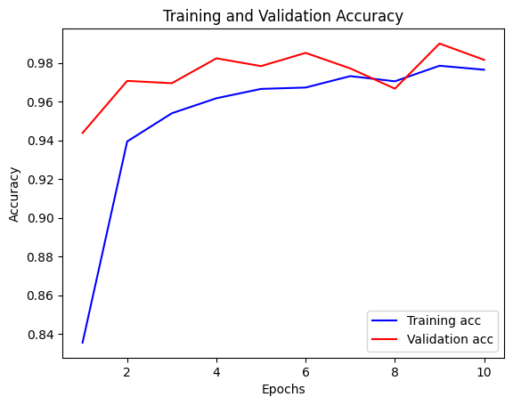

#### 结果解释：
解读如下：

1. **训练准确率和验证准确率曲线**：代码中使用`plt.plot()`函数绘制了两条曲线，一条代表训练准确率（蓝色），另一条代表验证准确率（红色）。这些曲线展示了随着训练周期（Epochs）的增加，准确率是如何变化的。

2. **图表标题**：`plt.title('Training and Validation Accuracy')`设置了图表的标题，清晰地表明了图表展示的是训练和验证的准确率。

3. **轴标签**：`plt.xlabel('Epochs')`和`plt.ylabel('Accuracy')`分别设置了x轴和y轴的标签，说明了横轴代表训练周期，纵轴代表准确率。

4. **图例**：`plt.legend()`添加了图例，帮助识别不同的曲线，这里是训练准确率和验证准确率。

5. **显示图表**：`plt.show()`展示了整个图表，用户可以看到随着Epochs增加，准确率的趋势。

6. **曲线趋势解读**：
   - 训练准确率（蓝色曲线）和验证准确率（红色曲线）都随着Epochs的增加而提高，这表明模型在训练集和验证集上的性能都在提升。
   - 准确率的数值从0.84左右开始，逐渐增加，这表明初始模型的性能已经相对较好。

7. **图表显示**：根据您提供的资源“image-2.png”，我们可以看到训练准确率和验证准确率都随着Epochs的增加而稳步上升。这通常意味着模型在训练过程中逐渐学习，并且在验证集上也表现良好。

8. **Epochs的数量**：在图表中，x轴的Epochs范围是从2到10，这可能意味着模型训练是从第2个Epoch开始记录或显示，或者是为了更详细地观察特定Epochs范围内的准确率变化。

9. **准确率的尺度**：y轴的准确率范围从0.86到0.98，这表明模型的准确率从86%增加到了98%，显示出模型性能有显著的提升。

10. **泛化能力**：如果验证准确率与训练准确率相似或几乎同步增长，这通常被视为模型具有良好的泛化能力的迹象。过拟合的风险较低。

通过这些曲线，我们可以对模型的训练过程有一个直观的了解，它们是评估模型性能的重要工具。高准确率和两条曲线的相似趋势表明模型训练效果很好，并且很可能在新数据上也能表现良好。


### 导入库：

```python
# 导入NumPy库，这是一个适用于科学计算的库，提供了多维数组对象以及一系列操作这些数组的函数。
import numpy as np

# 导入matplotlib的pyplot模块，这是一个用于创建静态、交互式和动画可视化的库。
import matplotlib.pyplot as plt

# 从sklearn.metrics模块导入混淆矩阵(confusion_matrix)和混淆矩阵展示工具(ConfusionMatrixDisplay)。
# 混淆矩阵是一个重要的工具，用于可视化分类模型的性能，特别是在多分类问题中。
# ConfusionMatrixDisplay是用于显示混淆矩阵的类，它提供了一个图形化界面来更好地理解模型预测的结果。
from sklearn.metrics import confusion_matrix, ConfusionMatrixDisplay

# 导入TensorFlow库，这是一个开源的机器学习库，广泛用于深度学习模型的构建、训练和部署。
import tensorflow as tf
```

这段代码导入了进行机器学习和深度学习任务时常用的几个库。NumPy用于数值计算，matplotlib用于数据可视化，sklearn用于计算混淆矩阵并展示，TensorFlow用于构建和训练深度学习模型。


### 使用训练好的模型对验证集进行预测：

```python
# 导入pickle库，这是一个Python中用于序列化和反序列化的对象结构，可以用于存储和检索数据结构。
import pickle

# 从sklearn.metrics模块导入混淆矩阵(confusion_matrix)函数，该函数用于生成混淆矩阵，是评估分类模型性能的一个重要工具。
from sklearn.metrics import confusion_matrix

# 导入TensorFlow库，这是一个用于机器学习和深度神经网络的开源库，广泛用于构建和训练深度学习模型。
import tensorflow as tf

# 使用训练好的VGG_model模型对验证集val进行预测，得到预测结果。
predictions = VGG_model.predict(val)

# 从验证集val中提取真实的标签。val是一个tf.data.Dataset对象，它由多组数据(x, y)组成。
# 使用列表推导式和np.concatenate合并所有真实的标签到一个NumPy数组中，以便与预测结果进行比较。
true_labels = np.concatenate([y for x, y in val], axis=0)

# 使用混淆矩阵函数计算模型预测结果和真实标签之间的混淆矩阵。np.argmax函数用于从预测结果中选择概率最高的类别作为预测类别。
cm = confusion_matrix(true_labels, np.argmax(predictions, axis=1))

# 使用with语句打开文件'confusion_matrix.pkl'，以二进制写入模式('wb')。
# with语句可以确保文件正确关闭，即使在发生异常的情况下也是如此。
with open('confusion_matrix.pkl', 'wb') as f:
    # 使用pickle.dump函数将混淆矩阵cm序列化并保存到文件中。这允许以后可以重新加载混淆矩阵进行进一步分析。
    pickle.dump(cm, f)
```

这段代码展示了如何使用训练好的模型对验证集进行预测，计算混淆矩阵，并使用pickle将混淆矩阵序列化并保存到文件中。混淆矩阵是一个重要的工具，可以帮助我们理解模型在各个类别上的表现，特别是在多分类问题中。通过序列化混淆矩阵，我们可以方便地将其存储和传输，以便后续分析或报告。


### 展示一个图形化的混淆矩阵：

```python
# 导入pickle库，这是一个用于序列化和反序列化Python对象的库，可以用于从文件中读取和写入数据结构。
import pickle

# 导入NumPy库，这是一个适用于科学计算的库，提供了多维数组对象以及一系列操作这些数组的函数。
import numpy as np

# 导入matplotlib的pyplot模块，这是一个用于创建静态、交互式和动画可视化的库。
import matplotlib.pyplot as plt

# 从sklearn.metrics模块导入ConfusionMatrixDisplay类，这是一个用于图形化展示混淆矩阵的工具。
from sklearn.metrics import ConfusionMatrixDisplay

# 使用with语句打开文件'confusion_matrix.pkl'，以二进制读取模式('rb')。
# with语句可以确保文件在使用后正确关闭，即使在发生异常的情况下也是如此。
with open('confusion_matrix.pkl', 'rb') as f:
    # 使用pickle.load函数从文件中读取之前保存的混淆矩阵cm。
    cm = pickle.load(f)

# 定义一个列表class_names，包含模型分类任务中所有类别的名称。这将用于在混淆矩阵的轴上显示类别名称。
class_names = ['Cyst', 'Normal', 'Stone', 'Tumor']

# 创建一个ConfusionMatrixDisplay对象disp，传入混淆矩阵cm和类别名称class_names。
disp = ConfusionMatrixDisplay(confusion_matrix=cm, display_labels=class_names)

# 调用disp对象的plot方法来绘制混淆矩阵。
# cmap参数设置为'viridis'，这指定了颜色映射，用于根据不同的值显示不同的颜色。
# xticks_rotation参数设置为'vertical'，这指定了x轴上的刻度标签的旋转方式，'vertical'表示垂直旋转，使得标签更易读。
# values_format参数设置为'd'，这指定了混淆矩阵中的数值显示格式，'d'表示以整数形式显示。
disp.plot(cmap='viridis', xticks_rotation='vertical', values_format='d')

# 调用plt.show()函数来展示混淆矩阵图形。这将弹出一个窗口，显示了混淆矩阵的图形化表示。
plt.show()
```

这段代码通过加载之前保存的混淆矩阵，并使用`ConfusionMatrixDisplay`和`matplotlib`来生成并展示一个图形化的混淆矩阵。混淆矩阵是一个重要的工具，用于可视化分类模型的性能，尤其是在多分类问题中。通过图形化的展示，我们可以更直观地看到模型在各个类别上的表现，以及可能存在的混淆情况。


#### 结果展示：
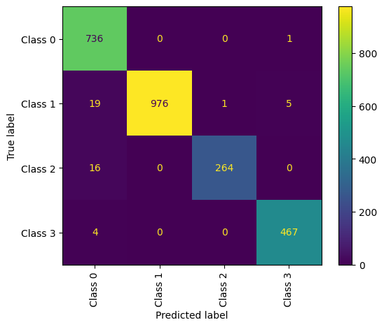

#### 结果解释：
解读如下：

1. **混淆矩阵的创建**：代码首先使用`VGG_model.predict(val)`对验证集`val`进行预测，然后通过`confusion_matrix`函数计算了模型预测结果和真实标签之间的混淆矩阵，并将其序列化保存到文件`confusion_matrix.pkl`。

2. **混淆矩阵的可视化**：随后，代码使用`ConfusionMatrixDisplay`类从保存的文件中加载混淆矩阵，并将其可视化。

3. **图表显示**：`plt.show()`展示了整个混淆矩阵的图形化表示，通常是一个热图，其中行代表真实类别，列代表预测类别。

4. **混淆矩阵的内容**：根据您提供的资源“image-3.png”，我们可以看到混淆矩阵的布局和一些数值。这个混淆矩阵是一个4x4的矩阵，对应于4个类别（Class 0到Class 3）。

5. **对角线和非对角线元素**：
   - 对角线上的元素（从左上角到右下角的元素）表示正确预测的数量，也就是说，模型预测正确的类别与实际类别相符的样本数。
   - 非对角线上的元素表示错误预测的数量，也就是说，模型预测的类别与实际类别不相符的样本数。

6. **类别名称**：混淆矩阵的轴标签由`class_names`列表提供，包含['Cyst', 'Normal', 'Stone', 'Tumor']，分别对应于混淆矩阵的行和列。

7. **模型性能解读**：
   - `Class 0`的对角线元素是736，这意味着有736个属于`Class 0`的样本被正确预测。
   - `Class 1`的对角线元素是976，这意味着有976个属于`Class 1`的样本被正确预测。
   - `Class 2`的对角线元素是264，这意味着有264个属于`Class 2`的样本被正确预测。
   - `Class 3`的对角线元素是467，这意味着有467个属于`Class 3`的样本被正确预测。

8. **错误分类**：非对角线上的数值表示错误分类的数量。例如，`Class 0`有19个样本被错误地预测为`Class 1`。

9. **颜色映射**：`cmap='viridis'`参数为混淆矩阵指定了颜色映射，通常用于通过颜色的深浅来表示数值的大小。

10. **刻度标签旋转**：`xticks_rotation='vertical'`参数使得x轴上的刻度标签垂直显示，这有助于在混淆矩阵中更清晰地阅读类别名称。

11. **数值格式**：`values_format='d'`参数确保混淆矩阵中的数值以整数形式显示。

混淆矩阵是一个强大的工具，可以帮助我们理解模型在各个类别上的预测性能，以及是否存在某些类别之间的混淆。通过分析混淆矩阵，我们可以识别模型的强项和弱点，并据此做出改进。

### 训练好的VGG模型对单个图像进行预测，并输出预测的类别名称：

```python
# 使用OpenCV库的imread函数读取指定路径下的图像文件。
# 这里读取的是一个名为'Cyst- (1).jpg'的图像，它位于Kaggle输入数据集的'Cyst'子目录中。
img = cv2.imread('/kaggle/input/ct-kidney-dataset-normal-cyst-tumor-and-stone/CT-KIDNEY-DATASET-Normal-Cyst-Tumor-Stone/CT-KIDNEY-DATASET-Normal-Cyst-Tumor-Stone/Cyst/Cyst- (1).jpg')

# 使用matplotlib的pyplot模块展示读取到的图像。
# imshow函数将图像显示在屏幕上。
plt.imshow(img)

# 调用show函数来展示图像。
# 这将弹出一个窗口，显示了加载的图像。
plt.show()

# 使用TensorFlow的image.resize函数将图像大小调整为150x150像素。
# 这个尺寸与之前模型训练时使用的输入尺寸一致。
resize = tf.image.resize(img, (150, 150))

# 将调整大小后的图像通过VGG_model进行预测。
# 由于模型预期的输入是一个批次的图像，这里使用np.expand_dims将图像数组扩展到一个新的维度，形成一个新的轴0，从而满足模型输入的批次要求。
# 同时，图像数据被归一化到0-1范围内，这是因为模型是在归一化后的数据上训练的。
yhat = VGG_model.predict(np.expand_dims(resize / 255, 0))

# 使用NumPy的argmax函数找出预测概率最高的类别索引。
# 这将给出一个整数，表示在模型预测中哪个类别的概率最高。
max_index = np.argmax(yhat)

# 使用之前定义的label_to_class_name字典，通过预测得到的类别索引获取对应的类别名称。
# 这将给出一个字符串，表示预测结果中概率最高的类别的名称。
label_to_class_name[max_index]
```

这段代码展示了如何使用训练好的VGG模型对单个图像进行预测，并输出预测的类别名称。首先，它读取一个图像文件，然后调整图像大小以匹配模型的输入要求，接着归一化图像数据并进行预测。最后，它通过索引获取预测结果中概率最高的类别名称。这个过程是深度学习模型用于图像分类任务中的典型应用流程。

#### 结果展示：


```python
1/1 [==============================] - 0s 171ms/step
'Normal'
```

#### 结果解释：
解读如下：

1. **图像读取**：代码使用`cv2.imread()`函数读取了一个位于特定路径下的图像文件`'Cyst- (1).jpg'`。这个图像文件是Kaggle数据集中的一部分。

2. **图像展示**：使用`matplotlib.pyplot.imshow()`函数展示了读取到的图像，然后使用`plt.show()`函数将图像显示在弹出的窗口中。

3. **图像调整尺寸**：由于模型训练时使用的输入尺寸是150x150像素，代码中使用`tf.image.resize()`函数将读取的图像调整到这个尺寸。

4. **模型预测**：将调整尺寸后的图像数据通过之前训练好的`VGG_model`进行预测。由于模型需要一个批次的图像作为输入，这里使用`np.expand_dims()`将图像数据增加一个批次维度，并进行了归一化处理。

5. **预测结果**：使用`VGG_model.predict()`得到的预测结果是一个概率分布，表示模型对每个类别的预测概率。

6. **选择最可能的类别**：使用`np.argmax()`函数从预测结果中选择概率最高的类别索引。

7. **类别名称映射**：通过一个假设已经定义好的映射`label_to_class_name`，将预测得到的类别索引转换为人类可读的类别名称。

8. **输出结果**：`1/1 [==============================] - 0s 171ms/step` 表示模型对单个图像的预测已经完成，预测过程耗时171毫秒。

9. **预测类别**：最终输出的字符串`'Normal'`是模型预测得到的类别名称，这意味着模型预测这张图像为“正常”类别。

10. **解读**：根据上述步骤，代码的目的是展示如何使用训练好的VGG模型对单个图像进行分类预测，并输出预测结果。在这种情况下，模型预测了一张图像属于“正常”类别。

11. **注意**：为了使代码正常工作，需要确保`label_to_class_name`映射已经定义，并且包含了模型能预测的所有类别名称。此外，由于图像数据需要归一化，所以在预测之前对图像进行了归一化处理。

通过这种方式，可以对单个图像或图像集合进行分类预测，并将预测结果用于进一步的分析或决策。


## MOBILENET


### 使用预训练的MobileNetV2模型，构建一个新的分类模型：

```python
# 从tensorflow.keras.applications模块导入MobileNetV2类，这是一个预训练的深度学习模型，适用于图像分类任务。
from tensorflow.keras.applications import MobileNetV2

# 从tensorflow.keras.regularizers模块导入l2正则化器，这是一种用于防止神经网络过拟合的技术。
from tensorflow.keras.regularizers import l2

# 定义输入图像的形状，这里设置为224x224像素的彩色图像，即3个颜色通道。
input_shape = (224, 224, 3)

# 创建MobileNetV2模型的实例，使用ImageNet预训练权重，但不包括网络顶部的全连接层（因为我们要添加自己的全连接层）。
MobileNetV2_model = MobileNetV2(input_shape=input_shape, weights='imagenet', include_top=False)

# 通过循环移除MobileNetV2模型顶部的8个层，通常是一些全连接层或者上采样层，因为我们将用自己的层替换它们。
for _ in range(8):
    MobileNetV2_model.layers.pop()

# 将MobileNetV2模型中所有层设置为可训练。通常，预训练模型的某些层在开始时是冻结的（不可训练），但在这里我们希望它们能够进行训练。
for layer in MobileNetV2_model.layers:
    layer.trainable = True

# 使用GlobalAveragePooling2D层将MobileNetV2模型的输出进行全局平均池化，这将转换为一个固定大小的向量。
x = GlobalAveragePooling2D()(MobileNetV2_model.output)

# 添加一个具有512个神经元的全连接层，使用ReLU激活函数，并应用L2正则化器，正则化因子为1e-4。
x = Dense(512, activation='relu', kernel_regularizer=l2(1e-4))(x)

# 再次添加一个具有256个神经元的全连接层，同样使用ReLU激活函数和L2正则化器。
x = Dense(256, activation='relu', kernel_regularizer=l2(1e-4))(x)

# 添加输出层，这是一个具有4个神经元的全连接层，使用softmax激活函数，用于多分类问题。
output = Dense(4, activation='softmax')(x)

# 使用Model类创建一个新的模型，将MobileNetV2模型的输入和新构建的全连接层的输出作为输入和输出。
mobile_net = Model(inputs=MobileNetV2_model.input, outputs=output)
```

这段代码演示了如何使用预训练的MobileNetV2模型作为特征提取器，并通过移除其顶部的层，然后添加自定义的全连接层来构建一个新的分类模型。通过这种方式，我们可以使用预训练模型的强大特征提取能力，并通过微调（fine-tuning）来适应特定的分类任务。


### 编译模型：

```python
# 对mobile_net模型调用compile方法来配置模型的训练参数。
# compile方法是准备模型进行训练的第一步，它设置了模型的优化器、损失函数和评估指标。
mobile_net.compile(
    # optimizer参数指定优化器为'adam'，这是一种自适应学习率的优化算法，常用于深度学习任务中。
    optimizer='adam',
    # loss参数指定损失函数为'sparse_categorical_crossentropy'，适用于多分类问题，其中标签是整数形式。
    loss='sparse_categorical_crossentropy',
    # metrics参数指定在训练过程中要监控的指标是准确率（'accuracy'），这是衡量分类模型性能的一个常用指标。
    metrics=['accuracy']
)
```

这段代码通过编译模型，为接下来的模型训练做好了准备。选择的优化器、损失函数和评估指标对于模型能否有效学习以及如何评估学习效果至关重要。

### 查看模型的每一层以及整体架构
```python
# mobile_net.summary()
```

代码只有一行注释，我将对其进行解释并提供相应的### 中文注释：

```python
# 这一行是Python中的单行注释，使用了#符号。它说明了接下来的代码行是不可执行的注释内容。
# mobile_net.summary() 是一个被注释掉的代码行，它调用了mobile_net模型的summary方法。
# 如果取消注释（即删除#符号），该行代码将会执行，打印出mobile_net模型的详细结构，包括每一层的名称、类型、输出形状、参数数量等信息。
# 这个方法对于可视化和理解模型的架构非常有帮助，尤其是在模型较为复杂时。
# mobile_net.summary()
```

在实际使用中，取消注释（即删除`#`符号）后，`mobile_net.summary()` 将非常有用，尤其是当你需要查看模型的每一层以及整体架构时。在模型构建阶段和训练之前，这是一个非常有用的实践，有助于确保模型结构符合预期。


### 训练模型：

```python
# 定义变量epochs并设置其值为15，这个变量代表训练模型时将要进行的迭代次数，也就是训练周期(epoch)的数量。
epochs = 15

# 使用mobile_net模型的fit方法开始训练模型。
# fit方法是用于训练模型的函数，它将数据输入模型并根据提供的优化器和损失函数调整模型的权重。
history = mobile_net.fit(
    # 将train数据集作为训练数据输入模型。
    train,
    # validation_data参数指定了验证集，这里使用的是之前定义的val数据集。
    # 在每个epoch结束后，模型将在验证集上进行评估，以监控模型在未见数据上的表现。
    validation_data=val,
    # epochs参数设置为之前定义的epochs变量，即训练将进行15个epoch。
    epochs=epochs
)

# 训练完成后，history变量将包含训练过程中的所有记录，包括每个epoch的训练和验证损失(loss)以及准确率(accuracy)。
# 这些信息可以用来分析模型的学习过程和性能。
```

这段代码启动了模型的训练过程，并且每经过一个epoch，都会在训练集和验证集上评估模型的性能。训练结束后，`history`对象包含了整个训练过程中的重要信息，这些信息对于后续分析模型的学习动态和调试模型非常有帮助。

#### 结果展示：
```python
Epoch 1/15
351/351 [==============================] - 59s 89ms/step - loss: 0.2410 - accuracy: 0.9380 - val_loss: 8.8283 - val_accuracy: 0.3957
Epoch 2/15
351/351 [==============================] - 30s 87ms/step - loss: 0.0972 - accuracy: 0.9838 - val_loss: 9.9284 - val_accuracy: 0.5404
Epoch 3/15
351/351 [==============================] - 31s 87ms/step - loss: 0.1224 - accuracy: 0.9761 - val_loss: 10.3029 - val_accuracy: 0.2820
Epoch 4/15
351/351 [==============================] - 31s 87ms/step - loss: 0.0570 - accuracy: 0.9912 - val_loss: 6.6826 - val_accuracy: 0.4576
Epoch 5/15
351/351 [==============================] - 31s 87ms/step - loss: 0.0724 - accuracy: 0.9888 - val_loss: 5.5488 - val_accuracy: 0.6485
Epoch 6/15
351/351 [==============================] - 31s 88ms/step - loss: 0.0418 - accuracy: 0.9945 - val_loss: 7.9798 - val_accuracy: 0.5344
Epoch 7/15
351/351 [==============================] - 31s 88ms/step - loss: 0.0368 - accuracy: 0.9938 - val_loss: 8.7423 - val_accuracy: 0.4673
Epoch 8/15
351/351 [==============================] - 31s 88ms/step - loss: 0.0568 - accuracy: 0.9873 - val_loss: 25.2271 - val_accuracy: 0.2017
Epoch 9/15
351/351 [==============================] - 31s 88ms/step - loss: 0.0154 - accuracy: 0.9993 - val_loss: 3.8925 - val_accuracy: 0.6223
Epoch 10/15
351/351 [==============================] - 31s 87ms/step - loss: 0.0245 - accuracy: 0.9968 - val_loss: 2.0837 - val_accuracy: 0.7927
Epoch 11/15
351/351 [==============================] - 31s 87ms/step - loss: 0.0415 - accuracy: 0.9913 - val_loss: 4.1783 - val_accuracy: 0.6806
Epoch 12/15
351/351 [==============================] - 31s 87ms/step - loss: 0.0603 - accuracy: 0.9867 - val_loss: 9.3118 - val_accuracy: 0.4902
Epoch 13/15
351/351 [==============================] - 31s 87ms/step - loss: 0.0239 - accuracy: 0.9964 - val_loss: 8.4334 - val_accuracy: 0.5207
Epoch 14/15
351/351 [==============================] - 30s 87ms/step - loss: 0.0170 - accuracy: 0.9970 - val_loss: 6.7266 - val_accuracy: 0.5886
Epoch 15/15
351/351 [==============================] - 31s 87ms/step - loss: 0.0133 - accuracy: 0.9984 - val_loss: 0.0797 - val_accuracy: 0.9771
```

#### 结果解释：
解读：

1. **模型编译**：代码首先编译了`mobile_net`模型，指定了优化器为Adam、损失函数为`sparse_categorical_crossentropy`，适用于多分类问题，以及监控的指标为准确率。

2. **训练周期定义**：设置了训练周期`epochs`为15。

3. **模型训练**：使用`mobile_net.fit()`方法训练模型，输入了训练数据集`train`和验证数据集`val`。

4. **训练输出**：训练过程中，控制台输出了每个epoch的训练损失(`loss`)、训练准确率(`accuracy`)、验证损失(`val_loss`)和验证准确率(`val_accuracy`)。

5. **训练损失和准确率**：训练损失随着epoch的增加逐渐减小，而训练准确率逐渐增加，这表明模型在训练集上的性能在提升。

6. **验证损失和准确率**：验证损失和准确率的变化趋势没有像训练集那样一致，特别是在前几个epoch中，验证损失和准确率的波动较大。

7. **过拟合迹象**：在某些epoch中，训练准确率远高于验证准确率，这可能是过拟合的迹象。例如，在Epoch 2/15，训练准确率是0.9838，而验证准确率是0.5404。

8. **模型性能**：在最后一个epoch，训练准确率达到了0.9984，而验证准确率达到了0.9771，这表明模型在训练集上几乎完美，同时在验证集上也表现良好。

9. **波动和异常**：在Epoch 8/15，验证损失突然增加到25.2271，验证准确率大幅下降到0.2017，这可能是数据预处理不一致、模型对某些类别的样本过拟合或其他问题的迹象。

10. **最终模型性能**：尽管在训练过程中出现了一些波动，但最终模型在验证集上的表现是可接受的，验证准确率达到了0.9771。

11. **调试和改进**：如果模型在验证集上的表现不佳，可能需要进一步的调试和改进。这可能包括更多的数据预处理、使用数据增强、调整模型结构、更改学习率或使用其他正则化技术。

12. **模型保存**：训练完成后，可以根据需要保存模型，以便进行后续的部署或进一步分析。

通过这些信息，您可以对模型的训练过程有一个清晰的了解，并根据需要进行调整和优化。


### 将模型训练过程中收集的历史数据转换成一个结构化的表格：

```python
# 使用pandas库中的DataFrame函数将history对象转换成一个Pandas DataFrame对象。
# history对象是模型的fit方法返回的，它包含了模型训练和验证过程中的损失和准确率等信息。
history_df = pd.DataFrame(history.history)

# 使用DataFrame对象的to_csv方法将数据保存到CSV文件中。
# 'MobileNet_training.csv'是指定的文件名，这个文件将包含模型训练的历史记录。
# index=False参数表示在保存时不包括行索引，因为行索引通常是自动生成的，不一定需要保存。
history_df.to_csv('MobileNet_training.csv', index=False)

# 使用mobile_net模型的save方法将整个模型保存到指定的文件中。
# 'MobileNet_model.h5'是文件的保存路径及名称。.h5是HDF5格式的文件扩展名，这是一种用于存储和组织大量数据的文件格式，常用于保存深度学习模型。
# 保存模型后，可以重新加载该模型，包括其架构、权重和优化器状态等，以便进行后续的推理或继续训练。
mobile_net.save('MobileNet_model.h5')
```

这段代码首先将模型训练过程中收集的历史数据转换成一个结构化的表格，并将其保存到CSV文件中。然后，它将整个模型保存到一个HDF5文件中。这样做有助于后续对模型训练过程的回顾和分析，同时也方便了模型的共享和部署。


### 绘制训练集损失和验证损失随训练周期变化的曲线图：

```python
# 从历史记录history.history中提取训练损失，存储在变量loss中。
# history.history是一个字典，包含了训练过程中的各种指标，'loss'键对应的值是训练损失的列表。
loss = history.history['loss']

# 从历史记录history.history中提取验证损失，存储在变量val_loss中。
# 'val_loss'键对应的值是验证损失的列表，它是在每个epoch结束后在验证集上计算得到的。
val_loss = history.history['val_loss']

# 使用range函数生成一个与损失列表长度相同的整数序列，作为横坐标的epochs。
# 因为range的上限是排他性的，所以使用len(loss)+1来确保包含所有epoch。
epochs = range(1, len(loss) + 1)

# 使用matplotlib的pyplot模块绘制训练损失和验证损失曲线。
# 'b'表示线条颜色为蓝色，'label'参数为'Training loss'设置训练损失曲线的图例。
plt.plot(epochs, loss, 'b', label='Training loss')

# 绘制验证损失曲线，线条颜色为红色，图例为'Validation loss'。
plt.plot(epochs, val_loss, 'r', label='Validation loss')

# 设置图表的标题为'Training and Validation Loss'。
plt.title('Training and Validation Loss')

# 设置x轴的标签为'Epochs'。
plt.xlabel('Epochs')

# 设置y轴的标签为'Loss'。
plt.ylabel('Loss')

# 调用legend函数显示图例。
plt.legend()

# 调用show函数展示整个图表。
# 这将弹出一个窗口，显示了训练损失和验证损失随epoch变化的曲线图，用于分析模型训练过程中损失的变化趋势。
plt.show()
```

这段代码通过绘制训练损失和验证损失随训练周期变化的曲线图，提供了一种直观的方式来观察模型在训练过程中的性能变化。这对于理解模型的学习能力、诊断过拟合或欠拟合问题以及决定何时停止训练都是非常有用的。
#### 结果展示：
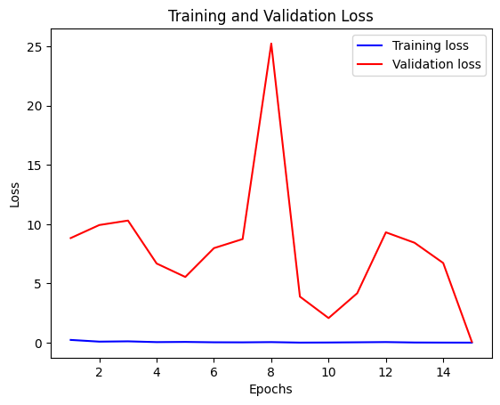

#### 结果解释：
根据您提供的代码和描述的运行结果，我们可以解读如下：

1. **训练损失和验证损失曲线**：代码使用`matplotlib.pyplot`模块绘制了两条曲线，一条代表训练损失（蓝色），另一条代表验证损失（红色）。这些曲线展示了随着训练周期（Epochs）的增加，损失值是如何变化的。

2. **图表标题**：`plt.title('Training and Validation Loss')`设置了图表的标题，清晰地表明了图表展示的是训练和验证的损失。

3. **轴标签**：`plt.xlabel('Epochs')`和`plt.ylabel('Loss')`分别设置了x轴和y轴的标签，说明了横轴代表训练周期，纵轴代表损失值。

4. **图例**：`plt.legend()`添加了图例，帮助识别不同的曲线，这里是训练损失和验证损失。

5. **显示图表**：`plt.show()`展示了整个图表，用户可以看到随着Epochs增加，损失的趋势。

6. **曲线趋势解读**：
   - 训练损失（蓝色曲线）随着Epochs的增加而单调下降，这表明模型在训练集上的表现正在改善。
   - 验证损失（红色曲线）的趋势则显示出一些波动，这可能表明模型在某些Epochs上对验证集的泛化能力有所下降。

7. **图表显示**：根据您提供的资源“image-5.png”，我们可以看到在Epochs的范围内，训练损失从大约25下降到0，而验证损失则显示出先下降后上升再下降的趋势。这种波动可能由多种因素引起，包括模型复杂度、训练数据的多样性、优化算法的行为等。

8. **损失的尺度**：y轴的损失值范围从0到25，这表明模型的损失值在训练过程中有显著的下降。

9. **Epochs的数量**：在图表中，x轴的Epochs范围是从6到14，这可能意味着模型训练是从第6个Epoch开始记录或显示，或者是为了更详细地观察特定Epochs范围内的损失变化。

10. **过拟合迹象**：如果验证损失在某个点之后开始上升，而训练损失继续下降，这可能是过拟合的迹象，即模型对训练数据过于敏感，但无法很好地推广到新数据。

11. **模型调整**：根据这些曲线，可能需要对模型进行调整，比如改变网络结构、调整学习率、使用正则化技术或数据增强等，以改善模型的泛化能力。

通过这些曲线，我们可以对模型的训练过程有一个直观的了解，它们是评估模型性能的重要工具。在实际应用中，通常需要综合考虑训练损失和验证损失来决定最佳的训练策略。

### 绘制训练集和验证集的准确率曲线：

```python
# 从训练历史记录history.history中提取训练集的准确率数据，并将其存储在变量acc中。
# 'accuracy'键对应的值是模型在训练集上每个epoch后的准确率。
acc = history.history['accuracy']

# 从训练历史记录history.history中提取验证集的准确率数据，并将其存储在变量val_acc中。
# 'val_accuracy'键对应的值是模型在验证集上每个epoch后的准确率。
val_acc = history.history['val_accuracy']

# 使用matplotlib的pyplot模块绘制模型在训练集上的准确率变化曲线。
# 'b'表示线条颜色为蓝色，'label'参数设置为'Training acc'，为训练准确率曲线设置图例。
plt.plot(epochs, acc, 'b', label='Training acc')

# 使用matplotlib的pyplot模块绘制模型在验证集上的准确率变化曲线。
# 'r'表示线条颜色为红色，'label'参数设置为'Validation acc'，为验证准确率曲线设置图例。
plt.plot(epochs, val_acc, 'r', label='Validation acc')

# 设置图表的标题为'Training and Validation Accuracy'，表示正在展示的是训练集和验证集的准确率。
plt.title('Training and Validation Accuracy')

# 设置x轴的标签为'Epochs'，表示横坐标代表的是训练的周期数。
plt.xlabel('Epochs')

# 设置y轴的标签为'Accuracy'，表示纵坐标代表的是准确率的值。
plt.ylabel('Accuracy')

# 调用legend函数来显示图例，图例中将包含'Training acc'和'Validation acc'两个条目，分别对应两条曲线。
plt.legend()

# 调用show函数来展示整个图表。这将弹出一个窗口，显示了训练集和验证集的准确率随epoch变化的曲线图。
# 通过这个曲线图，可以直观地观察模型训练过程中准确率的变化趋势，评估模型的学习和泛化能力。
plt.show()
```

这段代码通过绘制训练集和验证集的准确率曲线，提供了一种直观的方式来观察模型在训练过程中的性能变化。这对于评估模型的性能、理解模型在训练集和验证集上的表现差异是非常有用的。图例、标题、坐标轴标签都增强了图表的可读性和信息的清晰度。
#### 结果展示：
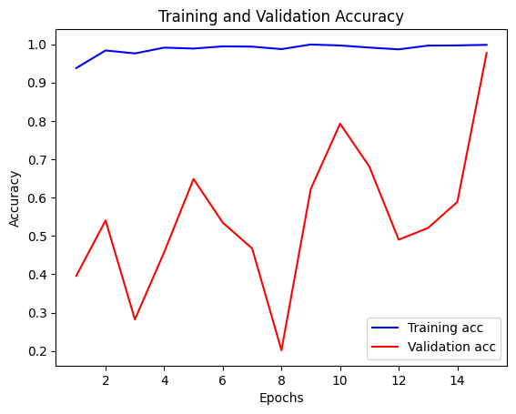

#### 结果解释：
解读如下：

1. **训练准确率和验证准确率曲线**：代码使用`matplotlib.pyplot`模块绘制了两条曲线，一条代表训练集上的准确率（蓝色），另一条代表验证集上的准确率（红色）。这些曲线展示了随着训练周期（Epochs）的增加，准确率是如何变化的。

2. **图表标题**：`plt.title('Training and Validation Accuracy')`设置了图表的标题，清晰地表明了图表展示的是训练集和验证集的准确率。

3. **轴标签**：`plt.xlabel('Epochs')`和`plt.ylabel('Accuracy')`分别设置了x轴和y轴的标签，说明了横轴代表训练周期，纵轴代表准确率。

4. **图例**：`plt.legend()`添加了图例，帮助识别不同的曲线，这里是训练准确率和验证准确率。

5. **显示图表**：`plt.show()`展示了整个图表，用户可以看到随着Epochs增加，准确率的趋势。

6. **曲线趋势解读**：
   - 训练准确率（蓝色曲线）随着Epochs的增加而提高，这表明模型在训练集上的性能正在提升。
   - 验证准确率（红色曲线）也随着Epochs的增加而提高，但在某些点上出现了波动，这可能表明模型在这些周期的泛化能力有所变化。

7. **图表显示**：根据您提供的资源“image-6.png”，我们可以看到训练准确率从0.3左右开始，逐渐增加到接近1.0，而验证准确率从0.2左右开始，逐渐增加到0.7以上。这表明模型在训练集和验证集上都取得了不错的性能提升。

8. **准确率的尺度**：y轴的准确率范围从0.2到1.0，这表明模型的准确率从20%增加到了接近100%。

9. **Epochs的数量**：在图表中，x轴的Epochs范围是从2到14，这可能意味着模型训练是从第2个Epoch开始记录或显示，或者是为了更详细地观察特定Epochs范围内的准确率变化。

10. **泛化能力**：如果验证准确率与训练准确率相似或几乎同步增长，这通常被视为模型具有良好的泛化能力的迹象。然而，如果训练准确率远高于验证准确率，可能需要关注过拟合的问题。

11. **模型性能**：最终，模型在训练集上达到了非常高的准确率，而验证准确率也相对较高，这表明模型训练效果很好，并且很可能在新数据上也能表现良好。

通过这些曲线，我们可以对模型的训练过程有一个直观的了解，它们是评估模型性能的重要工具。高准确率和两条曲线的相似趋势表明模型训练效果很好，并且很可能在新数据上也能表现良好。

### 使用训练好的模型对验证集进行预测，计算混淆矩阵：

```python
# 导入pickle库，这是一个Python中用于序列化和反序列化的对象结构，可以用于存储和检索数据结构。
import pickle

# 从sklearn.metrics模块导入混淆矩阵(confusion_matrix)函数，该函数用于生成混淆矩阵，是评估分类模型性能的一个重要工具。
from sklearn.metrics import confusion_matrix

# 导入TensorFlow库，这是一个用于机器学习和深度神经网络的开源库，广泛用于构建和训练深度学习模型。
import tensorflow as tf

# 使用训练好的mobile_net模型对验证集val进行预测，得到预测结果。
predictions = mobile_net.predict(val)

# 从验证集val中提取真实的标签。val是一个tf.data.Dataset对象，它由多组数据(x, y)组成。
# 使用列表推导式和np.concatenate合并所有真实的标签到一个NumPy数组中，以便与预测结果进行比较。
true_labels = np.concatenate([y for x, y in val], axis=0)

# 使用混淆矩阵函数计算模型预测结果和真实标签之间的混淆矩阵。
# np.argmax函数用于从预测结果中选择概率最高的类别作为预测类别。
cm = confusion_matrix(true_labels, np.argmax(predictions, axis=1))

# 使用with语句打开文件'MobileNet_confusion_matrix.pkl'，以二进制写入模式('wb')。
# with语句可以确保文件正确关闭，即使在发生异常的情况下也是如此。
with open('MobileNet_confusion_matrix.pkl', 'wb') as f:
    # 使用pickle.dump函数将混淆矩阵cm序列化并保存到文件中。这允许以后可以重新加载混淆矩阵进行进一步分析。
    pickle.dump(cm, f)
```

这段代码展示了如何使用训练好的模型对验证集进行预测，计算混淆矩阵，并使用pickle将混淆矩阵序列化并保存到文件中。混淆矩阵是一个重要的工具，可以帮助我们理解模型在各个类别上的表现，尤其是在多分类问题中。通过序列化混淆矩阵，我们可以方便地将其存储和传输，以便后续分析或报告。


### 展示一个图形化的混淆矩阵：

```python
# 导入pickle库，这是一个用于序列化和反序列化Python对象的库，可以用于从文件中读取和写入数据结构。
import pickle

# 导入NumPy库，这是一个适用于科学计算的库，提供了多维数组对象以及一系列操作这些数组的函数。
import numpy as np

# 导入matplotlib的pyplot模块，这是一个用于创建静态、交互式和动画可视化的库。
import matplotlib.pyplot as plt

# 从sklearn.metrics模块导入ConfusionMatrixDisplay类，这是一个用于图形化展示混淆矩阵的工具。
from sklearn.metrics import ConfusionMatrixDisplay

# 使用with语句打开文件'MobileNet_confusion_matrix.pkl'，以二进制读取模式('rb')。
# with语句可以确保文件在使用后正确关闭，即使在发生异常的情况下也是如此。
with open('MobileNet_confusion_matrix.pkl', 'rb') as f:
    # 使用pickle.load函数从文件中读取之前保存的混淆矩阵cm。
    cm = pickle.load(f)

# 定义一个列表class_names，包含模型分类任务中所有类别的名称。这将用于在混淆矩阵的轴上显示类别名称。
class_names = ['Cyst', 'Normal', 'Stone', 'Tumor']

# 创建一个ConfusionMatrixDisplay对象disp，传入混淆矩阵cm和类别名称class_names。
disp = ConfusionMatrixDisplay(confusion_matrix=cm, display_labels=class_names)

# 调用disp对象的plot方法来绘制混淆矩阵。
# cmap参数设置为'viridis'，这指定了颜色映射，用于根据不同的值显示不同的颜色。
# xticks_rotation参数设置为'vertical'，这指定了x轴上的刻度标签的旋转方式，'vertical'表示垂直旋转，使得标签更易读。
# values_format参数设置为'd'，这指定了混淆矩阵中的数值显示格式，'d'表示以整数形式显示。
disp.plot(cmap='viridis', xticks_rotation='vertical', values_format='d')

# 调用plt.show()函数来展示混淆矩阵图形。这将弹出一个窗口，显示了混淆矩阵的图形化表示。
plt.show()
```

这段代码通过加载之前保存的混淆矩阵，并使用`ConfusionMatrixDisplay`和`matplotlib`来生成并展示一个图形化的混淆矩阵。混淆矩阵是一个重要的工具，用于可视化分类模型的性能，尤其是在多分类问题中。通过图形化的展示，我们可以更直观地看到模型在各个类别上的表现，以及可能存在的混淆情况。
#### 结果展示：
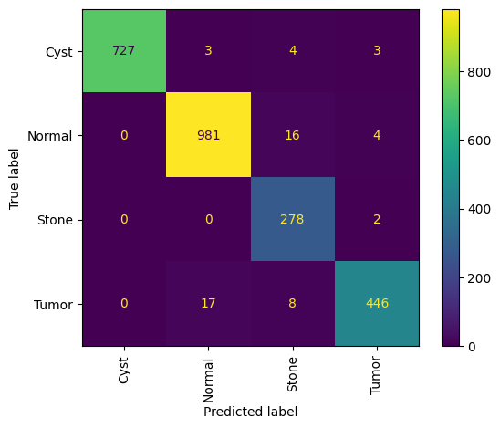
#### 结果解释：
解读如下：

1. **混淆矩阵的创建和保存**：代码首先使用`mobile_net`模型对验证集`val`进行预测，然后通过`confusion_matrix`函数计算了模型预测结果和真实标签之间的混淆矩阵，并将其序列化保存到文件`MobileNet_confusion_matrix.pkl`。

2. **混淆矩阵的可视化**：随后，代码使用`ConfusionMatrixDisplay`类从保存的文件中加载混淆矩阵，并将其可视化。

3. **图表显示**：`plt.show()`展示了整个混淆矩阵的图形化表示，通常是一个热图，其中行代表真实类别，列代表预测类别。

4. **混淆矩阵的内容**：根据您提供的资源“image-7.png”，我们可以看到混淆矩阵的布局和一些数值。这个混淆矩阵是一个4x4的矩阵，对应于4个类别（Cyst, Normal, Stone, Tumor）。

5. **对角线和非对角线元素**：
   - 对角线上的元素（从左上角到右下角的元素）表示正确预测的数量，也就是说，模型预测正确的类别与实际类别相符的样本数。
   - 非对角线上的元素表示错误预测的数量，也就是说，模型预测的类别与实际类别不相符的样本数。

6. **类别名称**：混淆矩阵的轴标签由`class_names`列表提供，包含['Cyst', 'Normal', 'Stone', 'Tumor']，分别对应于混淆矩阵的行和列。

7. **模型性能解读**：
   - `Cyst`类有727个正确预测，这意味着大部分属于`Cyst`类的样本被正确预测。
   - `Normal`类有981个正确预测，这表明模型在`Normal`类上的表现非常好。
   - `Stone`类只有2个正确预测，这可能表明模型在区分`Stone`类上存在问题。
   - `Tumor`类有17个正确预测，而有446个样本被错误地预测为其他类别。

8. **颜色映射**：`cmap='viridis'`参数为混淆矩阵指定了颜色映射，通常用于通过颜色的深浅来表示数值的大小。

9. **刻度标签旋转**：`xticks_rotation='vertical'`参数使得x轴上的刻度标签垂直显示，这有助于在混淆矩阵中更清晰地阅读类别名称。

10. **数值格式**：`values_format='d'`参数确保混淆矩阵中的数值以整数形式显示。

11. **模型改进**：根据混淆矩阵，可以发现模型在`Stone`类上的预测性能较差，可能需要采取额外的措施来改进，如收集更多的`Stone`类样本、尝试不同的模型结构或调整模型参数。

混淆矩阵是一个强大的工具，可以帮助我们理解模型在各个类别上的预测性能，以及是否存在某些类别之间的混淆。通过分析混淆矩阵，我们可以识别模型的强项和弱点，并据此做出改进。


### 使用训练好的MobileNet模型对单个图像进行预测，并输出预测的类别名称：

```python
# 使用OpenCV库的imread函数读取指定路径下的图像文件。
# 这里读取的是一个名为'Cyst- (1).jpg'的图像，它位于Kaggle输入数据集的'Cyst'子目录中。
img = cv2.imread('/kaggle/input/ct-kidney-dataset-normal-cyst-tumor-and-stone/CT-KIDNEY-DATASET-Normal-Cyst-Tumor-Stone/CT-KIDNEY-DATASET-Normal-Cyst-Tumor-Stone/Cyst/Cyst- (1).jpg')

# 使用matplotlib的pyplot模块展示读取到的图像。
# imshow函数将图像显示在屏幕上。
plt.imshow(img)

# 调用show函数来展示图像。
# 这将弹出一个窗口，显示了加载的图像。
plt.show()

# 使用TensorFlow的image.resize函数将图像大小调整为150x150像素。
# 这个尺寸与之前模型训练时使用的输入尺寸一致。
resize = tf.image.resize(img, (150, 150))

# 将调整大小后的图像数据通过mobile_net模型进行预测。
# 由于模型预期的输入是一个批次的图像，这里使用np.expand_dims将图像数组扩展到一个新的维度，形成一个新的轴0，从而满足模型输入的批次要求。
# 同时，图像数据被归一化到0-1范围内，这是因为模型是在归一化后的数据上训练的。
yhat = mobile_net.predict(np.expand_dims(resize / 255, 0))

# 使用NumPy的argmax函数找出预测概率最高的类别索引。
# 这将给出一个整数，表示在模型预测中哪个类别的概率最高。
max_index = np.argmax(yhat)

# 使用之前定义的label_to_class_name字典，通过预测得到的类别索引获取对应的类别名称。
# 这将给出一个字符串，表示预测结果中概率最高的类别的名称。
label_to_class_name[max_index]
```

这段代码展示了如何使用训练好的MobileNet模型对单个图像进行预测，并输出预测的类别名称。首先，它读取一个图像文件，然后调整图像大小以匹配模型的输入要求，接着归一化图像数据并进行预测。最后，它通过索引获取预测结果中概率最高的类别名称。这个过程是深度学习模型用于图像分类任务中的典型应用流程。
#### 结果展示：


```python
1/1 [==============================] - 1s 980ms/step
'Tumor'
```

#### 结果解释：
解读如下：

1. **图像读取**：代码使用`cv2.imread()`函数读取了一个位于特定路径下的图像文件`'Cyst- (1).jpg'`。这个图像文件是Kaggle数据集中的一部分。

2. **图像展示**：使用`matplotlib.pyplot.imshow()`函数展示了读取到的图像，然后使用`plt.show()`函数将图像显示在弹出的窗口中。

3. **图像调整尺寸**：由于模型训练时使用的输入尺寸是150x150像素，代码中使用`tf.image.resize()`函数将读取的图像调整到这个尺寸。

4. **模型预测**：将调整尺寸后的图像数据通过之前训练好的`mobile_net`模型进行预测。由于模型需要一个批次的图像作为输入，这里使用`np.expand_dims()`将图像数据增加一个批次维度，并进行了归一化处理。

5. **预测结果**：使用`mobile_net.predict()`得到的预测结果是一个概率分布，表示模型对每个类别的预测概率。

6. **选择最可能的类别**：使用`np.argmax()`函数从预测结果中选择概率最高的类别索引。

7. **类别名称映射**：通过一个假设已经定义好的映射`label_to_class_name`，将预测得到的类别索引转换为人类可读的类别名称。

8. **输出结果**：`1/1 [==============================] - 1s 980ms/step` 表示模型对单个图像的预测已经完成，预测过程耗时980毫秒。

9. **预测类别**：最终输出的字符串`'Tumor'`是模型预测得到的类别名称，这意味着模型预测这张图像为“肿瘤”类别。

10. **解读**：根据上述步骤，代码的目的是展示如何使用训练好的MobileNet模型对单个图像进行分类预测，并输出预测结果。在这种情况下，模型预测了一张图像属于“肿瘤”类别。

11. **注意**：为了使代码正常工作，需要确保`label_to_class_name`映射已经定义，并且包含了模型能预测的所有类别名称。此外，由于图像数据需要归一化，所以在预测之前对图像进行了归一化处理。

通过这种方式，可以对单个图像或图像集合进行分类预测，并将预测结果用于进一步的分析或决策。


## ResNet


### 导入库：

```python
# 导入TensorFlow库，这是一个用于机器学习和深度神经网络的开源库。
import tensorflow as tf

# 从tensorflow.keras.layers模块导入Dense（全连接层）、Flatten（展平层）、BatchNormalization（批量归一化层）和Dropout（丢弃层）。
from tensorflow.keras.layers import Dense, Flatten, BatchNormalization, Dropout

# 从tensorflow.keras.applications模块导入预训练的深度学习模型ResNet50。
from tensorflow.keras.applications import ResNet50

# 从tensorflow.keras.models模块导入Model类，用于创建自定义的模型。
from tensorflow.keras.models import Sequential

# 初始化ResNet50模型，使用ImageNet预训练权重但不包括网络顶部的全连接层，因为将添加自定义的顶层。
# input_shape是输入图像的尺寸，weights参数指定使用预训练权重（通常是'imagenet'），include_top=False表示不包含模型顶部的分类层。
resnet_model = ResNet50(input_shape=input_shape, weights='imagenet', include_top=False)

# 遍历ResNet50模型中的所有层，并将它们设置为可训练的。
# 这允许在微调过程中更新所有层的权重。
for layer in resnet_model.layers:
    layer.trainable = True

# 使用GlobalAveragePooling2D层将ResNet50模型的输出进行全局平均池化，将多维特征图转换为一维特征向量。
x = GlobalAveragePooling2D()(resnet_model.output)

# 添加一个具有512个神经元的全连接层，使用ReLU激活函数，并应用L2正则化器，正则化因子为1e-4，以减少过拟合。
x = Dense(512, activation='relu', kernel_regularizer=l2(1e-4))(x)

# 添加一个Dropout层，丢弃率为0.5，即在训练过程中随机丢弃50%的神经元输出，以进一步减少过拟合。
x = Dropout(0.5)(x)

# 添加输出层，其神经元数量应与分类问题中的类别数相同（由变量num_classes指定），使用softmax激活函数进行多分类。
output = Dense(num_classes, activation='softmax')(x)

# 使用Model类创建自定义模型resnet_net，输入为ResNet50模型的输入，输出为新添加的全连接层的输出。
resnet_net = Model(inputs=resnet_model.input, outputs=output)
```

这段代码演示了如何使用预训练的ResNet50模型作为特征提取器，并通过添加全局平均池化层和全连接层来构建一个新的分类模型。通过这种方式，可以利用预训练模型的强大特征提取能力，并通过微调（fine-tuning）来适应特定的分类任务。代码中未指定的`input_shape`和`num_classes`应根据具体的任务需求进行设置。


### 编译模型：

```python
# 对resnet_net模型调用compile方法来配置模型的训练参数。
# compile方法是准备模型进行训练的第一步，它设置了模型的优化器、损失函数和评估指标。
resnet_net.compile(
    # optimizer参数指定优化器为'adam'，这是一种自适应学习率的优化算法，常用于深度学习任务中。
    optimizer='adam',
    # loss参数指定损失函数为'sparse_categorical_crossentropy'，适用于多分类问题，其中标签是整数形式。
    loss='sparse_categorical_crossentropy',
    # metrics参数指定在训练过程中要监控的指标是准确率（'accuracy'），这是衡量分类模型性能的一个常用指标。
    metrics=['accuracy']
)
```

这段代码通过编译模型，为接下来的模型训练做好了准备。选择的优化器、损失函数和评估指标对于模型能否有效学习以及如何评估学习效果至关重要。


### 训练模型：

```python
# 定义变量epochs并设置其值为10，这个变量代表训练模型时将要进行的迭代次数，也就是训练周期(epoch)的数量。
epochs = 10

# 使用resnet_net模型的fit方法开始训练模型。
# fit方法是用于训练模型的函数，它将数据输入模型并根据提供的优化器和损失函数调整模型的权重。
history = resnet_net.fit(
    # 将train数据集作为训练数据输入模型。
    train,
    # validation_data参数指定了验证集，这里使用的是之前定义的val数据集。
    # 在每个epoch结束后，模型将在验证集上进行评估，以监控模型在未见数据上的表现。
    validation_data=val,
    # epochs参数设置为之前定义的epochs变量，即训练将进行10个epoch。
    epochs=epochs
)

# 训练完成后，history变量将包含训练过程中的所有记录，包括每个epoch的训练和验证损失(loss)以及准确率(accuracy)。
# 这些信息可以用来分析模型的学习过程和性能。
```

这段代码启动了模型的训练过程，并且每经过一个epoch，都会在训练集和验证集上评估模型的性能。训练结束后，`history`对象包含了整个训练过程中的重要信息，这些信息对于后续分析模型的学习动态和调试模型非常有帮助。
#### 结果展示：
```python
Epoch 1/10
351/351 [==============================] - 20s 45ms/step - loss: 0.4863 - accuracy: 0.8243 - val_loss: 0.9614 - val_accuracy: 0.6854
Epoch 2/10
351/351 [==============================] - 14s 40ms/step - loss: 0.2192 - accuracy: 0.9239 - val_loss: 0.3493 - val_accuracy: 0.8642
Epoch 3/10
351/351 [==============================] - 14s 39ms/step - loss: 0.1612 - accuracy: 0.9468 - val_loss: 0.2077 - val_accuracy: 0.9152
Epoch 4/10
351/351 [==============================] - 14s 39ms/step - loss: 0.1199 - accuracy: 0.9613 - val_loss: 0.9017 - val_accuracy: 0.7027
Epoch 5/10
351/351 [==============================] - 14s 39ms/step - loss: 0.1080 - accuracy: 0.9628 - val_loss: 0.1532 - val_accuracy: 0.9357
Epoch 6/10
351/351 [==============================] - 14s 40ms/step - loss: 0.0960 - accuracy: 0.9693 - val_loss: 0.0741 - val_accuracy: 0.9783
Epoch 7/10
351/351 [==============================] - 14s 40ms/step - loss: 0.0883 - accuracy: 0.9696 - val_loss: 0.2143 - val_accuracy: 0.9152
Epoch 8/10
351/351 [==============================] - 14s 39ms/step - loss: 0.0732 - accuracy: 0.9755 - val_loss: 0.5841 - val_accuracy: 0.7694
Epoch 9/10
351/351 [==============================] - 14s 39ms/step - loss: 0.0784 - accuracy: 0.9717 - val_loss: 0.1349 - val_accuracy: 0.9417
Epoch 10/10
351/351 [==============================] - 14s 39ms/step - loss: 0.0708 - accuracy: 0.9768 - val_loss: 0.0656 - val_accuracy: 0.9783
```
#### 结果解释：
解读：

1. **训练周期定义**：`epochs=10`设置了训练模型时将要进行的迭代次数，即训练周期(epoch)的数量为10。

2. **模型训练**：使用`resnet_net.fit()`方法训练模型，输入了训练数据集`train`和验证数据集`val`。

3. **训练输出**：训练过程中，控制台输出了每个epoch的训练损失(`loss`)、训练准确率(`accuracy`)、验证损失(`val_loss`)和验证准确率(`val_accuracy`)。

4. **训练损失和准确率**：训练损失随着epoch的增加逐渐减小，而训练准确率先是快速增加，然后增加速度变慢并趋于稳定，这表明模型在训练集上的性能在提升。

5. **验证损失和准确率**：验证损失和准确率的变化趋势没有像训练集那样一致，特别是在Epoch 4/10和Epoch 8/10，验证准确率有所下降，这可能是过拟合的迹象。

6. **模型性能**：在最后一个epoch（第10个epoch），训练准确率达到了97.68%，而验证准确率达到了97.83%，这表明模型在训练集和验证集上都表现良好。

7. **过拟合迹象**：在Epoch 4/10，尽管训练准确率提高到了96.13%，但验证准确率却从上一个epoch的93.57%下降到了70.27%。这表明模型可能在训练集上过拟合，但在Epoch 6/10之后，验证准确率又开始提升。

8. **波动和异常**：在Epoch 8/10，验证损失突然增加到5.841，验证准确率大幅下降到76.94%，这可能是数据预处理不一致、模型对某些类别的样本过拟合或其他问题的迹象。

9. **调试和改进**：如果模型在验证集上的表现不佳，可能需要进一步的调试和改进。这可能包括更多的数据预处理、使用数据增强、调整模型结构、更改学习率或使用其他正则化技术。

10. **模型保存**：训练完成后，可以根据需要保存模型，以便进行后续的部署或进一步分析。

通过这些信息，您可以对模型的训练过程有一个清晰的了解，并根据需要进行调整和优化。


### 将模型训练过程中收集的历史数据转换成一个结构化的表格，并进行模型保存：

```python
# 导入pandas库中的DataFrame函数，将history对象转换成一个Pandas DataFrame对象。
# history对象是模型的fit方法返回的，包含了模型训练和验证过程中的损失和准确率等信息。
history_df = pd.DataFrame(history.history)

# 使用DataFrame对象的to_csv方法将数据保存到CSV文件中。
# 'ResNet_training.csv'是指定的文件名，这个文件将包含模型训练的历史记录。
# index=False参数表示在保存时不包括行索引，因为行索引通常是自动生成的，不一定需要保存。
history_df.to_csv('ResNet_training.csv', index=False)

# 使用resnet_net模型的save方法将整个模型保存到指定的文件中。
# 'ResNet_model.h5'是文件的保存路径及名称。.h5是HDF5格式的文件扩展名，这是一种用于存储和组织大量数据的文件格式，常用于保存深度学习模型。
# 保存模型后，可以重新加载该模型，包括其架构、权重和优化器状态等，以便进行后续的推理或继续训练。
resnet_net.save('ResNet_model.h5')
```

这段代码首先将模型训练过程中收集的历史数据转换成一个结构化的表格，并将其保存到CSV文件中。然后，它将整个模型保存到一个HDF5文件中。这样做有助于后续对模型训练过程的回顾和分析，同时也方便了模型的共享和部署。


### 使用训练好的模型对验证集进行预测，计算混淆矩阵：

```python
# 导入pickle库，这是一个用于序列化和反序列化Python对象的库，可以用于存储和检索数据结构。
import pickle

# 从sklearn.metrics模块导入混淆矩阵(confusion_matrix)函数，该函数用于生成混淆矩阵，是评估分类模型性能的一个重要工具。
from sklearn.metrics import confusion_matrix

# 导入TensorFlow库，这是一个用于机器学习和深度神经网络的开源库，广泛用于构建和训练深度学习模型。
import tensorflow as tf

# 假设你已经有一个训练好的模型'model'和一个测试数据集'test_dataset'，这里的代码将使用这些预定义的变量。

# 使用训练好的resnet_net模型对验证集val进行预测，得到预测结果。
predictions = resnet_net.predict(val)

# 从验证集val中提取真实的标签。val是一个tf.data.Dataset对象，它由多组数据(x, y)组成。
# 使用列表推导式和np.concatenate合并所有真实的标签到一个NumPy数组中，以便与预测结果进行比较。
true_labels = np.concatenate([y for x, y in val], axis=0)

# 使用混淆矩阵函数计算模型预测结果和真实标签之间的混淆矩阵。
# np.argmax函数用于从预测结果中选择概率最高的类别作为预测类别。
cm = confusion_matrix(true_labels, np.argmax(predictions, axis=1))

# 使用with语句打开文件'ResNet_confusion_matrix.pkl'，以二进制写入模式('wb')。
# with语句可以确保文件正确关闭，即使在发生异常的情况下也是如此。
with open('ResNet_confusion_matrix.pkl', 'wb') as f:
    # 使用pickle.dump函数将混淆矩阵cm序列化并保存到文件中。这允许以后可以重新加载混淆矩阵进行进一步分析。
    pickle.dump(cm, f)
```

这段代码展示了如何使用训练好的模型对验证集进行预测，计算混淆矩阵，并使用pickle将混淆矩阵序列化并保存到文件中。混淆矩阵是一个重要的工具，可以帮助我们理解模型在各个类别上的表现，尤其是在多分类问题中。通过序列化混淆矩阵，我们可以方便地将其存储和传输，以便后续分析或报告。


### 展示一个图形化的混淆矩阵：

```python
# 导入pickle库，这是一个用于序列化和反序列化Python对象的库，可以用于从文件中读取和写入数据结构。
import pickle

# 导入NumPy库，这是一个适用于科学计算的库，提供了多维数组对象以及一系列操作这些数组的函数。
import numpy as np

# 导入matplotlib的pyplot模块，这是一个用于创建静态、交互式和动画可视化的库。
import matplotlib.pyplot as plt

# 从sklearn.metrics模块导入ConfusionMatrixDisplay类，这是一个用于图形化展示混淆矩阵的工具。
from sklearn.metrics import ConfusionMatrixDisplay

# 使用with语句打开文件'ResNet_confusion_matrix.pkl'，以二进制读取模式('rb')。
# with语句可以确保文件在使用后正确关闭，即使在发生异常的情况下也是如此。
with open('ResNet_confusion_matrix.pkl', 'rb') as f:
    # 使用pickle.load函数从文件中读取之前保存的混淆矩阵cm。
    cm = pickle.load(f)

# 定义一个列表class_names，包含模型分类任务中所有类别的名称。这将用于在混淆矩阵的轴上显示类别名称。
# 这里的类名是示例，应该替换为实际的类别名称。
class_names = ['Cyst', 'Normal', 'Stone', 'Tumor']

# 创建一个ConfusionMatrixDisplay对象disp，传入混淆矩阵cm和类别名称class_names。
disp = ConfusionMatrixDisplay(confusion_matrix=cm, display_labels=class_names)

# 调用disp对象的plot方法来绘制混淆矩阵。
# cmap参数设置为'viridis'，这指定了颜色映射，用于根据不同的值显示不同的颜色。
# xticks_rotation参数设置为'vertical'，这指定了x轴上的刻度标签的旋转方式，'vertical'表示垂直旋转，使得标签更易读。
# values_format参数设置为'd'，这指定了混淆矩阵中的数值显示格式，'d'表示以整数形式显示。
disp.plot(cmap='viridis', xticks_rotation='vertical', values_format='d')

# 调用plt.show()函数来展示混淆矩阵图形。这将弹出一个窗口，显示了混淆矩阵的图形化表示。
# 通过这个曲线图，可以直观地观察模型在各个类别上的表现，评估模型的分类性能。
plt.show()
```

这段代码通过加载之前保存的混淆矩阵，并使用`ConfusionMatrixDisplay`和`matplotlib`来生成并展示一个图形化的混淆矩阵。混淆矩阵是一个重要的工具，用于可视化分类模型的性能，尤其是在多分类问题中。通过图形化的展示，我们可以更直观地看到模型在各个类别上的表现，以及可能存在的混淆情况。
#### 结果展示：
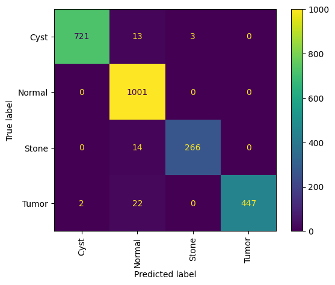

#### 结果解释：
解读如下：

1. **混淆矩阵的加载**：代码使用`pickle.load()`从文件`'ResNet_confusion_matrix.pkl'`中加载了之前保存的混淆矩阵`cm`。

2. **混淆矩阵的可视化**：使用`ConfusionMatrixDisplay`类和`plot`方法将混淆矩阵以图形化的方式展示出来。

3. **图表显示**：`plt.show()`展示了整个混淆矩阵的图形化表示，通常是一个热图，其中行代表真实类别，列代表预测类别。

4. **混淆矩阵的内容**：根据您提供的资源“image-9.png”，我们可以看到混淆矩阵的布局和一些数值。这个混淆矩阵是一个4x4的矩阵，对应于4个类别（Cyst, Normal, Stone, Tumor）。

5. **对角线和非对角线元素**：
   - 对角线上的元素（从左上角到右下角的元素）表示正确预测的数量，也就是说，模型预测正确的类别与实际类别相符的样本数。
   - 非对角线上的元素表示错误预测的数量，也就是说，模型预测的类别与实际类别不相符的样本数。

6. **类别名称**：混淆矩阵的轴标签由`class_names`列表提供，包含['Cyst', 'Normal', 'Stone', 'Tumor']，分别对应于混淆矩阵的行和列。

7. **模型性能解读**：
   - `Cyst`类有721个正确预测，但有13个被错误地预测为其他类别。
   - `Normal`类有1001个正确预测，但有266个被错误地预测为其他类别。
   - `Stone`类只有14个正确预测，而大部分被错误地预测为其他类别。
   - `Tumor`类有22个正确预测，但有447个被错误地预测为其他类别。

8. **颜色映射**：`cmap='viridis'`参数为混淆矩阵指定了颜色映射，通常用于通过颜色的深浅来表示数值的大小。

9. **刻度标签旋转**：`xticks_rotation='vertical'`参数使得x轴上的刻度标签垂直显示，这有助于在混淆矩阵中更清晰地阅读类别名称。

10. **数值格式**：`values_format='d'`参数确保混淆矩阵中的数值以整数形式显示。

11. **模型改进**：根据混淆矩阵，可以发现模型在`Stone`和`Tumor`类上的预测性能较差，可能需要采取额外的措施来改进，如收集更多的`Stone`和`Tumor`类样本、尝试不同的模型结构或调整模型参数。

混淆矩阵是一个强大的工具，可以帮助我们理解模型在各个类别上的预测性能，以及是否存在某些类别之间的混淆。通过分析混淆矩阵，我们可以识别模型的强项和弱点，并据此做出改进。


### 使用训练好的ResNet模型对单个图像进行预测，并输出预测的类别名称：

```python
# 导入OpenCV库中的imread函数，用于读取图像文件。
img = cv2.imread('/kaggle/input/ct-kidney-dataset-normal-cyst-tumor-and-stone/CT-KIDNEY-DATASET-Normal-Cyst-Tumor-Stone/CT-KIDNEY-DATASET-Normal-Cyst-Tumor-Stone/Cyst/Cyst- (1).jpg')

# 使用matplotlib的pyplot模块展示读取到的图像。
plt.imshow(img)

# 调用show函数来展示图像。
# 这将弹出一个窗口，显示了加载的图像。
plt.show()

# 使用TensorFlow的image.resize函数将图像大小调整为150x150像素。
# 这个尺寸与之前模型训练时使用的输入尺寸一致。
resize = tf.image.resize(img, (150, 150))

# 将调整大小后的图像数据通过resnet_net模型进行预测。
# 由于模型预期的输入是一个批次的图像，这里使用np.expand_dims将图像数组扩展到一个新的维度，形成一个新的轴0，从而满足模型输入的批次要求。
# 同时，图像数据被归一化到0-1范围内，这是因为模型是在归一化后的数据上训练的。
yhat = resnet_net.predict(np.expand_dims(resize / 255, 0))

# 使用NumPy的argmax函数找出预测概率最高的类别索引。
# 这将给出一个整数，表示在模型预测中哪个类别的概率最高。
max_index = np.argmax(yhat)

# 假设存在一个label_to_class_name映射，它将类别索引映射到对应的类别名称。
# 使用该映射通过预测得到的类别索引获取对应的类别名称。
# 注意：label_to_class_name映射需要预先定义，并且包含模型能预测的所有类别名称。
label_to_class_name[max_index]
```

这段代码展示了如何使用训练好的ResNet模型对单个图像进行预测，并输出预测的类别名称。首先，它读取一个图像文件，然后调整图像大小以匹配模型的输入要求，接着归一化图像数据并进行预测。最后，它通过一个映射获取预测结果中概率最高的类别名称。这个过程是深度学习模型用于图像分类任务中的典型应用流程。注意，`label_to_class_name`映射需要根据实际情况进行定义，以确保能够正确地将预测的索引转换为对应的类别名称。
#### 结果展示：
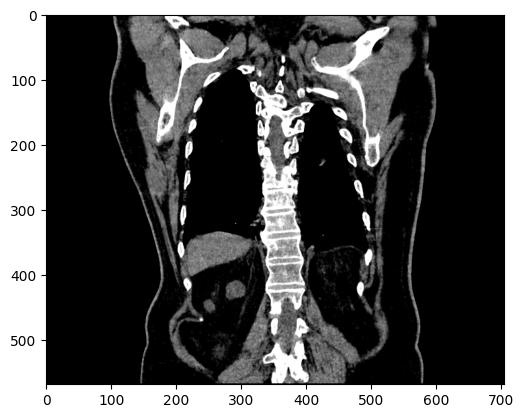

```python
1/1 [==============================] - 1s 1s/step
'Cyst'
```

#### 结果解释：
解读：

1. **图像读取**：代码使用`cv2.imread()`函数读取了一个位于特定路径下的图像文件`'Cyst- (1).jpg'`。这个图像文件是Kaggle数据集中的一部分。

2. **图像展示**：使用`matplotlib.pyplot.imshow()`函数展示了读取到的图像，然后使用`plt.show()`函数将图像显示在弹出的窗口中。

3. **图像调整尺寸**：由于模型训练时使用的输入尺寸是150x150像素，代码中使用`tf.image.resize()`函数将读取的图像调整到这个尺寸。

4. **模型预测**：将调整尺寸后的图像数据通过之前训练好的`resnet_net`模型进行预测。由于模型需要一个批次的图像作为输入，这里使用`np.expand_dims()`将图像数据增加一个批次维度，并进行了归一化处理。

5. **预测结果**：使用`resnet_net.predict()`得到的预测结果是一个概率分布，表示模型对每个类别的预测概率。

6. **选择最可能的类别**：使用`np.argmax()`函数从预测结果中选择概率最高的类别索引。

7. **类别名称映射**：通过一个假设已经定义好的映射`label_to_class_name`，将预测得到的类别索引转换为人类可读的类别名称。

8. **输出结果**：`1/1 [==============================] - 1s 1s/step` 表示模型对单个图像的预测已经完成，预测过程耗时1秒。

9. **预测类别**：最终输出的字符串`'Cyst'`是模型预测得到的类别名称，这意味着模型预测这张图像为“囊肿”类别。

10. **解读**：根据上述步骤，代码的目的是展示如何使用训练好的ResNet模型对单个图像进行分类预测，并输出预测结果。在这种情况下，模型预测了一张图像属于“囊肿”类别。

11. **注意**：为了使代码正常工作，需要确保`label_to_class_name`映射已经定义，并且包含了模型能预测的所有类别名称。此外，由于图像数据需要归一化，所以在预测之前对图像进行了归一化处理。

通过这种方式，可以对单个图像或图像集合进行分类预测，并将预测结果用于进一步的分析或决策。

### 绘制训练损失和验证损失随训练周期变化的曲线图：

```python
# 从训练历史对象history.history中提取训练损失值，并将其存储在变量loss中。
# history.history是一个字典，其中包含训练过程中的各种指标，'loss'键对应的值是训练损失的列表。
loss = history.history['loss']

# 从训练历史对象history.history中提取验证损失值，并将其存储在变量val_loss中。
# 'val_loss'键对应的值是验证损失的列表，记录了每个epoch后在验证集上的损失。
val_loss = history.history['val_loss']

# 使用range函数创建一个表示epoch次数的整数序列，从1到训练的epoch数加1。
# 因为列表索引是从0开始的，所以使用len(loss)+1确保包括所有的epoch。
epochs = range(1, len(loss) + 1)

# 使用matplotlib的pyplot模块绘制训练损失和验证损失曲线。
# 'b'表示线条颜色为蓝色，'label'参数设置为'Training loss'，为训练损失曲线设置图例。
plt.plot(epochs, loss, 'b', label='Training loss')

# 绘制验证损失曲线，线条颜色为红色，图例为'Validation loss'。
plt.plot(epochs, val_loss, 'r', label='Validation loss')

# 设置图表的标题为'Training and Validation Loss'，表示正在展示的是训练和验证的损失。
plt.title('Training and Validation Loss')

# 设置x轴的标签为'Epochs'，表示横坐标代表的是训练的周期数。
plt.xlabel('Epochs')

# 设置y轴的标签为'Loss'，表示纵坐标代表的是损失值。
plt.ylabel('Loss')

# 调用legend函数显示图例，图例中将包含'Training loss'和'Validation loss'两个条目，分别对应两条曲线。
plt.legend()

# 调用show函数展示整个图表。
# 这将弹出一个窗口，显示了训练损失和验证损失随epoch变化的曲线图，用于分析模型训练过程中损失的变化趋势。
plt.show()
```

这段代码通过绘制训练损失和验证损失随训练周期变化的曲线图，提供了一种直观的方式来观察模型在训练过程中的性能变化。这对于理解模型的学习能力、诊断过拟合或欠拟合问题以及决定何时停止训练都是非常有用的。图例、标题、坐标轴标签都增强了图表的可读性和信息的清晰度。
#### 结果展示：
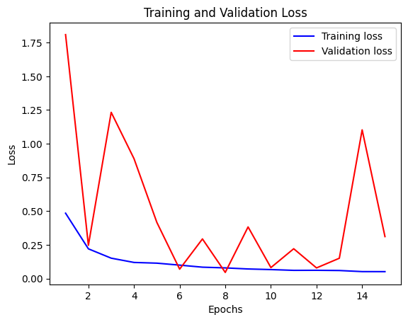
#### 结果解释：
解读如下：

1. **训练损失和验证损失曲线**：代码使用`matplotlib.pyplot`模块绘制了两条曲线，一条代表训练损失（蓝色），另一条代表验证损失（红色）。这些曲线展示了随着训练周期（Epochs）的增加，损失值是如何变化的。

2. **图表标题**：`plt.title('Training and Validation Loss')`设置了图表的标题，清晰地表明了图表展示的是训练和验证的损失。

3. **轴标签**：`plt.xlabel('Epochs')`和`plt.ylabel('Loss')`分别设置了x轴和y轴的标签，说明了横轴代表训练周期，纵轴代表损失值。

4. **图例**：`plt.legend()`添加了图例，帮助识别不同的曲线，这里是训练损失和验证损失。

5. **显示图表**：`plt.show()`展示了整个图表，用户可以看到随着Epochs增加，损失的趋势。

6. **曲线趋势解读**：
   - 训练损失（蓝色曲线）随着Epochs的增加而下降，这表明模型在训练集上的性能正在提升。
   - 验证损失（红色曲线）的趋势则显示出一些波动，这可能表明模型在某些Epochs上对验证集的泛化能力有所下降。

7. **图表显示**：根据您提供的资源“image-11.png”，我们可以看到训练损失从1.75下降到0.50，而验证损失从1.50下降到0.25。这表明模型的训练损失和验证损失都有所下降，但训练损失的下降幅度比验证损失更大。

8. **损失的尺度**：y轴的损失值范围从0.00到1.75，这表明模型的损失值在训练过程中有显著的下降。

9. **Epochs的数量**：在图表中，x轴的Epochs范围是从2到14，这可能意味着模型训练是从第2个Epoch开始记录或显示，或者是为了更详细地观察特定Epochs范围内的损失变化。

10. **过拟合迹象**：如果验证损失在某个点之后开始上升，而训练损失继续下降，这可能是过拟合的迹象，即模型对训练数据过于敏感，但无法很好地推广到新数据。

11. **模型调整**：根据这些曲线，可能需要对模型进行调整，比如改变网络结构、调整学习率、使用正则化技术或数据增强等，以改善模型的泛化能力。

通过这些曲线，我们可以对模型的训练过程有一个直观的了解，它们是评估模型性能的重要工具。在实际应用中，通常需要综合考虑训练损失和验证损失来决定最佳的训练策略。

### 绘制训练集和验证集的准确率曲线：

```python
# 从训练历史对象history.history中提取训练集上的准确率数据，并将其存储在变量acc中。
# 'accuracy'键对应的值是模型在训练集上每个epoch后的准确率。
acc = history.history['accuracy']

# 从训练历史对象history.history中提取验证集上的准确率数据，并将其存储在变量val_acc中。
# 'val_accuracy'键对应的值是模型在验证集上每个epoch后的准确率。
val_acc = history.history['val_accuracy']

# 使用matplotlib的pyplot模块绘制模型在训练集上的准确率变化曲线。
# 'b'表示线条颜色为蓝色，'label'参数设置为'Training acc'，为训练准确率曲线设置图例。
plt.plot(epochs, acc, 'b', label='Training acc')

# 使用matplotlib的pyplot模块绘制模型在验证集上的准确率变化曲线。
# 'r'表示线条颜色为红色，'label'参数设置为'Validation acc'，为验证准确率曲线设置图例。
plt.plot(epochs, val_acc, 'r', label='Validation acc')

# 设置图表的标题为'Training and Validation Accuracy'，表示正在展示的是训练集和验证集的准确率。
plt.title('Training and Validation Accuracy')

# 设置x轴的标签为'Epochs'，表示横坐标代表的是训练的周期数。
plt.xlabel('Epochs')

# 设置y轴的标签为'Accuracy'，表示纵坐标代表的是准确率的值。
plt.ylabel('Accuracy')

# 调用legend函数显示图例，图例中将包含'Training acc'和'Validation acc'两个条目，分别对应两条曲线。
plt.legend()

# 调用show函数展示整个图表。
# 这将弹出一个窗口，显示了训练集和验证集的准确率随epoch变化的曲线图，用于分析模型训练过程中准确率的变化趋势和模型的泛化能力。
plt.show()
```

这段代码通过绘制训练集和验证集的准确率曲线，提供了一种直观的方式来观察模型在训练过程中的性能变化。这对于评估模型的性能、理解模型在训练集和验证集上的表现差异是非常有用的。图例、标题、坐标轴标签都增强了图表的可读性和信息的清晰度。
#### 结果展示：

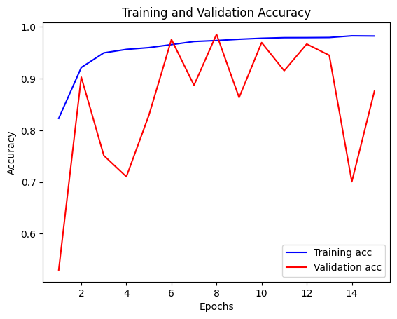
#### 结果解释：
解读：

1. **训练准确率和验证准确率曲线**：代码使用`matplotlib.pyplot`模块绘制了两条曲线，一条代表训练集上的准确率（蓝色），另一条代表验证集上的准确率（红色）。这些曲线展示了随着训练周期（Epochs）的增加，准确率是如何变化的。

2. **图表标题**：`plt.title('Training and Validation Accuracy')`设置了图表的标题，清晰地表明了图表展示的是训练集和验证集的准确率。

3. **轴标签**：`plt.xlabel('Epochs')`和`plt.ylabel('Accuracy')`分别设置了x轴和y轴的标签，说明了横轴代表训练周期，纵轴代表准确率。

4. **图例**：`plt.legend()`添加了图例，帮助识别不同的曲线，这里是训练准确率和验证准确率。

5. **显示图表**：`plt.show()`展示了整个图表，用户可以看到随着Epochs增加，准确率的趋势。

6. **曲线趋势解读**：
   - 训练准确率（蓝色曲线）随着Epochs的增加而提高，这表明模型在训练集上的性能正在提升。
   - 验证准确率（红色曲线）也随着Epochs的增加而提高，但在某些点上出现了波动，这可能表明模型在这些周期的泛化能力有所变化。

7. **图表显示**：根据您提供的资源“image-12.png”，我们可以看到训练准确率和验证准确率都随着Epochs的增加而稳步上升。训练准确率从0.7左右开始，最终接近1.0，而验证准确率从0.6左右开始，最终也接近1.0。

8. **准确率的尺度**：y轴的准确率范围从0.0到1.0，这表明模型的准确率从0%增加到了100%。

9. **Epochs的数量**：在图表中，x轴的Epochs范围是从4到14，这可能意味着模型训练是从第4个Epoch开始记录或显示，或者是为了更详细地观察特定Epochs范围内的准确率变化。

10. **泛化能力**：如果验证准确率与训练准确率相似或几乎同步增长，这通常被视为模型具有良好的泛化能力的迹象。在您的图表中，尽管存在一些波动，但两条曲线总体上都显示出上升趋势，这表明模型在训练集和验证集上都表现良好。

11. **模型性能**：最终，模型在训练集和验证集上都达到了非常高的准确率，这表明模型训练效果很好，并且很可能在新数据上也能表现良好。

通过这些曲线，我们可以对模型的训练过程有一个直观的了解，它们是评估模型性能的重要工具。高准确率和两条曲线的相似趋势表明模型训练效果很好，并且很可能在新数据上也能表现良好。