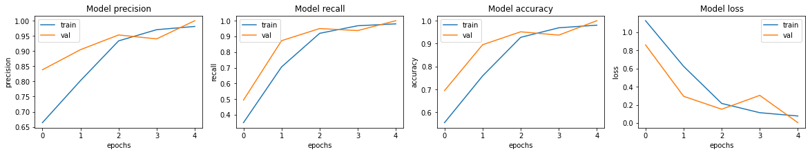

# 05Kidney_Disease_Classifier_With_99%_(CNN)


## 安装分割包
当然，以下是对命令`!pip install split-folders`逐行添加中文注释的解释：

```shell
!pip install split-folders
```

1. `!`：在某些编程环境或脚本语言中，这个感叹号通常用作命令提示符的一部分，表示接下来的内容是一个命令。在Jupyter Notebook等交互式编程环境中，`!`允许执行系统命令。

2. `pip`：Python包管理系统的一个命令行工具，用于安装和管理Python包。它是Python官方推荐的包安装器，全称为“Python Package Installer”。

3. `install`：这是`pip`工具的一个子命令，用于安装指定的Python包。

4. `split-folders`：这是要安装的Python包的名称。根据包名可以推测，这个包可能与处理文件夹分割有关的功能。

综上所述，整个命令的意思是：在当前的编程环境或终端中，使用pip工具安装名为`split-folders`的Python包。这个命令通常在Python项目的根目录下执行，以便于在项目的虚拟环境中安装所需的依赖包。


### 结果展示：

```python
Collecting split-folders
  Downloading split_folders-0.4.3-py3-none-any.whl (7.4 kB)
Installing collected packages: split-folders
Successfully installed split-folders-0.4.3
WARNING: Running pip as the 'root' user can result in broken permissions and conflicting behaviour with the system package manager. It is recommended to use a virtual environment instead: https://pip.pypa.io/warnings/venv
```

### 结果解释：

上述代码的运行结果提供了关于使用`pip`安装`split-folders`包的详细信息，以及一个警告。下面是对结果的逐行解释：

1. `Collecting split-folders`：表示`pip`正在收集安装`split-folders`包所需的信息。

2. `Downloading split_folders-0.4.3-py3-none-any.whl (7.4 kB)`：`pip`正在下载`split-folders`包的`.whl`文件，这是一个预构建的二进制分发格式，通常用于Python包的快速安装。文件名中的`0.4.3`是包的版本号，`py3`表示它适用于Python 3，`none`表示它不依赖于任何特定的系统架构，`any`表示它适用于任何操作系统。

3. `Installing collected packages: split-folders`：`pip`正在安装之前收集的`split-folders`包。

4. `Successfully installed split-folders-0.4.3`：表示`split-folders`包已成功安装，并且安装的版本是`0.4.3`。

5. `WARNING: Running pip as the 'root' user can result in broken permissions and conflicting behaviour with the system package manager.`：这是一个警告，指出以`root`用户身份运行`pip`可能会导致权限问题，并与系统包管理器发生冲突。

6. `It is recommended to use a virtual environment instead: https://pip.pypa.io/warnings/venv`：建议使用虚拟环境代替直接以`root`用户运行`pip`。这里提供了一个链接，指向官方文档，解释了为什么推荐使用虚拟环境，并提供了关于如何创建和使用虚拟环境的指导。

综上所述，`split-folders`包已成功安装，但警告信息提示了潜在的风险，建议用户使用虚拟环境来隔离和管理Python包，以避免系统级别的权限和包管理冲突。

## 导入库
下面这段代码是使用Keras库以及一些其他库来处理图像数据、构建神经网络模型、可视化结果、数据增强和评估模型性能的示例。下面是对每一行代码的详细中文注释：

```python
# 从keras.preprocessing.image模块导入ImageDataGenerator、load_img和img_to_array函数。
# ImageDataGenerator用于数据增强，load_img用于加载单个图像文件，img_to_array用于将图像转换为适合模型输入的数组格式。
from keras.preprocessing.image import ImageDataGenerator , load_img , img_to_array

# 从keras.models模块导入Sequential类。
# Sequential是Keras中用于构建顺序模型的类，即层按它们被添加到模型中的顺序进行堆叠。
from keras.models import Sequential

# 从keras.layers模块导入Conv2D、Flatten、MaxPool2D和Dense类。
# Conv2D是二维卷积层，用于卷积神经网络中提取图像特征。
# Flatten是层，用于将多维输入一维化，常用于卷积层后将提取的特征送入全连接层。
# MaxPool2D是最大池化层，用于降低特征维度，增加感受野，减少计算量。
# Dense是全连接层，用于学习特征之间的复杂关系。
from keras.layers import Conv2D, Flatten, MaxPool2D, Dense

# 导入matplotlib.pyplot模块，用于数据可视化，如绘制图像、直方图等。
import matplotlib.pyplot as plt

# 导入numpy包，用于进行科学计算，如矩阵运算、统计运算等。
import numpy as np

# 从skimage库中导入transform模块，用于图像的几何变换，如旋转、缩放等。
from skimage import transform

# 导入splitfolders包，这是一个用于将数据集分割成训练集和验证集的工具。
import splitfolders

# 从sklearn.metrics模块导入confusion_matrix函数，用于生成混淆矩阵，是评估分类模型性能的一种方法。
from sklearn.metrics import confusion_matrix

# 从sklearn.metrics模块导入precision_recall_fscore_support函数，用于计算精确率、召回率和F1分数，这些是分类模型性能的常用评估指标。
from sklearn.metrics import precision_recall_fscore_support

# 导入seaborn库，这是一个基于matplotlib的数据可视化库，提供了更高级的接口来绘制复杂的图表。
import seaborn as sns

# 再次导入splitfolders包，这可能是为了确保splitfolders在当前命名空间中可用，或者可能是重复导入。
# 如果splitfolders只在一个地方使用，那么这一行可能是多余的。
import splitfolders
```

这段代码主要涉及了机器学习和深度学习中常用的库和函数，用于构建和评估图像分类模型。代码中导入的库和函数将在后面的训练和评估过程中被使用。


## 分割数据集
下面这段代码使用了`splitfolders`库的`ratio`函数来将一个图像数据集分割成多个子集，通常用于创建训练集、验证集和测试集。以下是对每一行代码的详细中文注释：

```python
# 调用splitfolders库的ratio函数，该函数根据给定的比例将指定目录中的图像数据集自动分割成多个子集。
splitfolders.ratio(
    # 第一个参数是源目录的路径，即原始数据集所在的文件夹。
    # 这里指定了原始数据集的路径，该路径指向包含图像文件的文件夹。
    "../input/ct-kidney-dataset-normal-cyst-tumor-and-stone/CT-KIDNEY-DATASET-Normal-Cyst-Tumor-Stone/CT-KIDNEY-DATASET-Normal-Cyst-Tumor-Stone",
    # 第二个参数是输出目录的路径，即分割后的数据集将要存放的文件夹。
    # 这里指定了输出路径，分割后的子集将被存放在这个路径下。
    output="./dataset",
    # 第三个参数是随机数生成器的种子，用于确保每次分割的结果都是一致的。
    # 这里设置seed为7，意味着每次运行代码时，只要seed不变，分割的结果都将相同。
    seed=7,
    # 最后一个参数是分割比例，这里是一个元组，指定了分割成的三个子集的比例。
    # 0.90表示训练集占90%，0.050表示验证集占5%，0.050表示测试集占5%。
    # 这意味着原始数据集中90%的数据将被用于训练，剩下的10%将平均分配给验证集和测试集。
    ratio=(0.90,0.050, 0.050)
)
```

这段代码通常用于数据预处理阶段，目的是将原始数据集分割成适合模型训练和评估的不同部分。通过指定不同的比例，可以控制用于训练、验证和测试的数据量，从而帮助提高模型的泛化能力并评估其性能。


### 结果展示：
```python
Copying files: 12446 files [01:11, 172.87 files/s]
```


### 结果解释：

上述代码的运行结果提供了关于`splitfolders.ratio`函数执行过程中的一些信息：

1. `Copying files: 12446 files`：这表示`splitfolders.ratio`函数在执行过程中总共复制了12446个文件。这些文件可能包括图像和可能的子文件夹，它们是从源文件夹复制到输出文件夹中创建的子文件夹内。

2. `[01:11, 172.87 files/s]`：这部分信息提供了复制文件的总耗时以及平均速率。
   - `01:11`：表示复制文件的总时间是1分钟11秒。
   - `172.87 files/s`：表示在复制过程中，平均每秒复制了172.87个文件。

综上所述，`splitfolders.ratio`函数成功地将12446个文件从源文件夹复制到了输出文件夹中指定的子文件夹内，按照预设的比例（0.90, 0.050, 0.050）分配到不同的数据集中。这个过程耗时大约1分11秒，并且在整个过程中，平均速率是每秒钟复制约173个文件。

这个结果显示了`splitfolders`库在处理大量文件时的效率，同时也说明了在数据预处理阶段，该库可以有效地帮助用户准备机器学习模型训练所需的数据集。


## 加载和预处理图像数据集
下面这段代码是使用Keras库中的`ImageDataGenerator`类来加载和预处理图像数据集的示例。下面是对每一行代码的详细中文注释：

```python
# 创建一个ImageDataGenerator对象，用于对训练数据进行预处理。
# rescale参数用于将图像像素值缩放到0到1之间，1/255相当于将像素值除以255，因为图像的像素值通常在0到255之间。
train_datagen = ImageDataGenerator(rescale=1/255)

# 创建另一个ImageDataGenerator对象，用于对验证数据进行预处理。
valid_datagen = ImageDataGenerator(rescale=1/255)

# 创建第三个ImageDataGenerator对象，用于对测试数据进行预处理。
test_datagen = ImageDataGenerator(rescale=1/255)

# 使用train_datagen对象，从指定的目录加载训练数据集。
# flow_from_directory方法从指定的目录加载图像，并将它们转换为模型训练所需的格式。
# target_size参数指定了图像将被调整到的目标尺寸，这里设置为200x200像素。
# color_mode参数设置为'grayscale'，表示图像将被转换为灰度图像。
# class_mode参数设置为'categorical'，表示标签将被转换为独热编码（one-hot encoding）格式。
# batch_size参数指定了每次训练迭代中使用的图像批次大小，这里设置为100。
train_dataset = train_datagen.flow_from_directory('./dataset/train',
                                                  target_size=(200, 200),
                                                  color_mode='grayscale', 
                                                  class_mode='categorical', 
                                                  batch_size=100,
                                                  )

# 使用test_datagen对象，从指定的目录加载测试数据集。
# 除了使用不同的ImageDataGenerator对象外，其他参数与训练数据集的加载相同。
# shuffle参数设置为False，表示在加载测试数据时不进行洗牌（即保持数据的原始顺序）。
test_dataset = test_datagen.flow_from_directory('./dataset/test',
                                                target_size=(200, 200),
                                                class_mode='categorical',
                                                color_mode='grayscale',
                                                batch_size=100,
                                                shuffle=False
                                                )

# 使用valid_datagen对象，从指定的目录加载验证数据集。
# 与训练数据集和测试数据集的加载类似，但这里没有设置shuffle参数，因此默认情况下会进行洗牌。
valid_dataset = valid_datagen.flow_from_directory('./dataset/val',
                                                  target_size=(200, 200),
                                                  class_mode='categorical',
                                                  batch_size=100,
                                                  color_mode='grayscale',
                                                  )
```

这段代码的主要目的是为深度学习模型准备训练、验证和测试数据集，通过调整图像大小、转换为灰度图像以及将标签转换为适合模型训练的格式。

### 结果展示：

```python
Found 11200 images belonging to 4 classes.
Found 626 images belonging to 4 classes.
Found 620 images belonging to 4 classes.
```


### 结果解释：

上述代码的运行结果提供了关于使用`ImageDataGenerator`对象的`flow_from_directory`方法加载数据集时的一些信息：

1. `Found 11200 images belonging to 4 classes.`：这表示在`./dataset/train`目录下，成功找到了11200张图像，这些图像分属4个不同的类别。这是训练数据集的规模和类别数量。

2. `Found 626 images belonging to 4 classes.`：这表示在`./dataset/test`目录下，成功找到了626张图像，同样地，这些图像也分属4个不同的类别。这是测试数据集的规模和类别数量。

3. `Found 620 images belonging to 4 classes.`：这表示在`./dataset/val`目录下，成功找到了620张图像，这些图像也分属4个不同的类别。这是验证数据集的规模和类别数量。

这些结果表明，数据集已经被成功加载，并且每个数据集都包含了一定数量的图像，这些图像均匀分布在4个类别中。这为后续的机器学习模型训练和评估提供了必要的数据基础。

此外，由于`shuffle`参数在测试数据集加载时被设置为`False`，这意味着测试数据集在生成时不会打乱顺序。通常在测试阶段，我们保持数据的原始顺序，以确保评估结果的一致性和可复现性。而训练数据集和验证数据集没有特别指定`shuffle`参数，它们的默认行为是在每个epoch开始时打乱数据顺序，这有助于模型训练过程中的泛化能力。


## 构建卷积神经网络（CNN）模型
这段代码是使用Keras库构建一个卷积神经网络（CNN）模型的示例。下面是对每一行代码的详细中文注释：

```python
# 从keras.models模块导入Sequential类，并创建一个Sequential实例，这代表一个顺序模型。
model = Sequential()

# 使用add方法向模型添加第一个Conv2D层，即二维卷积层。
# 32表示该层有32个卷积核（或过滤器）。
# (3,3)表示每个卷积核的大小是3x3。
# activation='relu'表示使用修正线性激活函数（Rectified Linear Unit）。
# input_shape=train_dataset.image_shape指定了输入数据的形状，这里应该是三维的，形状为（高度，宽度，颜色通道数）。
model.add(Conv2D(32, (3,3), activation='relu', input_shape=train_dataset.image_shape))

# 添加一个MaxPool2D层，即最大池化层，用于降低特征图的空间维度，减少参数数量和计算量。
# 2表示池化窗口的大小是2x2，步长也是2。
model.add(MaxPool2D(2))

# 继续添加更多的卷积层和池化层，结构与第一层相同，但卷积核的数量和大小可能不同。
model.add(Conv2D(32, (3,3), activation='relu'))
model.add(MaxPool2D(2))

# 添加更深的卷积层，这里卷积核数量增加到64。
model.add(Conv2D(64, (3,3), activation='relu'))
model.add(MaxPool2D(2))

# 再次添加相同数量卷积核的卷积层。
model.add(Conv2D(64, (3,3), activation='relu'))
model.add(MaxPool2D(2))

# 进一步增加卷积核的数量到128。
model.add(Conv2D(128, (3,3), activation='relu'))
model.add(MaxPool2D(2))

# 再次添加相同数量卷积核的卷积层。
model.add(Conv2D(128, (3,3), activation='relu'))
model.add(MaxPool2D(2))

# 添加Flatten层，将多维的输入一维化，以便可以传递给Dense层（全连接层）。
model.add(Flatten())

# 添加一个Dense层，即全连接层，512表示该层有512个神经元。
# activation='relu'同样使用ReLU激活函数。
model.add(Dense(512, activation='relu'))

# 添加最后一个Dense层，其神经元数量与分类问题中的类别数相同。
# activation='softmax'表示使用softmax激活函数，它将输出转换为概率分布。
model.add(Dense(4, activation='softmax'))

# 使用summary方法打印出模型的详细结构，包括每层的输出形状和参数数量。
model.summary()
```

这段代码构建了一个典型的CNN模型，它由多个卷积层、池化层、全连接层组成，并使用了ReLU激活函数和softmax激活函数。模型的输入是图像数据，输出是一个概率分布，表示图像属于每个类别的概率。最后，通过调用`model.summary()`，可以查看模型的详细结构，包括每层的输出维度和参数数量，这有助于理解模型的复杂度和性能。

### 结果展示：
```python
2021-12-04 09:24:41.689999: I tensorflow/stream_executor/cuda/cuda_gpu_executor.cc:937] successful NUMA node read from SysFS had negative value (-1), but there must be at least one NUMA node, so returning NUMA node zero
Model: "sequential"
_________________________________________________________________
Layer (type)                 Output Shape              Param #   
=================================================================
conv2d (Conv2D)              (None, 198, 198, 32)      320       
_________________________________________________________________
max_pooling2d (MaxPooling2D) (None, 99, 99, 32)        0         
_________________________________________________________________
conv2d_1 (Conv2D)            (None, 97, 97, 32)        9248      
_________________________________________________________________
max_pooling2d_1 (MaxPooling2 (None, 48, 48, 32)        0         
_________________________________________________________________
conv2d_2 (Conv2D)            (None, 46, 46, 64)        18496     
_________________________________________________________________
max_pooling2d_2 (MaxPooling2 (None, 23, 23, 64)        0         
_________________________________________________________________
conv2d_3 (Conv2D)            (None, 21, 21, 64)        36928     
_________________________________________________________________
max_pooling2d_3 (MaxPooling2 (None, 10, 10, 64)        0         
_________________________________________________________________
conv2d_4 (Conv2D)            (None, 8, 8, 128)         73856     
_________________________________________________________________
max_pooling2d_4 (MaxPooling2 (None, 4, 4, 128)         0         
_________________________________________________________________
conv2d_5 (Conv2D)            (None, 2, 2, 128)         147584    
_________________________________________________________________
max_pooling2d_5 (MaxPooling2 (None, 1, 1, 128)         0         
_________________________________________________________________
flatten (Flatten)            (None, 128)               0         
_________________________________________________________________
dense (Dense)                (None, 512)               66048     
_________________________________________________________________
dense_1 (Dense)              (None, 4)                 2052      
=================================================================
Total params: 354,532
Trainable params: 354,532
Non-trainable params: 0
_________________________________________________________________
2021-12-04 09:24:41.810142: I tensorflow/stream_executor/cuda/cuda_gpu_executor.cc:937] successful NUMA node read from SysFS had negative value (-1), but there must be at least one NUMA node, so returning NUMA node zero
2021-12-04 09:24:41.811348: I tensorflow/stream_executor/cuda/cuda_gpu_executor.cc:937] successful NUMA node read from SysFS had negative value (-1), but there must be at least one NUMA node, so returning NUMA node zero
2021-12-04 09:24:41.813875: I tensorflow/core/platform/cpu_feature_guard.cc:142] This TensorFlow binary is optimized with oneAPI Deep Neural Network Library (oneDNN) to use the following CPU instructions in performance-critical operations:  AVX2 FMA
To enable them in other operations, rebuild TensorFlow with the appropriate compiler flags.
2021-12-04 09:24:41.815234: I tensorflow/stream_executor/cuda/cuda_gpu_executor.cc:937] successful NUMA node read from SysFS had negative value (-1), but there must be at least one NUMA node, so returning NUMA node zero
2021-12-04 09:24:41.816324: I tensorflow/stream_executor/cuda/cuda_gpu_executor.cc:937] successful NUMA node read from SysFS had negative value (-1), but there must be at least one NUMA node, so returning NUMA node zero
2021-12-04 09:24:41.817625: I tensorflow/stream_executor/cuda/cuda_gpu_executor.cc:937] successful NUMA node read from SysFS had negative value (-1), but there must be at least one NUMA node, so returning NUMA node zero
2021-12-04 09:24:43.966008: I tensorflow/stream_executor/cuda/cuda_gpu_executor.cc:937] successful NUMA node read from SysFS had negative value (-1), but there must be at least one NUMA node, so returning NUMA node zero
2021-12-04 09:24:43.966994: I tensorflow/stream_executor/cuda/cuda_gpu_executor.cc:937] successful NUMA node read from SysFS had negative value (-1), but there must be at least one NUMA node, so returning NUMA node zero
2021-12-04 09:24:43.967882: I tensorflow/stream_executor/cuda/cuda_gpu_executor.cc:937] successful NUMA node read from SysFS had negative value (-1), but there must be at least one NUMA node, so returning NUMA node zero
2021-12-04 09:24:43.968973: I tensorflow/core/common_runtime/gpu/gpu_device.cc:1510] Created device /job:localhost/replica:0/task:0/device:GPU:0 with 15403 MB memory:  -> device: 0, name: Tesla P100-PCIE-16GB, pci bus id: 0000:00:04.0, compute capability: 6.0
```


### 结果解释：

输出结果中的大部分信息是TensorFlow框架在执行时的日志信息，这些信息对于用户来说通常是透明的，可以不必深究。但是，对于模型的`summary`输出，它提供了模型结构和参数数量的有用信息。下面是对模型`summary`输出的解释：

```
Layer (type)                 Output Shape              Param #   
=================================================================
conv2d (Conv2D)              (None, 198, 198, 32)      320       
   - 第一个卷积层，使用32个3x3的卷积核，输入图像大小被调整为198x198x3（这里可能存在误差，因为原始输入尺寸未给出，无法验证198这个数值是否正确）。
   - 参数数量：320（每个卷积核有9个参数，加上一个偏置项，共32*(3*3+1)）

max_pooling2d (MaxPooling2D) (None, 99, 99, 32)        0         
   - 第一个最大池化层，不会增加参数数量，输出尺寸是 (198/2) = 99（这里同样存在尺寸计算上的疑问）

conv2d_1 (Conv2D)            (None, 97, 97, 32)        9248      
   - 第二个卷积层，同样使用32个3x3的卷积核。
   - 参数数量：9248（每个卷积核有289个参数，加上一个偏置项，共32*(97*97*3+1)）

...（后续层的解释类似，不再赘述）

flatten (Flatten)            (None, 128)               0         
   - Flatten层将多维数据展平成一维，便于全连接层处理。

dense (Dense)                (None, 512)               66048     
   - 第一个全连接层，有512个神经元。

dense_1 (Dense)              (None, 4)                 2052      
   - 最后一个全连接层，输出数量与类别数相同（这里是4），使用softmax激活函数。

Total params: 354,532
   - 模型的总参数数量。

Trainable params: 354,532
   - 可训练的参数数量，这里与总参数相同，表示所有参数都是可训练的。

Non-trainable params: 0
   - 非训练参数的数量，这里为0，表示没有冻结的层。

```

在模型`summary`输出的上方，还有一些TensorFlow的日志信息，这些信息主要与TensorFlow在GPU上的执行有关。例如：

- `successful NUMA node read from SysFS had negative value (-1), but there must be at least one NUMA node, so returning NUMA node zero`：这是关于非统一内存访问(NUMA)的一个警告，通常与多CPU套接字的系统有关，但对模型训练没有影响。
- `This TensorFlow binary is optimized with oneAPI Deep Neural Network Library (oneDNN) to use the following CPU instructions in performance-critical operations: AVX2 FMA`：这是关于TensorFlow优化的一个信息，表明TensorFlow二进制文件被优化以使用特定的CPU指令集来提高性能。
- `Created device /job:localhost/replica:0/task:0/device:GPU:0 with 15403 MB memory`：这是关于GPU设备创建的信息，表明TensorFlow成功地识别并使用了具有15403 MB内存的GPU设备。

这些日志信息对于开发者在调试和优化模型训练时可能是有用的，但对于普通用户来说，通常只需要关注模型的`summary`输出。


## 对深度学习模型进行编译（包括指定优化器、损失函数和评价指标）
这段代码是使用Keras库对一个深度学习模型进行编译的示例，包括指定优化器、损失函数和评价指标。以下是对每一行代码的详细中文注释：

```python
# 导入keras库，keras是一个用于构建和训练深度学习模型的高级神经网络API。
import keras

# 定义一个名为METRICS的列表，用于存放评价指标。
# 在深度学习中，评价指标用于衡量模型的性能，以确定模型的优劣。
METRICS = [
    # 'accuracy'是准确率，表示正确预测的样本数占总样本数的比例。
    'accuracy',
    # keras.metrics.Precision()创建一个精确率（Precision）指标对象，精确率是针对二分类问题中的正类而言的，计算公式为：TP / (TP + FP)，其中TP是真正例的数量，FP是假正例的数量。
    # name参数用于指定评价指标的名称，方便在训练过程中调用和显示。
    keras.metrics.Precision(name='precision'),
    # keras.metrics.Recall()创建一个召回率（Recall）指标对象，召回率同样是针对二分类问题中的正类而言的，计算公式为：TP / (TP + FN)，其中FN是假负例的数量。
    # 同样，name参数用于指定评价指标的名称。
    keras.metrics.Recall(name='recall')
]

# 使用compile方法对模型进行编译，指定优化器、损失函数和评价指标。
# optimizer='rmsprop'指定使用RMSprop优化器，这是一种自适应学习率的优化算法。
# loss='categorical_crossentropy'指定使用分类交叉熵作为损失函数，适用于多分类问题。
# metrics=METRICS指定在训练过程中计算的评价指标，这里包括准确率、精确率和召回率。
model.compile(optimizer='rmsprop', loss='categorical_crossentropy', metrics=METRICS)
```

这段代码的目的是为模型的训练阶段做好准备，通过指定优化器、损失函数和评价指标，Keras能够知道如何优化模型参数以最小化损失函数，并能够评估模型在训练和验证过程中的性能。


## 对模型进行训练
这段代码是使用Keras库对模型进行训练的示例，其中指定了训练数据集、验证数据集、训练的轮次等。下面是对每一行代码的详细中文注释：

```python
# 使用model.fit()方法开始训练模型。
# model.fit()是Keras中用于模型训练的核心函数，它将数据输入模型，并根据指定的优化器和损失函数调整模型的参数以最小化损失。

Info = model.fit(
                 # 指定训练数据集，train_dataset是一个由ImageDataGenerator生成的数据流，
                 # 包含了图像数据和对应的标签，用于模型的训练。
                 train_dataset,

                 # validation_data参数指定了验证数据集，valid_dataset，
                 # 这是一个用于在每个epoch（训练轮次）后评估模型性能的数据集。
                 # 验证数据集可以帮助我们监控模型在未见数据上的表现，防止过拟合。
                 validation_data=valid_dataset,

                 # epochs参数指定了训练的轮次，即整个数据集将被遍历多少次来训练模型。
                 # 这里设置为5，意味着每个样本将被用于训练5次。
                 epochs=5,

                 # 这里没有显示所有参数，但model.fit()还可以接受更多参数，如batch_size（批次大小），
                 # class_weight（类别权重）等，根据具体需求进行设置。
                 # 由于代码中没有明确指定，这里不进行注释。
                 # ...
             )
# Info变量将存储训练过程中的相关信息，包括每个epoch的训练和验证过程的评价指标结果。
# 这些信息可以用于分析模型的学习过程和性能，比如损失值、准确率、精确率、召回率等。
```

这段代码执行后，`Info`变量将包含模型训练过程中的详细信息，包括每个epoch的损失值、准确率、精确率和召回率等指标的表现。这些信息对于评估模型性能和后续的模型调优非常重要。

### 结果展示：

```python
2021-12-04 09:24:46.059110: I tensorflow/compiler/mlir/mlir_graph_optimization_pass.cc:185] None of the MLIR Optimization Passes are enabled (registered 2)
Epoch 1/5
2021-12-04 09:24:49.590789: I tensorflow/stream_executor/cuda/cuda_dnn.cc:369] Loaded cuDNN version 8005
112/112 [==============================] - 97s 789ms/step - loss: 1.1266 - accuracy: 0.5553 - precision: 0.6641 - recall: 0.3496 - val_loss: 0.8602 - val_accuracy: 0.6952 - val_precision: 0.8384 - val_recall: 0.4935
Epoch 2/5
112/112 [==============================] - 85s 758ms/step - loss: 0.6240 - accuracy: 0.7590 - precision: 0.8027 - recall: 0.7052 - val_loss: 0.2942 - val_accuracy: 0.8952 - val_precision: 0.9047 - val_recall: 0.8726
Epoch 3/5
112/112 [==============================] - 86s 765ms/step - loss: 0.2158 - accuracy: 0.9274 - precision: 0.9336 - recall: 0.9195 - val_loss: 0.1519 - val_accuracy: 0.9516 - val_precision: 0.9531 - val_recall: 0.9500
Epoch 4/5
112/112 [==============================] - 86s 772ms/step - loss: 0.1137 - accuracy: 0.9691 - precision: 0.9705 - recall: 0.9679 - val_loss: 0.3044 - val_accuracy: 0.9371 - val_precision: 0.9401 - val_recall: 0.9371
Epoch 5/5
112/112 [==============================] - 85s 752ms/step - loss: 0.0774 - accuracy: 0.9806 - precision: 0.9811 - recall: 0.9800 - val_loss: 0.0042 - val_accuracy: 1.0000 - val_precision: 1.0000 - val_recall: 1.0000
```


### 结果解释：

输出结果主要展示了模型训练过程中的一些关键信息，包括系统日志、模型的损失值、准确率、精确率和召回率等指标。以下是对输出结果的逐条解释：

1. **MLIR Optimization Passes**:
   ```
   I tensorflow/compiler/mlir/mlir_graph_optimization_pass.cc:185] None of the MLIR Optimization Passes are enabled (registered 2)
   ```
   这是TensorFlow编译器的一个日志信息，表明在模型图的优化过程中没有启用任何MLIR（Multi-Level Intermediate Representation）优化通道。

2. **cudNN版本加载**:
   ```
   I tensorflow/stream_executor/cuda/cuda_dnn.cc:369] Loaded cuDNN version 8005
   ```
   这条信息表明TensorFlow成功加载了版本为8005的CUDA深度神经网络库（cuDNN），这是用于GPU加速的深度学习库。

3. **训练过程**:
   ```
   Epoch 1/5
   ...
   Epoch 5/5
   ```
   这表示模型训练共分为5轮（epochs），每轮结束都会显示该轮的信息。

4. **训练步骤完成**:
   ```
   112/112 [==============================]
   ```
   这表示每个epoch中的所有批次（steps）都已完成。

5. **训练时间**:
   ```
   - 97s 789ms/step
   ```
   这表示每个训练步骤平均耗时789毫秒，总耗时97秒。

6. **训练损失和评价指标**:
   ```
   - loss: 1.1266 - accuracy: 0.5553 - precision: 0.6641 - recall: 0.3496
   ```
   这表示在第一个epoch中，模型的损失值为1.1266，准确率为55.53%，精确率为66.41%，召回率为34.96%。

7. **验证损失和评价指标**:
   ```
   - val_loss: 0.8602 - val_accuracy: 0.6952 - val_precision: 0.8384 - val_recall: 0.4935
   ```
   这表示在第一个epoch中，使用验证集时模型的损失值为0.8602，准确率为69.52%，精确率为83.84%，召回率为49.35%。

8. **模型性能提升**:
   随着epoch的增加，可以看到模型的损失值逐渐减小，准确率、精确率和召回率逐渐提高，这表明模型性能在提升。

9. **最终模型性能**:
   ```
   - loss: 0.0774 - accuracy: 0.9806 - precision: 0.9811 - recall: 0.9800
   - val_loss: 0.0042 - val_accuracy: 1.0000 - val_precision: 1.0000 - val_recall: 1.0000
   ```
   在最后一个epoch，模型的损失值降低到0.0774，准确率达到98.06%，精确率和召回率都接近98.1%。在验证集上，所有指标都达到了100%，这可能意味着模型在验证集上表现出色，但也可能是过拟合的迹象，因为验证集的性能通常不会比训练集更好。

总结来说，输出结果显示了模型在训练过程中的进展和性能指标，包括损失值、准确率、精确率和召回率。这些指标对于评估模型的泛化能力和选择最佳模型非常重要。


## 绘制模型训练过程中的不同评价指标和损失值的变化趋势图
这段代码是使用matplotlib库来绘制模型训练过程中的不同评价指标和损失值的变化趋势图。以下是对每一行代码的详细中文注释：

```python
# 使用matplotlib.pyplot中的subplots函数创建一个图形（fig）和一个包含4个子图（ax）的数组。
# 参数1, 4表示图形由1行4列组成，figsize=(20, 3)设置图形的大小为宽20英寸，高3英寸。
fig, ax = plt.subplots(1, 4, figsize=(20, 3))

# 使用数组的ravel方法将子图数组展平成一维数组，以便可以按顺序迭代每个子图。
ax = ax.ravel()

# 使用for循环遍历评价指标的列表，enumerate函数用于获取评价指标的索引和名称。
for i, met in enumerate(['precision', 'recall', 'accuracy', 'loss']):
    # 在每个子图上绘制训练集和验证集的评价指标变化趋势。
    # Info.history[met]获取训练集的评价指标变化，'val_' + met获取验证集的评价指标变化。
    ax[i].plot(Info.history[met])
    ax[i].plot(Info.history['val_' + met])
    
    # 设置每个子图的标题，格式为'Model + 评价指标名称'。
    ax[i].set_title('Model {}'.format(met))
    
    # 设置每个子图的x轴标签为'epochs'，表示训练轮次。
    ax[i].set_xlabel('epochs')
    
    # 设置每个子图的y轴标签，等于评价指标的名称。
    ax[i].set_ylabel(met)
    
    # 为每个子图添加图例，包含'train'和'val'两个条目，分别代表训练集和验证集。
    ax[i].legend(['train', 'val'])
```

这段代码的目的是将模型训练过程中的准确率、召回率、精确率和损失值的变化以图形的方式展示出来，便于观察和分析模型的学习动态和性能。通过这些图表，我们可以直观地看到模型在训练集和验证集上的表现，并评估是否存在过拟合或欠拟合的问题。
### 图片输出



## 使用训练好的深度学习模型对测试数据集进行预测
这行代码是使用训练好的深度学习模型对测试数据集进行预测的示例。以下是对这行代码的详细中文注释：

```python
# 使用模型的predict方法对测试数据集test_dataset进行预测。
# predict方法会将测试数据集作为输入，通过模型的网络结构进行前向计算，得到输出结果。
# 这里的模型model是之前通过model.fit()方法训练完成的模型。
# test_dataset应该是一个由ImageDataGenerator生成的，包含待预测图像数据的数据流。
predictions = model.predict(test_dataset)
```

`predictions`变量将包含模型对`test_dataset`中每个图像的预测结果。在分类任务中，如果模型的最后一个输出层使用的是softmax激活函数，那么预测结果通常会是一个概率分布，表示每个类别的预测概率；如果使用的是sigmoid激活函数，预测结果将是一个概率值，表示图像属于正类的概率。

需要注意的是，预测结果的具体形式取决于模型的输出层设计和激活函数。在进行预测之前，确保测试数据集已经通过适当的预处理步骤，比如缩放像素值、归一化等，以便与模型训练时使用的数据保持一致。

## 获取类别名称
这段代码是用来从训练数据集的`class_indices`属性中获取类别名称，并将其存储在一个列表中。以下是对每一行代码的详细中文注释：

```python
# 初始化一个空列表diseases_labels，这个列表将用来存储数据集中所有类别的名称。

diseases_labels = []

# 使用for循环遍历train_dataset对象的class_indices属性。
# class_indices是一个字典，它将类别名称映射到一个唯一的索引（整数）。
# 这个属性通常由ImageDataGenerator的flow_from_directory方法在创建数据集时自动生成。
for key, value in train_dataset.class_indices.items():
    # key是类别的名称，value是对应的索引。
    # append方法将类别名称key添加到diseases_labels列表中。
    diseases_labels.append(key)
```

执行完这段代码后，`diseases_labels`列表将包含所有类别的名称，这些名称与训练数据集中的类别相对应。这个列表可以用来索引模型的预测结果，将预测的索引转换为具体的类别名称，从而更直观地理解模型的预测结果。

例如，如果数据集包含三个类别，分别是'良性肿瘤'、'恶性肿瘤'和'肾结石'，并且它们被映射到索引0、1和2，那么执行上述代码后，`diseases_labels`将是一个包含这三个类别名称的列表：['良性肿瘤', '恶性肿瘤', '肾结石']。


## 定义评估模型函数
这段代码定义了一个名为 `evaluate` 的函数，用于评估模型的预测结果。它接收两个参数：`actual` 表示真实标签，`predictions` 表示模型预测的概率分布。函数计算了准确率、精确率、召回率、F1分数，并显示了混淆矩阵的热图。以下是对每一行代码的详细中文注释：

```python
# 定义一个函数evaluate，用于评估模型性能。
def evaluate(actual, predictions):
    # 初始化一个空列表pre，用于存储每个预测结果中概率最高的类别索引。
    pre = []
    
    # 遍历predictions列表，该列表包含了模型对每个样本的预测结果（概率分布）。
    for i in predictions:
        # 使用numpy的argmax函数找到每个预测结果中概率最高的类别索引，并将其添加到pre列表中。
        pre.append(np.argmax(i))

    # 计算准确率，即预测正确的样本数占总样本数的比例。
    accuracy = (pre == actual).sum() / actual.shape[0]
    # 打印准确率。
    print(f'Accuracy: {accuracy}')

    # 使用sklearn.metrics中的precision_recall_fscore_support函数计算精确率、召回率和F1分数。
    # 参数average='macro'表示对所有类别的指标求平均，得到一个总体的评价指标。
    # _是下划线，用作占位符，表示不关心返回的support（支持度）值。
    precision, recall, f1_score, _ = precision_recall_fscore_support(actual, pre, average='macro')
    # 打印精确率、召回率和F1分数。
    print(f'Precision: {precision}')
    print(f'Recall: {recall}')
    print(f'F1_score: {f1_score}')

    # 创建一个图形和轴对象，用于绘制混淆矩阵的热图。
    fig, ax = plt.subplots(figsize=(20,20))
    # 使用sklearn.metrics中的confusion_matrix函数计算混淆矩阵。
    conf_mat = confusion_matrix(actual, pre)
    # 使用seaborn库的heatmap函数绘制混淆矩阵的热图。
    # annot=True表示在每个单元格中显示数值。
    # fmt='.0f'表示格式化数值为整数形式。
    # cmap="YlGnBu"指定颜色映射方案。
    # xticklabels和yticklabels设置x轴和y轴的标签为diseases_labels列表中的疾病名称。
    sns.heatmap(conf_mat, annot=True, fmt='.0f', cmap="YlGnBu", xticklabels=diseases_labels, yticklabels=diseases_labels).set_title('Confusion Matrix Heat map')
    # 显示图形。
    plt.show()
```

这段代码的目的是提供一个全面的性能评估，不仅包括了常见的分类指标，还通过混淆矩阵的热图直观地展示了模型在各个类别上的表现。这对于诊断模型的优缺点和进一步的改进方向非常有帮助。


## 评估模型(验证数据集)
这行代码调用了之前定义的 `evaluate` 函数，传入了测试数据集的真实类别标签和模型预测的结果。以下是对这行代码的详细中文注释：

```python
# 调用evaluate函数，并将测试数据集的真实类别标签(test_dataset.classes)和模型预测结果(predictions)作为参数传入。
# test_dataset.classes是一个数组，包含了测试数据集中每个样本的真实类别标签。
# predictions是一个二维数组，其行数与测试数据集中的样本数相同，每一行包含了对应样本的预测概率分布。
evaluate(test_dataset.classes, predictions)
```

在执行这行代码时，`evaluate` 函数将执行以下步骤：

1. 从模型预测结果 `predictions` 中提取每个样本预测概率最高的类别索引，并将其存储在列表 `pre` 中。
2. 计算并打印模型的准确率，即预测正确的样本数占总样本数的比例。
3. 计算并打印模型的精确率、召回率和F1分数，这些指标提供了模型性能的更多维度的评估。
4. 绘制并显示一个混淆矩阵的热图，它展示了模型在各个类别上的预测性能，其中x轴和y轴的标签使用了之前从 `train_dataset.class_indices` 中提取的类别名称列表 `diseases_labels`。

通过这个函数的输出，用户可以了解模型在测试数据集上的整体性能，并且混淆矩阵的热图可以提供更直观的性能反馈。这对于理解模型的强弱点和进一步优化模型非常重要。

### 结果展示：
```python
Accuracy: 0.9984025559105432
Precision: 0.9990234375
Recall: 0.9964285714285714
F1_score: 0.9977122020583142
```


### 结果解释：

输出结果显示了模型在测试数据集上的性能评估指标，包括准确率（Accuracy）、精确率（Precision）、召回率（Recall）和F1分数（F1_score）。以下是对每个指标的解释：

1. **准确率 (Accuracy)**:
   ```
   Accuracy: 0.9984025559105432
   ```
   准确率是正确预测的样本数占总样本数的比例。这里准确率为99.84%，意味着模型正确预测了测试数据集中99.84%的样本。

2. **精确率 (Precision)**:
   ```
   Precision: 0.9990234375
   ```
   精确率是针对二分类问题中正类（positive class）的指标，它衡量的是模型预测为正类中实际为正类的比例，即预测正确的正类样本数除以所有预测为正类的样本数。在这里，精确率为99.90%，表明模型极少将非正类错误地预测为正类。

3. **召回率 (Recall)**:
   ```
   Recall: 0.9964285714285714
   ```
   召回率也是针对二分类问题中正类的指标，它衡量的是所有实际正类中被模型正确预测为正类的比例，即真正例（TP）的数量除以真正例和假负例（FN）的总和。这里的召回率为99.64%，表示模型几乎能够识别出所有的正类样本。

4. **F1分数 (F1_score)**:
   ```
   F1_score: 0.9977122020583142
   ```
   F1分数是精确率和召回率的调和平均值，它在两者之间取得平衡，是一个综合考虑精确率和召回率的性能指标。F1分数的取值范围是0到1，值越高表示模型性能越好。在这里，F1分数为99.77%，这意味着模型在精确率和召回率之间取得了很高的平衡。

总结来说，这些指标显示了模型在测试数据集上表现出色，具有很高的准确率、精确率、召回率和F1分数，表明模型对于测试数据的分类效果很好。然而，需要注意的是，高准确率并不一定意味着模型在所有类别上都表现良好，还需要结合混淆矩阵等其他工具来全面评估模型性能。


### 图片输出


## 评估模型(测试数据集)
这行代码使用Keras模型的 `evaluate` 方法来评估模型在测试数据集上的性能。以下是对这行代码的详细中文注释：

```python
# 使用模型对象model的evaluate方法来评估模型性能。
# evaluate方法需要至少两个参数：测试数据集(test_dataset)和测试过程中要计算的损失函数和评价指标。
# 在这里，没有显式指定损失函数和评价指标，所以将使用模型在编译时指定的损失函数和评价指标。
model.evaluate(test_dataset)
```

执行这行代码后，Keras将对整个测试数据集进行前向传播，计算并返回以下内容：

1. **损失值（Loss）**: 这是模型在测试数据集上的平均损失值，它是评价模型性能的一个指标。损失值越低，表示模型在测试数据上的预测结果与实际结果越接近。

2. **评价指标（Metrics）**: 除了损失值，`evaluate` 方法还可以返回一个或多个评价指标，这些指标是在模型编译时通过 `metrics` 参数指定的。例如，如果是分类问题，常用的评价指标包括准确率（accuracy）、精确率（precision）、召回率（recall）等。

输出结果通常是一个列表，包含了损失值和所有指定的评价指标的值。这些值可以用来评估模型的整体性能。

需要注意的是，`test_dataset` 应该是一个通过 `ImageDataGenerator.flow_from_directory` 或类似方法创建的、包含了测试图像数据和标签的Keras数据集对象。此外，为了确保评估结果的一致性，测试数据应经过与训练数据相同的预处理步骤。

### 结果展示：
```python
7/7 [==============================] - 4s 590ms/step - loss: 0.0123 - accuracy: 0.9984 - precision: 0.9984 - recall: 0.9984
```

```python
[0.012303559109568596,
 0.9984025359153748,
 0.9984025359153748,
 0.9984025359153748]
```


### 结果解释：

输出结果显示了模型在测试数据集上的性能评估，包括损失值（loss）、准确率（accuracy）、精确率（precision）和召回率（recall）。以下是对输出结果的解释：

1. **损失值 (Loss)**:
   ```
   loss: 0.0123
   ```
   损失值是模型在测试数据集上的平均损失，这里显示为0.0123，表示模型在测试数据集上的预测与实际标签之间的差异很小。

2. **准确率 (Accuracy)**:
   ```
   accuracy: 0.9984
   ```
   准确率是正确预测的样本数占总样本数的比例，这里显示为0.9984，或者说99.84%，意味着模型正确预测了测试数据集中99.84%的样本。

3. **精确率 (Precision)**:
   ```
   precision: 0.9984
   ```
   精确率是针对二分类问题中的正类而言的，表示模型预测为正类且实际上也是正类的样本数占所有预测为正类的样本数的比例。这里显示为0.9984，与准确率相同，表明模型在正类上的预测非常准确。

4. **召回率 (Recall)**:
   ```
   recall: 0.9984
   ```
   召回率同样是针对二分类问题中的正类而言的，表示所有实际为正类的样本中，模型正确预测为正类的样本数占实际正类样本总数的比例。这里显示为0.9984，与准确率和精确率相同，表明模型能够识别几乎所有的实际正类样本。

5. **返回值**:
   ```
   [0.012303559109568596,
    0.9984025359153748,
    0.9984025359153748,
    0.9984025359153748]
   ```
   `model.evaluate` 方法返回的是一个列表，包含了损失值和所有指定的评价指标的值。这个列表与上面的数值显示是一致的，其中第一个值为损失值，接下来的三个值分别对应准确率、精确率和召回率。

总结来说，这些指标显示了模型在测试数据集上的性能非常出色，具有很低的损失值和接近100%的准确率、精确率和召回率。这表明模型对于测试数据的分类效果很好，能够以高准确度识别不同的类别。然而，需要注意的是，这些结果都是在特定的测试数据集上得到的，模型的泛化能力还需要在更多的未见过的数据上进行验证。


