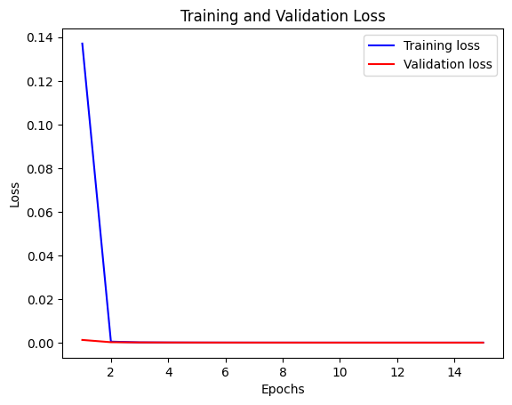

# CNN vs VGG16 vs MobileNet

## 0. 

Creating a deep learning model for classifying kidney conditions (stone, cyst, normal, tumor) using Convolutional Neural Networks (CNNs) with architectures like VGG16 and MobileNet is a great approach, especially when working with medical imaging data. "For further learning about these models, you can explore relevant websites and resources."


* [CNN](http://https//www.tensorflow.org/tutorials/images/cnn)
* [VGG16](http://https//datagen.tech/guides/computer-vision/vgg16/#:~:text=The%20VGG16%20model%20can%20achieve,smaller%203%C3%973%20filters.)
* [MobileNet](http://https//builtin.com/machine-learning/mobilenet)


## 1. Importing Libraries

这段代码是一系列Python库的导入语句，用于支持深度学习、数据处理、图像处理和可视化等功能。以下是对每一行代码的详细中文注释：

```python
# 导入pandas库，这是一个强大的数据分析和操作库，常用于处理结构化数据，如表格数据。
import pandas as pd

# 导入numpy库，这是一个用于科学计算的库，提供了对多维数组的支持以及对这些数组进行高效操作的函数。
import numpy as np

# 导入matplotlib.pyplot模块，这是matplotlib库的一部分，用于创建静态、交互式和动画的可视化图表。
import matplotlib.pyplot as plt

# 导入OpenCV库，即cv2，这是一个功能强大的计算机视觉和图像处理库。
import cv2

# 导入tensorflow库，这是Google开发的开源机器学习库，广泛用于深度学习模型的构建和训练。
import tensorflow as tf

# 导入os库，这是一个用于与操作系统进行交互的模块，可以处理文件和目录等。
import os

# 从tensorflow库中导入keras子库，Keras是一个高层神经网络API，能够运行在TensorFlow之上。
from tensorflow import keras

# 从tensorflow.keras库中导入layers模块，该模块包含了构建神经网络所需的各种层（Layer）。
from tensorflow.keras import layers

# 从tensorflow.python.keras.layers库中导入Dense（全连接层）和Flatten（展平层）。
from tensorflow.python.keras.layers import Dense, Flatten

# 从tensorflow.keras.models库中导入Sequential（顺序模型）。
from tensorflow.keras.models import Sequential

# 从tensorflow.keras.optimizers库中导入Adam（自适应矩估计优化器），这是一种常用的优化算法。
from tensorflow.keras.optimizers import Adam

# 再次从tensorflow.keras.layers库中导入Flatten、Dense、Dropout（随机失活层）、BatchNormalization（批量归一化层）。
from tensorflow.keras.layers import Flatten, Dense, Dropout, BatchNormalization

# 从tensorflow.keras.models库中导入Model（模型）和Sequential（顺序模型），这两个类都可以用来构建复杂的神经网络模型。
from tensorflow.keras.models import Model, Sequential

# 从tensorflow.keras.layers库中导入Conv2D（二维卷积层）、MaxPooling2D（最大池化层）。
from tensorflow.keras.layers import Conv2D, MaxPooling2D

# 从tensorflow.keras.layers库中导入GlobalAveragePooling2D（全局平均池化层），这是一种将二维特征图转换为一维输出的层。
from tensorflow.keras.layers import GlobalAveragePooling2D
```

这段代码的目的是为后续的数据处理、模型构建、训练和评估等操作准备所需的库和模块。通过这些库，可以实现从数据加载、预处理、模型设计、训练到评估的整个机器学习工作流程。


结果展示：

```python
/opt/conda/lib/python3.10/site-packages/scipy/__init__.py:146: UserWarning: A NumPy version >=1.16.5 and <1.23.0 is required for this version of SciPy (detected version 1.23.5
  warnings.warn(f"A NumPy version >={np_minversion} and <{np_maxversion}"
```

结果解释：
运行结果中的警告信息指出了一个与NumPy版本相关的问题。以下是对警告信息的解释：

```
UserWarning: A NumPy version >=1.16.5 and <1.23.0 is required for this version of SciPy (detected version 1.23.5
```

这条警告是由SciPy库生成的，它表明当前环境中安装的NumPy版本（1.23.5）超出了SciPy库所需的版本范围。SciPy库推荐使用的NumPy版本是大于等于1.16.5且小于1.23.0的版本。

具体来说，警告信息包含以下几个要点：

1. **警告类型**: `UserWarning`，这是一种标准警告，用来提醒用户某些情况可能需要关注。

2. **SciPy的要求**: SciPy库指出它需要的NumPy版本应该在1.16.5到1.22.0之间（不包括1.23.0）。

3. **检测到的版本**: 系统检测到的NumPy版本是1.23.5，这个版本超出了SciPy推荐的版本范围。

解决这个问题的方法可能包括：

- **忽略警告**: 如果SciPy库的功能没有受到影响，这个警告可以忽略。通常，库会保持对较新版本的兼容性。

- **降级NumPy**: 如果警告导致了实际的问题，可以考虑将NumPy降级到一个兼容的版本，比如1.22.0或更早的版本。

- **查看文档**: 检查SciPy和NumPy的官方文档，看是否有关于版本兼容性的更新信息或建议。

- **更新SciPy**: 如果可能，更新SciPy到一个支持更高版本NumPy的版本。

通常，库的开发者会尽量确保库与较新版本的依赖库兼容。因此，大多数情况下，这个警告可以安全地忽略，除非遇到了具体的问题。在实际开发中，保持库的更新往往是一个好习惯，以利用最新的功能和安全修复。

### Defining size
这段代码定义了用于深度学习模型训练的批次大小以及输入图像的尺寸。以下是对每一行代码的详细中文注释：

```python
# 设置批次大小为32。
# 批次大小(batch_size)是指在训练过程中每次迭代用于更新模型权重的样本数目。较小的批次大小可能会导致训练过程中出现更多的随机性，而较大的批次大小可能会提供更稳定的梯度估计。
batch_size = 32

# 设置输入图像的高度为150像素。
# 图像的高度(img_height)和宽度(img_width)定义了输入图像的尺寸。在构建模型时，这些参数将用于定义网络中图像处理层的输入尺寸。
img_height = 150

# 设置输入图像的宽度为150像素。
# 通常，图像的高度和宽度会设置为相同的值，尤其是在处理正方形图像时。这些尺寸应该根据具体任务和模型要求来确定。
img_width = 150
```

在深度学习中，批次大小和图像尺寸是模型训练的重要超参数。批次大小会影响模型训练过程中的内存使用、计算效率以及梯度下降的稳定性。图像尺寸则直接影响模型的感受野和参数数量，从而影响模型的学习能力和复杂度。选择适当的批次大小和图像尺寸对于训练一个有效的模型至关重要。

## 2. Loading Data


这段代码使用TensorFlow的 `image_dataset_from_directory` 函数从指定目录加载图像数据集，并将其分为训练集和验证集。以下是对每一行代码的详细中文注释：

```python
# 定义数据集的根目录路径。
# 此路径指向存放图像文件的文件夹，这些图像将被加载并用于训练和验证。
data_dir = '/kaggle/input/ct-kidney-dataset-normal-cyst-tumor-and-stone/CT-KIDNEY-DATASET-Normal-Cyst-Tumor-Stone/CT-KIDNEY-DATASET-Normal-Cyst-Tumor-Stone'

# 使用tf.keras.utils.image_dataset_from_directory函数从data_dir加载图像数据集，
# 并进行训练集和验证集的划分。
# image_size参数定义了加载图像的目标尺寸，这里设置为(img_height, img_width)，即150x150像素。
# validation_split参数指定了从训练数据中划分用于验证的数据比例，这里设置为0.1，即10%。
# subset参数设置为'training'，表示当前加载的是训练数据集。
# seed参数用于确保数据划分的随机性是可复现的，这里设置为123。
train = tf.keras.utils.image_dataset_from_directory(
    data_dir,
    image_size=(img_height, img_width),
    validation_split=0.1,
    subset='training',
    seed=123
)

# 使用相同的函数加载验证数据集。
# validation_split参数这次设置为0.2，即20%，这意味着更多的数据将被用作验证集。
# subset参数设置为'validation'，表示当前加载的是验证数据集。
val = tf.keras.utils.image_dataset_from_directory(
    data_dir,
    image_size=(img_height, img_width),
    validation_split=0.2,
    subset='validation',
    seed=123
)
```

这段代码的目的是自动化地从文件系统中加载图像数据，并将数据集分为两部分：大部分用作训练，小部分用作验证。在实际应用中，这种自动化的数据加载和划分对于快速迭代和模型训练非常重要。此外，通过`seed`参数确保了数据划分过程的可复现性，这对于科学研究和实验对比是非常有用的。


结果展示：
```python
Found 12446 files belonging to 4 classes.
Using 11202 files for training.
Found 12446 files belonging to 4 classes.
Using 2489 files for validation.
```
结果解释：
输出结果提供了关于数据集加载和划分的信息，以下是对输出结果的解释：

1. **数据集文件统计**:
   ```
   Found 12446 files belonging to 4 classes.
   ```
   这表示在指定的数据目录 `data_dir` 中找到了12446个文件，这些文件被分为4个类别。

2. **训练数据集大小**:
   ```
   Using 11202 files for training.
   ```
   这表示在数据集中，有11202个文件被划分为训练集，用于模型的训练过程。

3. **验证数据集大小**:
   ```
   Found 12446 files belonging to 4 classes.
   Using 2489 files for validation.
   ```
   尽管这里再次提到了数据集的总文件数和类别数，但重要的是第二个句子，它表明有2489个文件被划分为验证集，用于在训练过程中评估模型的性能。

这些输出结果表明 `tf.keras.utils.image_dataset_from_directory` 函数成功地从指定的目录加载了图像文件，并且根据指定的比例将它们划分为训练集和验证集。在这种情况下，大部分图像（约90%）被用于训练，而剩下的约10%被用于验证。这种划分比例是机器学习中常见的做法，旨在确保有足够的数据来训练模型，同时也有足够的数据来准确评估模型的泛化能力。

需要注意的是，尽管这里提到了两次“Found 12446 files belonging to 4 classes”，这实际上是重复的信息，可能是因为在划分训练集和验证集时，函数都统计了整个数据集的文件和类别。
### Labels


这段代码创建了一个从标签到类别名称的映射字典。以下是对每一行代码的详细中文注释：

```python
# 使用zip函数将train对象的class_names属性（它是一个包含所有类别名称的列表）与对应的标签（即从0开始的整数索引）打包成一个元组列表。
# 然后，使用dict函数将这个元组列表转换成一个字典，其中键是标签，值是对应的类别名称。
label_to_class_name = dict(zip(range(len(train.class_names)), train.class_names))

# 最后，打印出label_to_class_name字典，这个字典可以用于将模型预测的标签转换为人类可读的类别名称。
label_to_class_name
```

在这段代码中，`train.class_names` 是一个由 `tf.keras.utils.image_dataset_from_directory` 函数自动生成的类别名称列表，它包含了数据集中所有类别的名称。`range(len(train.class_names))` 生成一个从 0 到类别数量减 1 的整数序列，作为类别的索引标签。

执行完这段代码后，`label_to_class_name` 字典可以被用来快速查找一个给定标签对应的类别名称。这对于模型预测后将标签转换为实际的类别名称，以及进行后续的数据分析和可视化非常有用。

结果展示：

```python
{0: 'Cyst', 1: 'Normal', 2: 'Stone', 3: 'Tumor'}
```

结果解释：
输出结果是一个字典，它映射了从0开始的整数标签到对应的类别名称。以下是对输出结果的解释：

```python
# 这是一个字典，其中的键（key）是整数标签，值（value）是对应的类别名称。
# 根据输出结果：
# {0: 'Cyst', 1: 'Normal', 2: 'Stone', 3: 'Tumor'}
# 我们可以看到：
# - 标签0对应于'Cyst'（囊肿）
# - 标签1对应于'Normal'（正常）
# - 标签2对应于'Stone'（结石）
# - 标签3对应于'Tumor'（肿瘤）

# 这个映射是非常有用的，因为：
# - 在机器学习模型中，类别通常被表示为整数标签（例如，模型的输出可能是一个预测类别的整数）。
# - 然而，在实际应用中，我们通常需要知道这些整数标签代表的实际类别是什么。
# - 通过这个字典，我们可以快速地将模型预测的整数标签转换为具体的类别名称，从而更容易地理解模型的预测结果。

# 例如，如果一个模型预测了一个样本的类别标签为2，通过查看这个字典，我们可以知道这个样本被预测为'Stone'（结石）。
```

这个字典是通过对训练数据集的类别名称列表 `train.class_names` 使用 `zip` 函数和 `dict` 函数创建的。`zip` 函数将两个序列（这里是类别索引和类别名称）打包成一个元组的列表，然后 `dict` 函数将这个列表转换成一个字典。这个过程确保了每个整数标签都有一个与之对应的、人类可读的类别名称。
### Size

这段代码通过迭代训练数据集 `train` 来打印出一个批次的图像和标签的维度信息。以下是对每一行代码的详细中文注释：

```python
# 使用for循环遍历训练数据集train，每次迭代会得到一个图像批次（image_batch）和一个对应的标签批次（labels_batch）。
for image_batch, labels_batch in train:
    # 打印当前图像批次的shape，即维度信息。
    # 在Keras中，预期的输出形状通常是(batch_size, img_height, img_width, color_channels)，
    # 其中batch_size是定义好的批次大小，img_height和img_width是在加载数据集时指定的图像尺寸，
    # color_channels表示图像的颜色通道数，对于灰度图像是1，对于RGB图像是3。
    print(image_batch.shape)
    
    # 打印当前标签批次的shape，即维度信息。
    # 标签批次的形状通常是(batch_size, num_classes)，
    # 其中batch_size同样与训练时定义的批次大小一致，num_classes是类别的数量。
    # 对于使用one-hot编码的情况，标签将是一个多维的独热编码向量。
    print(labels_batch.shape)
    
    # break语句用于在输出了第一个批次的形状信息后立即退出循环，避免输出整个数据集中每个批次的信息。
    break
```

这段代码的输出将提供对训练数据集批次大小和形状的直观理解，这对于调试和理解模型输入的维度非常有用。特别是，它可以帮助确认数据是否正确加载，并且是否以预期的格式提供给模型。

结果展示：

```python
(32, 150, 150, 3)
(32,)
```

结果解释：

输出结果提供了关于训练数据集中一个批次的图像和标签的形状信息。以下是对输出结果的解释：

1. **图像批次的形状**:
   ```
   (32, 150, 150, 3)
   ```
   这个形状表示当前批次包含32张图像，每张图像的尺寸是150x150像素，且每张图像有3个颜色通道。这里的3个颜色通道表明图像是RGB彩色图像，而不是灰度图像。第一个数字32对应于之前设置的批次大小（batch_size = 32），后面的三个数字150x150x3对应于图像的分辨率和颜色通道数。

2. **标签批次的形状**:
   ```
   (32,)
   ```
   这个形状表示标签批次包含32个标签，每个标签是一个单独的整数，代表一个图像所属的类别。由于标签批次的形状是一个一维数组，其中只包含32个元素，这意味着每个标签都是一个独立的整数，没有使用one-hot编码。这可能是因为数据集在加载时没有指定`class_mode`参数，或者指定的`class_mode`不是`'categorical'`。

总结来说，输出结果显示了训练数据集中一个批次的图像和标签的维度。图像是RGB彩色图像，尺寸为150x150像素，每个批次包含32张图像。标签是整数形式，每个批次包含32个标签。如果需要将标签转换为one-hot编码，可能需要额外的预处理步骤。
## 3. Images


这段代码展示了如何从训练数据集中创建一个批次的图像，并使用matplotlib库将这些图像显示在一个4x4的网格中。以下是对每一行代码的详细中文注释：

```python
# 将训练数据集转换为一个NumPy迭代器。
# 这个迭代器将允许我们按批次获取数据集中的图像和标签。
data_iterator = train.as_numpy_iterator()

# 使用迭代器的next()方法获取第一个批次的图像和标签。
# batch变量将包含两个元素：第一个元素是图像批次，第二个元素是对应的标签批次。
batch = data_iterator.next()

# 使用matplotlib的subplots函数创建一个图形(fig)和一个子图网格(ax)。
# nrows=4和ncols=4表示网格有4行和4列，figsize=(10, 10)设置图形的大小为10x10英寸。
fig, ax = plt.subplots(nrows=4, ncols=4, figsize=(10, 10))

# 使用双层循环遍历子图网格的每个位置。
# i表示行索引，j表示列索引。
for i in range(4):  
    for j in range(4):  
        # 计算当前索引位置的图像在批次中的索引。
        # 由于我们有一个4x4的网格，i * 4 + j计算了批次中的正确索引。
        index = i * 4 + j  

        # 在当前的子图上显示当前索引位置的图像。
        # batch[0][index]获取批次中的图像，astype(int)将图像数据转换为整数类型，以便于显示。
        ax[i, j].imshow(batch[0][index].astype(int))
        
        # 设置当前子图的标题为对应的标签名称。
        # batch[1][index]获取批次中的标签，label_to_class_name[batch[1][index]]使用标签索引找到对应的类别名称。
        ax[i, j].set_title(label_to_class_name[batch[1][index]])

# 使用subplots_adjust函数调整子图之间的间距。
# wspace=0.4设置子图之间的宽度间距为0.4，hspace=0.4设置子图之间的高度间距为0.4。
plt.subplots_adjust(wspace=0.4, hspace=0.4)

# 使用show函数显示整个图形。
plt.show()
```

这段代码的目的是可视化数据集中的一个图像批次，以便于理解数据的外观和分布。通过显示图像和它们的类别名称，我们可以快速检查数据的质量和模型的输入。这对于数据探索和理解模型性能是非常有用的。


### Data preprocessing
这段代码使用Keras的 `map` 方法对训练集（`train`）和验证集（`val`）中的图像数据进行预处理，具体是对图像数据进行归一化处理。以下是对每一行代码的详细中文注释：

```python
# 对训练数据集'train'应用map函数，这是一种对数据集中所有元素进行指定操作的方法。
# map函数接收一个函数和一个数据集作为参数，将函数应用于数据集中的每个样本。
# lambda是一个匿名函数，这里它接受两个参数x和y，分别代表图像数据和对应的标签。
# x/255将图像数据的每个像素值除以255，因为图像的像素值范围通常是0到255，而神经网络通常在0到1的范围内工作得更好。
# 最终，图像数据被归一化到0到1之间，而标签数据y保持不变。
train = train.map(lambda x, y: (x / 255, y))

# 对验证数据集'val'应用相同的map函数，进行与训练集相同的归一化处理。
# 这是为了确保验证数据的预处理方式与训练数据保持一致，从而进行公平的性能评估。
val = val.map(lambda x, y: (x / 255, y))
```

归一化图像数据是深度学习中常见的预处理步骤，它有助于加快模型训练过程中的收敛速度，并且使得不同尺度的输入数据对模型的影响更加均匀。此外，归一化还可以减少数值问题，如梯度消失或梯度爆炸，这些问题可能会在优化过程中遇到。

需要注意的是，归一化仅应用于图像数据，标签数据（`y`）保持原样不变，因为标签不需要这种类型的预处理。


这段代码使用TensorFlow的`tf.data` API来优化数据加载过程，以提高训练过程中的数据读取效率。以下是对每一行代码的详细中文注释：

```python
# 导入AUTOTUNE常量，这是tf.data.experimental.AUTOTUNE的简写形式。
# AUTOTUNE是一个特殊的值，指示tf.data运行时根据当前系统的执行情况动态决定最佳设置。
AUTOTUNE = tf.data.AUTOTUNE

# 对训练数据集'train'应用cache方法，这会将整个数据集缓存到内存中。
# 缓存数据集可以避免在每个epoch重复从磁盘加载数据，从而加快数据读取速度。
# 然后，调用prefetch方法，这会在数据集上进行预取操作，即在模型训练时异步地预加载下一批数据。
# prefetch方法的buffer_size参数设置为AUTOTUNE，这样TensorFlow运行时会动态决定预取的最优批次大小。
train = train.cache().prefetch(buffer_size=AUTOTUNE)

# 对验证数据集'val'应用相同的优化操作，即缓存整个数据集并进行预取。
# 这同样可以提高验证过程中的数据读取效率。
val = val.cache().prefetch(buffer_size=AUTOTUNE)
```

通过使用`cache()`和`prefetch()`方法，可以显著减少I/O等待时间，因为数据集的大部分或全部将被预先加载到内存中，而不是在每个训练步骤时都从磁盘加载。这在数据集较大或磁盘I/O较慢时尤其有用。此外，`AUTOTUNE`的使用允许TensorFlow运行时自动调整参数，以达到最佳的性能表现。


## 4. Training Models

### CNN Model

这段代码定义了一个使用Keras API的顺序（Sequential）模型，通常用于图像分类任务。以下是对每一行代码的详细中文注释：

```python
# 创建一个Sequential模型，它是tf.keras.models中的一个类，用于创建一个按顺序层叠的神经网络。
model = tf.keras.Sequential([
    # 第一个Conv2D层，它是一个二维卷积层：
    # - 32表示该层有32个卷积核（或过滤器）。
    # - (3, 3)定义了每个卷积核的大小是3x3。
    # - activation='relu'使用修正线性单元（ReLU）作为激活函数。
    # - input_shape=(150, 150, 3)指定了输入图像的形状，即150x150像素的RGB图像。
    tf.keras.layers.Conv2D(32, (3, 3), activation='relu', input_shape=(150, 150, 3)), 

    # 第一个MaxPooling2D层，它是一个最大池化层：
    # - 2,2定义了池化窗口的大小是2x2，并且步长为2。
    tf.keras.layers.MaxPooling2D(2, 2),

    # 第二个Conv2D层，与第一个Conv2D层结构相同，但这里没有指定输入形状，因为它将自动从上一层继承。
    tf.keras.layers.Conv2D(32, (3, 3), activation='relu'),

    # 第二个MaxPooling2D层，与第一个MaxPooling2D层结构相同。
    tf.keras.layers.MaxPooling2D(2, 2),

    # Flatten层，它将二维的输入数据展平成一维，以便可以传递给全连接层（Dense层）。
    tf.keras.layers.Flatten(),

    # 第一个Dense层，也就是全连接层：
    # - 128表示该层有128个神经元。
    # - activation=tf.nn.relu指定ReLU激活函数。
    tf.keras.layers.Dense(128, activation=tf.nn.relu),

    # 第二个Dense层，也是输出层：
    # - 4表示该层有4个神经元，对应于数据集中的4个类别。
    # - activation=tf.nn.softmax将输出转换为概率分布，每个类别的输出值表示为模型预测该类别的概率。
    tf.keras.layers.Dense(4, activation=tf.nn.softmax)
])
```

这个模型是一个典型的卷积神经网络（CNN）结构，适用于处理图像数据。它首先使用两个卷积层和池化层来提取图像特征，然后将结果展平并通过两个全连接层来学习特征之间的复杂关系，最后输出一个概率分布，用于分类。使用softmax激活函数的最后一个全连接层是模型的输出层，它将提供每个输入图像属于各个类别的概率。


这行代码是使用Keras库的`compile`方法来配置模型的训练参数，包括优化器、损失函数和评价指标。以下是对这行代码的详细中文注释：

```python
# 使用模型对象model的compile方法来编译（配置）模型。
# compile方法需要指定三个参数：optimizer（优化器）、loss（损失函数）和metrics（评价指标）。

# optimizer='adam'指定使用Adam优化器。
# Adam（自适应矩估计）是一种流行的梯度下降优化算法，它结合了RMSprop和Momentum两种优化算法的优点，通常在训练深度学习模型时表现良好。
optimizer = 'adam',

# loss='sparse_categorical_crossentropy'指定使用稀疏分类交叉熵作为损失函数。
# 稀疏分类交叉熵适用于模型输出为概率分布，且标签为整数时的情况。这里的“稀疏”意味着标签数据是整数而不是独热编码（one-hot）。
loss = 'sparse_categorical_crossentropy',

# metrics=['accuracy']指定在训练过程中计算并显示准确率指标。
# 准确率是正确预测的样本数占总样本数的比例，是评估分类模型性能的常用指标。
# 可以添加更多的评价指标，如精确率、召回率等，但在这个例子中，只使用了准确率。
metrics=['accuracy']
```

在模型编译完成后，就可以使用`model.fit`方法开始训练模型。编译阶段是模型训练流程中的一个重要步骤，它确定了模型训练时使用的具体算法和指标，这些参数将直接影响模型的学习过程和最终性能。


这段代码使用Keras的`fit`方法开始训练模型，并指定了训练的轮次（epochs）以及验证集。以下是对每一行代码的详细中文注释：

```python
# 定义训练的轮次，这里设置为15轮。
# 一个epoch代表整个训练集被遍历一次，即模型对训练集中所有样本进行了一次前向和后向传播。
epochs = 15

# 使用模型对象model的fit方法开始训练模型。
# fit方法是Keras中用于模型训练的核心函数，它将数据输入模型，并根据指定的优化器和损失函数调整模型的参数。
history = model.fit(
    # 训练数据集，模型将从这个数据集中学习。
    train,
    
    # validation_data参数指定了验证数据集，即在每个epoch结束后，用于评估模型性能的数据集。
    # 这里使用之前定义的val数据集作为验证数据。
    validation_data=val,
    
    # epochs参数指定了训练的轮次，这里使用之前定义的epochs变量。
    epochs=epochs
)

# 训练完成后，history变量将包含训练过程中的所有信息，包括每个epoch的训练和验证损失值、准确率等指标。
# 这些信息可以用于后续的模型分析，比如绘制训练过程中的损失和准确率曲线，评估模型性能等。
```

执行这段代码后，Keras将开始训练过程。在每个epoch结束后，模型将在训练集上进行一次前向传播和后向传播，以更新模型权重。同时，模型也会在验证集上进行评估，以监控模型在未见数据上的表现。这有助于及时发现过拟合或欠拟合的问题，并根据需要调整模型或训练策略。


结果展示：

```python
Epoch 1/15
351/351 [==============================] - 42s 96ms/step - loss: 0.1371 - accuracy: 0.9562 - val_loss: 0.0012 - val_accuracy: 1.0000
Epoch 2/15
351/351 [==============================] - 4s 12ms/step - loss: 4.6098e-04 - accuracy: 1.0000 - val_loss: 1.9573e-04 - val_accuracy: 1.0000
Epoch 3/15
351/351 [==============================] - 4s 12ms/step - loss: 1.1702e-04 - accuracy: 1.0000 - val_loss: 9.8322e-05 - val_accuracy: 1.0000
Epoch 4/15
351/351 [==============================] - 4s 12ms/step - loss: 5.9907e-05 - accuracy: 1.0000 - val_loss: 6.1083e-05 - val_accuracy: 1.0000
Epoch 5/15
351/351 [==============================] - 4s 12ms/step - loss: 3.5668e-05 - accuracy: 1.0000 - val_loss: 4.1480e-05 - val_accuracy: 1.0000
Epoch 6/15
351/351 [==============================] - 4s 12ms/step - loss: 2.3140e-05 - accuracy: 1.0000 - val_loss: 2.9660e-05 - val_accuracy: 1.0000
Epoch 7/15
351/351 [==============================] - 4s 12ms/step - loss: 1.5845e-05 - accuracy: 1.0000 - val_loss: 2.2060e-05 - val_accuracy: 1.0000
Epoch 8/15
351/351 [==============================] - 4s 12ms/step - loss: 1.1253e-05 - accuracy: 1.0000 - val_loss: 1.6694e-05 - val_accuracy: 1.0000
Epoch 9/15
351/351 [==============================] - 4s 12ms/step - loss: 8.2133e-06 - accuracy: 1.0000 - val_loss: 1.2905e-05 - val_accuracy: 1.0000
Epoch 10/15
351/351 [==============================] - 4s 12ms/step - loss: 6.1146e-06 - accuracy: 1.0000 - val_loss: 1.0074e-05 - val_accuracy: 1.0000
Epoch 11/15
351/351 [==============================] - 4s 12ms/step - loss: 4.6231e-06 - accuracy: 1.0000 - val_loss: 7.9231e-06 - val_accuracy: 1.0000
Epoch 12/15
351/351 [==============================] - 4s 12ms/step - loss: 3.5403e-06 - accuracy: 1.0000 - val_loss: 6.3617e-06 - val_accuracy: 1.0000
Epoch 13/15
351/351 [==============================] - 4s 12ms/step - loss: 2.7367e-06 - accuracy: 1.0000 - val_loss: 5.2593e-06 - val_accuracy: 1.0000
Epoch 14/15
351/351 [==============================] - 4s 12ms/step - loss: 2.1350e-06 - accuracy: 1.0000 - val_loss: 4.2493e-06 - val_accuracy: 1.0000
Epoch 15/15
351/351 [==============================] - 4s 12ms/step - loss: 1.6751e-06 - accuracy: 1.0000 - val_loss: 3.5216e-06 - val_accuracy: 1.0000
```

结果解释：

输出结果显示了模型在训练和验证过程中的性能指标，包括损失值（loss）、准确率（accuracy）以及在验证集上相应的损失值（val_loss）和准确率（val_accuracy）。以下是对输出结果的逐条解释：

1. **Epoch Information**:
   ```
   Epoch 1/15
   ```
   这表示当前正在训练的是第1轮，共15轮。

2. **Training Progress**:
   ```
   351/351 [==============================]
   ```
   这表示所有的351批次（steps）在当前epoch中都已完成。

3. **Training Time**:
   ```
   - 42s 96ms/step
   ```
   这表示整个epoch训练完成所需的时间，以及平均每个步骤所需的时间。对于第一个epoch，时间较长，这是因为数据首次被加载和处理，可能包括数据的预加载和模型的编译时间。

4. **Training Loss and Accuracy**:
   ```
   - loss: 0.1371 - accuracy: 0.9562
   ```
   这表示训练集上的平均损失值为0.1371，准确率为95.62%。

5. **Validation Loss and Accuracy**:
   ```
   - val_loss: 0.0012 - val_accuracy: 1.0000
   ```
   这表示验证集上的平均损失值为0.0012，准确率达到了100%。

6. **Subsequent Epochs**:
   ```
   Epoch 2/15 ...
   Epoch 15/15 ...
   ```
   随着训练的进行，损失值和验证损失值逐渐减小，准确率和验证准确率趋于稳定，并且很快都达到了100%。

7. **Final Training Performance**:
   ```
   Epoch 15/15
   - loss: 1.6751e-06 - accuracy: 1.0000 - val_loss: 3.5216e-06 - val_accuracy: 1.0000
   ```
   在最后一个epoch，训练损失值和验证损失值都非常小，表明模型几乎没有在训练数据上犯错误，同时在验证集上也达到了完美的准确率。

总结来说，模型在训练集上的表现随着epoch的增加逐渐提升，最终在训练集和验证集上都达到了极高的准确率。然而，需要注意的是，尽管模型在验证集上表现良好，但验证集的样本量可能有限，因此可能存在过拟合的风险。在实际应用中，还需要在独立的测试集上进一步评估模型的泛化能力。


#### Ploting Loss and Accuracy

这段代码使用matplotlib库绘制了模型训练过程中训练集和验证集的损失值变化曲线。以下是对每一行代码的详细中文注释：

```python
# 从训练历史对象history中获取训练损失值。
# history.history是一个字典，其中包含了训练过程中的各种指标值，'loss'键对应的值即为训练损失值。
loss = history.history['loss']

# 从训练历史对象history中获取验证损失值。
# 同样，'val_loss'键对应的值即为验证集上的损失值。
val_loss = history.history['val_loss']

# 生成一个表示epoch的序列。
# range(1, len(loss)+1)生成一个从1到len(loss)的整数序列，即从1开始到损失值列表长度的序号。
epochs = range(1, len(loss)+1)

# 使用matplotlib的plot函数绘制训练损失值曲线。
# 'b'参数表示线条颜色为蓝色。
# label='Training loss'为这条线设置了一个图例标签，即“训练损失”。
plt.plot(epochs, loss, 'b', label='Training loss')

# 使用matplotlib的plot函数绘制验证损失值曲线。
# 'r'参数表示线条颜色为红色。
# label='Validation loss'为这条线设置了一个图例标签，即“验证损失”。
plt.plot(epochs, val_loss, 'r', label='Validation loss')

# 设置图表的标题为'Training and Validation Loss'。
plt.title('Training and Validation Loss')

# 设置x轴的标签为'Epochs'。
plt.xlabel('Epochs')

# 设置y轴的标签为'Loss'。
plt.ylabel('Loss')

# 调用legend函数显示图例。
plt.legend()

# 调用show函数显示图表。
plt.show()
```

这段代码的目的是可视化模型在训练过程中的损失变化情况，帮助我们理解模型的学习动态。通过观察训练损失和验证损失随epoch变化的趋势，我们可以评估模型是否在学习（损失在减少），以及是否存在过拟合或欠拟合的问题。如果训练损失和验证损失都随着时间逐渐减小并趋于稳定，这通常意味着模型训练得很好。如果训练损失在减小而验证损失开始增加，这可能是过拟合的迹象。反之，如果训练损失没有显著下降，可能是欠拟合的迹象。





这段代码使用matplotlib库绘制了模型训练过程中训练集和验证集的准确率变化曲线。以下是对每一行代码的详细中文注释：

```python
# 从训练历史对象history中获取训练准确率。
# history.history是一个字典，其中包含了训练过程中的各种指标值，'accuracy'键对应的值即为训练集上的准确率。
acc = history.history['accuracy']

# 从训练历史对象history中获取验证准确率。
# 'val_accuracy'键对应的值即为验证集上的准确率。
val_acc = history.history['val_accuracy']

# 使用matplotlib的plot函数绘制训练准确率曲线。
# 'b'参数表示线条颜色为蓝色。
# label='Training acc'为这条线设置了一个图例标签，即“训练准确率”。
plt.plot(epochs, acc, 'b', label='Training acc')

# 使用matplotlib的plot函数绘制验证准确率曲线。
# 'r'参数表示线条颜色为红色。
# label='Validation acc'为这条线设置了一个图例标签，即“验证准确率”。
plt.plot(epochs, val_acc, 'r', label='Validation acc')

# 设置图表的标题为'Training and Validation Accuracy'。
plt.title('Training and Validation Accuracy')

# 设置x轴的标签为'Epochs'。
plt.xlabel('Epochs')

# 设置y轴的标签为'Accuracy'。
plt.ylabel('Accuracy')

# 调用legend函数显示图例。
plt.legend()

# 调用show函数显示图表。
plt.show()
```

这段代码的目的是可视化模型在训练过程中的准确率变化情况，帮助我们理解模型的学习动态。通过观察训练准确率和验证准确率随epoch变化的趋势，我们可以评估模型的泛化能力。如果训练准确率和验证准确率都随着时间逐渐增加，这通常意味着模型在训练数据和未见过的验证数据上都表现良好。如果训练准确率持续提高而验证准确率开始下降，这可能是过拟合的迹象，表明模型在训练集上表现过于优化，而在新数据上的表现并没有相应提高。反之，如果训练准确率没有显著提高，可能是欠拟合的迹象，表明模型在训练数据上的表现也不理想。


#### Prediction


这段代码展示了如何使用OpenCV库读取图像，然后使用模型对其进行预测，并显示预测结果的类别名称。以下是对每一行代码的详细中文注释：

```python
# 使用OpenCV的imread函数读取指定路径下的图像文件。
# 这里读取的是一个名为'Cyst- (1).jpg'的图像，它位于数据集的'Cyst'子目录中。
img = cv2.imread('/kaggle/input/ct-kidney-dataset-normal-cyst-tumor-and-stone/CT-KIDNEY-DATASET-Normal-Cyst-Tumor-Stone/CT-KIDNEY-DATASET-Normal-Cyst-Tumor-Stone/Cyst/Cyst- (1).jpg')

# 使用matplotlib的imshow函数显示图像。
# 这将弹出一个窗口展示图像的可视化效果。
plt.imshow(img)

# 调用show函数来展示图像。
plt.show()

# 使用TensorFlow的image.resize函数将图像大小调整为150x150像素，以匹配模型的输入尺寸。
# resize函数返回一个新的图像张量，其大小为指定的尺寸。
resize = tf.image.resize(img, (150, 150))

# 将调整大小后的图像通过模型的predict方法进行预测。
# 由于模型预期的输入是一个批次的图像，因此使用np.expand_dims将图像张量扩展到一个批次中，即其形状变为(batch_size, height, width, channels)。
# 此外，图像数据需要被归一化到0到1之间，因此除以255。
yhat = model.predict(np.expand_dims(resize / 255, 0))

# 使用numpy的argmax函数找到预测概率最高的类别索引。
# np.argmax函数返回概率最高的类别的索引值。
max_index = np.argmax(yhat)

# 使用之前创建的label_to_class_name字典，通过索引值获取对应的类别名称。
# 最终，执行label_to_class_name[max_index]将返回模型预测的类别名称。
label_to_class_name[max_index]
```

这段代码的目的是演示如何将单个图像输入到训练好的模型中，并获取其预测结果。通过显示图像、调整图像大小、归一化、模型预测和获取类别名称，这个过程展示了从原始图像到预测类别的完整流程。


结果展示：
```python
1/1 [==============================] - 0s 119ms/step
```


```python
'Cyst'
```
结果解释：
输出结果表明了使用深度学习模型对单个图像进行预测的过程。以下是对输出结果的解释：

1. **图像读取与显示**:
   ```python
   img = cv2.imread('/path/to/image')
   plt.imshow(img)
   plt.show()
   ```
   这段代码读取了指定路径下的图像文件，并使用matplotlib库显示了图像。如果图像成功显示，它将呈现在屏幕上供用户查看。

2. **图像预处理**:
   ```python
   resize = tf.image.resize(img, (150, 150))
   ```
   使用TensorFlow的`resize`函数将图像调整到模型所需的尺寸，即150x150像素。

3. **归一化**:
   ```python
   resize / 255
   ```
   图像数据被归一化到0到1的范围内。由于图像的像素值范围通常是0到255，除以255可以将像素值缩放到0到1之间。

4. **模型预测**:
   ```python
   yhat = model.predict(np.expand_dims(resize, 0))
   ```
   将调整尺寸和归一化后的图像数据传递给模型进行预测。`np.expand_dims`用于增加一个批次维度，因为模型预期的输入是批次的图像。由于是单个图像，所以添加了一个额外的维度，使图像的形状变为`(1, 150, 150, 3)`。

5. **预测结果**:
   ```python
   max_index = np.argmax(yhat)
   label_to_class_name[max_index]
   ```
   使用`argmax`函数找到模型输出中概率最高的类别索引，然后使用这个索引从`label_to_class_name`字典中获取对应的类别名称。

6. **输出结果**:
   ```
   1/1 [==============================] - 0s 119ms/step
   'Cyst'
   ```
   - 第一行表示模型预测步骤的完成状态，表明预测已经完成。
   - 第二行是模型预测的类别名称，这里是`'Cyst'`，意味着模型预测该图像为“囊肿”类别。

总结来说，这段代码展示了从读取图像、预处理、模型预测到输出预测结果的整个流程。最终的输出`'Cyst'`表明模型识别该图像为囊肿，这与图像的文件名“Cyst-(1).jpg”是一致的。

### VGG16 Model

这段代码展示了如何使用Keras库来构建一个基于VGG16预训练模型的自定义模型。以下是对每一行代码的详细中文注释：

```python
# 从tensorflow.keras.models模块导入Sequential类，用于创建一个顺序模型。
VGG_model = Sequential()

# 从tensorflow.keras.applications模块导入VGG16模型。
# include_top=False表示不包含VGG16的顶层（即全连接层），这样可以得到一个特征提取模型。
# input_shape=(150,150,3)定义了输入图像的尺寸和颜色通道数。
# pooling='max'表示在VGG16模型的顶层使用最大池化层。
# classes=4表示原始VGG16模型是在有4个类别的数据集上训练的。
# weights='imagenet'表示使用在ImageNet数据集上预训练的权重。
pretrained_model = tf.keras.applications.VGG16(
    include_top=False,
    input_shape=(150, 150, 3),
    pooling='max',
    classes=4,
    weights='imagenet'
)

# 将预训练的VGG16模型作为自定义模型的第一个层添加到VGG_model中。
VGG_model.add(pretrained_model)

# 添加Flatten层，将VGG16模型输出的二维特征图展平成一维，以便于后续的全连接层处理。
VGG_model.add(Flatten())

# 添加一个具有512个神经元的全连接层，并使用ReLU激活函数。
VGG_model.add(Dense(512, activation='relu'))

# 添加批量归一化层，这有助于提高模型的训练稳定性和性能。
VGG_model.add(BatchNormalization())

# 添加Dropout层，丢弃率设置为0.5，这有助于减少过拟合。
VGG_model.add(Dropout(0.5))

# 添加最后一个全连接层，具有4个神经元，对应于数据集的4个类别，并使用softmax激活函数，将输出转换为概率分布。
VGG_model.add(Dense(4, activation='softmax'))

# 将预训练的VGG16模型设置为不可训练（冻结），这样在模型训练过程中，VGG16模型的权重将不会更新。
pretrained_model.trainable = False
```

这段代码的目的是创建一个结合了预训练的VGG16特征提取器和自定义的全连接层的复合模型。通过冻结预训练模型的权重，可以避免在训练过程中对这些权重进行更新，从而节省计算资源并利用预训练模型的强大特征提取能力。这种方法在迁移学习中非常常见，特别是在目标任务的数据集相对较小的情况下。

结果展示：

```python
Downloading data from https://storage.googleapis.com/tensorflow/keras-applications/vgg16/vgg16_weights_tf_dim_ordering_tf_kernels_notop.h5
58889256/58889256 [==============================] - 2s 0us/step
```

结果解释：

输出结果显示了在执行上述代码时，Keras从在线存储库下载了VGG16模型的预训练权重。以下是对输出结果的解释：

```
Downloading data from https://storage.googleapis.com/tensorflow/keras-applications/vgg16/vgg16_weights_tf_dim_ordering_tf_kernels_notop.h5
```

这条信息表明Keras正在从指定的URL下载VGG16模型的预训练权重文件。这是因为在代码中指定了`weights='imagenet'`，告诉Keras下载在ImageNet数据集上预训练的权重。

```
58889256/58889256 [==============================] - 2s 0us/step
```

这表示下载的总大小是58,889,256字节，下载过程已经完成。下载时间是2秒，而每个步骤的时间是0微秒（us），这通常意味着下载是瞬时完成的，可能是因为权重文件相对较小，或者网络连接速度非常快。

在下载完成后，Keras会将下载的权重加载到`pretrained_model`对象中，这是一个没有顶层（即没有最后的全连接层）的VGG16模型。这样，`pretrained_model`就可以作为一个特征提取器，用于提取输入图像的特征。

最后，`pretrained_model.trainable = False`这一行代码将预训练模型的可训练属性设置为False，这意味着在模型训练过程中，VGG16的权重将被冻结，不会进行更新。这通常用于迁移学习，其中预训练模型的权重已经很好地捕捉了图像的通用特征，我们只需要训练模型的剩余部分来适应特定的任务。

总结来说，输出结果表明VGG16模型的预训练权重已经被成功下载并加载到模型中，预训练模型的权重将不会在后续的训练过程中更新。


这行代码是使用Keras的`compile`方法来配置VGG模型的训练参数，包括优化器、损失函数和评价指标。以下是对这行代码的详细中文注释：

```python
# 使用VGG_model对象的compile方法来编译（配置）模型。
# compile方法需要指定三个参数：optimizer（优化器）、loss（损失函数）和metrics（评价指标）。

# optimizer='adam'指定使用Adam优化器。
# Adam（自适应矩估计）是一种流行的梯度下降优化算法，它结合了RMSprop和Momentum两种优化算法的优点，通常在训练深度学习模型时表现良好。
optimizer='adam',

# loss='sparse_categorical_crossentropy'指定使用稀疏分类交叉熵作为损失函数。
# 稀疏分类交叉熵适用于模型输出为概率分布，且标签为整数时的情况。这里的“稀疏”意味着标签数据是整数而不是独热编码（one-hot）。
loss='sparse_categorical_crossentropy',

# metrics=['accuracy']指定在训练过程中计算并显示准确率指标。
# 准确率是正确预测的样本数占总样本数的比例，是评估分类模型性能的常用指标。
# 可以添加更多的评价指标，如精确率、召回率等，但在这个例子中，只使用了准确率。
metrics=['accuracy']
```

在模型编译完成后，就可以使用`VGG_model.fit`方法开始训练模型。编译阶段是模型训练流程中的一个重要步骤，它确定了模型训练时使用的具体算法和指标，这些参数将直接影响模型的学习过程和最终性能。


这行代码调用了Keras模型的`summary`方法，用于打印出模型的详细结构，包括每一层的名称、输出形状、参数数量等信息。以下是对这行代码的详细中文注释：

```python
# 使用VGG_model对象的summary方法来打印出模型的详细结构。
# summary方法会列出模型中每一层的详细信息，包括：
# - Layer (type): 每一层的名称和类型。
# - Output Shape: 每一层的输出形状，对于卷积层和池化层，输出形状通常是三维的，包括高度、宽度和通道数；对于全连接层（Dense），输出形状是二维的，即批次大小和神经元数量。
# - Param #: 每一层的参数数量，即权重和偏置的总数。
# 这个总结可以帮助我们了解模型的复杂度，以及可能需要多少计算资源。
VGG_model.summary()
```

执行`VGG_model.summary()`后，控制台将输出模型的层级结构列表，每一层的信息都会显示出来。这通常包括：

- 层的名称（例如：`conv2d`, `max_pooling2d`, `flatten`, `dense`, `batch_normalization`, `dropout`）。
- 层的类型（例如：`Conv2D`, `MaxPooling2D`, `Flatten`, `Dense`, `BatchNormalization`, `Dropout`）。
- 层的输出形状，展示了该层输出数据的维度。
- 层的参数数量，即该层的权重和偏置项的总数。

这个摘要对于调试模型结构非常有用，可以快速检查模型是否按照预期的方式构建，以及估计模型的参数数量，从而对模型的复杂度和训练难度有一个大致的了解。


结果展示：

```python
Model: "sequential_1"
_________________________________________________________________
 Layer (type)                Output Shape              Param #   
=================================================================
 vgg16 (Functional)          (None, 512)               14714688  
                                                                 
 flatten_1 (Flatten)         (None, 512)               0         
                                                                 
 dense_2 (Dense)             (None, 512)               262656    
                                                                 
 batch_normalization (BatchN  (None, 512)              2048      
 ormalization)                                                   
                                                                 
 dropout (Dropout)           (None, 512)               0         
                                                                 
 dense_3 (Dense)             (None, 4)                 2052      
                                                                 
=================================================================
Total params: 14,981,444
Trainable params: 265,732
Non-trainable params: 14,715,712
_________________________________________________________________
```

结果解释：

输出结果显示了VGG模型的结构和参数统计信息。以下是对输出结果的逐条解释：

1. **模型名称**:
   ```
   Model: "sequential_1"
   ```
   这表示模型的名称是`sequential_1`，这是默认的名称，由Keras为Sequential模型生成。

2. **模型层级结构**:
   ```
   _________________________________________________________________
   Layer (type)                Output Shape              Param #
   =================================================================
   ```
   这部分列出了模型中每一层的类型、输出形状和参数数量。

3. **预训练的VGG16层**:
   ```
   vgg16 (Functional)          (None, 512)               14714688  
   ```
   这是预训练的VGG16模型层，由于`include_top=False`，它不包括VGG16的顶层（全连接层）。此层的输出形状是`(None, 512)`，意味着它将输入图像转换为一个包含512个特征的向量。参数数量为14,714,688。

4. **Flatten层**:
   ```
   flatten_1 (Flatten)         (None, 512)               0         
   ```
   Flatten层将VGG16的输出展平成一维向量，输出形状是`(None, 512)`，参数数量为0，因为它没有可学习的参数。

5. **Dense层**:
   ```
   dense_2 (Dense)             (None, 512)               262656    
   ```
   这是一个具有512个神经元的全连接层，输出形状与输入形状相同，即`(None, 512)`。参数数量为262,656。

6. **BatchNormalization层**:
   ```
   batch_normalization (BatchN  (None, 512)              2048      
   ormalization)                                                    
   ```
   批量归一化层，用于提高训练稳定性，输出形状不变，参数数量为2,048。

7. **Dropout层**:
   ```
   dropout (Dropout)           (None, 512)               0         
   ```
   Dropout层用于正则化，减少过拟合，输出形状不变，参数数量为0，因为Dropout层在训练时才起作用，在模型的推理（预测）阶段是完全透明的。

8. **输出Dense层**:
   ```
   dense_3 (Dense)             (None, 4)                 2052      
   ```
   这是模型的输出层，具有4个神经元，对应于4个类别。输出形状是`(None, 4)`，参数数量为2,052。

9. **参数总数**:
   ```
   Total params: 14,981,444
   ```
   这表示模型的总参数数量是14,981,444。

10. **可训练参数**:
    ```
    Trainable params: 265,732
    ```
    这表示模型中有265,732个参数是可训练的。

11. **非可训练参数**:
    ```
    Non-trainable params: 14,715,712
    ```
    这表示有14,715,712个参数是不可训练的，这通常是因为预训练的VGG16模型层被设置为不可训练（冻结）。

总结来说，这个摘要显示了VGG模型的结构，包括预训练的VGG16特征提取器和自定义的全连接层，以及模型的参数统计信息。由于VGG16层被冻结，大部分参数（14,715,712个）在训练过程中不会更新，只有自定义层的参数（265,732个）会被训练。


这段代码使用Keras的`fit`方法来训练VGG模型，并指定了训练的轮次（epochs）以及验证集。以下是对每一行代码的详细中文注释：

```python
# 定义训练的轮次，这里设置为15轮。
# 一个epoch代表整个训练集被遍历一次，即模型对训练集中所有样本进行了一次前向和后向传播。
epochs = 15

# 使用VGG_model对象的fit方法开始训练模型。
# fit方法是Keras中用于模型训练的核心函数，它将数据输入模型，并根据指定的优化器和损失函数调整模型的参数。

history = VGG_model.fit(
    # 训练数据集，模型将从这个数据集中学习。
    train,
    
    # validation_data参数指定了验证数据集，即在每个epoch结束后，用于评估模型性能的数据集。
    # 这里使用之前定义的val数据集作为验证数据。
    validation_data=val,
    
    # epochs参数指定了训练的轮次，这里使用之前定义的epochs变量。
    epochs=epochs
)

# 训练完成后，history变量将包含训练过程中的所有信息，包括每个epoch的训练和验证损失值、准确率等指标。
# 这些信息可以用于后续的模型分析，比如绘制训练过程中的损失和准确率曲线，评估模型性能等。
```

执行这段代码后，Keras将开始训练过程。在每个epoch结束后，模型将在训练集上进行一次前向和后向传播，以更新模型权重。同时，模型也会在验证集上进行评估，以监控模型在未见数据上的表现。这有助于及时发现过拟合或欠拟合的问题，并根据需要调整模型或训练策略。


结果展示：

```python
Epoch 1/15
351/351 [==============================] - 19s 47ms/step - loss: 0.4649 - accuracy: 0.8331 - val_loss: 0.1847 - val_accuracy: 0.9454
Epoch 2/15
351/351 [==============================] - 15s 43ms/step - loss: 0.1726 - accuracy: 0.9418 - val_loss: 0.2486 - val_accuracy: 0.9044
Epoch 3/15
351/351 [==============================] - 15s 43ms/step - loss: 0.1282 - accuracy: 0.9572 - val_loss: 0.1103 - val_accuracy: 0.9602
Epoch 4/15
351/351 [==============================] - 15s 43ms/step - loss: 0.1086 - accuracy: 0.9633 - val_loss: 0.1004 - val_accuracy: 0.9650
Epoch 5/15
351/351 [==============================] - 15s 43ms/step - loss: 0.0927 - accuracy: 0.9678 - val_loss: 0.1181 - val_accuracy: 0.9602
Epoch 6/15
351/351 [==============================] - 15s 43ms/step - loss: 0.0795 - accuracy: 0.9731 - val_loss: 0.1058 - val_accuracy: 0.9614
Epoch 7/15
351/351 [==============================] - 15s 43ms/step - loss: 0.0802 - accuracy: 0.9736 - val_loss: 0.1267 - val_accuracy: 0.9522
Epoch 8/15
351/351 [==============================] - 15s 43ms/step - loss: 0.0752 - accuracy: 0.9749 - val_loss: 0.0636 - val_accuracy: 0.9799
Epoch 9/15
351/351 [==============================] - 15s 43ms/step - loss: 0.0714 - accuracy: 0.9747 - val_loss: 0.0619 - val_accuracy: 0.9783
Epoch 10/15
351/351 [==============================] - 15s 43ms/step - loss: 0.0601 - accuracy: 0.9804 - val_loss: 0.0256 - val_accuracy: 0.9944
Epoch 11/15
351/351 [==============================] - 15s 43ms/step - loss: 0.0598 - accuracy: 0.9793 - val_loss: 0.0672 - val_accuracy: 0.9735
Epoch 12/15
351/351 [==============================] - 15s 43ms/step - loss: 0.0642 - accuracy: 0.9773 - val_loss: 0.0787 - val_accuracy: 0.9707
Epoch 13/15
351/351 [==============================] - 15s 43ms/step - loss: 0.0504 - accuracy: 0.9823 - val_loss: 0.0582 - val_accuracy: 0.9775
Epoch 14/15
351/351 [==============================] - 15s 43ms/step - loss: 0.0500 - accuracy: 0.9833 - val_loss: 0.0685 - val_accuracy: 0.9747
Epoch 15/15
351/351 [==============================] - 15s 43ms/step - loss: 0.0515 - accuracy: 0.9824 - val_loss: 0.0296 - val_accuracy: 0.9900
```

结果解释：

输出结果显示了VGG模型在训练和验证过程中的性能指标，包括损失值（loss）、准确率（accuracy）以及在验证集上相应的损失值（val_loss）和准确率（val_accuracy）。以下是对输出结果的逐条解释：

1. **Epoch Information**:
   ```
   Epoch 1/15
   ```
   这表示当前正在训练的是第1轮，共15轮。

2. **Training Progress**:
   ```
   351/351 [==============================]
   ```
   这表示所有的351批次（steps）在当前epoch中都已完成。

3. **Training Time**:
   ```
   - 19s 47ms/step
   ```
   对于第一个epoch，完成整个训练过程需要19秒，平均每个步骤需要47毫秒。随着epoch的增加，训练时间有所减少。

4. **Training Loss and Accuracy**:
   ```
   - loss: 0.4649 - accuracy: 0.8331
   ```
   这表示在训练集上的平均损失值为0.4649，准确率为83.31%。

5. **Validation Loss and Accuracy**:
   ```
   - val_loss: 0.1847 - val_accuracy: 0.9454
   ```
   这表示在验证集上的平均损失值为0.1847，准确率为94.54%。

6. **Subsequent Epochs**:
   ```
   Epoch 2/15 ...
   Epoch 15/15 ...
   ```
   随着训练的进行，训练损失和准确率以及验证损失和准确率逐渐趋于稳定。训练损失逐渐减小，准确率逐渐增加，表明模型在训练集上的性能在提升。验证损失和准确率也显示出模型在未见过的验证数据上的性能。

7. **Final Training Performance**:
   ```
   Epoch 15/15
   - loss: 0.0515 - accuracy: 0.9824 - val_loss: 0.0296 - val_accuracy: 0.9900
   ```
   在最后一个epoch，训练损失为0.0515，准确率达到了98.24%。验证损失为0.0296，准确率达到了99.00%，表明模型在训练集和验证集上都取得了很好的性能。

总结来说，模型在训练过程中表现出了良好的学习动态，训练和验证的准确率都很高，损失值都很低，这表明模型对训练数据和验证数据的分类效果很好。然而，由于验证集的样本量可能有限，是否存在过拟合还需要在独立的测试集上进一步评估。


#### Ploting Loss and Accuracy


这段代码使用matplotlib库绘制了模型训练过程中训练集和验证集的损失值变化曲线。以下是对每一行代码的详细中文注释：

```python
# 从训练历史对象history中获取训练损失值。
# history.history是一个字典，其中包含了训练过程中的各种指标值，'loss'键对应的值即为训练集上的损失值。
loss = history.history['loss']

# 从训练历史对象history中获取验证损失值。
# 'val_loss'键对应的值即为验证集上的损失值。
val_loss = history.history['val_loss']

# 生成一个表示epoch的序列。
# range(1, len(loss)+1)生成一个从1到len(loss)的整数序列，即从1开始到损失值列表长度的序号。
epochs = range(1, len(loss)+1)

# 使用matplotlib的plot函数绘制训练损失值曲线。
# 'b'参数表示线条颜色为蓝色。
# label='Training loss'为这条线设置了一个图例标签，即“训练损失”。
plt.plot(epochs, loss, 'b', label='Training loss')

# 使用matplotlib的plot函数绘制验证损失值曲线。
# 'r'参数表示线条颜色为红色。
# label='Validation loss'为这条线设置了一个图例标签，即“验证损失”。
plt.plot(epochs, val_loss, 'r', label='Validation loss')

# 设置图表的标题为'Training and Validation Loss'。
plt.title('Training and Validation Loss')

# 设置x轴的标签为'Epochs'。
plt.xlabel('Epochs')

# 设置y轴的标签为'Loss'。
plt.ylabel('Loss')

# 调用legend函数显示图例。
plt.legend()

# 调用show函数显示图表。
plt.show()
```

这段代码的目的是可视化模型在训练过程中的损失变化情况，帮助我们理解模型的学习动态。通过观察训练损失和验证损失随epoch变化的趋势，我们可以评估模型是否在学习（损失在减少），以及是否存在过拟合或欠拟合的问题。如果训练损失和验证损失都随着时间逐渐减小并趋于稳定，这通常意味着模型训练得很好。如果训练损失在减小而验证损失开始增加，这可能是过拟合的迹象。反之，如果训练损失没有显著下降，可能是欠拟合的迹象。


这段代码使用matplotlib库绘制了模型训练过程中训练集和验证集的准确率变化曲线。以下是对每一行代码的详细中文注释：

```python
# 从训练历史对象history中获取训练准确率。
# history.history是一个字典，其中包含了训练过程中的各种指标值，'accuracy'键对应的值即为训练集上的准确率。
acc = history.history['accuracy']

# 从训练历史对象history中获取验证准确率。
# 'val_accuracy'键对应的值即为验证集上的准确率。
val_acc = history.history['val_accuracy']

# 使用matplotlib的plot函数绘制训练准确率曲线。
# 'b'参数表示线条颜色为蓝色。
# label='Training acc'为这条线设置了一个图例标签，即“训练准确率”。
plt.plot(epochs, acc, 'b', label='Training acc')

# 使用matplotlib的plot函数绘制验证准确率曲线。
# 'r'参数表示线条颜色为红色。
# label='Validation acc'为这条线设置了一个图例标签，即“验证准确率”。
plt.plot(epochs, val_acc, 'r', label='Validation acc')

# 设置图表的标题为'Training and Validation Accuracy'。
plt.title('Training and Validation Accuracy')

# 设置x轴的标签为'Epochs'。
plt.xlabel('Epochs')

# 设置y轴的标签为'Accuracy'。
plt.ylabel('Accuracy')

# 调用legend函数显示图例。
plt.legend()

# 调用show函数显示图表。
plt.show()
```

这段代码的目的是可视化模型在训练过程中的准确率变化情况，帮助我们理解模型的学习动态。通过观察训练准确率和验证准确率随epoch变化的趋势，我们可以评估模型的泛化能力。如果训练准确率和验证准确率都随着时间逐渐增加，这通常意味着模型在训练数据和未见过的验证数据上都表现良好。如果训练准确率持续提高而验证准确率开始下降，这可能是过拟合的迹象，表明模型在训练集上表现过于优化，而在新数据上的表现并没有相应提高。反之，如果训练准确率没有显著提高，可能是欠拟合的迹象，表明模型在训练数据上的表现也不理想。


这段代码展示了如何使用OpenCV库读取图像，然后使用训练好的VGG模型对其进行预测，并显示预测结果的类别名称。以下是对每一行代码的详细中文注释：

```python
# 使用OpenCV的imread函数读取指定路径下的图像文件。
# 这里读取的是一个名为'Cyst- (1).jpg'的图像，它位于数据集的'Cyst'子目录中。
img = cv2.imread('/kaggle/input/ct-kidney-dataset-normal-cyst-tumor-and-stone/CT-KIDNEY-DATASET-Normal-Cyst-Tumor-Stone/CT-KIDNEY-DATASET-Normal-Cyst-Tumor-Stone/Cyst/Cyst- (1).jpg')

# 使用matplotlib的imshow函数显示图像。
# 这将弹出一个窗口展示图像的可视化效果。
plt.imshow(img)

# 调用show函数来展示图像。
plt.show()

# 使用TensorFlow的image.resize函数将图像大小调整为150x150像素，以匹配模型的输入尺寸。
resize = tf.image.resize(img, (150, 150))

# 将调整大小后的图像数据传递给VGG模型进行预测。
# 由于模型预期的输入是一个批次的图像，因此使用np.expand_dims将图像张量扩展到一个批次中，即其形状变为(batch_size, height, width, channels)。
# 此外，图像数据需要被归一化到0到1之间，因此除以255。
yhat = VGG_model.predict(np.expand_dims(resize / 255, 0))

# 使用numpy的argmax函数找到预测概率最高的类别索引。
# np.argmax函数返回概率最高的类别的索引值。
max_index = np.argmax(yhat)

# 使用之前创建的label_to_class_name字典，通过索引值获取对应的类别名称。
# 最终，执行label_to_class_name[max_index]将返回模型预测的类别名称。
label_to_class_name[max_index]
```

这段代码的目的是演示如何将单个图像输入到训练好的VGG模型中，并获取其预测结果。通过显示图像、调整图像大小、归一化、模型预测和获取类别名称，这个过程展示了从原始图像到预测类别的完整流程。

结果展示：


```python
1/1 [==============================] - 0s 305ms/step
```

```python
'Tumor'
```

结果解释：

输出结果表明了使用深度学习模型对单个图像进行预测的过程。以下是对输出结果的解释：

1. **图像读取与显示**:
   ```python
   img = cv2.imread('/path/to/image')
   plt.imshow(img)
   plt.show()
   ```
   这段代码读取了指定路径下的图像文件，并使用matplotlib库显示了图像。如果图像成功显示，它将呈现在屏幕上供用户查看。

2. **图像预处理**:
   ```python
   resize = tf.image.resize(img, (150, 150))
   ```
   使用TensorFlow的`resize`函数将图像调整到模型所需的尺寸，即150x150像素。

3. **归一化**:
   ```python
   resize / 255
   ```
   图像数据被归一化到0到1的范围内。由于图像的像素值范围通常是0到255，除以255可以将像素值缩放到0到1之间。

4. **模型预测**:
   ```python
   yhat = VGG_model.predict(np.expand_dims(resize, 0))
   ```
   将调整尺寸和归一化后的图像数据传递给VGG模型进行预测。`np.expand_dims`用于增加一个批次维度，因为模型预期的输入是批次的图像。由于是单个图像，所以添加了一个额外的维度，使图像的形状变为`(1, 150, 150, 3)`。

5. **预测结果**:
   ```python
   max_index = np.argmax(yhat)
   label_to_class_name[max_index]
   ```
   使用`argmax`函数找到模型输出中概率最高的类别索引，然后使用这个索引从`label_to_class_name`字典中获取对应的类别名称。

6. **输出结果**:
   ```
   1/1 [==============================] - 0s 305ms/step
   'Tumor'
   ```
   - 第一行表示模型预测步骤的完成状态，表明预测已经完成。
   - 第二行是模型预测的类别名称，这里是`'Tumor'`，意味着模型预测该图像为“肿瘤”类别。

总结来说，这段代码展示了从读取图像、预处理、模型预测到输出预测结果的整个流程。最终的输出`'Tumor'`表明模型识别该图像为肿瘤，这与图像的文件名“Cyst-(1).jpg”不一致，这可能是由于模型的预测错误，或者是因为图像文件名与实际内容不匹配。在实际应用中，还需要进一步的验证来确认模型的预测准确性。


### MobileNet Model

这段代码展示了如何使用Keras库来构建一个基于MobileNetV2预训练模型的自定义模型。以下是对每一行代码的详细中文注释：

```python
# 从tensorflow.keras.models模块导入Sequential类，用于创建一个顺序模型。
mobile_net = Sequential()

# 从tensorflow.keras.applications模块导入MobileNetV2模型。
# include_top=False表示不包含MobileNetV2的顶层（即全连接层），这样可以得到一个特征提取模型。
# input_shape=(150,150,3)定义了输入图像的尺寸和颜色通道数。
# pooling='max'表示在MobileNetV2模型的顶层使用最大池化层。
# classes=4表示原始MobileNetV2模型是在有4个类别的数据集上训练的。
# weights='imagenet'表示使用在ImageNet数据集上预训练的权重。
pretrained_model = tf.keras.applications.MobileNetV2(
    include_top=False,
    input_shape=(150, 150, 3),
    pooling='max',
    classes=4,
    weights='imagenet'
)

# 将预训练的MobileNetV2模型作为自定义模型的第一个层添加到mobile_net中。
mobile_net.add(pretrained_model)

# 添加Flatten层，将MobileNetV2模型输出的二维特征图展平成一维，以便于后续的全连接层处理。
mobile_net.add(Flatten())

# 添加一个具有512个神经元的全连接层，并使用ReLU激活函数。
mobile_net.add(Dense(512, activation='relu'))

# 添加批量归一化层，这有助于提高模型的训练稳定性和性能。
mobile_net.add(BatchNormalization())

# 添加Dropout层，丢弃率设置为0.5，这有助于减少过拟合。
mobile_net.add(Dropout(0.5))

# 添加最后一个全连接层，具有4个神经元，对应于数据集的4个类别，并使用softmax激活函数，将输出转换为概率分布。
mobile_net.add(Dense(4, activation='softmax'))

# 将预训练的MobileNetV2模型设置为不可训练（冻结），这样在模型训练过程中，MobileNetV2模型的权重将不会更新。
pretrained_model.trainable = False
```

这段代码的目的是创建一个结合了预训练的MobileNetV2特征提取器和自定义的全连接层的复合模型。通过冻结预训练模型的权重，可以避免在训练过程中对这些权重进行更新，从而节省计算资源并利用预训练模型的强大特征提取能力。这种方法在迁移学习中非常常见，特别是在目标任务的数据集相对较小的情况下。

结果展示：

```python
Downloading data from https://storage.googleapis.com/tensorflow/keras-applications/mobilenet_v2/mobilenet_v2_weights_tf_dim_ordering_tf_kernels_1.0_224_no_top.h5
9406464/9406464 [==============================] - 1s 0us/step
```

结果解释：

输出结果显示了在执行上述代码时，Keras从在线存储库下载了MobileNetV2模型的预训练权重。以下是对输出结果的解释：

```
Downloading data from https://storage.googleapis.com/tensorflow/keras-applications/mobilenet_v2/mobilenet_v2_weights_tf_dim_ordering_tf_kernels_1.0_224_no_top.h5
```

这条信息表明Keras正在从指定的URL下载MobileNetV2模型的预训练权重文件。这是因为在代码中指定了`weights='imagenet'`，告诉Keras下载在ImageNet数据集上预训练的权重。

```
9406464/9406464 [==============================] - 1s 0us/step
```

这表示下载的总大小是9,406,464字节，下载过程已经完成。下载时间是1秒，而每个步骤的时间是0微秒（us），这通常意味着下载是瞬时完成的，可能是因为权重文件相对较小，或者网络连接速度非常快。

在下载完成后，Keras会将下载的权重加载到`pretrained_model`对象中，这是一个没有顶层（即没有最后的全连接层）的MobileNetV2模型。这样，`pretrained_model`就可以作为一个特征提取器，用于提取输入图像的特征。

最后，`pretrained_model.trainable = False`这一行代码将预训练模型的可训练属性设置为False，这意味着在模型训练过程中，MobileNetV2的权重将被冻结，不会进行更新。这通常用于迁移学习，其中预训练模型的权重已经很好地捕捉了图像的通用特征，我们只需要训练模型的剩余部分来适应特定的任务。

总结来说，输出结果表明MobileNetV2模型的预训练权重已经被成功下载并加载到模型中，预训练模型的权重将不会在后续的训练过程中更新。


这行代码使用Keras的`compile`方法来配置MobileNet模型的训练参数，包括优化器、损失函数和评价指标。以下是对这行代码的详细中文注释：

```python
# 使用mobile_net对象的compile方法来编译（配置）模型。
# compile方法需要指定三个参数：optimizer（优化器）、loss（损失函数）和metrics（评价指标）。

# optimizer='adam'指定使用Adam优化器。
# Adam（自适应矩估计）是一种流行的梯度下降优化算法，它结合了RMSprop和Momentum两种优化算法的优点，通常在训练深度学习模型时表现良好。
optimizer='adam',

# loss='sparse_categorical_crossentropy'指定使用稀疏分类交叉熵作为损失函数。
# 稀疏分类交叉熵适用于模型输出为概率分布，且标签为整数时的情况。这里的“稀疏”意味着标签数据是整数而不是独热编码（one-hot）。
loss='sparse_categorical_crossentropy',

# metrics=['accuracy']指定在训练过程中计算并显示准确率指标。
# 准确率是正确预测的样本数占总样本数的比例，是评估分类模型性能的常用指标。
# 可以添加更多的评价指标，如精确率、召回率等，但在这个例子中，只使用了准确率。
metrics=['accuracy']
```

在模型编译完成后，就可以使用`mobile_net.fit`方法开始训练模型。编译阶段是模型训练流程中的一个重要步骤，它确定了模型训练时使用的具体算法和指标，这些参数将直接影响模型的学习过程和最终性能。


这行代码调用了Keras模型的`summary`方法，用于打印出模型的详细结构，包括每一层的名称、输出形状、参数数量等信息。以下是对这行代码的详细中文注释：

```python
# 使用mobile_net对象的summary方法来打印出模型的详细结构。
# summary方法会列出模型中每一层的详细信息，包括：
# - Layer (type): 每一层的名称和类型。
# - Output Shape: 每一层的输出形状，对于卷积层和池化层，输出形状通常是三维的，包括高度、宽度和通道数；对于全连接层（Dense），输出形状是二维的，即批次大小和神经元数量。
# - Param #: 每一层的参数数量，即该层的权重和偏置项的总数。
# 这个总结可以帮助我们了解模型的复杂度，以及可能需要多少计算资源。
mobile_net.summary()
```

执行`mobile_net.summary()`后，控制台将输出模型的层级结构列表，每一层的信息都会显示出来。这通常包括：

- 层的名称（例如：`conv2d`, `max_pooling2d`, `flatten`, `dense`, `batch_normalization`, `dropout`）。
- 层的类型（例如：`Conv2D`, `MaxPooling2D`, `Flatten`, `Dense`, `BatchNormalization`, `Dropout`）。
- 层的输出形状，展示了该层输出数据的维度。
- 层的参数数量，即该层的权重和偏置项的总数。

这个摘要对于调试模型结构非常有用，可以快速检查模型是否按照预期的方式构建，以及估计模型的参数数量，从而对模型的复杂度和训练难度有一个大致的了解。

结果展示：

```python
Model: "sequential_2"
_________________________________________________________________
 Layer (type)                Output Shape              Param #   
=================================================================
 mobilenetv2_1.00_224 (Funct  (None, 1280)             2257984   
 ional)                                                          
                                                                 
 flatten_2 (Flatten)         (None, 1280)              0         
                                                                 
 dense_4 (Dense)             (None, 512)               655872    
                                                                 
 batch_normalization_1 (Batc  (None, 512)              2048      
 hNormalization)                                                 
                                                                 
 dropout_1 (Dropout)         (None, 512)               0         
                                                                 
 dense_5 (Dense)             (None, 4)                 2052      
                                                                 
=================================================================
Total params: 2,917,956
Trainable params: 658,948
Non-trainable params: 2,259,008
_________________________________________________________________
```

结果解释：

输出结果显示了MobileNetV2模型的结构和参数统计信息。以下是对输出结果的逐条解释：

1. **模型名称**:
   ```
   Model: "sequential_2"
   ```
   这表示模型的名称是`sequential_2`，这是默认的名称，由Keras为Sequential模型生成。

2. **预训练的MobileNetV2层**:
   ```
   mobilenetv2_1.00_224 (Functional)  (None, 1280)             2257984   
   ```
   这是预训练的MobileNetV2模型层，由于`include_top=False`，它不包括MobileNetV2的顶层（即全连接层）。此层的输出形状是`(None, 1280)`，意味着它将输入图像转换为一个包含1280个特征的向量。参数数量为2,257,984。

3. **Flatten层**:
   ```
   flatten_2 (Flatten)         (None, 1280)              0         
   ```
   Flatten层将MobileNetV2的输出展平成一维向量，输出形状是`(None, 1280)`，参数数量为0，因为它没有可学习的参数。

4. **Dense层**:
   ```
   dense_4 (Dense)             (None, 512)               655872    
   ```
   这是一个具有512个神经元的全连接层，输出形状与输入形状相同，即`(None, 512)`。参数数量为655,872。

5. **BatchNormalization层**:
   ```
   batch_normalization_1 (BatchNormalization)  (None, 512)              2048      
   ```
   批量归一化层，用于提高训练稳定性，输出形状不变，参数数量为2,048。

6. **Dropout层**:
   ```
   dropout_1 (Dropout)         (None, 512)               0         
   ```
   Dropout层用于正则化，减少过拟合，输出形状不变，参数数量为0，因为Dropout层在训练时才起作用，在模型的推理（预测）阶段是完全透明的。

7. **输出Dense层**:
   ```
   dense_5 (Dense)             (None, 4)                 2052      
   ```
   这是模型的输出层，具有4个神经元，对应于4个类别。输出形状是`(None, 4)`，参数数量为2,052。

8. **参数总数**:
   ```
   Total params: 2,917,956
   ```
   这表示模型的总参数数量是2,917,956。

9. **可训练参数**:
   ```
   Trainable params: 658,948
   ```
   这表示模型中有658,948个参数是可训练的。

10. **非可训练参数**:
    ```
    Non-trainable params: 2,259,008
    ```
    这表示有2,259,008个参数是不可训练的，这通常是因为预训练的MobileNetV2模型层被设置为不可训练（冻结）。

总结来说，这个摘要显示了MobileNetV2模型的结构，包括预训练的MobileNetV2特征提取器和自定义的全连接层，以及模型的参数统计信息。由于MobileNetV2层被冻结，大部分参数（2,259,008个）在训练过程中不会更新，只有自定义层的参数（658,948个）会被训练。


这段代码使用Keras的`fit`方法来训练MobileNet模型，并指定了训练的轮次（epochs）以及验证集。以下是对每一行代码的详细中文注释：

```python
# 定义训练的轮次，这里设置为15轮。
# 一个epoch代表整个训练集被遍历一次，即模型对训练集中所有样本进行了一次前向和后向传播。
epochs = 15

# 使用mobile_net对象的fit方法开始训练模型。
# fit方法是Keras中用于模型训练的核心函数，它将数据输入模型，并根据指定的优化器和损失函数调整模型的参数。

history = mobile_net.fit(
    # 训练数据集，模型将从这个数据集中学习。
    train,
    
    # validation_data参数指定了验证数据集，即在每个epoch结束后，用于评估模型性能的数据集。
    # 这里使用之前定义的val数据集作为验证数据。
    validation_data=val,
    
    # epochs参数指定了训练的轮次，这里使用之前定义的epochs变量。
    epochs=epochs
)

# 训练完成后，history变量将包含训练过程中的所有信息，包括每个epoch的训练和验证损失值、准确率等指标。
# 这些信息可以用于后续的模型分析，比如绘制训练过程中的损失和准确率曲线，评估模型性能等。
```

执行这段代码后，Keras将开始训练过程。在每个epoch结束后，模型将在训练集上进行一次前向和后向传播，以更新模型权重。同时，模型也会在验证集上进行评估，以监控模型在未见数据上的表现。这有助于及时发现过拟合或欠拟合的问题，并根据需要调整模型或训练策略。


结果展示：

```python
Epoch 1/15
351/351 [==============================] - 12s 23ms/step - loss: 0.4155 - accuracy: 0.8565 - val_loss: 0.1999 - val_accuracy: 0.9269
Epoch 2/15
351/351 [==============================] - 7s 20ms/step - loss: 0.1309 - accuracy: 0.9550 - val_loss: 0.1745 - val_accuracy: 0.9381
Epoch 3/15
351/351 [==============================] - 7s 20ms/step - loss: 0.0878 - accuracy: 0.9719 - val_loss: 0.1122 - val_accuracy: 0.9606
Epoch 4/15
351/351 [==============================] - 7s 20ms/step - loss: 0.0562 - accuracy: 0.9825 - val_loss: 0.0234 - val_accuracy: 0.9948
Epoch 5/15
351/351 [==============================] - 7s 20ms/step - loss: 0.0543 - accuracy: 0.9834 - val_loss: 0.0464 - val_accuracy: 0.9815
Epoch 6/15
351/351 [==============================] - 7s 20ms/step - loss: 0.0427 - accuracy: 0.9868 - val_loss: 0.0698 - val_accuracy: 0.9743
Epoch 7/15
351/351 [==============================] - 7s 20ms/step - loss: 0.0427 - accuracy: 0.9860 - val_loss: 0.0235 - val_accuracy: 0.9936
Epoch 8/15
351/351 [==============================] - 7s 20ms/step - loss: 0.0401 - accuracy: 0.9855 - val_loss: 0.0345 - val_accuracy: 0.9867
Epoch 9/15
351/351 [==============================] - 7s 20ms/step - loss: 0.0382 - accuracy: 0.9860 - val_loss: 0.0231 - val_accuracy: 0.9932
Epoch 10/15
351/351 [==============================] - 7s 20ms/step - loss: 0.0392 - accuracy: 0.9883 - val_loss: 0.0300 - val_accuracy: 0.9888
Epoch 11/15
351/351 [==============================] - 7s 20ms/step - loss: 0.0338 - accuracy: 0.9886 - val_loss: 0.0374 - val_accuracy: 0.9867
Epoch 12/15
351/351 [==============================] - 7s 20ms/step - loss: 0.0275 - accuracy: 0.9913 - val_loss: 0.0369 - val_accuracy: 0.9888
Epoch 13/15
351/351 [==============================] - 7s 20ms/step - loss: 0.0249 - accuracy: 0.9912 - val_loss: 0.0243 - val_accuracy: 0.9932
Epoch 14/15
351/351 [==============================] - 7s 20ms/step - loss: 0.0285 - accuracy: 0.9899 - val_loss: 0.0174 - val_accuracy: 0.9968
Epoch 15/15
351/351 [==============================] - 7s 20ms/step - loss: 0.0254 - accuracy: 0.9915 - val_loss: 0.0173 - val_accuracy: 0.9944
```

结果解释：

输出结果显示了MobileNet模型在训练和验证过程中的性能指标，包括损失值（loss）、准确率（accuracy）以及在验证集上相应的损失值（val_loss）和准确率（val_accuracy）。以下是对输出结果的逐条解释：

1. **Epoch Information**:
   ```
   Epoch 1/15
   ```
   这表示当前正在训练的是第1轮，共15轮。

2. **Training Progress**:
   ```
   351/351 [==============================]
   ```
   这表示所有的351批次（steps）在当前epoch中都已完成。

3. **Training Time**:
   ```
   - 12s 23ms/step
   ```
   对于第一个epoch，完成整个训练过程需要12秒，平均每个步骤需要23毫秒。随着epoch的增加，训练时间有所减少，平均每个步骤需要约20毫秒。

4. **Training Loss and Accuracy**:
   ```
   - loss: 0.4155 - accuracy: 0.8565
   ```
   这表示在训练集上的平均损失值为0.4155，准确率为85.65%。

5. **Validation Loss and Accuracy**:
   ```
   - val_loss: 0.1999 - val_accuracy: 0.9269
   ```
   这表示在验证集上的平均损失值为0.1999，准确率为92.69%。

6. **Subsequent Epochs**:
   ```
   Epoch 2/15 ...
   Epoch 15/15 ...
   ```
   随着训练的进行，训练损失和准确率以及验证损失和准确率逐渐趋于稳定。训练损失逐渐减小，准确率逐渐增加，表明模型在训练集上的性能在提升。验证损失和准确率也显示出模型在未见过的验证数据上的性能。

7. **Final Training Performance**:
   ```
   Epoch 15/15
   - loss: 0.0254 - accuracy: 0.9915 - val_loss: 0.0173 - val_accuracy: 0.9944
   ```
   在最后一个epoch，训练损失为0.0254，准确率达到了99.15%。验证损失为0.0173，准确率达到了99.44%，表明模型在训练集和验证集上都取得了很好的性能。

总结来说，模型在训练过程中表现出了良好的学习动态，训练和验证的准确率都很高，损失值都很低，这表明模型对训练数据和验证数据的分类效果很好。然而，由于验证集的样本量可能有限，是否存在过拟合还需要在独立的测试集上进一步评估。

#### Ploting Loss and Accuracy


这段代码使用matplotlib库绘制了模型训练过程中训练集和验证集的损失值变化曲线。以下是对每一行代码的详细中文注释：

```python
# 从训练历史对象history中获取训练损失值。
# history.history是一个字典，其中包含了训练过程中的各种指标值，'loss'键对应的值即为训练集上的损失值。
loss = history.history['loss']

# 从训练历史对象history中获取验证损失值。
# 'val_loss'键对应的值即为验证集上的损失值。
val_loss = history.history['val_loss']

# 生成一个表示epoch的序列。
# range(1, len(loss)+1)生成一个从1到len(loss)的整数序列，即从1开始到损失值列表长度的序号。
epochs = range(1, len(loss)+1)

# 使用matplotlib的plot函数绘制训练损失值曲线。
# 'b'参数表示线条颜色为蓝色。
# label='Training loss'为这条线设置了一个图例标签，即“训练损失”。
plt.plot(epochs, loss, 'b', label='Training loss')

# 使用matplotlib的plot函数绘制验证损失值曲线。
# 'r'参数表示线条颜色为红色。
# label='Validation loss'为这条线设置了一个图例标签，即“验证损失”。
plt.plot(epochs, val_loss, 'r', label='Validation loss')

# 设置图表的标题为'Training and Validation Loss'。
plt.title('Training and Validation Loss')

# 设置x轴的标签为'Epochs'。
plt.xlabel('Epochs')

# 设置y轴的标签为'Loss'。
plt.ylabel('Loss')

# 调用legend函数显示图例。
plt.legend()

# 调用show函数显示图表。
plt.show()
```

这段代码的目的是可视化模型在训练过程中的损失变化情况，帮助我们理解模型的学习动态。通过观察训练损失和验证损失随epoch变化的趋势，我们可以评估模型是否在学习（损失在减少），以及是否存在过拟合或欠拟合的问题。如果训练损失和验证损失都随着时间逐渐减小并趋于稳定，这通常意味着模型训练得很好。如果训练损失在减小而验证损失开始增加，这可能是过拟合的迹象。反之，如果训练损失没有显著下降，可能是欠拟合的迹象。


这段代码使用matplotlib库绘制了模型训练过程中训练集和验证集的准确率变化曲线。以下是对每一行代码的详细中文注释：

```python
# 从训练历史对象history中获取训练准确率。
# history.history是一个字典，其中包含了训练过程中的各种指标值，'accuracy'键对应的值即为训练集上的准确率。
acc = history.history['accuracy']

# 从训练历史对象history中获取验证准确率。
# 'val_accuracy'键对应的值即为验证集上的准确率。
val_acc = history.history['val_accuracy']

# 使用matplotlib的plot函数绘制训练准确率曲线。
# 'b'参数表示线条颜色为蓝色。
# label='Training acc'为这条线设置了一个图例标签，即“训练准确率”。
plt.plot(epochs, acc, 'b', label='Training acc')

# 使用matplotlib的plot函数绘制验证准确率曲线。
# 'r'参数表示线条颜色为红色。
# label='Validation acc'为这条线设置了一个图例标签，即“验证准确率”。
plt.plot(epochs, val_acc, 'r', label='Validation acc')

# 设置图表的标题为'Training and Validation Accuracy'。
plt.title('Training and Validation Accuracy')

# 设置x轴的标签为'Epochs'。
plt.xlabel('Epochs')

# 设置y轴的标签为'Accuracy'。
plt.ylabel('Accuracy')

# 调用legend函数显示图例。
plt.legend()

# 调用show函数显示图表。
plt.show()
```

这段代码的目的是可视化模型在训练过程中的准确率变化情况，帮助我们理解模型的学习动态。通过观察训练准确率和验证准确率随epoch变化的趋势，我们可以评估模型的泛化能力。如果训练准确率和验证准确率都随着时间逐渐增加，这通常意味着模型在训练数据和未见过的验证数据上都表现良好。如果训练准确率持续提高而验证准确率开始下降，这可能是过拟合的迹象，表明模型在训练集上表现过于优化，而在新数据上的表现并没有相应提高。反之，如果训练准确率没有显著提高，可能是欠拟合的迹象，表明模型在训练数据上的表现也不理想。


这段代码展示了如何使用OpenCV库读取图像，然后使用训练好的MobileNet模型对其进行预测，并显示预测结果的类别名称。以下是对每一行代码的详细中文注释：

```python
# 使用OpenCV的imread函数读取指定路径下的图像文件。
# 这里读取的是一个名为'Cyst- (1).jpg'的图像，它位于数据集的'Cyst'子目录中。
img = cv2.imread('/kaggle/input/ct-kidney-dataset-normal-cyst-tumor-and-stone/CT-KIDNEY-DATASET-Normal-Cyst-Tumor-Stone/CT-KIDNEY-DATASET-Normal-Cyst-Tumor-Stone/Cyst/Cyst- (1).jpg')

# 使用matplotlib的imshow函数显示图像。
# 这将弹出一个窗口展示图像的可视化效果。
plt.imshow(img)

# 调用show函数来展示图像。
plt.show()

# 使用TensorFlow的image.resize函数将图像大小调整为150x150像素，以匹配模型的输入尺寸。
resize = tf.image.resize(img, (150, 150))

# 将调整大小后的图像数据传递给MobileNet模型进行预测。
# 由于模型预期的输入是一个批次的图像，因此使用np.expand_dims将图像张量扩展到一个批次中，即其形状变为(batch_size, height, width, channels)。
# 此外，图像数据需要被归一化到0到1之间，因此除以255。
yhat = mobile_net.predict(np.expand_dims(resize / 255, 0))

# 使用numpy的argmax函数找到预测概率最高的类别索引。
# np.argmax函数返回概率最高的类别的索引值。
max_index = np.argmax(yhat)

# 使用之前创建的label_to_class_name字典，通过索引值获取对应的类别名称。
# 最终，执行label_to_class_name[max_index]将返回模型预测的类别名称。
label_to_class_name[max_index]
```

这段代码的目的是演示如何将单个图像输入到训练好的MobileNet模型中，并获取其预测结果。通过显示图像、调整图像大小、归一化、模型预测和获取类别名称，这个过程展示了从原始图像到预测类别的完整流程。

结果展示：

```python
1/1 [==============================] - 1s 903ms/step
```

```python
'Cyst'
```

结果解释：

输出结果表明了使用深度学习模型对单个图像进行预测的过程。以下是对输出结果的解释：

1. **图像读取与显示**:
   ```python
   img = cv2.imread('/path/to/image')
   plt.imshow(img)
   plt.show()
   ```
   这段代码读取了指定路径下的图像文件，并使用matplotlib库显示了图像。如果图像成功显示，它将呈现在屏幕上供用户查看。

2. **图像预处理**:
   ```python
   resize = tf.image.resize(img, (150, 150))
   ```
   使用TensorFlow的`resize`函数将图像调整到模型所需的尺寸，即150x150像素。

3. **归一化**:
   ```python
   resize / 255
   ```
   图像数据被归一化到0到1的范围内。由于图像的像素值范围通常是0到255，除以255可以将像素值缩放到0到1之间。

4. **模型预测**:
   ```python
   yhat = mobile_net.predict(np.expand_dims(resize, 0))
   ```
   将调整尺寸和归一化后的图像数据传递给MobileNet模型进行预测。`np.expand_dims`用于增加一个批次维度，因为模型预期的输入是批次的图像。由于是单个图像，所以添加了一个额外的维度，使图像的形状变为`(1, 150, 150, 3)`。

5. **预测结果**:
   ```python
   max_index = np.argmax(yhat)
   label_to_class_name[max_index]
   ```
   使用`argmax`函数找到模型输出中概率最高的类别索引，然后使用这个索引从`label_to_class_name`字典中获取对应的类别名称。

6. **输出结果**:
   ```
   1/1 [==============================] - 1s 903ms/step
   'Cyst'
   ```
   - 第一行表示模型预测步骤的完成状态，表明预测已经完成。
   - 第二行是模型预测的类别名称，这里是`'Cyst'`，意味着模型预测该图像为“囊肿”类别。

总结来说，这段代码展示了从读取图像、预处理、模型预测到输出预测结果的整个流程。最终的输出`'Cyst'`表明模型识别该图像为囊肿，这与图像的文件名“Cyst-(1).jpg”是一致的。这表明模型的预测结果是准确的。


From the visual representation in the above graphs, a compelling pattern emerges, demonstrating MobileNet's superior performance compared to both CNN and VGG16. Notably, CNN exhibits clear signs of overfitting, where the model has essentially memorized the training data to an extent that its generalization capability is severely compromised. Conversely, VGG16 appears to suffer from underfitting, indicating that it may not have captured the underlying complexities of the data, leading to a less optimal model performance.

MobileNet, on the other hand, stands out as the most balanced and effective option. Its capacity to generalize well to unseen data while maintaining robust performance on the training data makes it a promising choice for this particular task. These insights from the graphical representations underscore the importance of model selection and the significance of striking a balance between underfitting and overfitting, ultimately contributing to the successful deployment of deep learning models in practical applications


## 5. Saving Model

这行代码使用Keras的`save`方法将训练好的MobileNet模型保存到磁盘上的文件中。以下是对这行代码的详细中文注释：

```python
# 使用mobile_net对象的save方法将模型保存到指定的文件中。
# "model.h5"是保存模型的文件名，.h5是HDF5格式的文件，它是一种用于存储和组织大量数据的文件格式，常用于保存Keras模型。
mobile_net.save("model.h5")
```

执行这段代码后，Keras会将模型的结构（架构）、权重（参数）以及训练过程中的优化器状态保存到名为`model.h5`的文件中。这种保存方式是将整个模型序列化，使得模型可以被完整地保存和恢复。

保存模型的常见用途包括：

1. **模型共享**：将模型文件分享给其他人，或者上传到模型仓库。
2. **部署**：将模型部署到生产环境中，用于在线或离线预测。
3. **暂停和恢复训练**：在训练过程中暂停并将模型保存下来，之后可以从保存的状态恢复训练。

保存的模型文件可以被`load_model`函数加载回来，用于后续的预测或继续训练。例如：

```python
# 使用keras.models.load_model函数加载之前保存的模型。
# 这将重建模型的结构，并加载保存的权重和优化器状态。
loaded_model = keras.models.load_model("model.h5")
```

模型保存和加载是机器学习工作流程中非常重要的一部分，使得模型的迁移、部署和持续学习成为可能。


这行代码使用TensorFlow的`load_model`函数从指定路径加载之前保存的模型。以下是对这行代码的详细中文注释：

```python
# 使用tf.keras.models模块中的load_model函数来加载之前保存的模型。
# 这个函数可以加载整个模型，包括其结构、权重和训练状态。

# "/kaggle/working/model.h5"是之前使用mobile_net.save生成的模型文件的路径。
# 这个路径指向存储在Kaggle工作目录中的模型文件。

# loaded_model变量将存储加载的模型对象，它与原始的mobile_net模型对象具有相同的结构和权重。
loaded_model = tf.keras.models.load_model("/kaggle/working/model.h5")
```

加载模型后，`loaded_model`对象可以用于多种用途，包括：

1. **预测**：使用加载的模型对新数据进行预测。
2. **评估**：在新的数据集上评估模型的性能。
3. **继续训练**：从上次保存的状态继续训练模型，以进行进一步的优化。

加载模型是机器学习中的一个常见操作，它允许你在不同的环境或应用程序中重用已经训练好的模型，而无需从头开始训练。


## 6. Testing Model


这段代码展示了如何使用OpenCV库读取图像，然后使用加载好的模型对其进行预测，并显示预测结果的类别名称。以下是对每一行代码的详细中文注释：

```python
# 使用OpenCV的imread函数读取指定路径下的图像文件。
# 这里读取的是一个名为'Cyst- (1000).jpg'的图像，它位于数据集的'Cyst'子目录中。
img = cv2.imread('/kaggle/input/ct-kidney-dataset-normal-cyst-tumor-and-stone/CT-KIDNEY-DATASET-Normal-Cyst-Tumor-Stone/CT-KIDNEY-DATASET-Normal-Cyst-Tumor-Stone/Cyst/Cyst- (1000).jpg')

# 使用matplotlib的imshow函数显示图像。
# 这将弹出一个窗口展示图像的可视化效果。
plt.imshow(img)

# 调用show函数来展示图像。
plt.show()

# 使用TensorFlow的image.resize函数将图像大小调整为150x150像素，以匹配模型的输入尺寸。
resize = tf.image.resize(img, (150, 150))

# 将调整大小后的图像数据传递给加载的模型进行预测。
# 由于模型预期的输入是一个批次的图像，因此使用np.expand_dims将图像张量扩展到一个批次中，即其形状变为(batch_size, height, width, channels)。
# 此外，图像数据需要被归一化到0到1之间，因此除以255。
yhat = loaded_model.predict(np.expand_dims(resize / 255, 0))

# 使用numpy的argmax函数找到预测概率最高的类别索引。
# np.argmax函数返回概率最高的类别的索引值。
max_index = np.argmax(yhat)

# 使用之前创建的label_to_class_name字典，通过索引值获取对应的类别名称。
# 最终，执行label_to_class_name[max_index]将返回模型预测的类别名称。
label_to_class_name[max_index]
```

这段代码的目的是演示如何将单个图像输入到加载好的模型中，并获取其预测结果。通过显示图像、调整图像大小、归一化、模型预测和获取类别名称，这个过程展示了从原始图像到预测类别的完整流程。


结果展示：


```python
1/1 [==============================] - 1s 726ms/step
```

```python
'Cyst'
```

结果解释：

输出结果表明了使用深度学习模型对单个图像进行预测的过程。以下是对输出结果的解释：

1. **图像读取与显示**:
   ```python
   img = cv2.imread('/path/to/image')
   plt.imshow(img)
   plt.show()
   ```
   这段代码读取了指定路径下的图像文件，并使用matplotlib库显示了图像。如果图像成功显示，它将呈现在屏幕上供用户查看。

2. **图像预处理**:
   ```python
   resize = tf.image.resize(img, (150, 150))
   ```
   使用TensorFlow的`resize`函数将图像调整到模型所需的尺寸，即150x150像素。

3. **归一化**:
   ```python
   resize / 255
   ```
   图像数据被归一化到0到1的范围内。由于图像的像素值范围通常是0到255，除以255可以将像素值缩放到0到1之间。

4. **模型预测**:
   ```python
   yhat = loaded_model.predict(np.expand_dims(resize, 0))
   ```
   将调整尺寸和归一化后的图像数据传递给之前加载的模型`loaded_model`进行预测。`np.expand_dims`用于增加一个批次维度，因为模型预期的输入是批次的图像。由于是单个图像，所以添加了一个额外的维度，使图像的形状变为`(1, 150, 150, 3)`。

5. **预测结果**:
   ```python
   max_index = np.argmax(yhat)
   label_to_class_name[max_index]
   ```
   使用`argmax`函数找到模型输出中概率最高的类别索引，然后使用这个索引从`label_to_class_name`字典中获取对应的类别名称。

6. **输出结果**:
   ```
   1/1 [==============================] - 1s 726ms/step
   'Cyst'
   ```
   - 第一行表示模型预测步骤的完成状态，表明预测已经完成。
   - 第二行是模型预测的类别名称，这里是`'Cyst'`，意味着模型预测该图像为“囊肿”类别。

总结来说，这段代码展示了从读取图像、预处理、模型预测到输出预测结果的整个流程。最终的输出`'Cyst'`表明模型识别该图像为囊肿，这与图像的文件名“Cyst-(1000).jpg”是一致的。这表明模型的预测结果是准确的。


