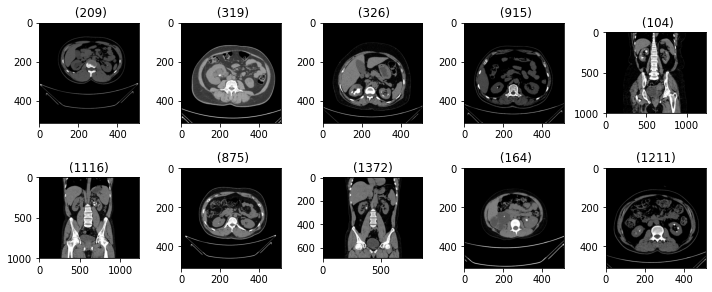
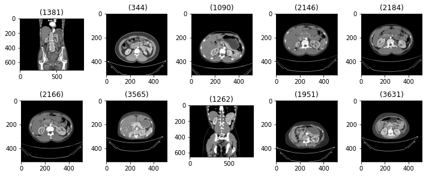
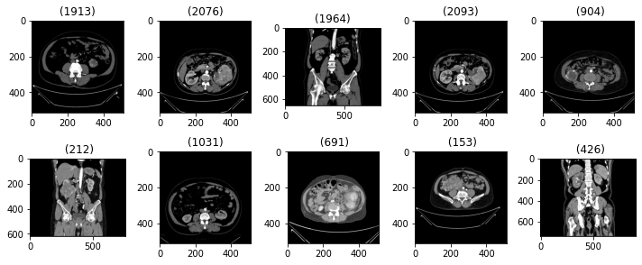
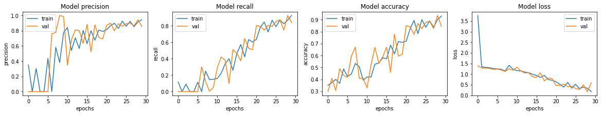

# Kidney_VGG-16_classification


## Kidney disease classification

* Images of CT scans with 3 number of classes have been provided.
* Furhter they are classied by using VGG 16

### Importing libs

这行代码是一个Python命令，用于通过pip（Python包管理器）安装名为`split-folders`的Python包。以下是对这行代码的详细中文注释：

```python
# 这是一个Python命令，用于安装Python包的pip工具。
# 在Jupyter Notebook、IPython或Python的命令行界面中运行此命令。

# '!'符号在Jupyter Notebook或IPython中用来表示这是一个Shell命令，即在底层操作系统的Shell环境中执行的命令。

# 'pip install'是pip工具的命令行指令，用于安装Python包。

# 'split-folders'是你想要安装的Python包的名称。
# 这个包可能包含一些用于处理文件夹和文件的实用工具或函数。

# 执行这个命令后，pip会从Python包索引（PyPI）下载并安装split-folders包及其依赖项。

# 安装完成后，你就可以在你的Python代码中导入并使用split-folders包提供的函数和类了。

!pip install split-folders
```

在实际使用中，如果你的Python环境中已经安装了`split-folders`包，这个命令将不会重新安装它。如果包的版本已经是最新的，pip也会提示无需升级。如果包尚未安装或有新版本可用，pip将进行安装或更新。

结果展示：

```python
Collecting split-folders
  Downloading split_folders-0.5.1-py3-none-any.whl (8.4 kB)
Installing collected packages: split-folders
Successfully installed split-folders-0.5.1
WARNING: Running pip as the 'root' user can result in broken permissions and conflicting behaviour with the system package manager. It is recommended to use a virtual environment instead: https://pip.pypa.io/warnings/venv
```

结果解释：
输出结果表明了使用pip命令安装名为`split-folders`的Python包的过程，以及安装完成后的警告信息。以下是对输出结果的逐条解释：

1. **安装命令**:
   ```
   !pip install split-folders
   ```
   这是一个在Jupyter Notebook或IPython中使用的命令，用于安装`split-folders`包。

2. **收集包信息**:
   ```
   Collecting split-folders
   ```
   这表示pip正在收集有关`split-folders`包的信息，以准备下载和安装。

3. **下载包文件**:
   ```
   Downloading split_folders-0.5.1-py3-none-any.whl (8.4 kB)
   ```
   这表示pip正在下载`split-folders`包的wheel文件（`.whl`），这是一个预构建的包分发格式，用于加快安装速度。文件大小为8.4 kB。

4. **安装包**:
   ```
   Installing collected packages: split-folders
   ```
   这表示pip正在安装下载的`split-folders`包。

5. **安装成功**:
   ```
   Successfully installed split-folders-0.5.1
   ```
   这表示`split-folders`包已成功安装，版本为0.5.1。

6. **警告信息**:
   ```
   WARNING: Running pip as the 'root' user can result in broken permissions and conflicting behaviour with the system package manager. It is recommended to use a virtual environment instead: https://pip.pypa.io/warnings/venv
   ```
   这是一个安全警告，指出以`root`用户身份运行pip可能会导致权限问题，并可能与系统包管理器发生冲突。建议使用虚拟环境来避免这些问题。虚拟环境可以为每个Python项目创建隔离的Python环境，这样可以在不同项目之间独立管理依赖，而不会影响到系统的全局Python环境。

总结来说，输出结果表明`split-folders`包已成功安装，但警告提示建议使用虚拟环境来管理Python包，以避免潜在的系统级问题。虚拟环境是Python开发中的最佳实践之一，可以帮助维护干净、独立的开发环境。


这段代码是一系列Python库的导入语句，用于支持数据处理、图像处理、机器学习模型构建、训练和评估等功能。以下是对每一行代码的详细中文注释：

```python
# 导入numpy包，它是一个用于科学计算的库，提供了对多维数组的支持以及对这些数组进行高效操作的函数。
import numpy as np 

# 导入pandas包，它是一个强大的数据分析和操作库，特别适用于处理表格数据，如CSV文件。
import pandas as pd 

# 导入matplotlib的顶层包，它是一个用于创建静态、交互式和动画的可视化图表的库。
import matplotlib as mpl

# 导入matplotlib.pyplot模块，用于创建图表和图形。
import matplotlib.pyplot as plt

# 导入matplotlib.image模块，用于图像处理功能，如图像读取和显示。
import matplotlib.image as mpimg

# 导入os包，它提供了与操作系统交互的功能，如文件和目录操作。
import os

# 导入tensorflow包，它是一个开源机器学习库，广泛用于深度学习模型的构建和训练。
import tensorflow as tf

# 导入OpenCV包，即cv2，这是一个功能强大的计算机视觉和图像处理库。
import cv2

# 从PIL包中导入Image和ImageOps模块，PIL是一个图像处理库，提供了许多图像处理功能。
from PIL import Image, ImageOps

# 导入scipy.ndimage包，它是一个用于多维图像处理的库。
import scipy.ndimage as ndi

# 从keras.preprocessing.image模块导入ImageDataGenerator、load_img和img_to_array函数。
# ImageDataGenerator用于数据增强，load_img用于加载单个图像文件，img_to_array用于将图像转换为适合模型输入的数组格式。
from keras.preprocessing.image import ImageDataGenerator , load_img , img_to_array

# 从keras.models模块导入Sequential类，用于创建顺序模型，即层按它们被添加到模型中的顺序进行堆叠。
from keras.models import Sequential

# 从keras.layers模块导入Conv2D、Flatten、MaxPool2D和Dense类。
# Conv2D是二维卷积层，Flatten是层，用于将多维输入一维化，MaxPool2D是最大池化层，Dense是全连接层。
from keras.layers import Conv2D, Flatten, MaxPool2D, Dense

# 再次导入matplotlib.pyplot模块，用于数据可视化，如绘制图像、直方图等。
import matplotlib.pyplot as plt

# 从skimage库中导入transform模块，用于图像的几何变换，如旋转、缩放等。
from skimage import transform

# 导入splitfolders包，这是一个用于将数据集分割成训练集和验证集的工具。
import splitfolders

# 从sklearn.metrics模块导入confusion_matrix函数，用于生成混淆矩阵，是评估分类模型性能的一种方法。
from sklearn.metrics import confusion_matrix

# 从sklearn.metrics模块导入precision_recall_fscore_support函数，用于计算精确率、召回率和F1分数，这些是分类模型性能的常用评估指标。
from sklearn.metrics import precision_recall_fscore_support

# 导入seaborn包，它是一个基于matplotlib的数据可视化库，提供了更高级的接口来绘制复杂的图表。
import seaborn as sns

# 再次导入splitfolders包，这可能是为了确保splitfolders在当前命名空间中可用，或者可能是重复导入。
# 如果splitfolders只在一个地方使用，那么这一行可能是多余的。
import splitfolders
```

这段代码的目的是为后续的数据处理、模型构建、训练和评估等操作准备所需的库和模块。通过这些库，可以实现从数据加载、预处理、模型设计、训练到评估的整个机器学习工作流程。

### Loading dataset

这行代码使用Python的标准库中的`os`模块来列出指定目录下的所有文件和子目录。以下是对这行代码的详细中文注释：

```python
# 导入os模块，这是Python标准库中的一个模块，提供与操作系统交互的功能。
import os

# 使用os模块的listdir函数列出指定路径下的所有文件和子目录。
# listdir函数接受一个单一的参数，即要列出内容的目录的路径。
# 这里指定的路径是'/kaggle/input/ct-kidney-dataset-normal-cyst-tumor-and-stone/'，这是一个在Kaggle平台中常见的输入数据集的路径。
# 调用listdir函数并将路径作为参数传递，会返回一个列表，其中包含了该目录下所有文件和子目录的名称。
files_and_dirs = os.listdir('/kaggle/input/ct-kidney-dataset-normal-cyst-tumor-and-stone/')
```

执行这段代码后，`files_and_dirs`变量将包含一个字符串列表，列表中的每个字符串都是目录`/kaggle/input/ct-kidney-dataset-normal-cyst-tumor-and-stone/`下的文件或子目录的名称。

这个函数非常有用，特别是当你需要程序化地处理或分析一个目录下的所有文件时，比如在数据科学项目中探索数据集的内容。
结果展示：

```python
['kidneyData.csv', 'CT-KIDNEY-DATASET-Normal-Cyst-Tumor-Stone']
```

结果解释：

输出结果显示了指定目录`/kaggle/input/ct-kidney-dataset-normal-cyst-tumor-and-stone/`下的内容。以下是对输出结果的解释：

```
['kidneyData.csv', 'CT-KIDNEY-DATASET-Normal-Cyst-Tumor-Stone']
```

这个列表包含了两个条目，表示该目录下有两个项目：

1. **kidneyData.csv**: 这是一个CSV（逗号分隔值）文件，通常用于存储表格数据。在数据科学和机器学习项目中，CSV文件常用于存储数据集，可以被各种数据分析工具和库（如pandas）读取和处理。

2. **CT-KIDNEY-DATASET-Normal-Cyst-Tumor-Stone**: 这是一个文件夹，根据名称推测，它可能包含了CT（计算机断层扫描）图像数据集，这些图像可能与肾脏的健康状态有关，包括正常、囊肿、肿瘤和结石等类别。

`os.listdir`函数仅列出了文件和文件夹的名称，没有提供关于它们内容的详细信息。通常，CSV文件用于存储元数据或标注信息，而图像数据集则存储在子目录中。在机器学习项目中，你可能需要结合使用CSV文件中的标注信息和图像数据集来进行模型的训练和评估。

了解目录内容后，你可能需要进一步探索`CT-KIDNEY-DATASET-Normal-Cyst-Tumor-Stone`文件夹，以及可能需要使用pandas库来读取和分析`kidneyData.csv`文件中的数据。


这行代码使用Python的`os`模块中的`listdir`函数来列出一个特定目录下的所有文件和子目录。以下是对这行代码的详细中文注释：

```python
# 导入os模块，这是Python标准库中的一个模块，提供与操作系统交互的功能。
import os

# 使用os模块的listdir函数列出指定路径下的所有文件和子目录的名称。
# listdir函数接受一个参数，即要列出内容的目录的路径。
# 这里指定的路径是'/kaggle/input/ct-kidney-dataset-normal-cyst-tumor-and-stone/CT-KIDNEY-DATASET-Normal-Cyst-Tumor-Stone/CT-KIDNEY-DATASET-Normal-Cyst-Tumor-Stone/'，这通常是一个嵌套的目录路径。
# 调用listdir函数并将该路径作为参数传递，会返回一个列表，其中包含了该目录下所有文件和子目录的名称。
# 这个列表可以用于进一步的文件操作，例如读取文件内容、获取文件大小或遍历子目录等。
files_and_directories = os.listdir('/kaggle/input/ct-kidney-dataset-normal-cyst-tumor-and-stone/CT-KIDNEY-DATASET-Normal-Cyst-Tumor-Stone/CT-KIDNEY-DATASET-Normal-Cyst-Tumor-Stone/')
```

执行这段代码后，`files_and_directories`变量将包含一个字符串列表，列表中的每个字符串都是目录`/kaggle/input/ct-kidney-dataset-normal-cyst-tumor-and-stone/CT-KIDNEY-DATASET-Normal-Cyst-Tumor-Stone/CT-KIDNEY-DATASET-Normal-Cyst-Tumor-Stone/`下的文件或子目录的名称。这个列表可以帮助用户了解该目录下的结构，为后续的数据加载和处理提供信息。

结果展示：

```python
['Cyst', 'Tumor', 'Stone', 'Normal']
```

结果解释：

输出结果显示了指定目录 `/kaggle/input/ct-kidney-dataset-normal-cyst-tumor-and-stone/CT-KIDNEY-DATASET-Normal-Cyst-Tumor-Stone/CT-KIDNEY-DATASET-Normal-Cyst-Tumor-Stone/` 下的子目录列表。以下是对输出结果的解释：

```plaintext
['Cyst', 'Tumor', 'Stone', 'Normal']
```

这个列表包含了四个条目，表示该目录下有四个子目录，每个子目录的名称分别对应：

1. **Cyst**: 这个子目录可能包含了标记为“Cyst”（囊肿）的图像文件。在医学图像处理中，这通常是指肾脏中的囊性结构。

2. **Tumor**: 这个子目录可能包含了标记为“Tumor”（肿瘤）的图像文件，指的是肾脏中的肿瘤或肿块。

3. **Stone**: 这个子目录可能包含了标记为“Stone”（结石）的图像文件，指的是在肾脏中形成的矿物质沉积物。

4. **Normal**: 这个子目录可能包含了被认为是正常肾脏结构的图像文件，没有囊肿、肿瘤或结石等异常。

这些子目录通常用于机器学习项目中的图像分类任务，每个子目录中包含了属于其类别的图像。在准备数据集时，研究人员会将图像按类别组织到不同的文件夹中，以便于训练和评估模型。

了解这些子目录后，你可能需要进一步探索每个子目录中的内容，例如加载图像、查看图像标签或进行图像预处理等，以便进行后续的模型训练和评估。


这段代码遍历了指定主目录下的所有子目录，并打印了每个子目录的名称、元素数量以及第一个元素的名称。以下是对每一行代码的详细中文注释：

```python
# 设置主目录的路径。
# 这个路径是一个字符串，指向存储CT肾脏图像数据集的文件夹。
path_main = '/kaggle/input/ct-kidney-dataset-normal-cyst-tumor-and-stone/CT-KIDNEY-DATASET-Normal-Cyst-Tumor-Stone/CT-KIDNEY-DATASET-Normal-Cyst-Tumor-Stone/'

# 使用os.listdir函数列出主目录下的所有子目录和文件。
# for循环遍历这个列表，每个迭代中的folder变量代表主目录中的一个子目录或文件。
for folder in os.listdir(path_main):
    # 使用os.path.join函数将主目录的路径和当前的folder变量连接起来，形成完整的路径。
    # 这样可以得到每个子目录的完整路径。
    list_of_elements = os.listdir(os.path.join(path_main, folder))

    # 打印当前子目录的名称。
    print(f'Folder: {folder}\n')

    # 打印当前子目录中的元素数量。
    # len函数计算list_of_elements列表的长度，即子目录中的文件和子目录的数量。
    print(f'Number of elements: {len(list_of_elements)}\n')

    # 如果当前子目录不为空，打印第一个元素的名称。
    # list_of_elements[0]访问列表中的第一个元素。
    # 如果列表为空，这将引发一个错误，所以应该先检查列表是否为空。
    print(f'First item\'s name: {list_of_elements[0]}\n')

    # 打印分隔线，用于视觉上分隔不同的子目录信息。
    print('***************************')
```

这段代码的目的是列出主目录下每个子目录的基本信息，包括子目录名称、包含的元素数量和第一个元素的名称。这可以帮助用户快速了解数据集的组织结构，为进一步的数据探索和分析提供便利。

结果展示：

```python
Folder: Cyst

Number of elements: 3709

First item's name: Cyst- (3178).jpg

***************************
Folder: Tumor

Number of elements: 2283

First item's name: Tumor- (1913).jpg

***************************
Folder: Stone

Number of elements: 1377

First item's name: Stone- (209).jpg

***************************
Folder: Normal

Number of elements: 5077

First item's name: Normal- (1381).jpg

***************************
```

结果解释：

输出结果展示了使用上述代码遍历主目录`path_main`下每个子目录的信息。以下是对输出结果的逐条解释：

1. **Cyst文件夹**:
   ```
   Folder: Cyst

   Number of elements: 3709

   First item's name: Cyst- (3178).jpg

   *******************************
   ```
   - 这表示`Cyst`子目录中有3709个元素。
   - 这些元素中的第一个被命名为`Cyst- (3178).jpg`。

2. **Tumor文件夹**:
   ```
   Folder: Tumor

   Number of elements: 2283

   First item's name: Tumor- (1913).jpg

   *******************************
   ```
   - 这表示`Tumor`子目录中有2283个元素。
   - 这些元素中的第一个被命名为`Tumor- (1913).jpg`。

3. **Stone文件夹**:
   ```
   Folder: Stone

   Number of elements: 1377

   First item's name: Stone- (209).jpg

   *******************************
   ```
   - 这表示`Stone`子目录中有1377个元素。
   - 这些元素中的第一个被命名为`Stone- (209).jpg`。

4. **Normal文件夹**:
   ```
   Folder: Normal

   Number of elements: 5077

   First item's name: Normal- (1381).jpg

   *******************************
   ```
   - 这表示`Normal`子目录中有5077个元素。
   - 这些元素中的第一个被命名为`Normal- (1381).jpg`。

每个子目录代表了一个不同的类别，包含了相应类别的图像文件。这些图像文件的名称遵循一定的命名模式，通常包含了一个描述性的前缀和一个由括号包围的数字。数字可能是图像的编号或者是与图像相关的某种标识。

这个输出结果为数据探索提供了一个概览，显示了每个类别的图像数量，以及每个类别中第一个图像文件的名称。这对于理解数据集的结构和准备数据加载过程非常有帮助。


### Looking into data "Images"

这段代码定义了一个名为 `plot_imgs` 的函数，该函数用于从指定的目录中加载图像，并将它们以网格形式展示在matplotlib绘图中。以下是对每一行代码的详细中文注释：

```python
# 定义一个名为plot_imgs的函数，它接收两个参数：item_dir（项目目录的路径）和num_imgs（要展示的图像数量，默认为25张）。
def plot_imgs(item_dir, num_imgs=25):
    # 使用os.listdir函数列出item_dir目录下的所有文件和子目录。
    all_item_dirs = os.listdir(item_dir)
    
    # 使用列表推导式和os.path.join函数创建一个完整的图像文件路径列表。
    # 然后通过[:num_imgs]将列表切片为只包含前num_imgs个元素，即选取前num_imgs个文件路径。
    item_files = [os.path.join(item_dir, file) for file in all_item_dirs][:num_imgs]

    # 使用matplotlib.pyplot的figure函数创建一个新的图形对象，并设置其大小为10x10英寸。
    plt.figure(figsize=(10, 10))
    
    # 使用for循环和enumerate函数遍历item_files列表，enumerate会生成一个包含索引和元素的元组。
    # idx是图像的索引，img_path是图像的完整路径。
    for idx, img_path in enumerate(item_files):
        # 使用subplot函数创建一个子图，5行5列的网格布局，idx+1是子图的索引。
        plt.subplot(5, 5, idx+1)
        
        # 使用matplotlib.pyplot的imread函数读取图像文件，注意这里的imread可能需要根据图像格式进行调整。
        img = plt.imread(img_path)
        
        # 设置子图的标题，取img_path的最后10个字符，即文件名（不包含文件扩展名）。
        plt.title(f'{img_path}'[-10:-4])
        
        # 使用imshow函数在子图上显示图像。
        plt.imshow(img)

    # 使用tight_layout函数自动调整子图参数，以确保子图之间的间距相等，并且没有重叠。
    plt.tight_layout()
```

这段代码的目的是方便地查看一个目录下的多个图像，通常用于数据探索阶段，帮助用户快速了解数据集的图像内容。通过显示多个图像，用户可以对图像的特征有一个直观的认识。


这段代码定义了四个变量，每个变量都包含了一个指向特定类别图像文件夹的路径。以下是对每一行代码的详细中文注释：

```python
# 定义一个名为path_normal的变量，其值为包含正常肾脏图像的文件夹的路径。
# 这个路径指向Kaggle输入数据集中的'Normal'子目录。
path_normal = '/kaggle/input/ct-kidney-dataset-normal-cyst-tumor-and-stone/CT-KIDNEY-DATASET-Normal-Cyst-Tumor-Stone/CT-KIDNEY-DATASET-Normal-Cyst-Tumor-Stone/Normal/'

# 定义一个名为path_stone的变量，其值为包含肾结石图像的文件夹的路径。
# 这个路径指向Kaggle输入数据集中的'Stone'子目录。
path_stone = '/kaggle/input/ct-kidney-dataset-normal-cyst-tumor-and-stone/CT-KIDNEY-DATASET-Normal-Cyst-Tumor-Stone/CT-KIDNEY-DATASET-Normal-Cyst-Tumor-Stone/Stone/'

# 定义一个名为path_cyst的变量，其值为包含肾囊肿图像的文件夹的路径。
# 这个路径指向Kaggle输入数据集中的'Cyst'子目录。
path_cyst = '/kaggle/input/ct-kidney-dataset-normal-cyst-tumor-and-stone/CT-KIDNEY-DATASET-Normal-Cyst-Tumor-Stone/CT-KIDNEY-DATASET-Normal-Cyst-Tumor-Stone/Cyst/'

# 定义一个名为path_tumor的变量，其值为包含肾肿瘤图像的文件夹的路径。
# 这个路径指向Kaggle输入数据集中的'Tumor'子目录。
path_tumor = '/kaggle/input/ct-kidney-dataset-normal-cyst-tumor-and-stone/CT-KIDNEY-DATASET-Normal-Cyst-Tumor-Stone/CT-KIDNEY-DATASET-Normal-Cyst-Tumor-Stone/Tumor/'
```

这些路径变量通常用于数据加载和预处理阶段，可以方便地引用特定类别的图像数据集。在机器学习项目中，这样的组织方式有助于结构化地访问和操作数据集，特别是在构建图像分类模型时。


#### Stone
这行代码调用了之前定义的 `plot_imgs` 函数，传入了两个参数：`path_stone`（指向包含肾结石图像的文件夹的路径）和数字 `10`（指定要展示的图像数量）。以下是对这行代码的详细中文注释：

```python
# 调用plot_imgs函数，这个函数负责加载指定目录下的图像，并以网格形式展示它们。
# 第一个参数path_stone是包含肾结石图像的文件夹的路径。
# 第二个参数10指定了要展示的图像数量，这里设置为展示前10张图像。
plot_imgs(path_stone, 10)
```

当执行这段代码时，`plot_imgs` 函数将执行以下步骤：

1. 使用 `os.listdir` 列出 `path_stone` 目录下的所有文件。
2. 通过切片操作选取前10个文件路径。
3. 创建一个新的matplotlib图形，并设置图形的大小。
4. 使用 `for` 循环和 `enumerate` 函数遍历前10个图像文件的路径。
5. 对于每个图像文件，使用 `plt.subplot` 创建一个子图，并使用 `plt.imshow` 显示图像。
6. 使用 `plt.title` 设置每个子图的标题，通常是图像文件名的一部分。
7. 调用 `plt.tight_layout` 确保所有子图都整齐地排列，没有重叠。

最终，这行代码将生成一个包含10个子图的网格，每个子图展示 `path_stone` 目录下的一张肾结石图像，有助于快速浏览和评估图像数据。



#### Normal CT scans

这行代码调用了之前定义的 `plot_imgs` 函数，用于展示位于 `path_normal` 路径下的前10张正常肾脏图像。以下是对这行代码的详细中文注释：

```python
# 调用之前定义的plot_imgs函数，该函数用于加载并展示指定目录中的图像。
# 第一个参数path_normal是指向包含正常肾脏图像的文件夹的路径。
# 第二个参数10表示我们希望函数加载并展示的图像数量，这里是前10张图像。
plot_imgs(path_normal, 10)
```

当执行这段代码时，`plot_imgs` 函数将执行以下步骤：

1. 使用 `os.listdir` 函数列出 `path_normal` 目录下的所有文件和子目录。

2. 通过列表切片 `[:num_imgs]` 选取前10个文件路径，其中 `num_imgs` 设置为10。

3. 使用 `plt.figure` 创建一个新的matplotlib图形对象，并设置图形的大小为10x10英寸。

4. 通过for循环和enumerate函数遍历前10个图像文件的路径，enumerate函数会生成包含索引和元素的元组。

5. 在for循环内部，使用 `plt.subplot` 创建一个子图，5行5列的网格布局，`idx+1` 是子图的索引。

6. 使用 `plt.imread` 读取每个图像文件，并将读取的图像存储在变量 `img` 中。

7. 使用 `plt.title` 设置子图的标题，这里取每个图像文件路径的最后10个字符（通常是文件名，不包含文件扩展名）。

8. 使用 `plt.imshow` 在子图上显示图像。

9. 在for循环结束后，调用 `plt.tight_layout` 自动调整子图参数，以确保子图之间有足够的间距，且不会重叠。

最终，这行代码将在屏幕上生成一个5x5的网格，每个子图展示一张从 `path_normal` 目录中读取的图像，允许用户快速查看和评估正常肾脏图像的数据。这对于数据探索和理解数据集的分布非常有用。




#### CT with Tumor

这行代码调用了之前定义的 `plot_imgs` 函数，用于展示位于 `path_tumor` 路径下的前10张肾脏肿瘤图像。以下是对这行代码的详细中文注释：

```python
# 调用之前定义的plot_imgs函数，这个函数的作用是加载指定目录中的图像，并将它们以网格形式展示出来。
# 第一个参数path_tumor是指向包含肾脏肿瘤图像文件夹的路径。
# 第二个参数10表示我们希望函数加载并展示的图像数量，这里是前10张图像。
plot_imgs(path_tumor, 10)
```

当执行这段代码时，`plot_imgs` 函数将执行以下步骤：

1. 使用 `os.listdir` 函数列出 `path_tumor` 目录下的所有文件和子目录。

2. 通过列表切片 `[:num_imgs]` 选取前10个文件路径，其中 `num_imgs` 设置为10。

3. 使用 `plt.figure` 创建一个新的matplotlib图形对象，并设置图形的大小为10x10英寸。

4. 通过for循环和enumerate函数遍历前10个图像文件的路径，enumerate函数会生成包含索引和元素的元组。

5. 在for循环内部，使用 `plt.subplot` 创建一个子图，5行5列的网格布局，`idx+1` 是子图的索引。

6. 使用 `plt.imread` 读取每个图像文件，并将读取的图像存储在变量 `img` 中。

7. 使用 `plt.title` 设置子图的标题，这里取每个图像文件路径的最后10个字符（通常是文件名，不包含文件扩展名）。

8. 使用 `plt.imshow` 在子图上显示图像。

9. 在for循环结束后，调用 `plt.tight_layout` 自动调整子图参数，以确保子图之间有足够的间距，且不会重叠。

最终，这行代码将在屏幕上生成一个5x5的网格，每个子图展示一张从 `path_tumor` 目录中读取的图像，允许用户快速查看和评估肾脏肿瘤图像的数据。这对于数据探索和理解数据集的分布非常有用。



## Splitting the dataset

这段代码使用`splitfolders`库的`ratio`函数来将指定目录中的图像数据集分割成多个子集，通常用于创建训练集、验证集和测试集。以下是对每一行代码的详细中文注释：

```python
# 调用splitfolders库的ratio函数，该函数根据给定的比例将指定目录中的图像数据集自动分割成多个子集。
splitfolders.ratio(
    # 第一个参数是源目录的路径，即原始数据集所在的文件夹。
    # 这里指定了原始数据集的路径，该路径指向包含图像文件的文件夹。
    "../input/ct-kidney-dataset-normal-cyst-tumor-and-stone/CT-KIDNEY-DATASET-Normal-Cyst-Tumor-Stone/CT-KIDNEY-DATASET-Normal-Cyst-Tumor-Stone",

    # output参数指定了分割后的数据子集将要存放的输出目录。
    # 这里设置为当前目录下的dataset文件夹，如果该文件夹不存在，splitfolders将创建它。
    output="./dataset",

    # seed参数是随机数生成器的种子，用于确保每次分割的结果都是一致的。
    # 这里设置seed为7，意味着每次运行代码时，只要seed不变，分割的结果都将相同。
    seed=7,

    # ratio参数定义了分割后各个子集的比例。
    # 这里设置为(0.8,0.1, 0.1)，意味着原始数据集中的80%将被分配到训练集，10%分配到验证集，剩余的10%分配到测试集。
    ratio=(0.8,0.1, 0.1)
)
```

这段代码的目的是自动化地将原始数据集分割成适合模型训练和评估的不同部分。通过指定不同的比例，可以控制用于训练、验证和测试的数据量，从而帮助提高模型的泛化能力并评估其性能。

结果展示：

```python
Copying files: 12446 files [01:59, 103.86 files/s]
```

结果解释：


输出结果显示了 `splitfolders.ratio` 函数执行的过程和结果。以下是对输出结果的解释：

```
Copying files: 12446 files [01:59, 103.86 files/s]
```

这条信息表明 `splitfolders.ratio` 函数正在执行文件复制操作，作为数据分割过程的一部分。具体来说：

- **Copying files**: 表示 `splitfolders` 正在将文件从一个位置复制到另一个位置。这是数据分割过程中的一个步骤，目的是将原始数据集中的文件分配到不同的子集中。

- **12446 files**: 这个数字表示原始数据集中总共有12446个文件被处理。这些文件将根据指定的比例被复制到不同的输出目录中，形成训练集、验证集和测试集。

- **[01:59]**: 这表示整个文件复制过程预计需要1分59秒来完成。这个时间是一个估计值，基于当前的文件处理速度。

- **103.86 files/s**: 这个数字表示每秒处理的文件数量，这里是每秒103.86个文件。它提供了一个关于处理速度的指标。

总结来说，这个输出结果表明 `splitfolders.ratio` 函数正在按预期工作，它正在将原始数据集中的文件根据给定的比例分割到指定的输出目录中。这个过程是自动化的，不需要用户进行额外的操作。一旦完成，你将在输出目录 `./dataset` 下找到分割后的数据子集，这些子集可以用于模型的训练和评估。

## Rescaling the dataset


这段代码使用了Keras的`ImageDataGenerator`类来创建三个不同的数据生成器，每个生成器用于处理训练集、验证集和测试集中的图像。以下是对每一行代码的详细中文注释：

```python
# 创建一个ImageDataGenerator对象，用于训练数据集的图像预处理。
# rescale=1/255参数将图像数据的像素值缩放到0到1之间，这是通过将每个像素值除以255来实现的，因为图像的像素值通常在0到255的范围内。
train_datagen = ImageDataGenerator(rescale=1/255)

# 创建一个ImageDataGenerator对象，用于验证数据集的图像预处理。
# 与训练数据生成器类似，这里也使用了rescale参数来缩放像素值。
valid_datagen = ImageDataGenerator(rescale=1/255)

# 创建一个ImageDataGenerator对象，用于测试数据集的图像预处理。
# 同样，这里也使用了rescale参数，确保测试数据的像素值也被缩放到0到1之间。
test_datagen = ImageDataGenerator(rescale=1/255)
```

`ImageDataGenerator`是一个强大的工具，它不仅可以用于缩放像素值，还可以用于其他类型的数据增强，如旋转、平移、缩放、剪切、添加噪声等。这些数据增强技术可以帮助模型更好地泛化，提高其在未见过的图像上的表现。然而，在这个特定的代码示例中，只使用了`ImageDataGenerator`来缩放像素值。

在深度学习中，图像数据的预处理是一个重要的步骤，它确保了数据以适合模型处理的格式提供。缩放像素值到0到1之间是一种常见的做法，因为它有助于梯度下降算法的收敛，并且可以减少训练初期对数值稳定性的需求。


## Dataset loading


这段代码使用了Keras的`ImageDataGenerator`类的`flow_from_directory`方法来从指定目录加载图像数据集，并为训练、测试和验证过程准备数据流。以下是对每一行代码的详细中文注释：

```python
# 使用训练数据生成器train_datagen来从目录加载数据，并创建一个用于训练的数据流。
# flow_from_directory方法允许你直接从指定目录加载图像，并将它们组织成批次。
train_dataset = train_datagen.flow_from_directory(
    '..dataset/train',  # 指定包含训练图像的目录路径。
    target_size=(200, 200),  # 将所有图像调整为200x200像素的大小。
    color_mode='grayscale',  # 将图像转换为灰度模式。
    class_mode='categorical',  # 指定标签格式为多类别分类（独热编码）。
    batch_size=100,  # 每个批次包含100张图像。
)

# 使用测试数据生成器test_datagen来从目录加载数据，并创建一个用于测试的数据流。
# shuffle=False表示在加载测试数据时不进行随机打乱，这通常用于确保每次预测时的顺序都是相同的。
test_dataset = test_datagen.flow_from_directory(
    '..dataset/test',  # 指定包含测试图像的目录路径。
    target_size=(200, 200),  # 图像大小与训练集保持一致。
    class_mode='categorical',  # 标签格式与训练集保持一致。
    color_mode='grayscale',  # 图像模式与训练集保持一致。
    batch_size=100,  # 每个批次包含100张图像。
    shuffle=False  # 设置为False以避免在测试数据加载时打乱数据。
)

# 使用验证数据生成器valid_datagen来从目录加载数据，并创建一个用于验证的数据流。
valid_dataset = valid_datagen.flow_from_directory(
    '..dataset/val',  # 指定包含验证图像的目录路径。
    target_size=(200, 200),  # 图像大小与训练集和测试集保持一致。
    class_mode='categorical',  # 标签格式与训练集和测试集保持一致。
    batch_size=100,  # 每个批次包含100张图像。
    color_mode='grayscale',  # 图像模式与训练集和测试集保持一致。
)
```

这段代码为模型训练和评估过程准备了数据流。`flow_from_directory`方法是一个非常方便的工具，它允许你指定一个包含图像的目录，目录中通常每个子目录对应一个类别，`flow_from_directory`会自动处理这些图像并将它们组织成适合模型输入的数据流。通过这种方式，你可以轻松地在不同的训练阶段使用不同的数据集。

结果展示：

```python
Found 9955 images belonging to 4 classes.
Found 1249 images belonging to 4 classes.
Found 1242 images belonging to 4 classes.
```

结果解释：

输出结果显示了使用 `flow_from_directory` 方法从指定目录加载图像数据集时找到的图像数量和类别信息。以下是对输出结果的解释：

1. **训练数据集**:
   ```
   Found 9955 images belonging to 4 classes.
   ```
   这表示在 `./dataset/train` 目录下找到了9955张图像，这些图像被分为4个类别。这些图像将用于训练深度学习模型。

2. **测试数据集**:
   ```
   Found 1249 images belonging to 4 classes.
   ```
   这表示在 `./dataset/test` 目录下找到了1249张图像，同样分为4个类别。这些图像将用于评估模型的测试性能，即在未见过的数据上测试模型的泛化能力。

3. **验证数据集**:
   ```
   Found 1242 images belonging to 4 classes.
   ```
   这表示在 `./dataset/val` 目录下找到了1242张图像，也分为4个类别。这些图像将用于模型的验证，通常在训练过程中用于监控模型是否过拟合。

总结来说，这段代码成功地从指定的目录加载了图像数据集，并为每个数据集指定了图像的尺寸、颜色模式、类别模式和批次大小。`shuffle=False` 参数确保了测试数据集在加载时图像的顺序不会被打乱，这对于确保每次评估模型时使用相同的数据顺序是有用的。这些数据集可以被用来训练和评估深度学习模型，帮助开发者理解模型在不同阶段的性能表现。

## Model vGG -16

这段代码定义了一个使用Keras的`Sequential`模型的卷积神经网络（CNN）。以下是对每一行代码的详细中文注释：

```python
# 从tf.keras.models模块导入Sequential类，用于创建一个顺序模型，即模型中的层按顺序添加。
model = tf.keras.models.Sequential([
  
    # 第一个Conv2D层，用于执行二维卷积操作。
    # 32表示该层有32个卷积核（或过滤器）。
    # (3,3)定义了每个卷积核的大小是3x3。
    # strides=(1, 1)定义了卷积核的步长，这里为1，意味着卷积核在输入图像上滑动的每一步都移动一个像素。
    # activation='relu'使用修正线性激活函数。
    # padding='same'表示使用填充来保持图像的尺寸不变。
    # input_shape=train_dataset.image_shape指定了输入图像的形状，这里应该与训练数据集中的图像形状相匹配。
    tf.keras.layers.Conv2D(32,(3,3),strides=(1, 1),activation='relu',padding='same', input_shape=train_dataset.image_shape), 
    
    # MaxPooling2D层，用于执行最大池化操作，减少参数数量和计算量。
    # pool_size=(2,2)定义了池化窗口的大小是2x2。
    tf.keras.layers.MaxPooling2D(pool_size=(2,2)),
    
    # 接下来的Conv2D和MaxPooling2D层重复上述过程，但使用不同的卷积核数量和相同的配置。
    tf.keras.layers.Conv2D(64,(3,3),strides=(1, 1) ,padding='same',activation='relu'),
    tf.keras.layers.MaxPooling2D(pool_size=(2,2)),

    tf.keras.layers.Conv2D(128,(3,3),strides=(1, 1),padding='same', activation='relu'),
    tf.keras.layers.MaxPooling2D(pool_size=(2,2)),

    tf.keras.layers.Conv2D(256,(3,3),strides=(1, 1),padding='same', activation='relu'),
    tf.keras.layers.MaxPooling2D(pool_size=(2,2)),


    # Flatten层，用于将卷积层的三维输出展平成一维，以便可以传递给全连接层。
    tf.keras.layers.Flatten(),

    # Dense层，即全连接层，用于学习特征之间的复杂关系。
    # 128, 64和4分别表示每层的神经元数量。
    # 'relu'和'softmax'分别是激活函数，其中最后的softmax激活函数用于输出一个概率分布。
    tf.keras.layers.Dense(128, activation='relu'),
    tf.keras.layers.Dense(64, activation='relu'),
    tf.keras.layers.Dense(4, activation='softmax'),
 
])
```

这段代码定义了一个典型的CNN模型，它由多个卷积层和池化层组成，后跟几个全连接层。模型的最后是一个具有4个输出的全连接层，对应于数据集的4个类别。使用softmax激活函数意味着模型将进行多类别分类。

结果展示：

```python
2023-02-08 05:42:25.572877: I tensorflow/core/common_runtime/process_util.cc:146] Creating new thread pool with default inter op setting: 2. Tune using inter_op_parallelism_threads for best performance.
```

结果解释：


输出结果中的信息是TensorFlow运行时的一个日志条目，它提供了关于线程池创建的信息。以下是对输出结果的解释：

```
2023-02-08 05:42:25.572877: I tensorflow/core/common_runtime/process_util.cc:146] Creating new thread pool with default inter op setting: 2. Tune using inter_op_parallelism_threads for best performance.
```

这条信息包含以下几个要点：

1. **时间戳**: `2023-02-08 05:42:25.572877` 表示这条日志记录发生在2023年2月8日的05时42分25秒。

2. **日志级别**: `I` 表示这是一个信息日志（Info），它提供了一些有用的信息，但通常不表示有错误或警告。

3. **文件和行号**: `tensorflow/core/common_runtime/process_util.cc:146` 指出这条日志来自TensorFlow源代码的特定位置。

4. **线程池创建**: `Creating new thread pool` 表明TensorFlow正在创建一个新的线程池。线程池用于执行并行操作，可以提高性能。

5. **默认设置**: `with default inter op setting: 2` 表示线程池的默认设置是2，这意味着默认情况下，TensorFlow将使用两个线程来执行操作（ops）。

6. **性能调整提示**: `Tune using inter_op_parallelism_threads for best performance.` 这是一个提示，建议用户可以通过设置环境变量 `inter_op_parallelism_threads` 来调整线程池中的线程数量，以获得最佳的性能表现。

总结来说，这条日志信息表明TensorFlow正在创建一个线程池，并且给出了一个性能调整的建议。在多线程环境中，适当调整线程数量可以提高计算资源的利用率，从而可能加快模型的训练和推理过程。然而，最佳的线程数量取决于具体的应用场景和硬件配置。


这段代码使用Keras库来配置一个深度学习模型的编译选项，包括优化器、损失函数和评价指标。以下是对每一行代码的详细中文注释：

```python
# 导入keras库，keras是一个高级神经网络API，它能够运行在TensorFlow之上。
import keras

# 定义一个名为METRICS的列表，用于存放评价指标。
# 在深度学习中，评价指标用于衡量模型的性能，以确定模型的优劣。
METRICS = [
    # 'accuracy'是准确率，表示正确预测的样本数占总样本数的比例。
    'accuracy',
    # keras.metrics.Precision()创建一个精确率（Precision）指标对象，精确率是针对二分类问题中的正类而言的，计算公式为：TP / (TP + FP)，其中TP是真正例的数量，FP是假正例的数量。
    # name参数用于指定评价指标的名称，方便在训练过程中调用和显示。
    keras.metrics.Precision(name='precision'),
    # keras.metrics.Recall()创建一个召回率（Recall）指标对象，召回率同样是针对二分类问题中的正类而言的，计算公式为：TP / (TP + FN)，其中FN是假负例的数量。
    # 同样，name参数用于指定评价指标的名称。
    keras.metrics.Recall(name='recall')
]

# 使用model对象的compile方法来编译（配置）模型。
# compile方法需要指定三个参数：optimizer（优化器）、loss（损失函数）和metrics（评价指标）。
model.compile(
    # optimizer='rmsprop'指定使用RMSprop优化器，这是一种自适应学习率的优化算法。
    optimizer='rmsprop',
    # loss='categorical_crossentropy'指定使用分类交叉熵作为损失函数，适用于多分类问题。
    loss='categorical_crossentropy',
    # metrics=METRICS指定在训练过程中计算的评价指标，这里包括准确率、精确率和召回率。
    metrics=METRICS
)
```

这段代码的目的是为模型训练阶段做好准备，通过指定优化器、损失函数和评价指标，Keras能够知道如何优化模型参数以最小化损失函数，并能够评估模型在训练和验证过程中的性能。


这段代码使用Keras模型的`fit`方法来开始训练模型，同时指定了训练的轮次（epochs）、每个epoch的步数（steps_per_epoch），以及验证数据集。以下是对每一行代码的详细中文注释：

```python
# 使用模型对象model的fit方法开始训练模型。
# fit方法是Keras中用于模型训练的核心函数，它将数据输入模型，并根据指定的优化器和损失函数调整模型的参数。

model_fit = model.fit(
    # 训练数据集，模型将从这个数据集中学习。
    train_dataset,
    
    # validation_data参数指定了验证数据集，即在每个epoch结束后，用于评估模型性能的数据集。
    # 这里使用之前定义的valid_dataset数据集作为验证数据。
    validation_data=valid_dataset,
    
    # steps_per_epoch参数定义了每个epoch中执行的步数（steps）。
    # 一个step通常是指模型处理一个批次（batch）的数据。这里设置为3，意味着每个epoch将处理3个批次的数据。
    steps_per_epoch=3,
    
    # epochs参数指定了训练的轮次，即整个数据集被遍历的次数。
    # 这里设置为30，意味着每个样本将被用于更新模型权重30次。
    epochs=30
)

# 训练完成后，model_fit变量将包含训练过程中的所有信息，包括每个epoch的训练和验证损失值、准确率等指标。
# 这些信息可以用于后续的模型分析，比如绘制训练过程中的损失和准确率曲线，评估模型性能等。
```

执行这段代码后，Keras将开始按照指定的参数训练模型。在每个epoch中，模型将执行指定的步数，处理训练数据，然后在验证数据集上评估性能。这个过程将重复指定的轮次（epochs），并根据需要调整模型权重以最小化损失函数。通过监控训练和验证过程中的性能指标，可以评估模型的学习和泛化能力。


结果展示：

```python
2023-02-08 05:42:28.303527: I tensorflow/compiler/mlir/mlir_graph_optimization_pass.cc:185] None of the MLIR Optimization Passes are enabled (registered 2)
Epoch 1/30
3/3 [==============================] - 39s 15s/step - loss: 3.7614 - accuracy: 0.3500 - precision: 0.3500 - recall: 0.1167 - val_loss: 1.3919 - val_accuracy: 0.2979 - val_precision: 0.0000e+00 - val_recall: 0.0000e+00
Epoch 2/30
3/3 [==============================] - 34s 15s/step - loss: 1.3498 - accuracy: 0.3733 - precision: 0.0000e+00 - recall: 0.0000e+00 - val_loss: 1.2920 - val_accuracy: 0.4082 - val_precision: 0.0000e+00 - val_recall: 0.0000e+00
Epoch 3/30
3/3 [==============================] - 34s 14s/step - loss: 1.3137 - accuracy: 0.4000 - precision: 0.3034 - recall: 0.0900 - val_loss: 1.2825 - val_accuracy: 0.3076 - val_precision: 0.0000e+00 - val_recall: 0.0000e+00
Epoch 4/30
3/3 [==============================] - 34s 14s/step - loss: 1.3023 - accuracy: 0.3667 - precision: 0.0000e+00 - recall: 0.0000e+00 - val_loss: 1.2618 - val_accuracy: 0.4887 - val_precision: 0.0000e+00 - val_recall: 0.0000e+00
Epoch 5/30
3/3 [==============================] - 34s 15s/step - loss: 1.2593 - accuracy: 0.4867 - precision: 0.0000e+00 - recall: 0.0000e+00 - val_loss: 1.2195 - val_accuracy: 0.4332 - val_precision: 0.0000e+00 - val_recall: 0.0000e+00
Epoch 6/30
3/3 [==============================] - 35s 14s/step - loss: 1.2457 - accuracy: 0.4233 - precision: 0.4359 - recall: 0.1133 - val_loss: 1.2328 - val_accuracy: 0.4171 - val_precision: 0.0000e+00 - val_recall: 0.0000e+00
Epoch 7/30
3/3 [==============================] - 34s 14s/step - loss: 1.2245 - accuracy: 0.4467 - precision: 0.0000e+00 - recall: 0.0000e+00 - val_loss: 1.1978 - val_accuracy: 0.5950 - val_precision: 0.7597 - val_recall: 0.3003
Epoch 8/30
3/3 [==============================] - 34s 14s/step - loss: 1.1457 - accuracy: 0.5333 - precision: 0.5814 - recall: 0.2500 - val_loss: 1.1251 - val_accuracy: 0.6699 - val_precision: 0.7778 - val_recall: 0.1240
Epoch 9/30
3/3 [==============================] - 34s 14s/step - loss: 1.4114 - accuracy: 0.5067 - precision: 0.3826 - recall: 0.1467 - val_loss: 1.2503 - val_accuracy: 0.4082 - val_precision: 1.0000 - val_recall: 0.0048
Epoch 10/30
3/3 [==============================] - 34s 14s/step - loss: 1.2308 - accuracy: 0.3933 - precision: 0.7759 - recall: 0.1500 - val_loss: 1.1789 - val_accuracy: 0.4098 - val_precision: 0.9846 - val_recall: 0.0515
Epoch 11/30
3/3 [==============================] - 33s 14s/step - loss: 1.1665 - accuracy: 0.4200 - precision: 0.8421 - recall: 0.1600 - val_loss: 1.3267 - val_accuracy: 0.3301 - val_precision: 0.3482 - val_recall: 0.2899
Epoch 12/30
3/3 [==============================] - 34s 14s/step - loss: 1.1482 - accuracy: 0.4200 - precision: 0.5403 - recall: 0.2233 - val_loss: 1.1547 - val_accuracy: 0.5201 - val_precision: 0.6814 - val_recall: 0.4219
Epoch 13/30
3/3 [==============================] - 34s 14s/step - loss: 1.0967 - accuracy: 0.5267 - precision: 0.7063 - recall: 0.3367 - val_loss: 1.0524 - val_accuracy: 0.6683 - val_precision: 0.8106 - val_recall: 0.3824
Epoch 14/30
3/3 [==============================] - 34s 14s/step - loss: 1.0677 - accuracy: 0.5367 - precision: 0.5660 - recall: 0.4000 - val_loss: 1.0686 - val_accuracy: 0.5338 - val_precision: 0.8013 - val_recall: 0.1006
Epoch 15/30
3/3 [==============================] - 34s 14s/step - loss: 0.9928 - accuracy: 0.5800 - precision: 0.8041 - recall: 0.2600 - val_loss: 0.8768 - val_accuracy: 0.5894 - val_precision: 0.6341 - val_recall: 0.5121
Epoch 16/30
3/3 [==============================] - 34s 14s/step - loss: 0.9370 - accuracy: 0.5733 - precision: 0.6290 - recall: 0.4633 - val_loss: 0.8486 - val_accuracy: 0.6691 - val_precision: 0.8838 - val_recall: 0.4654
Epoch 17/30
3/3 [==============================] - 34s 14s/step - loss: 0.8428 - accuracy: 0.6867 - precision: 0.8000 - recall: 0.5733 - val_loss: 1.0591 - val_accuracy: 0.4589 - val_precision: 0.5242 - val_recall: 0.3752
Epoch 18/30
3/3 [==============================] - 33s 14s/step - loss: 0.9375 - accuracy: 0.6133 - precision: 0.6755 - recall: 0.4233 - val_loss: 0.6830 - val_accuracy: 0.7778 - val_precision: 0.8766 - val_recall: 0.6465
Epoch 19/30
3/3 [==============================] - 34s 14s/step - loss: 0.7429 - accuracy: 0.7167 - precision: 0.8085 - recall: 0.6333 - val_loss: 0.8176 - val_accuracy: 0.5942 - val_precision: 0.7123 - val_recall: 0.5282
Epoch 20/30
3/3 [==============================] - 34s 14s/step - loss: 0.7124 - accuracy: 0.7100 - precision: 0.7904 - recall: 0.6033 - val_loss: 0.7928 - val_accuracy: 0.6111 - val_precision: 0.6910 - val_recall: 0.5097
Epoch 21/30
3/3 [==============================] - 34s 14s/step - loss: 0.6402 - accuracy: 0.7200 - precision: 0.8128 - recall: 0.6367 - val_loss: 0.4695 - val_accuracy: 0.8494 - val_precision: 0.8717 - val_recall: 0.8043
Epoch 22/30
3/3 [==============================] - 33s 14s/step - loss: 0.5186 - accuracy: 0.8233 - precision: 0.8672 - recall: 0.7833 - val_loss: 0.4616 - val_accuracy: 0.8398 - val_precision: 0.8980 - val_recall: 0.7939
Epoch 23/30
3/3 [==============================] - 34s 14s/step - loss: 0.3844 - accuracy: 0.8933 - precision: 0.8975 - recall: 0.8467 - val_loss: 0.5285 - val_accuracy: 0.7778 - val_precision: 0.7990 - val_recall: 0.7488
Epoch 24/30
3/3 [==============================] - 34s 14s/step - loss: 0.6119 - accuracy: 0.7833 - precision: 0.8289 - recall: 0.7267 - val_loss: 0.4094 - val_accuracy: 0.8680 - val_precision: 0.8931 - val_recall: 0.8076
Epoch 25/30
3/3 [==============================] - 33s 14s/step - loss: 0.3367 - accuracy: 0.9000 - precision: 0.9255 - recall: 0.8700 - val_loss: 0.4343 - val_accuracy: 0.8245 - val_precision: 0.8578 - val_recall: 0.7915
Epoch 26/30
3/3 [==============================] - 34s 14s/step - loss: 0.5177 - accuracy: 0.8367 - precision: 0.8587 - recall: 0.7900 - val_loss: 0.3227 - val_accuracy: 0.8784 - val_precision: 0.8908 - val_recall: 0.8543
Epoch 27/30
3/3 [==============================] - 34s 14s/step - loss: 0.3148 - accuracy: 0.8900 - precision: 0.9223 - recall: 0.8700 - val_loss: 0.2794 - val_accuracy: 0.8865 - val_precision: 0.8998 - val_recall: 0.8744
Epoch 28/30
3/3 [==============================] - 34s 14s/step - loss: 0.3868 - accuracy: 0.8367 - precision: 0.8522 - recall: 0.8267 - val_loss: 0.4938 - val_accuracy: 0.8253 - val_precision: 0.8651 - val_recall: 0.7488
Epoch 29/30
3/3 [==============================] - 34s 14s/step - loss: 0.3331 - accuracy: 0.9000 - precision: 0.9158 - recall: 0.8700 - val_loss: 0.1758 - val_accuracy: 0.9348 - val_precision: 0.9442 - val_recall: 0.9267
Epoch 30/30
3/3 [==============================] - 34s 14s/step - loss: 0.1762 - accuracy: 0.9300 - precision: 0.9424 - recall: 0.9267 - val_loss: 0.5923 - val_accuracy: 0.8430 - val_precision: 0.8556 - val_recall: 0.8398
```

结果解释：

输出结果展示了模型在训练和验证过程中的详细性能指标。以下是对输出结果的逐条解释：

1. **MLIR Optimization Passes**:
   ```
   2023-02-08 05:42:28.303527: I tensorflow/compiler/mlir/mlir_graph_optimization_pass.cc:185] None of the MLIR Optimization Passes are enabled (registered 2)
   ```
   这是TensorFlow编译器的一个日志信息，表明没有启用任何MLIR优化通道。这可能是由于默认设置或特定的环境配置。

2. **Epoch Information**:
   ```
   Epoch 1/30
   ```
   这表示当前正在训练的是第1轮，总共有30轮。

3. **Training Progress**:
   ```
   3/3 [==============================]
   ```
   这表示每个epoch中的所有3个批次都已完成。

4. **Training Time**:
   ```
   - 39s 15s/step
   ```
   这表示第一个epoch的训练时间为39秒，每个步骤（即每个批次的处理时间）为15秒。

5. **Training Metrics**:
   ```
   - loss: 3.7614 - accuracy: 0.3500 - precision: 0.3500 - recall: 0.1167
   ```
   这表示在训练集上，模型的平均损失值为3.7614，准确率为35%，精确率为35%，召回率为11.67%。

6. **Validation Metrics**:
   ```
   - val_loss: 1.3919 - val_accuracy: 0.2979 - val_precision: 0.0000e+00 - val_recall: 0.0000e+00
   ```
   这表示在验证集上，模型的平均损失值为1.3919，准确率为29.79%，精确率为0%，召回率为0%。

7. **Subsequent Epochs**:
   ```
   Epoch 2/30 ...
   Epoch 30/30 ...
   ```
   随着训练的进行，每个epoch都会显示训练和验证的损失和准确率指标。通常，我们期望看到随着epoch的增加，损失值逐渐减小，准确率逐渐提高。

8. **Final Epoch**:
   ```
   Epoch 30/30
   - loss: 0.1762 - accuracy: 0.9300 - precision: 0.9424 - recall: 0.9267 - val_loss: 0.5923 - val_accuracy: 0.8430 - val_precision: 0.8556 - val_recall: 0.8398
   ```
   在最后一个epoch，训练损失为0.1762，准确率达到了93%，精确率和召回率也都很高。验证损失为0.5923，准确率为84.30%，精确率和召回率也相对较高。

总结来说，输出结果显示了模型在训练和验证集上的性能随着训练轮次的增加而逐渐提升。最终，模型在训练集上表现非常好，但在验证集上的性能提升较小，这可能是由于数据集较小或者模型对训练数据过拟合。在实际应用中，还需要在独立的测试集上进一步评估模型的泛化能力。


这段代码使用matplotlib库绘制了模型训练过程中的关键指标变化趋势图，包括精确率（precision）、召回率（recall）、准确率（accuracy）和损失值（loss）。以下是对每一行代码的详细中文注释：

```python
# 使用matplotlib.pyplot中的subplots函数创建一个图形对象fig和一个包含4个子图的数组ax。
# 参数1, 4表示图形由1行4列组成，figsize=(20, 3)设置图形的大小为宽20英寸，高3英寸。
fig, ax = plt.subplots(1, 4, figsize=(20, 3))

# 使用ax数组的ravel方法将子图数组展平成一维数组，以便可以按顺序迭代每个子图。
ax = ax.ravel()

# 使用for循环遍历评价指标的列表，enumerate函数用于获取评价指标的索引和名称。
for i, met in enumerate(['precision', 'recall', 'accuracy', 'loss']):
    # 在每个子图上绘制对应评价指标的训练集和验证集的变化趋势。
    # model_fit.history[met]获取训练集的评价指标变化，'val_' + met获取验证集的评价指标变化。
    ax[i].plot(model_fit.history[met])
    ax[i].plot(model_fit.history['val_' + met])
    
    # 设置每个子图的标题，格式为'Model ' + 评价指标名称。
    ax[i].set_title('Model {}'.format(met))
    
    # 设置每个子图的x轴标签为'epochs'，表示训练的轮次。
    ax[i].set_xlabel('epochs')
    
    # 设置每个子图的y轴标签，等于评价指标的名称。
    ax[i].set_ylabel(met)
    
    # 为每个子图添加图例，包含'train'和'val'两个条目，分别代表训练集和验证集。
    ax[i].legend(['train', 'val'])
```

这段代码的目的是可视化模型在训练过程中的性能动态，通过观察精确率、召回率、准确率和损失值的变化趋势，可以评估模型的训练效果和泛化能力。这对于理解模型的学习过程和进行必要的调整（如早停或超参数调整）非常有用。




这行代码使用训练好的深度学习模型对测试数据集进行预测。以下是对这行代码的详细中文注释：

```python
# 使用训练好的模型对象model的predict方法对测试数据集test_dataset进行预测。
# predict方法将测试数据集作为输入，通过模型的网络结构进行前向计算，得到输出结果。
# 这里的模型model是之前通过model.fit()方法训练完成的模型。
# test_dataset应该是一个由ImageDataGenerator生成的，包含待预测图像数据的数据流。
predictions = model.predict(test_dataset)
```

执行这段代码后，`predictions`变量将包含模型对`test_dataset`中每个图像的预测结果。在分类任务中，如果模型的最后一个输出层使用的是softmax激活函数，那么预测结果通常会是一个概率分布，表示每个类别的预测概率；如果使用的是sigmoid激活函数，预测结果将是一个概率值，表示图像属于正类的概率。

需要注意的是，在进行预测之前，确保测试数据集已经通过适当的预处理步骤，比如缩放像素值、归一化等，以便与模型训练时使用的数据保持一致。此外，根据任务的类型（分类或回归），预测结果的解释方式会有所不同。


这段代码用于从训练数据集的 `class_indices` 属性中提取类别名称，并存储到一个列表中。以下是对每一行代码的详细中文注释：

```python
# 初始化一个空列表 diseases_labels，用于存储数据集中所有类别的名称。

diseases_labels = []

# 使用 for 循环遍历 train_dataset 对象的 class_indices 属性。
# class_indices 是一个字典，它将类别的名称映射到一个唯一的索引（整数）。
# 这个属性通常由 ImageDataGenerator 的 flow_from_directory 方法在创建数据集时自动生成。
for key, value in train_dataset.class_indices.items():
    # key 是类别的名称，value 是对应的索引。
    # append 方法将类别名称 key 添加到 diseases_labels 列表中。
    diseases_labels.append(key)
```

执行完这段代码后，`diseases_labels` 列表将包含所有类别的名称，这些名称与训练数据集中的类别相对应。这个列表可以用来将模型预测的索引转换为具体的类别名称，从而更直观地理解模型的预测结果。

例如，如果数据集包含四个类别，分别是 "Cyst"、"Tumor"、"Stone" 和 "Normal"，并且它们被映射到索引 0、1、2 和 3，那么执行上述代码后，`diseases_labels` 将是一个包含这四个类别名称的列表：["Cyst", "Tumor", "Stone", "Normal"]。


这段代码定义了一个名为 `evaluate` 的函数，用于评估模型的预测结果。它接收两个参数：`actual` 表示真实标签的数组，`predictions` 表示模型预测结果的数组。函数计算了准确率、精确率、召回率、F1分数，并显示了混淆矩阵的热图。以下是对每一行代码的详细中文注释：

```python
# 定义一个名为evaluate的函数，用于评估模型的性能。
def evaluate(actual, predictions):
    # 初始化一个空列表pre，用于存储每个预测结果中概率最高的类别索引。
    pre = []
    
    # 使用for循环遍历predictions列表，该列表包含了模型对每个样本的预测结果（概率分布）。
    for i in predictions:
        # 使用numpy的argmax函数找到每个预测结果中概率最高的类别索引，并将其添加到pre列表中。
        pre.append(np.argmax(i))

    # 计算准确率，即预测正确的样本数占总样本数的比例。
    accuracy = (pre == actual).sum() / actual.shape[0]
    # 打印准确率。
    print(f'Accuracy: {accuracy}')

    # 使用sklearn.metrics中的precision_recall_fscore_support函数计算精确率、召回率和F1分数。
    # 参数average='macro'表示对所有类别的指标求平均，得到一个总体的评价指标。
    # _是下划线，用作占位符，表示不关心返回的support（支持度）值。
    precision, recall, f1_score, _ = precision_recall_fscore_support(actual, pre, average='macro')
    # 打印精确率、召回率和F1分数。
    print(f'Precision: {precision}')
    print(f'Recall: {recall}')
    print(f'F1_score: {f1_score}')

    # 创建一个图形和轴对象，用于绘制混淆矩阵的热图。
    fig, ax = plt.subplots(figsize=(20,20))
    # 使用sklearn.metrics中的confusion_matrix函数计算混淆矩阵。
    conf_mat = confusion_matrix(actual, pre)
    # 使用seaborn库的heatmap函数绘制混淆矩阵的热图。
    # annot=True表示在每个单元格中显示数值。
    # fmt='.0f'表示格式化数值为整数形式。
    # cmap="YlGnBu"指定颜色映射方案。
    # xticklabels和yticklabels设置x轴和y轴的标签为diseases_labels列表中的疾病名称。
    sns.heatmap(conf_mat, annot=True, fmt='.0f', cmap="YlGnBu", xticklabels=diseases_labels, yticklabels=diseases_labels).set_title('Confusion Matrix Heat map')
    # 显示图形。
    plt.show()
```

这段代码的目的是提供一个全面的性能评估，不仅包括了常见的分类指标，还通过混淆矩阵的热图直观地展示了模型在各个类别上的表现。这对于诊断模型的优缺点和进一步的改进方向非常有帮助。


这行代码调用了之前定义的 `evaluate` 函数，传入了测试数据集的真实标签 `test_dataset.classes` 和模型预测结果 `predictions`。以下是对这行代码的详细中文注释：

```python
# 调用之前定义的evaluate函数，用于评估模型在测试数据集上的性能。
# 第一个参数test_dataset.classes是测试数据集的真实标签列表。
# 第二个参数predictions是模型对测试数据集的预测结果，它是一个数组，包含了模型对每个样本的预测概率分布。
evaluate(test_dataset.classes, predictions)
```

当执行这段代码时，`evaluate` 函数将执行以下步骤：

1. **计算最可能的预测类别**：遍历 `predictions` 中的每个概率分布，使用 `np.argmax` 找出每个预测结果中概率最高的类别索引，并存储在列表 `pre` 中。

2. **计算准确率**：比较 `pre` 列表（预测类别索引）和 `actual`（真实标签，即 `test_dataset.classes`）是否相同，计算出预测正确的样本数占总样本数的比例。

3. **打印准确率**：使用 `print` 函数输出模型的准确率。

4. **计算精确率、召回率和F1分数**：使用 `precision_recall_fscore_support` 函数计算模型的精确率、召回率和F1分数。参数 `average='macro'` 表示对所有类别的性能指标求平均值。

5. **打印精确率、召回率和F1分数**：输出模型的精确率、召回率和F1分数。

6. **绘制混淆矩阵热图**：使用 `confusion_matrix` 函数计算混淆矩阵，并利用 `seaborn` 库的 `heatmap` 函数绘制混淆矩阵的热图。热图中的x轴和y轴标签使用 `diseases_labels` 列表中的疾病名称。

7. **显示热图**：调用 `plt.show()` 函数显示混淆矩阵的热图。

通过这个函数的输出，可以全面了解模型在测试数据集上的性能，包括各个评价指标和混淆矩阵的可视化，有助于识别模型在哪些类别上表现良好，在哪些类别上可能需要改进。

结果展示：

```python
Accuracy: 0.8262610088070457
Precision: 0.8950967554197584
Recall: 0.7648047745590447
F1_score: 0.7971625228913921
```

结果解释：


输出结果显示了模型在测试数据集上的性能评估指标，包括准确率（Accuracy）、精确率（Precision）、召回率（Recall）和F1分数（F1_score）。以下是对输出结果的解释：

1. **准确率 (Accuracy)**:
   ```
   Accuracy: 0.8262610088070457
   ```
   准确率是正确预测的样本数占总样本数的比例。这里的准确率为82.63%，意味着模型正确预测了测试数据集中82.63%的样本。

2. **精确率 (Precision)**:
   ```
   Precision: 0.8950967554197584
   ```
   精确率是针对二分类问题中正类而言的，表示模型预测为正类且实际上也是正类的样本数占所有预测为正类的样本数的比例。这里的精确率为89.51%，表明模型对于正类的预测非常准确。

3. **召回率 (Recall)**:
   ```
   Recall: 0.7648047745590447
   ```
   召回率同样是针对二分类问题中正类而言的，表示所有实际为正类的样本中，模型正确预测为正类的样本数占实际正类样本总数的比例。这里的召回率为76.48%，意味着模型能够识别出76.48%的实际正类样本。

4. **F1分数 (F1_score)**:
   ```
   F1_score: 0.7971625228913921
   ```
   F1分数是精确率和召回率的调和平均值，它在两者之间取得平衡，是一个综合考虑精确率和召回率的性能指标。这里的F1分数为79.72%，表明模型在精确率和召回率之间取得了较好的平衡。

总结来说，这些指标显示了模型在测试数据集上的总体性能。高准确率表明模型有较高的正确预测率，而精确率、召回率和F1分数提供了对模型在正类上性能的更深入了解。这些指标有助于评估模型的泛化能力，并为进一步的模型优化提供指导。


这行代码使用Keras模型的`evaluate`方法来评估模型在测试数据集上的性能。以下是对这行代码的详细中文注释：

```python
# 使用模型对象model的evaluate方法来评估模型在测试数据集上的性能。
# evaluate方法需要至少两个参数：测试数据集test_dataset和模型在评估过程中要使用的评估指标。
# 在这里，没有显式指定评估指标，所以将使用模型在编译时指定的评估指标。

model.evaluate(test_dataset)
```

执行这段代码后，Keras将对整个测试数据集进行前向传播，计算并返回以下内容：

1. **损失值（Loss）**: 这是模型在测试数据集上的平均损失，它是评价模型性能的一个指标。损失值越低，表示模型在测试数据上的预测结果与实际结果越接近。

2. **评估指标（Metrics）**: 除了损失值，`evaluate`方法还可以返回一个或多个评估指标，这些指标是在模型编译时通过`metrics`参数指定的。例如，如果是分类问题，常用的评估指标包括准确率（accuracy）、精确率（precision）、召回率（recall）等。

输出结果通常是一个列表，包含了损失值和所有指定的评估指标的值。这些值可以用来评估模型的整体性能。

需要注意的是，`test_dataset`应该是一个通过`ImageDataGenerator.flow_from_directory`或类似方法创建的、包含了测试图像数据和标签的Keras数据集对象。此外，为了确保评估结果的一致性，测试数据应经过与训练数据相同的预处理步骤。


结果展示：

```python
13/13 [==============================] - 20s 1s/step - loss: 0.5862 - accuracy: 0.8263 - precision: 0.8350 - recall: 0.8223
```

```python
[0.5862303376197815,
 0.8262609839439392,
 0.8349593281745911,
 0.8222578167915344]
```

结果解释：

输出结果显示了模型在测试数据集上的性能评估，包括损失值（loss）、准确率（accuracy）、精确率（precision）和召回率（recall）。以下是对输出结果的解释：

1. **测试进度**:
   ```
   13/13 [==============================]
   ```
   这表示测试数据集中的所有批次都已处理完毕。

2. **测试时间**:
   ```
   - 20s 1s/step
   ```
   这表示整个测试过程耗时20秒，每个批次的处理时间为1秒。

3. **损失值**:
   ```
   loss: 0.5862
   ```
   这是模型在测试数据集上的平均损失值，越低表示模型的预测与实际标签之间的差异越小。

4. **准确率**:
   ```
   accuracy: 0.8263
   ```
   准确率是正确预测的样本数占总样本数的比例，这里的准确率为82.63%。

5. **精确率**:
   ```
   precision: 0.8350
   ```
   精确率是针对二分类问题中正类而言的，表示模型预测为正类且实际上也是正类的样本数占所有预测为正类的样本数的比例，这里的精确率为83.50%。

6. **召回率**:
   ```
   recall: 0.8223
   ```
   召回率同样是针对二分类问题中正类而言的，表示所有实际为正类的样本中，模型正确预测为正类的样本数占实际正类样本总数的比例，这里的召回率为82.23%。

7. **返回值**:
   ```
   [0.5862303376197815,
    0.8262609839439392,
    0.8349593281745911,
    0.8222578167915344]
   ```
   这是`model.evaluate`方法返回的列表，包含了损失值、准确率、精确率和召回率的数值。

总结来说，这些指标显示了模型在测试数据集上的总体性能。损失值较低，准确率、精确率和召回率都超过了80%，这表明模型在测试数据集上的表现是相当不错的。然而，需要注意的是，精确率和召回率是针对二分类问题中的正类而言的，如果这是一个多分类问题，这些指标可能需要不同的解释方式。此外，模型的泛化能力还需要在独立的测试集上进一步评估。


