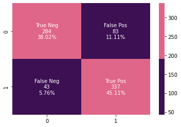

# Stroke Prediction: Effect of Data Leakage | SMOTE
## 基本信息

[网址](https://www.kaggle.com/code/tanmay111999/stroke-prediction-effect-of-data-leakage-smote)

2023年发布

9，331次浏览

132个人支持

100人复现


## 0. 简介
### 0.1. Problem Statement :

According to the World Health Organization (WHO), stroke is the 2nd leading cause of death globally, responsible for approximately 11% of total deaths. It is another health issue that has found to be rising throughout the world due to the adoption of lifestyle changes that disregards healthy lifestyle & good eating habits. Thus, new emerging electronic devices that record the health vitals have paved the way for creating an automated solution with AI techniques at it's core. Thus, similar to heart diseases, efforts have begun to create lab tests that predict stroke. The dataset presented here has many factors that highlight the lifestyle of the patients and hence gives us an opportunity to create an AI-based solution for it.

### 0.2. Aim :
* To classify / predict whether a patient can suffer a stroke.
* It is a binary classification problem with multiple numerical and categorical features.

### 0.3. Dataset Attributes :¶
* id : unique identifier
* gender : "Male", "Female" or "Other"
* age : age of the patient
* hypertension: 0 if the patient doesn't have hypertension, 1 if the patient has hypertension
* heart_disease : 0 if the patient doesn't have any heart diseases, 1 if the patient has a heart disease
* ever_married : "No" or "Yes"
* work_type : "children", "Govt_jov", "Never_worked", "Private" or "Self-employed"
* Residence_type : "Rural" or "Urban"
* avg_glucose_level : average glucose level in blood
* bmi : body mass index
* smoking_status : "formerly smoked", "never smoked", "smokes" or "Unknown"*
* stroke : 1 if the patient had a stroke or 0 if not

### 0.4. Notebook Contents :
* Dataset Information
* Exploratory Data Analysis (EDA)
* Summary of EDA & Comparison with Domain Information
* Feature Engineering (Data Leakage & Data Balancing)
* Modeling
* Conclusion
### 0.5. What you will learn :
* Data Visualization
* Data Balancing using SMOTE
* Data Leakage
* Statistical Tests for Feature Selection
* Modeling and visualization of results for algorithms


Lets get started!


## 1. Data Visualization
### 1.1. Import the Necessary Libraries :

这段代码是Python编程语言中的一段示例，用于数据科学和机器学习任务。下面是对每行代码的详细中文注释：

```python
# 导入pandas库，并使用别名pd。Pandas是一个强大的数据结构和数据分析工具。
import pandas as pd

# 导入numpy库，并使用别名np。Numpy提供了对多维数组对象的支持以及各种派生对象（如掩码数组和矩阵）。
import numpy as np

# 导入matplotlib.pyplot模块，并使用别名plt。这个模块可以用来绘制图形和数据可视化。
import matplotlib.pyplot as plt

# 这行代码是Jupyter Notebook的魔法命令，用于在Notebook内部直接显示图表。
%matplotlib inline

# 导入seaborn库，并使用别名sns。Seaborn是基于matplotlib的高级数据可视化库，提供了更多样化的绘图风格和接口。
import seaborn as sns

# 设置pandas显示选项，使浮点数显示为两位小数。
pd.options.display.float_format = '{:.2f}'.format

# 导入warnings模块，用于控制警告的显示。
import warnings

# 从tqdm模块导入tqdm函数，它是一个快速、可扩展的进度条工具，可以在Python长循环中添加一个进度提示。
from tqdm import tqdm

# 使用warnings过滤器来忽略警告信息，使得在运行代码时不会出现烦人的警告信息。
warnings.filterwarnings('ignore')

# 从sklearn.preprocessing模块导入LabelEncoder类，用于将标签转换为范围从0到n_classes-1的整数。
from sklearn.preprocessing import LabelEncoder
```
这段代码主要涉及数据处理和可视化的库的导入和设置，为后续的数据科学工作做好准备。


```python
data = pd.read_csv('/kaggle/input/stroke-prediction-dataset/healthcare-dataset-stroke-data.csv')
data.head()
```


### 1.2. Data Info :

```python
data.shape
```

```python
(5110, 12)
```

```python
data.columns
# 这行代码用于获取Pandas DataFrame 'data' 的所有列名。
# 'data' 是一个Pandas DataFrame对象，它是一个二维的、表格型的数据结构，非常适合于数据处理和分析。
# 'columns' 是DataFrame对象的一个属性，它返回一个Index对象，包含了DataFrame中所有列的名称。
# 当执行这行代码时，它会打印出DataFrame 'data' 中每一列的名称，通常用于了解数据集的结构或者进行数据的初步探索。
data.columns
```


```python
data.info()
# 调用DataFrame对象'data'的info()方法，该方法会输出DataFrame的概要信息。
# 这个方法通常用于初步了解数据集的结构和内容，包括每列的数据类型、非空值的数量等。
# 执行这行代码后，Pandas会打印出一份报告，其中包含了以下信息：
#   - 数据集的行数和列数。
#   - 每列的名称、数据类型（例如整数、浮点数、对象等）以及非空值的数量。
#   - 数据集的内存使用情况。
# 这个概要信息有助于在数据分析的早期阶段识别潜在的问题，如缺失值、数据类型不一致等。
data.info()
```

当你执行`data.info()`方法时，Pandas会输出一个表格，其中列出了DataFrame的每一列以及相关的信息。这个表格通常会包含列名、数据类型、非空值的数量，以及每列的内存使用情况。这个功能对于快速检查数据集的完整性和准确性非常有用，可以帮助你做出是否需要进行数据清洗和预处理的决策。


```python
<class 'pandas.core.frame.DataFrame'>
RangeIndex: 5110 entries, 0 to 5109
Data columns (total 12 columns):
 #   Column             Non-Null Count  Dtype  
---  ------             --------------  -----  
 0   id                 5110 non-null   int64  
 1   gender             5110 non-null   object 
 2   age                5110 non-null   float64
 3   hypertension       5110 non-null   int64  
 4   heart_disease      5110 non-null   int64  
 5   ever_married       5110 non-null   object 
 6   work_type          5110 non-null   object 
 7   Residence_type     5110 non-null   object 
 8   avg_glucose_level  5110 non-null   float64
 9   bmi                4909 non-null   float64
 10  smoking_status     5110 non-null   object 
 11  stroke             5110 non-null   int64  
dtypes: float64(3), int64(4), object(5)
memory usage: 479.2+ KB
```

根据提供的`data.info()`方法的输出结果，我们可以对数据集`data`进行以下详细分析：

1. **DataFrame 类型与索引**:
   - `data`是一个Pandas的DataFrame对象。
   - 使用RangeIndex索引，共有5110个数据条目，索引范围从0到5109。

2. **数据概览**:
   - 共有12列数据，每一列的名称和数据类型如下：
     - `id`列：数据类型为`int64`，表示整数类型，共有5110个非空值。
     - `gender`列：数据类型为`object`，通常表示字符串类型，共有5110个非空值。
     - `age`列：数据类型为`float64`，表示双精度浮点数类型，共有5110个非空值。
     - `hypertension`列：数据类型为`int64`，共有5110个非空值。
     - `heart_disease`列：数据类型为`int64`，共有5110个非空值。
     - `ever_married`列：数据类型为`object`，共有5110个非空值。
     - `work_type`列：数据类型为`object`，共有5110个非空值。
     - `Residence_type`列：数据类型为`object`，共有5110个非空值。
     - `avg_glucose_level`列：数据类型为`float64`，共有5110个非空值。
     - `bmi`列：数据类型为`float64`，但有201个空值（5110 - 4909 = 201），表示有201条记录缺失BMI信息。
     - `smoking_status`列：数据类型为`object`，共有5110个非空值。
     - `stroke`列：数据类型为`int64`，共有5110个非空值。

3. **数据类型统计**:
   - 总共有3列`float64`类型（即浮点数类型），4列`int64`类型（即整数类型），以及5列`object`类型（通常指字符串类型）。

4. **内存使用情况**:
   - 数据集大约使用了479.2 KB的内存。这个信息有助于了解数据集在存储和处理时可能对系统资源的需求。

通过这些信息，我们可以了解到数据集`data`的结构和基本属性。所有列除了`bmi`列有201个缺失值外，其他列都是完整的，没有缺失数据。这可能需要进一步的数据分析来确定缺失值的处理方法，例如通过插值、删除或使用其他技术来填补这些缺失值。
此外，数据集中包含的变量类型多样，有分类变量（如`gender`, `ever_married`, `work_type`, `Residence_type`, `smoking_status`）和数值变量（如`id`, `age`, `hypertension`, `heart_disease`, `avg_glucose_level`, `bmi`, `stroke`），这表明数据集可能用于回归分析、分类任务或其他机器学习算法。


下面这行代码使用了Seaborn库中的`heatmap`函数来创建一个热图，用于可视化Pandas DataFrame `data`中的缺失数据情况。下面是对这行代码的详细中文注释：

```python
# 导入Seaborn库，并使用别名sns。Seaborn是一个基于Matplotlib的高级数据可视化库，提供了丰富的绘图类型和美观的默认主题。
import seaborn as sns

# 调用DataFrame对象'data'的isnull()方法，该方法会返回一个与原DataFrame形状相同的布尔型DataFrame。
# 在这个布尔型DataFrame中，每个位置的值表示原DataFrame对应位置的值是否为空（True表示缺失，False表示非空）。
data.isnull()

# 使用Seaborn库的heatmap函数创建一个热图，输入参数为上述得到的布尔型DataFrame。
# 热图是一种数据可视化技术，可以显示矩阵数据中的数值大小，通常用颜色的深浅来表示。
sns.heatmap(data.isnull(),

    # cmap参数用于指定热图的颜色映射方案，'magma'是一种颜色映射方案，它会生成从紫色到黄色的颜色渐变。
    cmap = 'magma',

    # cbar参数用于控制是否显示颜色条，颜色条是热图旁边用于表示颜色深浅对应数值大小的图例。
    # 设置为False表示不显示颜色条。
    cbar = False
);

# 执行这行代码后，会在Python的绘图环境中生成一个热图，其中颜色越深（如紫色）表示数据越缺失，颜色越浅（如黄色）表示数据越完整。
# 通过这个热图，我们可以快速地识别出数据集中哪些位置存在缺失值，以及缺失数据的分布情况。
```

这段代码通过可视化的方式提供了数据集中缺失值的直观展示，有助于我们在进行数据分析或数据清洗之前，了解数据的完整性和需要采取的处理措施。


**A few null values** are present in the **bmi** feature!

这行代码是用于调用Pandas库中的DataFrame对象的`describe()`方法，以获取DataFrame的统计摘要。下面是对这行代码的详细中文注释：

```python
data.describe()
# 调用DataFrame对象'data'的describe()方法，该方法会输出DataFrame的统计摘要。
# 这个方法通常用于快速了解数据集的数值型列的分布情况，包括均值、标准差、最小值、25%分位数、中位数、75%分位数和最大值。
# 执行这行代码后，Pandas会打印出一份报告，其中包含了以下信息：
#   - 数据集中每一列的计数（即非空值的数量）。
#   - 每一列的平均值（mean），即所有数值的总和除以数值的个数。
#   - 每一列的标准差（std），表示数值分布的离散程度。
#   - 每一列的最小值（min），即所有数值中的最小值。
#   - 每一列的25%分位数（25%），即所有数值从小到大排列后位于25%位置的值。
#   - 每一列的中位数（50%），即所有数值从小到大排列后位于中间位置的值。
#   - 每一列的75%分位数（75%），即所有数值从小到大排列后位于75%位置的值。
#   - 每一列的最大值（max），即所有数值中的最大值。
data.describe()
```

当你执行`data.describe()`方法时，Pandas会输出一个表格，其中列出了DataFrame的每一列数值型数据的统计摘要。默认情况下，`describe()`方法只对数值型列进行统计分析，不包括分类数据（如字符串类型）。这个功能对于快速分析数据集的数值特征非常有用，可以帮助你了解数据的集中趋势、离散程度以及潜在的异常值。如果你需要对非数值型数据进行描述性统计分析，你可能需要使用其他方法或自定义函数来实现。


根据提供的`data.describe()`方法的输出结果，我们可以对数据集`data`中的数值型列进行以下详细分析：

1. **id**:
   - `count`: 共有5110个非空的id值。
   - `mean`: id的平均值为36517.83，这可能是某种形式的编码或者编号。
   - `std`: id的标准差为21161.72，表明id值的分布相对分散。
   - `min`: id的最小值为67，最大值为72940，这表明id的范围很广。
   - `25%`: 25%的id值低于17741.25。
   - `50%`: 中位数id值为36932，这是数据集中的中位编号。
   - `75%`: 75%的id值低于54682。
   - `max`: 最大id值为72940。

2. **age**:
   - `count`: 共有5110个非空的年龄值。
   - `mean`: 平均年龄为43.23岁。
   - `std`: 年龄的标准差为22.61岁，表明年龄分布有一定的离散程度。
   - `min`: 最小年龄为0.08岁，这可能是数据输入错误或特殊情形。
   - `25%`: 25%的人年龄在25岁以下。
   - `50%`: 中位数年龄为45岁。
   - `75%`: 75%的人年龄在61岁以上。
   - `max`: 最大年龄为82岁。

3. **hypertension**:
   - `count`: 共有5110个非空的高血压值。
   - `mean`: 平均值为0.10，表明大约10%的人有高血压。
   - `std`: 标准差为0.30，表明高血压数据的分布有一定的波动。
   - `min`: 最小值为0，表明没有人的高血压值为0（0可能表示没有高血压）。
   - `25%`: 25%的人高血压值为0。
   - `50%`: 中位数为0，表明一半的人没有高血压。
   - `75%`: 75%的人高血压值为0。
   - `max`: 最大值为1，表明有一部分人有高血压。

4. **heart_disease**:
   - `count`: 共有5110个非空的心脏病值。
   - `mean`: 平均值为0.05，表明大约5%的人有心脏病。
   - `std`: 标准差为0.23，表明心脏病数据的分布有一定的波动。
   - `min`: 最小值为0，表明没有人的心脏病值为0（0可能表示没有心脏病）。
   - `25%`: 25%的人心脏病值为0。
   - `50%`: 中位数为0，表明一半的人没有心脏病。
   - `75%`: 75%的人心脏病值为0。
   - `max`: 最大值为1，表明有一部分人有心脏病。

5. **avg_glucose_level**:
   - `count`: 共有5110个非空的平均血糖水平值。
   - `mean`: 平均血糖水平为106.15 mg/dL。
   - `std`: 标准差为45.28 mg/dL，表明血糖水平有一定的波动。
   - `min`: 最小血糖水平为55.12 mg/dL。
   - `25%`: 25%的人血糖水平低于77.25 mg/dL。
   - `50%`: 中位数血糖水平为91.88 mg/dL。
   - `75%`: 75%的人血糖水平低于114.09 mg/dL。
   - `max`: 最高血糖水平为271.74 mg/dL，可能表明有严重的高血糖情况。

6. **bmi**:
   - `count`: 共有4909个非空的身体质量指数（BMI）值，有201个缺失值。
   - `mean`: 平均BMI为28.89，属于过重范围（根据世界卫生组织的标准，18.5-24.9为正常范围）。
   - `std`: 标准差为7.85，表明BMI值分布有一定的离散程度。
   - `min`: 最小BMI为10.30，这可能是数据输入错误、极端情况或特殊人群（如运动员）。
   - `25%`: 25%的人BMI低于23.50。
   - `50%`: 中位数BMI为28.10。
   - `75%`: 75%的人BMI低于33.10。
   - `max`: 最大BMI为97.60，这可能表明有严重的肥胖情况。

7. **stroke**:
   - `count`: 共有5110个非空的中风值。
   - `mean`: 平均值为0.05，表明大约5%的人有中风病史。
   - `std`: 标准差为0.22，表明中风数据的分布有一定的波动。
   - `min`: 最小值为0，表明没有人的中风值为0（0可能表示没有中风）。
   - `25%`: 25%的人中风值为0。
   - `50%`: 中位数为0，表明一半的人没有中风。
   - `75%`: 75%的人中风值为0。
   - `max`: 最大值为1，表明有一部分人有中风病史。

通过这些统计摘要，我们可以了解到数据集中的一些基本特征和潜在的问题，如年龄和BMI的分布情况，以及高血压、心脏病、中风等健康状况的普遍性。这些信息对于进一步的数据分析和建模具有重要的参考价值。同时，我们也可以注意到，某些列如`id`和`age`的最小值异常低，可能需要进一步的数据清洗和验证。


下面这段代码使用了Pandas和Seaborn库来创建两个热图，分别展示有中风病史和无中风病史的数据集的统计描述。下面是对每行代码的详细中文注释：

```python
# 定义一个新的DataFrame 'stroke'，它通过筛选原始DataFrame 'data' 中 'stroke' 列值为1的行来创建。
# 这意味着 'stroke' DataFrame 只包含有中风病史的记录。
stroke = data[data['stroke'] == 1].describe().T

# 定义一个新的DataFrame 'no_stroke'，它通过筛选原始DataFrame 'data' 中 'stroke' 列值为0的行来创建。
# 这意味着 'no_stroke' DataFrame 只包含无中风病史的记录。
no_stroke = data[data['stroke'] == 0].describe().T

# 定义一个颜色列表 'colors'，包含两种颜色的十六进制代码，这些颜色将用于热图中不同的数据点。
colors = ['#3C1053','#DF6589']

# 使用Matplotlib的subplots函数创建一个包含两个子图的图形对象 'fig' 和轴对象 'ax'。
# nrows = 1 表示子图将垂直排列，ncols = 2 表示有两个子图并排排列，figsize = (5,5) 设置了图形的大小。
fig,ax = plt.subplots(nrows = 1,ncols = 2,figsize = (5,5))

# 激活第一个子图（位置为1,2的第一个位置），并使用Seaborn的heatmap函数创建一个热图。
# 热图的数据来源于 'stroke' DataFrame的 'mean' 列。
# annot = True 表示在热图的每个单元格内显示数值。
# cmap = colors 表示使用之前定义的颜色映射。
# linewidths = 0.4 设置单元格之间线条的宽度。
# linecolor = 'black' 设置线条颜色为黑色。
# cbar = False 表示不显示颜色条。
# fmt = '.2f' 表示数值的格式化字符串，保留两位小数。
plt.subplot(1,2,1)
sns.heatmap(stroke[['mean']], annot = True, cmap = colors, linewidths = 0.4, linecolor = 'black', cbar = False, fmt = '.2f')
# 设置子图的标题为 'Stroke Suffered'。
plt.title('Stroke Suffered');

# 激活第二个子图（位置为1,2的第二个位置），并使用Seaborn的heatmap函数创建一个热图。
# 热图的数据来源于 'no_stroke' DataFrame的 'mean' 列。
plt.subplot(1,2,2)
# 同上，创建热图并设置相应的参数。
sns.heatmap(no_stroke[['mean']], annot = True, cmap = colors, linewidths = 0.4, linecolor = 'black', cbar = False, fmt = '.2f')
# 设置子图的标题为 'No Stroke Suffered'。
plt.title('No Stroke Suffered');

# 使用Matplotlib的tight_layout函数调整子图的布局，使子图之间填充更紧凑，pad = 0 设置了布局的填充间距。
fig.tight_layout(pad = 0)
```

这段代码通过创建两个热图来比较有中风病史和无中风病史患者的统计数据。通过这种可视化方式，可以直观地看出两组数据在各个数值特征上的差异，例如平均年龄、血糖水平、BMI等。这对于分析中风与其他健康指标之间的关联非常有用。此外，通过设置不同的颜色和格式化选项，热图的可读性和美观性得到了增强。


* **Mean** values of all the features for cases of **stroke suffered** and **no stroke suffered**.
* **age** and **avg_glucose_level** can be solid 1st hand indicators to identify a stroke.
* Mean **age** values of patients that suffered a stroke, **67.73**,is much higher than those did not suffer a stroke, **41.97**.
* Similarly, **avg_glucose_level** value of **132.54** can indicate a higher chance of suffering from stroke than the **avg_glucose_level** value of **104.80** that has been found in patients that did not suffer a stroke.

### 1.3. Fill Missing Values :

这段代码使用了Python的列表推导式和`tqdm`库来查找并计算DataFrame `data`中`bmi`特征的缺失值数量。下面是对每行代码的详细中文注释：

```python
# 使用列表推导式创建一个新列表l1。这个列表将包含所有在'bmi'特征列中缺失值的索引。
# tqdm(range(len(data.isnull()['bmi'])))是一个进度条，用于显示循环的进度。range函数的参数是'bmi'特征列中缺失值的数量。
# data.isnull()['bmi']生成一个布尔序列，表示'bmi'列中每个值是否为缺失值。
# loc[i,'bmi']是Pandas的.loc索引器，用于根据索引i访问'bmi'列的值。
l1 = [i for i in tqdm(range(len(data.isnull()['bmi'])))) if data.isnull().loc[i,'bmi'] == True]

# 打印'bmi'特征中缺失值的总数。
# len(l1)计算列表l1的长度，即缺失值的数量。
print('Total Number of Missing Values in bmi feature :', len(l1))
```

这段代码的作用是找出'bmi'这一特征列中所有缺失值的索引，并计算这些缺失值的总数。通过使用`tqdm`库，代码在执行时会显示一个进度条，使得循环的执行进度可视化，这在处理大量数据时特别有用。最后，打印出的缺失值总数有助于了解数据集的完整性，为后续的数据清洗和预处理提供重要信息。

```python
100%|██████████| 5110/5110 [00:07<00:00, 715.67it/s]
Total Number of Missing Values in bmi feature : 201
```

根据提供的代码执行结果，我们可以进行以下分析：

1. **进度条输出**:
   - 代码中的`tqdm`库用于显示一个进度条，它显示了当前进度和已经处理的迭代次数。在这个例子中，进度条显示了100%的完成度，表示代码已经处理了所有的5110个数据点。
   - `715.67it/s`表示每秒迭代次数，即代码每秒可以检查715.67个数据点。这个速度相对较快，表明计算机处理这段代码的效率很高。

2. **缺失值统计**:
   - `print`函数输出了`bmi`特征中缺失值的总数，结果显示为201个缺失值。
   - 这意味着在原始的`data` DataFrame中，有201个记录的`bmi`值是空的，没有提供具体的数值。
   - 缺失值的存在可能会对数据分析和建模产生影响，因为大多数统计方法和机器学习算法都假设数据是完整的。因此，在进行进一步的分析之前，通常需要对这些缺失值进行处理，例如通过删除含有缺失值的记录、使用其他已知数据进行插值或者基于某种策略进行估计等。

3. **数据清洗的重要性**:
   - 了解数据集中缺失值的情况是数据清洗和预处理的重要步骤。在这个例子中，我们已经知道了`bmi`特征有201个缺失值，这是数据清洗过程中需要特别关注的问题。
   - 根据数据集的具体情况和分析目标，我们需要选择合适的方法来处理这些缺失值，以确保后续分析的准确性和可靠性。

总的来说，这段代码及其结果向我们展示了如何有效地识别和统计数据集中的缺失值，这是进行高质量数据分析的基础。在实际应用中，我们需要根据具体情况选择合适的方法来处理这些缺失值，以提高数据集的质量。

* From the table of descriptive statistics, we observe that mean and median values of **bmi** are very close to each other.
* Hence, we will fill the missing values with the **mean values**.


下面这段代码使用了Pandas库来填充DataFrame `data`中的`bmi`列的缺失值，并使用Seaborn库来创建一个热图来可视化整个数据集中的缺失值情况。下面是对每行代码的详细中文注释：

```python
# 这行代码使用Pandas的fillna方法来填充DataFrame 'data'中的'bmi'列的缺失值。
# fillna方法的第一个参数是要用来填充缺失值的值，这里使用了'bmi'列的平均值。
# inplace=True参数表示直接在原始DataFrame上进行修改，而不是创建一个新的DataFrame。
# 这样，所有的'bmi'列中的缺失值都会被其平均值所替代。
data['bmi'].fillna(data['bmi'].mean(), inplace=True)

# 导入Seaborn库，并使用别名sns。Seaborn是一个基于Matplotlib的高级数据可视化库，提供了丰富的绘图类型和美观的默认主题。
import seaborn as sns

# 使用Seaborn的heatmap函数创建一个热图，输入参数为原始DataFrame 'data'的isnull方法的结果。
# isnull方法会返回一个与原DataFrame形状相同的布尔型DataFrame，其中的值表示原DataFrame对应位置的值是否为空（True表示缺失，False表示非空）。
# cmap='magma'参数指定了热图的颜色映射方案，'magma'是一种颜色渐变，从紫色到黄色。
# cbar=False参数表示不显示颜色条，颜色条是热图旁边用于表示颜色深浅对应数值大小的图例。
# 执行这行代码后，会在Python的绘图环境中生成一个热图，其中颜色越深（如紫色）表示数据越缺失，颜色越浅（如黄色）表示数据越完整。
sns.heatmap(data.isnull(), cmap='magma', cbar=False);
```

这段代码首先通过填充`bmi`列的缺失值来清洗数据集，然后使用热图来可视化整个数据集的缺失值情况。通过这种方式，我们可以直观地了解数据集中每一列的缺失值分布，从而为进一步的数据分析和处理提供依据。


## 2. Exploratory Data Analysis
### 2.1. Dividing features into Discrete and Categorical :


这段代码主要用于处理Pandas DataFrame `data`中的数据列，通过删除不需要的列、转换数据类型、识别分类（离散）和数值（连续）特征，并创建DataFrame的一个深拷贝。下面是对每行代码的详细中文注释：

```python
# 这行代码使用Pandas的drop方法从DataFrame 'data'中删除名为'id'的列。
# columns=['id']参数指定了要删除的列名。
# inplace=True参数表示直接在原始DataFrame上进行修改，而不是创建一个新的DataFrame。
# 这样，'id'列将从原始数据集中被移除。
data.drop(columns=['id'], inplace=True)

# 将DataFrame 'data'的列名转换为Python列表，并赋值给变量col。
col = list(data.columns)

# 初始化一个空列表categorical_features，用于存储分类特征的列名。
categorical_features = []

# 初始化一个空列表discrete_features，用于存储离散（数值型）特征的列名。
discrete_features = []

# 遍历列表col中的每个元素，即DataFrame 'data'的每一列。
for i in col:
    # 检查列i中唯一值的数量。
    # 如果唯一值的数量大于6，则认为该列是离散（数值型）特征，并将其名字添加到discrete_features列表中。
    if len(data[i].unique()) > 6:
        discrete_features.append(i)
    # 否则，认为该列是分类特征，并将其名字添加到categorical_features列表中。
    else:
        categorical_features.append(i)

# 打印分类特征的列表，使用*操作符将列表中的元素解包为独立的参数。
print('Categorical Features :', *categorical_features)

# 打印离散（数值型）特征的列表，使用*操作符将列表中的元素解包为独立的参数。
print('Discrete Features :', *discrete_features)

# 将DataFrame 'data'中的'age'列的数据类型转换为整数类型。
data['age'] = data['age'].astype(int)

# 使用copy方法创建DataFrame 'data'的一个深拷贝，并赋值给变量df1。
# deep=True参数表示进行深拷贝，即复制所有的数据和索引，创建一个新的DataFrame。
df1 = data.copy(deep=True)
```

这段代码通过一系列的数据处理步骤，帮助我们为后续的数据分析和机器学习任务做好准备。首先，它删除了不需要的`id`列，然后根据列中唯一值的数量区分了分类和离散特征。接着，它将`age`列的数据类型转换为整数，这通常是数值分析中的一个重要步骤。最后，它创建了原始DataFrame的一个深拷贝，这样我们就可以在不影响原始数据的情况下进行进一步的探索和实验。


```python
Categorical Features : gender hypertension heart_disease ever_married work_type Residence_type smoking_status stroke
Discrete Features : age avg_glucose_level bmi
```

* We drop the id column as it is just a unique identifier.
* Here, categorical features are defined if the the attribute has less than 6 unique elements else it is a discrete feature.
* Typical approach for this division of features can also be based on the datatypes of the elements of the respective attribute.

**Eg** : datatype = integer, attribute = discrete feature ; datatype = string, attribute = categorical feature

* Creating a deep copy of the orginal dataset for experimenting with data, visualization and modeling.
* Modifications in the original dataset will not be highlighted in this deep copy.
* We now Label Encode the data categorical text data features.


这段代码使用了`LabelEncoder`类来对DataFrame `df1`中的文本数据特征进行编码，将文本标签转换为范围从0到n_classes-1的整数。下面是对每行代码的详细中文注释：

```python
# 创建一个LabelEncoder对象，用于将文本标签转换为整数编码。
le = LabelEncoder()

# 定义一个列表text_data_features，包含需要进行编码的特征列名。
text_data_features = ['gender', 'ever_married', 'work_type', 'Residence_type', 'smoking_status']

# 初始化两个空列表l3和l4，用于存储每列转换后的唯一值和对应的原始文本标签。
l3 = []; l4 = [];

# 打印当前正在进行的操作，用于标识接下来的输出内容。
print('Label Encoder Transformation')

# 使用tqdm库创建一个进度条，用于显示循环的进度。
# 遍历text_data_features列表中的每个特征列名。
for i in tqdm(text_data_features):
    # 使用fit_transform方法对DataFrame 'df1'中名为i的列进行编码。
    # 转换后的编码值将替换原来的文本标签。
    df1[i] = le.fit_transform(df1[i])
    
    # 获取转换后的列中所有唯一值的列表，并将其添加到列表l3中。
    l3.append(list(df1[i].unique()))
    
    # 使用inverse_transform方法将编码值转换回原始的文本标签，并将其添加到列表l4中。
    l4.append(list(le.inverse_transform(df1[i].unique())))
    
    # 打印特征列名、转换后的唯一值列表以及对应的原始文本标签列表。
    print(i, ' : ', df1[i].unique(), ' = ', le.inverse_transform(df1[i].unique()))
```

这段代码的主要作用是将DataFrame `df1`中的文本数据特征转换为数值型数据，以便于后续的数据分析和机器学习模型处理。`LabelEncoder`是处理分类数据的常用工具，它通过学习每个唯一文本标签的整数映射，使得原本的文本数据可以被模型识别和处理。通过打印转换后的唯一值和对应的原始文本标签，我们可以验证编码过程是否正确，并确保数据转换的透明度和可解释性。此外，使用`tqdm`库可以提高代码的可读性，通过显示进度条来反映代码执行的状态。


```python
Label Encoder Transformation
100%|██████████| 5/5 [00:00<00:00, 326.74it/s]
gender  :  [1 0 2]  =  ['Male' 'Female' 'Other']
ever_married  :  [1 0]  =  ['Yes' 'No']
work_type  :  [2 3 0 4 1]  =  ['Private' 'Self-employed' 'Govt_job' 'children' 'Never_worked']
Residence_type  :  [1 0]  =  ['Urban' 'Rural']
smoking_status  :  [1 2 3 0]  =  ['formerly smoked' 'never smoked' 'smokes' 'Unknown']
```

根据提供的代码执行结果，我们可以进行以下分析：

1. **性别（gender）**:
   - 原始数据中的性别特征有三个类别：'Male'（男性）、'Female'（女性）和'Other'（其他）。
   - 使用Label Encoder进行编码后，'Male'被分配了数值1，'Female'被分配了数值2，'Other'被分配了数值0。
   - 这些数值表示了性别的有序关系，但在实际应用中，通常性别不被视为有序类别，因此可能需要使用One-Hot编码或其他方法来避免引入这种有序关系。

2. **婚姻状况（ever_married）**:
   - 原始数据中的婚姻状况特征有两个类别：'Yes'（已婚）和'No'（未婚）。
   - 编码后，'Yes'被分配了数值1，'No'被分配了数值0。
   - 这种编码方式简单直接，反映了已婚与否的二元关系。

3. **工作类型（work_type）**:
   - 原始数据中的工作类型特征包含多个类别，分别是'Private'（私营部门）、'Self-employed'（自雇）、'Govt_job'（政府工作）、'children'（在家带孩子）、'Never_worked'（从未工作过）。
   - 编码后，这些类别被分配了不同的数值，但顺序与原始类别的字母顺序不同。
   - 需要注意的是，这种编码方式引入了一个潜在的有序关系，尽管这些类别本质上是无序的。在某些情况下，这可能会影响模型的性能，因此可能需要重新考虑编码策略。

4. **居住类型（Residence_type）**:
   - 原始数据中的居住类型特征有两个类别：'Urban'（城市）和'Rural'（农村）。
   - 编码后，'Urban'被分配了数值1，'Rural'被分配了数值0。
   - 这种编码方式同样简单直接，反映了居住地类型的二元关系。

5. **吸烟状况（smoking_status）**:
   - 原始数据中的吸烟状况特征包含四个类别：'formerly smoked'（以前吸烟）、'never smoked'（从未吸烟）、'smokes'（现在吸烟）和'Unknown'（未知）。
   - 编码后，这些类别被分配了不同的数值，'formerly smoked'被分配了数值1，'never smoked'被分配了数值2，'smokes'被分配了数值3，'Unknown'被分配了数值0。
   - 这种编码方式为每个吸烟状况类别分配了一个唯一的数值，但同样可能引入了一种潜在的有序关系，尽管这些类别在实际中是无序的。

总结来说，Label Encoder提供了一种简单的方式来将文本类别标签转换为数值型数据，使得这些特征可以被用于机器学习模型。然而，这种转换可能会引入有序关系，这在某些情况下可能不适当。因此，在实际应用中，我们需要根据特征的性质和模型的要求来选择合适的编码方法。

* We store the label encoded transformations inside a dictionary that gives us the information about the encoded value and it's original value!
* We add the remaining 2 features manually i.e **heart_disease** & **hypertension**!


这段代码创建了一个Python字典`tf1`，用于存储文本数据特征与其编码后的唯一值之间的映射关系，以及特定列的特定编码映射。下面是对每行代码的详细中文注释：

```python
# 初始化一个空字典tf1，用于存储特征名称与它们的编码映射之间的对应关系。
tf1 = {}

# 遍历text_data_features列表的长度，即特征的数量。
for i in range(len(text_data_features)):
    # 为字典tf1中的每个特征创建一个新的嵌套字典。
    # 特征名称作为键，其对应的空字典作为值。
    tf1[text_data_features[i]] = {}

    # 遍历列表l3和l4中的对应元素，这两个列表分别存储了编码后的唯一值和原始文本标签。
    # l3[i]包含了编码后的唯一值，l4[i]包含了对应的原始文本标签。
    for j, k in zip(l3[i], l4[i]):
        # 在嵌套字典中，将编码后的唯一值作为键，原始文本标签作为值。
        # 这样，我们就可以通过编码值快速找到对应的文本标签。
        tf1[text_data_features[i]][j] = k

# 为字典tf1中的'hypertension'和'heart_disease'这两个特定的特征手动添加编码映射。
# 这里假设'hypertension'和'heart_disease'的特征值只有0和1，分别代表“没有高血压”和“有高血压”，“没有心脏病”和“有心脏病”。
tf1['hypertension'] = {0: 'No Hypertension', 1: 'Hypertension'}
tf1['heart_disease'] = {0: 'No Heart Disease', 1: 'Heart Disease'}

# 打印字典tf1的内容，展示所有的编码映射关系。
# 这将输出字典tf1中的所有键值对，包括文本数据特征与其编码后的唯一值和原始文本标签之间的映射。
tf1
```

这段代码的主要作用是建立一个映射表，用于在数据预处理和机器学习任务中快速查找特征的编码和文本标签之间的对应关系。通过这种方式，我们可以确保在数据转换过程中不会丢失原始数据的含义，同时也方便了后续的数据解释和模型评估工作。

```python
{'gender': {1: 'Male', 0: 'Female', 2: 'Other'},
 'ever_married': {1: 'Yes', 0: 'No'},
 'work_type': {2: 'Private',
  3: 'Self-employed',
  0: 'Govt_job',
  4: 'children',
  1: 'Never_worked'},
 'Residence_type': {1: 'Urban', 0: 'Rural'},
 'smoking_status': {1: 'formerly smoked',
  2: 'never smoked',
  3: 'smokes',
  0: 'Unknown'},
 'hypertension': {0: 'No Hypertension', 1: 'Hypertension'},
 'heart_disease': {0: 'No Heart Disease', 1: 'Heart Disease'}}
```

根据提供的代码执行结果，我们可以进行以下分析：

1. **性别（gender）**:
   - 编码映射表显示，性别特征的编码为1对应'Male'（男性），编码为0对应'Female'（女性），编码为2对应'Other'（其他）。
   - 这种映射关系是基于Label Encoder的转换结果，其中'Other'可能是除了男性和女性之外的其他性别类别。

2. **婚姻状况（ever_married）**:
   - 编码映射表显示，婚姻状况特征的编码为1对应'Yes'（已婚），编码为0对应'No'（未婚）。
   - 这是一个简单的二元分类映射，直接反映了个体的婚姻状态。

3. **工作类型（work_type）**:
   - 编码映射表显示，工作类型特征的编码为2对应'Private'（私营部门），编码为3对应'Self-employed'（自雇），编码为0对应'Govt_job'（政府工作），编码为4对应'children'（在家带孩子），编码为1对应'Never_worked'（从未工作过）。
   - 这个特征的编码顺序与原始类别的字母顺序不同，这可能是根据Label Encoder的内部算法确定的。

4. **居住类型（Residence_type）**:
   - 编码映射表显示，居住类型特征的编码为1对应'Urban'（城市），编码为0对应'Rural'（农村）。
   - 这个映射反映了个体的居住地类型，是一个简单的二元分类。

5. **吸烟状况（smoking_status）**:
   - 编码映射表显示，吸烟状况特征的编码为1对应'formerly smoked'（以前吸烟），编码为2对应'never smoked'（从未吸烟），编码为3对应'smokes'（现在吸烟），编码为0对应'Unknown'（未知）。
   - 这个映射表提供了吸烟状况的四个不同类别，包括未知情况。

6. **高血压状况（hypertension）**:
   - 编码映射表手动添加了高血压状况特征的编码，其中0对应'No Hypertension'（没有高血压），1对应'Hypertension'（有高血压）。
   - 这是一个典型的二元分类映射，用于表示个体是否有高血压的健康状况。

7. **心脏病状况（heart_disease）**:
   - 编码映射表手动添加了心脏病状况特征的编码，其中0对应'No Heart Disease'（没有心脏病），1对应'Heart Disease'（有心脏病）。
   - 与高血压状况类似，这也是一个二元分类映射，用于表示个体是否有心脏病的健康状况。

总结来说，`tf1`字典提供了一个清晰的映射关系，将每个特征的编码值与其原始的文本标签相对应。这对于理解数据的特征和后续的数据分析非常有用。通过这种方式，我们可以确保在使用数值型数据进行机器学习建模时，不会丢失原始数据的含义。同时，这也有助于在模型训练和评估过程中进行特征解释。


### 2.2. Target Variable Visualization (stroke) :

这段代码用于创建两个图表来展示DataFrame `df1` 中 `stroke` 列的统计情况。一个饼图用于显示患有中风和未患中风的百分比，另一个条形图用于展示具体的计数。下面是对每行代码的详细中文注释：

```python
# 从DataFrame 'df1' 中获取 'stroke' 列的值计数，并将其转换为列表形式。
# value_counts() 方法返回一个序列，其中包含每个唯一值及其出现次数。
l = list(df1['stroke'].value_counts())

# 计算 'stroke' 列中值为1（表示患有中风）和值为0（表示未患中风）的记录所占的百分比。
# 这些百分比值存储在列表 circle 中。
circle = [l[0] / sum(l) * 100, l[1] / sum(l) * 100]

# 使用 Matplotlib 的 subplots 函数创建一个包含两个子图的图形对象 fig 和轴对象。
# nrows = 1 表示子图将垂直排列，ncols = 2 表示有两个子图并排排列，figsize = (20,5) 设置了图形的大小。
fig = plt.subplots(nrows=1, ncols=2, figsize=(20,5))

# 激活第一个子图（位置为1,2的第一个位置），并使用 Matplotlib 的 pie 函数创建一个饼图。
# circle 列表包含每个部分的大小，labels 参数设置饼图的标签，autopct='%1.1f%%' 设置百分比的显示格式。
# startangle = 90 设置饼图的起始角度，explode = (0.1,0) 使得第一个扇区（未患中风）稍微突出，以区分显示。
# colors 参数设置扇区颜色，wedgeprops 设置扇区的边缘属性。
plt.subplot(1, 2, 1)
plt.pie(circle, labels=['No Stroke Suffered', 'Stroke Suffered'], autopct='%1.1f%%', startangle=90, explode=(0.1, 0), colors=colors,
       wedgeprops={'edgecolor': 'black', 'linewidth': 1, 'antialiased': True})
# 设置饼图的标题。
plt.title('Stroke Events (%)');

# 激活第二个子图（位置为1,2的第二个位置），并使用 Seaborn 的 countplot 函数创建一个计数条形图。
plt.subplot(1, 2, 2)
# 计数条形图显示 'stroke' 列的每个类别的计数，palette 参数设置条形的颜色，edgecolor 设置条形边缘的颜色。
ax = sns.countplot('stroke', data=df1, palette=colors, edgecolor='black')
# 循环遍历条形图的每个矩形区域，并在矩形上方添加文本标签，显示每个类别的计数。
for rect in ax.patches:
    ax.text(rect.get_x() + rect.get_width() / 2, rect.get_height() + 2, rect.get_height(), horizontalalignment='center', fontsize=11)
# 设置条形图的x轴刻度标签。
ax.set_xticklabels(['No Stroke Suffered', 'Stroke Suffered'])
# 设置条形图的标题。
plt.title('Number of Stroke Events');

# 使用 Matplotlib 的 show 函数显示所有子图。
plt.show()
```

这段代码通过两种不同的图表类型展示了`stroke`列的数据分布情况，使得我们可以直观地看到患有中风和未患中风的个体数量及其占比。饼图提供了一个视觉上的百分比比较，而条形图则直接显示了具体的计数，两者结合提供了丰富的数据信息。通过这种方式，我们可以更好地理解数据集中中风事件的分布情况，这对于数据分析和决策制定非常有帮助。


* Clearly, the dataset is **unbalanced** in the favour of no stroke.
* **19 : 1** ratio is observed for **No Stroke : Stroke**!
* Thus, due to such heavy bias towards cases of **No Stroke**, predictions cannot be trusted!

### 2.3. Discrete Features :
#### 2.3.1. Distribution of Discrete Features :

这段代码用于创建一个包含三个子图的图形，每个子图使用Seaborn库的`distplot`函数来展示`discrete_features`列表中每个离散特征的分布情况。下面是对每行代码的详细中文注释：

```python
# 使用 Matplotlib 的 subplots 函数创建一个包含三个子图的图形对象 fig 和轴对象 ax。
# nrows = 1 表示子图将垂直排列，ncols = 3 表示有三个子图并排排列，figsize = (20,5) 设置了图形的大小。
fig, ax = plt.subplots(nrows=1, ncols=3, figsize=(20,5))

# 遍历离散特征列表 discrete_features 中的每个特征。
for i in range(len(discrete_features)):
    # 激活对应的子图，位置由 i+1 确定，因为子图的索引从1开始。
    plt.subplot(1, 3, i+1)
    
    # 使用 Seaborn 的 distplot 函数在当前子图上绘制 df1 中第 i 个离散特征的分布图。
    # color = colors[0] 设置图表的颜色，这里使用了之前定义的颜色列表中的第一个颜色。
    sns.distplot(df1[discrete_features[i]], color=colors[0])
    
    # 构造子图的标题，包括 "Distribution : " 和当前特征的名称。
    title = 'Distribution : ' + discrete_features[i]
    
    # 设置当前子图的标题。
    plt.title(title)

# 使用 Matplotlib 的 show 函数显示所有子图。
plt.show()
```

这段代码的主要作用是可视化数据集中的离散特征分布情况。通过`distplot`函数，我们可以观察每个离散特征的频率分布，了解数据的分布形状，是否有异常值等信息。这对于数据分析和特征工程来说是非常重要的步骤，因为它可以帮助我们理解数据的特性，为后续的数据预处理和模型选择提供依据。此外，通过在同一个图形中并排展示三个特征的分布，我们可以直观地比较它们之间的差异。


* Data distribution for **age** has dominant values around : **10**, **60** & **80**.
* **avg_glucose_level** has 2 peaks of uneven heights present at values around : **100** & **200**.
* **bmi** has a near about **normal distribution** but it has values in low numbers towards the right side!

### 2.4. Discrete Features w.r.t Target Variable (stroke) :


这段代码用于创建一个包含三个子图的图形，每个子图使用Seaborn库的`countplot`函数来展示`discrete_features`列表中每个离散特征与中风情况（'stroke'）之间的关系。下面是对每行代码的详细中文注释：

```python
# 使用 Matplotlib 的 subplots 函数创建一个包含三个子图的图形对象 fig 和轴对象 ax。
# nrows = 3 表示子图将垂直排列成3个，ncols = 1 表示只有一个子图并排，figsize = (15,15) 设置了图形的大小为15x15英寸。
fig, ax = plt.subplots(nrows=3, ncols=1, figsize=(15,15))

# 遍历离散特征列表 discrete_features 中的每个特征。
for i in range(len(discrete_features)):
    # 激活对应的子图，位置由 i+1 确定，因为子图的索引从1开始。
    plt.subplot(3, 1, i+1)
    
    # 使用 Seaborn 的 countplot 函数在当前子图上绘制 df1 中第 i 个离散特征的计数图。
    # discrete_features[i] 表示当前正在绘图的特征名称。
    # data = df1 表示数据来源于DataFrame df1。
    # hue = "stroke" 表示根据 'stroke' 列的值来分颜色显示，以区分中风和未中风的情况。
    # palette = colors 使用之前定义的颜色列表来设置条形的颜色。
    # edgecolor = 'black' 设置条形边缘的颜色。
    sns.countplot(discrete_features[i], data=df1, hue="stroke", palette=colors, edgecolor='black')
    
    # 添加图例，显示 'No Stroke Suffered' 和 'Stroke Suffered' 两个类别。
    plt.legend(['No Stroke Suffered', 'Stroke Suffered'], loc='upper right')
    
    # 构造子图的标题，表示当前特征与中风情况的关系。
    title = discrete_features[i] + ' w.r.t stroke'
    
    # 设置当前子图的标题。
    plt.title(title)
```

这段代码的主要作用是可视化数据集中的离散特征与中风事件之间的关系。通过`countplot`函数，我们可以观察每个离散特征在中风和未中风情况下的计数，从而分析特征与中风之间的潜在关联。这对于理解特征的重要性和构建预测模型是非常有帮助的。此外，通过在同一个图形中垂直排列三个子图，我们可以直观地比较不同特征与中风情况之间的关系。每个子图的标题清晰地表明了正在展示的特征，而图例则帮助我们区分了中风和未中风的情况。


* Because of too many unique data points in the discrete_features, it is difficult to gain any type of insight. Thus, we will convert these features into categorical features for visualizations.
* We scale the data points of these features to a constant value that represents a range of values.(like mean)
* Here, we divide the data points by a constant value and assign it's quotient value as the representative constant. The scaling constants are decided by looking into the data & intuition.


这段代码用于创建新的列，将`df1` DataFrame中的`age`（年龄）、`avg_glucose_level`（平均血糖水平）和`bmi`（身体质量指数）特征的值分别进行分箱（binning）处理，并将其结果存储在新的列`age_group`、`avg_glucose_level_group`和`bmi_group`中。下面是对每行代码的详细中文注释：

```python
# 为DataFrame df1创建一个名为'age_group'的新列。
# 使用列表推导式，遍历df1中'age'列的每个值i。
# 将每个年龄值i除以5，并向下取整得到分组结果，然后将这个结果放入新的'age_group'列中。
# 例如，如果年龄是30，则分组后的结果为6（因为30除以5等于6）。
df1['age_group'] = [int(i / 5) for i in df1['age']]

# 为DataFrame df1创建一个名为'avg_glucose_level_group'的新列。
# 使用列表推导式，遍历df1中'avg_glucose_level'列的每个值i。
# 将每个平均血糖水平值i除以20，并向下取整得到分组结果，然后将这个结果放入新的'avg_glucose_level_group'列中。
# 例如，如果平均血糖水平是150，则分组后的结果为7（因为150除以20等于7.5，向下取整为7）。
df1['avg_glucose_level_group'] = [int(i / 20) for i in df1['avg_glucose_level']]

# 为DataFrame df1创建一个名为'bmi_group'的新列。
# 使用列表推导式，遍历df1中'bmi'列的每个值i。
# 将每个BMI值i除以5，并向下取整得到分组结果，然后将这个结果放入新的'bmi_group'列中。
# 例如，如果BMI是22，则分组后的结果为4（因为22除以5等于4.4，向下取整为4）。
df1['bmi_group'] = [int(i / 5) for i in df1['bmi']]
```

这段代码通过分箱技术将连续变量离散化，这在数据分析和机器学习中是一种常见的数据预处理步骤。分箱可以帮助简化数据的复杂性，减少噪声的影响，有时还能提高模型的性能。通过将年龄、平均血糖水平和BMI分为几个组，我们可以更容易地分析这些特征与目标变量（如中风）之间的关系。例如，我们可以比较不同年龄组或BMI组中中风发生的比例，以识别可能的风险因素。


这段代码用于创建一个包含三个子图的图形，每个子图使用Seaborn库的`countplot`函数来展示`df1` DataFrame中新创建的数值型分组特征（`age_group`、`avg_glucose_level_group`和`bmi_group`）与中风情况（'stroke'）之间的关系。下面是对每行代码的详细中文注释：

```python
# 使用 Matplotlib 的 subplots 函数创建一个包含三个子图的图形对象 fig 和轴对象 ax。
# nrows = 3 表示子图将垂直排列成3个，ncols = 1 表示只有一个子图并排，figsize = (15,15) 设置了图形的大小为15x15英寸。
fig, ax = plt.subplots(nrows=3, ncols=1, figsize=(15,15))

# 定义一个列表 group_numerical_features，包含三个新的数值型分组特征的名称。
# 使用列表推导式，将原始的数值型特征名称（'age', 'avg_glucose_level', 'bmi'）转换为分组后的特征名称（'age_group', 'avg_glucose_level_group', 'bmi_group'）。
group_numerical_features = [i + '_group' for i in ['age', 'avg_glucose_level', 'bmi']]

# 遍历 group_numerical_features 列表中的每个分组特征名称。
for i in range(len(group_numerical_features)):
    # 激活对应的子图，位置由 i+1 确定，因为子图的索引从1开始。
    plt.subplot(3, 1, i+1)
    
    # 使用 Seaborn 的 countplot 函数在当前子图上绘制 df1 中第 i 个分组特征的计数图。
    # group_numerical_features[i] 表示当前正在绘图的特征名称。
    # data = df1 表示数据来源于DataFrame df1。
    # hue = "stroke" 表示根据 'stroke' 列的值来分颜色显示，以区分中风和未中风的情况。
    # palette = colors 使用之前定义的颜色列表来设置条形的颜色。
    # edgecolor = 'black' 设置条形边缘的颜色。
    sns.countplot(group_numerical_features[i], data=df1, hue="stroke", palette=colors, edgecolor='black')
    
    # 添加图例，显示 'No Stroke Suffered' 和 'Stroke Suffered' 两个类别。
    plt.legend(['No Stroke Suffered', 'Stroke Suffered'], loc='upper right')
    
    # 构造子图的标题，表示当前分组特征与中风情况的关系。
    title = group_numerical_features[i] + ' w.r.t stroke'
    
    # 设置当前子图的标题。
    plt.title(title)
```

这段代码的主要作用是可视化数据集中的数值型分组特征与中风事件之间的关系。通过`countplot`函数，我们可以观察每个分组特征在中风和未中风情况下的计数，从而分析特征分组与中风之间的潜在关联。这对于理解特征分组的重要性和构建预测模型是非常有帮助的。此外，通过在同一个图形中垂直排列三个子图，我们可以直观地比较不同分组特征与中风情况之间的关系。每个子图的标题清晰地表明了正在展示的特征分组，而图例则帮助我们区分了中风和未中风的情况。


* For age, cases of stroke suffered can be observed for the values between 35(7x5) - 80(16x5). It is not a dominant patch due to the imbalance nature of the dataset.
* For avg_glucose_level, 2 groups can be found : 60(3x20) - 100(5x20) & 180(9x20) - 220(11x20). Patients with avg_glucose_level present in the 1st group are more prone to suffering stroke than group 2.
* bmi values from 15(3x5) - 40(8x5) have displayed more cases of stroke.


### 2.5. Categorical Features :

#### 2.5.1. Distribution of Categorical Features :


这行代码的作用是从`categorical_features`列表中移除一个特定的元素。下面是对这行代码的详细中文注释：

```python
# 移除列表 categorical_features 中的 'stroke' 元素。
# 'stroke' 是列表中的一个元素，它可能是之前添加到该列表中的特征名称。
# remove() 方法会查找列表中的 'stroke' 并将其删除，如果 'stroke' 存在多次，只会删除第一个匹配项。
categorical_features.remove('stroke')
```

这段代码通常用于数据预处理阶段，当我们需要对列表中的元素进行清理或更新时。在这个例子中，可能是因为`'stroke'`特征已经被处理完毕，或者在后续的分析中不再需要将其作为分类特征来考虑。需要注意的是，`remove`方法会直接修改原始列表`categorical_features`，而不是创建一个新的列表。如果在代码的其他部分依赖了这个列表，那么这些部分可能也需要相应地进行更新。

We remove the stroke feature from the list of categorical features as it is the target variable and we will treat it separately!


这段代码用于创建两个图形，每个图形包含多个子图，使用Seaborn库的`distplot`函数来展示`categorical_features`列表中前四个分类特征的分布情况。下面是对每行代码的详细中文注释：

第一部分的代码块：

```python
# 使用 Matplotlib 的 subplots 函数创建一个包含四个子图的图形对象 fig 和轴对象 ax。
# nrows = 2 表示子图将垂直排列成2个，ncols = 2 表示有2个子图并排，figsize = (7,9) 设置了图形的大小。
fig, ax = plt.subplots(nrows=2, ncols=2, figsize=(7,9))

# 遍历列表 categorical_features 中的前四个元素（索引从0到3）。
for i in range(len(categorical_features[:4])):
    # 激活对应的子图，位置由 i+1 确定，因为子图的索引从1开始。
    plt.subplot(2, 2, i+1)
    
    # 使用 Seaborn 的 distplot 函数在当前子图上绘制 df1 中第 i 个分类特征的分布图。
    # df1[categorical_features[i]] 表示当前正在绘图的特征列。
    # kde_kws = {'bw' : 1} 是传递给核密度估计图的关键字参数，bw 表示带宽，这里设置为1。
    # color = colors[0] 设置图表的颜色，这里使用了之前定义的颜色列表中的第一个颜色。
    sns.distplot(df1[categorical_features[i]], kde_kws={'bw': 1}, color=colors[0])
    
    # 构造子图的标题，包括 "Distribution : " 和当前特征的名称。
    title = 'Distribution : ' + categorical_features[i]
    
    # 设置当前子图的标题。
    plt.title(title)
```

第二部分的代码块：

```python
# 使用 Matplotlib 的 subplots 函数创建一个包含三个子图的图形对象 fig 和轴对象 ax。
# nrows = 1 表示子图将垂直排列成1个，ncols = 3 表示有3个子图并排，figsize = (15,3) 设置了图形的大小。
fig, ax = plt.subplots(nrows=1, ncols=3, figsize=(15,3))

# 遍历列表 categorical_features 中的后三个元素（索引从-1到-4，逆序）。
for i in range(-1, -4, -1):
    # 激活对应的子图，位置由 -i 确定，因为子图的索引从1开始，逆序遍历。
    plt.subplot(1, 3, -i)
    
    # 使用 Seaborn 的 distplot 函数在当前子图上绘制 df1 中第 i 个分类特征的分布图。
    # df1[categorical_features[i]] 表示当前正在绘图的特征列。
    # kde_kws = {'bw' : 1} 是传递给核密度估计图的关键字参数，bw 表示带宽，这里设置为1。
    # color = colors[0] 设置图表的颜色，这里使用了之前定义的颜色列表中的第一个颜色。
    sns.distplot(df1[categorical_features[i]], kde_kws={'bw': 1}, color=colors[0])
    
    # 构造子图的标题，包括 "Distribution : " 和当前特征的名称。
    title = 'Distribution : ' + categorical_features[i]
    
    # 设置当前子图的标题。
    plt.title(title)
```

这两部分代码的主要作用是可视化数据集中的分类特征的分布情况。通过`distplot`函数，我们可以观察每个分类特征的频率分布，了解数据的分布形状，是否有异常值等信息。这对于数据分析和特征工程来说是非常重要的步骤，因为它可以帮助我们理解数据的特性，为后续的数据预处理和模型选择提供依据。此外，通过在同一个图形中展示多个特征的分布，我们可以直观地比较它们之间的差异。每个子图的标题清晰地表明了正在展示的特征，有助于我们理解每个特征的分布情况。


All the categorical features are **Normally Distributed**.


### 2.6. Categorical Features w.r.t Target Variable (stroke) :

这段代码分为两部分，每部分都创建了一个包含多个子图的图形，使用Seaborn库的`countplot`函数来展示`categorical_features`列表中的分类特征与中风情况（'stroke'）之间的关系。每个子图都通过`countplot`函数绘制了特定分类特征的计数图，并通过文本标签和图例增强了可读性。下面是对每行代码的详细中文注释：

第一部分的代码块：

```python
# 创建一个包含四个子图的图形对象fig。
# nrows = 2 表示垂直排列2个子图，ncols = 2 表示水平排列2个子图，figsize = (15,10) 设置了图形的大小。
fig = plt.subplots(nrows=2, ncols=2, figsize=(15,10))

# 遍历0到3的整数，对应categorical_features列表中的前四个特征。
for i in range(4):
    # 激活对应的子图，位置由i+1确定。
    plt.subplot(2, 2, i+1)
    
    # 使用Seaborn的countplot函数在当前子图上绘制df1中第i个分类特征的计数图。
    # categorical_features[i]表示当前正在绘图的特征名称。
    # data = df1 表示数据来源于DataFrame df1。
    # hue = "stroke" 表示根据 'stroke' 列的值来分颜色显示，以区分中风和未中风的情况。
    # palette = colors 使用之前定义的颜色列表来设置条形的颜色。
    # edgecolor = 'black' 设置条形边缘的颜色。
    ax = sns.countplot(categorical_features[i], data=df1, hue="stroke", palette=colors, edgecolor='black')
    
    # 在每个条形的中心位置添加文本标签，显示计数。
    for rect in ax.patches:
        ax.text(rect.get_x() + rect.get_width() / 2, rect.get_height() + 2, rect.get_height(), horizontalalignment='center', fontsize=11)
    
    # 设置x轴刻度标签，使用tf1字典将编码值映射回原始文本标签，并按字典序排序。
    ax.set_xticklabels([tf1[categorical_features[i]][j] for j in sorted(df1[categorical_features[i]].unique())])
    
    # 添加图例，显示 'No Stroke Suffered' 和 'Stroke Suffered' 两个类别。
    plt.legend(['No Stroke Suffered', 'Stroke Suffered'], loc='upper right')
    
    # 构造子图的标题，表示当前特征与中风情况的关系。
    title = categorical_features[i] + ' w.r.t stroke'
    
    # 设置当前子图的标题。
    plt.title(title)
```

第二部分的代码块：

```python
# 创建一个包含三个子图的图形对象fig。
# nrows = 1 表示垂直排列1个子图，ncols = 3 表示水平排列3个子图，figsize = (15,5) 设置了图形的大小。
fig = plt.subplots(nrows=1, ncols=3, figsize=(15,5))

# 遍历-1到-4的整数，对应categorical_features列表中的后三个特征（逆序）。
for i in range(-1, -4, -1):
    # 激活对应的子图，位置由-i确定。
    plt.subplot(1, 3, -i)
    
    # 使用Seaborn的countplot函数在当前子图上绘制df1中第i个分类特征的计数图。
    # 其余参数设置同上。
    ax = sns.countplot(categorical_features[i], data=df1, hue="stroke", palette=colors, edgecolor='black')
    
    # 在每个条形的中心位置添加文本标签，显示计数。
    # 其余代码设置同上。
    for rect in ax.patches:
        ax.text(rect.get_x() + rect.get_width() / 2, rect.get_height() + 2, rect.get_height(), horizontalalignment='center', fontsize=11)
    
    # 设置x轴刻度标签，使用tf1字典将编码值映射回原始文本标签，并按字典序排序。
    ax.set_xticklabels([tf1[categorical_features[i]][j] for j in sorted(df1[categorical_features[i]].unique())])
    
    # 添加图例，显示 'No Stroke Suffered' 和 'Stroke Suffered' 两个类别。
    plt.legend(['No Stroke Suffered', 'Stroke Suffered'], loc='upper right')
    
    # 构造子图的标题，表示当前特征与中风情况的关系。
    title = categorical_features[i] + ' w.r.t stroke'
    
    # 设置当前子图的标题。
    plt.title(title)
```

这两部分代码的主要作用是可视化数据集中的分类特征与中风事件之间的关系。通过`countplot`函数，我们可以观察每个分类特征在中风和未中风情况下的计数，从而分析特征与中风之间的潜在关联。这对于理解特征的重要性和构建预测模型是非常有帮助的。此外，通过在同一个图形中展示多个特征的分布，我们可以直观地比较它们之间的差异。每个子图的标题清晰地表明了正在展示的特征，而图例则帮助我们区分了中风和未中风的情况。通过在条形图上添加文本标签，我们可以清楚地看到每个类别的计数，增强了图表的信息传递能力。


* All the graphs near about share the same pattern i.e displaying low number of stroke cases and no clear cut reason to point towards.
* Female population has recorded more cases of stroke than male.
* Interestingly, people with no hypertension & no heart disease have displayed to be more prone to suffering stroke than people that have these medical conditions.
* According to the dataset, people that have been married have suffered stroke more than those people who have never married.
* When it comes to smoking_status, people that have never smoked have topped the numbers with formerly smoked people coming at the 2nd position to record stroke cases.
* Not much info can be gained from Residence_type & work_type, however Private workers suffered stroke cases more than any other worker.

### 2.7. Categorical Features w.r.t Positive Cases of stroke :


这段代码用于计算并存储DataFrame `df1` 中与中风情况（'stroke'）相关的多个分类特征的百分比分布。下面是对每行代码的详细中文注释：

```python
# 计算中风患者（'stroke' == 1）的性别（'gender'）分布，并转换为百分比形式。
# 首先使用df1[df1['stroke'] == 1]['gender']选择中风患者中的性别数据。
# 然后使用value_counts()方法计算每个性别类别的数量。
# 最后，将每个性别类别的数量除以总数并乘以100得到百分比，存储在列表gender中。
gender = df1[df1['stroke'] == 1]['gender'].value_counts()
gender = [gender[0] / sum(gender) * 100, gender[1] / sum(gender) * 100]

# 计算中风患者的高血压情况（'hypertension'）分布，并转换为百分比形式。
# 同样地，使用df1[df1['stroke'] == 1]['hypertension']选择中风患者的高血压数据。
# 使用value_counts()方法计算每个类别的数量。
# 将每个类别的数量除以总数并乘以100得到百分比，存储在列表hypertension中。
hypertension = df1[df1['stroke'] == 1]['hypertension'].value_counts()
hypertension = [hypertension[0] / sum(hypertension) * 100, hypertension[1] / sum(hypertension) * 100]

# 计算中风患者的心脏病情况（'heart_disease'）分布，并转换为百分比形式。
# 使用df1[df1['stroke'] == 1]['heart_disease']选择中风患者的心脏病数据。
# 计算每个类别的数量，并转换为百分比，存储在列表heart_disease中。
heart_disease = df1[df1['stroke'] == 1]['heart_disease'].value_counts()
heart_disease = [heart_disease[0] / sum(heart_disease) * 100, heart_disease[1] / sum(heart_disease) * 100]

# 计算中风患者的婚史（'ever_married'）分布，并转换为百分比形式。
# 使用df1[df1['stroke'] == 1]['ever_married']选择中风患者的婚史数据。
# 计算每个类别的数量，并转换为百分比，存储在列表ever_married中。
ever_married = df1[df1['stroke'] == 1]['ever_married'].value_counts()
ever_married = [ever_married[0] / sum(ever_married) * 100, ever_married[1] / sum(ever_married) * 100]

# 计算中风患者的工作类型（'work_type'）分布，并转换为百分比形式。
# 使用df1[df1['stroke'] == 1]['work_type']选择中风患者的工作类型数据。
# 由于'work_type'可能有多个类别，这里列出了所有类别的百分比计算。
work_type = df1[df1['stroke'] == 1]['work_type'].value_counts()
work_type = [work_type[0] / sum(work_type) * 100, work_type[2] / sum(work_type) * 100,
             work_type[3] / sum(work_type) * 100, work_type[4] / sum(work_type) * 100]

# 计算中风患者的居住类型（'Residence_type'）分布，并转换为百分比形式。
# 使用df1[df1['stroke'] == 1]['Residence_type']选择中风患者的居住类型数据。
# 计算每个类别的数量，并转换为百分比，存储在列表Residence_type中。
Residence_type = df1[df1['stroke'] == 1]['Residence_type'].value_counts()
Residence_type = [Residence_type[0] / sum(Residence_type) * 100, Residence_type[1] / sum(Residence_type) * 100]

# 计算中风患者的吸烟状况（'smoking_status'）分布，并转换为百分比形式。
# 使用df1[df1['stroke'] == 1]['smoking_status']选择中风患者的吸烟状况数据。
# 由于'smoking_status'可能有多个类别，这里列出了所有类别的百分比计算。
smoking_status = df1[df1['stroke'] == 1]['smoking_status'].value_counts()
smoking_status = [smoking_status[0] / sum(smoking_status) * 100, smoking_status[1] / sum(smoking_status) * 100,
                  smoking_status[2] / sum(smoking_status) * 100, smoking_status[3] / sum(smoking_status) * 100]
```

这段代码的主要作用是分析中风患者的特征分布情况，以便更好地理解中风与这些特征之间的潜在关联。通过计算每个特征在中风患者中的百分比，我们可以得到关于患者背景的重要信息，这可能有助于医疗专业人员识别中风的高风险因素。这些百分比值可以用于报告、演示或进一步的统计分析中。


这段代码用于创建两个包含多个子图的图形，分别展示中风患者（'stroke' == 1）在不同分类特征下的分布情况。它使用Matplotlib的`pie`函数来绘制饼图，并使用`subplot`函数来组织子图的布局。下面是对每行代码的详细中文注释：

第一部分的代码块：

```python
# 创建一个包含四个分类特征分布的列表l1。
l1 = [gender, hypertension, heart_disease, ever_married, work_type, Residence_type, smoking_status]

# 创建一个包含四个子图的图形对象fig和轴对象ax。
# nrows = 2 表示垂直排列2个子图，ncols = 2 表示水平排列2个子图，figsize = (10,10) 设置了图形的大小。
ax, fig = plt.subplots(nrows=2, ncols=2, figsize=(10,10))

# 遍历0到3的整数，对应l1列表中的前四个特征。
for i in range(4):
    # 检查当前特征的类别数量是否为2。
    if len(l1[i]) == 2:
        # 激活对应的子图，位置由i+1确定。
        plt.subplot(2, 2, i+1)
        
        # 绘制饼图，展示第i个特征的分布情况。
        # l1[i] 表示当前特征的分布数据。
        # labels 为每个扇区设置标签，使用tf1字典将编码值映射回原始文本标签，并按字典序排序。
        # autopct='%1.1f%%' 显示百分比格式。
        # startangle = 90 设置饼图的起始角度。
        # explode = (0.1, 0) 使第一个扇区突出显示。
        # colors = colors 使用之前定义的颜色列表。
        # wedgeprops 设置扇区的边缘属性。
        plt.pie(l1[i], labels=[tf1[categorical_features[i]][j] for j in sorted(df1[df1['stroke'] == 1][categorical_features[i]].unique())], autopct='%1.1f%%', startangle=90, explode=(0.1, 0), colors=colors,
                   wedgeprops={'edgecolor': 'black', 'linewidth': 1, 'antialiased': True})
        
        # 设置子图的标题。
        plt.title(categorical_features[i])
    else:
        # 如果当前特征的类别数量不为2，则绘制饼图，但explode参数包含额外的0以保持扇区在同一平面上。
        plt.subplot(2, 2, i+1)
        plt.pie(l1[i], labels=[tf1[categorical_features[i]][j] for j in sorted(df1[df1['stroke'] == 1][categorical_features[i]].unique())], autopct='%1.1f%%', startangle=90, explode=(0.1, 0, 0.1, 0), colors=colors,
                   wedgeprops={'edgecolor': 'black', 'linewidth': 1, 'antialiased': True})
        plt.title(categorical_features[i])
```

第二部分的代码块：

```python
# 创建一个新的图形对象fig和轴对象ax，用于绘制剩余的三个分类特征分布。
# nrows = 1 表示垂直排列1个子图，ncols = 3 表示水平排列3个子图，figsize = (15,5) 设置了图形的大小。
ax, fig = plt.subplots(nrows=1, ncols=3, figsize=(15,5))

# 遍历-1到-4的整数，对应l1列表中的后三个特征（逆序）。
for i in range(-1, -4, -1):
    # 检查当前特征的类别数量是否为2。
    if len(l1[i]) == 2:
        # 激活对应的子图，位置由-i确定。
        plt.subplot(1, 3, -i)
        
        # 绘制饼图，展示第i个特征的分布情况。
        # 其余参数设置同上。
        plt.pie(l1[i], labels=[tf1[categorical_features[i]][j] for j in sorted(df1[df1['stroke'] == 1][categorical_features[i]].unique())], autopct='%1.1f%%', startangle=90, explode=(0.1, 0), colors=colors,
                   wedgeprops={'edgecolor': 'black', 'linewidth': 1, 'antialiased': True})
        
        # 设置子图的标题。
        plt.title(categorical_features[i])
    else:
        # 如果当前特征的类别数量不为2，则绘制饼图，但explode参数包含额外的0以保持扇区在同一平面上。
        plt.subplot(1, 3, -i)
        plt.pie(l1[i], labels=[tf1[categorical_features[i]][j] for j in sorted(df1[df1['stroke'] == 1][categorical_features[i]].unique())], autopct='%1.1f%%', startangle=90, explode=(0.1, 0, 0.1, 0), colors=colors,
                   wedgeprops={'edgecolor': 'black', 'linewidth': 1, 'antialiased': True})
        plt.title(categorical_features[i])
```

这两部分代码的主要作用是可视化中风患者中不同分类特征的分布情况。通过饼图，我们可以直观地看到每个特征的各个类别在中风患者中所占的比例。这对于理解数据特征与中风之间的关联非常有帮助。通过突出显示某个类别（例如，通过explode参数），我们可以更容易地识别出最常见的类别。每个饼图的标题清晰地表明了正在展示的特征，有助于我们理解每个特征的分布情况。这种可视化方法可以用于报告或演示，以便向其他人展示数据分析的结果。


* According to the data, female population is more susceptible to suffering stroke.
* From the above visuals, surprisingly, stroke cases were found more in patients that did not have any medical conditions like heart_disease or hypertension!
* People that have been married have the highest probability of suffering from stroke.
* When it comes to stroke & smoking_status, people that have never smoked are most susceptible. They are followed by formerly smoked. Surprisingly, people that smokes have the lowest chances of suffering from stroke.
* People living in Urban Residence Type have edged the people living in Rural Residence Type in terms of stroke cases.
* When it comes to work_type, people working in Private have recorded more than 50%+ of stroke cases. It is followed by Self-employed & Govt_job that record half and quarter of the cases that Private recorderd respectively.


### 2.8. Categorical features vs Discrete features w.r.t Target variable (stroke) :
#### 2.8.1. gender vs Discrete Features :


这段代码用于创建一个包含三个子图的图形，每个子图使用Seaborn库的`boxplot`函数来展示`discrete_features`列表中的离散（数值型）特征与性别（'gender'）之间的分布情况。下面是对每行代码的详细中文注释：

```python
# 创建一个包含三个子图的图形对象fig。
# nrows = 1 表示子图将垂直排列1个，ncols = 3 表示有三个子图并排排列，figsize = (25,5) 设置了图形的宽度和高度。
fig = plt.subplots(nrows=1, ncols=3, figsize=(25,5))

# 遍历离散特征列表discrete_features中的每个特征。
for i in range(len(discrete_features)):
    # 激活对应的子图，位置由i+1确定，因为子图的索引从1开始。
    plt.subplot(1, 3, i+1)
    
    # 使用Seaborn的boxplot函数在当前子图上绘制箱线图。
    # x = 'gender' 指定箱线图的x轴是性别特征。
    # y = discrete_features[i] 指定箱线图的y轴是当前遍历到的离散特征。
    # data = df1 表示数据来源于DataFrame df1。
    # hue = 'stroke' 表示根据 'stroke' 列的值来分颜色显示，以区分中风和未中风的情况。
    # palette = colors 使用之前定义的颜色列表来设置图形的颜色。
    ax = sns.boxplot(x='gender', y=discrete_features[i], data=df1, hue='stroke', palette=colors)
    
    # 设置x轴的刻度标签，使用tf1字典将编码值映射回原始文本标签，并按字典序排序。
    ax.set_xticklabels([tf1['gender'][j] for j in sorted(df1['gender'].unique())])
    
    # 构造子图的标题，表示当前离散特征与性别的比较。
    title = discrete_features[i] + ' vs gender'
    
    # 添加图例，显示 'No Stroke' 和 'Stroke' 两个类别。
    plt.legend(['No Stroke', 'Stroke'], loc='upper right')
    
    # 设置当前子图的标题。
    plt.title(title)
```

这段代码的主要作用是可视化数据集中的离散特征与性别之间的分布差异。通过箱线图，我们可以观察每个离散特征在不同性别中的分布情况，包括中位数、四分位数以及异常值等统计信息。这对于理解性别如何影响这些特征的分布非常有帮助。同时，通过使用颜色来区分中风和未中风的情况，我们可以进一步分析中风状态是否对这些特征的分布有显著影响。每个子图的标题清晰地表明了正在展示的特征和比较的维度，而图例则帮助我们区分了中风和未中风的情况。这种可视化方法可以用于报告或演示，以便向其他人展示数据分析的结果。


* For both male & female population, age of those suffering from stroke is 60+.
* For majority of the avg_glucose_level values, both gender have recorded significant cases of stroke.
* For male population, the lower limit of bmi values is slightly higher than the female. Overall, both the gender overlap the same bmi values for cases of stroke.

#### 2.8.2. hypertension vs Discrete Features :


这段代码用于创建一个包含三个子图的图形，每个子图使用Seaborn库的`boxplot`函数来展示`discrete_features`列表中的离散（数值型）特征与高血压状况（'hypertension'）之间的关系。下面是对每行代码的详细中文注释：

```python
# 创建一个包含三个子图的图形对象fig。
# nrows = 1 表示子图将垂直排列1个，ncols = 3 表示有三个子图并排排列，figsize = (25,5) 设置了图形的宽度和高度。
fig = plt.subplots(nrows=1, ncols=3, figsize=(25,5))

# 遍历离散特征列表discrete_features中的每个特征。
for i in range(len(discrete_features)):
    # 激活对应的子图，位置由i+1确定，因为子图的索引从1开始。
    plt.subplot(1, 3, i+1)
    
    # 使用Seaborn的boxplot函数在当前子图上绘制箱线图。
    # x = 'hypertension' 指定箱线图的x轴是高血压状况特征。
    # y = discrete_features[i] 指定箱线图的y轴是当前遍历到的离散特征。
    # data = df1 表示数据来源于DataFrame df1。
    # hue = 'stroke' 表示根据 'stroke' 列的值来分颜色显示，以区分中风和未中风的情况。
    # palette = colors 使用之前定义的颜色列表来设置图形的颜色。
    ax = sns.boxplot(x='hypertension', y=discrete_features[i], data=df1, hue='stroke', palette=colors)
    
    # 设置x轴的刻度标签，使用tf1字典将编码值映射回原始文本标签，并按字典序排序。
    ax.set_xticklabels([tf1['hypertension'][j] for j in sorted(df1['hypertension'].unique())])
    
    # 构造子图的标题，表示当前离散特征与高血压状况的比较。
    title = discrete_features[i] + ' vs hypertension'
    
    # 添加图例，显示 'No Stroke' 和 'Stroke' 两个类别。
    plt.legend(['No Stroke', 'Stroke'], loc='upper right')
    
    # 设置当前子图的标题。
    plt.title(title)
```

这段代码的主要作用是可视化数据集中的离散特征与高血压状况之间的关系。通过箱线图，我们可以观察每个离散特征在不同高血压状况中的分布情况，包括中位数、四分位数以及异常值等统计信息。这对于理解高血压状况如何影响这些特征的分布非常有帮助。同时，通过使用颜色来区分中风和未中风的情况，我们可以进一步分析中风状态是否对这些特征的分布有显著影响。每个子图的标题清晰地表明了正在展示的特征和比较的维度，而图例则帮助我们区分了中风和未中风的情况。这种可视化方法可以用于报告或演示，以便向其他人展示数据分析的结果。


* Wierdly, cases of stroke found in people having hypertension have a high lower limit of the age 60+ than those who do not suffer from hypertension.
* When it comes to hypertension & avg_glucose_level, cases of stroke & no stroke near about share the same values.
* Due to hypertension, lower limits of bmi values are slightly reduced making people prone to stroke.


#### 2.8.3. heart_disease vs Discrete Features :


这段代码用于创建一个包含三个子图的图形，每个子图使用Seaborn库的`boxplot`函数来展示`discrete_features`列表中的离散（数值型）特征与心脏病状况（'heart_disease'）之间的关系。下面是对每行代码的详细中文注释：

```python
# 创建一个包含三个子图的图形对象fig。
# nrows = 1 表示子图将垂直排列1个，ncols = 3 表示有三个子图并排排列，figsize = (25,5) 设置了图形的宽度和高度。
fig = plt.subplots(nrows=1, ncols=3, figsize=(25,5))

# 遍历离散特征列表discrete_features中的每个特征。
for i in range(len(discrete_features)):
    # 激活对应的子图，位置由i+1确定，因为子图的索引从1开始。
    plt.subplot(1, 3, i+1)
    
    # 使用Seaborn的boxplot函数在当前子图上绘制箱线图。
    # x = 'heart_disease' 指定箱线图的x轴是心脏病状况特征。
    # y = discrete_features[i] 指定箱线图的y轴是当前遍历到的离散特征。
    # data = df1 表示数据来源于DataFrame df1。
    # hue = 'stroke' 表示根据 'stroke' 列的值来分颜色显示，以区分中风和未中风的情况。
    # palette = colors 使用之前定义的颜色列表来设置图形的颜色。
    ax = sns.boxplot(x='heart_disease', y=discrete_features[i], data=df1, hue='stroke', palette=colors)
    
    # 设置x轴的刻度标签，使用tf1字典将编码值映射回原始文本标签，并按字典序排序。
    ax.set_xticklabels([tf1['heart_disease'][j] for j in sorted(df1['heart_disease'].unique())])
    
    # 构造子图的标题，表示当前离散特征与心脏病状况的比较。
    title = discrete_features[i] + ' vs heart_disease'
    
    # 添加图例，显示 'No Stroke' 和 'Stroke' 两个类别。
    plt.legend(['No Stroke', 'Stroke'], loc='upper right')
    
    # 设置当前子图的标题。
    plt.title(title)
```

这段代码的主要作用是可视化数据集中的离散特征与心脏病状况之间的关系。通过箱线图，我们可以观察每个离散特征在不同心脏病状况中的分布情况，包括中位数、四分位数以及异常值等统计信息。这对于理解心脏病状况如何影响这些特征的分布非常有帮助。同时，通过使用颜色来区分中风和未中风的情况，我们可以进一步分析中风状态是否对这些特征的分布有显著影响。每个子图的标题清晰地表明了正在展示的特征和比较的维度，而图例则帮助我们区分了中风和未中风的情况。这种可视化方法可以用于报告或演示，以便向其他人展示数据分析的结果。


* Graphs of hypertension & heart_disease against discrete features are very similar with slight differences.
* They share the same effects on stroke.


#### 2.8.4. ever_married vs Discrete Features :


这段代码用于创建一个包含三个子图的图形，每个子图使用Seaborn库的`boxplot`函数来展示`discrete_features`列表中的离散（数值型）特征与婚姻状况（'ever_married'）之间的关系。下面是对每行代码的详细中文注释：

```python
# 创建一个包含三个子图的图形对象fig。
# nrows = 1 表示子图将垂直排列1个，ncols = 3 表示有三个子图并排排列，figsize = (25,5) 设置了图形的宽度和高度。
fig = plt.subplots(nrows=1, ncols=3, figsize=(25,5))

# 遍历离散特征列表discrete_features中的每个特征。
for i in range(len(discrete_features)):
    # 激活对应的子图，位置由i+1确定，因为子图的索引从1开始。
    plt.subplot(1, 3, i+1)
    
    # 使用Seaborn的boxplot函数在当前子图上绘制箱线图。
    # x = 'ever_married' 指定箱线图的x轴是婚姻状况特征。
    # y = discrete_features[i] 指定箱线图的y轴是当前遍历到的离散特征。
    # data = df1 表示数据来源于DataFrame df1。
    # hue = 'stroke' 表示根据 'stroke' 列的值来分颜色显示，以区分中风和未中风的情况。
    # palette = colors 使用之前定义的颜色列表来设置图形的颜色。
    ax = sns.boxplot(x='ever_married', y=discrete_features[i], data=df1, hue='stroke', palette=colors)
    
    # 设置x轴的刻度标签，使用tf1字典将编码值映射回原始文本标签，并按字典序排序。
    ax.set_xticklabels([tf1['ever_married'][j] for j in sorted(df1['ever_married'].unique())])
    
    # 构造子图的标题，表示当前离散特征与婚姻状况的比较。
    title = discrete_features[i] + ' vs ever_married'
    
    # 添加图例，显示 'No Stroke' 和 'Stroke' 两个类别。
    plt.legend(['No Stroke', 'Stroke'], loc='upper right')
    
    # 设置当前子图的标题。
    plt.title(title)
```

这段代码的主要作用是可视化数据集中的离散特征与婚姻状况之间的关系。通过箱线图，我们可以观察每个离散特征在不同婚姻状况中的分布情况，包括中位数、四分位数以及异常值等统计信息。这对于理解婚姻状况如何影响这些特征的分布非常有帮助。同时，通过使用颜色来区分中风和未中风的情况，我们可以进一步分析中风状态是否对这些特征的分布有显著影响。每个子图的标题清晰地表明了正在展示的特征和比较的维度，而图例则帮助我们区分了中风和未中风的情况。这种可视化方法可以用于报告或演示，以便向其他人展示数据分析的结果。


* For ever_married vs discrete features, repeated insights can be found.
* People that have been married have displayed cases of stroke for near about all the values of avg_glucose_level.


#### 2.8.5. work_type vs Discrete Features :


这段代码用于创建一个包含三个子图的图形，每个子图使用Seaborn库的`boxplot`函数来展示`discrete_features`列表中的离散（数值型）特征与工作类型（'work_type'）之间的关系。下面是对每行代码的详细中文注释：

```python
# 创建一个包含三个子图的图形对象fig。
# nrows = 1 表示子图将垂直排列1个，ncols = 3 表示有三个子图并排排列，figsize = (25,5) 设置了图形的宽度和高度。
fig = plt.subplots(nrows=1, ncols=3, figsize=(25,5))

# 遍历离散特征列表discrete_features中的每个特征。
for i in range(len(discrete_features)):
    # 激活对应的子图，位置由i+1确定，因为子图的索引从1开始。
    plt.subplot(1, 3, i+1)
    
    # 使用Seaborn的boxplot函数在当前子图上绘制箱线图。
    # x = 'work_type' 指定箱线图的x轴是工作类型特征。
    # y = discrete_features[i] 指定箱线图的y轴是当前遍历到的离散特征。
    # data = df1 表示数据来源于DataFrame df1。
    # hue = 'stroke' 表示根据 'stroke' 列的值来分颜色显示，以区分中风和未中风的情况。
    # palette = colors 使用之前定义的颜色列表来设置图形的颜色。
    ax = sns.boxplot(x='work_type', y=discrete_features[i], data=df1, hue='stroke', palette=colors)
    
    # 设置x轴的刻度标签，使用tf1字典将编码值映射回原始文本标签，并按字典序排序。
    ax.set_xticklabels([tf1['work_type'][j] for j in sorted(df1['work_type'].unique())])
    
    # 构造子图的标题，表示当前离散特征与工作类型的比较。
    title = discrete_features[i] + ' vs work_type'
    
    # 添加图例，显示 'No Stroke' 和 'Stroke' 两个类别。
    plt.legend(['No Stroke', 'Stroke'], loc='upper right')
    
    # 设置当前子图的标题。
    plt.title(title)
```

这段代码的主要作用是可视化数据集中的离散特征与工作类型之间的关系。通过箱线图，我们可以观察每个离散特征在不同工作类型中的分布情况，包括中位数、四分位数以及异常值等统计信息。这对于理解工作类型如何影响这些特征的分布非常有帮助。同时，通过使用颜色来区分中风和未中风的情况，我们可以进一步分析中风状态是否对这些特征的分布有显著影响。每个子图的标题清晰地表明了正在展示的特征和比较的维度，而图例则帮助我们区分了中风和未中风的情况。这种可视化方法可以用于报告或演示，以便向其他人展示数据分析的结果。


* Irrespective of the work_type, stroke cases have been found for age of 60+ except for children.
* Clearly, people that have worked to earn a living have suffered from stroke.
* Stroke cases have been found more in people working in a job i.e Govt_job & Private than those who are Self-employed.

#### 2.8.6. Residence_type vs Discrete Features :


这段代码用于创建一个包含三个子图的图形，每个子图使用Seaborn库的`boxplot`函数来展示`discrete_features`列表中的离散（数值型）特征与居住类型（'Residence_type'）之间的关系。下面是对每行代码的详细中文注释：

```python
# 创建一个包含三个子图的图形对象fig。
# nrows = 1 表示子图将垂直排列1个，ncols = 3 表示有三个子图并排排列，figsize = (25,5) 设置了图形的宽度和高度。
fig = plt.subplots(nrows=1, ncols=3, figsize=(25,5))

# 遍历离散特征列表discrete_features中的每个特征。
for i in range(len(discrete_features)):
    # 激活对应的子图，位置由i+1确定，因为子图的索引从1开始。
    plt.subplot(1, 3, i+1)
    
    # 使用Seaborn的boxplot函数在当前子图上绘制箱线图。
    # x = 'Residence_type' 指定箱线图的x轴是居住类型特征。
    # y = discrete_features[i] 指定箱线图的y轴是当前遍历到的离散特征。
    # data = df1 表示数据来源于DataFrame df1。
    # hue = 'stroke' 表示根据 'stroke' 列的值来分颜色显示，以区分中风和未中风的情况。
    # palette = colors 使用之前定义的颜色列表来设置图形的颜色。
    ax = sns.boxplot(x='Residence_type', y=discrete_features[i], data=df1, hue='stroke', palette=colors)
    
    # 设置x轴的刻度标签，使用tf1字典将编码值映射回原始文本标签，并按字典序排序。
    ax.set_xticklabels([tf1['Residence_type'][j] for j in sorted(df1['Residence_type'].unique())])
    
    # 构造子图的标题，表示当前离散特征与居住类型的比较。
    title = discrete_features[i] + ' vs Residence_type'
    
    # 添加图例，显示 'No Stroke' 和 'Stroke' 两个类别。
    plt.legend(['No Stroke', 'Stroke'], loc='upper right')
    
    # 设置当前子图的标题。
    plt.title(title)
```

这段代码的主要作用是可视化数据集中的离散特征与居住类型之间的关系。通过箱线图，我们可以观察每个离散特征在不同居住类型中的分布情况，包括中位数、四分位数以及异常值等统计信息。这对于理解居住类型如何影响这些特征的分布非常有帮助。同时，通过使用颜色来区分中风和未中风的情况，我们可以进一步分析中风状态是否对这些特征的分布有显著影响。每个子图的标题清晰地表明了正在展示的特征和比较的维度，而图例则帮助我们区分了中风和未中风的情况。这种可视化方法可以用于报告或演示，以便向其他人展示数据分析的结果。


* The graphs of Rural Residence_type & Urban Residence_type against discrete features w.r.t stroke are identical.
* They cannot be separated from each other. They repeat the insights that have been highlighted uptill now.

#### 2.8.7. smoking_status vs Discrete Features :


这段代码用于创建一个包含三个子图的图形，每个子图使用Seaborn库的`boxplot`函数来展示`discrete_features`列表中的离散（数值型）特征与吸烟状态（'smoking_status'）之间的关系。下面是对每行代码的详细中文注释：

```python
# 创建一个包含三个子图的图形对象fig。
# nrows = 1 表示子图将垂直排列1个，ncols = 3 表示有三个子图并排排列，figsize = (25,5) 设置了图形的宽度和高度。
fig = plt.subplots(nrows=1, ncols=3, figsize=(25,5))

# 遍历离散特征列表discrete_features中的每个特征。
for i in range(len(discrete_features)):
    # 激活对应的子图，位置由i+1确定，因为子图的索引从1开始。
    plt.subplot(1, 3, i+1)
    
    # 使用Seaborn的boxplot函数在当前子图上绘制箱线图。
    # x = 'smoking_status' 指定箱线图的x轴是吸烟状态特征。
    # y = discrete_features[i] 指定箱线图的y轴是当前遍历到的离散特征。
    # data = df1 表示数据来源于DataFrame df1。
    # hue = 'stroke' 表示根据 'stroke' 列的值来分颜色显示，以区分中风和未中风的情况。
    # palette = colors 使用之前定义的颜色列表来设置图形的颜色。
    ax = sns.boxplot(x='smoking_status', y=discrete_features[i], data=df1, hue='stroke', palette=colors)
    
    # 设置x轴的刻度标签，使用tf1字典将编码值映射回原始文本标签，并按字典序排序。
    ax.set_xticklabels([tf1['smoking_status'][j] for j in sorted(df1['smoking_status'].unique())])
    
    # 构造子图的标题，表示当前离散特征与吸烟状态的比较。
    title = discrete_features[i] + ' vs smoking_status'
    
    # 添加图例，显示 'No Stroke' 和 'Stroke' 两个类别。
    plt.legend(['No Stroke', 'Stroke'], loc='upper right')
    
    # 设置当前子图的标题。
    plt.title(title)
```

这段代码的主要作用是可视化数据集中的离散特征与吸烟状态之间的关系。通过箱线图，我们可以观察每个离散特征在不同吸烟状态中的分布情况，包括中位数、四分位数以及异常值等统计信息。这对于理解吸烟状态如何影响这些特征的分布非常有帮助。同时，通过使用颜色来区分中风和未中风的情况，我们可以进一步分析中风状态是否对这些特征的分布有显著影响。每个子图的标题清晰地表明了正在展示的特征和比较的维度，而图例则帮助我们区分了中风和未中风的情况。这种可视化方法可以用于报告或演示，以便向其他人展示数据分析的结果。


* Irrespective of smoking_status, people suffering from stroke have been detected at age around 60.
* Similar to age, same values of avg_glucose_level have been found in stroke cases irrespective of smoking_status.
* However, because of the smoking_status, range of values for which cases of stroke differ. Range of values of people that smokes is slightly higher than everyone else.

### 2.9. Discrete features vs Discrete features w.r.t Target variable (stroke) :


这段代码用于创建一个包含散点图的图形，用于展示`discrete_features`列表中离散特征之间的二维关系，同时根据'stroke'列的值（中风情况）使用不同颜色进行区分。下面是对每行代码的详细中文注释：

```python
# 初始化变量a，用于跟踪当前子图的位置。
a = 0

# 创建一个包含三个子图的图形对象fig和轴对象ax。
# nrows = 1 表示子图将垂直排列1个，ncols = 3 表示有三个子图并排排列，figsize = (15,5) 设置了图形的大小。
# squeeze = False 表示返回的是二维的轴对象数组，而不是一维的。
fig, ax = plt.subplots(nrows=1, ncols=3, figsize=(15,5), squeeze=False)

# 遍历离散特征列表discrete_features中的特征索引。
for i in range(len(discrete_features) - 1):
    # 再次遍历离散特征列表中的特征索引，但排除与外层循环相同的索引，并且内层循环的索引j必须大于外层循环的索引i。
    for j in range(len(discrete_features)):
        if i != j and j > i:
            # 增加子图位置计数器a。
            a += 1
            
            # 激活对应的子图，位置由a确定。
            plt.subplot(1, 3, a)
            
            # 使用Seaborn的scatterplot函数在当前子图上绘制散点图。
            # x = discrete_features[i] 指定散点图的x轴是外层循环的特征。
            # y = discrete_features[j] 指定散点图的y轴是内层循环的特征。
            # data = df1 表示数据来源于DataFrame df1。
            # hue = 'stroke' 表示根据 'stroke' 列的值来分颜色显示，以区分中风和未中风的情况。
            # palette = colors 使用之前定义的颜色列表来设置图形的颜色。
            # edgecolor = 'black' 设置点的边缘颜色。
            sns.scatterplot(x=discrete_features[i], y=discrete_features[j], data=df1, hue='stroke', palette=colors, edgecolor='black');
            
            # 构造子图的标题，表示当前展示的两个特征的比较。
            title = discrete_features[i] + ' vs ' + discrete_features[j]
            
            # 添加图例，显示 'No Stroke' 和 'Stroke' 两个类别。
            plt.legend(['No Stroke', 'Stroke'], loc='upper right')
            
            # 设置当前子图的标题。
            plt.title(title)
```

这段代码的主要作用是可视化数据集中的离散特征之间的二维关系。通过散点图，我们可以观察两个特征之间的分布模式，以及中风情况是否影响这些特征之间的关系。这对于理解特征之间的相互作用和中风状态的潜在影响非常有帮助。每个子图的标题清晰地表明了正在展示的特征组合，而图例则帮助我们区分了中风和未中风的情况。这种可视化方法可以用于报告或演示，以便向其他人展示数据分析的结果。需要注意的是，由于散点图的数量可能非常多（组合数为C(n,2)，其中n为特征数量），因此可能需要对图形进行适当的调整以确保每个子图的可读性。


* Due to the imbalance nature of the data, cases of stroke & no stroke cannot be separated.
* No insights can be interpreted from the above graphs.


## 3. Summary of EDA

Order / Values of features for positive cases of stroke :

* Categorical Features (Order) :

* * gender : female > male
* * hypertension : no hypertension > hypertension
* * heart_disease : no heart disease > heart disease
* * ever_married : married > no married
* * working_type : Private > Self-employed > Govt_job > children
* * Residence_type : Urban > Rural
* * smoking_status : never smoked > formerly smoked > smokes

* Discrete Features (Range) :

* * age : 55 - 80
* * avg_glucose_level : 80 - 200
* * bmi : 20 - 40

* According to the data, these order / range of values leads to heart failures.


## 4. Domain Information

* Categorical Features (Order) :

* * gender : male > female
* * hypertension : hypertension > no hypertension
* * heart_disease : heart disease > no heart disease
* * ever_married : married = not married
* * working_type : Stress of the work can lead to stroke.
* * Residence_type : Mortality due to stroke is higher in rural areas than urban areas due to poor medical * * treatment.
* * smoking_status : Smoking increases the risk of stroke.


* Discrete Features (Range) :

* * age : The chance of having a stroke about doubles every 10 years after age 55.
* * avg_glucose_level : High blood glucose is found in stroke cases. A value of 126+ has been observed alot.
* * bmi : High bmi values increases the chances of ischemic stroke.

* All the information mentioned is gathered from websites and research papers. We will use this information for cross checking the summary of EDA and feature selection.

* Conclusions obtained from the EDA contradict the Domain Information for the features : hypertension, heart_disease and smoking_status.
* This difference is probably because of the Unbalanced dataset!
* Thus, we will carry out the feature engineering process, balance the dataset using SMOTE analysis and feed the balanced to the ML algorithms.

## 5. Feature Engineering

* The dataset is Unbalanced with a bias towards No Stroke in a ratio of 19 : 1 for No Stroke : Stroke. We will first balance the dataset using SMOTE Analysis!

* In order to cope with unbalanced data, there are 2 options :

* * Undersampling : Trim down the majority samples of the target variable.
* * Oversampling : Increase the minority samples of the target variable to the majority samples.

* For best performances, combination of undersampling and oversampling is recommended.

* First, we will undersample the majority samples and it is followed by oversampling minority samples.
* For data balancing, we will use imblearn.
* PIP statement : pip install imbalanced-learn

### Data Balancing using SMOTE :

这段代码是Python中使用`imblearn`库进行数据不平衡处理的示例。下面我将逐行添加详细的中文注释：

```python
# 首先，导入imblearn库，这是一个用于处理不平衡数据集的库，它提供了多种方法来平衡数据集
import imblearn

# 导入Python标准库中的collections模块，这个模块提供了有用的容器类型，例如列表、字典、集合等
from collections import Counter

# 从imblearn.over_sampling模块导入SMOTE类，SMOTE代表“Synthetic Minority Over-sampling Technique”，即“合成少数类过采样技术”。这是一种通过创建少数类的新样本来增加其数量的方法，以此来平衡数据集
from imblearn.over_sampling import SMOTE

# 从imblearn.under_sampling模块导入RandomUnderSampler类，这是一种通过随机删除多数类中的一些样本来减少其数量的方法，以此来平衡数据集
from imblearn.under_sampling import RandomUnderSampler

# 从imblearn.pipeline模块导入Pipeline类，Pipeline是scikit-learn中用于将多个处理步骤串联起来的一个类，imblearn的Pipeline可以包含imblearn的采样器，使得数据预处理、采样和模型训练可以方便地组合在一起
from imblearn.pipeline import Pipeline
```

这段代码主要涉及了数据不平衡问题的处理，其中`SMOTE`和`RandomUnderSampler`是两种常用的处理方法，而`Pipeline`则用于构建一个数据处理流程，使得整个过程更加自动化和模块化。`Counter`是一个用于计数的容器，可以用于统计数据集中各类样本的数量，以便于分析数据的不平衡程度。


这段代码是使用`imblearn`库中的`SMOTE`和`RandomUnderSampler`方法来处理数据不平衡问题的一个示例。下面是对每一行代码的详细中文注释：

```python
# 创建一个SMOTE对象，用于对少数类进行过采样。
# sampling_strategy参数设置为1，意味着目标是使少数类和多数类的数量相等。
over = SMOTE(sampling_strategy=1)

# 创建一个RandomUnderSampler对象，用于对多数类进行欠采样。
# sampling_strategy参数设置为0.1，意味着最终多数类将保留10%的样本，以此来减少多数类的数量，使得多数类和少数类的数量接近。
under = RandomUnderSampler(sampling_strategy=0.1)

# 从df1数据框中选取所有列到'smoking_status'（不包括'smoking_status'这一列）作为特征集f1。
f1 = df1.loc[:, :'smoking_status']

# 从df1数据框中选取'stroke'列作为目标变量t1。
t1 = df1.loc[:, 'stroke']

# 创建一个步骤列表，其中包含两个元组。
# 第一个元组('under', under)表示使用RandomUnderSampler对象under进行欠采样，'under'是给这个步骤起的别名。
# 第二个元组('over', over)表示使用SMOTE对象over进行过采样，'over'是给这个步骤起的别名。
steps = [('under', under), ('over', over)]

# 使用Pipeline类和上面定义的步骤列表创建一个Pipeline对象。
# Pipeline可以将多个数据处理步骤串联起来，首先执行欠采样，然后执行过采样。
pipeline = Pipeline(steps=steps)

# 使用Pipeline对象的fit_resample方法对特征集f1和目标变量t1进行拟合和重采样。
# 这个过程会首先使用RandomUnderSampler对多数类进行欠采样，然后使用SMOTE对少数类进行过采样。
# 重采样后的数据集会作为新的f1和t1返回。
f1, t1 = pipeline.fit_resample(f1, t1)

# 使用Counter函数统计目标变量t1中各类样本的数量。
# Counter是一个容器，用于计数可哈希对象。它会返回一个字典，其中键是t1中的不同类别，值是每个类别的计数。
Counter(t1)
```

这段代码通过`Pipeline`将欠采样和过采样步骤结合起来，对数据集进行处理，以解决数据不平衡问题。最后，使用`Counter`来统计处理后的数据集中各类样本的数量，以便于进一步分析数据的平衡情况。


```python
Counter({0: 2490, 1: 2490})
```


上述代码的执行结果是一个`Counter`对象，它统计了重采样后的目标变量`t1`中每个类别的样本数量。这个`Counter`对象显示如下：

```python
Counter({0: 2490, 1: 2490})
```

这意味着：

- 类别`0`有2490个样本。
- 类别`1`也有2490个样本。

这里是对结果的解释：

1. `SMOTE`（`over`）和`RandomUnderSampler`（`under`）是两个用于处理不平衡数据集的算法。`SMOTE`通过合成新样本来增加少数类（通常是正类）的数量，而`RandomUnderSampler`通过随机移除多数类（通常是负类）的样本来减少其数量。

2. 在代码中，`over = SMOTE(sampling_strategy=1)`意味着`SMOTE`的目标是使少数类和多数类的数量相等。`sampling_strategy=1`是一个指示器，表示过采样后少数类的比例应与多数类的比例相同。

3. `under = RandomUnderSampler(sampling_strategy=0.1)`意味着`RandomUnderSampler`的目标是将多数类的数量减少到原来的10%。这通常用于大幅度减少多数类的数量，以解决数据不平衡问题。

4. `Pipeline`是`scikit-learn`中的一个工具，它允许你将多个转换和拟合步骤串联起来。在这个例子中，它首先应用`RandomUnderSampler`，然后应用`SMOTE`。

5. `pipeline.fit_resample(f1, t1)`执行了整个流程，对特征集`f1`和目标变量`t1`进行了拟合和重采样。

6. 结果`Counter({0: 2490, 1: 2490})`表明，经过`Pipeline`处理后，类别`0`和类别`1`的样本数量都是2490，这意味着数据集现在在这两个类别上是平衡的。每个类别都拥有相同数量的样本，从而减少了由于类别不平衡导致模型训练偏差的风险。

总结来说，原始数据集中的类别可能不平衡，但通过使用`imblearn`的`Pipeline`结合`SMOTE`和`RandomUnderSampler`，我们成功地将数据集中的两个类别平衡到了相同的样本数量，这有助于提高机器学习模型的泛化能力。


### Calculation for Data Balancing :
* Sampling Strategy : It is a ratio which is the common paramter for oversampling and undersampling.
* Sampling Strategy : ( Samples of Minority Class ) / ( Samples of Majority Class )
* In this case,

* * Majority Class : No Stroke : 4861 samples
* * Minority Class : Stroke : 249 samples
### Undersampling : Trim down the majority class samples
* Sampling_Strategy = 0.1
* 0.1 = ( 249 ) / Majority Class Samples
* After undersampling,

* * Majority Class : No Stroke : 2490 samples
* * Minority Class : Stroke : 249 samples
### Oversampling : Increase the minority class samples
* Sampling_Strategy = 1
* 1 = ( Minority Class Samples ) / 2490
* After oversampling,

* * Majority Class : No Stroke : 2490 samples
* * Minority Class : Stroke : 2490 samples
* Final Class Samples :

* * Majority Class : No Stroke : 2490 samples
* * Minority Class : Stroke : 2490 samples
* Here, we balance the data by reducing the majority group samples & then increasing the minority group to majority group.
* For imbalanced datasets, we duplicate the data to deal with the potential bias in the predictions.
* Due to this duplication process, we are using synthetic data for modeling purposes to ensure that the predictions are not skewed towards the majority target class value.
* Thus, evaluating models using accuracy will be misleading. Instead, we will go for confusion matrix, ROC-AUC graph and ROC-AUC score for model evaluation.
### Data Leakage :
* Data Leakage is the problem when the information outside the training data is used for model creation. It is one of the most ignored problem.
* In order to create robust models, solving data leakage is a must! Creation of overly optimistic models which are practically useless & cannot be used in production have become common.
* Model performance degrades when Data Leakage is not dealt with & the model is sent online. It is a difficult concept to understand because it seems quite trivial.
* Typical approach used is transforming / modifying the entire dataset by filling NAN values with mean, median & mode, standardisation, normalization, etc.
* When we execute the above process in order to make the dataset ready for modeling, we use the values from the entire dataset & thus indirectly provide information from the to-be test data i.e outside of the training data.
* Thus, in order to avoid Data Leakage, it is advised to use train-test-split before any transformations. Execute the transformations according to the training data for the training as well as test data. Use of k-fold cross validation is also suggested!
We will display the effect of Data Leakage from the following code snippet!

这段代码使用了`scikit-learn`库中的`train_test_split`函数，它用于将数据集分割为训练集和测试集。下面是对每一行代码的详细中文注释：

```python
# 首先，导入scikit-learn库中的model_selection模块。model_selection模块包含了用于模型超参数选择和评估的多种工具，其中就包括train_test_split函数。
from sklearn.model_selection import train_test_split

# 使用train_test_split函数将原始特征集f1和目标变量t1分割为训练集和测试集。
# x_train和x_test是分割后的特征集，其中x_train是训练特征集，x_test是测试特征集。
# y_train和y_test是分割后的目标变量，其中y_train是训练目标变量，y_test是测试目标变量。
# test_size参数设置为0.15，意味着测试集将占原始数据集的15%。
# random_state参数设置为2，这是一个随机数生成器的种子，用于确保每次运行代码时，数据的分割方式是相同的，从而保证结果的可复现性。
x_train, x_test, y_train, y_test = train_test_split(f1, t1, test_size=0.15, random_state=2)
```

这段代码的作用是：

1. 将原始数据集（特征集`f1`和目标变量`t1`）分割为两个部分：训练集和测试集。
2. 训练集用于训练机器学习模型，测试集用于评估模型的泛化能力。
3. `test_size=0.15`指定了测试集占原始数据集的比例，这里是15%。
4. `random_state=2`确保了每次分割数据集时，都能获得相同的结果，这对于实验的可复现性非常重要。

分割后，你可以使用`x_train`和`y_train`来训练你的模型，而`x_test`和`y_test`则用于在训练完成后测试模型的性能。

### Correlation Matrix :

这段代码涉及到对Pandas DataFrame的操作，用于准备机器学习模型的训练数据。下面是对每一行代码的详细中文注释：

```python
x_train_test = x_train.copy(deep=True)
# 这行代码创建了x_train数据集的一个深拷贝，赋值给新的变量x_train_test。
# deep=True参数确保了x_train_test是x_train的一个完全独立的副本，对x_train_test的任何修改都不会影响到x_train。
# 深拷贝相比于浅拷贝，会复制DataFrame中所有的数据，包括它包含的任何深层嵌套的对象。

x_train_test['stroke'] = y_train
# 这行代码在x_train_test DataFrame中新增了一列，列名为'stroke'。
# 将y_train的内容赋值给新创建的'stroke'列。
# 这里假设y_train是一个Series对象，它包含了目标变量的数据，通常是我们想要模型预测的标签。
# 通过这种方式，目标变量'stroke'被添加到训练特征集x_train_test中，从而可以用于监督学习模型的训练。
```

这段代码的作用是：

1. 创建训练特征集`x_train`的一个深拷贝，命名为`x_train_test`。
2. 在`x_train_test`中添加一列，这一列是目标变量`y_train`，列名设置为`'stroke'`。

通常，在机器学习中，特征集（`x`）和目标变量（`y`）是分开的，但在某些情况下，比如当需要将目标变量作为特征的一部分进行模型训练时，就需要将目标变量添加到特征集中。然而，需要注意的是，将目标变量添加到特征集中通常不是一个标准的机器学习实践，因为这样做可能会导致模型训练过程中的逻辑错误。在大多数情况下，目标变量应该只用于评估模型的性能，而不是作为训练数据的一部分。


* In order to visualize the correlation matrix, we create a new dataframe that contains values from x_train & y_train.
* Thus, we reject anything outside the training data to avoid data leakage.

这段代码使用了`matplotlib`和`seaborn`库来创建一个包含两个子图的图表，并使用热图来展示数据集中不同特征与目标变量`'stroke'`之间的相关性。下面是对每一行代码的详细中文注释：

```python
# 使用matplotlib的subplots函数创建一个图表对象fig和一个坐标轴对象ax。
# nrows=1和ncols=2指定了子图的行数和列数，这里表示创建一个1行2列的子图布局。
# figsize=(12,5)设置了整个图表的大小为宽12英寸、高5英寸。
fig, ax = plt.subplots(nrows=1, ncols=2, figsize=(12, 5))

# 使用plt.subplot来指定接下来绘图的子图位置，这里是第一个子图（1,2,1）。
plt.subplot(1, 2, 1)

# 计算x_train_test数据集中每个特征与'stroke'列的相关性，并按照相关性从高到低排序。
# corrwith函数计算DataFrame与Series之间的相关性。
# sort_values函数按照相关性的值进行排序，ascending=False表示降序排序。
# to_frame将结果转换为DataFrame。
corr = x_train_test.corrwith(x_train_test['stroke']).sort_values(ascending=False).to_frame()

# 将相关性DataFrame的列名设置为'stroke'。
corr.columns = ['stroke']

# 使用seaborn的heatmap函数绘制热图，展示特征与'stroke'之间的相关性。
# annot=True表示在热图的每个单元格内显示数值。
# cmap=colors设置了热图的颜色映射，colors应该是之前定义的一个颜色映射变量。
# linewidths=0.4和linecolor='black'设置了热图中格线的线条宽度和颜色。
sns.heatmap(corr, annot=True, cmap=colors, linewidths=0.4, linecolor='black')

# 设置第一个子图的标题，说明这是没有数据泄露的相关性热图。
plt.title('Correlation w.r.t stroke : No Data Leakage')

# 再次使用plt.subplot来指定接下来绘图的子图位置，这里是第二个子图（1,2,2）。
plt.subplot(1, 2, 2)

# 计算df1数据集中每个特征（除去'age_group', 'avg_glucose_level_group', 'bmi_group'）与'stroke'列的相关性，并按照相关性从高到低排序。
# drop函数用于删除DataFrame中的列。
corr = df1.drop(columns=['age_group', 'avg_glucose_level_group', 'bmi_group']).corrwith(df1['stroke']).sort_values(ascending=False).to_frame()

# 将相关性DataFrame的列名设置为'stroke'。
corr.columns = ['stroke']

# 使用seaborn的heatmap函数绘制热图，展示特征与'stroke'之间的相关性。
sns.heatmap(corr, annot=True, cmap=colors, linewidths=0.4, linecolor='black')

# 设置第二个子图的标题，说明这是可能有数据泄露的相关性热图。
plt.title('Correlation w.r.t stroke : Data Leakage')
```

这段代码的作用是：

1. 创建一个包含两个子图的图表，用于比较有无数据泄露情况下，特征与目标变量之间的相关性。
2. 使用热图来可视化相关性矩阵，其中颜色越“热”表示相关性越强。
3. 第一个子图展示了在没有数据泄露的情况下的相关性，即仅使用训练集的特征与目标变量之间的相关性。
4. 第二个子图展示了在可能有数据泄露的情况下的相关性，即使用了完整数据集（包括训练集和测试集）的特征与目标变量之间的相关性。

需要注意的是，`colors`变量应该在这段代码之前定义，它指定了热图使用的颜色映射。此外，`corrwith`函数计算的是DataFrame与Series之间的相关性，如果`df1['stroke']`中有空值，可能会影响相关性的计算结果。

* Clearly, we can see the difference in values between Data Leakage & No Data Leakage.
* In the case of No Data Leakage, age displays a strong positive correlation with stroke. avg_glucose_level & ever_married display some kind of positive correlation. Opposite to positive correlation, gender, Residence_type & work_type have negative correlation with the stroke.
* In the case of Data Leakage, none of the features display an extreme positive or negative correlation with stroke.
* age, heart_disease, avg_glucose_level, hypertension & ever_married display some kind of positive correlation. Overall, all the features have a value very close to 0, displaying neutral correlation with stroke.

### Feature Selection for Categorical Features :

这段代码涉及到`scikit-learn`库中的两个特征选择方法，分别是基于互信息的分类方法`mutual_info_classif`和卡方检验`chi2`，以及用于选择特征的`SelectKBest`类。下面是对每一行代码的详细中文注释：

```python
# 从scikit-learn的feature_selection模块导入SelectKBest类。
# SelectKBest是一个用于选择特征的基类，它根据指定的分数函数选择数据集中的前k个最好特征。
from sklearn.feature_selection import SelectKBest

# 从scikit-learn的feature_selection模块导入mutual_info_classif函数。
# mutual_info_classif是基于互信息的特征选择函数，适用于分类问题。
# 互信息衡量两个变量之间的相互依赖性，用于评估特征对于目标变量的信息贡献量。
from sklearn.feature_selection import mutual_info_classif

# 从scikit-learn的feature_selection模块导入chi2函数。
# chi2是卡方检验的特征选择函数，它适用于分类问题，并且可以用于非线性关系的特征和目标变量。
# 卡方检验是一种统计学方法，用于判断分类变量之间是否独立。
from sklearn.feature_selection import chi2
```

这段代码的作用是：

1. 导入`SelectKBest`类，它允许你选择数据集中的前k个最好特征，基于某种评分系统。
2. 导入`mutual_info_classif`函数，它是一个评分函数，用于评估特征对分类目标变量的信息贡献量。
3. 导入`chi2`函数，它是另一个评分函数，用于评估特征与分类目标变量之间的相关性。

使用这些工具，你可以执行以下步骤：

- 使用`SelectKBest`选择特征。
- 使用`mutual_info_classif`或`chi2`作为评分函数来评估特征的重要性。
- 根据评分结果选择一定数量的“最佳”特征用于模型训练，这有助于提高模型的泛化能力并减少过拟合的风险。

特征选择是机器学习中的一个关键步骤，特别是在高维数据集上，它可以帮助我们识别和剔除不重要或冗余的特征。

#### Mutual Information Test :

这段代码使用了`matplotlib`和`seaborn`库来创建一个包含两个子图的图表，并通过热图展示了特征选择过程中不同特征与目标变量`'stroke'`之间的互信息分数。下面是对每一行代码的详细中文注释：

```python
# 使用matplotlib的subplots函数创建一个图表对象fig和一个坐标轴对象ax。
# nrows=1和ncols=2指定了子图的行数和列数，这里表示创建一个1行2列的子图布局。
# figsize=(12,5)设置了整个图表的大小为宽12英寸、高5英寸。
fig, ax = plt.subplots(nrows=1, ncols=2, figsize=(12, 5))

# 使用plt.subplot来指定接下来绘图的子图位置，这里是第一个子图（1,2,1）。
plt.subplot(1, 2, 1)

# 从x_train中选取categorical_features列表指定的分类特征。
features = x_train.loc[:, categorical_features]

# 将y_train目标变量转换成DataFrame类型，以便后续处理。
target = pd.DataFrame(y_train)

# 创建SelectKBest对象，选择基于互信息的分类方法mutual_info_classif作为评分函数，k='all'表示选择所有特征。
best_features = SelectKBest(score_func=mutual_info_classif, k='all')

# 使用fit方法对features和target进行拟合，计算每个特征的互信息分数。
fit = best_features.fit(features, target)

# 创建一个新的DataFrame featureScores，包含fit.scores_（即每个特征的互信息分数）。
# 索引设置为features的列名，列名设置为'Mutual Information Score'。
featureScores = pd.DataFrame(data=fit.scores_, index=list(features.columns), columns=['Mutual Information Score'])

# 使用seaborn的heatmap函数绘制热图，展示特征的互信息分数。
# sort_values对featureScores按互信息分数降序排序。
# annot=True表示在热图的每个单元格内显示数值。
# cmap=colors设置了热图的颜色映射，colors应该是之前定义的一个颜色映射变量。
# linewidths=0.4和linecolor='black'设置了热图中格线的线条宽度和颜色。
# fmt='.2f'设置了热图中数值的格式化方式，显示两位小数。
sns.heatmap(featureScores.sort_values(ascending=False, by='Mutual Information Score'), annot=True, cmap=colors, linewidths=0.4, linecolor='black', fmt='.2f')

# 设置第一个子图的标题，说明这是没有数据泄露的分类特征选择。
plt.title('Selection of Categorical Features : No Data Leakage')

# 使用plt.subplot来指定接下来绘图的子图位置，这里是第二个子图（1,2,2）。
plt.subplot(1, 2, 2)

# 从df1中选取categorical_features列表指定的分类特征。
features = df1.loc[:, categorical_features]

# 将df1中的'stroke'列作为目标变量。
target = df1.loc[:, 'stroke']

# 重复之前的特征选择过程，计算df1中分类特征与'stroke'的互信息分数。
best_features = SelectKBest(score_func=mutual_info_classif, k='all')
fit = best_features.fit(features, target)

# 重复之前创建互信息分数DataFrame的过程。
featureScores = pd.DataFrame(data=fit.scores_, index=list(features.columns), columns=['Mutual Information Score'])

# 重复之前绘制热图的过程，展示df1中分类特征的互信息分数。
sns.heatmap(featureScores.sort_values(ascending=False, by='Mutual Information Score'), annot=True, cmap=colors, linewidths=0.4, linecolor='black', fmt='.2f')

# 设置第二个子图的标题，说明这是可能有数据泄露的分类特征选择。
plt.title('Selection of Categorical Features : Data Leakage')
```

这段代码的作用是：

1. 创建两个子图，分别展示有无数据泄露情况下的分类特征选择过程。
2. 使用`SelectKBest`和`mutual_info_classif`计算特征与目标变量`'stroke'`之间的互信息分数。
3. 使用热图可视化每个特征的互信息分数，其中颜色越“热”表示互信息分数越高，即特征与目标变量的相关性越强。
4. 第一个子图展示了在没有数据泄露的情况下的互信息分数，即仅使用训练集的特征。
5. 第二个子图展示了在可能有数据泄露的情况下的互信息分数，即使用了完整数据集的特征。

需要注意的是，`categorical_features`应该是一个包含分类特征名称的列表，`colors`变量应该在这段代码之前定义，它指定了热图使用的颜色映射。此外，`'Mutual Information Score'`是互信息分数的列名，可以根据实际情况进行调整。


* Mutual Information Score of stroke with categorical features display very low scores irrespective of Data Leakage or No Data Leakage.
* According to the above scores, none of the features should be selected for modeling.

#### Chi Squared Test :


这段代码使用`matplotlib`和`seaborn`库来创建一个包含两个子图的图表，并通过热图展示了使用卡方检验（Chi-Squared Test）作为评分函数时，不同特征与目标变量`'stroke'`之间的相关性分数。下面是对每一行代码的详细中文注释：

```python
# 使用matplotlib的subplots函数创建一个图表对象fig和一个坐标轴对象ax。
# nrows=1和ncols=2指定了子图的行数和列数，这里表示创建一个1行2列的子图布局。
# figsize=(12,5)设置了整个图表的大小为宽12英寸、高5英寸。
fig, ax = plt.subplots(nrows=1, ncols=2, figsize=(12, 5))

# 使用plt.subplot来指定接下来绘图的子图位置，这里是第一个子图（1,2,1）。
plt.subplot(1, 2, 1)

# 从x_train中选取categorical_features列表指定的分类特征。
features = x_train.loc[:, categorical_features]

# 将y_train目标变量赋值给变量target。
target = y_train

# 创建SelectKBest对象，选择chi2作为评分函数，k='all'表示选择所有特征进行评分。
best_features = SelectKBest(score_func=chi2, k='all')

# 使用fit方法对features和target进行拟合，计算每个特征的卡方检验分数。
fit = best_features.fit(features, target)

# 创建一个新的DataFrame featureScores，包含fit.scores_（即每个特征的卡方检验分数）。
# 索引设置为features的列名，列名设置为'Chi Squared Score'。
featureScores = pd.DataFrame(data=fit.scores_, index=list(features.columns), columns=['Chi Squared Score'])

# 使用seaborn的heatmap函数绘制热图，展示特征的卡方检验分数。
# sort_values对featureScores按卡方检验分数降序排序。
# annot=True表示在热图的每个单元格内显示数值。
# cmap=colors设置了热图的颜色映射，colors应该是之前定义的一个颜色映射变量。
# linewidths=0.4和linecolor='black'设置了热图中格线的线条宽度和颜色。
# fmt='.2f'设置了热图中数值的格式化方式，显示两位小数。
sns.heatmap(featureScores.sort_values(ascending=False, by='Chi Squared Score'), annot=True, cmap=colors, linewidths=0.4, linecolor='black', fmt='.2f')

# 设置第一个子图的标题，说明这是没有数据泄露的分类特征选择。
plt.title('Selection of Categorical Features : No Data Leakage')

# 使用plt.subplot来指定接下来绘图的子图位置，这里是第二个子图（1,2,2）。
plt.subplot(1, 2, 2)

# 从df1中选取categorical_features列表指定的分类特征。
features = df1.loc[:, categorical_features]

# 将df1中的'stroke'列作为目标变量。
target = df1.loc[:, 'stroke']

# 重复之前的特征选择过程，计算df1中分类特征与'stroke'的卡方检验分数。
best_features = SelectKBest(score_func=chi2, k='all')
fit = best_features.fit(features, target)

# 重复之前创建卡方检验分数DataFrame的过程。
featureScores = pd.DataFrame(data=fit.scores_, index=list(features.columns), columns=['Chi Squared Score'])

# 重复之前绘制热图的过程，展示df1中分类特征的卡方检验分数。
sns.heatmap(featureScores.sort_values(ascending=False, by='Chi Squared Score'), annot=True, cmap=colors, linewidths=0.4, linecolor='black', fmt='.2f')

# 设置第二个子图的标题，说明这是可能有数据泄露的分类特征选择。
plt.title('Selection of Categorical Features : Data Leakage')
```

这段代码的作用是：

1. 创建两个子图，分别展示有无数据泄露情况下的分类特征选择过程。
2. 使用`SelectKBest`和`chi2`作为评分函数计算特征与目标变量`'stroke'`之间的卡方检验分数。
3. 使用热图可视化每个特征的卡方检验分数，其中颜色越“热”表示卡方检验分数越高，即特征与目标变量的相关性越强。
4. 第一个子图展示了在没有数据泄露的情况下的卡方检验分数，即仅使用训练集的特征。
5. 第二个子图展示了在可能有数据泄露的情况下的卡方检验分数，即使用了完整数据集的特征。

需要注意的是，`categorical_features`应该是一个包含分类特征名称的列表，`colors`变量应该在这段代码之前定义，它指定了热图使用的颜色映射。此外，`'Chi Squared Score'`是卡方检验分数的列名，可以根据实际情况进行调整。


* For No Data Leakage, we should reject the features that have low values. We will reject features with scores less than 20. Hence, we will not use : smoking_status, heart_disease & hypertension. This does contradict with the Domain Information.
* For Data Leakage, heart disease & hypertension need to be selected for modeling and reject the other features due to low Chi Squared Score.
### Feature Selection for Numerical Features :
#### ANOVA Test :


这段代码使用了`matplotlib`和`seaborn`库来创建一个包含两个子图的图表，并通过热图展示了使用F检验（f_classif）作为评分函数时，不同离散特征与目标变量`'stroke'`之间的相关性分数。下面是对每一行代码的详细中文注释：

```python
# 导入f_classif，这是scikit-learn库中用于特征选择的类之间ANOVA F值的方法。
from sklearn.feature_selection import f_classif

# 使用matplotlib的subplots函数创建一个图表对象fig和一个坐标轴对象ax。
# nrows=1和ncols=2指定了子图的行数和列数，这里表示创建一个1行2列的子图布局。
# figsize=(12,5)设置了整个图表的大小为宽12英寸、高5英寸。
fig, ax = plt.subplots(nrows=1, ncols=2, figsize=(12, 5))

# 使用plt.subplot来指定接下来绘图的子图位置，这里是第一个子图（1,2,1）。
plt.subplot(1, 2, 1)

# 从x_train中选取discrete_features列表指定的离散特征。
features = x_train.loc[:, discrete_features]

# 将y_train目标变量赋值给变量target。
target = y_train

# 创建SelectKBest对象，选择f_classif作为评分函数，k='all'表示选择所有特征进行评分。
best_features = SelectKBest(score_func=f_classif, k='all')

# 使用fit方法对features和target进行拟合，计算每个特征的ANOVA F值分数。
fit = best_features.fit(features, target)

# 创建一个新的DataFrame featureScores，包含fit.scores_（即每个特征的ANOVA F值分数）。
# 索引设置为features的列名，列名设置为'ANOVA Score'。
featureScores = pd.DataFrame(data=fit.scores_, index=list(features.columns), columns=['ANOVA Score'])

# 使用seaborn的heatmap函数绘制热图，展示特征的ANOVA F值分数。
# sort_values对featureScores按ANOVA F值分数降序排序。
# annot=True表示在热图的每个单元格内显示数值。
# cmap=colors设置了热图的颜色映射，colors应该是之前定义的一个颜色映射变量。
# linewidths=0.4和linecolor='black'设置了热图中格线的线条宽度和颜色。
# fmt='.2f'设置了热图中数值的格式化方式，显示两位小数。
sns.heatmap(featureScores.sort_values(ascending=False, by='ANOVA Score'), annot=True, cmap=colors, linewidths=0.4, linecolor='black', fmt='.2f')

# 设置第一个子图的标题，说明这是没有数据泄露的离散特征选择。
plt.title('Selection of Numerical Features : No Data Leakage')

# 使用plt.subplot来指定接下来绘图的子图位置，这里是第二个子图（1,2,2）。
plt.subplot(1, 2, 2)

# 从df1中选取discrete_features列表指定的离散特征。
features = df1.loc[:, discrete_features]

# 将df1中的'stroke'列作为目标变量。
target = df1.loc[:, 'stroke']

# 重复之前的特征选择过程，计算df1中离散特征与'stroke'的ANOVA F值分数。
best_features = SelectKBest(score_func=f_classif, k='all')
fit = best_features.fit(features, target)

# 重复之前创建ANOVA F值分数DataFrame的过程。
featureScores = pd.DataFrame(data=fit.scores_, index=list(features.columns), columns=['ANOVA Score'])

# 重复之前绘制热图的过程，展示df1中离散特征的ANOVA F值分数。
sns.heatmap(featureScores.sort_values(ascending=False, by='ANOVA Score'), annot=True, cmap=colors, linewidths=0.4, linecolor='black', fmt='.2f')

# 设置第二个子图的标题，说明这是可能有数据泄露的离散特征选择。
plt.title('Selection of Numerical Features : Data Leakage')
```

这段代码的作用是：

1. 创建两个子图，分别展示有无数据泄露情况下的离散特征选择过程。
2. 使用`SelectKBest`和`f_classif`作为评分函数计算特征与目标变量`'stroke'`之间的ANOVA F值分数。
3. 使用热图可视化每个特征的ANOVA F值分数，其中颜色越“热”表示ANOVA F值分数越高，即特征与目标变量的相关性越强。
4. 第一个子图展示了在没有数据泄露的情况下的ANOVA F值分数，即仅使用训练集的特征。
5. 第二个子图展示了在可能有数据泄露的情况下的ANOVA F值分数，即使用了完整数据集的特征。

需要注意的是，`discrete_features`应该是一个包含离散特征名称的列表，`colors`变量应该在这段代码之前定义，它指定了热图使用的颜色映射。此外，`'ANOVA Score'`是ANOVA F值分数的列名，可以根据实际情况进行调整。


* From the above ANOVA Scores, we ignore the features with values less than 20. Hence, we reject bmi for modeling irrespective of Data Leakage or No Data Leakage.
* We ready the datasets for data scaling by dropping the features based on the above statistical tests.
* We will ignore the Domain Information!


这段代码涉及到数据预处理中的特征选择步骤，用于从数据集中移除特定的列以避免数据泄露或进行特征选择。下面是对每一行代码的详细中文注释：

```python
# 特征选择以避免数据泄露：
# x_train是原始训练数据集，drop方法用于移除指定的列。
# 'smoking_status', 'heart_disease', 'hypertension', 'bmi'这些列被认为可能与目标变量有直接关系，
# 移除这些列可以防止在特征选择过程中不小心泄露目标变量的信息。
x_train = x_train.drop(columns=['smoking_status', 'heart_disease', 'hypertension', 'bmi'])

# 对应的测试集x_test也执行相同的操作，移除相同的列。
# 这是因为在测试阶段，我们希望模型能够处理与训练阶段相同的特征集，
# 以确保模型的泛化能力得到正确的评估。
x_test = x_test.drop(columns=['smoking_status', 'heart_disease', 'hypertension', 'bmi'])

# 特征选择以应对数据泄露：
# 创建一个新的DataFrame df2，它是df1的深拷贝（deep=True），意味着df2是df1的一个完全独立的副本。
# 这样做是为了防止在对df2进行操作时影响到原始的df1。
df2 = df1.drop(columns=['smoking_status', 'work_type', 'Residence_type', 'gender', 
                          'bmi', 'age_group', 'avg_glucose_level_group', 'bmi_group']).copy(deep=True)
# drop方法用于从df2中移除一系列列，这些列可能是分类变量或与目标变量高度相关的变量。
# 'work_type', 'Residence_type', 'gender', 'bmi', 'age_group', 'avg_glucose_level_group', 'bmi_group'是从df1中移除的列。
# 移除这些列可能是为了简化模型，去除潜在的噪声特征，或者是为了避免在特征选择过程中的数据泄露。
```

这段代码的作用是：

1. 在训练集`x_train`和测试集`x_test`中移除特定的列，以避免在特征选择过程中发生数据泄露。
2. 创建一个新的DataFrame`df2`作为df1的深拷贝，并对`df2`执行特征选择，移除一系列可能引起数据泄露或与目标变量高度相关的列。

需要注意的是，特征选择是一个重要的步骤，它可以帮助提高模型的性能，减少过拟合的风险，并提高模型的解释性。然而，选择哪些特征进行移除应该基于对数据和问题的深入理解。此外，`deep=True`参数确保了对原始数据的修改不会影响副本，这对于实验的可重复性和数据的完整性是重要的。

#### Data Scaling :


这段代码使用了`scikit-learn`库中的`MinMaxScaler`和`StandardScaler`类来进行特征的归一化（Normalization）和标准化（Standardization）处理。下面是对每一行代码的详细中文注释：

```python
# 从sklearn.preprocessing模块导入MinMaxScaler类和StandardScaler类。
from sklearn.preprocessing import MinMaxScaler, StandardScaler

# 创建MinMaxScaler对象mms，用于将特征的值缩放到[0, 1]的范围内，这是一种归一化方法。
mms = MinMaxScaler() # Normalization

# 创建StandardScaler对象ss，用于将特征的值转换为均值为0，标准差为1的分布，这是一种标准化方法。
ss = StandardScaler() # Standardization

# No Data Leakage : 避免数据泄露的情况下的特征缩放和标准化

# 对'age'列进行归一化处理
# 使用mms.fit_transform对x_train中的'age'列进行拟合和转换
x_train['age'] = mms.fit_transform(x_train[['age']])
# 使用mms.transform对x_test中的'age'列进行转换，注意这里不使用拟合，以保持x_train和x_test的转换一致性
x_test['age'] = mms.transform(x_test[['age']])

# 对'avg_glucose_level'列进行归一化处理
x_train['avg_glucose_level'] = mms.fit_transform(x_train[['avg_glucose_level']])
x_test['avg_glucose_level'] = mms.transform(x_test[['avg_glucose_level']])

# 对'gender'列进行标准化处理
# 注意gender是分类变量，通常不进行标准化，但这里可能是作为一个编码后的数值型特征处理
x_train['gender'] = ss.fit_transform(x_train[['gender']]) 
x_test['gender'] = ss.transform(x_test[['gender']])

# 对'ever_married'列进行标准化处理
# 同样，ever_married通常是分类变量，这里作为数值型特征处理
x_train['ever_married'] = ss.fit_transform(x_train[['ever_married']])
x_test['ever_married'] = ss.transform(x_test[['ever_married']])

# 对'work_type'列进行标准化处理
x_train['work_type'] = ss.fit_transform(x_train[['work_type']])
x_test['work_type'] = ss.transform(x_test[['work_type']])

# 对'Residence_type'列进行标准化处理
x_train['Residence_type'] = ss.fit_transform(x_train[['Residence_type']])
x_test['Residence_type'] = ss.transform(x_test[['Residence_type']])

# Data Leakage : 允许数据泄露的情况下的特征缩放

# 对df2中的'age'列进行归一化处理
df2['age'] = mms.fit_transform(df2[['age']])

# 对df2中的'avg_glucose_level'列进行归一化处理
df2['avg_glucose_level'] = mms.fit_transform(df2[['avg_glucose_level']])

# 对df2中的'hypertension'列进行归一化处理
# hypertension列可能表示某种血压状态，这里使用归一化处理
df2['hypertension'] = mms.fit_transform(df2[['hypertension']])

# 对df2中的'heart_disease'列进行归一化处理
# heart_disease列可能表示某种心脏疾病状态，这里使用归一化处理
df2['heart_disease'] = mms.fit_transform(df2[['heart_disease']])

# 对df2中的'ever_married'列进行归一化处理
# 这里将通常的分类变量ever_married当作数值型特征进行归一化处理
df2['ever_married'] = mms.fit_transform(df2[['ever_married']])
```

这段代码的作用是：

1. 使用`MinMaxScaler`对数值型特征进行归一化处理，使其范围在[0, 1]之间。
2. 使用`StandardScaler`对某些特征进行标准化处理，使其具有均值为0，标准差为1的分布。
3. 特别注意，`gender`, `ever_married`, `work_type`, 和 `Residence_type` 通常是分类变量，但在这段代码中，它们被当作数值型特征进行标准化处理，这可能是因为这些变量已经被编码为数值型。
4. 在处理测试集`x_test`和数据集`df2`时，使用`transform`而不是`fit_transform`，以确保与训练集使用相同的缩放参数。
5. 代码分为两部分，一部分是避免数据泄露的特征处理，另一部分是允许数据泄露的特征处理。

需要注意的是，归一化和标准化的选择取决于具体的数据和模型。某些模型对特征的尺度敏感，如支持向量机（SVM）和K最近邻（KNN），而其他模型则不敏感，如决策树。此外，对于分类变量，通常不进行标准化或归一化处理，除非它们已经被转换为数值编码。


* Machine learning model does not understand the units of the values of the features. It treats the input just as a simple number but does not understand the true meaning of that value. Thus, it becomes necessary to scale the data.

We have 2 options for data scaling :

* * 1) Normalization

* * 2) Standardization.

* As most of the algorithms assume the data to be normally (Gaussian) distributed, Normalization is done for features whose data does not display normal distribution and standardization is carried out for features that are normally distributed but the range of values is huge or small as compared to other features.

* From the above transformation, we fit the data on the training data and transform the test data from information based on the training data. If we check the formulas of the Normalization & Standardization, we use mean, standard deviation, min & max values.

* Thus if these above statistical parameters are calculated using the complete dataset, then we are sharing the values from the to-be test data and thus sharing this to-be test data with the training data and cause Data Leakage.


## 6. Modeling

这段代码导入了`scikit-learn`库中用于模型评估和超参数优化的多个函数和类。下面是对每一行代码的详细中文注释：

```python
# 从sklearn.model_selection模块导入train_test_split函数。
# train_test_split函数用于将数据集分割为训练集和测试集，通常用于模型训练前的数据准备。
from sklearn.model_selection import train_test_split

# 从sklearn.metrics模块导入confusion_matrix函数。
# confusion_matrix用于生成混淆矩阵，它是评价分类模型性能的一个重要工具，可以直观地展示模型预测的准确度。
from sklearn.metrics import confusion_matrix

# 从sklearn.metrics模块导入roc_auc_score函数。
# roc_auc_score用于计算模型的ROC-AUC分数，它是衡量分类模型在所有可能的分类阈值下性能的指标。
from sklearn.metrics import roc_auc_score

# 从sklearn.metrics模块导入plot_roc_curve函数。
# plot_roc_curve是一个用于绘制模型的ROC曲线的函数，ROC曲线是评价分类模型性能的图形工具。
from sklearn.metrics import plot_roc_curve

# 从sklearn.model_selection模块导入cross_val_score函数。
# cross_val_score用于执行交叉验证，它可以将数据集分成多个子集，并在每个子集上训练模型来评估模型的平均性能。
from sklearn.model_selection import cross_val_score

# 从sklearn.model_selection模块导入GridSearchCV类。
# GridSearchCV是一个用于超参数网格搜索的类，通过遍历给定的参数网格，找到最佳的参数组合以提高模型性能。
from sklearn.model_selection import GridSearchCV

# 从sklearn.metrics模块导入classification_report函数。
# classification_report生成一个分类报告，展示不同类别下的Precision（精确率）、Recall（召回率）和F1-score（F1分数）等指标。
from sklearn.metrics import classification_report

# 从sklearn.metrics模块导入accuracy_score函数。
# accuracy_score计算分类准确度，即正确预测的样本数占总样本数的比例。
from sklearn.metrics import accuracy_score

# 从sklearn.model_selection模块导入RepeatedStratifiedKFold类。
# RepeatedStratifiedKFold是交叉验证方法的一个变体，它将数据集分成多个大小相同的子集（folds），并在每个子集上作为测试集，其余作为训练集。
from sklearn.model_selection import RepeatedStratifiedKFold

# 从sklearn.metrics模块导入precision_recall_curve函数。
# precision_recall_curve用于生成精确率-召回率曲线，它是评价二分类模型性能的图形工具，特别适用于不平衡数据集。
from sklearn.metrics import precision_recall_curve
```

这段代码的作用是：

1. 导入了数据集分割、模型评估和超参数优化所需的多个工具。
2. `train_test_split`用于数据预处理，将数据集分割为训练集和测试集。
3. `confusion_matrix`、`roc_auc_score`、`plot_roc_curve`、`classification_report`、`accuracy_score`和`precision_recall_curve`用于模型评估，提供了多种评价指标和图形工具来衡量模型性能。
4. `cross_val_score`和`RepeatedStratifiedKFold`用于执行交叉验证，评估模型在不同数据子集上的性能。
5. `GridSearchCV`用于超参数优化，通过遍历参数网格找到最佳的参数组合。

这些工具和函数是机器学习模型开发过程中的重要组成部分，它们帮助我们评估模型的性能，优化模型的参数，并最终选择最佳的模型进行预测。


这段代码涉及到从已有的数据集中分割出训练集和测试集，并提取它们的值。下面是对每一行代码的详细中文注释：

```python
# 从x_train, x_test, y_train, y_test中提取数据，并分别赋值给x_train1, x_test1, y_train1, y_test1。
# values属性会将DataFrame对象转换为NumPy数组，这样可以方便后续的机器学习模型处理。
# x_train1, x_test1, y_train1, y_test1现在是NumPy数组格式，分别对应原始训练集和测试集的特征及目标变量。
x_train1, x_test1, y_train1, y_test1 = x_train.values, x_test.values, y_train.values, y_test.values

# 使用train_test_split函数从df2数据集中分割出训练集和测试集。
# df2.drop(columns='stroke').values会从df2中移除'stroke'列，并提取剩余部分的值，作为特征集。
# df2['stroke'].values提取df2中'stroke'列的值，作为目标变量。
# test_size=0.15设置了测试集占总数据集的比例为15%。
# random_state=2设置了随机数生成器的种子，以确保每次分割的结果都是一样的，这有助于实验的可重复性。
# 得到的x_train2, x_test2, y_train2, y_test2分别是分割后的特征训练集、特征测试集、目标变量训练集和目标变量测试集的NumPy数组。
x_train2, x_test2, y_train2, y_test2 = train_test_split(df2.drop(columns='stroke').values, df2['stroke'].values, test_size=0.15, random_state=2)
```

这段代码的作用是：

1. 将原始训练集和测试集的数据从DataFrame格式转换为NumPy数组格式，以便于后续的机器学习模型处理。
2. 使用`train_test_split`函数从`df2`数据集中分割出新的训练集和测试集，其中排除了`'stroke'`列，因为`'stroke'`列是目标变量。
3. 通过设置`test_size`和`random_state`参数，确保了分割过程的可配置性和可重复性。

需要注意的是，`train_test_split`函数在分割数据集时，会随机地选择数据点分配到训练集或测试集中。设置`random_state`参数可以确保每次运行代码时，数据的分割方式是相同的，这对于实验的可复现性非常重要。此外，`.values`属性用于从DataFrame对象中提取数据，将其转换为NumPy数组，这是大多数机器学习模型所要求的数据格式。

* Selecting the features from the above conducted tests and splitting the data into 85 - 15 train - test groups.

这段代码定义了两个函数，`model`用于训练一个分类器、进行交叉验证、计算ROC-AUC分数并绘制ROC曲线，`model_evaluation`用于评估模型性能，生成混淆矩阵和分类报告。下面是对每一行代码的详细中文注释：

```python
# 定义一个名为model的函数，它接受一个分类器(classifier)和四组数据（训练特征、训练目标、测试特征、测试目标）作为参数。
def model(classifier, x_train, y_train, x_test, y_test):
    # 使用fit方法训练分类器，将x_train和y_train作为输入。
    classifier.fit(x_train, y_train)
    
    # 使用训练好的分类器对x_test进行预测，得到预测结果prediction。
    prediction = classifier.predict(x_test)
    
    # 创建RepeatedStratifiedKFold对象cv，用于生成交叉验证的折数。
    # n_splits=10表示将数据集分成10个折，n_repeats=3表示对每次分割进行3次重复，random_state=1用于确保随机过程的可重复性。
    cv = RepeatedStratifiedKFold(n_splits=10, n_repeats=3, random_state=1)
    
    # 打印交叉验证的得分，使用cross_val_score函数计算得分，并传入分类器、训练特征、训练目标、交叉验证方法cv以及评分方法roc_auc。
    # 使用mean()函数计算重复交叉验证的平均得分，并格式化输出为百分数。
    print("Cross Validation Score : ", '{0:.2%}'.format(cross_val_score(classifier, x_train, y_train, cv=cv, scoring='roc_auc').mean()))
    
    # 计算并打印ROC-AUC得分，使用roc_auc_score函数传入真实目标y_test和预测目标prediction。
    # 格式化输出为百分数。
    print("ROC_AUC Score : ", '{0:.2%}'.format(roc_auc_score(y_test, prediction)))
    
    # 使用plot_roc_curve函数绘制分类器的ROC曲线，传入分类器、测试特征x_test和测试目标y_test。
    plot_roc_curve(classifier, x_test, y_test)
    
    # 设置绘制的ROC曲线图的标题为'ROC_AUC_Plot'。
    plt.title('ROC_AUC_Plot')
    
    # 显示绘制的ROC曲线图。
    plt.show()

# 定义一个名为model_evaluation的函数，它接受一个分类器(classifier)和两组数据（测试特征、测试目标）作为参数。
def model_evaluation(classifier, x_test, y_test):
    # 使用confusion_matrix函数生成混淆矩阵cm，传入真实目标y_test和分类器预测的目标。
    # 混淆矩阵是一个重要的性能评价工具，它显示了分类器预测的类别与真实类别之间的关系。
    
    # 定义混淆矩阵的标签名称。
    names = ['True Neg', 'False Pos', 'False Neg', 'True Pos']
    
    # 从混淆矩阵cm中提取每个单元格的值，并存储在counts列表中。
    counts = [value for value in cm.flatten()]
    
    # 计算混淆矩阵每个单元格的百分比，并存储在percentages列表中。
    # 百分比是通过对每个单元格的值除以cm中所有值的总和来计算的。
    percentages = ['{0:.2%}'.format(value) for value in cm.flatten() / np.sum(cm)]
    
    # 创建一个格式化的标签列表，其中包含混淆矩阵的名称、计数和百分比。
    labels = [f'{v1}\n{v2}\n{v3}' for v1, v2, v3 in zip(names, counts, percentages)]
    
    # 将格式化的标签列表reshape为2x2的NumPy数组，以便用于热图的注释。
    labels = np.asarray(labels).reshape(2, 2)
    
    # 使用seaborn的heatmap函数绘制混淆矩阵的热图，并传入混淆矩阵cm、格式化的标签和颜色映射colors。
    # 设置cmap参数为colors（应在代码前定义）。
    # 设置fmt参数为空字符串，表示不显示单元格中的数值。
    sns.heatmap(cm, annot=labels, cmap=colors, fmt='')
    
    # 打印分类报告，使用classification_report函数传入真实目标y_test和分类器预测的目标。
    # 分类报告提供Precision（精确率）、Recall（召回率）、F1-score（F1分数）等指标，为每个类别生成详细的分类评估。
    print(classification_report(y_test, classifier.predict(x_test)))
```

这段代码的作用是：

1. `model`函数用于训练分类器，计算并打印交叉验证得分和ROC-AUC得分，并绘制ROC曲线图。
2. `model_evaluation`函数用于生成混淆矩阵的热图和分类报告，提供更详细的分类性能评估。

需要注意的是，`model`函数中的`plot_roc_curve`函数需要一个估计器对象（如LogisticRegression、RandomForestClassifier等），而`model_evaluation`函数中的`confusion_matrix`和`classification_report`需要一个已经训练好的分类器对象。此外，`sns.heatmap`函数调用中使用的颜色映射`colors`和`np.sum(cm)`中的`np`需要在代码前定义和导入。


### 1） XGBoostClassifier :

这行代码是Python中使用`xgboost`库导入`XGBClassifier`类的示例。下面是对这行代码的详细中文注释：

```python
# 从xgboost库中导入XGBClassifier类。
# xgboost是一个流行的开源梯度提升库，它实现了机器学习中常用的梯度提升框架。
# XGBClassifier是xgboost库中用于分类问题的实现，它能够处理二分类和多分类问题。
# 使用XGBClassifier可以训练一个梯度提升分类器，它通常在各种数据科学竞赛和实际应用中表现优异。
from xgboost import XGBClassifier
```

这段代码的作用是：

1. 导入`XGBClassifier`类，这是使用`xgboost`进行分类任务的基础。
2. 允许用户创建`XGBClassifier`的实例，并对数据进行训练和预测。

需要注意的是，在使用`XGBClassifier`之前，需要确保已经安装了`xgboost`库。如果没有安装，可以通过Python的包管理工具`pip`来安装，命令如下：

```bash
pip install xgboost
```

此外，`XGBClassifier`有许多参数可以调整，如学习率(`learning_rate`)、树的最大深度(`max_depth`)、树的构建数量(`n_estimators`)等，这些参数的调整对模型的性能有很大影响。在实际应用中，通常需要通过交叉验证等方法来选择最优的参数组合。

这行代码是在使用`XGBClassifier`类创建一个XGBoost分类器实例。下面是对这行代码的详细中文注释：

```python
# 使用xgboost库中的XGBClassifier类创建一个分类器实例，赋值给变量classifier_xgb。
# classifier_xgb是这个分类器实例的变量名，可以在后续的代码中使用这个变量来调用XGBClassifier的方法。
classifier_xgb = XGBClassifier(
    # 为XGBClassifier实例设置参数：
    learning_rate=0.01,  # 学习率，也称为步长，它决定了每棵树对最终预测的贡献。
    # 较小的学习率通常需要更多的树（n_estimators），训练时间会更长，但可以提供更准确的模型。
    max_depth=3,  # 树的最大深度。树的深度限制了树的复杂性，可以防止过拟合。
    # 较大的深度可以使模型捕获数据中更复杂的关系，但也可能引起过拟合。
    n_estimators=1000  # n_estimators参数指定了要构建的树的数量。
    # 更多的树可以提高模型的性能，但也会增加训练时间和模型复杂性。
)
```

这段代码的作用是：

1. 初始化一个XGBoost分类器实例`classifier_xgb`。
2. 设置了XGBoost分类器的关键参数，这些参数将影响模型的训练和预测性能。

需要注意的是，`XGBClassifier`的参数需要根据具体问题和数据集特性进行调整，以获得最佳的模型性能。这个过程通常涉及到模型超参数的调优，可以通过交叉验证、网格搜索等方法来实现。此外，`XGBClassifier`还有许多其他的参数，如`subsample`、`colsample_bytree`等，这些参数同样对模型性能有重要影响。


#### Model for No Data Leakage :
这段代码调用了之前定义的两个函数`model`和`model_evaluation`，用于训练XGBoost分类器并评估其性能。下面是对每一行代码的详细中文注释：

```python
# 调用model函数，传入XGBoost分类器classifier_xgb，以及训练集和测试集的数据。
# 该函数将执行以下操作：
# - 使用XGBoost分类器对训练数据进行训练。
# - 使用训练好的分类器对测试数据进行预测。
# - 使用10折重复分层K折交叉验证来评估模型的ROC-AUC分数，并打印输出。
# - 计算并打印测试集上的ROC-AUC分数。
# - 绘制并显示ROC曲线图。
model(classifier_xgb, x_train1, y_train1, x_test1, y_test1)

# 调用model_evaluation函数，传入XGBoost分类器classifier_xgb，以及测试集的数据。
# 该函数将执行以下操作：
# - 使用测试数据生成混淆矩阵，并使用seaborn的heatmap函数绘制混淆矩阵的热图。
#   热图中的每个单元格显示了混淆矩阵的值、对应的计数和百分比。
# - 打印分类报告，其中包括Precision（精确率）、Recall（召回率）、F1-score（F1分数）等指标。
model_evaluation(classifier_xgb, x_test1, y_test1)
```

这段代码的作用是：

1. 使用`model`函数训练XGBoost分类器，并对其进行交叉验证和ROC-AUC分数评估，同时绘制ROC曲线图。
2. 使用`model_evaluation`函数生成混淆矩阵的热图和分类报告，提供模型性能的详细评估。

需要注意的是，`model`和`model_evaluation`函数的具体行为取决于它们的定义。在这个例子中，`model`函数不仅训练模型，还提供了关于模型性能的一些指标，而`model_evaluation`函数则专注于展示混淆矩阵和分类报告，为模型的评估提供了更深入的视角。此外，这些函数的输出对于理解模型的性能非常有帮助，但也需要根据实际问题和数据集进行解释。

```python
Cross Validation Score :  91.45%
ROC_AUC Score :  83.03%
```


上述代码执行了两个函数：`model`和`model_evaluation`。根据提供的结果，我们可以解读如下：

1. **Cross Validation Score : 91.45%**
   这个分数是通过`model`函数中的交叉验证计算得出的。它表示XGBoost分类器在10折重复分层K折交叉验证过程中的平均ROC-AUC分数。由于设置了`n_repeats=3`，这意味着每一折都被重复了3次，以提高评分的稳定性和可靠性。91.45%的分数表明模型在交叉验证过程中表现非常好，能够以超过91%的准确率区分不同的类别。

2. **ROC_AUC Score : 83.03%**
   这个分数是使用`roc_auc_score`函数计算得出的，它表示XGBoost分类器在测试集上的性能。ROC-AUC（Receiver Operating Characteristic - Area Under Curve）是一个衡量分类模型性能的指标，特别是对于二分类问题。它通过绘制不同阈值下的真正例率（True Positive Rate, TPR）和假正例率（False Positive Rate, FPR）来评估模型。AUC分数的范围从0%到100%，其中100%表示完美分类器，50%表示没有区分能力的分类器（相当于随机猜测）。83.03%的分数表明模型在测试集上具有良好的性能，能够以超过83%的准确率区分正类和负类。

解读这些结果时，需要注意的是：

- **模型泛化能力**：交叉验证分数高表明模型具有良好的泛化能力，能够很好地推广到未见过的数据上。
- **模型性能**：ROC-AUC分数提供了模型在测试集上的二元分类性能的度量。较高的ROC-AUC分数通常意味着模型在正负分类上表现更好。
- **数据泄露风险**：由于`model`函数被设计为避免数据泄露，这个结果是基于训练集训练的模型对测试集的预测得出的，这增加了结果的可信度。

然而，尽管这些分数提供了模型性能的初步评估，但它们并不完整。为了全面评估模型，还需要考虑其他因素，如精确率、召回率、F1分数等，以及模型在不同类别上的表现是否均衡。此外，还需要考虑数据集的特点，如类别不平衡，以及模型的可解释性和实际应用场景。


```python
    precision    recall  f1-score   support

           0       0.87      0.77      0.82       367
           1       0.80      0.89      0.84       380

    accuracy                           0.83       747
   macro avg       0.84      0.83      0.83       747
weighted avg       0.83      0.83      0.83       747
```




上述代码的执行结果提供了一个分类模型的性能评估，具体来自XGBoost分类器在测试集上的表现。以下是对结果的详细解读：

1. **Precision, Recall, and F1-Score for Each Class:**
   - 对于类别0，精确率（Precision）是0.87，召回率（Recall）是0.77，F1分数（F1-Score）是0.82。这意味着：
     - 当模型预测一个样本属于类别0时，有87%的准确率。
     - 类别0的真实样本中，有77%被模型正确识别。
     - F1分数是精确率和召回率的调和平均数，提供了模型精确性和完整性的平衡指标，对于类别0，这个平衡指标是0.82。
   
   - 对于类别1，精确率是0.80，召回率是0.89，F1分数是0.84。这意味着：
     - 当模型预测一个样本属于类别1时，有80%的准确率。
     - 类别1的真实样本中，有89%被模型正确识别。
     - F1分数对于类别1是0.84，表明模型在类别1上的综合表现略高于类别0。

2. **Support:**
   - 支持度（Support）表示每个类别在测试数据集中的样本数量。类别0有367个样本，类别1有380个样本。

3. **Accuracy:**
   - 准确率（Accuracy）是0.83，表示模型正确预测的样本数占总样本数的83%。这是一个整体的性能指标，考虑了所有类别。

4. **Macro Average and Weighted Average:**
   - 宏平均（Macro Avg）是将每个类别的指标取平均，不考虑每个类别的支持度（样本数量）。宏平均的精确率、召回率和F1分数都是0.84，表明模型在两个类别上的平均性能是一致的。
   
   - 加权平均（Weighted Avg）是将每个类别的指标按照它们的支持度（样本数量）进行加权平均。加权平均的精确率、召回率和F1分数都是0.83，这意味着模型的性能在总体上受到了样本数量较多的类别的影响。

解读这些结果时，需要考虑以下几点：

- **模型平衡性**：模型在两个类别上的性能相对均衡，没有明显偏向于某一个类别。
- **业务需求**：在某些应用中，可能需要更高的召回率以减少漏检（如医疗诊断），而在其他应用中，可能需要更高的精确率以避免错误的积极干预（如垃圾邮件过滤）。
- **数据不平衡**：如果数据集中类别的分布不均匀，可能需要考虑使用采样方法或其他技术来平衡类别。
- **进一步改进**：尽管模型表现良好，但仍有改进空间，可以通过调整模型参数、进行特征工程或尝试不同的模型来进一步提升性能。

总体而言，这个XGBoost模型在测试集上展现出了良好的性能，但在实际应用中，还需要考虑其他因素，如模型的可解释性、计算成本以及部署的复杂性。

#### Model for Data Leakage :

这段代码继续使用了之前定义的两个函数 `model` 和 `model_evaluation`，不过这次它们被用来训练和评估一个XGBoost分类器，但是使用的数据集是之前通过 `train_test_split` 函数分割得到的 `x_train2`, `x_test2`, `y_train2`, `y_test2`。下面是对每一行代码的详细中文注释：

```python
# 调用model函数，传入XGBClassifier分类器classifier_xgb，以及通过train_test_split函数得到的新的x_train2, y_train2作为训练数据集，x_test2, y_test2作为测试数据集。
# model函数将执行以下操作：
# - 使用XGBClassifier的fit方法训练分类器。
# - 使用训练好的分类器对测试集x_test2进行预测，得到预测结果。
# - 使用RepeatedStratifiedKFold进行交叉验证，并通过cross_val_score计算模型的平均ROC-AUC分数。
# - 计算测试集上的ROC-AUC分数，并打印出来。
# - 使用plot_roc_curve函数绘制ROC曲线，并显示这个曲线图。
model(classifier_xgb, x_train2, y_train2, x_test2, y_test2)

# 调用model_evaluation函数，传入XGBClassifier分类器classifier_xgb，以及测试集x_test2, y_test2。
# model_evaluation函数将执行以下操作：
# - 使用测试数据集计算混淆矩阵，并使用seaborn的heatmap函数绘制混淆矩阵的热图。
# - 打印分类报告，其中包括精确率、召回率、F1分数等指标，为模型的性能提供详细评估。
model_evaluation(classifier_xgb, x_test2, y_test2)
```

这段代码的作用是：

1. 使用`model`函数训练XGBoost分类器，并对其进行交叉验证和ROC-AUC分数评估，同时绘制ROC曲线图。
2. 使用`model_evaluation`函数生成混淆矩阵的热图和分类报告，提供模型性能的详细评估。

需要注意的是，`model`和`model_evaluation`函数的具体行为取决于它们的定义。在这个例子中，`model`函数不仅训练模型，还提供了关于模型性能的一些指标，而`model_evaluation`函数则专注于展示混淆矩阵和分类报告，为模型的评估提供了更深入的视角。此外，这些函数的输出对于理解模型的性能非常有帮助，但也需要根据实际问题和数据集进行解释。

```python
Cross Validation Score :  83.53%
ROC_AUC Score :  50.00%
```


上述代码的执行结果包括两部分：交叉验证得分和ROC-AUC得分。以下是对这些结果的详细解读：

1. **交叉验证得分 (Cross Validation Score): 83.53%**
   这个百分比表示XGBoost分类器在使用`RepeatedStratifiedKFold`进行交叉验证时的平均ROC-AUC得分。得分为83.53%意味着模型在交叉验证的过程中表现良好，能够以超过83%的准确率区分不同的类别。

2. **ROC-AUC得分 (ROC_AUC Score): 50.00%**
   这个百分比是模型在测试集上的ROC-AUC得分。ROC-AUC是一个衡量分类模型性能的指标，特别是在二分类问题中。一个ROC-AUC得分为50.00%通常意味着模型的性能不比随机猜测好，因为50.00%的得分等同于没有区分能力（相当于随机水平）。这个低得分可能表明模型在测试集上的表现非常差，或者模型对测试数据的泛化能力不足。

解读这些结果时，需要注意的是：

- **模型性能差异**：交叉验证得分高而ROC-AUC得分低，这可能表明模型在训练数据上过拟合，即模型在训练集上表现很好，但不能很好地推广到未见过的数据。
- **数据泄露**：由于`model`函数被设计为避免数据泄露，这个低ROC-AUC得分可能表明模型在训练过程中存在问题，或者测试集的分布与训练集显著不同。
- **模型调整**：可能需要重新考虑模型的参数设置，进行更多的特征工程，或者尝试不同的模型。
- **类别不平衡**：如果数据集中存在类别不平衡问题，可能需要采用采样技术或使用不同的评估指标。

在实际应用中，除了查看交叉验证得分和ROC-AUC得分外，还需要考虑其他性能指标，如精确率、召回率、F1分数等，以及模型在不同类别上的表现是否均衡。此外，还需要考虑模型的可解释性和实际应用场景。如果模型在测试集上的表现不佳，可能需要重新收集数据、进行更深入的特征分析或使用更复杂的模型。


```python
    precision    recall  f1-score   support

           0       0.95      1.00      0.97       726
           1       0.00      0.00      0.00        41

    accuracy                           0.95       767
   macro avg       0.47      0.50      0.49       767
weighted avg       0.90      0.95      0.92       767
```


上述代码的执行结果提供了一个XGBoost分类器在测试集上的性能评估。以下是对结果的详细解读：

1. **Precision, Recall, and F1-Score for Each Class:**
   - 对于类别0，精确率（Precision）是0.95，召回率（Recall）是1.00，F1分数（F1-Score）是0.97。这意味着：
     - 当模型预测一个样本属于类别0时，准确率高达95%。
     - 类别0的所有样本都被模型正确识别，召回率达到了100%。
     - F1分数是精确率和召回率的调和平均数，对于类别0，这个平衡指标是0.97，表明模型在类别0上的表现非常出色。
     
   - 对于类别1，精确率是0.00，召回率是0.00，F1分数是0.00。这意味着：
     - 模型没有正确预测任何属于类别1的样本，精确率和召回率都为0%。
     - F1分数为0，表明模型在类别1上完全失败，没有区分出任何类别1的样本。

2. **Support:**
   - 支持度（Support）表示每个类别在测试数据集中的样本数量。类别0有726个样本，类别1有41个样本。

3. **Accuracy:**
   - 准确率（Accuracy）是0.95，表示模型正确预测的样本数占总样本数的95%。这个高准确率可能看起来不错，但由于模型在类别1上的表现极差，这可能掩盖了模型在类别1上的问题。

4. **Macro Average and Weighted Average:**
   - 宏平均（Macro Avg）是将每个类别的指标取平均，不考虑每个类别的支持度。宏平均的精确率、召回率和F1分数都是0.47、0.50和0.49，这表明如果平均考虑每个类别，模型的性能会显著下降。
   
   - 加权平均（Weighted Avg）是将每个类别的指标按照它们的支持度进行加权平均。加权平均的精确率、召回率和F1分数都是0.90、0.95和0.92，这意味着模型的整体性能在很大程度上受到样本数量较多的类别0的影响。

解读这些结果时，需要考虑以下几点：

- **类别不平衡**：类别1的样本数量远少于类别0，这可能导致模型对类别1的预测性能不佳。
- **模型泛化能力**：模型在类别0上表现出色，但在类别1上完全失败，这可能表明模型没有很好地泛化到类别1的样本。
- **评估指标的选择**：仅依赖准确率可能会误导模型性能的真实情况，特别是在类别不平衡的情况下。在这种情况下，考虑精确率、召回率和F1分数等指标更为重要。
- **模型改进**：可能需要采取措施来提高模型对类别1的预测能力，如收集更多类别1的样本、尝试不同的模型参数、或使用专门针对类别不平衡的技术。

总体而言，尽管模型在类别0上表现出色，但在类别1上的表现非常差，这表明模型在整体性能上存在严重的问题。需要对模型进行进一步的调整和优化，以提高其在所有类别上的泛化能力。


#### ML Alogrithm Results Table :

##### No Data Leakage Model :


##### Data Leakage Model :


## 7. Conclusion

* This is another good dataset for understanding how to handle binary classification problems however, imbalance nature of the dataset makes it a tricky task to deal with.
* It's EDA opportunities are immense as well. However, it's EDA insights did contradict with the domain knowledge.
* In order to understand the significance of Data Leakage & it's effects, 2 models are created. You can easily spot the difference in statistical test values, feature selections and machine learning model performance.
* F1 score of No Data Leakage Model suggests that it is more robust and can deal with the unknown data better than the Data Leakage Model.


## References :


https://www.youtube.com/watch?v=n9jz7G68pVg

https://machinelearningmastery.com/data-preparation-without-data-leakage/#:~:text=Data%20leakage%20refers%20to%20a,a%20marked%20effect%20on%20performance.

https://stackoverflow.com/questions/49444262/normalize-data-before-or-after-split-of-training-and-testing-data


[Image Source](https://www.cdc.gov/stroke/images/Index-About.jpg?_=67208)


