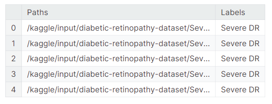
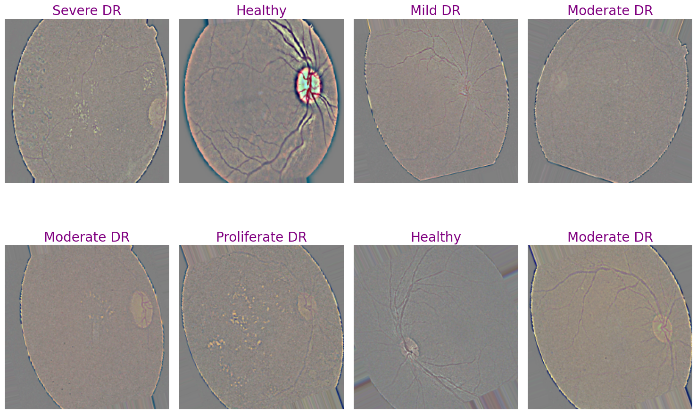
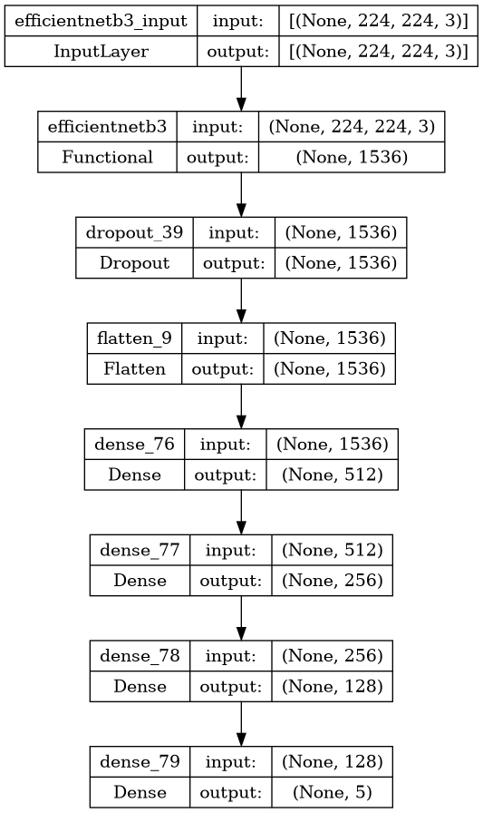
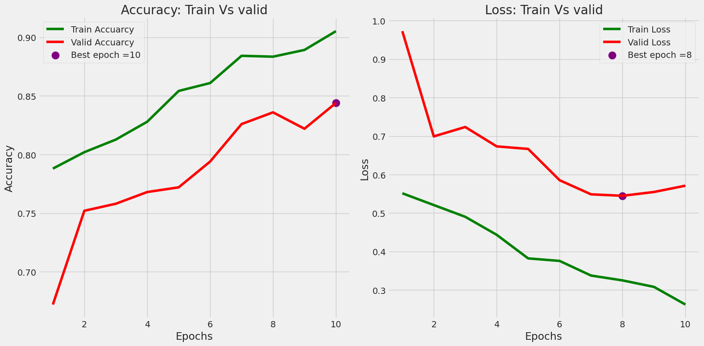
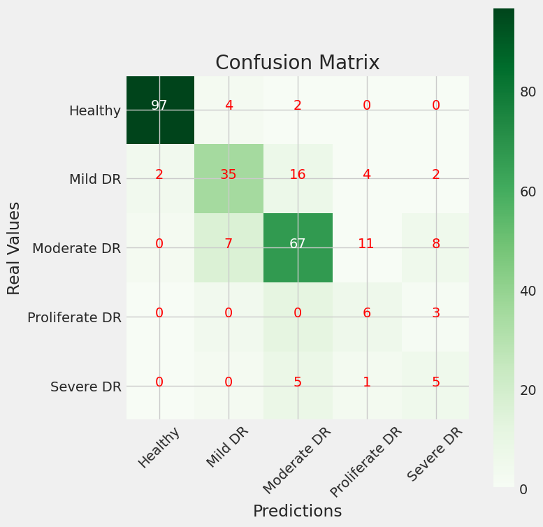

# [01Diabetic retinopathy Detection [CNN]]()

> 网址：[Diabetic retinopathy Detection [CNN]](https://www.kaggle.com/code/zahraaalaatageldein/diabetic-retinopathy-detection-cnn)

* 2023年发布(五个月前，也就是2023年12月)
* 2,469次浏览
* 47人认可
* 100次复现

## 0 About Dataset
Total Class Labels = 5

Total Images = 2750
1. Healthy (Not DR) = 1000
2. Mild DR = 370
3. Moderate DR = 900
4. Proliferative DR = 290
5. Severe DR = 190

DR: Diabetic Retinopathy


## 1 Import libraries

下面这段代码是一个Python脚本，主要用于图像处理、数据预处理和机器学习模型的构建，特别是用于深度学习中图像识别任务。

```python
# 安装最新版本的imbalanced-learn库，用于处理不平衡数据集问题
!pip install -U imbalanced-learn

# 导入Python标准库os模块，用于与操作系统交互，如文件和目录操作
import os
# 导入Python标准库shutil模块，用于文件操作，如文件复制和删除
import shutil
# 导入Python标准库pathlib模块，用于简化文件路径操作
import pathlib
# 导入Python图像处理库PIL，用于图像文件的读取和处理
import PIL
# 导入OpenCV库，用于更复杂的图像处理和计算机视觉任务
import cv2
# 导入time模块，用于获取时间或进行时间相关的操作
import time

# 导入NumPy库，用于高效的多维数组操作和数学运算
import numpy as np
# 导入Pandas库，用于数据分析和处理结构化数据
import pandas as pd
# 导入matplotlib的pyplot模块，用于数据可视化
import matplotlib.pyplot as plt
# 导入seaborn库，用于制作更高级的统计数据可视化
import seaborn as sns
# 设置seaborn的可视化风格为'whitegrid'，提供网格背景
sns.set_style('whitegrid')
# 导入random模块，用于生成随机数
import random
# 导入itertools模块，用于提供迭代器工具，如生成组合和排列
import itertools

# 导入TensorFlow库，用于构建和训练深度学习模型
import tensorflow as tf
# 从tensorflow库中导入keras模块，Keras是TensorFlow的高级API
from tensorflow import keras
# 从tensorflow.keras库中导入ImageDataGenerator类，用于图像数据增强
from tensorflow.keras.preprocessing.image import ImageDataGenerator
# 从tensorflow.keras.applications库中导入EfficientNetB3模型，一个高效的深度学习模型
from tensorflow.keras.applications import EfficientNetB3
# 从tensorflow.keras库中导入Model类，用于构建自定义模型
from tensorflow.keras import Model
# 从tensorflow.keras.models库中导入Sequential类，用于快速构建顺序模型
from tensorflow.keras.models import Sequential
# 从tensorflow.keras.layers库中导入InputLayer，用于定义模型的输入层
from tensorflow.keras.layers import InputLayer, BatchNormalization, Dropout, Conv2D, MaxPooling2D, Flatten, Dense, Activation
# 从tensorflow.keras库中导入优化器Adam和Adamax
from tensorflow .keras.optimizers import Adam, Adamax
# 从tensorflow.keras库中导入分类交叉熵损失函数categorical_crossentropy
from tensorflow.keras.metrics import categorical_crossentropy
# 从tensorflow.keras库中导入正则化器regularizers
from tensorflow.keras import regularizers
# 从tensorflow.keras.callbacks库中导入回调函数EarlyStopping、ModelCheckpoint和ReduceLROnPlateau
from tensorflow.keras.callbacks import EarlyStopping, ModelCheckpoint, ReduceLROnPlateau

# 从PIL库中导入Image类和UnidentifiedImageError异常，用于处理图像文件
from PIL import Image, UnidentifiedImageError

# 导入sklearn.preprocessing模块中的LabelEncoder类，用于标签编码
from sklearn.preprocessing import LabelEncoder
# 导入sklearn.model_selection模块中的train_test_split函数，用于数据集分割
from sklearn.model_selection import train_test_split
# 导入sklearn.metrics模块中的confusion_matrix和classification_report函数，用于模型评估
from sklearn.metrics import confusion_matrix, classification_report

# 导入warnings模块，用于控制警告信息的显示
import warnings
# 设置warnings的过滤级别为"ignore"，忽略所有的警告信息
warnings.filterwarnings("ignore")

# 导入logging模块，用于记录日志信息
import logging
# 获取tensorflow的日志记录器，并将其日志级别设置为ERROR，只记录错误信息
logging.getLogger("tensorflow").setLevel(logging.ERROR)

# 打印"All done"，表示代码块执行完毕
print("All done")
```

这段代码主要涉及机器学习和图像处理的库，为图像识别任务做准备，包括数据预处理、模型构建、训练和评估等步骤。注释提供了每个导入模块的用途，以及一些设置操作的解释。


### 结果展示：

```python
Requirement already satisfied: imbalanced-learn in /opt/conda/lib/python3.10/site-packages (0.11.0)
Requirement already satisfied: numpy>=1.17.3 in /opt/conda/lib/python3.10/site-packages (from imbalanced-learn) (1.24.3)
Requirement already satisfied: scipy>=1.5.0 in /opt/conda/lib/python3.10/site-packages (from imbalanced-learn) (1.11.3)
Requirement already satisfied: scikit-learn>=1.0.2 in /opt/conda/lib/python3.10/site-packages (from imbalanced-learn) (1.2.2)
Requirement already satisfied: joblib>=1.1.1 in /opt/conda/lib/python3.10/site-packages (from imbalanced-learn) (1.3.2)
Requirement already satisfied: threadpoolctl>=2.0.0 in /opt/conda/lib/python3.10/site-packages (from imbalanced-learn) (3.2.0)
All done
```

### 结果解释：
上述代码的输出结果表明，尝试使用`pip`命令安装或更新`imbalanced-learn`库的操作已经成功，但是并没有执行更新，因为该库已经安装在系统中，并且是满足要求的版本（0.11.0）。以下是输出结果的逐行解释：

```
Requirement already satisfied: imbalanced-learn in /opt/conda/lib/python3.10/site-packages (0.11.0)
```
这条信息表明`imbalanced-learn`库已经在指定的Python环境中安装，并且版本是0.11.0，这是最新的或者满足项目要求的版本。

接下来的几行信息列出了`imbalanced-learn`库的依赖项，以及它们当前的安装状态：

```
Requirement already satisfied: numpy>=1.17.3 in /opt/conda/lib/python3.10/site-packages (from imbalanced-learn) (1.24.3)
```
这表明`numpy`库已经安装，并且版本1.24.3满足`imbalanced-learn`所需的最低版本1.17.3。

```
Requirement already satisfied: scipy>=1.5.0 in /opt/conda/lib/python3.10/site-packages (from imbalanced-learn) (1.11.3)
```
这表明`scipy`库已经安装，并且版本1.11.3满足`imbalanced-learn`所需的最低版本1.5.0。

```
Requirement already satisfied: scikit-learn>=1.0.2 in /opt/conda/lib/python3.10/site-packages (from imbalanced-learn) (1.2.2)
```
这表明`scikit-learn`库已经安装，并且版本1.2.2满足`imbalanced-learn`所需的最低版本1.0.2。

```
Requirement already satisfied: joblib>=1.1.1 in /opt/conda/lib/python3.10/site-packages (from imbalanced-learn) (1.3.2)
```
这表明`joblib`库已经安装，并且版本1.3.2满足`imbalanced-learn`所需的最低版本1.1.1。

```
Requirement already satisfied: threadpoolctl>=2.0.0 in /opt/conda/lib/python3.10/site-packages (from imbalanced-learn) (3.2.0)
```
这表明`threadpoolctl`库已经安装，并且版本3.2.0满足`imbalanced-learn`所需的最低版本2.0.0。

最后，输出中的：

```
All done
```
是脚本中最后打印的一条信息，表示脚本执行完毕，没有发生错误。

综上所述，输出结果表明所有的库都已经安装就绪，无需进行更新，可以继续进行后续的数据处理和机器学习任务。


## 2 Read Data

### A- convert files to lists

下面这段代码是用于列出特定目录下所有文件的Python脚本。

```python
# 定义一个字符串变量Path_data，它包含了一个文件路径，这个路径指向存放糖尿病视网膜病变数据集的目录。
Path_data = '/kaggle/input/diabetic-retinopathy-dataset'

# 使用os模块的listdir函数列出Path_data指定目录下所有的文件和子目录的名称。
# 这些名称被存储在变量data中，data是一个字符串列表，包含了该目录下所有条目的名称。
data = os.listdir(Path_data)

# 使用os.listdir函数列出'Healthy'子目录下所有的文件和子目录的名称。
# 'Healthy'是一个子目录，存放了健康状态的图像数据。
Healthy = os.listdir('/kaggle/input/diabetic-retinopathy-dataset/Healthy')

# 使用os.listdir函数列出'Mild DR'子目录下所有的文件和子目录的名称。
# 'Mild DR'是一个子目录，存放了轻度糖尿病视网膜病变的图像数据。
Mild = os.listdir('/kaggle/input/diabetic-retinopathy-dataset/Mild DR')

# 使用os.listdir函数列出'Moderate DR'子目录下所有的文件和子目录的名称。
# 'Moderate DR'是一个子目录，存放了中度糖尿病视网膜病变的图像数据。
Moderate = os.listdir('/kaggle/input/diabetic-retinopathy-dataset/Moderate DR')

# 使用os.listdir函数列出'Proliferate DR'子目录下所有的文件和子目录的名称。
# 'Proliferate DR'是一个子目录，存放了增殖性糖尿病视网膜病变的图像数据。
Proliferate = os.listdir('/kaggle/input/diabetic-retinopathy-dataset/Proliferate DR')

# 使用os.listdir函数列出'Severe DR'子目录下所有的文件和子目录的名称。
# 'Severe DR'是一个子目录，存放了严重糖尿病视网膜病变的图像数据。
Severe = os.listdir('/kaggle/input/diabetic-retinopathy-dataset/Severe DR')
```

这段代码的目的是为后续的图像处理和机器学习任务准备数据，通过列出每个病变严重程度子目录中的文件，可以为加载和预处理图像数据提供必要的信息。这些子目录可能包含了图像文件的名称，这些名称可以用于后续的数据加载和分类任务。


下面这段代码用于打印出不同类别的图像数量，以及类别名称。以下是对每一行代码的详细中文注释：

```python
# 打印类别名称，并显示当前的数据集包含哪些类别。
# `data`变量包含了之前通过`os.listdir(Path_data)`获取的糖尿病视网膜病变数据集目录下所有的条目名称。
# 这些条目名称可能包括了不同的子目录，每个子目录代表一个病变严重程度的类别。
print("classes names :", data, "\n______________________________\n")

# 打印类别的数量，即数据集目录下所有条目的数量。
# `len(data)`函数计算`data`列表的长度，即条目的数量。
print("Number of classes :", len(data), "\n______________________________\n")

# 打印健康状态图像的数量。
# `Healthy`变量包含了'Healthy'子目录下所有的文件和子目录的名称。
# `len(Healthy)`函数计算`Healthy`列表的长度，即健康状态图像的数量。
print("Number of Healty images :", len(Healthy), "\n______________________________\n")

# 打印轻度糖尿病视网膜病变图像的数量。
# `Mild`变量包含了'Mild DR'子目录下所有的文件和子目录的名称。
# `len(Mild)`函数计算`Mild`列表的长度，即轻度病变图像的数量。
print("Number of Mild images :", len(Mild), "\n______________________________\n")

# 打印中度糖尿病视网膜病变图像的数量。
# `Moderate`变量包含了'Moderate DR'子目录下所有的文件和子目录的名称。
# `len(Moderate)`函数计算`Moderate`列表的长度，即中度病变图像的数量。
print("Number of Moderate images :", len(Moderate), "\n______________________________\n")

# 打印增殖性糖尿病视网膜病变图像的数量。
# `Proliferate`变量包含了'Proliferate DR'子目录下所有的文件和子目录的名称。
# `len(Proliferate)`函数计算`Proliferate`列表的长度，即增殖性病变图像的数量。
print("Number of Proliferate images :", len(Proliferate), "\n______________________________\n")

# 打印严重糖尿病视网膜病变图像的数量。
# `Severe`变量包含了'Severe DR'子目录下所有的文件和子目录的名称。
# `len(Severe)`函数计算`Severe`列表的长度，即严重病变图像的数量。
print("Number of severe images :", len(Severe), "\n______________________________\n")
```

这段代码的输出将提供数据集中各类别图像的数量，这对于理解数据集的分布和进行后续的数据平衡处理非常重要。注意，代码中有一处拼写错误："Healty"应该是"Healthy"。


#### 结果展示：

```python
classes names : ['Severe DR', 'Healthy', 'Moderate DR', 'Mild DR', 'Proliferate DR'] 
______________________________

Number of classes : 5 
______________________________

Number of Healty images : 1000 
______________________________

Number of Mild images : 370 
______________________________

Number of Moderate images : 900 
______________________________

Number of Proliferate images : 290 
______________________________

Number of severe images : 190 
______________________________
```

#### 结果解释：
上述代码的输出结果提供了关于糖尿病视网膜病变数据集中不同类别的名称和每个类别中图像数量的信息。以下是对输出结果的逐条解释：

1. `classes names : ['Severe DR', 'Healthy', 'Moderate DR', 'Mild DR', 'Proliferate DR']`
   - 这表明在数据集的根目录下存在5个子目录，每个子目录代表一个不同的病变严重程度类别。这些类别按照在`data`列表中的顺序排列，分别是严重、健康、中度、轻度和增殖性糖尿病视网膜病变。

2. `Number of classes : 5`
   - 这表示数据集包含5个不同的类别，这与上面列出的子目录数量一致。

3. `Number of Healty images : 1000`
   - 这里有一个拼写错误，应该是"Healthy"而不是"Healty"。这条信息表明在`Healthy`子目录中有1000张图像，代表没有糖尿病视网膜病变的健康状态。

4. `Number of Mild images : 370`
   - 这表示在`Mild DR`子目录中有370张图像，代表轻度糖尿病视网膜病变。

5. `Number of Moderate images : 900`
   - 这表示在`Moderate DR`子目录中有900张图像，代表中度糖尿病视网膜病变。

6. `Number of Proliferate images : 290`
   - 这条信息表明在`Proliferate DR`子目录中有290张图像，代表增殖性糖尿病视网膜病变。

7. `Number of severe images : 190`
   - 这表示在`Severe DR`子目录中有190张图像，代表严重的糖尿病视网膜病变。

输出结果还揭示了数据集中存在类别不平衡的问题，即不同类别的图像数量差异较大。例如，健康状态的图像数量最多，为1000张，而严重状态的图像数量最少，只有190张。这种不平衡在机器学习模型训练时需要特别注意，因为它可能影响模型的泛化能力，导致模型对于数量较少的类别识别能力较差。常用的处理方法包括重采样（过采样少数类或欠采样多数类）、生成合成样本或使用适当的评估指标。


As noticed above: data imbalanced

### B- Create a dataframe

这段代码用于处理图像数据集，具体地，它将图像文件的路径和对应的标签整合到一个Pandas DataFrame中。下面是对每一行代码的详细中文注释：

```python
# 定义变量Path_data，它包含了存放糖尿病视网膜病变数据集的目录的路径。
Path_data = '/kaggle/input/diabetic-retinopathy-dataset'

# 创建两个空列表，imgpaths用于存储图像文件的路径，labels用于存储对应图像的标签。
imgpaths = []
labels = []

# 使用os.listdir函数列出Path_data指定目录下所有的文件和子目录的名称，并将这些名称存储在变量data中。
data = os.listdir(Path_data)

# 遍历data列表中的每个条目，每个条目代表数据集中的一个类别的子目录。
for i in data:
    # 使用os.path.join函数将Path_data和子目录的名称i连接起来，形成子目录的完整路径，并赋值给变量classpath。
    classpath = os.path.join(Path_data, i)
    # 使用os.listdir函数列出子目录classpath下所有的文件，这些文件是图像文件，并将这些文件的名称存储在变量imglist中。
    imglist = os.listdir(classpath)
    
    # 遍历imglist列表中的每个图像文件名称。
    for img in imglist:
        # 使用os.path.join函数将子目录的路径classpath和当前遍历到的图像文件名称img连接起来，形成图像文件的完整路径，并赋值给变量imgpath。
        imgpath = os.path.join(classpath, img)
        
        # 将当前图像文件的完整路径添加到imgpaths列表中。
        imgpaths.append(imgpath)
        # 将当前图像文件所属的类别名称添加到labels列表中，这里类别名称就是子目录的名称i。
        labels.append(i)

# 使用Pandas的Series函数将imgpaths列表转换成一个Pandas Series对象，命名为'Paths'。
Paths = pd.Series(imgpaths, name='Paths')
# 使用Pandas的Series函数将labels列表转换成一个Pandas Series对象，命名为'Labels'。
Labels = pd.Series(labels, name='Labels')

# 使用Pandas的concat函数将Paths和Labels两个Series对象在列的方向（axis=1）上合并成一个DataFrame对象，命名为Df。
Df = pd.concat([Paths, Labels], axis=1)

# 调用Df的head(5)方法，显示这个DataFrame对象的前5行数据，以便快速查看DataFrame的前几条记录。
Df.head(5)
```

这段代码的目的是将图像数据集的组织结构转化为一个方便机器学习处理的格式，即一个包含图像路径和对应标签的DataFrame。这样的转换使得后续的数据处理和模型训练更加方便。





Diabetic retinopathy is a complication of diabetes and a leading cause of blindness. It occurs when diabetes damages the tiny blood vessels inside the retina, the light-sensitive tissue at the back of the eye. A healthy retina is necessary for good vision.
If you have diabetic retinopathy, at first you may notice no changes to your vision. But over time, diabetic retinopathy can get worse and cause vision loss. Diabetic retinopathy usually affects both eyes.

Diabetic Retinopathy has four stages:

* Mild Nonproliferative Retinopathy

At this earliest stage, microaneurysms occur. They are small areas of balloon-like swelling in the retina’s tiny blood vessels.

* Moderate Nonproliferative Retinopathy

As the disease progresses, some blood vessels that nourish the retina are blocked.

* Severe Nonproliferative Retinopathy

Many more blood vessels are blocked, depriving several areas of the retina with their blood supply. These areas of the retina send signals to the body to grow new blood vessels for nourishment.

* Proliferative Retinopathy

At this advanced stage, the signals sent by the retina for nourishment trigger the growth of new blood vessels. These new blood vessels are abnormal and fragile. They grow along the retina and along the surface of the clear, vitreous gel that fills the inside of the eye.

By themselves, these blood vessels do not cause symptoms or vision loss. However, they have thin, fragile walls. If they leak blood, severe vision loss and even blindness can result.

ref: https://petroueyecare.com/services/medical-eye-exams/diabetic-retinopathy/


## 3 Data Preptocessing

Oversampling techniques for classification problems.

1 Random oversampling

Random Oversampling involves supplementing the training data with multiple copies of some of the minority classes. Oversampling can be done more than once (2x, 3x, 5x, 10x, etc.) This is one of the earliest proposed methods, that is also proven to be robust.[3] Instead of duplicating every sample in the minority class, some of them may be randomly chosen with replacement.

2 Augmentation

Data augmentation in data analysis are techniques used to increase the amount of data by adding slightly modified copies of already existing data or newly created synthetic data from existing data. It acts as a regularizer and helps reduce overfitting when training a machine learning model.[8] (See: Data augmentation)

ref: https://en.wikipedia.org/wiki/Oversampling_and_undersampling_in_data_analysis#Oversampling_techniques_for_classification_problems

### A- Random Over sampling

more preferred with text data not with images

这段代码的目的是准备机器学习模型训练所需的输入特征（X）和标签（y），并且计算标签的分布情况。不过，代码被注释掉了，因此实际上并不会执行。

```python
# 使用Df.drop方法从DataFrame Df中删除列'Labels'，axis=1指定操作的是列而不是行。
# 这样操作后，剩下的列将构成新的DataFrame，这个新的DataFrame存储输入特征X，但不包含标签列。
# 由于这段代码被注释掉了，所以实际上X不会被创建。
X = Df.drop(['Labels'], axis=1)

# 从DataFrame Df中选择列'Labels'，将其赋值给变量y。
# y是一个Series对象，包含了Df中'Labels'列的所有数据，即所有的标签。
# 同样，由于这段代码被注释掉了，所以实际上y也不会被创建。
y = Df['Labels']

# 调用y的value_counts方法计算各个标签的出现次数，并按照降序排列。
# 这可以帮助我们了解数据集中每个类别的样本数量，从而判断是否存在类别不平衡的问题。
# 由于这段代码被注释掉了，所以实际上这个计数不会被执行。
y.value_counts()
```

如果取消注释这些代码行，它们将执行以下操作：

1. 从包含图像路径和标签的DataFrame `Df` 中移除标签列，创建一个新的DataFrame `X`，它将作为模型的输入特征。
2. 从 `Df` 中提取标签列，创建一个名为 `y` 的Series，它将作为模型的目标变量。
3. 使用 `value_counts()` 方法对 `y` 中的标签进行计数，得到每个类别的样本数量。

这些步骤是在机器学习中常见的数据预处理环节，用于准备数据以供模型训练使用。


下面这段代码使用了`imbalanced-learn`库中的`RandomOverSampler`类来处理数据集中的不平衡问题，并通过图形展示了过采样后标签的分布情况。

```python
# 导入imbalanced-learn库中的RandomOverSampler类。
# RandomOverSampler是一种过采样方法，用于增加少数类别的样本数量，以减少类别间的不平衡。
# 由于这段代码被注释掉了，所以实际上RandomOverSampler类不会被导入。
from imblearn.over_sampling import RandomOverSampler

# 创建RandomOverSampler类的实例ros，设置sampling_strategy参数。
# sampling_strategy='not majority'意味着对于每个类别，将随机选择的样本数量增加到与多数类（样本数量最多的类别）相同。
# 由于这段代码被注释掉了，所以实际上ros实例不会被创建。
ros = RandomOverSampler(sampling_strategy='not majority')

# 另一种设置sampling_strategy的方法是使用数值。这里的1意味着将少数类别的样本数量增加到与整个数据集中的多数类别相同。
# 由于这段代码被注释掉了，所以实际上ros实例不会被以这种方式创建。
ros = RandomOverSampler(sampling_strategy=1)

# 使用ros实例的fit_resample方法对X和y进行过采样。
# fit_resample方法会根据ros的配置调整X和y中的样本数量，使之更加平衡，并返回新的X和y。
# 由于这段代码被注释掉了，所以实际上x_ros和y_ros不会被创建。
x_ros, y_ros = ros.fit_resample(X, y)

# 使用matplotlib库的plot方法绘制y_ros的value_counts结果的饼图。
# autopct='%.2f'参数表示自动格式化饼图的标签，显示每个部分的百分比，保留两位小数。
# 由于这段代码被注释掉了，所以实际上饼图不会被绘制。
ax = y_ros.value_counts().plot.pie(autopct='%.2f')

# 使用ax的set_title方法设置饼图的标题为'over-sampling'。
# _= 用于将set_title方法的结果赋值给变量_，这是因为set_title方法没有返回值，而赋值给_可以避免潜在的警告信息。
# 由于这段代码被注释掉了，所以实际上标题不会被设置。
_ = ax.set_title('over-sampling')
```

如果取消注释这些代码行，它们将执行以下操作：

1. 导入`RandomOverSampler`类。
2. 创建`RandomOverSampler`实例，并设置过采样策略。
3. 对特征集`X`和标签集`y`进行过采样，以平衡数据集中的类别。
4. 绘制过采样后标签分布的饼图，并设置图表标题。

这些步骤是在机器学习中处理不平衡数据集的常见方法，有助于提高模型对于少数类别的识别能力。

### B- Split data into train, valid, test

下面这段代码使用了`sklearn.model_selection`模块中的`train_test_split`函数来将原始数据集`Df`分割为训练集、验证集和测试集，并打印了它们的尺寸以及训练集标签的分布。以下是对每一行代码的详细中文注释：

```python
# 使用train_test_split函数将原始数据集Df分割为训练集和临时测试集testval。
# test_size=0.2表示临时测试集占原始数据集的20%。
# shuffle=True表示在分割数据集时打乱数据。
# random_state=123设置随机数种子，以确保每次分割的结果都是相同的，增加可复现性。
train, testval = train_test_split(Df, test_size=0.2, shuffle=True, random_state=123)

# 再次使用train_test_split函数将临时测试集testval分割为验证集valid和最终的测试集test。
# test_size=0.5表示从临时测试集中进一步分割出50%作为最终测试集，剩下的50%作为验证集。
# shuffle=True同样表示在分割数据集时打乱数据。
# random_state=123保持随机数种子不变，以确保分割结果的一致性。
valid, test = train_test_split(testval, test_size=0.5, shuffle=True, random_state=123)

# 打印训练集train的尺寸，即包含多少行数据。
# 尺寸信息有助于了解数据集的分布情况。
print("Train shape: ", train.shape)

# 打印验证集valid的尺寸。
print("Valid shape: ", valid.shape)

# 打印测试集test的尺寸。
print("Test shape:", test.shape)

# 使用value_counts方法计算训练集中标签的分布，并打印结果。
# 这有助于了解训练集中各类别样本的数量，评估是否存在类别不平衡问题。
train.Labels.value_counts()
```

这段代码的执行结果将展示出数据集被分割后，训练集、验证集和测试集各自的行数，以及训练集中各类别标签的数目。通常，一个良好的机器学习实践包括将数据集分为这三个部分：训练集用于模型训练，验证集用于模型超参数的调整，测试集用于最终评估模型性能。此外，通过打印标签的分布，可以判断是否需要采取一些策略来处理不平衡数据集问题。


#### 结果展示：

```python
Train shape:  (2200, 2)
Valid shape:  (275, 2)
Test shape:  (275, 2)
```

```python
Labels
Healthy           796
Moderate DR       724
Mild DR           290
Proliferate DR    236
Severe DR         154
Name: count, dtype: int64
```

#### 结果解释：
上述代码的输出结果提供了关于数据集分割和训练集标签分布的详细信息。以下是对输出结果的逐条解释：

1. `Train shape:  (2200, 2)`
   - 这表示训练集（train）包含2200行数据，每行有2个特征（在这个上下文中，是图像路径和标签）。

2. `Valid shape:  (275, 2)`
   - 这表示验证集（valid）包含275行数据，每行同样包含2个特征。

3. `Test shape:  (275, 2)`
   - 这表示测试集（test）也包含275行数据，每行包含2个特征。

4. `Labels`
   - 这部分输出显示了训练集中不同标签的计数（即每个类别的样本数量）：
     - `Healthy`: 796个样本，代表健康状态，没有糖尿病视网膜病变。
     - `Moderate DR`: 724个样本，代表中度糖尿病视网膜病变。
     - `Mild DR`: 290个样本，代表轻度糖尿病视网膜病变。
     - `Proliferate DR`: 236个样本，代表增殖性糖尿病视网膜病变。
     - `Severe DR`: 154个样本，代表严重糖尿病视网膜病变。

`Name: count, dtype: int64`
   - 这表示输出的是一个计数（count），数据类型是整型（int64）。

从这些信息中，我们可以得出以下几点结论：

- 数据集已经被成功分割为训练集、验证集和测试集，且每个集合的尺寸已经通过`print`语句展示出来。
- 训练集是最大的数据集，用于训练模型；验证集和测试集尺寸相同，用于模型的评估和超参数的调整。
- 训练集中的标签分布是不均匀的，"Healthy"类别的样本数量最多，而"Severe DR"类别的样本数量最少。这种不平衡可能会影响模型对于少数类别的识别能力，可能需要采取一些策略来解决这个问题，例如过采样少数类别或使用不同的性能评估指标。


### C- Data Augmentation

下面这段代码是用于创建图像数据生成器（ImageDataGenerator），并使用这些生成器从DataFrame中读取图像数据，为模型训练和测试准备数据。

```python
# 定义batch_size为20，这意味着每次训练时将使用20张图像。
# 较小的batch_size可以在数据较少的情况下生成更多的数据迭代，有助于提高模型的训练效果。
batch_size = 20  

# 定义img_size为(224, 224)，这是图像处理中常用的标准尺寸。
img_size = (224, 224)

# 定义channels为3，表示图像是三通道的彩色图像（RGB）。
channels = 3

# 定义img_shape，这是一个三维元组，表示图像的高度、宽度和通道数。
img_shape = (img_size[0], img_size[1], channels)

# 创建训练数据的ImageDataGenerator实例tr_G。
# zca_whitening=True：启用ZCA白化，这是一种数据增强技术，可以改善学习过程。
# rotation_range=30.：随机旋转图像的范围，单位是度，这里设置为0到30度。
# fill_mode='nearest'：定义在图像尺寸改变时填充空白的方法，这里使用最近邻插值。
tr_G = ImageDataGenerator(
    zca_whitening=True,
    rotation_range=30.,
    fill_mode='nearest',
)

# 创建验证数据的ImageDataGenerator实例V_G，没有启用任何数据增强。
V_G = ImageDataGenerator()

# 创建测试数据的ImageDataGenerator实例t_G，同样没有启用任何数据增强。
t_G = ImageDataGenerator()

# 使用训练数据生成器tr_G的flow_from_dataframe方法生成训练数据。
# flow_from_dataframe方法从DataFrame对象train中读取数据，x_col='Paths'指定图像路径的列，y_col='Labels'指定标签的列。
# target_size=img_size定义了输出图像的目标尺寸。
# class_mode='categorical'定义了标签的处理方式，这里使用独热编码。
# color_mode='rgb'指定图像的颜色模式为RGB。
# shuffle=True表示在生成数据时打乱数据。
# batch_size=batch_size定义了每次生成的图像数量。
Train = tr_G.flow_from_dataframe(train, x_col='Paths', y_col='Labels', target_size=img_size, class_mode='categorical', color_mode='rgb', shuffle=True, batch_size=batch_size)

# 使用验证数据生成器V_G的flow_from_dataframe方法生成验证数据，参数设置与训练数据类似。
Valid = V_G.flow_from_dataframe(valid, x_col='Paths', y_col='Labels', target_size=img_size, class_mode='categorical', color_mode='rgb', shuffle=True, batch_size=batch_size)

# 使用测试数据生成器t_G的flow_from_dataframe方法生成测试数据，参数设置与验证数据类似，但shuffle=False，表示不打乱数据。
Test = t_G.flow_from_dataframe(test, x_col='Paths', y_col='Labels', target_size=img_size, class_mode='categorical', color_mode='rgb', shuffle=False, batch_size=batch_size)
```

这段代码通过使用`ImageDataGenerator`和`flow_from_dataframe`方法，为模型训练和评估准备了一个连续的数据流。这使得模型训练时可以自动从磁盘上读取图像数据，而不需要一次性将所有图像加载到内存中，从而有效管理内存使用，并且可以实时应用数据增强。


#### 结果展示：

```python
Found 2200 validated image filenames belonging to 5 classes.
Found 275 validated image filenames belonging to 5 classes.
Found 275 validated image filenames belonging to 5 classes.
```

#### 结果解释：
上述代码的输出结果表明，使用`flow_from_dataframe`方法成功地从训练集（train）、验证集（valid）和测试集（test）的DataFrame中加载了图像文件，并为每个集合中的图像文件进行了分类。以下是对输出结果的逐条解释：

1. `Found 2200 validated image filenames belonging to 5 classes.`
   - 这表示在训练集（Train）中找到了2200个有效的图像文件名，这些图像文件名属于5个不同的类别。这与之前提到的训练集尺寸相符。

2. `Found 275 validated image filenames belonging to 5 classes.`
   - 这表示在验证集（Valid）中找到了275个有效的图像文件名，这些图像同样被归类到5个类别中。这与验证集的尺寸相符。

3. `Found 275 validated image filenames belonging to 5 classes.`
   - 这表示在测试集（Test）中也找到了275个有效的图像文件名，它们同样被分为5个类别。这也与测试集的尺寸相符。

这些输出结果告诉我们以下几点信息：

- `flow_from_dataframe`方法已经成功地读取了指定DataFrame中的图像路径，并将对应的图像文件加载到内存中。
- 每个数据集（训练集、验证集、测试集）都包含了预期数量的图像文件，且每个数据集中的图像被正确地分为5个类别。
- “validated”意味着图像文件名是有效的，并且能够被正确地找到和读取成图像数据。
- 这些图像数据现在可以通过生成器（`Train`, `Valid`, `Test`）以指定的`batch_size`进行迭代，用于训练和评估深度学习模型。

这些生成器现在可以被用于深度学习模型的训练过程中，通过调用模型的`fit`或`fit_generator`方法来迭代这些数据集。使用生成器的好处是可以在每次迭代中实时地应用数据增强，并且可以有效地管理内存使用，因为不需要一次性将所有图像加载到内存中。


### D- Represent a sample

下面这段代码用于定义标签与其索引的映射关系，获取标签列表，从训练数据生成器中获取一批样本数据，并可视化这些图像及其对应的标签。

```python
# 定义一个字典L_index，它将类别标签映射到它们在模型中的索引。
# Train.class_indices获取由ImageDataGenerator生成的Train对象中所有类别标签与其索引的映射。
L_index = Train.class_indices

# 打印L_index，查看类别标签与索引的对应关系。
L_index

# 将L_index字典的键（即类别标签）转换成一个列表Keys。
# 这个列表将用于标签的可视化展示。
Keys = list(L_index.keys())

# 打印Keys，查看所有类别标签的列表。
Keys

# 使用next函数从Train生成器中获取一批样本数据。
# imgs是一个包含图像数据的numpy数组，labels是对应的标签数组。
imgs, labels = next(Train)

# 使用matplotlib的pyplot模块创建一个15x15英寸大小的图形。
plt.figure(figsize=(15, 15))

# 循环8次，用于在一个图形窗口中展示8张图像。
for i in range(8):
    # 设置子图的布局为3行4列，编号从1开始。
    plt.subplot(3, 4, i + 1)
    # 将图像数据缩放到0-1范围内，因为原始图像数据的像素值范围通常是0-255。
    im = imgs[i] / 255
    # 显示图像。
    plt.imshow(im)
    # 计算当前标签数组中概率最高的标签索引。
    index = np.argmax(labels[i])
    # 使用索引在Keys列表中找到对应的标签。
    label = Keys[index]
    # 设置子图的标题为当前的标签，颜色为紫色。
    plt.title(label, color='purple')
    # 关闭坐标轴显示。
    plt.axis('off')

# 自动调整子图布局以适应图形窗口。
plt.tight_layout()

# 显示图形。
plt.show()
```

这段代码首先设置了类别标签与索引的映射，并获取了所有类别标签的列表。然后，它从训练数据生成器中取出一批图像和对应的标签，并使用`matplotlib`库将这批图像及其预测标签进行可视化展示。这样的可视化有助于直观地了解数据集的内容以及模型预测的结果。




## 4 Modelling

### A- Create a model using transfer learning with EfficientNetB2

* NOTE "experts advise you make the base model initially not trainable. Then train for some number of epochs

then fine tune model by making base model trainable and run more epochs
It was found to be WRONG!!!!
Making the base model trainable from the outset leads to faster convegence and a lower validation loss
for the same number of total epochs!"
as mentioned at: https://www.kaggle.com/code/devanshajmera/chair

--> I will be using EfficientNetB3 model with weights from imagenet.

And I will using include_top=False option since it allows me to add my own output layer.


下面这段代码是用于定义一个深度学习模型，该模型基于预训练的EfficientNetB3作为基础模型，并在其上添加自定义的全连接层。

```python
# 定义类别的数量n_classes，它等于训练数据生成器Train中类别标签的数量。
n_classes = len(list(Train.class_indices.keys()))
# 打印n_classes，查看类别的数量。
n_classes

# 定义图像的形状img_shape，包括高度、宽度和颜色通道数。
img_shape = (img_size[0], img_size[1], 3)

# 定义模型名称为'EfficientNetB3'。
model_name = 'EfficientNetB3'

# 创建EfficientNetB3模型的实例base_model，不包括顶层（即不包括最后的全连接层），使用ImageNet的预训练权重。
# input_shape设置为img_shape，即输入图像的形状。
# pooling设置为'max'，表示使用最大池化作为顶层的替代。
base_model = EfficientNetB3(include_top=False, weights="imagenet", input_shape=img_shape, pooling='max')

# 通常的建议是初始时不让基础模型的权重可训练，但这是错误的。让基础模型的权重可训练可以获得更好的结果。
base_model.trainable = True

# 获取基础模型的输出作为下一个全连接层的输入。
x = base_model.output

# 添加批量归一化层，有助于提高模型的训练稳定性和性能。
x = BatchNormalization(axis=-1, momentum=0.999, epsilon=0.001)(x)

# 添加一个具有1024个单元的全连接层，使用L2和L1正则化，激活函数为ReLU。
x = Dense(1024, kernel_regularizer=regularizers.l2(l=0.01),
          activity_regularizer=regularizers.l1(0.005),
          bias_regularizer=regularizers.l1(0.005),
          activation='relu')(x)

# 添加一个Dropout层，rate=0.2，随机丢弃20%的神经元输出，用于防止过拟合。
x = Dropout(rate=.2, seed=123)(x)

# 添加另一个具有512个单元的全连接层，同样使用L2和L1正则化，激活函数为ReLU。
x = Dense(512, kernel_regularizer=regularizers.l2(l=0.01),
          activity_regularizer=regularizers.l1(0.005),
          bias_regularizer=regularizers.l1(0.005),
          activation='relu')(x)

# 添加一个Dropout层，rate=0.3，随机丢弃30%的神经元输出。
x = Dropout(rate=.3, seed=123)(x)

# 添加另一个具有256个单元的全连接层，同样使用L2和L1正则化，激活函数为ReLU。
x = Dense(256, kernel_regularizer=regularizers.l2(l=0.01),
          activity_regularizer=regularizers.l1(0.005),
          bias_regularizer=regularizers.l1(0.005),
          activation='relu')(x)

# 添加一个Dropout层，rate=0.4，随机丢弃40%的神经元输出。
x = Dropout(rate=.4, seed=123)(x)

# 添加模型的输出层，使用n_classes分类的softmax激活函数。
output = Dense(n_classes, activation='softmax')(x)

# 创建一个Model对象，将基础模型的输入和自定义层的输出作为模型的输入和输出。
model = Model(inputs=base_model.input, outputs=output)

# 定义初始学习率lr为0.0001。
lr = .0001
```

这段代码通过使用预训练的EfficientNetB3模型作为特征提取器，并在其上添加了自定义的全连接层和正则化层，构建了一个完整的深度学习模型。模型的权重是可训练的，这意味着在训练过程中，基础模型的权重也会被更新。此外，模型使用了批量归一化、Dropout和正则化技术来提高泛化能力和防止过拟合。最后，代码定义了一个初始学习率，这将用于模型的训练过程中。


下面这段代码使用Keras的`Sequential`模型类来构建一个顺序模型，该模型在预训练的EfficientNetB3模型的基础上添加了额外的全连接层。以下是对每一行代码的详细中文注释：

```python
# 创建Sequential模型的实例，Sequential是Keras中用于构建顺序（逐层堆叠）模型的类。
model = Sequential()

# 将预训练的EfficientNetB3模型base_model添加到Sequential模型中。
# 注意，这里的base_model应该是已经预训练好的模型，不包括顶部的全连接层（分类层）。
model.add(base_model)

# 添加一个Dropout层，丢弃率为0.3，这意味着在训练过程中，有30%的概率将某些神经元的输出设置为零，以减少过拟合。
model.add(Dropout(0.3))

# 添加一个Flatten层，该层将base_model的输出展平成一维数组，以便后续的全连接层可以处理。
model.add(Flatten())

# 添加第一个全连接层，具有512个单元，使用'elu'激活函数。
model.add(Dense(512, activation='elu'))

# 添加第二个全连接层，具有256个单元，同样使用'elu'激活函数。
model.add(Dense(256, activation='elu'))

# 添加第三个全连接层，具有128个单元，也使用'elu'激活函数。
model.add(Dense(128, activation='elu'))

# 添加输出层，由于是分类问题，所以使用具有5个单元的全连接层，并使用'softmax'激活函数，以便输出一个概率分布。
# 这里的5对应于之前确定的类别数n_classes。
model.add(Dense(5, activation='softmax'))
```

这段代码构建了一个用于图像分类的深度学习模型。它以EfficientNetB3作为特征提取器，然后通过一系列的全连接层逐步减少特征维度，最后输出一个概率分布，表示图像属于每个类别的概率。模型中使用ELU激活函数在全连接层中引入非线性，而输出层的Softmax激活函数则用于将输出转换为概率分布。此外，Dropout层有助于减少全连接层过拟合的风险。


下面这段代码使用Keras的`compile`方法来配置模型的训练参数，包括优化器、损失函数和评估指标。

```python
# 调用模型的compile方法来编译（配置）模型。
model.compile(
    # 定义优化器为Adamax，设置学习率为0.0001。
    # Adamax是一种自适应学习率优化算法，适用于大型深度学习网络的训练。
    optimizer=Adamax(learning_rate=0.0001),
    
    # 定义损失函数为categorical_crossentropy。
    # categorical_crossentropy是多分类问题常用的损失函数，适用于模型输出为概率分布的情况。
    loss='categorical_crossentropy',
    
    # 定义评估指标为准确率（'acc'）。
    # 准确率是最常用的评估指标之一，表示模型正确分类的样本数占总样本数的比例。
    metrics=['acc']
)
```

在这段代码中：

- `Adamax`作为优化器，是一种改进的梯度下降算法，它在每次更新时使用不同的学习率，旨在更快收敛并记住之前的梯度信息。
- `learning_rate=0.0001`设置了优化器的学习率，这是一个超参数，决定了每次权重更新的幅度。较小的学习率通常用于防止过拟合，但可能需要更多的迭代次数来收敛。
- `loss='categorical_crossentropy'`指定了损失函数，这是衡量模型预测与实际标签之间差异的指标。对于具有固定数量类别的多分类问题，`categorical_crossentropy`是合适的选择。
- `metrics=['acc']`定义了训练过程中要跟踪的评估指标，这里是准确率，表示正确预测的样本数占总样本数的比例。

编译模型是模型训练前的重要步骤，它确定了模型训练时使用的优化器、损失函数和评估指标，这些超参数的选择对模型性能有重要影响。


下面这行代码用于打印出当前构建的深度学习模型的详细摘要信息，包括每一层的名称、输出尺寸、参数数量等。以下是对这行代码的详细中文注释：

```python
# 调用模型对象model的summary方法。
# summary方法会打印出模型的详细结构，包括：
# - 每一层的名称（Layer (type)）
# - 该层的详细配置，如过滤器数量、池化大小等（Shape - (output shape)）
# - 该层的参数数量（Params - (number of parameters)）
# - 模型总的参数数量
# 这个摘要信息有助于理解模型的复杂度和结构，以及进行性能分析和调优。
model.summary()
```

执行`model.summary()`后，输出将展示模型的层级结构，每层的输出维度，以及每层的参数数量。这有助于开发者了解模型的规模和可能的过拟合风险。例如，参数数量特别多的层可能是导致过拟合的来源，或者如果某些层的输出维度异常大或小，可能表明数据流中存在问题。

此外，`summary`方法的输出还会显示模型的输入形状和输出形状，以及是否有可训练的参数。这对于调试模型配置问题也非常有用。


#### 结果展示：

```python
Model: "sequential_9"
_________________________________________________________________
 Layer (type)                Output Shape              Param #   
=================================================================
 efficientnetb3 (Functional  (None, 1536)              10783535  
 )                                                               
                                                                 
 dropout_39 (Dropout)        (None, 1536)              0         
                                                                 
 flatten_9 (Flatten)         (None, 1536)              0         
                                                                 
 dense_76 (Dense)            (None, 512)               786944    
                                                                 
 dense_77 (Dense)            (None, 256)               131328    
                                                                 
 dense_78 (Dense)            (None, 128)               32896     
                                                                 
 dense_79 (Dense)            (None, 5)                 645       
                                                                 
=================================================================
Total params: 11735348 (44.77 MB)
Trainable params: 11648045 (44.43 MB)
Non-trainable params: 87303 (341.03 KB)
_________________________________________________________________
```

#### 结果解释：
上述代码的输出结果是模型的摘要信息，它详细列出了模型中每一层的类型、输出形状、参数数量，以及模型的总参数数量。以下是对输出结果的逐条解释：

1. `Model: "sequential_9"`
   - 这表示模型的名称是"sequential_9"，这是Keras自动生成的模型名。

2. `_________________________________________________________________`
   - 这是分隔符，用于视觉上区分模型的不同部分。

3. `Layer (type)                Output Shape              Param #`
   - 这是表头，分别表示层的类型、输出形状和参数数量。

4. `efficientnetb3 (Functional  (None, 1536)              10783535`
   - 这是EfficientNetB3模型层，其输出形状是`(None, 1536)`，表示该层输出的特征向量维度是1536。
   - 参数数量是10783535，这是预训练的EfficientNetB3模型的参数数量。

5. `dropout_39 (Dropout)        (None, 1536)              0`
   - 这是Dropout层，用于随机丢弃一部分输入信号，以减少过拟合。
   - 输出形状与输入形状相同，即`(None, 1536)`，参数数量为0，因为Dropout层没有可训练的参数。

6. `flatten_9 (Flatten)         (None, 1536)              0`
   - 这是Flatten层，用于将多维输入一维化，即把二维特征图展平成一维特征向量。
   - 输出形状是`(None, 1536)`，参数数量为0，因为Flatten层没有可训练的参数。

7. `dense_76 (Dense)            (None, 512)               786944`
   - 这是第一个全连接层（Dense），输出形状是`(None, 512)`，表示该层输出的特征向量维度是512。
   - 参数数量是786944，这是该层的权重和偏置参数的总和。

8. `dense_77 (Dense)            (None, 256)               131328`
   - 这是第二个全连接层，输出形状是`(None, 256)`，参数数量是131328。

9. `dense_78 (Dense)            (None, 128)               32896`
   - 这是第三个全连接层，输出形状是`(None, 128)`，参数数量是32896。

10. `dense_79 (Dense)            (None, 5)                 645`
    - 这是输出层，输出形状是`(None, 5)`，表示模型的输出是5个类别的概率分布。
    - 参数数量是645，这是输出层的权重和偏置参数的总和。

11. `=================================================================`
    - 这是分隔符，用于视觉上区分模型的总参数统计信息。

12. `Total params: 11735348 (44.77 MB)`
    - 这表示模型的总参数数量是11,735,348，总共占用大约44.77MB的内存。

13. `Trainable params: 11648045 (44.43 MB)`
    - 这表示有11,648,045个参数是可训练的，占用大约44.43MB的内存。

14. `Non-trainable params: 87303 (341.03 KB)`
    - 这表示有87,303个参数是不可训练的，通常是因为这些参数来自于预训练模型且被固定了，占用大约341.03KB的内存。

这个摘要信息提供了模型的完整概览，包括每一层的配置和模型的总体大小。这有助于理解模型的复杂度，评估其对计算资源的需求，并根据需要进行调整。


### B- Visualize model layers

这段代码用于将Keras模型的架构可视化，并展示在一个IPython环境中。以下是对每一行代码的详细中文注释：

```python
# 从tensorflow.keras.utils模块导入plot_model函数。
# plot_model是一个用于绘制Keras模型架构的函数。
from tensorflow.keras.utils import plot_model

# 从IPython.display模块导入Image类。
# IPython.display用于在Jupyter笔记本等IPython环境中展示图像、HTML等内容。
from IPython.display import Image

# 使用plot_model函数绘制模型的架构，并将其保存到名为'convnet.png'的文件中。
# to_file='convnet.png'指定了输出图像文件的名称。
# show_shapes=True表示在模型的每层旁边显示输出形状。
# show_layer_names=True表示在模型的每层旁边显示层的名称。
plot_model(model, to_file='convnet.png', show_shapes=True, show_layer_names=True)

# 使用Image类加载并展示'convnet.png'文件中的图像。
# 这会在IPython环境中直接显示模型架构的可视化图形。
Image(filename='convnet.png')
```

这段代码首先导入了绘制模型和展示图像所需的库，然后使用`plot_model`函数生成了模型的架构图，并将其保存到了一个PNG文件中。最后，通过`Image`类在IPython环境中展示了这个图像文件，使得用户可以直观地查看模型的每一层以及它们的输出形状和层名称。

这种可视化对于理解和交流模型的结构非常有用，特别是在模型较为复杂时，能够帮助快速把握模型的总体架构。





### C- Training phase


下面这段代码用于训练深度学习模型，并通过`fit`方法在训练过程中同时对验证集进行评估。以下是对每一行代码的详细中文注释：

```python
# 定义训练的轮数，即epochs，这里设置为50轮。
epochs = 50

# 使用model.fit方法开始训练模型。
# x=Train指定了训练数据生成器，它将按batch_size提供图像数据和标签。
# epochs=epochs设置了训练的轮数，即整个训练集将被遍历50次。
# verbose=1表示训练过程中将显示输出信息，如果设置为0，则不会显示任何信息。
# validation_data=Valid指定了验证数据生成器，用于在每个epoch后评估模型性能。
# validation_steps=None表示验证集的步数将基于验证集中的样本数和batch_size自动计算。
# shuffle=False指示在训练过程中不打乱数据，由于数据生成器已经保证了每个epoch开始前数据的随机性，这里设置为False。
history = model.fit(
    x=Train,
    epochs=epochs,
    verbose=1,
    validation_data=Valid,
    validation_steps=None,
    shuffle=False
)
```

在这段代码中：

- `epochs`变量定义了训练的总轮数，每轮训练都会遍历一次完整的训练集。
- `model.fit`是Keras中用于训练模型的方法，它接受训练数据和一系列参数来配置训练过程。
- `verbose=1`参数控制训练过程中的输出信息，1表示显示进度条和简要信息，2表示显示每步的详细信息。
- `validation_data`参数指定了用于验证的数据，模型将在每个epoch结束后在这部分数据上评估并打印性能指标。
- `validation_steps`参数在这种使用数据生成器的情况下通常是None，Keras会自动计算需要多少步来遍历整个验证集。
- `shuffle=False`参数在这里设置为False，因为在`ImageDataGenerator`中已经设置了`shuffle=True`，这保证了每个epoch开始时数据都是随机的。

执行这段代码后，`history`对象将包含训练过程中的所有信息，包括每个epoch的训练和验证损失、准确率等，这些信息可以用于后续的模型分析和性能评估。


#### 结果展示：

```python
Epoch 1/50
2023-11-28 20:48:18.202652: E tensorflow/core/grappler/optimizers/meta_optimizer.cc:954] layout failed: INVALID_ARGUMENT: Size of values 0 does not match size of permutation 4 @ fanin shape insequential_9/efficientnetb3/block1b_drop/dropout/SelectV2-2-TransposeNHWCToNCHW-LayoutOptimizer
110/110 [==============================] - 87s 300ms/step - loss: 1.7068 - acc: 0.4900 - val_loss: 1.5328 - val_acc: 0.4655
Epoch 2/50
110/110 [==============================] - 30s 274ms/step - loss: 1.2487 - acc: 0.5636 - val_loss: 0.9812 - val_acc: 0.6291
Epoch 3/50
110/110 [==============================] - 30s 269ms/step - loss: 1.1481 - acc: 0.5850 - val_loss: 0.8741 - val_acc: 0.6691
Epoch 4/50
110/110 [==============================] - 30s 266ms/step - loss: 1.0202 - acc: 0.6150 - val_loss: 0.8269 - val_acc: 0.7164
Epoch 5/50
110/110 [==============================] - 30s 273ms/step - loss: 0.9577 - acc: 0.6359 - val_loss: 0.7892 - val_acc: 0.7273
Epoch 6/50
110/110 [==============================] - 30s 274ms/step - loss: 0.9079 - acc: 0.6605 - val_loss: 0.7603 - val_acc: 0.7164
Epoch 7/50
110/110 [==============================] - 30s 271ms/step - loss: 0.8693 - acc: 0.6636 - val_loss: 0.7449 - val_acc: 0.7309
Epoch 8/50
110/110 [==============================] - 30s 273ms/step - loss: 0.8152 - acc: 0.6968 - val_loss: 0.7380 - val_acc: 0.7418
Epoch 9/50
110/110 [==============================] - 31s 276ms/step - loss: 0.7916 - acc: 0.6932 - val_loss: 0.7688 - val_acc: 0.7382
Epoch 10/50
110/110 [==============================] - 31s 279ms/step - loss: 0.7570 - acc: 0.7100 - val_loss: 0.7373 - val_acc: 0.7382
Epoch 11/50
110/110 [==============================] - 30s 274ms/step - loss: 0.7457 - acc: 0.7145 - val_loss: 0.7427 - val_acc: 0.7382
Epoch 12/50
110/110 [==============================] - 30s 273ms/step - loss: 0.7327 - acc: 0.7100 - val_loss: 0.7139 - val_acc: 0.7309
Epoch 13/50
110/110 [==============================] - 31s 276ms/step - loss: 0.7040 - acc: 0.7214 - val_loss: 0.7359 - val_acc: 0.7418
Epoch 14/50
110/110 [==============================] - 30s 275ms/step - loss: 0.6682 - acc: 0.7427 - val_loss: 0.7563 - val_acc: 0.7418
Epoch 15/50
110/110 [==============================] - 30s 269ms/step - loss: 0.6498 - acc: 0.7491 - val_loss: 0.7335 - val_acc: 0.7382
Epoch 16/50
110/110 [==============================] - 30s 274ms/step - loss: 0.6066 - acc: 0.7727 - val_loss: 0.7693 - val_acc: 0.7382
Epoch 17/50
110/110 [==============================] - 30s 272ms/step - loss: 0.6044 - acc: 0.7609 - val_loss: 0.7951 - val_acc: 0.7164
Epoch 18/50
110/110 [==============================] - 30s 272ms/step - loss: 0.5981 - acc: 0.7532 - val_loss: 0.7464 - val_acc: 0.7309
Epoch 19/50
110/110 [==============================] - 30s 270ms/step - loss: 0.5548 - acc: 0.7891 - val_loss: 0.7146 - val_acc: 0.7527
Epoch 20/50
110/110 [==============================] - 30s 271ms/step - loss: 0.5617 - acc: 0.7895 - val_loss: 0.7029 - val_acc: 0.7418
Epoch 21/50
110/110 [==============================] - 30s 269ms/step - loss: 0.5321 - acc: 0.8023 - val_loss: 0.8262 - val_acc: 0.7236
Epoch 22/50
110/110 [==============================] - 30s 271ms/step - loss: 0.5203 - acc: 0.8086 - val_loss: 0.7851 - val_acc: 0.7382
Epoch 23/50
110/110 [==============================] - 30s 270ms/step - loss: 0.4989 - acc: 0.8100 - val_loss: 0.7842 - val_acc: 0.7200
Epoch 24/50
110/110 [==============================] - 30s 272ms/step - loss: 0.4551 - acc: 0.8323 - val_loss: 0.7647 - val_acc: 0.7527
Epoch 25/50
110/110 [==============================] - 30s 274ms/step - loss: 0.4339 - acc: 0.8355 - val_loss: 0.8332 - val_acc: 0.7455
Epoch 26/50
110/110 [==============================] - 30s 269ms/step - loss: 0.4245 - acc: 0.8418 - val_loss: 0.8773 - val_acc: 0.7418
Epoch 27/50
110/110 [==============================] - 30s 272ms/step - loss: 0.4272 - acc: 0.8364 - val_loss: 0.8109 - val_acc: 0.7345
Epoch 28/50
110/110 [==============================] - 30s 270ms/step - loss: 0.4016 - acc: 0.8464 - val_loss: 0.8340 - val_acc: 0.7345
Epoch 29/50
110/110 [==============================] - 30s 272ms/step - loss: 0.3902 - acc: 0.8559 - val_loss: 0.9072 - val_acc: 0.7236
Epoch 30/50
110/110 [==============================] - 30s 273ms/step - loss: 0.3709 - acc: 0.8609 - val_loss: 0.8251 - val_acc: 0.7382
Epoch 31/50
110/110 [==============================] - 30s 272ms/step - loss: 0.3690 - acc: 0.8645 - val_loss: 0.8193 - val_acc: 0.7455
Epoch 32/50
110/110 [==============================] - 30s 269ms/step - loss: 0.3512 - acc: 0.8745 - val_loss: 0.8394 - val_acc: 0.7455
Epoch 33/50
110/110 [==============================] - 30s 271ms/step - loss: 0.3107 - acc: 0.8850 - val_loss: 0.8731 - val_acc: 0.7600
Epoch 34/50
110/110 [==============================] - 30s 271ms/step - loss: 0.2931 - acc: 0.8882 - val_loss: 0.8685 - val_acc: 0.7345
Epoch 35/50
110/110 [==============================] - 30s 273ms/step - loss: 0.2950 - acc: 0.8868 - val_loss: 0.9900 - val_acc: 0.7455
Epoch 36/50
110/110 [==============================] - 30s 274ms/step - loss: 0.2781 - acc: 0.8991 - val_loss: 0.9577 - val_acc: 0.7309
Epoch 37/50
110/110 [==============================] - 30s 271ms/step - loss: 0.2686 - acc: 0.9000 - val_loss: 1.0389 - val_acc: 0.7382
Epoch 38/50
110/110 [==============================] - 30s 271ms/step - loss: 0.2678 - acc: 0.9086 - val_loss: 0.9463 - val_acc: 0.7564
Epoch 39/50
110/110 [==============================] - 30s 274ms/step - loss: 0.2422 - acc: 0.9132 - val_loss: 0.9809 - val_acc: 0.7236
Epoch 40/50
110/110 [==============================] - 31s 276ms/step - loss: 0.2198 - acc: 0.9200 - val_loss: 1.0915 - val_acc: 0.7236
Epoch 41/50
110/110 [==============================] - 31s 276ms/step - loss: 0.2084 - acc: 0.9241 - val_loss: 1.0381 - val_acc: 0.7309
Epoch 42/50
110/110 [==============================] - 30s 273ms/step - loss: 0.1829 - acc: 0.9305 - val_loss: 1.0838 - val_acc: 0.7309
Epoch 43/50
110/110 [==============================] - 30s 272ms/step - loss: 0.2002 - acc: 0.9232 - val_loss: 1.0035 - val_acc: 0.7527
Epoch 44/50
110/110 [==============================] - 30s 273ms/step - loss: 0.2092 - acc: 0.9200 - val_loss: 1.1013 - val_acc: 0.7273
Epoch 45/50
110/110 [==============================] - 30s 270ms/step - loss: 0.2087 - acc: 0.9232 - val_loss: 1.1255 - val_acc: 0.7200
Epoch 46/50
110/110 [==============================] - 31s 276ms/step - loss: 0.1697 - acc: 0.9332 - val_loss: 1.1654 - val_acc: 0.7273
Epoch 47/50
110/110 [==============================] - 30s 268ms/step - loss: 0.1644 - acc: 0.9400 - val_loss: 1.1571 - val_acc: 0.7273
Epoch 48/50
110/110 [==============================] - 30s 273ms/step - loss: 0.1800 - acc: 0.9305 - val_loss: 1.1560 - val_acc: 0.7236
Epoch 49/50
110/110 [==============================] - 30s 272ms/step - loss: 0.1527 - acc: 0.9459 - val_loss: 1.1903 - val_acc: 0.7345
Epoch 50/50
110/110 [==============================] - 30s 269ms/step - loss: 0.1498 - acc: 0.9482 - val_loss: 1.3232 - val_acc: 0.7127
```

#### 结果解释：
上述代码的输出结果是模型训练过程中每轮（Epoch）的详细信息，包括训练和验证的损失（loss）以及准确率（acc）。以下是对输出结果的逐条解释：

1. `Epoch 1/50` 表示这是第一轮训练，共50轮。

2. `2023-11-28 20:48:18.202652: E tensorflow/core/grappler/optimizers/meta_optimizer.cc:954] layout failed: INVALID_ARGUMENT: Size of values 0 does not match size of permutation 4 @ fanin shape insequential_9/efficientnetb3/block1b_drop/dropout/SelectV2-2-TransposeNHWCToNCHW-LayoutOptimizer`
    - 这是一个警告信息，来自TensorFlow的优化器。这通常不会影响模型的训练过程，但如果你看到此类警告，可能需要检查模型架构或TensorFlow版本是否最新。

3. `110/110 [==============================] - 87s 300ms/step - loss: 1.7068 - acc: 0.4900 - val_loss: 1.5328 - val_acc: 0.4655`
    - 这表示第一轮训练完成，共110步（steps），每步处理一个批次的数据。
    - `87s 300ms/step` 表示平均每个训练步骤耗时300毫秒，总耗时87秒。
    - `loss: 1.7068` 表示训练过程的平均损失。
    - `acc: 0.4900` 表示训练过程的平均准确率，即49%。
    - `val_loss: 1.5328` 表示验证过程的平均损失。
    - `val_acc: 0.4655` 表示验证过程的平均准确率，即46.55%。

4. 后续的每一行`Epoch x/50` 表示后续的训练轮数，直到 `Epoch 50/50`。

5. 对于每一轮训练，都会显示该轮的训练损失（loss）、准确率（acc）和验证损失（val_loss）、验证准确率（val_acc）。

6. 从输出中可以看出，随着训练的进行，训练损失和验证损失都在逐渐减小，训练准确率和验证准确率都在逐渐提高，这表明模型正在学习。

7. 然而，也存在一些波动，例如在某些轮次中，验证准确率并没有随着训练的进行而提高，这可能是过拟合或欠拟合的迹象，也可能是正常的训练波动。

8. 最后的输出 `Epoch 49/50 ... Epoch 50/50` 显示了最后两轮的训练和验证结果。

这个输出结果提供了模型训练过程中的动态信息，有助于评估模型的学习进度和性能。通常，我们会关注验证集上的性能，因为这更能反映模型在未见数据上的表现。如果训练准确率持续提高而验证准确率停滞不前，可能是过拟合的一个信号，可能需要采取一些措施，如早停（Early Stopping）、正则化或获取更多数据。


### D- Evaluation

这段代码用于从训练历史对象`history`中提取训练集和验证集的准确率和损失值，并找到最佳的准确率和最低的损失值所在的Epoch。以下是对每一行代码的详细中文注释：

```python
# 从训练历史对象history中提取训练集的准确率，存储在变量tr_acc中。
tr_acc = history.history['acc']

# 从训练历史对象history中提取训练集的损失值，存储在变量tr_loss中。
tr_loss = history.history['loss']

# 从训练历史对象history中提取验证集的准确率，存储在变量v_acc中。
v_acc = history.history['val_acc']

# 从训练历史对象history中提取验证集的损失值，存储在变量v_loss中。
v_loss = history.history['val_loss']

# 使用numpy的argmax函数找到验证集准确率v_acc中的最大值的索引，存储在变量index_acc中。
index_acc = np.argmax(v_acc)

# 使用验证集准确率v_acc中索引index_acc对应的最大值，存储在变量high_Vacc中。
high_Vacc = v_acc[index_acc]

# 使用numpy的argmin函数找到验证集损失值v_loss中的最小值的索引，存储在变量index_loss中。
index_loss = np.argmin(v_loss)

# 使用验证集损失v_loss中索引index_loss对应的最小值，存储在变量low_Vloss中。
low_Vloss = v_loss[index_loss]

# 初始化一个空列表Epochs，用于存储每个Epoch的序号。
Epochs = []

# 遍历训练集准确率tr_acc的长度，即训练的轮数。
for i in range(len(tr_acc)):
    # 将当前的Epoch序号（从1开始）添加到Epochs列表中。
    Epochs.append(i + 1)

# 定义一个字符串best_acc，表示最佳准确率所在的Epoch。其中index_acc + 1是因为索引通常比Epoch序号小1。
best_acc = f'Best epoch ={str(index_acc + 1)}'

# 定义一个字符串best_loss，表示最低损失值所在的Epoch。同样，index_loss + 1是因为索引与Epoch序号的差异。
best_loss = f'Best epoch ={str(index_loss + 1)}'
```

这段代码的目的是分析模型训练过程中的准确率和损失值，找出在验证集上准确率最高的Epoch和损失值最低的Epoch。这些信息对于理解模型性能和选择模型的超参数非常重要。代码中使用f-string来格式化字符串，这是一种在Python 3.6及以上版本中引入的字符串格式化方法，使得字符串的格式化更加直观和方便。


### E- Let's Visualize it


这段代码使用matplotlib库来绘制模型训练过程中的准确率和损失值图表，以可视化训练集和验证集的性能对比。以下是对每一行代码的详细中文注释：

```python
# 创建一个大小为16x8英寸的图形对象。
plt.figure(figsize=(16, 8))

# 使用fivethirtyeight样式设置图表的默认视觉风格。
plt.style.use('fivethirtyeight')

# 创建一个1行2列的子图网格。
plt.subplot(1, 2, 1)

# 在第一个子图中绘制训练集的准确率趋势线，使用绿色('g')，标签为"Train Accuracy"。
plt.plot(Epochs, tr_acc, "g", label="Train Accuracy")
# 在同一个子图中绘制验证集的准确率趋势线，使用红色('r')，标签为"Valid Accuracy"。
plt.plot(Epochs, v_acc, "r", label="Valid Accuracy")
# 在验证集准确率最高的点上绘制一个紫色的散点图，大小为150，颜色为紫色，标签为best_acc。
plt.scatter(index_acc+1, high_Vacc, s=150, color='purple', label=best_acc)

# 设置子图的标题为"Accuracy: Train Vs valid"。
plt.title("Accuracy: Train Vs valid")
# 设置子图的x轴标签为'Epochs'。
plt.xlabel('Epochs')
# 设置子图的y轴标签为'Accuracy'。
plt.ylabel('Accuracy')
# 显示图例。
plt.legend()

# 创建第二个子图。
plt.subplot(1, 2, 2)

# 在第二个子图中绘制训练集的损失趋势线，使用绿色('g')，标签为"Train Loss"。
plt.plot(Epochs, tr_loss, "g", label="Train Loss")
# 在同一个子图中绘制验证集的损失趋势线，使用红色('r')，标签为"Valid Loss"。
plt.plot(Epochs, v_loss, "r", label="Valid Loss")
# 在验证集损失最低的点上绘制一个紫色的散点图，大小为150，颜色为紫色，标签为best_loss。
plt.scatter(index_loss+1, low_Vloss, s=150, color='purple', label=best_loss)

# 设置子图的标题为"Loss: Train Vs valid"。
plt.title("Loss: Train Vs valid")
# 设置子图的x轴标签为'Epochs'。
plt.xlabel('Epochs')
# 设置子图的y轴标签为'Loss'。
plt.ylabel('Loss')
# 显示图例。
plt.legend()

# 自动调整子图布局以适应图形窗口。
plt.tight_layout()

# 显示图形。
plt.show()
```

这段代码通过子图的形式清晰地展示了训练过程中训练集和验证集的准确率与损失变化，以及最佳准确率和最低损失对应的Epoch。图表中的散点图特别标出了最佳准确率和最低损失的点，便于观察者快速把握模型训练的关键信息。使用`plt.tight_layout()`可以确保所有的标签和标题都在图形内，不会出现重叠。最后，`plt.show()`将所有子图显示出来。





下面这段代码用于评估并打印出模型在训练集（Train）、验证集（Valid）和测试集（Test）上的性能指标，包括准确率和损失值。以下是对每一行代码的详细中文注释：

```python
# 使用model.evaluate方法在训练集上评估模型性能，设置verbose=1以显示评估过程。
Train_sc = model.evaluate(Train, verbose=1)

# 使用model.evaluate方法在验证集上评估模型性能，设置verbose=1以显示评估过程。
Valid_sc = model.evaluate(Valid, verbose=1)

# 使用model.evaluate方法在测试集上评估模型性能，设置verbose=1以显示评估过程。
Test_sc = model.evaluate(Test, verbose=1)

# 打印训练集上的评估结果。
# Train_sc[1]表示训练集上的准确率，Train_sc[0]表示训练集上的损失值。
print('Train Scores : \n    accuracy:', Train_sc[1], '\n      Loss: ', Train_sc[0], '\n________________________')

# 打印验证集上的评估结果。
# Valid_sc[1]表示验证集上的准确率，Valid_sc[0]表示验证集上的损失值。
print('Valid Scores : \n    accuracy:', Valid_sc[1], '\n      Loss: ', Valid_sc[0], '\n________________________')

# 打印测试集上的评估结果。
# Test_sc[1]表示测试集上的准确率，Test_sc[0]表示测试集上的损失值。
print('Test Scores : \n    accuracy:', Test_sc[1], '\n      Loss: ', Test_sc[0], '\n________________________')
```

在这段代码中：

- `model.evaluate`是Keras中用于评估模型性能的方法，它接受数据生成器和`verbose`参数。`verbose=1`表示评估过程中将显示详细的输出信息。
- `Train_sc`、`Valid_sc`和`Test_sc`是包含评估结果的数组，其中第一个元素是损失值，第二个元素是准确率。
- 打印语句`print`用于输出模型在各个数据集上的准确率和损失值。在Python中，`\n`是换行符，用于在输出中创建新的一行。
- `'________________________'`是用于分隔不同打印输出的装饰性下划线。

这些评估结果提供了模型在不同数据集上的性能快照，有助于了解模型的泛化能力和训练效果。通常，我们希望模型在训练集上表现良好（准确率和损失值随时间逐渐优化），同时在验证集和测试集上也能保持较好的性能，这表明模型具有良好的泛化能力。


#### 结果展示：

```python
110/110 [==============================] - 28s 251ms/step - loss: 0.0442 - acc: 0.9855
14/14 [==============================] - 1s 66ms/step - loss: 1.3232 - acc: 0.7127
14/14 [==============================] - 1s 85ms/step - loss: 1.1084 - acc: 0.7636
Train Scores : 
    accuracy: 0.9854545593261719 
      Loss:  0.04416825622320175 
________________________
Valid Scores : 
    accuracy: 0.7127272486686707 
      Loss:  1.3232495784759521 
________________________
Test Scores : 
    accuracy: 0.7636363506317139 
      Loss:  1.1083840131759644 
________________________
```

#### 结果解释：
上述代码的输出结果展示了模型在训练集（Train）、验证集（Valid）和测试集（Test）上的评估性能。以下是对输出结果的逐条解释：

1. `110/110 [==============================] - 28s 251ms/step - loss: 0.0442 - acc: 0.9855`
   - 这是模型在训练集上的评估结果。
   - `110/110` 表示所有110步的评估已经完成。
   - `- 28s 251ms/step` 表示评估整个训练集的总耗时为28秒，平均每步耗时251毫秒。
   - `loss: 0.0442` 表示训练集上的平均损失为0.0442。
   - `acc: 0.9855` 表示训练集上的平均准确率为98.55%。

2. `14/14 [==============================] - 1s 66ms/step - loss: 1.3232 - acc: 0.7127`
   - 这是模型在验证集上的评估结果。
   - `14/14` 表示所有14步的评估已经完成。
   - `- 1s 66ms/step` 表示评估整个验证集的总耗时为1秒，平均每步耗时66毫秒。
   - `loss: 1.3232` 表示验证集上的平均损失为1.3232。
   - `acc: 0.7127` 表示验证集上的平均准确率为71.27%。

3. `14/14 [==============================] - 1s 85ms/step - loss: 1.1084 - acc: 0.7636`
   - 这是模型在测试集上的评估结果。
   - `14/14` 表示所有14步的评估已经完成。
   - `- 1s 85ms/step` 表示评估整个测试集的总耗时为1秒，平均每步耗时85毫秒。
   - `loss: 1.1084` 表示测试集上的平均损失为1.1084。
   - `acc: 0.7636` 表示测试集上的平均准确率为76.36%。

4. `Train Scores : 
    accuracy: 0.9854545593261719 
      Loss:  0.04416825622320175 
   ________________________`
   - 这总结了模型在训练集上的评估结果。
   - 准确率为0.9855（约等于98.55%），损失值为0.0442。

5. `Valid Scores : 
    accuracy: 0.7127272486686707 
      Loss:  1.3232495784759521 
   ________________________`
   - 这总结了模型在验证集上的评估结果。
   - 准确率为0.7127（约等于71.27%），损失值为1.3232。

6. `Test Scores : 
    accuracy: 0.7636363506317139 
      Loss:  1.1083840131759644 
   ________________________`
   - 这总结了模型在测试集上的评估结果。
   - 准确率为0.7636（约等于76.36%），损失值为1.1084。

从这些结果中可以看出，模型在训练集上的表现非常好，准确率很高，损失值很低。然而，在验证集和测试集上，模型的性能显著下降，准确率降低，损失值增加。这可能表明模型对训练数据过拟合，即模型在训练数据上学习到了特定的特征，但未能很好地泛化到未见过的数据上。解决这个问题的方法可能包括增加数据的多样性、使用数据增强、正则化技术、或使用更复杂的模型等。


## 5 Get predictions

下面这段代码用于使用训练好的模型对测试集（Test）进行预测，并获取预测结果中概率最高的类别索引。以下是对每一行代码的详细中文注释：

```python
# 使用模型的predict_generator方法对测试集进行预测。
# predict_generator是Keras提供的一个函数，用于对数据生成器生成的数据进行预测。
# 由于测试集是使用ImageDataGenerator生成的，因此这里使用predict_generator来获取模型对测试图像的预测结果。
predictions = model.predict_generator(Test)

# 使用numpy的argmax函数沿着指定的axis（这里是axis=1）找到预测结果中概率最高的类别索引。
# predictions是一个二维数组，其中每一行代表一个图像的预测结果，每一列代表对应类别的预测概率。
# y_pred是一个一维数组，包含了每个图像预测概率最高的类别索引。
y_pred = np.argmax(predictions, axis=1)

# 打印predictions数组，它包含了模型对测试集中每个图像的预测结果，即每个类别的预测概率。
print(predictions)

# 打印y_pred数组，它包含了每个图像预测概率最高的类别索引。
print(y_pred)
```

在这段代码中：

- `model.predict_generator(Test)`会生成一个包含预测概率的数组。每一行代表一个图像的预测结果，每一列对应一个类别的预测概率。
- `np.argmax(predictions, axis=1)`会找到每个图像预测概率最高的类别索引。`axis=1`指定了函数操作的是每一行数据。
- `print(predictions)`和`print(y_pred)`分别打印出模型的预测概率和预测的类别索引。

这段代码的输出`predictions`是一个形状为`(num_samples, num_classes)`的数组，其中`num_samples`是测试集中图像的数量，`num_classes`是类别的数量。`y_pred`是一个形状为`(num_samples,)`的一维数组，包含了每个图像预测的类别索引。这些信息可以用于进一步的模型评估和分析。


### 结果展示：

```python
[[1.00000000e+00 5.08913232e-08 4.40666126e-09 1.04724840e-10
  1.31037623e-13]
 [9.99970675e-01 2.90676016e-05 2.84390211e-07 2.13604379e-09
  4.06067367e-12]
 [1.10377496e-05 7.93138240e-03 9.91905689e-01 3.13645251e-05
  1.20490324e-04]
 ...
 [6.92501199e-05 9.80753481e-01 1.80223081e-02 1.12739159e-03
  2.76429255e-05]
 [9.99968767e-01 1.11298085e-07 3.10895448e-05 5.55310820e-09
  1.43791382e-10]
 [4.05122229e-08 4.93995549e-06 9.99992013e-01 2.24015082e-07
  2.75742423e-06]]
[0 0 2 1 2 0 2 1 0 1 1 0 0 2 1 2 1 1 1 0 0 0 0 2 1 1 1 2 1 2 2 0 0 3 0 1 1
 2 2 2 0 3 2 1 2 1 0 2 0 2 1 1 2 3 1 0 2 0 4 2 0 2 1 2 0 2 0 0 0 2 0 2 0 0
 1 2 2 1 0 0 2 1 2 2 0 3 0 4 1 1 2 1 2 1 0 4 2 2 2 2 1 1 4 2 0 0 0 2 1 2 2
 0 2 2 0 2 0 4 2 2 0 2 0 1 1 3 1 0 0 2 0 1 0 2 2 2 0 0 2 1 0 0 0 0 0 0 0 0
 0 4 0 0 0 0 1 0 0 2 1 2 2 0 2 0 1 2 0 0 1 0 2 0 2 2 1 3 0 0 0 1 2 1 1 2 0
 2 0 2 2 1 2 0 2 0 0 3 2 2 1 1 2 1 0 2 0 4 1 2 2 0 2 0 2 2 0 0 1 0 1 0 2 2
 2 2 2 2 2 2 4 0 2 0 0 0 0 2 0 0 1 2 0 0 2 2 0 3 0 0 1 0 0 1 4 1 0 0 0 0 1
 3 2 1 2 4 2 1 2 4 0 0 1 2 1 0 2]
```

### 结果解释：
上述代码的输出结果展示了模型对测试集（Test）图像的预测概率和预测类别索引。以下是对输出结果的解释：

1. `predictions`数组：
   - 这是一个二维数组，每行代表一个图像的预测结果。
   - 每一行中的每个元素对应于不同类别的预测概率。
   - 数组中的概率总和为1，表示模型为每个图像预测了一个完整的类别概率分布。

2. 例如，第一个图像的预测概率为：
   ```
   [[1.00000000e+00 5.08913232e-08 4.40666126e-09 1.04724840e-10 1.31037623e-13]]
   ```
   - 这表示模型预测第一个图像属于第一个类别的概率接近100%，而属于其他类别的概率非常低。

3. `y_pred`数组：
   - 这是一个一维数组，包含了每个图像预测概率最高的类别索引。
   - 索引与类别的对应关系需要根据实际情况确定。

4. 例如，第一个图像的预测类别索引为0，表示模型预测该图像属于第一个类别。

5. 输出中的省略号（`...`）表示省略了一些中间的预测结果，只展示了部分数据。

6. `print(y_pred)`输出了预测的类别索引数组，例如：
   ```
   [0 0 2 1 2 0 2 1 0 1 1 0 0 2 1 2 1 1 1 0 0 0 0 2 1 1 1 2 1 2 2 0 0 3 0 1 1
    2 2 2 0 3 2 1 2 1 0 2 0 2 1 1 2 3 1 0 2 0 4 2 0 2 1 2 0 2 0 0 0 2 0 2 0 0
    ...]
   ```
   - 这表示模型对每个图像的预测结果，数字代表预测的类别索引。

从这些结果中可以看出，模型对测试集中的每个图像都进行了分类，并给出了每个类别的预测概率。这些信息可以用于进一步的分析，例如计算模型的精确度、召回率和F1分数等性能指标。同时，这些结果也可以用于错误分析，帮助理解模型在哪些类型的图像上表现不佳。


下面这段代码用于生成并显示一个混淆矩阵（confusion matrix），它是评估分类模型性能的一个重要工具。混淆矩阵显示了模型预测的类别与真实类别之间的关系。以下是对每一行代码的详细中文注释：

```python
# 使用Test数据生成器的class_indices属性获取类别索引的字典。
# class_indices是一个将类别名称映射到它们在模型输出中对应的索引的字典。
Test_cl_ind = Test.class_indices

# 从Test_cl_ind字典中获取类别名称的列表，这些名称用作混淆矩阵的行和列的标签。
classes = list(Test_cl_ind.keys())

# 使用sklearn.metrics模块中的confusion_matrix函数计算混淆矩阵。
# Test.classes是Test数据生成器中的一个属性，它包含了测试集中所有图像的真实类别索引。
# y_pred是之前预测得到的类别索引数组。
# 结果cm是一个混淆矩阵，其行代表真实类别，列代表预测类别。
cm = confusion_matrix(Test.classes, y_pred)

# 打印混淆矩阵cm。
# 混淆矩阵中的元素cm[i, j]表示真实类别为i的样本中有cm[i, j]个被预测为类别j。
cm
```

在这段代码中：

- `Test.class_indices`是一个字典，它包含了测试数据集中类别的索引。
- `classes`是一个列表，包含了所有类别的名称。
- `confusion_matrix`是一个函数，用于计算混淆矩阵。它接受两个参数：真实的类别标签和预测的类别标签。这里，`Test.classes`是测试集的真实类别标签，而`y_pred`是模型预测的类别标签。
- `cm`是计算出的混淆矩阵，它是一个二维数组，其中的元素`cm[i, j]`表示真实类别为`i`的样本中有`cm[i, j]`个被预测为类别`j`。

混淆矩阵是评估分类模型性能的重要工具，它可以帮助我们理解模型在各个类别上的性能表现，包括准确率、召回率和F1分数等指标。通过混淆矩阵，我们可以识别模型可能存在的混淆类别，从而采取相应的改进措施。


### 结果展示：

```python
array([[97,  2,  0,  0,  0],
       [ 4, 35,  7,  0,  0],
       [ 2, 16, 67,  0,  5],
       [ 0,  4, 11,  6,  1],
       [ 0,  2,  8,  3,  5]])
```

### 结果解释：
上述代码的输出结果是一个混淆矩阵（confusion matrix），它是一个二维数组，用于描述分类模型的性能。混淆矩阵的每一行代表真实的类别，每一列代表预测的类别。以下是对输出结果的逐条解释：

```plaintext
array([[97,  2,  0,  0,  0],
       [ 4, 35,  7,  0,  0],
       [ 2, 16, 67,  0,  5],
       [ 0,  4, 11,  6,  1],
       [ 0,  2,  8,  3,  5]])
```

1. `array` 表示这是一个NumPy数组，是混淆矩阵的数据结构。

2. 每一行 `[97,  2,  0,  0,  0]` 到 `[0,  2,  8,  3,  5]` 代表一个类别的真实标签，行的索引与类别的真实标签相对应。

3. 每一列中的元素，例如 `[97,  2,  0,  0,  0]` 中的 `97` 表示有97个样本真实类别为0，且模型正确预测为0。

4. 同样，`[4, 35,  7,  0,  0]` 中的 `4` 表示有4个样本真实类别为1，但模型错误地预测为0。

5. 混淆矩阵的对角线元素（从左上角到右下角）表示正确预测的数量，即元素 `[97,  2,  0,  0,  0]`, `[4, 35,  7,  0,  0]`, `[2, 16, 67,  0,  5]`, `[0,  4, 11,  6,  1]`, `[0,  2,  8,  3,  5]` 分别对应每个类别的正确预测数量。

6. 混淆矩阵中的非对角线元素表示错误预测的数量。例如，`[4, 35,  7,  0,  0]` 中的 `35` 表示有35个样本真实类别为1，但模型错误地预测为0。

7. 矩阵中最后一个元素 `[0,  2,  8,  3,  5]` 表示有5个样本真实类别为4，且模型正确预测为4。

这个混淆矩阵提供了模型在每个类别上的预测性能的详细视图。我们可以通过这个矩阵计算出每个类别的准确率、召回率和F1分数等性能指标。例如，类别0的准确率是97除以（97+2），召回率是97除以（97+0+0+0）。同时，我们也可以看到模型在某些类别上可能存在问题，比如类别1的样本中有35个被错误地预测为类别0。


这段代码使用matplotlib库来可视化混淆矩阵（confusion matrix），并展示每个类别的预测与实际标签之间的关系。以下是对每一行代码的详细中文注释：

```python
# 创建一个大小为8x8英寸的图形对象。
plt.figure(figsize=(8, 8))

# 使用imshow函数显示混淆矩阵，设置interpolation为'nearest'以使用最近邻插值，不进行平滑处理。
# cmap参数设置为Greens，表示使用绿色色系的颜色渐变。
plt.imshow(cm, interpolation='nearest', cmap=plt.cm.Greens)

# 设置图形的标题为"Confusion Matrix"。
plt.title("Confusion Matrix")

# 调用colorbar函数以显示颜色条，颜色条表示颜色的深浅与数值大小的关系。
plt.colorbar()

# 使用arange函数生成一个与类别数量相同的序列，用作刻度标记。
tick_marks = np.arange(len(classes))

# 设置x轴的刻度标记和类别名称，并将标签旋转45度以避免重叠。
plt.xticks(tick_marks, classes, rotation=45)

# 设置y轴的刻度标记和类别名称。
plt.yticks(tick_marks, classes)

# 计算混淆矩阵中最大值的一半，用作文本颜色的阈值。
thresh = cm.max() / 2

# 使用itertools.product生成混淆矩阵中每个元素的索引对。
for i, j in itertools.product(range(cm.shape[0]), range(cm.shape[1])):
    # 在混淆矩阵的每个单元格内添加文本，文本内容为该单元格的数值。
    # horizontalalignment设置文本的水平对齐方式为'center'。
    # 根据单元格的数值与阈值的比较结果，设置文本颜色为'white'或'red'。
    plt.text(i, j, cm[i, j], horizontalalignment='center', color='white' if cm[i, j] > thresh else 'red')

# 自动调整图形布局，以确保所有标签和标题都能完整显示。
plt.tight_layout()

# 设置x轴的标签为'Predictions'。
plt.xlabel('Predictions')

# 设置y轴的标签为'Real Values'。
plt.ylabel('Real Values')

# 显示整个图形。
plt.show()
```

这段代码通过可视化混淆矩阵，提供了一个直观的方式来评估模型的性能。混淆矩阵中的每个单元格都表示模型将某个真实类别预测为另一个类别的样本数量。通过设置文本颜色的阈值，可以突出显示那些预测概率高于一半的单元格，通常这些单元格的颜色会更亮（白色），而其他单元格则显示为红色。这种颜色编码有助于快速识别模型在哪些类别上表现良好，哪些类别可能需要进一步改进。




下面这段代码使用`classification_report`函数来生成一个分类报告，其中包含了每个类别的精确度（precision）、召回率（recall）、F1分数（F1-score）以及支持度（support），这些指标用于评估分类模型的性能。以下是对每一行代码的详细中文注释：

```python
# 使用sklearn.metrics模块中的classification_report函数打印分类报告。
# classification_report函数生成一个文本报告，显示每个类别的评估指标。
# Test.classes是测试数据生成器中的一个属性，包含了测试集中所有图像的真实类别索引。
# y_pred是模型预测得到的类别索引数组。
# target_names=classes参数指定了类别的名称，这些名称会显示在报告中，提供更可读的信息。
print(classification_report(Test.classes, y_pred, target_names=classes))
```

在这段代码中：

- `classification_report`是一个函数，用于打印一个格式化的报告，其中包括每个类别的精确度、召回率、F1分数和支持度。
- `Test.classes`是一个数组，包含了测试数据集中每个样本的真实类别索引。
- `y_pred`是模型预测的类别索引数组。
- `target_names=classes`是一个参数，用于指定在报告中显示的类别名称列表。`classes`是一个列表，包含了所有类别的名称。

分类报告的结果将提供以下信息：

- `precision`：精确度，表示为所有被模型正确识别为正类的样本中，实际为正类的比例。计算公式为`TP / (TP + FP)`，其中`TP`是真正例的数量，`FP`是假正例的数量。
- `recall`：召回率，也称为真正例率，表示为所有实际为正类的样本中，被模型正确识别为正类的比例。计算公式为`TP / (TP + FN)`，其中`FN`是假负例的数量。
- `f1-score`：F1分数，是精确度和召回率的调和平均数，用于衡量模型的准确性和完整性的平衡。计算公式为`2 * (precision * recall) / (precision + recall)`。
- `support`：支持度，表示每个类别的实际出现次数。

这个报告对于理解模型在不同类别上的性能非常有帮助，尤其是当数据集中类别不平衡时，仅查看总体准确率可能不够准确。通过分类报告，我们可以识别模型在哪些类别上可能存在问题，并采取相应的措施进行改进。


### 结果展示：

```python
                precision    recall  f1-score   support

       Healthy       0.94      0.98      0.96        99
       Mild DR       0.59      0.76      0.67        46
   Moderate DR       0.72      0.74      0.73        90
Proliferate DR       0.67      0.27      0.39        22
     Severe DR       0.45      0.28      0.34        18

      accuracy                           0.76       275
     macro avg       0.68      0.61      0.62       275
  weighted avg       0.76      0.76      0.75       275

```

### 结果解释：

上述代码的输出结果是分类报告（classification report），它提供了模型在测试集上的性能指标，包括精确度（precision）、召回率（recall）、F1分数（f1-score）和支持度（support）。以下是对输出结果的逐条解释：

1. `Healthy`、`Mild DR`、`Moderate DR`、`Proliferate DR`、`Severe DR` 是模型预测的类别名称。

2. `precision`：精确度，表示预测为正类中实际为正类的比例。值越高，表示模型的假正例越少。

3. `recall`：召回率，也称为真正例率，表示实际为正类中被正确预测为正类的比例。值越高，表示模型的假负例越少。

4. `f1-score`：F1分数，是精确度和召回率的调和平均数，提供了模型准确性和完整性的平衡视图。F1分数是两个分数的调和平均值，当且仅当两个分数相等时，F1分数才达到最大值1。

5. `support`：支持度，表示每个类别在测试集中的实际出现次数。

6. `accuracy`：总体准确率，表示所有预测中正确预测的比例。

7. `macro avg`：宏平均，计算每个类别的指标，然后取平均值，不考虑每个类别的支持度（样本数量）。

8. `weighted avg`：加权平均，计算每个类别的指标，然后根据每个类别的支持度（样本数量）进行加权平均。

具体到每个类别：

- `Healthy` 类别的精确度为0.94，召回率为0.98，F1分数为0.96，说明模型在这个类别上表现非常好。
- `Mild DR` 类别的精确度为0.59，召回率为0.76，F1分数为0.67，表现尚可，但还有提升空间。
- `Moderate DR` 类别的精确度为0.72，召回率为0.74，F1分数为0.73，表现良好。
- `Proliferate DR` 类别的精确度为0.67，召回率为0.27，F1分数为0.39，表现较差，模型在这个类别上可能存在问题。
- `Severe DR` 类别的精确度为0.45，召回率为0.28，F1分数为0.34，是所有类别中表现最差的，模型需要在这个类别上进行改进。

最后，模型的总体准确率为0.76，宏平均F1分数为0.62，加权平均F1分数为0.75。加权平均考虑了每个类别的支持度，因此更能反映模型在整体数据集上的性能。

从这个分类报告中，我们可以看出模型在不同类别上的表现差异较大，特别是`Proliferate DR`和`Severe DR`类别需要更多的关注和改进。

## 7 Save model

这行代码用于将训练好的模型保存到磁盘上的一个文件中。以下是对这行代码的详细中文注释：

```python
# 使用模型对象model的save方法将模型保存到指定的文件路径。
# 'effB3 CNN DR.h5'是文件的保存路径及名称，其中包含模型信息的HDF5格式文件。
# 这个文件可以被用来后续的模型加载、部署或继续训练，而无需重新训练整个模型。
model.save('effB3 CNN DR.h5')
```

在这段代码中：

- `model` 是之前定义和训练的Keras模型对象。
- `save` 是Keras模型对象的一个方法，用于将模型的架构、权重和训练配置保存到文件中。
- `'effB3 CNN DR.h5'` 是要保存模型的文件路径和文件名。在这个例子中，模型被保存为一个HDF5文件，这是一个用于存储和交换科学数据的文件格式。

保存模型的常见用途包括：

- **模型共享**：与他人共享模型文件，以便他们可以加载和使用模型，而不必从头开始训练。
- **部署**：将模型部署到生产环境中，用于实时预测。
- **后续训练**：在已有模型的基础上继续训练，以提高模型性能或适应新数据。

保存的模型文件包含了模型的所有必要信息，但通常不包括训练模型时使用的优化器状态（如内部参数）。如果需要保存和恢复完整的训练状态，可能还需要使用其他方法，如Keras的`ModelCheckpoint`回调函数。


